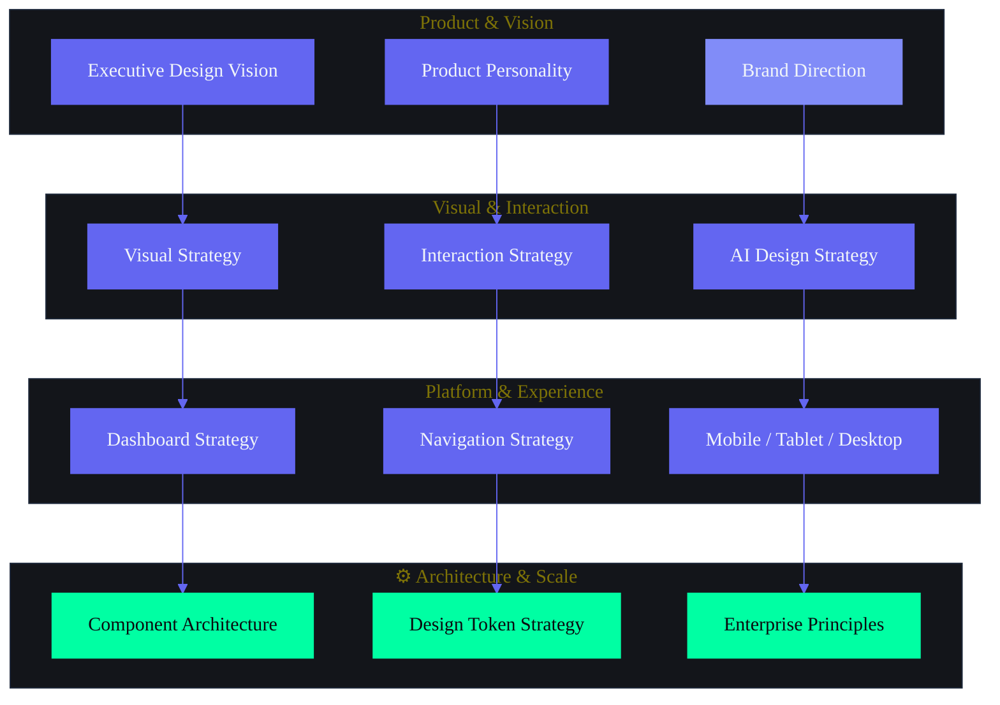

# Design Strategy — Second Brain OS (ARIA OS)

> **The strategic constitution for every design decision.**
> Authored by: Principal Product Designer, Creative Director, Enterprise UX Director, Design Systems Lead, Motion Design Director, AI Product Design Lead.
> This document is the foundation for Design.md, Antigravity, Stitch, Design System, Motion System, and Frontend Architecture.

---

## Document Control

| Field | Value |
|---|---|
| Document ID | SB-DESIGN-STRAT-001 |
| Version | 1.0.0 |
| Status | Active |
| Last Updated | 2026-06-11 |
| Classification | Internal — Design Leadership |
| Target Audience | Design Team, Engineering Team, Product Team, AI Agents |
| Supersedes | Scattered design direction in Branding.md, 08_UIUX.md, 09_Design.md, 10_DesignSystem.md |

---

## Table of Contents

1. [Executive Design Vision](#1-executive-design-vision)
2. [Product Personality](#2-product-personality)
3. [Brand Direction](#3-brand-direction)
4. [Visual Strategy](#4-visual-strategy)
5. [Interaction Strategy](#5-interaction-strategy)
6. [AI Design Strategy](#6-ai-design-strategy)
7. [Dashboard Design Strategy](#7-dashboard-design-strategy)
8. [Navigation Strategy](#8-navigation-strategy)
9. [Mobile Strategy](#9-mobile-strategy)
10. [Tablet Strategy](#10-tablet-strategy)
11. [Desktop Strategy](#11-desktop-strategy)
12. [Search Experience Strategy](#12-search-experience-strategy)
13. [Command Center Strategy](#13-command-center-strategy)
14. [Notification Strategy](#14-notification-strategy)
15. [Empty State Strategy](#15-empty-state-strategy)
16. [Loading State Strategy](#16-loading-state-strategy)
17. [Error State Strategy](#17-error-state-strategy)
18. [Motion Strategy](#18-motion-strategy)
19. [Dark Mode Strategy](#19-dark-mode-strategy)
20. [Theming Strategy](#20-theming-strategy)
21. [Accessibility Strategy](#21-accessibility-strategy)
22. [Enterprise Design Principles](#22-enterprise-design-principles)
23. [Scalability Principles](#23-scalability-principles)
24. [Future Expansion Principles](#24-future-expansion-principles)
25. [Innovation Opportunities](#25-innovation-opportunities)
26. [Design Risks](#26-design-risks)
27. [Design Recommendations](#27-design-recommendations)
28. [Design Token & Color System Strategy](#28-design-token--color-system-strategy)
29. [Typography Strategy](#29-typography-strategy)
30. [Iconography Strategy](#30-iconography-strategy)
31. [Component Architecture Strategy](#31-component-architecture-strategy)
32. [Form & Input Design Strategy](#32-form--input-design-strategy)
33. [Data Visualization Strategy](#33-data-visualization-strategy)
34. [Responsive Design Strategy](#34-responsive-design-strategy)
35. [Rendering & Performance Strategy](#35-rendering--performance-strategy)

---



---

## 1. Executive Design Vision

### 1.1 The Design Vision

**Second Brain OS is the world's first AI operating system for builders. Its design language makes intelligence feel ambient, power feel effortless, and complexity feel inevitable.**

We are not building a productivity tool. We are building a cognitive extension — a system that thinks alongside the user, anticipates before they ask, and fades into the background when not needed. The design must embody three truths:

1. **The user is brilliant.** Our job is to remove friction, not add features.
2. **Time is the only non-renewable resource.** Every millisecond of delay, every extra click, every moment of confusion is a tax on the user's life.
3. **AI is a material, not a feature.** Like glass, light, or motion — AI is something we design with, not something we add on.

### 1.2 Design Mission

**To make the complex feel simple and the intelligent feel natural.**

Not "simple" as in fewer features. Simple as in: the right thing happens without thinking. The system understands context. The user never has to explain themselves twice.

### 1.3 Strategic Design Principles

These are high-order principles that translate product strategy into design decisions. They override tactical concerns when in conflict.

#### P1: Glanceable Intelligence
Every screen must communicate its most important information within 5 seconds at 3 feet. If a user cannot understand the state of their system at a glance, the design has failed.

**Applies to:** Dashboard, Briefing, KPI strips, Notification previews, Widgets.
**Rejects:** Dense data dumps, walls of text, metrics without context.

#### P2: Forgiveness Over Guilt
The system never shames the user for absence, missed tasks, or broken streaks. Every interaction that could induce guilt must include a one-click path to resolution.

**Applies to:** Return-user flows, overdue tasks, missed habits, weekly reviews.
**Rejects:** "You missed 14 days" banners, red-number overload, streak-shaming.

#### P3: Context is King
Every action, every view, every notification must understand where the user came from, what they were doing, and what they need next. No interaction exists in isolation.

**Applies to:** Navigation, deep links, notifications, search results, undo actions.
**Rejects:** Detached detail pages, context-free notifications, generic error messages.

#### P4: Progressive Complexity
The system reveals depth only when the user signals readiness. First session: 3 actions. Month 1: 15 actions. Power user: 50+ actions. The same UI scales from novice to expert without switching modes.

**Applies to:** Onboarding, sidebar, command palette, settings, feature discovery.
**Rejects:** Beginner mode / expert mode toggle, feature gating behind paywalls, Easter-egg features.

#### P5: AI as Material, Not Magic
Every AI action is transparent, reversible, and learnable. The user should understand what the AI did, why it did it, and how to adjust it. AI augments judgment — it does not replace it.

**Applies to:** Briefing generation, task classification, opportunity matching, scheduling suggestions.
**Rejects:** Black-box decisions, unlabeled automation, irreversible AI actions.

#### P6: Speed is a Feature, Not a Metric
Every interaction should feel instantaneous. Under 100ms for feedback. Under 1s for data loads. Under 3s for AI responses (Claude) or under 10s (Ollama). When the system must be slow, it communicates why.

**Applies to:** All interactions, data loading, AI generation, sync operations.
**Rejects:** Spinners longer than 2s without explanation, blocking loading states, uncached repeated queries.

#### P7: One Codebase, Three Experiences
The same codebase delivers three distinct experiences — mobile (glance), tablet (lean-back), desktop (deep work). Each is optimized for its platform's strengths, not responsively squished.

**Applies to:** All page layouts, navigation, interaction patterns.
**Rejects:** Desktop-first-then-squish, mobile-only-then-stretch, platform-specific feature gaps.

### 1.4 Design Contracts

Every design decision must honor these contracts with the user:

| Contract | Promise | Design Implication |
|---|---|---|
| **The 60-Second Contract** | First meaningful action in under 60 seconds | Onboarding must end with a real task, not a tour |
| **The Glance Contract** | Critical information in 5 seconds | Dashboard zones must be scannable, not readable |
| **The Forgiveness Contract** | No guilt for absence | Return flow shows best first, then what's fixable |
| **The Transparency Contract** | Every AI action is explainable | AI actions have "Why" tooltip + undo path |
| **The Context Contract** | Never lose my place | Scroll position, filters, selection preserved across navigation |
| **The Speed Contract** | Feedback in 100ms, data in 1s, AI in 3s | Skeleton states, optimistic UI, progress communication |

### 1.5 Document Architecture

```
DesignStrategy.md (THIS FILE — Strategic Constitution)
  ├── Design.md (Design Architecture — patterns, specs, components)
  │   ├── Antigravity (Design System — tokens, atoms, molecules, organisms)
  │   │   └── Stitch (Component Library — implementation in code)
  │   ├── MotionSystem.md (Animation principles + implementation)
  │   └── FrontendArchitecture.md (Rendering, state, routing)
  └── (All module pages, layouts, and feature UI)
```

---

## 2. Product Personality

### 2.1 The Mentor Archetype

Second Brain OS is not a tool. It is not a friend. It is a **Mentor** — competent, demanding, encouraging, and always honest.

| Mentor Trait | Design Expression | Opposite (Rejected) |
|---|---|---|
| **Competent** | Always knows context, never asks for redundant info | Forgets between sessions, requires re-explanation |
| **Demanding** | Sets high expectations, nudges toward growth | Laissez-faire, doesn't care if user succeeds |
| **Encouraging** | Celebrates wins, frames setbacks as data | Guilt-tripping, "You failed" messaging |
| **Honest** | Accurate metrics, no fake streaks, real insights | Gamification, fake progress bars, vanity metrics |

### 2.2 Personality Framework

| Axis | Position | Rationale |
|---|---|---|
| **Warmth** | Warm but not saccharine | Students need encouragement, not a cheerleader |
| **Competence** | Very high | Must feel like the smartest system they've used |
| **Candor** | High | Direct about what's working and what isn't |
| **Boldness** | High | Confident design, strong opinions, decisive UX |

### 2.3 UI Personality Translation

How personality manifests in UI:

| Personality Trait | UI Translation |
|---|---|
| Competent | Automatic context restoration, predictive defaults, cross-module intelligence |
| Demanding | "You studied 45 min — 15 min short. Quick session?" (not "Good job trying!") |
| Encouraging | "+1 done! You're building momentum." (not confetti for everything) |
| Honest | "Week 3 completion: 42%. Let's discuss what's blocking you." |

### 2.4 Anti-Personalities

What the product is NOT:

| Anti-Personality | Why Rejected |
|---|---|
| **The Cheerleader** | Constant celebration devalues real achievement |
| **The Nag** | Guilt-inducing reminders cause churn |
| **The Genius** | Black-box AI that feels like magic erodes trust |
| **The Disorganized Genius** | Smart but forgetful — most AI tools today |
| **The Corporate Tool** | Sterile, formal, bureaucratic — Notion's problem |

---

## 3. Brand Direction

### 3.1 Brand Values

| Value | Meaning | Design Implication |
|---|---|---|
| **Radical Clarity** | Surface what matters, hide what doesn't | Aggressive content prioritization, "glanceability" as a metric |
| **Graceful Power** | Complex systems that feel simple | Progressive disclosure, keyboard shortcuts for power users |
| **Adaptive Intelligence** | Grows with the user, never static | AI learns preferences, adjusts density, anticipates needs |
| **Bold Individuality** | Cyberpunk aesthetic, not generic AI | Refined cyberpunk: neon accents, dark canvas, professional edge |
| **Trustworthy Foundations** | Privacy-first, local AI, transparent decisions | All AI actions explainable, data never leaves without permission |

### 3.2 Brand Positioning Statement

**For ambitious BTech CSE students who feel overwhelmed by tools, courses, and opportunities, Second Brain OS is the AI-powered operating system that turns fragmented student life into compounded, measurable growth. Unlike generic productivity tools or task managers, we combine local-first AI, cross-module intelligence, and a bold cyberpunk design language into a unified system that thinks alongside the user.**

### 3.3 Brand Attribute System

Every design decision must pass through this attribute filter:

| Attribute | Design Decision Filter |
|---|---|
| **Refined** | Does this feel polished or rushed? |
| **Bold** | Does this have an opinion or play it safe? |
| **Intelligent** | Does this understand context or treat every action as isolated? |
| **Fast** | Does this respect the user's time or waste it? |
| **Honest** | Does this communicate truth or obscure it? |
| **Human** | Does this feel like a person made it or a corp? |

### 3.4 Brand Voice (Design Context)

| Context | Voice | Example |
|---|---|---|
| Onboarding | Warm + guiding | "Let's set up your second brain in under a minute." |
| Briefing | Direct + anticipatory | "4 tasks today. 1 overdue. Your focus should be DBMS." |
| Weekly Review | Analytical + encouraging | "Your best day was Tuesday. Here's what worked." |
| Error | Transparent + actionable | "Couldn't save. Network issue. Retry saved as draft." |
| AI Suggestion | Curious + precise | "I noticed you study better before 4 PM. Want to reschedule?" |
| Empty State | Helpful + inviting | "Ready for your first task? Try 'Finish DBMS assignment.'" |

---

## 4. Visual Strategy

### 4.1 Visual Principles

#### VP1: Dark Canvas, Neon Intent
The background is an infinite dark canvas (#0A0B0F). Neon accents (#6366F1, #00FFA3) are used sparingly and deliberately — never more than 15% of any screen. Light emits from content, not from the background.

**Strategic reason:** Students work late at night. Dark mode reduces eye strain. Neon on dark creates the "self-illuminated" cyberpunk aesthetic where every piece of data glows with its own importance.

#### VP2: Information Radiates from Content
Content emits visual priority through color, size, and spacing. Nothing is emphasized without reason. The hierarchy is: actionable > informational > structural > decorative.

**Strategic reason:** In a system with 16 modules and hundreds of data points, the user should never wonder "what should I look at?" The design answers that question through explicit visual weight distribution.

#### VP3: Density Follows Function
The same component can appear at different densities depending on context. A task in a list is one line. A task on the dashboard is 3 lines with metadata. A task in focus mode is full detail. Density is a variable, not a constant.

**Strategic reason:** The same data serves glance, scan, and deep-work contexts. Rather than building three UIs, we build one component with three density modes.

#### VP4: Space is Communication
Whitespace communicates relationships. Related items group together (gap 4px). Different sections separate (gap 24px). Empty space is not wasted space — it is the pause between thoughts.

**Strategic reason:** In a data-dense system, spacing is the primary tool for chunking information. Users should understand module boundaries and content relationships without reading labels.

#### VP5: Consistency Across Time, Not Just Screens
A button looks the same on mobile and desktop. A card looks the same whether it contains a task, a course, or a habit. Components are invariant across context.

**Strategic reason:** Cognitive load drops when users can transfer learned patterns between modules. The task card and course card should feel like the same language, just speaking about different things.

### 4.2 Visual Hierarchy: The 4-Tier Attention System

| Tier | Label | Visual Treatment | Max Per Screen | Examples |
|---|---|---|---|---|
| **T1 — Primary** | The one thing | Largest size, accent color, highest contrast | 1-3 | Page title, hero metric, primary CTA |
| **T2 — Secondary** | Supporting actions | Medium weight, body color, standard spacing | 5-15 | Task items, KPI values, navigation items |
| **T3 — Tertiary** | Reference data | Small size, secondary text color, reduced spacing | 15-50 | Timestamps, tags, metadata, descriptions |
| **T4 — Ambient** | System state | Smallest size, tertiary text color, optional | Unlimited | Status indicators, version info, helper text |

**Design rule:** No screen may have more than 3 T1 elements. If everything is emphasized, nothing is.

### 4.3 Visual Density: The Glanceability Rule

| Context | Density | Max Items | Detail Level | Use Case |
|---|---|---|---|---|
| **Widget** | Micro | 1-3 | Label + value only | Home screen, notification |
| **Dashboard Zone** | Compact | 3-7 | Label + value + trend | Morning briefing, dashboard |
| **List View** | Normal | 10-25 | Full row with metadata | Task list, course list |
| **Detail View** | Expanded | 1 | Complete details | Task detail, course detail |
| **Analytics View** | Full | Unlimited | Charts + tables + filters | Analytics dashboard |

**The Glanceability Rule:** At Compact density or lower, a user must understand the state of the zone within 5 seconds. If they cannot, the density is too high.

### 4.4 Content Prioritization Matrix

When space is limited, content is prioritized in this order across all modules:

| Priority | Content Type | Rationale |
|---|---|---|
| 1 | Actionable items | Tasks to complete, habits to log, opportunities to apply |
| 2 | Critical state changes | Overdue items, approaching deadlines, broken streaks |
| 3 | Progress metrics | Completion rate, streak count, goal progress |
| 4 | AI insights | "Your best focus day is Tuesday" — synthesized intelligence |
| 5 | Reference data | Historical trends, comparative metrics |
| 6 | System status | Sync state, last updated, connection status |

**Design rule:** When a screen must truncate, truncate from priority 6 upward. Never truncate priority 1-3.

---

## 5. Interaction Strategy

### 5.1 Interaction Philosophy

**Every interaction answers three questions:**
1. **What happened?** (Feedback)
2. **Why did it happen?** (Context)
3. **What can I do now?** (Next action)

If an interaction does not answer all three, it is incomplete.

### 5.2 Interaction Principles

#### IP1: One Action Per Gesture
A click does one thing. A swipe does one thing. A keystroke does one thing. No hidden actions, no double-tap-to-confirm, no long-press surprises.

**Exception:** Destructive actions may require confirmation (delete, archive). But confirmation is a second action, not a hidden part of the first.

#### IP2: Feedback Within 100ms
Every user action must produce visible feedback within 100ms. Visual feedback (button press, state change) at 0ms. Haptic feedback (on mobile) within 50ms. Data response within 1s (or skeleton state).

**Rationale:** Research shows that feedback delays beyond 100ms break the perception of direct manipulation. The user should never wonder "did it work?"

#### IP3: Reversible by Default
Every non-trivial action has an undo path. Delete: 5-second undo window. Edit: auto-save with version history. AI action: "Undo" button visible for 10 seconds.

**Exception:** Irreversible actions (permanent data deletion, account closure) require explicit multi-step confirmation.

#### IP4: Context Preserving
Navigating away and back returns to exactly where the user was. Scroll position, active filters, selected item, search query — all preserved. The system never assumes "they'll find their way back."

**Implementation:** URL state for shareable context, session storage for ephemeral context, local storage for user preferences.

#### IP5: Progressive Commitment
Start with the minimum viable action. Task capture: type and save (2 fields). Edit: add more details (5 fields). Configure: full settings (20 fields). Never ask for what you don't need yet.

**Strategic reason:** The #1 barrier to user action is form length. Every additional field reduces completion rate by ~10%.

#### IP6: Keyboard-First Architecture
Every single action in the system must be reachable via keyboard. Not as an afterthought. Not as a "power user mode." Every action, every screen, every setting.

**Mobile exception:** On mobile, keyboard is not primary. But every action must be reachable via minimal taps.

### 5.3 Interaction Hierarchy

| Level | Type | Duration | Feedback | Examples |
|---|---|---|---|---|
| **L1 — Primary** | Task-completing | <2s | Immediate + state change | Complete task, save form, send message |
| **L2 — Secondary** | Enabling | <5s | Immediate + next state | Open modal, toggle filter, navigate |
| **L3 — Tertiary** | Informational | <1s | Subtle animation | Hover tooltip, scroll indicator, progress bar |
| **L4 — Ambient** | System | 0ms (passive) | None unless state changes | Background sync, data refresh, idle detection |

**Design rule:** L1 and L2 interactions must work offline. L3 and L4 may require network.

### 5.4 User Feedback System

The system has 4 feedback types. The decision tree determines which to use.

```
Action taken by user
  → Is it destructive? → Yes → Confirmation Dialog (L1)
  → Is it data-changing? → Yes → Toast (auto-dismiss 4s) + Undo
  → Is it a system event? → Yes → Notification (push or in-app)
  → Is it a background state? → Yes → Badge / Indicator
  → Otherwise → Inline Feedback (state change + optional tooltip)
```

#### Feedback Type Specifications

| Type | Trigger | Duration | Visual | Dismiss |
|---|---|---|---|---|
| **Confirmation Dialog** | Destructive action | Until dismissed | Modal with backdrop | Explicit button |
| **Toast** | Data change | 4s auto-dismiss | Slide-in from top-right (desktop) or bottom (mobile) | Auto + swipe |
| **Notification** | System event | Until acted on | Badge (in-app) + Push (external) | Tap to act |
| **Inline Feedback** | State change | Permanent until next action | Color change, icon change, text update | Next action |
| **Tooltip** | Hover/focus | 2s delay, persistent while hovering | Small overlay near element | Move cursor away |

### 5.5 Micro-Interaction Rules

| Rule | Specification |
|---|---|
| **Duration** | Feedback: 0-100ms. Animation: 150-300ms. Complex: 400ms max |
| **Easing** | `cubic-bezier(0.4, 0, 0.2, 1)` — decelerate, natural feel |
| **Haptic** | iOS: UIImpactFeedbackStyle(.light) on button press |
| **Sound** | Silent by default. Optional haptic feedback. No sounds in v1 |
| **Stagger** | List items: 50ms delay between each item. Max stagger: 500ms |
| **Reduced Motion** | All animations disabled when `prefers-reduced-motion` is set. Instant state transitions instead |

---

## 6. AI Design Strategy

### 6.1 AI Personality: The Brilliant Assistant

ARIA is not a chatbot. ARIA is not a search engine. ARIA is **The Brilliant Assistant** — competent, anticipatory, precise, and never condescending.

| Trait | Behavior | Design Expression |
|---|---|---|
| **Competent** | Knows context across sessions | Briefing references yesterday's completions |
| **Anticipatory** | Suggests before being asked | "I noticed you study better before 4 PM..." |
| **Precise** | Specific, not vague | "4 tasks today" not "You have some tasks" |
| **Never Condescending** | Treats user as intelligent | "Your focus was interrupted 3 times. Here's a pattern." |

### 6.2 AI Presence Model: Ghost + Invoke

ARIA operates on a **Ghost + Invoke** presence model:

| Mode | Visibility | When | Examples |
|---|---|---|---|
| **Ghost** | Invisible | 90% of time | Background scans, briefing generation, radar matching, memory consolidation |
| **Suggesting** | Subtle indicator | When high-confidence insight found | "2 new opportunities" badge, briefing insight card |
| **Summoned** | Full interface | User action (Cmd+K, Chat) | Command palette, chat panel, inline AI |
| **Explaining** | Explicit overlay | When user asks "Why?" or AI made a decision | "Why this priority?" tooltip, decision explanation |

**Ghost is the default.** The AI does not announce itself unless it has high-confidence value to add. It never interrupts for low-importance items.

### 6.3 AI Visibility Levels

| Level | Name | UI Treatment | Cognitive Load | Example |
|---|---|---|---|---|
| 0 | Invisible | No indication | 0/10 | Background opportunity scan |
| 1 | Ambient | Subtle badge or dot | 1/10 | "3 new tasks generated" badge |
| 2 | Suggesting | Inline card or tooltip | 2/10 | "Based on your sleep, I adjusted today's tasks" |
| 3 | Interacting | Chat panel or command bar | 3/10 | User types "What's due?" — ARIA responds |
| 4 | Explaining | Modal or detail view | 4/10 | "I prioritized this because of deadline + goal link" |

**Design rule:** AI should operate at Level 0-1 for 90% of interactions. Level 2-3 for 9%. Level 4 for 1%.

### 6.4 AI Intervention Rules

AI may intervene (act without being asked) when ALL conditions are met:

| Rule | Condition | Example |
|---|---|---|
| **Safety** | No data loss, no irreversible action | Auto-forgive stale tasks (reversible) |
| **Urgency** | User would benefit from immediate action | "Deadline is tomorrow — task moved to top" |
| **Certainty** | Confidence >90% | Task classification when user patterns are clear |
| **Reversibility** | User can undo with 1 click | Auto-scheduling, auto-categorization |
| **Transparency** | Intervention is explained | "I moved 3 tasks because..." tooltip |

**Never intervene when:**
- Confidence <70%
- Action is destructive or irreversible
- User is in a flow state (deep work mode, focus timer active)
- Action requires user context the AI doesn't have

### 6.5 AI Suggestion Rules

AI may suggest (recommend without acting) when:

| Condition | Threshold | UI Pattern |
|---|---|---|
| **Confidence** | 70-90% | Inline suggestion card with "Apply" / "Dismiss" |
| **Exploratory value** | Data-aware but not certain | "Consider moving this deadline — you have 5 tasks due that day" |
| **Timing** | Non-urgent, user is browsing | Suggestion in sidebar or briefing section |
| **Frequency** | Same suggestion max 1x per session | Never repeat unless user asks |

### 6.6 AI Recommendation Rules

AI may recommend (present options for consideration) when:

| Condition | Threshold | UI Pattern |
|---|---|---|
| **Data-backed** | Based on user's actual behavior | "Users with your profile applied to these 3 internships" |
| **Comparison-optional** | User can accept, modify, or ignore | 3 options ranked by match score |
| **Contextual** | Relevant to current module | On Courses page: "Students in your program also took..." |
| **Timing** | User is exploring, not executing | Recommendations in dedicated zone, never interrupt flow |

### 6.7 AI Feedback Rules

When AI communicates errors, uncertainty, or limitations:

| Situation | AI Behavior | UI Expression |
|---|---|---|
| **Error** | Transparent about what failed and why | "Couldn't generate briefing because Ollama is offline. Showing cached data." |
| **Uncertainty** | Expresses confidence level | "I'm 60% sure this task should have a Friday deadline. Want to adjust?" |
| **Limitation** | Honest about capability boundary | "I can't match opportunities without your skill profile filled in. Add skills?" |
| **Learning** | Acknowledges growing understanding | "I'm learning your study patterns — suggestions will improve over time." |
| **Conflict** | Surfaces disagreement with data | "You marked this as 'low priority' but it's linked to a goal deadline. Confirm?" |

---

## 7. Dashboard Design Strategy

### 7.1 Dashboard Philosophy

**The dashboard is the user's daily cockpit — not a metrics museum.**

Every element on the dashboard must earn its place by answering one question: "What should the user do right now?" If an element does not drive action, awareness, or insight, it does not belong.

### 7.2 Dashboard Priorities

| Priority | Zone | Content | Max Items |
|---|---|---|---|
| **P0** | Greeting + state | Personalized welcome, day's summary | 1-2 lines |
| **P1** | Today's focus | Top 3 prioritized tasks | 3 tasks |
| **P2** | Key metrics | 3-5 critical KPIs | 5 metrics |
| **P3** | Quick capture | "What do you need to do?" input | 1 input |
| **P4** | Progress snapshot | Course/habit/goal progress bars | 3-5 bars |
| **P5** | AI insights | 1 synthesized insight | 1 card |
| **P6** | Opportunities | Top 1-2 matches | 2 cards |
| **P7** | Recent activity | Last 5 actions logged | 5 items |

**Platform adaptation:** Mobile shows P0-P3. Tablet shows P0-P5. Desktop shows P0-P7.

### 7.3 Dashboard Density Rules

| Platform | Breakpoint | Zones Visible | Items Per Zone | Layout |
|---|---|---|---|---|
| Mobile | <768px | 3-4 | 1-3 | Single column, scroll |
| Tablet | 768-1024px | 5-6 | 3-5 | 2-column grid |
| Desktop | >1024px | 7-8 | 3-7 | 3-column bento grid |

### 7.4 Dashboard Insight Strategy

Insights are synthesized observations that turn data into action. They follow a strict format:

```
[Observation] + [Evidence] + [Suggestion]

Example:
"Your completion rate drops 40% on Tuesday (evidence from 6 weeks).
You tend to skip study sessions after 4 PM (pattern).
Try scheduling deep work before 2 PM on Tuesdays (suggestion)."
```

**Insight threshold:** An observation becomes an insight when:
- Change >20% from baseline
- Pattern persists for 3+ data points
- Statistical significance >95% (for analytics features)
- User hasn't seen this insight before

### 7.5 Dashboard Recommendation Strategy

Recommendations are surfaced directly on the dashboard only when:

| Condition | Example |
|---|---|
| High confidence + low effort | "One task to restart your streak" |
| Time-sensitive | "Deadline in 3 hours — consider prioritizing" |
| New capability discovered | "You logged 5 income entries — your monthly report is ready" |
| Re-engagement needed | "You haven't studied in 3 days — quick 15-min session?" |

**Rule:** Maximum 1 recommendation visible at a time. Multiple recommendations queue and appear sequentially after dismissal.

---

## 8. Navigation Strategy

### 8.1 Navigation Principles

#### NP1: F-Shaped for Familiarity, Z-Shaped for Scanning
The navigation follows F-shaped pattern for desktop (sidebar primary, top bar secondary) and Z-shaped for mobile (bottom tab bar). Users know where to look without thinking.

#### NP2: Three Clicks to Any Action
No action in the system should require more than 3 clicks, taps, or keystrokes from the user's current location. If an action requires 4+ navigations, it needs a shortcut.

#### NP3: Context Over Convention
The navigation adapts to what the user is doing. If the user is deep in course mode, the sidebar highlights course-related actions. If they're in focus mode, the sidebar collapses to minimal.

#### NP4: Progressive Scale
The navigation must scale from 5 modules (first week) to 16 modules (power user) to 50+ modules (future). The structure is hierarchical, not flat. Groups, not links.

### 8.2 Navigation Hierarchy

| Level | Component | Priority | Items | Platform |
|---|---|---|---|---|
| **L1 — Primary** | Sidebar / Bottom Tab | Always visible | 5-7 groups | All |
| **L2 — Secondary** | Navbar / Sub-tabs | Contextual | 3-5 tabs | Desktop, Tablet |
| **L3 — Tertiary** | Breadcrumbs | Deep pages | 2-4 levels | Desktop |
| **L4 — Quaternary** | In-page tabs | Module-specific | 2-5 tabs | All |
| **L5 — Utility** | Cmd+K Palette | On demand | Unlimited | Desktop |

### 8.3 Navigation Simplicity Rules

| Rule | Description | Example |
|---|---|---|
| **7±2 Groups** | Never more than 7 navigation groups in primary nav | Dashboard, Tasks, Learn, Build, Earn, Analyze, Settings |
| **Collapsible Groups** | Groups expand/collapse to show detail on demand | Learn → Courses, Habits, Sleep |
| **Active Module Highlight** | Current module is visually distinct | Accent-colored icon, slightly larger text |
| **Search as Safety Net** | If user can't find it by browsing, they can search | Cmd+K searches all modules and actions |
| **No Dead Ends** | Every page has a clear way back or forward | Breadcrumbs + contextual "next action" |

### 8.4 Navigation Scaling Rules

| Scale | Modules | Navigation Solution |
|---|---|---|
| **Small** (week 1) | 5 | Full sidebar, all visible |
| **Medium** (month 1) | 10 | Sidebar with groups, 2 modules per group |
| **Large** (power user) | 16 | Sidebar with 7 groups, collapsible sections |
| **Future** (expansion) | 50+ | Sidebar groups + favorite pinning + search-first navigation |

**Scaling rule:** At any scale, the user's 3 most-used modules are always 1 click away. The system learns these from usage patterns and pins them to the top of the sidebar.

---

## 9. Mobile Strategy

### 9.1 Mobile Philosophy

**Mobile is for capture, check, and quick actions. Not for deep work.**

The mobile experience is designed for 30-second to 3-minute sessions. It acknowledges that mobile users are on-the-go, distracted, and have one hand available.

### 9.2 Mobile-First Actions

| Action | Implementation | Priority |
|---|---|---|
| Quick capture | Widget + share sheet + voice | P0 |
| Briefing review | Notification → 3-item summary | P0 |
| Task complete | Tap → checkbox → done | P0 |
| Habit log | Widget → one tap per habit | P0 |
| Sleep log | Notification → one-tap | P0 |
| View opportunities | Notification → scroll top 3 | P1 |
| Course progress | 1-tap from dashboard | P1 |

### 9.3 Mobile Design Rules

| Rule | Specification |
|---|---|
| **Thumb zone** | All interactive elements within 44px of thumb natural position (bottom 60% of screen) |
| **Touch targets** | Minimum 44x44px, 8px spacing between targets |
| **Bottom navigation** | 5 tabs max, bottom tab bar 64px height |
| **One column** | No multi-column layouts on mobile |
| **Gesture priority** | Swipe to complete > Tap to edit > Long press for menu |
| **Offline writes** | All saves cached locally, sync on reconnect |
| **Notifications** | Full notification support with deep links to exact context |
| **Widgets** | 3 widget sizes: small (2x2 — 1 metric), medium (4x2 — briefing summary), large (4x4 — full quick actions) |
| **Share sheet** | "Save to ARIA" from any app (browser, notes, social media) |

### 9.4 Mobile Content Prioritization

Mobile screens show 40% of the content that desktop shows. The missing 60% is either behind a "Show more" link or available only on desktop.

| Screen | Mobile Content | Desktop Content |
|---|---|---|
| Dashboard | 3 zones, 1-3 items each | 8 zones, 3-7 items each |
| Task list | Today + Overdue (compact) | All views + filters + calendar |
| Course list | Active courses only | All courses + completed + archived |
| Analytics | 3 top metrics | Full charts + correlations |

---

## 10. Tablet Strategy

### 10.1 Tablet Philosophy

**Tablet is for review, learn, and browse — not for capture or deep configuration.**

The tablet experience bridges mobile and desktop. It is optimized for 5-15 minute sessions where the user is comfortable (couch, bed, cafe) but doesn't want a full laptop.

### 10.2 Tablet-Optimized Actions

| Action | Implementation | Priority |
|---|---|---|
| Weekly review | Full detail with charts | P0 |
| Course browsing | Side-by-side course + tasks | P0 |
| Analytics review | Dashboard with full charts | P0 |
| Content capture | Split view: browser + ARIA | P1 |
| Long-form planning | Roadmap editing with Pencil | P1 |
| Briefing review | Full briefing (not mobile-truncated) | P1 |

### 10.3 Tablet Design Rules

| Rule | Specification |
|---|---|
| **Landscape-first** | Primary orientation, multi-column by default |
| **Split View support** | ARIA on left (30%), content on right (70%) |
| **Pencil support** | Handwriting → AI transcription, roadmap markup |
| **Hover states** | iPadOS pointer support for desktop-like precision |
| **Drag and drop** | Drag content from browser → ARIA resources |
| **2-column grid** | Default layout, 50/50 or 60/40 split |
| **Sidebar persistent** | Sidebar visible but collapsible (240px default) |
| **Keyboard optional** | Touch-first, keyboard enhanced (Magic Keyboard) |

### 10.4 Tablet Content Density

Tablet shows 70% of desktop content. The missing 30% is advanced features and configuration.

| Screen | Tablet Content | Desktop Comparison |
|---|---|---|
| Dashboard | 6 zones, 3-5 items each | 8 zones |
| Task list | Today + Week + Filtered | + Calendar + Kanban |
| Course list | Active + Browse | + Completed + Analytics |
| Analytics | Top metrics + 1 chart | Full multi-chart dashboard |

---

## 11. Desktop Strategy

### 11.1 Desktop Philosophy

**Desktop is for creation, organization, analysis, and deep work.**

The desktop experience is designed for 15-60 minute sessions with a large screen, full keyboard, mouse/trackpad, and stable network. It is the primary authoring environment for the system.

### 11.2 Desktop-Power Actions

| Action | Implementation | Priority |
|---|---|---|
| Deep work session | Full-screen timer + ambient mode | P0 |
| Roadmap creation | Drag-drop timeline, milestone editing | P0 |
| Analytics deep-dive | Full charts, date ranges, export | P0 |
| System configuration | Settings, custom views, shortcuts | P0 |
| Batch operations | Multi-select, bulk actions | P0 |
| Custom workflow builder | Automation rules engine | P1 |
| Data export | CSV, PDF, Markdown | P1 |

### 11.3 Desktop Design Rules

| Rule | Specification |
|---|---|
| **Keyboard shortcuts** | Every action has a shortcut (R+t = new task, Cmd+K = command palette) |
| **Multi-select** | Shift+click, Cmd+click, Select All |
| **Drag and drop** | Reorder tasks, move between modules, attach files |
| **Sidebar full** | 7 navigation groups, collapsible sections, pinned favorites |
| **Split panes** | Roadmap + task list + goal progress simultaneously |
| **Infinite scroll** | Virtual scrolling, no pagination |
| **Export** | CSV, PDF, Markdown from every data view |
| **Multi-monitor** | Dashboard on one screen, task list on another |

### 11.4 Power User Features (Desktop Exclusive)

| Feature | Strategic Rationale |
|---|---|
| **Custom CSS injection** | Power users can tweak the UI to their exact preferences |
| **REST API access** | Integrate with personal scripts and automation |
| **CLI tool** | `aria task "Fix login bug"` — terminal-native capture |
| **Custom keyboard rebinding** | Remap any action to any key combination |
| **Automation rules engine** | "If task from X project is completed, move to Y column" |
| **Multi-profile support** | Separate student / freelancer / founder contexts |

---

## 12. Search Experience Strategy

### 12.1 Search Philosophy

**Search is the safety net for navigation — not the primary way to find things.**

Users should navigate through sidebar and links. Search exists for: (a) cross-module discovery, (b) recall failure ("I know it's here somewhere"), and (c) command execution. If search usage exceeds 30% of navigations, navigation is failing.

### 12.2 Search Scope Architecture

| Scope | Inclusions | Exclusions |
|---|---|---|
| **Global search** (default) | All modules: tasks, courses, habits, ideas, resources, opportunities, goals, projects, settings, chat history, commands | User profile, system logs, deleted items |
| **Module-scoped search** | Current module only | Other modules |
| **Command search** (Cmd+K) | All commands + all data | — |

**Rule:** Global search is the default. Module-scoped search is triggered by prefixing with `@module-name` (e.g., `@tasks dbms`).

### 12.3 Search Principles

| Principle | Specification |
|---|---|
| **Universal scope** | All 16 modules + commands + chat history searched simultaneously |
| **Fuzzy matching** | Levenshtein distance ≤2 for typos. Substring matching. Abbreviation expansion ("faang" → "FAANG internship") |
| **Contextual ranking** | Score = relevance × recency × module affinity. Active module results get 2x weight |
| **Actionable results** | Every result is a clickable deep-link to the item in context. No detached read-only views |
| **Search as command** | "new task", "complete habit", "open courses" execute the action, not search for it |
| **Zero-state learning** | Empty query shows recent items + frequent actions. Helps users discover search capability |

### 12.4 Search Ranking Algorithm

```
Final Score = (TextRelevance × 0.4) + (Recency × 0.2) + (ModuleAffinity × 0.2) + (ActionIntent × 0.2)

TextRelevance = BM25 score against title, description, tags
Recency = Days since last access (0-30: 1.0, 31-90: 0.5, 90+: 0.2)
ModuleAffinity = 1.0 for current module, 0.5 for related modules, 0.2 for unrelated
ActionIntent = 2.0 if query matches a command name, 1.0 otherwise
```

**Minimum score threshold:** Results below 0.15 are not shown.

### 12.5 Search Result Hierarchy

| Rank | Result Type | Visual | Max Visible |
|---|---|---|---|
| 1 | Direct command match | "New Task →" with execute button | 3 |
| 2 | Current module matches | Full row with module icon + highlight | 5 |
| 3 | Other module matches | Standard row with module label | 5 |
| 4 | Recent items (accessed <30 days) | Row with date badge | 5 |
| 5 | Historical matches | Row with lower opacity + date | 5 |
| 6 | AI-suggested related | "Did you mean..." with preview | 2 |

### 12.6 Search States

| State | Behavior | UI | Duration |
|---|---|---|---|
| **Idle** | Placeholder text + hint | "Search tasks, courses, commands..." (focused cursor) | Until user types |
| **Typing** | Real-time filtering, 150ms debounce | Results update as user types | Until user stops |
| **Loading** | First search after app load | Brief skeleton (3 rows) | 300ms max |
| **Results** | Ranked list with categories | Category headers, ranked items | Until dismissed |
| **No results** | Suggest creation | "Create task: [query]" button | Until dismissed |
| **Dismissed** | Return focus to previous element | Animation closes, restores state | 200ms |

### 12.7 Search Design Rules

| Rule | Specification |
|---|---|
| **Trigger** | Cmd+K (anywhere), / (in any text field to search data), click search icon |
| **Debounce** | 150ms after user stops typing |
| **Min query length** | 2 characters minimum before search executes |
| **Max results** | 25 total, grouped by category with "Show all" links |
| **Escape** | Clears query (first press), dismisses (second press) |
| **Keyboard nav** | Up/down arrows, Enter to select, Cmd+Enter to open in new tab |
| **Empty state** | Show 5 recent items + 3 suggested commands + "Try searching for..." examples |

---

## 13. Command Center Strategy

### 13.1 Command Center Philosophy

**Cmd+K is the universal action layer. It is faster than navigation for 80% of tasks.**

The command palette is not a search bar. It is an action launcher. Every command in the system — create, navigate, complete, configure, ask — is accessible from Cmd+K. Commands are organized by action type, not by module.

### 13.2 Command Coverage Rule

| Rule | Implication |
|---|---|
| **Every action has a command** | If a user can click it, they can Cmd+K it. No orphan actions |
| **Commands are discovered, not taught** | Usage frequency drives order. Recent commands appear first |
| **Commands have keyboard shortcuts** | Most-used commands show their keyboard shortcut (e.g., "New Task [T]") |

### 13.3 Command Taxonomy

| Category | Purpose | Examples | Icon | Keyboard Precedence |
|---|---|---|---|---|
| **Create** | Generate new items | New Task, New Course, New Habit, New Idea | + (green) | High |
| **Navigate** | Move between screens | Go to Tasks, Go to Dashboard, Open Course | → (blue) | Medium |
| **Complete** | Execute actions | Complete Task, Log Habit, Log Sleep | ✓ (checkmark) | Highest |
| **Configure** | Modify settings | Settings, Customize Dashboard, Manage Profile | ⚙ (gear) | Low |
| **Ask AI** | Natural language queries | "What's due?", "How did I sleep?", "Plan my week" | ✦ (AI icon) | Medium |

### 13.4 Command Discovery System

| Discovery Method | Trigger | UX Pattern | Learning Objective |
|---|---|---|---|
| **Typing** | User types partial name | Fuzzy match + autocomplete | User learns names organically |
| **Recent** | Open palette | 5 most recent commands shown first | Reinforces memory of used commands |
| **Contextual** | Module-specific | Top 3 commands for current module promoted | User learns module-specific actions |
| **Tutorial** | First 3 sessions | "Press Cmd+K to create a task" inline tip | Establishes the palette habit |
| **Keyboard hint** | Hover on any UI action | Tooltip shows Cmd+K command name | Maps visual actions to commands |
| **Empty state** | No results found | Shows available category commands | Prevents frustration |

### 13.5 Command Palette Design Specifications

| Property | Desktop | Tablet | Mobile |
|---|---|---|---|
| **Trigger** | Cmd+K | Cmd+K | Long-press home or swipe from bottom |
| **Position** | Centered modal | Centered modal | Bottom sheet |
| **Width** | 560px | 480px | 100% |
| **Max height** | 60vh | 70vh | 80vh |
| **Backdrop** | blur(24px), rgba(0,0,0,0.6) | Same | blur(12px), rgba(0,0,0,0.5) |
| **Animation** | Scale 0.95→1 + fade 0→1 (200ms) | Same | Slide up + fade (300ms) |
| **Dismiss** | Escape, click outside | Same | Swipe down, Escape with keyboard |

### 13.6 Command Context Rules

| Signal | Adapts | Example |
|---|---|---|
| **Active module** | Related commands promoted | On Tasks: "Complete Task" ranked before "New Course" |
| **Time of day** | Time-appropriate commands suggested | Evening: "Log Sleep" promoted. Morning: "View Briefing" |
| **Usage frequency** | Most-used commands rise in ranking | User who creates tasks daily: "New Task" always in top 3 |
| **Recency** | Recently used commands persist | "New Course" (used 2 min ago) still in recent section |

---

## 14. Notification Strategy

### 14.1 Notification Philosophy

**Notifications should feel like a helpful tap on the shoulder, not an alarm clock.**

The system sends fewer notifications than the user expects. Every notification passes through a strict relevance filter: "Would the user be glad they saw this, or annoyed?" If the answer is "annoyed" or "neutral", it does not send.

### 14.2 Delivery Channel Decision Tree

```
Trigger occurs
  → Is user in focus mode? → Yes → Defer all non-critical
  → Is it between 10 PM and 7 AM? → Yes → Defer all to 7 AM
  → User preference: push enabled? → No → In-app only
  → Criticality level:
      P0 Critical → Push + in-app + email (if enabled)
      P1 Important → Push + in-app
      P2 Informational → In-app only (digest)
      P3 Background → Badge only
  → Deduplication check: same content sent in last 24h? → Yes → Suppress
  → Rate check: max 5 push/day reached? → Yes → Downgrade to in-app
  → Send
```

### 14.3 Notification Criticality Levels

| Level | Name | Delivery | Max/Day | Color | Sound | Examples |
|---|---|---|---|---|---|---|
| **P0 — Critical** | Immediate attention | Push + in-app | 1/day | Red badge | Optional short | Deadline <1 hour, application deadline today |
| **P1 — Important** | Same-day value | Push + in-app | 3/day | Indigo badge | Silent | Briefing ready, weekly review ready, opportunity >90% match |
| **P2 — Informational** | Digest only | In-app only | 1/session | Gray badge | Silent | "3 tasks overdue", "habit streak ended", "new feature" |
| **P3 — Background** | Passive awareness | Badge/indicator | Unlimited | Subtle dot | Silent | System update, sync complete, feature tip |

### 14.4 Notification Design Specifications

| Property | Push Notification | In-App Toast | In-App Badge |
|---|---|---|---|
| **Title** | Max 50 chars | Max 80 chars | N/A (count only) |
| **Body** | Max 100 chars | Max 120 chars | N/A |
| **Icon** | App icon + small module indicator | Module icon | Module icon |
| **Action** | Deep link to exact context | Tap to navigate, swipe to dismiss | Tap to open module |
| **Duration** | Until dismissed | 4s auto-dismiss + swipeable | Until read |
| **Max visible** | Notification center | 1 at a time (queue) | 99+ max |

### 14.5 Anti-Notification Rules

| Rule | Rationale | Override |
|---|---|---|
| **Never notify for completed actions** | "You completed a task" is status, not news | User can opt-in to completion celebrations |
| **Never notify at night** (10 PM — 7 AM) | Sleep hygiene. Briefing handles next morning | P0 only (deadline in <1 hour) |
| **Never notify for the same thing twice** | Deduplication by content hash | New matching opportunities are distinct |
| **Never notify during focus mode** | Deep work is sacred. All non-critical deferred | P0 bypasses (user can configure) |
| **Never send empty prompts** | "Check your dashboard" is noise | Notification must contain specific value |
| **Rate limit: max 5 push/day** | Prevents notification fatigue and app deletion | In-app digests have no limit |
| **Never notify for what user already saw** | Session-scoped deduplication | Cross-device sync tracking |

### 14.6 Notification Templates

| Template | Criticality | Title | Body | Deep Link |
|---|---|---|---|---|
| Briefing ready | P1 | "Your briefing is ready" | "4 tasks today. Top: Submit DBMS assignment." | /dashboard?mode=briefing |
| Weekly review | P1 | "Weekly review ready" | "72% completion — your best week yet!" | /weekly-review?week=current |
| Opportunity match | P1 | "New opportunity found" | "FAANG internship — 85% skill match" | /opportunities?id=xxx |
| Task due soon | P0 | "Task due in 30 min" | "Submit DBMS assignment — due today at 5 PM" | /tasks?id=xxx |
| Task overdue | P1 | "Task overdue" | "DBMS assignment was due yesterday" | /tasks?filter=overdue |
| Habit reminder | P2 | "Habit check" | "Haven't logged exercise in 3 days" | /habits |
| Sleep wind-down | P2 | "Time to wind down" | "9:30 PM — log sleep for tomorrow's briefing" | /sleep |
| Opportunity reminder | P2 | "Application deadline approaching" | "Google internship closes in 3 days" | /opportunities?id=xxx |
| Streak milestone | P2 | "7-day study streak!" | "Consistent. Keep it going." | /habits |
| Weekly summary | P2 | "Your week in review" | "18/25 tasks. Best day: Tuesday." | /weekly-review |

### 14.7 Notification Settings Strategy

| Setting | Default | User Control |
|---|---|---|
| Push notifications | On | Toggle on/off per category |
| Quiet hours start | 10 PM | Configurable |
| Quiet hours end | 7 AM | Configurable |
| Focus mode auto-silence | On | Toggle on/off |
| Email digest | Weekly (Sunday) | Daily / Weekly / Off |
| Badge count | On | Toggle on/off |
| Sound | Silent | On / Silent / Off |
| Max push/day | 5 | 1 / 3 / 5 / 10 / Unlimited |

---

## 15. Empty State Strategy

### 15.1 Empty State Philosophy

**Emptiness is a design opportunity, not a vacuum.**

An empty state is not "nothing to show." It is: (a) an invitation to start, (b) a guide for how to begin, (c) a preview of the value that's coming, and (d) a reassurance that the system will work once populated. Every empty state must pass the "Four Questions Test."

### 15.2 The Four Questions Test

| Question | Answer Requirement | Example |
|---|---|---|
| **"What should I put here?"** | Specific example of content | "Try 'Finish DBMS assignment'" |
| **"How do I add something?"** | Clear, one-click CTA | "Create your first task" button |
| **"What happens after I add it?"** | Preview of system value | "You'll see your completion rate here" |
| **"Why should I care?"** | Benefit statement | "Track what matters and see your progress" |

### 15.3 Empty State Anatomy

```
+--------------------------------------------------+
| [Illustration — 120x120px, centered]              |
|                                                   |
| # Headline — 24px, bold (question or invitation)  |
|                                                   |
| Description — 14px, secondary text (2-3 lines)    |
| Answers "why should I care?"                      |
|                                                   |
| [Primary CTA button]  [Secondary link (skip)]     |
|                                                   |
| Example: "Try 'Finish DBMS assignment'" (italic)  |
+--------------------------------------------------+
```

### 15.4 Empty State Templates Registry

| Module | Illustration Theme | Headline | Description | CTA | Secondary |
|---|---|---|---|---|---|
| Dashboard | Empty desk with single paper | "Your dashboard is ready for you" | "Complete your first task to see your metrics come to life." | "Create your first task" | "Take a tour" |
| Tasks | Blank notebook + pen | "Ready for your first task?" | "Type what you need to do — ARIA will classify and prioritize it." | "Create a task" | "Try an example" |
| Courses | Stack of books (empty) | "What are you studying right now?" | "Add your current course and get a personalized weekly study plan." | "Add a course" | "Browse suggestions" |
| Habits | Empty calendar with dot markers | "Build your first habit" | "Start small: 30 minutes of study, exercise, or reading. Track it daily." | "Create a habit" | "See templates" |
| Goals | Empty roadmap | "What do you want to achieve?" | "Set a goal — career, skill, health — and AI will break it into milestones." | "Set a goal" | "Use a template" |
| Sleep | Empty bed with moon | "Log your first night of sleep" | "See how your sleep affects your productivity, focus, and task completion." | "Log tonight's sleep" | "Set a reminder" |
| Income | Empty wallet | "Your first rupee earned" | "Track freelance, internship, or part-time income. See your hourly rate grow." | "Add income entry" | "Connect bank" |
| Ideas | Lightbulb with spark | "Your best ideas start here" | "Capture every idea — no matter how rough. The good ones become projects." | "Capture an idea" | "See examples" |
| Resources | Empty bookshelf | "Save your first resource" | "Save links, notes, and files. ARIA will tag and organize them automatically." | "Save a resource" | "Browser extension" |
| Opportunities | Empty radar screen | "Let's find opportunities for you" | "Complete your skill profile and ARIA will match you with jobs, internships, and projects." | "Complete profile" | "See how it works" |
| Projects | Empty workshop | "Build something great" | "Turn your ideas into projects with phases, milestones, and auto-generated tasks." | "Start a project" | "Convert an idea" |
| Time | Empty timeline | "Start tracking your time" | "See where your time goes. Track deep work, study sessions, and find your peak hours." | "Start a timer" | "Log manually" |

### 15.5 Empty State Design Rules

| Rule | Specification |
|---|---|
| **Illustration style** | Flat vector, 2-tone + 1 accent color, no human faces, geometric foundations |
| **Animation** | Subtle float or fade-in (300ms) on first render. No loop |
| **CTA priority** | Primary CTA is always the most direct path to populate the state |
| **Skip option** | Every empty state has a "Skip" or "Later" link (tertiary style) |
| **Data seeding** | When possible, pre-seed with templates or suggestions from onboarding |
| **Context awareness** | Empty state adapts to user type if known (Student → course examples, Freelancer → income examples) |
| **Dismiss** | Empty state dismisses permanently once data exists. No return |

---

## 16. Loading State Strategy

### 16.1 Loading Philosophy

**Loading states should communicate progress, not hide it.**

Users tolerate waiting when they understand why and know how long. Loading states are communication tools, not placeholders. The system has four loading strategies, selected by context.

### 16.2 Loading Strategy Selection

```
Expected duration?
  → <100ms: Nothing. Instant transition. No loading state needed.
  → 100ms-500ms: Skeleton. Show layout placeholder. No text.
  → 500ms-2s: Skeleton + message. Show expected content shape + brief text.
  → 2s-5s: Skeleton + progress. Add progress indicator + ETA if known.
  → >5s: Progress + cancel. Show determinate progress bar + cancel option.
```

### 16.3 Loading Strategy Specifications

| Strategy | Duration | Visual | Text | Animation | Cancel |
|---|---|---|---|---|---|
| **Instant** | <100ms | Nothing | None | None | N/A |
| **Skeleton** | 100ms-500ms | Gray pulsing shapes matching content layout | None | Pulse 1.5s loop | N/A |
| **Skeleton + message** | 500ms-2s | Skeleton shapes + text line | "Loading your tasks..." | Fade in message after 500ms | N/A |
| **Progress** | 2s-5s | Determinate bar + skeleton | "Loading... 60%" | Progress fill animation | Cancel button |
| **Fallback** | >5s | Full state with retry | "Taking longer than expected" | Subtle indicator | Retry + Cancel |

### 16.4 Loading Pattern Registry

| Context | Strategy | Implementation Detail | Duration Target |
|---|---|---|---|
| Page navigation | Skeleton | Full-page skeleton matching page layout (header + toolbar + content rows) | 300ms |
| Data list fetch | Skeleton rows | 5 rows of pulsing rectangles. Row height matches expected content | 200ms |
| Data detail fetch | Skeleton card | Single card skeleton with title area + body lines | 200ms |
| AI generation | Skeleton + progress steps | "ARIA is analyzing..." → "Finding opportunities..." stage indicator | 2-3s (Claude) / 5-10s (Ollama) |
| Image load | Blur-up | 20px blurred placeholder → crossfade to full image | 500ms-2s |
| File upload | Determinate progress | Percentage bar + speed + ETA. Pause/resume support | Variable |
| Sync operation | Background badge | Small badge: "Syncing..." → "Saved" with checkmark | 500ms-5s |
| Search | Inline skeleton | 3 brief skeleton lines within search results area | 300ms max |
| Export/Download | Modal progress | Centered modal with progress bar + filename | Variable |

### 16.5 Skeleton Design Specifications

| Property | Value |
|---|---|
| **Base color** | `bg-elevated` (#1A1D24) |
| **Highlight color** | `bg-elevated + 10% brightness` |
| **Border radius** | Same as the content it represents (card: 12px, text line: 4px, avatar: 50%) |
| **Animation** | Pulse: opacity 1 → 0.6 → 1, 1.5s ease-in-out infinite |
| **Reduced motion** | Static gradient instead of pulse animation |
| **Fade out** | Content fades in over 200ms when loaded. Skeleton fades out simultaneously |

### 16.6 Optimistic UI Rules

| Action Type | Optimistic Behavior | Revert on Error |
|---|---|---|
| **Create** | Show item immediately in UI. Assign temporary ID. Sync in background | Remove item. Show error toast. Offer retry |
| **Update** | Apply change immediately. Updated state shown. Sync in background | Revert to previous state. Show error toast. Offer retry |
| **Delete** | Never optimistic. Show spinner on item. Confirm server response before removing | If error: restore item, show error toast |
| **AI action** | Show AI-generated content immediately in a "draft" state (with visual distinction) | If error: show fallback + "ARIA couldn't complete this" |
| **Reorder** | Apply new order immediately. Sync in background | Revert to previous order. Silent retry |

---

## 17. Error State Strategy

### 17.1 Error Philosophy

**The best error message is the one the user never sees.**

Error prevention > Error detection > Error recovery > Error messaging. The design should make errors impossible before it tries to make them recoverable.

### 17.2 Error Prevention Architecture

| Level | Strategy | Design Pattern | Validation Rule |
|---|---|---|---|
| **1 — Prevent** | Make errors impossible | Autocomplete, input constraints, format enforcement, disabled states | Every input has a max length, format constraint, and type restriction |
| **2 — Detect** | Catch before submission | Inline validation on blur, debounced async validation | Validate on blur + debounced async (500ms). Never validate on every keystroke |
| **3 — Recover** | One-click resolution | Undo (5s window), retry (3 attempts auto), revert to previous state | Every destructive action has undo. Every failed action has retry |
| **4 — Explain** | What happened, why, what now | Error message with tone-appropriate language + action | Every error includes cause + resolution + optional technical detail |

### 17.3 Error Tone Matrix

| Error Category | Tone | Voice Characteristic | Example |
|---|---|---|---|
| **Network** | Informative + actionable | Neutral, confident | "Couldn't save. Network issue. Saved as draft — will sync when connected." |
| **Validation** | Helpful + specific | Precise, instructive | "Deadlines can't be in the past. Did you mean next week?" |
| **Permission** | Clear + solution-oriented | Direct, empowering | "Opportunity matching needs your skill profile. Complete it in Settings." |
| **System** | Transparent + accountable | Honest, composed | "Something went wrong. We've been notified. Error ID: XY-123." |
| **AI failure** | Honest + fallback provided | Candid, helpful | "ARIA couldn't generate insights. Here's your raw data instead. [Retry]" |
| **Timeout** | Patient + option-rich | Calm, accommodating | "This is taking longer than expected. [Wait] [Cancel] [Try offline version]" |

### 17.4 Error State Design Rules

| Rule | Specification | Exception |
|---|---|---|
| **No raw error codes in UI** | Error IDs in expandable "Details" section only | Developer settings show full stack traces |
| **No technical jargon** | "Couldn't connect" not "HTTP 500: Internal Server Error" | Never |
| **Every error has an action** | Retry, cancel, go back, or dismiss — never a dead end | Trivial info toasts (auto-dismiss) |
| **Errors are calm** | No red flashing, no alarming language. Neutral tone | P0 system errors may use accent-danger color |
| **Least disruptive feedback** | Inline > Tooltip > Toast > Banner > Modal — choose the minimum that fits severity | Choose by: blocks action? yes → modal. Recoverable? yes → toast. Preventable? yes → inline |
| **Auto-recovery attempt** | Retry failed network requests 3x with exponential backoff (1s, 2s, 4s) | AI timeouts retry 1x then fallback |
| **Session persistence** | On error, save form state to session storage. User doesn't retype | Clear on successful submit |

### 17.5 Error Message Template

```
[Icon: category-appropriate]
[Title: What happened] — 16px, bold, tone-appropriate color
[Body: Why it happened] — 14px, secondary text, 1-2 sentences
[Body: What was done to recover] — 14px, secondary text, optional
[Action: Primary button] — Retry / Go Back / Dismiss
[Action: Secondary link] — Details / Contact Support / Try Offline Version
```

### 17.6 Error Recovery Action Matrix

| Error | Primary Action | Secondary Action | Tertiary Action |
|---|---|---|---|
| Network timeout | Retry (with countdown) | Save as draft | Work offline |
| Validation failed | Fix highlighted fields | Clear form | Cancel |
| AI generation failed | Retry with shorter prompt | Use cached version | Skip |
| Save conflict | Show diff + pick version | Keep both versions | Discard changes |
| Permission denied | Go to Settings | Learn more | Cancel |
| Rate limited (429) | Wait (shows countdown) | Upgrade (if applicable) | Dismiss |
| Server error (500) | Retry | Save as draft | Contact support |

---

## 18. Motion Strategy

### 18.1 Motion Philosophy

**Motion communicates meaning, not spectacle.**

Every animation must serve a purpose: orienting the user, showing relationships, providing feedback, or guiding attention. If an animation cannot answer "what does this communicate?" it should not exist.

### 18.2 Motion Principles

#### MP1: Purpose-Driven
Every animation has a function. Decorative animation is not permitted.

| Purpose | Example |
|---|---|
| **Orient** | Page transitions show where you came from and where you are |
| **Relate** | List items animate in staggered, showing they're a group |
| **Feedback** | Button press animates to confirm the action registered |
| **Guide** | Focus shifts animatedly to draw attention to the next action |

#### MP2: Fast & Responsive
Animations complete in 150-300ms. 60fps at all times. No user should ever wait for an animation to finish before interacting.

| Context | Duration |
|---|---|
| Micro-interaction (button, toggle) | 150ms |
| List/item animation (stagger) | 200ms per item |
| Page transition | 300ms |
| Modal enter/exit | 250ms |
| Notification slide | 300ms |
| Complex transition | 400ms max |

#### MP3: Natural & Polished
Easing curves follow natural physics. No linear animations — they feel robotic. Use `cubic-bezier(0.4, 0, 0.2, 1)` for deceleration and `cubic-bezier(0.34, 1.56, 0.64, 1)` for bounces.

#### MP4: Consistent Language
The same type of animation uses the same duration, easing, and pattern everywhere. A card entering on the dashboard enters the same way as a card entering on the courses page.

#### MP5: Respectful of User Preferences
When `prefers-reduced-motion` is set, ALL animations are replaced with instant state transitions (0ms duration, no easing). No exceptions.

### 18.3 Animation Categories

| Category | Purpose | Duration | Easing | Examples |
|---|---|---|---|---|
| **Micro-interactions** | Feedback for direct actions | 150ms | Decelerate | Button press, toggle switch, checkbox |
| **Transitions** | Navigate between states | 200-300ms | Decelerate | Page enter, modal open, tab switch |
| **List/Feed** | Show new or changed items | 200ms stagger | Decelerate | New task appears, list reorder |
| **Attention** | Guide user focus | 300-400ms | Bounce | Badge appear, notification slide |
| **Data viz** | Show data changes | 500ms | Decelerate | Chart animate, progress fill |
| **Ambient** | System state | 2s+ loop | Linear | Loading pulse, ambient glow |

### 18.4 Motion Performance Budget

| Metric | Target |
|---|---|
| Frame rate | 60fps (16ms per frame) |
| Max animation duration | 400ms |
| Max stagger total | 500ms (10 items at 50ms) |
| GPU-composited | transform, opacity, filter only |
| Layout-triggering | Never (no width, height, top, left animations) |
| JS main thread | <5ms per frame for animation logic |

### 18.5 Motion Accessibility

| Requirement | Implementation |
|---|---|
| `prefers-reduced-motion` | All animations → 0ms transitions |
| `prefers-reduced-transparency` | Reduce glass blur from 24px to 8px |
| No flashing content | No animation that flashes >3 times per second |
| Animation can be paused | Pause button for any looping animation |
| Focus indicators not animated | Focus rings appear instantly (0ms) |

---

## 19. Dark Mode Strategy

### 19.1 Dark Mode Philosophy

**The dark mode is not a theme — it is the canvas.**

Second Brain OS is dark by default and has no light mode in v1. The dark background is treated as an infinite canvas from which content radiates. Light mode may be considered for v2 based on user demand.

### 19.2 Dark Mode Principles

| Principle | Rationale |
|---|---|
| **Never pure black** | #000000 causes eye strain on OLED — use #0A0B0F as darkest |
| **Glow replaces shadow** | On dark backgrounds, shadows are invisible. Neon glow communicates depth |
| **Elevation through brightness** | Higher surfaces are lighter, not darker — #0A0B0F → #1A1D24 |
| **Color maintains meaning** | Red still means error, green still means success — hue is preserved, saturation may shift |
| **Contrast is king** | All text meets WCAG AA (4.5:1 for body, 3:1 for large text) |

### 19.3 Dark Mode Color Architecture

| Surface Level | Color | Use | Contrast with Text |
|---|---|---|---|
| **Page** | #0A0B0F | Main background | 15.2:1 (primary text) |
| **Card** | #13151A | Content containers | 14.1:1 |
| **Elevated** | #1A1D24 | Modals, dropdowns | 12.8:1 |
| **Input** | #0D0F14 | Form fields | 15.8:1 |
| **Glass** | rgba(255,255,255,0.03-0.15) | Overlays, navbars | Varies |

### 19.4 Dark Mode Glow Physics

| Glow Type | CSS | Use Case |
|---|---|---|
| **Primary glow** | `box-shadow: 0 0 20px rgba(99,102,241,0.3)` | Primary buttons, active elements |
| **Neon glow** | `box-shadow: 0 0 15px rgba(0,255,163,0.25)` | Success states, premium accents |
| **Cyber glow** | `box-shadow: 0 0 12px rgba(255,51,102,0.3)` | Urgent states, priority indicators |
| **Hover glow** | `box-shadow: 0 0 10px rgba(99,102,241,0.15)` | Interactive cards, hover states |

**Glow rule:** Glow is used for emphasis only. No more than 15% of elements on a screen should have glow effects.

### 19.5 Surface Elevation System

| Elevation Level | Token Name | Color | Usage |
|---|---|---|---|
| 0 — Page | `--surface-page` | #0A0B0F | Root background |
| 1 — Card | `--surface-card` | #13151A | Default card, containers |
| 2 — Elevated | `--surface-elevated` | #1A1D24 | Modals, dropdowns, popovers |
| 3 — Tooltip | `--surface-tooltip` | #22262E | Tooltips, toasts (highest) |
| 4 — Input | `--surface-input` | #0D0F14 | Form fields (darker = focus state) |
| 5 — Glass | `--surface-glass` | rgba(255,255,255,0.03) | Navbar, overlay backdrops |

**Elevation rule 19.5.1:** Adjacent surfaces must differ by at least 2 brightness steps on a scale of 256 (#0A0B0F = 1, #22262E = 38). This ensures every surface boundary is perceivable without a border.

**Elevation rule 19.5.2:** Do not stack more than 4 elevation levels on a single screen. Maximum z-index nesting is 4 deep: Page → Card → Modal → Tooltip.

### 19.6 Border Strategy for Dark Mode

| Border Type | Color | Opacity | Use |
|---|---|---|---|
| Default | `--border-default` | rgba(255,255,255,0.06) | Card outlines, dividers |
| Subtle | `--border-subtle` | rgba(255,255,255,0.03) | Unfocused inputs, non-interactive dividers |
| Accent | `--border-accent` | rgba(99,102,241,0.3) | Focused inputs, active tabs |
| Strong | `--border-strong` | rgba(255,255,255,0.10) | Table rows, list separators |

**Border rule 19.6.1:** Borders are visual hints, not structural elements. At 0.06 opacity they are barely visible by design — the surface itself provides structure. If a surface needs a visible border to be distinguishable, the elevation stack is wrong.

**Border rule 19.6.2:** Focused inputs use accent border NOT glow. Border: 1.5px solid `rgba(99,102,241,0.3)` replaces the native outline.

### 19.7 Dark Mode Interaction States

| State | Background Change | Border Change | Duration | Easing |
|---|---|---|---|---|
| Hover (card) | +4 brightness (#1A1D24 → #1E2128) | none | 150ms | ease-out |
| Hover (button) | +0.05 opacity on glass | +0.1 opacity on border | 100ms | ease-out |
| Active/Press | -2 brightness (#1A1D24 → #181B21) | none | 50ms | ease-in |
| Focus | none | accent border 1.5px | 0ms (instant) | — |
| Disabled | -0.5 opacity overlay | none | — | — |
| Selected | accent background (rgba(99,102,241,0.12)) | accent border | — | — |

**Interaction rule 19.7.1:** Hover states use brightness increase (closer to white), never saturation or hue shift. This keeps the dark mode feeling cohesive.

### 19.8 Dark Mode Text Hierarchy

```
Primary text:      #F1F5F9 (slate-50)   — 15.2:1 on page bg
Secondary text:    #94A3B8 (slate-400)  — 8.4:1 on page bg
Tertiary text:     #64748B (slate-500)  — 5.6:1 on page bg (AA minimum)
Disabled text:     #475569 (slate-600)  — 3.8:1 (acceptable for disabled)
Inverse text:      #0A0B0F              — For dark-on-light badges
```

**Text rule 19.8.1:** Never use white (#FFFFFF) for body text. #F1F5F9 provides the same visual weight while reducing eye strain on OLED.

**Text rule 19.8.2:** Tertiary text (#64748B) is the minimum contrast allowed for any readable content. Anything below this ratio is decorative only.

### 19.9 Dark Mode for Data Visualization

| Viz Element | Dark Mode Adaptation | Rule |
|---|---|---|
| Chart grid lines | rgba(255,255,255,0.06) | Match border-subtle |
| Chart axis labels | #64748B | Tertiary text color |
| Chart series fill | 0.2-0.3 opacity | Lighter fill, not darker |
| Chart hover datum | #1A1D24 card + 0.05 white border | Elevated surface |
| Heatmap cells | light-on-dark gradient | White → accent, never dark → light |
| Tooltip bg | #22262E (elevation 3) | Contrast with chart area |

### 19.10 Dark Mode Edge Cases

| Edge Case | Rule |
|---|---|
| **Loading skeleton** | Use brightness wave (white→dark→white) at 0.08 opacity base, not blue shimmer |
| **Empty state illustration** | Reduce illustration opacity to 0.6. Add subtle white stroke to maintain visibility |
| **Scrollbar** | Track: transparent. Thumb: rgba(255,255,255,0.10). Thumb hover: rgba(255,255,255,0.20) |
| **Selection highlight** | rgba(99,102,241,0.25) |
| **Placeholder text** | #475569 (slate-600) |
| **Focus ring** | 2px solid rgba(99,102,241,0.4) with 4px offset — never use outline |
| **Backdrop overlay** | rgba(0,0,0,0.6) — modal backdrops, drawer backdrops |
| **Drag ghost** | rgba(255,255,255,0.05) with 2px dashed border |
| **Skeleton wave gradient** | linear-gradient(90deg, transparent, rgba(255,255,255,0.04), transparent) |

### 19.11 Dark Mode Performance Rules

| Optimization | Rule |
|---|---|
| **Prefer opacity over new layers** | Use rgba or opacity for overlays instead of stacking translucent elements |
| **Glow on interaction only** | Animated glow effects activate on hover/focus, not static — reduces repaint cost |
| **Limit backdrop-filter** | Backdrop blur on max 2 elements per screen (navbar + 1 modal). On mid-range devices, disable blur |
| **GPU acceleration** | Glow and glass elements get `will-change: transform, opacity` and `transform: translateZ(0)` |

---

## 20. Theming Strategy

### 20.1 Theming Philosophy

**Theming is a system architecture, not a feature.**

Theming is designed to support future customization while maintaining visual consistency. In v1, there is one theme (dark cyberpunk). The architecture is built to support multiple themes in future versions.

### 20.2 Theming Architecture

```
Theme System
├── Base tokens (invariant across themes)
│   ├── Spacing (4px base × 12 steps)
│   ├── Typography (3 families, 11 sizes, clamp-based)
│   ├── Border radius (8 values: 2-24px)
│   ├── Z-index (11 levels)
│   └── Motion (6 durations × 5 easings)
├── Semantic tokens (theme-dependent)
│   ├── Colors (background, text, border, accent at 5 surface levels)
│   ├── Shadows/Glow (3 depth levels × 3 accent colors)
│   ├── Gradients (accent, neon, card variants)
│   └── Backdrop (glass opacity, blur amounts)
├── Component tokens (theme-dependent)
│   ├── Button (bg, text, border, shadow per variant × state)
│   ├── Card (bg, border, shadow, radius per variant)
│   ├── Input (bg, border, text, placeholder per state)
│   └── [Every component has defined tokens]
└── Pattern tokens (theme-dependent)
    ├── Gradients (accent, neon, card backgrounds)
    ├── Backgrounds (grid, noise, scanline overlays)
    └── Data viz (chart series colors, grid, tooltip)
```

### 20.3 Theme Definition Format

Every theme is defined as a JSON object matching this schema:

```json
{
  "themeId": "dark-cyberpunk",
  "version": "1.0.0",
  "meta": {
    "name": "Dark Cyberpunk",
    "author": "Design Team",
    "description": "Default dark theme with neon accents",
    "baseTheme": null,
    "compatibility": ["v1.0+"]
  },
  "tokens": {
    "base": { /* invariant — copied, not inherited */ },
    "semantic": {
      "colors": {
        "page": "#0A0B0F",
        "card": "#13151A",
        "textPrimary": "#F1F5F9",
        "textSecondary": "#94A3B8"
      }
    },
    "components": {
      "button": {
        "primary": {
          "bg": "#6366F1",
          "text": "#FFFFFF",
          "border": "transparent",
          "hoverBg": "#4F46E5"
        }
      }
    }
  }
}
```

**Theme format rule 20.3.1:** Every theme must define ALL semantic and component tokens. Partial themes are not allowed — a missing token defaults to the base theme token, which may produce visual inconsistency.

**Theme format rule 20.3.2:** Theme files are stored in `themes/` directory with `.theme.json` extension. Built-in themes ship with the app; custom themes are loaded from user config.

### 20.4 Token Inheritance Model

```
Base tokens (invariant)
    └── Default theme (dark-cyberpunk)
            └── User accent override
                    └── User custom theme (extends default)
```

| Inheritance Level | Source | Overridable | Scope |
|---|---|---|---|
| L0 — Base | Design system | No | Application-wide |
| L1 — Theme | `/themes/*.theme.json` | Yes (full file) | Per-theme |
| L2 — Accent | User picks from 12 presets | Yes (hue rotation) | Per-user |
| L3 — Custom | User-provided `.theme.json` | Yes (partial merge) | Per-user |

**Inheritance rule 20.4.1:** L3 overrides L2, L2 overrides L1, L1 overrides L0. Each level only overrides tokens it explicitly defines — all other tokens cascade from the level below.

**Inheritance rule 20.4.2:** Accent override (L2) is implemented via CSS `hue-rotate()` on a CSS custom property, not by recalculating every accent-dependent token. This ensures 60fps theme switching.

### 20.5 Theme Switching Mechanism

| Method | Mechanism | Duration | Available In |
|---|---|---|---|
| **Instant** | CSS custom property swap via JS | <16ms (1 frame) | v1 |
| **Smooth** | CSS `transition` on all themed properties | 300ms ease | v2 (post-MVP) |
| **Morph** | Gradient wipe animation between themes | 600ms | v2 (stretch) |

**Switch rule 20.5.1:** In v1, theme switching uses instant swap only. The 300ms smooth transition will be added in v2 when the theming system is proven stable.

**Switch rule 20.5.2:** During theme switch, suppress all animations and transitions currently in progress. Running animations on themed properties will produce visual artifacts.

### 20.6 Third-Party Theme API

```typescript
interface ThemeAPI {
  // Query
  getCurrentTheme(): ThemeId
  getAvailableThemes(): ThemeDefinition[]
  getThemeTokens(themeId: ThemeId): TokenMap

  // Mutate
  setTheme(themeId: ThemeId): Promise<void>
  setAccentColor(hue: number): Promise<void>
  registerCustomTheme(theme: ThemeDefinition): Promise<void>

  // Events
  onThemeChange(callback: (theme: ThemeDefinition) => void): () => void
}
```

**Theme API rule 20.6.1:** The theme API is exposed to third-party plugins via a sandboxed `ARIA.theme` namespace. Plugins may read tokens but must use the API to switch themes.

**Theme API rule 20.6.2:** Plugin themes must pass validation before registration: all required tokens present, no invalid color values, contrast ratios meet WCAG AA.

### 20.7 Theme Validation Rules

| Validation | Rule | Failure Action |
|---|---|---|
| **Token completeness** | All 124 required tokens present | Reject theme, log missing tokens |
| **Color format** | All colors in hex or rgba() | Reject, return parse error |
| **Contrast minimum** | textPrimary vs page ≥ 7:1 (AAA) | Auto-adjust or warn |
| **Contrast AA** | textSecondary vs page ≥ 4.5:1 (AA) | Auto-adjust or warn |
| **Accent visible** | accent vs page ≥ 3:1 (AA large text) | Auto-adjust |
| **No opacity leak** | All solid colors opacity = 1.0 | Reject |
| **Token count** | ≤ 200 tokens total | Warn if approaching |

**Validation rule 20.7.1:** Theme validation runs at theme registration time. Invalid themes are rejected with a detailed error report listing every failed rule.

### 20.8 Accent Color System

The accent color is the single customizable identity element in v1. Users choose from 12 pre-set accent colors:

| # | Name | Hue | Color | Mood |
|---|---|---|---|---|
| 1 | Indigo (default) | 239° | #6366F1 | Professional, focused |
| 2 | Violet | 262° | #8B5CF6 | Creative, imaginative |
| 3 | Pink | 336° | #EC4899 | Warm, energetic |
| 4 | Rose | 350° | #F43F5E | Passionate, urgent |
| 5 | Amber | 45° | #F59E0B | Warm, optimistic |
| 6 | Emerald | 160° | #10B981 | Growth, balance |
| 7 | Cyan | 187° | #06B6D4 | Technical, precise |
| 8 | Sky | 199° | #0EA5E9 | Open, clear |
| 9 | Fuchsia | 292° | #D946EF | Bold, experimental |
| 10 | Teal | 173° | #14B8A6 | Calm, composed |
| 11 | Orange | 24° | #F97316 | Dynamic, action |
| 12 | Lime | 84° | #84CC16 | Fresh, natural |

**Accent rule 20.8.1:** Custom accent is implemented via CSS `filter: hue-rotate(Xdeg)` on the accent token variable, NOT by recalculating every component token. This ensures performance and theme consistency.

**Accent rule 20.8.2:** The 12 accent colors are locked for v1. Custom hue input (color picker) is considered for v2 but risks producing inaccessible accent combinations.

### 20.9 Future Theme Expansion

| Theme | Tokens Changed | Effort | When |
|---|---|---|---|
| Light mode | All semantic color tokens, all shadow tokens, all glass tokens | High | v2 |
| High contrast | All semantic color tokens (stronger ratios) | Medium | v2 |
| OLED pure black | Surface tokens only (#0A0B0F → #000000) | Low | v2 |
| Warm tone | Accent and primary color family | Low | v2 |
| Sepia (reading) | Background + text tokens only | Low | v2 |
| Custom accent (color picker) | Hue rotation infra | Medium | v2 |
| AMOLED + gaming | Glow tokens doubled, animated backgrounds | Medium | v3 |
| Minimalist (no glow) | All glow tokens → 0 opacity | Low | v3 |

---

## 21. Accessibility Strategy

### 21.1 Accessibility Philosophy

**Accessibility is not a checklist — it is a design constraint built into every decision.**

Second Brain OS targets WCAG 2.2 AA as the minimum, with AA+ for color contrast and keyboard navigation. Accessibility is verified at design time (before code is written) and at review time (before code is merged).

### 21.2 WCAG Standards Commitment

| Standard | Target | Verification |
|---|---|---|
| WCAG 2.2 Level AA | Minimum for all content | Automated + manual audit per sprint |
| WCAG 2.2 Level AAA | Target for color contrast | Manual audit quarterly |
| Section 508 (US) | Compliant | Automated audit |
| EN 301 549 (EU) | Compliant | Automated audit |

### 21.3 Accessibility Design Rules

| Rule | Specification |
|---|---|
| **Color contrast** | Body text: 4.5:1 minimum. Large text (24px+): 3:1. UI elements: 3:1 |
| **Keyboard navigation** | Every interactive element reachable via Tab. Visible focus indicator (2px outline, offset 2px) |
| **Screen readers** | All interactive elements have ARIA labels. Dynamic content uses live regions. Status messages announced |
| **Motion reduction** | All animations disabled for `prefers-reduced-motion`. Alternative: 0ms instant transitions |
| **Text scaling** | Full functionality at 200% zoom. No horizontal scroll at 1280px width |
| **Touch targets** | 44×44px minimum. 8px minimum spacing between targets |
| **Error announcements** | Form errors announced via aria-live="polite". Toast messages announced |
| **Skip navigation** | Skip to main content link at top of every page |
| **Headings** | Hierarchical heading structure (h1 → h2 → h3, no skipping levels) |
| **Focus order** | Logical tab order matching visual order. No focus traps |

### 21.4 Accessibility Verification Gates

| Gate | When | Method |
|---|---|---|
| **Design review** | Before handoff | Manual contrast check, focus order review |
| **Development** | During implementation | axe-core automated tests |
| **Code review** | Before merge | Accessibility diff check |
| **QA** | Per sprint | Screen reader test (NVDA + VoiceOver) |
| **Audit** | Quarterly | Full WCAG 2.2 AA audit |

### 21.5 Inclusive Design Rules

| Rule | Rationale |
|---|---|
| **Never convey info through color alone** | Always pair with icon, text, or pattern |
| **Never auto-play media or animation** | User must initiate all motion |
| **Never time-limit user actions** | No auto-dismissing content without user control |
| **Always provide text alternatives** | All icons have aria-label, all images have alt text |
| **Always support reduced motion** | `prefers-reduced-motion` is a hard requirement |

---

## 22. Enterprise Design Principles

### 22.1 Governance Principles

#### GP1: Design by Contract
Every component has a defined API, behavior, and visual specification. Changes to a component's contract must be reviewed by the Design Systems Lead and may not break existing consumers.

#### GP2: Single Source of Truth
All design tokens live in `tailwind.config.js`. All component implementations exist in one place. No duplication — if two components look the same, they should BE the same component.

#### GP3: Change with Purpose
Every design change must answer: "What problem does this solve for the user?" Cosmetic changes without measurable impact are rejected.

#### GP4: Version Everything
Design tokens, component APIs, and layout patterns are versioned. Breaking changes require migration paths and deprecation notices.

#### GP5: Accessibility is Non-Negotiable
No design passes review without meeting WCAG 2.2 AA standards. No component ships without accessibility verification. This is a hard gate.

### 22.2 Design Review Process

| Stage | Participants | Focus | Duration |
|---|---|---|---|
| **Self-review** | Designer | Consistency, accessibility, principles | Before submission |
| **Peer review** | 1 other designer | Interaction quality, edge cases | <30 min |
| **Design lead review** | Design leadership | Strategic alignment, cross-module impact | <30 min |
| **Engineering review** | 1 engineer | Feasibility, performance, implementation cost | <30 min |
| **Accessibility review** | Accessibility lead | WCAG compliance, screen reader test | <30 min |

### 22.3 Design Debt Management

| Debt Type | Triage | Resolution |
|---|---|---|
| Visual inconsistency | Medium | File issue, schedule in backlog |
| Accessibility gap | High | Fix immediately or block release |
| Performance regression | High | Fix immediately or revert |
| Dead code (unused components) | Low | Clean up in maintenance sprint |
| Deprecated tokens | Medium | Migration script + cleanup sprint |
| User-reported friction | High | Investigate and fix within 1 sprint |

---

## 23. Scalability Principles

### 23.1 Design Scaling for Modules

The system will grow from 16 modules to 50+ modules. The design must scale without breaking.

| Principle | Application |
|---|---|
| **Module as a plugin** | Each module is a self-contained design unit with its own page, components, and state |
| **Consistent page anatomy** | Every module page follows: Header → Toolbar → Content → Footer |
| **Module group collapse** | Related modules collapse into navigation groups (Learn, Build, Earn, Analyze) |
| **Search as escape valve** | When navigation gets too deep, search bridges the gap |
| **Default to hidden** | New modules start hidden. Users opt-in to see them |

### 23.2 Design Scaling for Team

| Team Size | Design Operations |
|---|---|
| **1 designer** (current) | Design lead owns all decisions. Single opinionated vision. Fast iteration. |
| **2-3 designers** | Design lead sets strategy. Designers own modules. Peer reviews required. |
| **4-8 designers** | Design system squad + module squads. Component review board. Design crits weekly. |
| **8+ designers** | Specialized roles (motion, accessibility, design infra). Pattern library. Quarterly design audit. |

### 23.3 Design Scaling for Code

| Scale | Codebase Strategy |
|---|---|
| **Current** (~16 modules) | Monorepo, shared components, single design system |
| **Medium** (~30 modules) | Module-specific component extensions, shared tokens |
| **Large** (~50+ modules) | Plugin architecture, lazy-loaded components, distributed ownership |

---

## 24. Future Expansion Principles

### 24.1 Expansion Philosophy

**Design for the system you will have, not the system you have.**

Every design decision today must consider how it will accommodate 50 modules, 10 platform variants, and 5 theme options — even if only 16 modules, 3 platforms, and 1 theme exist today.

### 24.2 Module Addition Rules

| Rule | Description |
|---|---|
| **Module fits existing group** | Every new module must slot into an existing navigation group (Learn, Build, Earn, Analyze, etc.) |
| **Module uses existing components** | New modules may not introduce novel component patterns unless no existing component can be adapted |
| **Module follows page anatomy** | Every module page follows the standard layout: Header, Toolbar, Content, Footer |
| **Module adds to token system** | New module colors must map to existing semantic tokens, not introduce new color families |
| **Module is optional** | New modules ship hidden by default. Users opt-in from Settings |

### 24.3 Break-Never Contract

| Guarantee | Implementation |
|---|---|
| **v1 components never break** | Existing components maintain backward compatibility through v2.x |
| **Tokens never removed** | Tokens may be deprecated but never deleted. Deprecation notice 2 versions before removal |
| **Layout never shifts** | Third-party integrations and user muscle memory depend on layout stability |
| **API never changes without notice** | Breaking API changes require 2-version deprecation notice |

### 24.4 Future Platform Expansion

| Platform | Strategy |
|---|---|
| **Apple Watch** | Complications for glanceable metrics (tasks, streaks, sleep) |
| **Chrome Extension** | Quick capture from any webpage, Cmd+D save |
| **VS Code Extension** | Track coding sessions, auto-log projects |
| **CLI** | Terminal-native capture and query |
| **API** | Full REST API for third-party integration |
| **PWA** | Installable, offline-capable, push notifications |

---

## 25. Innovation Opportunities

### 25.1 High-Impact Innovations (Low Effort, High Reward)

| # | Innovation | Why It Wins |
|---|---|---|
| 1 | **Adaptive priority based on sleep** | If sleep <6h, AI auto-reduces task count for the day. Shows the system understands human limits |
| 2 | **"One task to restart" re-engagement** | Instead of "You missed 14 tasks," user gets "Complete one task to reset." Reduces guilt-driven churn |
| 3 | **Glanceable briefing widget** | Home screen widget shows 3 items: top task, one metric, one opportunity. 5-second daily check-in without opening app |
| 4 | **Natural language task capture** | "Finish DBMS assignment by Friday afternoon" → creates task with deadline, priority, category |
| 5 | **Auto-forgive stale tasks** | Tasks overdue >7 days with no dependencies are auto-forgiven (with undo). Keeps task list clean without effort |

### 25.2 Medium-Impact Innovations (Medium Effort, Medium-High Reward)

| # | Innovation | Why It Wins |
|---|---|---|
| 6 | **Cross-module insight engine** | "When you study before 4 PM, you complete 40% more tasks." System finds correlations user wouldn't see |
| 7 | **Invisible habit formation** | AI detects patterns from existing behavior and suggests habits. "You open your course app every day at 3 PM — turn this into a habit?" |
| 8 | **Opportunity radar auto-apply** | For opportunities matching >90%, AI drafts application with user's profile data, user reviews and sends |
| 9 | **Focus mode: auto-silence** | When user starts a deep work session, system silences notifications, collapses sidebar, enters minimal UI |
| 10 | **Time debt visualization** | "You owe yourself 2 hours of study this week." Tracks cumulative deficit vs. goal — honest, not guilt-tripping |

### 25.3 High-Risk, High-Reward Innovations (High Effort)

| # | Innovation | Risk | Reward |
|---|---|---|---|
| 11 | **AI study partner** | High — hard to get right | Very High — students who study with AI retain 2x more |
| 12 | **Project portfolio autogeneration** | Medium | High — students need portfolios for placements |
| 13 | **Peer comparison (opt-in)** | Medium — privacy concern | High — motivation through social proof |
| 14 | **Voice interface** | High — accuracy in Indian accents | High — hands-free capture, accessibility |
| 15 | **ARIA API economy** | Very High | Very High — extensions built by community |

---

## 26. Design Risks

### 26.1 Risk Register

| # | Risk | Probability | Impact | Mitigation |
|---|---|---|---|---|
| R1 | **Dark mode only alienates light mode users** | Medium | Medium | Architect for light mode from day 1 (token system), ship v2 if requested |
| R2 | **Cyberpunk aesthetic polarizes users** | Medium | Medium | Refined cyberpunk — professional edge, not abrasive. Test with users |
| R3 | **AI ghost mode is too invisible — users don't know what's AI** | High | High | Progressive AI education: ghost → suggesting → explaining as user explores |
| R4 | **16 modules overwhelm new users** | High | High | Progressive complexity: 3 modules week 1, 5 modules month 1, all modules month 3 |
| R5 | **Offline sync conflicts confuse users** | Medium | Medium | Clear conflict UI, auto-resolve with CRDT, manual resolution fallback |
| R6 | **Command palette (Cmd+K) bypasses navigation learning** | Low | Low | Valet function: users learn shortcuts after they know where things are |
| R7 | **Accessibility implementation lags design intent** | High | High | Automated a11y testing in CI, accessibility review gate in design process |
| R8 | **Design system adoption drifts without enforcement** | Medium | Medium | ESLint rules for token usage, design review gate for all PRs |
| R9 | **Mobile experience feels like a desktop port** | Medium | High | Separate mobile design pass, mobile-first priority for capture/check actions |
| R10 | **AI suggestions feel intrusive or annoying** | High | High | Strict suggestion throttling (max 1/hr), "Don't suggest this" feedback button |

### 26.2 Risk Monitoring

| Risk | Monitoring Method | Review Cadence |
|---|---|---|
| R1 — Dark mode rejection | User surveys, support tickets | Quarterly |
| R2 — Aesthetic polarization | User testing, design feedback | Per feature release |
| R3 — AI invisibility | User interviews, feature adoption metrics | Monthly |
| R4 — Module overload | Onboarding funnel analysis, module adoption | Weekly first month |
| R5 — Sync conflicts | Error reporting, support tickets | Weekly |
| R7 — Accessibility gaps | axe-core CI results, audit findings | Per sprint |
| R8 — Design system drift | Visual regression testing, code review | Per PR |

---

## 27. Design Recommendations

### 27.1 Top 5 Strategic Recommendations

#### R1: Ship the Briefing First
The morning briefing is the most important feature for retention. It is the daily promise of value that brings users back. Invest disproportionate design and engineering effort in making the briefing excellent before expanding to other features.

**Why:** UserJourneyArchitecture data shows that users who read the briefing have 70% Day 2 retention vs. 30% for those who don't.

**What:** Perfect the briefing UX before adding new modules. The briefing should feel like the product's daily "hello" — warm, intelligent, and indispensable.

#### R2: Design the Return Flow Before the Happy Path
Most design effort goes into the first-time user experience. But 60% of sessions are return visits after 24h+ absence. The return flow — catch-up digest, guilt-free reset, context restoration — is the highest-leverage design investment.

**Why:** Churn happens on return, not on first use. A guilt-inducing return screen loses users permanently.

**What:** Design the "Welcome back" experience with the same care as onboarding. Best first, then fixable, then manageable. Never "You missed X things."

#### R3: Build AI Design Patterns Before AI Features
Before implementing specific AI features, define the AI design language — ghost/invoke model, 4 visibility levels, intervention thresholds, suggestion rules, feedback templates. Every AI feature uses the same patterns.

**Why:** Inconsistent AI behavior (some features are invisible, some are talkative, some explain, some don't) erodes trust and confuses users. A unified AI UX language prevents this.

**What:** Ratify the AI Design Strategy (Section 6 of this document) as the standard before any AI feature ships.

#### R4: Invest in the Command Palette as the Universal Action Layer
Cmd+K is not a search bar — it is the fastest path to every action in the system. As the system grows from 16 to 50+ modules, the command palette becomes the primary navigation method for power users.

**Why:** Navigation scales linearly with modules. Command palette scales logarithmically. It is the escape valve for navigation complexity.

**What:** Make Cmd+K excellent before navigation gets complex. Fuzzy matching, contextual suggestions, action execution, recent commands, learning.

#### R5: Accessibility Through Architecture, Not Audit
Build accessibility into the design system components (proper ARIA, keyboard handling, focus management, contrast compliance at token level) rather than fixing accessibility issues after implementation.

**Why:** Fixing accessibility post-implementation costs 10x more than building it in. Token-level contrast compliance means every component gets accessibility for free.

**What:** Accessibility verification as a design gate (before code) and a CI gate (before merge). No exceptions.

### 27.2 Design Investment Priorities

| Priority | Area | Investment | Timeline |
|---|---|---|---|
| P0 | Briefing experience | Senior UX + motion design | Sprint 1-2 |
| P0 | Return/Catch-up flow | Senior UX | Sprint 1-2 |
| P0 | Command palette | Senior UX + engineering | Sprint 1-3 |
| P0 | Design system foundations | Design lead + token system | Ongoing |
| P1 | Quick capture (all platforms) | Product design + mobile | Sprint 3-4 |
| P1 | AI design patterns | AI product design lead | Sprint 3-5 |
| P1 | Dashboard strategy | Visual + interaction design | Sprint 4-6 |
| P2 | Module-specific deep dives | Module owners | Sprint 4-12 |
| P2 | Accessibility system | Dedicated accessibility design | Ongoing |
| P3 | Advanced motion system | Motion design director | Sprint 8+ |
| P3 | Theming system expansion | Design systems lead | Sprint 12+ |

### 27.3 Design Success Metrics

| Metric | Measurement | Target | Timeframe |
|---|---|---|---|
| **Visual consistency** | Design token adoption rate | >98% | Quarter 1 |
| **Component reuse** | Unique component count / total pages | <2 unique components per page | Quarter 2 |
| **Accessibility compliance** | axe-core violations per sprint | 0 critical, 0 serious | Sprint 3+ |
| **Task success rate** | User testing completion rate | >95% | Quarter 2 |
| **Time on task** | Average time for core actions | <30s | Quarter 2 |
| **Design review cycle** | Time from submission to approval | <48 hours | Quarter 1 |
| **User satisfaction** | Design-specific NPS | >8/10 | Quarter 3 |
| **Design debt** | Open design debt items | <5 | Quarter 2 |

---

## 28. Design Token & Color System Strategy

### 28.1 Token Philosophy

**Tokens are the single source of truth for every visual property.** No hardcoded colors, no magic numbers, no inline values. Every visual decision maps to a token.

### 28.2 Token Naming Convention

```
--[category]-[component?]-[property]-[variant?]-[state?]

Examples:
--color-bg-page                  (background color of page)
--color-border-input-focus       (border color of focused input)
--spacing-4                      (4px spacing unit)
--radius-card                    (border radius of card)
--shadow-elevation-2             (shadow at elevation level 2)
--font-size-body                 (body text font size)
--motion-duration-fast           (100ms duration)
```

### 28.3 Token Categories

| Category | Prefix | Count | Example |
|---|---|---|---|
| **Base / raw** | `--raw-` | 60+ | `--raw-indigo-500: #6366F1` |
| **Semantic color** | `--color-` | 35+ | `--color-text-primary: #F1F5F9` |
| **Spacing** | `--spacing-` | 12 | `--spacing-4: 4px` |
| **Border radius** | `--radius-` | 8 | `--radius-md: 8px` |
| **Shadow / glow** | `--shadow-` / `--glow-` | 12 | `--glow-primary: 0 0 20px rgba(99,102,241,0.3)` |
| **Z-index** | `--z-` | 11 | `--z-modal: 100` |
| **Font** | `--font-` | 3 | `--font-body: 'DM Sans', sans-serif` |
| **Font size** | `--font-size-` | 11 | `--font-size-sm: clamp(0.75rem, 2vw, 0.875rem)` |
| **Font weight** | `--font-weight-` | 5 | `--font-weight-semibold: 600` |
| **Line height** | `--leading-` | 6 | `--leading-relaxed: 1.625` |
| **Letter spacing** | `--tracking-` | 4 | `--tracking-wide: 0.025em` |
| **Motion duration** | `--motion-duration-` | 6 | `--motion-duration-normal: 200ms` |
| **Motion easing** | `--motion-easing-` | 5 | `--motion-easing-emphasis: cubic-bezier(0.22, 1, 0.36, 1)` |
| **Breakpoint** | `--bp-` | 5 | `--bp-tablet: 768px` |
| **Opacity** | `--opacity-` | 6 | `--opacity-disabled: 0.5` |

**Token naming rule 28.3.1:** Every token is a CSS custom property defined in `:root`. Component-scoped tokens are defined on the component class, not globally.

**Token naming rule 28.3.2:** Semantic tokens use purpose, not presentation. Use `--color-text-primary` not `--color-white`, `--color-bg-card` not `--color-dark-gray`.

### 28.4 Raw Color Palette

The raw palette is organized as hue-based families with a 10-step scale (50, 100, 200, ..., 900):

| Family | 50 | 100 | 200 | 500 (primary) | 800 | 900 |
|---|---|---|---|---|---|---|
| Slate | #F8FAFC | #F1F5F9 | #E2E8F0 | #64748B | #1E293B | #0F172A |
| Indigo (accent) | #EEF2FF | #E0E7FF | #C7D2FE | #6366F1 | #3730A3 | #312E81 |
| Emerald (neon) | #ECFDF5 | #D1FAE5 | #A7F3D0 | #10B981 | #065F46 | #064E3B |
| Rose (cyber) | #FFF1F2 | #FFE4E6 | #FECDD3 | #F43F5E | #9F1239 | #881337 |
| Amber (warn) | #FFFBEB | #FEF3C7 | #FDE68A | #F59E0B | #92400E | #78350F |

**Palette rule 28.4.1:** All UI colors are derived from these 5 hue families. New colors must map to an existing family — no ad-hoc hues.

**Palette rule 28.4.2:** The raw palette is accessible to designers for reference but components MUST consume only semantic tokens. Never reference `--raw-indigo-500` in a component.

### 28.5 Semantic Color Token Mapping

| Token | Raw Value | Usage | WCAG vs Page |
|---|---|---|---|
| `--color-bg-page` | --raw-slate-950 | Root background | — |
| `--color-bg-card` | --raw-slate-900 | Card, container bg | — |
| `--color-bg-elevated` | --raw-slate-800 | Modal, dropdown bg | — |
| `--color-text-primary` | --raw-slate-50 | Primary body text | 15.2:1 AAA |
| `--color-text-secondary` | --raw-slate-400 | Secondary, metadata | 8.4:1 AAA |
| `--color-text-tertiary` | --raw-slate-500 | Placeholder, hints | 5.6:1 AA |
| `--color-text-disabled` | --raw-slate-600 | Disabled items | 3.8:1 |
| `--color-accent-primary` | --raw-indigo-500 | Buttons, links, active | 6.3:1 AA |
| `--color-accent-hover` | --raw-indigo-400 | Hover state | 8.1:1 AA |
| `--color-accent-soft` | rgba(99,102,241,0.12) | Selected bg, active bg | — |
| `--color-success` | --raw-emerald-500 | Success, completed | 5.8:1 AA |
| `--color-warning` | --raw-amber-500 | Warning, caution | 5.2:1 AA |
| `--color-danger` | --raw-rose-500 | Error, critical | 4.8:1 AA |
| `--color-danger-hover` | --raw-rose-400 | Error hover | 6.4:1 AA |
| `--color-border-default` | rgba(255,255,255,0.06) | Card borders | — |
| `--color-border-accent` | rgba(99,102,241,0.3) | Focus ring, active tab | — |

**Semantic mapping rule 28.5.1:** Each semantic token maps to exactly one raw value. No calculation, no concatenation — the token IS the value.

**Semantic mapping rule 28.5.2:** When a new surface level is needed (e.g., a new component type), first check existing semantic tokens. If none fit, add a new semantic token that maps to a raw value.

### 28.6 Token Distribution

| Format | Location | Consumers |
|---|---|---|
| **CSS custom properties** | `:root` in globals.css | All React components, Tailwind config |
| **TypeScript constants** | `packages/ui/tokens.ts` | Runtime calculations (JS animations, chart colors) |
| **Tailwind config** | `tailwind.config.js` extend section | Tailwind utility classes |
| **Figma variables** | Design system file | Design team |
| **JSON export** | `tokens.json` (generated) | Third-party integrations |

**Token distribution rule 28.6.1:** CSS custom properties are the single source of truth. TypeScript constants are generated from them, not the reverse.

**Token distribution rule 28.6.2:** Every new token must be added to all 5 distribution formats within the same PR. Partial token distribution is not allowed.

### 28.7 Token Documentation Format

Every token is documented in a centralized token inventory:

```markdown
## Token: --color-accent-primary
- **Category:** Semantic Color
- **Value:** #6366F1
- **Raw Source:** --raw-indigo-500
- **Usage:** Primary action backgrounds, active links, focusable indicators
- **State Dependencies:** None (static)
- **Contrast:** 6.3:1 vs --color-bg-page (AA)
- **Deprecated By:** None
- **Introduced:** v1.0.0
```

---

## 29. Typography Strategy

### 29.1 Type Philosophy

**Typography is the interface.** On a dark screen with minimal ornamentation, type carries the full burden of communication, hierarchy, and emotion.

### 29.2 Type Family Selection

| Usage | Font | Weight | Fallback | Source |
|---|---|---|---|---|
| Display / Headings | **Syne** | 400, 500, 600, 700, 800 | system-ui | Google Fonts (variable) |
| Body / UI | **DM Sans** | 300, 400, 500, 600, 700 | system-ui | Google Fonts (variable) |
| Code / Data | **JetBrains Mono** | 300, 400, 500, 700 | monospace | Google Fonts (variable) |

**Font selection rule 29.2.1:** Syne is for display only — never use Syne for body text or UI labels. Its expressive letterforms sacrifice readability at small sizes.

**Font selection rule 29.2.2:** DM Sans body text never goes below 400 weight at sizes under 16px. Lighter weights at small sizes fail accessibility contrast-legibility tests.

### 29.3 Type Scale (Clamp-Based)

All font sizes use `clamp()` for fluid scaling between breakpoints:

| Token | Mobile (320px) | Tablet (768px) | Desktop (1280px) | clamp() Formula |
|---|---|---|---|---|
| `--font-size-xs` | 10px | 11px | 12px | `clamp(0.625rem, 0.5vw + 0.5rem, 0.75rem)` |
| `--font-size-sm` | 12px | 13px | 14px | `clamp(0.75rem, 0.5vw + 0.625rem, 0.875rem)` |
| `--font-size-base` | 14px | 15px | 16px | `clamp(0.875rem, 0.5vw + 0.75rem, 1rem)` |
| `--font-size-md` | 15px | 16px | 18px | `clamp(0.938rem, 0.75vw + 0.75rem, 1.125rem)` |
| `--font-size-lg` | 18px | 20px | 24px | `clamp(1.125rem, 1.5vw + 0.75rem, 1.5rem)` |
| `--font-size-xl` | 20px | 24px | 30px | `clamp(1.25rem, 2vw + 0.75rem, 1.875rem)` |
| `--font-size-2xl` | 24px | 30px | 36px | `clamp(1.5rem, 2.5vw + 0.75rem, 2.25rem)` |
| `--font-size-3xl` | 28px | 36px | 48px | `clamp(1.75rem, 3.5vw + 0.5rem, 3rem)` |
| `--font-size-4xl` | 32px | 42px | 56px | `clamp(2rem, 4vw + 0.5rem, 3.5rem)` |
| `--font-size-hero` | 36px | 48px | 64px | `clamp(2.25rem, 5vw + 0.5rem, 4rem)` |

**Scale rule 29.3.1:** The type scale follows a 1.25 (major third) ratio on desktop, compressed to 1.15 on mobile. This ensures headings don't overflow on small screens.

**Scale rule 29.3.2:** Never use a font size outside this scale. If a design requires a size between steps, adjust spacing (padding/margin) not font size.

### 29.4 Line Height System

| Token | Value | Usage |
|---|---|---|
| `--leading-none` | 1 | Headings, display text |
| `--leading-tight` | 1.15 | Large headings (2xl+) |
| `--leading-normal` | 1.4 | Body text |
| `--leading-relaxed` | 1.625 | Reading content (briefing, articles) |
| `--leading-loose` | 2 | Code blocks, data tables |
| `--leading-flat` | 1 | Badges, labels, mini text |

**Line height rule 29.4.1:** Body text lines must be at least 20px computed line height at any screen size. If a line of body text would compute below 20px, increase to the next size step.

### 29.5 Type Hierarchy Rules

| Element | Font Family | Weight | Size | Leading | Tracking | Color |
|---|---|---|---|---|---|---|
| **Hero headline** | Syne | 700 | hero | none | -0.02em | text-primary |
| **Page title** | Syne | 600 | 2xl-3xl | tight | 0 | text-primary |
| **Section heading** | Syne | 500 | xl-2xl | tight | 0 | text-primary |
| **Card title** | DM Sans | 600 | md-lg | normal | 0 | text-primary |
| **Body text** | DM Sans | 400 | base | normal | 0 | text-primary |
| **Secondary text** | DM Sans | 400 | sm | normal | 0 | text-secondary |
| **Caption / meta** | DM Sans | 400 | xs | normal | 0.01em | text-tertiary |
| **Label / badge** | DM Sans | 500 | xs | flat | 0.04em | text-secondary |
| **Button text** | DM Sans | 600 | sm-base | none | 0.01em | text-primary |
| **Code / monospace** | JetBrains Mono | 400 | sm | loose | 0 | text-primary |
| **Input value** | DM Sans | 400 | base | normal | 0 | text-primary |
| **Statistic / KPI** | Syne | 700 | 2xl-4xl | tight | -0.03em | text-primary |

**Hierarchy rule 29.5.1:** Only ONE element per screen may use the hero scale. Using it on more than one element creates visual competition.

**Hierarchy rule 29.5.2:** Code/monospace is reserved for actual code, terminal output, and numerical data grids. Do not use JetBrains Mono for labels, captions, or decorative text.

### 29.6 Type Responsiveness Rules

| Screen | Heading Scale | Body Scale | Layout |
|---|---|---|---|
| **Mobile (<768px)** | Compressed (max 3xl) | base (14px) | Single column, headings break to 2 lines max |
| **Tablet (768-1024px)** | Full scale (max 4xl) | base (15px) | 2-column grid, heading wrapping allowed |
| **Desktop (>1024px)** | Full scale (hero) | base (16px) | Multi-column, heading stays on 1 line |
| **Large desktop (>1536px)** | Full scale (hero) | md (18px) | Max-width 1440px content area centered |

**Responsive rule 29.6.1:** Never use media queries to change font sizes. The clamp() system handles all responsive sizing automatically. Media queries are only for layout changes.

### 29.7 Special Typography Rules

| Situation | Rule |
|---|---|
| **KPI / statistic numbers** | Syne 700, tracking -0.03em, size proportional to importance |
| **Time / duration** | JetBrains Mono 400, always mono to distinguish from surrounding text |
| **User-entered data** | DM Sans 400, never transformed (no uppercase, no truncation) |
| **Keyboard shortcuts** | KBD element: JetBrains Mono 500, background elevated, border default |
| **Quotes / testimonials** | DM Sans 400 italic, size md, color secondary |
| **Error messages** | DM Sans 500, size sm, color danger, inline with field |
| **Empty state copy** | DM Sans 400, size base, color secondary, centered, max-width 480px |
| **Loading skeleton text** | No text rendered — use skeleton shapes at same dimensions as final text |

---

## 30. Iconography Strategy

### 30.1 Icon Philosophy

**Icons are wayfinding, not decoration.** Every icon must earn its place by conveying meaning faster than text. If an icon requires a label to be understood, it's the wrong icon.

### 30.2 Icon System Selection

| Property | Decision |
|---|---|
| **Library** | Lucide Icons (open source, consistent 24px grid) |
| **Format** | SVG inline (no icon font, no spritesheet) |
| **Tree-shaking** | Import individual icons by name — never bundle the full library |
| **Custom icons** | Must match Lucide grid geometry (24×24, 2px stroke, rounded caps/joins) |
| **Usage threshold** | If a custom icon is used in 1 place, use inline SVG. If used in 3+ places, add to design system |

### 30.3 Icon Sizing Grid

| Size Token | Physical Size | Usage |
|---|---|---|
| `--icon-xs` | 12×12 | Inline with text, badge indicators |
| `--icon-sm` | 16×16 | Table cell actions, compact toolbars |
| `--icon-md` | 20×20 | Button icons (with text), list item icons |
| `--icon-lg` | 24×24 | Standalone icon buttons, empty state illustrations |
| `--icon-xl` | 32×32 | Navigation icons, module icons |
| `--icon-2xl` | 40×40 | Feature icons, dashboard KPIs |
| `--icon-3xl` | 48×48 | Empty state primary icon, onboarding steps |

**Icon size rule 30.3.1:** Icons inside buttons scale with button size: sm button → icon-sm, md button → icon-md, lg button → icon-lg. Never use a different size.

**Icon size rule 30.3.2:** When an icon appears next to text, the icon height equals the text's line-height, not the text's font size. This aligns the icon visually with text flow.

### 30.4 Icon Color Semantics

| Color | Meaning | Token |
|---|---|---|
| **Text primary** | Standard icon, neutral meaning | `--color-text-primary` |
| **Text secondary** | Secondary action, metadata icon | `--color-text-secondary` |
| **Text tertiary** | Decorative, less important | `--color-text-tertiary` |
| **Accent primary** | Active, selected, interactive | `--color-accent-primary` |
| **Accent neon** | Premium feature, AI-powered | `--color-accent-neon` (#00FFA3) |
| **Success** | Completed, check, positive | `--color-success` |
| **Warning** | Caution, pending, needs attention | `--color-warning` |
| **Danger** | Error, critical, destructive | `--color-danger` |
| **Disabled** | Unavailable action | `--color-text-disabled` |

**Icon color rule 30.4.1:** Icons use the same color as adjacent text by default. Only change icon color to communicate meaning (status, interaction, state).

**Icon color rule 30.4.2:** Colored icons (accent, success, warning, danger) must be accompanied by text of the same color or used in a self-explanatory context. A standalone colored icon is ambiguous.

### 30.5 Custom Icon Creation Guidelines

| Rule | Specification |
|---|---|
| **Grid** | 24×24 px viewBox |
| **Stroke weight** | 2px (1.5px minimum for dense icons) |
| **Corner radius** | Rounded caps and joins (stroke-linecap: round, stroke-linejoin: round) |
| **Padding** | 2px inset from edges (content in 20×20 safe area) |
| **Negative space** | Minimum 1px gap between elements |
| **Filled areas** | Use fill for status indicators, outline for functional icons |
| **Animation ready** | Design with motion in mind — separate elements into distinct paths/groups |

### 30.6 Icon Accessibility

| Requirement | Implementation |
|---|---|
| **Every icon has aria-label** | `<Icon aria-label="Add task" />` — descriptive, not "icon" |
| **Decorative icons have aria-hidden** | `<Icon aria-hidden />` — icons purely visual |
| **Icon buttons have tooltip** | Tooltip on hover/focus with the icon's action name |
| **No icon-only navigation** | Every navigation icon has a visible label on hover or in expanded sidebar |
| **Focus visible** | Icon buttons show focus ring identical to button focus ring |
| **Touch target** | Icon buttons minimum 44×44px hit area (padding included) |

### 30.7 Animated Icons

| Animation | Context | Technique |
|---|---|---|
| **Loading spinner** | Processing, saving | CSS rotation on any circle icon (`360deg / 1s / linear / infinite`) |
| **Checkmark** | Completion | SVG path draw animation (stroke-dasharray, 300ms) |
| **Chevron expand** | Collapsible sections | CSS transform rotate(180deg) on state change |
| **Heart / star toggle** | Favorites | Scale pulse (1→1.2→1, 200ms) |
| **Notification bell** | New notification | Shake (translateX ±3px, 3 cycles, 400ms) |
| **AI processing** | AI is thinking | Pulsing glow on icon (opacity 0.6→1, 1s, ease-in-out) |

**Animation rule 30.7.1:** Icon animations must be optional via `prefers-reduced-motion`. When reduced motion is detected, animate only the checkmark draw (single cycle, no loop).

---

## 31. Component Architecture Strategy

### 31.1 Component Philosophy

**Components are design decisions frozen in code.** Every component codifies a design rule — if the rule changes, the component changes. This prevents design drift across 16+ modules.

### 31.2 Component Tree

```
<App>
  <Layout>
    <Navbar />        — Global navigation, search, user menu
    <Sidebar />       — Module navigation, pinned items
    <Main>
      <PageHeader />  — Page title, actions, breadcrumbs
      <Toolbar />     — Module-specific actions, filters
      <Content />     — Module-specific content area
      <PageFooter />  — Pagination, timestamps, metadata
    </Main>
  </Layout>
</App>
```

### 31.3 Component Categories

| Category | Description | Examples | Shared Across |
|---|---|---|---|
| **Primitives** | Atomic, non-opinionated | Button, Input, Badge, Text, Icon | ALL modules |
| **Composite** | Combine primitives | Card, Modal, Dropdown, Table, FormField | ALL modules |
| **Layout** | Structural composition | Stack, Grid, Sidebar, PageHeader, Toolbar | ALL modules |
| **Module** | Domain-specific | TaskCard, HabitCalendar, BriefingSection | 1-2 modules |
| **Pattern** | Cross-cutting concerns | EmptyState, LoadingSkeleton, ErrorBoundary | ALL modules |
| **AI** | AI-specific interaction | SuggestionChip, AIChatBubble, GhostHint | Modules with AI |

**Category rule 31.3.1:** Primitives and Layout components cannot import from Module or Pattern components. Dependencies flow one direction: Module → Composite → Primitive.

**Category rule 31.3.2:** A module-specific component that becomes used by 2+ modules must be promoted to Composite or Pattern in the same PR.

### 31.4 Component Prop API Design

Every component follows a strict prop API:

```typescript
interface ComponentProps {
  // Variant (required unless default)
  variant?: 'primary' | 'secondary' | 'ghost'  // Visual style variants

  // Size (required unless default)
  size?: 'sm' | 'md' | 'lg'

  // State (optional, component may control internally)
  disabled?: boolean
  loading?: boolean

  // Content
  children?: ReactNode
  icon?: LucideIcon

  // Event handlers
  onClick?: () => void
  onFocus?: () => void

  // HTML attributes (always supported)
  className?: string
  style?: CSSProperties
  id?: string

  // Accessibility (required when applicable)
  ariaLabel?: string
  ariaDescribedBy?: string
  role?: string
}
```

**Prop rule 31.4.1:** Every component must accept `className` and forward it to the outermost DOM node. This is non-negotiable — it enables one-off overrides without forking the component.

**Prop rule 31.4.2:** Components must provide TypeScript types for their props via exported interfaces. Never use `any` in component props.

### 31.5 Component Composition Rules

| Rule | Description |
|---|---|
| **Composition over configuration** | Prefer children/children-as-function over 15 boolean props. If a component has >8 props, it needs composition. |
| **Slot pattern for flexible content** | Card has header, content, footer slots. Users mix content freely within slots. |
| **As-child pattern** | Components like Stack accept `asChild` to let the consumer control the rendered element. |
| **Controlled + uncontrolled** | Input-like components support both controlled (`value + onChange`) and uncontrolled (default behavior) modes. |
| **Ref forwarding** | All interactive components forward ref to their root DOM node. |

### 31.6 Component State Surface

Every interactive component defines these states:

| State | Required | Visual Change |
|---|---|---|
| **Default** | Yes | Component's resting appearance |
| **Hover** | Yes | Brightness shift, glow activation |
| **Focus** | Yes | Accent border or glow ring (never outline) |
| **Active / Press** | Yes | Slight brightness decrease |
| **Disabled** | Yes | Opacity 0.5, no interaction |
| **Loading** | Conditional | Skeleton or spinner overlay |
| **Error** | Conditional | Red border, error message below |
| **Selected / Active** | Yes (toggleable) | Accent background or border |
| **Visited** | Conditional | Link components only |

### 31.7 Component Documentation Format

Every component in the design system has a spec doc:

```markdown
# Button Component

## Variants: primary, secondary, ghost, danger
## Sizes: sm (32px), md (40px), lg (48px)
## States: default, hover, focus, active, disabled, loading

## Props
- variant: 'primary' | 'secondary' | 'ghost' | 'danger' (default: 'primary')
- size: 'sm' | 'md' | 'lg' (default: 'md')
- disabled: boolean
- loading: boolean
- icon: LucideIcon (optional)
- children: ReactNode

## Anatomy
```
<button class="btn btn-{variant} btn-{size}">
  {icon && <Icon icon={icon} size={16} />}
  {children && <span>{children}</span>}
</button>
```

## Accessibility
- Role: button (native)
- Tab index: 0 (native)
- ARIA: aria-disabled when disabled, aria-busy when loading

## Tokens Used
- --color-bg-button-{variant}
- --color-text-button-{variant}
- --radius-button
```

---

## 32. Form & Input Design Strategy

### 32.1 Form Philosophy

**Forms are conversations, not data entry.** Every field is a question the system is asking. The design should make answering feel natural, not interrogative.

### 32.2 Form Layout Patterns

| Pattern | Usage | Layout |
|---|---|---|
| **Single column** | Most forms (1-10 fields) | Fields stacked vertically, full-width, one per row |
| **Two column** | Related paired fields (first/last name, city/state) | 2-column grid, label above each |
| **Inline row** | Short inputs within a sentence (date range, amount) | Flex row, compact fields |
| **Grouped card** | Sectioned forms (settings, preferences) | Card per section, single column within |
| **Wizard / stepper** | Multi-step forms (onboarding, setup) | Step indicator + single-column content |

**Layout rule 32.2.1:** Never use multi-column layout for complex forms on mobile. If a field pair is meaningful (date range, from/to), stack vertically on mobile.

### 32.3 Input Component Types

| Component | Usage | Size |
|---|---|---|
| **TextInput** | Short text (name, title, search) | sm: 32px, md: 40px, lg: 48px |
| **Textarea** | Multi-line text (notes, description) | 3-8 rows, resizable vertical only |
| **Select** | 3-15 options | Same as TextInput height |
| **Combobox** | Searchable select (15+ options with filter) | Same + dropdown |
| **Checkbox** | Binary choices, multiple selection | 18×18 hit area 44×44 |
| **Radio** | Single choice from small set | 18×18 hit area 44×44 |
| **Toggle** | On/off settings | 36×20 track, 16×16 thumb |
| **DatePicker** | Date selection | TextInput + calendar dropdown |
| **TimeInput** | Time entry | TextInput with segmented display |
| **Slider** | Numeric range (0-100, 0-24) | 4px track, 16px thumb |
| **ChipInput** | Tags, categories, multi-value | Chips + inline input |
| **FileUpload** | File attachment | Drop zone or button trigger |

### 32.4 Input State Mapping

| State | Border | Background | Label | Message |
|---|---|---|---|---|
| **Default** | `--color-border-default` | `--surface-input` | `--color-text-secondary` | Hidden |
| **Hover** | Same | `--surface-card` | Same | Hidden |
| **Focus** | `--color-border-accent` (1.5px) | `--surface-elevated` | `--color-accent-primary` | Hidden |
| **Filled** | Same as default | Same as default | `--color-text-secondary` | Hidden |
| **Error** | `--color-danger` | `--surface-input` | `--color-danger` | Error message visible |
| **Success** | `--color-success` | `--surface-input` | `--color-success` | Success message visible |
| **Disabled** | `--color-border-default` (opacity 0.5) | `--surface-input` (opacity 0.5) | `--color-text-disabled` | Hidden |
| **Loading** | `--color-border-accent` (dashed) | Pulsing skeleton | Same | "Checking..." |

### 32.5 Validation Strategy

| Validation Type | When | How | Visual |
|---|---|---|---|
| **Inline (format)** | On blur | Regex check (email, URL, phone) | Red border + inline message |
| **Inline (length)** | On each keystroke | Character count < max | Subtle counter near field |
| **Async (availability)** | 300ms after last keystroke | Debounced API call | Pulsing border → success/error |
| **Async (AI suggestion)** | 500ms after last keystroke | AI autocomplete hint | Ghost text in field |
| **Submit** | On form submit | All validations run | Focus first error field, scroll to it |
| **Debounce timing** | — | 300ms for text, 150ms for select | — |

**Validation rule 32.5.1:** Error messages appear below the field (not above, not as tooltip). Below the field keeps the label visible and associates the message with the input.

**Validation rule 32.5.2:** Never show an error before the user has interacted with the field. Validate on blur or submit, not on mount.

### 32.6 Form Accessibility Rules

| Rule | Specification |
|---|---|
| **Label association** | Every input has a `<label>` with `htmlFor`, not placeholder-as-label |
| **Error association** | Error message has `id`, input has `aria-describedby` pointing to it |
| **Required indicator** | `(required)` text or `*` with `aria-hidden` — but text preferred |
| **Fieldset + legend** | Related radio/checkbox groups wrapped in `<fieldset>` with `<legend>` |
| **Autocomplete** | `autocomplete` attribute for address, name, email, password |
| **Tab order** | Natural DOM order matches visual order — no tabindex manipulation |
| **Focus on error** | On submit, focus moves to first error field |
| **No auto-submit** | Forms never submit on blur unless explicitly Save-on-blur pattern |

### 32.7 AI-Enhanced Form Patterns

| Pattern | Trigger | Behavior |
|---|---|---|
| **Autocomplete** | User pauses typing >500ms | AI suggests next word/phrase as ghost text, Tab to accept |
| **Smart fill** | User clicks "Auto-fill" button | AI populates multiple fields from context (e.g., "Meeting notes" → title, tags, project) |
| **Validation suggestion** | User enters unexpected value | AI suggests correction: "Did you mean X?" |
| **Summarize** | User finishes long textarea | AI offers to summarize to bullet points |
| **Generation** | Empty textarea with AI button | AI generates content based on field label + user context |

**AI form rule 32.7.1:** AI suggestions are always opt-in. Never auto-fill a field without user confirmation. The AI button is visible but the suggestion is always user-triggered.

---

## 33. Data Visualization Strategy

### 33.1 Data Viz Philosophy

**Charts answer questions, not display data.** Every chart must make a specific question answerable within 3 seconds. If a user cannot extract the answer at a glance, the chart choice is wrong.

### 33.2 Chart Type Selection Decision Tree

```
What is the primary question?
├── "What is the trend over time?"
│   → Line chart (continuous data, 5+ points)
│   → Area chart (cumulative or volume emphasis)
│   → Sparkline (compact, single metric, <200px wide)
├── "How do categories compare?"
│   → Bar chart (vertical, <12 categories)
│   → Horizontal bar (12+ categories or long labels)
│   → Donut chart (3-6 segments, percentage of whole only)
├── "What is the distribution/composition?"
│   → Stacked bar (parts of whole over time)
│   → Donut chart (single time period, parts of whole)
│   → Histogram (frequency distribution)
├── "What is the relationship between variables?"
│   → Scatter plot (2 variables, <1000 points)
│   → Bubble chart (3 variables, <500 points)
│   → Heatmap (2 categorical variables)
├── "What is my progress toward a goal?"
│   → Gauge / radial progress (<200° arc)
│   → Progress bar (linear, compact)
│   → Bullet chart (actual vs target vs range)
└── "What should I do next?"
    → No chart needed — use a ranked list or action prompt
```

**Chart selection rule 33.2.1:** Never use pie charts. Donut charts allowed only for 3-6 segments where the question is "what % of total is each category?" Donuts must show the value AND percentage in the legend.

**Chart selection rule 33.2.2:** If the data has fewer than 3 data points, do not use a chart. Show the numbers directly as statistics/KPIs.

### 33.3 Color for Data Visualization

| Chart Element | Token |
|---|---|
| **Series 1** (primary metric) | `--color-accent-primary` |
| **Series 2** (comparison) | `--color-accent-neon` |
| **Series 3** (secondary) | `--color-warning` |
| **Series 4+** | `--color-*-400` from the palette (slate, indigo, emerald, rose, amber) |
| **Grid lines** | `--color-border-default` |
| **Axis labels** | `--color-text-tertiary` |
| **Axes** | No visible axis lines — only grid lines |
| **Tooltip background** | `--color-bg-tooltip` (#22262E) |

**Data viz color rule 33.3.1:** Chart series colors are pre-defined for up to 8 series. Use the series color sequence in order: never skip or reorder. If more than 8 series are needed, group and aggregate.

**Data viz color rule 33.3.2:** Never use red (danger) or green (success) as chart series colors unless the chart explicitly shows error rates or success rates.

### 33.4 Chart Responsiveness Rules

| Container Width | Chart Treatment |
|---|---|
| **<300px** | Sparkline or single KPI number — no full chart |
| **300-500px** | Mini chart: no legend (hover to identify), no grid, thin lines |
| **500-800px** | Standard chart: legend below, grid lines, full labels |
| **800px+** | Expanded chart: legend to side, interactive features, annotations |

**Responsive chart rule 33.4.1:** Charts resize by changing aspect ratio (4:3 on mobile, 16:9 on desktop), never by truncating data or removing data points.

### 33.5 Chart Interaction Patterns

| Interaction | Behavior | Implementation |
|---|---|---|
| **Hover / tooltip** | Show precise value, date, category at cursor position | Position tooltip above datum, constrain to chart bounds |
| **Click datapoint** | Drill into detail (day → hour breakdown) | Transition to detail view within same component slot |
| **Drag to select** | Select date range on timeline charts | Highlight selected range, update linked components |
| **Zoom** | Pinch-to-zoom on touch, scroll wheel on desktop | Reset zoom button appears when zoomed in |
| **Legend toggle** | Click legend item to hide/show series | Fade series to 0.15 opacity, don't remove |
| **Export** | Right-click → "Copy as image" or "Download CSV" | Context menu on chart container |

### 33.6 Performance for Large Datasets

| Data Size | Rendering Strategy | Max Points |
|---|---|---|
| **Small (<100 points)** | SVG — full fidelity, all points interactive | — |
| **Medium (100-1000 points)** | SVG with data decimation (LTTB algorithm) | — |
| **Large (1000-10000 points)** | Canvas rendering via HTML5 Canvas | — |
| **Very large (10000+)** | Canvas + time-series bucketing (aggregate by minute/hour/day) | — |

**Performance rule 33.6.1:** SVG is default for all charts. Fall back to Canvas only when SVG rendering falls below 30fps during interaction (pan, zoom, hover).

**Performance rule 33.6.2:** All chart animations (enter, exit, update) are disabled when the dataset exceeds 500 points. Use instant transitions for large datasets.

### 33.7 Data Viz Accessibility

| Requirement | Implementation |
|---|---|
| **Data table alternative** | Every chart has a hidden HTML table with the same data (screen reader accessible) |
| **Color not sufficient** | Chart series use patterns or labels in addition to color |
| **Tooltip keyboard** | Tab through chart datapoints, tooltip shows on focus |
| **ARIA** | Chart container has `role="img"` and `aria-label` describing the chart's question |
| **Motion** | Chart enter animations disabled with `prefers-reduced-motion` |

---

## 34. Responsive Design Strategy

### 34.1 Responsive Philosophy

**Responsive is not about fitting screens — it is about preserving capability.** Every responsive breakpoint should maintain the same user capabilities, not remove them. A mobile user should be able to accomplish anything a desktop user can — just in a different layout.

### 34.2 Breakpoint System

| Name | Min Width | Target | Layout Columns |
|---|---|---|---|
| **Mobile** | 320px | Phones (portrait) | 1 |
| **Mobile wide** | 480px | Phones (landscape), large phones | 1-2 |
| **Tablet** | 768px | Tablets (portrait) | 2 |
| **Tablet wide** | 1024px | Tablets (landscape), small desktops | 2-3 |
| **Desktop** | 1280px | Standard desktops | 3-4 |
| **Wide** | 1536px | Large desktops | 4+ (max 12-column grid) |

**Breakpoint rule 34.2.1:** All breakpoints are min-width (mobile-first). Base styles target mobile, media queries add complexity as width increases.

**Breakpoint rule 34.2.2:** Content max-width is 1440px. Beyond 1440px, the content area is centered with padding. Backgrounds (page color, grid patterns) extend full-width.

### 34.3 Responsive Pattern Library

| Pattern | Behavior | Example |
|---|---|---|
| **Stack** | Multi-column → single column on mobile | Dashboard grid → stacked cards |
| **Hide** | Secondary content hidden on mobile, accessible via toggle | Sidebar, secondary panels |
| **Collapse** | Sections collapse into accordion on mobile | Filters, advanced options |
| **Transform** | Component changes form at breakpoints | Table → Card list on mobile |
| **Prioritize** | Content reorders: most important first on mobile | Feed items, task lists |
| **Overflow** | Scrollable container on mobile, visible on desktop | Tab bars, toolbar actions |
| **Pagination** | Infinite scroll on mobile → paginated on desktop | Search results, activity feed |

**Responsive pattern rule 34.3.1:** "Hide" pattern is reserved for non-critical content only. Navigation, primary actions, and content must never be hidden — only reorganized.

**Responsive pattern rule 34.3.2:** "Transform" pattern (table → card) requires identical data in both formats. Users must not lose column visibility when switching to cards.

### 34.4 Content Priority Map

Each module defines a content priority map for responsive layout:

```
Module: Dashboard
├── P0 (always visible)
│   ├── Daily briefing summary
│   ├── Next task (single)
│   └── One KPI
├── P1 (visible on mobile, more detail on desktop)
│   ├── Task list (3 items mobile → 10 items desktop)
│   ├── Habit streak
│   └── Quick capture
└── P2 (desktop only, accessible via navigation on mobile)
    ├── Opportunity radar
    ├── Learning insights
    └── Time analytics
```

**Priority rule 34.4.1:** Every module must define P0, P1, P2 content. P0 is rendered on all devices. P1 scales with space. P2 is accessible via navigation, not hidden entirely.

### 34.5 Touch vs. Pointer Interaction

| Interaction | Touch | Mouse/Pointer |
|---|---|---|
| **Hit targets** | Minimum 44×44px | Minimum 24×24px |
| **Hover states** | Not available (use tap highlight) | Hover background change |
| **Scroll** | Native touch scroll | Scroll wheel, trackpad |
| **Drag** | Touch drag (long press to initiate) | Click-and-drag |
| **Context menu** | Long press (300ms delay) | Right click |
| **Tooltips** | Tap to show (tap away to dismiss) | Hover to show |
| **Swipes** | Swipe to delete, swipe to navigate | Not available (must have button alternative) |

**Interaction rule 34.5.1:** Every touch interaction must have a pointer alternative. Every pointer interaction must have a touch alternative. No interaction is platform-exclusive.

**Interaction rule 34.5.2:** Touch targets for primary actions must be 48×48px minimum. Secondary actions (icon buttons) minimum 44×44px.

### 34.6 Responsive Table Strategy

| Screen Width | Table Rendering |
|---|---|
| **>1024px** | Standard table with all columns, sticky header, horizontal scroll for overflow |
| **768-1024px** | Responsive table: collapse less-important columns into expandable row detail |
| **<768px** | Transform: each row becomes a card with key-value pairs, sort/filter toolbar at top |

**Table rule 34.6.1:** The "collapse columns" pattern requires defining column priority. Columns with priority 3+ are collapsed on tablet, accessible via row expansion.

**Table rule 34.6.2:** The card transform preserves sortability. Column headers become sort buttons in the toolbar on mobile.

### 34.7 Print Stylesheet Strategy

| Element | Print Behavior |
|---|---|
| **Navigation** | Hidden |
| **Sidebar** | Hidden |
| **Cards** | Remove background, add 1px border |
| **Text** | Black (#000) on white (#FFF), full legibility |
| **Links** | Show URL after link text in parentheses |
| **Charts** | SVG renders as vector — high quality print |
| **Buttons** | Hidden (no interaction in print) |
| **Page breaks** | `page-break-before: auto` on major sections |

---

## 35. Rendering & Performance Strategy

### 35.1 Rendering Philosophy

**Perceived performance is real performance.** A 50ms instant render that blocks interaction feels slower than a 300ms progressive render that yields to input. Always prefer yield-to-input patterns over blocking renders.

### 35.2 Rendering Strategy by Page Type

| Page Type | Strategy | Rationale |
|---|---|---|
| **Dashboard** | SSR → Hydrate → Client fetch for real-time data | Initial view must be instant. Real-time data updates via client fetch after hydrate |
| **List pages** (tasks, courses, habits) | SSR with streaming (skeleton → content) | Users scan lists quickly. Show structure first, content fills in |
| **Detail pages** (task detail, course view) | SSR (full) | Deep links from notifications must render fully before interaction |
| **Settings** | CSR (lazy) | Only visited when explicitly navigated to. No SEO, no deep-link need |
| **Chat** | CSR (critical path) + streaming | Chat messages arrive asynchronously. Static parts SSR, messages stream |
| **Login / auth** | SSR (critical — non-negotiable) | Must render before any JS loads. Forms must work without JS |
| **Briefing** | SSG + ISR (regenerate daily) | Same content for all users on the same day. Generated once, cached |
| **Charts / analytics** | CSR (lazy) + Canvas if large dataset | Heavy rendering deferred until visible. Charts are secondary content |

**Render rule 35.2.1:** SSR is the default for all routes unless explicitly justified otherwise below. CSR-only is an exception, not a starting point.

**Render rule 35.2.2:** The login/auth page must work without JavaScript enabled. This is the only page with this requirement.

### 35.3 Bundle Size Budgets

| Bundle | Budget | Warning | Error |
|---|---|---|---|
| **Main entry (app.js)** | 120KB | >120KB | >150KB |
| **Route chunk (per page)** | 50KB | >50KB | >80KB |
| **Vendor bundle** | 150KB | >150KB | >200KB |
| **CSS (critical)** | 15KB | >15KB | >25KB |
| **Font (Syne variable)** | 30KB | — | — |
| **Font (DM Sans variable)** | 25KB | — | — |
| **Font (JetBrains Mono)** | 15KB | — | — |
| **Total initial load** | 350KB | >350KB | >500KB |
| **Lighthouse performance** | 90+ | <85 | <75 |

**Bundle rule 35.3.1:** Route-based code splitting is non-negotiable. Every page at `app/*/page.tsx` is a separate chunk. Never import a page component from another page.

**Bundle rule 35.3.2:** Charts and data visualization libraries are loaded only when a page with charts is visited. Never include chart libraries in the main bundle.

### 35.4 Image Optimization Rules

| Image Type | Format | Resolution | Loading | Caching |
|---|---|---|---|---|
| **UI icons** | SVG (inline) | Vector | Eager | Inline (no HTTP request) |
| **Illustrations** | WebP | 2x (retina) | Lazy | 1 year |
| **User uploads** | WebP (convert on upload) | Max 1920px | Lazy | 1 year |
| **Avatar** | WebP | 96×96 (2x) | Eager | 1 year |
| **OG images** | JPEG | 1200×630 | — | Edge cache |
| **Backgrounds** | WebP or CSS gradient | As needed | Lazy | 1 year |

**Image rule 35.4.1:** All user-uploaded images are converted to WebP on the server before storage. Original format is never served to the browser.

**Image rule 35.4.2:** Decorative images (illustrations, backgrounds) use `loading="lazy"` and `fetchpriority="low"`. Content images (user data) use `loading="lazy"` only.

### 35.5 Font Loading Strategy

| Font | Loading | Display | Subset |
|---|---|---|---|
| **Syne (headings)** | Preload (highest priority) | swap | Latin (default Google Fonts) |
| **DM Sans (body)** | Preconnect to Google Fonts | swap | Latin |
| **JetBrains Mono (code)** | Lazy load (only on code pages) | swap | Latin |

**Font rule 35.5.1:** Preload Syne in the document `<head>` — headings are critical for first paint. DM Sans uses preconnect (lighter than preload, still reduces latency).

**Font rule 35.5.2:** Use `font-display: swap` for all fonts. FOIT (Flash of Invisible Text) is never acceptable. FOUT (Flash of Unstyled Text) with fallback fonts is the better trade-off.

### 35.6 Animation Performance Rules

| Animation Type | Technique | GPU Accelerated? |
|---|---|---|
| **Opacity** | CSS transition | Yes (compositor only) |
| **Transform (translate, scale, rotate)** | CSS transition | Yes (compositor only) |
| **Colors (bg, text, border)** | CSS transition | No (layout/paint) — use sparingly |
| **Width / height** | CSS transition | No (layout) — never animate |
| **Box-shadow / glow** | CSS transition | No (paint) — limit to 1-2 elements |
| **Clip-path** | CSS transition | Yes (compositor) |
| **Filter (blur, hue-rotate)** | CSS transition | Yes (compositor, GPU on supported devices) |

**Animation performance rule 35.6.1:** Only animate `transform` and `opacity` for 60fps guaranteed performance. Animate all other properties with caution and on no more than 2 simultaneous elements.

**Animation performance rule 35.6.2:** Stagger animations to avoid layout thrashing. Maximum 3 simultaneous animated elements at any time. Use `animation-delay` with multiples of 50ms for staggered reveals.

### 35.7 Memory Management for Long Sessions

| Strategy | Implementation | Why |
|---|---|---|
| **Component unmount on tab switch** | Unmount inactive tab content, keep tab state in store | Reduces DOM node count during long sessions |
| **Virtual list for 100+ items** | Render 20 items + buffer, recycle DOM nodes | Users scroll through hundreds of tasks/courses |
| **Image cache limit** | Max 50 cached images in memory, evict LRU | Prevents memory growth from infinite scroll |
| **Chart instance pool** | Reuse chart instances (max 5), destroy old ones | Each chart instance holds significant memory |
| **Interval cleanup** | Clear all intervals on page leave (useEffect return) | Prevents zombie callbacks after navigation |
| **Observer disconnect** | Disconnect IntersectionObserver on component unmount | Observers prevent garbage collection |
| **Large dataset pagination** | Show 50 items per page, not infinite scroll | Infinite scroll creates unbounded DOM growth |

**Memory rule 35.7.1:** The application must maintain stable memory usage during a typical 8-hour session. Measure memory before and after each feature — if memory grows >10% after the feature, the feature needs optimization.

### 35.8 Performance Monitoring Targets

| Metric | Target | Measurement |
|---|---|---|
| **LCP (Largest Contentful Paint)** | <2.5s | Lighthouse, RUM |
| **FID (First Input Delay)** | <100ms | RUM |
| **CLS (Cumulative Layout Shift)** | <0.1 | Lighthouse, RUM |
| **TTI (Time to Interactive)** | <3.5s | Lighthouse |
| **TBT (Total Blocking Time)** | <200ms | Lighthouse |
| **First paint** | <1.0s | Navigation Timing API |
| **Interaction response** | <50ms | Performance Observer |
| **Memory (8hr session growth)** | <10% | performance.memory |

---

*This document is the design constitution. Every design decision, component specification, and interaction pattern must trace back to a principle or strategy defined here. If a decision conflicts with this document, revisit the decision — not the document.*
