```mermaid
%%{init: {'theme': 'base', 'themeVariables': { 'background': '#0A0B0F', 'primaryColor': '#6366F1', 'secondaryColor': '#00FFA3', 'tertiaryColor': '#818CF8', 'primaryTextColor': '#F1F5F9', 'secondaryTextColor': '#94A3B8', 'lineColor': '#6366F1', 'fontFamily': 'DM Sans', 'nodeBorder': '#6366F1', 'clusterBkg': '#13151A', 'clusterBorder': '#1E293B' }}}%%
graph TD
    REQ["📝 Proposal submitted"] --> REV["🔍 Design Review"]
    REV --> APP["✅ Approval"]
    APP --> TOK["Token Definition<br/>Antigravity"]
    APP --> COMP["Component Build<br/>Stitch"]
    TOK --> DOC["📚 Documentation"]
    COMP --> DOC
    DOC --> TEST["🧪 QA & a11y Audit"]
    TEST --> PUB["🚀 Published<br/>v{N}.{N}.{N}"]
    PUB --> DEP["⬇️ Dependency Update"]
    DEP --> CONSUME["🖥️ Consumed by<br/>Frontend modules"]
    CONSUME --> FEED["💬 Feedback loop"]
    FEED --> REQ
    style PUB fill:#00FFA3,stroke:#00FFA3,color:#0A0B0F
    style REQ fill:#6366F1,stroke:#6366F1,color:#F1F5F9
    style FEED fill:#818CF8,stroke:#818CF8,color:#F1F5F9
```

# Design System — Second Brain OS (ARIA)

> **The constitutional source of truth for Antigravity (design system), Stitch (component library), Figma (design tooling), and every visual decision across the Second Brain OS ecosystem.**
>
> Authored by: Design Systems Director, Enterprise Component Architect, UI Engineering Lead, Accessibility Architect, Principal Product Designer.
>
> This document supersedes 10_DesignSystem.md (v3.0.0) and synthesizes Design.md, MotionArchitecture.md, FigmaGovernance.md, and the Stitch component codebase into one authoritative design system specification. Every component, token, variant, and rule defined here is binding across design, development, and quality assurance.
>
> **Note:** DesignSystemResearch.md and DesignStrategy.md have been archived. All decisions from those documents are captured in this document and Design.md.

---

## Document Control

| Field | Value |
|---|---|
| Document ID | DSG-DSS-001 |
| Version | 4.0.0 |
| Status | Active |
| Last Updated | 2026-06-11 |
| Classification | Internal — Design & Engineering |
| Target Audience | Design Team (Antigravity), Engineering Team (Stitch), AI Agents, Product Team, QA Engineers, Design Reviewers |
| Supersedes | 10_DesignSystem.md v3.0.0 |
| Companion Docs | Design.md (design blueprint), FigmaGovernance.md (Figma governance), DesignStrategy.md (strategic foundation), DesignSystemResearch.md (token research), MotionArchitecture.md (motion engineering), 35_DesignTokens.md (token reference), FrontendAccessibilityGuide.md (a11y details) |

---

## Table of Contents

**Part I — Foundation**
1. [Executive Summary](#1-executive-summary)
2. [Design System Philosophy](#2-design-system-philosophy)
3. [Design System Principles](#3-design-system-principles)

**Part II — Token & Theme Architecture**
4. [Token Architecture](#4-token-architecture)
5. [Theme Architecture](#5-theme-architecture)

**Part III — Core Component Library**
6. [Input Components](#6-input-components)
7. [Action Components](#7-action-components)
8. [Display Components](#8-display-components)
9. [Navigation Components](#9-navigation-components)
10. [Modal & Overlay Components](#10-modal--overlay-components)
11. [Data Display Components](#11-data-display-components)
12. [Notification Components](#12-notification-components)
13. [Form & Layout Components](#13-form--layout-components)

**Part IV — Domain Component Libraries**
14. [Dashboard Components](#14-dashboard-components)
15. [AI Components](#15-ai-components)
16. [Knowledge Components](#16-knowledge-components)
17. [Learning Components](#17-learning-components)
18. [Opportunity Components](#18-opportunity-components)
19. [Roadmap Components](#19-roadmap-components)
20. [Project Components](#20-project-components)
21. [Analytics Components](#21-analytics-components)

**Part V — Quality & Compliance**
22. [Motion Tokens](#22-motion-tokens)
23. [Accessibility Rules](#23-accessibility-rules)
24. [Responsive Rules](#24-responsive-rules)
25. [Component Variants](#25-component-variants)
26. [Component States](#26-component-states)

**Part VI — Governance**
27. [Documentation Rules](#27-documentation-rules)
28. [Governance Rules](#28-governance-rules)
29. [Versioning Rules](#29-versioning-rules)

---



---

# Part I — Foundation

---

## 1. Executive Summary

### 1.1 Design System Vision

The Second Brain OS Design System is the single source of truth for every UI element across 18 modules — from primitive atoms like buttons and inputs to complex domain-specific organisms like KPI strips, radar cards, and streaming AI text. Built on **Next.js 14 + React 18 + Tailwind CSS + Framer Motion + TypeScript**, it delivers visual consistency, development velocity, and accessibility compliance at enterprise scale.

**Stack:** Next.js 14 | React 18 | Tailwind CSS 3 | Framer Motion | TypeScript 5
**Token Source:** `apps/web/tailwind.config.js` | `apps/web/app/globals.css`
**Component Location:** `apps/web/components/`
**Figma Library:** Antigravity (published — tokens, foundations, components)
**Code Library:** Stitch (CLI-distributed via `npx sbos add <component>`)
**Token Management:** Tokens Studio for Figma (source) → GitHub Actions → Tailwind config + CSS vars

### 1.2 Design System Goals

| Goal | Measurement | Current Status | Target |
|---|---|---|---|
| Visual consistency across 18 modules | Style drift audit (quarterly) | <2% drift | <1% drift |
| Reduce time-to-ship new screens | Avg time from design to dev | 5 days | <3 days |
| Single source of truth for all UI | Component test coverage | <10% | >90% |
| Accessibility compliance | axe-core scan | Manual only | 0 violations |
| Developer onboarding speed | Time to first PR | 1 week | <1 week |
| Token usage compliance | Hardcoded value scan | Manual | 100% CI-gated |
| Component reuse across modules | Cross-module import analysis | <30% | >70% |

### 1.3 Design System Architecture

```
┌──────────────────────────────────────────────────────────────────┐
│                       APPLICATION LAYER                           │
│  18 Pages: Dashboard, Tasks, Courses, Goals, Habits, Sleep,      │
│  Income, Projects, Ideas, Resources, Opportunities, Time, Chat,  │
│  Automation, Youtube, Academics, Login, Root                     │
├──────────────────────────────────────────────────────────────────┤
│                    DOMAIN COMPONENT LAYER                          │
│  Dashboard (KPI, Bento) | AI (Streaming, Thinking) | Knowledge   │
│  (Graph, Resource) | Learning (CourseCard, SkillMap) |            │
│  Opportunity (RadarCard) | Roadmap (Timeline, Milestone)          │
│  Project (Kanban, Dependencies) | Analytics (Chart, Heatmap)     │
├──────────────────────────────────────────────────────────────────┤
│                   ENTERPRISE COMPOSITE LAYER                       │
│  DataTable | KanbanBoard | RoadmapCanvas | Heatmap | MessageList │
│  CommandPalette | Calendar | ActivityFeed | FloatingActionButton  │
├──────────────────────────────────────────────────────────────────┤
│                        MOLECULE LAYER                              │
│  FormField | InputGroup | ButtonGroup | TabBar | Pagination      │
│  Breadcrumbs | SearchBar | DropdownMenu | ToastNotification      │
│  ModalHeader | ModalFooter | ProgressWithLabel | StatCard        │
├──────────────────────────────────────────────────────────────────┤
│                         ATOM LAYER                                 │
│  Button | Card | Input | Textarea | Select | Checkbox | Radio    │
│  Toggle | Badge | Tooltip | Avatar | Spinner | Progress |        │
│  Skeleton | Icon | Divider | Tag | Modal                         │
├──────────────────────────────────────────────────────────────────┤
│                        TOKEN LAYER                                 │
│  Color | Typography | Spacing | Border Radius | Box Shadow       │
│  Motion | Opacity | Breakpoint | Z-Index                         │
└──────────────────────────────────────────────────────────────────┘
```

### 1.4 Governance Model

The design system operates under a **Centralized Library + Federated Consumption** model:

| Role | Team | Responsibility |
|---|---|---|
| **Design System Council** | Antigravity | Token architecture, naming conventions, accessibility policy, breaking changes |
| **Component Engineering** | Stitch | Component implementation from specs, code parity, performance |
| **Module Teams** | Module squads | Consumption via published library, contribution of new patterns |
| **Quality** | QA + A11y | Compliance verification, contrast testing, keyboard nav audits |

### 1.5 Layer Dependency Rules

```
PAGES → ORGANISMS → MOLECULES → ATOMS → TOKENS
```

| Rule | Description | Violation Penalty |
|---|---|---|
| L1 | Atoms NEVER import molecules, organisms, or pages | Reject in PR |
| L2 | Molecules NEVER import organisms or pages | Reject in PR |
| L3 | Organisms NEVER import pages | Reject in PR |
| L4 | Pages compose everything below | — |
| L5 | Tokens are the only dependency of all layers | Audit annually |
| L6 | No circular dependencies at any layer | CI fails |

---

## 2. Design System Philosophy

### 2.1 Design Identity

| Attribute | Direction |
|---|---|
| **Genre** | Cyberpunk / Tech-noir — distinctive, not dystopian |
| **Mood** | Focused, powerful, introspective |
| **Color temperature** | Cool (dark blues, indigos) with warm neon accents |
| **Texture** | Subtle noise, scan lines, grid overlays |
| **Lighting** | Self-illuminated — neon glow on dark |
| **Typography** | Geometric sans (Syne) for display, humanist sans (DM Sans) for body |
| **Shapes** | Sharp corners (12px radius), clean lines, minimal ornamentation |
| **Motion** | Purposeful, 60fps, micro-interactions that communicate state |

### 2.2 Design Contracts

Every design decision honors these contracts with the user:

| Contract | Promise | Design Implication |
|---|---|---|
| **The 60-Second Contract** | First meaningful action in under 60 seconds | Onboarding ends with a real task, not a tour. No registration gate. |
| **The Glance Contract** | Critical information in 5 seconds at 3 feet | Dashboard zones scannable, not readable. KPI strips, not tables. |
| **The Forgiveness Contract** | No guilt for absence | Return flow shows best first, then what's fixable. No streak shaming. |
| **The Transparency Contract** | Every AI action is explainable | AI actions have "Why" tooltip + undo path. No black boxes. |
| **The Context Contract** | Never lose my place | Scroll position, filters, selection preserved across navigation. |
| **The Speed Contract** | Feedback in 100ms, data in 1s, AI in 3s | Skeleton states, optimistic UI, progress communication. |

### 2.3 AI-First Design Philosophy

The design system treats AI as a material, not a feature. Every component considers how it will behave when populated, suggested, or generated by AI.

| Principle | Meaning |
|---|---|
| **Ambient, not intrusive** | AI surfaces proactively but never interrupts workflow |
| **Opt-in, never auto-execute** | Every AI suggestion requires user confirmation before taking effect |
| **Explainable by default** | Every AI action has a transparent reasoning path |
| **Graceful degradation** | Every component works without AI via algorithmic fallback |
| **Privacy by architecture** | Local-first AI (Ollama) as default; cloud is opt-in |

### 2.4 Emotional Design Goals

| User State | Design Response |
|---|---|
| Overwhelmed (many tasks) | Clean, spaced layout with clear hierarchy. Progress bars show completion. |
| Focused (deep work) | Minimal UI, Pomodoro timer prominent, distractions hidden. |
| Curious (exploring features) | Interactive onboarding, progressive disclosure, tooltips. |
| Accomplished (task complete) | Celebratory micro-animation (confetti), streak updates. |
| Tired (late night) | Dark theme, reduced contrast on secondary elements, warm-toned accents. |
| Lost (new user) | Guided flows, contextual help, clear CTAs. |

---

## 3. Design System Principles

### 3.1 The 12 Golden Principles

| # | Principle | Definition | How We Apply It |
|---|---|---|---|
| 1 | **Hierarchy** | Every screen has one primary action. Visual weight communicates importance. | Card titles are Syne bold; secondary text is DM Sans normal. Primary buttons are the most saturated color on the page. |
| 2 | **Contrast** | Differentiate elements through color, size, spacing, and texture — never rely on color alone. | Task priority uses icon + color + label (e.g., "!" icon + red + "Urgent"). Interactive elements have distinct hover states. |
| 3 | **Consistency** | Similar elements look and behave similarly across the entire application. | All cards share the same padding (p-5), border radius (xl/16px), and background. All buttons share the same height (44px) and radius (lg/12px). |
| 4 | **Feedback** | Every action produces a visible, immediate response. | Button press scales to 0.97. Task completion strikes through text. Form errors shake the input. Toast appears on every mutation. |
| 5 | **Tolerance** | Prevent errors before they happen. When errors occur, make recovery easy. | Undo toasts (5s window). Confirmation on destructive actions. Auto-save on forms. Input validation with clear messages. |
| 6 | **Accessibility** | No feature is complete until it's accessible. | WCAG 2.2 AA minimum. Keyboard navigable. Screen reader compatible. Reduced motion respected. |
| 7 | **Performance as UX** | Perceived performance is a design concern, not just an engineering one. | Skeleton screens under 200ms. Optimistic UI updates. Route preloading. 60fps animations. |
| 8 | **Progressive Disclosure** | Show what's needed, hide what's not. Complexity reveals itself as confidence grows. | Collapsible sections, advanced settings behind toggles, keyboard shortcuts for power users. |
| 9 | **Intentional White Space** | Minimum 16px gutters. Content density decreases as cognitive load increases. | AI-generated content gets more spacing than user content. Breathing room reduces anxiety. |
| 10 | **Predictable Beats** | 4px base grid. 8px spacing scale. 16px component padding. 24px section spacing. 48px page margins. | Predictable rhythm across all surfaces; engineering and design speak the same measurement language. |
| 11 | **Data as Material** | Data is visual, not numerical. Charts breathe, numbers glow, trends move. | KPI values in Syne bold with live counters. Charts use neon gradients. Data points animate on entrance. |
| 12 | **AI as Material** | AI is woven into the fabric of the interface — ambient, predictive, contextual. | Ghost hints, streaming text, thinking indicators, confidence bars. AI never feels bolted on. |

### 3.2 Principle Enforcement

| Principle | Automated Check | Review Gate | Severity |
|---|---|---|---|
| Hierarchy | — | Visual hierarchy review | Advisory |
| Contrast | Color contrast CI scan | — | Blocking |
| Consistency | Component audit quarterly | — | Blocking |
| Feedback | Mutation toast check | — | Advisory |
| Tolerance | — | Edge case review | Required |
| Accessibility | axe-core CI scan | — | Blocking |
| Performance | Lighthouse CI budget | — | Blocking |
| Progressive Disclosure | — | Interaction review | Advisory |
| White Space | Layout audit | — | Advisory |
| Predictable Beats | Spacing token scan | — | Advisory |
| Data as Material | — | Data viz review | Advisory |
| AI as Material | — | AI interaction review | Advisory |

---

# Part II — Token & Theme Architecture

---

## 4. Token Architecture

### 4.1 Three-Tier Token System

```
┌──────────────────────────────────────────────────────────────────┐
│  TIER 1: PRIMITIVE TOKENS (RAW VALUES)                           │
│  color-neutral-50..950 | spacing-1..28 | radius-sm..full         │
│  One source of truth. Never override in lower tiers.              │
├──────────────────────────────────────────────────────────────────┤
│  TIER 2: SEMANTIC TOKENS (PURPOSE-BASED)                         │
│  color-bg-card | color-text-primary | spacing-section            │
│  Theme-aware — Dark/Light/HC map to different primitive values.  │
├──────────────────────────────────────────────────────────────────┤
│  TIER 3: COMPONENT TOKENS (COMPONENT-SCOPED)                     │
│  button-bg-primary | card-padding-default | input-border-focus    │
│  Only when a component needs a value that deviates from semantic. │
└──────────────────────────────────────────────────────────────────┘
```

### 4.2 Color Tokens

#### 4.2.1 Primitive Color Palette (7 Hue Families × 12 Steps)

| Family | Token Pattern | Steps | Usage |
|---|---|---|---|
| Neutral | `color-neutral-{50..950}` | #F8FAFC → #0F172A | Backgrounds, text, borders, surfaces |
| Indigo | `color-indigo-{50..950}` | #EEF2FF → #1E1B4B | Primary accent |
| Emerald | `color-emerald-{50..950}` | #ECFDF5 → #022C22 | Success / secondary accent |
| Amber | `color-amber-{50..950}` | #FFFBEB → #451A03 | Warning |
| Rose | `color-rose-{50..950}` | #FFF1F2 → #4C0519 | Error / danger |
| Cyan | `color-cyan-{50..950}` | #ECFEFF → #164E63 | Info / neon decorative |
| Slate | `color-slate-{50..950}` | #F8FAFC → #020617 | Data viz, secondary text |

**Step semantics:** 50 (lightest) → 950 (darkest). 500 is the base brand color.

#### 4.2.2 Semantic Background Colors

| Token | Dark | Light | High Contrast | Usage |
|---|---|---|---|---|
| `color-bg-page` | neutral-950 | neutral-50 | neutral-0 | Page background |
| `color-bg-dark` | neutral-950 | neutral-100 | neutral-0 | Search input, dropdowns |
| `color-bg-card` | neutral-900 | neutral-100 | neutral-0 | Cards, sidebar, navbar |
| `color-bg-elevated` | neutral-800 | neutral-0 | neutral-0 | Dropdowns, hovered items |
| `color-bg-input` | neutral-950 | neutral-100 | neutral-0 | Input field backgrounds |

#### 4.2.3 Semantic Text Colors

| Token | Dark | Light | High Contrast | Usage |
|---|---|---|---|---|
| `color-text-primary` | neutral-100 | neutral-900 | neutral-0 | Headings, body |
| `color-text-secondary` | neutral-400 | neutral-500 | neutral-200 | Subtext, metadata |
| `color-text-tertiary` | neutral-500 | neutral-400 | neutral-300 | Placeholders, muted |
| `color-text-inverse` | neutral-900 | neutral-100 | neutral-0 | Text on accent backgrounds |
| `color-text-disabled` | neutral-600 | neutral-300 | neutral-400 | Disabled element text |

#### 4.2.4 Semantic Border Colors

| Token | Dark | Light | High Contrast | Usage |
|---|---|---|---|---|
| `color-border-default` | neutral-700 | neutral-300 | neutral-600 | Default component border |
| `color-border-light` | neutral-600 | neutral-200 | neutral-500 | Light separators |
| `color-border-focus` | indigo-500 | indigo-500 | indigo-700 | Focus state border |
| `color-border-subtle` | neutral-800 | neutral-200 | neutral-500 | Subtle separators |
| `color-border-error` | rose-500 | rose-500 | rose-700 | Error state border |

#### 4.2.5 Semantic Accent Colors

| Token | Dark | Light | High Contrast | Usage |
|---|---|---|---|---|
| `color-accent-primary` | indigo-500 | indigo-600 | indigo-600 | Actions, links, active |
| `color-accent-primary-hover` | indigo-400 | indigo-700 | indigo-500 | Primary hover |
| `color-accent-secondary` | emerald-500 | emerald-600 | emerald-600 | Success indicators |
| `color-accent-warning` | amber-500 | amber-600 | amber-600 | Warning states |
| `color-accent-error` | rose-500 | rose-600 | rose-600 | Error states |
| `color-accent-info` | cyan-500 | cyan-600 | cyan-600 | Info badges |
| `color-accent-neon` | emerald-400 | emerald-500 | emerald-400 | Decorative highlights |
| `color-accent-cyber` | rose-400 | rose-500 | rose-500 | Urgent indicators |

#### 4.2.6 Priority Colors

| Token | Value | Usage |
|---|---|---|
| `color-priority-urgent` | #FF3366 | Urgent tasks, critical alerts |
| `color-priority-high` | #FF6B35 | High priority items |
| `color-priority-medium` | #FFB800 | Medium priority items |
| `color-priority-low` | #00FFA3 | Low priority items |

#### 4.2.7 Glass & Surface Colors

| Token | Value | Usage |
|---|---|---|
| `color-glass-light` | rgba(255,255,255,0.03) | Subtle glass effect |
| `color-glass-medium` | rgba(255,255,255,0.08) | Card glass effect |
| `color-glass-heavy` | rgba(255,255,255,0.15) | Highlighted glass |
| `color-surface-primary` | #FFFFFF | Inverted text backgrounds |
| `color-surface-secondary` | #F8FAFC | Light surfaces (future light mode) |

#### 4.2.8 Data Visualization Color Sequence

| Series | Token | Dark Theme | Light Theme |
|---|---|---|---|
| Series 1 | `color-chart-1` | indigo-400 | indigo-600 |
| Series 2 | `color-chart-2` | emerald-400 | emerald-600 |
| Series 3 | `color-chart-3` | amber-400 | amber-600 |
| Series 4 | `color-chart-4` | rose-400 | rose-600 |
| Series 5 | `color-chart-5` | cyan-400 | cyan-600 |
| Series 6 | `color-chart-6` | violet-400 | violet-600 |
| Series 7 | `color-chart-7` | orange-400 | orange-600 |
| Series 8 | `color-chart-8` | teal-400 | teal-600 |

### 4.3 Typography Tokens

#### 4.3.1 Font Families

| Token | Font | CSS Variable | Weight Available | Usage |
|---|---|---|---|---|
| `font-display` | Syne | `--font-display` | 400, 500, 600, 700, 800 | Headings, display text, KPIs |
| `font-body` | DM Sans | `--font-body` | 400, 500, 600, 700 | Body text, labels, buttons |
| `font-mono` | JetBrains Mono | `--font-mono` | 400, 500, 700 | Code, numbers, data grids |

#### 4.3.2 Type Scale

| Token | Size | Line Height | Tailwind | Weight Available | Usage |
|---|---|---|---|---|---|
| `size-xs` | 11px | 16px | `text-xs` | 400, 500, 600 | Captions, timestamps, badges |
| `size-sm` | 13px | 18px | `text-sm` | 400, 500, 600 | Metadata, secondary text, labels |
| `size-base` | 15px | 22px | `text-base` | 400, 500, 600 | Body text, input values |
| `size-lg` | 17px | 26px | `text-lg` | 400, 500, 600, 700 | Card titles, form labels |
| `size-xl` | 19px | 28px | `text-xl` | 400, 500, 600, 700, 800 | Section headings |
| `size-2xl` | 24px | 32px | `text-2xl` | 600, 700, 800 | Page headings (H2), KPI values |
| `size-3xl` | 32px | 40px | `text-3xl` | 700, 800 | Page titles (H1) |
| `size-4xl` | 42px | 50px | `text-4xl` | 700, 800 | Hero titles |
| `size-5xl` | 56px | 66px | `text-5xl` | 800 | Display / landing hero |

#### 4.3.3 Semantic Typography Tokens

| Token | Size | Weight | Family | Usage |
|---|---|---|---|---|
| `text-display-hero` | 5xl | 800 | display | Landing page hero |
| `text-display-page-title` | 4xl | 700 | display | Page title (H1) |
| `text-heading-section` | 2xl | 700 | display | Section heading (H2) |
| `text-heading-card` | xl | 600 | display | Card title (H3) |
| `text-heading-modal` | xl | 600 | display | Modal title |
| `text-body` | base | 400 | body | Paragraph body |
| `text-body-large` | lg | 400 | body | Large body / card content |
| `text-body-small` | sm | 400 | body | Secondary body |
| `text-label` | sm | 500 | body | Form labels |
| `text-label-large` | base | 500 | body | Large form labels |
| `text-caption` | xs | 400 | body | Captions, timestamps |
| `text-overline` | xs | 600 | body | Uppercase overline labels |
| `text-button` | sm | 600 | body | Button labels |
| `text-button-large` | base | 600 | body | Large button labels |
| `text-link` | base | 500 | body | Inline links |
| `text-input` | base | 400 | body | Input field values |
| `text-placeholder` | base | 400 | body | Placeholder text |
| `text-data-value` | 2xl | 700 | mono | KPI metric values |
| `text-data-label` | sm | 500 | body | KPI metric labels |
| `text-code` | sm | 400 | mono | Code snippets |
| `text-table-header` | sm | 600 | body | Table column headers |
| `text-table-cell` | sm | 400 | body | Table cell content |
| `text-badge` | xs | 600 | body | Badge labels |
| `text-tooltip` | xs | 400 | body | Tooltip content |

### 4.4 Spacing Tokens

| Token | Pixels | Rem | Tailwind | Usage |
|---|---|---|---|---|
| `spacing-0` | 0px | 0 | `gap-0` / `p-0` | No spacing |
| `spacing-0\.5` | 2px | 0.125 | `gap-0.5` | Micro gaps |
| `spacing-1` | 4px | 0.25 | `gap-1` / `p-1` | Base unit — smallest intentional gap |
| `spacing-1\.5` | 6px | 0.375 | `gap-1.5` | Tight icon+text |
| `spacing-2` | 8px | 0.5 | `gap-2` / `p-2` | Default inline gap |
| `spacing-2\.5` | 10px | 0.625 | `gap-2.5` | Button internal padding |
| `spacing-3` | 12px | 0.75 | `gap-3` / `p-3` | Relaxed inline gap |
| `spacing-3\.5` | 14px | 0.875 | `gap-3.5` | Form spacing |
| `spacing-4` | 16px | 1 | `gap-4` / `p-4` | Card padding default |
| `spacing-5` | 20px | 1.25 | `gap-5` / `p-5` | Section spacing |
| `spacing-6` | 24px | 1.5 | `gap-6` / `p-6` | Modal padding, column gap |
| `spacing-7` | 28px | 1.75 | `gap-7` | Card grid gaps |
| `spacing-8` | 32px | 2 | `gap-8` / `p-8` | Large section spacing |
| `spacing-9` | 36px | 2.25 | `gap-9` | Form sections |
| `spacing-10` | 40px | 2.5 | `gap-10` / `p-10` | Page margins desktop |
| `spacing-11` | 44px | 2.75 | `gap-11` | Touch target minimum height |
| `spacing-12` | 48px | 3 | `gap-12` / `p-12` | Page margins wide |
| `spacing-14` | 56px | 3.5 | `gap-14` | Hero bottom spacing |
| `spacing-16` | 64px | 4 | `gap-16` | Major section breaks |
| `spacing-20` | 80px | 5 | `gap-20` | Page section breaks |
| `spacing-24` | 96px | 6 | `gap-24` | Hero sections |
| `spacing-28` | 112px | 7 | `gap-28` | Landing page sections |

### 4.5 Border Radius Tokens

| Token | Value | Tailwind | Usage |
|---|---|---|---|
| `radius-none` | 0px | `rounded-none` | Sharp containers |
| `radius-sm` | 4px | `rounded-sm` | Input fields, small elements |
| `radius-md` | 8px | `rounded-md` | Default button radius |
| `radius-lg` | 12px | `rounded-lg` | Cards, sidebars, navbar |
| `radius-xl` | 16px | `rounded-xl` | Large cards, panels |
| `radius-2xl` | 20px | `rounded-2xl` | Modals, dialogs |
| `radius-3xl` | 28px | `rounded-3xl` | Feature cards, hero sections |
| `radius-full` | 9999px | `rounded-full` | Badges, avatars, pills, toggle knobs |

**Semantic radius mapping:**

| Semantic Token | Value | Applied To |
|---|---|---|
| `radius-button` | radius-md (8px) | All buttons |
| `radius-card` | radius-lg (12px) | Cards, sidebar, navbar |
| `radius-modal` | radius-2xl (20px) | Modals, dialogs |
| `radius-input` | radius-sm (4px) | Input fields, textareas, selects |
| `radius-badge` | radius-full | Badges, tags, chips |
| `radius-tooltip` | radius-sm (4px) | Tooltip containers |
| `radius-dropdown` | radius-md (8px) | Dropdown menus |
| `radius-avatar` | radius-full | Avatars, thumbnails |

### 4.6 Shadow & Elevation Tokens

| Token | Value | Elevation | Usage |
|---|---|---|---|
| `shadow-none` | none | 0 | Flat surfaces |
| `shadow-sm` | 0 1px 2px rgba(0,0,0,0.15) | 1 (base) | Cards (default) |
| `shadow-md` | 0 4px 12px rgba(0,0,0,0.18) | 2 (raised) | Dropdowns, elevated cards |
| `shadow-lg` | 0 8px 24px rgba(0,0,0,0.22) | 3 (overlay) | Modals, dialogs |
| `shadow-xl` | 0 12px 40px rgba(0,0,0,0.26) | 4 (top) | Tooltips, popovers |
| `shadow-2xl` | 0 20px 60px rgba(0,0,0,0.30) | 5 (peak) | Command palette, priority overlays |
| `shadow-glow-sm` | 0 0 20px rgba(99,102,241,0.15) | — | Subtle accent glow (default state) |
| `shadow-glow` | 0 0 30px rgba(99,102,241,0.25) | — | Accent glow (hover state) |
| `shadow-glow-lg` | 0 0 50px rgba(99,102,241,0.35) | — | Strong accent glow (active state) |
| `shadow-neon-sm` | 0 0 15px rgba(0,255,163,0.2) | — | Success/neon subtle glow |
| `shadow-neon` | 0 0 25px rgba(0,255,163,0.3) | — | Success/neon strong glow |
| `shadow-cyber-sm` | 0 0 15px rgba(255,51,102,0.2) | — | Urgent/cyber subtle glow |
| `shadow-cyber` | 0 0 25px rgba(255,51,102,0.3) | — | Urgent/cyber strong glow |
| `shadow-focus` | 0 0 0 2px rgba(99,102,241,0.8) | — | Focus ring — primary |
| `shadow-focus-error` | 0 0 0 2px rgba(239,68,68,0.8) | — | Focus ring — error |
| `shadow-inner-glow` | inset 0 1px 0 rgba(255,255,255,0.05) | — | Inner edge highlight |

### 4.7 Opacity Tokens

| Token | Value | Usage |
|---|---|---|
| `opacity-0` | 0% | Hidden |
| `opacity-subtle` | 8% | Glass backgrounds |
| `opacity-light` | 15% | Secondary glass layers |
| `opacity-medium` | 40% | Disabled elements |
| `opacity-heavy` | 60% | Muted elements |
| `opacity-strong` | 80% | Dimmed elements |
| `opacity-full` | 100% | Fully visible |

### 4.8 Breakpoint Tokens

| Token | Min Width | Device | Content Columns | Sidebar | Gutter | Margin |
|---|---|---|---|---|---|---|
| `bp-mobile` | 320px | Phones (portrait) | 4 | Hidden (drawer) | 16px | 16px |
| `bp-mobile-wide` | 375px | Large phones | 4 | Hidden (drawer) | 16px | 16px |
| `bp-tablet` | 768px | Tablets, large phones (landscape) | 8 | Collapsed (64px) | 24px | 24px |
| `bp-tablet-landscape` | 1024px | Tablet landscape | 8 | Collapsed (64px) | 24px | 24px |
| `bp-desktop` | 1200px | Laptops, monitors | 12 | Expanded (240px) | 24px | 32px |
| `bp-wide` | 1440px | Large monitors | 12 (max-width centered) | Expanded (240px) | 32px | Auto |
| `bp-ultra-wide` | 1600px+ | Ultra-wide monitors | 12 (centered, max 1600px) | Expanded (240px) | 32px | Auto |

### 4.9 Z-Index Tokens

| Token | Value | Usage |
|---|---|---|
| `z-base` | 0 | Default layer |
| `z-dropdown` | 1000 | Dropdown menus, autocomplete |
| `z-sticky` | 1020 | Sticky headers |
| `z-navbar` | 1030 | Fixed navbar, sidebar |
| `z-modal-backdrop` | 1040 | Modal dim/overlay |
| `z-modal` | 1050 | Modal dialogs |
| `z-popover` | 1060 | Popovers |
| `z-toast` | 1070 | Toast notifications |
| `z-command-palette` | 1080 | Command palette (Cmd+K) |
| `z-tooltip` | 1090 | Tooltips (highest) |

---

## 5. Theme Architecture

### 5.1 Theme System Overview

| Theme | Status | Target | Primary Usage |
|---|---|---|---|
| **Cyberpunk Dark** | ✅ Stable (v1.0) | WCAG 2.2 AA | Default theme — all modules |
| **Light** | 🔲 In Development (v1.1) | WCAG 2.2 AA | Future toggle option |
| **High Contrast** | 🔲 Planned (v1.2) | WCAG 2.2 AAA | Accessibility requirement |
| **Custom Accent** | 🔲 Planned (v1.2) | WCAG 2.2 AA | User personalization (12 presets) |
| **Brand Themes** | 🔲 Vision (v2.0+) | WCAG 2.2 AA | Per-domain coloring |

### 5.2 Dark Theme (Default)

The Dark theme is the **primary and default theme**. All components are designed dark-first.

| Token Category | Dominant Values | Visual Characteristics |
|---|---|---|
| Background | neutral-950 (#0A0B0F), neutral-900 (#12141C) | Deep black-navy, slight radial gradient |
| Text | neutral-100 (#F0F2F5), neutral-400 (#8B92A5) | High contrast white on black |
| Borders | neutral-700 (#2A2E3F) | Subtle separation without harsh lines |
| Accent | indigo-500 (#6366F1), emerald-400 (#00FFA3) | Neon glow effects, illuminated |
| Glass | rgba(255,255,255,0.03–0.15) | Frosted glass with backdrop blur |
| Shadows | Black-based with color-tinted glow | Depth via luminance, not hue |

**Dark theme token reference:**
```
Page background:     #0A0B0F  (neutral-950)
Card background:     #12141C  (neutral-900)
Elevated surface:    #1A1D28  (neutral-800)
Input background:    #0D0F14  (neutral-950 with subtle tint)
Primary text:        #F0F2F5  (neutral-100)
Secondary text:      #8B92A5  (neutral-400)
Disabled text:       #475569  (neutral-600)
Default border:      #2A2E3F  (neutral-700)
Subtle border:       #1E222E  (neutral-800)
Accent primary:      #6366F1  (indigo-500)
Accent neon:         #00FFA3  (emerald-400)
Accent cyber:        #FF3366  (rose-400)
```

### 5.3 Light Theme (In Development)

The Light theme is a **derived theme** — same component structure, different semantic token values. No Figma component variants needed for theme switching.

| Token | Dark Value | Light Value |
|---|---|---|
| `color-bg-page` | neutral-950 | neutral-50 (#F8FAFC) |
| `color-bg-card` | neutral-900 | neutral-100 (#F1F5F9) |
| `color-bg-elevated` | neutral-800 | neutral-0 (#FFFFFF) |
| `color-text-primary` | neutral-100 | neutral-900 (#0F172A) |
| `color-text-secondary` | neutral-400 | neutral-500 (#64748B) |
| `color-border-default` | neutral-700 | neutral-300 (#CBD5E1) |
| `color-border-subtle` | neutral-800 | neutral-200 (#E2E8F0) |
| `color-accent-primary` | indigo-500 | indigo-600 (#4F46E5) |

**Light theme rules:**
| Rule | Description |
|---|---|
| LT1 | No glass effects in light theme — use solid surfaces instead |
| LT2 | Shadow values remain the same but become more visible on light bg |
| LT3 | Neon accents become solid (no glow) — use accent-primary for interactive, accent-secondary for success |
| LT4 | All focus rings remain the same (indigo-500) |
| LT5 | Light theme is token-swap only — zero component changes |

### 5.4 High Contrast Theme (Planned)

The High Contrast theme targets **WCAG 2.2 AAA** for color contrast (7:1 minimum).

| Change | Dark HC | Light HC |
|---|---|---|
| Backgrounds | neutral-0 (#FFFFFF) | neutral-0 (#FFFFFF) |
| Text | neutral-0 (#FFFFFF) | neutral-950 (#0A0B0F) |
| Borders | neutral-300 (#CBD5E1) | neutral-600 (#475569) |
| Accents | indigo-400 (#818CF8) | indigo-700 (#3730A3) |
| Focus rings | 3px solid, not 2px | 3px solid, not 2px |
| Glass effects | Disabled (solid fallback) | Disabled (solid fallback) |

### 5.5 Custom Accent Theme (Planned)

Users can personalize the accent color from 12 presets:

| Accent | Hue | Primary | Tailwind |
|---|---|---|---|
| Indigo (default) | Purple-blue | #6366F1 | accent-primary |
| Emerald | Green | #10B981 | accent-secondary |
| Rose | Pink-red | #F43F5E | — |
| Amber | Orange-yellow | #F59E0B | accent-warning |
| Cyan | Teal-blue | #06B6D4 | accent-info |
| Violet | Deep purple | #8B5CF6 | — |
| Blue | Sky blue | #3B82F6 | — |
| Teal | Blue-green | #14B8A6 | — |
| Orange | Warm orange | #F97316 | — |
| Pink | Bright pink | #EC4899 | — |
| Lime | Yellow-green | #84CC16 | — |
| Slate | Blue-gray | #64748B | — |

**Accent theme rule:** Only the `color-accent-*` token family changes. All other tokens (backgrounds, text, borders, shadows) remain on the current active theme (Dark or Light).

### 5.6 Theme Switching Architecture

```
User preference (localStorage / system prefers-color-scheme)
  │
  â–¼
<html class="dark | light | high-contrast | accent-blue">
  │
  â–¼
CSS class on <html> selects variable set:
  .dark  →  --color-bg-page: #0A0B0F
  .light →  --color-bg-page: #F8FAFC
  .high-contrast → --color-bg-page: #FFFFFF
  .accent-rose   → --color-accent-primary: #F43F5E
  │
  â–¼
Tailwind classes reference CSS variables:
  bg-background  →  var(--color-bg-page)
  text-primary   →  var(--color-text-primary)
```

---

# Part III — Core Component Library

---

## 6. Input Components

### 6.1 Input

```
Anatomy:
┌─────────────────────────────────────────────────────────────────┐
│  Label (DM Sans, sm, secondary)              (required *)       │
│  ┌──────────────────────────────────────────────────────────┐  │
│  │ Leading icon (opt)   Input text / Placeholder   Trailing │  │
│  │                                                            │  │
│  └──────────────────────────────────────────────────────────┘  │
│  Helper text (xs, tertiary)  /  Error message (xs, error)      │
└─────────────────────────────────────────────────────────────────┘
```

| Property | Specification |
|---|---|
| Height | 44px (fixed) |
| Padding | Horizontal: 12px, Vertical: 8px |
| Background | `color-bg-input` |
| Border | 1px `color-border-default` |
| Border radius | `radius-input` (4px) |
| Text | `text-input` (base, 400, body) |
| Placeholder | `text-placeholder` |
| Label | `text-label` with `spacing-1` gap below |
| Helper/Error | xs, `text-tertiary` / `text-accent-error` |
| Icon color | `text-tertiary` (default), `text-secondary` (focus) |
| Gap (icon+text) | `spacing-2` (8px) |

**Input types:** text, password, email, search, number, tel, url, date, time

**Input states:**

| State | Border | Background | Text | Icon | Other |
|---|---|---|---|---|---|
| Default | neutral-700 | bg-input | primary | tertiary | — |
| Hover | neutral-600 | bg-input | primary | secondary | cursor:text |
| Focus | indigo-500 + ring-1 | bg-input | primary | secondary | outline-offset-2 |
| Error | rose-500 | bg-input | primary | error | + error message |
| Disabled | neutral-800 | bg-card | disabled | disabled | cursor:not-allowed |
| Read Only | neutral-800 | bg-card | secondary | tertiary | cursor:default |
| Loading | neutral-700 | bg-input | primary | spinner | — |

**Props:**
```typescript
interface InputProps extends React.InputHTMLAttributes<HTMLInputElement> {
  label?: string
  required?: boolean
  helperText?: string
  error?: string
  leadingIcon?: React.ReactNode
  trailingIcon?: React.ReactNode
  isLoading?: boolean
  size?: 'sm' | 'md' | 'lg'
}
```

### 6.2 Textarea

| Property | Specification |
|---|---|
| Min height | 120px (resize vertical only) |
| Padding | 12px (horizontal + vertical) |
| Background | `color-bg-input` |
| Border | 1px `color-border-default` |
| Border radius | `radius-input` (4px) |
| Text | `text-input` (base, 400, body) |
| Character count | xs, tertiary, bottom-right |
| States | Same as Input |

**Props:**
```typescript
interface TextareaProps extends React.TextareaHTMLAttributes<HTMLTextAreaElement> {
  label?: string
  required?: boolean
  helperText?: string
  error?: string
  maxLength?: number
  showCount?: boolean
  size?: 'sm' | 'md' | 'lg'
}
```

### 6.3 Select

| Property | Specification |
|---|---|
| Height | 44px |
| Padding | Horizontal: 12px, Vertical: 8px |
| Background | `color-bg-input` |
| Border | 1px `color-border-default` |
| Border radius | `radius-input` (4px) |
| Chevron | Custom SVG (chevron-down), `text-tertiary` |
| States | Default, Hover, Focus, Error, Disabled, Open |
| Dropdown z-index | `z-dropdown` (1000) |

**Props:**
```typescript
interface SelectProps extends React.SelectHTMLAttributes<HTMLSelectElement> {
  label?: string
  required?: boolean
  helperText?: string
  error?: string
  options: { value: string; label: string; disabled?: boolean }[]
  placeholder?: string
  size?: 'sm' | 'md' | 'lg'
}
```

### 6.4 Checkbox

| Property | Specification |
|---|---|
| Size | 20×20px |
| Border radius | radius-sm (4px) |
| Background (unchecked) | transparent |
| Background (checked) | `color-accent-primary` |
| Checkmark | White SVG check |
| Border | 2px `color-border-default` |
| Label | `text-body`, `spacing-2` gap from checkbox |
| Indeterminate | Minus icon instead of check |

**States:**

| State | Visual |
|---|---|
| Unchecked | Empty 20×20 box, 2px default border |
| Checked | accent-primary fill + white checkmark |
| Indeterminate | accent-primary fill + white minus |
| Hover | Border → accent-primary (unchecked), opacity boost |
| Focus | Focus ring 2px |
| Disabled unchecked | Opacity 40%, no interaction |
| Disabled checked | Opacity 40%, muted accent |
| Error | Border → rose-500 |

### 6.5 Radio

| Property | Specification |
|---|---|
| Size | 20×20px |
| Border radius | radius-full (circle) |
| Background (unchecked) | transparent |
| Background (checked) | `color-accent-primary` (8px inner dot) |
| Border | 2px `color-border-default` |
| Label | `text-body`, `spacing-2` gap |
| Group role | `radiogroup` |

**States:** Same as Checkbox (minus indeterminate).

### 6.6 Toggle / Switch

| Property | Specification |
|---|---|
| Width | 44px (track) |
| Height | 24px (track) |
| Knob size | 18px (diameter) |
| Knob shadow | 0 1px 3px rgba(0,0,0,0.3) |
| Track bg (off) | `color-bg-elevated` |
| Track bg (on) | `color-accent-primary` |
| Animation | 200ms knob slide |
| ARIA | `role="switch"`, `aria-checked` |

**States:**

| State | Track | Knob |
|---|---|---|
| Off | bg-elevated | Left (2px from edge) |
| On | accent-primary | Right (2px from edge) |
| Hover | Slightly lighter | Shadow intensifies |
| Focus | Focus ring on track | — |
| Disabled off | Opacity 40% | Opacity 40% |
| Disabled on | Opacity 40% accent | Opacity 40% |
| Loading | Pulsing opacity | Static position |

### 6.7 FormField (Molecule)

Wraps a label + input + error into a consistent vertical stack.

| Property | Specification |
|---|---|
| Layout | Vertical stack (default) or horizontal row |
| Gap (label → input) | `spacing-1.5` (6px) |
| Gap (input → message) | `spacing-1` (4px) |
| Error animation | Shake 300ms on validation fail |

**Props:**
```typescript
interface FormFieldProps {
  label: string
  required?: boolean
  helperText?: string
  error?: string
  characterCount?: { current: number; max: number }
  layout?: 'vertical' | 'horizontal'
  children: React.ReactNode
}
```

---

## 7. Action Components

### 7.1 Button

```
Anatomy:
┌───────────────────────────────────────────────────────┐
│  [Leading Icon (opt)]  Label  [Trailing Icon (opt)]   │
└───────────────────────────────────────────────────────┘
```

| Property | Specification |
|---|---|
| Min height | 44px (touch target) |
| Border radius | `radius-button` (8px) |
| Font | `text-button` (sm, 600, body) |
| Transition | All: 150ms ease-out |
| Press effect | scale(0.97) — 50ms |
| Cursor | pointer (default), not-allowed (disabled) |

**Button variants:**

| Variant | Background | Text | Border | Shadow | Hover | Active |
|---|---|---|---|---|---|---|
| Primary | accent-primary | inverse (white) | none | 0 4px 16px rgba(99,102,241,0.4) | accent-primary-hover, glow intensifies | scale(0.97) |
| Secondary | bg-elevated | text-primary | 1px border-default | none | bg-card-hover | scale(0.97) |
| Ghost | transparent | text-secondary | none | none | bg-elevated, text-primary | scale(0.97) |
| Danger | accent-error | inverse (white) | none | 0 4px 16px rgba(239,68,68,0.3) | #DC2626 | scale(0.97) |
| Icon | transparent | text-secondary | none | none | bg-elevated | scale(0.97) |

**Button sizes:**

| Size | Height | Horizontal Padding | Font | Icon Size | Gap |
|---|---|---|---|---|---|
| sm | 36px | 12px | sm | 16px | 6px |
| md (default) | 44px | 16px | sm | 20px | 8px |
| lg | 52px | 20px | base | 20px | 10px |

**Button states:**

| State | Visual Change | Transition |
|---|---|---|
| Default | Normal appearance | — |
| Hover | Background darkens, shadow intensifies (primary), bg-elevated (ghost) | 150ms ease-out |
| Active (press) | scale(0.97) | 50ms |
| Focus | Focus ring (2px indigo, offset 2px) | Instant |
| Disabled | Opacity 40%, cursor not-allowed, no shadow | Instant |
| Loading | Spinner replaces leading icon (or label if icon-only), no events | Instant |

**Props:**
```typescript
interface ButtonProps extends React.ButtonHTMLAttributes<HTMLButtonElement> {
  variant?: 'primary' | 'secondary' | 'ghost' | 'danger' | 'icon'
  size?: 'sm' | 'md' | 'lg'
  loading?: boolean
  isIconOnly?: boolean
  icon?: React.ReactNode
  iconPosition?: 'left' | 'right'
  fullWidth?: boolean
  asChild?: boolean  // Radix Slot pattern
}
```

### 7.2 ButtonGroup (Molecule)

| Property | Specification |
|---|---|
| Layout | Horizontal flex row, `spacing-3` gap |
| Behavior | Buttons in group: first has `rounded-l-lg`, last has `rounded-r-lg`, middle has `rounded-none` when attached |
| Use case | View switcher (Day/Week/Month), action pairs (Save/Cancel) |

### 7.3 FloatingActionButton

| Property | Specification |
|---|---|
| Position | Fixed bottom-right (desktop) |
| Size | 56×56px circle |
| Background | `color-accent-primary` |
| Shadow | `shadow-glow` |
| Icon | Plus (lucide), white, 24px |
| Z-index | `z-popover` (1050) |
| Animation | Float animation (subtle y oscillation) |
| Mobile | Full-width top bar |
| States | Default, Hover (glow intensifies), Active (scale 0.95) |

---

## 8. Display Components

### 8.1 Card

```
Anatomy:
┌─────────────────────────────────────────────────────────────────┐
│  ┌── Card Header ────────────────────────────────────────────┐  │
│  │  Title (Syne, xl, semibold)                     [actions]  │  │
│  │  Subtitle (DM Sans, sm, secondary)                        │  │
│  └────────────────────────────────────────────────────────────┘  │
│  ┌── Card Body ──────────────────────────────────────────────┐  │
│  │  Flexible content area (text, icons, progress, charts)    │  │
│  └────────────────────────────────────────────────────────────┘  │
│  ┌── Card Footer ────────────────────────────────────────────┐  │
│  │  [Primary]  [Secondary]                      [meta info]   │  │
│  └────────────────────────────────────────────────────────────┘  │
└─────────────────────────────────────────────────────────────────┘
```

| Property | Specification |
|---|---|
| Background | `color-bg-card` |
| Border | 1px `color-border-default` |
| Border radius | `radius-card` (12px) |
| Shadow | `shadow-sm` (default) |
| Padding | `spacing-5` (20px) default |
| Gap (header→body→footer) | `spacing-4` (16px) |

**Card variants:**

| Variant | Border | Shadow | Hover Effect | Use Case |
|---|---|---|---|---|
| Default | border-default | shadow-sm | None | Static content |
| Interactive | border-default | shadow-sm | translateY(-3px) + glow intensifies | Clickable items |
| Highlighted | accent-primary | shadow-glow-sm | None | Featured items |
| Compact | border-default | none | None | Dashboard stats |
| Glass | glass-medium (backdrop-blur) | shadow-lg | None | Modals, panels |
| Bento | border-default | shadow-sm | translateY(-2px) | Dashboard bento grid |

**Card padding sizes:**

| Size | Padding | Usage |
|---|---|---|
| sm | 12px (spacing-3) | Inline / nested cards |
| md (default) | 20px (spacing-5) | Most content |
| lg | 24px (spacing-6) | Hero sections, modals |

**Card states:**

| State | Visual Change |
|---|---|
| Default | Normal appearance |
| Hover (interactive) | translateY(-3px), enhanced glow (150ms) |
| Active (click) | scale(0.99) (50ms) |
| Selected | 3px left accent-primary border |
| Loading | Skeleton placeholder (pulsing) |
| Error | Red border + error icon |
| Disabled | Opacity 60% |

**Props:**
```typescript
interface CardProps {
  variant?: 'default' | 'interactive' | 'highlighted' | 'compact' | 'glass' | 'bento'
  padding?: 'sm' | 'md' | 'lg'
  header?: { title: string; subtitle?: string; actions?: React.ReactNode }
  footer?: { actions?: React.ReactNode; meta?: React.ReactNode }
  onClick?: () => void
  loading?: boolean
  error?: boolean
  disabled?: boolean
  className?: string
  children: React.ReactNode
}
```

### 8.2 Badge

| Property | sm | md (default) | lg |
|---|---|---|---|
| Height | 18px | 22px | 26px |
| Horizontal padding | 4px | 8px | 10px |
| Font | xs (11px), 600 | xs (11px), 600 | sm (13px), 600 |
| Border radius | radius-full | radius-full | radius-full |
| Icon size | 10px | 12px | 14px |

**Badge variants:**

| Variant | Background (15% opacity) | Text | Border (20% opacity) |
|---|---|---|---|
| Primary | rgba(99,102,241,0.15) | #6366F1 | rgba(99,102,241,0.2) |
| Success | rgba(16,185,129,0.15) | #10B981 | rgba(16,185,129,0.2) |
| Warning | rgba(245,158,11,0.15) | #F59E0B | rgba(245,158,11,0.2) |
| Error | rgba(239,68,68,0.15) | #EF4444 | rgba(239,68,68,0.2) |
| Info | rgba(59,130,246,0.15) | #3B82F6 | rgba(59,130,246,0.2) |
| Neutral | rgba(148,163,184,0.15) | #94A3B8 | rgba(148,163,184,0.2) |
| Neon | rgba(0,255,163,0.15) | #00FFA3 | rgba(0,255,163,0.2) |

**Badge types:**

| Type | Description | Example |
|---|---|---|
| Label | Simple text badge | "New", "Urgent" |
| Dot | 8px colored circle only | Status indicator |
| Removable | Label + X icon | Tag, filter chip |
| Icon | Icon + optional label | 💡 AI Suggestion |
| Counter | Numeric value | Notification count |

### 8.3 Tooltip

| Property | Specification |
|---|---|
| Background | `color-bg-elevated` |
| Text | `text-tooltip` (xs, 400) |
| Border radius | `radius-tooltip` (4px) |
| Padding | 8px (spacing-2) |
| Arrow | 6×6px rotated square (bg-elevated) |
| Shadow | `shadow-lg` |
| Z-index | `z-tooltip` (1090) |
| Animation | Fade in 150ms |
| Positions | top, bottom, left, right |
| Trigger | Hover (300ms delay) or focus (instant) |
| ARIA | `role="tooltip"`, `aria-describedby` on trigger |

### 8.4 Avatar

| Property | sm | md (default) | lg | xl |
|---|---|---|---|---|
| Size | 32px | 40px | 48px | 64px |
| Border radius | radius-full | radius-full | radius-full | radius-full |
| Font | xs | sm | sm | base |
| Border | none | none | none | none |

**Avatar types:**
| Type | Content | Fallback |
|---|---|---|
| Image | `` with user photo | Show initials |
| Initials | First + last initial | Color-coded bg by user ID |
| Icon | Bot/agent icon | Default gray |

### 8.5 Skeleton

| Property | Specification |
|---|---|
| Animation | Shimmer — horizontal gradient sweep, 1.5s infinite |
| Colors | base: bg-elevated, shimmer: rgba(255,255,255,0.05) |
| Border radius | radius-sm (4px) |
| ARIA | `aria-hidden="true"` (decorative) |

**Skeleton patterns:**

| Pattern | Implementation |
|---|---|
| Text line | 100% width × 12px height pill |
| Text block | 3 lines: 100%, 85%, 70% width |
| Avatar | 40×40px circle |
| Card | 300×180px rectangle |
| Table row | 5 pills matching column widths |
| Chart | 200×120px rectangle |

---

## 9. Navigation Components

### 9.1 Sidebar

| Property | Specification |
|---|---|
| Desktop width | 240px (expanded), 64px (collapsed) |
| Background | `color-bg-card` |
| Border | 1px `color-border-default` (right) |
| Z-index | `z-navbar` (1030) |
| Item height | 44px (touch target) |
| Icon size | 20×20px |
| Font | `text-body` (base, body) |
| Active indicator | 3px left border, `color-accent-primary` |
| Animation | Slide (300ms) expand/collapse |

**Sidebar section groups:**

| Group | Modules | Divider |
|---|---|---|
| **Core** | Dashboard, Tasks | After Tasks |
| **Academic** | Courses, Goals | After Goals |
| **Wellness** | Habits, Sleep | After Sleep |
| **Finance** | Income | After Income |
| **Work** | Projects, Ideas, Resources | After Resources |
| **Career** | Opportunities | After Opportunities |
| **Productivity** | Time, Chat, Automation | — |
| **Settings** | (profile, settings) | — |

**Sidebar states:**

| State | Background | Text | Icon |
|---|---|---|---|
| Default | transparent | text-secondary | text-secondary |
| Hover | bg-elevated | text-primary | text-secondary |
| Active (current route) | accent-primary/10 | accent-primary | accent-primary |
| Disabled | transparent | text-disabled | text-disabled |

### 9.2 Navbar

| Property | Specification |
|---|---|
| Height | 64px (desktop), 56px (tablet/mobile) |
| Left margin | 0px (mobile), 64px (tablet collapsed), 240px (desktop expanded) |
| Background | `color-bg-card` |
| Border | 1px `color-border-default` (bottom) |
| Z-index | `z-navbar` (1030) |
| Content | Search bar (desktop left), bell + avatar dropdown (right) |
| Search max width | 480px |

### 9.3 Tabs

| Property | Specification |
|---|---|
| Height | 44px |
| Font | `text-label` (sm, 500, body) |
| Active indicator | 2px bottom bar, `color-accent-primary` |
| Gap | `spacing-1` (4px) between tabs |
| Transition | 200ms indicator slide |

**Tab variants:**

| Variant | Border | Active Style | Use Case |
|---|---|---|---|
| Underline | No border | Bottom bar | Page-level navigation |
| Pill | border-default | bg-elevated + text-primary | Filter controls |
| Enclosed | Border container | bg-card + top/left/right border + no bottom | Section tabs |

**Tab states:**

| State | Text | Background | Indicator |
|---|---|---|---|
| Default | text-secondary | transparent | None |
| Hover | text-primary | bg-elevated | None |
| Active | accent-primary | — (underline)/ bg-elevated (pill) | 2px accent bar |
| Disabled | text-disabled | transparent | None |
| Focus | — | Focus ring | — |

### 9.4 Breadcrumbs

| Property | Specification |
|---|---|
| Font | `text-body-small` (sm, 400, body) |
| Default color | `text-tertiary` |
| Active color | `text-primary` |
| Separator | `/` (forward slash) in `text-tertiary`, or `>` chevron icon |
| Last item | bold, text-primary (current page) |
| ARIA | `aria-label="Breadcrumb"`, `role="navigation"` on `<nav>` |

### 9.5 Pagination

| Property | Specification |
|---|---|
| Item size | 36×36px |
| Border radius | `radius-md` (8px) |
| Font | `text-body-small` (sm, 400, body) |
| Gap | `spacing-1` (4px) |
| Truncation | Ellipsis (…) when >7 pages |
| ARIA | `aria-label="Pagination"`, `aria-current="page"` on active |

**Pagination states:**

| State | Background | Text | Border |
|---|---|---|---|
| Default | transparent | text-secondary | none |
| Hover | bg-elevated | text-primary | none |
| Active | accent-primary | inverse (white) | none |
| Disabled | transparent | text-disabled | none |

### 9.6 Bottom Navigation (Mobile)

| Property | Specification |
|---|---|
| Height | 64px |
| Background | `color-bg-card` |
| Border | 1px `color-border-default` (top) |
| Z-index | `z-modal` (1050) |
| Items | 5 max: Home, Tasks, + (FAB), Chat, Profile |
| FAB size | 56×56px, `color-accent-primary`, white Plus icon, centered |
| Badge | Notification count on icons |

---

## 10. Modal & Overlay Components

### 10.1 Modal

| Property | Specification |
|---|---|
| Backdrop | `bg-black/50`, `backdrop-blur-sm` |
| Z-index | `z-modal` (1050) background, `z-modal-backdrop` (1040) |
| Border radius | `radius-modal` (20px) desktop, 0 mobile |
| Max height | 80vh (scrollable body) |
| Background | `color-bg-card` |
| Shadow | `shadow-2xl` (peak elevation) |
| Animation | Backdrop fade 200ms + modal scale/translate 200ms |
| Focus trap | Tab cycle within modal |
| Return focus | Focus returned to trigger element on close |

**Modal variants:**

| Variant | Width | Animation | Use Case |
|---|---|---|---|
| Alert | 384px (max-w-sm) | Scale in (0.95→1) | Simple confirmation |
| Confirmation | 448px (max-w-md) | Scale in (0.95→1) | Action with cancel/confirm |
| Form | 512px (max-w-lg) | Scale in (0.95→1) | Data entry |
| Large | 672px (max-w-2xl) | Scale in (0.95→1) | Complex forms |
| Full-screen | 100vw × 100vh | Slide up (translateY 100→0) | Mobile detail view |
| Slide-in | 384px (w-96) | Slide from right (translateX 384→0) | Settings, filters |

**Modal anatomy:**

```
┌─────────────────────────────────────────────────────────────────┐
│  ┌── Header ───────────────────────────────────────────────┐    │
│  │  Title (Syne, xl, semibold)                  [Close X]   │    │
│  │  Subtitle (DM Sans, sm, secondary)                      │    │
│  └──────────────────────────────────────────────────────────┘    │
│  ┌── Body (scrollable, max-h calc(80vh - header - footer)) ────┐ │
│  │  Content                                                    │ │
│  └──────────────────────────────────────────────────────────────┘ │
│  ┌── Footer ───────────────────────────────────────────────┐    │
│  │  [Cancel]                                    [Primary]   │    │
│  └──────────────────────────────────────────────────────────┘    │
└─────────────────────────────────────────────────────────────────┘
```

**Accessibility:**
- `role="dialog"` or `role="alertdialog"`
- `aria-modal="true"`
- `aria-labelledby` → modal title
- `aria-describedby` → modal description (optional)
- Escape key → close
- Click backdrop → close (configurable)

**Props:**
```typescript
interface ModalProps {
  open: boolean
  onClose: () => void
  variant?: 'alert' | 'confirmation' | 'form' | 'large' | 'full-screen' | 'slide-in'
  title: string
  subtitle?: string
  size?: 'sm' | 'md' | 'lg' | 'xl' | 'full'
  closeOnBackdropClick?: boolean
  closeOnEscape?: boolean
  preventScroll?: boolean
  footer?: React.ReactNode
  children: React.ReactNode
}
```

### 10.2 Drawer

| Property | Specification |
|---|---|
| Position | Right (default), Left, Bottom |
| Width (right/left) | 384px (w-96) |
| Height (bottom) | 60vh |
| Animation | Slide from edge (200ms) |
| Backdrop | `bg-black/50`, `backdrop-blur-sm` |
| Z-index | `z-modal` (1050) |
| Background | `color-bg-card` |
| Border | `color-border-default` |

### 10.3 DropdownMenu

| Property | Specification |
|---|---|
| Width | Min: 180px, Max: 280px |
| Item height | 44px |
| Padding (item) | Horizontal: 12px, Vertical: 8px |
| Background | `color-bg-elevated` |
| Border | 1px `color-border-default` |
| Border radius | `radius-dropdown` (8px) |
| Shadow | `shadow-md` |
| Z-index | `z-dropdown` (1000) |
| Animation | Fade + translateY(-4px) 150ms |
| ARIA | `role="menu"`, `role="menuitem"` |

**Dropdown states:**

| State | Background | Text | Icon |
|---|---|---|---|
| Default | transparent | text-primary | text-secondary |
| Hover | accent-primary/10 | accent-primary | accent-primary |
| Active | accent-primary/15 | accent-primary | accent-primary |
| Disabled | transparent | text-disabled | text-disabled |
| Danger item | — | accent-error | accent-error |

---

## 11. Data Display Components

### 11.1 Table

| Property | Specification |
|---|---|
| Row height | 52px (h-13) |
| Header height | 44px (h-11) |
| Header background | `color-bg-card` |
| Header text | `text-table-header` (sm, 600, body), `text-secondary` |
| Row hover | `bg-elevated/50` |
| Row selected | `accent-primary/5` |
| Border | 1px `color-border-subtle` (horizontal only) |
| Cell padding | 16px horizontal, 12px vertical |
| Sort indicator | Arrow up/down in `text-accent-primary` on active column |
| State | Default, Hover, Selected, Empty, Loading, Sort active, Filter active |

**Table states:**

| State | Visual |
|---|---|
| Default | Alternating rows (odd/transparent, even/bg-card) |
| Hover row | bg-elevated/50 |
| Selected row | accent-primary/5 left border |
| Sort active | Column header text → accent-primary |
| Filter active | Filter icon badge shows active count |
| Empty | Empty state row with icon + message + CTA |
| Loading | Skeleton rows (5 pill shapes) |

### 11.2 DataGrid (Enterprise)

Extends Table with advanced features:

| Feature | Specification |
|---|---|
| Column resize | Drag column edges, min 80px |
| Column reorder | Drag header to reposition |
| Row expansion | Click row to expand detail panel |
| Sticky header | Yes (top: 0, z-index: 1) |
| Sticky first column | Optional |
| Virtual scroll | Via @tanstack/react-virtual for 1000+ rows |
| Selection | Checkbox column (left), Shift+click for range |
| Column visibility | Toggle menu per column |
| Export | CSV export button |

### 11.3 Empty State

Every module must implement an empty state with:

| Element | Spec |
|---|---|
| Icon | 64px, lucide-react, `text-secondary` (rounded container `bg-accent-primary/10`) |
| Icon container | `w-20 h-20 rounded-2xl bg-accent-primary/10 flex items-center justify-center` |
| Headline | DM Sans, xl, 600, `text-primary` |
| Description | DM Sans, base, 400, `text-secondary`, max-w-md centered |
| CTA Button | Primary (Ghost if no data connection) |
| Gap (icon→headline→description→cta) | 16px, 8px, 24px |

### 11.4 Progress

| Property | sm | md (default) | lg |
|---|---|---|---|
| Track height | 4px | 6px | 10px |
| Border radius | radius-full | radius-full | radius-full |
| Track bg | `color-bg-elevated` | `color-bg-elevated` | `color-bg-elevated` |
| Fill bg | accent-primary → accent-neon gradient | Same | Same |

**Progress types:**

| Type | Visual | Animation |
|---|---|---|
| Linear bar | Horizontal track + gradient fill | Width transition 500ms |
| Circular | 40px circle, stroke-dasharray | 800ms circumference animation |
| Step dots | Horizontal connected dots | 300ms dot fill |
| ProgressWithLabel | Bar + percentage text (sm, mono) | Width transition + counter |

---

## 12. Notification Components

### 12.1 Toast

| Property | Specification |
|---|---|
| Position | Top-right (desktop), Top-center (mobile) |
| Duration | 4-6s (auto-dismiss), 5s (undo) |
| Z-index | `z-toast` (1070) |
| Animation | Slide in from right (300ms), fade out (200ms) |
| Max visible | 3 toasts stacked with 8px gap |
| ARIA | `role="alert"`, `aria-live="polite"` |

**Toast variants:**

| Variant | Background | Border (left 3px) | Icon | Duration |
|---|---|---|---|---|
| Success | rgba(6,95,70,0.9) | emerald-500 | CheckCircle | 4s |
| Error | rgba(127,29,29,0.9) | rose-500 | XCircle | 6s |
| Warning | rgba(120,53,15,0.9) | amber-500 | AlertTriangle | 5s |
| Info | rgba(30,58,95,0.9) | cyan-500 | Info | 4s |
| Undo | rgba(30,41,59,0.95) | indigo-500 | Undo2 | 5s (has action) |

### 12.2 Notification Types

| Type | Position | Auto-dismiss | Z-index | Use Case |
|---|---|---|---|---|
| Toast | Top-right (desktop), Top (mobile) | 4-6s | z-toast (1070) | Action feedback |
| Snackbar | Bottom-center | 4s | z-toast (1070) | System messages |
| Banner | Top of page (below navbar) | Manual dismiss | z-sticky (1020) | Persistent alerts |
| Badge | Overlaid on icon | Until read | relative | Notification counts |

---

## 13. Form & Layout Components

### 13.1 Accordion

| Property | Specification |
|---|---|
| Item height (collapsed) | 48px |
| Padding | 16px (horizontal), 12px (vertical) |
| Border | 1px `color-border-default` (bottom only) |
| Header | DM Sans, base, 500, `text-primary` |
| Chevron | Animated rotate (180° on expand), 200ms |
| Body padding | 16px (all sides) |
| Body animation | Height auto: 0→auto, 250ms ease |
| ARIA | `role="button"`, `aria-expanded`, `aria-controls` |

### 13.2 SearchBar (Molecule)

| Property | Specification |
|---|---|
| Height | 44px |
| Border radius | `radius-full` (pill shape) |
| Background | `color-bg-input` |
| Border | 1px `color-border-default` |
| Icon | Search (lucide, 20px, `text-tertiary`) — left |
| Clear button | X icon — right (when has value) |
| Placeholder | "Search…" or contextual variant |
| Max width | 480px (navbar), fill (page) |
| Keyboard | `/` to focus, `Esc` to blur, `Enter` to search |
| States | Default, Focus, Filled, Disabled, Results visible |

### 13.3 StatCard (Molecule)

| Property | Specification |
|---|---|
| Layout | Icon + Value + Label + Trend (optional) |
| Padding | 16px (spacing-4) |
| Icon size | 24×24px |
| Value font | `text-data-value` (2xl, 700, mono) |
| Label font | `text-data-label` (sm, 500, body) |
| Trend | Up/down arrow + percentage, color-coded |
| Hover | No hover effect (informational, not interactive) |
| Border radius | `radius-card` (12px) |

---

# Part IV — Domain Component Libraries

---

## 14. Dashboard Components

### 14.1 KPI Strip

```
┌──────────┐  ┌──────────┐  ┌──────────┐  ┌──────────┐  ┌──────────┐
│  24      │  │  8       │  │  92%     │  │  4       │  │  12/15   │
│  Tasks   │  │ Courses  │  │ Habits   │  │ Projects │  │ Goals    │
│  ↑ 12%   │  │  = 0%    │  │  ↓ 3%    │  │  ↑ 25%   │  │  → 80%   │
└──────────┘  └──────────┘  └──────────┘  └──────────┘  └──────────┘
```

| Property | Specification |
|---|---|
| Layout | Flex row, wrap, gap-4. No card borders — numbers float on page background. |
| Value font | Syne 700, 2xl-3xl (24-32px) |
| Label font | DM Sans 400, xs (11px), `text-secondary` |
| Trend | Up/down arrow + percentage, `color-success` (up) / `color-error` (down) / `color-secondary` (flat) |
| Spacing | No card borders — metrics float on page background |
| Animation | Count-up entrance (500ms) |
| Gap between metrics | 24px |
| Responsive | 5→4 (tablet)→2 (mobile) columns |

### 14.2 Bento Grid

| Property | Specification |
|---|---|
| Layout | CSS Grid, `grid-template-columns: repeat(auto-fill, minmax(300px, 1fr))` |
| Card spans | 1×1 (default), 2×1 (wide), 1×2 (tall), 2×2 (hero) — via `grid-column/grid-row` |
| Breakpoints | 1-col (mobile), 2-col (tablet), 3-col (desktop) |
| Animation | Staggered card reveal (80ms stagger, 300ms each) |
| Gap | 16px (spacing-4) |
| Use case | Dashboard main content area, analytics overview |

### 14.3 Productivity Card

| Property | Specification |
|---|---|
| Variant | Card (bento variant) |
| Content | Metric value + label + mini-chart sparkline |
| Sparkline | 80×32px inline chart, 7-30 data points |
| Footer | Comparison: "↑12% vs last week" |
| Animation | Sparkline draws on entrance (400ms) |
| Loading | Skeleton with sparkline placeholder |

### 14.4 Analytics Card

| Property | Specification |
|---|---|
| Variant | Card (interactive variant) |
| Content | Title + chart (bar/line/donut) + summary metric |
| Chart | 200px min height |
| Period selector | Inline tabs: 7D, 30D, 90D, 1Y |
| Footer | Link to full analytics module |
| Empty state | "No data for this period" with CTA |

### 14.5 AI Card

| Property | Specification |
|---|---|
| Variant | Card (highlighted variant — accent-primary left border) |
| Decoration | Subtle glow on accent-primary border |
| Content | AI icon (Sparkles/Brain) + suggestion text + action buttons |
| Action | "Apply", "Dismiss", "Why?" (opens AI reasoning) |
| Dismiss animation | Scale out (150ms) |
| Behavior | Auto-dismiss after 10s or on user dismiss |
| Source | "Suggested by ARIA" badge (xs, tertiary) |

### 14.6 Insights Card

| Property | Specification |
|---|---|
| Variant | Card (default variant with chart) |
| Content | AI-generated insight text + supporting data viz |
| Confidence | Optional `ConfidenceBar` component |
| Source | Expandable source list (SourceGrounding) |
| Action | "Save insight", "Share", "Dismiss" |

### 14.7 Recommendation Card

| Property | Specification |
|---|---|
| Variant | Card (interactive variant) |
| Content | Recommendation title + description + reason + CTA |
| Reason | "Because you…" contextual trigger explanation |
| CTA | Primary button: "Try it", "Learn more", "Start" |
| Match score | Optional percentage badge |

---

## 15. AI Components

### 15.1 AI Design Philosophy

AI in Second Brain OS is **ambient, not intrusive**. Every AI interaction follows the **Ghost/Invoke Model**:

| Phase | State | Visual | Description |
|---|---|---|---|
| **Ghost** | Detecting | Subtle glow on icon, no text | System detects an opportunity but has not acted |
| **Invoke** | Available | Ghost text, pulsing indicator | System ready to assist; user triggers via Tab/click |
| **Thinking** | Processing | Animated indicator, no content yet | System generating a response |
| **Responding** | Active | Streaming text, confidence display | Content being delivered |
| **Complete** | Done | Static result, dismissible | Content fully delivered |
| **Dismissed** | Hidden | No UI | User rejected the suggestion |

**AI visibility levels:**

| Level | Name | Behavior | Example |
|---|---|---|---|
| V1 | Invisible | AI detects and acts without showing UI | Auto-categorizing a task by time of day |
| V2 | Subtle | AI shows a ghost indicator | Faint glow on a text field when AI has a suggestion |
| V3 | Visible | AI shows suggestion inline | Ghost text completing a sentence, Tab to accept |
| V4 | Prominent | AI shows a card or panel | "I noticed you haven't studied for 3 days" |

### 15.2 ThinkingIndicator

| Variant | Animation | Size | Use Case |
|---|---|---|---|
| dots | Staggered bounce (3 dots, 150ms stagger) | 24×12px | Standard thinking indicator |
| pulse | Opacity pulse (0.6→1, 1s) | 12×12px | Compact contexts |
| glow | Glow oscillation (indigo glow, 1s) | 20×20px | Prominent contexts |
| spinner | CSS rotation (360deg, 1s, linear) | 16×16px | Buttons, form fields |
| static | Static icon (no animation) | 16×16px | Reduced motion |

**Props:** `variant: 'dots' | 'pulse' | 'glow' | 'spinner' | 'static'`, `label?: string`, `showLabel?: boolean`, `size?: 'sm' | 'md' | 'lg'`

**Accessibility:** `aria-live="polite"`, `role="status"`, announced as "AI is thinking"

### 15.3 StreamingText

| Property | Specification |
|---|---|
| Technique | Character-by-character reveal via Framer Motion variants |
| Speed | ~30ms per character (configurable) |
| Locale-aware | Respects CJK character boundaries |
| Reduced motion | Full content revealed immediately |
| Code block streaming | Syntax-highlighted progressively |
| State machine | idle → streaming → complete → error |
| ARIA | `aria-live="polite"`, `role="region"` |

**Props:** `content: string`, `speed?: number`, `onComplete?: () => void`, `onError?: (err: Error) => void`

### 15.4 SuggestionChip

| Variant | Background | Text | Behavior |
|---|---|---|---|
| default | bg-elevated/80 | text-secondary | Shows suggestion, click to apply |
| selected | accent-primary/15 | accent-primary | Suggestion being applied |
| dismissed | transparent | text-tertiary | Fade out on dismiss |

**Props:** `label: string`, `confidence?: number`, `onAccept: () => void`, `onDismiss: () => void`, `source?: string`

**Accessibility:** Focusable button, `aria-roledescription="AI suggestion"`

### 15.5 GhostHint

| Variant | Appearance | Trigger | Accept |
|---|---|---|---|
| text | Ghost text at cursor in input field | 500ms pause in typing | Tab key |
| inline | Faint text after cursor | 500ms pause | Tab or click |
| card | Small card below input | Contextual trigger | Click or Enter |

**Props:** `suggestion: string`, `confidence?: number`, `onAccept: (text: string) => void`, `source?: string`

**Accessibility:** Must not interfere with typing. Ghost text is `aria-hidden` until accepted.

### 15.6 AgentStatus

| State | Icon | Color | Animation | Announced |
|---|---|---|---|---|
| idle | Agent icon (Bot) | text-secondary | Static | "Agent is idle" |
| thinking | Agent icon + pulse | accent-primary | Pulse glow | "Agent is thinking" |
| processing | Agent icon + spinner | accent-primary | Spinner | "Agent is processing" |
| responding | Agent icon + streaming | accent-neon | Streaming line | "Agent is responding" |
| complete | Checkmark | accent-success | Checkmark draw | "Agent complete" |
| error | Warning | accent-error | Shake (reduced: static) | "Agent encountered an error" |

### 15.7 ConfidenceBar

| Property | Specification |
|---|---|
| Visual | Horizontal bar, gradient from red (low) → yellow (medium) → green (high) |
| Thresholds | <40% red, 40-70% yellow, >70% green |
| Label | "Low confidence", "Medium confidence", "High confidence" |
| Animation | Fill from left to right, 300ms |
| Accessibility | `role="progressbar"`, `aria-valuenow` = confidence %, color is never sole indicator |

### 15.8 SourceGrounding

| Property | Specification |
|---|---|
| Display | Expandable list of sources below AI-generated content |
| Item | Title (linked), snippet (1-2 lines), relevance badge |
| Behavior | Collapsed by default, expand to see full list |
| Accessibility | `aria-expanded` on toggle, source links are `<a>` elements |

### 15.9 AI Component Rules

| Rule | Description |
|---|---|
| AI1 | Every AI component must define its V2 (Subtle) and V3 (Visible) variants |
| AI2 | AI components must never block user interaction |
| AI3 | AI suggestions must always be opt-in — never auto-execute |
| AI4 | Confidence levels must be displayed for AI suggestions with consequences |
| AI5 | Source grounding must be displayed for AI content making factual claims |
| AI6 | Reduced motion applies equally to AI components |

---

## 16. Knowledge Components

### 16.1 Graph View

Obsidian/Anytype-inspired knowledge graph for resource connections.

| Property | Specification |
|---|---|
| Canvas | HTML5 Canvas or React Flow |
| Node | Circular (topic) or rectangular (entity), 40-60px |
| Edge | Curved lines with directional arrows, 1px, `text-secondary` |
| Node fill | `color-bg-card`, border `color-border-default` |
| Active node | `color-accent-primary` border, glow effect |
| Interaction | Pan, zoom, click node to focus, drag node |
| Controls | Zoom in/out, fit to screen, lock/unlock |
| Search | Highlight matching nodes with accent-primary ring |

### 16.2 Resource Card

| Property | Specification |
|---|---|
| Variant | Card (interactive variant) |
| Content | Type icon + title + description + tags + date |
| Tags | Badge component (neutral variant) |
| Thumbnail | Optional, 80×80px, 16:9 aspect ratio (videos) |
| Action | Click → open resource, right-click → context menu |

### 16.3 Backlinks Panel

| Property | Specification |
|---|---|
| Position | Right sidebar (desktop), bottom sheet (mobile) |
| Content | List of all referring links to current entity |
| Grouping | By module (Tasks, Notes, Resources) |
| States | Empty ("No backlinks"), loading, populated |
| Item height | 44px |

---

## 17. Learning Components

### 17.1 Course Card

| Property | Specification |
|---|---|
| Variant | Card (interactive variant) |
| Content | Course title + platform badge + progress bar + deadline |
| Platform badge | Badge with platform color (Coursera=blue, YouTube=red, etc.) |
| Progress bar | Linear progress with percentage |
| Deadline alert | If <3 days: "Due soon" warning badge |
| Action | Click → view course detail |

### 17.2 Skill Map

| Property | Specification |
|---|---|
| Layout | Vertical hierarchy of skills → topics → lessons |
| Node | Skill name + progress percentage |
| Connection | Lines connecting skills to sub-skills |
| Progress | Circular progress per node |
| Interaction | Click to expand/collapse sub-skills |
| Animation | Expand: 200ms height transition |

### 17.3 Learning Path

| Property | Specification |
|---|---|
| Layout | Horizontal timeline with milestone markers |
| Items | Course/skill name, duration estimate, status |
| Status | Not started (gray) → In progress (accent) → Complete (neon) |
| Connection | Horizontal line connecting milestones |
| Current item | Pulsing indicator |

### 17.4 Study Streak

| Property | Specification |
|---|---|
| Display | Flame icon + consecutive days count (Syne 700, 2xl) |
| Calendar | GitHub-style heatmap for study sessions (7-week rolling window) |
| Intensity | 4 levels: none (bg-elevated), low, medium, high (accent-primary scale) |
| Milestones | 7-day, 30-day, 100-day achievement badges |

---

## 18. Opportunity Components

### 18.1 Radar Card

| Property | Specification |
|---|---|
| Variant | Card (interactive variant) |
| Match score | 0-100% badge: green (>70%), yellow (40-70%), red (<40%) |
| Content | Title + source (company/link) + matched skills (badge list) |
| Skills | Badge component — matched skills with relevance indicator |
| Actions | View details, Apply, Dismiss, Save for later |
| Animation | Staggered entrance (card grid) |

### 18.2 Match Detail Panel

| Property | Specification |
|---|---|
| Position | Right slide-in drawer (384px) |
| Content | Full description + requirements + match breakdown + similar |
| Match breakdown | Category scores (skills, experience, location, culture) with ConfidenceBar |
| Related | AI-suggested similar opportunities (3 cards) |

### 18.3 Opportunity Analytics

| Property | Specification |
|---|---|
| Layout | Card grid with KPIs |
| Metrics | Total applications, Success rate, Avg match score, Interviews scheduled |
| Chart | Apply/Response rate trend (line chart) |

---

## 19. Roadmap Components

### 19.1 Timeline View

| Property | Desktop | Mobile |
|---|---|---|
| Layout | Vertical timeline, alternating left/right items | Single column, all left-aligned |
| Item width | 45% (alternating) | 100% |
| Line | Vertical center line, 2px, `color-border-default` | Left edge line |
| Marker | 12px circle at each milestone | 12px circle |
| Spacing | 48px between milestones | 32px |

**Milestone marker colors:**

| Status | Fill | Border | Label |
|---|---|---|---|
| Not started | transparent | neutral-600 | "Not started" |
| In progress | accent-primary | accent-primary | "In progress" |
| Completed | accent-neon | accent-neon | "Complete" |
| Blocked | accent-cyber | accent-cyber | "Blocked" |

### 19.2 Milestone Card

| Property | Specification |
|---|---|
| Variant | Card (compact variant) |
| Content | Date + title + progress percentage + status dot |
| Progress | Linear or circular (compact) |
| Dependency | "Depends on: [milestone name]" link |
| Action | Click → expand detail |

### 19.3 Progress System

| Type | Usage | Visual |
|---|---|---|
| Goal progress | High-level goal tracking | Circular + percentage |
| Milestone progress | Within a goal | Linear, segmented by milestone |
| Task completion | Within a milestone | Checkbox list with count |

---

## 20. Project Components

### 20.1 Kanban Board

| Property | Specification |
|---|---|
| Columns | Status-based: Backlog → To Do → In Progress → Review → Done |
| Column width | 280px (min), grows with content |
| Column header | Title + item count badge |
| Card height | Min 80px, grows with content |
| Card content | Title + priority badge + assignee avatar + due date + labels |
| Interaction | Drag-and-drop between columns (@dnd-kit) |
| Empty column | "Add your first task" CTA |
| Column limit | Warning badge when >10 items in "In Progress" |

**Priority badge colors:**

| Priority | Color | Visual |
|---|---|---|
| urgent | #FF3366 | Dot + "!" + red |
| high | #FF6B35 | Dot + orange |
| medium | #FFB800 | Dot + yellow |
| low | #00FFA3 | Dot + green |

### 20.2 Dependency Graph

| Property | Specification |
|---|---|
| Layout | Directed graph with arrow edges |
| Node | Task/card (rectangular, 180×60px) |
| Edge | Arrow from blocker → blocked |
| Edge color | accent-warning (blocking), accent-success (no conflict) |
| Interaction | Click node to highlight dependencies |
| Cycle detection | Red highlight + warning on cycle |

### 20.3 Project Analytics

| Property | Specification |
|---|---|
| Metrics | Total tasks, Done %, Ahead/Behind schedule, Team velocity |
| Burndown chart | Line chart showing planned vs actual completion |
| Distribution | Donut chart by status (To Do / In Progress / Review / Done) |

---

## 21. Analytics Components

### 21.1 Chart Shell

Consistent wrapper for all data visualizations.

| Property | Specification |
|---|---|
| Container | Transparent background (no card wrapper — chart floats on page) |
| Title | DM Sans 600, md (17px) |
| Period selector | Tabs (7D, 30D, 90D, 1Y) |
| Filters | Category, type, metric selectors |
| Legend | Below chart, clickable to toggle series |
| Tooltip | On hover: dark elevated background, white text, shadow-lg |
| Empty state | "No data for this period" with CTA |
| Min height | 200px (compact), 400px (full) |

### 21.2 Chart Types

| Chart | Best For | Visual Style | Min Height |
|---|---|---|---|
| **Bar** | Comparisons, distributions | Neon gradient bars (indigo→emerald), rounded top 4px | 200px |
| **Line** | Trends over time | Smooth curve, gradient fill below, dots on data points | 200px |
| **Donut** | Proportions, goals | Center total value, hover segment expansion | 240px |
| **Heatmap** | Density, patterns | GitHub-style intensity grid | 200px |
| **Radar** | Multi-axis comparison | Translucent fill (indigo), 6 axes, data points connected | 240px |
| **Progress** | Goal completion | Gradient fill (indigo→neon), percentage label | 60px |

**Chart specifications:**

| Property | Value |
|---|---|
| Value font | JetBrains Mono, xs (13px) |
| Label font | DM Sans, sm (14px), text-tertiary |
| Tooltip bg | bg-elevated, border-default, shadow |
| Grid lines | rgba(255,255,255,0.05), 1px |
| Animation | Fade in 300ms, transitions 500ms |

### 21.3 Filter Bar

| Property | Specification |
|---|---|
| Layout | Flex row, wrap, gap-2 |
| Items | Date range picker, select dropdowns, toggle chips |
| Active count | Badge on filter icon showing active filter count |
| Clear all | Single "Clear" link when any filter is active |
| Behavior | Filters apply on change (no "Apply" button) |

### 21.4 Trend System

| Direction | Color | Icon | Visual |
|---|---|---|---|
| Positive (increase) | accent-success | TrendingUp (green) | Green arrow up + percentage |
| Negative (decrease) | accent-error | TrendingDown (red) | Red arrow down + percentage |
| Neutral (flat) | text-tertiary | Minus (gray) | Gray dash + "0%" |

---

# Part V — Quality & Compliance

---

## 22. Motion Tokens

### 22.1 Duration Tokens

| Token | Value | Usage |
|---|---|---|
| `duration-instant` | 0ms | No motion |
| `duration-fast` | 100ms | Micro-interactions, hover, button press |
| `duration-normal` | 200ms | Default transitions, state changes |
| `duration-slow` | 300ms | Panel slides, modal entry |
| `duration-slide` | 400ms | Page transitions, sidebar expand |
| `duration-complex` | 500ms | Compound animations, staggered reveals |
| `duration-hero` | 800ms | Hero animations, celebration effects |

### 22.2 Easing Tokens

| Token | cubic-bezier | Usage |
|---|---|---|
| `easing-default` | `0.4, 0, 0.2, 1` | Standard UI motion |
| `easing-enter` | `0.05, 0.7, 0.1, 1.0` | Decelerate (ease-out) — elements entering |
| `easing-exit` | `0.4, 0.0, 1.0, 1.0` | Accelerate (ease-in) — elements leaving |
| `easing-spring` | Spring(180, 15) | Overshoot effects — buttons, bouncy cards |
| `easing-emphasis` | `0.2, 0, 0, 1` | Expressive motion — hero, celebrations |
| `easing-sharp` | `0.4, 0, 0.6, 1` | Reactive feedback — press, dismiss |

### 22.3 Stagger Tokens

| Token | Value | Usage |
|---|---|---|
| `stagger-fast` | 30ms | Lists >20 items, data table rows |
| `stagger-normal` | 50ms | Card grids, dashboard tiles |
| `stagger-slow` | 80ms | Page sections, form fields |
| `stagger-hero` | 120ms | Landing page reveals |

**Stagger rule:** Maximum cumulative stagger delay must not exceed 500ms. For lists with >10 items, use `stagger-fast`.

### 22.4 Animation Presets

| Preset | Property Animation | Duration | Easing | Usage |
|---|---|---|---|---|
| `fadeIn` | opacity 0→1 | 200ms | ease | Generic entrance |
| `fadeOut` | opacity 1→0 | 150ms | ease | Generic exit |
| `slideUp` | y 20→0, opacity 0→1 | 300ms | ease-enter | Cards, items entering from below |
| `slideDown` | y 0→20, opacity 1→0 | 200ms | ease-exit | Items leaving downward |
| `slideInRight` | x 20→0, opacity 0→1 | 300ms | ease-enter | Drawers, side panels |
| `slideInLeft` | x -240→0, opacity 0→1 | 300ms | ease-enter | Sidebar expand |
| `scaleIn` | scale 0.95→1, opacity 0→1 | 200ms | ease-enter | Modal entry |
| `scaleOut` | scale 1→0.95, opacity 1→0 | 150ms | ease-exit | Modal exit |
| `press` | scale 1→0.97 | 50ms | ease | Button press |
| `glow` | box-shadow oscillates | 1s | ease-in-out | Interactive glow |
| `pulse-slow` | opacity 0.6→1 | 2s | ease-in-out | Ambient pulse |
| `countUp` | number 0→target | 500ms | ease-out | Metric counters |
| `staggerItem` | per-item fadeIn + slideUp with stagger | per-item 200ms + stagger | ease-enter | Grid/list reveals |
| `streamText` | characters appear sequentially | 30ms per char | linear | AI text streaming |

### 22.5 Motion Performance Rules

| Rule | Description |
|---|---|
| MP1 | Never animate `width`, `height`, `top`, `left`, `margin`, or `padding`. Use transforms only. |
| MP2 | Animation must target 60fps. Use GPU-accelerated properties only (`opacity`, `transform`). |
| MP3 | Maximum cumulative stagger delay: 500ms. |
| MP4 | Entry duration ≤ 300ms. Exit duration ≤ 200ms. |
| MP5 | Every animation must have a reduced-motion static alternative (`prefers-reduced-motion`). |
| MP6 | Animations are disabled in tests via `MotionConfig` provider. |
| MP7 | AI streaming animations are excluded from performance budgets (they are incremental by nature). |

---

## 23. Accessibility Rules

### 23.1 Compliance Target

| Standard | Target | Verification | Timeline |
|---|---|---|---|
| WCAG 2.2 Level AA | All components — Stable | axe-core CI scan + manual audit | v1.0 |
| WCAG 2.2 Level AAA | High Contrast theme | Color contrast automated check | v1.2 |
| Section 508 | All components | VPAT documentation | v1.1 |

### 23.2 Color Contrast Requirements

| Contrast Pair | Minimum Ratio | Theme | Verification |
|---|---|---|---|
| `text-primary` on `bg-page` | 13.5:1 | Dark | Automated |
| `text-secondary` on `bg-page` | 7.0:1 | Dark | Automated |
| `accent-primary` on `bg-page` | 6.0:1 | Dark | Automated |
| `text-primary` on `bg-card` | 12.5:1 | Dark | Automated |
| Disabled text on any bg | 3.0:1 | All | Automated |
| Non-text (borders, icons) | 3.0:1 | All | Automated |

### 23.3 Touch Target Requirements

| Context | Minimum Size | Token | Verification |
|---|---|---|---|
| All interactive elements ≤1024px | 44×44px | `spacing-11` | Automated layout scan |
| Inline links | 24×24px (min height) | — | Manual |
| Icon buttons | 44×44px (with padding) | `w-11 h-11` | Automated |
| Mobile bottom nav | 56×44px | `h-14` | Responsive checker |
| Desktop interactive (>1024px) | 44×36px | `min-h-button` | Manual |

### 23.4 Keyboard Navigation

| Element | Tab | Arrow Keys | Escape | Enter/Space |
|---|---|---|---|---|
| Button | Tab to focus | — | — | Activate |
| Input | Tab to focus | — | — | — |
| Select | Tab to focus | Up/Down cycle | Close | Select |
| Modal | Tab trap within | Tab cycles | Close | Activate |
| Dropdown | Tab opens | Up/Down cycle | Close | Select |
| Tabs | Tab to group, Tab away | Left/Right switch | — | — |
| Table | Tab to table, Tab within | Up/Down rows | — | Select row |
| Tooltip | Tab to trigger | — | Close | Open |
| Command Palette | Tab to open | Up/Down cycle | Close | Execute |

### 23.5 Screen Reader Requirements

| Component | Role | Key Attributes |
|---|---|---|
| Button | button or `<button>` | `aria-label` if icon-only, `aria-disabled` |
| Input | — (native) | `aria-invalid` (error), `aria-describedby` (helper/error) |
| Checkbox | `checkbox` | `aria-checked`, `aria-labelledby` |
| Toggle | `switch` | `aria-checked` |
| Select | `combobox` | `aria-expanded`, `aria-controls` |
| Modal | `dialog` | `aria-modal="true"`, `aria-labelledby` |
| Toast | `alert` | `aria-live="polite"` or `"assertive"` |
| Progress | `progressbar` | `aria-valuenow`, `aria-valuemin`, `aria-valuemax` |
| Tooltip | `tooltip` | `aria-describedby` on trigger |
| AI Thinking | `status` | `aria-live="polite"` |
| Navigation | `navigation` | `aria-label="Main navigation"` |
| Skeleton | `status` or `aria-hidden="true"` | `aria-label="Loading..."` |

### 23.6 Reduced Motion

Every animated component MUST check `prefers-reduced-motion` and provide a static alternative.

| Animation | Motion Variant | Reduced Motion Replacement |
|---|---|---|
| FadeIn | opacity 0→1, y 20→0 | opacity 1 (instant appear) |
| SlideIn | translateX/Y | Static position |
| ScaleIn | scale 0.95→1 | Instant |
| Stagger | per-item delay | All items simultaneous |
| Pulse | opacity oscillates | Static opacity |
| CountUp | number animates | Instant value |
| Press | scale 1→0.97 | No change |
| Streaming | char-by-char | Full text revealed |
| Confetti | Rive animation | Static thank-you message |

---

## 24. Responsive Rules

### 24.1 Breakpoint Architecture

| Breakpoint | Width Range | Columns | Gutter | Margin | Sidebar | Navigation |
|---|---|---|---|---|---|---|
| Mobile | 320-767px | 4 | 16px | 16px | Hidden (drawer overlay) | Bottom nav (64px) |
| Tablet | 768-1023px | 8 | 24px | 24px | Collapsed (64px icons) | Navbar (56px) |
| Desktop | 1024-1599px | 12 | 24px | 32px | Expanded (240px) | Navbar (64px) |
| Wide | 1600px+ | 12 (centered, max 1600px) | 32px | Auto | Expanded (240px) | Navbar (64px) |

### 24.2 Responsive Component Behavior

| Component | Mobile (<768px) | Tablet (768-1023px) | Desktop (≥1024px) |
|---|---|---|---|
| Sidebar | Hidden (drawer overlay, 75vw) | Collapsed (64px, icons only) | Expanded (240px, icons + labels) |
| Navbar | 56px, hamburger replaces sidebar | 56px, compact | 64px, search + avatar |
| Card grid | Single column (1fr) | 2 columns (repeat 2, 1fr) | 3-4 columns (auto-fill, minmax 300px) |
| Modal | Full screen inset (0 radius) | 90vw centered | Fixed width (sm/md/lg/xl) |
| Table | Card list transform | Collapsed columns (expandable) | Full table |
| KPI strip | 2 metrics, scrollable | 3 metrics, wrap | 5 metrics, inline |
| Button in forms | Fill width | Fill width | Hug |
| Bottom nav | Visible (64px) | Hidden | Hidden |
| Multi-column form | Single column | Single column | 2 columns |
| Charts | 200px min height | 200px min height | 200-400px |
| AI Suggestions | Collapsible section | 1 card + "more" link | 2 cards side-by-side |

### 24.3 Reflow Rules

| Rule | Description |
|---|---|
| R1 | No horizontal scroll at any breakpoint — all content must reflow |
| R2 | Content max-width 1440px on ultra-wide — centered with equal margins |
| R3 | Backgrounds (page color, grid patterns, noise textures) extend full-width regardless of content width |
| R4 | Sidebar width is fixed (240px expanded, 64px collapsed) — does not scale |
| R5 | Cards use `minmax(280px, 1fr)` — never fixed card widths |
| R6 | Tables >12 columns on desktop collapse lower-priority columns on tablet |
| R7 | "Transform" pattern (table→card) requires identical data in both formats |
| R8 | All breakpoints are min-width (mobile-first) — never use max-width |
| R9 | Bento grid: 1-col mobile, 2-col tablet, 3-col desktop |

---

## 25. Component Variants

### 25.1 Variant Architecture

Every component with multiple visual forms uses a **Component Set** with named properties:

```
Property 1: type / variant / kind (visual distinction)
Property 2: size / scale / density (dimensional distinction)
Property 3: state (interaction state)
Property 4: is[Boolean] (feature toggles)
Property 5: mode / theme (context alternation)
```

### 25.2 Component Variant Matrix

| Component | Type | Size | State | Booleans | Total Variants |
|---|---|---|---|---|---|
| **Button** | primary, secondary, ghost, danger, icon | sm, md, lg | default, hover, active, focus, disabled, loading | isIconOnly | 5 × 3 × 6 × 2 = 180 |
| **Input** | text, password, email, search, number | sm, md, lg | default, hover, focus, error, disabled, readOnly | — | 5 × 3 × 6 = 90 |
| **Card** | default, interactive, highlighted, compact, glass, bento | sm, md, lg | default, hover, active, selected, loading, error, disabled | — | 6 × 3 × 7 = 126 |
| **Badge** | primary, success, warning, error, info, neutral, neon | sm, md, lg | default, dot, removable | isDot, isRemovable | 7 × 3 × 2 × 2 = 84 |
| **Checkbox** | — | sm, md | unchecked, checked, indeterminate, hover, focus, disabled-unchecked, disabled-checked, error | isLabeled | 2 × 8 × 2 = 32 |
| **Toggle** | — | sm, md | off, on, disabled-off, disabled-on | isLabeled | 2 × 4 × 2 = 16 |
| **Modal** | alert, confirmation, form, large, full-screen, slide-in | sm, md, lg, xl, full | open, closed | — | 6 × 5 × 2 = 60 |
| **Select** | — | sm, md, lg | default, hover, focus, error, disabled, open | — | 3 × 6 = 18 |
| **TabBar** | underline, pill, enclosed | sm, md | default, hover, active, focus | — | 3 × 2 × 4 = 24 |

### 25.3 Variant Property Naming

| Property | Type | Values | Used By |
|---|---|---|---|
| `type` | Text | `primary`, `secondary`, `ghost`, `danger` | Button, Badge |
| `variant` | Text | `default`, `interactive`, `highlighted`, `compact`, `glass`, `bento` | Card |
| `variantStyle` | Text | `underline`, `pill`, `enclosed` | TabBar |
| `size` | Text | `sm`, `md`, `lg` | Button, Input, Badge, Select |
| `state` | Text | `default`, `hover`, `active`, `focus`, `disabled` | All interactive |
| `position` | Text | `top`, `bottom`, `left`, `right` | Tooltip |
| `isDisabled` | Boolean | true/false | All interactive |
| `isLoading` | Boolean | true/false | Button, Select |
| `isSelected` | Boolean | true/false | Tab, DropdownItem |
| `isIconOnly` | Boolean | true/false | Button |
| `isLabeled` | Boolean | true/false | Checkbox, Toggle |
| `hasError` | Boolean | true/false | Input, Select |

### 25.4 Variant Optimization Rules

| Rule | Description |
|---|---|
| V1 | Maximum 6 properties per component set. Beyond 6, split into sub-components. |
| V2 | Boolean properties must use `is` prefix. Never swap boolean names. |
| V3 | Properties ordered by importance: type → size → state → boolean modifiers. |
| V4 | Property values are kebab-case text, never numbers or abbreviations. |
| V5 | If two components share >70% variant matrix, consider merging. |
| V6 | No component variant should exceed 200 instances. Split if needed. |
| V7 | Disabled states are created via boolean override, not separate variants — unless visual differs structurally. |

---

## 26. Component States

### 26.1 State Architecture

Every interactive component must implement a subset of these 10 states:

```
Default → Hover → Active → Focus → Disabled → Loading → Success → Error → Empty → Read Only
```

### 26.2 State Matrix

| State | Trigger | Visual Change | Token Change | Animation | Required For |
|---|---|---|---|---|---|
| **Default** | Initial render | Base appearance | — | — | All components |
| **Hover** | Mouse over (on interactive) | Background lighten, border accent, cursor pointer | `bg-elevated`, `border-focus` | 150ms ease-out | All interactive |
| **Active** | Mouse down (press) | Scale down (0.97), background darker | `scale: 0.97`, bg depth | 50ms | All interactive |
| **Focus** | Keyboard tab / click | Focus ring (2px outline, offset 2px) | `shadow-focus`, `border-focus` | instant | All components |
| **Disabled** | `disabled` prop | Reduced opacity, no events, cursor not-allowed | `opacity-medium`, `text-disabled` | instant | All interactive |
| **Loading** | `loading` prop | Spinner replaces icon/text, no interaction | pulse animation, pointer-events none | 1s pulse | Buttons, forms |
| **Success** | Successful action | Green flash / checkmark | `color-accent-success` | 300ms | Forms, mutations |
| **Error** | Validation failure / API error | Red border, error icon, error message | `color-accent-error`, `border-error` | shake 300ms | Inputs, forms |
| **Empty** | No data available | Placeholder content, muted text, CTA | `text-tertiary` | — | Data components |
| **Read Only** | `readOnly` prop | No border, static display | Text only with muted bg | — | Inputs |

### 26.3 State Transitions

```
User interaction flows through states:

Mouse user:    Default → Hover → Active → Default
Keyboard user: Default → Focus → Active → Default
Touch user:    Default → Active → Default

Data-driven:
  Loading → Empty (no data)
  Loading → Populated (data loaded)
  Loading → Error (API failure)
  Populated → Empty (all items removed)
```

### 26.4 State Animation Reference

| Transition | Property | Duration | Easing |
|---|---|---|---|
| Default → Hover | background-color, border-color, box-shadow | 150ms | ease-out |
| Hover → Active | transform: scale() | 50ms | ease-out |
| Active → Default | transform: scale(), all others | 150ms | ease-out |
| Default → Focus | outline, box-shadow | instant | — |
| Default → Disabled | opacity, cursor | instant | — |
| Loading pulse | opacity 0.6→1→0.6 | 1s | ease-in-out |
| Error shake | transform: translateX(-4→4→0) | 300ms | ease-in-out |
| Success check | opacity 0→1 (checkmark draw) | 300ms | ease-out |
| Empty fade | opacity 1 (appear) | 300ms | ease-out |

---

# Part VI — Governance

---

## 27. Documentation Rules

### 27.1 Component Documentation Template

Every component must document:

```
1. DESCRIPTION — Purpose, when to use, when not to use (1 paragraph)
2. PROPS TABLE — Name, type, default, required, description
3. VARIANTS — Visual variants with examples and tokens used
4. STATES — Matrix of states with token references
5. ANATOMY — Layer diagram with tokens
6. USAGE EXAMPLES — Code snippets for common patterns
7. ACCESSIBILITY — ARIA attributes, keyboard interactions, screen reader
8. RELATED COMPONENTS — Links to related atoms/molecules/organisms
```

### 27.2 Props Table Format

```typescript
| Prop | Type | Default | Required | Description |
|---|---|---|---|---|
| variant | 'primary' | 'secondary' | 'ghost' | 'danger' | 'primary' | No | Visual variant |
| size | 'sm' | 'md' | 'lg' | 'md' | No | Component size |
| loading | boolean | false | No | Show loading state |
```

### 27.3 Changelog Format

```markdown
## [4.0.0] — 2026-06-11

### Added
- Button: new `icon` variant for icon-only buttons
- Card: loading, error, disabled states
- AI component library: ThinkingIndicator, StreamingText, GhostHint, AgentStatus

### Changed
- Input: border radius from 8px to 4px (consistency with textarea)
- Modal: max-height increased from 70vh to 80vh

### Fixed
- Tooltip: z-index conflict with modal resolved
- Toggle: knob animation easing corrected

### Breaking
- Button: removed deprecated `outline` variant (use `secondary` + `ghost`)

### Accessibility
- All interactive components: focus ring verified
- Modal: focus trap now returns focus to trigger element
```

### 27.4 Engineering Handoff Requirements

```
IMPORTS:
  import { Button } from '@/components/ui/button'

PROPS:
  interface ButtonProps {
    variant: 'primary' | 'secondary' | 'ghost' | 'danger'
    size: 'sm' | 'md' | 'lg'
    loading?: boolean
  }

VARIANT DEFINITION:
  const buttonVariants = cva({
    base: 'inline-flex items-center justify-center ...',
    variants: {
      variant: { primary: 'bg-accent-primary text-white ...' },
      size: { md: 'h-11 px-4 text-sm' },
    },
  })

TOKENS:
  bg-accent-primary → $color-accent-primary
  text-white → $color-text-inverse
  h-11 → $spacing-button-height

ANATOMY → CSS:
  Container → <button className={buttonVariants(...)}>
  Icon → <Icon size={20} />
  Label → <span>{children}</span>
```

---

## 28. Governance Rules

### 28.1 Design System Council

| Role | Member | Responsibility |
|---|---|---|
| Chair | Design Systems Director | Final approval on breaking changes, token architecture, naming |
| Figma Architect | Design Lead | Library structure, component sets, auto layout standards |
| Engineering Lead | Frontend Architect | Code parity, performance, implementation feasibility |
| Accessibility | A11y Specialist | Contrast verification, keyboard nav, screen reader compliance |
| Rotating Member | Module Lead (quarterly) | Consumer perspective, adoption feedback |

### 28.2 Decision Rights

| Decision | Propose | Review | Approve | Inform |
|---|---|---|---|---|
| New color token | DSG Council | A11y Specialist | DSG Council | All teams |
| New component | Design Lead | Figma + FE Architect | DSG Council | Module teams |
| Variant addition | Component owner | Design + FE Lead | Design Systems Lead | — |
| Breaking change | Any | DSG Council | DSG Council | All teams |
| Token value change | Design Systems Lead | A11y Specialist | Design Systems Lead | All teams |
| Component deprecation | Component owner | Design Systems Lead | DSG Council | All teams |
| Naming change | Figma Architect | DSG Council | DSG Council | All teams |

### 28.3 Quality Gates

| Gate | Requirement | Verification |
|---|---|---|
| G1 — Token Audit | No hardcoded values; all fills, strokes, effects, text use tokens | Automated scan |
| G2 — Auto Layout | Auto Layout enabled on all frames | Manual inspection |
| G3 — Variant Coverage | All required states exist | Checklist |
| G4 — A11y Scan | Color contrast ≥ 4.5:1, touch targets ≥ 44px, focus visible | a11y plugin |
| G5 — Handoff Ready | Dev Mode annotations, inspectable naming, export settings | Design Lead |
| G6 — Coded Match | Dev Handoff includes comparison; code parity approved by FE | Pair review |

### 28.4 Component Maturity Model

| Stage | Label | Figma Status | Code Status | Consumption |
|---|---|---|---|---|
| 0 — Planned | planned | Spec approved, no design | Not started | — |
| 1 — Alpha | alpha | Core interaction, primary state only | Proof of concept | Internal testing |
| 2 — Beta | beta | All states, token-clean, reviewed | Feature branch | Limited |
| 3 — Stable | stable | All variants, responsive, a11y, coded match | Main branch | Full |
| 4 — Deprecated | deprecated | Replacement exists, migration guide | Migration warning | No new usage |

### 28.5 Deprecation Policy

| Phase | Action | Duration |
|---|---|---|
| Announce | Deprecation warning in JSDoc + documentation | 1 minor cycle |
| Migration | Migration guide published, update all usages | 1 minor cycle |
| Remove | Delete component from library, breaking change | Next major release |

---

## 29. Versioning Rules

### 29.1 Semantic Versioning

```
MAJOR.MINOR.PATCH

MAJOR: Breaking change — existing components require migration
  - Removing a component property
  - Changing token values affecting existing usage
  - Renaming exported components
  - Changing component anatomy

MINOR: Non-breaking addition
  - New component variant (size, style, state)
  - New component in library
  - New token addition

PATCH: Backward-compatible fix
  - Token value tweak (no visual regression)
  - Bug fix (alignment, spacing correction)
  - Documentation update
```

### 29.2 Version Bump Triggers

| Change | Version Bump | Review Level |
|---|---|---|
| Fix token value | PATCH | Stage 1-2 |
| Add component variant | MINOR | Stage 1-3 |
| Add new component | MINOR | Stage 1-3 |
| Change existing component prop | MINOR | Stage 1-3 |
| Remove component prop | MAJOR | Stage 1-4 + migration guide |
| Rename component | MAJOR | Stage 1-4 + codemod |
| Deprecate component | MAJOR | Stage 1-4 + migration guide |

### 29.3 Release Cadence

| Release | Frequency | Scope | Review |
|---|---|---|---|
| Patch | As needed (daily) | Bug fixes, token tweaks, docs | Stage 2 |
| Minor | Bi-weekly (sprint-aligned) | New components, variants, states | Stage 3 |
| Major | Quarterly | Breaking changes, system redesign | Stage 4 + Council |

### 29.4 Breaking Change Policy

| Criteria | Mitigation |
|---|---|
| Component prop removed | 1 sprint deprecation warning + codemod |
| Token value changes | Documented in changelog with visual diff |
| Component renamed | Old name aliased for 1 sprint |
| Default variant changed | Migration guide + before/after comparison |

**Breaking change communication timeline:**
1. 2 weeks before: DSG Council announcement + migration timeline
2. 1 week before: Migration guide published + codemod available
3. Day of release: Release notes + team notification
4. 1 week after: Office hours for migration support

### 29.5 Token Versioning

| Token Type | Versioned With | Independence |
|---|---|---|
| Primitive tokens | Design System — Major | Cannot change independently |
| Semantic tokens | Design System — Major | Derived from primitives |
| Component tokens | Component — Minor | Can change independently |
| Theme values | Theme — Patch | Can change independently |

---

## Reference

| Document | Link |
|---|---|
| Design Blueprint | `docs/design/Design.md` |
| Figma Governance | `docs/design/FigmaGovernance.md` |
| Design Strategy | `docs/design/DesignStrategy.md` |
| Design System Research | `docs/design/DesignSystemResearch.md` |
| Motion Architecture | `docs/design/MotionArchitecture.md` |
| Motion System | `docs/design/MotionSystem.md` |
| Design Tokens | `docs/design/35_DesignTokens.md` |
| Branding Guide | `docs/design/Branding.md` |
| Accessibility | `docs/design/FrontendAccessibilityGuide.md` |
| Tailwind Config | `apps/web/tailwind.config.js` |
| Global CSS | `apps/web/app/globals.css` |
| Components | `apps/web/components/` |

---

## Revision History

| Version | Date | Author | Changes |
|---|---|---|---|
| 1.0.0 | 2026-05-15 | Design Team | Initial design system |
| 2.0.0 | 2026-06-01 | Design Team | Added component architecture, button/card/input system |
| 3.0.0 | 2026-06-11 | Design Team | Enterprise upgrade: 15 sections, atomic design, 30+ component specs |
| **4.0.0** | **2026-06-11** | **DSG Council** | **Massive enterprise upgrade: 29 sections, full token architecture, theme system (Dark/Light/HC), 14 domain component libraries (Dashboard, AI, Knowledge, Learning, Opportunity, Roadmap, Project, Analytics), motion tokens, accessibility rules, responsive rules, variant/state governance, documentation/versioning rules. Supersedes 10_DesignSystem.md.** |
