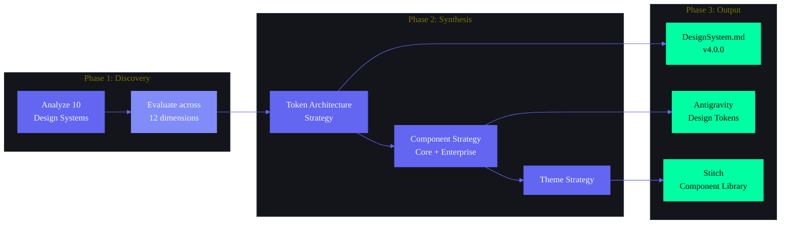

# Design System Research — Second Brain OS (ARIA)

> **The definitive research and strategy document that defines every architectural decision for the Second Brain OS Design System.**
>
> Authored by: Design Systems Director, Enterprise UI Architect, Component Architect, Accessibility Specialist, Frontend Architect
>
> This document is the source of truth for: DesignSystem.md, Antigravity, Stitch, Frontend Architecture, Component Development, and Design Governance.
>
> **Status:** Research Complete | **Version:** 1.0.0 | **Last Updated:** 2026-06-11

---

## Table of Contents

1. [Executive Summary](#1-executive-summary)
2. [Design System Philosophy](#2-design-system-philosophy)
3. [Design System Goals](#3-design-system-goals)
4. [Design System Principles](#4-design-system-principles)
5. [Competitive Research Analysis](#5-competitive-research-analysis)
6. [Component Architecture Strategy](#6-component-architecture-strategy)
7. [Token Strategy](#7-token-strategy)
8. [Color Token System](#8-color-token-system)
9. [Typography Token System](#9-typography-token-system)
10. [Spacing Token System](#10-spacing-token-system)
11. [Radius Token System](#11-radius-token-system)
12. [Shadow & Elevation Token System](#12-shadow--elevation-token-system)
13. [Motion Token System](#13-motion-token-system)
14. [Z-Index Token System](#14-z-index-token-system)
15. [Breakpoint Token System](#15-breakpoint-token-system)
16. [Theme Strategy](#16-theme-strategy)
17. [Component Strategy — Core Primitives](#17-component-strategy--core-primitives)
18. [Enterprise Component Strategy](#18-enterprise-component-strategy)
19. [Accessibility Strategy](#19-accessibility-strategy)
20. [Variant Strategy](#20-variant-strategy)
21. [Naming Strategy](#21-naming-strategy)
22. [Component Governance](#22-component-governance)
23. [Versioning Strategy](#23-versioning-strategy)
24. [Documentation Strategy](#24-documentation-strategy)
25. [Distribution Strategy](#25-distribution-strategy)
26. [AI Component Pattern Library](#26-ai-component-pattern-library)
27. [Future Expansion Strategy](#27-future-expansion-strategy)
28. [Intelligence Report Summary](#28-intelligence-report-summary)

---



---

## 1. Executive Summary

### 1.1 Research Mandate

This document is the result of a comprehensive analysis of 10 major design systems — shadcn/ui, 21st.dev, MagicUI, Aceternity UI, Origin UI, Tailwind CSS v4, IBM Carbon, Material Design 3, Ant Design, and Radix UI — evaluated across 12 dimensions: architecture, component distribution, token system design, accessibility maturity, theme flexibility, enterprise readiness, AI readiness, animation capability, documentation quality, developer experience, design-to-code parity, and scalability.

The research establishes every architectural decision for the Second Brain OS (SBOS) Design System before implementation begins. It answers: *what should we build, why should we build it that way, and how do we ensure it scales from 100 to 1,000+ components?*

### 1.2 Recommended Stack

| Layer | Choice | Rationale |
|---|---|---|
| **Primitive UI Layer** | Radix UI | Best-in-class WAI-ARIA compliance, compound component pattern, `asChild` composition |
| **Styling Engine** | Tailwind CSS v4 | CSS-first `@theme` directive, 5x faster builds than v3, native CSS variable generation |
| **Variant Management** | `cva` (class-variance-authority) | Type-safe variant definitions, shadcn-standard, dead-code elimination |
| **Animation Engine** | `motion/react` (was Framer Motion) | 60fps GPU-accelerated, declarative API, React 18 concurrent mode compatible |
| **Theme Engine** | HSL CSS Custom Properties | shadcn-compatible, runtime theme switching via `.dark` class, programmatic color manipulation |
| **Distribution Model** | Hybrid: CLI copy-paste + npm | shadcn CLI for core components (source ownership), npm for shared primitives (versioned contracts) |
| **Component Composition** | Compound Components + Slot Pattern | Radix-inspired, maximum flexibility without CSS specificity wars |
| **Token Architecture** | 3-Tier (Primitives → Semantic → Component) | Carbon + M3 inspired, separates concerns, enables theme derivation |
| **Design-to-Code** | Tokens Studio + Figma Plugin | Single source of truth in Figma, auto-generated CSS + TypeScript tokens |

### 1.3 Key Research Conclusions

**Conclusion 1: The copy-paste distribution model is the defining innovation of the 2024-2026 design system era.** shadcn/ui proved that developers prefer owning source code over managing version conflicts. SBOS adopts this model for all components — every component is committed to the project's source tree via CLI. No version lock-in, no breaking changes from upstream, full customization capability.

**Conclusion 2: No single design system satisfies all SBOS requirements.** shadcn provides the distribution model and Radix foundation but lacks enterprise governance (Carbon), dynamic theming (M3), AI-specific patterns (Carbon for AI / 21st.dev), and animation architecture (MotionArchitecture.md). SBOS must compose strengths from multiple systems.

**Conclusion 3: AI components are a first-class design system category, not an afterthought.** Carbon for AI, Claude's extended thinking display, and 21st.dev's agent SDK all prove that AI-specific UI patterns (ghost hints, streaming text, thinking indicators, agent state machines) require dedicated component architecture. SBOS defines these alongside traditional components.

**Conclusion 4: Accessibility must be architected at the token level, not the component level.** Carbon and Radix demonstrate that accessible design systems start with contrast-safe color palettes, predictable focus mechanisms, and screen-reader-compatible motion defaults. SBOS enforces accessibility at three tiers: tokens (contrast ratios), primitives (WAI-ARIA), and components (tested paths).

**Conclusion 5: The three-tier token architecture (Primitives → Semantic → Component) is the industry consensus.** Carbon (global → semantic → component), M3 (reference → system → component), and Ant Design (seed → algorithm → component) all converge on the same pattern. SBOS adopts this with distribution via Tailwind v4 `@theme` + CSS custom properties + TypeScript constants.

### 1.4 Recommended Stack Architecture

```
┌─────────────────────────────────────────────────────────────┐
│                    Application Layer                          │
│   Dashboard  Tasks  Courses  Goals  Habits  Sleep  Income   │
│   Projects  Ideas  Resources  Opportunities  Time  Chat     │
└───────────────────────────┬─────────────────────────────────┘
                           │ consumes
┌──────────────────────────▼──────────────────────────────────┐
│                  Module-Specific Components                   │
│   TaskCard  HabitCalendar  BriefingSection  RadarCard  etc.  │
└──────────────────────────┬──────────────────────────────────┘
                          │ consumes
┌─────────────────────────▼───────────────────────────────────┐
│                 Enterprise Composite Components               │
│   DataTable  KanbanBoard  CommandPalette  Heatmap  Calendar  │
│   ActivityFeed  RoadmapCanvas  KPIStrip  ChartShell         │
└─────────────────────────┬──────────────────────────────────┘
                          │ consumes
┌────────────────────────▼───────────────────────────────────┐
│                  Design System Components                    │
│   Button  Card  Input  Modal  Dropdown  Tabs  Tooltip       │
│   Badge  Avatar  Breadcrumb  Toast  Dialog  Select  etc.    │
└────────────────────────┬──────────────────────────────────┘
                         │ uses
┌───────────────────────▼────────────────────────────────────┐
│              Radix UI Primitives (Unstyled)                  │
│   Dialog  DropdownMenu  Popover  Tooltip  Select  Tabs      │
│   Accordion  RadioGroup  Checkbox  Switch  Slider           │
└───────────────────────┬────────────────────────────────────┘
                        │ styles with
┌──────────────────────▼─────────────────────────────────────┐
│              Token System (Single Source of Truth)           │
│   Tailwind v4 @theme  →  CSS Custom Properties              │
│   → TypeScript Constants  →  Figma Tokens Studio            │
└──────────────────────────────────────────────────────────────┘
```

---

## 2. Design System Philosophy

### 2.1 Our Six Design System Values

#### Value 1: Own Your Code
Every component in SBOS is source-owned. When you install a component via CLI, the code is committed to your project — not hidden in `node_modules`. This means: no breaking updates from upstream, no version conflict chains, full customization authority, and zero runtime dependencies beyond React and Tailwind.

**Rule P1:** No component may require a runtime CSS-in-JS library. All styling must resolve to static CSS at build time.

**Rule P2:** Every component must be editable in isolation. If a developer needs to change one pixel of padding on one instance, they can without forking the entire library.

#### Value 2: Accessibility Through Architecture
Accessibility is not a QA gate — it is an architectural property of the token system, the component API, and the build pipeline. Tokens encode contrast ratios. Primitives enforce WAI-ARIA patterns. CI blocks violations.

**Rule P3:** Every semantic color token must pass WCAG 2.2 AA contrast requirements against its intended background before it enters the codebase.

**Rule P4:** Every interactive component must ship with a keyboard navigation test and axe-core audit — both of which run in CI.

#### Value 3: Cyberpunk First, Light Second
The default theme is dark cyberpunk. Light theme is derived algorithmically from the dark theme's semantic structure, not redesigned independently. This ensures: design effort goes to the primary experience first, light mode inherits the same visual hierarchy, and high contrast mode is a derivative, not a separate system.

**Rule P5:** All design reviews evaluate the dark theme first. Light theme correctness is verified by automated contrast checks, not design review bandwidth.

**Rule P6:** Any visual property defined in dark mode must have an explicit light mode override. Inherited values are forbidden.

#### Value 4: AI as a Design Material
AI is not a feature category — it is a design material that affects every component. Buttons show confidence levels. Inputs suggest completions. Cards expose thinking states. The design system treats AI interaction patterns as first-class components with the same variant/state/accessibility requirements as any other component.

**Rule P7:** Every component that supports AI enhancement must define its AI-absent state, AI-pending state, and AI-active state in its variant matrix.

**Rule P8:** AI components must respect all four theme variants (Dark, Light, High Contrast, Custom) — no AI-exclusive theming.

#### Value 5: Compose, Don't Configure
A component with 15 boolean props is a design failure. Prefer composition (children, slots, `asChild`) over configuration. The Radix compound component pattern is the standard: every complex component exports Root, Trigger, Content, Portal, Overlay, and Item subcomponents.

**Rule P9:** Any component whose prop interface exceeds 8 props must be refactored to use composition instead of configuration.

**Rule P10:** Every composite component must support the `asChild` pattern on its trigger/root elements to allow custom styling without breaking accessibility.

#### Value 6: Scale Deliberately
Components follow a strict promotion path: Module-Specific → Shared Module → Composite → Primitive. A component written for one module is not promoted until a second module adopts it. This prevents premature abstraction while ensuring that components that do reach the design system have proven reuse.

**Rule P11:** A component can only enter the design system after it has been independently implemented in at least two modules and a third module has confirmed intent to adopt.

**Rule P12:** When a component is promoted, the original implementation must be replaced with the shared version within one sprint.

---

## 3. Design System Goals

### 3.1 Measurable Targets

| Goal | Measurement | Baseline | 6-Month Target | 12-Month Target |
|---|---|---|---|---|
| **Component adoption** | % of UI built from design system components | ~40% (estimated) | 85% | 95% |
| **Component reuse** | Unique component count / total page count | ~3 unique/page | <1.5 unique/page | <1 unique/page |
| **Design token compliance** | % of visual properties using tokens | ~60% | 95% | 99% |
| **Accessibility compliance** | axe-core violations per sprint | Unknown | 0 critical, 0 serious | 0 violations all levels |
| **Time-to-ship** | Design to production for new screen | ~5 days | <3 days | <1.5 days |
| **Build performance** | Tailwind build time | ~3s | <1s (Tailwind v4) | <500ms |
| **Bundle contribution** | gzip size of design system per page | Unknown | <30KB per page | <20KB per page |
| **Documentation coverage** | % of components with spec doc + Storybook | ~30% | 100% | 100% maintained |

### 3.2 Design System Maturity Targets

| Phase | Timeline | Milestone |
|---|---|---|
| **Foundation** | Sprint 1-2 | Token system live, core primitives (10 components) ship, CLI scaffold operational |
| **Adoption** | Sprint 3-6 | All 16 modules use design system components, composition patterns documented, 90% token compliance |
| **Optimization** | Sprint 7-12 | Build performance optimized, accessibility CI gates operational, variant system stable |
| **Expansion** | Sprint 13-24 | Enterprise components ship, AI component library v1, theme expansion (4 themes), Figma parity |
| **Scale** | Year 2 | 100+ components, community contributions, private registry, plugin ecosystem |

---

## 4. Design System Principles

### 4.1 The 12 Design System Rules (DSR1-DSR12)

**DSR1 — Token Everything.**
No hardcoded color, spacing, radius, shadow, font, or motion value ever enters a component file. Every visual property references a design token. Exceptions require Design Systems Director approval and must be documented with a `/* TOKEN-OVERRIDE: reason */` comment.

**DSR2 — Primitives Know Nothing.**
Primitive components (Button, Input, Card, Badge) must never import or reference module-specific logic, Supabase queries, AI agent calls, or page-level state. Primitives accept props, render DOM, and return — nothing more.

**DSR3 — Dependencies Flow One Direction.**
Module → Enterprise → Composite → Primitive → Token. No component may import from a layer above itself. Enforcement: ESLint `import/no-restricted-paths` rule.

**DSR4 — Every Component Has Eight States.**
Default, Hover, Focus, Active, Disabled, Loading, Error, and Empty (if applicable). Components that cannot exhibit a state must document why. Missing states are design debt.

**DSR5 — Every Component Has a Reduced Motion Equivalent.**
For every animation variant in every component, there must be a zero-motion equivalent that preserves full functionality. Verified in CI via `prefers-reduced-motion` test suite.

**DSR6 — Components Are Self-Documenting.**
Every component exports a TypeScript interface with JSDoc annotations on every prop. The JSDoc `@motion` block documents animation contracts. The JSDoc `@a11y` block documents ARIA attributes and keyboard interactions.

**DSR7 — Variants Are Finite and Enumerable.**
Every component variant must be defined as a TypeScript union type, not a string. (`type Variant = 'primary' | 'secondary' | 'ghost'` — never `variant?: string`). This enables type-safe consumption and dead-code elimination.

**DSR8 — Composition Over Configuration.**
Components with >8 props must be refactored into compound components. The Radix compound + Slot pattern is the standard. Every new composite component must be reviewed for composition opportunities before implementation.

**DSR9 — Accessibility Gates Are in CI, Not QA.**
Every PR must pass: axe-core scan (0 violations), keyboard navigation test (all interactive elements reachable), `prefers-reduced-motion` test (no motion without fallback), and color contrast check (4.5:1 body, 3:1 large text). These are build-blocking, not advisory.

**DSR10 — Themes Are Derivatives, Not Duplicates.**
The light theme is derived from the dark theme's semantic token structure. High contrast modifies the same semantic tokens. Custom themes override accent tokens only. Maintaining N independent themes is unsustainable — the token pipeline must generate themes.

**DSR11 — Components Promote, Never Fork.**
When a module-specific component is needed by a second module, it must be promoted to the design system — not forked. The original module must migrate to the shared version within one sprint. Forking without promotion is a design system violation.

**DSR12 — AI Components Are Not Magic.**
AI components follow the same variant/state/accessibility/performance requirements as all other components. An AI thinking indicator has Default, Active, and Reduced Motion states. An AI suggestion chip has Default, Hover, Selected, and Dismissed states. No special exceptions.

---

## 5. Competitive Research Analysis

### 5.1 Design System Evaluation Matrix

| Dimension | shadcn/ui | 21st.dev | MagicUI | Aceternity UI | Origin UI | Tailwind CSS v4 | IBM Carbon | M3 | Ant Design | Radix UI |
|---|---|---|---|---|---|---|---|---|---|---|
| **Architecture** | Copy-paste registry | Marketplace + AI | shadcn-compatible | Premium copy-paste | Copy-paste library | Utility-first framework | Multi-FW monorepo | Platform-specific | CSS-in-JS monolith | Unstyled primitives |
| **Distribution** | CLI + npm | CLI + marketplace | CLI (shadcn) | Website copy | Website copy | npm package | npm packages | Platform packages | npm package | npm packages |
| **Component Count** | ~50 core | ~130+ buttons | ~150 free | ~330 total | ~200 | N/A (framework) | ~50 enterprise | ~45 web | ~60 enterprise | ~30 primitives |
| **Token System** | HSL CSS vars | Inherits shadcn | None | None | Inherits shadcn | `@theme` CSS-first | Carbon tokens | DTCG tokens | Seed→Algorithm | None (unstyled) |
| **Theme System** | `.dark` class | Host project | `.dark` class | `.dark` class | `.dark` class | `@media` prefers | 4 built-in themes | Dynamic color | ConfigProvider | None |
| **Accessibility** | High (via Radix) | Medium | Low | Medium | Medium | Framework-level | Industry-leading | Very High | Medium-High | Best-in-class |
| **Enterprise Ready** | Medium | Medium | Low | Low | Low | Medium | Very High | Medium | Very High | High (foundation) |
| **AI Ready** | None | Agent SDK, AI gen | None | None | None | None | Carbon for AI | None | None | None |
| **Animation** | None built-in | None built-in | Framer Motion heavy | Framer Motion heavy | Minimal | CSS animations | Motion system | Motion system | CSS transitions | None |
| **Documentation** | Excellent | Good | Good | Very Good | Good | Excellent | Excellent | Excellent | Excellent | Excellent |
| **DX** | Excellent | Good | Good | Good | Good | Excellent | Moderate | Moderate | Good | Excellent |
| **Figma Parity** | Community kit | None | None | None | None | None | Official kit + T | Official kit | Official kit + P | None |
| **Versioning** | None (source) | Registry versions | None (source) | None (source) | None (source) | Semver | Semver (1K+ releases) | Semver | Semver | Semver |

### 5.2 What SBOS Borrows from Each

| Design System | Pattern Borrowed | Implementation in SBOS |
|---|---|---|
| **shadcn/ui** | Copy-paste CLI distribution model | `npx sbos add button` installs component source into project |
| **shadcn/ui** | HSL CSS variable theme system | All design tokens as HSL in `globals.css`, `.dark` class switching |
| **shadcn/ui** | `cva` variant management | Every component uses `cva()` for variant definitions |
| **21st.dev** | Private registry concept | Internal registry for module-specific components |
| **21st.dev** | AI agent integration | Agents SDK documentation pattern for AI-generated UI |
| **21st.dev** | Component marketplace model | Future SBOS community component sharing |
| **MagicUI** | Animated gradient decorations | Loading states, ambient backgrounds (decorative only) |
| **MagicUI** | Number ticker pattern | Gamification elements, KPI animations |
| **Aceternity UI** | Bento grid layouts | Dashboard bento grid component |
| **Aceternity UI** | Spotlight/glow effects | Cyberpunk decorative surfaces |
| **Origin UI** | Stepper/wizard component | Onboarding flows, multi-step forms |
| **Origin UI** | File upload pattern | File attachment in tasks, resources |
| **Tailwind v4** | `@theme` CSS-first design tokens | All design tokens as native CSS, auto-generating utility classes |
| **Tailwind v4** | 5x faster builds | Build performance target for CI |
| **IBM Carbon** | 4-theme architecture | Cyberpunk Dark, Cyberpunk Light, High Contrast, Custom |
| **IBM Carbon** | Background→Layer→Component hierarchy | Surface token structure for card/sidebar/modal layering |
| **IBM Carbon** | Enterprise governance model | PR checklists, component promotion, migration guides |
| **IBM Carbon** | Carbon for AI guidelines | AI component patterns (thinking, confidence, source grounding) |
| **M3** | Three-tier token architecture | Primitives → Semantic → Component |
| **M3** | Dynamic color from seed | Custom theme generation from user-selected accent color |
| **M3** | Elevation token system | Shadow + glow tokens with semantic meaning |
| **M3** | Motion token system | Motion characteristics as DTCG-formatted tokens |
| **Ant Design** | Seed→Algorithm theming pipeline | Theme derivation from seed values via algorithm functions |
| **Ant Design** | ConfigProvider pattern | Theme context for nested/sub-section theming |
| **Ant Design** | Form/Table architecture | Enterprise Form and DataTable patterns |
| **Ant Design** | Nested theme contexts | Chat module could use distinct sub-theme |
| **Radix UI** | Unstyled primitives with WAI-ARIA | All interactive components built on Radix primitives |
| **Radix UI** | Compound component pattern | Dialog.Root → Dialog.Trigger → Dialog.Content → Dialog.Close |
| **Radix UI** | `asChild` prop for composition | Every trigger and root element supports `asChild` |
| **Radix UI** | Slot pattern for prop merging | Complex composition without wrapper divs |

### 5.3 Anti-Patterns to Avoid

| Anti-Pattern | Source | Why to Avoid |
|---|---|---|
| **CSS-in-JS runtime** | Ant Design v5 | Adds ~15KB+ per page, blocks Tailwind v4 optimization |
| **Animation-heavy defaults** | MagicUI, Aceternity | Violates WCAG 2.3 (seizure), 2.2 (motion sensitivity) for core UI |
| **Single boolean prop explosion** | shadcn (some components) | Leads to 15-prop components — fails DSR8 |
| **Only 1-2 themes** | Most systems | Locks out accessibility (HC) and user preference (custom) |
| **No AI component patterns** | All except Carbon | Misses the defining interaction paradigm of 2026+ |
| **Monolithic npm package** | Ant Design, M3 Web | Bundles entire library, no tree-shaking for individual components |
| **No reduced motion fallback** | MagicUI, Aceternity | Excludes users with vestibular disorders |
| **Separate a11y audit phase** | Traditional approach | Accessibility is a CI gate, not a QA phase (DSR9) |

---

## 6. Component Architecture Strategy

### 6.1 Foundation: Radix UI Primitives

Every interactive component in SBOS is built on a Radix UI primitive. Radix handles: focus management, keyboard navigation, ARIA attributes, screen reader announcements, focus trapping, scroll lock, and pointer event handling. The SBOS design system provides the styling, theming, variant system, and motion.

**Radix primitives used by SBOS:**

| Radix Primitive | SBOS Component | Key Accessibility Feature |
|---|---|---|
| `@radix-ui/react-dialog` | Dialog / Modal | Focus trap, Esc to close, aria-modal |
| `@radix-ui/react-dropdown-menu` | Dropdown / Context Menu | Arrow key nav, typeahead, aria-expanded |
| `@radix-ui/react-popover` | Popover / Tooltip | Dismiss on Esc, hoverable content |
| `@radix-ui/react-tooltip` | Tooltip | Show/hide delay, keyboard focusable trigger |
| `@radix-ui/react-select` | Select / Combobox | Combobox pattern, aria-activedescendant |
| `@radix-ui/react-tabs` | Tabs | Arrow key nav, aria-selected, tab panel linking |
| `@radix-ui/react-accordion` | Accordion | Arrow key nav, aria-expanded, Enter/Space to toggle |
| `@radix-ui/react-checkbox` | Checkbox | Indeterminate state, aria-checked |
| `@radix-ui/react-radio-group` | Radio Group | Arrow key nav, aria-checked, role=radiogroup |
| `@radix-ui/react-switch` | Toggle | aria-checked, role=switch |
| `@radix-ui/react-slider` | Slider | Arrow key +/-, aria-valuemin/max/now |
| `@radix-ui/react-progress` | Progress | aria-valuenow, role=progressbar |
| `@radix-ui/react-toast` | Toast | aria-live assertive, keyboard dismiss |

### 6.2 Six-Category Component Taxonomy

SBOS components are organized into six categories with strict dependency rules:

| Category | Description | Examples | Depends On | Consumed By |
|---|---|---|---|---|
| **Primitives** | Atomic, non-opinionated, themeable | Button, Input, Badge, Text, Icon, Tooltip | Tokens, Radix | ALL layers |
| **Composite** | Combine 2+ primitives into opinionated pattern | Card, Modal, Dropdown, FormField, Table, Tabs | Primitives | Enterprise, Module |
| **Layout** | Structural composition, responsive | Stack, Grid, Sidebar, PageHeader, Toolbar, Container | Primitives | ALL layers |
| **Pattern** | Cross-cutting concerns | EmptyState, LoadingSkeleton, ErrorBoundary, ConfirmDialog | Primitives, Composite | ALL layers |
| **Enterprise** | Domain-specific complex components | DataTable, KanbanBoard, CommandPalette, KPIStrip, Calendar | Composite, Layout, Pattern | Module |
| **Module** | Bound to 1-2 specific modules | TaskCard, HabitCalendar, BriefingSection, RadarCard, Ledger | Enterprise, Composite | Pages |
| **AI** | AI-specific interaction patterns | ThinkingIndicator, SuggestionChip, GhostHint, AgentStatus, StreamingText | Primitives, Composite | Enterprise, Module |

### 6.3 Dependency Direction

```
Tokens ← Primitive ← Composite ← Layout ← Pattern ← Enterprise ← Module ← Pages
        ← AI (can draw from anywhere below Enterprise)
```

**Rule CA1:** Primitives NEVER import from Composite, Layout, Pattern, Enterprise, Module, or AI.

**Rule CA2:** Composite NEVER imports from Layout, Pattern, Enterprise, Module, or AI.

**Rule CA3:** Layout NEVER imports from Enterprise or Module.

**Rule CA4:** Pattern NEVER imports from Enterprise or Module.

**Rule CA5:** Enterprise NEVER imports from Module.

**Rule CA6:** Module may only import from Enterprise, Pattern, Composite, Layout, and Primitive — never from another Module.

**Rule CA7:** AI may import from any layer except Module — AI components are cross-cutting.

### 6.4 Component Composition Patterns

#### Pattern 1: Compound Components (Radix Standard)

Every complex component exports subcomponents. The top-level export is a namespace, not a single function.

```typescript
// Dialog.tsx
export const Dialog = {
  Root: DialogRoot,
  Trigger: DialogTrigger,
  Content: DialogContent,
  Close: DialogClose,
  Title: DialogTitle,
  Description: DialogDescription,
}
// Usage:
// <Dialog.Root>
//   <Dialog.Trigger>Open</Dialog.Trigger>
//   <Dialog.Content>
//     <Dialog.Title>Confirm</Dialog.Title>
//     <Dialog.Close />
//   </Dialog.Content>
// </Dialog.Root>
```

#### Pattern 2: Slot Pattern

Components that wrap children without adding DOM nodes use Radix's Slot pattern. This enables consumers to customize the rendered element without breaking accessibility.

```typescript
// Button.tsx
import { Slot } from '@radix-ui/react-slot'

export function Button({ asChild, ...props }: ButtonProps) {
  const Comp = asChild ? Slot : 'button'
  return <Comp className={buttonVariants(props)} {...props} />
}
```

#### Pattern 3: Polymorphic `asChild`

Every trigger, root, and interactive element supports `asChild`. This is the primary escape hatch for custom styling.

#### Pattern 4: Controlled + Uncontrolled

Form-like components (Input, Select, Checkbox) support both controlled (`value` + `onChange`) and uncontrolled (default internal state) modes. Uncontrolled is the default — controlled is opt-in.

### 6.5 Component File Structure

```
packages/ui/
├── Button/
│   ├── Button.tsx              # Component implementation
│   ├── Button.test.tsx         # Unit + a11y + keyboard tests
│   ├── Button.stories.tsx      # Storybook stories
│   ├── Button.spec.md          # Component spec document
│   └── index.ts                # Re-export
├── Dialog/
│   ├── Dialog.tsx
│   ├── Dialog.test.tsx
│   ├── Dialog.stories.tsx
│   ├── Dialog.spec.md
│   └── index.ts
├── tokens/
│   ├── colors.ts
│   ├── typography.ts
│   ├── spacing.ts
│   ├── radius.ts
│   └── index.ts
├── presets/
│   ├── animation-presets.ts
│   └── index.ts
└── index.ts                    # Barrel exports
```

### 6.6 Component Contract Template

Every component's JSDoc block documents:

```typescript
/**
 * @component Button
 * @category Primitive
 * @radix uses: none (native button)
 *
 * @variants
 * - primary (default): Filled accent background, white text
 * - secondary: Elevated background, primary text, 1px border
 * - ghost: Transparent, secondary text, hover background
 * - danger: Red filled background, white text
 *
 * @states
 * - default, hover, focus, active, disabled, loading
 *
 * @motion
 * - whileHover: scale 1.02, 100ms
 * - whileTap: scale 0.96, 80ms
 * - disabled: opacity 0.5, 150ms
 * - Reduced motion: no scale, opacity only
 *
 * @a11y
 * - Role: button (native)
 * - aria-disabled when disabled
 * - aria-busy when loading
 * - Focus ring: 2px accent-primary, offset 2px
 *
 * @props
 * - variant: 'primary' | 'secondary' | 'ghost' | 'danger'
 * - size: 'sm' | 'md' | 'lg'
 * - disabled: boolean
 * - loading: boolean
 * - asChild: boolean (Slot pattern)
 * - children: ReactNode
 */
```

---

## 7. Token Strategy

### 7.1 Three-Tier Token Architecture

SBOS uses a three-tier token hierarchy inspired by Carbon Design System and Material Design 3:

```
┌─────────────────────────────────────────────────────────────┐
│  Tier 1: PRIMITIVES (Raw Values)                            │
│  The un-themed, absolute values. Never change per theme.    │
│  Examples: #6366F1, 4px, DM Sans, 400ms                    │
│  Location: tokens/primitives/                               │
└──────────────────────┬──────────────────────────────────────┘
                       │ mapped to purpose
┌──────────────────────▼──────────────────────────────────────┐
│  Tier 2: SEMANTIC TOKENS (Purpose-Driven)                   │
│  Theme-aware values. Change per theme.                      │
│  Examples: --color-text-primary, --color-bg-card             │
│            --spacing-md, --shadow-elevation-2                │
│  Location: tokens/semantic/ (per theme)                     │
└──────────────────────┬──────────────────────────────────────┘
                       │ consumed by components
┌──────────────────────▼──────────────────────────────────────┐
│  Tier 3: COMPONENT TOKENS (Specific)                        │
│  Defaults that components reference directly.                │
│  Examples: --button-bg-primary, --card-padding              │
│            --input-border-radius, --dialog-shadow            │
│  Location: co-located with component or tokens/component/    │
└─────────────────────────────────────────────────────────────┘
```

### 7.2 Token Naming Convention

```
Tier 1 (Primitives): --raw-[family]-[step]
  Example: --raw-indigo-500
  Example: --raw-gray-100
  Example: --raw-spacing-4

Tier 2 (Semantic): --[category]-[property]-[variant?]
  Example: --color-bg-page
  Example: --color-text-primary
  Example: --spacing-section
  Example: --radius-card

Tier 3 (Component): --[component]-[property]-[variant?]-[state?]
  Example: --button-bg-primary
  Example: --button-bg-primary-hover
  Example: --card-padding
  Example: --input-border-focus
```

**Token Naming Rule T1:** Token names use kebab-case only. No camelCase, no snake_case, no BEM-style double-dash.

**Token Naming Rule T2:** Semantic tokens must use purpose-based naming, not presentation-based. Use `--color-text-primary` not `--color-white`, `--color-bg-card` not `--color-dark-gray`.

**Token Naming Rule T3:** Component tokens are optional — components should prefer semantic tokens. Component tokens only exist when a component has a visual requirement that differs from the semantic standard.

### 7.3 Token Distribution Channels

All tokens are defined once and distributed via four channels:

| Channel | Format | Use Case | Generation Method |
|---|---|---|---|
| **CSS Custom Properties** | `--token-name: value` in `:root` | Runtime consumption by all CSS/Tailwind | Auto-generated from token JSON |
| **Tailwind v4 `@theme`** | `@theme { --color-*: ... }` | Utility class generation | Syncs from CSS vars |
| **TypeScript Constants** | `export const tokens = { ... }` | Programmatic access in components | Auto-generated from token JSON |
| **Figma (Tokens Studio)** | DTCG-formatted JSON | Design-to-code parity | Sync plugin from token JSON |

### 7.4 Token Definition Format

All tokens are defined in a single source-of-truth JSON file (DTCG Format):

```json
{
  "color": {
    "bg": {
      "page": {
        "$value": "{color.dark.bg.950}",
        "$type": "color",
        "$description": "Page background color, darkest surface",
        "themes": {
          "dark": "{raw.slate.950}",
          "light": "{raw.slate.50}"
        }
      }
    }
  }
}
```

This single file generates:
- `globals.css` custom properties
- Tailwind v4 `@theme` directive
- TypeScript token constants
- Figma Tokens Studio JSON

---

## 8. Color Token System

### 8.1 Raw Color Palette (Tier 1)

SBOS uses 5 hue families with a 10-step scale (50-950, following Tailwind v4 convention):

| Family | 50 | 100 | 200 | 300 | 400 | 500 | 600 | 700 | 800 | 900 | 950 |
|---|---|---|---|---|---|---|---|---|---|---|---|
| **Slate** | #F8FAFC | #F1F5F9 | #E2E8F0 | #CBD5E1 | #94A3B8 | #64748B | #475569 | #334155 | #1E293B | #0F172A | #020617 |
| **Indigo (Accent)** | #EEF2FF | #E0E7FF | #C7D2FE | #A5B4FC | #818CF8 | #6366F1 | #4F46E5 | #4338CA | #3730A3 | #312E81 | #1E1B4B |
| **Emerald (Neon)** | #ECFDF5 | #D1FAE5 | #A7F3D0 | #6EE7B7 | #34D399 | #10B981 | #059669 | #047857 | #065F46 | #064E3B | #022C22 |
| **Rose (Cyber)** | #FFF1F2 | #FFE4E6 | #FECDD3 | #FDA4AF | #FB7185 | #F43F5E | #E11D48 | #BE123C | #9F1239 | #881337 | #4C0519 |
| **Amber (Warning)** | #FFFBEB | #FEF3C7 | #FDE68A | #FCD34D | #FBBF24 | #F59E0B | #D97706 | #B45309 | #92400E | #78350F | #451A03 |

**Rule CR1:** Every UI color in the system is derived from one of these 5 families. No ad-hoc hues.

**Rule CR2:** The Accent family (Indigo) can be swapped entirely for Custom theme accent colors. See Theme Strategy §16.

### 8.2 Semantic Color Tokens (Tier 2)

#### Background Tokens

| Token | Dark Value | Light Value | Usage | Contrast Ratio (Dark) |
|---|---|---|---|---|
| `--color-bg-page` | slate-950 (#020617) | slate-50 (#F8FAFC) | Page backdrop | N/A (base) |
| `--color-bg-card` | slate-900 (#0F172A) | white (#FFFFFF) | Cards, sidebar, navbar | N/A (base) |
| `--color-bg-elevated` | slate-800 (#1E293B) | slate-100 (#F1F5F9) | Dropdowns, hovered items, tooltips | N/A (base) |
| `--color-bg-input` | slate-950/80 | slate-50 | Input field backgrounds | N/A (base) |
| `--color-bg-overlay` | slate-950/60 | slate-950/40 | Modal backdrops | N/A (base) |
| `--color-bg-tooltip` | slate-700 (#334155) | slate-800 (#1E293B) | Tooltip backgrounds | N/A (base) |
| `--color-bg-subtle` | slate-900/50 | slate-100/50 | Hover highlights, active rows | N/A (base) |

#### Text Tokens

| Token | Dark Value | Light Value | Usage | AA (on bg-card) |
|---|---|---|---|---|
| `--color-text-primary` | slate-100 (#F1F5F9) | slate-900 (#0F172A) | Headings, body text | 15.4:1 (dark) / 15.4:1 (light) |
| `--color-text-secondary` | slate-400 (#94A3B8) | slate-500 (#64748B) | Subtext, metadata, help text | 7.0:1 (dark) / 6.2:1 (light) |
| `--color-text-tertiary` | slate-500 (#64748B) | slate-400 (#94A3B8) | Placeholders, muted, disabled | 4.6:1 (dark) / 3.9:1 (light) |
| `--color-text-inverse` | slate-950 (#020617) | white (#FFFFFF) | Text on filled accent buttons | N/A |
| `--color-text-disabled` | slate-600 (#475569) | slate-300 (#CBD5E1) | Disabled element text | 3.0:1 (dark) — meets 3:1 for large text |

#### Border Tokens

| Token | Dark Value | Light Value | Usage |
|---|---|---|---|
| `--color-border-default` | slate-800 (#1E293B) | slate-200 (#E2E8F0) | Default component borders |
| `--color-border-subtle` | slate-800/50 | slate-200/50 | Subtle separators, dividers |
| `--color-border-accent` | indigo-500 (#6366F1) | indigo-500 (#6366F1) | Focus rings, selected state |
| `--color-border-hover` | slate-700 (#334155) | slate-300 (#CBD5E1) | Hover state on bordered elements |
| `--color-border-error` | rose-500 (#F43F5E) | rose-500 (#F43F5E) | Error state borders |

#### Accent Tokens

| Token | Dark Value | Light Value | Usage |
|---|---|---|---|
| `--color-accent-primary` | indigo-500 (#6366F1) | indigo-600 (#4F46E5) | Primary actions, links, active states |
| `--color-accent-primary-hover` | indigo-600 (#4F46E5) | indigo-700 (#4338CA) | Primary hover states |
| `--color-accent-neon` | emerald-400 (#34D399) | emerald-500 (#10B981) | AI indicators, premium features |
| `--color-accent-cyber` | rose-500 (#F43F5E) | rose-600 (#E11D48) | Urgent indicators, destructive emphasis |
| `--color-accent-warning` | amber-500 (#F59E0B) | amber-600 (#D97706) | Warning states, pending items |
| `--color-accent-error` | rose-500 (#F43F5E) | rose-600 (#E11D48) | Error states, destructive actions |
| `--color-accent-success` | emerald-500 (#10B981) | emerald-600 (#059669) | Success states, completed items |
| `--color-accent-info` | blue-500 (#3B82F6) | blue-600 (#2563EB) | Info badges, neutral alerts |

#### Surface Tokens (Layering System)

| Token | Dark Value | Light Value | Usage |
|---|---|---|---|
| `--color-surface-layer-0` | slate-950 | slate-50 | Page background |
| `--color-surface-layer-1` | slate-900 | white | Cards, content areas |
| `--color-surface-layer-2` | slate-800 | slate-100 | Dropdowns, elevated cards |
| `--color-surface-layer-3` | slate-700 | slate-200 | Tooltips, popovers |
| `--color-surface-layer-4` | slate-600 | slate-300 | Toast notifications |

### 8.3 Component Color Tokens (Tier 3)

```css
/* Button Component Tokens */
--button-bg-primary: var(--color-accent-primary);
--button-bg-primary-hover: var(--color-accent-primary-hover);
--button-text-primary: var(--color-text-inverse);
--button-bg-secondary: var(--color-bg-elevated);
--button-bg-secondary-hover: var(--color-border-default);
--button-text-secondary: var(--color-text-primary);
--button-bg-ghost: transparent;
--button-bg-ghost-hover: var(--color-bg-subtle);
--button-text-ghost: var(--color-text-secondary);
--button-bg-danger: var(--color-accent-error);
--button-bg-danger-hover: var(--accent-error-hover);
--button-text-danger: var(--color-text-inverse);
--button-radius: var(--radius-md);
--button-shadow-primary: 0 4px 16px rgba(99, 102, 241, 0.4);
```

### 8.4 Contrast Verification Rules

**Rule CC1:** Every pair of foreground and background tokens must be verified for WCAG 2.2 AA contrast before entering the codebase.

| Text Type | Min Contrast | Applicable Tokens |
|---|---|---|
| Body text (<18px, <14px bold) | 4.5:1 | text-primary, text-secondary on bg-* |
| Large text (≥18px or ≥14px bold) | 3:1 | text-secondary on bg-card (larger text), text-tertiary |
| UI components (non-text) | 3:1 | border-* on bg-*, accent-* on bg-* |
| Decorative (disabled, inactive) | 3:1 minimum, 4.5:1 target | text-disabled on bg-card |

**Rule CC2:** Contrast verification is automated. Every PR to the token system runs `node scripts/verify-contrast.mjs` which checks every semantic token pair against WCAG thresholds.

---

## 9. Typography Token System

### 9.1 Font Family Tokens

| Token | Font Stack | Variable | Usage |
|---|---|---|---|
| `--font-display` | Syne, system-ui, sans-serif | `--font-syne` | Headings, display text, KPIs |
| `--font-body` | DM Sans, system-ui, sans-serif | `--font-dm-sans` | Body text, labels, buttons |
| `--font-mono` | JetBrains Mono, monospace | `--font-jetbrains` | Code, time durations, numerical data |

**Rule TY1:** Fonts are loaded via Next.js font loader with `display: swap` to prevent FOIT (Flash of Invisible Text).

**Rule TY2:** Syne is reserved for emphasis — no more than 15% of any page should use Syne. DM Sans is the workhorse.

### 9.2 Font Weight Tokens

| Token | Value | Usage |
|---|---|---|
| `--font-weight-normal` | 400 | Body text, most UI |
| `--font-weight-medium` | 500 | Labels, table headers |
| `--font-weight-semibold` | 600 | Card titles, button text |
| `--font-weight-bold` | 700 | Display headings, KPIs |
| `--font-weight-extrabold` | 800 | Hero/emphasis only |

### 9.3 Type Scale (Clamp-Based)

| Token | Size | Mobile | Tablet | Desktop | clamp() Formula |
|---|---|---|---|---|---|
| `--font-size-xs` | 11px | 10px | 11px | 12px | `clamp(0.625rem, 0.5vw + 0.5rem, 0.75rem)` |
| `--font-size-sm` | 13px | 12px | 13px | 14px | `clamp(0.75rem, 0.5vw + 0.625rem, 0.875rem)` |
| `--font-size-base` | 15px | 14px | 15px | 16px | `clamp(0.875rem, 0.5vw + 0.75rem, 1rem)` |
| `--font-size-md` | 16px | 15px | 16px | 18px | `clamp(0.938rem, 0.75vw + 0.75rem, 1.125rem)` |
| `--font-size-lg` | 20px | 18px | 20px | 24px | `clamp(1.125rem, 1.5vw + 0.75rem, 1.5rem)` |
| `--font-size-xl` | 24px | 20px | 24px | 30px | `clamp(1.25rem, 2vw + 0.75rem, 1.875rem)` |
| `--font-size-2xl` | 30px | 24px | 30px | 36px | `clamp(1.5rem, 2.5vw + 0.75rem, 2.25rem)` |
| `--font-size-3xl` | 36px | 28px | 36px | 48px | `clamp(1.75rem, 3.5vw + 0.5rem, 3rem)` |
| `--font-size-4xl` | 44px | 32px | 42px | 56px | `clamp(2rem, 4vw + 0.5rem, 3.5rem)` |
| `--font-size-hero` | 48px | 36px | 48px | 64px | `clamp(2.25rem, 5vw + 0.5rem, 4rem)` |

**Rule TY3:** The type scale follows a 1.25 (major third) ratio on desktop, compressed to 1.15 on mobile.

**Rule TY4:** Never use a font size outside this scale. If space is tight, adjust spacing not font size.

### 9.4 Line Height Tokens

| Token | Value | Usage |
|---|---|---|
| `--leading-none` | 1 | Headings, display text, badges |
| `--leading-tight` | 1.15 | Large headings (2xl+) |
| `--leading-normal` | 1.4 | Body text, most UI |
| `--leading-relaxed` | 1.625 | Reading content (briefings, articles) |
| `--leading-loose` | 2 | Code blocks, data tables |
| `--leading-flat` | 1 | Badges, labels, mini text |

**Rule TY5:** Body text must have a minimum computed line height of 20px at any screen size.

### 9.5 Type Hierarchy

| Element | Font | Weight | Size | Leading | Tracking | Color |
|---|---|---|---|---|---|---|
| **Hero headline** | Syne | 700 | hero | none | -0.02em | text-primary |
| **Page title** | Syne | 600 | 2xl-3xl | tight | 0 | text-primary |
| **Section heading** | Syne | 500 | xl-2xl | tight | 0 | text-primary |
| **Card title** | DM Sans | 600 | md-lg | normal | 0 | text-primary |
| **Body text** | DM Sans | 400 | base | normal | 0 | text-primary |
| **Secondary text** | DM Sans | 400 | sm | normal | 0 | text-secondary |
| **Caption / meta** | DM Sans | 400 | xs | normal | 0.01em | text-tertiary |
| **Label / badge** | DM Sans | 500 | xs | flat | 0.04em | text-secondary |
| **Button text** | DM Sans | 600 | sm-base | none | 0.01em | text-primary |
| **Code / monospace** | JetBrains Mono | 400 | sm | loose | 0 | text-primary |
| **Input value** | DM Sans | 400 | base | normal | 0 | text-primary |
| **Statistic / KPI** | Syne | 700 | 2xl-4xl | tight | -0.03em | text-primary |

**Rule TY6:** Only ONE element per screen may use the hero scale.

**Rule TY7:** JetBrains Mono is reserved for code, terminal output, and numerical data grids. Do not use for labels or decorative text.

**Rule TY8:** Never use media queries to change font sizes — the clamp() system handles all responsive sizing.

---

## 10. Spacing Token System

### 10.1 Base Grid

SBOS uses a 4px base grid. All spacing values are multiples of 4px.

| Token | Value (px) | rem (16px base) | Usage |
|---|---|---|---|
| `--spacing-0` | 0 | 0 | No spacing |
| `--spacing-0\.5` | 2 | 0.125rem | Tight icon gaps, badge padding |
| `--spacing-1` | 4 | 0.25rem | Compact padding, table cell spacing |
| `--spacing-2` | 8 | 0.5rem | Button padding, card body padding |
| `--spacing-3` | 12 | 0.75rem | Form field spacing, list gaps |
| `--spacing-4` | 16 | 1rem | Section spacing, card padding |
| `--spacing-5` | 20 | 1.25rem | Card padding (default), modal padding |
| `--spacing-6` | 24 | 1.5rem | Page section spacing, sidebar padding |
| `--spacing-8` | 32 | 2rem | Large section spacing |
| `--spacing-10` | 40 | 2.5rem | Page margins, hero section spacing |
| `--spacing-12` | 48 | 3rem | Major layout gaps |
| `--spacing-16` | 64 | 4rem | Page-level padding, max-width container padding |
| `--spacing-20` | 80 | 5rem | Hero section top/bottom spacing |
| `--spacing-24` | 96 | 6rem | Full-screen modal/overlay padding |

### 10.2 Semantic Spacing Tokens

| Token | Maps To | Usage |
|---|---|---|
| `--spacing-inset-sm` | spacing-2 | Small component padding (badge, tag) |
| `--spacing-inset-md` | spacing-3 | Standard component padding (button, input) |
| `--spacing-inset-lg` | spacing-4 | Large component padding (card body) |
| `--spacing-stack-xs` | spacing-1 | Tight vertical gap (icon + label) |
| `--spacing-stack-sm` | spacing-2 | Tight element stack (label + input) |
| `--spacing-stack-md` | spacing-4 | Standard vertical gap (form fields) |
| `--spacing-stack-lg` | spacing-6 | Large vertical gap (sections) |
| `--spacing-stack-xl` | spacing-8 | Page section gap |
| `--spacing-inline-xs` | spacing-1 | Tight horizontal gap (badge group) |
| `--spacing-inline-sm` | spacing-2 | Standard horizontal gap (button group) |
| `--spacing-inline-md` | spacing-4 | Wide horizontal gap (toolbar items) |
| `--spacing-inline-lg` | spacing-6 | Section horizontal gap |
| `--spacing-section` | spacing-8 | Between major page sections |
| `--spacing-page-margin` | spacing-6 | Page content margin from edges |
| `--spacing-container-max` | 1440px | Maximum content width |

### 10.3 Spacing Rules

**Rule SP1:** Never use odd-numbered spacing values (3px, 7px, 11px, etc.). All spacing must be multiples of 4px.

**Rule SP2:** Use semantic spacing tokens in components, not raw spacing tokens. This ensures consistent rhythm across the system.

**Rule SP3:** Section spacing on mobile is 50% of desktop section spacing. Use responsive-aware spacing via the clamp system.

---

## 11. Radius Token System

### 11.1 Radius Scale

| Token | Value | Example Usage |
|---|---|---|
| `--radius-none` | 0 | Full-bleed elements, avatars with image |
| `--radius-sm` | 4px | Badges, tags, compact inputs |
| `--radius-md` | 8px | Buttons, inputs, selects, cards |
| `--radius-lg` | 12px | Cards (default), dialogs |
| `--radius-xl` | 16px | Modals, sidebars, large containers |
| `--radius-2xl` | 20px | Floating action button, pills |
| `--radius-3xl` | 24px | Hero cards, special containers |
| `--radius-full` | 9999px | Pills, tags, avatars |

### 11.2 Semantic Radius Tokens

| Token | Maps To | Usage |
|---|---|---|
| `--radius-button` | radius-md | All button variants |
| `--radius-input` | radius-md | TextInput, Select, Textarea |
| `--radius-card` | radius-lg | Card component |
| `--radius-dialog` | radius-xl | Modal/Dialog component |
| `--radius-badge` | radius-full | Badge, Tag, Pill |
| `--radius-avatar` | radius-full | Avatar component |
| `--radius-tooltip` | radius-md | Tooltip container |

**Rule RD1:** Radii are consistent across all themes — radius tokens never change value between dark and light modes.

**Rule RD2:** Border radius must never exceed 24px for any functional component. Higher radii are reserved for decorative elements only.

---

## 12. Shadow & Elevation Token System

### 12.1 Elevation Levels

SBOS defines 6 elevation levels that map to component hierarchy:

| Level | Elevation Token | Shadow (Dark) | Shadow (Light) | Glow (Dark) | Used By |
|---|---|---|---|---|---|
| 0 | `--elevation-flat` | None | None | None | Page background, flat cards |
| 1 | `--elevation-1` | `0 1px 2px rgba(0,0,0,0.3)` | `0 1px 2px rgba(0,0,0,0.05)` | None | Cards, sidebar, navbar |
| 2 | `--elevation-2` | `0 4px 16px rgba(0,0,0,0.4)` | `0 4px 12px rgba(0,0,0,0.08)` | None | Dropdowns, elevated cards |
| 3 | `--elevation-3` | `0 8px 32px rgba(0,0,0,0.5)` | `0 8px 24px rgba(0,0,0,0.1)` | `0 0 20px rgba(99,102,241,0.15)` | Popover, tooltip, command palette |
| 4 | `--elevation-4` | `0 16px 48px rgba(0,0,0,0.6)` | `0 16px 48px rgba(0,0,0,0.12)` | `0 0 30px rgba(99,102,241,0.2)` | Modal/dialog, slide-in panel |
| 5 | `--elevation-5` | `0 24px 64px rgba(0,0,0,0.7)` | `0 24px 64px rgba(0,0,0,0.15)` | `0 0 40px rgba(99,102,241,0.25)` | Toasts, notifications |

### 12.2 Glow Tokens (Cyberpunk Specific)

Glow effects are accent-colored shadows used for interactive elements:

| Token | Value | Usage |
|---|---|---|
| `--glow-primary` | `0 0 20px rgba(99,102,241,0.3)` | Primary button hover, focus ring |
| `--glow-neon` | `0 0 20px rgba(52,211,153,0.3)` | AI indicators, premium features |
| `--glow-cyber` | `0 0 20px rgba(244,63,94,0.3)` | Urgent/error glow |
| `--glow-card` | `0 0 24px rgba(99,102,241,0.12)` | Interactive card hover |
| `--glow-active` | `0 0 16px rgba(99,102,241,0.2)` | Active tab, selected state |

### 12.3 Elevation Rules

**Rule EL1:** Elevation values are theme-dependent. Dark mode shadows are deeper (more opacity) because dark surfaces need stronger depth cues. Light mode shadows are lighter.

**Rule EL2:** Glow effects are exclusive to the dark theme. In light mode and high contrast mode, glow effects are replaced with standard shadow or border indicators.

**Rule EL3:** Components must not hardcode elevation levels — always reference `--elevation-*` tokens.

---

## 13. Motion Token System

### 13.1 Duration Tokens

| Token | Value (ms) | Usage |
|---|---|---|
| `--motion-duration-instant` | 0 | Reduced motion fallback, state snaps |
| `--motion-duration-fast` | 80 | Button press, tap feedback, hover transitions |
| `--motion-duration-normal` | 150 | Toggles, checkboxes, dropdown opens |
| `--motion-duration-slow` | 250 | Card hover, list item entry, tooltip |
| `--motion-duration-nav` | 300 | Page transitions, sidebar open/close |
| `--motion-duration-reveal` | 400 | Content reveals, modal entrances |
| `--motion-duration-decorative` | 3000 | Glow pulses, ambient loops |
| `--motion-duration-celebration` | 1000 | Confetti, streak milestones |

### 13.2 Easing Tokens

| Token | cubic-bezier() | GSAP Equivalent | Usage |
|---|---|---|---|
| `--motion-easing-out` | (0.0, 0.0, 0.2, 1) | power2.out | Entries, micro-interactions |
| `--motion-easing-in` | (0.4, 0.0, 1.0, 1) | power2.in | Exits, dismissals |
| `--motion-easing-in-out` | (0.4, 0.0, 0.2, 1) | power2.inOut | Moderate UI transitions |
| `--motion-easing-spring` | (0.34, 1.56, 0.64, 1) | back.out(1.7) | Celebrations, playful elements |
| `--motion-easing-linear` | (0.0, 0.0, 1.0, 1) | none | Progress bars, spinners |
| `--motion-easing-emphasis` | (0.2, 0.0, 0.0, 1) | power3.out | Important content arrival |

### 13.3 Stagger Tokens

| Token | Value | Usage |
|---|---|---|
| `--motion-stagger-fast` | 30ms | Dense lists (20+ items) |
| `--motion-stagger-normal` | 50ms | Standard lists (5-20 items) |
| `--motion-stagger-slow` | 80ms | Sparse content (<5 items) |
| `--motion-stagger-card` | 100ms | Card grids, dashboard tiles |
| `--motion-stagger-max` | 500ms | Maximum cumulative stagger |

### 13.4 Transform Tokens

| Token | Value | Usage |
|---|---|---|
| `--motion-scale-press` | 0.96 | Button press, card active |
| `--motion-scale-hover` | 1.02 | Button hover, card hover |
| `--motion-scale-hover-icon` | 1.05 | Icon-only button hover |
| `--motion-scale-active-tab` | 1.04 | Active navigation tab |
| `--motion-scale-modal-bg` | 0.95 | Modal background entry scale |

### 13.5 Opacity Tokens

| Token | Value | Usage |
|---|---|---|
| `--motion-opacity-hidden` | 0 | Hidden state |
| `--motion-opacity-subtle` | 0.5 | Disabled elements, subtle hints |
| `--motion-opacity-overlay` | 0.6 | Modal/drawer backdrops |

### 13.6 Motion Architecture Reference

For the complete motion architecture — including animation presets (V1-V35), component animation contracts, GSAP integration, Rive integration, AI motion patterns, performance budgets, and motion governance — see `docs/design/MotionArchitecture.md`.

**Base rule: MotionArchitecture.md is the engineering companion that defines HOW to implement everything specified in this token system.**

---

## 14. Z-Index Token System

### 14.1 Stacking Order

SBOS defines a strict z-index hierarchy to prevent stacking context conflicts:

| Level | Token | Value | Elements |
|---|---|---|---|
| 0 | `--z-base` | 0 | Page content, default flow |
| 1 | `--z-sticky` | 10 | Sticky headers, section sticky elements |
| 2 | `--z-dropdown` | 20 | Dropdown menus, autocomplete suggestions |
| 3 | `--z-sidebar` | 30 | Sidebar (desktop), mobile nav |
| 4 | `--z-navbar` | 40 | Navbar (desktop) |
| 5 | `--z-fab` | 50 | Floating action button, mobile bottom nav |
| 6 | `--z-banner` | 60 | Notification banners, announcement bars |
| 7 | `--z-backdrop` | 100 | Modal backdrop, drawer backdrop |
| 8 | `--z-modal` | 110 | Modal/dialog content, slide-in panels |
| 9 | `--z-command` | 120 | Command palette, search overlay |
| 10 | `--z-toast` | 130 | Toast notifications |
| 11 | `--z-tooltip` | 140 | Tooltips, popovers |

### 14.2 Z-Index Rules

**Rule Z1:** Never use z-index values outside the defined scale. Every z-index must reference a token.

**Rule Z2:** New stacking contexts must be added between existing levels, not at the top. The scale allows 10-point gaps between levels for this purpose.

**Rule Z3:** Modal content, backdrop, and trigger must share a stacking context. Never render a modal in a different stacking context from its backdrop.

---

## 15. Breakpoint Token System

### 15.1 Breakpoint Scale

| Token | Name | Min Width | Target Devices | Layout Behavior |
|---|---|---|---|---|
| `--bp-mobile` | Mobile | 320px | Phones (portrait) | Single column, stacked navigation |
| `--bp-tablet` | Tablet | 768px | Tablets, large phones (landscape) | 2-column grids, visible sidebar |
| `--bp-desktop` | Desktop | 1024px | Laptops, desktops | 3-column grids, expanded sidebar |
| `--bp-wide` | Wide | 1280px | Large desktops | Multi-column, max-width 1440px |
| `--bp-ultrawide` | Ultrawide | 1536px | Ultrawide monitors | Centered max-width, ambient backgrounds |
| `--bp-4k` | 4K | 1920px | 4K+ displays | Max-width 1600px, enhanced data density |

### 15.2 Content Priority Map

| Content | Mobile | Tablet | Desktop | Wide+ |
|---|---|---|---|---|
| **Primary content** | Full width | 2/3 width | Full layout | Full layout |
| **Sidebar** | Hidden (slide-in) | Collapsed icons | Expanded (240px) | Expanded |
| **Detail panel** | Full-screen overlay | Slide-in overlay | Right panel (400px) | Right panel |
| **Command palette** | Full-screen | Overlay modal | Centered modal | Centered modal |
| **Data tables** | Card list | Table (scrollable) | Full table | Full table |
| **Charts** | Single stat | Compact chart | Full chart | Full chart + details |
| **Secondary nav** | Bottom bar | Side rail | Sidebar | Sidebar |

### 15.3 Breakpoint Rules

**Rule BP1:** All breakpoints are min-width (mobile-first). Use `min-width` media queries only — never `max-width`.

**Rule BP2:** Content priority determines layout, not device type. A sidebar on desktop is visible; on mobile it's a slide-in overlay.

**Rule BP3:** Touch targets must be 44×44px minimum on devices <=1024px (tablet and below).

**Rule BP4:** Font sizes are handled by the clamp() system (see §9.3). Breakpoints are for layout changes only.

---

## 16. Theme Strategy

### 16.1 Four-Theme Architecture

SBOS supports 4 themes, each serving a distinct audience and use case:

| Theme | Default | Purpose | Contrast Level | Tokens Changed |
|---|---|---|---|---|
| **Cyberpunk Dark** | Yes | Primary experience, power users, evening use | Standard (4.5:1+) | All semantic tokens |
| **Cyberpunk Light** | No | Daytime use, print, accessibility preference | Standard (4.5:1+) | All semantic tokens (inverted) |
| **High Contrast** | No | Visual accessibility, low-vision users | Enhanced (7:1+) | Color tokens only |
| **Custom** | No | User preference, personalization | Standard | Accent tokens only |

### 16.2 Theme Switching Mechanism

Themes are switched via a class on the `<html>` element:

| Theme | HTML Class | CSS Selector |
|---|---|---|
| Cyberpunk Dark | (default, no class) | `:root` |
| Cyberpunk Light | `.light` | `html.light` |
| High Contrast | `.high-contrast` | `html.high-contrast` |
| Custom | `.custom-accent-[color]` | `html.custom-accent-blue` |

```css
/* Token structure in CSS */
:root {
  /* Dark theme values */
  --color-bg-page: var(--raw-slate-950);
  --color-accent-primary: var(--raw-indigo-500);
}

html.light {
  --color-bg-page: var(--raw-slate-50);
  --color-accent-primary: var(--raw-indigo-600);
}

html.high-contrast {
  --color-bg-page: #000000;
  --color-text-primary: #FFFFFF;
  --color-accent-primary: #8888FF;
}

html.custom-accent-blue {
  --color-accent-primary: #3B82F6;
  --color-accent-primary-hover: #2563EB;
}
```

### 16.3 Theme Derivation Rules

**Rule TH1:** Light theme is algorithmically derived from dark theme's semantic structure. For every token `--color-*` in dark, there must be a corresponding light variant. The derivation maps:
- Dark backgrounds → Light surfaces (reverse)
- Dark text → Light text (reverse)
- Accent colors maintain their hue, adjust lightness for contrast

**Rule TH2:** High contrast theme doubles all contrast ratios. Backgrounds become fully black (#000000) or fully white (#FFFFFF). Accents increase chroma. Shadows are eliminated (all content at `--elevation-flat`).

**Rule TH3:** Custom theme replaces only the accent color family (Indigo). The user selects from 12 preset accent colors, and the system generates all accent-* tokens from the selected hue. All other tokens (backgrounds, text, borders, etc.) remain as the current active theme (Dark or Light).

### 16.4 12 Custom Accent Colors

| Accent Name | Primary Value | Hover Value | Token Prefix |
|---|---|---|---|
| Indigo (default) | #6366F1 | #4F46E5 | `custom-accent-indigo` |
| Blue | #3B82F6 | #2563EB | `custom-accent-blue` |
| Cyan | #06B6D4 | #0891B2 | `custom-accent-cyan` |
| Teal | #14B8A6 | #0D9488 | `custom-accent-teal` |
| Emerald | #10B981 | #059669 | `custom-accent-emerald` |
| Green | #22C55E | #16A34A | `custom-accent-green` |
| Purple | #A855F7 | #9333EA | `custom-accent-purple` |
| Pink | #EC4899 | #DB2777 | `custom-accent-pink` |
| Rose | #F43F5E | #E11D48 | `custom-accent-rose` |
| Orange | #F97316 | #EA580C | `custom-accent-orange` |
| Amber | #F59E0B | #D97706 | `custom-accent-amber` |
| Neon | #00FFA3 | #00CC82 | `custom-accent-neon` |

### 16.5 Future Theme Expansion Roadmap

| Phase | Theme | Effort | Timeline |
|---|---|---|---|
| **Launch** | Cyberpunk Dark + Light | 2 sprints | Sprint 1-2 |
| **Phase 2** | High Contrast | 1 sprint | Sprint 3 |
| **Phase 3** | Custom (12 accents) | 2 sprints | Sprint 4-5 |
| **Phase 4** | Brand themes (per-domain coloring) | 3 sprints | Sprint 8-10 |
| **Phase 5** | Dynamic color from wallpaper (M3-style) | 4 sprints | Year 2 |

---

## 17. Component Strategy — Core Primitives

### 17.1 Button

**Variants:** primary, secondary, ghost, danger, icon, link
**Sizes:** sm (32px), md (40px), lg (48px), xl (56px)
**States:** default, hover, active, focus, disabled, loading

| Variant | Background | Text | Border | Hover | Active | Disabled |
|---|---|---|---|---|---|---|
| **Primary** | accent-primary | text-inverse | none | accent-primary-hover + glow | scale(0.97) | opacity 50% |
| **Secondary** | bg-elevated | text-primary | border-default | bg-border | scale(0.97) | opacity 50% |
| **Ghost** | transparent | text-secondary | none | bg-subtle + text-primary | scale(0.97) | opacity 50% |
| **Danger** | accent-error | text-inverse | none | error-hover | scale(0.97) | opacity 50% |
| **Icon** | transparent | text-secondary | none | bg-elevated | scale(0.95) | opacity 50% |
| **Link** | transparent | accent-primary | none | underline | opacity 80% | opacity 50% |

**Props:** `variant?`, `size?`, `disabled?`, `loading?`, `asChild?`, `icon?`, `iconPosition?`, `children?`, `type?`, `onClick?`

**Radix dependency:** None (native `<button>` element)

### 17.2 Input

**Types:** Text, Email, Password, Number, URL, Phone, Search, Date, Time
**Sizes:** sm (32px), md (40px), lg (48px)
**States:** default, hover, focus, error, success, disabled, read-only, loading

| State | Border | Background | Label | Message |
|---|---|---|---|---|
| **Default** | border-default | bg-input | text-secondary | Hidden |
| **Hover** | border-hover | bg-card | text-secondary | Hidden |
| **Focus** | accent-primary 1.5px | bg-elevated | accent-primary | Hidden |
| **Error** | accent-error | bg-input | accent-error | Visible below |
| **Success** | accent-success | bg-input | accent-success | Visible below |
| **Disabled** | border-default/50 | bg-input/50 | text-disabled | Hidden |
| **Read-only** | border-subtle | bg-card | text-tertiary | Hidden |
| **Loading** | accent-primary dashed | skeleton pulse | text-secondary | "Checking..." |

**Props:** `type?`, `size?`, `disabled?`, `readOnly?`, `error?`, `label?`, `placeholder?`, `leadingIcon?`, `trailingIcon?`, `asChild?`

**Radix dependency:** None (native `<input>` element)

### 17.3 Textarea

**Sizes:** sm (3 rows), md (5 rows), lg (8 rows)
**States:** Same as Input
**Unique:** Resizable vertical only, character count display, auto-grow (configurable)

**Props:** `rows?`, `maxLength?`, `autoGrow?`, `showCount?`, `resize?`

### 17.4 Select

**Variants:** default, ghost
**Sizes:** sm, md, lg
**States:** default, hover, focus, error, disabled

**Radix dependency:** `@radix-ui/react-select`

**Behavior:** Native `<select>` on mobile (OS picker), Radix custom select on desktop. Searchable via typeahead.

**Props:** `options: { value: string; label: string; disabled?: boolean }[]`, `placeholder?`, `disabled?`, `error?`, `size?`, `searchable?`

### 17.5 Card

**Variants:** default, interactive, highlighted, compact, glass, bento
**Paddings:** sm (12px), md (16px), default (20px), lg (24px)
**States:** default, hover (interactive only), selected, loading, disabled

**Anatomy:** `<Card>` → `<Card.Header>` + `<Card.Body>` + `<Card.Footer>`

| Variant | Border | Shadow | Hover | Use |
|---|---|---|---|---|
| **Default** | border-default | elevation-1 | None | Static content |
| **Interactive** | border-default | elevation-1 | translateY(-2px) + glow-card | Clickable cards |
| **Highlighted** | accent-primary | elevation-2 + glow-primary | None | Featured items |
| **Compact** | border-default | elevation-1 | None | Dashboard stats |
| **Glass** | glass-medium/50 | elevation-2 + backdrop-blur | None | Modals, panels |
| **Bento** | border-default | elevation-1 | translateY(-2px) + shadow | Dashboard grids |

### 17.6 Dialog (Modal)

**Variants:** alert (384px), confirmation (448px), form (512px), large (672px), full-screen, slide-in (384px)
**States:** open, closed, opening (animate in), closing (animate out)

**Radix dependency:** `@radix-ui/react-dialog`

**Behavior:** Focus trap on open, Esc to close, return focus to trigger on close, scroll lock, backdrop click to close (configurable), portal to document body

**Props:** `open`, `onClose`, `variant?`, `title`, `subtitle?`, `closeOnBackdrop?`, `closeOnEscape?`, `preventScroll?`

### 17.7 Table

**Variants:** default, compact, striped, bordered, borderedless
**Sizes:** sm (40px rows), md (52px rows), lg (64px rows)
**States:** default, hover, selected, loading, empty, error

**Features:** Sort (clickable headers), filter (column-based), paginate (page controls), select (checkbox per row), expand (expandable rows), sticky header, sticky first column, virtual scroll (1000+ rows via @tanstack/react-virtual)

**Props:** `columns: ColumnDef[]`, `data: T[]`, `sortable?`, `filterable?`, `selectable?`, `paginated?`, `pageSize?`, `variant?`, `size?`

### 17.8 Dropdown / Context Menu

**Radix dependency:** `@radix-ui/react-dropdown-menu`

**Variants:** menu, select, context
**Features:** Arrow key nav, typeahead search, submenus, checkable items, radio items, separators, disabled items

**Props:** `items: DropdownItem[]`, `align: start|end|center`, `sideOffset?`, `onSelect`

### 17.9 Tabs

**Radix dependency:** `@radix-ui/react-tabs`

**Variants:** underline (default), pill, segmented
**Sizes:** sm (32px), md (44px), lg (56px)

**Behavior:** Arrow key navigation between tabs, `aria-selected` on active tab, `aria-controls` linking to panel, focus underline animation on active tab

### 17.10 Tooltip

**Radix dependency:** `@radix-ui/react-tooltip`

**Variants:** default, rich (with description), controlled
**Sides:** top (default), bottom, left, right
**Delay:** 700ms show, 300ms hide (configurable)

**Props:** `content: string | ReactNode`, `side?`, `delayShow?`, `delayHide?`, `asChild?`

### 17.11 Badge

**Variants:** primary, success, warning, error, info, neon, neutral
**Sizes:** sm (18px), md (22px), lg (28px)

| Variant | Background | Text | Border |
|---|---|---|---|
| **Primary** | accent-primary/15 | accent-primary | accent-primary/20 |
| **Success** | emerald/15 | emerald-500 | emerald/20 |
| **Warning** | amber/15 | amber-500 | amber/20 |
| **Error** | rose/15 | rose-500 | rose/20 |
| **Info** | blue/15 | blue-500 | blue/20 |
| **Neon** | emerald/15 | emerald-400 | emerald/20 |
| **Neutral** | bg-elevated | text-secondary | border-default |

### 17.12 Avatar

**Variants:** image, initials, icon
**Sizes:** xs (24px), sm (32px), md (40px), lg (56px), xl (80px)
**States:** default, online, offline, busy, away

### 17.13 Breadcrumbs

**Variants:** default, withIcon
**Sizes:** sm (14px), md (16px)

**Anatomy:** `<Breadcrumbs>` → `<BreadcrumbItem>` (with optional icon, active state)

### 17.14 Command Palette (Cmd+K)

**Radix dependency:** `@radix-ui/react-dialog` (as overlay)
**State:** closed, opening, open, navigating, closing

**Features:** Fuzzy search, keyboard navigation (arrow keys), categorical sections (Actions, Modules, Recent), contextual suggestions, action execution, keyboard shortcut hints

**Position:** Centered modal (desktop), full-screen (mobile)
**Z-index:** command (120)
**Animation:** Spring scale entrance, 200ms

---

## 18. Enterprise Component Strategy

### 18.1 Dashboard Components

#### KPI Strip
The Stripe-originated pattern: row of 4-8 statistical values with trend indicators, no card borders.

| Element | Spec |
|---|---|
| Layout | Flex row, wrap, gap-4 |
| Value font | Syne 700, 2xl-3xl |
| Label font | DM Sans 400, xs |
| Trend | Up/down arrow + percentage, color-coded |
| Spacing | No card borders — numbers float on page background |
| Animation | Count-up entrance |

#### Bento Grid
Aceternity-inspired asymmetric dashboard grid.

| Property | Value |
|---|---|
| Layout | CSS Grid, `grid-template-columns: repeat(auto-fill, minmax(300px, 1fr))` |
| Cards | Varied spans (1×1, 2×1, 1×2, 2×2) via `grid-column/grid-row` |
| Breakpoints | 1-col mobile, 2-col tablet, 4-col desktop |
| Animation | Staggered card reveal (100ms stagger) |

#### Activity Feed
Chronological event stream for dashboard.

| Property | Value |
|---|---|
| Layout | Single column, left timestamp rail |
| Items | Icon + title + description + timestamp |
| Grouping | "Today", "Yesterday", "This Week", "Older" |
| States | Empty, loading, live-updating, error |
| Animation | New items slide in from bottom, 300ms |

#### Quick Capture
Floating input for rapid data entry (task, idea, note).

| Property | Value |
|---|---|
| Position | Fixed bottom-right (desktop), full-width top (mobile) |
| Height | 56px collapsed, expands on focus |
| Behavior | Auto-expands to show type selector, AI auto-categorizes |
| Keyboard | `Cmd+Shift+K` to focus |

### 18.2 Analytics Components

#### Chart Shell
Consistent wrapper for all data visualizations.

| Property | Value |
|---|---|
| Container | Transparent, no card wrapper |
| Title | DM Sans 600, md |
| Period selector | Tabs (7D, 30D, 90D, 1Y) |
| Filters | Category, type, metric selectors |
| Legend | Below chart, clickable to toggle series |
| Tooltip | On hover, dark elevated background, white text |
| Empty state | "No data for this period" with CTA |

#### Chart Types

| Chart | Best For | Visual Style | Min Height |
|---|---|---|---|
| **Bar** | Comparisons, distributions | Neon gradient bars, rounded top 4px | 200px |
| **Line** | Trends over time | Smooth curve, gradient fill below | 200px |
| **Donut** | Proportions, goals | Center total, hover segment expansion | 240px |
| **Heatmap** | Density, patterns | GitHub-style intensity grid | 200px |
| **Radar** | Multi-axis comparison | Translucent fill, 6 axes | 240px |
| **Progress** | Goal completion | Gradient fill (indigo to neon) | 60px |

#### Filter Bar

| Property | Value |
|---|---|
| Layout | Flex row, wrap, gap-2 |
| Items | Date range picker, select dropdowns, toggle chips |
| Active count | Badge on filter icon showing active filter count |
| Clear all | Single "Clear" button when any filter is active |
| Behavior | Filters apply on change (no "Apply" button) |

### 18.3 Navigation Components

#### Sidebar

| Property | Value |
|---|---|
| Desktop width | 240px expanded, 64px collapsed |
| Mobile behavior | Slide-in overlay from left |
| Z-index | sidebar (30) desktop, modal (110) mobile |
| Items | Icon + label (expanded), icon only (collapsed) |
| Section groups | Core, Academic, Wellness, Finance, Work, Career, Productivity |
| Active indicator | 3px left border, accent-primary |
| Animation | Slide (300ms), collapse (250ms) |

#### Navbar

| Property | Value |
|---|---|
| Height | 64px |
| Background | bg-card, bottom border |
| Z-index | navbar (40) |
| Content | Search bar (desktop), notification bell, avatar menu |
| Mobile | Full-width, hamburger replaces sidebar |

#### Mobile Bottom Nav

| Property | Value |
|---|---|
| Height | 64px |
| Items | 5 max: Home, Tasks, FAB, Chat, Profile |
| FAB | 56px circle, accent-primary, white Plus icon |
| Label | Icon + label (all visible) |
| Badge | Notification count badge on icons |

### 18.4 Knowledge Components

#### Graph View
Obsidian/Anytype-inspired knowledge graph.

| Property | Value |
|---|---|
| Canvas | HTML5 Canvas or React Flow |
| Node | Circular (topic) or rectangular (entity) |
| Edge | Curved lines with directional arrows |
| Interaction | Pan, zoom, click node to focus, drag node |
| Search | Highlight matching nodes |
| Controls | Zoom in/out, fit to screen, lock/unlock |

#### Backlinks Panel

| Property | Value |
|---|---|
| Position | Right sidebar (desktop), bottom sheet (mobile) |
| Content | List of all referring links to current entity |
| Grouping | By module (Tasks, Notes, Resources) |
| States | Empty ("No backlinks"), loading, populated |

### 18.5 Learning Components

#### Progress Visualization

| Property | Value |
|---|---|
| Module tree | Vertical hierarchy of courses → topics → lessons |
| Progress | Circular progress per item, linear for overall |
| Spacing | 4px gap between items, 16px between groups |
| Animation | Progress fills on completion (800ms) |

#### Study Streak

| Property | Value |
|---|---|
| Display | Flame icon + consecutive days count |
| Calendar | GitHub-style heatmap for study sessions |
| Milestones | 7-day, 30-day, 100-day achievement badges |

### 18.6 Opportunity Components

#### Radar Card

| Property | Value |
|---|---|
| Layout | Card with match score badge, title, source, matched skills |
| Match score | 0-100% with color coding (green >70%, yellow 40-70%, red <40%) |
| Skills | Badge list of matched skills with relevance indicator |
| Actions | View details, Apply, Dismiss, Save for later |

#### Match Detail Panel

| Property | Value |
|---|---|
| Position | Right slide-in panel |
| Content | Full description, requirements, match breakdown, similar opportunities |
| Related | AI-suggested similar opportunities |

### 18.7 Roadmap Components

#### Timeline

| Property | Value |
|---|---|
| Layout | Vertical timeline with alternating left/right items (desktop), single column (mobile) |
| Items | Milestone markers with date, title, status, description |
| Status dots | Not started (gray), In progress (accent), Completed (neon), Blocked (danger) |
| Connection | Vertical line connecting milestones |

### 18.8 Project Components

#### Kanban Board

| Property | Value |
|---|---|
| Columns | Status-based (Backlog, To Do, In Progress, Review, Done) |
| Cards | Title, priority badge, assignee, due date, labels |
| Interaction | Drag-and-drop between columns, card click opens detail |
| Empty state | "Add your first task" CTA |

### 18.9 Income Components

#### Ledger Table

| Property | Value |
|---|---|
| Columns | Date, Description, Category, Amount, Balance |
| Styling | Monospace for amounts, color-coded income (green) vs expense (red) |
| Features | Sort by any column, filter by category, search, date range |

#### Income Projection Chart

| Property | Value |
|---|---|
| Type | Line chart with historical + projected |
| Projection | Dashed line for future estimates |
| Targets | Horizontal target lines |

---

## 19. Accessibility Strategy

### 19.1 WCAG 2.2 AA Baseline

SBOS targets WCAG 2.2 Level AA as the minimum compliance level across all 4 themes. High Contrast theme targets AAA for color contrast (7:1).

| Priority | Criteria | Verification Method |
|---|---|---|
| **P0 (Blocking)** | 1.1.1 Non-text Content, 1.4.3 Contrast Minimum, 2.1.1 Keyboard, 2.4.7 Focus Visible, 2.4.11 Focus Not Obscured (AA 2.2), 2.4.12 Focus Appearance (AA 2.2) | Automated CI gate |
| **P1 (Must Pass)** | 2.4.3 Focus Order, 2.4.4 Link Purpose, 2.5.7 Dragging Movements (AA 2.2), 2.5.8 Target Size (AA 2.2) | Automated + manual audit |
| **P2 (Should Pass)** | 1.3.4 Orientation, 1.4.4 Resize Text, 1.4.10 Reflow, 1.4.12 Text Spacing | Automated |
| **P3 (Enhanced)** | 1.4.6 Contrast Enhanced (AAA), 2.4.10 Section Headings (AAA) | Manual audit |

### 19.2 Keyboard Navigation Architecture

#### Tabular Focus Management

| Element | Tab Behavior | Arrow Keys | Escape | Enter/Space |
|---|---|---|---|---|
| Button | Tab to focus | N/A | N/A | Activate |
| Input | Tab to focus, Tab to next | N/A | N/A | N/A |
| Select | Tab to focus | Up/Down cycle options | Close dropdown | Select option |
| Dialog | Trap within modal | Tab cycles within | Close dialog | Activate focused |
| Dropdown | Tab opens/closes | Up/Down cycle items | Close dropdown | Select item |
| Tabs | Tab to group, Tab away from active | Left/Right switch tabs | N/A | N/A |
| Table | Tab to table, Tab within cells | Up/Down rows | N/A | Select row |
| Tooltip | Tab to trigger | N/A | Close | Open tooltip |
| Command Palette | Tab to open | Up/Down cycle results | Close | Execute action |

#### Two-Key Navigation (Power Users)

Following Linear's pattern, power users can navigate via sequential keybindings:

| Sequence | Action |
|---|---|
| `G` + `T` | Go to Tasks |
| `G` + `D` | Go to Dashboard |
| `G` + `C` | Go to Courses |
| `G` + `P` | Go to Projects |
| `Cmd+K` | Command palette (universal) |
| `Cmd+Shift+K` | Quick capture |

**Rule KB1:** All single-key shortcuts must be remappable or disableable in Settings.

**Rule KB2:** Two-key sequences use a 1500ms timeout between keys. After 1500ms, the sequence resets.

### 19.3 Screen Reader Support

#### ARIA Live Regions

| Region Type | Role | aria-live | Usage |
|---|---|---|---|
| **Status messages** | status | polite | Success confirmations, save indicators |
| **Error messages** | alert | assertive | Form validation errors, API failures |
| **Notifications** | region | polite | Toast notifications, banners |
| **Loading states** | status | polite | "Loading..." announcements |
| **AI streaming** | region | polite | Character-by-character content delivery |
| **Progress updates** | progressbar | polite | File upload progress, sync status |

#### Screen Reader Rules

**Rule SR1:** Every icon must have either `aria-label` (informative) or `aria-hidden` (decorative). No icon should be announced as "icon."

**Rule SR2:** Every error message must be linked to its input via `aria-describedby`.

**Rule SR3:** Every live region must have an initial empty state before content is loaded. This ensures screen readers announce new content correctly.

**Rule SR4:** Dynamic content (AI streaming, live updates) must use `aria-live="polite"` with `role="region"`. Never use `assertive` for streaming content.

**Rule SR5:** Component state changes (loading → done, open → closed) must be announced via `aria-live` regions, not inferred from visual changes alone.

### 19.4 Touch Target Sizes

| Context | Minimum Target | SBOS Default | Rationale |
|---|---|---|---|
| **General touch targets** | 24×24px (WCAG AA) | 44×44px | Exceeds WCAG 2.2 AA (24px) for all interactive elements |
| **Inline links** | 24×24px | 24px height min | Inline text links can be smaller |
| **Icon buttons** | 24×24px | 44×44px (with padding) | Icon buttons must meet 44px hit area |
| **Form inputs** | 24×24px | 40×44px | Comfortable tap target |
| **Mobile nav** | 44×44px | 56×64px | Bottom nav bar items |

**Rule TT1:** All touch targets ≤1024px viewport width must be 44×44px minimum.

**Rule TT2:** Touch targets use transparent padding to achieve hit area — no invisible hit slop zones.

### 19.5 Color Contrast Verification

| Pair Type | AA Min | AAA Min | SBOS Default | Verification |
|---|---|---|---|---|
| Body text on background | 4.5:1 | 7:1 | 7:1+ | Automated per token |
| Large text on background | 3:1 | 4.5:1 | 4.5:1+ | Automated per token |
| UI component border | 3:1 | 4.5:1 | 3:1 (AA) | Spot check |
| Disabled text | 3:1 (large), 4.5:1 (body) | N/A | 3:1 (AA) | Automated |
| Placeholder text | 4.5:1 | 7:1 | 4.5:1 | Automated |

### 19.6 Motion Accessibility

| Motion Type | Full Motion | Reduced Motion (OS Preference) | Minimal Motion (User Setting) |
|---|---|---|---|
| **Page transitions** | Fade + slide, 300ms | Crossfade, 200ms | Instant |
| **Staggered list** | 50ms stagger, y: 12 | Stagger disabled, opacity fade | Instant |
| **Card hover** | Scale 1.01, y: -2, glow | No motion | No motion |
| **Button press** | Scale 0.96, 80ms | Opacity 0.8, 50ms | Instant |
| **Modal** | Spring scale + fade, 250ms | Fade only, 150ms | Instant |
| **Toast** | Spring from right, 300ms | Fade in, 200ms | Instant |
| **AI thinking** | Pulse glow + oscillation | Static indicator | Static indicator |
| **AI streaming** | Character-by-character reveal | Full content immediately | Full content immediately |
| **Confetti** | 1.5s animation | No animation | No animation |
| **Loading spinner** | 1s rotation loop | 1s rotation loop | Static icon |

**Rule MA1:** Every animated component must verify `useReducedMotionContext()` and switch to the "Reduced Motion" column when true.

**Rule MA2:** CI tests must assert that reduced motion paths exist for every animated component. A component without a reduced motion path is a build failure.

### 19.7 Focus Indicators

| Element | Focus Style | Thickness | Offset | Color |
|---|---|---|---|---|
| **Button** | Glow ring | 2px | 2px | accent-primary |
| **Input** | Border change + glow | 1.5px | 0 (border) | accent-primary |
| **Link** | Underline + outline | 2px | 2px | accent-primary |
| **Card (interactive)** | Glow border | 2px | 0 | accent-primary |
| **Dropdown item** | Background change | Full highlight | 0 | bg-elevated |
| **Tab** | Underline + text color | 2px | 0 | accent-primary |

**Rule FI1:** Never use `outline: none` without providing an alternative focus indicator. Default outlines are replaced with glow rings.

**Rule FI2:** Focus indicators must be visible in all 4 themes. Test each.

### 19.8 Text Scaling & Zoom

**Rule TZ1:** All text must be resizable to 200% without loss of content or functionality (WCAG 1.4.4).

**Rule TZ2:** No text may be inside images. All text is real text.

**Rule TZ3:** No fixed-width containers that clip text at 200% zoom. All containers use `min-width` + `max-width` with overflow handling.

### 19.9 Accessibility Testing Architecture

| Test Type | Tool | Frequency | Gate |
|---|---|---|---|
| **Static analysis** | axe-core (jest-axe) | Every component test | PR blocking |
| **Keyboard navigation** | Playwright / Testing Library | Every component test | PR blocking |
| **Color contrast** | Custom `verify-contrast.mjs` script | Token changes | PR blocking |
| **Screen reader** | Manual NVDA/VoiceOver audit | Pre-release | Release blocking |
| **Reduced motion** | Playwright emulation | Every animation PR | PR blocking |
| **Touch targets** | Playwright viewport test | Layout changes | PR warning |
| **Zoom testing** | Playwright 200% zoom test | Layout changes | PR warning |

---

## 20. Variant Strategy

### 20.1 Variant System: `cva`

All component variants are managed via `cva` (class-variance-authority). This provides: type-safe variant definitions, dead-code elimination via static analysis, composable variant overrides, and consistent API across all components.

```typescript
import { cva, type VariantProps } from 'class-variance-authority'

export const buttonVariants = cva(
  // Base classes (always applied)
  'inline-flex items-center justify-center rounded-md font-medium transition-colors',
  {
    variants: {
      variant: {
        primary: 'bg-accent-primary text-white hover:bg-accent-primary-hover shadow-glow',
        secondary: 'bg-bg-elevated text-text-primary border border-border-default hover:bg-border',
        ghost: 'text-text-secondary hover:bg-bg-subtle hover:text-text-primary',
        danger: 'bg-accent-error text-white hover:bg-accent-error-hover',
      },
      size: {
        sm: 'h-8 px-3 text-sm',
        md: 'h-10 px-5 text-base',
        lg: 'h-12 px-6 text-lg',
      },
    },
    defaultVariants: {
      variant: 'primary',
      size: 'md',
    },
  }
)

export interface ButtonProps
  extends React.ButtonHTMLAttributes<HTMLButtonElement>,
    VariantProps<typeof buttonVariants> {}
```

### 20.2 Variant Naming Convention

| Variant Pattern | Example | Rule |
|---|---|---|
| **Visual style** | `'primary' | 'secondary' | 'ghost'` | Applies to appearance, not semantics |
| **Size** | `'sm' | 'md' | 'lg'` | Consistent across all components |
| **Color scheme** | `'success' | 'danger' | 'warning' | 'info'` | For notification-type components |
| **State** | `'default' | 'active' | 'disabled'` | State variants are internal to components |
| **Layout** | `'default' | 'compact' | 'bento'` | For layout-choice components (Card) |
| **Density** | `'comfortable' | 'compact' | 'cozy'` | For data-display components (Table) |

**Rule VR1:** Variant values must be the same across all components for shared patterns. `size: 'sm'` means the same thing in Button and Input.

**Rule VR2:** Compound variants (combinations of variant + size + state) must be tested explicitly. An untested compound variant is a bug.

**Rule VR3:** `defaultVariants` must always be defined. Components must never require the consumer to specify a variant.

### 20.3 Standard Variant Matrix

Every component defines its variants along these dimensions:

| Dimension | Standard Values | Component Examples |
|---|---|---|
| **style** | primary, secondary, ghost, danger | Button, Badge, Card |
| **size** | sm, md, lg | Button, Input, Badge, Avatar |
| **state** | default, hover, active, focus, disabled, loading, error, empty | Every interactive component |
| **density** | comfortable, compact | Table, List |
| **orientation** | horizontal, vertical | Tabs, Stack, ButtonGroup |
| **color** | success, warning, error, info, neutral | Badge, Toast, Alert |

---

## 21. Naming Strategy

### 21.1 Unified Naming Convention

Every named entity in the design system follows a single convention:

| Entity | Convention | Example | Counter-Example |
|---|---|---|---|
| **Component** | PascalCase | `Button`, `TaskCard`, `DataTable` | `button`, `task_card` |
| **Component file** | PascalCase | `Button.tsx`, `DataTable.tsx` | `button.tsx`, `data-table.tsx` |
| **Prop** | camelCase | `variant`, `isDisabled`, `onClick` | `Variant`, `is_disabled` |
| **Variant value** | kebab-case | `'primary'`, `'high-contrast'` | `'primaryButton'`, `'primary_button'` |
| **Token name** | kebab-case, double-dash | `--color-bg-page`, `--button-bg-primary` | `colorBgPage`, `color_bg_page` |
| **CSS class** | kebab-case (Tailwind) | `bg-accent-primary`, `text-text-primary` | `bgAccentPrimary` |
| **TypeScript interface** | PascalCase + Props | `ButtonProps`, `CardHeaderProps` | `IButtonProps` |
| **TypeScript type** | PascalCase | `ButtonVariant`, `ComponentSize` | `button_variant` |
| **Hook** | camelCase + `use` prefix | `useReducedMotion`, `useDeviceTier` | `UseReducedMotion` |
| **Test file** | ComponentName + `.test.tsx` | `Button.test.tsx` | `buttonTest.tsx` |
| **Story file** | ComponentName + `.stories.tsx` | `Button.stories.tsx` | `buttonStory.tsx` |
| **Spec doc** | ComponentName + `.spec.md` | `Button.spec.md` | `button_specs.md` |
| **Directory** | PascalCase | `Button/`, `DataTable/` | `button/`, `data_table/` |

### 21.2 Prop Naming Rules

**Rule NM1:** Boolean props use verb prefix: `isDisabled`, `hasError`, `showIcon`, `allowClear`, `canExpand`.

**Rule NM2:** Event handlers use `on` prefix: `onClick`, `onChange`, `onFocus`, `onSelect`.

**Rule NM3:** Ref props use `ref` suffix: `inputRef`, `buttonRef`, `containerRef`.

**Rule NM4:** Content props use `render` prefix for render functions: `renderIcon`, `renderFooter`, `renderEmpty`.

**Rule NM5:** Avoid negative boolean names. Use `disabled` not `noDisabled`, `hideLabel` not `noLabel`.

**Rule NM6:** `asChild` from Radix is the standard prop name for polymorphic composition. Do not rename to `as` or `component`.

### 21.3 File Organization Rules

**Rule NM7:** One component per file. Never export multiple components from a single file unless they are compound subcomponents of the same parent.

**Rule NM8:** Barrel `index.ts` files re-export the component and its props interface only. No implementation logic in index files.

**Rule NM9:** Tests, stories, and spec docs are co-located with the component in its directory. No separate `__tests__` or `__stories__` directories.

---

## 22. Component Governance

### 22.1 Component Maturity Levels

| Level | Label | Requirements | Upgrade Path |
|---|---|---|---|
| **L0** | Draft | Exists in Figma, not yet implemented | Design review → L1 |
| **L1** | Alpha | Implemented in 1 module, basic tests | 2nd module adoption + full test suite → L2 |
| **L2** | Beta | Implemented in 2+ modules, full test suite, a11y tested | 3rd module adoption + 1 sprint stable → L3 |
| **L3** | Stable | 3+ modules, design reviewed, CI gated, documented | Promotion to L3 is permanent (no demotion) |
| **L4** | Deprecated | Replaced by new component, migration guide published | Announce → 1 minor cycle → Remove |

### 22.2 Component PR Checklist

Every PR that introduces or modifies a component must pass:

```
□ Component follows the 6-category taxonomy (Primitive/Composite/Layout/Pattern/Enterprise/Module)
□ Component uses design tokens only — no hardcoded values
□ Component uses cva for variant management
□ Component exports TypeScript interface with JSDoc annotations
□ Component has JSDoc @motion block defining animation contract
□ Component has JSDoc @a11y block defining ARIA + keyboard
□ Component passes axe-core scan (0 violations)
□ Component has keyboard navigation test
□ Component has reduced-motion test
□ Component has story in Storybook
□ Component passes contrast verification (if changing tokens)
□ Dependencies flow one direction (no circular imports)
□ Component follows naming convention (NM1-NM9)
□ Component has spec doc (ComponentName.spec.md)
```

### 22.3 Component Promotion Process

```
1. DESIGN → Figma component with all variants/states → Design review
2. IMPLEMENT → Component code → Self-review against checklist
3. TEST → Unit + a11y + keyboard + contrast → CI passes
4. ADOPT → Module implements component → At least 2 modules
5. PROMOTE → Add to design system → Spec doc + Storybook + barrel export
6. MIGRATE → Original modules migrate to shared version → Within 1 sprint
7. MONITOR → Track adoption → Report at monthly design system review
```

### 22.4 Deprecation Policy

| Phase | Actions | Duration |
|---|---|---|
| **Announce** | Add JSDoc `@deprecated` tag, update Storybook with migration guide, add console.warn in development | 1 minor cycle |
| **Migration** | Send migration guide to all consumers, update all usages, remove console.warn | 1 minor cycle |
| **Removal** | Delete component, update barrel exports, mark as removed in changelog | Next major version |

### 22.5 Design System Ownership

| Role | Responsibilities |
|---|---|
| **Design Systems Director** | Token system, component architecture, versioning, governance, Figma parity |
| **Component Architect** | Component API design, composition patterns, Radix integration, performance |
| **Accessibility Specialist** | WCAG compliance, screen reader patterns, keyboard architecture, contrast verification |
| **Frontend Architect** | Distribution CLI, build pipeline, testing framework, CI gates |
| **Visual Designer** | Theme tokens, variant visuals, motion specs, component aesthetics |

---

## 23. Versioning Strategy

### 23.1 Independent Component Versioning

Following the npm hybrid model, each component is independently versioned:

| Level | Scope | Example Bump |
|---|---|---|
| **Major** | Breaking prop API change, removed variant, changed default | Button 1.0.0 → 2.0.0 |
| **Minor** | New variant, new state, new prop (non-breaking) | Button 1.0.0 → 1.1.0 |
| **Patch** | Bug fix, styling tweak, token value update | Button 1.0.0 → 1.1.1 |

### 23.2 Design System Versioning

The overall design system version tracks the collective state:

```
DS Version = MAJOR.MINOR.PATCH (e.g., 3.2.1)

MAJOR: Breaking token changes, architecture changes, theme system changes
MINOR: New component added, new theme, new token category
PATCH: Component fixes, token value adjustments, documentation updates
```

### 23.3 Changelog Format

```markdown
## [3.1.0] - 2026-07-15

### Added
- Button: new `link` variant for inline text actions
- Dialog: new `slide-in` variant for detail panels
- Color tokens: `--color-accent-cyber` for urgent indicators

### Changed
- Input: focus ring reduced from 2px to 1.5px (visual feedback)
- Button: disabled opacity increased from 40% to 50% (readability)

### Fixed
- Tooltip: z-index resolved against modal stacking context (Z3)
- Select: keyboard nav now wraps from last to first item

### Accessibility
- Button: added `aria-busy` for loading state (SR4)
- Dialog: focus trap now returns to trigger element

### Deprecated
- LegacyButton: replaced by Button with `asChild` — migrate by Sprint 4

### Removed
- (none)
```

### 23.4 Hybrid Distribution Versions

| Distribution Channel | Version Format | Update Frequency |
|---|---|---|
| **CLI (copy-paste)** | Component version in `@sbos` registry metadata | Per-component, on change |
| **npm package** | `@sbos/react@1.2.3` | Batched monthly releases |
| **Figma plugin** | Tokens Studio sync | Weekly, automated |
| **Documentation** | Component spec docs | Per-compoennt, on change |

---

## 24. Documentation Strategy

### 24.1 Component Spec Doc Format

Every component has a `.spec.md` file co-located in its directory:

```markdown
# Button

## Description
Primary action trigger. Available in 5 variants, 3 sizes, 6 states.

## Variants
| Variant | Preview | Usage |
|---|---|---|
| Primary | [Figma link] | Main CTA (1 per view) |
| Secondary | [Figma link] | Complementary action |
| Ghost | [Figma link] | Low emphasis action |
| Danger | [Figma link] | Destructive action |
| Link | [Figma link] | Inline text action |

## Sizes
| Size | Height | Font | Padding |
|---|---|---|---|
| sm | 32px | 14px | 12px horizontal |
| md | 40px | 16px | 20px horizontal |
| lg | 48px | 18px | 24px horizontal |

## States
default → hover → active → disabled → loading

[State diagram or animation]

## Props
[Table: name, type, default, required, description]

## Anatomy
[DOM structure diagram]

## Accessibility
- Role: button
- Keyboard: Enter/Space to activate
- ARIA: aria-disabled when disabled, aria-busy when loading

## Tokens Used
--button-bg-primary, --button-text-primary, --button-radius, etc.

## Examples
[Usage examples for each variant + edge cases]

## Related Components
InputGroup, ButtonGroup, Toolbar, Dialog
```

### 24.2 Documentation Channels

| Channel | Content | Audience | Update Frequency |
|---|---|---|---|
| **Storybook** | Interactive component playground, all variants/states, props table, code snippets | Developers | Per-PR |
| **Component `.spec.md`** | Full spec: variants, states, tokens, a11y, anatomy | Design + Engineering | Per-PR |
| **Figma** | Component with all variants, design tokens applied, auto-layout | Designers | Weekly sync |
| **Token Studio** | DTCG-formatted JSON, 4 themes, 3 tiers | Design + Engineering | Automated from token JSON |
| **Design System Wiki** | Architecture docs, governance, how-to guides, migration guides | All | Per-release |

### 24.3 Documentation Rules

**Rule DC1:** Every component must have a Storybook story for every variant + state combination. No untested visual paths.

**Rule DC2:** Storybook stories must be grouped by component category (Primitive, Composite, Enterprise, etc.).

**Rule DC3:** Figma components must match code components 1:1. If a component exists in code but not Figma, it is undocumented. If it exists in Figma but not code, it is unimplemented.

**Rule DC4:** Token documentation is auto-generated from the single source-of-truth JSON file — never manually maintained.

---

## 25. Distribution Strategy

### 25.1 Hybrid Model: CLI + npm

SBOS distributes components through two channels:

#### Channel 1: CLI Copy-Paste (Primary)

```
npx sbos@latest add button
# → Creates packages/ui/Button/Button.tsx
# → Creates packages/ui/Button/Button.test.tsx
# → Creates packages/ui/Button/Button.stories.tsx
# → Creates packages/ui/Button/Button.spec.md
# → Updates packages/ui/index.ts barrel export
# → Updates tailwind.config if new tokens needed
```

**Advantages:** Source ownership, full customization, zero version conflicts, no lock-in, offline after install.

**When to use:** All components in the SBOS monorepo use the CLI model. This is the primary distribution mechanism.

#### Channel 2: npm Package (Secondary)

```
npm install @sbos/react
# → All primitives available as versioned package
# → Tree-shakeable — only imported components in bundle
```

**Advantages:** Versioned contracts, semver compatibility, CI-friendly updates, downstream consumption.

**When to use:** When SBOS components are consumed by external projects, mobile apps (React Native), or when CI needs deterministic versions.

### 25.2 Private Registry (21st.dev Model)

For module-specific components that aren't ready for the global design system:

```
npx sbos@latest add registry:task-card
# → Installs from internal registry, not public

npx sbos@latest publish habit-calendar
# → Publishes to internal registry for other modules to discover
```

**Registry structure:** Components tagged with `module`, `status` (alpha/beta/stable), `dependencies`.

### 25.3 Distribution Rules

**Rule DI1:** All components in the monorepo use the CLI model. No direct git submodules or git-based distribution.

**Rule DI2:** The CLI must verify compatibility on install — token system version, Radix version, React version.

**Rule DI3:** npm packages ship only stable (L3) components. Alpha and beta components are CLI-only.

**Rule DI4:** The private registry is opt-in per component. Not all components need to be published.

---

## 26. AI Component Pattern Library

### 26.1 AI UX Philosophy

**AI in SBOS is ambient, not intrusive.** The design system defines AI interaction patterns that make intelligence feel like a natural extension of the interface — not a chatbot bolted onto the side.

### 26.2 The Ghost/Invoke Model

Every AI interaction follows a two-phase model:

| Phase | State | Visual | Description |
|---|---|---|---|
| **Ghost** | Detecting | Subtle glow on icon, no text | System detects an opportunity to assist but has not acted |
| **Invoke** | Available | Ghost text, pulsing indicator | System is ready to assist; user triggers via Tab click or voice |
| **Thinking** | Processing | Animated indicator, no content yet | System is generating a response |
| **Responding** | Active | Streaming text, confidence display | Content is being delivered |
| **Complete** | Done | Static result, dismissible | Content is fully delivered |
| **Dismissed** | Hidden | No UI | User has rejected the suggestion |

### 26.3 AI Visibility Levels

| Level | Name | Behavior | Example |
|---|---|---|---|
| **V1** | Invisible | AI detects and acts without showing UI | Auto-categorizing a task by time of day |
| **V2** | Subtle | AI shows a ghost indicator | Faint glow on a text field when AI has a suggestion |
| **V3** | Visible | AI shows its suggestion inline | Ghost text completing a sentence, Tab to accept |
| **V4** | Prominent | AI shows a card or panel | "I noticed you haven't studied for 3 days — here's a quick review plan" |

### 26.4 Core AI Components

#### ThinkingIndicator

| Variant | Animation | State | Description |
|---|---|---|---|
| **dots** | Staggered bounce (3 dots, 150ms stagger) | thinking | Standard thinking indicator |
| **pulse** | Opacity pulse (0.6 → 1, 1s) | thinking | Used in compact contexts |
| **glow** | Glow oscillation (var(--glow-primary)) | thinking | Used in prominent contexts |
| **spinner** | CSS rotation (360deg, 1s, linear) | thinking | Used in buttons, form fields |
| **static** | Static icon (no animation) | complete, error | Used for reduced motion |

**Props:** `variant`, `label`, `showLabel`, `size`

**Accessibility:** `aria-live="polite"`, `role="status"`, announced as "AI is thinking"

#### StreamingText

| Property | Value |
|---|---|
| **Technique** | Character-by-character reveal via motion variants |
| **Speed** | ~30ms per character (configurable) |
| **Locale-aware** | Respects CJK character boundaries |
| **Reduced motion** | Full content revealed immediately |
| **Code block streaming** | Syntax-highlighted progressively |
| **State** | idle, streaming, complete, error |

**Props:** `content`, `speed?`, `onComplete?`, `onError?`

**Accessibility:** `aria-live="polite"`, `role="region"`, content is fully readable by screen readers at every frame

#### SuggestionChip

| Variant | Background | Text | Behavior |
|---|---|---|---|
| **default** | bg-elevated/80 | text-secondary | Shows AI suggestion, click to apply |
| **selected** | accent-primary/15 | accent-primary | Suggestion is being applied |
| **dismissed** | transparent | text-tertiary | User dismissed, fade out |

**Props:** `label`, `confidence?`, `onAccept`, `onDismiss`, `source?`

**Accessibility:** Focusable button, announces suggestion content on focus, `aria-roledescription="AI suggestion"`

#### GhostHint

| Variant | Appearance | Trigger | Accept |
|---|---|---|---|
| **text** | Ghost text at cursor in input field | 500ms pause in typing | Tab key |
| **inline** | Faint text after cursor | 500ms pause | Tab or click |
| **card** | Small card below input | Contextual trigger | Click or Enter |

**Props:** `suggestion`, `confidence?`, `onAccept`, `source?`

**Accessibility:** Must not interfere with typing. Ghost text is `aria-hidden` until accepted. Keyboard shortcut displayed.

#### AgentStatus

| State | Icon | Color | Animation | Announced |
|---|---|---|---|---|
| **idle** | Agent icon | text-secondary | Static | "Agent is idle" |
| **thinking** | Agent icon + pulse | accent-primary | Pulse glow | "Agent is thinking" |
| **processing** | Agent icon + spinner | accent-primary | Spinner animation | "Agent is processing" |
| **responding** | Agent icon + streaming | accent-neon | Streaming line | "Agent is responding" |
| **complete** | Checkmark | accent-success | Checkmark draw | "Agent complete" |
| **error** | Warning | accent-error | Shake (reduced: static) | "Agent encountered an error" |

#### ConfidenceBar

| Property | Value |
|---|---|
| **Visual** | Horizontal bar, gradient from red (low) → yellow (medium) → green (high) |
| **Thresholds** | <40% red, 40-70% yellow, >70% green |
| **Label** | "Low confidence", "Medium confidence", "High confidence" |
| **Animation** | Fill from left to right, 300ms |
| **Accessibility** | `role="progressbar"`, `aria-valuenow` equals confidence percentage, color is never sole indicator |

#### SourceGrounding

| Property | Value |
|---|---|
| **Display** | Expandable list of sources below AI-generated content |
| **Item** | Title (linked), snippet (1-2 lines), relevance badge |
| **Behavior** | Collapsed by default, expand to see full list |
| **Accessibility** | `aria-expanded` on toggle, source links are `<a>` elements |

### 26.5 AI Component Rules

**Rule AI1:** Every AI component must define its V2 (Subtle) and V3 (Visible) variants. V1 (Invisible) is a behavioral pattern, not a UI pattern.

**Rule AI2:** AI components must never block user interaction. A thinking indicator must not prevent typing, clicking, or navigating.

**Rule AI3:** AI suggestions must always be opt-in. Never auto-fill, auto-complete, or auto-execute without user confirmation.

**Rule AI4:** Confidence levels must be displayed for any AI-generated suggestion that has a consequence (auto-fill a form, suggest a task, draft a response).

**Rule AI5:** Source grounding must be displayed for any AI-generated content that makes a factual claim (briefing data, learning content, opportunity details).

**Rule AI6:** Reduced motion applies equally to AI components. Thinking indicators become static. Streaming text reveals instantly.

---

## 27. Future Expansion Strategy

### 27.1 Scaling from 100 to 1,000+ Components

| Phase | Component Count | Challenges | Solutions |
|---|---|---|---|
| **1. Foundation** | 0-20 | Building the right primitives | Focus on 12 core components, validate with 3 modules before expanding |
| **2. Adoption** | 20-50 | Consistency across modules | Component promotion process (L0→L3), DS review board |
| **3. Growth** | 50-200 | Discoverability, duplication | Private registry, CLI search, usage analytics |
| **4. Scale** | 200-500 | Performance, bundle size | Tree-shaking, lazy loading, virtual registry |
| **5. Expansion** | 500-1000+ | Governance, versioning | Federation, community contributions, automated deprecation |

### 27.2 Scaling Mechanisms

#### Mechanism 1: Component Promotion Path
```
Module Component (L0-L1) → Shared Module (L2) → DS Composite (L3) → DS Primitive (L3)
```
A component written for Tasks module eventually becomes a Primitive used by every module. This organic promotion prevents premature abstraction.

#### Mechanism 2: Component Packs
Components are organized into logical packs that can be versioned independently:

| Pack | Components | Consumers |
|---|---|---|
| `@sbos/primitives` | Button, Input, Badge, Card, Dialog, etc. | ALL modules |
| `@sbos/data` | Table, Chart, Heatmap, KPIStrip | Analytics, Dashboard, Income |
| `@sbos/navigation` | Sidebar, Navbar, Tabs, Breadcrumbs | ALL modules |
| `@sbos/ai` | ThinkingIndicator, StreamingText, SuggestionChip | AI-featured modules |
| `@sbos/enterprise` | KanbanBoard, Timeline, GraphView | Projects, Roadmap |
| `@sbos/forms` | FormField, Select, DatePicker, FileUpload | ALL modules with forms |

#### Mechanism 3: Module Component Registries
Each module can publish its own component registry for module-specific components. The global DS CLI can discover and install from module registries:

```
npx sbos add task-card         # From global DS
npx sbos add @tasks/habit-calendar  # From Tasks module registry
```

#### Mechanism 4: Community Contributions
In Year 2, SBOS opens component contributions via the private registry model:

```markdown
Component Proposal: /proposals/component-name.md
- Problem statement
- Existing alternatives considered
- Proposed API
- Visual mockup (Figma link)
- 2+ modules committed to adopt
```

### 27.3 Internationalization (i18n)

| Feature | RTL | CJK | Timeline |
|---|---|---|---|
| **Text direction** | `dir="rtl"` on `<html>`, logical CSS properties | N/A | Sprint 16+ |
| **Font support** | Arabic/ Hebrew font fallbacks | CJK font fallbacks | Sprint 16+ |
| **Date formats** | Hijri calendar option | Japanese era names, Chinese lunar calendar | Sprint 20+ |
| **Spacing** | Reverse icon/text order in RTL via `margin-inline` | Denser character grid for CJK | Sprint 16+ |
| **Typography** | Adjusted line heights for Arabic script | Increased line heights for CJK readability | Sprint 16+ |

**Rule INT1:** All spacing and layout must use logical CSS properties (`margin-inline-start`, `padding-block-end`) — never physical properties (`margin-left`, `padding-top`).

**Rule INT2:** Components must not assume left-to-right text direction. Icons, padding, and alignment must use logical properties.

### 27.4 Theme System Expansion

| Phase | Theme | Complexity | Timeline |
|---|---|---|---|
| **Launch** | Cyberpunk Dark + Light | Implementation | Sprint 1-2 |
| **Phase 2** | High Contrast | Token value overrides | Sprint 3 |
| **Phase 3** | Custom (12 accents) | Algorithmic derivation | Sprint 4-5 |
| **Phase 4** | Brand themes (per-module) | ConfigProvider pattern | Sprint 8-10 |
| **Phase 5** | Dynamic color (M3-style) | Seed → algorithm → palette | Year 2 |

### 27.5 Motion System v2 (Future)

| Feature | Description | Timeline |
|---|---|---|
| **GSAP scroll animations** | Scroll-triggered reveals, parallax effects | Phase 1 (Sprint 6) |
| **Rive character animations** | Mascot/animated characters for onboarding and celebrations | Phase 2 (Sprint 10) |
| **AI-generated motion** | LLM generates motion variant code from natural language description | Phase 3 (Year 2) |

---

## 28. Intelligence Report Summary

### 28.1 Key Strategic Insights

| Insight | Implication for SBOS | Urgency |
|---|---|---|
| **The copy-paste model won** | shadcn/ui's distribution model is the industry standard. SBOS must replicate this for developer adoption. | Immediate |
| **Radix is the primitive standard** | Every major design system (shadcn, 21st.dev, Origin UI) builds on Radix. SBOS risks incompatibility and unnecessary complexity if it chooses differently. | Immediate |
| **Tailwind v4 changes the token game** | CSS-first `@theme` directive makes design tokens native to the framework. SBOS must use v4, not v3. | Immediate |
| **AI components are undefined territory** | No design system has solved AI UI patterns at scale. This is SBOS's competitive advantage — define the patterns first. | Sprint 1-3 |
| **Enterprise governance is Carbon's moat** | Carbon's multi-theme, multi-framework, multi-release model is what enterprises pay for. SBOS's enterprise play requires equivalent governance. | Sprint 4-8 |
| **Animation libraries are converging** | Framer Motion → `motion/react` under React 19. GSAP remains for scroll/Rive for character. The three-library model is stable. | Not urgent (architecture done) |
| **Design-to-code parity is the unsolved problem** | Tokens Studio + Figma plugin is the best available solution, but full parity remains aspirational. SBOS should invest in automated token sync. | Ongoing |
| **Dynamic color is the next UX differentiator** | M3's dynamic color proves users want personalization. SBOS's Custom theme with 12 accent colors is a start — true dynamic color from wallpaper is the long-term goal. | Phase 5 (Year 2) |

### 28.2 Risks and Mitigations

| Risk | Probability | Impact | Mitigation |
|---|---|---|---|
| **Component sprawl** (500+ ungoverned components) | Medium | High | Strict promotion process (L0→L3), quarterly DS audit |
| **Accessibility debt** (components without a11y) | Medium | High | Token-level contrast, CI gates, axe-core per component |
| **Theme drift** (themes diverge visually) | Low | Medium | Automated contrast verification per theme, visual regression testing |
| **AI dependency** (components tied to specific AI models) | Medium | Medium | AI components consume abstract `AIProvider` context, not specific models |
| **Distribution complexity** (CLI + npm + registry) | Medium | Low | Single CLI, npm is auto-published from CLI, registry is opt-in |
| **Developer onboarding friction** | Medium | Medium | Comprehensive Storybook, spec docs, component playground |
| **Figma-code drift** | High | Low | Automated token sync, manual component audit per release |

### 28.3 Strategic Recommendations

**R1 — Ship the CLI first, the docs second, the components third.**
The CLI `npx sbos add button` is the developer's first touchpoint. Invest in CLI UX (autocomplete, dependency resolution, migration prompts) before adding the 50th component.

**R2 — Define AI patterns before AI features.**
Every AI feature in the product roadmap (briefing, streaming chat, smart suggestions, opportunity matching) uses the same Ghost/Invoke/Thinking/Responding/Complete pattern. Ratify the AI Component Pattern Library (§26) before any AI feature ships.

**R3 — Lock the token architecture before scaling components.**
Every component added with bad token dependencies must be refactored later at 3x cost. Lock the three-tier token architecture, the color palette, and the theme derivation rules before the 20th component.

**R4 — Invest in accessibility CI from sprint 1.**
axe-core per component, keyboard navigation tests, contrast verification, and reduced-motion tests are non-negotiable gates. Building accessibility into the CI pipeline from sprint 1 costs 10x less than retrofitting it.

**R5 — Design the promotion path explicitly.**
Document L0→L3 promotion criteria, create the component review board (Design Systems Director + Component Architect + Accessibility Specialist), and enforce the "2-module adoption before promotion" rule. This is the single mechanism that prevents component sprawl.

---

## Appendix A: Glossary

| Term | Definition |
|---|---|
| **Primitive** | Atomic, non-opinionated component (Button, Input, Badge) |
| **Composite** | Component combining 2+ primitives into a pattern (Card, Modal, FormField) |
| **Enterprise Component** | Complex, domain-specific component (DataTable, KanbanBoard, KPIStrip) |
| **AI Component** | Component designed for AI interaction (ThinkingIndicator, SuggestionChip) |
| **Token** | A named, reusable design value (color, spacing, font, shadow) |
| **Tier 1 (Primitive)** | Raw, un-themed token values — never change per theme |
| **Tier 2 (Semantic)** | Purpose-driven, theme-aware token values |
| **Tier 3 (Component)** | Component-specific token overrides |
| **cva** | class-variance-authority — TypeScript variant management library |
| **Compound Component** | Pattern where a parent component exposes subcomponents (Dialog.Root, Dialog.Trigger) |
| **asChild** | Radix pattern for polymorphic component composition |
| **Slot** | Radix pattern for prop merging composition |
| **Ghost/Invoke** | AI interaction model: detect opportunity → offer suggestion → act on confirmation |
| **L0-L3** | Component maturity levels (Draft → Alpha → Beta → Stable) |

## Appendix B: Reference Documents

| Document | Location | Relationship to This Document |
|---|---|---|
| Design Strategy | `docs/design/DesignStrategy.md` | Strategic vision — this document is the research/architecture complement |
| Design System | `docs/design/10_DesignSystem.md` | Implementation reference — this document informs its rewrite |
| Design Tokens | `docs/design/35_DesignTokens.md` | Token implementation — this document expands the token strategy |
| Motion Architecture | `docs/design/MotionArchitecture.md` | Engineering motion spec — this document references the motion tokens |
| Accessibility | `docs/design/Accessibility.md` | A11y implementation — this document is the strategic foundation |
| Branding | `docs/design/Branding.md` | Brand direction — this document derives the theme strategy from brand |
| Enterprise Discovery | `docs/design/Enterprise_Frontend_Discovery_Report_v3.md` | Enterprise patterns — this document extracts DS-specific findings |
| Competitive Intelligence | `docs/design/Competitive_Intelligence_Report.md` | Competitive analysis — this document summarizes DS competition |
| UI/UX Specification | `docs/design/08_UIUX.md` | UX principles — this document translates them to DS architecture |
| Design Architecture | `docs/design/09_Design.md` | Design direction — this document is the DS-specific implementation |
| Frontend Architecture | `docs/engineering/FrontendArchitecture.md` | Implementation architecture — this document defines DS structure |
| AGENTS.md | `/AGENTS.md` | Master reference — this document aligns with DS governance rules |

---

## Revision History

| Version | Date | Author | Changes |
|---|---|---|---|
| 1.0.0 | 2026-06-11 | Design Systems Director | Initial research document — 10 design systems analyzed, 28 sections, complete token/component/theme/governance strategy |
