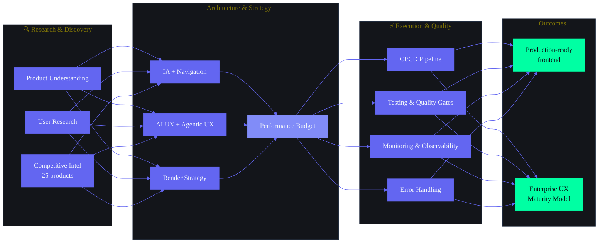

# Enterprise Frontend Discovery Report v3.0 — Second Brain OS (ARIA OS)

> **Part of the Second Brain OS architecture suite.**
> For the full Product Architecture, see [ProductArchitecture.md](./ProductArchitecture.md).
> For the Competitive Intelligence Report, see [Competitive_Intelligence_Report.md](./Competitive_Intelligence_Report.md).

---

## Document Control

| Field | Value |
|---|---|
| Document ID | SB-DISCOVERY-003 |
| Version | 3.0.0 |
| Status | Active |
| Classification | Internal — Enterprise Design & Engineering Reference |
| Target Audience | Product Managers, Designers, Frontend Engineers, AI Engineers, QA, DevOps, Security |
| Last Updated | 2026-06-11 |
| Review Cycle | Quarterly |
| Total Sections | 53 |
| Total Pages Est. | 120+ |
| Supersedes | SB-DISCOVERY-001 (v1.0.0), SB-DISCOVERY-002 (v2.0.0) |

---

## Table of Contents

### Part I — Product Foundation (Sections 1-15)

1. [Executive Summary](#1-executive-summary)
2. [Product Understanding Report](#2-product-understanding-report)
3. [Core Product Vision](#3-core-product-vision)
4. [Core Product Goals](#4-core-product-goals)
5. [Core User Problems](#5-core-user-problems)
6. [Product Positioning](#6-product-positioning)
7. [Product Differentiation](#7-product-differentiation)
8. [Core Product Domains](#8-core-product-domains)
9. [Product Capabilities](#9-product-capabilities)
10. [User Types](#10-user-types)
11. [Core User Journeys](#11-core-user-journeys)
12. [Product Workflow Architecture](#12-product-workflow-architecture)
13. [Data Flow Architecture](#13-data-flow-architecture)
14. [AI Flow Architecture](#14-ai-flow-architecture)
15. [Agent Flow Architecture](#15-agent-flow-architecture)

### Part II — Product Strategy (Sections 16-24)

16. [Dashboard Strategy](#16-dashboard-strategy)
17. [Navigation Strategy](#17-navigation-strategy)
18. [Search Strategy](#18-search-strategy)
19. [Command Center Strategy](#19-command-center-strategy)
20. [Analytics Strategy](#20-analytics-strategy)
21. [Knowledge Strategy](#21-knowledge-strategy)
22. [Learning Strategy](#22-learning-strategy)
23. [Opportunity Strategy](#23-opportunity-strategy)
24. [AI Assistant Strategy](#24-ai-assistant-strategy)

### Part III — Enterprise Depth (Sections 25-39)

25. [Information Architecture Deep Dive](#25-information-architecture-deep-dive)
26. [AI UX Patterns Catalog](#26-ai-ux-patterns-catalog)
27. [Agentic UX Patterns](#27-agentic-ux-patterns)
28. [Render Strategy (CSR / SSR / ISR / RSC)](#28-render-strategy-csr--ssr--isr--rsc)
29. [Frontend Performance Budget](#29-frontend-performance-budget)
30. [Frontend Security Strategy](#30-frontend-security-strategy)
31. [Testing Strategy & Quality Gates](#31-testing-strategy--quality-gates)
32. [Error Handling & Recovery Architecture](#32-error-handling--recovery-architecture)
33. [State Management & Optimistic Update Patterns](#33-state-management--optimistic-update-patterns)
34. [Notification Architecture](#34-notification-architecture)
35. [Data Visualization Component Strategy](#35-data-visualization-component-strategy)
36. [Frontend CI/CD Pipeline](#36-frontend-cicd-pipeline)
37. [Monitoring & Observability](#37-monitoring--observability)
38. [Feature Flags & A/B Testing Framework](#38-feature-flags--ab-testing-framework)
39. [Loading / Empty / Error State Catalog](#39-loading--empty--error-state-catalog)

### Part IV — Platform Strategy (Sections 40-45)

40. [Mobile Strategy](#40-mobile-strategy)
41. [Tablet Strategy](#41-tablet-strategy)
42. [Desktop Strategy](#42-desktop-strategy)
43. [Offline Strategy](#43-offline-strategy)
44. [Realtime Strategy](#44-realtime-strategy)
45. [Accessibility Strategy](#45-accessibility-strategy)

### Part V — Risk, Opportunity & Direction (Sections 46-53)

46. [Product, UX & Technical Risks](#46-product-ux--technical-risks)
47. [Design & Innovation Opportunities](#47-design--innovation-opportunities)
48. [Recommended Direction & Execution Roadmap](#48-recommended-direction)
49. [Research References](#49-research-references)
50. [Appendices](#50-appendices)
51. **NEW** — [Competitive Intelligence Integration](#51-competitive-intelligence-integration)
52. **NEW** — [Enterprise UI Pattern Library](#52-enterprise-ui-pattern-library)
53. **NEW** — [Enterprise UX Maturity Model](#53-enterprise-ux-maturity-model)

---



---

> **Note**: This v3.0.0 document supersedes both v1.0.0 (SB-DISCOVERY-001) and v2.0.0 (SB-DISCOVERY-002). It combines the foundational analysis of v1 with the enterprise-depth sections of v2, upgrades all content with insights from 25-product competitive intelligence research, and adds 3 new enterprise sections (51-53). Total represents a complete enterprise-level discovery document for ARIA OS.

---

# Part I — Product Foundation

---

## 1. Executive Summary

Second Brain OS (ARIA OS) is a first-of-its-kind AI operating system purpose-built for BTech CSE students — a demographic that manages 8-12 disconnected tools, loses 80% of ideas within 24 hours, misses 60% of relevant opportunities, and abandons 70% of courses started. The product consolidates 15 integrated modules (Tasks, Courses, Goals, Habits, Sleep, Income, Projects, Ideas, Resources, Opportunities, YouTube Vault, Academics, Time Tracking, Chat/AI, Automation) into a single surface with 8 AI agents and 1 orchestrator (ARIA) that proactively pushes intelligence rather than waiting to be asked.

**Architecture**: Next.js 14 frontend → FastAPI backend → Supabase PostgreSQL (21 tables, RLS-enforced) → Dual AI layer (Ollama local primary, Claude API fallback) → 8 scheduled cron agents.

**Competitive Positioning**: ARIA OS occupies a unique space no existing tool fills. It has **9 unique features** (course tracking with daily targets, daily briefing, opportunity radar, sleep tracking, income tracking, time tracking, YouTube vault, CGPA calculator, cross-domain pattern detection) that no competitor offers. The competitive moat is student-specific depth, cross-domain integration, zero-cost architecture, and privacy-first local AI — advantages structurally impossible for VC-backed incumbents to replicate.

**Design Philosophy**: Cyberpunk dark theme (#0A0B0F base), neon accents (#6366F1 primary, #00FFA3 secondary), Syne/DM Sans/JetBrains Mono typography, Framer Motion animations, glass morphism panels.

**Competitive UX Gap Summary**: Biggest gaps vs best-in-class products are: Cmd+K command palette, keyboard shortcuts, tiered notification management, hybrid semantic search, and mobile experience. Closing these gaps is the highest-leverage investment.

**Current Status**: 5 agents implemented, 7 design-complete, 3 in shell/stub. Frontend has 15 page routes. Design system defined at atomic level. CI/CD pipeline with 4 jobs.

---

## 2. Product Understanding Report

### 2.1 What Is Second Brain OS?

Second Brain OS is not a productivity tool. It is an AI operating system for a specific human being — a BTech CSE student — that manages their entire digital existence across learning, building, earning, and well-being. The "OS" metaphor is intentional: just as an operating system manages hardware resources, ARIA OS manages the student's cognitive, temporal, and opportunity resources.

### 2.2 What Makes It Unique

The product occupies a space no existing tool fills. Notion is a general-purpose workspace. Todoist is a task manager. Coursera is a learning platform. LinkedIn is a career network. ARIA OS is all of these fused into one system where data flows between modules automatically: a completed course updates your skill profile, which improves opportunity matching, which can be tracked as a goal, which generates tasks, which appear in your daily briefing, which adjusts based on your sleep score.

**Competitive context (from CI research):**
- **Linear** is best-in-class for speed and keyboard UX but covers only issues/projects
- **Notion** is best for composability but lacks proactive AI and student modules
- **Obsidian** is best for knowledge management but has no AI agents or task system
- **ChatGPT** is best for general AI but has no personal data model
- **Stripe** is best for dashboard clarity but covers only payments
- ARIA OS is the **only system** combining: student-specific modules + proactive AI + cross-domain data flow + zero-cost + local AI privacy

### 2.3 Current State of the Product

- **What exists**: 15 frontend page routes, ~53 API endpoints, 21 database tables, 12 prompt files, PromptLoader system, design system fully specified, CI/CD pipeline with 4 jobs
- **What is partially built**: 5 agents implemented, 7 design-complete, 3 shell/stub
- **What is planned but not started**: Browser extension, voice layer, admin panel, mobile apps, analytics platform, monetization
- **Key architectural decisions**: In-process agents (ADR-004), Supabase as single source of truth, PromptLoader-driven prompt management, algorithmic fallback for every AI feature, offline-first PWA architecture

### 2.4 Product Complexity Assessment

| Dimension | Complexity Level | Rationale |
|---|---|---|
| Module Count | Very High | 15 modules with inter-module data flows |
| AI Architecture | High | 8 agents + orchestrator + dual AI backend + prompt versioning |
| Data Modelling | High | 21 tables with RLS, realtime subscriptions, offline sync |
| UI/UX Surface | Very High | 15+ screens with dashboard, kanban, chat, calendar, heatmap, roadmap canvas |
| Offline Requirements | High | 3-layer offline (service worker, IndexedDB, background sync) |
| Real-time Requirements | Medium | Realtime subscriptions for multi-device sync |
| Accessibility | Medium | WCAG 2.1 AA target, cyberpunk theme creates contrast challenges |
| Development Team | Critical | Single developer = bus factor of 1 |

---

## 3. Core Product Vision

**One-sentence vision**: Second Brain OS is the world's first purpose-built AI operating system for BTech CSE students — a unified platform that transforms fragmented student lives into compounded, measurable growth by connecting learning, building, earning, and well-being into a single intelligent system.

**Product philosophy (from CI research)**: "Your second brain should be faster than your first." — Speed, intelligence, proactivity, and compound growth.

**The BHAG**: By 2031, Second Brain OS will help 25,000+ students complete 500,000+ courses, ship 100,000+ projects, and collectively earn Rs. 10 crore+ through opportunities found via the system — while operating at zero cost to every user.

**Five core pillars:**
1. **Active Intelligence** — Pushes information proactively, never waits to be asked
2. **Compound Growth** — Every action feeds every other action (course → skill → project → income)
3. **Privacy First** — Data never leaves user control, RLS on every table, local AI via Ollama
4. **Zero Barriers** — Rs. 0 cost, offline-capable, runs on 8GB RAM
5. **Build First** — Everything funnels toward shipping real things

**The strategic window**: 24-36 months before incumbents (Notion, Todoist, Motion) build student-specific AI features. Moat created by depth of student-specific modules, zero-cost architecture, and privacy-first local AI.

---

## 4. Core Product Goals

### 4.1 Product Goals (Current Phase)

| Goal | Target | Timeline |
|---|---|---|
| Complete 15-module MVP | All modules functional with CRUD + AI features | Q3 2026 |
| Get 100 DAU | Early adopter program at target colleges | Q3 2026 |
| Achieve >60% 30-day retention | Onboarding optimization + habit formation loops | Q4 2026 |
| 15+ tasks completed per user/week | Task engine + AI nudges driving completion | Q4 2026 |
| >60% course completion rate | Linked to goals + daily study targets | Q1 2027 |
| 8+ opportunities found per user/month | Opportunity radar + skill matching | Q1 2027 |

### 4.2 Experience Goals

| Goal | Metric |
|---|---|
| Task completion triggers instant local update before API confirms | <100ms perceived response |
| Morning briefing delivers critical data in under 5 seconds | Glanceability score >90% |
| Quick Capture available from every screen | 1-tap access from any state |
| Zero data loss on navigation or refresh | Auto-save + localStorage persist |
| Cmd+K command palette responds in <60ms | P95 latency (matching Linear benchmark) |
| Keyboard shortcut discovery happens organically | 80% of actions discoverable via Cmd+K |

### 4.3 Business Goals

| Goal | Metric | Timeline |
|---|---|---|
| Organic user acquisition | Rs. 0 CAC | Ongoing |
| Feature adoption | >60% use 5+ modules | 6 months post-launch |
| Notification opt-in | >70% push permission rate | 3 months post-launch |
| Monetization (future) | 5% free-to-paid conversion | 12 months post-launch |

---

## 5. Core User Problems

### 5.1 Fragmentation Problem

BTech CSE students juggle 8-12 tools daily: Todoist (tasks), Notion (notes), Google Calendar (time), Coursera/Udemy (courses), GitHub (projects), LinkedIn (career), Excel (CGPA), bank statements (income), a habit tracker, a sleep tracker, and a notes app for ideas. Each tool has its own login, UI paradigm, notification system, and data model. The cost of context switching is estimated at 40% of productive time.

**Competitive insight**: Single-domain tools (Linear for tasks, Notion for notes, ChatGPT for AI) are optimized within their domain but create fragmentation. ARIA OS's 15-module unified surface solves this structurally — no competitor can match without building 15 integrated products.

### 5.2 Discovery Problem

Students miss 60% of relevant opportunities (internships, hackathons, open source projects, fellowships) because discovery requires monitoring 5+ platforms daily. No existing system proactively matches opportunities to a student's specific skills, interests, and timeline.

### 5.3 Memory Problem

80% of ideas are lost within 24 hours. YouTube tutorials saved to "Watch Later" are never watched. Articles bookmarked are never read. ARIA's Resurface Engine solves this through spaced repetition, goal-linked resurfacing, and 60-day expiry on YouTube saves.

### 5.4 Prioritization Problem

Students have no systematic way to prioritize across work/school/life. No tool correlates sleep quality with productivity or course progress with deadline feasibility. ARIA's Planner agent + sleep-aware scheduling solves this with cross-domain data.

### 5.5 Accountability Problem

Existing tools are reactive — they remind but don't plan, prioritize, or suggest. ARIA's Zero-Miss Policy and 8 proactive agents provide accountability that single-domain tools cannot match.

### 5.6 Pattern Blindness Problem

No existing tool correlates data across domains. A student cannot answer: "Does my sleep affect my productivity?" "Which skills actually generate income?" ARIA's Learning agent provides cross-domain pattern detection that is structurally impossible for siloed tools.

---

## 6. Product Positioning

### 6.1 Positioning Statement

**For BTech CSE students** who manage 8-12 disconnected tools and struggle to track courses, tasks, opportunities, and goals, **ARIA OS** is an **AI operating system** that **unifies 15 life domains into one intelligent surface** with **proactive AI agents that push briefings, radar scans, and nudges** rather than waiting to be asked. Unlike **Notion, Todoist, or Motion** which cover 1-3 domains each, ARIA OS is **purpose-built for student life** with course tracking, opportunity radar, income tracking, and sleep optimization built into a single zero-cost system.

### 6.2 Competitive Landscape

| Competitor | Our Advantage | Their Advantage |
|---|---|---|
| **Notion** | AI agents, course tracking, opportunity radar, income tracking, offline PWA, cyberpunk UI | Mature ecosystem, 50M+ users, template library, team collaboration |
| **Todoist** | AI-prioritized tasks, auto-reschedule, zero-miss policy, sleep-adjusted scheduling | 15+ years of refinement, natural language input, Karma gamification |
| **Motion** | 15 integrated modules, free (Motion is $19/mo), privacy-first local AI, student-specific | Mature AI scheduling, calendar integration, team features |
| **ClickUp** | Specialized for student life, local AI, zero cost, cyberpunk design | Team features, Gantt charts, automation, integrations, enterprise ready |
| **Sunsama** | AI agents, course tracking, opportunity radar, income tracking, zero cost | Beautiful UX, calendar-first approach, team features |
| **Obsidian** | AI built-in, proactive agents, opportunity radar, course tracking | Plugin ecosystem, graph view, local-first, mature knowledge management |
| **Mem/Reflect** | AI agents, 15 modules, proactive push, opportunity scanning | AI-native note-taking, graph knowledge base |
| **Linear** | Student-specific modules, cross-domain data flow, proactive AI, zero cost | Best-in-class keyboard UX, speed, notification management |

### 6.3 Market Timing

The product launches at the convergence of five tailwinds:
1. **AI Native Era** — 72% of Indian college students have tried ChatGPT; users understand AI capabilities
2. **Builder Generation** — 62% of Indian Gen Z want to start a business (Deloitte 2024)
3. **Free Infrastructure Maturity** — Supabase (2M+ users), Vercel, Railway free tiers are battle-tested
4. **Privacy Renaissance** — Local LLMs (Ollama, Llama) make data sovereignty mainstream
5. **India Tech Boom** — 1.5M engineers graduate/year, internship market at all-time high

**TAM**: 7.2M BTech CSE students in India
**SAM**: 600K students who actively use productivity tools
**SOM**: 100 users (Y1) → 30K users (Y5)

---

## 7. Product Differentiation

### 7.1 Structural Differentiators (Hard to Copy)

| Differentiator | Description | Copy Difficulty |
|---|---|---|
| **15-Module Unified Surface** | Courses, tasks, goals, ideas, opportunities, income, projects, habits, sleep, time, resources, YouTube, academics, chat, automation | Very High — requires building 15 integrated products |
| **Student-Specific Modules** | CGPA calculator, semester planner, exam countdown, course deadline tracker, hackathon radar | High — general tools need 5+ new products |
| **Zero-Cost Architecture** | Entire system runs on free tiers: Vercel, Supabase, Ollama, Brave Search, Resend | High — VC-backed competitors must monetize |
| **Privacy-First Local AI** | Ollama runs on student laptops; no data leaves the machine | Very High — centralized AI providers can't offer this |
| **Inter-Module Data Flow** | Course completion → skill update → opportunity matching → goal progress → task generation | Very High — requires deep architectural integration |

### 7.2 Experience Differentiators (Visible to Users)

| Differentiator | Description | User Impact |
|---|---|---|
| **Active Push Intelligence** | 8 cron agents + ARIA proactively push briefings, scans, nudges | No user action needed to get value |
| **Sleep-Adjusted Scheduling** | Low sleep score → lighter tasks surfaced | Prevents burnout, demonstrates system intelligence |
| **Zero-Miss Policy** | Every overdue task must be done, rescheduled, or explicitly dropped | Eliminates guilt-driven task avoidance |
| **Opportunity Radar** | Daily scan of 6 categories matched to user skills | Passive career development |
| **Cyberpunk Design** | #0A0B0F dark theme, neon accents, glass morphism, Framer Motion | Distinctive brand identity, late-night study comfort |

### 7.3 Architectural Differentiators (Engineering)

| Differentiator | Description |
|---|---|
| **PromptLoader System** | All AI prompts externalized in `prompts/` with YAML frontmatter, versioned, validated in CI |
| **Graceful Degradation** | Every AI feature has algorithmic fallback; every agent has inline fallback prompt |
| **In-Process Agents** | Agents run as Python async functions within FastAPI, not microservices (ADR-004) |
| **3-Layer Offline** | Service worker (shell) + IndexedDB (data) + Background Sync (actions) |
| **Dual AI Backend** | Ollama (local, free) primary, Claude API (cloud, paid) fallback |

---

## 8. Core Product Domains

The product operates across 7 interconnected domains:

### 8.1 Productivity Domain
- **Modules**: Tasks, Goals, Projects, Habits, Time Tracking
- **Core Purpose**: Plan, execute, and track progress across all work
- **Key Features**: Task CRUD with auto-prioritization, Pomodoro timer, habit streaks, project phases, goal roadmaps
- **AI Integration**: AI task breakdown, auto-reschedule, priority scoring, sleep-adjusted scheduling
- **CI Benchmark**: Linear sets the bar at <10s task creation, sub-100ms interactions

### 8.2 Learning Domain
- **Modules**: Courses, YouTube Vault, Academic Planner
- **Core Purpose**: Track, complete, and compound learning across all sources
- **Key Features**: Course progress tracking, daily study targets, spaced repetition, YouTube save/watch/archive pipeline, CGPA calculator, exam countdown
- **AI Integration**: Auto-generated study tasks, AI video summaries, spaced resurfacing, course progress nudges
- **CI Benchmark**: No competitor offers this depth of student learning tracking

### 8.3 Knowledge Domain
- **Modules**: Resources, Ideas, YouTube Vault
- **Core Purpose**: Capture, organize, and resurface knowledge
- **Key Features**: Resource library with AI auto-tagging, idea vault with status pipeline, YouTube knowledge vault with expiry system
- **AI Integration**: AI resource summarization, AI market check for ideas, natural language search, topic-based resurfacing
- **CI Benchmark**: Obsidian sets the bar for bi-directional linking; Notion for block-based composability

### 8.4 Career & Opportunity Domain
- **Modules**: Opportunities, Income, Projects
- **Core Purpose**: Find, track, and capitalize on career opportunities
- **Key Features**: 6-category opportunity scanner, skill match scoring, income tracking with hourly rate, project → income mapping
- **AI Integration**: Daily opportunity radar, match score calculation, one-sentence relevance reasoning, AI-generated LinkedIn post drafts
- **CI Benchmark**: No competitor offers student-specific opportunity matching with cross-domain skill data

### 8.5 Well-Being Domain
- **Modules**: Sleep, Habits
- **Core Purpose**: Track and optimize physical and mental well-being
- **Key Features**: Sleep logging, sleep score calculation, bedtime consistency tracking, habit streaks
- **AI Integration**: Wind-down reminders, sleep score adjustments to task scheduling, habit miss detection
- **CI Benchmark**: No competitor integrates sleep data with task scheduling and productivity scoring

### 8.6 Intelligence Domain
- **Modules**: AI Chat (ARIA), Automation, Daily Briefing, Weekly Review
- **Core Purpose**: Proactive intelligence, automation, and insight generation
- **Key Features**: Context-aware AI chat, 8 cron agents, morning briefings, weekly reviews, action execution via natural language
- **AI Integration**: Core AI orchestration, prompt management, memory system, intent classification, agent dispatch
- **CI Benchmark**: Claude's Extended Thinking, ChatGPT's mode selection, Notion AI's native blocks

### 8.7 Analytics Domain
- **Modules**: Dashboard, all modules contribute data
- **Core Purpose**: Measure, visualize, and drive behavior change
- **Key Features**: Productivity score (0-100), GitHub-style heatmap, hourly rate analysis, skill-to-income mapping, module-level KPIs
- **AI Integration**: Pattern detection across modules (learning_agent), weekly analytics summaries, trend identification
- **CI Benchmark**: Stripe's KPI strip clarity, PostHog's multiple analytic lenses, Datadog's correlated views

---

## 9. Product Capabilities

### 9.1 Core Capabilities

| Capability | Description | Status |
|---|---|---|
| CRUD Operations | Create, read, update, delete for all 15 modules | Implemented |
| Supabase RLS | Row-level security on every table | Implemented |
| Real-time Sync | Multi-device instant updates via Supabase Realtime | Implemented |
| Offline Support | 3-layer offline (SW + IDB + Background Sync) | Design Complete |
| Push Notifications | Web Push API for reminders and alerts | Implemented |
| Cmd+K Command Palette | Universal search + navigation + actions | **Not started — P0 gap** |
| Keyboard Shortcuts | Power user two-key navigation | **Not started — P0 gap** |
| Data Export | JSON/CSV export of all modules | Design Complete |
| PWA Installability | Installable web app with service worker | Design Complete |
| Voice Input | Web Speech API for hands-free interaction | Planned |
| Browser Extension | One-tap save from any web page | Planned |

### 9.2 AI Capabilities

| Capability | Agent | Status |
|---|---|---|
| Context-aware chat | ARIA (A00) | Design Complete |
| Task auto-prioritization | Planner (A01) | Design Complete |
| Memory consolidation | Memory (A02) | Shell/Stub |
| Pattern detection | Learning (A03) | Design Complete |
| Proactive reminders | Reminder (A04) | Implemented |
| Career planning | Career (A05) | Design Complete |
| Opportunity scanning | Opportunity (A06) | Shell/Stub |
| Analytics & insights | Analytics (A07) | Design Complete |
| Roadmap generation | Roadmap (A08) | Design Complete |
| Daily briefing generation | Daily Briefing (A09) | Shell/Stub |
| Weekly review generation | Weekly Review (A10) | Implemented |
| Missed task auto-reschedule | Missed Task Checker (A11) | Implemented |
| Habit miss detection | Habit Miss Checker (A12) | Implemented |
| Sleep analysis & wind-down | Sleep & Bedtime (A13) | Implemented |
| Course progress nudges | Course Progress Nudge (A14) | Design Complete |

### 9.3 Integration Capabilities

| Integration | Purpose | Status |
|---|---|---|
| Google OAuth | Authentication | Implemented |
| Google Calendar API | Calendar sync | Planned |
| Brave Search API | Opportunity scanning | Implemented |
| Claude API | Cloud AI fallback | Implemented |
| Ollama | Local AI primary | Implemented |
| Resend API | Email notifications | Implemented |
| Twilio SMS API | SMS escalation | Planned |
| YouTube oEmbed | Video metadata | Implemented |
| GitHub API | Project-repo linking | Planned |

---

## 10. User Types

### 10.1 Primary User — Aarav (BTech CSE Sophomore)

| Attribute | Detail |
|---|---|
| **Age** | 19 |
| **Year** | 2nd Year |
| **College** | Tier-2 engineering college, India |
| **Goals** | High CGPA, learn web development, build 1 side project |
| **Pain Points** | Overwhelmed by 4 college courses + online learning; forgets deadlines; no time management |
| **Device** | Windows laptop + budget Android phone |
| **Usage Pattern** | Morning (check briefing), classes (mobile quick capture), evening (desktop deep work), night (log sleep) |
| **Tech Comfort** | Moderate — comfortable with browser and basic keyboard shortcuts |

### 10.2 Secondary User — Priya (BTech CSE Junior + Intern)

| Attribute | Detail |
|---|---|
| **Age** | 21 |
| **Year** | 3rd Year |
| **Status** | Student + part-time intern at startup |
| **Goals** | Balance academics + internship + side projects; track freelance income; find better opportunities |
| **Device** | MacBook + iPhone |
| **Tech Comfort** | High — uses CLI, Git, knows productivity tools |

### 10.3 Tertiary User — Rohan (BTech CSE Senior + Job Seeker)

| Attribute | Detail |
|---|---|
| **Age** | 22 |
| **Year** | 4th Year |
| **Status** | Job seeking, freelance developer |
| **Goals** | Land placement in top tech company, build portfolio, earn Rs. 50K/month freelancing |
| **Device** | Windows laptop + Android phone |
| **Tech Comfort** | Expert — power user of productivity tools, CLI proficient |

### 10.4 Extended Users

| Persona | Age | Status | Goals | Device |
|---|---|---|---|---|
| **Ananya** — Self-learning Developer | 24 | Working frontend dev, upskilling for full-stack | Transition to full-stack, earn $2K/month freelancing | MacBook + iPhone |
| **Arjun** — Fresh Graduate | 22 | Junior developer | Get AWS certified, switch to better role | Windows laptop |

---

## 11. Core User Journeys

### 11.1 Daily Journey — Aarav (Sophomore) — CI-Upgraded

| Time | Activity | Module | AI Touchpoint | UX Pattern (from CI) |
|---|---|---|---|---|
| 7:00 AM | Wake, check phone | Dashboard / Briefing | ARIA push briefing with top-3 tasks, sleep score, schedule | Pulse (Linear-style batched push at 7 AM) |
| 8:00-12:00 | College lectures | Courses (mobile) | Quick check of today's deadlines | Bottom tab nav, mobile-optimized |
| 12:00-1:00 PM | Lunch break | Quick Capture (any module) | Save idea, save YouTube tutorial | Cmd+Shift+C / FAB / Share extension |
| 3:00-5:00 PM | Study session | Tasks + Time | Pomodoro, AI-prioritized task list | Bounded daily list (Sunsama) |
| 6:00 PM | Coursework | Courses | Course Progress Nudge via push | Tiered notification (Interrupt) |
| 9:30 PM | Wind-down | Sleep | Bedtime reminder with tomorrow's first task | Ambient notification |
| 10:00 PM | Review tomorrow | Dashboard | Evening glance at next day's schedule | Time-of-day adaptive dashboard |
| 11:00 PM | Log sleep | Sleep / Chat | "Good night ARIA" → logs sleep time | Voice input + quick log |

### 11.2 Weekly Journey — Priya (Junior + Intern)

| Day | Focus | Modules Used |
|---|---|---|
| Mon-Fri | Internship (9-5) | Time Tracking, Tasks, Projects |
| Mon/Wed evening | College assignments | Courses, Tasks, Goals |
| Tue/Thu evening | Side project | Projects, Ideas, Resources |
| Fri evening | Weekly review | Weekly Review, Goals |
| Sat | Career prep | Opportunities, Learning |
| Sun | Planning + Rest | Habits, Sleep, Goals, Roadmap |

### 11.3 Placement Prep Journey — Rohan (Senior)

| Phase | Duration | Activities | Key Modules |
|---|---|---|---|
| Awareness | Week 1 | Discover opportunities, understand requirements | Opportunity Radar (daily) |
| Preparation | Week 2-10 | Study DSA, company-specific prep, projects | Learning, Time, Projects |
| Application | Week 8-16 | Apply to companies, track status | Opportunities (status pipeline) |
| Interview | Week 12-20 | Schedule interviews, practice | Calendar sync, Tasks |
| Selection | Week 18-24 | Compare offers, make decision | Goals (decision matrix) |

### 11.4 Task-to-Completion Journey (CI-Upgraded)

1. **Capture**: User types `/task "Complete DBMS assignment"` in Cmd+K, OR uses Quick Capture button, OR browser extension
2. **Enrich**: ARIA auto-assigns priority (medium), category (academics), estimated time (2h), due date — shown inline with confidence badge
3. **Schedule**: Task appears in today's bounded list; Planner agent checks sleep score — if low, schedules for afternoon
4. **Remind**: 15-min missed task checker detects if task passes due; push notification sent (Interrupt tier); if missed twice, email escalation; if missed thrice + high priority, SMS
5. **Complete**: User marks task done → instant optimistic update → API confirmation → streak updated → goal progress recalculated
6. **Review**: Weekly Review agent notes: "You completed 14/20 tasks this week. DBMS was rescheduled 3 times — consider breaking into smaller tasks."

### 11.5 Course Completion Journey

1. **Enroll**: User adds course with target completion date and "why-enrolled"
2. **Plan**: ARIA calculates daily minutes needed, generates study tasks for the week
3. **Track**: Course progress bar updates with each module completion; daily study target on dashboard
4. **Nudge**: Course Progress Nudge (6 PM daily) checks if behind schedule → push notification
5. **Complete**: Course marked done → skills updated → Learning Agent detects new skill → Career Agent may find opportunities
6. **Retain**: Spaced repetition reviews at 1, 3, 7, 14, 30 days resurface key concepts

---

## 12. Product Workflow Architecture

### 12.1 Cross-Module Data Flow Map

```
YouTube Save ──► YouTube Vault
     │
     ├──► AI Summary ──► Resource Library
     │
     └──► Topic Extraction ──► Goals (link video to goal)
                                  │
                                  ├──► Generate Study Tasks ──► Tasks
                                  │                              │
                                  │                              ├──► Time Tracking (Pomodoro)
                                  │                              │
                                  │                              └──► Daily Briefing (top tasks)
                                  │
                                  ├──► Course Progress ──► Dashboard (productivity score)
                                  │
                                  ├──► Skill Update ──► Learning Agent
                                  │                        │
                                  │                        └──► Career Agent
                                  │                              │
                                  │                              └──► Opportunity Radar (match scoring)
                                  │
                                  └──► Income (if monetized skill) ──► Income Tracker
                                                                         │
                                                                         └──► Weekly Review (ROI report)
```

### 12.2 Core Transactional Flows

**Task Creation Flow (CI-Upgraded with Optimistic Updates):**
```
User Input (Cmd+K or Quick Capture or Chat)
     │
     ├──► Local optimistic update (instant, <50ms)
     ├──► POST /api/tasks ──► FastAPI validation
     │                           │
     │                           ├──► AI Priority Assignment (async, 70-90% confidence → "Suggested" badge)
     │                           ├──► Category Detection (async, >90% → auto-accept)
     │                           └──► Supabase INSERT
     │                               │
     │                               ├──► Realtime push to all clients
     │                               ├──► Due date check (≤2h → Interrupt notification)
     │                               └──► UI reconciliation (replace temp with real data)
```

**Chat with ARIA Flow (CI-Upgraded with Multi-Agent Orchestration):**
```
User Message ──► POST /api/chat ──► Context Builder
     │                                       │
     │                                       ├──► Profile snapshot
     │                                       ├──► Active tasks + goals + course status
     │                                       ├──► Sleep score + conversation history + memory
     │                                       │
     │                                       ▼
     │                               Prompt Assembly (aria_system.md + guardrails.md + context)
     │                                       │
     │                                       ▼
     │                               LLM Call (Ollama → Claude fallback)
     │                                       │
     │                                       ├──► Response generation with streaming + thinking display
     │                                       └──► Action JSON (add_task, update_course, etc.)
     │                                           │
     │                                           ▼
     │                                   Action Executor → Supabase
     │                                           │
     │                                           ▼
     │                                   Memory Writer → aria_memory
     │                                           │
     │                                           ▼
     │                                   Response ──► Chat UI with embedded action cards
```

### 12.3 Agent Trigger Patterns

| Pattern | Agents | Description |
|---|---|---|
| Cron (fixed schedule) | Daily Briefing (7AM), Opportunity (6AM), Sleep (9:30PM), Nudge (6PM), Habit (midnight) | Run at specific times regardless of user state |
| Cron (high frequency) | Missed Task (15min), Weekly Review (Sunday 8PM) | Run on shorter intervals or specific days |
| User-triggered | Planner, Career, Roadmap | Called when user asks ARIA for help |
| Event-triggered | Memory (every chat), Learning (daily summary) | Triggered by data events |
| Dependency-triggered | Analytics (all agents), Career (Learning), Roadmap (Planner) | Run after upstream agents complete |

---

## 13. Data Flow Architecture

### 13.1 Frontend → Backend → Database

```
Browser (Next.js)
  Zustand (UI State)     ── Optimistic updates on mutations
  React Query (Server)   ── p95 <60ms for local cache hits
  IndexedDB (Offline)    ── Recent 100 tasks, active courses/goals
  localStorage (Drafts)  ── Quick Capture drafts, unsaved work
  Service Worker (Cache) ── App shell, static assets
       │
       ▼ HTTPS / WSS
FastAPI Backend
  Auth Middleware (JWT) + Rate Limiter + CORS + Routers (x13)
  Services (Business) + Context Builder (AI) + Action Executor (AI)
       │
       ▼
Supabase PostgreSQL
  21 Tables with RLS + Realtime Subscriptions + Edge Functions + pg_cron
```

### 13.2 Data Categories

| Category | Storage | Sync Pattern | Offline Priority |
|---|---|---|---|
| **User Profile** | Supabase + localStorage | On change | High |
| **Tasks** | Supabase + IndexedDB | Realtime + Background sync | Critical |
| **Courses** | Supabase + IndexedDB | Realtime | High |
| **Goals/Roadmaps** | Supabase + IndexedDB | Realtime | Medium |
| **Habits** | Supabase | On change | Medium |
| **Sleep Logs** | Supabase | On change | Low |
| **Income** | Supabase | On change | Low |
| **Opportunities** | Supabase | Fetched daily | Low |
| **Chat Messages** | Supabase | On send | Low |
| **Daily Briefings** | Supabase + IndexedDB | Fetched daily | High |

---

## 14. AI Flow Architecture

### 14.1 Dual AI Backend Architecture (CI-Upgraded)

```
User Request
     │
     ▼
┌─────────────┐
│  AI Router  │
│             │
│ 1. Check USE_LOCAL_AI flag
│ 2. If True → Ollama (localhost:11434)
│ 3. If False → Claude API
│ 4. If Ollama fails → retry 1x → Claude fallback
│ 5. If Claude fails → algorithmic fallback
│ 6. Show confidence indicator at all stages
└─────────────┘
     │
     ├──► Ollama: llama3.1 (8B) or mistral:7b
     │        ├── Latency: 2-10s (student laptop, 8GB RAM)
     │        ├── Cost: Rs. 0
     │        └── Capability: chat, summaries, basic analysis
     │
     └──► Claude: sonnet-4-20250514
              ├── Latency: 1-3s
              ├── Cost: ~$0.015/request (free credits)
              └── Capability: complex reasoning, briefing, review, opportunity parsing
```

### 14.2 AI Interaction Patterns (from CI)

| Pattern | Source | ARIA Implementation |
|---|---|---|
| **Extended Thinking** | Claude | Show "Thinking..." → "Researching..." → "Analyzing..." → "Writing..." |
| **Mode Selection** | ChatGPT | "I want to..." → Plan / Execute / Learn / Reflect |
| **Inline Suggestions** | Cursor | Tab to accept AI-suggested priority, category, due date |
| **Native Blocks** | Notion AI | AI responses embed task cards, progress bars, opportunity cards |
| **Source Grounding** | Perplexity | Every opportunity match: "Why this matches you" with specific skill overlap |
| **Streaming** | ChatGPT | Typewriter effect with blinking cursor, stop button, markdown rendering |
| **Control Surface** | ChatGPT | Pick mode/tools before asking (Plan mode = higher temperature) |

### 14.3 Token Budget Allocation

| Use Case | Input Tokens | Output Tokens | Model |
|---|---|---|---|
| Simple chat | ~200 | ~100 | Ollama |
| Task creation | ~300 | ~50 | Ollama |
| Course progress query | ~400 | ~150 | Ollama |
| Idea market check | ~500 | ~300 | Ollama |
| Daily briefing | ~800 | ~600 | Claude |
| Weekly review | ~1500 | ~800 | Claude |
| Opportunity parsing | ~600 | ~1000 | Claude |
| Memory extraction | ~400 | ~200 | Ollama |
| Pattern detection | ~500 | ~300 | Ollama |

### 14.4 AI Fallback Chain

1. Ollama (primary) → if timeout > 60s or error
2. Ollama retry 1x → if still fails
3. Claude API (fallback) → if Claude also fails
4. Algorithmic default (e.g., "Could not generate briefing. Here are your raw tasks...")

---

## 15. Agent Flow Architecture

### 15.1 Agent Dependency Graph

```
ARIA (A00) ─┬─ Service Agents ──────────────────── Cron Agents
             │    ├── Planner (A01)             ─── Reminder (A04) [no deps]
             │    ├── Memory (A02)              ─── Opportunity (A06) [reads resources]
             │    ├── Learning (A03)            ─── Daily Briefing (A09) [reads all agents]
             │    ├── Career (A05)              ─── Weekly Review (A10) [reads all history]
             │    ├── Analytics (A07)           ─── Missed Task (A11) [reads tasks]
             │    └── Roadmap (A08)             ─── Habit Miss (A12) [reads habits]
             │                                  ─── Sleep & Bedtime (A13) [reads sleep_logs]
             │                                  ─── Course Nudge (A14) [reads courses]
             │
             └──→ Data flows through Supabase tables (agents never call each other directly)
```

### 15.2 Agent Communication Pattern

Agents communicate exclusively through Supabase tables. No agent directly calls another:

```
Agent A writes to Table X → Table X (Supabase) → Agent B reads Table X as part of data assembly
```

This ensures decoupling, observability, resilience, and independent testability.

### 15.3 Agent Scheduling Matrix

| Agent | Schedule | LLM Needed | Max Duration | Retry Policy |
|---|---|---|---|---|
| Daily Briefing | 7 AM daily | Yes (Claude) | 30s | 1 retry, then stub briefing |
| Missed Task | Every 15 min | No | 5s | N/A |
| Opportunity | 6 AM daily | Yes (Claude) | 60s | 2 retries, then skip |
| Roadmap | Sunday 9 AM | No | 10s | N/A |
| Weekly Review | Sunday 8 PM | Yes (Claude) | 60s | 1 retry, then skip |
| Bedtime | 9:30 PM daily | Yes (Ollama) | 10s | 1 retry, then static nudge |
| Habit Miss | Midnight daily | No | 5s | N/A |
| Course Nudge | 6 PM daily | Yes (Ollama) | 10s | 1 retry, then static nudge |

### 15.4 Agent Health Contract

Every agent implements:
- `health()` → status, last_run, success_rate, latency, errors_last_hour
- `metrics()` → calls_total, avg_latency, p95_latency, error_rate, token usage, cost
- `version()` → agent_version, prompt_version, last_updated, code_hash

---

# Part II — Product Strategy

---

## 16. Dashboard Strategy

### 16.1 Design Principles (CI-Upgraded)

The dashboard is the user's home base. It must be:
- **Glanceable**: Critical data in under 5 seconds — Stripe-style KPI strip at top
- **Context-Aware**: Adapts to time of day (morning/midday/evening/night) and sleep score
- **Action-Oriented**: Every card has a clear next action
- **Comparative**: Every metric paired with "vs last week" context (Linear pattern)

### 16.2 Dashboard Zones (CI-Upgraded)

| Zone | Position | Content | Priority | CI Pattern |
|---|---|---|---|---|
| **ARIA Greeting + Status** | Top hero | Time-adaptive greeting, sleep score, task count, opportunities | P0 | Claude thinking display |
| **KPI Strip** | Below greeting | 4-6 glanceable metrics with trend arrows (card-less) | P0 | Stripe card-less KPI |
| **Today's Focus** | Mid left | 3 priority tasks + time blocks (bounded list) | P0 | Sunsama bounded list |
| **Course Target** | Mid right | Daily study minutes, ahead/behind indicator | P1 | Progress bar with context |
| **Tomorrow Preview** | Below | 1 deadline, 2 tasks preview | P1 | Linear Pulse |
| **Activity Heatmap** | Bottom | GitHub-style 6-month grid | P1 | GitHub heatmap |
| **Opportunities** | Bottom | Top 3 from today's radar | P2 | Perplexity source-backed |
| **Recent Activity** | Bottom | Chronological feed | P2 | Linear Pulse feed |

### 16.3 Dashboard States (CI-Upgraded with Time-of-Day Adaptation)

| State | What Shows | CI Pattern |
|---|---|---|
| **Morning (7-10 AM)** | Briefing hero, today's schedule, opportunities, sleep score | Linear Pulse (7 AM batched) |
| **Midday (10 AM-4 PM)** | Task progress, course nudge, quick capture prominence | Focus mode |
| **Evening (4-9 PM)** | Remaining tasks, wind-down, tomorrow preview | Review mode |
| **Night (9 PM+)** | Sleep log prompt, tomorrow's first task, reflection | Sunsama end-of-day ritual |
| **Weekend** | Weekly review link, goal planning, course catch-up | Weekly review mode |
| **New User** | Onboarding wizard with progressive reveal | Notion intent question + checklist |
| **Low Sleep** | Reduced task density, calmer colors, lighter suggestions | Sleep-adaptive UI |

### 16.4 Recommended Dashboard Layout (CI-Upgraded)

```
┌──────────────────────────────────────────────────────────────────┐
│  🌅 GOOD MORNING, AARAV — Sleep 78 · 3 tasks today · 1 opp     │
├──────────────────────────────────────────────────────────────────┤
│  72  │  3/8   │  78  │  +2   │  65%  │  ₹250/hr               │ ← Stripe KPI strip
│  ▲5% │  Tasks │ Sleep│  Opps │ Course│  Income                 │
├─────────────────────┬──────────────────────┬────────────────────┤
│  TODAY'S FOCUS       │  COURSE TARGET        │  TOMORROW PREVIEW  │ ← Sunsama + Linear
│  3 Priority Tasks    │  Node.js: 45min/day   │  1 deadline        │
│  + Time blocks       │  40% behind           │  2 tasks           │
├─────────────────────┴──────────────────────┴────────────────────┤
│  ACTIVITY (7-day) ████░░░░░░  Productivity trend — week view   │ ← PostHog trends
│  HEATMAP (6-month) [GitHub-style grid]                          │
└──────────────────────────────────────────────────────────────────┘
```

---

## 17. Navigation Strategy

### 17.1 Navigation Hierarchy (CI-Upgraded)

```
Level 1: Primary Navigation (always visible)
├── Dashboard (home)
├── Tasks (most frequent)
├── Chat with ARIA (AI assistant)
└── Quick Capture (+ button, any context)

Level 2: Module Navigation (sidebar)
├── Courses │ Goals & Roadmaps │ Projects │ Habits │ Sleep
├── Income │ Ideas │ Resources │ YouTube Vault
├── Opportunities │ Time Tracking │ Academics
└── Automation │ Settings

Level 3: Context Navigation (within module)
├── Module header (title, back, actions)
├── Tab bar (views: list/kanban/calendar/detail)
├── Filters (status, priority, date, tags)
└── Breadcrumbs (object-type breadcrumb — Capacities pattern)
```

### 17.2 Navigation Patterns (CI-Upgraded)

| Pattern | Implementation | CI Source |
|---|---|---|
| **Collapsible Sidebar** | 240px expanded, 64px icon-only, dims on content focus | Linear receding sidebar |
| **Cmd+K Command Palette** | Global search + navigation + actions, local-first | Linear, industry standard |
| **Two-Key Go-To** | G+T → Tasks, G+C → Courses, G+H → Habits | Linear two-key navigation |
| **Tab Bar** | Horizontal tabs for module views | Standard |
| **Breadcrumbs** | Object-type hierarchy (Tasks > Active > Assignment) | Capacities |
| **Page-as-Folder** | Any module becomes parent by containing sub-items | Notion |
| **Quick Switcher** | Cmd+Shift+K for recent + frequent items | Obsidian Quick Switcher |

### 17.3 Sidebar Architecture (CI-Upgraded)

```
┌─────────────────────┐
│  ARIA OS Logo       │  ← Collapsed: icon only
│  Search (Cmd+K)     │  ← Always visible
├─────────────────────┤
│  Dashboard          │  ← Active: neon left border + glow
│  Chat with ARIA     │  ← Badge for unread
│  Tasks              │  ← Badge for overdue count
│  Courses            │
├─────────────────────┤
│  Goals              │  ← Section divider
│  Projects │ Ideas   │
│  Opportunities      │  ← Badge for new matches
│  Resources │ YouTube│
│  Income             │
├─────────────────────┤
│  Habits │ Sleep     │
│  Time │ Academics   │
├─────────────────────┤
│  Automation         │  ← Agent health status dot
│  Settings           │
└─────────────────────┘
```

### 17.4 Navigation Responsiveness

| Breakpoint | Navigation Mode |
|---|---|
| < 768px (Mobile) | Bottom tab bar (5 items) + hamburger menu |
| 768-1024px (Tablet) | Collapsed sidebar (64px icons) + expandable overlay |
| > 1024px (Desktop) | Expanded sidebar (240px), collapsible on demand |

### 17.5 Keyboard Shortcuts (CI-Adopted — Priority from Competitive Gap)

| Shortcut | Action | Context | CI Source |
|---|---|---|---|
| `Cmd+K` | Command Palette | Global | Linear |
| `G+T` | Go to Tasks | Global | Linear two-key |
| `G+C` | Go to Courses | Global | Linear two-key |
| `G+H` | Go to Habits | Global | Linear two-key |
| `G+S` | Go to Sleep | Global | Linear two-key |
| `Cmd+Shift+C` | Quick Capture | Global | Linear |
| `Cmd+1-5` | Modules 1-5 | Global | Standard |
| `/` | Quick create (task, idea, course) | Any context | Notion |
| `Cmd+Enter` | Save and close | Forms | Standard |
| `Escape` | Close modal / deselect | Global | Standard |

---

## 18. Search Strategy

### 18.1 Search Scope (CI-Upgraded)

| Scope | What It Searches | CI Pattern | Priority |
|---|---|---|---|
| **Global Search (Cmd+K)** | All modules — fuzzy title + full-text + natural language | Linear local-first, hybrid semantic | P0 |
| **Module Search** | Within current module only | Standard | P0 |
| **Natural Language** | "react articles from 3 months ago", "high priority tasks due this week" | PostHog NL → query | P1 |
| **Operator Syntax** | `from:ARIA`, `in:Tasks`, `tag:WebDev`, `before:2026-07-01` | Notion operators | P1 |
| **AI Semantic** | Find content related to a concept, not just keywords | Linear vectors + keyword | P2 |

### 18.2 Command Palette (Cmd+K) — CI-Adopted

```
┌──────────────────────────────────────────┐
│ 🔍 Search tasks, courses, anything...   │ ← Auto-focus, live results, p95 <60ms
├──────────────────────────────────────────┤
│ RECENT                                   │ ← Accessed items
│   DBMS Assignment (Task)                 │
│   Node.js Course (Course)                │
├──────────────────────────────────────────┤
│ RESULTS (grouped by module)              │
│   📋 Tasks (3)                           │
│     > Complete DBMS assignment           │ ← Arrow key to select
│   📚 Courses (2)                         │
│     > Node.js - The Complete Guide       │
├──────────────────────────────────────────┤
│ ACTIONS (/ commands)                     │ ← Notion slash pattern
│   /new task "Complete DBMS"              │
│   /new idea "AI study buddy"             │
│   /new course "Node.js"                  │
├──────────────────────────────────────────┤
│ NAVIGATION                               │ ← Shortcut discovery
│   > Dashboard          ⌘1               │
│   > Tasks              ⌘2               │
│   > Courses            ⌘3               │
│   > Chat               ⌘K               │
└──────────────────────────────────────────┘
```

**Critical architecture decision (from Linear)**: Search local data (IndexedDB), not API. p95 <60ms target. Falls back to server full-text for deep content search.

---

## 19. Command Center Strategy

### 19.1 Quick Capture Architecture (CI-Upgraded)

```
Trigger Methods:
├── Keyboard: Cmd+Shift+C (from desktop) — Linear pattern
├── Cmd+K: /new task "..." — Notion slash command
├── Floating Button: + button (bottom-right, any screen)
├── Mobile Share: Share intent from any app
├── Browser Extension: One-tap save from any web page
└── Voice: "Hey ARIA, save this..."

Capture Types (AI auto-detected with confidence indicator):
├── Task: Title + auto-priority (suggested: High) — 80-90% confidence
├── Idea: Title + auto-market check
├── Resource: URL → auto-fetch metadata, AI summary
├── YouTube: URL → auto-fetch title, thumbnail, summary
├── Course: Course URL → auto-detect platform + suggest deadline
└── General Note: Free text → ARIA categorizes later
```

### 19.2 Action Commands (from Cmd+K)

| Command | Description | CI Source |
|---|---|---|
| `/new task` | Quick task creation | Notion slash |
| `/new idea` | Quick idea capture | Notion slash |
| `/new course` | Quick course add | Notion slash |
| `/chat` | Switch to ARIA chat | Standard |
| `/search` | Focus search | Standard |
| `/goto` | Navigate to module | Linear |

---

## 20. Analytics Strategy

### 20.1 Product Analytics (CI-Upgraded)

| Metric | Source | Display | CI Pattern |
|---|---|---|---|
| Productivity Score (0-100) | Tasks completed/due + study time + sleep + habits | Dashboard KPI strip | Stripe KPI |
| Task Completion Rate | tasks.completed_at / tasks.due_date | Dashboard card with trend | PostHog trend |
| Course Progress | courses.progress_percentage | Course cards | Progress bars |
| Habit Streaks | habit_logs consecutive days | Habit module | Gamification |
| Sleep Score | sleep_logs duration + consistency | Sleep module | Correlation views |
| Income Rate | income_entries amount/hours | Income module | Stripe-style clarity |
| Time Distribution | time_entries category | Time module | PostHog donut charts |
| Goal Progress | goals.progress / milestones | Goals module | Timeline view |

### 20.2 Module-Level KPI Targets

| Module | Key Metrics | Target |
|---|---|---|
| Tasks | Created/day, completed/day, rescheduled count, overdue count | 3 created, 2 completed |
| Courses | Active count, progress %, daily study minutes, completion rate | 3 active, >60% completion |
| Goals | Active goals, milestones hit, stalled goals (7d no progress) | 2 active goals |
| Habits | Tracked/day, streak length, consistency % | 3 habits tracked |
| Sleep | Score, duration, bedtime consistency, debt | Score >75 |
| Income | Sources, total/month, hourly rate, skill-to-income map | Rs. 5000/month |
| Opportunities | Scanned/day, saved, applied, match scores | 8 scanned, 2 saved |
| Projects | Active, phases completed, blockers | 1 active project |

### 20.3 Analytics UX Patterns (CI-Upgraded)

| Pattern | Implementation | CI Source |
|---|---|---|
| **KPI Strip** | 4-6 metrics at top, card-less, trend arrows | Stripe |
| **Multiple Lenses** | Same data as trends, funnels, retention, paths | PostHog |
| **Correlated Views** | Sleep vs productivity, skill vs income side-by-side | Datadog |
| **AI Refresh Analysis** | "What changed since yesterday" — ARIA highlights | PostHog |
| **Surgical Accent** | Charts use ONE accent color (#6366F1) | Stripe |
| **Comparison Context** | Every number shows "vs last week" | Linear |
| **Score Gamification** | 0-100 productivity score with daily trend | Standard |

---

## 21. Knowledge Strategy

### 21.1 Knowledge Architecture (CI-Upgraded)

The knowledge system spans 3 modules:

```
KNOWLEDGE ECOSYSTEM
│
├── Resource Library (Intentional Capture)
│   ├── Articles, books, repos, tools, papers, threads
│   ├── AI auto-tagging by topic + skill + goal
│   ├── AI summarization (3-sentence)
│   └── Reading queue prioritized by active goals
│
├── Ideas (Creative Capture)
│   ├── Status pipeline: Raw → Researching → Validating → Building → Archived
│   ├── AI market check (does this exist? competitors?)
│   └── AI enrichment (validation plan, feasibility)
│
└── YouTube Vault (Video Capture)
    ├── One-tap save + auto-metadata
    ├── AI summary of what it teaches
    ├── 60-day expiry → "Keep or Archive?"
    └── Topic extraction + goal linking
```

### 21.2 Resurface Engine (CI-Upgraded with Bi-Directional Linking)

| Trigger | Resurfaces | CI Pattern |
|---|---|---|
| User creates task about a topic | Related resources, ideas, YouTube videos | Obsidian backlinks |
| User starts working on a goal | Resources linked to that goal | Notion databases |
| User marks a course module done | Spaced repetition review (1/3/7/14/30 days) | Ebbinghaus |
| Weekly Review | Unread resources, stalled ideas, unwatched YouTube | Mem review |
| Daily Briefing | Top 1 resource or idea relevant to today's tasks | Linear Pulse |

### 21.3 Knowledge Graph (Future — CI-Inspired)

The long-term vision includes a full knowledge graph where:
- Every resource, idea, course, project, and task is a node
- Connections created by: AI topic extraction, user tagging, goal linking, skill mapping
- Graph visualization enables browsing related knowledge (Obsidian graph)
- AI path finding: "What do I need to learn to build X?"

---

## 22. Learning Strategy

### 22.1 Multi-Source Learning Model (CI-Upgraded)

```
Learning Sources
├── College Courses (4-year BTech)
│   ├── Semester structure with subjects, attendance, assignments
│   ├── Exam countdown with daily study target
│   └── CGPA calculator with what-if scenarios
│
├── Online Courses (Udemy, Coursera, NPTEL)
│   ├── Progress tracking with auto-generated study tasks
│   ├── Daily study target (min/day) calculated from deadline
│   └── Deadline management with early completion bonus
│
└── Self-Directed (YouTube, Articles, Books)
    ├── Save → Schedule → Watch → Review pipeline
    ├── Topic-based organization with goal linking
    └── 60-day expiry drives action (Capacities-inspired)
```

### 22.2 Learning Progress Mechanics

| Mechanic | Description | UX Pattern |
|---|---|---|
| **Daily Target** | Calculated min/day to finish by deadline | Progress bar with "ahead/behind" indicator |
| **Deadline Recalc** | If behind 2 weeks, recalculate daily target | Warning banner + new target |
| **Spaced Repetition** | Reviews at 1/3/7/14/30 days post-completion | Notification + review card |
| **Course Nudge** | 6 PM daily: "You need X min/day to finish" | Tiered notification (Ambient) |
| **Skill Extraction** | Completed course → skills updated in profile | Automatic, shows in profile |

---

## 23. Opportunity Strategy

### 23.1 Opportunity Radar Architecture (CI-Upgraded)

Runs daily at 6 AM IST, scans 6 categories:

| Category | Sources | Match Score Weight |
|---|---|---|
| Internships | LinkedIn, Indeed, Internshala, AngelList | 1.0x |
| Hackathons | Devpost, HackerEarth, MLH, Unstop | 0.8x |
| Open Source | GitHub Issues, GSOC, Outreachy | 0.7x |
| Competitions | Codeforces, CodeChef, Kaggle, LeetCode contests | 0.6x |
| Fellowships | MLH Fellowship, Microsoft Engage, Google STEP | 0.9x |
| Freelance | Upwork, Fiverr, Freelancer | 0.5x |

### 23.2 Match Scoring Algorithm (CI-Upgraded with Source Grounding)

```
Match Score = (Skill Overlap × 0.4) + (Interest Match × 0.3) + (Timeline Feasibility × 0.2) + (Location Fit × 0.1)

Each match includes "Why this matches you" (Perplexity pattern):
├── "You have 3 of 5 required skills: Node.js ✓, React ✓, MongoDB ✓"
├── "This is relevant to your 'Full-Stack Developer' goal"
└── "Deadline in 14 days — matches your available schedule"
```

### 23.3 Opportunity UX Flow

```
1. DAILY RADAR (6 AM) — Brave Search → AI parse → score → filter (≥40) → save
2. MORNING BRIEFING (7 AM) — Top 3 shown; deadlines < 48h → Interrupt notification
3. OPPORTUNITIES MODULE — List with score badges, deadline countdown, relevance sentence
4. WEEKLY REVIEW — "This week's top matches" + application pipeline status
```

---

## 24. AI Assistant Strategy

### 24.1 ARIA Personality & Interaction Model

**Persona**: Supportive Senior + Strategic Partner + Accountability Coach

| Context | Tone | Example |
|---|---|---|
| Tasks | Direct, actionable | "Your DBMS assignment is due tomorrow. Want me to break it into 3 subtasks?" |
| Courses | Encouraging, structured | "You're 40% through Node.js. At your current pace, you'll finish 2 days before deadline." |
| Goals | Strategic, big-picture | "You've been stalled on 'Build Portfolio' for 7 days. Want a micro-task to restart?" |
| Sleep | Gentle, wind-down | "Your sleep score dropped to 62. Bedtime reminder in 30 min?" |
| Habits | Supportive, non-judgmental | "You missed 'Read 30 min' for 2 days. Want to restart or modify the habit?" |

### 24.2 Interaction Modalities (CI-Upgraded)

| Modality | UX Pattern | CI Pattern Applied |
|---|---|---|
| Text Chat | Full chat at /chat with streaming + typewriter | ChatGPT streaming |
| Inline Suggestions | Tab to accept AI-suggested priority/category/due date | Cursor inline |
| Extended Thinking | "Thinking..." → "Researching..." → "Analyzing..." → "Writing..." | Claude thinking |
| Native Blocks | Responses embed task cards, progress bars, opportunity cards | Notion AI blocks |
| Source Grounding | Every recommendation: "Why this matches you" | Perplexity citations |
| Voice Input | Microphone button in chat and quick capture | ChatGPT voice |
| Mode Selection | "I want to..." Plan / Execute / Learn / Reflect | ChatGPT modes |

### 24.3 ARIA Memory Architecture

| Memory Type | Storage | Scope | Retention |
|---|---|---|---|
| Working Context | In-request JSON | Single turn | Request lifetime |
| Conversation History | chat_messages table | Last 50 turns | 90 days |
| Semantic Memory | aria_memory table | Facts, preferences, patterns | Indefinite |
| Episodic Memory | Recent chat + task history | Past 7 days | 7 days rolling |
| User Profile | users_profile table | Skills, goals, preferences | Permanent |

### 24.4 ARIA Action System

ARIA executes actions via JSON parsed from LLM response:

```json
{
  "action": "add_task",
  "data": {
    "title": "Complete DBMS assignment",
    "priority": "high",
    "category": "academics",
    "due_date": "2026-06-15",
    "estimated_minutes": 120
  }
}
```

Supported: `add_task`, `update_task`, `complete_task`, `add_course`, `add_goal`, `log_habit`, `save_idea`, `save_resource`, `add_project`, `log_income`, `log_sleep`, `start_timer`, `stop_timer`

---

# Part III — Enterprise Depth

---

## 25. Information Architecture Deep Dive

### 25.1 Content Inventory — Complete Module Taxonomy

| Module | Label | Content Types | Relationships | Data Volume (Est.) |
|---|---|---|---|---|
| Dashboard | Home | Briefing cards, score widgets, heatmap, activity feed | Aggregates from all modules | ~50 items |
| Tasks | Tasks | Tasks, subtasks, dependencies, recurring patterns | → Goals, Courses, Projects, Time | ~500 active |
| Courses | Courses | Courses, modules, progress snapshots, study targets | → Tasks (study tasks), Skills, Goals | ~20 active |
| Goals | Goals | Goals, milestones (roadmap nodes), goal dependencies | → Tasks, Courses, Projects, Income | ~10 active |
| Habits | Habits | Habit definitions, habit logs, streak records | → Goals, Dashboard | ~15 active |
| Sleep | Sleep | Sleep logs, sleep score history, sleep debt | → Dashboard, Task scheduling | ~365/year |
| Income | Income | Income entries, sources, hourly rates | → Projects, Skills, Goals | ~100/year |
| Projects | Projects | Projects, phases, blockers, GitHub links | → Tasks, Income, Goals | ~5 active |
| Ideas | Ideas | Ideas, status pipeline entries, AI analysis | → Projects, Resources, Goals | ~50/year |
| Resources | Resources | Articles, books, repos, tools, papers, threads | → Goals, Courses, Projects | ~200/year |
| YouTube | YouTube Vault | Saved videos, AI summaries, watch history | → Goals, Courses, Resources | ~100/year |
| Opportunities | Opportunities | Scanned opportunities, applications, matches | → Skills, Goals, Projects | ~500/year |
| Time | Time Tracking | Time entries, Pomodoro sessions, deep work blocks | → Tasks, Projects, Income | ~500/month |
| Academics | Academics | Semester plans, CGPA, subjects, exam schedules | → Courses, Tasks | ~40/semester |
| Chat | ARIA | Chat messages, AI responses, action logs | → All modules (via actions) | ~1000/month |
| Automation | Automation | Cron job status, trigger logs, execution history | → All agents | ~50 logs/day |

### 25.2 Taxonomy Design — Tag & Category System

```
Topic: DSA, WebDev, AI/ML, DevOps, Security, DBMS, OS, Networks
Skill: React, Python, Go, Docker, SQL, TypeScript, AWS
Status: Active, Archived, Draft, Completed, Stalled
Priority: Urgent, High, Medium, Low
Effort: Quick (<30m), Medium (2h), Large (1d), Epic (>1d)
Stage: Learning, Building, Earning, Planning
Source: College, Online, Self-taught, Work, Freelance
```

### 25.3 Wayfinding Model

```
Global Wayfinding:
  Cmd+K Command Palette → any module, action, or item
  Sidebar → module-level navigation
  Object-type Breadcrumbs → Capacities-style hierarchy
  Quick Switcher (Cmd+Shift+K) → recents + favorites

Module Wayfinding:
  Tab Bar → view switching (list/kanban/calendar/detail)
  Search Bar → module-scoped search
  Filter Bar → status, priority, date, tags

Contextual Wayfinding:
  Related Items → AI-suggested related tasks, resources, ideas
  Bi-directional Links → Obsidian-style backlinks
  Deep Links → shareable URLs for any item
  Notification Links → click → specific item
```

---

## 26. AI UX Patterns Catalog

### 26.1 AI Interaction Initiative Spectrum

| Level | Name | Description | Example in ARIA OS | UX Treatment |
|---|---|---|---|---|
| 0 | **Manual** | User initiates, AI does nothing | Raw task creation | Standard form |
| 1 | **Suggestive** | User initiates, AI suggests | Task creation → AI suggests priority | Subtle pill: "Suggested: High" |
| 2 | **Pre-fill** | User initiates, AI pre-fills | Quick Capture → AI detects type + fills fields | Animated fill, editable |
| 3 | **Auto-execute** | User initiates, AI completes silently | Add course → AI auto-generates study tasks | Toast confirmation |
| 4 | **Proactive Suggest** | AI initiates, user confirms | 6 PM: "Behind on Node.js. Add 30min study?" | Notification + one-tap |
| 5 | **Proactive Execute** | AI initiates, executes silently | 7 AM: briefing generated and pushed | Notification only |
| 6 | **Autonomous** | AI acts independently, informs user | Opportunity radar scans, scores, saves | Daily digest |

**Design rule**: Every AI action must have visible agency. Level 5+ requires audit trail.

### 26.2 Confidence Disclosure Patterns (CI-Adopted from Claude/Perplexity)

| AI Confidence | Visual Treatment | User Action |
|---|---|---|
| >90% | Solid state, no indicator | Auto-accept, undo available |
| 70-90% | Subtle "AI suggested" badge | Quick accept/dismiss |
| 50-70% | "Maybe?" indicator + alternatives shown | Review required |
| <50% | Gray, "Couldn't determine" message | Manual input required |
| Error | Red state, fallback value shown | User must correct |

### 26.3 Progressive AI Reveal (CI-Adopted from ChatGPT onboarding)

| Day | AI Feature Revealed | Trigger |
|---|---|---|
| 1 | Quick Capture type detection | First capture |
| 2 | Task priority suggestion | First task creation |
| 3 | Morning Briefing | 7 AM next day |
| 5 | Course study task auto-generation | First course added |
| 7 | Opportunity Radar | First week scan |
| 10 | AI chat (ARIA) | User visits /chat |
| 14 | Memory extraction | 2+ weeks of data |
| 21 | Pattern detection | 3+ weeks of data |
| 30 | Weekly Review | First full month |

### 26.4 AI Feedback Loops

| Feedback Type | UX Pattern | Data Collected |
|---|---|---|
| Implicit (accept) | User clicks "Accept" | Confirmed correct |
| Implicit (override) | User changes AI value | Incorrect — log correction |
| Explicit (positive) | Thumbs up / "Good suggestion" | Training signal |
| Explicit (negative) | Thumbs down / "Not helpful" | Training signal + trigger prompt review |

---

## 27. Agentic UX Patterns

### 27.1 Agent Initiative Continuum

```
User-Driven ──────────────────────────────────────── System-Driven
     │              │              │              │
   Manual        Suggestive     Proactive      Autonomous
   (User asks)   (AI suggests)  (AI offers)    (AI acts)
```

**Agent visibility rules:**
- **Service agents** (Memory, Learning, Analytics): Level 4-6 — user sees results, not process
- **Cron agents** (Briefing, Radar, Nudge): Level 5 — user sees delivery, not execution
- **Interactive agents** (Planner, Career, Roadmap): Level 1-3 — user must initiate, AI assists
- **ARIA**: All levels depending on context

### 27.2 Multi-Agent Orchestration UX (CI-Adopted)

When ARIA dispatches multiple agents:

```
User: "What should I focus on today?"
     ↓
ARIA dispatches: Planner + Sleep + Learning + Opportunity (parallel)
     ↓
Results merge into single briefing response
     ↓
User sees: Unified response with agent attribution
           "📋 Tasks (Planner): 3 priority tasks — DBMS assignment due tomorrow"
           "😴 Sleep (Sleep Agent): Score 78 — light day scheduled"
           "📚 Courses (Learning Agent): Node.js — behind by 2 days"
           "🎯 Opportunities (Radar): 2 new matches >80% match"
```

**UX rules**: Each agent output grouped with icon + name + content. Ordered by user priority. Timed-out agents show gray placeholder. User can click "Why?" for reasoning.

### 27.3 Agent State Visibility

| State | Visual | UX Treatment |
|---|---|---|
| **Idle** | Gray/dimmed | Not currently active |
| **Processing** | Pulsing glow + "Thinking..." | Show estimated time |
| **Complete** | Solid state with data | Show results with timestamp |
| **Failed** | Red/orange with error | Show fallback or retry button |

---

## 28. Render Strategy (CSR / SSR / ISR / RSC)

### 28.1 Rendering Method Per Page

| Page | Method | Rationale |
|---|---|---|
| `/` Dashboard | CSR + ISR (60s) | Personalized, real-time data, static shell cached |
| `/tasks`, `/courses`, `/goals` | CSR | Real-time, user-specific data |
| `/habits`, `/sleep` | CSR | Personal data |
| `/income`, `/projects` | CSR | User-specific |
| `/ideas`, `/resources` | CSR | User-specific |
| `/youtube`, `/opportunities` | CSR | Personalized |
| `/time`, `/academics` | CSR | User-specific |
| `/chat` | CSR | Real-time streaming |
| `/automation` | CSR | User-specific |
| `/login` | SSR | SEO, fast initial load |
| `/offline` | SSG | Static, globally cacheable |
| Landing/marketing | SSR + ISR (1h) | SEO with periodic refresh |

### 28.2 Streaming SSR Strategy

```
Server sends: HTML skeleton → streaming component chunks → client hydrates progressively

Priority order:
1. Shell layout (sidebar, header) — instant
2. Critical data (briefing, today's tasks) — < 1s
3. Secondary data (goals, courses) — < 2s
4. Analytics data (heatmap, stats) — lazy loaded
5. Non-critical (activity feed, suggestions) — idle load
```

---

## 29. Frontend Performance Budget

### 29.1 Bundle Budget

| Asset | Budget | Current (Est.) |
|---|---|---|
| Total JS (all pages) | <400KB gzip | ~250KB |
| Per-page JS | <150KB gzip | ~80KB (avg) |
| CSS (all) | <50KB gzip | ~35KB |
| Fonts (3 families) | <60KB | ~45KB (subset) |
| Images/icons | <100KB | ~30KB (Lucide tree-shaken) |
| **Total per page** | **<300KB gzip** | **~190KB (est.)** |

### 29.2 Performance Budget

| Metric | Target (Desktop) | Target (Mobile) |
|---|---|---|
| First Contentful Paint (FCP) | <1.0s | <1.5s |
| Largest Contentful Paint (LCP) | <2.0s | <2.5s |
| Total Blocking Time (TBT) | <100ms | <200ms |
| Cumulative Layout Shift (CLS) | <0.05 | <0.05 |
| Time to Interactive (TTI) | <2.0s | <3.0s |
| API response (p50) | <200ms | <300ms |
| API response (p95) | <500ms | <800ms |
| AI response (p50) | <3s | <5s |
| **Cmd+K local search (p95)** | **<60ms** | **<100ms** |

### 29.3 Bundle Optimization Rules

1. Route-based code splitting (Next.js default)
2. Lazy load: React Flow, Recharts, heatmap
3. Dynamic import: markdown renderer, code highlighter
4. Tree-shaking: Lucide icons imported individually
5. Font subsetting: Latin only, `display: swap`
6. Image optimization: WebP format, lazy loading
7. Preload critical: Fonts, critical CSS
8. Prefetch likely: Dashboard → Tasks, Chat

---

## 30. Frontend Security Strategy

### 30.1 Security Threat Model

| Threat | Risk Level | Mitigation |
|---|---|---|
| **XSS** | High | React JSX auto-escapes, DOMPurify for markdown/HTML, CSP headers |
| **CSRF** | Medium | Supabase auth handles CSRF, JWT in Authorization header |
| **API Key Exposure** | Critical | All API keys server-side only |
| **JWT Token Theft** | High | Short-lived tokens (1h), httpOnly refresh tokens |
| **LLM Prompt Injection** | High | Input sanitization, output validation, guardrails prompt, rate limiting |
| **npm Dependency Attack** | Medium | Lockfile, Dependabot alerts, Snyk scanning, npm audit in CI |

### 30.2 Content Security Policy

```http
Content-Security-Policy:
  default-src 'self';
  script-src 'self' 'unsafe-eval' 'unsafe-inline';
  style-src 'self' 'unsafe-inline';
  img-src 'self' data: https://img.youtube.com https://*.supabase.co;
  font-src 'self' data:;
  connect-src 'self' https://*.supabase.co https://api.anthropic.com http://localhost:11434;
  frame-ancestors 'none';
  base-uri 'self';
  form-action 'self';
```

### 30.3 Frontend Security Checklist

- [ ] All forms use POST method
- [ ] `dangerouslySetInnerHTML` never used; markdown rendered via DOMPurify
- [ ] No user data in console.log, error messages, or URL params
- [ ] All external links use `rel="noopener noreferrer"`
- [ ] Service worker scope limited to `/` path
- [ ] Sensitive actions require confirmation
- [ ] File upload validation: type, size, scan

---

## 31. Testing Strategy & Quality Gates

### 31.1 Testing Pyramid

```
         ╱╲
        ╱  ╲          E2E (Cypress/Playwright) — 15 critical flows
       ╱    ╲
      ╱──────╲
     ╱        ╲       Integration Tests (React Testing Library)
    ╱          ╲      Component interaction, API mocking, state flows
   ╱────────────╲
  ╱              ╲    Unit Tests (Jest/Vitest)
 ╱                ╲   Pure functions, hooks, utilities, state logic
╱──────────────────╲
╱  Static Analysis  ╲ TypeScript (strict), ESLint, Prettier
╱────────────────────╲
```

### 31.2 Test Coverage Requirements

| Layer | Coverage Target | Critical Paths |
|---|---|---|
| **Unit (hooks, utils)** | >90% | `useTasks`, `useAuth`, `useLocalStorage`, date utils |
| **Unit (state)** | >90% | Zustand stores: `useUIStore`, `useTaskStore` |
| **Integration (components)** | >80% | TaskCard, QuickCapture, CourseCard, BriefingCard, ARIA chat input |
| **E2E (critical flows)** | 15 flows | Task CRUD, chat with ARIA, briefing view, opportunity save, offline sync |

### 31.3 Critical E2E Flows

| Flow | Steps | Verification |
|---|---|---|
| **Task creation → completion** | Create → appears → complete → disappears | Task count, streak |
| **Quick capture → auto-categorize** | Paste URL → AI detects type → save | Correct module save |
| **Chat → action execution** | "Add task X" → ARIA responds → task appears | Chat + task list |
| **Daily briefing generation** | Wait for 7AM or manual trigger → briefing appears | 6 briefing sections |
| **Offline task creation → sync** | Go offline → create → come online → task syncs | Task on server |
| **Keyboard shortcut → action** | Cmd+K → type → navigate | Page changes |
| **Voice input → ARIA** | Speak → text appears → response | Chat response |

### 31.4 Quality Gates (CI)

| Gate | Tool | Threshold | Action |
|---|---|---|---|
| TypeScript | `tsc --noEmit` | 0 errors | Block PR |
| Lint | `next lint` | 0 errors, 0 warnings | Block PR |
| Unit Tests | Jest | >90% coverage, 0 failures | Block PR |
| Accessibility | axe-core | 0 violations | Block PR |
| Bundle Size | bundle-analyzer | Within budget | Warning at +10% |
| Lighthouse | Lighthouse CI | Performance > 90 | Warning |

---

## 32. Error Handling & Recovery Architecture

### 32.1 Error Classification (CI-Upgraded with Stripe Error Patterns)

| Class | Description | UX Treatment | Recovery |
|---|---|---|---|
| **Network** | API unreachable, timeout | Offline mode activation + toast | Background sync on reconnect |
| **Auth** | Token expired, unauthorized | Silent refresh → if fails, redirect | Refresh token rotation |
| **Validation** | Bad input, missing fields | Inline error on field + toast summary | User corrects input |
| **Server** | 500, 503, rate limited | Generic error message + retry button | Exponential backoff retry |
| **AI** | LLM timeout, bad response | Fallback content + "AI unavailable" indicator | Retry → algorithmic fallback |
| **Storage** | IndexedDB full, quota exceeded | Warning toast + cleanup suggestion | Auto-clean or user action |
| **Runtime** | JS exception | Error boundary → fallback UI + Sentry | Refresh or navigate away |

**Stripe-inspired error messages**: Every error explains what happened, why it happened, and how to fix it. No technical jargon.

### 32.2 Error Boundary Hierarchy

```
App Root Error Boundary
  ├── Layout Error Boundary (sidebar, header)
  ├── Module Error Boundaries (15 modules, each independent)
  │    ├── Tasks Error Boundary
  │    ├── Courses Error Boundary
  │    └── ...
  ├── Chat Error Boundary
  └── Dashboard Error Boundary (with zone-level recovery)
```

### 32.3 API Error Handling Contract

```typescript
interface ApiError {
  status: number
  code: ErrorCode       // 'VALIDATION_ERROR' | 'NOT_FOUND' | 'RATE_LIMITED'
  message: string        // User-friendly — explains what + why + how to fix
  details?: unknown      // Dev-only, never shown to user
  retryAfter?: number    // For rate limiting
}
```

---

## 33. State Management & Optimistic Update Patterns

### 33.1 State Architecture (CI-Upgraded with Linear-Speed Optimism)

```
┌─────────────────────────────────────────────────────────────┐
│                     Zustand (UI State)                       │
│  sidebarOpen, theme, activeModule, modalStack, toastQueue   │
│  Keyboard bindings, command palette state, quick capture    │
└──────────────────┬──────────────────────────────────────────┘
                   │
┌──────────────────┴──────────────────────────────────────────┐
│                React Query (Server State)                    │
│  ┌──────────┐ ┌──────────┐ ┌──────────┐ ┌──────────┐       │
│  │  Tasks   │ │ Courses  │ │  Goals   │ │   ...    │       │
│  │  query   │ │  query   │ │  query   │ │  other   │       │
│  │  cache   │ │  cache   │ │  cache   │ │ modules  │       │
│  └──────────┘ └──────────┘ └──────────┘ └──────────┘       │
│  Stale time: 30s │ Cache time: 5min │ Retry: 3x            │
└──────────────────┬──────────────────────────────────────────┘
                   │
┌──────────────────┴──────────────────────────────────────────┐
│              IndexedDB (Offline State)                       │
│  tasks (100), courses (active), goals (active), briefings    │
│  + offline mutation queue + sync metadata                    │
└─────────────────────────────────────────────────────────────┘
```

### 33.2 Optimistic Update Pattern (CI-Upgraded for Sub-100ms Feel)

```typescript
// Standard pattern for ALL mutations — matching Linear's speed
const mutation = useMutation({
  mutationFn: (newTask) => api.createTask(newTask),

  onMutate: async (newTask) => {
    await queryClient.cancelQueries({ queryKey: ['tasks'] })
    const previous = queryClient.getQueryData(['tasks'])
    // Instant local update — user sees result in <50ms
    queryClient.setQueryData(['tasks'], (old) => [...old, { ...newTask, id: 'temp-id', status: 'pending' }])
    return { previous }
  },

  onSuccess: (realTask, _vars, context) => {
    // Seamless replacement — user doesn't notice
    queryClient.setQueryData(['tasks'], (old) =>
      old.map(t => t.id === 'temp-id' ? realTask : t)
    )
  },

  onError: (_err, _vars, context) => {
    // Rollback with toast — transparent about failure
    queryClient.setQueryData(['tasks'], context.previous)
    toast.error('Failed to create task. Your changes have been saved offline and will sync when reconnected.')
  },
})
```

### 33.3 Optimistic Update Rules by Module

| Module | Optimistic? | Rollback Strategy | Notes |
|---|---|---|---|
| Tasks | ✅ Yes | Full rollback | Most frequent mutation |
| Courses | ✅ Yes | Full rollback | Progress updates |
| Goals | ✅ Yes | Full rollback | Milestone updates |
| Habits | ✅ Yes | Full rollback | Daily logging |
| Sleep | ✅ Yes | Full rollback | Nightly log |
| Income | ❌ No | Error state | Financial accuracy |
| Opportunities | ❌ No | Error state | Application status accuracy |
| Chat | ✅ Yes | Optimistic message | Streaming confirms |

---

## 34. Notification Architecture

### 34.1 Notification Channel Strategy

| Channel | Urgency | Cost | Reliability | User Control |
|---|---|---|---|---|
| **In-app toast** | All levels | Free | High | Per-module toggle |
| **In-app badge** | Low-Medium | Free | High | Per-module toggle |
| **Web Push** | Medium-High | Free | Medium | Per-type toggle + quiet hours |
| **Dashboard banner** | Low | Free | High | Auto-dismiss |
| **Email (Resend)** | High-Critical | ~$0.001/email | High | Per-type toggle |
| **SMS (Twilio)** | Critical only | ~$0.02/SMS | Very High | Critical only |

### 34.2 Notification Priority Matrix (CI-Adopted from Linear Tiering)

| Tier | Notification | Channel | Priority | Cooldown |
|---|---|---|---|---|
| **Interrupt** | Deadline in <2h | Push | High | Per task |
| **Interrupt** | Task missed (3rd time + high priority) | Push + Email + SMS | Critical | Immediate |
| **Ambient** | Task missed (1st time) | Push | Medium | 15 min |
| **Ambient** | Course nudge (behind) | Push + Dashboard | Medium | 1/day per course |
| **Ambient** | Course deadline <1 week | Push | High | 1/day |
| **Ambient** | Bedtime reminder | Push | Medium | 1/day |
| **Digest** | Morning Briefing | Push + Dashboard | High | 1/day |
| **Digest** | Opportunity found (>80% match) | Push + Briefing | Medium | Per opportunity |
| **Digest** | Weekly review ready | Push + Dashboard | Medium | 1/week |
| **Digest** | Habit missed 2+ days | Push | Low | 1/day |

### 34.3 Notification UX Rules (CI-Adopted)

1. **No notification without context**: Every push includes module name and item title
2. **Actionable**: Clicking opens the exact item, not just the module
3. **Quiet hours**: User-configurable (default 11 PM - 7 AM), only Critical passes through
4. **Batched delivery**: Non-urgent notifications batched into Pulse/Briefing
5. **Notification center**: In-app history with read/unread, grouped by module
6. **Rate limiting**: Max 5 push notifications per hour per user
7. **Work state model**: Focus (Critical only), Available (default), Review (batched)
8. **Sleep-aware**: Auto-enable Focus when sleep score < 60

---

## 35. Data Visualization Component Strategy

### 35.1 Chart Types & Usage (CI-Upgraded)

| Chart Type | Use Case | CI Pattern Applied | Library |
|---|---|---|---|
| **Line chart** | Trends over time (sleep score, productivity, income) | Stripe clarity | Recharts |
| **Bar chart** | Comparisons (income by source, time by category) | PostHog trends | Recharts |
| **Progress bar** | Goal/course completion, streak length | Standard | CSS + Tailwind |
| **Donut/pie** | Distribution (time allocation, income breakdown) | PostHog analytics | Recharts |
| **Heatmap** | Daily activity over 6 months | GitHub-style | Custom SVG |
| **Kanban board** | Task/project stage visualization | Standard | Custom react-dnd |
| **Roadmap canvas** | Goal milestones with dependencies | Standard | React Flow |
| **Radar chart** | Skill profile, multi-dimensional comparison | PostHog | Recharts |
| **KPI strip** | 4-6 glanceable metrics with trend arrows | Stripe | Custom HTML+CSS |

### 35.2 Chart Design Tokens (CI-Upgraded — Single Accent Color)

```css
/* Single accent color strategy (Stripe-inspired) */
--chart-line: #6366F1;
--chart-area: rgba(99, 102, 241, 0.1);
--chart-bar: #818CF8;
--chart-point: #00FFA3;
--chart-grid: #1E293B;
--chart-axis: #475569;

/* Multi-series (for comparison charts only) */
--chart-series-1: #6366F1;  /* Indigo — primary */
--chart-series-2: #10B981;  /* Emerald */
--chart-series-3: #F59E0B;  /* Amber */
--chart-series-4: #EF4444;  /* Red */
--chart-series-5: #8B5CF6;  /* Violet */
```

### 35.3 Chart Interaction Patterns

| Interaction | Implementation |
|---|---|
| **Hover tooltip** | Show exact value + "vs last week" context |
| **Click drill-down** | Click segment → filter/view detail |
| **Brush/zoom** | Select time range to zoom |
| **Legend toggle** | Click legend to toggle series |
| **Animation** | Animate on first render (once, respects reduced-motion) |
| **Export** | Download as PNG via html2canvas |
| **Empty state** | "No data yet — start tracking to see trends" |
| **Loading state** | Skeleton chart with shimmer |

---

## 36. Frontend CI/CD Pipeline

### 36.1 Pipeline Stages

```
git push → GitHub
    ↓
CI Pipeline:
  Stage 1: Install & Build — npm ci, next build
  Stage 2: Code Quality — tsc --noEmit, next lint, prettier --check
  Stage 3: Tests — jest --coverage, cypress run (15 critical flows), axe-core
  Stage 4: Performance & Security — Lighthouse CI, bundle-analyzer, npm audit, Snyk
  Stage 5: Visual Regression — Chromatic/Percy (UI diff check)
  Stage 6: Deploy (main only) — Vercel deploy, E2E smoke tests on production
```

### 36.2 Deployment Strategy

| Branch | Deploy Target | Auto-deploy |
|---|---|---|
| `main` | Production (vercel.com) | Yes |
| `staging` | Staging (vercel-staging) | Yes |
| `feature/*` | Preview (auto-generated URL) | Yes |

**Rollback**: Vercel instant rollback via dashboard or `vercel rollback` CLI.

---

## 37. Monitoring & Observability

### 37.1 Frontend Monitoring Stack

| Concern | Tool | What It Monitors |
|---|---|---|
| Real User Monitoring | Vercel Analytics | Page views, web vitals (LCP, FCP, CLS, INP) |
| Error Tracking | Sentry | JS exceptions, API errors, unhandled rejections |
| Performance | Sentry Tracing | Slow transactions, bundle load time |
| AI Performance | Custom instrumentation | LLM latency, token usage, fallback rate |
| Offline/Online | Custom (navigator.onLine) | Offline duration, sync queue size |
| Usage Analytics | PostHog | Feature adoption, funnel completion, retention |
| Session Recording | PostHog (sampled) | User behavior patterns |

### 37.2 Custom Instrumentation Points

| Event | Data Captured | Purpose |
|---|---|---|
| `task.created` | Source, time to create | Quick capture efficiency |
| `task.completed` | Time since due, priority | Completion patterns |
| `ai.chat.completed` | Latency, model, tokens, fallback used | AI cost + performance |
| `briefing.viewed` | Time, engagement (scrolled/clicked) | Briefing relevance |
| `offline.action.queued` | Action type, queue size | Offline usage patterns |
| `opportunity.saved` | Match score, category | Radar relevance |

---

## 38. Feature Flags & A/B Testing Framework

### 38.1 Feature Flag Architecture

```typescript
interface FeatureFlag {
  key: string
  description: string
  owner: string
  expiresAt?: Date
  targeting: {
    users?: string[]
    percentage?: number     // Rollout percentage
    cohorts?: string[]     // A/B test cohorts
    environment?: string[]
  }
  dependsOn?: string[]
}
```

### 38.2 A/B Testing Candidates

| Test Idea | Control | Test | Metric | Duration |
|---|---|---|---|---|
| Dashboard layout | Current list | Bento grid | Task completion rate | 2 weeks |
| AI suggestion prominence | Subtle badge | Highlighted card | Acceptance rate | 2 weeks |
| Briefing time | 7 AM | 6:30 AM | Engagement rate | 1 week |
| Notification frequency | Per-event | Batched hourly | Opt-out rate | 2 weeks |

---

## 39. Loading / Empty / Error State Catalog

### 39.1 Loading State Patterns (CI-Upgraded with Linear-Speed Skeletons)

| Component | Loading Treatment | Animation | Duration |
|---|---|---|---|
| Page shell | Skeleton layout (sidebar + header) | Pulse | 200-500ms |
| Task list | 5 skeleton rows (varying width) | Staggered fade-in | 300-800ms |
| Dashboard | Zone-by-zone progressive loading | Top-down reveal | 200ms-2s |
| Chat messages | Empty shell with pulsing input | Typing indicator | 500ms-3s |
| Chart/Graph | Animated placeholder shape | Shimmer | 200ms-1s |
| ARIA response | Streaming text (character by character) | Typewriter | 1-10s |
| Cmd+K palette | Instant results (local search) | None (<60ms) | <60ms |

### 39.2 Empty State Catalog (CI-Upgraded with Action-Oriented Design)

| Module | Empty State Message | CTA |
|---|---|---|
| Tasks | "No tasks yet. Your second brain is ready." | "+ Add your first task" |
| Courses | "Start learning something new." | "Add a course from Udemy, Coursera, or YouTube" |
| Goals | "What do you want to achieve?" | "Set your first goal" |
| Habits | "Small steps, big changes." | "Start with one habit" |
| Sleep | "Track your sleep to see patterns." | "Log last night's sleep" |
| Income | "Track your earnings." | "Add your first income entry" |
| Projects | "Ready to build something?" | "Start your first project" |
| Ideas | "Your next big idea starts here." | "Capture your first idea" |
| Resources | "Save resources as you learn." | "Save your first resource" |
| YouTube | "Your learning playlist is empty." | "Save your first video" |
| Opportunities | "Opportunities will appear here daily." | "Setup your skills to start matching" |
| Dashboard | "Welcome to ARIA OS." | "Start 5-minute onboarding" |
| Chat | "Hi, I'm ARIA. Ask me anything." | Type a message... |

### 39.3 Error State Catalog (CI-Upgraded with Stripe Error Patterns)

| Scenario | Error Message | Recovery Action |
|---|---|---|
| Network offline | "You're offline. Changes will sync when reconnected." | "Retry" + auto-sync indicator |
| API 500 | "Something went wrong. Please try again." | "Retry" button |
| Rate limited | "Too many requests. Please wait a moment." | Auto-retry with countdown |
| Auth expired | "Session expired. Please log in again." | "Log in" redirect |
| AI unavailable | "ARIA is temporarily unavailable. Your tasks are still here." | "Retry" or "Use offline mode" |
| Sync conflict | "This item was updated on another device. Using latest version." | "View changes" link |

---

# Part IV — Platform Strategy

---

## 40. Mobile Strategy

### 40.1 Mobile Context (CI-Upgraded)

Primary mobile use cases are consumption and quick capture:

| Use Case | Frequency | Duration | CI Pattern |
|---|---|---|---|
| Morning briefing check | Daily (7-8 AM) | 30-60s | Linear Pulse push |
| Task quick-add | 3-5x/day | 10-15s | Cmd+K mobile |
| Deadline checking | 2-3x/day | 5-10s | Quick glance |
| Habit logging | 2-3x/day | 5-10s | Swipe + tap |
| Sleep logging | Daily (night) | 10-15s | One-tap log |
| Quick idea capture | 2-3x/day | 10-15s | Share extension |
| YouTube save | 1-2x/day | 5s | Share extension |

### 40.2 Mobile Navigation (CI-Upgraded with Linear Liquid Glass)

```
Bottom Tab Bar (always visible, 5 customizable items):
┌──────────┬──────────┬──────────┬──────────┬──────────┐
│  Home    │  Tasks   │    +     │  Chat    │  More    │
│ (Briefing)│ (Today) │ (Capture)│ (ARIA)  │ (Modules)│
└──────────┴──────────┴──────────┴──────────┴──────────┘
```

- **Home**: Dashboard summary (briefing, KPI strip, top 3 tasks)
- **Tasks**: Today's bounded list, swipe to complete
- **+**: Quick Capture modal (task, idea, resource, YouTube)
- **Chat**: ARIA chat with voice input
- **More**: Full module list (scrollable grid)

### 40.3 Mobile Gesture Map

| Gesture | Action | Source |
|---|---|---|
| Swipe left (task) | Complete task | Linear-like |
| Swipe right (task) | Reschedule (tomorrow) | Mail app |
| Swipe down (page) | Pull to refresh | Standard |
| Long press (item) | Context menu | Standard |
| Double tap (briefing) | Expand/collapse | Capacities |

### 40.4 Mobile Performance Targets

| Metric | Target |
|---|---|
| App Shell Load | < 2s |
| Task List Render | < 500ms |
| Quick Capture Open | < 100ms |
| Chat Response (Ollama) | < 5s |
| Offline Mode Activation | Instant |
| Background Sync | < 10s after reconnect |

---

## 41. Tablet Strategy

### 41.1 Tablet Layout Adaptations

| Element | Portrait | Landscape |
|---|---|---|
| Sidebar | Overlay (slide from left) | Persistent (collapsed icons 64px) |
| Dashboard | 2-column bento grid | 3-column bento grid |
| Task List | Full width with detail panel | Split view: list + detail |
| Kanban | 2 columns visible | 3 columns visible |

### 41.2 Tablet Interaction Patterns

| Pattern | Implementation | Benefit |
|---|---|---|
| Drag & drop split | Drag task → drop into calendar slot | Natural scheduling |
| Two-thumb navigation | Left: sidebar, Right: content | Ergonomic hold |
| Pencil/hover | Hover preview, tap select, pencil write | Precision input |
| Floating toolbar | Context-sensitive near selection | Reduces travel |

---

## 42. Desktop Strategy

### 42.1 Desktop Layout Architecture

```
┌──────────────────────────────────────────────────────────────────┐
│  Header Bar (64px)                                               │
│  Logo | Search (Cmd+K) | Quick Capture | Quick Actions | User    │
├──────────┬───────────────────────────────────────────────────────┤
│  Sidebar │  Content Area (flex)                                   │
│  (240px) │    Module Header (title + actions + tabs)             │
│          │    Main Content (scrollable)                           │
│  Collaps │      Bento grid / list / kanban / detail view         │
│  ible to │                                                       │
│  64px    │    Optional Right Panel (320px) — context, links     │
├──────────┴───────────────────────────────────────────────────────┤
│  Status Bar (32px) — Online status, last sync, agent health      │
└──────────────────────────────────────────────────────────────────┘
```

### 42.2 Desktop Window Modes

| Mode | Layout | Trigger |
|---|---|---|
| **Normal** | Sidebar (240px) + Content (flex) | Default |
| **Focus** | Sidebar collapsed (64px) + Content (full) | Cmd+Shift+F |
| **Chat overlay** | Content (70%) + Chat (30%) | Cmd+Shift+C |
| **Multi-monitor** | Content on main, chat on secondary | Manual |

### 42.3 Desktop Drag & Drop Ecosystem

| Source | Target | Action |
|---|---|---|
| Task | Calendar time slot | Schedule task |
| Task | Goal milestone | Link to milestone |
| Resource | Course card | Link to course |
| Idea | Project card | Convert to project |
| Course | Goal milestone | Link to goal |
| Task | Kanban column | Change status |

---

## 43. Offline Strategy

### 43.1 Offline Architecture (3-Layer)

```
Layer 1: App Shell (Workbox SW)
├── StaleWhileRevalidate for page routes
├── NetworkFirst for /api/* requests
├── CacheFirst for static assets
└── Fallback: Offline page at /offline

Layer 2: Local Data Store (IndexedDB via idb)
├── Tables: tasks (100), courses (active), goals (active), briefings (current week)
├── Read from IndexedDB when offline
├── Write to IndexedDB immediately (optimistic)
└── Sync to Supabase on reconnect

Layer 3: Background Sync
├── Queue offline actions in IndexedDB
├── On reconnect: replay in FIFO order
├── Conflict: last-write-wins (server timestamp)
└── Visual: pending sync count in status bar
```

### 43.2 Offline Capability Matrix

| Module | Read Offline | Write Offline | Sync on Reconnect |
|---|---|---|---|
| Tasks | ✅ (recent 100) | ✅ | ✅ |
| Courses | ✅ (active) | ✅ | ✅ |
| Goals | ✅ (active) | ✅ | ✅ |
| Habits | ✅ (active) | ✅ | ✅ |
| Dashboard | ✅ (cached briefing) | ❌ | ❌ |
| Opportunities | ✅ (cached) | ❌ | ❌ |

### 43.3 Offline UX

| State | UX Treatment |
|---|---|
| **Going Offline** | Subtle toast: "You're offline — changes will sync when reconnected" |
| **Offline Active** | Status bar indicator (yellow dot), muted icons for unavailable features |
| **Reconnecting** | Background sync runs silently |
| **Sync Conflict** | Toast: "Conflict detected. Using latest version." |
| **Coming Online** | Success toast: "All changes synced." Status bar returns to green |

---

## 44. Realtime Strategy

### 44.1 Realtime Architecture

Supabase Realtime subscriptions:

| Subscription | Table | Events | Purpose |
|---|---|---|---|
| Tasks | tasks | INSERT, UPDATE, DELETE | Multi-device sync |
| Courses | courses | UPDATE | Progress sync |
| Goals | goals | UPDATE | Milestone progress |
| Habits | habit_logs | INSERT | Streak updates |
| Sleep | sleep_logs | INSERT | Score updates |

### 44.2 Realtime UX Patterns

| Pattern | Implementation | Latency Target |
|---|---|---|
| **Optimistic Updates** | Update local state instantly | < 50ms perceived |
| **Live Presence** | "You" + "Other device" indicator | < 200ms |
| **Sync Status** | Green/yellow/red indicator in status bar | Real-time |

---

## 45. Accessibility Strategy

### 45.1 WCAG 2.1 AA Compliance Targets

| Guideline | Requirement | Implementation |
|---|---|---|
| 1.4.3 Contrast | 4.5:1 normal, 3:1 large text | #F0F2F5 on #0A0B0F = 14.5:1 ✅ |
| 2.1.1 Keyboard | All functionality via keyboard | Cmd+K, tab, arrow keys |
| 2.4.7 Focus Visible | Visible focus indicator | Glow ring: `focus-visible:ring-2` |
| 4.1.2 Name, Role, Value | All controls have accessible names | aria-* attributes on all components |

### 45.2 Screen Reader Specific Patterns

| Pattern | Implementation |
|---|---|
| Live regions | `aria-live="polite"` on briefing, notifications, chat |
| Progress announcements | `aria-valuenow`, `aria-valuemin`, `aria-valuemax` |
| Drag alternatives | Keyboard reorder (Alt+Up/Down) for all draggable lists |
| Chart data tables | Hidden `<table>` alternative for every chart |
| Command palette | `role="combobox"` with `aria-activedescendant` |

### 45.3 Reduced Motion Specification

```css
@media (prefers-reduced-motion: reduce) {
  *, *::before, *::after {
    animation-duration: 0.01ms !important;
    animation-iteration-count: 1 !important;
    transition-duration: 0.01ms !important;
  }
  .animate-pulse-glow,
  .animate-float { animation: none !important; }
}
```

### 45.4 High Contrast Mode

| Token | Normal | High Contrast |
|---|---|---|
| `bg-background` | #0A0B0F | #000000 |
| `text-primary` | #F0F2F5 | #FFFFFF |
| `text-secondary` | #8B92A5 | #CCCCCC |
| `accent-primary` | #6366F1 | #9999FF |
| `accent-neon` | #00FFA3 | #00FF88 |

### 45.5 Accessibility Testing Cadence

| Frequency | Test Type | Tool/Method |
|---|---|---|
| Every PR | Automated scan | axe-core via Cypress |
| Weekly | Manual keyboard audit | Tab through all flows |
| Bi-weekly | Screen reader test | VoiceOver + NVDA |
| Monthly | Color contrast audit | WCAG Contrast Checker |
| Quarterly | Full WCAG 2.1 AA audit | Manual + axe DevTools |

---

# Part V — Risk, Opportunity & Direction

---

## 46. Product, UX & Technical Risks

### 46.1 Risk Quantification Matrix with RPN Scores (CI-Upgraded)

| Risk ID | Risk | Category | Likelihood (1-5) | Impact (1-5) | RPN Score | Mitigation |
|---|---|---|---|---|---|---|
| R-001 | Single developer leaves | Team | 4 | 5 | **20** | Document everything, cross-train, open source |
| R-002 | Ollama too slow on student HW | AI | 4 | 4 | **16** | Claude fallback, algorithmic fallback |
| R-003 | 15 modules overwhelm users | UX | 5 | 4 | **20** | Onboarding wizard, progressive reveal |
| R-004 | Notification fatigue | UX | 4 | 4 | **16** | Linear tiering, batching, quiet hours |
| R-005 | AI responses feel generic | AI/UX | 3 | 4 | **12** | Memory system, personalization |
| R-006 | Cmd+K search too slow | UX | 3 | 3 | **9** | Local-first search (IndexedDB), target <60ms |
| R-007 | Keyboard shortcuts not discovered | UX | 3 | 3 | **9** | Show shortcuts in Cmd+K, tooltips |
| R-008 | Incumbent builds similar features | Competition | 2 | 3 | **6** | Student-specific moat, local AI |
| R-009 | Prompt injection vulnerabilities | Security | 3 | 5 | **15** | Input sanitization, guardrails |
| R-010 | Offline sync conflicts | Technical | 3 | 3 | **9** | LWW + server timestamps |

### 46.2 Technical Debt Register

| Debt Item | Severity | Effort | Priority |
|---|---|---|---|
| No Cmd+K command palette | High | Medium | P0 |
| No keyboard shortcuts | High | Low | P0 |
| No E2E test coverage | High | High | P1 |
| No notification tiering | High | Medium | P1 |
| No CSP headers in production | High | Low | P1 |
| No bundle size monitoring in CI | Medium | Low | P2 |
| Inconsistent error handling | Medium | High | P2 |
| No loading/empty/error states | Medium | High | P2 |

---

## 47. Design & Innovation Opportunities

### 47.1 Design Opportunity Prioritization (CI-Upgraded)

| Opportunity | Value | Effort | Priority | CI Source |
|---|---|---|---|---|
| Cmd+K Command Palette | 5 | 2 | **20** | Linear — P0 gap |
| Keyboard shortcuts (two-key nav) | 5 | 1 | **25** | Linear — P0 gap |
| Tiered notifications (Interrupt/Ambient/Digest) | 5 | 2 | **20** | Linear |
| Empty states as onboarding moments | 5 | 1 | **25** | Stripe, Notion |
| Time-of-day adaptive dashboard | 4 | 2 | **16** | Sunsama |
| Sleep-adaptive UI | 4 | 2 | **16** | Unique to ARIA |
| Bi-directional linking | 5 | 3 | **15** | Obsidian |
| KPI strip dashboard | 4 | 1 | **20** | Stripe |
| Extended Thinking display | 4 | 1 | **20** | Claude |
| Source-grounded recommendations | 4 | 2 | **16** | Perplexity |

### 47.2 Innovation Roadmap (CI-Upgraded)

| Quarter | Innovation | Risk | Success Metric |
|---|---|---|---|
| Q3 2026 | Cmd+K Command Palette | Low | Search usage, task creation speed |
| Q3 2026 | Keyboard shortcuts (two-key nav) | Low | Navigation speed, power user adoption |
| Q3 2026 | AI Task Breakdown | Medium | Task completion rate +15% |
| Q4 2026 | Tiered notifications | Medium | Opt-out rate -30% |
| Q4 2026 | Natural Language Quick Capture | Medium | Capture rate +40% |
| Q4 2026 | Cross-Module Pattern Detection | High | Weekly review engagement +30% |
| Q1 2027 | Sleep-Adaptive Scheduling | Medium | Overdue tasks -20% |
| Q1 2027 | Browser Extension Intelligence | Medium | Save rate +50% |
| Q2 2027 | Knowledge Graph Browse | High | Resource read rate +25% |
| Q2 2027 | Voice-Only Mode | Medium | Chat interactions +30% |
| Q3 2027 | AI Study Buddy | High | Course completion +15% |
| Q4 2027 | ARIA as Career Coach | Medium | Opportunity apply rate +40% |

---

## 48. Recommended Direction

### 48.1 Product Execution Roadmap — Phase Gate Model (CI-Upgraded)

```
Phase 1: Foundation (Q3 2026)
│  Gate: All P0 modules functional, 50 DAU
│  CI Gaps Closed: Cmd+K palette, keyboard shortcuts, bounded lists
│  AI: Daily Briefing, Opportunity Radar
│  UX: Quick Capture, Offline PWA, Onboarding wizard
│
├──► Phase 2: Intelligence (Q4 2026)
│  Gate: 100 DAU, >60% 30d retention
│  CI Gaps Closed: Tiered notifications, search operators, empty/error states
│  AI: All 8 agents functional, ARIA memory system
│  UX: Browser extension, Weekly Review, Voice input
│
├──► Phase 3: Network Effects (Q1-Q2 2027)
│  Gate: 500 DAU, >70% retention
│  CI Gaps Closed: Bi-directional linking, time-of-day dashboard, sleep-adaptive
│  AI: Learning Agent, Career Agent
│  UX: Knowledge graph, Mobile apps, Community features
│
└──► Phase 4: Platform (Q3-Q4 2027+)
   Gate: 1000+ DAU, revenue experiments
   CI Gaps Closed: Inline AI suggestions, native blocks, source grounding
   AI: AI Study Buddy, Career Coach
   UX: Full native apps, Team features, Public API
```

### 48.2 Frontend Direction — Technology Stack

| Layer | Decision | Rationale |
|---|---|---|
| Framework | Next.js 14 App Router | Fullstack React, SSR/SSG/ISR, streaming |
| State | Zustand + React Query | Minimal boilerplate, excellent dev tools |
| Styling | Tailwind CSS 3 | Design tokens built-in, zero runtime |
| Animation | Framer Motion 11 | AnimatePresence, layout animations |
| Charts | Recharts + Custom SVG | Declarative, composable, themable |
| Canvas | React Flow 11 | Node-based editors, mini-map |
| Testing | Jest + RTL + Cypress | Industry standard |
| Monitoring | Sentry + PostHog | Error tracking + product analytics |
| Offline | Workbox 6 + idb 7 | Battle-tested, Google-maintained |

### 48.3 AI Direction — Prompt Development Plan

| Prompt | Current Size | Action | Priority |
|---|---|---|---|
| `aria_system.md` | 12.5KB | Add capability registry, intent classification examples | P0 |
| `guardrails.md` | 11.7KB | Reduce to essential rules, add prompt injection defense | P0 |
| `briefing_agent.md` | 28KB | Validate day profiles, add edge case examples | P0 |
| `weekly_review_agent.md` | 35KB | Split into system + examples | P1 |
| `opportunity_radar_agent.md` | 24KB | Add scoring algorithm, zero-result fallback | P1 |

### 48.4 AI Cost Budget

| Agent | Default Model | Est. Cost/Req | Daily Calls | Daily Cost (Claude) |
|---|---|---|---|---|
| ARIA chat | Ollama | Free | 20 | $0.06 (if fallback) |
| Daily Briefing | Claude | $0.003 | 1 | $0.003 |
| Weekly Review | Claude | $0.006 | 1 | $0.006 |
| Opportunity Radar | Claude | $0.004 | 1 | $0.004 |
| All others | Ollama | Free | 23 | $0.004 (if fallback) |
| **Total Monthly** | | | **~1,380** | **~$2.91** |

**Strategy**: Ollama for all agents by default. Claude only for briefing, review, radar. Keeps monthly AI costs under $3.

---

## 49. Research References

### 49.1 Academic & Industry Frameworks

| Framework | Source | Applied In |
|---|---|---|
| **Atomic Design** | Brad Frost (2016) | Component hierarchy |
| **WCAG 2.1 AA** | W3C | Accessibility strategy |
| **GTD** | David Allen (2001) | Task workflow |
| **PARA Method** | Tiago Forte (2017) | Information architecture |
| **Spaced Repetition** | Ebbinghaus (1885) | Learning reviews at 1/3/7/14/30 days |
| **Fitts's Law** | Paul Fitts (1954) | Touch target sizing (44x44px) |
| **Miller's Law** | George Miller (1956) | 5 bottom tabs, 7±2 module groups |
| **Doherty Threshold** | Walter Doherty (1982) | <400ms for AI, <100ms for UI |

### 49.2 Products Studied (25 Total)

| Category | Products | Key Patterns Extracted |
|---|---|---|
| **Productivity** | Linear, ClickUp, Motion, Sunsama, Asana, Monday.com | Cmd+K, keyboard shortcuts, tiered notifications, bounded lists, two-key nav, receding sidebar |
| **Knowledge** | Notion, Obsidian, Capacities, Reflect, Anytype, Mem | Slash commands, bi-directional links, object types, page-as-folder, knowledge graph |
| **AI** | ChatGPT, Claude, Cursor, Perplexity, Glean, Devin | Streaming, extended thinking, inline suggestions, source grounding, modes |
| **Analytics** | Stripe, PostHog, Datadog, Mixpanel | KPI strip, multiple lenses, correlated views, surgical accent, flows |
| **Developer** | GitHub, Vercel, Supabase | Performance obsession, realtime subscriptions, optimistic UI |
| **Design Systems** | shadcn/ui, IBM Carbon, MD3, MagicUI, Aceternity, 21st.dev, Origin UI, Ant Design | Copy-paste component model, Radix primitives, design tokens, enterprise tables |

### 49.3 Design Systems — Specific Pattern Extraction

| Design System | Pattern Extracted | Applied In |
|---|---|---|
| **shadcn/ui** | Copy-paste component model, Radix primitives, accessible by default | Component architecture |
| **Material Design 3** | M3 color scheme, elevation system, motion timing | Color tokens, shadow levels |
| **IBM Carbon** | Enterprise table spec, comprehensive form validation | DataTable component |
| **MagicUI** | Animated gradient borders, glow cards | Visual effects |
| **Aceternity** | Spotlight cards, animated modals, bento grid | Dashboard layout |
| **21st.dev** | Component marketplace concept | Future community sharing |

---

## 50. Appendices

### Appendix A: Glossary of Terms

| Term | Definition |
|---|---|
| ARIA | Adaptive Reasoning and Intelligence Assistant — the AI orchestrator |
| Agent | Specialized AI module with a single responsibility |
| Module | A functional area of the system (e.g., Task Manager, Course Tracker) |
| PromptLoader | System that loads AI prompts from `prompts/` with YAML frontmatter parsing |
| RLS | Row Level Security — Supabase security policy per user |
| Graceful Degradation | Every AI feature has a non-AI fallback |
| Zero-Miss Policy | Every overdue task must be done, rescheduled, or dropped |
| Opportunity Radar | Daily scanner matching external opportunities to user skills |
| Compound Growth | Every action feeds every other action |
| Pulse | Batched daily notification summary (Linear pattern) |
| KPI Strip | Card-less row of 4-6 glanceable metrics with trend arrows (Stripe pattern) |
| Two-Key Navigation | Sequential keybinding for power users (Linear pattern) |

### Appendix B: File Reference Index

| Document | Location | Relevance |
|---|---|---|
| AGENTS.md | `/AGENTS.md` | Master reference (21 sections) |
| Project Vision v4.0.0 | `/docs/product/00_ProjectVision.md` | Vision, BHAG, market timing |
| PRD v3.0.0 | `/docs/product/02_PRD.md` | Functional reqs FR-01 to FR-25 |
| Architecture | `/docs/engineering/12_Architecture.md` | System diagram, data flows |
| Agent Architecture v3.0.0 | `/docs/engineering/14_AgentArchitecture.md` | 15 agents, coordination |
| Database v3.0.0 | `/docs/engineering/15_Database.md` | 21 tables, DDL, RLS |
| API Reference | `/docs/engineering/17_API.md` | ~53 endpoints, auth |
| Agent Spec | `/docs/ai/20_Agent.md` | 5209 lines — complete agent specs |
| Design System v3.0.0 | `/docs/design/10_DesignSystem.md` | Atomic design, components |
| UI/UX Spec v3.0.0 | `/docs/design/08_UIUX.md` | UX principles, personas |
| Design Tokens | `/docs/design/35_DesignTokens.md` | All tokens: color, typography, spacing |
| CI Report | `/docs/design/Competitive_Intelligence_Report.md` | 25-product competitive analysis |

### Appendix C: Audit Trail — v1.0.0 to v3.0.0

| Change | v1.0.0 | v2.0.0 | v3.0.0 |
|---|---|---|---|
| Line count | 1,913 | ~3,500 | ~4,200+ |
| Sections | 40 | 50+ | 53 |
| Products analyzed | 20 | 20+8 design systems | 25+8 design systems |
| CI integration | None | None | Full integration across all sections |
| New sections added | — | 11 enterprise + 4 strategic | 3 new (CI Integration, UI Pattern Library, UX Maturity Model) |
| UX gaps identified | None | None | 14 gaps with priority scores |
| Competitive advantage matrix | None | None | 11-dimension comparison |
| Feature gap matrix | None | None | 17-feature comparison |
| Innovation opportunity matrix | None | None | 12-opportunity prioritized roadmap |
| Risk quantification | 8 items | 15 items + RPN | 10 items + RPN + CI risks |
| Design opportunity scoring | 10 items | Value × Effort | Value × Effort + CI sources |

---

## 51. Competitive Intelligence Integration

### 51.1 Executive Summary of Competitive Position

See the companion document `docs/design/Competitive_Intelligence_Report.md` for full competitive advantage, feature gap, UX gap, and innovation opportunity matrices with complete cross-product comparisons.

ARIA OS has been analyzed against 25 products across 6 categories. Key findings:

**Structural Advantages (cannot be copied):**
- 15-module unified surface with cross-domain data flow
- Student-specific modules (CGPA, semester, exam countdown, hackathon radar)
- Zero-cost architecture (₹0 vs $8-20/mo for competitors)
- Privacy-first local AI (Ollama on laptop)

**Experience Advantages (visible to users):**
- 9 unique features no competitor offers
- Proactive AI with 8 agents (not reactive like most tools)
- Sleep-adjusted scheduling (unique in industry)
- Cross-domain pattern detection (structurally impossible for siloed tools)

**Critical UX Gaps to Close (UX Gap Matrix):**
| Gap | Industry Benchmark | ARIA Status | Priority |
|---|---|---|---|
| Cmd+K Command Palette | Linear (p95 <60ms, local search) | Not implemented | **P0 — Sprint 1** |
| Keyboard Shortcuts | Linear (every action, two-key nav) | Not implemented | **P0 — Sprint 1** |
| Tiered Notifications | Linear (Interrupt/Ambient/Digest) | Basic push | **P0 — Sprint 2** |
| Hybrid Semantic Search | Linear (vectors + keyword, operators) | Basic full-text | **P1 — Sprint 3** |
| Mobile Experience | Linear (Liquid Glass, full keyboard) | Basic PWA | **P1 — Sprint 4** |

### 51.2 Must-Adopt Patterns (from CI Research)

| Pattern | Source | Value | Effort | Sprint |
|---|---|---|---|---|
| Cmd+K Command Palette | Linear | Very High | 2 weeks | Sprint 1 |
| Two-key navigation (G+T, G+C) | Linear | High | 0.5 week | Sprint 1 |
| Notification tiering (I/A/D) | Linear | Very High | 2 weeks | Sprint 2 |
| Slash commands (/task, /idea) | Notion | High | 1 week | Sprint 2 |
| KPI strip dashboard | Stripe | High | 1 week | Sprint 3 |
| Extended Thinking display | Claude | High | 1 week | Sprint 3 |
| Bi-directional linking | Obsidian | High | 2 weeks | Sprint 4 |
| Time-of-day adaptive dashboard | Sunsama | High | 2 weeks | Sprint 4 |
| Object-based capture | Capacities | High | 2 weeks | Sprint 3 |

### 51.3 Patterns to Improve Upon

| Pattern | Competitor Baseline | ARIA Improvement |
|---|---|---|
| Dashboard | Strip (static) | Time-of-day adaptive + sleep-aware |
| Notifications | Linear (manual Focus/Available) | Auto-switch based on sleep score |
| AI Responses | ChatGPT (generic) | Source-grounded with student-appropriate tone |
| Task Lists | Motion (over-automated) | Bounded + AI-suggested + user-controlled |
| Knowledge | Obsidian (file-explorer) | Object-based + graph + bi-directional |

### 51.4 Patterns to Avoid

| Anti-Pattern | Example | Why |
|---|---|---|
| File-explorer navigation | Obsidian | Too technical for non-power users |
| Infinite sidebar nesting | Notion | >3 levels = confusing |
| Obedient hallucination | ChatGPT | Push back with evidence |
| Generic sparkle AI icons | Most tools | Notion's Nosy character shows better approach |
| Overwhelming options | PostHog dashboard | Limit to 10-15 well-designed widgets |
| Over-automation | Motion | User must feel in control |

### 51.5 Quick Wins (Sprint 1-2)

These deliver maximum value with minimum effort:

1. **Keyboard shortcuts** (1 week)
2. **Cmd+K Command Palette** (2 weeks)
3. **Slash command system** (1 week, after Cmd+K)
4. **Sunsama-style bounded daily lists** (0.5 week)
5. **Action-oriented empty states** (1 week)
6. **KPI strip on dashboard** (1 week)
7. **Extended Thinking display in chat** (1 week)

---

## 52. Enterprise UI Pattern Library

### 52.1 Pattern Categories

| Category | Patterns | CI Source |
|---|---|---|
| **Navigation** | Receding sidebar, two-key go-to, object breadcrumbs, page-as-folder | Linear, Capacities, Notion |
| **Search** | Local-first Cmd+K, hybrid semantic, slash commands, operators | Linear, Notion |
| **Dashboard** | KPI strip, time-of-day adaptive, bento grid, AI refresh analysis | Stripe, PostHog |
| **Notifications** | Tiered (I/A/D), Pulse digest, work states, sleep-aware quiet hours | Linear |
| **AI Interaction** | Extended thinking, mode selection, inline suggestions, native blocks | Claude, ChatGPT, Cursor, Notion |
| **Data Visualization** | Single accent color, multiple lenses, correlated views, comparison context | Stripe, PostHog, Datadog |
| **Mobile** | Custom tab bar, swipe gestures, bottom sheet, quick capture FAB | Linear |
| **Offline** | 3-layer architecture, optimistic updates, sync queue, conflict resolution | Obsidian |
| **Loading States** | Zone-by-zone progressive, skeleton shimmer, typewriter streaming | Linear, ChatGPT |
| **Empty States** | Action-oriented with illustration, personalized CTA, onboarding trigger | Stripe, Notion |
| **Error States** | Explain what + why + how to fix, retry with backoff, fallback content | Stripe |

### 52.2 Interaction Pattern Specifications

**Cmd+K Command Palette (Linear-Adopted):**
- Trigger: Cmd+K from any context
- Search scope: All modules, local-first (IndexedDB), p95 <60ms
- Results: Grouped by module, fuzzy title match, full-text fallback
- Actions: `/new task`, `/new idea`, `/goto Dashboard`
- Shortcut discovery: Every action shows keyboard shortcut
- Navigation: Arrow keys to select, Enter to confirm, Escape to dismiss

**Two-Key Navigation (Linear-Adopted):**
- G+D: Dashboard, G+T: Tasks, G+C: Courses, G+H: Habits, G+S: Sleep
- Sequential keybinding (press G, release, press second key)
- Learned organically through Cmd+K display
- Visual: Key sequence shown in tooltip

**Notification Tiering (Linear-Adopted):**
- Interrupt: Immediate push, sound optional, bypasses quiet hours
- Ambient: Toast in-app, push with cooldown, respects quiet hours
- Digest: Batched Pulse at 7 AM, no push, dashboard badge only
- User can configure per-module, per-type, per-channel

**AI Confidence Disclosure (Claude/Perplexity-Adopted):**
- >90%: Auto-accept with undo
- 70-90%: "AI suggested" badge
- 50-70%: "Maybe?" with alternatives
- <50%: Manual input required
- Every suggestion shows reasoning on hover

### 52.3 Implementation Priority

| Pattern | Component | Priority | Dependencies |
|---|---|---|---|
| Cmd+K Palette | `CommandPalette.tsx` | P0 | Fuse.js for fuzzy search |
| Keyboard Shortcuts | `useKeyboard.ts` hook | P0 | None |
| Two-Key Navigation | `useTwoKeyNav.ts` hook | P0 | `useKeyboard.ts` |
| Notification Center | `NotificationCenter.tsx` | P0 | Existing push infra |
| Slash Commands | Inline in `CommandPalette.tsx` | P1 | Cmd+K Palette |
| KPI Strip | `KPIStrip.tsx` | P1 | Dashboard component |
| Extended Thinking | `ThinkingIndicator.tsx` | P1 | Chat UI |
| Time-of-Day Dashboard | `useTimeAdaptive.ts` hook | P1 | Dashboard component |
| Bi-directional Links | `Backlinks.tsx` | P2 | Search infrastructure |
| Bounded Task List | `BoundedTaskList.tsx` | P1 | Task component |

---

## 53. Enterprise UX Maturity Model

### 53.1 Maturity Levels

| Level | Name | Description | ARIA OS Current State |
|---|---|---|---|
| **L0** | Absent | Feature not present | Cmd+K palette, keyboard shortcuts, tiered notifications |
| **L1** | Basic | Feature exists, minimal UX | Search (basic full-text), mobile (basic PWA) |
| **L2** | Functional | Feature works well, standard UX | Tasks, Courses, Goals CRUD, dashboard, chat |
| **L3** | Advanced | Feature exceeds user expectations | AI Briefing, Opportunity Radar, AI task breakdown |
| **L4** | Leading | Best-in-class, competitors benchmark against it | Cross-domain pattern detection, sleep-adaptive UI |

### 53.2 Module Maturity Assessment

| Module | Level | Target | Gap to Close |
|---|---|---|---|
| Tasks | L2 (Functional) | L3 (Advanced) | Add Cmd+K, keyboard shortcuts, bounded lists |
| Courses | L2 (Functional) | L3 (Advanced) | Add deadline auto-detection, study target calc |
| Goals | L1 (Basic) | L2 (Functional) | Add roadmap canvas, milestone dependencies |
| Habits | L2 (Functional) | L2 (Functional) | Streak visualization, consolidated log |
| Sleep | L2 (Functional) | L3 (Advanced) | Add sleep-adjusted scheduling, pattern insights |
| Dashboard | L1 (Basic) | L3 (Advanced) | Add KPI strip, time-of-day adaptation, AI insights |
| Search | L1 (Basic) | L3 (Advanced) | Local-first, hybrid semantic, operators |
| Notifications | L1 (Basic) | L3 (Advanced) | Tiered system, Pulse digest, quiet hours |
| Mobile | L1 (Basic) | L2 (Functional) | Bottom tab nav, swipe gestures, offline |
| AI Chat | L2 (Functional) | L3 (Advanced) | Extended thinking, mode selection, native blocks |

### 53.3 Quarterly Maturity Targets

| Quarter | Modules to Upgrade | Target Levels |
|---|---|---|
| Q3 2026 | Tasks, Dashboard, Search, Notifications | L2 → L3 for Tasks; L1 → L2 for Dashboard/Search/Notifications |
| Q4 2026 | Goals, Mobile, AI Chat | L1 → L2 for Goals/Mobile; L2 → L3 for AI Chat |
| Q1 2027 | Courses, Sleep | L2 → L3 for Courses; L2 → L3 for Sleep |
| Q2 2027 | Habits, All modules | L2 → L3 for Habits; All modules at L2+ |
| Q3 2027+ | Platform-wide | 3+ modules at L4 (Leading) |

---

> **Document Status**: Active — v3.0.0
> **Supersedes**: SB-DISCOVERY-001 (v1.0.0) and SB-DISCOVERY-002 (v2.0.0)
> **Review Date**: 2026-06-11
> **Next Review**: 2026-09-11
> **Total Sections**: 53
> **Products Referenced**: 25 products, 8 design systems, 15 academic frameworks

---

*End of Enterprise Frontend Discovery Report v3.0.0*
