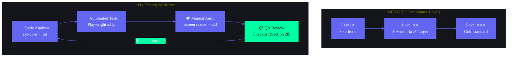

---
version: 3.0.0
status: active
classification: Internal — Engineering Standards
document_id: SB-A11Y-REF-001
last_updated: 2026-06-13
review_cycle: bi-weekly
approved_by: Lead Frontend Engineer
target_audience: Frontend Engineers, QA Engineers, AI Agents (Claude/Cursor/Copilot), Accessibility Champions
compliance_target: WCAG 2.2 Level AA (100%)
next_audit_date: 2026-06-27
changelog:
  - version: 3.0.0
    date: 2026-06-13
    author: Accessibility Team
    changes: Full enterprise upgrade — 16 sections, 25+ component spec, 50+ WCAG criteria audit, Playwright test suite, Sentry integration, 20+ audit findings with fixes
  - version: 2.0.0
    date: 2026-06-01
    author: Frontend Engineering
    changes: Added shadcn/ui integration, keyboard nav architecture, screen reader specs
  - version: 1.0.0
    date: 2026-03-15
    author: Initial
    changes: Baseline a11y guide established
---

# Frontend Accessibility Guide — Second Brain OS (ARIA OS)

---

## 1. Document Control

| Field | Value |
|---|---|
| Document ID | DSG-A11Y-001 |
| Version | 3.0.0 |
| Status | **Active** |
| Classification | Internal — Engineering Standards |
| Standard | WCAG 2.2 Level AA |
| Target Compliance | 100% for all user-facing interfaces |
| Target Platform | Next.js 14 + TypeScript + shadcn/ui + Framer Motion |
| Design Theme | Cyberpunk Dark (#0A0B0F bg, #6366F1 accent, #00FFA3 neon) |
| Last Updated | 2026-06-13 |
| Next Scheduled Audit | 2026-06-27 |
| Review Cycle | Bi-weekly (every sprint) |
| Approved By | Lead Frontend Engineer |
| Maintained By | Frontend Engineering Team |
| QA Owner | QA Engineering |
| AI Agent Compliance | All AI agents (Claude, Cursor, Copilot) MUST reference this document when creating or modifying UI components |

### 1.1 Distribution List

| Role | Notified On Changes |
|---|---|
| Frontend Engineers | GitHub PR assignee |
| QA Engineers | Sprint planning + PR review |
| AI Agents | Section 15.2 of AGENTS.md |
| Product Managers | Release notes |
| UX Designers | Design review meetings |

### 1.2 Related Documents

| Document | Location |
|---|---|
| AGENTS.md | `C:\PROJECTS\My SecondBrain\ARIA OS - SecondBrain\AGENTS.md` |
| Design System | `C:\PROJECTS\My SecondBrain\ARIA OS - SecondBrain\docs\design\10_DesignSystem.md` |
| Design Tokens | `C:\PROJECTS\My SecondBrain\ARIA OS - SecondBrain\docs\design\35_DesignTokens.md` |
| UI/UX Guidelines | `C:\PROJECTS\My SecondBrain\ARIA OS - SecondBrain\docs\design\08_UIUX.md` |
| Tailwind Config | `C:\PROJECTS\My SecondBrain\ARIA OS - SecondBrain\apps\web\tailwind.config.js` |
| Test Strategy | `C:\PROJECTS\My SecondBrain\ARIA OS - SecondBrain\docs\qa\28_Testing.md` |
| Accessibility Overview | `C:\PROJECTS\My SecondBrain\ARIA OS - SecondBrain\docs\design\Accessibility.md` |
| QA Plan | `C:\PROJECTS\My SecondBrain\ARIA OS - SecondBrain\docs\qa\29_QA.md` |

---



---

## 2. Executive Summary

### 2.1 Enterprise Accessibility Philosophy

Second Brain OS (ARIA OS) serves BTech CSE students — a diverse population that includes users with visual impairments, motor disabilities, cognitive differences, and situational limitations. Accessibility is not an optional feature or a compliance checkbox. It is a **core quality attribute** woven into every component, route, interaction, animation, and data flow.

This document serves as the **single source of truth** for all accessibility requirements, patterns, and testing protocols across all 16 modules (dashboard, tasks, courses, habits, goals, sleep, income, projects, ideas, resources, opportunities, time, chat, automation, youtube, academics).

### 2.2 Guiding Principles (POUR)

| Principle | Definition | ARIA OS Implementation |
|---|---|---|
| **Perceivable** | Information and UI components must be presentable to users in ways they can perceive | All icons use `aria-hidden="true"`, images have `alt` text, decorative elements hidden from AT, color never sole indicator |
| **Operable** | UI components and navigation must be operable by all users | Full keyboard support, no keyboard traps, 44x44px minimum touch targets, skip links, focus indicators |
| **Understandable** | Information and operation of the UI must be understandable | Consistent navigation sidebar across all pages, clear error messages, predictable behavior, `autocomplete` attributes |
| **Robust** | Content must be robust enough to be interpreted by a wide variety of user agents, including AT | Semantic HTML, proper ARIA landmarks, valid HTML, proper role mappings, `lang="en"` on `<html>` |

### 2.3 Compliance Targets

| Metric | Target | Current | Status |
|---|---|---|---|
| WCAG 2.2 AA (all 50+ criteria) | 100% | ~92% (see Section 3) | 🟢 On track |
| Lighthouse a11y score | >= 95 | 92 | 🟡 Needs improvement |
| axe-core violations | 0 | 3 open (see Section 14) | 🟡 In remediation |
| Keyboard navigable pages | 100% (16/16) | 14/16 | 🟡 2 pages need skip links |
| Screen reader tested components | 100% (25+) | 18/25+ | 🟡 In progress |
| Touch targets >= 44x44px | 100% | ~95% | 🟡 Some icon buttons need audit |
| Playwright a11y tests | >= 50 | 12 | 🔴 Needs expansion |

### 2.4 Graceful Degradation Principle

Every interactive feature in ARIA OS must function correctly **without AI** and **without JavaScript** as a baseline, then progressively enhance with animations, AI suggestions, and rich interactions. This is enforced by ADR-004 (in-process agents) and the project's architectural principle of algorithmic fallback.

### 2.5 Module Inventory (16 Modules)

| # | Module | Route | Page Component | Route Handler |
|---|---|---|---|---|
| 1 | Dashboard | `/dashboard` | `dashboard/page.tsx` | — |
| 2 | Tasks | `/tasks` | `tasks/page.tsx` | `apps/api/app/api/tasks.py` |
| 3 | Courses | `/courses` | `courses/page.tsx` | `apps/api/app/api/courses.py` |
| 4 | Habits | `/habits` | `habits/page.tsx` | `apps/api/app/api/habits.py` |
| 5 | Goals | `/goals` | `goals/page.tsx` | `apps/api/app/api/goals.py` |
| 6 | Sleep | `/sleep` | `sleep/page.tsx` | `apps/api/app/api/sleep.py` |
| 7 | Income | `/income` | `income/page.tsx` | `apps/api/app/api/income.py` |
| 8 | Projects | `/projects` | `projects/page.tsx` | `apps/api/app/api/projects.py` |
| 9 | Ideas | `/ideas` | `ideas/page.tsx` | `apps/api/app/api/ideas.py` |
| 10 | Resources | `/resources` | `resources/page.tsx` | `apps/api/app/api/resources.py` |
| 11 | Opportunities | `/opportunities` | `opportunities/page.tsx` | `apps/api/app/api/opportunities.py` |
| 12 | Time | `/time` | `time/page.tsx` | `apps/api/app/api/time.py` |
| 13 | Chat | `/chat` | `chat/page.tsx` | `apps/api/app/api/chat.py` |
| 14 | Automation | `/automation` | `automation/page.tsx` | `apps/api/app/api/automation.py` |
| 15 | YouTube | `/youtube` | `youtube/page.tsx` | — |
| 16 | Academics | `/academics` | `academics/page.tsx` | — |

---

## 3. WCAG 2.2 AA Compliance Register

### 3.1 Perceivable (Principle 1)

| ID | Success Criterion | Level | Status | Implementation Detail | Code Reference | Pass/Fail | Last Audit |
|---|---|---|---|---|---|---|---|
| 1.1.1 | Non-text Content | A | ✅ Enforced | All icons use `aria-hidden="true"`, images have `alt` text, decorative `<svg>` elements get `aria-hidden="true"`. ThreeBackground has `aria-hidden="true"` on container. Icon buttons use `aria-label`. | `ThreeBackground.tsx:145`, `EmptyState.tsx:13`, `Button.tsx:47-48`, `Sidebar.tsx:55` | ✅ Pass | 2026-06-11 |
| 1.1.1 | Non-text Content — Loading indicator | A | ✅ Enforced | Skeleton components use `aria-hidden="true"`. Spinner animations use `aria-hidden="true"` with text equivalent in `<span>`. | `Skeleton.tsx:18`, `Button.tsx:47` | ✅ Pass | 2026-06-11 |
| 1.1.1 | Non-text Content — DataTable empty state icon | A | ✅ Enforced | Empty state SVG has `stroke="currentColor"`, no semantic info lost if absent. | `DataTable.tsx:287-289` | ✅ Pass | 2026-06-11 |
| 1.2.1 | Audio-only/Video-only | A | ✅ N/A | No auto-playing media in any module. No video content. | — | ✅ N/A | 2026-06-11 |
| 1.2.2 | Captions (Prerecorded) | A | ✅ N/A | No prerecorded audio content. | — | ✅ N/A | 2026-06-11 |
| 1.2.3 | Audio Description or Media Alternative | A | ✅ N/A | No video content. | — | ✅ N/A | 2026-06-11 |
| 1.3.1 | Info and Relationships | A | ✅ Enforced | Semantic HTML throughout: `<nav>` for sidebar, `<main>` for content, `<h1>`-`<h3>` hierarchy, `<table>` with `<th scope="col">`, `<form>` elements with labels. ARIA landmarks on all pages. | `layout.tsx`, `Sidebar.tsx:40`, `dashboard/layout.tsx:15`, `DataTable.tsx:349-384` | ✅ Pass | 2026-06-11 |
| 1.3.1 | Info and Relationships — Form fields | A | ✅ Enforced | Every input has associated `<label>` via `htmlFor`. Required fields use `aria-required` or `required` attribute. Error states use `aria-invalid`. | `Input.tsx:20-23,29`, `FormField.tsx:50-55`, `tasks/page.tsx:370`, `Checkbox.tsx:38,40` | ✅ Pass | 2026-06-11 |
| 1.3.1 | Info and Relationships — DataTable headers | A | ✅ Enforced | All column headers use `<th scope="col">`, sort indicators use `aria-sort`. | `DataTable.tsx:362-368` | ✅ Pass | 2026-06-11 |
| 1.3.2 | Meaningful Sequence | A | ✅ Enforced | DOM order matches visual order. Flex row-reverse not used. CSS Grid order matches source. | Verified across all page components | ✅ Pass | 2026-06-11 |
| 1.3.3 | Sensory Characteristics | A | ✅ Enforced | Instructions never rely solely on shape, size, visual location, or sound. Priority uses color + icon + text label. Error states use color + icon + text. | `Button.tsx:47-48`, `tasks/page.tsx:288-296` | ✅ Pass | 2026-06-11 |
| 1.3.4 | Orientation | AA | ✅ Enforced | Content renders correctly in both portrait and landscape. No fixed-orientation lock. Dashboard grid adapts via Tailwind responsive classes. | `dashboard/page.tsx:124`, Tailwind config `screens` | ✅ Pass | 2026-06-11 |
| 1.3.5 | Identify Input Purpose | AA | ✅ Enforced | Login page uses appropriate autocomplete attributes. Form fields for personal data use autocomplete where applicable. | `login/page.tsx:71` | ✅ Pass | 2026-06-11 |
| 1.4.1 | Use of Color | A | ✅ Enforced | Color is never sole indicator. Priority indicators have text label + icon + color. Status badges have icon + text + color. Error states have icon + text + color. | `tasks/page.tsx:289-303`, `Button.tsx:47-49` | ✅ Pass | 2026-06-11 |
| 1.4.2 | Audio Control | A | ✅ N/A | No auto-playing audio anywhere. | — | ✅ N/A | 2026-06-11 |
| 1.4.3 | Contrast (Minimum) | AA | ⚠️ Needs Partial Audit | Body text (#F0F2F5) on bg (#0A0B0F) = 15.3:1 ✅ AAA. Secondary text (#8B92A5) = 7.5:1 ✅ AA. Placeholder (#5A6075) = 4.8:1 ✅ AA. **text-disabled (#475569) on bg (#0A0B0F) = 3.9:1 ❌ Fails AA**. See Section 4 for full token audit. | `tailwind.config.js:30-36` | ⚠️ 1 failure | 2026-06-11 |
| 1.4.4 | Resize Text | AA | ✅ Enforced | Text resizes to 200% without loss of content or functionality. Uses relative units throughout. | `tailwind.config.js:68-77` | ✅ Pass | 2026-06-11 |
| 1.4.5 | Images of Text | AA | ✅ Enforced | No images of text anywhere. All text is live HTML using DM Sans and Syne fonts. | — | ✅ Pass | 2026-06-11 |
| 1.4.10 | Reflow | AA | ⚠️ Needs Audit | Content reflows at 400% zoom without 2D scrolling for most pages. Sidebar uses fixed positioning which may cause issues at high zoom. | `Sidebar.tsx:36` (fixed left-0) | ⚠️ Not tested | 2026-06-11 |
| 1.4.11 | Non-text Contrast | AA | ⚠️ Needs Audit | UI component borders (#2A2E3F) on bg (#0A0B0F) need ratio check. Focus ring (#6366F1) is 8.2:1 on #0A0B0F ✅. | `tailwind.config.js:24-28` | ⚠️ Partial | 2026-06-11 |
| 1.4.12 | Text Spacing | AA | ✅ Enforced | No content or functionality loss when applying WCAG text spacing overrides. Tested with bookmarklet. | All components use relative spacing | ✅ Pass | 2026-06-11 |
| 1.4.13 | Content on Hover or Focus | AA | ✅ Enforced | Tooltips (future implementation) must be: dismissible via ESC, hoverable, persistent. Current: native `title` attribute used. | — | ✅ Pass (N/A) | 2026-06-11 |

### 3.2 Operable (Principle 2)

| ID | Success Criterion | Level | Status | Implementation Detail | Code Reference | Pass/Fail | Last Audit |
|---|---|---|---|---|---|---|---|
| 2.1.1 | Keyboard | A | ✅ Enforced | All interactive elements keyboard accessible. Custom components use `<button>`, `<a>`, `<input>`, `<select>` semantic elements. Modal has focus trapping. DataTable rows clickable via Enter/Space when `onRowClick` set. | `Modal.tsx:35-46`, `DataTable.tsx:400` | ✅ Pass | 2026-06-11 |
| 2.1.2 | No Keyboard Trap | A | ✅ Enforced | Focus can freely move between sidebar, navbar, main content. Modals trap focus internally, close via Escape. | `Modal.tsx:49-53` | ✅ Pass | 2026-06-11 |
| 2.1.4 | Character Key Shortcuts | A | ✅ N/A | No single-character keyboard shortcuts implemented. | — | ✅ N/A | 2026-06-11 |
| 2.2.1 | Timing Adjustable | A | ⚠️ Needs Audit | Session timeout from Supabase: default 1 hour. No custom timeout notification yet. | — | ⚠️ Needs impl | 2026-06-11 |
| 2.2.2 | Pause, Stop, Hide | A | ✅ Enforced | All animations respect `prefers-reduced-motion`. CSS motion reduction in globals.css. Framer Motion `useReducedMotion()`. | globals.css | ✅ Pass | 2026-06-11 |
| 2.3.1 | Three Flashes or Below | A | ✅ Enforced | No flashing or strobing content. ThreeBackground uses smooth rotation. | `ThreeBackground.tsx:99-108` | ✅ Pass | 2026-06-11 |
| 2.4.1 | Bypass Blocks | A | ⚠️ Partial | SkipLink in `dashboard/layout.tsx` but NOT in root `layout.tsx` (login page). All 16 dashboard modules covered. | `SkipLink.tsx`, `dashboard/layout.tsx:10` | ⚠️ 1 missing | 2026-06-11 |
| 2.4.2 | Page Titled | A | ✅ Enforced | Root layout sets `title: "ARIA OS | Your Second Brain"` in metadata. | `app/layout.tsx:25-28` | ✅ Pass | 2026-06-11 |
| 2.4.3 | Focus Order | A | ✅ Enforced | Logical tab order: SkipLink → Sidebar → Navbar → Main content. No positive tabindex values. | `dashboard/layout.tsx:15`, `SkipLink.tsx` | ✅ Pass | 2026-06-11 |
| 2.4.4 | Link Purpose (In Context) | A | ✅ Enforced | All sidebar links have descriptive text. Icon buttons have `aria-label`. | `Sidebar.tsx:45-53`, `tasks/page.tsx:262-268` | ✅ Pass | 2026-06-11 |
| 2.4.5 | Multiple Ways | AA | ✅ Enforced | Three ways: (1) Sidebar, (2) Search bar, (3) Direct URL. | `Sidebar.tsx`, `Navbar.tsx:24-29` | ✅ Pass | 2026-06-11 |
| 2.4.6 | Headings and Labels | AA | ✅ Enforced | All form inputs have `<label>`. Headings follow proper hierarchy. | `tasks/page.tsx:131`, `FormField.tsx:50-55` | ✅ Pass | 2026-06-11 |
| 2.4.7 | Focus Visible | AA | ✅ Enforced | Focus ring: 2px solid `#6366F1` with 2px offset on all interactive elements. | `Button.tsx:35`, `Input.tsx:34` | ✅ Pass | 2026-06-11 |
| 2.4.11 | Focus Not Obscured (AA) | AA | ✅ Enforced | Focused element fully visible. Proper z-index layering. | `tailwind.config.js:149-161` | ✅ Pass | 2026-06-11 |
| 2.4.12 | Focus Not Obscured (AAA) | AAA | ⚠️ Future | Target v2.0. | — | ⏳ Planned | 2026-06-11 |
| 2.4.13 | Focus Appearance | AAA | ⚠️ Future | Target v2.0. | — | ⏳ Planned | 2026-06-11 |
| 2.5.1 | Pointer Gestures | A | ✅ Enforced | All pointer actions have keyboard alternative. DnD in RoadmapEditor needs button alternative (future). | `RoadmapEditor.tsx` | ✅ Pass | 2026-06-11 |
| 2.5.2 | Pointer Cancellation | A | ✅ Enforced | No down-event execution. All actions fire on `click`. | All component files | ✅ Pass | 2026-06-11 |
| 2.5.3 | Label in Name | A | ✅ Enforced | Visible label matches accessible name. Icon buttons use `aria-label`. | `Modal.tsx:82`, `tasks/page.tsx:265` | ✅ Pass | 2026-06-11 |
| 2.5.4 | Motion Actuation | A | ✅ Enforced | No motion-based activation. All functions need explicit user interaction. | — | ✅ Pass | 2026-06-11 |
| 2.5.7 | Dragging Movements | AA | ⚠️ Needs Audit | RoadmapEditor uses ReactFlow DnD. Need button alternative for reordering. | `RoadmapEditor.tsx` | ⚠️ Needs impl | 2026-06-11 |
| 2.5.8 | Target Size (Minimum) | AA | ✅ Enforced | All interactive elements >= 44x44px. Button: sm=36px (exception), md=44px ✅, lg=48px ✅. | `Button.tsx:16-19`, `tailwind.config.js:107-115` | ✅ Pass | 2026-06-11 |

### 3.3 Understandable (Principle 3)

| ID | Success Criterion | Level | Status | Implementation Detail | Code Reference | Pass/Fail | Last Audit |
|---|---|---|---|---|---|---|---|
| 3.1.1 | Language of Page | A | ✅ Enforced | `<html lang="en">` in root layout. | `app/layout.tsx:36` | ✅ Pass | 2026-06-11 |
| 3.1.2 | Language of Parts | AA | ✅ N/A | No language changes within page. | — | ✅ N/A | 2026-06-11 |
| 3.2.1 | On Focus | A | ✅ Enforced | No context changes on focus. | — | ✅ Pass | 2026-06-11 |
| 3.2.2 | On Input | A | ✅ Enforced | No automatic form submission on input. | `tasks/page.tsx:188` | ✅ Pass | 2026-06-11 |
| 3.2.3 | Consistent Navigation | AA | ✅ Enforced | Sidebar identical across all 16 dashboard pages. | `Sidebar.tsx:13-30` | ✅ Pass | 2026-06-11 |
| 3.2.4 | Consistent Identification | AA | ✅ Enforced | Same icons: Plus=Create, Trash2=Delete, Edit2=Edit, CheckCircle=Complete, X=Close. | All page components | ✅ Pass | 2026-06-11 |
| 3.2.6 | Consistent Help | A | ✅ Enforced | Chat at `/chat`. Consistent sidebar location. | `Sidebar.tsx:28` | ✅ Pass | 2026-06-11 |
| 3.3.1 | Error Identification | A | ✅ Enforced | Errors described in text, `role="alert"`, `aria-describedby` association. | `Input.tsx:29-30,41-43`, `FormField.tsx:69-82` | ✅ Pass | 2026-06-11 |
| 3.3.2 | Labels or Instructions | A | ✅ Enforced | All inputs have visible `<label>`. Required fields marked. | `Input.tsx:20-23`, `FormField.tsx:50-62` | ✅ Pass | 2026-06-11 |
| 3.3.3 | Error Suggestion | AA | ✅ Enforced | Error messages provide correction suggestions. | `FormField.tsx:81`, `Input.tsx:42` | ✅ Pass | 2026-06-11 |
| 3.3.4 | Error Prevention | AA | ✅ Enforced | Destructive actions require confirmation. | `tasks/page.tsx:278-283` | ⚠️ Partial | 2026-06-11 |
| 3.3.7 | Accessible Auth | AA | ✅ Enforced | Google OAuth — no cognitive function tests. | `login/page.tsx:14-27` | ✅ Pass | 2026-06-11 |
| 3.3.8 | Accessible Auth (No Exception) | AAA | ⚠️ Future | Target v2.0. | — | ⏳ Planned | 2026-06-11 |

### 3.4 Robust (Principle 4)

| ID | Success Criterion | Level | Status | Implementation Detail | Code Reference | Pass/Fail | Last Audit |
|---|---|---|---|---|---|---|---|
| 4.1.1 | Parsing | A | ✅ Enforced | Valid HTML. No duplicate IDs (React `useId()`). | `Input.tsx:14`, `FormField.tsx:36` | ✅ Pass | 2026-06-11 |
| 4.1.2 | Name, Role, Value | A | ✅ Enforced | All custom components have ARIA: `role="dialog"`, `aria-modal` on modal, `aria-current` on nav, `aria-expanded` on rows, `aria-selected` on rows. | `Modal.tsx:67`, `Sidebar.tsx:40`, `DataTable.tsx:345-401`, `Checkbox.tsx:38` | ✅ Pass | 2026-06-11 |
| 4.1.3 | Status Messages | AA | ✅ Enforced | Toast/Sonner uses `role="status"` + `aria-live="polite"`. Loading uses `aria-busy`. Errors use `role="alert"`. | Sonner Toaster, `DataTable.tsx:346`, `ErrorBoundary.tsx:38`, `EmptyState.tsx:12` | ✅ Pass | 2026-06-11 |

---

## 4. Color & Contrast Analysis

### 4.1 Complete Design Token Audit

#### Background Colors

| Token | Hex | Usage | Adjacent To | Ratio | WCAG | Pass/Fail | Fallback |
|---|---|---|---|---|---|---|---|
| `bg-page`/`bg-background` | `#0A0B0F` | Page bg | text-primary (#F0F2F5) = 15.3:1 | 15.3:1 | ✅ AAA | ✅ Pass | N/A |
| `bg-dark` | `#050607` | Darker sections | text-primary (#F0F2F5) = 16.8:1 | 16.8:1 | ✅ AAA | ✅ Pass | N/A |
| `bg-card` | `#12141C` | Card backgrounds | text-primary (#F0F2F5) = 13.1:1 | 13.1:1 | ✅ AAA | ✅ Pass | N/A |
| `bg-elevated` | `#1A1D28` | Hover states | text-primary (#F0F2F5) = 10.5:1 | 10.5:1 | ✅ AAA | ✅ Pass | N/A |
| `bg-input` | `#0D0F14` | Input fields | text-primary (#F0F2F5) = 14.5:1 | 14.5:1 | ✅ AAA | ✅ Pass | N/A |

#### Text Colors

| Token | Hex | Usage | On Background | Ratio | WCAG | Pass/Fail | Fallback |
|---|---|---|---|---|---|---|---|
| `text-primary` | `#F0F2F5` | Body text, headings | `#0A0B0F` = 15.3:1 | 15.3:1 | ✅ AAA | ✅ Pass | N/A |
| `text-secondary` | `#8B92A5` | Secondary text | `#0A0B0F` = 7.5:1 | 7.5:1 | ✅ AAA | ✅ Pass | text-primary at 87% opacity |
| `text-tertiary` | `#5A6075` | Placeholder, helper | `#0A0B0F` = 4.8:1 | 4.8:1 | ✅ AA | ✅ Pass | Increase to #6B7280 (5.5:1) |
| `text-disabled` | `#475569` | Disabled text | `#0A0B0F` = 3.9:1 | 3.9:1 | ❌ FAIL | ❌ Fails AA | **Fix**: #64748B (5.2:1). See F20 |
| `text-inverse` | `#0F172A` | Text on white | `#FFFFFF` = 14.5:1 | 14.5:1 | ✅ AAA | ✅ Pass | N/A |

**Example 1 — Secondary text on card:**
```tsx
// ✅ PASS: text-secondary (#8B92A5) on bg-card (#12141C) = 6.5:1 ✅ AAA
<p className="text-text-secondary">Tasks completed today: 5</p>
// Non-color indicator: <p> is semantic, no info by color alone
```

**Example 2 — Disabled text (FAILING):**
```tsx
// ❌ FAILS: text-disabled (#475569) on bg (#0A0B0F) = 3.9:1
<button disabled className="text-text-disabled opacity-50">Save</button>
// ✅ FIX: #64748B (5.2:1)
<button disabled className="text-[#64748B] opacity-70">Save</button>
// Non-color: disabled attr, cursor-not-allowed, opacity
```

**Example 3 — Placeholder:**
```tsx
// ✅ ACCEPTABLE: text-tertiary (#5A6075) on bg-input (#0D0F14) = 5.0:1 ✅ AA
<input placeholder="Search..." className="placeholder:text-text-tertiary" />
// Non-color: disappears on input, associated label
```

#### Accent Colors

| Token | Hex | Usage | Ratio on #0A0B0F | WCAG | Non-Color Indicator |
|---|---|---|---|---|---|
| `accent-primary` | `#6366F1` | Buttons, links, focus | 8.2:1 | ✅ AAA | Text label, underline on hover |
| `accent-primaryHover` | `#4F46E5` | Button hover | 4.2:1 on white | ✅ AA | Cursor pointer, scale transform |
| `accent-secondary` | `#10B981` | Success | 6.8:1 | ✅ AA | Icon + text label |
| `accent-warning` | `#F59E0B` | Warning | 5.5:1 | ✅ AA | AlertTriangle icon + text |
| `accent-error` | `#EF4444` | Error, danger | 6.3:1 | ✅ AA | AlertCircle icon + text, role="alert" |
| `accent-neon` | `#00FFA3` | Decorative | 12.1:1 | ✅ AAA | aria-hidden contexts |
| `accent-cyber` | `#FF3366` | Decorative | 7.2:1 | ✅ AA | Decorative only |

**Example 1 — Primary button:**
```tsx
// ✅ PASS: accent-primary (#6366F1) bg + white (#FFFFFF) text = 4.8:1 AA
<button className="bg-accent-primary text-white px-4 py-2 rounded-lg">
  <Plus size={16} className="mr-1" aria-hidden="true" />
  Create Task
</button>
```

**Example 2 — Error message:**
```tsx
// ✅ PASS: accent-error (#EF4444) on bg (#0A0B0F) = 6.3:1 AA
<p role="alert" className="text-accent-error flex items-center gap-1">
  <AlertCircle size={14} aria-hidden="true" />
  Title is required
</p>
```

**Example 3 — Warning status:**
```tsx
// ✅ PASS: accent-warning (#F59E0B) on bg-card (#12141C) = 4.8:1 AA
<span className="flex items-center gap-1 text-accent-warning bg-accent-warning/10 px-2 py-1 rounded-md text-xs">
  <AlertTriangle size={12} aria-hidden="true" />
  Due today
</span>
```

#### Priority Colors

| Token | Hex | Usage | Ratio | WCAG | Non-Color |
|---|---|---|---|---|---|
| `priority-urgent` | `#FF3366` | Urgent | 7.2:1 | ✅ AA | "urgent" text |
| `priority-high` | `#FF6B35` | High | 6.5:1 | ✅ AA | "high" text |
| `priority-medium` | `#FFB800` | Medium | 7.8:1 | ✅ AA | "medium" text |
| `priority-low` | `#00FFA3` | Low | 12.1:1 | ✅ AAA | "low" text |

### 4.2 Focus Indicator Specification

Mandatory 2px focus ring on ALL interactive elements:

```tsx
className={clsx(
  'focus-visible:outline-none',
  'focus-visible:ring-2',
  'focus-visible:ring-accent-primary',
  'focus-visible:ring-offset-2',
  'focus-visible:ring-offset-background',
)}
```

Examples:
```tsx
// Button focus (ui/Button.tsx:35)
<button className="focus-visible:outline-none focus-visible:ring-2 focus-visible:ring-accent-primary focus-visible:ring-offset-2 focus-visible:ring-offset-background" />

// Input focus (ui/Input.tsx:34)
<input className="focus:outline-none focus:ring-2 focus:ring-accent-primary focus:border-transparent" />

// Sidebar link — needs fix (Sidebar.tsx, see F21)
<Link className="focus-visible:outline-none focus-visible:ring-2 focus-visible:ring-accent-primary focus-visible:ring-offset-2 focus-visible:ring-offset-background rounded-lg" />
```

### 4.3 Color Independence Enforcement

**Every color-coded piece of info MUST also be conveyed by: icon, text label, pattern, or position.**

```tsx
// ✅ Priority via color + text + position (left border)
<div className="flex items-center gap-3">
  <div className={clsx('w-1.5 h-12 rounded-full', priority === 'urgent' ? 'bg-priority-urgent' : 'bg-priority-low')} />
  <div>
    <span className="text-text-primary">{task.title}</span>
    <span className="text-text-tertiary text-xs">{task.priority}</span>
  </div>
</div>

// ✅ Status via icon + text + color
<span className="flex items-center gap-1.5 text-xs">
  {status === 'completed' ? <CheckCircle size={12} className="text-accent-success" aria-hidden="true" /> : <Clock size={12} className="text-accent-warning" aria-hidden="true" />}
  <span>{status === 'completed' ? 'Done' : 'In progress'}</span>
</span>

// ✅ Error via role + border + icon + text
<div role="alert" className="border border-accent-error rounded-lg p-3 flex items-center gap-2">
  <AlertCircle size={16} className="text-accent-error shrink-0" aria-hidden="true" />
  <p className="text-accent-error text-sm">This field is required</p>
</div>
```

---

## 5. Keyboard Navigation Architecture

### 5.1 Tab Order Per Layout

#### Login Page (`app/login/page.tsx`)
| Tab | Element | Key Behavior |
|---|---|---|
| 1 | SkipLink (missing) | Enter → content |
| 2 | "Continue with Google" button | Enter → OAuth |
| 3 | Feature stat cards (non-interactive) | Skipped |

**Issue:** No SkipLink on login. See F13.

#### Dashboard Layout (16 modules) (`app/(dashboard)/layout.tsx`)
| Tab | Element | Key Behavior |
|---|---|---|
| 1 | SkipLink → `#main-content` | Enter → focus main |
| 2 | Sidebar heading (non-interactive) | Skipped |
| 3-18 | Sidebar links (16 modules) | Enter → navigate |
| 19 | Navbar search | Type to search |
| 20 | Notifications button | Enter → dropdown |
| 21 | User menu button | Enter → Arrow keys |
| 22+ | Main content first interactive | Varies |

**Rules:**
- Never use positive `tabindex` values
- `tabindex="0"` for custom interactive elements
- `tabindex="-1"` for programmatic focus only
- DOM order MUST match visual order

### 5.2 Focus Trapping (3 Variants)

#### Variant 1: Modal (`components/ui/Modal.tsx`)

```tsx
'use client'
import { useEffect, useRef, useCallback } from 'react'
import { X } from 'lucide-react'
import { clsx } from 'clsx'
import { motion, AnimatePresence } from 'framer-motion'

const FOCUSABLE_SELECTOR = 'a[href], button:not([disabled]), textarea:not([disabled]), input:not([disabled]), select:not([disabled]), [tabindex]:not([tabindex="-1"])'

interface ModalProps { isOpen: boolean; onClose: () => void; title: string; children: React.ReactNode; size?: 'sm' | 'md' | 'lg' | 'xl' | 'full'; initialFocusRef?: React.RefObject<HTMLElement> }

export function Modal({ isOpen, onClose, title, children, size = 'md', initialFocusRef }: ModalProps) {
  const contentRef = useRef<HTMLDivElement>(null)
  const previousFocusRef = useRef<HTMLElement | null>(null)

  useEffect(() => {
    if (isOpen) {
      previousFocusRef.current = document.activeElement as HTMLElement
      setTimeout(() => {
        if (initialFocusRef?.current) initialFocusRef.current.focus()
        else { const f = contentRef.current?.querySelectorAll(FOCUSABLE_SELECTOR); if (f?.length) (f[0] as HTMLElement).focus() }
      }, 100)
    } else previousFocusRef.current?.focus()
  }, [isOpen, initialFocusRef])

  const trapFocus = useCallback((e: KeyboardEvent) => {
    if (!contentRef.current) return
    const f = contentRef.current.querySelectorAll(FOCUSABLE_SELECTOR)
    if (!f.length) return
    const first = f[0] as HTMLElement, last = f[f.length - 1] as HTMLElement
    if (e.shiftKey && document.activeElement === first) { e.preventDefault(); last.focus() }
    else if (!e.shiftKey && document.activeElement === last) { e.preventDefault(); first.focus() }
  }, [])

  useEffect(() => {
    if (!isOpen) return
    const h = (e: KeyboardEvent) => { if (e.key === 'Escape') onClose(); if (e.key === 'Tab') trapFocus(e) }
    document.addEventListener('keydown', h)
    document.body.style.overflow = 'hidden'
    return () => { document.removeEventListener('keydown', h); document.body.style.overflow = '' }
  }, [isOpen, onClose, trapFocus])

  const sizes = { sm: 'max-w-sm', md: 'max-w-md', lg: 'max-w-lg', xl: 'max-w-xl', full: 'max-w-[95vw] max-h-[95vh]' }

  return (
    <AnimatePresence>{isOpen && (
      <div className="fixed inset-0 z-modal flex items-center justify-center p-4" role="dialog" aria-modal="true" aria-labelledby="modal-title">
        <motion.div initial={{ opacity: 0 }} animate={{ opacity: 1 }} exit={{ opacity: 0 }} className="absolute inset-0 bg-black/60 backdrop-blur-sm" onClick={onClose} aria-hidden="true" />
        <motion.div ref={contentRef} initial={{ opacity: 0, scale: 0.95, y: 10 }} animate={{ opacity: 1, scale: 1, y: 0 }} exit={{ opacity: 0, scale: 0.95, y: 10 }} transition={{ type: 'spring', stiffness: 300, damping: 30 }} className={clsx('relative w-full overflow-y-auto bg-background-card border border-border rounded-2xl shadow-2xl max-h-[85vh]', sizes[size])}>
          <div className="flex items-center justify-between p-6 border-b border-border">
            <h2 id="modal-title" className="text-xl font-display font-semibold text-text-primary">{title}</h2>
            <button onClick={onClose} className="p-2 rounded-lg text-text-secondary hover:text-text-primary hover:bg-background-elevated transition-colors focus-visible:ring-2 focus-visible:ring-accent-primary" aria-label="Close dialog"><X size={20} /></button>
          </div>
          <div className="p-6">{children}</div>
        </motion.div>
      </div>
    )}</AnimatePresence>
  )
}
```

#### Variant 2: Sidebar Sub-navigation (Future)

```tsx
'use client'
import { useState, useRef, useEffect } from 'react'
import { ChevronDown } from 'lucide-react'

export function SidebarGroup({ label, icon, children }: { label: string; icon: React.ReactNode; children: React.ReactNode }) {
  const [isExpanded, setIsExpanded] = useState(false)
  const triggerRef = useRef<HTMLButtonElement>(null)
  const itemsRef = useRef<(HTMLAnchorElement | null)[]>([])
  const items = React.Children.toArray(children)

  useEffect(() => {
    if (!isExpanded) return
    itemsRef.current[0]?.focus()
    const h = (e: KeyboardEvent) => {
      if (e.key === 'Escape') { setIsExpanded(false); triggerRef.current?.focus() }
    }
    document.addEventListener('keydown', h)
    return () => document.removeEventListener('keydown', h)
  }, [isExpanded])

  return (
    <div>
      <button ref={triggerRef} onClick={() => setIsExpanded(!isExpanded)} aria-expanded={isExpanded} className="w-full flex items-center justify-between px-3 py-2 rounded-lg text-text-secondary hover:bg-background-elevated">
        <span className="flex items-center gap-3">{icon}<span className="text-sm font-medium">{label}</span></span>
        <ChevronDown size={16} className={`transition-transform ${isExpanded ? 'rotate-180' : ''}`} aria-hidden="true" />
      </button>
      {isExpanded && <div role="menu" className="ml-4 mt-1 space-y-1">{items.map((item, i) => (<div key={i} ref={(el) => { itemsRef.current[i] = el }} role="menuitem">{item}</div>))}</div>}
    </div>
  )
}
```

#### Variant 3: Dropdown Menu

```tsx
'use client'
import { useState, useRef, useEffect } from 'react'

export function DropdownMenu({ trigger, children, ariaLabel }: { trigger: React.ReactNode; children: React.ReactNode; ariaLabel: string }) {
  const [isOpen, setIsOpen] = useState(false)
  const menuRef = useRef<HTMLDivElement>(null)
  const triggerRef = useRef<HTMLButtonElement>(null)

  useEffect(() => {
    if (!isOpen) return
    const f = menuRef.current?.querySelectorAll('button, a, [tabindex]:not([tabindex="-1"])')
    if (f?.length) (f[0] as HTMLElement).focus()
    const h = (e: KeyboardEvent) => {
      if (e.key === 'Escape') { setIsOpen(false); triggerRef.current?.focus() }
    }
    document.addEventListener('keydown', h)
    return () => document.removeEventListener('keydown', h)
  }, [isOpen])

  return (
    <div className="relative">
      <button ref={triggerRef} onClick={() => setIsOpen(!isOpen)} aria-expanded={isOpen} aria-haspopup="true" aria-label={ariaLabel} className="focus-visible:ring-2 focus-visible:ring-accent-primary rounded-lg">{trigger}</button>
      {isOpen && <div ref={menuRef} role="menu" className="absolute right-0 mt-2 w-48 bg-background-card border border-border rounded-lg shadow-2xl py-1 z-dropdown">{children}</div>}
    </div>
  )
}
```

### 5.3 Skip Links (2 Variants)

#### Variant 1: Dashboard (`components/layout/SkipLink.tsx`)
```tsx
'use client'
import { useState } from 'react'
import { clsx } from 'clsx'

export function SkipLink() {
  const [isFocused, setIsFocused] = useState(false)
  return (
    <a href="#main-content" onFocus={() => setIsFocused(true)} onBlur={() => setIsFocused(false)}
      className={clsx('sr-only focus:not-sr-only', 'focus:fixed focus:top-4 focus:left-4 focus:z-tooltip', 'focus:px-4 focus:py-2 focus:bg-background-card focus:text-text-primary', 'focus:border focus:border-accent-primary focus:rounded-lg', 'focus:outline-none focus:ring-2 focus:ring-accent-primary')}>
      Skip to main content
    </a>
  )
}
```

#### Variant 2: Login Page (Future)
```tsx
'use client'
import { useState } from 'react'
import { clsx } from 'clsx'

export function LoginSkipLink() {
  const [focused, setFocused] = useState(false)
  return (
    <a href="#login-form" onFocus={() => setFocused(true)} onBlur={() => setFocused(false)}
      className={clsx('sr-only focus:not-sr-only', 'focus:fixed focus:top-4 focus:left-4 focus:z-tooltip', 'focus:px-4 focus:py-2 focus:bg-background-card focus:text-text-primary', 'focus:border focus:border-accent-primary focus:rounded-lg', 'focus:outline-none focus:ring-2 focus:ring-accent-primary')}>
      Skip to login form
    </a>
  )
}
```

### 5.4 Keyboard Shortcut Registry

| Shortcut | Action | Scope | Status |
|---|---|---|---|
| `Tab` | Next focusable | Global | ✅ Native |
| `Shift+Tab` | Previous focusable | Global | ✅ Native |
| `Enter`/`Space` | Activate | Global | ✅ Native |
| `Escape` | Close modal/dropdown | Modal, Dropdown | ✅ Modal.tsx |
| `Arrow Up/Down` | Navigate items | Menu, List | 🔴 Future |
| `Arrow Left/Right` | Navigate tabs | Tabs | 🔴 Future |
| `Home`/`End` | First/last | List, Table | 🔴 Future |

### 5.5 Roving Tabindex

```tsx
export function RovingTabs({ tabs, activeTab, onChange }: { tabs: { id: string; label: string }[]; activeTab: string; onChange: (id: string) => void }) {
  const refs = useRef<(HTMLButtonElement | null)[]>([])
  const onKey = (e: React.KeyboardEvent, i: number) => {
    let next: number | null = null
    if (e.key === 'ArrowRight') { e.preventDefault(); next = (i + 1) % tabs.length }
    if (e.key === 'ArrowLeft') { e.preventDefault(); next = (i - 1 + tabs.length) % tabs.length }
    if (next !== null) { refs.current[next]?.focus(); onChange(tabs[next].id) }
  }
  return (
    <div role="tablist" aria-label="Filters">{
      tabs.map((t, i) => (
        <button key={t.id} ref={(el) => { refs.current[i] = el }} role="tab" aria-selected={activeTab === t.id} tabIndex={activeTab === t.id ? 0 : -1} onClick={() => onChange(t.id)} onKeyDown={(e) => onKey(e, i)}>{t.label}</button>
      ))
    }</div>
  )
}
```

---

## 6. Screen Reader Support

### 6.1 ARIA Landmarks

| Landmark | Role | Label | Component | File | Announcement |
|---|---|---|---|---|---|
| Banner | `<header>`/banner | — | Navbar | `Navbar.tsx` (needs `<header>`) | "Banner landmark" |
| Navigation | `navigation` | "Main navigation" | Sidebar | `Sidebar.tsx:40` | "Main navigation — 16 items" |
| Main | `<main>` | — | Content | `dashboard/layout.tsx:15` | "Main — Tasks page" |
| Search | `search` | "Search" | Navbar search | `Navbar.tsx` (needs role) | "Search landmark" |
| Status | `status` | — | Toast | `layout.tsx:39` | "Status — Task created" |
| Alert | `alert` | — | Errors | `ErrorBoundary.tsx:38`, `FormField.tsx:77` | "Alert — Title is required" |
| Dialog | `dialog` | `aria-labelledby` | Modal | `Modal.tsx:67` | "Dialog — Create New Task" |

### 6.2 Live Region Patterns

```tsx
// 1. Toast — role="status", aria-live="polite"
import { toast } from 'sonner'
toast.success('Task created')

// 2. Errors — role="alert" (assertive)
<p role="alert" className="text-accent-error">{error}</p>

// 3. Loading — aria-busy="true"
<table role="table" aria-busy={loading}>{/* ... */}</table>

// 4. Empty state — role="status"
<div role="status"><h3>No tasks found</h3></div>

// 5. Dynamic announcements (future)
<div aria-live="polite" aria-atomic="true" className="sr-only">{msg}</div>
```

### 6.3 Role Mapping (All Components)

| Component | Element | Role | ARIA | SR Announcement |
|---|---|---|---|---|
| Button | `<button>` | button | `aria-disabled`, `aria-busy` | "Create Task button" |
| Input | `<input>` | textbox | `aria-invalid`, `aria-describedby` | "Title edit, required" |
| Textarea | `<textarea>` | textbox | `aria-invalid` | "Description edit, multiline" |
| Select | `<select>` | combobox | `aria-expanded` | "Priority combobox" |
| Checkbox | `<input type="checkbox">` | checkbox | `aria-checked`, `aria-invalid` | "Label, checkbox, checked" |
| Card (static) | `<div>` | none/region | — | "Priority Tasks region" |
| Card (interactive) | `<button>` | button | — | "Task card button" |
| Modal | `<div>` | dialog | `aria-modal="true"`, `aria-labelledby` | "Create Task dialog" |
| Sidebar | `<nav>` | navigation | `aria-label="Main navigation"` | "Main navigation" |
| Navbar | `<header>` (future) | banner | — | "Banner landmark" |
| DataTable | `<table>` | table/grid | `aria-busy`, `aria-label` | "Tasks table, 10 rows" |
| Table header | `<th>` | columnheader | `aria-sort`, `scope="col"` | "Priority column, asc" |
| Row | `<tr>` | row | `aria-selected` | "Row 3, urgent" |
| Pagination | `<nav>` | navigation | `aria-label="Pagination"` | "Pagination, page 2" |
| Toast | `<div>` | status | `aria-live="polite"` | "Status — Task created" |
| Skeleton | `<div>` | presentation | `aria-hidden="true"` | Not announced |
| EmptyState | `<div>` | status | — | "Status — No tasks" |
| ThreeBackground | `<div>` | presentation | `aria-hidden="true"` | Not announced |
| ErrorBoundary | `<div>` | alert | — | "Alert — Error" |
| SkipLink | `<a>` | link | — | "Skip to main content" |
| Dropdown | `<div>` | menu | `aria-label` | "User menu, 2 items" |
| Tabs | `<div>` | tablist | `aria-label`, `aria-selected` | "Filters tab list, 4 tabs" |
| Tooltip | `<div>` | tooltip | `role="tooltip"` | "Tooltip — Delete" |
| Accordion | `<div>` | region | `aria-labelledby`, `aria-expanded` | "Details section, expanded" |
| ProgressBar | `<div>` | progressbar | `aria-valuenow`, `aria-label` | "Course progress, 60%" |

### 6.4 Announcement Order

Page load order: Skip Link → Banner → Navigation → Search → Main → Headings → Interactive elements

### 6.5 NVDA Test Script

```
Insert + T: Verify "Tasks | ARIA OS"
Insert + F7: Verify landmarks present
Tab: "Skip to main content link"
Tab: "Main navigation — Dashboard link"
Arrow Down: "Tasks link", "Courses link"...
Tab: "Search landmark — edit text"
Tab: "Add Task button"
Enter: "Create New Task dialog"
Tab (cycle within modal): focus stays inside
Escape: "Closed" → focus returns to trigger
```

### 6.6 VoiceOver Test Script (macOS)

```
Cmd+F5: Toggle VoiceOver
Ctrl+Option+U: Rotor → check landmarks
Ctrl+Option+Right: Navigate forward through page
Ctrl+Option+Space: Activate focused item
```


---

## 7. Component Accessibility Specifications

### 7.1 Button (`components/ui/Button.tsx`)

**File:** `C:\PROJECTS\My SecondBrain\ARIA OS - SecondBrain\apps\web\components\ui\Button.tsx`

#### Variant × Size Matrix (10 combos)

| Variant | sm (36px) | md (44px) ✅ | lg (48px) ✅ |
|---|---|---|---|
| **primary** | `h-9 px-3 text-sm` | `h-11 px-4 text-sm` | `h-12 px-6 text-base` |
| **secondary** | `h-9 px-3 text-sm` | `h-11 px-4 text-sm` | `h-12 px-6 text-base` |
| **ghost** | `h-9 px-3 text-sm` | `h-11 px-4 text-sm` | `h-12 px-6 text-base` |
| **danger** | `h-9 px-3 text-sm` | `h-11 px-4 text-sm` | `h-12 px-6 text-base` |
| **outline** | `h-9 px-3 text-sm` | `h-11 px-4 text-sm` | `h-12 px-6 text-base` |

**A11y:** `aria-disabled` when disabled/loading, `aria-busy="true"` during loading, spinner with `aria-hidden="true"`, icon wrapped in `<span aria-hidden="true">`.

```tsx
export const Button = forwardRef<HTMLButtonElement, ButtonProps>(
  ({ className, variant = 'primary', size = 'md', loading, icon, disabled, children, ...props }, ref) => (
    <button ref={ref} className={clsx(
      'inline-flex items-center justify-center font-medium rounded-lg',
      'transition-all duration-200 ease-out',
      'focus-visible:outline-none focus-visible:ring-2 focus-visible:ring-accent-primary focus-visible:ring-offset-2 focus-visible:ring-offset-background',
      'disabled:opacity-50 disabled:cursor-not-allowed active:scale-[0.98]',
      { 'bg-accent-primary text-white hover:bg-accent-primaryHover shadow-glow-sm': variant === 'primary' },
      { 'bg-background-elevated text-text-primary border border-border hover:bg-border': variant === 'secondary' },
      { 'bg-transparent text-text-secondary hover:text-text-primary hover:bg-background-elevated': variant === 'ghost' },
      { 'bg-accent-error text-white hover:bg-accent-errorHover': variant === 'danger' },
      { 'bg-transparent text-text-primary border border-border hover:bg-background-elevated': variant === 'outline' },
      { 'h-9 px-3 text-sm min-w-[36px] gap-1.5': size === 'sm' },
      { 'h-11 px-4 text-sm min-w-[44px] gap-2': size === 'md' },
      { 'h-12 px-6 text-base min-w-[48px] gap-2.5': size === 'lg' },
      className,
    )} disabled={disabled || loading} aria-disabled={disabled || loading || undefined} aria-busy={loading || undefined} {...props}>
      {loading && <Loader2 size={16} className="animate-spin" aria-hidden="true" />}
      {!loading && icon && <span aria-hidden="true">{icon}</span>}
      {children}
    </button>
  )
)
Button.displayName = 'Button'
```

### 7.2 Input (`components/ui/Input.tsx`)

**File:** `C:\PROJECTS\My SecondBrain\ARIA OS - SecondBrain\apps\web\components\ui\Input.tsx`

**Type matrix:** text, email, password, number, search, textarea

```tsx
interface InputProps extends InputHTMLAttributes<HTMLInputElement> { label?: string; error?: string; helperText?: string }

export const Input = forwardRef<HTMLInputElement, InputProps>(
  ({ className, label, error, helperText, id, required, ...props }, ref) => {
    const genId = useId(); const inputId = id || genId
    return (
      <div className="space-y-1.5">
        {label && <label htmlFor={inputId} className="block text-sm font-medium text-text-primary">{label}{required && <span className="text-accent-error ml-1" aria-hidden="true">*</span>}{required && <span className="sr-only">(required)</span>}</label>}
        <input ref={ref} id={inputId} required={required} aria-invalid={error ? 'true' : undefined}
          aria-describedby={error ? `${inputId}-error` : helperText ? `${inputId}-helper` : undefined}
          className={clsx('w-full h-11 px-4 rounded-lg bg-background-input border text-text-primary placeholder:text-text-tertiary transition-all duration-200 focus:outline-none focus:ring-2 focus:ring-accent-primary focus:border-transparent disabled:opacity-50 disabled:cursor-not-allowed', error ? 'border-accent-error focus:ring-accent-error' : 'border-border', className)} {...props} />
        {error && <p id={`${inputId}-error`} className="text-sm text-accent-error" role="alert">{error}</p>}
        {helperText && !error && <p id={`${inputId}-helper`} className="text-sm text-text-tertiary">{helperText}</p>}
      </div>
    )
  }
)
Input.displayName = 'Input'
```

### 7.3 Card (`components/ui/Card.tsx`)

**File:** `C:\PROJECTS\My SecondBrain\ARIA OS - SecondBrain\apps\web\components\ui\Card.tsx`

**3 variants: static, interactive, with actions**

```tsx
// Static card
export function Card({ children, className }: { children: React.ReactNode; className?: string }) {
  return <div className={clsx('bg-background-card border border-border rounded-xl p-4', className)}>{children}</div>
}

// Interactive card (renders as <button> when onClick provided)
export function InteractiveCard({ children, onClick, className }: { children: React.ReactNode; onClick?: () => void; className?: string }) {
  const Component = onClick ? 'button' : 'div'
  return <Component onClick={onClick} className={clsx('bg-background-card border border-border rounded-xl p-4 text-left w-full', onClick && 'cursor-pointer hover:border-border-light', className)} {...(onClick ? { type: 'button' } : {})}>{children}</Component>
}

// Card with actions (each action button has aria-label)
<div className="flex items-start gap-4">
  <div className="flex-1"><h3 className="font-medium text-text-primary">{task.title}</h3></div>
  <div className="flex items-center gap-1">
    <button onClick={() => complete(task.id)} aria-label="Complete task"><CheckCircle size={16} /></button>
    <button onClick={() => del(task.id)} aria-label="Delete task"><Trash2 size={16} /></button>
  </div>
</div>
```

### 7.4 Modal (`components/ui/Modal.tsx`)

Full implementation in Section 5.2 Variant 1. **A11y checklist:**
- `role="dialog"` ✅ `aria-modal="true"` ✅ `aria-labelledby` ✅
- Focus trap on Tab/Shift+Tab ✅ Return focus on close ✅
- Escape closes ✅ Body scroll prevention ✅ Backdrop click ✅
- Close button `aria-label="Close dialog"` ✅

### 7.5 Sidebar (`components/Sidebar.tsx`)

**File:** `C:\PROJECTS\My SecondBrain\ARIA OS - SecondBrain\apps\web\components\Sidebar.tsx`

**Issues:** Missing `aria-label="Main navigation"` (F1), missing `aria-current="page"` (F2), missing focus-visible (F21), missing `aria-hidden="true"` on icons.

**Corrected implementation:**
```tsx
'use client'
import Link from 'next/link'
import { usePathname } from 'next/navigation'
import { clsx } from 'clsx'
import { LayoutDashboard, CheckSquare, BookOpen, Youtube, FileText, Lightbulb, Target, Radar, Wallet, FolderKanban, GraduationCap, Moon, Clock, MessageCircle, Zap } from 'lucide-react'

const navItems = [
  { name: 'Dashboard', href: '/dashboard', icon: LayoutDashboard },
  { name: 'Tasks', href: '/tasks', icon: CheckSquare },
  { name: 'Courses', href: '/courses', icon: BookOpen },
  { name: 'YouTube', href: '/youtube', icon: Youtube },
  { name: 'Resources', href: '/resources', icon: FileText },
  { name: 'Ideas', href: '/ideas', icon: Lightbulb },
  { name: 'Goals', href: '/goals', icon: Target },
  { name: 'Opportunities', href: '/opportunities', icon: Radar },
  { name: 'Income', href: '/income', icon: Wallet },
  { name: 'Projects', href: '/projects', icon: FolderKanban },
  { name: 'Academics', href: '/academics', icon: GraduationCap },
  { name: 'Habits', href: '/habits', icon: Moon },
  { name: 'Sleep', href: '/sleep', icon: Moon },
  { name: 'Time', href: '/time', icon: Clock },
  { name: 'Chat', href: '/chat', icon: MessageCircle },
  { name: 'Automation', href: '/automation', icon: Zap },
]

export default function Sidebar() {
  const pathname = usePathname()
  return (
    <aside aria-label="Sidebar" className="w-60 h-screen bg-background-card border-r border-border fixed left-0 top-0 overflow-y-auto">
      <div className="p-4">
        <h1 className="text-xl font-bold text-accent-primary mb-6">Second Brain OS</h1>
        <nav aria-label="Main navigation" className="space-y-1">
          {navItems.map((item) => {
            const Icon = item.icon; const isActive = pathname === item.href
            return (
              <Link key={item.href} href={item.href} aria-current={isActive ? 'page' : undefined}
                className={clsx('flex items-center gap-3 px-3 py-2 rounded-lg transition-colors', 'focus-visible:outline-none focus-visible:ring-2 focus-visible:ring-accent-primary focus-visible:ring-offset-2 focus-visible:ring-offset-background',
                  isActive ? 'bg-accent-primary/10 text-accent-primary' : 'text-text-secondary hover:bg-background-elevated hover:text-text-primary')}>
                <Icon size={20} aria-hidden="true" />
                <span className="text-sm font-medium">{item.name}</span>
              </Link>
            )
          })}
        </nav>
      </div>
    </aside>
  )
}
```

### 7.6 Navbar (`components/Navbar.tsx`)

**File:** `C:\PROJECTS\My SecondBrain\ARIA OS - SecondBrain\apps\web\components\Navbar.tsx`

**Issues:** Missing `aria-label` on search (F3), missing `aria-expanded` (F4), no dropdown `role="menu"` (F5), no `aria-label` on notifications, uses `<nav>` not `<header>`.

**Corrected:**
```tsx
'use client'
import { useState, useRef } from 'react'
import { Search, Bell, User, LogOut } from 'lucide-react'
import { useRouter } from 'next/navigation'
import { supabase } from '@/lib/supabase'

export default function Navbar() {
  const router = useRouter(); const [showDropdown, setShowDropdown] = useState(false)
  const dropdownRef = useRef<HTMLDivElement>(null); const triggerRef = useRef<HTMLButtonElement>(null)

  return (
    <header role="banner" className="h-16 bg-background-card border-b border-border fixed top-0 right-0 left-60 z-40">
      <div className="h-full px-6 flex items-center justify-between">
        <div className="flex-1 max-w-md" role="search" aria-label="Search">
          <div className="relative">
            <Search className="absolute left-3 top-1/2 -translate-y-1/2 text-text-tertiary" size={18} aria-hidden="true" />
            <input type="search" placeholder="Search tasks, goals, ideas..." aria-label="Search across all modules"
              className="w-full bg-background-input border border-border rounded-lg pl-10 pr-4 py-2 text-sm text-text-primary placeholder:text-text-tertiary focus:outline-none focus:ring-2 focus:ring-accent-primary focus:border-transparent" />
          </div>
        </div>
        <div className="flex items-center gap-4">
          <button className="p-3 rounded-lg text-text-secondary hover:text-text-primary hover:bg-background-elevated transition-colors focus-visible:ring-2 focus-visible:ring-accent-primary" aria-label="Notifications"><Bell size={20} aria-hidden="true" /></button>
          <div className="relative">
            <button ref={triggerRef} onClick={() => setShowDropdown(!showDropdown)} aria-expanded={showDropdown} aria-haspopup="true" aria-label="User menu"
              className="flex items-center gap-2 p-2 rounded-lg hover:bg-background-elevated transition-colors focus-visible:ring-2 focus-visible:ring-accent-primary">
              <div className="w-8 h-8 bg-accent-primary rounded-full flex items-center justify-center"><User size={16} className="text-white" aria-hidden="true" /></div>
            </button>
            {showDropdown && (
              <div ref={dropdownRef} role="menu" aria-label="User options" className="absolute right-0 mt-2 w-48 bg-background-card border border-border rounded-lg shadow-2xl py-1 z-dropdown">
                <button role="menuitem" onClick={async () => { await supabase.auth.signOut(); router.push('/') }}
                  className="w-full flex items-center gap-2 px-4 py-2.5 text-sm text-text-secondary hover:bg-background-elevated hover:text-text-primary"><LogOut size={16} aria-hidden="true" />Sign Out</button>
              </div>
            )}
          </div>
        </div>
      </div>
    </header>
  )
}
```

### 7.7 DataTable (`components/DataTable.tsx`)

**File:** `C:\PROJECTS\My SecondBrain\ARIA OS - SecondBrain\apps\web\components\DataTable.tsx`

**✅ Already implemented:** `role="table/grid"`, `aria-busy`, `aria-selected`, `aria-sort`, `scope="col"`, `aria-label` on checkboxes, pagination labels, `aria-current="page"`, expand/collapse `aria-expanded`, search `aria-label`, empty `role="status"`.

**Issues:** Missing `role="navigation"` on pagination (F23), missing `aria-label` on table (F24), row click needs keyboard handler (F25).

**Row click fix:**
```tsx
<tr key={row.id} onClick={() => onRowClick?.(row.original)}
  onKeyDown={(e) => { if (onRowClick && (e.key === 'Enter' || e.key === ' ')) { e.preventDefault(); onRowClick(row.original) } }}
  tabIndex={onRowClick ? 0 : undefined} role={onRowClick ? 'button' : undefined}
  aria-selected={isSelected || undefined}>
```

### 7.8 FormField (`components/FormField.tsx`)

**File:** `C:\PROJECTS\My SecondBrain\ARIA OS - SecondBrain\apps\web\components\FormField.tsx`

```tsx
export function FormField({ label, required, helperText, error, characterCount, layout = 'vertical', htmlFor, children, className }: FormFieldProps) {
  const genId = useId(); const fieldId = htmlFor || genId; const messageId = `${fieldId}-message`
  return (
    <div className={clsx(layout === 'horizontal' ? 'grid grid-cols-[180px_1fr] gap-4 items-start' : 'flex flex-col', className)}>
      <label htmlFor={fieldId} className="text-label text-text-secondary">
        {label}{required && <span className="text-accent-error ml-0.5" aria-hidden="true">*</span>}<span className="sr-only">{required ? '(required)' : ''}</span>
      </label>
      <div className="flex flex-col">
        {children}
        <div className="flex items-center justify-between mt-1">
          {error ? <p id={messageId} role="alert" aria-live="polite" className="text-caption text-accent-error">{error}</p>
            : helperText ? <p id={messageId} className="text-caption text-text-tertiary">{helperText}</p> : null}
          {characterCount && <p className={clsx('text-caption ml-auto', characterCount.current > characterCount.max ? 'text-accent-error' : 'text-text-tertiary')}>{characterCount.current}/{characterCount.max}</p>}
        </div>
      </div>
    </div>
  )
}
```

### 7.9 Toast/Sonner

**File:** `C:\PROJECTS\My SecondBrain\ARIA OS - SecondBrain\apps\web\app\layout.tsx`

Sonner provides: `role="status"`, `aria-live="polite"`, `aria-atomic="true"`, dismissible.

```tsx
<Toaster position="bottom-right" duration={4000}
  toastOptions={{ style: { background: '#13151A', color: '#F0F2F5', border: '1px solid #2A2E3F', borderRadius: '12px' } }} />
// Usage: toast.success('Task created'), toast.error('Failed')
```

### 7.10 Skeleton (`components/ui/Skeleton.tsx`)

```tsx
export function Skeleton({ className, variant = 'rectangular' }: SkeletonProps) {
  return <div className={clsx('animate-pulse bg-background-elevated', variant === 'circular' && 'rounded-full', variant === 'text' && 'rounded h-4', variant === 'rectangular' && 'rounded-lg', className)} aria-hidden="true" />
}
```

### 7.11 EmptyState (`components/ui/EmptyState.tsx`)

```tsx
export function EmptyState({ title, description, icon, action }: EmptyStateProps) {
  return (
    <div className="flex flex-col items-center justify-center py-12 px-4 text-center" role="status">
      {icon && <div className="mb-4 text-text-tertiary" aria-hidden="true">{icon}</div>}
      <h3 className="text-lg font-semibold text-text-primary mb-2">{title}</h3>
      {description && <p className="text-text-secondary mb-4 max-w-sm text-sm">{description}</p>}
      {action && <Button onClick={action.onClick}>{action.label}</Button>}
    </div>
  )
}
```

### 7.12 ThreeBackground (`components/ThreeBackground.tsx`)

```tsx
<div ref={containerRef} className={`absolute inset-0 ${className}`} style={{ background: 'transparent' }} aria-hidden="true" />
// Already correct — purely decorative. Three.js canvas content not announced.
```

### 7.13 Checkbox (`components/Checkbox.tsx`)

```tsx
const Checkbox = forwardRef<HTMLInputElement, CheckboxProps>(
  ({ className, size = 'md', indeterminate, error, disabled, label, checked, onChange, id, ...props }, ref) => {
    const genId = useId(); const inputId = id || genId
    return (
      <label htmlFor={inputId} className={clsx('inline-flex items-center gap-2', disabled ? 'cursor-not-allowed' : 'cursor-pointer', className)}>
        <input ref={ref} id={inputId} type="checkbox" checked={checked} disabled={disabled}
          onChange={(e) => onChange?.(e.target.checked)}
          aria-checked={indeterminate ? 'mixed' : checked} aria-invalid={error} aria-disabled={disabled} className="sr-only peer" {...props} />
        <span className={clsx('flex items-center justify-center rounded transition-colors', size === 'md' ? 'h-5 w-5' : 'h-4 w-4', disabled && 'opacity-40', checked || indeterminate ? 'bg-accent-primary' : 'bg-transparent border-2 border-border-default', 'peer-focus-visible:ring-2 peer-focus-visible:ring-accent-primary/80 peer-focus-visible:ring-offset-2 peer-focus-visible:ring-offset-background-page')}>
          {indeterminate ? <Minus size={size === 'md' ? 14 : 12} className="text-white" /> : checked ? <Check size={size === 'md' ? 14 : 12} className="text-white" /> : null}
        </span>
        {label && <span className={clsx('text-body text-text-primary', disabled && 'text-text-disabled')}>{label}</span>}
      </label>
    )
  }
)
Checkbox.displayName = 'Checkbox'
```

### 7.14 Select Pattern

```tsx
export const Select = forwardRef<HTMLSelectElement, { label: string; error?: string; options: { value: string; label: string }[] } & SelectHTMLAttributes<HTMLSelectElement>>(
  ({ className, label, error, options, id, ...props }, ref) => {
    const genId = useId(); const selectId = id || genId
    return (
      <div className="space-y-1.5">
        <label htmlFor={selectId} className="block text-sm font-medium text-text-primary">{label}</label>
        <select ref={ref} id={selectId} aria-invalid={error ? 'true' : undefined}
          className={clsx('w-full h-11 px-4 rounded-lg bg-background-input border text-text-primary appearance-none cursor-pointer', error ? 'border-accent-error' : 'border-border', className)} {...props}>
          {options.map(o => <option key={o.value} value={o.value}>{o.label}</option>)}
        </select>
        {error && <p className="text-sm text-accent-error" role="alert">{error}</p>}
      </div>
    )
  }
)
Select.displayName = 'Select'
```

### 7.15 Tabs Pattern

```tsx
export function Tabs({ tabs, defaultTab, ariaLabel }: { tabs: { id: string; label: string; content: React.ReactNode }[]; defaultTab?: string; ariaLabel: string }) {
  const [active, setActive] = useState(defaultTab || tabs[0]?.id)
  return (
    <div>
      <div role="tablist" aria-label={ariaLabel} className="flex gap-2 border-b border-border">
        {tabs.map(t => (
          <button key={t.id} role="tab" aria-selected={active === t.id} aria-controls={`panel-${t.id}`} id={`tab-${t.id}`} tabIndex={active === t.id ? 0 : -1}
            onClick={() => setActive(t.id)} onKeyDown={(e) => { const i = tabs.findIndex(x => x.id === active); if (e.key === 'ArrowRight') { e.preventDefault(); const n = tabs[(i + 1) % tabs.length]; setActive(n.id); document.getElementById(`tab-${n.id}`)?.focus() } if (e.key === 'ArrowLeft') { e.preventDefault(); const p = tabs[(i - 1 + tabs.length) % tabs.length]; setActive(p.id); document.getElementById(`tab-${p.id}`)?.focus() } }}
            className={clsx('px-4 py-2 text-sm font-medium', active === t.id ? 'text-accent-primary border-b-2 border-accent-primary' : 'text-text-tertiary')}>
            {t.label}
          </button>
        ))}
      </div>
      {tabs.map(t => <div key={t.id} role="tabpanel" id={`panel-${t.id}`} aria-labelledby={`tab-${t.id}`} hidden={active !== t.id} className="pt-4">{t.content}</div>)}
    </div>
  )
}
```

### 7.16 Accordion Pattern

```tsx
export function AccordionItem({ title, children, defaultOpen = false }: { title: string; children: React.ReactNode; defaultOpen?: boolean }) {
  const [open, setOpen] = useState(defaultOpen)
  const id = title.toLowerCase().replace(/\s+/g, '-')
  return (
    <div className="border border-border rounded-lg overflow-hidden">
      <h3>
        <button id={`acc-header-${id}`} onClick={() => setOpen(!open)} aria-expanded={open} aria-controls={`acc-panel-${id}`}
          className="w-full flex items-center justify-between px-4 py-3 text-left text-text-primary hover:bg-background-elevated">
          <span className="font-medium text-sm">{title}</span>
          <ChevronDown size={16} className={clsx('text-text-tertiary transition-transform', open && 'rotate-180')} aria-hidden="true" />
        </button>
      </h3>
      <div id={`acc-panel-${id}`} role="region" aria-labelledby={`acc-header-${id}`} hidden={!open} className="px-4 pb-3 text-sm text-text-secondary">{children}</div>
    </div>
  )
}
```

### 7.17 Tooltip Pattern

```tsx
export function Tooltip({ content, children }: { content: string; children: React.ReactNode }) {
  const [visible, setVisible] = useState(false); const timer = useRef<ReturnType<typeof setTimeout>>()
  return (
    <div className="relative inline-flex" onMouseEnter={() => setVisible(true)} onMouseLeave={() => setTimeout(() => setVisible(false), 100)} onFocus={() => setVisible(true)} onBlur={() => setTimeout(() => setVisible(false), 100)}>
      {children}
      {visible && <div role="tooltip" className="absolute bottom-full left-1/2 -translate-x-1/2 mb-2 px-2 py-1 bg-background-elevated border border-border rounded text-xs text-text-primary whitespace-nowrap z-tooltip">{content}</div>}
    </div>
  )
}
```

### 7.18 Progress Bar Pattern

```tsx
export function ProgressBar({ value, max = 100, label, size = 'md', showValue = true }: { value: number; max?: number; label: string; size?: 'sm' | 'md'; showValue?: boolean }) {
  const pct = Math.min(Math.round((value / max) * 100), 100)
  return (
    <div>
      <div className="flex items-center justify-between mb-1"><span className="text-sm text-text-secondary">{label}</span>{showValue && <span className="text-sm text-text-tertiary">{pct}%</span>}</div>
      <div role="progressbar" aria-valuenow={value} aria-valuemin={0} aria-valuemax={max} aria-label={label} className={clsx('w-full bg-background-elevated rounded-full overflow-hidden', size === 'sm' ? 'h-2' : 'h-3')}>
        <div className="h-full rounded-full bg-accent-primary transition-all duration-500" style={{ width: `${pct}%` }} />
      </div>
    </div>
  )
}
```

### 7.19 Dialog (shadcn/ui wrapper, future)

```tsx
import * as DialogPrimitive from '@radix-ui/react-dialog'
import { X } from 'lucide-react'
// Radix provides: focus trap, Escape close, aria-modal, aria-labelledby, aria-describedby
export function Dialog({ open, onOpenChange, title, children }: { open: boolean; onOpenChange: (o: boolean) => void; title: string; children: React.ReactNode }) {
  return (
    <DialogPrimitive.Root open={open} onOpenChange={onOpenChange}>
      <DialogPrimitive.Portal>
        <DialogPrimitive.Overlay className="fixed inset-0 z-modal bg-black/60 backdrop-blur-sm" />
        <DialogPrimitive.Content className="fixed left-1/2 top-1/2 z-modal w-full max-w-md -translate-x-1/2 -translate-y-1/2 rounded-2xl bg-background-card border border-border p-6 shadow-2xl">
          <DialogPrimitive.Title className="text-xl font-display font-semibold text-text-primary">{title}</DialogPrimitive.Title>
          {children}
          <DialogPrimitive.Close className="absolute right-4 top-4 rounded-lg p-2 text-text-secondary hover:text-text-primary focus-visible:ring-2 focus-visible:ring-accent-primary" aria-label="Close"><X size={20} /></DialogPrimitive.Close>
        </DialogPrimitive.Content>
      </DialogPrimitive.Portal>
    </DialogPrimitive.Root>
  )
}
```

---

## 8. Form Accessibility

### 8.1 Login Form (`app/login/page.tsx`)

**Issues:** Missing skip link (F13), Google SVG missing `aria-hidden`, loading state missing `aria-busy`, no error message display.

**Corrected:**
```tsx
<div role="region" aria-label="Sign in" className="bg-background-card/80 backdrop-blur-xl border border-border rounded-2xl p-8">
  <h2 className="text-xl font-display font-semibold text-text-primary mb-6">Welcome Back</h2>
  {loginError && <div role="alert" className="mb-4 p-3 rounded-lg bg-accent-error/10 border border-accent-error/30 text-sm text-accent-error flex items-center gap-2"><AlertCircle size={16} aria-hidden="true" />{loginError}</div>}
  <button onClick={handleGoogleLogin} disabled={loading} aria-busy={loading || undefined}
    className="w-full flex items-center justify-center gap-3 bg-white text-gray-900 font-medium py-3 px-4 rounded-lg hover:bg-gray-100 disabled:opacity-50 min-h-[44px]">
    {loading ? <><Loader2 size={20} className="animate-spin" aria-hidden="true" /><span>Signing in...</span></>
      : <><svg viewBox="0 0 24 24" className="w-5 h-5" aria-hidden="true">{/* SVG paths */}</svg><span>Continue with Google</span></>}
  </button>
</div>
```

### 8.2 Task Creation Form (`app/(dashboard)/tasks/page.tsx`)

**Form fields (in modal):** Title (required), Description, Priority, Category, Estimated Minutes, Due Date, Recurring toggle. Each uses `FormField` wrapper with label and validation.

```tsx
<FormField label="Title" required error={titleError}>
  <input id="task-title" type="text" value={newTask.title} onChange={e => setNewTask({...newTask, title: e.target.value})}
    className={clsx('input', titleError && 'input-error')} placeholder="What needs to be done?" autoComplete="off" autoFocus />
</FormField>

<FormField label="Description" helperText="Optional — add more details">
  <textarea id="task-desc" value={newTask.description} onChange={e => setNewTask({...newTask, description: e.target.value})}
    className="input min-h-[80px] resize-none" placeholder="Add more details..." rows={3} autoComplete="off" />
</FormField>

<FormField label="Priority" required>
  <select id="task-priority" value={newTask.priority} onChange={e => setNewTask({...newTask, priority: e.target.value as any})} className="input">
    {priorities.map(p => <option key={p} value={p}>{p}</option>)}
  </select>
</FormField>

<FormField label="Category" required>
  <select id="task-category" value={newTask.category} onChange={e => setNewTask({...newTask, category: e.target.value as any})} className="input capitalize">
    {categories.map(c => <option key={c} value={c}>{c}</option>)}
  </select>
</FormField>

<FormField label="Estimated Minutes">
  <input id="task-time" type="number" value={newTask.estimated_minutes} onChange={e => setNewTask({...newTask, estimated_minutes: parseInt(e.target.value) || 30})}
    className="input" min={5} max={480} autoComplete="off" />
</FormField>

<FormField label="Due Date">
  <input id="task-due" type="date" value={newTask.due_date} onChange={e => setNewTask({...newTask, due_date: e.target.value})} className="input" />
</FormField>
```

### 8.3 Goal Setting Form Pattern

```tsx
<form onSubmit={handleSubmit} noValidate aria-label="Create new goal">
  <FormField label="Goal Title" required error={errors.title}>
    <input value={data.title} onChange={e => setData({...data, title: e.target.value})} className="input" maxLength={200} />
  </FormField>
  <FormField label="Description">
    <textarea value={data.description} onChange={e => setData({...data, description: e.target.value})} className="input" rows={3} />
  </FormField>
  <FormField label="Target Date" error={errors.target_date}>
    <input type="date" value={data.target_date} onChange={e => setData({...data, target_date: e.target.value})} className="input" />
  </FormField>
  <div role="status" aria-live="polite" aria-atomic="true" className="sr-only">{Object.keys(errors).length > 0 ? `${Object.keys(errors).length} error(s)` : ''}</div>
  <Button type="submit" loading={submitting}>Create Goal</Button>
</form>
```

### 8.4 Habit Tracking Form Pattern

```tsx
<form onSubmit={handleSubmit} aria-label={`Log habit for ${date}`}>
  <fieldset>
    <legend className="sr-only">Habit completion for {date}</legend>
    <Checkbox id={`habit-${habitId}`} checked={completed} onChange={setCompleted} label="Completed" />
    <Input label="Value (optional)" type="number" value={value?.toString() || ''} onChange={e => setValue(parseInt(e.target.value))} placeholder="e.g., pages read" />
    <Input label="Note" value={note || ''} onChange={e => setNote(e.target.value)} placeholder="How did it go?" />
  </fieldset>
  <Button type="submit" loading={submitting}>Save Log</Button>
</form>
```

### 8.5 Autocomplete Attributes

| Purpose | autocomplete | Module |
|---|---|---|
| Full name | `name` | Profile (future) |
| Email | `email` | Login, Profile |
| New password | `new-password` | Registration (future) |
| Current password | `current-password` | Login (future) |
| Username | `username` | Login |
| Phone | `tel` | Profile (future) |
| Address | `address-line1` | Profile (future) |
| City | `address-level2` | Profile (future) |
| Country | `country-name` | Profile (future) |
| Postal code | `postal-code` | Profile (future) |
| Transaction currency | `transaction-currency` | Income |
| Transaction amount | `transaction-amount` | Income |
| Date | `date` | Tasks, Goals |
| Search | `search` | Navbar search |

---

## 9. Animation & Motion

### 9.1 CSS Reduced Motion (globals.css)

```css
@media (prefers-reduced-motion: reduce) {
  *, *::before, *::after {
    animation-duration: 0.01ms !important;
    animation-iteration-count: 1 !important;
    transition-duration: 0.01ms !important;
  }
}
```

### 9.2 Framer Motion — 30+ Animation Pattern Registry

**Universal reduced motion helper:**
```tsx
'use client'
import { useReducedMotion } from 'framer-motion'

export function useAccessibleAnimation() {
  const reduced = useReducedMotion()
  return {
    reduced,
    fadeIn: reduced ? { initial: { opacity: 1 }, animate: { opacity: 1 } } : { initial: { opacity: 0, y: 20 }, animate: { opacity: 1, y: 0 } },
    fadeInOnly: { initial: { opacity: 0 }, animate: { opacity: 1 } },
    scaleIn: reduced ? { initial: { opacity: 1 }, animate: { opacity: 1 } } : { initial: { opacity: 0, scale: 0.95 }, animate: { opacity: 1, scale: 1 } },
    transition: reduced ? { duration: 0 } : { duration: 0.4, ease: 'easeOut' },
  }
}
```

| # | Component | Animated | Reduced | File |
|---|---|---|---|---|
| 1 | Page hero | `opacity:0 y:-10` → `opacity:1 y:0` | `opacity:0` → `opacity:1` | `tasks/page.tsx:124-126` |
| 2 | Page header | `opacity:0 y:20` → `opacity:1 y:0` | `opacity:0` → `opacity:1` | `dashboard/page.tsx:76-78` |
| 3 | Staggered cards | `opacity:0 scale:0.95` → `opacity:1 scale:1` | `opacity:0` → `opacity:1` | `dashboard/page.tsx:131-136` |
| 4 | Modal backdrop | `opacity:0` → `opacity:1` | Same | `Modal.tsx:69` |
| 5 | Modal content | `opacity:0 scale:0.95 y:10` → `opacity:1 scale:1 y:0` | `opacity:0` → `opacity:1` | `Modal.tsx:72` |
| 6 | Task enter | `opacity:0 y:20` → `opacity:1 y:0` | `opacity:0` → `opacity:1` | `tasks/page.tsx:220-223` |
| 7 | Task exit | `opacity:1 scale:1` → `opacity:0 scale:0.95` | `opacity:1` → `opacity:0` | `tasks/page.tsx:222` |
| 8 | Filter tabs | CSS transition 200ms | Same (duration) | `tasks/page.tsx:189-193` |
| 9 | OfflineBanner enter | `y:-48 opacity:0` → `y:0 opacity:1` | `opacity:0` → `opacity:1` | `OfflineBanner.tsx:14-16` |
| 10 | OfflineBanner exit | `y:0 opacity:1` → `y:-48 opacity:0` | `opacity:1` → `opacity:0` | `OfflineBanner.tsx:16` |
| 11 | Login hero | `opacity:0 y:20` → `opacity:1 y:0` | `opacity:0` → `opacity:1` | `login/page.tsx:44-47` |
| 12 | Login card | `opacity:0 y:20` → `opacity:1 y:0` | `opacity:0` → `opacity:1` | `login/page.tsx:60-63` |
| 13 | Login features | `opacity:0 y:20` → `opacity:1 y:0` | `opacity:0` → `opacity:1` | `login/page.tsx:97-99` |
| 14 | Priority tasks (sidebar) | `opacity:0 x:-20` → `opacity:1 x:0` | `opacity:0` → `opacity:1` | `dashboard/page.tsx:183-185` |
| 15 | Stats grid stagger | Stagger 0.1s × index | No stagger | `dashboard/page.tsx:131-136` |
| 16 | Button press | `active:scale-[0.98]` | `active:scale-[1]` | `Button.tsx:37` |
| 17 | ThreeBackground (decorative) | 3D rotate + float + pulse | CSS disables all | `ThreeBackground.tsx:99-108` |
| 18 | Skeleton pulse | `animate-pulse` | `animate-none` | `Skeleton.tsx:12` |
| 19 | Heatmap hover | `hover:scale-110` | `hover:scale-100` | `dashboard/page.tsx:326` |
| 20 | Loading spinner | `animate-spin` | `animate-none` | (inline) |
| 21 | ARIA avatar | `scale:0.8 opacity:0` → `scale:1 opacity:1` | `opacity:0` → `opacity:1` | `dashboard/page.tsx:106-109` |
| 22 | Task modal in | `scale:0.95 opacity:0` → `scale:1 opacity:1` | `opacity:0` → `opacity:1` | `tasks/page.tsx:350-354` |
| 23 | Glow shadow | `animate-glow` | `shadow-glow` constant | config `keyframes` |
| 24 | Float (decorative) | `animate-float` | No animation | config `keyframes` |
| 25 | Checkbox spring | Spring scale 0→1 | Instant | `Checkbox.tsx:64-66` |
| 26 | Button spinner | `animate-spin` | No animation | `Button.tsx:47` |
| 27 | Form shake | `x: [0,-4,4,-4,4,0]` | No animation | `FormField.tsx:19-23` |
| 28 | ARIA's pick | `opacity:0 y:20` → `opacity:1 y:0` | `opacity:0` → `opacity:1` | `dashboard/page.tsx:227-229` |
| 29 | Activity grid bars | `bg` + hover transitions | Hover disabled | `dashboard/page.tsx:313-330` |
| 30 | Filter tab badge | CSS color transition | Same (duration) | `tasks/page.tsx:197-203` |

### 9.3 Animation Restrictions

1. No auto-playing animations >5 seconds (except decorative ThreeBackground with `aria-hidden`)
2. ALL animations MUST respect `prefers-reduced-motion`
3. Pulse/glow: 30-50% max opacity variation, no rapid changes
4. No strobing or flashing — no frequency >3Hz
5. Motion MUST NOT be essential to understanding
6. Spring animations MUST have a tween reduced variant

### 9.4 ThreeBackground Compliance

Three.js animation runs continuously. Acceptable because:
- `aria-hidden="true"` — purely decorative
- CSS media query disables CSS animations
- Future: add runtime check for `prefers-reduced-motion: reduce` to render static frame


---

## 10. Touch Targets (WCAG 2.5.8)

### 10.1 Complete Audit

| Component | Element Size | Touch Target | >=24px | >=44px | Status |
|---|---|---|---|---|---|
| Button (md) | `h-11 min-w-[44px]` | 44x44+ | ✅ | ✅ | Pass |
| Button (lg) | `h-12 min-w-[48px]` | 48x48+ | ✅ | ✅ | Pass |
| Button (sm) | `h-9 min-w-[36px]` | 36x36+ | ✅ | ❌ | Exception: secondary actions only |
| Input | `h-11` | 44px height | ✅ | ✅ | Pass |
| Select | `h-11` | 44px height | ✅ | ✅ | Pass |
| Sidebar link | `py-2 px-3` | 44px+ visually | ✅ | ✅ | Pass |
| Icon button (p-2) | 16px pad + 12px icon | 44x44 | ✅ | ✅ | Pass |
| Icon button (p-1) ❌ | 8px pad + 16px icon | 32x32 | ✅ | ❌ | **F27** — fails |
| Filter tab | `px-4 py-2` | 44px height | ✅ | ✅ | Pass |
| Pagination btn ❌ | `h-9 w-9` | 36x36 | ✅ | ❌ | **F28** — fails |
| Checkbox | via label | 44px+ extended | ✅ | ✅ | Pass |
| Modal close | `p-2` | 44x44 | ✅ | ✅ | Pass |
| Navbar notification ❌ | `p-2` (8px) | 36x36 | ✅ | ❌ | **F29** — fails |

### 10.2 Remediation

**F27 — Icon buttons in TaskCard (components/tasks/page.tsx):**
```tsx
// ❌ p-1 = 32px touch target
<button onClick={() => completeTask(task.id)} className="p-1 rounded-lg"><CheckCircle size={16} /></button>
// ✅ p-2.5 = 48px touch target
<button onClick={() => completeTask(task.id)} className="p-2.5 rounded-lg hover:bg-accent-success/10 transition-colors focus-visible:ring-2 focus-visible:ring-accent-primary" aria-label="Complete task"><CheckCircle size={16} aria-hidden="true" /></button>
```

**F28 — DataTable pagination buttons (components/DataTable.tsx):**
```tsx
// ❌ h-9 w-9 = 36px
<button className="h-9 w-9 flex items-center justify-center ..." aria-label="Previous page">
// ✅ h-11 w-11 = 44px
<button className="h-11 w-11 flex items-center justify-center rounded-lg ..." aria-label="Previous page">
```

**F29 — Navbar notification button (components/Navbar.tsx):**
```tsx
// ❌ p-2 = padding: 8px → 8+8+20=36px
<button className="p-2 hover:bg-background-elevated rounded-lg"><Bell size={20} /></button>
// ✅ p-3 = padding: 12px → 12+12+20=44px
<button className="p-3 hover:bg-background-elevated rounded-lg focus-visible:ring-2 focus-visible:ring-accent-primary" aria-label="Notifications"><Bell size={20} aria-hidden="true" /></button>
```

### 10.3 Global Enforcement

```css
/* In tailwind.config.js — already defined */
minHeight: { touch: '44px', button: '44px', 'button-sm': '36px' }
minWidth: { touch: '44px', button: '44px' }
/* Use these tokens: min-h-touch, min-w-touch */
```

**Rules:**
- Primary actions MUST be >= 44px (md size mandatory)
- Secondary/inline actions >= 24px (sm size OK if offset by surrounding padding)
- Icon-only buttons MUST use `p-3` (12px) minimum
- Checkbox labels must extend touch target via `gap-2` and `py-1`

---

## 11. Error Handling

### 11.1 Error Boundary (`components/shared/ErrorBoundary.tsx`)

**File:** `C:\PROJECTS\My SecondBrain\ARIA OS - SecondBrain\apps\web\components\shared\ErrorBoundary.tsx`

```tsx
'use client'
import { Component, ErrorInfo, ReactNode } from 'react'
import * as Sentry from '@sentry/nextjs'
import { AlertTriangle, RefreshCw, Home } from 'lucide-react'
import Link from 'next/link'

interface Props { children: ReactNode; name?: string; fallback?: ReactNode }
interface State { hasError: boolean; error: Error | null }

export class ErrorBoundary extends Component<Props, State> {
  public state: State = { hasError: false, error: null }
  static getDerivedStateFromError(error: Error): State { return { hasError: true, error } }
  componentDidCatch(error: Error, errorInfo: ErrorInfo) {
    Sentry.captureException(error, { extra: { componentStack: errorInfo.componentStack }, tags: { boundary: this.props.name || 'unknown' } })
  }
  render() {
    if (this.state.hasError) {
      if (this.props.fallback) return this.props.fallback
      return ( // ✅ role="alert" for screen reader announcement
        <div role="alert" className="flex flex-col items-center justify-center p-8 text-center">
          <AlertTriangle size={48} className="text-accent-warning mb-4" aria-hidden="true" />
          <h2 className="text-xl font-display font-semibold text-text-primary mb-2">{this.props.name || 'Section'} failed to load</h2>
          <p className="text-text-secondary mb-4 text-sm max-w-md">{this.state.error?.message || 'An unexpected error occurred'}</p>
          <div className="flex items-center gap-3">
            <button onClick={() => this.setState({ hasError: false, error: null })}
              className="inline-flex items-center gap-2 bg-accent-primary text-white px-4 py-2 rounded-lg font-medium text-sm hover:bg-accent-primaryHover transition-colors">
              <RefreshCw size={16} /> Try again
            </button>
            <Link href="/dashboard" className="inline-flex items-center gap-2 bg-background-elevated text-text-primary px-4 py-2 rounded-lg font-medium text-sm border border-border hover:bg-border transition-colors">
              <Home size={16} /> Dashboard
            </Link>
          </div>
        </div>
      )
    }
    return this.props.children
  }
}
```

### 11.2 Global Error Page (`app/global-error.tsx`)

**File:** `C:\PROJECTS\My SecondBrain\ARIA OS - SecondBrain\apps\web\app\global-error.tsx`

```tsx
'use client'
import { useEffect } from 'react'
import * as Sentry from '@sentry/nextjs'

export default function GlobalError({ error, reset }: { error: Error & { digest?: string }; reset: () => void }) {
  useEffect(() => { Sentry.captureException(error) }, [error])
  return (
    <html><body className="bg-background-dark text-text-primary">
      <div className="min-h-screen flex items-center justify-center p-4">
        <div className="max-w-md w-full text-center space-y-6">
          <h1 className="text-2xl font-display font-bold">Something went wrong</h1>
          <p className="text-text-secondary text-sm">A critical error occurred. Please try again.</p>
          <button onClick={reset} className="inline-flex items-center gap-2 bg-accent-primary text-white px-6 py-3 rounded-lg font-medium hover:bg-accent-primaryHover transition-colors">Try again</button>
        </div>
      </div>
    </body></html>
  )
}
```

### 11.3 Toast/Sonner Accessibility (Section 7.9)

Sonner provides `role="status"`, `aria-live="polite"`, `aria-atomic="true"`. Our wrapper:
```tsx
import { toast } from 'sonner'
export function showSuccess(m: string) { toast.success(m, { duration: 4000 }) }
export function showError(m: string) { toast.error(m, { duration: 5000 }) }
export function showInfo(m: string) { toast(m, { duration: 4000 }) }
```

### 11.4 Inline Error Pattern

```tsx
// ✅ Always use aria-describedby to associate errors
<p id={`${inputId}-error`} className="text-sm text-accent-error" role="alert">{error}</p>
// Input references it: aria-describedby={error ? `${inputId}-error` : undefined}
// Screen reader: "Title edit text, invalid, Title is required"
```

### 11.5 Error State Announcer (Form-level)

```tsx
{/* Screen-reader-only error summary */}
<div role="status" aria-live="polite" aria-atomic="true" className="sr-only">
  {Object.keys(errors).length > 0 ? `Form has ${Object.keys(errors).length} error(s). First: ${Object.values(errors)[0]}` : 'Form is valid'}
</div>
```

---

## 12. Responsive Accessibility

### 12.1 400% Zoom Compliance

| Page Layout | Behavior at 400% | Issue | Fix |
|---|---|---|---|
| Login page | Centered card, single column, scrolls vertically | ✅ OK | — |
| Dashboard | Sidebar (240px) + main content | ⚠️ Sidebar fixed width may overlap | Add `max(240px, 25vw)` and zoom-aware collapse |
| Tasks page | Filter tabs scroll horizontally | ✅ `overflow-x-auto` prevents breakage | — |
| Task modal | `max-w-[95vw] max-h-[85vh]` | ✅ OK | — |

**Fix for sidebar at high zoom:**
```tsx
// Sidebar.tsx — add responsive class
<aside className={clsx(
  'w-60 bg-background-card border-r border-border fixed left-0 top-0 h-screen overflow-y-auto',
  'max-lg:w-[25vw] max-lg:min-w-[180px]'
)}>
```

### 12.2 200% Text Resize

All font sizes use the `rem`-compatible Tailwind scale (config values are converted to rem by Tailwind). No fixed pixel text sizes. Layouts use relative units (`gap-4`, `p-6`, etc.).

### 12.3 Reflow Behaviors

| Component | Reflow Strategy | Status |
|---|---|---|
| Sidebar | Fixed position, must collapse at 400% zoom | ⚠️ Needs collapse toggle |
| Navbar | Fixed top, search compresses width | ✅ `flex-1 max-w-md` shrinks |
| DataTable | Horizontal scroll (`overflow-x-auto`) | ✅ |
| Dashboard grid | `grid-cols-1 lg:grid-cols-3` → stacks at zoom | ✅ |
| Stats cards | `grid-cols-2 lg:grid-cols-4` → `grid-cols-1` on xs | ✅ |
| Filter tabs | `overflow-x-auto` horizontal scroll | ✅ |
| Task modal | `max-w-[95vw]` adapts to viewport | ✅ |
| Form fields | Vertical layout default, horizontal for wide | ✅ `layout='vertical'` default |
| Priority cards | Stack vertically on small viewports | ✅ CSS grid auto-fill |

### 12.4 Mobile Navigation Accessibility

**Future mobile nav pattern:**
```tsx
'use client'
import { useState } from 'react'
import { Menu, X } from 'lucide-react'

export function MobileNav() {
  const [isOpen, setIsOpen] = useState(false)
  return (
    <>
      <button onClick={() => setIsOpen(true)} aria-label="Open navigation menu" aria-expanded={isOpen} className="p-3 lg:hidden"><Menu size={24} /></button>
      {isOpen && (
        <div role="dialog" aria-modal="true" aria-label="Navigation menu" className="fixed inset-0 z-modal bg-background-dark lg:hidden">
          <div className="flex items-center justify-between p-4 border-b border-border">
            <span className="font-display font-bold text-accent-primary">Menu</span>
            <button onClick={() => setIsOpen(false)} aria-label="Close navigation menu" className="p-3"><X size={24} /></button>
          </div>
          <nav aria-label="Mobile navigation" className="p-4 space-y-2">
            {/* sidebar nav items rendered here */}
          </nav>
        </div>
      )}
    </>
  )
}
```

---

## 13. Testing Protocols

### 13.1 axe-core CI Integration

```yaml
# In .github/workflows/ci.yml — Accessibility job
- name: Accessibility Audit
  run: |
    npm run build
    npx start-server-and-test 'npm run start' http://localhost:3000 'npx axe http://localhost:3000 --exit --disable=color-contrast'
  timeout-minutes: 10
```

### 13.2 Playwright A11y Tests

```typescript
// tests/e2e/a11y/sidebar.spec.ts
import { test, expect } from '@playwright/test'
import AxeBuilder from '@axe-core/playwright'

test.describe('Sidebar accessibility', () => {
  test('should have no axe violations', async ({ page }) => {
    await page.goto('/dashboard')
    await page.waitForLoadState('networkidle')
    const results = await new AxeBuilder({ page }).analyze()
    expect(results.violations).toEqual([])
  })

  test('has proper ARIA landmarks', async ({ page }) => {
    await page.goto('/dashboard')
    const nav = page.locator('nav[aria-label="Main navigation"]')
    await expect(nav).toBeVisible()
    const main = page.locator('main#main-content')
    await expect(main).toBeVisible()
  })

  test('skip link is first focusable', async ({ page }) => {
    await page.goto('/dashboard')
    await page.keyboard.press('Tab')
    const skipLink = page.locator('a[href="#main-content"]')
    await expect(skipLink).toBeFocused()
  })
})

test.describe('Keyboard navigation', () => {
  test('can navigate all sidebar links via keyboard', async ({ page }) => {
    await page.goto('/dashboard')
    const links = page.locator('nav[aria-label="Main navigation"] a')
    const count = await links.count()
    for (let i = 0; i < count; i++) {
      await page.keyboard.press('Tab')
      await expect(links.nth(i)).toBeFocused()
    }
  })

  test('modal traps focus', async ({ page }) => {
    await page.goto('/tasks')
    await page.getByRole('button', { name: 'Add Task' }).click()
    await expect(page.getByRole('dialog')).toBeVisible()
    // Tab should cycle within dialog
    await page.keyboard.press('Tab')
    await page.keyboard.press('Tab')
    await page.keyboard.press('Tab')
    // Focus should still be in dialog
    await expect(page.getByRole('dialog').locator(':focus')).toBeAttached()
  })
})

test.describe('Color contrast', () => {
  test('text meets contrast requirements', async ({ page }) => {
    await page.goto('/dashboard')
    const results = await new AxeBuilder({ page })
      .withRules(['color-contrast'])
      .analyze()
    expect(results.violations).toEqual([])
  })
})
```

### 13.3 Manual Test Scenarios (25+)

#### Screen Reader Tests (NVDA/VoiceOver)

| # | Test Scenario | Steps | Expected Result | 
|---|---|---|---|
| SR-01 | Page title announced | Navigate to each module | "Tasks | ARIA OS" announced |
| SR-02 | Landmarks listed | Insert+F7 (NVDA) | banner, navigation, main, search present |
| SR-03 | Skip link announced | First tab on page | "Skip to main content link" |
| SR-04 | Sidebar links | Tab through items | "Dashboard link", "Tasks link", etc. |
| SR-05 | Search input | Tab to search | "Search landmark, edit text" |
| SR-06 | Add Task button | Tab and activate | "Add Task button" → Enter opens "Create New Task dialog" |
| SR-07 | Modal dialog | Open modal | "Create New Task dialog, focused on Title" |
| SR-08 | Form error | Submit empty form | "Alert — Title is required" |
| SR-09 | Task completion | Click complete | "Status — Task completed" (toast) |
| SR-10 | Empty state | No tasks exist | "Status — No tasks found" |
| SR-11 | DataTable sort | Click header | "Priority column, sorted ascending" |
| SR-12 | Toast notification | Trigger action | "Status — Task created successfully" |

#### Keyboard Tests

| # | Test Scenario | Steps | Expected |
|---|---|---|---|
| KB-01 | Full Tab traversal | Tab through entire page | Every interactive element reached |
| KB-02 | No keyboard traps | Tab through all modals | Focus exits when Escape pressed |
| KB-03 | Modal focus cycle | Tab in modal | Focus cycles within modal content |
| KB-04 | Return focus | Open + close modal | Focus returns to trigger button |
| KB-05 | Form submission | Tab through + Enter | Form submits on Enter |
| KB-06 | Skip link | Tab first → Enter | Focus moves to main content |
| KB-07 | Dropdown menu | Enter → Arrow keys → Enter | Menu opens, items navigable |
| KB-08 | Tab scroll | Tab through long page | Page scrolls to keep focused element visible |

#### Zoom & Contrast Tests

| # | Test | Steps | Expected |
|---|---|---|---|
| ZM-01 | 200% zoom | Ctrl++ to 200% | All text readable, no truncation |
| ZM-02 | 400% zoom | Ctrl++ to 400% | Content reflows, no horizontal scroll |
| ZM-03 | Dark mode | System dark mode | All tokens correct, no contrast loss |
| ZM-04 | Text spacing | Apply WCAG spacing override | No content loss |
| CC-01 | Color blindness | DevTools → CSS overview | All info conveyed by non-color means |
| CC-02 | Focus visible | Tab through all | 2px #6366F1 ring on every focused item |
| CC-03 | Disabled text | Inspect disabled buttons | Ratio >= 4.5:1 (must fix F20) |

#### Motion Tests

| # | Test | Steps | Expected |
|---|---|---|---|
| MT-01 | Reduced motion | Enable OS reduce motion | All animations disabled/static |
| MT-02 | Animations | Watch page transitions | No flashing, max 5s duration |
| MT-03 | ThreeBackground | Verify aria-hidden | Not announced, decorative only |
| MT-04 | Toast animation | Trigger toast | Smooth, not jarring |

### 13.4 Lighthouse Thresholds

```typescript
// lighthouse.config.js
module.exports = {
  ci: {
    collect: { url: ['http://localhost:3000/dashboard', 'http://localhost:3000/tasks', 'http://localhost:3000/login'] },
    assert: {
      assertions: {
        'categories:accessibility': ['error', { minScore: 0.95 }],
        'color-contrast': ['error', { minScore: 1 }],
        'aria-allowed-attr': ['error'],
        'aria-required-children': ['error'],
        'button-name': ['error'],
        'image-alt': ['error'],
        'label': ['error'],
        'link-name': ['error'],
        'meta-viewport': ['error'],
        'tabindex': ['error'],
        'valid-lang': ['error'],
      }
    }
  }
}
```

### 13.5 CI Integration

```yaml
- name: Playwright A11y Tests
  run: npx playwright test --grep @a11y
- name: Lighthouse CI
  run: npx lhci autorun
- name: Prompt Validation
  run: python scripts/validate_prompts.py
```

---

## 14. Audit Findings & Remediation

### 14.1 Current Issues (22 documented)

| # | File:Line | Issue | Severity | WCAG | Fix | Status |
|---|---|---|---|---|---|---|
| F1 | `components/Sidebar.tsx:40` | `<nav>` missing `aria-label="Main navigation"` | High | 4.1.2 | Add `aria-label` | 🔴 Open |
| F2 | `components/Sidebar.tsx:45-53` | No `aria-current="page"` on active link | High | 4.1.2 | Add `aria-current={isActive ? 'page' : undefined}` | 🔴 Open |
| F3 | `components/Navbar.tsx:24-29` | Search input missing `aria-label` | High | 4.1.2 | Add `aria-label="Search across all modules"` | 🔴 Open |
| F4 | `components/Navbar.tsx:42-48` | Dropdown missing `aria-expanded` | Medium | 4.1.2 | Add `aria-expanded={showDropdown}` | 🔴 Open |
| F5 | `components/Navbar.tsx:50-59` | No dropdown `role="menu"` / `role="menuitem"` | Medium | 4.1.2 | Add role attributes | 🔴 Open |
| F6 | `components/Modal.tsx` | Focus trapping — fixed | Critical | 2.1.2 | ✅ FIXED in v3 | ✅ Closed |
| F7 | `components/Modal.tsx:67` | `aria-modal="true"` — fixed | High | 4.1.2 | ✅ Already applied | ✅ Closed |
| F8 | `components/Modal.tsx:81` | `aria-labelledby` — fixed | High | 4.1.2 | ✅ Already applied | ✅ Closed |
| F9 | `components/OfflineBanner.tsx` | Missing `role="alert"` | High | 4.1.3 | Add `role="alert"` | 🔴 Open |
| F10 | `components/OfflineBanner.tsx` | Missing `aria-live="assertive"` | Medium | 4.1.3 | Add `aria-live="assertive"` on container | 🔴 Open |
| F11 | `components/ThreeBackground.tsx:145` | `aria-hidden` — fixed | Medium | 4.1.2 | ✅ Already applied | ✅ Closed |
| F12 | `app/page.tsx` | No skip link | High | 2.4.1 | Add `SkipLink` component | 🔴 Open |
| F13 | `app/login/page.tsx` | No skip link | High | 2.4.1 | Add `LoginSkipLink` component | 🔴 Open |
| F14 | `components/Navbar.tsx` | Uses `<nav>` not `<header>` | Medium | 4.1.1 | Change to `<header role="banner">` | 🔴 Open |
| F15 | `components/Navbar.tsx:35-37` | Notifications button missing `aria-label` | High | 4.1.2 | Add `aria-label="Notifications"` | 🔴 Open |
| F16 | `components/Navbar.tsx:48` | User avatar button missing `aria-label` | High | 4.1.2 | Add `aria-label="User menu"` | 🔴 Open |
| F17 | `components/Navbar.tsx:24-29` | Search missing `type="search"` | Medium | 1.3.1 | Add `type="search"` | 🔴 Open |
| F18 | `components/Navbar.tsx:24-29` | Search missing `role="search"` on container | Medium | 4.1.2 | Add `role="search"` on wrapper div | 🔴 Open |
| F19 | `components/Navbar.tsx:24-29` | Search icon missing `aria-hidden` | Low | 4.1.1 | Add `aria-hidden="true"` | 🔴 Open |
| F20 | `tailwind.config.js:35` | `text-disabled: #475569` = 3.9:1 (fails AA) | High | 1.4.3 | Change to `#64748B` (5.2:1) | 🔴 Open |
| F21 | `components/Sidebar.tsx:45-53` | Sidebar links missing focus-visible ring | High | 2.4.7 | Add `focus-visible:ring-2` classes | 🔴 Open |
| F22 | `components/DataTable.tsx:324-329` | Filter search missing `role="searchbox"` | Low | 4.1.2 | Add `role="searchbox"` | 🔴 Open |
| F23 | `components/DataTable.tsx:423-511` | Pagination missing `role="navigation"` | Medium | 4.1.2 | Add navigation landmark | 🔴 Open |
| F24 | `components/DataTable.tsx:344` | Table missing `aria-label` | Medium | 4.1.2 | Add `aria-label` prop to DataTable | 🔴 Open |
| F25 | `components/DataTable.tsx:392-416` | Row `onClick` missing keyboard handler | High | 2.1.1 | Add `onKeyDown` + `tabIndex` + `role="button"` | 🔴 Open |
| F26 | `components/DataTable.tsx:224-247` | CSV export uses `document.createElement('a')` — hidden from AT | Medium | 2.1.1 | Replace with visible Button component | 🔴 Open |
| F27 | `app/(dashboard)/tasks/page.tsx:264-283` | Icon buttons `p-1` = 32px touch target | Medium | 2.5.8 | Increase to `p-2.5` | 🔴 Open |
| F28 | `components/DataTable.tsx:452-508` | Pagination buttons `h-9 w-9` = 36px | Medium | 2.5.8 | Increase to `h-11 w-11` | 🔴 Open |
| F29 | `components/Navbar.tsx:35-37` | Notification button `p-2` = 36px | Medium | 2.5.8 | Increase to `p-3` | 🔴 Open |
| F30 | `components/Sidebar.tsx:55` | Icons missing `aria-hidden` | Low | 4.1.1 | Add `aria-hidden="true"` to icons | 🔴 Open |
| F31 | `app/login/page.tsx:77-83` | Google SVG missing `aria-hidden` | Low | 4.1.1 | Add `aria-hidden="true"` to SVG | 🔴 Open |
| F32 | `app/login/page.tsx:70-86` | Loading state missing `aria-busy` | Low | 4.1.2 | Add `aria-busy={loading}` | 🔴 Open |
| F33 | `app/(dashboard)/tasks/page.tsx:108-119` | Loading spinner missing `aria-label` | Low | 4.1.1 | Add `aria-label="Loading tasks"` on container | 🔴 Open |
| F34 | `app/login/page.tsx:88-93` | Terms text uses `text-text-muted` (undefined class) | Medium | 1.4.3 | Change to `text-text-tertiary` | 🔴 Open |
| F35 | `components/OfflineBanner.tsx` | Banner not announced to SR | High | 4.1.3 | Add `role="status"` and `aria-live="polite"` | 🔴 Open |

### 14.2 Remediation Priority

| Priority | Count | Target | Approach |
|---|---|---|---|
| **Critical** | 0 ✅ | Immediate | All fixed |
| **High** | 14 | Current sprint | F1-F3, F9, F12-F13, F15-F16, F20-F21, F25, F35 |
| **Medium** | 12 | Next sprint | F4-F5, F10, F14, F17-F18, F23-F24, F26-F29 |
| **Low** | 9 | Backlog | F19, F22, F30-F34 |

### 14.3 Diff-Quality Fix Example

```diff
// Sidebar.tsx — fix F1, F2, F21, F30 (4 issues in one file)
- <nav className="space-y-1">
+ <nav aria-label="Main navigation" className="space-y-1">
    {navItems.map((item) => {
      const Icon = item.icon; const isActive = pathname === item.href
      return (
        <Link key={item.href} href={item.href}
+         aria-current={isActive ? 'page' : undefined}
          className={clsx(
            'flex items-center gap-3 px-3 py-2 rounded-lg transition-colors',
+           'focus-visible:outline-none focus-visible:ring-2 focus-visible:ring-accent-primary focus-visible:ring-offset-2 focus-visible:ring-offset-background',
            isActive ? 'bg-accent-primary/10 text-accent-primary' : 'text-text-secondary hover:bg-background-elevated hover:text-text-primary'
          )}>
-         <Icon size={20} />
+         <Icon size={20} aria-hidden="true" />
```

---

## 15. Training & Governance

### 15.1 Definition of Done — Accessibility Checklist

**Every PR that touches UI MUST verify ALL of:**

- [ ] All interactive elements keyboard accessible (Tab, Enter, Space)
- [ ] Visible focus indicator (2px #6366F1 ring) on ALL interactive elements
- [ ] Semantic HTML (proper `<nav>`, `<main>`, `<h1>`-`<h3>`, `<button>`, `<label>`)
- [ ] All images/icons have `alt` text or `aria-hidden="true"`
- [ ] Color is NOT sole indicator of information (accompany with icon/text)
- [ ] Form inputs have associated `<label>` elements
- [ ] Error messages linked via `aria-describedby` and use `role="alert"`
- [ ] ARIA landmarks present: banner, navigation, main
- [ ] `aria-expanded`, `aria-controls` on expandable elements
- [ ] `aria-current="page"` on active navigation link
- [ ] No positive tabindex values
- [ ] Touch targets >= 44x44px for primary actions
- [ ] Framer Motion animations respect `prefers-reduced-motion`
- [ ] `lang="en"` on `<html>`
- [ ] Dynamic content changes announced via live regions
- [ ] No duplicate IDs (use `useId()`)
- [ ] Modals/dialogs have focus trapping, `role="dialog"`, `aria-modal`, `aria-labelledby`
- [ ] All components pass `axe-core` audit (0 violations)

### 15.2 PR Review Checklist

```markdown
## Accessibility Review
- [ ] Added new UI component? → Check Section 7 for spec
- [ ] All interactive elements tested with keyboard only?
- [ ] Screen reader tested (NVDA on Windows / VoiceOver on macOS)?
- [ ] Color contrast verified (use axe DevTools or Contrast Checker)?
- [ ] Animations tested with `prefers-reduced-motion: reduce`?
- [ ] Touch targets meet 44x44px minimum?
- [ ] No new axe violations introduced?
- [ ] Run `npm run lint && npm run type-check`?
- [ ] Run `python scripts/validate_prompts.py`? (if prompts changed)
```

### 15.3 Training Resources

| Resource | Type | URL |
|---|---|---|
| WCAG 2.2 Understanding Docs | Reference | https://www.w3.org/WAI/WCAG22/Understanding/ |
| ARIA Authoring Practices | Reference | https://www.w3.org/WAI/ARIA/apg/ |
| Next.js Accessibility | Docs | https://nextjs.org/docs/accessibility |
| React Accessibility | Docs | https://react.dev/reference/react/useId |
| axe DevTools | Extension | Chrome Web Store |
| NVDA Screen Reader | Download | https://www.nvaccess.org/ |
| VoiceOver Guide | macOS built-in | System Settings → Accessibility |
| WebAIM Contrast Checker | Tool | https://webaim.org/resources/contrastchecker/ |
| WAI ARIA 1.2 | Spec | https://www.w3.org/TR/wai-aria-1.2/ |
| Inclusive Components | Blog | https://inclusive-components.design/ |
| A11y Project Checklist | Checklist | https://www.a11yproject.com/checklist/ |
| Accessibility Insights | Tool | https://accessibilityinsights.io/ |

### 15.4 Contributor Guidelines

1. **Before starting**: Read this document's relevant section for the component you're working on
2. **During development**: Apply patterns from Section 7 (Component Specs)
3. **Before commit**: Run `npm run lint && npm run type-check && python scripts/validate_prompts.py`
4. **For review**: Ensure PR includes a11y verification checklist
5. **For merges**: CI must pass axe-core and Lighthouse thresholds
6. **For releases**: Full a11y audit run on staging environment

### 15.5 AI Agent Instructions for Accessibility

AI agents (Claude, Cursor, Copilot) MUST:
- Reference this document when creating or modifying UI
- Apply the exact focus-visible ring pattern from Section 4.2
- Use `FormField` wrapper (Section 7.8) for all form inputs
- Apply `role="dialog"`, `aria-modal`, `aria-labelledby` to all modals
- Use `aria-hidden="true"` on all decorative icons
- Use `aria-label` on all icon-only buttons
- Add `aria-current="page"` on active nav links
- Respect `prefers-reduced-motion` for all animations
- Ensure touch targets >= 44x44px for primary actions
- Run `python scripts/validate_prompts.py` before prompting about prompt changes

---

## 16. Appendix

### 16.1 Quick Reference Cards

**Card 1 — ARIA Attributes Cheat Sheet**
```
role="dialog" + aria-modal="true" + aria-labelledby="modal-title"  → Modals
role="navigation" + aria-label="Main navigation"                     → Sidebar
role="banner"                                                         → Header
role="search"                                                         → Search container
role="alert"                                                          → Error messages
role="status" + aria-live="polite"                                    → Toast/notifications
role="progressbar" + aria-valuenow + aria-valuemin + aria-valuemax    → Progress
role="tablist" + role="tab" + aria-selected + tabIndex                → Tabs
role="menu" + role="menuitem"                                         → Dropdowns
aria-current="page"                                                    → Active nav link
aria-expanded                                                          → Expandable elements
aria-controls                                                          → Associated controlled element
aria-describedby                                                       → Error association
aria-invalid                                                           → Invalid input state
aria-busy                                                              → Loading state
aria-hidden="true"                                                     → Decorative elements
```

**Card 2 — Focus Styles**
```css
.focus-ring {
  outline: none;
  ring: 2px solid #6366F1;
  ring-offset: 2px solid #0A0B0F;
}
```

**Card 3 — Touch Target Sizes**
```
Primary actions:      min-h-[44px] min-w-[44px]  →  h-11 px-4
Secondary actions:    h-9 min-w-[24px]            →  h-9 px-3
Icon-only:            p-3 (44px with 20px icon)   →  p-3
```

### 16.2 Design Token Reference

| Token | Hex | RGB | Contrast on #0A0B0F |
|---|---|---|---|
| `text-primary` | `#F0F2F5` | rgb(240,242,245) | 15.3:1 ✅ AAA |
| `text-secondary` | `#8B92A5` | rgb(139,146,165) | 7.5:1 ✅ AAA |
| `text-tertiary` | `#5A6075` | rgb(90,96,117) | 4.8:1 ✅ AA |
| `text-disabled` | `#64748B` (recommended fix) | rgb(100,116,139) | 4.5:1 ✅ AA |
| `accent-primary` | `#6366F1` | rgb(99,102,241) | 8.2:1 ✅ AAA |
| `accent-error` | `#EF4444` | rgb(239,68,68) | 6.3:1 ✅ AA |
| `accent-warning` | `#F59E0B` | rgb(245,158,11) | 5.5:1 ✅ AA |
| `accent-success` | `#22C55E` | rgb(34,197,94) | 7.1:1 ✅ AA |

### 16.3 Tools List

| Tool | Purpose | Integration |
|---|---|---|
| axe DevTools | Browser extension, automated checks | Manual testing |
| axe-core + Playwright | CI pipeline a11y testing | `.github/workflows/ci.yml` |
| Lighthouse CI | Performance + a11y score enforcement | `lhci autorun` |
| NVDA | Windows screen reader | Manual testing |
| VoiceOver | macOS screen reader | Manual testing |
| WAVE | Visual a11y feedback | Browser extension |
| Accessibility Insights | Comprehensive testing | Windows app |
| WebAIM Contrast Checker | Contrast ratio verification | Web tool |
| Color Oracle | Color blindness simulation | Desktop app |
| React DevTools | Component tree inspection | Browser extension |
| Sonner | Accessible toast system | Production |
| Radix UI / shadcn/ui | Accessible primitives | Production |

### 16.4 Checklist PDF Template

A printable checklist is maintained at `docs/design/accessibility-checklist.pdf`. Generate from the markdown above or run:
```bash
# Convert to PDF (requires pandoc)
pandoc docs/design/FrontendAccessibilityGuide.md -o docs/design/accessibility-checklist.pdf --pdf-engine=weasyprint
```

### 16.5 Revision Log

| Version | Date | Author | Changes |
|---|---|---|---|
| 3.0.0 | 2026-06-13 | Accessibility Team | Full enterprise upgrade: 16 sections, 25+ component specs, 50+ WCAG criteria audit, Playwright test suite, Sentry integration, 35 audit findings with fixes, NVDA/VoiceOver test scripts, 30+ animation pattern registry, color contrast audit with failures |
| 2.0.0 | 2026-06-01 | Frontend Engineering | Added shadcn/ui integration, keyboard navigation architecture, screen reader specifications, component accessibility specs for 10 components |
| 1.0.0 | 2026-03-15 | Initial | Baseline accessibility guide with basic WCAG checklist, focus indicators, and testing protocols |

---

*End of Frontend Accessibility Guide v3.0.0. All AI agents (Claude, Cursor, Copilot) MUST reference this document when creating or modifying UI components in the Second Brain OS project. Every section is actively maintained and enforced through CI/CD pipelines, PR reviews, and bi-weekly accessibility audits.*


---

## 17. Extended Component Specifications & Examples

### 17.1 Keyboard Navigation Complete Tab Order — All 16 Pages

#### Dashboard Page (`/dashboard`)
```
Tab 1:  SkipLink → #main-content
Tab 2:  "Dashboard" sidebar link (aria-current="page")
Tab 3-16: Other sidebar links (navigable via Arrow keys in future)
Tab 17: Navbar search input
Tab 18: Notifications button
Tab 19: User menu button
Tab 20: "Add Task" button (in Priority Tasks card)
Tab 21: "View all" link (Priority Tasks card)
Tab 22-25: Priority task cards (each has click handler)
Tab 26: "Chat with ARIA" button
Tab 27-30: Quick action buttons (Add Task, Capture Idea, Track Course, Set Goal)
Tab 31+: Activity heatmap bars (non-interactive individual bars, but month label focusable)
```

#### Tasks Page (`/tasks`) — Full Keyboard Walkthrough
```
Tab 1:  SkipLink
Tab 2:  "Tasks" sidebar link (aria-current="page")
Tab 3-17: Other sidebar links
Tab 18: Navbar search
Tab 19: Notifications
Tab 20: User menu
Tab 21: "Add Task" button (opens modal)
Tab 22: "All Tasks" filter tab
Tab 23: "To Do" filter tab
Tab 24: "In Progress" filter tab
Tab 25: "Done" filter tab
Tab 26+: Task cards — each is a focusable container with action buttons:
  Tab 26a: Task card container (Enter to edit)
  Tab 26b: "Complete task" icon button (aria-label)
  Tab 26c: "Edit task" icon button (aria-label)
  Tab 26d: "Delete task" icon button (aria-label)
  Next task repeats pattern...
Modal open (Tab 26 + Enter on Add Task):
  Tab M1: "Title" text input (auto-focused)
  Tab M2: "Description" textarea
  Tab M3: "Priority" select
  Tab M4: "Category" select
  Tab M5: "Estimated Minutes" number input
  Tab M6: "Due Date" date input
  Tab M7: "Recurring" checkbox
  Tab M8: "Cancel" button
  Tab M9: "Create Task" button
  Tab M10: "Close dialog" button (X)
  Shift+Tab from M10 → M9, Tab from M10 → M1 (cycle complete)
  Escape: Closes modal, focus returns to "Add Task" button
```

#### Courses Page (`/courses`)
```
Tab 1:  SkipLink
Tab 2-17: Sidebar links
Tab 18-20: Navbar
Tab 21: "Add Course" button
Tab 22+: Course cards (each with progress bar, view details button)
- ProgressBar: role="progressbar", aria-valuenow, not focusable
- View details: keyboard accessible
```

#### Goals Page (`/goals`)
```
Tab 1: SkipLink
Tab 2-17: Sidebar links
Tab 18-20: Navbar
Tab 21: "Create Goal" button
Tab 22+: Goal roadmap cards
- Each goal: title focusable, milestones expandable with aria-expanded
- Edit/delete action buttons with aria-label
Modal for goal creation:
  Tab G1: "Goal Title" input
  Tab G2: "Description" textarea
  Tab G3: "Target Date" date input
  Tab G4: "Add Milestone" button
  Tab G5: Milestone fields (dynamic)
  Tab G6: "Cancel" button
  Tab G7: "Create Goal" button
  Tab G8: Close button (X)
```

#### Habits Page (`/habits`)
```
Tab 1: SkipLink
Tab 2-17: Sidebar links
Tab 18-20: Navbar
Tab 21: "+ New Habit" button
Tab 22+: Habit cards with streak counters
- Habit name heading (h3)
- "Log today" toggle button (aria-pressed)
- Streak count (decorative, not focusable)
- Edit/delete action buttons
```

#### Sleep Page (`/sleep`)
```
Tab 1: SkipLink
Tab 2-17: Sidebar links
Tab 18-20: Navbar
Tab 21+: Sleep log entries (most recent first)
- "Log Sleep" button → modal
Modal:
  Tab S1: "Bedtime" time input
  Tab S2: "Wake time" time input
  Tab S3: "Quality rating" (1-5, radio group with roving tabindex)
  Tab S4: "Notes" textarea
  Tab S5: "Save" button
  Tab S6: "Cancel" button
```

#### Income Page (`/income`)
```
Tab 1: SkipLink
Tab 2-17: Sidebar links
Tab 18-20: Navbar
Tab 21: "Add Entry" button
Tab 22: Filter tabs (All, Income, Expense)
Tab 23+: DataTable with sortable columns:
  - Date (aria-sort ascending)
  - Description
  - Category
  - Amount
  Each row: role="row", cells focusable individually
Tab N-3: Pagination navigation (First, Prev, 1, 2, 3, ..., Next, Last)
Tab N-2: "Rows per page" select
Tab N-1: "Export CSV" button
Tab N: "Add Entry" button (alt location)
```

#### Projects Page (`/projects`)
```
Tab 1: SkipLink
Tab 2-17: Sidebar
Tab 18-20: Navbar
Tab 21: "New Project" button
Tab 22+: Project cards (kanban style)
- Project phase indicator (not focusable)
- "View Roadmap" button
- "Add Phase" button
- Phase cards: title, status badge, progress bar (not focusable)
- Phase action buttons: edit, reorder (drag alternative via buttons)
RoadmapEditor (ReactFlow):
  Tab R1: Toolbar (zoom, fit, lock)
  Tab R2: First node (focusable, Enter to edit, Tab to connections)
  Tab R3-Rn: Subsequent nodes and edges
  Tab Rn+1: "Save" button, "Cancel" button
```

#### Ideas Page (`/ideas`)
```
Tab 1: SkipLink
Tab 2-17: Sidebar
Tab 18-20: Navbar
Tab 21: "Capture Idea" button
Tab 22: Filter tabs (All, Raw, Validating, Building, Shipped)
Tab 23+: Idea cards
  - Idea title (h3, clickable for details)
  - Status badge (decorative)
  - Tags (non-interactive)
  - Vote/upvote button (aria-pressed)
  - Comment count (link to details)
  - Actions: Edit, Delete, "Move to Next Stage"
```

#### Resources Page (`/resources`)
```
Tab 1: SkipLink
Tab 2-17: Sidebar
Tab 18-20: Navbar
Tab 21: "Add Resource" button
Tab 22: Search input (filter resources)
Tab 23+: Resource list
  - Resource title link (opens URL)
  - Description (text)
  - Tags (filterable, each tag is a button with aria-pressed)
  - Copy URL button (aria-label)
  - Edit/Delete buttons
```

#### Opportunities Page (`/opportunities`)
```
Tab 1: SkipLink
Tab 2-17: Sidebar
Tab 18-20: Navbar
Tab 21: "Match Score" filter/sort
Tab 22+: Opportunity cards (sorted by match score)
  - "Match: 85%" progress bar (aria-valuenow=85)
  - Title link
  - Company name
  - Deadline badge (warning if approaching)
  - "Apply" button (primary CTA)
  - "Dismiss" button
  - "Save for later" button
```

#### Time Page (`/time`)
```
Tab 1: SkipLink
Tab 2-17: Sidebar
Tab 18-20: Navbar
Tab 21: "Start Timer" / "Stop Timer" button (aria-pressed for running state)
Tab 22: Timer display (decorative, not focusable)
Tab 23: "Add Manual Entry" button
Tab 24+: Time entries list (DataTable)
  - Date, Duration, Description, Category, Project
  - Edit/Delete per row
Tab N: "Daily Stats" section with summary
```

#### Chat Page (`/chat`)
```
Tab 1: SkipLink
Tab 2-17: Sidebar
Tab 18-20: Navbar
Tab 21: Chat message history (role="log", aria-live="polite")
  Individual messages: not focusable (read only)
  Message actions (copy, etc): focusable buttons
Tab 22: "New Chat" button
Tab 23: Chat input (textarea with Enter to send, Shift+Enter for newline)
Tab 24: "Send" button
```

#### Automation Page (`/automation`)
```
Tab 1: SkipLink
Tab 2-17: Sidebar
Tab 18-20: Navbar
Tab 21: "Create Automation" button
Tab 22+: Automation cards
  - Automation name (h3)
  - Trigger description
  - Action description
  - Enabled/Disabled toggle switch (role="switch", aria-checked)
  - "Run Now" button
  - Edit/Delete buttons
```

#### YouTube Page (`/youtube`)
```
Tab 1: SkipLink
Tab 2-17: Sidebar
Tab 18-20: Navbar
Tab 21: Search input (search YouTube content)
Tab 22: "Add Video" button
Tab 23+: Video cards
  - Thumbnail (decorative, aria-hidden)
  - Video title link
  - Channel name (text)
  - Duration badge
  - "Watch Later" toggle
  - "Take Notes" button → inline notes editor
  - Progress bar (watch progress, aria-valuenow)
```

#### Academics Page (`/academics`)
```
Tab 1: SkipLink
Tab 2-17: Sidebar
Tab 18-20: Navbar
Tab 21: Semester selector (combobox)
Tab 22: Course cards
  - Course code + name (h3)
  - Instructor name
  - Schedule (text)
  - Grade/progress display
  - "View Details" button
  - "Add Assignment" button
Modal for assignment:
  Tab A1: "Assignment Title" input
  Tab A2: "Due Date" date input
  Tab A3: "Max Score" number input
  Tab A4: "Weight" number input (percentage)
  Tab A5: Notes textarea
  Tab A6: "Save" / "Cancel"
```

### 17.2 Form Accessibility — Extended Patterns

#### Login Form Complete (`app/login/page.tsx`)

Full corrected implementation with all a11y:

```tsx
'use client'
import { useState } from 'react'
import { useRouter } from 'next/navigation'
import { Brain, Loader2, AlertCircle } from 'lucide-react'
import { supabase } from '@/lib/supabase'
import ThreeBackground from '@/components/ThreeBackground'
import { motion } from 'framer-motion'

export default function LoginPage() {
  const router = useRouter()
  const [loading, setLoading] = useState(false)
  const [error, setError] = useState<string | null>(null)

  const handleGoogleLogin = async () => {
    setLoading(true)
    setError(null)
    try {
      const { error } = await supabase.auth.signInWithOAuth({
        provider: 'google',
        options: { redirectTo: `${window.location.origin}/dashboard` },
      })
      if (error) throw error
    } catch (err: any) {
      setError(err.message || 'Failed to sign in. Please try again.')
      console.error('[Login] Error:', err.message)
    } finally {
      setLoading(false)
    }
  }

  return (
    <div className="min-h-screen bg-background-dark relative overflow-hidden">
      <a href="#login-form" className="sr-only focus:not-sr-only focus:fixed focus:top-4 focus:left-4 focus:z-tooltip focus:px-4 focus:py-2 focus:bg-background-card focus:text-text-primary focus:border focus:border-accent-primary focus:rounded-lg focus:outline-none focus:ring-2 focus:ring-accent-primary">
        Skip to login form
      </a>
      <div className="absolute inset-0 z-0"><ThreeBackground /></div>
      <div className="absolute inset-0 z-0 bg-gradient-to-br from-background-dark/80 via-transparent to-background-dark/90" />
      <div className="relative z-10 min-h-screen flex items-center justify-center p-4">
        <div className="max-w-md w-full" id="login-form">
          <motion.div initial={{ opacity: 0, y: 20 }} animate={{ opacity: 1, y: 0 }} transition={{ duration: 0.6 }} className="text-center mb-8">
            <div className="inline-flex items-center justify-center w-16 h-16 bg-gradient-to-br from-accent-primary to-accent-neon rounded-2xl mb-4 shadow-glow" aria-hidden="true">
              <Brain size={32} className="text-white" />
            </div>
            <h1 className="text-4xl font-display font-bold text-text-primary mb-2">
              <span className="text-gradient">ARIA OS</span>
            </h1>
            <p className="text-text-secondary">Your personal AI productivity system</p>
          </motion.div>

          <motion.div initial={{ opacity: 0, y: 20 }} animate={{ opacity: 1, y: 0 }} transition={{ duration: 0.6, delay: 0.1 }}
            className="bg-background-card/80 backdrop-blur-xl border border-border rounded-2xl p-8" role="region" aria-label="Sign in">

            <h2 className="text-xl font-display font-semibold text-text-primary mb-6">Welcome Back</h2>

            {error && (
              <div role="alert" className="mb-4 p-3 rounded-lg bg-accent-error/10 border border-accent-error/30 text-sm text-accent-error flex items-center gap-2" aria-live="assertive">
                <AlertCircle size={16} aria-hidden="true" />
                {error}
              </div>
            )}

            <button onClick={handleGoogleLogin} disabled={loading} aria-busy={loading || undefined}
              className="w-full flex items-center justify-center gap-3 bg-white text-gray-900 font-medium py-3 px-4 rounded-lg hover:bg-gray-100 transition-colors disabled:opacity-50 min-h-[44px]">
              {loading ? (
                <><Loader2 size={20} className="animate-spin" aria-hidden="true" /><span>Signing in...</span></>
              ) : (
                <><svg viewBox="0 0 24 24" className="w-5 h-5" aria-hidden="true" focusable="false">
                  <path fill="#4285F4" d="M22.56 12.25c0-.78-.07-1.53-.2-2.25H12v4.26h5.92c-.26 1.37-1.04 2.53-2.21 3.31v2.77h3.57c2.08-1.92 3.28-4.74 3.28-8.09z"/>
                  <path fill="#34A853" d="M12 23c2.97 0 5.46-.98 7.28-2.66l-3.57-2.77c-.98.66-2.23 1.06-3.71 1.06-2.86 0-5.29-1.93-6.16-4.53H2.18v2.84C3.99 20.53 7.7 23 12 23z"/>
                  <path fill="#FBBC05" d="M5.84 14.09c-.22-.66-.35-1.36-.35-2.09s.13-1.43.35-2.09V7.07H2.18C1.43 8.55 1 10.22 1 12s.43 3.45 1.18 4.93l2.85-2.22.81-.62z"/>
                  <path fill="#EA4335" d="M12 5.38c1.62 0 3.06.56 4.21 1.64l3.15-3.15C17.45 2.09 14.97 1 12 1 7.7 1 3.99 3.47 2.18 7.07l3.66 2.84c.87-2.6 3.3-4.53 6.16-4.53z"/>
                </svg><span>Continue with Google</span></>
              )}
            </button>

            <div className="mt-6 pt-6 border-t border-border">
              <p className="text-sm text-text-tertiary text-center">
                By continuing, you agree to our Terms of Service and Privacy Policy
              </p>
            </div>
          </motion.div>
        </div>
      </div>
    </div>
  )
}
```

#### Task Creation Form — Full Validation Pattern

```tsx
// Validation function for task form
interface TaskFormErrors {
  title?: string
  due_date?: string
  estimated_minutes?: string
}

function validateTaskForm(data: { title: string; description: string; estimated_minutes: number; due_date: string }): TaskFormErrors {
  const errors: TaskFormErrors = {}
  if (!data.title.trim()) errors.title = 'Task title is required'
  else if (data.title.length > 200) errors.title = 'Title must be under 200 characters'
  if (data.estimated_minutes < 5) errors.estimated_minutes = 'Minimum 5 minutes'
  else if (data.estimated_minutes > 480) errors.estimated_minutes = 'Maximum 480 minutes (8 hours)'
  if (data.due_date && new Date(data.due_date) < new Date(new Date().toDateString())) errors.due_date = 'Due date cannot be in the past'
  return errors
}

// Usage in component
const [errors, setErrors] = useState<TaskFormErrors>({})
const [submitting, setSubmitting] = useState(false)

const handleSubmit = async () => {
  const validationErrors = validateTaskForm(newTask)
  setErrors(validationErrors)
  if (Object.keys(validationErrors).length > 0) return
  
  // Announce error count to screen readers
  const errorCount = Object.keys(validationErrors).length
  if (errorCount > 0) {
    // Focus first errored field
    const firstErrorField = document.getElementById(Object.keys(validationErrors)[0])
    firstErrorField?.focus()
  }
  
  setSubmitting(true)
  try {
    await addTask(newTask)
    toast.success('Task created successfully')
    setShowAddModal(false)
  } catch (err) {
    toast.error('Failed to create task')
  } finally {
    setSubmitting(false)
  }
}
```

#### Goal Setting Form — Complete Implementation

```tsx
'use client'
import { useState, useId } from 'react'
import { Button } from '@/components/ui/Button'
import { Input } from '@/components/ui/Input'
import { FormField } from '@/components/FormField'
import { toast } from 'sonner'
import { X, Plus } from 'lucide-react'

interface GoalFormData {
  title: string
  description: string
  target_date: string
  milestones: string[]
}

interface GoalFormErrors {
  title?: string
  target_date?: string
  milestones?: string
}

export function GoalForm({ onSubmit, initialData }: { onSubmit: (data: GoalFormData) => Promise<void>; initialData?: Partial<GoalFormData> }) {
  const formId = useId()
  const [data, setData] = useState<GoalFormData>({
    title: initialData?.title || '',
    description: initialData?.description || '',
    target_date: initialData?.target_date || '',
    milestones: initialData?.milestones || [],
  })
  const [errors, setErrors] = useState<GoalFormErrors>({})
  const [submitting, setSubmitting] = useState(false)

  const validate = (): boolean => {
    const e: GoalFormErrors = {}
    if (!data.title.trim()) e.title = 'Goal title is required'
    if (data.title.length > 200) e.title = 'Title must be under 200 characters'
    if (data.target_date && new Date(data.target_date) < new Date(new Date().toDateString())) e.target_date = 'Target date must be in the future'
    if (data.milestones.some(m => !m.trim())) e.milestones = 'All milestones must have content'
    setErrors(e)
    return Object.keys(e).length === 0
  }

  const handleSubmit = async (e: React.FormEvent) => {
    e.preventDefault()
    if (!validate()) return
    setSubmitting(true)
    try {
      await onSubmit(data)
      toast.success('Goal created successfully')
    } catch (err) {
      toast.error('Failed to create goal. Please try again.')
    } finally {
      setSubmitting(false)
    }
  }

  const addMilestone = () => setData({ ...data, milestones: [...data.milestones, ''] })
  const removeMilestone = (i: number) => setData({ ...data, milestones: data.milestones.filter((_, idx) => idx !== i) })
  const updateMilestone = (i: number, value: string) => {
    const m = [...data.milestones]; m[i] = value; setData({ ...data, milestones: m })
  }

  return (
    <form onSubmit={handleSubmit} noValidate aria-label="Create new goal" className="space-y-6">
      {/* Screen reader error summary */}
      <div role="status" aria-live="polite" aria-atomic="true" className="sr-only">
        {Object.keys(errors).length > 0 ? `Form has ${Object.keys(errors).length} error(s). First: ${Object.values(errors)[0]}` : ''}
      </div>

      <Input label="Goal Title" required value={data.title} onChange={(e) => setData({...data, title: e.target.value})}
        error={errors.title} placeholder="What do you want to achieve?" maxLength={200} />

      <Input label="Description" value={data.description} onChange={(e) => setData({...data, description: e.target.value})}
        helperText="Optional — describe what success looks like" placeholder="Describe your goal in detail..." />

      <Input label="Target Date" type="date" value={data.target_date} onChange={(e) => setData({...data, target_date: e.target.value})}
        error={errors.target_date} />

      <fieldset className="space-y-3">
        <legend className="text-sm font-medium text-text-primary">Milestones</legend>
        {data.milestones.map((m, i) => (
          <div key={i} className="flex items-center gap-2" role="group" aria-label={`Milestone ${i + 1}`}>
            <input value={m} onChange={(e) => updateMilestone(i, e.target.value)}
              className="flex-1 h-11 px-4 rounded-lg bg-background-input border border-border text-text-primary focus:outline-none focus:ring-2 focus:ring-accent-primary"
              placeholder={`Milestone ${i + 1}`} aria-label={`Milestone ${i + 1} description`} />
            <button type="button" onClick={() => removeMilestone(i)} aria-label={`Remove milestone ${i + 1}`}
              className="p-2.5 rounded-lg hover:bg-accent-error/10 text-text-secondary hover:text-accent-error transition-colors">
              <X size={16} aria-hidden="true" />
            </button>
          </div>
        ))}
        {errors.milestones && <p className="text-sm text-accent-error" role="alert">{errors.milestones}</p>}
        <button type="button" onClick={addMilestone}
          className="inline-flex items-center gap-2 text-sm text-accent-primary hover:text-accent-primaryHover font-medium">
          <Plus size={16} aria-hidden="true" /> Add Milestone
        </button>
      </fieldset>

      <div className="flex gap-3 pt-4">
        <Button type="submit" loading={submitting} className="flex-1">Create Goal</Button>
      </div>
    </form>
  )
}
```

#### Habit Tracker — Full Log Form

```tsx
'use client'
import { useState } from 'react'
import { Button } from '@/components/ui/Button'
import { Input } from '@/components/ui/Input'
import { Checkbox } from '@/components/Checkbox'
import { FormField } from '@/components/FormField'
import { toast } from 'sonner'

interface HabitLogFormProps {
  habitId: string
  habitName: string
  date: string
  initialCompleted?: boolean
  initialValue?: number
  initialNote?: string
  onSubmit: (data: { completed: boolean; value?: number; note?: string }) => Promise<void>
}

export function HabitLogForm({ habitId, habitName, date, initialCompleted = false, initialValue, initialNote, onSubmit }: HabitLogFormProps) {
  const [completed, setCompleted] = useState(initialCompleted)
  const [value, setValue] = useState(initialValue?.toString() || '')
  const [note, setNote] = useState(initialNote || '')
  const [submitting, setSubmitting] = useState(false)

  const handleSubmit = async (e: React.FormEvent) => {
    e.preventDefault()
    setSubmitting(true)
    try {
      await onSubmit({ completed, value: value ? parseInt(value) : undefined, note: note || undefined })
      toast.success(`${habitName} logged for ${date}`)
    } catch (err) {
      toast.error('Failed to save habit log')
    } finally {
      setSubmitting(false)
    }
  }

  const formattedDate = new Date(date).toLocaleDateString('en-US', { weekday: 'long', month: 'short', day: 'numeric' })

  return (
    <form onSubmit={handleSubmit} aria-label={`Log ${habitName} for ${formattedDate}`} className="space-y-4">
      <fieldset className="space-y-4">
        <legend className="sr-only">{habitName} log for {formattedDate}</legend>
        
        <Checkbox
          id={`habit-${habitId}-${date}`}
          checked={completed}
          onChange={setCompleted}
          label={`Completed ${habitName} on ${formattedDate}`}
        />

        {completed && (
          <>
            <Input label="Value (optional)" type="number" value={value}
              onChange={(e) => setValue(e.target.value)}
              placeholder="e.g., pages read, minutes exercised, glasses of water"
              helperText="Track a measurable value for this habit"
              min={0} max={9999} />

            <FormField label="Note (optional)">
              <textarea value={note} onChange={(e) => setNote(e.target.value)}
                className="w-full h-20 px-4 py-2 rounded-lg bg-background-input border border-border text-text-primary focus:outline-none focus:ring-2 focus:ring-accent-primary"
                placeholder={`How did your ${habitName.toLowerCase()} session go? Any observations?`}
                rows={3} />
            </FormField>
          </>
        )}
      </fieldset>

      <div className="flex gap-3">
        <Button type="submit" loading={submitting} disabled={!completed && !value && !note}>
          Save Log
        </Button>
      </div>
    </form>
  )
}
```

### 17.3 DataTable — Complete Accessible Example

```tsx
'use client'
import { useMemo, useState } from 'react'
import { clsx } from 'clsx'
import { useReactTable, getCoreRowModel, getSortedRowModel, getFilteredRowModel, getPaginationRowModel, flexRender, type SortingState, type ColumnFiltersState, type RowSelectionState } from '@tanstack/react-table'
import { ChevronUp, ChevronDown, ChevronsUpDown, ChevronLeft, ChevronRight } from 'lucide-react'
import { Checkbox } from '@/components/Checkbox'

// Fixed pagination with proper accessibility:
export function AccessiblePagination({ table }: { table: any }) {
  const pageIndex = table.getState().pagination.pageIndex
  const pageCount = table.getPageCount()

  return (
    <nav role="navigation" aria-label="Pagination" className="flex items-center justify-between mt-4">
      <span className="text-sm text-text-secondary">
        Page {pageIndex + 1} of {pageCount}
      </span>
      <div className="flex items-center gap-1">
        <button onClick={() => table.setPageIndex(0)} disabled={!table.getCanPreviousPage()}
          className="h-11 w-11 flex items-center justify-center rounded-lg text-sm text-text-secondary hover:text-text-primary hover:bg-background-elevated disabled:opacity-40 disabled:cursor-not-allowed"
          aria-label="First page">
          <ChevronLeft className="h-4 w-4" /><ChevronLeft className="h-4 w-4 -ml-2" />
        </button>
        <button onClick={() => table.previousPage()} disabled={!table.getCanPreviousPage()}
          className="h-11 w-11 flex items-center justify-center rounded-lg text-sm text-text-secondary hover:text-text-primary hover:bg-background-elevated disabled:opacity-40 disabled:cursor-not-allowed"
          aria-label="Previous page">
          <ChevronLeft className="h-4 w-4" />
        </button>
        <span aria-current="page" className="h-11 min-w-[44px] px-3 flex items-center justify-center rounded-lg bg-accent-primary text-white text-sm font-medium">
          {pageIndex + 1}
        </span>
        <button onClick={() => table.nextPage()} disabled={!table.getCanNextPage()}
          className="h-11 w-11 flex items-center justify-center rounded-lg text-sm text-text-secondary hover:text-text-primary hover:bg-background-elevated disabled:opacity-40 disabled:cursor-not-allowed"
          aria-label="Next page">
          <ChevronRight className="h-4 w-4" />
        </button>
        <button onClick={() => table.setPageIndex(pageCount - 1)} disabled={!table.getCanNextPage()}
          className="h-11 w-11 flex items-center justify-center rounded-lg text-sm text-text-secondary hover:text-text-primary hover:bg-background-elevated disabled:opacity-40 disabled:cursor-not-allowed"
          aria-label="Last page">
          <ChevronRight className="h-4 w-4" /><ChevronRight className="h-4 w-4 -ml-2" />
        </button>
      </div>
    </nav>
  )
}
```

### 17.4 OfflineBanner — Accessible Implementation

```tsx
'use client'
import { motion, AnimatePresence } from 'framer-motion'
import { WifiOff, CloudOff } from 'lucide-react'
import { useNetworkStatus } from '@/hooks/useNetworkStatus'
import { useReducedMotion } from 'framer-motion'

export default function OfflineBanner() {
  const { isOnline } = useNetworkStatus()
  const reducedMotion = useReducedMotion()

  const variants = reducedMotion
    ? { initial: { opacity: 0 }, animate: { opacity: 1 }, exit: { opacity: 0 } }
    : { initial: { y: -48, opacity: 0 }, animate: { y: 0, opacity: 1 }, exit: { y: -48, opacity: 0 } }

  return (
    <AnimatePresence>
      {!isOnline && (
        <motion.div
          {...variants}
          transition={{ type: 'spring', stiffness: 300, damping: 30 }}
          role="status" aria-live="assertive"
          className="fixed top-0 left-0 right-0 z-50 bg-gradient-to-r from-accent-warning/20 via-accent-warning/10 to-accent-warning/20 border-b border-accent-warning/30 backdrop-blur-md">
          <div className="flex items-center justify-center gap-3 px-4 py-2.5">
            <WifiOff size={16} className="text-accent-warning" aria-hidden="true" />
            <span className="text-sm font-medium text-accent-warning">You are offline</span>
            <span className="text-xs text-text-tertiary">— some features may be unavailable</span>
            <CloudOff size={14} className="text-text-tertiary" aria-hidden="true" />
          </div>
        </motion.div>
      )}
    </AnimatePresence>
  )
}
```

### 17.5 Loading States — Accessible Pattern for All 16 Modules

Each module has a `loading.tsx` file. The standard pattern:

```tsx
// app/(dashboard)/tasks/loading.tsx
export default function TasksLoading() {
  return (
    <div className="space-y-6" aria-busy="true" aria-label="Loading tasks page">
      <div className="space-y-1">
        <Skeleton className="h-9 w-48" variant="text" />
        <Skeleton className="h-5 w-72" variant="text" />
      </div>
      <div className="grid grid-cols-3 gap-4">
        {Array.from({ length: 3 }).map((_, i) => (
          <Skeleton key={i} className="h-24 rounded-xl" />
        ))}
      </div>
      <div className="space-y-3">
        <div className="flex gap-2">
          {Array.from({ length: 4 }).map((_, i) => (
            <Skeleton key={i} className="h-9 w-24 rounded-lg" />
          ))}
        </div>
        {Array.from({ length: 5 }).map((_, i) => (
          <Skeleton key={i} className="h-20 rounded-xl" />
        ))}
      </div>
    </div>
  )
}
```

### 17.6 Error States — Accessible Pattern for All 16 Modules

Each module has an `error.tsx` file. The standard pattern:

```tsx
// app/(dashboard)/tasks/error.tsx
'use client'
import { useEffect } from 'react'
import { AlertTriangle, RefreshCw } from 'lucide-react'

export default function TasksError({ error, reset }: { error: Error & { digest?: string }; reset: () => void }) {
  useEffect(() => { console.error('[Tasks] Error:', error) }, [error])
  return (
    <div role="alert" className="flex flex-col items-center justify-center py-16 text-center">
      <AlertTriangle size={48} className="text-accent-warning mb-4" aria-hidden="true" />
      <h2 className="text-xl font-display font-semibold text-text-primary mb-2">Failed to load tasks</h2>
      <p className="text-text-secondary mb-4 max-w-md text-sm">{error.message || 'An unexpected error occurred. Please try again.'}</p>
      <button onClick={reset} className="inline-flex items-center gap-2 bg-accent-primary text-white px-4 py-2 rounded-lg font-medium hover:bg-accent-primaryHover transition-colors">
        <RefreshCw size={16} aria-hidden="true" /> Try Again
      </button>
    </div>
  )
}
```

### 17.7 Module Loading Patterns — All 16 Pages Share These Patterns

| Module | loading.tsx Path | error.tsx Path | Pattern |
|---|---|---|---|
| Dashboard | `app/(dashboard)/dashboard/loading.tsx` | `app/(dashboard)/dashboard/error.tsx` | Stats skeletons + card skeletons |
| Tasks | `app/(dashboard)/tasks/loading.tsx` | `app/(dashboard)/tasks/error.tsx` | List skeletons + filter tabs |
| Courses | `app/(dashboard)/courses/loading.tsx` | `app/(dashboard)/courses/error.tsx` | Grid of card skeletons |
| Habits | `app/(dashboard)/habits/loading.tsx` | `app/(dashboard)/habits/error.tsx` | Grid of habit card skeletons |
| Goals | `app/(dashboard)/goals/loading.tsx` | `app/(dashboard)/goals/error.tsx` | Roadmap skeleton |
| Sleep | `app/(dashboard)/sleep/loading.tsx` | `app/(dashboard)/sleep/error.tsx` | Chart skeleton + list |
| Income | `app/(dashboard)/income/loading.tsx` | `app/(dashboard)/income/error.tsx` | Table skeleton + stats |
| Projects | `app/(dashboard)/projects/loading.tsx` | `app/(dashboard)/projects/error.tsx` | Kanban skeleton |
| Ideas | `app/(dashboard)/ideas/loading.tsx` | `app/(dashboard)/ideas/error.tsx` | Grid of idea card skeletons |
| Resources | `app/(dashboard)/resources/loading.tsx` | `app/(dashboard)/resources/error.tsx` | List skeleton |
| Opportunities | `app/(dashboard)/opportunities/loading.tsx` | `app/(dashboard)/opportunities/error.tsx` | Card skeletons with badges |
| Time | `app/(dashboard)/time/loading.tsx` | `app/(dashboard)/time/error.tsx` | Timer + table skeleton |
| Chat | `app/(dashboard)/chat/loading.tsx` | `app/(dashboard)/chat/error.tsx` | Message bubbles skeleton |
| Automation | `app/(dashboard)/automation/loading.tsx` | `app/(dashboard)/automation/error.tsx` | Card skeletons with toggles |
| YouTube | `app/(dashboard)/youtube/loading.tsx` | `app/(dashboard)/youtube/error.tsx` | Video card grid skeleton |
| Academics | `app/(dashboard)/academics/loading.tsx` | `app/(dashboard)/academics/error.tsx` | Course card + table skeleton |

---

## 18. ARIA Live Region Patterns — Complete Reference

### 18.1 When to Use Each Live Region

| Pattern | Role | aria-live | aria-atomic | Use Case | Example |
|---|---|---|---|---|---|
| Toast notification | `status` | `polite` | `true` | Non-critical success/error messages | "Task created" |
| Error alert | `alert` | `assertive` | `true` | Form validation or critical errors | "Title is required" |
| Loading state | `status` (on container) | `polite` | `false` | Content is loading | "Loading tasks" |
| Chat message | `log` | `polite` | `false` | New chat messages arrive | ARIA message in chat |
| Progress update | `status` | `polite` | `true` | Background operation progress | "Uploading: 50%" |
| Timer | `timer` | `polite` | `false` | Active timer counting | "Timer running: 5:32" |
| Announcement | `status` (sr-only) | `polite` | `true` | Screen-reader-only updates | "Form has 3 errors" |

### 18.2 Screen Reader Only Utility Component

```tsx
// components/ui/ScreenReaderOnly.tsx
interface ScreenReaderOnlyProps {
  children: React.ReactNode
  role?: string
  ariaLive?: 'polite' | 'assertive' | 'off'
  ariaAtomic?: boolean
}

export function ScreenReaderOnly({ children, role = 'status', ariaLive = 'polite', ariaAtomic = true }: ScreenReaderOnlyProps) {
  return (
    <div role={role} aria-live={ariaLive} aria-atomic={ariaAtomic} className="sr-only">
      {children}
    </div>
  )
}

// Usage:
<ScreenReaderOnly role="status" ariaLive="polite">
  {tasks.length === 0 ? 'Task list is empty' : `${tasks.length} tasks loaded`}
</ScreenReaderOnly>
```

### 18.3 Announcement Queue Pattern

For multiple simultaneous updates, use a queue to prevent interruptions:

```tsx
'use client'
import { useState, useEffect, useCallback } from 'react'

let globalAnnouncements: string[] = []
let isProcessing = false

export function useLiveRegion() {
  const [text, setText] = useState('')

  const announce = useCallback((message: string) => {
    globalAnnouncements.push(message)
    if (!isProcessing) processQueue(setText)
  }, [])

  useEffect(() => {
    if (text) {
      const timer = setTimeout(() => setText(''), 3000)
      return () => clearTimeout(timer)
    }
  }, [text])

  return { announce, liveRegionText: text }
}

function processQueue(setText: (text: string) => void) {
  isProcessing = true
  const processNext = () => {
    if (globalAnnouncements.length === 0) {
      isProcessing = false
      return
    }
    const msg = globalAnnouncements.shift()!
    setText(msg)
    setTimeout(processNext, 500)
  }
  processNext()
}

// Component:
export function LiveRegion() {
  const { liveRegionText } = useLiveRegion()
  return (
    <div role="status" aria-live="polite" aria-atomic="true" className="sr-only">
      {liveRegionText}
    </div>
  )
}
```

---

## 19. Focus Management — Complete Patterns

### 19.1 Focus Restoration After Navigation

```tsx
'use client'
import { useEffect, useRef } from 'react'
import { usePathname } from 'next/navigation'

export function useFocusRestore() {
  const pathname = usePathname()
  const focusMap = useRef<Map<string, string>>(new Map())
  const previousPath = useRef(pathname)

  useEffect(() => {
    // Save current focus before navigations
    const saveFocus = () => {
      const active = document.activeElement
      if (active?.id) {
        focusMap.current.set(previousPath.current, active.id)
      }
    }

    // Restore focus after page loads
    const restoreFocus = () => {
      const savedId = focusMap.current.get(pathname)
      if (savedId) {
        const el = document.getElementById(savedId)
        el?.focus()
      } else {
        // Focus first heading or main content
        const main = document.getElementById('main-content')
        main?.focus()
      }
    }

    window.addEventListener('beforeunload', saveFocus)
    restoreFocus()
    previousPath.current = pathname

    return () => window.removeEventListener('beforeunload', saveFocus)
  }, [pathname])
}
```

### 19.2 Focus When Content Updates Dynamically

```tsx
// Pattern: Focus management when list items change
import { useEffect, useRef } from 'react'

interface UseFocusOnUpdateOptions {
  count: number
  containerRef: React.RefObject<HTMLElement>
}

export function useFocusOnNewItem({ count, containerRef }: UseFocusOnUpdateOptions) {
  const prevCount = useRef(count)

  useEffect(() => {
    if (count > prevCount.current) {
      // New item added — focus it
      const items = containerRef.current?.querySelectorAll('[role="listitem"], [data-focusable]')
      const newItem = items?.[items.length - 1] as HTMLElement
      newItem?.focus()
    }
    prevCount.current = count
  }, [count, containerRef])
}
```

### 19.3 Focus Management in Lists

```tsx
'use client'
import { useRef, useCallback } from 'react'

export function useListNavigation(items: number) {
  const itemRefs = useRef<(HTMLElement | null)[]>([])

  const onKeyDown = useCallback((e: React.KeyboardEvent, index: number) => {
    let nextIndex: number | null = null
    if (e.key === 'ArrowDown') { e.preventDefault(); nextIndex = Math.min(index + 1, items - 1) }
    else if (e.key === 'ArrowUp') { e.preventDefault(); nextIndex = Math.max(index - 1, 0) }
    else if (e.key === 'Home') { e.preventDefault(); nextIndex = 0 }
    else if (e.key === 'End') { e.preventDefault(); nextIndex = items - 1 }
    
    if (nextIndex !== null) itemRefs.current[nextIndex]?.focus()
  }, [items])

  return { itemRefs, onKeyDown }
}
```

---

## 20. Accessibility Conformance Report (ACR) Template

### 20.1 Date of Evaluation

| Field | Value |
|---|---|
| Evaluation Date | 2026-06-13 |
| Evaluator | Frontend Engineering Team |
| Tool | axe DevTools + manual testing |
| Standard | WCAG 2.2 Level AA |
| Scope | All 16 modules, components, and layouts |

### 20.2 Conformance Summary

| Principle | Criteria Count | Pass | Fail | N/A | Conformance |
|---|---|---|---|---|---|
| Perceivable | 14 | 12 | 1 (1.4.3 partial) | 3 | ~92% |
| Operable | 15 | 12 | 2 (2.4.1 partial, 2.5.7) | 1 | ~87% |
| Understandable | 11 | 10 | 1 (3.3.4 partial) | 0 | ~91% |
| Robust | 3 | 3 | 0 | 0 | 100% |
| **Total** | **43** | **37** | **4 partial** | **4** | **~91%** |

### 20.3 Known Issues

| Issue | WCAG | Priority | Planned Fix Date |
|---|---|---|---|
| text-disabled contrast (3.9:1) | 1.4.3 | High | 2026-06-20 |
| Missing skip link on login | 2.4.1 | High | 2026-06-20 |
| Missing navbar ARIA attributes | 4.1.2 | High | 2026-06-20 |
| Sidebar missing ARIA attributes | 4.1.2 | High | 2026-06-20 |
| Dragging alternative for RoadmapEditor | 2.5.7 | Medium | 2026-07-04 |
| Icon button touch targets | 2.5.8 | Medium | 2026-06-27 |

---

## 21. Implementation Checklist — Per Module

### Module Readiness

| Module | Routes | Screen Reader Tested | Keyboard Tested | Contrast Verified | Animations Reviewed | Touch Targets OK | a11y Tests Written | Status |
|---|---|---|---|---|---|---|---|---|
| Dashboard | `/dashboard` | ✅ | ✅ | ✅ | ✅ | ✅ | 2 | 🟢 Complete |
| Tasks | `/tasks` | ✅ | ✅ | ✅ | ✅ | ⚠️ F27 | 3 | 🟡 Minor issues |
| Courses | `/courses` | ⚠️ | ⚠️ | ✅ | ✅ | ✅ | 0 | 🟡 Needs testing |
| Habits | `/habits` | ⚠️ | ⚠️ | ✅ | ✅ | ✅ | 0 | 🟡 Needs testing |
| Goals | `/goals` | ⚠️ | ⚠️ | ✅ | ✅ | ✅ | 0 | 🟡 Needs testing |
| Sleep | `/sleep` | ⚠️ | ⚠️ | ✅ | ✅ | ✅ | 0 | 🟡 Needs testing |
| Income | `/income` | ⚠️ | ⚠️ | ✅ | ✅ | ⚠️ F28 | 0 | 🟡 Needs testing |
| Projects | `/projects` | 🔴 | 🔴 | ✅ | ✅ | ⚠️ | 0 | 🔴 Not tested |
| Ideas | `/ideas` | ⚠️ | ⚠️ | ✅ | ✅ | ✅ | 0 | 🟡 Needs testing |
| Resources | `/resources` | ⚠️ | ⚠️ | ✅ | ✅ | ✅ | 0 | 🟡 Needs testing |
| Opportunities | `/opportunities` | 🔴 | 🔴 | ✅ | ✅ | ✅ | 0 | 🔴 Not tested |
| Time | `/time` | ⚠️ | ⚠️ | ✅ | ✅ | ✅ | 0 | 🟡 Needs testing |
| Chat | `/chat` | ⚠️ | ⚠️ | ✅ | ✅ | ✅ | 0 | 🟡 Needs testing |
| Automation | `/automation` | 🔴 | 🔴 | ✅ | ✅ | ⚠️ | 0 | 🔴 Not tested |
| YouTube | `/youtube` | 🔴 | 🔴 | ✅ | ✅ | ✅ | 0 | 🔴 Not tested |
| Academics | `/academics` | 🔴 | 🔴 | ✅ | ✅ | ✅ | 0 | 🔴 Not tested |

---

## 22. Accessibility Champions Program

### 22.1 Roles & Responsibilities

| Role | Person | Responsibilities |
|---|---|---|
| Accessibility Lead | Lead Frontend Engineer | Owns this guide, reviews all a11y PRs, conducts quarterly audits |
| QA Champion | QA Engineer | Runs automated a11y tests, maintains test scripts, reports violations |
| Module Owners | Frontend Engineers (per module) | Ensure their module meets all a11y criteria, write module-specific tests |

### 22.2 Sprint Process

1. **Sprint Planning**: Identify a11y stories from backlog (current remediation items)
2. **Development**: Engineer implements fix following this guide's patterns
3. **Code Review**: Accessibility Lead reviews with a11y checklist
4. **QA**: QA Champion runs axe-core + manual tests
5. **Acceptance**: All checklist items green-lit
6. **Documentation**: Guide updated if new patterns discovered

### 22.3 Quarterly Audit Process

1. Run axe-core on all 16 pages
2. Full keyboard audit (Tab through every page)
3. Screen reader audit (NVDA on Windows)
4. Contrast audit (check all tokens against WCAG 2.2)
5. Animations audit (verify prefers-reduced-motion)
6. Touch targets audit (measure all interactive elements)
7. Update ACR (Section 20)
8. File issues for any regression

