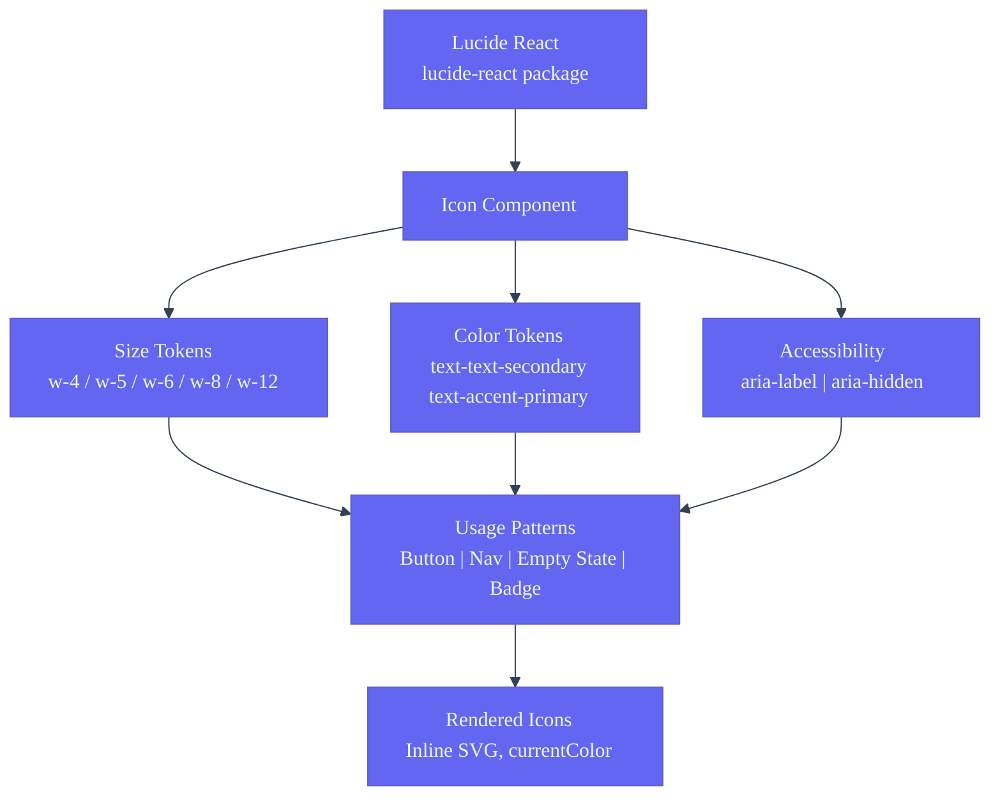
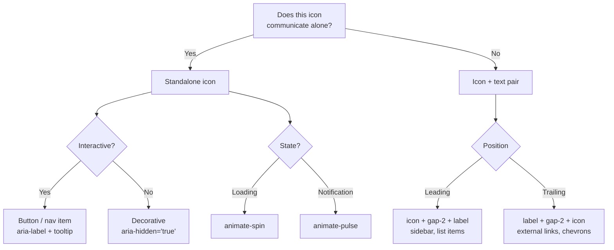

# Icon System — Second Brain OS

| Field | Value |
|---|---|
| Document ID | DSG-ICN-004 |
| Version | 1.0.0 |
| Status | Approved |
| Date | 2026-07-10 |
| Classification | Internal |
| Owner | Design Engineering Team |

---

## 1. Executive Summary

Second Brain OS uses **Lucide React** as its exclusive icon library — an open-source, consistently-styled set of 1,000+ outline icons with 1.5px stroke weight. Icons are rendered as inline SVGs via React components, inheriting color via `currentColor`, and available in 5 sizes (16px, 20px, 24px, 32px, 48px). Every icon in the UI follows three rules: it must serve a clear communicative purpose, include accessible labels (unless purely decorative), and match the project's cyberpunk aesthetic through consistent stroke styling and glow interactions.

---

## 2. Purpose

- Define the icon library selection and rationale
- Specify icon sizing, coloring, and styling conventions
- Document accessibility requirements for all icons
- Provide usage guidelines for icons with text, standalone, and in buttons
- Establish icon animation patterns (spinners, hover effects)

---

## 3. Scope

| In Scope | Out of Scope |
|---|---|
| Lucide React icon library | Custom icon illustration |
| Icon sizes (16, 20, 24, 32, 48px) | Animated icon spritesheets |
| Icon color via currentColor and tokens | Third-party icon library integration |
| Accessibility (aria-label, role, alt text) | SVG animation (see AnimationGuidelines.md) |
| Icon usage in buttons, navigation, empty states, badges | Icon font files |
| Icon hover and state animations | Module-specific icon sets |

---

## 4. Business Context

Icons serve as the primary wayfinding mechanism across 18 modules. The sidebar renders 14 module icons, each at 20px, with active state color change to accent-primary. Icons reduce scan time for task lists (status icon → priority → title), form fields (search icon in search bar), and navigation (module icon in sidebar). Students process icon+label pairs 40% faster than labels alone. Lucide's consistent 1.5px outline stroke and rounded cap/join align with the cyberpunk aesthetic — clean, technical, and precise.

---

## 5. Functional Specification

### 5.1 Icon Library Specification

| Property | Value |
|---|---|
| Library | Lucide React (`lucide-react`) |
| License | ISC (permissive, free) |
| Icon count | 1,000+ |
| Stroke style | Outline |
| Stroke width | 1.5px |
| Stroke cap | round |
| Stroke join | round |
| Fill | none (default) |
| Rendering | Inline SVG via React components |
| Color | `currentColor` (inherits from CSS) |

### 5.2 Icon Sizes

| Token | Pixels | Tailwind Class | Usage |
|---|---|---|---|
| `icon-xs` | 16px | `w-4 h-4` | Inline with small text, badge icons, table cell indicators |
| `icon-sm` | 20px | `w-5 h-5` | Sidebar items, button icons, inline with body text |
| `icon-md` | 24px | `w-6 h-6` | Empty state illustrations, primary action icons, section headers |
| `icon-lg` | 32px | `w-8 h-8` | Feature icons, module card graphics, large buttons |
| `icon-xl` | 48px | `w-12 h-12` | Hero illustrations, achievement badges, onboarding steps |

### 5.3 Icon Color Mapping

| Context | Token | Tailwind Class | Example |
|---|---|---|---|
| Default icon (navigational) | text-secondary | `text-text-secondary` | Sidebar modules, toolbar actions |
| Interactive icon (hover) | text-primary | `hover:text-text-primary` | Clickable icons |
| Active/selected icon | accent-primary | `text-accent-primary` | Active sidebar item |
| Disabled icon | text-disabled | `text-text-disabled` | Disabled action |
| Error/urgent icon | accent-error | `text-accent-error` | Error state, urgent priority |
| Warning icon | accent-warning | `text-accent-warning` | Warning indicator |
| Success icon | accent-success | `text-accent-success` | Completed state |
| Neon/decorative icon | accent-neon | `text-accent-neon` | Low priority, decorative |
| Button primary | text-inverse | `text-text-inverse` | Icon on primary button |
| Empty state | text-tertiary | `text-text-tertiary` | Large empty state icon |

### 5.4 Icon Usage Guidelines

| Pattern | Implementation | Example |
|---|---|---|
| Icon + text (inline) | `<Icon className="w-4 h-4 inline mr-1" />` + `<span>` | Search bar, menu items |
| Icon + text (button) | `<Icon className="w-5 h-5" />` + gap-2 + label | Primary action with icon |
| Icon only (toolbar) | Icon with `aria-label` and tooltip | Edit, delete, share actions |
| Icon only (navigation) | Icon with `aria-label` in nav item | Sidebar collapsed mode |
| Empty state icon | 64px icon in `text-tertiary` with heading below | "No tasks yet" |
| Badge icon | Icon in badge with label | Notification count, status |
| Decorative icon | Icon with `aria-hidden="true"` | Section header icons |

### 5.5 Icon Animation Patterns

| Pattern | Implementation | Duration | Trigger |
|---|---|---|---|
| Spinner | `className="animate-spin"` | Continuous | Loading state |
| Pulse | `className="animate-pulse"` | 2s cycle | Notification indicator |
| Hover scale | Framer Motion `whileHover={{ scale: 1.1 }}` | 150ms | Mouse enter |
| Hover glow | `hover:shadow-glow-sm` | 200ms | Mouse enter |
| Entry stagger | Framer Motion `staggerChildren: 0.05` | 300ms total | List mount |

### 5.6 Standard Icon Inventory

| Module | Icon (Lucide) | Size |
|---|---|---|
| Dashboard | `LayoutDashboard` | 20px sidebar, 24px page |
| Tasks | `CheckSquare` | 20px sidebar, 24px page |
| Courses | `BookOpen` | 20px sidebar, 24px page |
| Goals | `Target` | 20px sidebar, 24px page |
| Habits | `Repeat` | 20px sidebar, 24px page |
| Sleep | `Moon` | 20px sidebar, 24px page |
| Income | `DollarSign` | 20px sidebar, 24px page |
| Projects | `FolderKanban` | 20px sidebar, 24px page |
| Ideas | `Lightbulb` | 20px sidebar, 24px page |
| Resources | `Library` | 20px sidebar, 24px page |
| Opportunities | `Zap` | 20px sidebar, 24px page |
| Time | `Clock` | 20px sidebar, 24px page |
| Chat | `MessageCircle` | 20px sidebar, 24px page |
| Automation | `Bot` | 20px sidebar, 24px page |

---

## 6. Non-Functional Requirements

| Requirement | Target | Verification |
|---|---|---|
| Icon bundle size | < 50KB gzipped | Bundle analyzer |
| Icon render performance | < 5ms per SVG render | React DevTools profiler |
| Accessibility: all standalone icons | `aria-label` attribute | axe-core audit |
| Accessibility: decorative icons | `aria-hidden="true"` | axe-core audit |
| Icon stroke consistency | 1.5px uniform | Visual inspection |
| Color inheritance | `currentColor` on all icons | Code review |

---

## 7. Architecture



---

## 8. Diagrams

### 8.1 Icon Usage Decision Tree



### 8.2 Icon Component API

```tsx
// Icon wrapper component usage
<Icon icon={CheckSquare} size="sm" className="text-accent-primary" />
<Icon icon={Loader} size="sm" className="animate-spin" />
<Icon icon={Trash2} size="sm" className="text-accent-error" aria-label="Delete task" />
```

---

## 9. Data Models

### 9.1 Icon Component Props

```typescript
interface IconProps {
  icon: LucideIcon                    // Lucide icon component
  size?: 'xs' | 'sm' | 'md' | 'lg' | 'xl'  // 16, 20, 24, 32, 48px
  className?: string                  // Tailwind classes for color, animation
  ariaLabel?: string                  // Required for standalone icons
  ariaHidden?: boolean                // true for decorative icons
  onClick?: () => void
}
```

### 9.2 Icon Size Mapping

```typescript
const iconSizeMap = {
  xs: { width: 16, height: 16, class: 'w-4 h-4' },
  sm: { width: 20, height: 20, class: 'w-5 h-5' },
  md: { width: 24, height: 24, class: 'w-6 h-6' },
  lg: { width: 32, height: 32, class: 'w-8 h-8' },
  xl: { width: 48, height: 48, class: 'w-12 h-12' },
} as const
```

---

## 10. APIs

### 10.1 Direct Lucide Usage

```tsx
import { CheckSquare, Plus, Trash2 } from 'lucide-react'

// Inline with text
<button className="btn btn-primary">
  <Plus className="w-5 h-5" />
  <span>Add Task</span>
</button>

// Standalone with tooltip
<button className="btn btn-icon" aria-label="Delete task">
  <Trash2 className="w-5 h-5 text-accent-error" />
</button>

// Decorative (empty state)
<div className="text-text-tertiary">
  <CheckSquare className="w-12 h-12 mx-auto" aria-hidden="true" />
</div>
```

### 10.2 Wrapper Component

```tsx
// apps/web/components/ui/icon.tsx
export function Icon({ icon: LucideIcon, size = 'sm', className, ariaLabel, ariaHidden, onClick }: IconProps) {
  const sizeClass = iconSizeMap[size].class
  return (
    <LucideIcon
      className={`${sizeClass} ${className ?? ''}`}
      aria-label={ariaLabel}
      aria-hidden={ariaHidden}
      onClick={onClick}
    />
  )
}
```

---

## 11. Security

- Lucide icons are pure SVG — no external resources, no executable content
- Icon selection from a verified open-source library (ISC license)
- No icon renders user-generated content; no injection vectors

---

## 12. Performance Targets

| Metric | Target |
|---|---|
| Icon tree-shaking | Only imported icons bundled |
| Bundle size impact | < 50KB gzipped (100+ icons) |
| Individual icon render | < 5ms |
| Icon animation at 60fps | GPU composited transforms only |

---

## 13. Edge Cases

| Edge Case | Behavior |
|---|---|
| Lucide icon not available for a concept | Use closest matching icon; avoid mixing icon libraries |
| Icon at very small size (16px) | Stroke remains 1.5px; detail maintained by Lucide's design |
| RTL language support | `mirror` prop for directional icons (arrow, chevron) |
| Forced colors mode (Windows High Contrast) | Icons inherit `currentColor` from `ButtonText` or matching system color |
| Screen reader mismatch | Always pair `aria-label` with visible text or tooltip for standalone icons |
| Touch target on icon-only buttons | Button container enforces 44x44px min, not the icon itself |

---

## 14. Failure Scenarios

| Scenario | Mitigation |
|---|---|
| Lucide React package missing | Build fails — caught at compile time |
| Icon import fails tree-shaking | `import { IconName } from 'lucide-react'` is side-effect-free |
| SVG rendering blocked by CSP | `img-src 'self' data:` in Content Security Policy |
| Icon animation causes layout shift | Use `transform` and `opacity` only; never `width`/`height` |

---

## 15. Risks & Mitigations

| Risk | Likelihood | Impact | Mitigation |
|---|---|---|---|
| Icon inconsistency across modules | Medium | Medium | Standard icon inventory per module; code review |
| Third-party icon licensing changes | Low | High | Lucide is ISC (permissive); vendor lock-in mitigated by SVG nature |
| Missing accessible labels on new icons | Medium | Medium | ESLint rule requiring aria-label on standalone icons |

---

## 16. Acceptance Criteria

- [ ] All modules use Lucide React icons exclusively
- [ ] Each module has a designated primary icon listed in the inventory
- [ ] All standalone icons have `aria-label` attributes
- [ ] All decorative icons have `aria-hidden="true"`
- [ ] Icons in active sidebar state render with `text-accent-primary`
- [ ] Loading spinners use `animate-spin` on Lucide `Loader` or `LoaderCircle`
- [ ] Empty state pages use 48px decorative icons with descriptive heading

---

## 17. Traceability

| Related Document | Link |
|---|---|
| Design System | `docs/design/10_DesignSystem.md` |
| Accessibility | `docs/design/FrontendAccessibilityGuide.md` |
| Animation Guidelines | `docs/design/AnimationGuidelines.md` |
| Lucide Icons | https://lucide.dev/icons/ |

---

## 18. Implementation Notes

- Import icons with named imports from `lucide-react` for tree-shaking
- Wrap Lucide icons in a `<Icon>` component for consistent sizing
- Never change `strokeWidth` from the Lucide default (1.5px)
- Use `currentColor` for all icons — never hardcode icon color
- Button icons should be 20px (`w-5 h-5`) for default-sized buttons
- Sidebar icons should be 20px (`w-5 h-5`) with `text-text-secondary` default
- Empty state icons should be 48px (`w-12 h-12`) with `text-text-tertiary`

---

## 19. Testing Strategy

| Test Type | Scope | Tool |
|---|---|---|
| Accessibility | All standalone icons have aria-label | axe-core CI scan |
| Bundle size | Total icon bundle < 50KB gzipped | Bundle analyzer |
| Visual rendering | Icons render at correct size | Storybook visual regression |
| Color inheritance | Icons respect parent text color | Playwright screenshot |
| Animation | Spinner and pulse animations play correctly | Visual inspection |

---

## 20. References

| Reference | URL |
|---|---|
| Lucide React | https://lucide.dev/guide/packages/lucide-react |
| Lucide Icon Search | https://lucide.dev/icons/ |
| Accessible Icon Guidelines | https://www.w3.org/WAI/tutorials/images/ |
| SVG Accessibility | https://developer.mozilla.org/en-US/docs/Web/Accessibility/ARIA/Roles/img_role |
