# Information Architecture — Second Brain OS

> **Single source of truth for navigation, search, dashboard, AI integration, cross-module relationships, and platform IA.**
> Enterprise-grade design by a Principal Information Architect, Enterprise UX Architect, Product Systems Architect, SaaS Navigation Expert, AI Product Architect, and Knowledge Management Architect.

---

## Document Control

| Field | Value |
|---|---|
| Document ID | DSG-INF-001 |
| Version | 1.0.0 |
| Status | Active |
| Last Updated | 2026-06-11 |
| Supersedes | Navigation/IA fragments across `08_UIUX.md`, `10_DesignSystem.md`, `ProductArchitecture.md`, `Enterprise_Frontend_Discovery_Report_v3.md` |
| Classification | Internal — Architecture Reference |
| Target Audience | AI Agents (Claude, Cursor, Copilot), Frontend Engineers, UX Designers, Product Managers |

---

## Table of Contents

1. [Executive Summary](#1-executive-summary)
2. [Information Architecture Principles](#2-information-architecture-principles)
3. [Product Structure](#3-product-structure)
4. [Navigation Philosophy](#4-navigation-philosophy)
5. [Global Navigation](#5-global-navigation)
   - 5.1 Primary Navigation
   - 5.2 Secondary Navigation
   - 5.3 Tertiary Navigation
   - 5.4 Contextual Navigation
   - 5.5 Cross-Module Navigation
   - 5.6 Breadcrumb Architecture
   - 5.7 Quick Actions Architecture
6. [Dashboard Architecture](#6-dashboard-architecture)
   - 6.1 Dashboard Sections
   - 6.2 Dashboard Hierarchy
   - 6.3 Dashboard Widgets
   - 6.4 Dashboard Navigation
   - 6.5 Dashboard Context
7. [Search Architecture](#7-search-architecture)
   - 7.1 Global Search
   - 7.2 Semantic Search
   - 7.3 AI Search
   - 7.4 Command Search
   - 7.5 Knowledge Search
   - 7.6 Project Search
   - 7.7 Opportunity Search
   - 7.8 Search Results Architecture
   - 7.9 Search Ranking Strategy
8. [Command Center Architecture](#8-command-center-architecture)
   - 8.1 Quick Commands
   - 8.2 AI Commands
   - 8.3 System Commands
   - 8.4 Navigation Commands
   - 8.5 Capture Commands
   - 8.6 Search Commands
9. [Notification Architecture](#9-notification-architecture)
   - 9.1 Notification Categories
   - 9.2 Priority Levels
   - 9.3 Escalation Logic
   - 9.4 AI Notifications
   - 9.5 System Notifications
   - 9.6 Opportunity Notifications
   - 9.7 Learning Notifications
10. [Knowledge Architecture](#10-knowledge-architecture)
    - 10.1 Resource Structure
    - 10.2 Knowledge Structure
    - 10.3 Taxonomy
    - 10.4 Tagging Strategy
    - 10.5 Classification Strategy
    - 10.6 Relationships
    - 10.7 Knowledge Discovery
    - 10.8 Knowledge Retrieval
11. [Learning Architecture](#11-learning-architecture)
    - 11.1 Course Structure
    - 11.2 Learning Paths
    - 11.3 Skills Mapping
    - 11.4 Learning Relationships
    - 11.5 Learning Analytics
    - 11.6 Learning Discovery
12. [Opportunity Architecture](#12-opportunity-architecture)
    - 12.1 Opportunity Categories
    - 12.2 Matching Logic
    - 12.3 Filtering Logic
    - 12.4 Recommendation Logic
    - 12.5 Discovery Logic
13. [Analytics Architecture](#13-analytics-architecture)
    - 13.1 Analytics Categories
    - 13.2 Reporting Structure
    - 13.3 Metrics Structure
    - 13.4 Insights Structure
14. [Settings Architecture](#14-settings-architecture)
    - 14.1 User Settings
    - 14.2 AI Settings
    - 14.3 Notification Settings
    - 14.4 Privacy Settings
    - 14.5 Appearance Settings
    - 14.6 System Settings
15. [AI Architecture](#15-ai-architecture)
    - 15.1 AI Entry Points
    - 15.2 AI Workflows
    - 15.3 AI Navigation
    - 15.4 AI Recommendations
    - 15.5 AI Suggestions
    - 15.6 AI Context System
16. [Cross-Module Relationships](#16-cross-module-relationships)
    - 16.1 Task ↔ Roadmap
    - 16.2 Roadmap ↔ Skills
    - 16.3 Skills ↔ Opportunities
    - 16.4 Learning ↔ Projects
    - 16.5 Projects ↔ Income
    - 16.6 Analytics ↔ All Modules
    - 16.7 Memory ↔ All Modules
    - 16.8 AI ↔ All Modules
17. [Information Hierarchy](#17-information-hierarchy)
    - 17.1 Level 1 Information
    - 17.2 Level 2 Information
    - 17.3 Level 3 Information
    - 17.4 Level 4 Information
18. [Mobile Information Architecture](#18-mobile-information-architecture)
19. [Tablet Information Architecture](#19-tablet-information-architecture)
20. [Desktop Information Architecture](#20-desktop-information-architecture)
21. [Accessibility Information Architecture](#21-accessibility-information-architecture)
22. [Future Expansion Architecture](#22-future-expansion-architecture)

---

## 1. Executive Summary

### System Scope

Second Brain OS is an AI-augmented personal productivity system comprising **20 modules** organized into **6 navigation groups** across **4 platform targets**. The system serves as the user's single point of intelligence for tasks, learning, projects, career, well-being, and system management.

### Enterprise IA Design Tenets

| Tenet | Application |
|---|---|
| **Progressive Disclosure** | Every screen reveals complexity on demand — never more than 7±2 primary choices at any level |
| **Consistent Mental Model** | Every module follows the same information pattern: List → Detail → Actions → Related |
| **Keyboard Runtime** | Every action reachable without mouse — `R+[letter]` routing, `/commands`, keyboard-only navigation |
| **Cross-Module Interoperability** | Every module can reference, link to, and pull context from every other module |
| **AI as Discovery Layer** | AI is not a module — it's a pervasive discovery and action layer across all modules |
| **Content Before Container** | Information architecture is data-model driven, not UI-layout driven |

### Key Numbers

| Metric | Count |
|---|---|
| Modules | 20 |
| Navigation Groups | 6 |
| Navigation Levels | 4 (Global, Module, Context, Command) |
| Two-Key Routes (`R+letter`) | 18 |
| Dashboard Zones | 8 |
| Search Scopes | 7 |
| Command Categories | 6 |
| Notification Categories | 7 |
| Information Levels | 4 |
| Platform Targets | 4 (Mobile, Tablet, Desktop, Accessibility) |
| Expansion Slots | 6 |

### Source Documents Resolved

| Discrepancy | Resolution |
|---|---|
| 15 vs 16 modules | Standardized to **20 modules** (adding YouTube Vault, Browser Extension, Voice Layer) |
| 4 vs 6 sidebar groups | Adopted **6-group model** (Core, Learn, Build, Earn, Well-Being, System) |
| Chat vs ARIA | Branded as **"AI Chat"** for now; rebrand-ready to "ARIA" later |
| 5 vs 11 agents live | Reference **AGENTS.md** count (11 live) for implementation status |

---

## 2. Information Architecture Principles

### P1: Progressive Disclosure

Every screen shows only as much information as the user needs at that moment. Navigation never exceeds **7±2 items** at any single level. Details, filters, and advanced actions are revealed through expand/collapse, hover, focus, or explicit user request.

**Application:** The sidebar shows 6 groups (not 20 modules). Modules within a group expand on hover or click. All 20 modules are one click away but only 6 are visually simultaneous.

### P2: Consistent Mental Model

Every module follows an identical interaction pattern:

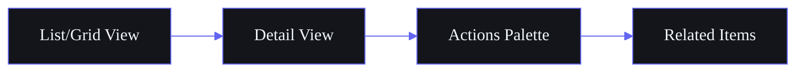

This means a user who knows how to use Tasks intuitively knows how to use Courses, Projects, Resources, and all other modules. The content differs; the interaction model does not.

**Exceptions:** Dashboard, AI Chat, and Analytics have specialized layouts but share the same navigation skeleton.

### P3: Keyboard Runtime

Every user-facing action is reachable without a mouse. The system provides:
- **`R+letter` routing:** Two-key navigation to any module
- **`/command` palette:** Contextual actions within any module
- **Tab/Arrow navigation:** Complete keyboard traversal of all interactive elements
- **Standard shortcuts:** `Cmd+K` (search), `N` (new), `Escape` (back/close)

**Enterprise rationale:** Power users (100+ actions/day) save 3-5 seconds per navigation action. At 50 navigations/day, that's ~3 minutes/day saved — 18 hours/year.

### P4: Cross-Module Interoperability

No module is an island. Every module exposes:
- **Inline links** to related items in other modules (e.g., a task links to its goal and project)
- **Deep links** that open another module's detail view (e.g., a course nudge links to the course page)
- **Data contributions** to the analytics, memory, and AI context systems
- **Event subscriptions** to state changes in other modules

**Enterprise rationale:** Cross-module linking is what transforms a collection of tools into a system. Without it, the user context-switches across 20 silos.

### P5: AI-Enhanced Discovery

AI is not a separate module to visit — it's a layer across all modules. The user discovers information through:
- **Proactive suggestions** ("You have 3 tasks due today")
- **Natural language search** ("show me react projects from last month")
- **Contextual recommendations** ("Based on your learning, you might enjoy this opportunity")
- **Predictive navigation** ("You usually check tasks next — open them?")

### P6: Context Preservation

When navigating between modules, the system preserves:
- **Scroll position** in list views
- **Active filters and sort** applied to the current view
- **Selection state** (which item was selected)
- **Search query** in the module search bar

Navigating away and back returns the user to exactly where they were, not to a default state.

### P7: Responsive Without Compromise

The same content model serves all platforms. Navigation transforms at breakpoints:
- **<768px:** Bottom tab bar (5 items) + hamburger drawer for full nav
- **768-1024px:** Collapsed sidebar (64px icons) + overlay drawer
- **>1024px:** Expanded sidebar (240px), collapsible

Content renders identically — only navigation chrome changes.

### P8: Content Before Container

Navigation structure derives from the data model, not from visual design decisions. The domain model (13 domains, 20 modules) defines what goes where. Visual hierarchy (size, color, position) reinforces the data hierarchy — it does not create it.

**Enterprise rationale:** When navigation is data-model-driven, adding a module is a config change, not a redesign.

### P9: Discoverability Over Memorization

The system favors showing over recalling. Users should never need to memorize:
- Module locations (sidebar labels are always visible in expanded mode)
- Keyboard shortcuts (pressing `?` or `Cmd+K` shows available shortcuts)
- Module contents (list view shows recent items, not a blank state)
- Cross-module links (related items are shown inline, not hidden)

### P10: Accessible by Default

Navigation meets WCAG 2.1 AA at minimum:
- All navigation operable by keyboard alone
- Screen reader landmarks for every nav region
- Focus indicators visible on all interactive elements
- ARIA labels on all icon-only navigation items
- Reduced motion respected for navigation transitions

---

## 3. Product Structure

### 3.1 Module Registry

The complete system comprises **20 modules** organized into **6 navigation groups**:

| # | Module | Nav Group | Route | Two-Key | Status |
|---|---|---|---|---|---|
| 1 | Dashboard | Core | `/dashboard` | `R+D` | ✅ Live |
| 2 | Tasks | Core | `/tasks` | `R+T` | ✅ Live |
| 3 | AI Chat | Core | `/chat` | `R+K` | ✅ Live |
| 4 | Courses | Learn | `/courses` | `R+C` | ✅ Live |
| 5 | YouTube Vault | Learn | `/youtube` | `R+Y` | ⚠️ Design |
| 6 | Resource Library | Learn | `/resources` | `R+L` | ✅ Live |
| 7 | Goals | Build | `/goals` | `R+G` | ✅ Live |
| 8 | Roadmap Engine | Build | `/roadmap` | `R+M` | ⚠️ Design |
| 9 | Idea Vault | Build | `/ideas` | `R+I` | ✅ Live |
| 10 | Projects | Build | `/projects` | `R+P` | ✅ Live |
| 11 | Opportunity Radar | Earn | `/opportunities` | `R+O` | ✅ Live |
| 12 | Income Tracker | Earn | `/income` | `R+E` | ✅ Live |
| 13 | Habit Engine | Well-Being | `/habits` | `R+H` | ✅ Live |
| 14 | Sleep Monitor | Well-Being | `/sleep` | `R+S` | ✅ Live |
| 15 | Time Tracker | System | `/time` | `R+N` | ✅ Live |
| 16 | Weekly Review | System | `/review` | `R+W` | ✅ Live |
| 17 | Analytics | System | `/analytics` | `R+A` | ⚠️ Design |
| 18 | Automation | System | `/automation` | `R+V` | ✅ Live |
| 19 | Browser Extension | System | (config page) | `R+B` | ⚠️ Design |
| 20 | Settings | System | `/settings` | `R+F` | ✅ Live |

### 3.2 Navigation Group Definitions

| Group | Focus | Modules | User Intent |
|---|---|---|---|
| **Core** | Daily operations | Dashboard, Tasks, AI Chat | "What do I need to do today?" |
| **Learn** | Knowledge acquisition | Courses, YouTube Vault, Resource Library | "What am I learning?" |
| **Build** | Creation & planning | Goals, Roadmap, Idea Vault, Projects | "What am I building?" |
| **Earn** | Career & finance | Opportunity Radar, Income Tracker | "What am I earning?" |
| **Well-Being** | Personal health | Habit Engine, Sleep Monitor | "How am I doing?" |
| **System** | System management | Time Tracker, Weekly Review, Analytics, Automation, Browser Extension, Settings | "How is my system running?" |

### 3.3 Information Levels by Module

Each module occupies one of 4 information levels (see [Section 17](#17-information-hierarchy)):

| Level | Modules | Navigation Treatment |
|---|---|---|
| L1 — Command Center | Dashboard, AI Chat | Always one click away (sidebar top, bottom nav, Cmd+K) |
| L2 — Daily Drivers | Tasks, Courses, Goals, Projects | Sidebar priority, module tabs |
| L3 — Knowledge Assets | Resources, YouTube, Ideas, Opportunities | Sidebar, nested views |
| L4 — Tracking & System | Habits, Sleep, Income, Time, Review, Analytics, Automation, Browser Extension, Settings | Sidebar bottom, system group |

---

## 4. Navigation Philosophy

### 4.1 Hybrid Navigation Model

Second Brain OS adopts a **hybrid navigational model** combining the best patterns from enterprise SaaS leaders:

| Pattern | Source | Application |
|---|---|---|
| Two-Key Routing | Linear | `R+letter` jumps to any module instantly |
| Collapsible Sidebar | Stripe | 240px expanded → 64px collapsed; never hidden |
| Command Palette | Vercel | `Cmd+K` for universal search and actions |
| Contextual Tabs | PostHog | Module-level sub-navigation |
| Notification Center | Linear | Bell icon with contextual preview |
| Related Items Sidebar | Notion | Cross-module links in a detail view panel |

### 4.2 Four Navigation Layers

```mermaid
%%{init: {'theme': 'base', 'themeVariables': {'background': '#0A0B0F', 'primaryColor': '#13151A', 'primaryBorderColor': '#6366F1', 'primaryTextColor': '#F1F5F9', 'lineColor': '#6366F1', 'secondaryColor': '#1A1D24', 'tertiaryColor': '#0A0B0F', 'fontFamily': 'DM Sans'}}}%%
graph TD
    L1[Layer 1: GLOBAL NAVIGATION<br/>always visible] --> L1_S[Sidebar<br/>modules + groups]
    L1 --> L1_N[Top navbar<br/>search, notifications, user, quick capture]
    L1 --> L1_K[Keyboard shortcuts<br/>R+letter, Cmd+K]
    
    L2[Layer 2: MODULE NAVIGATION<br/>visible within module] --> L2_T[Module tabs<br/>List - Kanban - Calendar]
    L2 --> L2_S[Module search<br/>Cmd+F within module]
    L2 --> L2_F[Filter bar<br/>status, priority, date, tags]
    
    L3[Layer 3: CONTEXT NAVIGATION<br/>visible on detail/item view] --> L3_B[Breadcrumbs<br/>Dashboard > Tasks > Title]
    L3 --> L3_R[Related items sidebar<br/>linked goals, projects, resources]
    L3 --> L3_A[Action palette<br/>available actions for this item]
    L3 --> L3_D[Deep links<br/>links from other modules]
    
    L4[Layer 4: COMMAND NAVIGATION<br/>invoked on demand] --> L4_C[Command palette<br/>Cmd+K universal]
    L4 --> L4_Q[Quick actions<br/>/commands within module]
    L4 --> L4_V[Voice commands<br/>microphone button]
    L4 --> L4_N[Notification deep links<br/>click notification → target]

    style L1 fill:#0A0B0F,stroke:#00FFA3,color:#F1F5F9,stroke-width:2px
    style L2 fill:#0A0B0F,stroke:#818CF8,color:#F1F5F9,stroke-width:2px
    style L3 fill:#0A0B0F,stroke:#6366F1,color:#F1F5F9,stroke-width:2px
    style L4 fill:#0A0B0F,stroke:#F59E0B,color:#F1F5F9,stroke-width:2px
```

### 4.3 Navigation Gestures

| Gesture | Platform | Action |
|---|---|---|
| Swipe right | Mobile | Open sidebar drawer |
| Swipe left | Mobile | Go back / close detail |
| Swipe item | Mobile | Quick action (complete, delete) |
| Hover sidebar | Desktop | Expand collapsed sidebar |
| Right-click | Desktop | Context menu with module actions |
| Pinch | Tablet | Zoom timeline / roadmap |
| Long press | Mobile | Show action palette |

### 4.4 Navigation States

| State | Description | Visual Treatment |
|---|---|---|
| Default | User on a module page, sidebar expanded | Normal styling |
| Focused | User typing in search/command | Overlay, dim background |
| Notification | New notification received | Badge on bell icon |
| Offline | No network connection | Warning banner, cached nav |
| Voice | Voice command listening | Mic indicator, listening mode |
| Broadcast | AI generating/sending content | Spinner/loading on AI Chat |

---

## 5. Global Navigation

### 5.1 Primary Navigation (Sidebar)

#### Structure


#### Collapse Behavior

| State | Width | Label Visibility | Icon Size | Use Case |
|---|---|---|---|---|
| Expanded | 240px (w-60) | Visible | 20px | Desktop (default) |
| Collapsed | 64px (w-16) | Hover tooltip | 24px | Desktop (power user) |
| Overlay | 280px | Visible | 20px | Tablet/mobile drawer |

**Collapse trigger:** Toggle button at sidebar bottom. Hover on collapsed sidebar edge expands temporarily (200ms transition).

#### Badge Behavior

| Badge Type | Module | Condition | Color |
|---|---|---|---|
| Count badge | Tasks | Overdue tasks count | Red |
| Dot badge | AI Chat | Unread AI response | Blue |
| Count badge | Notifications | Unread count (in navbar) | Red |
| Dot badge | Automation | Failed automation | Orange |
| Count badge | Opportunities | New high-match opportunities | Green |

### 5.2 Secondary Navigation (Top Navbar)

#### Structure

```mermaid
%%{init: {'theme': 'base', 'themeVariables': {'background': '#0A0B0F', 'primaryColor': '#13151A', 'primaryBorderColor': '#6366F1', 'primaryTextColor': '#F1F5F9', 'lineColor': '#6366F1', 'secondaryColor': '#1A1D24', 'tertiaryColor': '#0A0B0F', 'fontFamily': 'DM Sans'}}}%%
graph LR
    subgraph TopNavbar[Top Navbar]
        Back[← Back] --- Name[Module Name]
        Name --- Search[🔍 Search]
        Search --- Bell[🔔 Bell]
        Bell --- Mic[🎤 Mic]
        Mic --- Plus[âž• Quick Capture]
        Plus --- Avatar[Avatar / User]
    end
    SubTitle[Subtitle / breadcrumb] --- TopNavbar

    style TopNavbar fill:#13151A,stroke:#6366F1,color:#F1F5F9
    style Back fill:#0A0B0F,stroke:#334155,color:#94A3B8
    style Name fill:#0A0B0F,stroke:#334155,color:#F1F5F9
```

#### Navbar Elements

| Element | Position | Behavior |
|---|---|---|
| Back button | Far left | Visible when in detail view (navigates to parent list) |
| Module name | Left | Current module title |
| Breadcrumb | Left (below title) | `Dashboard > Tasks > Task Name` (see 5.6) |
| Global search | Right | Expands on click/focus; `Cmd+K` shortcut |
| Notification bell | Right | Badge with count; click opens notification center |
| Voice trigger | Right | Persistent mic button; `Cmd+Shift+M` shortcut |
| Quick capture | Right | `+` button; `C` shortcut; creates new item in current module context |
| User avatar | Far right | Dropdown: Profile, Settings, Logout |

#### Notification Center (Dropdown)

```mermaid
%%{init: {'theme': 'base', 'themeVariables': {'background': '#0A0B0F', 'primaryColor': '#13151A', 'primaryBorderColor': '#6366F1', 'primaryTextColor': '#F1F5F9', 'lineColor': '#6366F1', 'secondaryColor': '#1A1D24', 'tertiaryColor': '#0A0B0F', 'fontFamily': 'DM Sans'}}}%%
graph TD
    Header[Notifications · Mark read] --> Today[🔴 Today 3]
    Today --> N1[Task overdue: Submit report]
    Today --> N2[Goal milestone: 50% reached]
    Today --> N3[Opportunity: 92% match found]
    Today --> Yesterday[🔴 Yesterday 5]
    Yesterday --> Y1[...]
    Yesterday --> Y2[...]
    Yesterday --> Footer[View all notifications →]

    style Header fill:#13151A,stroke:#6366F1,color:#F1F5F9
    style Today fill:#1A1D24,stroke:#334155,color:#EF4444
    style Yesterday fill:#1A1D24,stroke:#334155,color:#EF4444
    style Footer fill:#13151A,stroke:#6366F1,color:#818CF8
```

### 5.3 Tertiary Navigation (Module-Level)

Every module follows a consistent sub-navigation pattern:

```
Module Name         [Tab 1] [Tab 2] [Tab 3]         [Filter] [Sort] [View]
                                                      â–¼
                                               Status: ● ○ ○
                                               Priority: ● ○ ○
                                               Tags: [input]
```

#### Module Tabs (by Module)

| Module | Tab 1 | Tab 2 | Tab 3 | Tab 4 |
|---|---|---|---|---|
| Tasks | List | Kanban | Calendar | Timeline |
| Courses | Grid | Progress | Calendar | — |
| Goals | Canvas | Grid | Timeline | — |
| Projects | Kanban | List | Timeline | — |
| Ideas | Pipeline | Grid | — | — |
| Resources | Grid | List | Collections | — |
| Opportunities | List | Pipeline | Sources | — |
| YouTube | Grid | Queue | Playlists | — |
| Habits | Grid | Calendar | Streaks | — |
| Sleep | Dashboard | Logs | Trends | — |
| Income | Dashboard | Entries | Trends | — |
| Time | List | Dashboard | Stats | Calendar |
| Analytics | Overview | Reports | Metrics | Trends |
| Roadmap | Timeline | Phases | Resources | — |

#### Filter Bar Pattern

Every list view exposes consistent filters:

| Filter | Type | Values |
|---|---|---|
| Status | Dropdown | Active, Completed, Archived, Draft |
| Priority | Dropdown | Urgent, High, Medium, Low |
| Date range | Date picker | Today, This week, This month, Custom |
| Tags | Multi-select | User-defined tags |
| Search | Input | Free text within module |
| Sort | Dropdown | Newest, Oldest, Title A-Z, Priority, Due date |

### 5.4 Contextual Navigation

Contextual navigation appears when viewing a specific item's detail page.

#### Components

```mermaid
%%{init: {'theme': 'base', 'themeVariables': {'background': '#0A0B0F', 'primaryColor': '#13151A', 'primaryBorderColor': '#6366F1', 'primaryTextColor': '#F1F5F9', 'lineColor': '#6366F1', 'secondaryColor': '#1A1D24', 'tertiaryColor': '#0A0B0F', 'fontFamily': 'DM Sans'}}}%%
graph LR
    subgraph Main[Main Content Area]
        Title[Complete project proposal]
        Status[Status: In Progress]
        Prio[Priority: High]
        Due[Due: Jun 15, 2026]
        Desc[Description...]
        Feed[Activity Feed<br/>Jun 11 - Created<br/>Jun 10 - Priority set]
    end
    subgraph Side[Related Items Sidebar · 280px]
        Linked[🔗 Linked to]
        G[Goal: Q2 Career Growth]
        PR[Project: Portfolio Site]
        C[Course: Web Dev Bootcamp]
        Res[📎 Resources]
        R1[Design guidelines]
        R2[API docs]
        Ideas[💡 Related ideas]
        I1[Rewrite backend in Rust]
    end
    Main --- Side

    style Main fill:#13151A,stroke:#6366F1,color:#F1F5F9
    style Side fill:#1A1D24,stroke:#334155,color:#F1F5F9
```

#### Contextual Link Types

| Link Type | Purpose | UI Treatment | Direction |
|---|---|---|---|
| **Parent reference** | Shows item's parent module | Card in related sidebar | Upward |
| **Child reference** | Shows items that link to this | Card in related sidebar | Downward |
| **Inline mention** | `[[link]]` in rich text | Blue clickable text | Bidirectional |
| **Auto-suggest** | AI-detected relationship | Subtle "Did you know?" card | AI-discovered |
| **History-based** | Recently viewed together | "You viewed these together" | Algorithmic |

### 5.5 Cross-Module Navigation

Cross-module navigation enables fluid movement between related items in different modules.

#### Entry Points

| Entry Point | Source Module | Target Module | Trigger |
|---|---|---|---|
| Task.goal_id | Tasks | Goals | Click goal badge on task |
| Task.project_id | Tasks | Projects | Click project badge on task |
| Course.tasks | Courses | Tasks | "Related tasks" tab in course detail |
| Goal.milestones | Goals | Tasks | Milestone progress shows linked tasks |
| Project.tasks | Projects | Tasks | "Tasks" tab in project detail |
| Resource.tasks | Resources | Tasks | "Used in" section |
| Opportunity.skills | Opportunities | Courses | "Build this skill" link |
| Idea.project | Ideas | Projects | "Move to project" action |

#### Cross-Module Navigation Interface

The **Related Items Sidebar** (280px, right panel) appears on all detail views and shows context from all other modules that reference the current item.

### 5.6 Breadcrumb Architecture

#### Pattern

```
Home > Module > [View] > Item Title
```

#### Breadcrumb Levels

| Level | Format | Example | Behavior |
|---|---|---|---|
| L0 — Home | `Home` | `Dashboard` | Always "Dashboard" (or "Home" on mobile) |
| L1 — Module | `Module Name` | `Tasks` | Links to module list view |
| L2 — Sub-view | `[View Name]` | `Kanban` | Links to specific tab within module |
| L3 — Item | `Item Title` | `Complete project proposal` | Current page, not linked (truncated at 30 chars) |

#### Breadcrumb Examples

| Page | Breadcrumb |
|---|---|
| Task detail | `Dashboard > Tasks > Design system audit` |
| Course detail | `Dashboard > Courses > Web Dev Bootcamp` |
| Kanban view | `Dashboard > Tasks > Kanban` |
| Goal with filter | `Dashboard > Goals > Active > Q2 Career Growth` |
| Project task list | `Dashboard > Projects > Portfolio Site > Tasks` |
| Resource collection | `Dashboard > Resources > Collections > Design Assets` |

#### Mobile Breadcrumb

On mobile, breadcrumbs collapse to:
```
< Back    Module Name    >
```
The full breadcrumb is shown as a tooltip on long-press of the module name.

### 5.7 Quick Actions Architecture

#### Quick Capture (Global `+` Button)

The `+` button in the top navbar always creates a new item. The type depends on context:

| Context | Action | Result |
|---|---|---|
| Anywhere (default) | Click `+` | Show module picker (grid of 20 module icons) → create in chosen module |
| Tasks page | Click `+` | New task (skip picker) |
| Courses page | Click `+` | New course |
| Any detail page | Click `+` | New item in same module |
| Text selected anywhere | Click `+` | "Add selection to..." → knowledge, task, idea |
| URL in clipboard | Click `+` | "Add link to..." → resources, ideas |

#### Quick Capture Modal

```mermaid
%%{init: {'theme': 'base', 'themeVariables': {'background': '#0A0B0F', 'primaryColor': '#13151A', 'primaryBorderColor': '#6366F1', 'primaryTextColor': '#F1F5F9', 'lineColor': '#6366F1', 'secondaryColor': '#1A1D24', 'tertiaryColor': '#0A0B0F', 'fontFamily': 'DM Sans'}}}%%
graph TD
    Header[Quick Capture · Esc] --> Input[What's on your mind?]
    Input --> AI[AI Classification]
    AI --> Task[Task]
    AI --> Course[Course]
    AI --> Idea[Idea]
    AI --> Note[Note]
    AI --> Form[Title: ________<br/>Module: Tasks â–¼<br/>Priority: Medium â–¼<br/>Tags: input + Add tag]
    Form --> Actions[Cancel · Create →]

    style Header fill:#0A0B0F,stroke:#00FFA3,color:#F1F5F9
    style Input fill:#13151A,stroke:#6366F1,color:#94A3B8
    style AI fill:#13151A,stroke:#334155,color:#F1F5F9
    style Form fill:#13151A,stroke:#6366F1,color:#F1F5F9
    style Actions fill:#13151A,stroke:#334155,color:#F1F5F9
```

#### Two-Key Routing (`R+letter`)

The complete Two-Key routing table:

| Shortcut | Module | Mnemonic |
|---|---|---|
| `R+D` | Dashboard | **D**ashboard |
| `R+T` | Tasks | **T**asks |
| `R+K` | AI Chat | (tal)**K** |
| `R+C` | Courses | **C**ourses |
| `R+Y` | YouTube Vault | **Y**outube |
| `R+L` | Resource Library | **L**ibrary |
| `R+G` | Goals | **G**oals |
| `R+M` | Roadmap | **M**ap |
| `R+I` | Ideas | **I**deas |
| `R+P` | Projects | **P**rojects |
| `R+O` | Opportunities | **O**pportunities |
| `R+E` | Income | (**E**arn) |
| `R+H` | Habits | **H**abits |
| `R+S` | Sleep | **S**leep |
| `R+N` | Time Tracker | (**N**ow) |
| `R+W` | Weekly Review | **W**eekly |
| `R+A` | Analytics | **A**nalytics |
| `R+V` | Automation | (Automate) -> **V** for the V in automati**v**e |
| `R+B` | Browser Extension | **B**rowser |
| `R+F` | Settings | (pre)**F**erences |

**Implementation:** Single-key `R` enters "Routing mode" — a small HUD appears at the bottom of the screen showing the route grid. Pressing the second letter within 1.5 seconds navigates to the target module. Pressing `Escape` or waiting exits routing mode without navigation.

---

## 6. Dashboard Architecture

### 6.1 Dashboard Sections

The Dashboard is organized into **8 zones** arranged in a responsive bento-grid layout:

```mermaid
%%{init: {'theme': 'base', 'themeVariables': {'background': '#0A0B0F', 'primaryColor': '#13151A', 'primaryBorderColor': '#6366F1', 'primaryTextColor': '#F1F5F9', 'lineColor': '#6366F1', 'secondaryColor': '#1A1D24', 'tertiaryColor': '#0A0B0F', 'fontFamily': 'DM Sans'}}}%%
graph TD
    Z1[ZONE 1: ARIA GREETING + STATUS<br/>Good morning. You have 4 tasks today. 1 is overdue.] --> Z2[ZONE 2: KPI STRIP<br/>Tasks ▼5% · Streak 🔥3d · Study 📚45m · Goals 🎯80% · Inc 💰$500 · Opps 🔭3]
    Z2 --> Z3[ZONE 3: TODAY'S FOCUS]
    Z2 --> Z4[ZONE 4: COURSE TARGET]
    Z3 --> T1[Priority task 1 ☐✓]
    Z3 --> T2[Priority task 2 ☐✓]
    Z3 --> T3[Priority task 3 ☐✓]
    Z3 --> TA[+ Add task]
    Z4 --> CT[DSA: 45/60 min today<br/>████████░░░ 75%<br/>Ahead by 2 sessions<br/>Next: Graph algorithms]
    Z3 --> Z5[ZONE 5: TOMORROW PREVIEW<br/>1 deadline · 2 tasks previewed]
    Z5 --> Z6[ZONE 6: ACTIVITY HEATMAP<br/>GitHub-style grid · 6-month view]
    Z5 --> Z7[ZONE 7: OPPORTUNITIES<br/>Senior Dev @ Google 92% · Hackathon 85% · Scholarship 78%]
    Z6 --> Z8[ZONE 8: RECENT ACTIVITY<br/>2h ago Completed task · 3h ago Added resource<br/>5h ago Logged study · Yesterday New idea]

    style Z1 fill:#0A0B0F,stroke:#00FFA3,color:#F1F5F9,stroke-width:2px
    style Z2 fill:#13151A,stroke:#6366F1,color:#F1F5F9
    style Z3 fill:#13151A,stroke:#818CF8,color:#F1F5F9
    style Z4 fill:#13151A,stroke:#818CF8,color:#F1F5F9
    style Z5 fill:#13151A,stroke:#6366F1,color:#F1F5F9
    style Z6 fill:#13151A,stroke:#334155,color:#F1F5F9
    style Z7 fill:#13151A,stroke:#334155,color:#F1F5F9
    style Z8 fill:#13151A,stroke:#334155,color:#F1F5F9
```

#### Zone Specifications

| Zone | Priority | Data Source | Refresh | Empty State |
|---|---|---|---|---|
| Z1: Greeting | P0 | AI Domain (time-based) | On load + time change | "Welcome! Start by creating your first task." |
| Z2: KPI Strip | P0 | Analytics Domain | 5 min | Metrics show 0 with "Start tracking" CTA |
| Z3: Today's Focus | P0 | Task Domain | Real-time | "No tasks today. Plan your day?" |
| Z4: Course Target | P1 | Learning Domain | Daily | "Enroll in your first course to start tracking." |
| Z5: Tomorrow Preview | P1 | Task + Goal Domains | Daily | "Nothing scheduled for tomorrow." |
| Z6: Activity Heatmap | P2 | Analytics Domain | Daily | Empty heatmap grid |
| Z7: Opportunities | P1 | Opportunity Domain | Daily | "No opportunities yet. Configure sources." |
| Z8: Recent Activity | P1 | Analytics Domain | Real-time | Empty feed |

### 6.2 Dashboard Hierarchy

#### Priority by Time of Day

The Dashboard adapts its emphasis based on time (7-state machine):

| Time | State | Emphasis | Zones Promoted |
|---|---|---|---|
| 6-9 AM | Morning | Planning, today's tasks | Z1, Z3, Z5 |
| 9-12 PM | Midday | Deep work, focus | Z3, Z4 |
| 12-2 PM | Lunch | Break, light review | Z2, Z8 |
| 2-6 PM | Afternoon | Productivity, progress | Z3, Z4, Z7 |
| 6-9 PM | Evening | Wrap-up, learning | Z4, Z8 |
| 9 PM-6 AM | Night | Wind-down, sleep prep | Z1 (goodnight), Z8 |
| Weekend | Weekend | Review, planning, learning | Z4, Z6, Z7, Z5 |

#### Priority by User Role

| Role | Primary Zones | Secondary Zones |
|---|---|---|
| Student | Z3 (tasks), Z4 (courses) | Z7 (opportunities), Z8 (activity) |
| Professional | Z2 (metrics), Z3 (tasks) | Z7 (opportunities), Z5 (preview) |
| Lifelong Learner | Z4 (courses), Z6 (heatmap) | Z8 (activity), Z2 (streaks) |

### 6.3 Dashboard Widgets

#### Widget Catalog

| Widget | Zone | Type | Configurable | Min Size |
|---|---|---|---|---|
| Greeting | Z1 | Text | No | Full width |
| KPI Card | Z2 | Metric | Yes (choose 4-6) | 180x100px |
| Task List | Z3 | List | No | 1col |
| Course Progress | Z4 | Progress | Yes (choose course) | 1col |
| Tomorrow Preview | Z5 | List | No | 2col |
| Activity Heatmap | Z6 | Chart | Yes (time range) | 2col |
| Opportunity Cards | Z7 | Cards | Yes (min match %) | 1col |
| Activity Feed | Z8 | Feed | Yes (module filter) | 2col |

#### Widget Data Contracts

Each widget receives data through a typed interface:

```typescript
interface DashboardWidget<T> {
  id: string
  zone: 1 | 2 | 3 | 4 | 5 | 6 | 7 | 8
  data: T
  isLoading: boolean
  error: Error | null
  lastUpdated: Date
  config: WidgetConfig
  onAction: (action: WidgetAction) => void
}
```

### 6.4 Dashboard Navigation

#### Entry Points

| Entry Point | Trigger | Result |
|---|---|---|
| Sidebar | Click "Dashboard" or `R+D` | Dashboard loads in default state |
| Logo | Click app logo | Dashboard loads (regardless of current page) |
| Command Palette | `Cmd+K` → type "Dashboard" | Navigate to Dashboard |
| Notification | Click notification with dashboard context | Dashboard loads with highlighted zone |
| Time-based | 6 AM auto-navigation (configurable) | Dashboard loads with morning state |

#### Dashboard Exit Points

| Action | Navigates To |
|---|---|
| Click any module in sidebar | Target module |
| Click task in Z3 | Tasks module, that task detail |
| Click course in Z4 | Courses module, that course detail |
| Click opportunity in Z7 | Opportunities module, that opportunity detail |
| Click activity item in Z8 | Appropriate module detail view |
| Click KPI in Z2 | Analytics module, filtered by that metric |
| Use Cmd+K | Command palette (overlay on dashboard) |

### 6.5 Dashboard Context

#### Context Variables

The Dashboard renders differently based on these context variables:

| Variable | Source | Effect |
|---|---|---|
| `timeOfDay` | System clock | Zone emphasis (per 6.2) |
| `dayOfWeek` | System clock | Weekend vs weekday layout |
| `tasksOverdue` | Task Domain | Warning in Z1 if >0 |
| `newOpportunities` | Opportunity Domain | Badge on Z7 |
| `unreadNotifications` | Notification Domain | Badge on bell |
| `onboardingComplete` | User Domain | Full vs new-user dashboard |
| `lastModuleVisited` | Session | Suggested return |
| `activeAIConversation` | AI Domain | "Continue chat" prompt |
| `offlineMode` | Network status | Cached dashboard version |

#### Dashboard as Navigation Hub

The Dashboard is not just a start page — it's the **navigation hub** that surfaces cross-module context. Every item on the Dashboard is clickable and navigates to the relevant module's detail view. The Dashboard serves as a **preview of the entire system state** in one glance.

---

## 7. Search Architecture

### 7.1 Search Scopes Overview

The system provides **7 search scopes**, each with specific intent and behavior:

| Scope | Trigger | Target | Scope Type | Results Source |
|---|---|---|---|---|
| Global Search | `Cmd+K` | All modules + commands | Universal | Hybrid (FTS + vector + command) |
| Semantic Search | Natural language query | All content | Conceptual | Embedding similarity |
| AI Search | `Cmd+K` + AI mode | All content + AI generation | Generative | LLM + RAG |
| Command Search | `/` prefix | Actions and commands | Exact | Command registry |
| Knowledge Search | `Cmd+Shift+K` | Knowledge + Resources | Scoped | Knowledge domain index |
| Project Search | `Cmd+Shift+P` | Projects + Tasks | Scoped | Project domain index |
| Opportunity Search | `Cmd+Shift+O` | Opportunities | Scoped | Opportunity domain index |

### 7.2 Global Search (`Cmd+K`)

#### Search Modal Architecture

```mermaid
%%{init: {'theme': 'base', 'themeVariables': {'background': '#0A0B0F', 'primaryColor': '#13151A', 'primaryBorderColor': '#6366F1', 'primaryTextColor': '#F1F5F9', 'lineColor': '#6366F1', 'secondaryColor': '#1A1D24', 'tertiaryColor': '#0A0B0F', 'fontFamily': 'DM Sans'}}}%%
graph TD
    Search[🔍 Search tasks, courses, projects... · Esc ⌘K] --> Recent[RECENT]
    Recent --> R1[📋 Complete proposal — Tasks · 2h ago]
    Recent --> R2[📚 Web Dev Bootcamp — Courses · yesterday]
    Recent --> R3[🎯 Q2 Career Growth — Goals · yesterday]
    Recent --> R4[💡 Rewrite backend — Ideas · 2d ago]
    Recent --> R5[📖 React Patterns — Resources · 3d ago]
    Search --> Results[RESULTS grouped by module]
    Results --> T3[📋 TASKS 3<br/>Complete proposal · High · Due Jun 15<br/>Complete API docs · Medium · Due Jun 20<br/>Complete user testing · Low · Due Jun 25]
    Results --> C2[📚 COURSES 2<br/>Web Dev Bootcamp · 75% · DSA module<br/>React Masterclass · 30% · Hooks module]
    Results --> G1[🎯 GOALS 1<br/>Q2 Career Growth · 80% · On track]
    Search --> Actions[ACTIONS /commands]
    Actions --> A1[/new task · Create a new task]
    Actions --> A2[/new course · Create a new course]
    Actions --> A3[/briefing · Generate daily briefing]
    Actions --> A4[/review · Generate weekly review]

    style Search fill:#0A0B0F,stroke:#00FFA3,color:#F1F5F9
    style Recent fill:#13151A,stroke:#6366F1,color:#F1F5F9
    style Results fill:#13151A,stroke:#818CF8,color:#F1F5F9
    style Actions fill:#13151A,stroke:#F59E0B,color:#F1F5F9
```

#### Search Input Behavior

| Input Pattern | Interpretation | Example |
|---|---|---|
| Free text | Full-text + semantic search across all modules | "react project proposal" |
| Module prefix | Scope to module | `in:Tasks design system` |
| Tag filter | Filter by tag | `tag:webdev react` |
| Date filter | Filter by date range | `before:2026-07-01 react` |
| Status filter | Filter by status | `status:active projects` |
| Natural language | AI-parsed query intent | "show me high priority tasks due this week" |
| Operator | Exact syntax match | `from:ARIA weekly update` |
| `/command` | Command execution | `/new task` |
| `?` | Help | Show search operators |

#### Search Operators

| Operator | Syntax | Example |
|---|---|---|
| Scope | `in:<module>` | `in:Tasks design` |
| Tag | `tag:<name>` | `tag:webdev react` |
| Before date | `before:<date>` | `before:2026-07-01` |
| After date | `after:<date>` | `after:2026-01-01` |
| Status | `status:<value>` | `status:active projects` |
| Priority | `priority:<value>` | `priority:high tasks` |
| Source | `from:<source>` | `from:ARIA weekly` |
| Exclude | `-<term>` | `react -native` |
| Exact phrase | `"<phrase>"` | `"design system"` |

### 7.3 Semantic Search

#### Architecture

Semantic search uses embedding similarity (pgvector) to find conceptually related content even when keywords don't match exactly.

**Query flow:**
```mermaid
%%{init: {'theme': 'base', 'themeVariables': {'background': '#0A0B0F', 'primaryColor': '#13151A', 'primaryBorderColor': '#6366F1', 'primaryTextColor': '#F1F5F9', 'lineColor': '#6366F1', 'secondaryColor': '#1A1D24', 'tertiaryColor': '#0A0B0F', 'fontFamily': 'DM Sans'}}}%%
flowchart LR
    UQ[User query] --> EM[Embedding model<br/>all-MiniLM-L6-v2]
    EM --> VEC[384-dim vector]
    VEC --> CS[Cosine similarity search<br/>across search.documents.embedding]
    CS --> RR[Ranked results<br/>threshold > 0.7 similarity]
    RR --> RRF[Merge with FTS results<br/>via Reciprocal Rank Fusion]
    style UQ fill:#13151A,stroke:#6366F1,color:#F1F5F9
    style EM fill:#13151A,stroke:#6366F1,color:#F1F5F9
    style VEC fill:#13151A,stroke:#6366F1,color:#F1F5F9
    style CS fill:#13151A,stroke:#6366F1,color:#F1F5F9
    style RR fill:#13151A,stroke:#6366F1,color:#F1F5F9
    style RRF fill:#13151A,stroke:#00FFA3,color:#F1F5F9
```

**Typical use cases:**
- "Show me stuff about building web apps" finds content tagged "React", "Next.js", "frontend"
- "I need help with algorithms" finds DSA course content, LeetCode notes, and bookmarked resources
- "Career growth ideas" finds opportunities, goals, and skill-development resources

### 7.4 AI Search

#### Architecture

AI Search augments standard search with LLM-powered understanding:

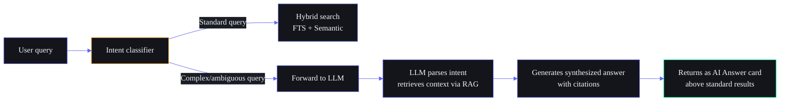

**AI Answer card format:**
```mermaid
%%{init: {'theme': 'base', 'themeVariables': {'background': '#0A0B0F', 'primaryColor': '#13151A', 'primaryBorderColor': '#6366F1', 'primaryTextColor': '#F1F5F9', 'lineColor': '#6366F1', 'secondaryColor': '#1A1D24', 'tertiaryColor': '#0A0B0F', 'fontFamily': 'DM Sans'}}}%%
graph TD
    AI[🤖 AI Answer<br/>Based on your knowledge base, here's what I found:] --> R1["1. Design system audit — Tasks (due Jun 15)"]
    AI --> R2["2. Component library — Project (active)"]
    AI --> R3["3. Figma design tokens — Resource (saved yesterday)"]
    AI --> R4["4. Design system presentation — Idea (in brainstorming)"]
    AI --> FA[View all 4 results · Ask follow-up]
    style AI fill:#13151A,stroke:#6366F1,color:#F1F5F9
    style FA fill:#1A1D24,stroke:#6366F1,color:#818CF8
```

### 7.5 Command Search

| Prefix | Scope | Example |
|---|---|---|
| `/` | All commands | `/new task` |
| `/new` | Create commands | `/new course`, `/new project` |
| `/go` | Navigation commands | `/go tasks`, `/go dashboard` |
| `/ai` | AI commands | `/ai brief`, `/ai review` |
| `/system` | System commands | `/system refresh`, `/system export` |

### 7.6 Knowledge Search

A scoped search within the Knowledge domain (Resources + Ideas + YouTube):

| Feature | Behavior |
|---|---|
| Trigger | `Cmd+Shift+K` or navigate to Knowledge search |
| Scope | Resources + Ideas + YouTube transcripts |
| Filters | Content type (article, video, code, note), Source, Date saved, Tags |
| Sort | Relevance, Date, Title, Content type |
| AI enhancement | "Summarize this topic" button in results |

### 7.7 Project Search

A scoped search within Projects + their linked tasks:

| Feature | Behavior |
|---|---|
| Trigger | `Cmd+Shift+P` or navigate to Project search |
| Scope | Projects + Tasks (linked to projects) + Project resources |
| Filters | Status, Phase, Priority, Blocker (yes/no) |
| Sort | Deadline, Priority, Project name |
| AI enhancement | "Project health summary" button |

### 7.8 Opportunity Search

A scoped search within Opportunities:

| Feature | Behavior |
|---|---|
| Trigger | `Cmd+Shift+O` or navigate to Opportunity search |
| Scope | Opportunities + matched skills + application status |
| Filters | Match score range, Type (job, hackathon, scholarship), Deadline range, Status |
| Sort | Match score, Deadline, Salary (if applicable) |

### 7.9 Search Results Architecture

#### Result Grouping

Results are grouped by module, with each group showing top 3 matches (+ "View all N results"):

```
Priority order:
1. AI Answer (if applicable) — rendered as rich card
2. Exact title match (any module) — highlighted
3. Tasks (by recency + relevance)
4. Courses (by recency + relevance)
5. Resources (by recency + relevance)
6. Knowledge/Ideas (by recency + relevance)
7. Goals/Projects (by recency + relevance)
8. Opportunities (by recency + relevance)
9. Commands (by relevance)
```

#### Result Card Format

```mermaid
%%{init: {'theme': 'base', 'themeVariables': {'background': '#0A0B0F', 'primaryColor': '#13151A', 'primaryBorderColor': '#6366F1', 'primaryTextColor': '#F1F5F9', 'lineColor': '#6366F1', 'secondaryColor': '#1A1D24', 'tertiaryColor': '#0A0B0F', 'fontFamily': 'DM Sans'}}}%%
graph LR
    subgraph ResultCard[Search Result Card]
        Icon[Module Icon] --- Title[Title]
        Title --- Snippet[Snippet with highlighted match...]
        Snippet --- Meta[Tags · Status · Date · Priority]
        Meta --- Actions[Open · Edit · Copy link · Share]
    end
    style ResultCard fill:#13151A,stroke:#6366F1,color:#F1F5F9
```

### 7.10 Search Ranking Strategy

#### Ranking Formula

```
Final Score = (FTS_Score × 0.4) + (Semantic_Score × 0.3) + (Recency_Boost × 0.15) + (Personalization_Boost × 0.15)
```

#### Ranking Factors

| Factor | Weight | Description |
|---|---|---|
| Full-text (BM25) | 0.40 | PostgreSQL tsvector ranking |
| Semantic (cosine) | 0.30 | Embedding similarity via pgvector |
| Recency | 0.15 | `1 / (1 + days_since_update)` boost |
| Personalization | 0.15 | User's module visit frequency + interaction history |

#### Result Deduplication

When the same entity appears in both FTS and semantic results, it's deduplicated via `entity_id + domain` key. The higher of the two scores is kept.

---

## 8. Command Center Architecture

### 8.1 Overview

The Command Center is the universal action interface, accessible via `Cmd+K` from anywhere. It serves as the **primary action layer** for the entire system, handling search, navigation, creation, AI interactions, and system commands.

### 8.2 Command Categories

| Category | Prefix | Examples | Count |
|---|---|---|---|
| Quick Commands | `/` | Create, capture, toggle, mark done | 20+ |
| AI Commands | `/ai` | Brief, review, summarize, explain | 10+ |
| System Commands | `/system` | Export, refresh, sync, backup | 8+ |
| Navigation Commands | `/go` or `R+letter` | Go to module, open item | 20+ |
| Capture Commands | `/new` or `/capture` | New task, course, idea, resource | 15+ |
| Search Commands | `/search` or native | Search scoped, search operators | 7 scopes |

### 8.3 Quick Commands

Commands that perform immediate actions without navigating away:

| Command | Action | Context |
|---|---|---|
| `/done` | Mark current item complete | Item detail view |
| `/snooze` | Snooze item to tomorrow | Task detail |
| `/prioritize` | Set priority level | Task/goal detail |
| `/schedule` | Set due date/reminder | Any item |
| `/move` | Move item to different module | Any item |
| `/share` | Copy share link | Any item |
| `/duplicate` | Duplicate current item | Any item |
| `/archive` | Archive current item | Any item |
| `/tag` | Add/remove tags | Any item |
| `/link` | Link current item to another | Any item |
| `/note` | Add note to current item | Any item |
| `/timer` | Start/stop timer | Time module |
| `/focus` | Enter focus mode | Any module |
| `/pin` | Pin item to sidebar | Any item |

### 8.4 AI Commands

Commands that invoke AI agents:

| Command | Agent | Action |
|---|---|---|
| `/ai brief` | Daily Briefing (A09) | Generate today's briefing |
| `/ai review` | Weekly Review (A10) | Generate weekly review |
| `/ai radar` | Opportunity Radar (A06) | Scan for new opportunities |
| `/ai summarize` | Learning Agent (A03) | Summarize current item |
| `/ai explain` | Learning Agent (A03) | Explain concept (from course/knowledge) |
| `/ai suggest` | Planner Agent (A01) | Suggest next tasks |
| `/ai analyze` | Analytics Agent (A07) | Analyze current module data |
| `/ai roadmap` | Roadmap Agent (A08) | Suggest roadmap adjustments |
| `/ai memory` | Memory Agent (A02) | Show what AI knows about this topic |
| `/ai nudge` | Nudge Agent (A14) | Get a motivational nudge |
| `/ai sleep` | Sleep Agent (A13) | Get wind-down advice |
| `/ai career` | Career Agent (A05) | Career path suggestions |

### 8.5 System Commands

Commands that manage the system itself:

| Command | Action | Confirmation |
|---|---|---|
| `/system sync` | Force sync with server | No |
| `/system export` | Export data (JSON/CSV) | Yes (format picker) |
| `/system backup` | Trigger backup | No |
| `/system refresh` | Refresh all caches | No |
| `/system health` | Show system status | No (opens health modal) |
| `/system log` | Show recent errors | No (opens log viewer) |
| `/system shortcuts` | Show keyboard shortcuts | No (opens shortcut reference) |
| `/system onboard` | Restart onboarding | Yes |
| `/system reset` | Reset module data | Yes (dangerous) |

### 8.6 Navigation Commands

Commands to move around the system:

| Command | Action |
|---|---|
| `/go dashboard` | Navigate to Dashboard |
| `/go tasks` | Navigate to Tasks |
| `/go courses` | Navigate to Courses |
| `/go <module>` | Navigate to any module |
| `/open <item title>` | Search and open item |
| `/recent` | Show recently viewed items |
| `/favorites` | Show pinned/favorited items |
| `R+<letter>` | Two-key routing (see 5.7) |
| `Cmd+[1-5]` | Bottom nav items (mobile) |

### 8.7 Capture Commands

Commands to create new content:

| Command | Module | Fields Pre-filled |
|---|---|---|
| `/new task` | Tasks | Title, priority (medium) |
| `/new course` | Courses | Title, platform |
| `/new goal` | Goals | Title, target date |
| `/new project` | Projects | Title, status (active) |
| `/new idea` | Ideas | Title, stage (raw) |
| `/new resource` | Resources | Title, URL (from clipboard) |
| `/new habit` | Habits | Title, frequency (daily) |
| `/new opportunity` | Opportunities | Title, source |
| `/capture` | Auto-detect | Free text → AI classifies |
| `/capture link` | Resources | URL → auto-fetches metadata |
| `/capture note` | Knowledge | Quick note |
| `/capture task` | Tasks | Quick task (title only) |

---

## 9. Notification Architecture

### 9.1 Notification Categories

| Category | ID | Modules | Examples | Volume/Day |
|---|---|---|---|---|
| Task Reminders | `task` | Tasks | Due soon, overdue, dependency blocked | 3-8 |
| Learning Nudges | `learning` | Courses, YouTube | Study reminder, course progress, gap detected | 1-3 |
| Opportunity Alerts | `opportunity` | Opportunities | New match, deadline approaching | 0-2 |
| Goal Milestones | `goal` | Goals, Roadmap | Progress milestone, at-risk goal, completed | 0-2 |
| Habit Reminders | `habit` | Habits | Missed habit, streak at risk | 1-3 |
| System Alerts | `system` | Automation, Sync | Sync failed, automation error, export ready | 0-1 |
| AI Digests | `ai` | AI Chat, Briefing, Review | Briefing ready, review ready, AI suggestion | 1-3 |
| Social/Share | `social` | (future) | Shared item, comment, collaboration invite | 0-2 |

### 9.2 Priority Levels

| Level | Label | Color | Delivery | Interrupt | Example |
|---|---|---|---|---|---|
| P0 | Critical | Red | Immediate (push + in-app) | Yes (sound + banner) | Task overdue >3 days, sync failure |
| P1 | High | Orange | Immediate (push + in-app) | Yes (banner) | Task due today, opportunity 90%+ match |
| P2 | Medium | Yellow | Digest or in-app | No (badge only) | Course reminder, goal progress |
| P3 | Low | Gray | Digest only | No | Weekly review ready, analytics tip |
| P4 | Silent | Transparent | Never notify | No | Logged in notification history only |

### 9.3 Escalation Logic

Notifications escalate through priority levels over time if unacknowledged:

```
Task overdue notification flow:
  Day 0 (due date) → P2 (Medium): In-app badge
  Day 1 (1 day overdue) → P1 (High): In-app + push
  Day 3 (3 days overdue) → P0 (Critical): Push + sound + dashboard banner
  Day 7 (1 week overdue) → P0 + escalated: Email notification + AI prompt in chat

Opportunity deadline approaching:
  7 days before → P2 (Medium): In-app suggestion
  3 days before → P1 (High): Push notification
  1 day before → P0 (Critical): Push + sound + dashboard alert
  Day of → P0 + escalation: Email + AI chat reminder
```

#### Escalation Matrix

| Notification Type | Initial P | Escalation Schedule | Max P | Max Channel |
|---|---|---|---|---|
| Task overdue | P2 | D+1 → P1, D+3 → P0 | P0 | Push + Email |
| Task due today | P1 | — | P1 | Push |
| Learning gap | P3 | 3 days → P2, 7 days → P1 | P1 | Push |
| Opportunity match 90%+ | P1 | 3 days → P0 | P0 | Push + Email |
| Opportunity match 70-90% | P2 | 7 days → P1 | P1 | Push |
| Goal at risk | P1 | 7 days → P0 | P0 | Push + Email |
| Goal milestone | P3 | — | P3 | In-app only |
| Habit missed 1 day | P3 | 3 days → P2, 7 days → P1 | P1 | Push |
| System error | P0 | Immediate | P0 | Push + Email + Dashboard banner |
| Briefing ready | P2 | — | P2 | Push (morning only) |
| Review ready | P3 | — | P3 | In-app (push if enabled) |

### 9.4 AI Notifications

AI-generated notifications have special handling:

| Notification Type | Trigger | Content | Priority |
|---|---|---|---|
| Daily Briefing Ready | 7 AM cron | "Your briefing is ready — 4 tasks, 2 goals, 1 opportunity" | P2 |
| Weekly Review Ready | Sun 8 PM | "Your weekly review is ready — productivity +15%" | P3 |
| AI Suggestion | Contextual | "I noticed you've been studying DSA — want to review graphs?" | P2 |
| Nudge | 6 PM | "You haven't studied today. 30 min would maintain your streak!" | P2 |
| Sleep Reminder | 9:30 PM | "Wind-down time. You studied 2h today. Good work." | P2 |
| Opportunity Match | Daily scan | "New: Senior Dev @ Google — 92% match based on your profile" | P1 |

### 9.5 System Notifications

| Notification | Trigger | Priority | Action on Click |
|---|---|---|---|
| Sync complete | Background sync finished | P4 | None |
| Sync failed | Synced data rejected | P1 | Open sync log |
| Export ready | Data export completed | P3 | Download file |
| Backup complete | Scheduled backup done | P4 | None |
| Automation error | Automation failed | P1 | Open automation log |
| Storage warning | Storage >80% | P2 | Open storage settings |
| Update available | New version | P3 | Open changelog |
| Integration disconnected | OAuth token expired | P1 | Open integration settings |

### 9.6 Opportunity Notifications

| Notification | Match % | Priority | Action |
|---|---|---|---|
| New high match | ≥90% | P1 | Open opportunity detail |
| New good match | 70-89% | P2 | Show in opportunities list |
| Deadline approaching | ≤3 days | P1 | Open application page |
| Application update | Status change | P2 | Open application tracker |
| New source found | New source detected | P3 | Configure source |

### 9.7 Learning Notifications

| Notification | Trigger | Priority | Action |
|---|---|---|---|
| Study reminder | No study in 24h | P2 | Open course |
| Course deadline | ≤7 days | P1 | Open course progress |
| Knowledge gap detected | AI analysis | P2 | Open gap details |
| Streak at risk | Missed 1 day | P3 | Open habit log |
| Streak milestone | 7/30/100 day streak | P3 | Celebrate modal |
| Course completion | Progress = 100% | P2 | Share/certificate modal |
| New recommendation | AI suggests new course | P3 | Open recommendation |

---

## 10. Knowledge Architecture

### 10.1 Resource Structure

The Knowledge domain encompasses multiple content types organized in a unified hierarchy:

```mermaid
%%{init: {'theme': 'base', 'themeVariables': {'background': '#0A0B0F', 'primaryColor': '#13151A', 'primaryBorderColor': '#6366F1', 'primaryTextColor': '#F1F5F9', 'lineColor': '#6366F1', 'secondaryColor': '#1A1D24', 'tertiaryColor': '#0A0B0F', 'fontFamily': 'DM Sans'}}}%%
graph TD
    KB[KNOWLEDGE BASE] --> RES[Resources<br/>curated external content]
    KB --> IDE[Ideas<br/>internal generated content]
    KB --> YT[YouTube Vault<br/>video content]
    KB --> NT[Notes<br/>free-form knowledge]
    
    RES --> RA[Articles]
    RES --> RD[Documentation]
    RES --> RC[Code snippets]
    RES --> RDF[Design files]
    RES --> RT[Tools/Software]
    RES --> RCL[Collections<br/>user-curated groups]
    
    IDE --> IR[Raw<br/>unprocessed thoughts]
    IDE --> IV[Validating<br/>researching feasibility]
    IDE --> IB[Building<br/>in progress]
    IDE --> IBL[Built<br/>completed/shipped]
    
    YT --> YV[Videos<br/>with AI transcripts]
    YT --> YPL[Playlists<br/>user-curated]
    YT --> YS[Series<br/>AI-detected related videos]
    YT --> YC[Clips<br/>AI-extracted key moments]
    
    NT --> NQ[Quick notes<br/>captured inline]
    NT --> NAS[AI summaries<br/>auto-generated]
    NT --> NR[Rich documents<br/>full markdown]

    style KB fill:#0A0B0F,stroke:#00FFA3,color:#F1F5F9,stroke-width:2px
```

#### Content Type Taxonomy

| Content Type | Icon | Fields | View Type | Relationships |
|---|---|---|---|---|
| Article | 📄 | Title, URL, summary, read status | Card/Detail | Links to courses, projects |
| Documentation | 📘 | Title, URL, version, section | Card/Detail | Links to tasks, projects |
| Code Snippet | 💻 | Title, code, language, source | Code/Detail | Links to projects, tasks |
| Design File | 🎨 | Title, URL, tool, format | Preview/Detail | Links to projects |
| Tool/Software | 🔧 | Title, URL, purpose, alternative | Card/Detail | Links to courses, projects |
| Collection | 📁 | Title, description, items | Grid/Detail | Groups related resources |
| Raw Idea | 💡 | Title, description, tags | Card/Detail | Can become project, task |
| Validating Idea | 🔍 | Title, research notes, feasibility | Card/Detail | Moves to project |
| YouTube Video | 🎬 | Title, channel, duration, transcript | Card/Detail | Links to courses |
| Playlist | ▶️ | Title, video count, source | Grid/Detail | Groups videos |
| Quick Note | 📝 | Content, tags | Note/Detail | Links to any entity |
| Rich Document | 📖 | Title, markdown body, links | Document/Detail | Links to any entity |

### 10.2 Knowledge Structure

#### Navigation Hierarchy

```mermaid
%%{init: {'theme': 'base', 'themeVariables': {'background': '#0A0B0F', 'primaryColor': '#13151A', 'primaryBorderColor': '#6366F1', 'primaryTextColor': '#F1F5F9', 'lineColor': '#6366F1', 'secondaryColor': '#1A1D24', 'tertiaryColor': '#0A0B0F', 'fontFamily': 'DM Sans'}}}%%
graph TD
    KM[Knowledge Module] --> T1[Tab 1: Resources<br/>Grid/List view]
    KM --> T2[Tab 2: Ideas<br/>Pipeline view]
    KM --> T3[Tab 3: YouTube<br/>Grid view]
    KM --> T4[Tab 4: Notes<br/>List view]
    
    T1 --> T1C[Collections<br/>grouped view]
    T1 --> T1D[Detail view<br/>resource + metadata + related]
    
    T2 --> T2P[Raw → Validating →<br/>Building → Built]
    T2 --> T2D[Detail view<br/>idea + feasibility + related]
    
    T3 --> T3P[Playlists<br/>grouped view]
    T3 --> T3S[Series<br/>AI-detected groups]
    T3 --> T3D[Detail view<br/>video + transcript + chapters]
    
    T4 --> T4D[Detail view<br/>full note with links]

    style KM fill:#0A0B0F,stroke:#00FFA3,color:#F1F5F9,stroke-width:2px
```

#### Knowledge Discovery Paths

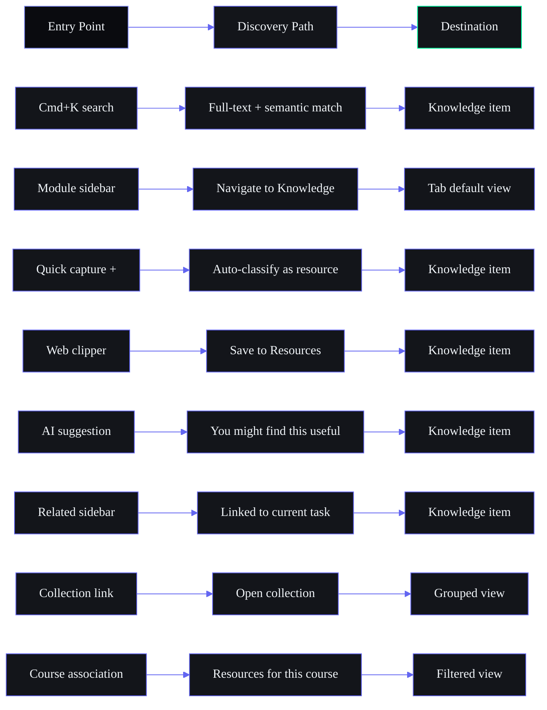

### 10.3 Taxonomy

#### Universal Tag Taxonomy

The system uses a **6-axis tag taxonomy** applied consistently across all modules:

| Axis | Tags | Example | Used For |
|---|---|---|---|
| **Topic** | DSA, WebDev, AI/ML, DevOps, Security, DBMS, OS, Networks, Design, Business | `topic:webdev` | Categorization |
| **Skill** | React, Python, Go, Docker, SQL, TypeScript, AWS, Figma, Rust | `skill:react` | Skill mapping |
| **Status** | Active, Archived, Draft, Completed, Stalled, Backlog | `status:active` | Lifecycle |
| **Priority** | Urgent, High, Medium, Low | `priority:high` | Urgency |
| **Effort** | Quick (<30m), Medium (2h), Large (1d), Epic (>1d) | `effort:quick` | Time estimation |
| **Stage** | Learning, Building, Earning, Planning | `stage:learning` | Purpose |
| **Source** | College, Online, Self-taught, Work, Freelance, AI-generated | `source:online` | Origin |

#### Tag Constraints

| Rule | Enforcement |
|---|---|
| Tags are global (shared across all modules) | Single `tags` table, referenced by entity_id + domain |
| Tags are lowercase, hyphenated | Auto-normalized on creation |
| Max 10 tags per item | UI limits tag input |
| Tag suggestions from existing tags | Autocomplete on tag input |
| AI auto-tagging on item creation | Learning Agent (A03) suggests 3-5 tags |
| Tag colors from user-defined palette | `tags.color` column |

### 10.4 Tagging Strategy

#### Auto-Tagging AI

When a new item is created in any module, the Learning Agent (A03) automatically suggests tags:

```typescript
interface AutoTagResult {
  suggestedTags: Array<{ tag: string; confidence: number; axis: string }>
  // e.g., [{ tag: "webdev", confidence: 0.92, axis: "topic" },
  //        { tag: "react", confidence: 0.87, axis: "skill" }]
}
```

Tags with confidence >0.8 are auto-applied. Tags with confidence 0.5-0.8 are shown as suggestions the user can approve/reject.

#### Tag-Based Cross-Module Discovery

Tags are the **primary cross-module linking mechanism**:
- Clicking a tag on a task shows all items (courses, resources, goals, projects) with that tag
- Tag pages are auto-generated: `/tag/webdev` shows all tagged content across all modules
- Tag combinations enable powerful filtering: `topic:webdev + skill:react + priority:high`

### 10.5 Classification Strategy

#### Content Type Classification

Every knowledge item is classified on 3 axes:

| Axis | Values | Determines | Set By |
|---|---|---|---|
| Content Type | Article, Doc, Code, Design, Tool, Video, Note, Idea | Icon, view layout, metadata fields | AI auto-detect + user override |
| Source | Manual, Web clipper, Import, AI-generated, Email | Origin badge, sync behavior | System (detected) |
| Confidence | High, Medium, Low | AI feature availability | AI (auto-tagged confidence) |

#### Automatic Classification Pipeline

```mermaid
%%{init: {'theme': 'base', 'themeVariables': {'background': '#0A0B0F', 'primaryColor': '#13151A', 'primaryBorderColor': '#6366F1', 'primaryTextColor': '#F1F5F9', 'lineColor': '#6366F1', 'secondaryColor': '#1A1D24', 'tertiaryColor': '#0A0B0F', 'fontFamily': 'DM Sans'}}}%%
flowchart TD
    NC[New content enters system] --> URL[URL detected]
    NC --> TC[Text captured]
    NC --> FU[File uploaded]
    
    URL --> FM[Fetch metadata<br/>Open Graph, JSON-LD]
    FM --> DCT[Detect content type<br/>article, video, doc, tool]
    FM --> EX[Extract title, description, author, image]
    FM --> AT[Auto-tag based on<br/>content analysis]
    
    TC --> AI[AI intent detection]
    AI --> T["I should... → task"]
    AI --> Id["What if... → idea"]
    AI --> R["Good to know... → resource"]
    
    FU --> DT[Detect type from<br/>extension + MIME]
    DT --> PDF[PDF → Document]
    DT --> CD[.py, .js → Code]
    DT --> DS[.fig, .sketch → Design]

    style NC fill:#0A0B0F,stroke:#00FFA3,color:#F1F5F9,stroke-width:2px
    style URL fill:#13151A,stroke:#6366F1,color:#F1F5F9
    style TC fill:#13151A,stroke:#6366F1,color:#F1F5F9
    style FU fill:#13151A,stroke:#6366F1,color:#F1F5F9
```

### 10.6 Relationships

#### Relationship Types

| Relationship | Source | Target | UI Treatment |
|---|---|---|---|
| `references` | Knowledge item | Knowledge item | Bidirectional link in related sidebar |
| `used_in` | Resource | Task, Course, Project | "Referenced by" count badge |
| `inspired` | Idea | Project | "Originated from" link |
| `source_for` | YouTube, Article | Course | "Course material" badge |
| `prerequisite` | Course | Course | "Required before" link |
| `related` | Any | Any | AI-detected in "You might also like" |

#### Relationship Visualization

Knowledge items display their relationships in a **mini graph** on the detail page:

```
[Current Item] ─── references ───► [Linked Item 1]
    │                                    │
    ├── used_in ─────► [Task A]          ├── references ──► [Linked Item 3]
    │                  [Task B]          │
    ├── inspired ────► [Project X]       └── related ────► [Linked Item 4]
    │
    └── source_for ──► [Course Y]
```

Users can click any node to navigate, or open the full knowledge graph visualization.

### 10.7 Knowledge Discovery

#### Discovery Methods

| Method | Trigger | Behavior |
|---|---|---|
| Search | `Cmd+K` | Full-text + semantic across all knowledge |
| Browse | Module navigation | Grid/list view with filters |
| Tag drill-down | Click tag | All items with that tag (cross-module) |
| Collection browse | Navigate to collection | Curated group of items |
| AI recommendations | Dashboard widget | "Based on your learning, you might like" |
| Relationship graph | Detail view graph | Explore linked items |
| Related sidebar | Any detail view | Items linked to current item |
| Recent activity feed | Dashboard Z8 | Recently added/modified items |
| Weekly review | Sunday digest | Knowledge items created this week |

#### Knowledge Home (Tab Default View)

The Knowledge module's default view is a **smart grid** showing:

```mermaid
%%{init: {'theme': 'base', 'themeVariables': {'background': '#0A0B0F', 'primaryColor': '#13151A', 'primaryBorderColor': '#6366F1', 'primaryTextColor': '#F1F5F9', 'lineColor': '#6366F1', 'secondaryColor': '#1A1D24', 'tertiaryColor': '#0A0B0F', 'fontFamily': 'DM Sans'}}}%%
graph TD
    KB[Knowledge Base · +New · Filter · Sort] --> Tabs[📄 Resources 42 · 📚 Courses linked 12 · 💡 Ideas 8 · 🎬 YouTube 15 · 📝 Notes 23]
    Tabs --> Recent[RECENTLY ADDED]
    Recent --> I1[Item 1]
    Recent --> I2[Item 2]
    Recent --> I3[Item 3]
    Recent --> I4[Item 4]
    Recent --> I5[Item 5]
    Recent --> Coll[COLLECTIONS]
    Coll --> DR[Design Resources<br/>12 items]
    Coll --> DS[DSA Study Guide<br/>8 items]
    style KB fill:#0A0B0F,stroke:#00FFA3,color:#F1F5F9
    style Coll fill:#13151A,stroke:#6366F1,color:#F1F5F9
```

### 10.8 Knowledge Retrieval

#### Retrieval Patterns

| Pattern | Use Case | Implementation |
|---|---|---|
| Exact title match | User knows what they're looking for | Full-text search, boosted title field |
| Semantic similarity | "Find stuff like this" | Embedding similarity on current item |
| Tag-based recall | "All webdev resources" | Tag filter search |
| Date-range recall | "What I saved last week" | Date filter on search |
| Relationship recall | "Show everything linked to this project" | Graph traversal query |
| AI synthesis | "Summarize what I know about React" | LLM + RAG over knowledge items |

---

## 11. Learning Architecture

### 11.1 Course Structure

#### Course Data Model

```mermaid
%%{init: {'theme': 'base', 'themeVariables': {'background': '#0A0B0F', 'primaryColor': '#13151A', 'primaryBorderColor': '#6366F1', 'primaryTextColor': '#F1F5F9', 'lineColor': '#6366F1', 'secondaryColor': '#1A1D24', 'tertiaryColor': '#0A0B0F', 'fontFamily': 'DM Sans'}}}%%
graph TD
    COURSE[COURSE] --> MD[Metadata<br/>title, platform, URL, credits, deadline]
    COURSE --> TP[Topics hierarchical]
    TP --> T1[Topic 1: Arrays]
    TP --> T2[Topic 2: Trees]
    TP --> T3[Topic 3: Graphs]
    T1 --> ST11[Subtopic: Two pointers]
    T1 --> ST12[Subtopic: Sliding window]
    COURSE --> PT[Progress Tracking<br/>Total: N · Completed: M · M/N%<br/>Time: X hrs · Last studied]
    COURSE --> LR[Linked Resources<br/>Course materials · External links<br/>Practice problems → Tasks]
    COURSE --> LA[Learning Analytics<br/>Study sessions · Quiz scores<br/>Concept mastery: 0-100%]
    style COURSE fill:#0A0B0F,stroke:#00FFA3,color:#F1F5F9,stroke-width:2px
```

#### Course Navigation

```mermaid
%%{init: {'theme': 'base', 'themeVariables': {'background': '#0A0B0F', 'primaryColor': '#13151A', 'primaryBorderColor': '#6366F1', 'primaryTextColor': '#F1F5F9', 'lineColor': '#6366F1', 'secondaryColor': '#1A1D24', 'tertiaryColor': '#0A0B0F', 'fontFamily': 'DM Sans'}}}%%
graph TD
    CM[Courses Module] --> T1[Tab 1: Grid<br/>Card grid · progress bars · deadlines]
    CM --> T2[Tab 2: Progress<br/>Detailed progress · streak counter<br/>weekly study time chart]
    CM --> T3[Tab 3: Calendar<br/>Upcoming deadlines · study sessions<br/>gap days highlighted]
    CM --> DV[Detail View<br/>Single course]
    DV --> H[Header: title, provider, progress, deadline]
    DV --> TL[Topics list<br/>with completion checkboxes]
    DV --> SSL[Study session log]
    DV --> LR2[Linked resources]
    DV --> RT[Related tasks]
    style CM fill:#0A0B0F,stroke:#00FFA3,color:#F1F5F9,stroke-width:2px
```

### 11.2 Learning Paths

#### Path Structure

A Learning Path is a **curated sequence of courses + resources + projects** that builds toward a skill or certification:

```mermaid
%%{init: {'theme': 'base', 'themeVariables': {'background': '#0A0B0F', 'primaryColor': '#13151A', 'primaryBorderColor': '#6366F1', 'primaryTextColor': '#F1F5F9', 'lineColor': '#6366F1', 'secondaryColor': '#1A1D24', 'tertiaryColor': '#0A0B0F', 'fontFamily': 'DM Sans'}}}%%
flowchart LR
    LP[LEARNING PATH<br/>Full-Stack Web Developer] --> P1[Phase 1: Foundations]
    LP --> P2[Phase 2: Frontend]
    LP --> P3[Phase 3: Backend]
    LP --> P4[Phase 4: Full Stack]
    
    P1 --> P1C[Course: HTML/CSS Fundamentals]
    P1 --> P1R[Resource: Web Design Guidelines]
    P1 --> P1P[Project: Build a landing page]
    
    P2 --> P2C1[Course: JavaScript Deep Dive]
    P2 --> P2C2[Course: React Masterclass]
    P2 --> P2P[Project: Build a dashboard UI]
    
    P3 --> P3C1[Course: Node.js API Design]
    P3 --> P3C2[Course: Database Design]
    P3 --> P3P[Project: Build a REST API]
    
    P4 --> P4C[Course: Deployment & DevOps]
    P4 --> P4P[Project: Full-stack application]

    style LP fill:#0A0B0F,stroke:#00FFA3,color:#F1F5F9,stroke-width:2px
    style P1 fill:#13151A,stroke:#6366F1,color:#F1F5F9
    style P2 fill:#13151A,stroke:#6366F1,color:#F1F5F9
    style P3 fill:#13151A,stroke:#6366F1,color:#F1F5F9
    style P4 fill:#13151A,stroke:#6366F1,color:#F1F5F9
```

#### Path Discovery

| Discovery Method | Trigger | Behavior |
|---|---|---|
| AI recommendation | `/ai suggest path` | Generates learning path from current skills |
| Skill-based | View skill → "Learning paths for this skill" | Shows paths containing this skill |
| Manual browse | Learning tab → Paths | Browse all available paths |
| Goal-linked | Career goal → "Suggested learning path" | Path auto-generated from goal |

### 11.3 Skills Mapping

#### Skill Model

```typescript
interface Skill {
  id: string
  name: string // e.g., "React", "Python", "Docker"
  category: SkillCategory // LANGUAGE, FRAMEWORK, TOOL, CONCEPT, SOFT_SKILL
  level: number // 0-100 (AI-estimated from activity)
  confidence: number // 0.0-1.0 (how sure AI is about the level)
  lastAssessed: Date
  sources: Array<{
    type: 'course' | 'project' | 'task' | 'resource'
    id: string
    contribution: number // how much this source contributed to skill level
  }>
  prerequisites: string[] // skill IDs required before this one
  relatedSkills: string[] // skill IDs that are related
}
```

#### Skill Visualization

Skills are displayed as a **radar chart** (strengths) and **tree map** (breadth):

```mermaid
%%{init: {'theme': 'base', 'themeVariables': {'background': '#0A0B0F', 'primaryColor': '#13151A', 'primaryBorderColor': '#6366F1', 'primaryTextColor': '#F1F5F9', 'lineColor': '#6366F1', 'secondaryColor': '#1A1D24', 'tertiaryColor': '#0A0B0F', 'fontFamily': 'DM Sans'}}}%%
graph TD
    SR[SKILL RADAR] --> PY[Python ████████ 72]
    SR --> RE[React ████████████████████ 88]
    SR --> DK[Docker ██████ 65]
    SR --> SQL[SQL ████ 40]
    SR --> AWS[AWS ██████ 50]
    SR --> SS["Your strongest skills: React (88), Python (72), Docker (65)"]
    SR --> AC[View skill details · AI learning plan]
    style SR fill:#13151A,stroke:#6366F1,color:#F1F5F9
    style PY fill:#13151A,stroke:#6366F1,color:#F1F5F9
    style RE fill:#13151A,stroke:#00FFA3,color:#F1F5F9
    style DK fill:#13151A,stroke:#6366F1,color:#F1F5F9
    style SQL fill:#13151A,stroke:#334155,color:#94A3B8
    style AWS fill:#13151A,stroke:#334155,color:#94A3B8
```

### 11.4 Learning Relationships

| Relationship | Source | Target | Direction |
|---|---|---|---|
| `prerequisite` | Course A | Course B | A → B (A must be done first) |
| `builds_upon` | Course/Topic | Project | Skills → apply in project |
| `reinforces` | Resource | Course | Supplementary material |
| `assesses` | Task (quiz/practice) | Course topic | Practice tests understanding |
| `prepares_for` | Course | Certification | Leads to credential |
| `alternative` | Course | Course | Similar content, different provider |

### 11.5 Learning Analytics

| Metric | Source | Display | Update |
|---|---|---|---|
| Study streak (days) | Study session log | Badge on course card | Daily |
| Weekly study hours | Time entries | Bar chart | Real-time |
| Topics completed | Course progress | Progress ring | On completion |
| Skill level trend | All learning activity | Line chart (30d) | Daily |
| Learning velocity | Study hours / week | Trend arrow | Weekly |
| Knowledge gap count | Gap analysis | Badge | Weekly |
| Course completion rate | Completed / enrolled | Percentage | On enrollment change |
| Next deadline | Course deadline | Countdown badge | On course load |

### 11.6 Learning Discovery

| Discovery Method | Trigger | Result |
|---|---|---|
| Dashboard Z4 | Dashboard | Today's course target |
| Dashboard Z6 | Dashboard | Study heatmap |
| `/ai nudge` | Command | Course progress reminder |
| Nudge notification | 6 PM cron | "You haven't studied today" |
| Skill gap alert | Weekly analysis | "You're weak in DBMS — here's a course" |
| Course recommendation | AI analysis | "Based on goals, try this course" |
| Path suggestion | `/ai suggest path` | Generated learning path |

---

## 12. Opportunity Architecture

### 12.1 Opportunity Categories

| Category | ID | Examples | Source | Match Criteria |
|---|---|---|---|---|
| Jobs | `job` | Full-time, part-time, contract | LinkedIn, company career pages, job boards | Skills, experience, location |
| Internships | `internship` | Summer internship, co-op | LinkedIn, college portals, company | Skills, year of study, location |
| Hackathons | `hackathon` | Online, in-person, themed | Devpost, MLH, company-hosted | Skills, interests |
| Scholarships | `scholarship` | Merit-based, need-based, diversity | Scholarship portals, college | GPA, field of study, demographics |
| Open Source | `opensource` | Contributing to projects | GitHub, Good First Issues | Skills, technologies |
| Freelance/Gigs | `freelance` | One-time projects, ongoing | Upwork, Fiverr, direct | Skills, portfolio |
| Networking | `networking` | Conferences, meetups, webinars | Eventbrite, Meetup, LinkedIn | Location, interests, industry |
| Certifications | `certification` | Professional certs, micro-creds | Coursera, Udemy, vendor sites | Learning path, career goal |

### 12.2 Matching Logic

#### Match Score Calculation

```mermaid
%%{init: {'theme': 'base', 'themeVariables': {'background': '#0A0B0F', 'primaryColor': '#13151A', 'primaryBorderColor': '#6366F1', 'primaryTextColor': '#F1F5F9', 'lineColor': '#6366F1', 'secondaryColor': '#1A1D24', 'tertiaryColor': '#0A0B0F', 'fontFamily': 'DM Sans'}}}%%
flowchart LR
    SM[Skill Match × 0.40] --> MS[Match Score]
    IM[Interest Match × 0.20] --> MS
    GA[Goal Alignment × 0.20] --> MS
    TM[Timing × 0.10] --> MS
    LC[Location × 0.10] --> MS
    style MS fill:#0A0B0F,stroke:#00FFA3,color:#F1F5F9,stroke-width:2px
    style SM fill:#13151A,stroke:#6366F1,color:#F1F5F9
    style IM fill:#13151A,stroke:#6366F1,color:#F1F5F9
    style GA fill:#13151A,stroke:#6366F1,color:#F1F5F9
    style TM fill:#13151A,stroke:#6366F1,color:#F1F5F9
    style LC fill:#13151A,stroke:#6366F1,color:#F1F5F9
```

| Factor | Description | Data Source |
|---|---|---|
| Skill Match | Overlap between opportunity requirements and user's skill profile | Skills from courses, projects, tasks |
| Interest Match | Alignment with topics the user engages with | Tags, recent activity, knowledge items |
| Goal Alignment | Relevance to active goals and roadmap | Goal domain, roadmap phases |
| Timing | Deadline feasibility vs. current workload | Task priority, course deadlines, project status |
| Location | Geographic match (if applicable) | User settings, opportunity location |

#### Score Thresholds

| Score | Label | Color | Notification | Action |
|---|---|---|---|---|
| ≥90% | Exceptional | Green | P1 — Immediate push | "Apply now" CTA |
| 70-89% | Strong | Blue | P2 — In-app notification | "View details" CTA |
| 50-69% | Moderate | Yellow | P3 — Digest only | "Review" CTA |
| <50% | Weak | Gray | No notification | "Improve match" suggestions |

### 12.3 Filtering Logic

#### Filterable Attributes

| Attribute | Type | Values | Default |
|---|---|---|---|
| Category | Multi-select | job, internship, hackathon, scholarship, opensource, freelance, networking, certification | All |
| Match Score | Range slider | 0-100% | 50%+ |
| Deadline | Date range | Anytime, This week, This month, Next quarter, Custom | This month |
| Status | Single-select | New, Applied, Interviewing, Offer, Rejected, Archived | New |
| Source | Multi-select | LinkedIn, GitHub, Devpost, Manual, etc. | All |
| Location | Free-text + radius | City, Remote, Any | Any |
| Skills | Multi-select tags | All user skills | All |

### 12.4 Recommendation Logic

#### Recommendation Sources

| Source | Frequency | Algorithm |
|---|---|---|
| Daily radar scan | 6 AM daily | Match scoring against all new opportunities |
| Skill improvement trigger | On course/project completion | "Now that you know X, try Y" |
| Goal activation | On new goal creation | "Based on your goal, here are relevant opportunities" |
| Weekly review | Sunday | "Career pipeline review" |
| Manual refresh | User action | Force rescan all sources |

#### Recommendation Presentation

```mermaid
%%{init: {'theme': 'base', 'themeVariables': {'background': '#0A0B0F', 'primaryColor': '#13151A', 'primaryBorderColor': '#6366F1', 'primaryTextColor': '#F1F5F9', 'lineColor': '#6366F1', 'secondaryColor': '#1A1D24', 'tertiaryColor': '#0A0B0F', 'fontFamily': 'DM Sans'}}}%%
graph TD
    OP[OPPORTUNITIES FOR YOU] --> EM[🔥 EXCEPTIONAL MATCHES 2]
    EM --> G1["💼 Senior Developer @ Google · Match 92%<br/>Remote · $150-200K · Due Jul 15<br/>Why: React 88 + Python 72 match"]
    EM --> H1["🏆 Hackathon: AI Buildathon · Match 88%<br/>Online · Jun 20-22 · Prize $10K<br/>Why: AI/ML is top interest"]
    OP --> SM[💪 STRONG MATCHES 5]
    SM --> FE["💼 Frontend Engineer @ Startup · Match 82%<br/>..."]
    OP --> NF["+ New opportunities found: 7 · View all →"]
    style OP fill:#0A0B0F,stroke:#00FFA3,color:#F1F5F9
    style EM fill:#13151A,stroke:#EF4444,color:#F1F5F9
    style SM fill:#13151A,stroke:#6366F1,color:#F1F5F9
```

### 12.5 Discovery Logic

| Discovery Method | Trigger | Behavior |
|---|---|---|
| Daily scan | 6 AM cron | Fetches from all configured sources, scores, stores |
| Manual scan | `/ai radar` or button | Force immediate scan |
| Source add | User adds new source | Scan new source immediately |
| Profile update | Skill/course/goal change | Rescan with updated profile |
| Weekly review | Sunday | Career pipeline analysis |
| Dashboard widget | On dashboard load | Top 3 opportunities by score |

---

## 13. Analytics Architecture

### 13.1 Analytics Categories

| Category | ID | Modules Measured | Purpose |
|---|---|---|---|
| Productivity | `productivity` | Tasks, Time, Projects | "How effective am I?" |
| Learning | `learning` | Courses, YouTube, Study sessions | "How much am I learning?" |
| Habits | `habits` | Habits, Streaks | "How consistent am I?" |
| Career | `career` | Opportunities, Income, Skills | "How is my career growing?" |
| Well-Being | `wellbeing` | Sleep, Habits | "How am I doing health-wise?" |
| System | `system` | AI usage, Automation, Sync | "How is my system running?" |

### 13.2 Reporting Structure

#### Report Types

| Report | Period | Content | Delivery |
|---|---|---|---|
| Daily Briefing | Daily | Today's tasks, focus areas, opportunities | Dashboard + notification (7 AM) |
| Weekly Review | Weekly | Productivity trends, learning progress, goal status, career pipeline | Notification + full report (Sun 8 PM) |
| Monthly Report | Monthly | Deep analysis, trends, comparisons, recommendations | Email + in-app notification |
| Quarterly Review | Quarterly | Goal progress, skill growth, roadmap alignment, career milestones | Email + in-app with printable PDF |

#### Report Navigation

```mermaid
%%{init: {'theme': 'base', 'themeVariables': {'background': '#0A0B0F', 'primaryColor': '#13151A', 'primaryBorderColor': '#6366F1', 'primaryTextColor': '#F1F5F9', 'lineColor': '#6366F1', 'secondaryColor': '#1A1D24', 'tertiaryColor': '#0A0B0F', 'fontFamily': 'DM Sans'}}}%%
graph TD
    AM[Analytics Module] --> T1[Tab 1: Overview<br/>Summary dashboard]
    AM --> T2[Tab 2: Reports<br/>Report archive]
    AM --> T3[Tab 3: Metrics<br/>All metrics explorer]
    AM --> T4[Tab 4: Trends<br/>Trend detection]
    
    T1 --> T1P[Productivity trend · 7d line chart]
    T1 --> T1L[Learning velocity · 7d bar chart]
    T1 --> T1H[Habit compliance · 7d percentage]
    T1 --> T1C[Career pipeline · funnel chart]
    
    T2 --> T2L[List of generated reports]
    T2 --> T2F[Filter by type]
    T2 --> T2D[Download PDF/CSV]
    
    T3 --> T3S[Search/browse metrics]
    T3 --> T3D[Custom date range]
    T3 --> T3E[Export raw data]
    
    T4 --> T4D[Automatically detected trends]
    T4 --> T4U[Up/down/flat indicators]
    T4 --> T4A[AI analysis of each trend]

    style AM fill:#0A0B0F,stroke:#00FFA3,color:#F1F5F9,stroke-width:2px
```

### 13.3 Metrics Structure

#### Metric Definitions

Every metric in the system follows this schema:

```typescript
interface Metric {
  id: string
  name: string                    // "tasks_completed_today"
  displayName: string             // "Tasks Completed"
  category: AnalyticsCategory     // "productivity"
  type: 'counter' | 'gauge' | 'ratio' | 'duration' | 'score'
  unit: string                    // "tasks", "hours", "%", "points"
  direction: 'up_is_good' | 'down_is_good' | 'neutral'
  target: number | null           // User-set or AI-suggested target
  period: 'daily' | 'weekly' | 'monthly' | 'quarterly' | 'all_time'
  source: string                  // Analytics event that feeds this metric
}
```

#### Metric Catalog (Core)

| Metric | Category | Type | Period | Direction |
|---|---|---|---|---|
| Tasks completed | Productivity | Counter | Daily | Up is good |
| Task completion rate | Productivity | Ratio | Weekly | Up is good |
| Overdue tasks | Productivity | Gauge | Daily | Down is good |
| Study hours | Learning | Duration | Daily | Up is good |
| Topics completed | Learning | Counter | Weekly | Up is good |
| Learning streak | Learning | Gauge | All time | Up is good |
| Knowledge gaps | Learning | Gauge | Weekly | Down is good |
| Habit compliance rate | Habits | Ratio | Weekly | Up is good |
| Longest habit streak | Habits | Gauge | All time | Up is good |
| Goals on track | Career | Gauge | Weekly | Up is good |
| Goals at risk | Career | Gauge | Weekly | Down is good |
| Opportunity matches found | Career | Counter | Weekly | Neutral |
| Application conversion | Career | Ratio | All time | Up is good |
| Income earned | Career | Counter | Monthly | Up is good |
| Sleep score | Well-Being | Score | Daily | Up is good |
| Sleep debt | Well-Being | Gauge | Daily | Down is good |
| AI requests/day | System | Counter | Daily | Neutral |
| AI fallback rate | System | Ratio | Daily | Down is good |
| AI avg latency | System | Duration | Daily | Down is good |

### 13.4 Insights Structure

#### Insight Types

| Insight | Source | Format | Trigger |
|---|---|---|---|
| Trend detection | Metric comparison over 4+ periods | "Your productivity is up 15% this week" | Weekly |
| Anomaly detection | Metric deviation >2 sigma | "You studied 3x more than usual yesterday" | Daily |
| Milestone | Metric crosses threshold | "You've completed 100 tasks!" | On milestone |
| Comparison | User vs. historical self | "You're 20% more productive than last month" | Weekly |
| Correlation | Two metrics moving together | "When you sleep more, you're more productive" | Monthly |
| Recommendation | AI-generated from metric analysis | "Try studying in the morning — your focus score is higher" | Weekly |

#### Insight Presentation

Insights appear in context across the system:
- **Dashboard Z1 greeting:** "You completed 5 tasks yesterday — 25% above your average"
- **Weekly Review:** Full analysis with all insight types
- **AI Chat:** "Did you know your productivity peaks on Tuesdays?"
- **Module detail:** "Your React skill has grown from 60 to 88 this quarter"

---

## 14. Settings Architecture

### 14.1 Settings Structure

Settings are organized into **6 sections** accessible from a single settings page with a left-nav sidebar:

```mermaid
%%{init: {'theme': 'base', 'themeVariables': {'background': '#0A0B0F', 'primaryColor': '#13151A', 'primaryBorderColor': '#6366F1', 'primaryTextColor': '#F1F5F9', 'lineColor': '#6366F1', 'secondaryColor': '#1A1D24', 'tertiaryColor': '#0A0B0F', 'fontFamily': 'DM Sans'}}}%%
graph TD
    SETTINGS[Settings] --> SP[User Profile]
    SETTINGS --> AI[AI & Personalization]
    SETTINGS --> NT[Notifications]
    SETTINGS --> PD[Privacy & Data]
    SETTINGS --> AP[Appearance]
    SETTINGS --> SYS[System]
    style SETTINGS fill:#0A0B0F,stroke:#00FFA3,color:#F1F5F9,stroke-width:2px
```

### 14.2 User Settings

| Setting | Type | Default | Description |
|---|---|---|---|
| Display name | Text | — | User's display name |
| Email | Text | — | Account email |
| Avatar | Image upload | Initials | Profile picture |
| Timezone | Select | Auto-detected | Timezone for all dates/times |
| Date format | Select | `MM/DD/YYYY` or `DD/MM/YYYY` | Date display preference |
| Week start | Select | Monday | First day of week |
| Theme | Select | Dark (from design system) | Dark/Light/System |
| Language | Select | English | UI language |

### 14.3 AI Settings

| Setting | Type | Default | Description |
|---|---|---|---|
| AI model | Select | Ollama (local) | Primary AI backend |
| Fallback model | Select | Claude | Secondary AI when primary fails |
| Allow cloud AI | Toggle | Off | Enable Claude API calls |
| AI temperature | Slider | 0.5 | Creativity level (0-1) |
| Daily briefing time | Time | 7:00 AM | When to generate/send briefing |
| Weekly review day | Select | Sunday | Day of week for review |
| Weekly review time | Time | 8:00 PM | When to generate review |
| Memory learning | Toggle | On | Allow AI to learn from activity |
| Agent auto-suggestions | Toggle | On | Proactive AI suggestions |
| Radar auto-scan | Toggle | On | Daily opportunity scanning |
| Nudge agent | Toggle | On | Learning/course nudges |
| Sleep agent | Toggle | On | Bedtime wind-down messages |

### 14.4 Notification Settings

| Setting | Type | Default | Description |
|---|---|---|---|
| Push notifications | Toggle | On | Enable browser push |
| Email notifications | Toggle | Off | Enable email notifications |
| Quiet hours start | Time | 22:00 | Don't notify after this time |
| Quiet hours end | Time | 08:00 | Resume notifying after this time |
| Per-category toggles | Toggle group | — | Enable/disable specific categories (see 9.1) |
| Per-channel toggles | Toggle group | — | In-app, push, email per category |
| Digest frequency | Select | Daily | How often to send email digest |

### 14.5 Privacy Settings

| Setting | Type | Default | Description |
|---|---|---|---|
| Data export | Button | — | Export all user data (JSON/CSV) |
| Data deletion | Button (danger) | — | Delete all user data |
| AI data usage | Toggle | On | Allow AI to use data for learning |
| Analytics tracking | Toggle | On | Allow behavior analytics |
| Share anonymized data | Toggle | Off | Share aggregate usage data |
| Memory visibility | Select | Private | Who can see AI memory (future: team) |

### 14.6 Appearance Settings

| Setting | Type | Default | Description |
|---|---|---|---|
| Theme | Select | Dark | Dark, Light, System |
| Sidebar default | Toggle | Expanded | Sidebar initial state |
| Sidebar width | Range | 240px | Expanded sidebar width |
| Font size | Select | Medium | Small, Medium, Large |
| Reduced motion | Toggle | Off | Respect prefers-reduced-motion |
| Compact mode | Toggle | Off | Denser UI layout |

### 14.7 System Settings

| Setting | Type | Default | Description |
|---|---|---|---|
| Data sync | Toggle | On | Background sync |
| Auto-backup | Toggle | On | Scheduled data backup |
| Storage used | Display | — | Current storage usage |
| Cache size | Display | — | Current cache usage |
| Clear cache | Button | — | Clear local cache |
| Last sync | Display | — | Last successful sync |
| Sync now | Button | — | Force immediate sync |
| Keyboard shortcuts | Button | — | View/edit shortcut reference |
| Export data | Button | — | Download all data |
| Import data | Button | — | Upload data from export |

---

## 15. AI Architecture

### 15.1 AI Entry Points

AI is not a single destination — it's a **pervasive layer** accessible from every screen:

| Entry Point | Location | Trigger | Behavior |
|---|---|---|---|
| AI Chat (module) | Sidebar → Core | Navigate to `/chat` | Full conversational AI interface |
| Floating Quick Ask | All pages (bottom-right) | Click `💬` icon, `Cmd+Shift+M` | Mini chat overlay (context-aware) |
| Inline AI button | Detail views | Click `✨` icon | Context-specific AI action (summarize, explain, suggest) |
| Command Palette | Global | `Cmd+K` → `/ai` commands | Execute AI actions without navigation |
| Dashboard Greeting | Dashboard Z1 | Daily briefing card | AI-generated morning greeting |
| AI Suggestions | Contextual | Automatically appears | "I noticed you... want to..." |
| Search AI Answer | Search results | Complex query | AI-generated answer above search results |
| Notification | Push/in-app | AI-generated notification | Briefing, nudge, recommendation |

### 15.2 AI Workflows

#### Workflow Catalog

| Workflow | Trigger | Agent(s) | Data Accessed | Duration |
|---|---|---|---|---|
| Daily Briefing | 7 AM cron | A09 Briefing | Tasks, Goals, Learning, Analytics, Memory, Opportunities | ~10s |
| Weekly Review | Sun 8 PM cron | A10 Weekly | All modules (7d of data) | ~20s |
| Opportunity Scan | 6 AM cron + manual | A06 Radar | Skills, Courses, Profile, Opportunities | ~15s |
| Memory Consolidation | After each chat (bg) | A02 Memory | Chat history, current context | ~3s |
| Knowledge Gap Analysis | Weekly (after review) | A03 Learning | Courses, Knowledge, Skills | ~8s |
| Task Prioritization | On demand | A01 Planner | Tasks, Goals, Deadlines | ~5s |
| Course Nudge | 6 PM cron | A14 Nudge | Courses, Study logs, Streaks | ~2s |
| Sleep Wind-Down | 9:30 PM cron | A13 Sleep | Sleep logs, Today's activity | ~3s |
| AI Chat Response | User message | A00 ARIA | All context via ARIA orchestrator | ~5-15s |
| Natural Language Search | Cmd+K query | A00 ARIA | Search results + AI synthesis | ~3s |

#### Workflow State Machine

```mermaid
%%{init: {'theme': 'base', 'themeVariables': {'background': '#0A0B0F', 'primaryColor': '#13151A', 'primaryBorderColor': '#6366F1', 'primaryTextColor': '#F1F5F9', 'lineColor': '#6366F1', 'secondaryColor': '#1A1D24', 'tertiaryColor': '#0A0B0F', 'fontFamily': 'DM Sans'}}}%%
flowchart LR
    IDLE[IDLE] --> TRIGGERED[TRIGGERED]
    TRIGGERED --> CB[CONTEXT BUILDING]
    CB --> CB_R[read: tasks, goals, memory, analytics...]
    CB --> LLM_CALL[LLM CALL]
    LLM_CALL --> LLM_O[Ollama]
    LLM_CALL --> LLM_C[Claude]
    LLM_CALL --> LLM_A[Algorithmic fallback]
    LLM_CALL --> PP[POST-PROCESSING]
    PP --> COMPLETE[COMPLETE]
    style IDLE fill:#13151A,stroke:#334155,color:#94A3B8
    style TRIGGERED fill:#13151A,stroke:#F59E0B,color:#F1F5F9
    style CB fill:#13151A,stroke:#818CF8,color:#F1F5F9
    style LLM_CALL fill:#13151A,stroke:#6366F1,color:#F1F5F9
    style PP fill:#13151A,stroke:#6366F1,color:#F1F5F9
    style COMPLETE fill:#13151A,stroke:#00FFA3,color:#F1F5F9
```

### 15.3 AI Navigation

#### How AI Appears in Navigation

| Navigation Element | AI Presence |
|---|---|
| Sidebar | AI Chat module (Core group) |
| Top Navbar | AI trigger button (magic wand icon) |
| Dashboard | AI greeting (Z1), AI suggestions, AI trends |
| Detail views | AI action button (summarize, explain, suggest) |
| Command Palette | All `/ai` commands |
| Search | AI Answer cards |
| Context menus | "Ask AI about this" option |
| Notification center | AI-generated notifications |

#### AI Chat Module Navigation

```mermaid
%%{init: {'theme': 'base', 'themeVariables': {'background': '#0A0B0F', 'primaryColor': '#13151A', 'primaryBorderColor': '#6366F1', 'primaryTextColor': '#F1F5F9', 'lineColor': '#6366F1', 'secondaryColor': '#1A1D24', 'tertiaryColor': '#0A0B0F', 'fontFamily': 'DM Sans'}}}%%
graph TD
    AIC[AI Chat] --> CL[Conversation List<br/>Left sidebar · 280px]
    AIC --> AC[Active Chat<br/>Center · main area]
    AIC --> CP[Context Panel<br/>Right sidebar · 320px]
    
    CL --> TD[Today's conversations]
    CL --> PV[Previous conversations]
    CL --> NB[New chat button]
    
    AC --> MH[Message history]
    AC --> IA[Input area + voice input]
    AC --> SP[Suggested prompts]
    
    CP --> WA[What AI knows about context]
    CP --> SC[Suggestions based on conversation]
    CP --> ACT[Actions: create task, save memory, etc.]
    
    style AIC fill:#0A0B0F,stroke:#00FFA3,color:#F1F5F9,stroke-width:2px
    style CL fill:#13151A,stroke:#6366F1,color:#F1F5F9
    style AC fill:#13151A,stroke:#6366F1,color:#F1F5F9
    style CP fill:#13151A,stroke:#6366F1,color:#F1F5F9
```

### 15.4 AI Recommendations

#### Recommendation Types

| Type | Trigger | Example | Display |
|---|---|---|---|
| Task suggestion | Dashboard load | "You have 3 hours free today — want to tackle 'Design audit'?" | Dashboard Z3 card |
| Learning recommendation | Course completion | "You finished React — next try Next.js" | Course detail + notification |
| Opportunity suggestion | Skill improvement | "Your Python improved to 75 — new opportunities available" | Opportunity badge |
| Content suggestion | Knowledge base scan | "You saved 3 articles about Docker — want to create a collection?" | Knowledge module prompt |
| Habit suggestion | Habit pattern analysis | "You meditate better after exercise — try scheduling them together" | Habit module prompt |
| Schedule suggestion | Time analysis | "Your focus peaks at 10 AM — block 2h for deep work" | Time module prompt |
| Memory insight | After task completion | "You've completed 10 tasks this week — that's 20% above your average" | Dashboard + AI Chat |

### 15.5 AI Suggestions

#### Suggestion Architecture

Suggestions appear as **non-intrusive, dismissible cards** with a consistent format:

```
┌────────────────────────────────────────────────┐
│  🤖 Did you know?                         [x]   │
│                                                  │
│  You've been studying consistently for 7 days!  │
│  Your learning streak is at its longest ever.   │
│                                                  │
│  [Show streak details]  [Share]  [Dismiss]       │
└────────────────────────────────────────────────┘
```

#### Suggestion Rules

| Rule | Description |
|---|---|
| Max 1 suggestion per page load | Prevents overwhelm |
| Suggestions are dismissible | "Not now" snoozes for 24h per type |
| Suggestions have context | Always explain WHY this suggestion appeared |
| Suggestions are actionable | Every suggestion has a call-to-action button |
| Suggestions learn from feedback | "Not interested" reduces similar future suggestions |
| No suggestions during first 24h | Let user explore before AI intervenes |

### 15.6 AI Context System

#### Context Building

When AI processes any request, it builds context from across the system:

```typescript
interface AIContext {
  user: {
    profile: UserProfile
    preferences: UserPreferences
    recentActivity: Activity[]
    activeModules: string[]  // modules used in last 24h
  }
  time: {
    hour: number
    dayOfWeek: number
    isWeekend: boolean
    timeOfDay: 'morning' | 'afternoon' | 'evening' | 'night'
  }
  focus: {
    currentModule: string | null
    currentItemId: string | null
    recentSearches: string[]
  }
  memory: {
    relevantMemories: Memory[]
    preferences: Memory[]
    patterns: Memory[]
  }
  metrics: {
    todayProductivity: number
    streakData: StreakInfo
    pendingCounts: Record<string, number>
  }
  goals: {
    active: Goal[]
    atRisk: Goal[]
    completed: Goal[]
  }
}
```

#### Context Freshness

| Context Component | Refresh Strategy | Max Age |
|---|---|---|
| User profile | Load once per session | Session |
| Recent activity | On every request | 24h |
| Active modules | On navigation change | 1h |
| Time | Real-time | Instant |
| Memories | Cached, refreshed on chat | 15min |
| Metrics | Cached, refreshed on request | 5min |
| Goals | Cached, refreshed daily | 1h |

---

## 16. Cross-Module Relationships

### 16.1 Task ↔ Roadmap

| Direction | Relationship | UI Pattern | Data Field |
|---|---|---|---|
| Task → Roadmap | Task belongs to a roadmap phase | Phase badge on task card | `task.roadmap_phase_id` |
| Roadmap → Task | Phase progress = linked tasks completed | Phase progress bar counts tasks | `roadmap_phase.completed_tasks` |
| Task → Roadmap | Completing a task may trigger phase completion | Phase completion animation | Event: `task.completed` → check phase |
| Roadmap → Task | Roadmap generates tasks for each phase | "Generate tasks" button on phase | AI: Planner Agent creates tasks |

**Navigation path:** Task detail → Click roadmap phase badge → Roadmap module, phase view
**Navigation path:** Roadmap phase → Click "View tasks" → Tasks module, filtered by phase

### 16.2 Roadmap ↔ Skills

| Direction | Relationship | UI Pattern | Data Field |
|---|---|---|---|
| Roadmap → Skills | Each roadmap phase requires skills | Skill requirement badges on phase | `roadmap_phase.required_skills[]` |
| Skills → Roadmap | Skill level determines phase readiness | "Prerequisites met" checklist | Compare skill level vs phase requirement |
| Roadmap → Skills | Completing a phase improves related skills | Skill level up notification | Event: `roadmap.phase_completed` → update skill |

**Navigation path:** Roadmap phase → Click skill badge → Skill detail view
**Navigation path:** Skill detail → "Roadmaps that use this skill" → Filtered roadmap list

### 16.3 Skills ↔ Opportunities

| Direction | Relationship | UI Pattern | Data Field |
|---|---|---|---|
| Skills → Opportunities | Match score partly based on skill overlap | Match score breakdown shows skill contribution | `opportunity.match_skill_contribution` |
| Opportunities → Skills | Opportunity requirements show missing skills | "You're missing: X, Y — learn them" on opportunity | `opportunity.required_skills[]` |
| Opportunity → Skills | Applying for an opportunity updates skill intent | "Applying" status increases skill weight | User action: apply |

**Navigation path:** Opportunity detail → Click skill → Skill detail view
**Navigation path:** Skill detail → "Matching opportunities" → Filtered opportunity list

### 16.4 Learning ↔ Projects

| Direction | Relationship | UI Pattern | Data Field |
|---|---|---|---|
| Learning → Projects | Course projects become projects | "Create project from course" button | `project.source_course_id` |
| Projects → Learning | Project requires learning new skills | "You'll need to learn X for this" prompt | AI detection of skill gap |
| Learning → Projects | Course knowledge applied in project | "Use what you learned" suggestion on project | Related resources from course |
| Projects → Learning | Project completion demonstrates skill mastery | Skill level updated on project completion | Event: `project.completed` |

**Navigation path:** Course detail → "Related projects" → Filtered project list
**Navigation path:** Project detail → "Source course" badge → Course detail

### 16.5 Projects ↔ Income

| Direction | Relationship | UI Pattern | Data Field |
|---|---|---|---|
| Projects → Income | Project generates income | Income entry linked to project | `income_entry.project_id` |
| Income → Projects | Income source for future projects | "Budget available" indicator | `project.budget` |
| Projects → Income | Time spent on income-generating projects | Hourly rate calculation | `project.total_hours` vs `income.total` |

**Navigation path:** Project detail → "Income from this" → Income module, filtered
**Navigation path:** Income entry → "Source project" → Project detail

### 16.6 Analytics ↔ All Modules

| Direction | Relationship | UI Pattern | Data Field |
|---|---|---|---|
| Analytics → All | Every module publishes events to Analytics | Automatic (no user action) | `analytics.event_log` |
| Analytics → All | Analytics provides metrics for dashboard widgets | Dashboard KPI, trend arrows | `analytics.metrics` |
| All → Analytics | Every module has a metrics section in analytics | Analytics module → select module | Module-specific metrics |

**Navigation path:** Dashboard → Click metric → Analytics module, metric detail
**Navigation path:** Analytics module → Module selector → Metrics per module

### 16.7 Memory ↔ All Modules

| Direction | Relationship | UI Pattern | Data Field |
|---|---|---|---|
| Memory ← All | Every user action may create a memory | Automatic (background) | `memory.memories` |
| Memory → All | Memories provide context for AI across modules | AI suggestions reference memories | Memory retrieval in context building |
| Memory → All | Users can view/edit memories from module context | "What AI remembers" in any module | Memory viewer |

**Navigation path:** Any module → Context menu → "What AI knows about this" → Memory viewer
**Navigation path:** Memory viewer → Click reference → Source module

### 16.8 AI ↔ All Modules

| Direction | Relationship | UI Pattern | Data Field |
|---|---|---|---|
| AI → All | AI generates insights across all modules | AI suggestions, briefings, reviews | `ai.generated_content` |
| AI ← All | All modules provide context for AI | Natural, automatic | Context building (15.6) |
| AI → All | AI can create content in any module | "Create task" from AI chat | `ai.agent_completed` event |
| AI → All | AI triggers actions across modules | Briefing creates tasks, review nudges | Agent actions |

**Navigation path:** AI Chat → "Create task from this" → Tasks module, new task pre-filled
**Navigation path:** AI Chat → "Show me my projects" → Projects module
**Navigation path:** AI Chat → "Set a goal" → Goals module, new goal pre-filled
**Navigation path:** Any module → ✨ AI action → AI response in context

---

## 17. Information Hierarchy

### 17.1 Level 1 Information (Command Center)

**Always accessible, maximum priority, persistent across all navigation.**

| Item | Type | Access | Rationale |
|---|---|---|---|
| **Dashboard** | Page | Sidebar, `R+D`, Cmd+K | Single pane of glass for entire system state |
| **AI Chat** | Page | Sidebar, `R+K`, Cmd+K | Primary AI interaction point |
| **Global Search** | Overlay | `Cmd+K` | Universal find-and-go |
| **Quick Capture** | Modal | `+` button, `C` key | Frictionless input from anywhere |
| **Voice Trigger** | Floating button | Mic icon, `Cmd+Shift+M` | Voice command access from anywhere |
| **Notification Center** | Overlay | Bell icon | System-wide alerts |

**Design rule:** L1 items are always one click/key away regardless of current context. They appear in the sidebar top, bottom nav, and command palette.

### 17.2 Level 2 Information (Daily Drivers)

**High-priority modules most users interact with daily.**

| Module | Access | Typical Frequency | Data Volume |
|---|---|---|---|
| Tasks | Sidebar (Core), `R+T` | 5-20 visits/day | 50-500 items |
| Courses | Sidebar (Learn), `R+C` | 1-3 visits/day | 3-15 courses |
| Goals | Sidebar (Build), `R+G` | 1-2 visits/day | 3-10 goals |
| Projects | Sidebar (Build), `R+P` | 1-3 visits/day | 2-8 projects |

**Design rule:** L2 modules get prominent sidebar placement (top groups), module tabs, and rich dashboard widgets. These are the "what do I need to do today" modules.

### 17.3 Level 3 Information (Knowledge Assets)

**Content-rich modules for reference, exploration, and ideation.**

| Module | Access | Typical Frequency | Data Volume |
|---|---|---|---|
| Resource Library | Sidebar (Learn), `R+L` | 1-3 visits/day | 50-500 items |
| YouTube Vault | Sidebar (Learn), `R+Y` | 1-2 visits/week | 10-100 videos |
| Idea Vault | Sidebar (Build), `R+I` | 1-3 visits/week | 10-100 ideas |
| Opportunities | Sidebar (Earn), `R+O` | 1-2 visits/day | 5-50 opportunities |

**Design rule:** L3 modules feature rich search, filter, and browse patterns. They emphasize discovery and reference over task completion. Sidebar placement is middle groups.

### 17.4 Level 4 Information (Tracking & System)

**Monitoring modules for passive tracking, periodic review, and system management.**

| Module | Access | Typical Frequency | Data Volume |
|---|---|---|---|
| Habit Engine | Sidebar (Well-Being), `R+H` | 1-2 visits/day | 3-15 habits |
| Sleep Monitor | Sidebar (Well-Being), `R+S` | 1 visit/day | 30-365 logs |
| Income Tracker | Sidebar (Earn), `R+E` | 1-2 visits/week | 10-200 entries |
| Time Tracker | Sidebar (System), `R+N` | 1-3 visits/day | 10-50 entries/week |
| Weekly Review | Sidebar (System), `R+W` | 1 visit/week | 1 review/week |
| Analytics | Sidebar (System), `R+A` | 1-2 visits/week | All metrics |
| Automation | Sidebar (System), `R+V` | 1-2 visits/month | 3-10 automations |
| Browser Extension | Sidebar (System), `R+B` | 1-2 visits/month | Config page |
| Settings | Sidebar (System), `R+F` | 1-2 visits/month | All settings |

**Design rule:** L4 modules go in sidebar bottom groups and may have less dashboard presence. They are **promoted** during relevant times (e.g., Sleep at 9:30 PM, Habits at midnight, Weekly Review on Sunday).

---

## 18. Mobile Information Architecture

### 18.1 Mobile Navigation Model

```mermaid
%%{init: {'theme': 'base', 'themeVariables': {'background': '#0A0B0F', 'primaryColor': '#13151A', 'primaryBorderColor': '#6366F1', 'primaryTextColor': '#F1F5F9', 'lineColor': '#6366F1', 'secondaryColor': '#1A1D24', 'tertiaryColor': '#0A0B0F', 'fontFamily': 'DM Sans'}}}%%
graph TD
    SB[Status Bar] --> CH[Compact Header<br/>← Module Name · 🔍 · +]
    CH --> CT[Content Area<br/>scrollable · single column<br/>Full-width cards · Bottom sheets<br/>Swipe gestures]
    CT --> BT[Bottom Tab Bar<br/>🏠 Home · 📋 Tasks · ➕ New · 💬 Chat · ⚙️ More]
    style SB fill:#0A0B0F,stroke:#334155,color:#94A3B8
    style CH fill:#13151A,stroke:#6366F1,color:#F1F5F9
    style CT fill:#13151A,stroke:#6366F1,color:#F1F5F9
    style BT fill:#13151A,stroke:#00FFA3,color:#F1F5F9
```

### 18.2 Bottom Tab Bar

| Tab | Icon | Label | Destination | Badge |
|---|---|---|---|---|
| Home | 🏠 | Home | Dashboard | — |
| Tasks | 📋 | Tasks | Tasks module | Overdue count |
| New | ➕ | New | Quick capture (FAB action) | — |
| Chat | 💬 | Chat | AI Chat | Unread count |
| More | ⚙️ | More | Module grid (all 20 modules) | Settings indicator |

### 18.3 Mobile-Specific Patterns

| Pattern | Implementation | Purpose |
|---|---|---|
| Swipe right | Open sidebar drawer (full module navigation) | Access all modules |
| Swipe left | Go back / close detail | Navigation |
| Swipe item | Quick action (complete, delete, archive) | Task efficiency |
| Long press | Show action palette for item | Context actions |
| Pull to refresh | Refresh current view | Data refresh |
| Bottom sheet | Filters, sort, quick actions | Space-saving |
| Search modal | Full-screen search on tap | Focused search |
| Gesture back | iOS swipe-back, Android back button | Platform conventions |
| Haptic feedback | `navigator.vibrate()` on actions | Confirmation |

### 18.4 Mobile Sidebar (Drawer)

Pulls in from left on swipe or hamburger tap:

```mermaid
%%{init: {'theme': 'base', 'themeVariables': {'background': '#0A0B0F', 'primaryColor': '#13151A', 'primaryBorderColor': '#6366F1', 'primaryTextColor': '#F1F5F9', 'lineColor': '#6366F1', 'secondaryColor': '#1A1D24', 'tertiaryColor': '#0A0B0F', 'fontFamily': 'DM Sans'}}}%%
graph TD
    U[Avatar · User Name · Free Plan] --> S[🔍 Search]
    S --> CORE[â—‰ CORE]
    CORE --> D[â—‰ Dashboard R+D]
    CORE --> T[☐ Tasks R+T]
    CORE --> AC[💬 AI Chat R+K]
    CORE --> LEARN[LEARN / BUILD / EARN<br/>same as desktop sidebar]
    LEARN --> SYS[SYSTEM<br/>time · review · analytics<br/>automation · extension · settings]
    SYS --> SETTINGS[Settings]
    style CORE fill:#13151A,stroke:#6366F1,color:#F1F5F9
    style LEARN fill:#13151A,stroke:#818CF8,color:#F1F5F9
    style SYS fill:#13151A,stroke:#818CF8,color:#F1F5F9
```

---

## 19. Tablet Information Architecture

### 19.1 Tablet Navigation Model

```mermaid
%%{init: {'theme': 'base', 'themeVariables': {'background': '#0A0B0F', 'primaryColor': '#13151A', 'primaryBorderColor': '#6366F1', 'primaryTextColor': '#F1F5F9', 'lineColor': '#6366F1', 'secondaryColor': '#1A1D24', 'tertiaryColor': '#0A0B0F', 'fontFamily': 'DM Sans'}}}%%
graph LR
    subgraph Tablet[Tablet Layout]
        SB2[Status Bar]
        NAVI[Nav Icons<br/>64px · ◉ Dashboard · ☐ Tasks<br/>💬 Chat · 📚 Courses · 🎬 YouTube<br/>📖 Resources · 🎯 Goals · ...]
        HEADER[Header · Module Name · 🔍 · 🔔 · 🎤 · ➕ · Avatar]
        SPLIT[Split Pane Content]
    end
    SB2 --> HEADER
    NAVI --> SPLIT
    HEADER --> SPLIT
    subgraph ListPane[List · 30%]
        L1[Item 1]
        L2[Item 2 â–¶]
        L3[Item 3]
        L4[...]
    end
    subgraph DetailPane[Detail · 70%]
        DT[Title, content<br/>actions, related]
    end
    SPLIT --> ListPane
    SPLIT --> DetailPane
    style Tablet fill:#0A0B0F,stroke:#6366F1,color:#F1F5F9
    style NAVI fill:#13151A,stroke:#6366F1,color:#F1F5F9
    style ListPane fill:#1A1D24,stroke:#334155,color:#F1F5F9
    style DetailPane fill:#13151A,stroke:#818CF8,color:#F1F5F9
```

### 19.2 Tablet-Specific Patterns

| Pattern | Implementation | Purpose |
|---|---|---|
| Split pane | List (30%) + Detail (70%) | Efficient content browsing |
| Collapsed sidebar | 64px icon bar, overlay on tap | Space-efficient navigation |
| Hover preview | Hover list item → preview in detail pane | Quick content scanning |
| Drag and drop | Move items between columns | Organization |
| Floating quick actions | Bottom-right FAB | Accessible actions |
| Keyboard shortcut HUD | Long-press Cmd key | Shortcut discovery |
| Multiple windows | Drag tab out (iPadOS) | Multi-tasking |

---

## 20. Desktop Information Architecture

### 20.1 Desktop Navigation Model

```mermaid
%%{init: {'theme': 'base', 'themeVariables': {'background': '#0A0B0F', 'primaryColor': '#13151A', 'primaryBorderColor': '#6366F1', 'primaryTextColor': '#F1F5F9', 'lineColor': '#6366F1', 'secondaryColor': '#1A1D24', 'tertiaryColor': '#0A0B0F', 'fontFamily': 'DM Sans'}}}%%
graph TD
    Menu[Menu Bar · File · Edit · View · Go · AI · Help] --> Main
    subgraph Main[Desktop Layout]
        SB3[Sidebar · 240px<br/>CORE: ◉ Dashboard · ☐ Tasks · 💬 Chat<br/>LEARN: 📚 Courses · 🎬 YouTube · 📖 Resources<br/>BUILD: 🎯 Goals · 🗺️ Roadmap · 💡 Ideas · 📋 Projects]
        HDR[Header · Module Name · 🔍 · 🔔 · 🎤 · ➕ · User ▼]
        Pane[Split Pane]
    end
    SB3 --> HDR
    HDR --> Pane
    subgraph List3[List · sortable · filterable]
        T1[☐ Complete proposal · High]
        T2[☐ Write API docs · Med]
        T3[☐ Fix login bug · Urg]
        T4[☐ Design system audit · Low]
        T5[☐ Update dependencies · Med]
    end
    subgraph Detail3[Detail]
        TitleD[Title: Complete proposal<br/>Status: In Progress<br/>Priority: High<br/>Due: Jun 15]
        DescD[Description...]
    end
    subgraph Related3[Related Sidebar · 320px]
        Linked[Linked to:<br/>• Goal: Q2 Career Growth<br/>• Project: Portfolio Site<br/>• Course: Web Dev Bootcamp]
    end
    Pane --> List3
    Pane --> Detail3
    Pane --> Related3
    Main --> StatusB[Status Bar · User · Notifications 3 · Sync ✅]
    style Main fill:#0A0B0F,stroke:#6366F1,color:#F1F5F9
    style SB3 fill:#13151A,stroke:#6366F1,color:#F1F5F9
    style List3 fill:#1A1D24,stroke:#334155,color:#F1F5F9
    style Detail3 fill:#13151A,stroke:#818CF8,color:#F1F5F9
    style Related3 fill:#1A1D24,stroke:#334155,color:#F1F5F9
```

### 20.2 Desktop-Specific Patterns

| Pattern | Implementation | Purpose |
|---|---|---|
| Full sidebar | 240px expanded, collapsible to 64px | Always-visible navigation |
| Split-pane list/detail | Resizable divider between list and detail | Power browsing |
| Right sidebar | 320px collapsible context panel | Related items + AI context |
| Multi-window support | Separate windows for Dashboard + Chat | Concurrent workflows |
| Keyboard-first | All actions via keyboard shortcuts | Power user speed |
| Drag and drop | Reorder tasks, link items across modules | Intuitive organization |
| Context menus | Right-click on any item | Quick actions |
| Menu bar | OS-level menu bar (Electron/Tauri future) | Platform convention |
| Status bar | Bottom bar with sync status, connection | System awareness |
| Column resize | Adjustable column widths | User preference |

### 20.3 Desktop Keyboard Shortcuts (Complete)

| Shortcut | Action |
|---|---|
| `R+D` | Go to Dashboard |
| `R+T` | Go to Tasks |
| `R+C` | Go to Courses |
| `R+Y` | Go to YouTube |
| `R+L` | Go to Resources |
| `R+I` | Go to Ideas |
| `R+G` | Go to Goals |
| `R+M` | Go to Roadmap |
| `R+P` | Go to Projects |
| `R+O` | Go to Opportunities |
| `R+E` | Go to Income |
| `R+H` | Go to Habits |
| `R+S` | Go to Sleep |
| `R+N` | Go to Time |
| `R+W` | Go to Weekly Review |
| `R+A` | Go to Analytics |
| `R+V` | Go to Automation |
| `R+B` | Go to Browser Extension |
| `R+F` | Go to Settings |
| `Cmd+K` | Global search / Command palette |
| `Cmd+Shift+K` | Knowledge search |
| `Cmd+Shift+P` | Project search |
| `Cmd+Shift+O` | Opportunity search |
| `Cmd+Shift+M` | Toggle voice mode |
| `Cmd+N` | New item in current module |
| `Cmd+Shift+N` | Quick capture modal |
| `Cmd+Enter` | Submit current form/save |
| `Escape` | Close modal / deselect / back |
| `?` | Show keyboard shortcuts reference |
| `/` | Search within current module |
| `N` (in list) | Focus / create new item |
| `J` / `K` | Navigate list items up/down |
| `Enter` | Open selected item |
| `Backspace` | Go back |
| `Cmd+Z` | Undo |
| `Cmd+Shift+Z` | Redo |
| `Cmd+S` | Save current item |
| `Cmd+F` | Find in page |
| `Cmd+P` | Print / export |
| `Ctrl+Tab` | Next tab within module |
| `Ctrl+Shift+Tab` | Previous tab within module |

---

## 21. Accessibility Information Architecture

### 21.1 Navigation Landmarks

Every page must expose these ARIA landmarks:

| Landmark | Role | Region | Contents |
|---|---|---|---|
| Site header | `banner` | Top navbar | Search, notifications, user menu, quick actions |
| Navigation | `navigation` | Sidebar | Module navigation, groups |
| Main content | `main` | Center content area | Page-specific content |
| Complementary | `complementary` | Right sidebar | Related items, AI context |
| Content info | `contentinfo` | Status bar | Sync status, connection |
| Search | `search` | Search overlay | Command palette / search modal |

### 21.2 Skip Links

Skip links are the first focusable elements on every page:

```html
<a href="#main-content" class="skip-link">Skip to main content</a>
<a href="#navigation" class="skip-link">Skip to navigation</a>
<a href="#search" class="skip-link">Skip to search</a>
```

Skip links are visually hidden (position absolute, off-screen) until focused.

### 21.3 Focus Management

| Interaction | Focus Behavior |
|---|---|
| Page load | Focus on `main` content heading |
| Modal opens | Focus on modal title or first input |
| Modal closes | Focus returns to element that triggered modal |
| Navigation via link | Focus on target page's `main` heading |
| Sidebar navigation | Focus on sidebar item |
| Search opens | Focus on search input |
| Notification opens | Focus on first notification |
| Error state | Focus on error message |
| Detail view | Focus on item title |

### 21.4 Screen Reader Navigation

| Pattern | ARIA Implementation |
|---|---|
| Sidebar groups | `aria-label="Core modules"` on group sections |
| Module navigation | `aria-current="page"` on active module |
| Item count | `aria-label="3 unread notifications"` on badges |
| Sortable columns | `aria-sort="ascending"` on table headers |
| Tab panels | `role="tablist"`, `role="tab"`, `role="tabpanel"` |
| Modals | `role="dialog"`, `aria-modal="true"` |
| Toast notifications | `role="alert"`, `aria-live="assertive"` |
| Progress bars | `role="progressbar"`, `aria-valuenow` |
| Breadcrumbs | `aria-label="Breadcrumb"`, `aria-current="page"` on last item |
| Command palette | `role="combobox"`, `aria-expanded` |
| Drag and drop | `aria-grabbed`, `aria-dropeffect` |
| Charts | Fallback text description, `aria-label` with data summary |

### 21.5 Keyboard Navigation

| Key | Action |
|---|---|
| `Tab` | Move focus forward |
| `Shift+Tab` | Move focus backward |
| `Enter` | Activate focused element |
| `Space` | Toggle checkbox / activate |
| `Arrow keys` | Navigate within lists, menus, grids |
| `Escape` | Close modal, dropdown, or overlay |
| `Home` / `End` | First / last item in list |
| `Cmd+K` | Search (always available) |
| `R` (then letter) | Two-key routing |

### 21.6 Reduced Motion

| Animation | Reduced Motion Behavior |
|---|---|
| Sidebar expand/collapse | Instant (no transition) |
| Page transitions | Instant (no stagger) |
| Modal open/close | Instant (no scale/fade) |
| List item animations | No staggered reveal |
| Dashboard widget updates | Static update (no pulse/glow) |
| Notification animations | Static appearance (no slide) |
| Progress animations | Static update (no fill animation) |

### 21.7 Color and Contrast

| Element | Normal | Focus | Hover | Disabled |
|---|---|---|---|---|
| Navigation link text | `#F1F5F9` | `#6366F1` | `#818CF8` | `#475569` |
| Navigation background | `#13151A` | — | `#1A1D24` | — |
| Active indicator | `#6366F1` | Same | Same | — |
| Badge (unread) | `#EF4444` | — | — | — |
| Badge text | `#FFFFFF` | — | — | — |
| Contrast ratio (normal text) | ≥7:1 | ≥7:1 | ≥7:1 | ≥3:1 |
| Contrast ratio (large text) | ≥4.5:1 | ≥4.5:1 | ≥4.5:1 | ≥3:1 |

---

## 22. Future Expansion Architecture

### 22.1 Module Registry Pattern

New modules are added through a **module registry** — no hardcoded navigation:

```typescript
interface ModuleRegistration {
  id: string                    // Unique module ID, e.g., "journal"
  name: string                  // Display name, e.g., "Journal"
  icon: string                  // Icon identifier, e.g., "BookOpen"
  route: string                 // Route path, e.g., "/journal"
  shortcut: string              // Two-key shortcut letter, e.g., "J"
  navGroup: NavGroup           // One of 6 groups (Core, Learn, Build, Earn, Well-Being, System)
  infoLevel: 1 | 2 | 3 | 4     // Information hierarchy level
  searchScope: SearchScope | null  // Search scope definition (optional)
  commands: CommandDefinition[]    // Commands to register in palette
  notifications: NotificationType[]  // Notification types this module produces
  events: {
    publishes: string[]          // Event types this module publishes
    subscribes: string[]        // Event types this module consumes
  }
  dashboardWidgets: WidgetDefinition[]  // Dashboard widgets (optional)
  settings: SettingDefinition[]  // Settings this module adds
  badge: BadgeDefinition | null  // Badge behavior
}
```

### 22.2 Adding a New Module (Example: "Journal")

```typescript
// modules/journal/registration.ts
export const journalModule: ModuleRegistration = {
  id: "journal",
  name: "Journal",
  icon: "BookOpen",
  route: "/journal",
  shortcut: "J",               // R+J becomes the shortcut
  navGroup: "wellbeing",       // Fits in Well-Being group
  infoLevel: 3,                // Knowledge-style module
  searchScope: {
    id: "journal",
    label: "Journal",
    shortcut: "Cmd+Shift+J",
    searchableFields: ["title", "content", "tags", "mood"]
  },
  commands: [
    { command: "/new journal", action: "createEntry" },
    { command: "/ai summarize journal", action: "aiSummarize" },
  ],
  notifications: [
    { type: "journal.reminder", default: "p3" }
  ],
  events: {
    publishes: ["journal.entry_created", "journal.mood_tracked"],
    subscribes: ["task.completed", "goal.milestone_reached"]
  },
  dashboardWidgets: [
    {
      zone: 8,                    // Recent activity zone
      widget: "recentJournalEntries",
      size: "1col"
    }
  ],
  settings: [
    { key: "journal.reminderTime", type: "time", default: "21:00" },
    { key: "journal.promptsEnabled", type: "toggle", default: true }
  ],
  badge: null
}
```

### 22.3 Extension Slots

The system has **6 extension slots** — one per navigation group — plus unlimited sub-slots within groups:

```
CORE        → Slot 1 (1 module)
LEARN       → Slot 2 (1 module) + YouTube (existing)
BUILD       → Slot 3 (1 module) + Ideas + Goals + Roadmap + Projects (existing)
EARN        → Slot 4 (1 module) + Income (existing)
WELL-BEING  → Slot 5 (1 module) + Journal example + Sleep (existing)
SYSTEM      → Slot 6 (1 module) + Time + Review + Analytics + Automation + Extension + Settings (existing)
```

**Each group can expand to 7±2 items** before requiring a new group split.

### 22.4 Expansion Without Redesign

| Concern | How It's Handled |
|---|---|
| **Navigation** | Module registry adds sidebar item automatically; groups rebalance by count |
| **Search** | Module registers search scope; unified index includes new module |
| **Dashboard** | Module provides widgets; user adds to desired zone |
| **Notifications** | Module registers notification types; notification center shows them |
| **AI** | Module provides context schema; ARIA includes it in context building |
| **Memory** | Module's events feed memory; Memory Agent consolidates |
| **Analytics** | Module's events feed Analytics; metrics auto-appear |
| **Command palette** | Module registers commands; palette auto-includes them |
| **Settings** | Module registers settings; settings page auto-groups them |
| **Shortcuts** | `R+J` automatically registered; collision detection at registration time |
| **Search shortcut** | `Cmd+Shift+J` auto-registered; collision detection |
| **Cross-module links** | Module declares relationships; related sidebar auto-populates |
| **Export** | Module data auto-included in export (if registered in schema) |

### 22.5 Group Split Strategy

When any navigation group exceeds 8 items, the system supports **lazy splitting**:

```mermaid
%%{init: {'theme': 'base', 'themeVariables': {'background': '#0A0B0F', 'primaryColor': '#13151A', 'primaryBorderColor': '#6366F1', 'primaryTextColor': '#F1F5F9', 'lineColor': '#6366F1', 'secondaryColor': '#1A1D24', 'tertiaryColor': '#0A0B0F', 'fontFamily': 'DM Sans'}}}%%
graph LR
    subgraph Before[BEFORE: BUILD 9 items]
        B1[Goals]
        B2[Roadmap]
        B3[Projects]
        B4[Ideas]
        B5[Journal]
        B6[Collections]
        B7[Templates]
        B8[Blueprints]
        B9[Playbooks]
    end
    subgraph After[AFTER]
        BC[BUILD CORE · 4 items]
        BC1[Goals]
        BC2[Roadmap]
        BE[BUILD EXTENDED · 5 items]
        BE1[Projects]
        BE2[Ideas]
        BE3[Journal]
        BE4[Collections]
        BE5[Templates]
    end
    Before --> After
    style Before fill:#13151A,stroke:#6366F1,color:#F1F5F9
    style After fill:#13151A,stroke:#00FFA3,color:#F1F5F9
    style BC fill:#0A0B0F,stroke:#818CF8,color:#F1F5F9
    style BE fill:#0A0B0F,stroke:#818CF8,color:#F1F5F9
```

Split is configurable: user chooses which items go to the new sub-group. This is a **rare event** (most groups start with 2-5 items and have 3+ expansion slots).

### 22.6 Future Module Candidates

| Module | Group | Info Level | Priority | Estimated Effort |
|---|---|---|---|---|
| Journal | Well-Being | L3 | Medium | 2-3 sprints |
| Collections | Build | L3 | Medium | 1-2 sprints |
| Templates | System | L4 | Low | 2-3 sprints |
| Tags & Taxonomy | System | L1 | Low | 1 sprint |
| Calendar | Core | L2 | Low | 3-4 sprints |
| Integrations | System | L4 | Low | 3-4 sprints |
| Notes (standalone) | Learn | L3 | Low | 2-3 sprints |
| Bookmark Manager | Learn | L3 | Very Low | 1 sprint |

---

## Appendix A: Route Map

| Route | Module | Layout | Auth Required |
|---|---|---|---|
| `/` | Landing | Public | No |
| `/login` | Auth | Auth | No |
| `/dashboard` | Dashboard | App Shell | Yes |
| `/tasks` | Tasks | App Shell | Yes |
| `/tasks/[id]` | Task Detail | App Shell | Yes |
| `/courses` | Courses | App Shell | Yes |
| `/courses/[id]` | Course Detail | App Shell | Yes |
| `/youtube` | YouTube Vault | App Shell | Yes |
| `/youtube/[id]` | Video Detail | App Shell | Yes |
| `/resources` | Resources | App Shell | Yes |
| `/resources/[id]` | Resource Detail | App Shell | Yes |
| `/ideas` | Ideas | App Shell | Yes |
| `/ideas/[id]` | Idea Detail | App Shell | Yes |
| `/goals` | Goals | App Shell | Yes |
| `/goals/[id]` | Goal Detail | App Shell | Yes |
| `/roadmap` | Roadmap | App Shell | Yes |
| `/roadmap/[id]` | Roadmap Detail | App Shell | Yes |
| `/projects` | Projects | App Shell | Yes |
| `/projects/[id]` | Project Detail | App Shell | Yes |
| `/opportunities` | Opportunities | App Shell | Yes |
| `/opportunities/[id]` | Opportunity Detail | App Shell | Yes |
| `/income` | Income | App Shell | Yes |
| `/habits` | Habits | App Shell | Yes |
| `/sleep` | Sleep | App Shell | Yes |
| `/time` | Time Tracker | App Shell | Yes |
| `/review` | Weekly Review | App Shell | Yes |
| `/analytics` | Analytics | App Shell | Yes |
| `/automation` | Automation | App Shell | Yes |
| `/chat` | AI Chat | App Shell | Yes |
| `/settings` | Settings | App Shell | Yes |
| `/tag/[tag]` | Tag View (cross-module) | App Shell | Yes |

## Appendix B: State Diagrams

### B.1 Navigation State Machine

```mermaid
%%{init: {'theme': 'base', 'themeVariables': {'background': '#0A0B0F', 'primaryColor': '#13151A', 'primaryBorderColor': '#6366F1', 'primaryTextColor': '#F1F5F9', 'lineColor': '#6366F1', 'secondaryColor': '#1A1D24', 'tertiaryColor': '#0A0B0F', 'fontFamily': 'DM Sans'}}}%%
flowchart TD
    IDLE[IDLE] --> SEARCHING[SEARCHING]
    SEARCHING --> RS[RESULT_SELECTED]
    RS --> NAVIGATING[NAVIGATING]
    NAVIGATING --> IDLE
    
    IDLE --> NOTIF[NOTIFICATION<br/>bell click]
    IDLE --> QC[QUICK_CAPTURE<br/>+ click / C key]
    IDLE --> VM[VOICE_MODE<br/>mic click / Cmd+Shift+M]
    IDLE --> TKM[TWO_KEY_MODE<br/>R key down]
    
    TKM -->|letter match| NAVIGATING
    TKM -->|no match / Esc| IDLE
    
    style IDLE fill:#13151A,stroke:#334155,color:#94A3B8
    style SEARCHING fill:#13151A,stroke:#6366F1,color:#F1F5F9
    style RS fill:#13151A,stroke:#6366F1,color:#F1F5F9
    style NAVIGATING fill:#13151A,stroke:#00FFA3,color:#F1F5F9
    style NOTIF fill:#13151A,stroke:#F59E0B,color:#F1F5F9
    style QC fill:#13151A,stroke:#F59E0B,color:#F1F5F9
    style VM fill:#13151A,stroke:#F59E0B,color:#F1F5F9
    style TKM fill:#13151A,stroke:#818CF8,color:#F1F5F9
```

### B.2 Search State Machine

```mermaid
%%{init: {'theme': 'base', 'themeVariables': {'background': '#0A0B0F', 'primaryColor': '#13151A', 'primaryBorderColor': '#6366F1', 'primaryTextColor': '#F1F5F9', 'lineColor': '#6366F1', 'secondaryColor': '#1A1D24', 'tertiaryColor': '#0A0B0F', 'fontFamily': 'DM Sans'}}}%%
flowchart TD
    IDLE2[IDLE] -->|Cmd+K| SIF[SEARCH_INPUT_FOCUSED]
    SIF --> TY[TYPE]
    TY --> DB[DEBOUNCE]
    DB --> QE[QUERY_EXECUTED]
    QE --> RD[RESULTS_DISPLAYED]
    QE --> NR[NO_RESULTS]
    RD --> SL[SELECT_RESULT]
    RD --> AA[AI_ANSWER]
    NR --> SUGG[SUGGESTIONS]
    SL --> NAV[NAVIGATE]
    AA --> NAV
    SUGG --> NAV
    NAV --> IDLE2
    
    style IDLE2 fill:#13151A,stroke:#334155,color:#94A3B8
    style SIF fill:#13151A,stroke:#6366F1,color:#F1F5F9
    style TY fill:#13151A,stroke:#6366F1,color:#F1F5F9
    style DB fill:#13151A,stroke:#F59E0B,color:#F1F5F9
    style QE fill:#13151A,stroke:#6366F1,color:#F1F5F9
    style RD fill:#13151A,stroke:#00FFA3,color:#F1F5F9
    style NR fill:#13151A,stroke:#EF4444,color:#F1F5F9
    style SL fill:#13151A,stroke:#00FFA3,color:#F1F5F9
    style AA fill:#13151A,stroke:#818CF8,color:#F1F5F9
    style SUGG fill:#13151A,stroke:#F59E0B,color:#F1F5F9
    style NAV fill:#13151A,stroke:#00FFA3,color:#F1F5F9
```

## Appendix C: Glossary

| Term | Definition |
|---|---|
| Module | A self-contained functional unit (e.g., Tasks, Courses) with its own data model, views, and behaviors |
| Module Group | A category of modules (Core, Learn, Build, Earn, Well-Being, System) |
| Information Level | Priority tier determining navigation prominence (L1-L4) |
| Two-Key Routing | `R+letter` keyboard shortcut to navigate directly to any module |
| Command Palette | `Cmd+K` overlay for universal search and actions |
| Cross-Module Link | A navigable relationship between items in different modules |
| Contextual Navigation | Navigation that appears based on the current item's context and relationships |
| Navigation Group | A labeled section in the sidebar grouping related modules |
| Information Scent | Visual cues (icons, labels, badges) that help users predict what they'll find |
| Wayfinding | The set of navigation patterns that help users understand where they are and how to get elsewhere |
| Progressive Disclosure | Revealing complexity on demand rather than all at once |
| Hybrid Search | Search combining full-text (BM25) and semantic (vector embedding) ranking |
| RRF | Reciprocal Rank Fusion — algorithm for merging FTS and semantic search results |
| Agent | An AI subsystem that performs specific tasks (15 agents, 8 live) |
| Module Registry | The configuration system that registers all modules and their properties |
| Navigation Layer | One of 4 levels (Global, Module, Context, Command) in the navigation model |


