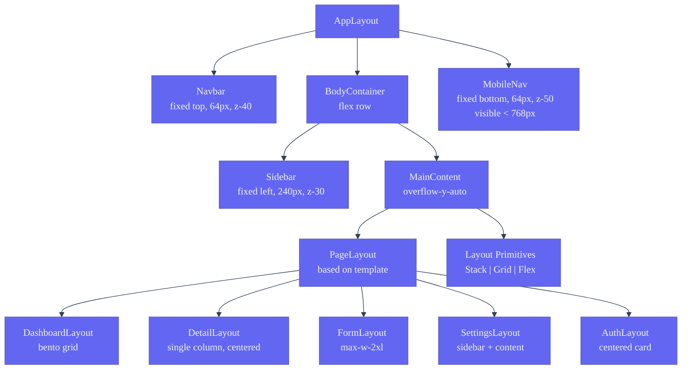
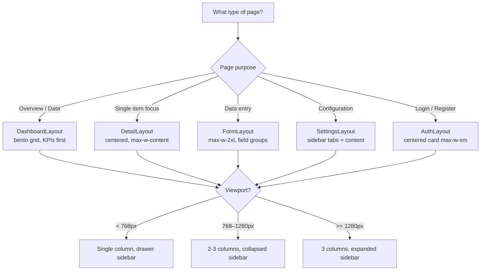
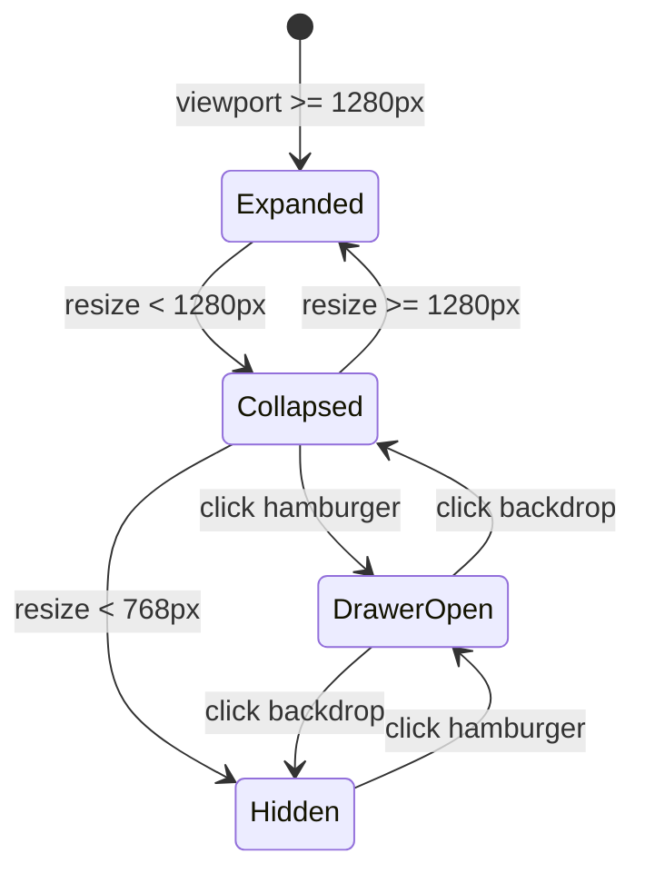

# Layout System — Second Brain OS

| Field | Value |
|---|---|
| Document ID | DSG-LYT-005 |
| Version | 1.0.0 |
| Status | Approved |
| Date | 2026-07-10 |
| Classification | Internal |
| Owner | Design Engineering Team |

---

## 1. Executive Summary

The Second Brain OS layout system provides a consistent spatial framework across 18 modules using layout primitives (Stack, Grid, Flex), responsive breakpoints (4 tiers from 375px to 1536px+), and standardized page layout templates (dashboard, detail, form, settings, auth). The system uses a 12-column fluid grid with asymmetric bento-box patterns for dashboards, standardized layout regions (navbar, sidebar, main, footer), and a z-index stacking order spanning 10 layers (base to tooltip). All layout decisions honor the 4px base spacing unit and the dark cyberpunk canvas.

---

## 2. Purpose

- Define layout primitives and their API (Stack, Grid, Flex)
- Document page layout templates for each module type
- Specify responsive breakpoint behavior for all regions
- Establish z-index stacking order and positioning rules
- Provide bento-box and asymmetric grid pattern specifications

---

## 3. Scope

| In Scope | Out of Scope |
|---|---|
| Layout primitives (Stack, Grid, Flex) | Component-level spacing (see Spacing.md) |
| Page layout templates (6 types) | Animation layout transitions (see AnimationGuidelines.md) |
| Responsive breakpoint system (4 tiers) | CSS Grid subgrid behavior |
| Layout region specifications | Print layout |
| Z-index stacking order (10 layers) | Absolute/fixed coordinate calculations |
| Bento-box dashboard patterns | Third-party layout library integration |

---

## 4. Business Context

Second Brain OS users navigate between 14+ modules daily, each with different data densities and interaction patterns. A consistent layout system ensures that the spatial grammar — where to find the navbar (top), sidebar (left), content (center), and actions (top-right) — remains constant regardless of module. This reduces cognitive load during task switching. The dashboard layout uses an asymmetric bento grid to prioritize KPIs and recent activity, while detail pages use a single-column focus layout. Responsive breakpoints ensure the app is usable on everything from 375px phones to 1536px ultra-wide monitors.

---

## 5. Functional Specification

### 5.1 Layout Primitives

#### Stack (Vertical)

```tsx
<Stack gap={4}>     // gap: spacing-4 (16px)
  <div>...</div>
  <div>...</div>
</Stack>
```

| Prop | Type | Default | Description |
|---|---|---|---|
| gap | number | 4 | Spacing token multiplier (4px base) |
| dividers | boolean | false | Show dividers between children |
| as | string | 'div' | HTML element override |

#### Grid

```tsx
<Grid columns={3} gap={6}>   // 3 columns, 24px gap
  <div>...</div>
  <div>...</div>
</Grid>
```

| Prop | Type | Default | Description |
|---|---|---|---|
| columns | number | 3 | Number of columns (1–12) |
| gap | number | 6 | Spacing token multiplier |
| minChildWidth | string | undefined | Min width before break to new row |

#### Flex (Horizontal)

```tsx
<Flex align="center" justify="between" gap={4}>
  <div>Left</div>
  <div>Right</div>
</Flex>
```

| Prop | Type | Default | Description |
|---|---|---|---|
| align | string | 'center' | align-items |
| justify | string | undefined | justify-content |
| gap | number | 4 | Spacing token multiplier |
| wrap | boolean | false | flex-wrap |

### 5.2 Page Layout Templates

#### Dashboard Layout

```
┌────────────────────────────────────────────────┐
│ Navbar (64px, fixed top, z-40)                  │
├──────────┬─────────────────────────────────────┤
│ Sidebar  │ Main Content Area                    │
│ 240px    │ ┌──────┬──────┬──────┐              │
│ fixed    │ │ KPI  │ KPI  │ KPI  │              │
│ left     │ ├──────┴──────┴──────┤              │
│ z-30     │ │ Activity Feed      │              │
│          │ ├──────┬────────────┤              │
│          │ │ Chart│ Recent     │              │
│          │ │      │ Items      │              │
│          │ └──────┴────────────┘              │
└──────────┴─────────────────────────────────────┘
```

#### Detail Layout (e.g., Task Detail)

```
┌────────────────────────────────────────────────┐
│ Navbar                                           │
├────────────────────────────────────────────────┤
│ Main (centered, max-w-content 720px)            │
│ ┌────────────────────────────────────────────┐   │
│ │ Back button                                │   │
│ │ Title (H1)                                 │   │
│ │ Metadata row                               │   │
│ ├────────────────────────────────────────────┤   │
│ │ Content body                               │   │
│ │                                            │   │
│ └────────────────────────────────────────────┘   │
│ ┌────────────────────────────────────────────┐   │
│ │ Footer actions                              │   │
│ └────────────────────────────────────────────┘   │
└────────────────────────────────────────────────┘
```

#### Form Layout

```
┌────────────────────────────────────────────────┐
│ Navbar                                           │
├────────────────────────────────────────────────┤
│ Main (max-w-2xl 672px)                          │
│ ┌────────────────────────────────────────────┐   │
│ │ Form Title (H2)                            │   │
│ ├────────────────────────────────────────────┤   │
│ │ Form Field x 2 (side-by-side)              │   │
│ │ ┌──────────┐ ┌──────────┐                  │   │
│ │ │ Field 1  │ │ Field 2  │                  │   │
│ │ └──────────┘ └──────────┘                  │   │
│ ├────────────────────────────────────────────┤   │
│ │ Form Field (full width)                    │   │
│ ├────────────────────────────────────────────┤   │
│ │ [Cancel]  [Save]                           │   │
│ └────────────────────────────────────────────┘   │
└────────────────────────────────────────────────┘
```

#### Settings Layout

```
┌────────────────────────────────────────────────┐
│ Navbar                                           │
├──────────┬─────────────────────────────────────┤
│ Sidebar  │ Main Content                         │
│ (tabs)   │ ┌─────────────────────────────────┐  │
│ Profile  │ │ Section Title                   │  │
│ Account  │ │ ┌─ Setting row ───────────────┐ │  │
│ Notif.   │ │ │ Label         [Toggle/Input] │ │  │
│ Theme    │ │ └──────────────────────────────┘ │  │
│          │ │ ┌─ Setting row ───────────────┐ │  │
│          │ │ │ Label         [Toggle/Input] │ │  │
│          │ │ └──────────────────────────────┘ │  │
│          │ └─────────────────────────────────┘  │
└──────────┴─────────────────────────────────────┘
```

#### Auth Layout

```
┌────────────────────────────────────────────────┐
│                                                 │
│         ┌────────────────────┐                  │
│         │   Center card      │                  │
│         │   (max-w-sm)       │                  │
│         │                    │                  │
│         │   Logo             │                  │
│         │   Title            │                  │
│         │   Auth form        │                  │
│         │   Submit button    │                  │
│         │                    │                  │
│         └────────────────────┘                  │
│                                                 │
│         Background: grid pattern                │
└────────────────────────────────────────────────┘
```

### 5.3 Responsive Breakpoint System

| Token | Min Width | Prefix | Sidebar | Content Columns | Page Padding | Grid Columns |
|---|---|---|---|---|---|---|
| xs | 375px | `xs:` | Hidden (drawer) | full width | 16px | 4 |
| sm | 640px | `sm:` | Hidden (drawer) | full width | 16px | 4 |
| md | 768px | `md:` | Collapsed (64px) | calc(100% - 64px) | 24px | 8 |
| lg | 1024px | `lg:` | Collapsed (64px) | calc(100% - 64px) | 24px | 8 |
| xl | 1280px | `xl:` | Expanded (240px) | calc(100% - 240px) | 32px | 12 |
| 2xl | 1536px | `2xl:` | Expanded (240px) | calc(100% - 240px), max-width 1600px centered | 32px | 12 |

### 5.4 Layout Region Specifications

| Region | Position | Width | Height | Background | Z-index |
|---|---|---|---|---|---|
| Navbar | fixed top | 100% (desktop, minus sidebar) | 64px | bg-card | 40 |
| Sidebar | fixed left | 240px / 64px collapsed | 100vh | bg-card | 30 |
| Main content | relative | calc(100% - sidebar) | calc(100vh - 64px) | bg-page | 10 |
| Bottom nav (mobile) | fixed bottom | 100% | 64px | bg-card | 50 |
| Modal backdrop | fixed | 100vw x 100vh | — | bg-black/50 | 1040 |

### 5.5 Z-Index Stacking Order

| Layer | Value | Elements |
|---|---|---|
| Base | 0 | Page backgrounds, default content |
| Content | 10 | Main content area |
| Sticky | 20 | Sticky section headers |
| Navigation | 30 | Sidebar |
| Navbar | 40 | Fixed top navbar |
| Mobile nav | 50 | Fixed bottom navigation |
| Dropdown | 1000 | Dropdown menus, autocomplete panels |
| Sticky elements | 1020 | Sticky section headers within content |
| Overlay backdrop | 1030 | Modal backdrop |
| Modal | 1040 | Modal dialogs |
| Popover | 1050 | Popovers, command palette |
| Toast | 1060 | Toast notifications |
| Tooltip | 1070 | Tooltips (always on top) |

### 5.6 Bento-Box Dashboard Grid Patterns

```tsx
// 3-column bento grid with 24px gap
<div className="grid grid-cols-1 md:grid-cols-2 xl:grid-cols-3 gap-6">
  {/* KPI strip — spans all 3 columns */}
  <div className="xl:col-span-3 grid grid-cols-3 gap-6">
    <StatCard />
    <StatCard />
    <StatCard />
  </div>
  {/* Main content — spans 2 columns */}
  <div className="xl:col-span-2">
    <ActivityFeed />
  </div>
  {/* Side panel — spans 1 column */}
  <div className="xl:col-span-1">
    <QuickActions />
    <UpcomingTasks />
  </div>
</div>
```

---

## 6. Non-Functional Requirements

| Requirement | Target | Verification |
|---|---|---|
| Responsive layout recalc | < 10ms on resize | Performance profiler |
| Bent-grid reflow at breakpoints | No content overlap | Playwright screenshot |
| Sidebar toggle animation | 200ms, GPU composited | FPS meter |
| Main content max width | 1600px (ultra-wide constraint) | Visual inspection |
| Sticky header behavior | Sticks on scroll, unstacks below navbar | Functional test |
| Modal z-index never overlapped by navbar | Verified | Integration test |

---

## 7. Architecture



---

## 8. Diagrams

### 8.1 Layout Decision Tree



### 8.2 Responsive Sidebar Behavior



---

## 9. Data Models

### 9.1 Layout Configuration Schema

```typescript
interface LayoutConfig {
  template: 'dashboard' | 'detail' | 'form' | 'settings' | 'auth'
  sidebar?: 'expanded' | 'collapsed' | 'hidden'
  maxWidth?: string       // e.g., 'max-w-content', 'max-w-2xl'
  padding?: string        // responsive: 'p-4 md:p-6 lg:p-8'
  columns?: number        // grid column count
}
```

### 9.2 Layout Region Config

```typescript
interface LayoutRegion {
  name: string
  position: 'fixed-top' | 'fixed-left' | 'relative' | 'fixed-bottom'
  width?: string
  height?: string
  zIndex: number
  background: string
  visible: { mobile: boolean; tablet: boolean; desktop: boolean }
}
```

---

## 10. APIs

### 10.1 Layout Component Usage

```tsx
// App shell
<AppLayout>
  <DashboardLayout>
    <KpiStrip />
    <BentoGrid>
      <ActivityFeed className="col-span-2" />
      <QuickActions className="col-span-1" />
    </BentoGrid>
  </DashboardLayout>
</AppLayout>

// Responsive containers
<main className="p-4 md:p-6 lg:p-8 mx-auto max-w-screen-2xl">
```

---

## 11. Security

- Layout system is purely presentational — no security implications
- No user data accessible through layout class names or DOM structure
- Overlay/modal z-index isolation prevents clickjacking

---

## 12. Performance Targets

| Metric | Target |
|---|---|
| Layout recalculation on resize | < 10ms |
| Sidebar open/close animation | 200ms at 60fps |
| Bent-grid rendering (full dashboard) | < 30ms |
| Modal mount → visible | < 100ms |
| Initial layout paint | Single frame |

---

## 13. Edge Cases

| Edge Case | Behavior |
|---|---|
| Viewport between breakpoints (e.g., 800px) | Next lower breakpoint rules apply until next upper threshold |
| Sidebar collapsed at 1200px (user preference) | Persist choice in localStorage, override breakpoint default |
| Very long content page (5000px scroll) | Sticky navbar remains attached; sidebar scrolls independently |
| Modal open on mobile with bottom nav | Bottom nav remains below modal backdrop (z-index: 50 < 1040) |
| Iframe or embedded content | Main content area scrolls; layout regions independently scrollable |
| Keyboard zoom at 200% on 1280px screen | Breaks to tablet layout rules; 8-column grid activates |

---

## 14. Failure Scenarios

| Scenario | Mitigation |
|---|---|
| CSS Grid unsupported in browser | Flexbox fallback layout remains functional |
| Overflow content in sidebar | `overflow-y-auto` on sidebar with custom scrollbar |
| Fixed position elements overlapping | Z-index audit in CI; z-index CSS custom properties |
| Sidebar width animation causes layout shift | `will-change: width` on sidebar; GPU composited |

---

## 15. Risks & Mitigations

| Risk | Likelihood | Impact | Mitigation |
|---|---|---|---|
| Layout regression from new module | Medium | High | Shared layout templates; no per-module custom layouts |
| Bent-grid breakpoint misalignment | Low | Medium | CSS Grid with responsive column overrides, not custom breakpoints |
| Sidebar width confusion on tablet | Medium | Low | Clear collapsed icon + tooltip for all sidebar items |

---

## 16. Acceptance Criteria

- [ ] All 6 page layout templates render correctly on desktop, tablet, and mobile
- [ ] Sidebar transitions: expanded (240px) → collapsed (64px) → drawer (< 768px)
- [ ] Navbar stays fixed at top on scroll (z-40)
- [ ] Main content scrolls independently from sidebar
- [ ] Z-index order: tooltip (1070) > toast (1060) > popover (1050) > modal (1040) > backdrop (1030)
- [ ] Dashboard bento grid adapts from 1 column (mobile) to 3 columns (desktop)
- [ ] Auth layout centers card vertically and horizontally on all viewports

---

## 17. Traceability

| Related Document | Link |
|---|---|
| Design System | `docs/design/10_DesignSystem.md` |
| Spacing | `docs/design/Spacing.md` |
| Responsive Rules | `docs/design/ResponsiveRules.md` |
| Dark Mode | `docs/design/DarkMode.md` |
| Design Tokens | `docs/design/35_DesignTokens.md` |

---

## 18. Implementation Notes

- All layout components use Flexbox or CSS Grid — never custom float-based layouts
- Navbar and sidebar use `position: fixed` with `z-index` stacking
- Main content container uses `overflow-y-auto` for independent scrolling
- Dashboard bento grids use `grid-template-columns` with responsive overrides
- Auth layout centers with `flex items-center justify-center min-h-screen`
- Sidebar state persisted in Zustand store, synced with localStorage
- Avoid `position: absolute` for layout — use CSS Grid or Flexbox

---

## 19. Testing Strategy

| Test Type | Scope | Tool |
|---|---|---|
| Responsive breakpoints | Correct layout at 375, 768, 1024, 1280, 1536px | Playwright device emulation |
| Sidebar behavior | Expand, collapse, drawer modes | Playwright interaction test |
| Z-index isolation | No overlay overlap | Visual regression |
| Dashboard bento grid | Correct column spans at each breakpoint | Playwright screenshot |
| Main content scroll | Independent from sidebar/navbar | Functional test |

---

## 20. References

| Reference | URL |
|---|---|
| CSS Grid Layout | https://developer.mozilla.org/en-US/docs/Web/CSS/CSS_grid_layout |
| Flexbox Guide | https://css-tricks.com/snippets/css/a-guide-to-flexbox/ |
| Bento Grid Design | https://bentogrids.com/ |
| Responsive Design Patterns | https://web.dev/patterns/layout/ |
