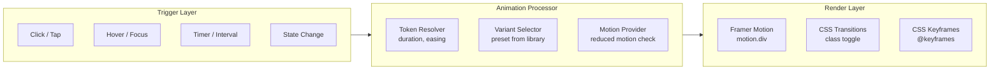
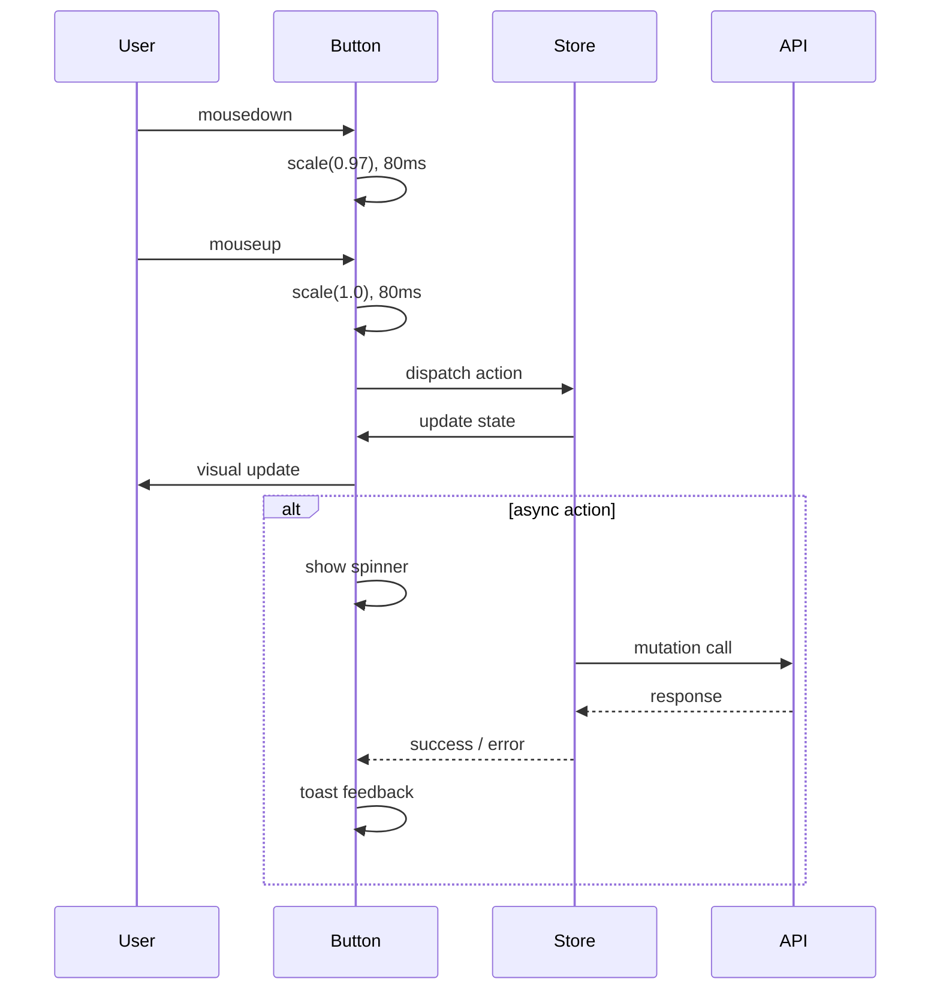

# Micro-Interaction Design Guidelines — Second Brain OS

| Field | Value |
|---|---|
| Document ID | DSG-MIC-002 |
| Version | 1.0.0 |
| Status | Approved |
| Date | 2026-07-10 |
| Classification | Internal |
| Owner | Design Engineering Team |

---

## 1. Executive Summary

Micro-interactions are the single-purpose, trigger-response animations that make Second Brain OS feel alive and responsive. Every button press, toggle switch, form validation, and state transition communicates feedback within 100-300ms. This document catalogs every micro-interaction pattern, its animation parameters, state machine, reduced-motion fallback, and implementation pattern. The system defines **20 core micro-interactions** across 6 categories: feedback, navigation, data input, state change, notification, and celebration.

**Principle:** Every action produces a visible, immediate response. No dead clicks. No silent failures.

---

## 2. Purpose

- Define the complete catalog of micro-interactions across all modules
- Standardize animation parameters (duration, easing, transform) for each interaction type
- Document state machines for multi-state interactions
- Ensure consistent reduced-motion fallback for every pattern

---

## 3. Scope

| In Scope | Out of Scope |
|---|---|
| All 20 micro-interactions in the catalog | Page transitions (see AnimationGuidelines.md) |
| State machines (hover, active, focus, disabled, loading, error, empty) | Data visualization animations |
| Skeleton screens and progress indicators | AI streaming animations |
| Button feedback and form validation feedback | Rive character animations |
| Notification animations and page transitions | GSAP scroll-driven animations |
| List item animations and drag-and-drop | Celebration confetti systems |

---

## 4. Business Context

Users perform 200+ micro-interactions per hour during active use (task creation, habit logging, navigation, form filling). Each millisecond of feedback delay compounds into minutes of cumulative wait time. At 200 interactions/hour, a 100ms improvement saves 20s/hour — translating to 12 minutes/day or 72 hours/year of saved waiting time. Fast micro-interactions are not just polish; they are productivity infrastructure.

---

## 5. Functional Specification

### 5.1 Feedback Type Hierarchy

| Type | Priority | Usage | Dismissal |
|---|---|---|---|
| Visual (animation) | High | All interactive elements | Auto (animation completes) |
| Visual (color change) | High | State transitions (hover, focus, active) | Auto on state exit |
| Visual (icon change) | Medium | Toggle states, checkbox | On state change |
| Haptic (mobile) | Medium | Long-press, completion, error | Device-dependent |
| Auditory | Low | Pomodoro complete, notification | User-configurable |

### 5.2 Interaction State Machine

```mermaid
stateDiagram-v2
    [*] --> Default
    Default --> Hover: mouseenter
    Hover --> Default: mouseleave
    Default --> Focus: tab focus
    Focus --> Default: blur
    Default --> Active: mousedown / touchstart
    Active --> Default: mouseup / touchend
    Active --> Loading: async action starts
    Loading --> Success: action completes
    Loading --> Error: action fails
    Error --> Default: user retries / dismisses
    Default --> Disabled: context disables
    Disabled --> Default: context enables
    Default --> Empty: no data
    Empty --> Default: data arrives
```

### 5.3 Micro-Interaction Catalog

| # | Interaction | Trigger | Animation | Duration | Easing | Transform |
|---|---|---|---|---|---|---|
| 1 | Button Press | Click/tap | scale 1.0 -> 0.97 | 100ms | ease-out | scale |
| 2 | Checkbox Toggle | Click/tap | scale 1.0 -> 1.15 -> 1.0 + fill sweep | 250ms | spring | scale + bg |
| 3 | Card Hover | mouseenter | translateY(-3px), glow shadow | 300ms | ease-out | translate + shadow |
| 4 | Toast Slide-in | Action completes | translateY(-20px) to 0, opacity 0->1 | 300ms | spring | translate + opacity |
| 5 | Modal Enter | Trigger click | backdrop fade 0->0.5 (200ms), modal scale 0.9->1 (300ms) | 300ms | parallel | scale + opacity |
| 6 | Sidebar Hover (collapsed) | mouseenter | width expands 64px -> 240px | 200ms | ease-out | width |
| 7 | Progress Fill | Value change | Width from previous to new value | 500ms | ease-out | width |
| 8 | Notification Badge | New notification | scale 0 -> 1.2 -> 1 + pulse glow | 400ms | spring | scale + shadow |
| 9 | Skeleton Fade | Content loads | opacity 1->0 (skeleton), 0->1 (content) | 200ms | ease-in-out | opacity |
| 10 | Page Transition | Route change | opacity 1->0 (150ms), 0->1 (200ms) | 350ms | ease-in-out | opacity + y |
| 11 | Drag Handle | mousedown on drag | scale 1.0 -> 1.05, shadow elevates | 150ms | ease-out | scale + shadow |
| 12 | Drop Target | dragover | background pulse highlight | continuous | ease-in-out | bg |
| 13 | Delete Undo | Delete action | card collapse (300ms) + toast (300ms) | 600ms | ease-in-out | height + opacity |
| 14 | Search Type | Key press | debounced results appear with stagger | 200ms delay | ease-out | y + opacity |
| 15 | Streak Flame | New streak day | flame icon flicker, counter increment | 500ms | spring | scale |
| 16 | Pomodoro Complete | Timer ends | pulsing notification + optional sound | 2s | ease-in-out | opacity + scale |
| 17 | Confetti Burst | First task of day | 30 particles from center | 800ms | spring | translate + rotate |
| 18 | Focus Ring | Tab to element | ring-2 ring-accent-primary appears | 100ms | ease-out | outline |
| 19 | Error Shake | Form validation fail | input shakes 3px amplitude, 3 cycles | 300ms | ease-in-out | translateX |
| 20 | Dropdown Open | Click trigger | content scale 0.95->1, opacity 0->1 | 200ms | ease-out | scale + opacity |

### 5.4 Animation Parameters

```typescript
// Shared animation tokens for all micro-interactions
const microTokens = {
  duration: {
    press: 80,      // Button press feedback
    feedback: 150,  // Hover, focus transitions
    reveal: 250,    // Content appearing
    emphasis: 400,  // Important state changes
    celebration: 800, // Success animations
  },
  easing: {
    press: [0.0, 0.0, 0.2, 1],
    reveal: [0.4, 0.0, 0.2, 1],
    celebration: [0.34, 1.56, 0.64, 1],
  },
  transform: {
    press: 0.97,
    hover: 1.02,
    cardHover: -2,    // translateY
    shakeAmplitude: 4, // px
  },
}
```

---

## 6. Non-Functional Requirements

| Requirement | Target | Verification |
|---|---|---|
| First frame latency | < 50ms from interaction | Performance profiling |
| Frame rate | 60fps (16.7ms per frame) | DevTools FPS meter |
| No layout thrashing | 0 events per sequence | Layout boundary check |
| GPU compositing | 100% of animations | Layer borders check |
| Bundle impact | < 5KB for micro-interaction logic | Bundle analyzer |

---

## 7. Architecture



---

## 8. Diagrams

### 8.1 Button Press Sequence



### 8.2 Form Validation Flow

```mermaid
stateDiagram-v2
    [*] --> Default: field renders
    Default --> Focused: user tabs in
    Focused --> Typing: user types
    Typing --> Validating: debounce 300ms
    Validating --> Valid: no errors
    Validating --> Invalid: errors found
    Valid --> Focused: user continues
    Invalid --> Error: blur
    Invalid --> Focused: user corrects
    Error --> Focused: user starts typing
    Error --> Validating: debounce
    Error --> Submitted: user submits form
    Error --> Submitted: with errors
    Submitted --> Success: all valid
    Submitted --> ErrorSummary: errors remain
    ErrorSummary --> Error: focus first error
```

---

## 9. Data Models

### 9.1 Micro-Interaction Config

```typescript
interface MicroInteractionConfig {
  id: string
  name: string
  trigger: 'click' | 'hover' | 'focus' | 'timer' | 'state'
  animation: {
    property: string       // 'scale' | 'opacity' | 'translateY' | 'width'
    from: string | number
    to: string | number
    duration: number       // ms
    easing: [number, number, number, number]
    transformOrigin?: string
  }
  reducedMotion: {
    type: 'none' | 'opacity' | 'instant'
    value?: string | number
  }
}
```

---

## 10. APIs

### 10.1 React Hook for Micro-Interactions

```typescript
function useMicroInteraction(config: MicroInteractionConfig): {
  ref: React.RefObject<HTMLElement>
  isActive: boolean
  play: () => void
  reset: () => void
}
```

---

## 11. Security

- No security concerns: micro-interactions are purely presentational
- Haptic feedback on mobile requires `navigator.vibrate` permission check
- Audio feedback requires user gesture to initialize AudioContext

---

## 12. Performance Targets

| Metric | Target |
|---|---|
| Interaction to first frame | < 50ms |
| Animation frame rate | 60fps |
| Concurrent animated elements | < 12 |
| JS execution per frame | < 5ms |
| Memory per animation | < 1KB |

---

## 13. Edge Cases

| Edge Case | Behavior |
|---|---|
| User clicks button while loading | Ignore click (button is disabled) |
| User hovers on touch device | Show hover state on tap, persist until next interaction |
| Multiple rapid button clicks | Disabled prevents double-submit; animation plays once |
| Tab focus on already-focused element | No re-animation; focus ring stays visible |
| Animation interrupted by new trigger | Cancel current animation, start new (FM handles natively) |

---

## 14. Failure Scenarios

| Scenario | Mitigation |
|---|---|
| Framer Motion fails to load | CSS transitions serve as fallback |
| Reduced motion detected | All micro-interactions become instant (0ms) |
| GPU not available for compositing | Degrade to software-rendered transitions |
| Animation causes layout shift | Use `transform` only — never `width`, `height` |

---

## 15. Risks & Mitigations

| Risk | Likelihood | Impact | Mitigation |
|---|---|---|---|
| Over-animation causing user fatigue | Medium | Medium | Max 3 simultaneous animations; reduced motion toggle |
| Haptic vibration not supported | Low | Low | Haptic is enhancement only; visual feedback always present |
| Audio context blocked by browser | Low | Medium | Check `AudioContext.state` before playing sounds |

---

## 16. Acceptance Criteria

- [ ] All 20 micro-interactions play at 60fps
- [ ] No micro-interaction exceeds 500ms total duration
- [ ] All interactive elements have visible hover, focus, and active states
- [ ] Form validation errors trigger shake animation
- [ ] Toast notifications slide in with spring animation
- [ ] List items animate on enter/exit with stagger
- [ ] Drag-and-drop shows visual lift on grab
- [ ] All animations respect `prefers-reduced-motion`

---

## 17. Traceability

| Related Document | Link |
|---|---|
| Animation Guidelines | `docs/design/AnimationGuidelines.md` |
| Motion System | `docs/design/MotionSystem.md` |
| UI/UX | `docs/design/08_UIUX.md` |
| Accessibility | `docs/design/FrontendAccessibilityGuide.md` |

---

## 18. Implementation Notes

- Import micro-interaction presets from `packages/ui/animation-presets.ts`
- Use `motion.div` with `whileHover`, `whileTap`, `whileFocus` for UI components
- Never animate `width`, `height`, `margin`, `padding` — use `scaleX`, `scaleY`, `translateX`, `translateY`
- All exit animations must be 60-70% of entry duration
- Stagger total for any list must not exceed 500ms

---

## 19. Testing Strategy

| Test Type | Scope | Tool |
|---|---|---|
| Animation correctness | All 20 interactions play correctly | Visual regression (Chromatic) |
| Performance | 60fps on mid-range device | DevTools Performance tab |
| Reduced motion | All animations replaced with instant | Playwright with emulation |
| Touch compatibility | Hover states on touch devices | Playwright device emulation |
| Accessibility | Screen reader announcements for state changes | axe-core |

---

## 20. References

| Reference | URL |
|---|---|
| Framer Motion Documentation | https://www.framer.com/motion/ |
| Material Motion Guidelines | https://m3.material.io/motion |
| Micro-interactions Book | https://microinteractions.com/ |
| CSS will-change Property | https://developer.mozilla.org/en-US/docs/Web/CSS/will-change |
