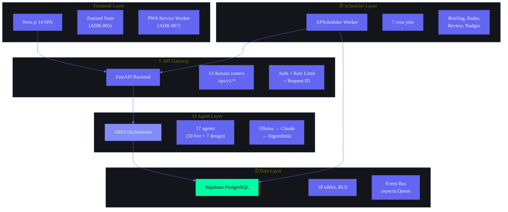

# Product Architecture — Second Brain OS (ARIA)

> **Domain-oriented, event-driven, enterprise-grade architecture specification**
> Covers all 13 bounded domains, cross-cutting architectures, enterprise readiness, and architecture decisions.

---

## Document Control

| Field | Value |
|---|---|
| Document ID | SB-ARCH-001 |
| Version | 1.0.0 |
| Status | Draft |
| Last Updated | 2026-06-11 |
| Classification | Internal — Architecture Reference |
| Supersedes | `docs/engineering/12_Architecture.md`, `13_SystemArchitecture.md` |

---

## Table of Contents

1. [Executive Architecture Summary](#1-executive-architecture-summary)
2. [Architecture Principles](#2-architecture-principles)
3. [Architecture Decisions](#3-architecture-decisions)
4. [Product Domain Model](#4-product-domain-model)
   - 4.1 Task Domain
   - 4.2 Knowledge Domain
   - 4.3 Learning Domain
   - 4.4 Goal Domain
   - 4.5 Roadmap Domain
   - 4.6 Opportunity Domain
   - 4.7 Project Domain
   - 4.8 Analytics Domain
   - 4.9 AI Domain
   - 4.10 User Domain
   - 4.11 Notification Domain
   - 4.12 Search Domain
   - 4.13 Memory Domain
5. [Domain Relationship Map](#5-domain-relationship-map)
6. [Context Boundaries](#6-context-boundaries)
7. [Product Capabilities Map](#7-product-capabilities-map)
8. [Module Relationship Map](#8-module-relationship-map)
9. [User Flow Architecture](#9-user-flow-architecture)
10. [Data Flow Architecture](#10-data-flow-architecture)
11. [Cross-Cutting Architectures](#11-cross-cutting-architectures)
    - 11.1 Event Bus Architecture
    - 11.2 Search Architecture
    - 11.3 Notification Architecture
    - 11.4 Memory Architecture
    - 11.5 Knowledge Architecture
    - 11.6 Learning Architecture
    - 11.7 AI Agent Architecture
    - 11.8 Analytics Architecture
    - 11.9 Dashboard Architecture
12. [Infrastructure Architectures](#12-infrastructure-architectures)
    - 12.1 Realtime Architecture
    - 12.2 Offline Architecture
    - 12.3 Mobile Architecture
    - 12.4 Desktop Architecture
    - 12.5 Scalability Architecture
    - 12.6 Future Expansion Architecture
13. [Enterprise Readiness Assessment](#13-enterprise-readiness-assessment)
14. [Risks and Mitigations](#14-risks-and-mitigations)
15. [Recommendations](#15-recommendations)

---



---

## 1. Executive Architecture Summary

Second Brain OS (ARIA) is a personal AI productivity system architected as a **domain-oriented monolith** with 13 bounded domains. The system follows a **strict layered architecture** where cross-domain communication flows exclusively through an event bus, direct domain-to-domain function calls are prohibited, and every domain owns its data and exposes it only through well-defined interfaces.

### Architectural Style

| Dimension | Decision |
|---|---|
| Style | Domain-oriented monolith with event-driven cross-domain communication |
| Deployment | Monolithic FastAPI process + Next.js SPA + APScheduler worker |
| AI Architecture | In-process async agents (per ADR-004) with dual backend (Ollama → Claude → Algorithmic) |
| Database | Supabase PostgreSQL (single database, schema-per-domain) |
| Event Bus | In-process asyncio.Queue in alpha; RabbitMQ/Kafka in gamma (extends ADR-008) |
| Frontend | Next.js 14 SPA with Zustand (ADR-005), PWA-first (ADR-007) |
| Offline | Service Worker + IndexedDB + background sync queue |

### Key Architectural Numbers

| Metric | Target |
|---|---|
| Domains | 13 |
| API Endpoints | ~53 |
| AI Agents | 15 (8 implemented) |
| Prompt Files | 12 (YAML frontmatter) |
| Tests | 30+ (growing) |
| Event Types | ~40 (defined below) |
| Max latency (AI) | <60s before fallback |
| RPO (data loss) | <1s (Supabase realtime) |
| RTO (recovery) | <5min (stateless FastAPI) |

### Architecture Philosophy

**Think like Stripe, Notion, Linear, GitHub, Vercel.** Every architectural decision prioritizes:

1. **Developer experience** — fast iteration, clear boundaries, testability
2. **Graceful degradation** — every feature works without AI, without network, without backend
3. **Event-driven coupling** — domains communicate through events, not imports
4. **Fail-safe defaults** — every agent falls back to algorithmic mode if the LLM is unreachable
5. **Offline-first** — the app must be usable without internet for core CRUD operations

---

## 2. Architecture Principles

### P1: Domain Ownership
Every domain owns its data, schema, and behavior absolutely. No domain reads another domain's database tables directly. Cross-domain data access flows through:
- Published events (async, eventually consistent)
- Domain service calls (sync, for read-only queries)
- Aggregated views in the Analytics domain (read replicas)

### P2: Event-Driven Decoupling
Domains communicate through typed events on a shared event bus. Direct function calls between domain services are forbidden in production paths. Exceptions:
- Query-only access to read models via repository interfaces
- Orchestrator (ARIA) dispatching to sub-agents (in-process by ADR-004)

### P3: Graceful Degradation
Every user-facing feature must work at three levels of fidelity:
1. **Full AI** — All agents online, LLM generating insights
2. **Algorithmic** — AI unavailable, deterministic fallback logic
3. **Offline** — No network, cached data, queued writes

### P4: API-First
All data flows through typed REST API contracts. No direct database access from the frontend. The API is the single source of truth for data shape and access patterns.

### P5: Schema-per-Domain
Each domain uses a dedicated database schema (`tasks.*`, `knowledge.*`, `goals.*`, etc.) within the shared Supabase PostgreSQL instance. Schema isolation prevents accidental cross-domain table access.

### P5: Observable by Default
Every domain publishes lifecycle events, metrics, and audit logs. The Analytics domain subscribes to all events for reporting. No side effect happens silently.

### P6: Fail-Safe AI
Every agent module implements a three-tier fallback chain:
```
LLM (primary) → Algorithmic fallback → Static default response
```
If any tier fails, the next tier takes over with zero user-facing degradation.

### P7: Immutable Event Log
All domain events are written to an append-only event store. Events are never mutated or deleted. The event store serves as the system of record for cross-domain state reconciliation.

### P8: Bounded Context Integrity
Each domain's internal model is private. External consumers see only published events and query API responses. Domain internals can be refactored without affecting other domains.

### P9: Cost-Aware AI Dispatch
Expensive AI operations (Claude API calls) are the last resort. The system attempts local Ollama first, algorithmic fallback second, and cloud AI only when both cheaper options fail or when the task specifically requires Claude-class reasoning.

### P10: Offline-First by Default
All core CRUD operations must work offline. The frontend maintains a local cache (IndexedDB) and syncs to the backend when connectivity is restored. Conflict resolution uses last-write-wins with user notification.

---

## 3. Architecture Decisions

This section extends the existing ADRs (ADR-001 through ADR-008) with additional context and decisions specific to the product architecture.

### ADR-001: Monorepo over Multi-Repo (Confirmed)
**Status:** Extended
**Decision:** Single monorepo with `apps/`, `packages/`, `services/` top-level directories.
**Extension:** The monorepo must enforce module boundaries through:
- `pyproject.toml` dependency declarations (no circular dependencies)
- `tsconfig.json` path aliases (`@/` for apps, `@packages/` for shared)
- CI lint rules preventing cross-domain imports

### ADR-002: Supabase over Custom Backend DB (Confirmed)
**Status:** Extended
**Decision:** Supabase PostgreSQL as primary database.
**Extension:** Schema-per-domain isolation enforced:
```sql
CREATE SCHEMA IF NOT EXISTS tasks;
CREATE SCHEMA IF NOT EXISTS knowledge;
CREATE SCHEMA IF NOT EXISTS goals;
-- ... per domain
```
RLS policies scoped to `user_id` on every table.

### ADR-003: Ollama Primary, Claude Fallback (Confirmed)
**Status:** Extended
**Decision:** Local AI (Mistral 7B via Ollama) as primary; Claude API as fallback.
**Extension:** Added algorithmic tier as third fallback. Multi-model routing:
1. Try Ollama (local, free)
2. If Ollama fails → try Claude (cloud, ~$0.015/req)
3. If both fail → algorithmic fallback (deterministic logic)
4. If all fail → static default response

### ADR-004: In-Process Agents over Microservices (Confirmed)
**Status:** Extended
**Decision:** Agents as async functions in FastAPI process.
**Extension:** Agents receive a typed `AgentContext` with event bus access for publishing results. Long-running agents (>5s) are delegated to `BackgroundTasks` to avoid blocking the event loop.

### ADR-005: Zustand over Redux (Confirmed)
**Status:** Extended — No change needed.

### ADR-006: APScheduler over Celery (Confirmed)
**Status:** Extended — No change needed.

### ADR-007: PWA over Native Mobile (Confirmed)
**Status:** Extended — Offline-first architecture enforced in all frontend patterns.

### ADR-008: No Event Bus in Alpha (Extended for Gamma)
**Status:** Extended
**Decision (Alpha):** In-process function calls + Supabase Realtime + Cron polling.
**Decision (Beta/Gamma):** Introduce `asyncio.Queue`-based in-process event bus for beta, RabbitMQ for gamma. This extension does not change the alpha implementation. The event bus abstraction layer is defined now; the implementation evolves from direct calls → in-process queue → dedicated broker without changing event producers or consumers.

---

## 4. Product Domain Model

All 13 bounded domains are defined below. Each domain includes:
- **Purpose** — Why this domain exists
- **Responsibilities** — What it owns
- **Data Ownership** — Tables and schemas it controls
- **Inputs** — Events and API calls it accepts
- **Outputs** — Events it publishes
- **Relationships** — How it connects to other domains
- **User Interactions** — What users do in this domain
- **AI Interactions** — How AI agents interact with this domain

---

### 4.1 Task Domain

| Field | Value |
|---|---|
| Domain ID | D01 |
| Schema | `tasks` |
| Status | ✅ Implemented |

#### Purpose
Task management is the core productivity primitive. The Task domain owns the full lifecycle of user tasks: creation, prioritization, scheduling, completion, and dependency tracking.

#### Responsibilities
- CRUD for tasks (title, description, priority, status, due date, tags)
- Task dependency graph (blocking, blocked-by relationships)
- Task completion workflow (validate dependencies, publish completion event)
- Priority management (urgent, high, medium, low with optional Eisenhower matrix)
- Task search and filtering (by status, priority, due date, tags, assignee)

#### Data Ownership

| Table | Purpose | Key Columns |
|---|---|---|
| `tasks.tasks` | Task records | id, user_id, title, description, status, priority, due_date, goal_id, project_id, estimated_minutes, completed_at, created_at, updated_at |
| `tasks.task_dependencies` | Dependency graph | id, task_id, depends_on_task_id, dependency_type (blocks, blocked_by) |
| `tasks.task_tags` | Tag associations | id, task_id, tag |

#### Inputs
| Input | Type | Source |
|---|---|---|
| CreateTask | REST POST /api/tasks | Frontend, Idea Domain, Goal Domain |
| UpdateTask | REST PUT /api/tasks/{id} | Frontend, AI Agent |
| CompleteTask | REST POST /api/tasks/{id}/complete | Frontend, Scheduler |
| DeleteTask | REST DELETE /api/tasks/{id} | Frontend |

#### Outputs (Events)
| Event | Payload | Consumers |
|---|---|---|
| `task.created` | task_id, user_id, priority, due_date | Analytics, Memory, Notification |
| `task.updated` | task_id, user_id, changed_fields | Analytics, Memory |
| `task.completed` | task_id, user_id, completed_at, goal_id | Goal, Analytics, Notification, Memory |
| `task.deleted` | task_id, user_id | Analytics |
| `task.overdue` | task_id, user_id, days_overdue | Notification, Analytics |
| `task.priority_changed` | task_id, user_id, old_priority, new_priority | Analytics |

#### Relationships
| Domain | Relationship |
|---|---|
| Goal (D04) | Tasks can belong to a goal; completing a task updates goal progress |
| Project (D07) | Tasks can belong to a project phase |
| Analytics (D08) | Task events feed productivity metrics, velocity reports |
| Memory (D13) | Task completion contributes to user pattern memory |
| AI (D09) | Task Agent (A01) analyzes tasks for breakdown, prioritization |
| Notification (D11) | Task overdue/reminder events trigger notifications |

#### User Interactions
- Create tasks via dashboard "Quick Add" or dedicated task page
- Drag-and-drop prioritization (Kanban-style board)
- Batch operations (complete, delete, reschedule)
- Set recurring tasks (daily, weekly, custom)
- View task dependencies as interactive graph

#### AI Interactions
- **Planner Agent (A01):** Breaks down vague tasks into subtasks, suggests priorities, estimates effort
- **Reminder Agent (A04):** Checks for upcoming/overdue tasks every 15 minutes, triggers notifications
- **Daily Briefing (A09):** Summarizes today's tasks in morning briefing
- **Weekly Review (A10):** Analyzes task completion rate, identifies bottlenecks

---

### 4.2 Knowledge Domain

| Field | Value |
|---|---|
| Domain ID | D02 |
| Schema | `knowledge` |
| Status | ⚠️ Design |

#### Purpose
The Knowledge domain manages the user's personal knowledge base — a structured, searchable, AI-enriched collection of information. It goes beyond simple notes to support rich content types, embeddings, and semantic relationships.

#### Responsibilities
- CRUD for knowledge items (notes, documents, code snippets, web clippings)
- Content embedding generation (vector search support)
- Full-text search across all knowledge items
- Tagging and categorization
- Source tracking (manual entry, web import, idea capture)
- Relationship linking between knowledge items

#### Data Ownership

| Table | Purpose | Key Columns |
|---|---|---|
| `knowledge.items` | Knowledge entries | id, user_id, title, content, content_type, source, tags, embedding, created_at, updated_at |
| `knowledge.relationships` | Item-to-item links | id, source_item_id, target_item_id, relationship_type, created_at |
| `knowledge.tags` | Tag definitions | id, user_id, name, color |

#### Inputs
| Input | Type | Source |
|---|---|---|
| CreateItem | REST POST /api/knowledge | Frontend, Web Clipper, Idea Domain |
| UpdateItem | REST PUT /api/knowledge/{id} | Frontend, Learning Agent |
| SearchItems | REST GET /api/knowledge/search | Frontend, Search Domain, AI Agents |
| DeleteItem | REST DELETE /api/knowledge/{id} | Frontend |

#### Outputs (Events)
| Event | Payload | Consumers |
|---|---|---|
| `knowledge.item_created` | item_id, user_id, content_type, tags | Search, Learning, Memory |
| `knowledge.item_updated` | item_id, user_id, changed_fields | Search, Learning |
| `knowledge.item_deleted` | item_id, user_id | Search |

#### Relationships
| Domain | Relationship |
|---|---|
| Learning (D03) | Knowledge items are source material for learning insights |
| Search (D12) | Knowledge items are the primary search index |
| Memory (D13) | Knowledge items feed into AI's long-term memory |
| AI (D09) | Learning Agent analyzes knowledge for pattern detection |
| Idea (via Project/Idea) | Raw ideas become structured knowledge items |

#### User Interactions
- Rich text editor (markdown with live preview)
- Web clipper browser extension
- Drag-and-drop file upload (PDFs, images, code files)
- Graph view of item relationships
- Bidirectional linking (Obsidian/Notion-style `[[wiki links]]`)

#### AI Interactions
- **Learning Agent (A03):** Analyzes knowledge items for patterns, suggests connections between related items
- **Memory Agent (A02):** Periodically summarizes knowledge base changes into AI memory
- **Search (D12):** Knowledge items indexed for semantic search

---

### 4.3 Learning Domain

| Field | Value |
|---|---|
| Domain ID | D03 |
| Schema | `learning` |
| Status | ⚠️ Design |

#### Purpose
The Learning domain tracks the user's learning journey across courses, subjects, and skills. It identifies knowledge gaps, recommends learning paths, and measures progress over time.

#### Responsibilities
- Course tracking (enrollment, progress, deadlines)
- Subject/curriculum management
- Learning progress snapshots and trend analysis
- Knowledge gap identification
- Learning path recommendations
- Study session tracking (Pomodoro integration)

#### Data Ownership

| Table | Purpose | Key Columns |
|---|---|---|
| `learning.courses` | Course definitions | id, user_id, title, provider, platform, url, status, credits, started_at, deadline |
| `learning.topics` | Topic/subject hierarchy | id, user_id, name, parent_topic_id, description |
| `learning.progress` | Learning progress snapshots | id, user_id, course_id, topic_id, progress_pct, time_spent_minutes, snapshot_date |
| `learning.study_sessions` | Focused study tracking | id, user_id, course_id, duration_minutes, Start_time, end_time, focus_score |
| `learning.gap_analysis` | Knowledge gap records | id, user_id, topic_id, gap_type, severity, recommendation |

#### Inputs
| Input | Type | Source |
|---|---|---|
| EnrollCourse | REST POST /api/courses | Frontend |
| LogProgress | REST POST /api/learning/progress | Frontend, Scheduler |
| GetGaps | REST GET /api/learning/gaps | Frontend |
| GetRecommendations | REST GET /api/learning/recommendations | Frontend, AI |

#### Outputs (Events)
| Event | Payload | Consumers |
|---|---|---|
| `learning.course_enrolled` | course_id, user_id, deadline | Goal, Notification |
| `learning.progress_updated` | course_id, user_id, progress_pct | Analytics, AI |
| `learning.gap_detected` | user_id, topic_id, severity | Notification, AI |
| `learning.course_completed` | course_id, user_id, grade/metric | Analytics, Memory |

#### Relationships
| Domain | Relationship |
|---|---|
| Goal (D04) | Learning goals drive course enrollment |
| Analytics (D08) | Learning progress feeds skill development metrics |
| Memory (D13) | Course completions and gaps stored in long-term memory |
| AI (D09) | Learning Agent analyzes study patterns, recommends resources |
| Task (D01) | Study sessions can be tasks; homework tracked in tasks |

#### User Interactions
- Course dashboard showing progress bars for each enrolled course
- Semester calendar view with deadlines
- Study session timer (Pomodoro integration)
- Knowledge gap visualization as radar chart
- Learning path roadmap with milestones

#### AI Interactions
- **Learning Agent (A03):** Detects learning patterns, identifies knowledge gaps, suggests next topics
- **Course Nudge Agent (A14):** Sends daily nudges for pending coursework at 6 PM
- **Weekly Review (A10):** Reports learning progress and study consistency

---

### 4.4 Goal Domain

| Field | Value |
|---|---|
| Domain ID | D04 |
| Schema | `goals` |
| Status | ✅ Implemented |

#### Purpose
Goals provide strategic direction for the user's daily actions. The Goal domain manages goal hierarchies (high-level aspirations → measurable objectives → daily tasks), progress tracking, and milestone management.

#### Responsibilities
- CRUD for goals (title, description, target date, status)
- Goal hierarchy management (parent-child relationships)
- Progress calculation (based on task completion, milestone achievement)
- Milestone definition and tracking
- Goal roadmap visualization

#### Data Ownership

| Table | Purpose | Key Columns |
|---|---|---|
| `goals.goals` | Goal definitions | id, user_id, title, description, goal_type, target_date, status, progress_pct, parent_goal_id |
| `goals.milestones` | Milestone tracking | id, goal_id, title, due_date, completed_at, weight |
| `goals.key_results` | OKR-style results | id, goal_id, title, target_value, current_value, unit |

#### Inputs
| Input | Type | Source |
|---|---|---|
| CreateGoal | REST POST /api/goals | Frontend, AI |
| UpdateGoal | REST PUT /api/goals/{id} | Frontend |
| GetGoalProgress | REST GET /api/goals/{id}/progress | Frontend, Dashboard |
| DeleteGoal | REST DELETE /api/goals/{id} | Frontend |

#### Outputs (Events)
| Event | Payload | Consumers |
|---|---|---|
| `goal.created` | goal_id, user_id, target_date | Analytics, Memory |
| `goal.progress_updated` | goal_id, user_id, progress_pct | Analytics, Notification |
| `goal.milestone_reached` | goal_id, milestone_id, milestone_title | Notification, Analytics, Memory |
| `goal.completed` | goal_id, user_id, completed_at | Analytics, Memory |
| `goal.at_risk` | goal_id, user_id, risk_reason | Notification, AI |

#### Relationships
| Domain | Relationship |
|---|---|
| Task (D01) | Tasks linked to goals; task completion drives goal progress |
| Roadmap (D05) | Goals contribute to roadmap milestones |
| Project (D07) | Projects can be tied to goals |
| Analytics (D08) | Goal progress tracked over time for trend analysis |
| AI (D09) | Goals analyzed by Weekly Review, Daily Briefing |

#### User Interactions
- Goal creation wizard (aspiration → measurable → timeline)
- Progress dashboard with circular progress indicators
- Goal tree visualization (parent goals, sub-goals, linked tasks)
- Quarterly goal review prompts
- SMART goal validation assistance

#### AI Interactions
- **Daily Briefing (A09):** Reports goal progress in morning brief
- **Weekly Review (A10):** Deep analysis of goal progress, at-risk goals flagged
- **Planner Agent (A01):** Suggests tasks that align with active goals
- **Memory Agent (A02):** Stores goal preferences and typical progress patterns

---

### 4.5 Roadmap Domain

| Field | Value |
|---|---|
| Domain ID | D05 |
| Schema | `roadmap` |
| Status | ⚠️ Design |

#### Purpose
The Roadmap domain provides strategic planning beyond individual goals. It manages multi-phase roadmaps with timelines, dependencies, and resource allocation. Roadmaps cover career, education, projects, and personal development.

#### Responsibilities
- Roadmap CRUD (title, phases, timeline)
- Phase management with dependencies
- Timeline visualization (Gantt-style)
- Roadmap vs. actual progress tracking
- Milestone-based checkpoints
- Resource estimation per phase

#### Data Ownership

| Table | Purpose | Key Columns |
|---|---|---|
| `roadmap.roadmaps` | Roadmap definitions | id, user_id, title, description, roadmap_type, start_date, target_end_date, status |
| `roadmap.phases` | Roadmap phases | id, roadmap_id, title, description, start_date, end_date, status, order |
| `roadmap.phase_dependencies` | Phase dependency graph | id, phase_id, depends_on_phase_id |
| `roadmap.phase_resources` | Resource allocation | id, phase_id, resource_type, estimated_hours, actual_hours |

#### Inputs
| Input | Type | Source |
|---|---|---|
| CreateRoadmap | REST POST /api/roadmaps | Frontend, AI |
| UpdatePhase | REST PUT /api/roadmaps/{id}/phases/{phase_id} | Frontend |
| GetRoadmapTimeline | REST GET /api/roadmaps/{id}/timeline | Frontend |
| DeleteRoadmap | REST DELETE /api/roadmaps/{id} | Frontend |

#### Outputs (Events)
| Event | Payload | Consumers |
|---|---|---|
| `roadmap.created` | roadmap_id, user_id, target_end_date | Analytics, Memory |
| `roadmap.phase_completed` | roadmap_id, phase_id, actual_end_date | Notification, Analytics, Goal |
| `roadmap.phase_at_risk` | roadmap_id, phase_id, delay_days | Notification, AI |
| `roadmap.completed` | roadmap_id, user_id | Analytics, Memory |

#### Relationships
| Domain | Relationship |
|---|---|
| Goal (D04) | Roadmap phases map to goal milestones |
| Project (D07) | Projects can be phases of a roadmap |
| Analytics (D08) | Roadmap progress feeds planning accuracy metrics |
| AI (D09) | Roadmap Agent (A08) suggests timeline adjustments |
| Task (D01) | Tasks can be assigned to roadmap phases |

#### User Interactions
- Interactive Gantt chart for roadmap visualization
- Drag-and-drop phase reordering
- "What if" timeline simulator (delay a phase, see cascading effects)
- Roadmap portfolio view (multiple roadmaps side by side)

#### AI Interactions
- **Roadmap Agent (A08):** Generates roadmaps from goals, suggests realistic timelines, flags risks
- **Weekly Review (A10):** Reports roadmap progress against timeline
- **Planner Agent (A01):** Creates tasks aligned with active roadmap phases

---

### 4.6 Opportunity Domain

| Field | Value |
|---|---|
| Domain ID | D06 |
| Schema | `opportunities` |
| Status | ✅ Implemented |

#### Purpose
The Opportunity domain scans the user's context (skills, interests, goals) and matches them against external opportunities — jobs, internships, hackathons, scholarships, open-source projects, networking events. It's the "career radar" that proactively finds relevant openings.

#### Responsibilities
- Opportunity CRUD (title, source, url, type, deadline, match_score)
- Opportunity radar scanning (daily cron job)
- Match scoring based on user profile, skills, goals
- Application tracking (applied, interviewing, offer, rejected)
- Source management (LinkedIn, GitHub, company career pages, newsletters)

#### Data Ownership

| Table | Purpose | Key Columns |
|---|---|---|
| `opportunities.opportunities` | Opportunity records | id, user_id, title, description, source_url, opportunity_type, deadline, match_score, status, source, created_at |
| `opportunities.applications` | Application tracking | id, opportunity_id, user_id, status, applied_at, notes, next_step_date |
| `opportunities.sources` | Source configurations | id, user_id, source_type, config, enabled, last_scanned_at |

#### Inputs
| Input | Type | Source |
|---|---|---|
| CreateOpportunity | REST POST /api/opportunities | Frontend, Radar Agent |
| UpdateOpportunity | REST PUT /api/opportunities/{id} | Frontend |
| TriggerRadarScan | REST POST /api/opportunities/scan | Frontend, Scheduler |
| GetMatchScore | REST GET /api/opportunities/{id}/score | Frontend |

#### Outputs (Events)
| Event | Payload | Consumers |
|---|---|---|
| `opportunity.detected` | opportunity_id, user_id, match_score, opportunity_type | Notification, Analytics, Memory |
| `opportunity.applied` | opportunity_id, user_id, application_id | Analytics, Goal |
| `opportunity.deadline_approaching` | opportunity_id, user_id, days_remaining | Notification |
| `opportunity.match_improved` | opportunity_id, old_score, new_score | Notification |

#### Relationships
| Domain | Relationship |
|---|---|
| Learning (D03) | Skills and courses influence match scores |
| Goal (D04) | Career goals drive opportunity preferences |
| Analytics (D08) | Application success rate, source effectiveness |
| AI (D09) | Radar Agent scans and scores matches |
| Notification (D11) | High-match opportunities trigger notifications |

#### User Interactions
- Opportunity feed with match percentage badges
- One-click application tracking
- Source configuration (which platforms to scan)
- Match score breakdown (why this opportunity matched)
- Career dashboard with application pipeline

#### AI Interactions
- **Radar Agent (A06):** Runs daily scan, scores opportunities against user profile
- **Weekly Review (A10):** Reports pipeline health, suggests next steps
- **Memory Agent (A02):** Stores opportunity preferences, rejection patterns

---

### 4.7 Project Domain

| Field | Value |
|---|---|
| Domain ID | D07 |
| Schema | `projects` |
| Status | ✅ Implemented |

#### Purpose
The Project domain manages medium-to-large work efforts that span multiple tasks, have defined phases, and involve external resources or collaborators.

#### Responsibilities
- Project CRUD (title, description, status, phases)
- Phase management with deadlines and completion tracking
- Blocker tracking and resolution logging
- External resource/URL management
- GitHub integration (link repos, PRs, issues)

#### Data Ownership

| Table | Purpose | Key Columns |
|---|---|---|
| `projects.projects` | Project records | id, user_id, title, description, status, project_type, start_date, target_end_date |
| `projects.phases` | Project phases | id, project_id, title, description, status, order, deadline, completed_at |
| `projects.blockers` | Blocker tracking | id, project_id, phase_id, description, status, severity, resolution |
| `projects.resources` | External resources | id, project_id, url, title, resource_type |

#### Inputs
| Input | Type | Source |
|---|---|---|
| CreateProject | REST POST /api/projects | Frontend |
| UpdatePhase | REST PUT /api/projects/{id}/phases/{phase_id} | Frontend |
| LogBlocker | REST POST /api/projects/{id}/blockers | Frontend |
| CompleteProject | REST PUT /api/projects/{id}/complete | Frontend |

#### Outputs (Events)
| Event | Payload | Consumers |
|---|---|---|
| `project.created` | project_id, user_id, target_end_date | Analytics, Memory |
| `project.phase_completed` | project_id, phase_id | Notification, Analytics, Roadmap |
| `project.blocker_raised` | project_id, blocker_id, severity | Notification, AI |
| `project.blocker_resolved` | project_id, blocker_id | Notification, Analytics |
| `project.completed` | project_id, user_id, actual_end_date | Analytics, Memory |

#### Relationships
| Domain | Relationship |
|---|---|
| Task (D01) | Tasks can be assigned to project phases |
| Roadmap (D05) | Projects can be roadmap phases |
| Goal (D04) | Projects can be linked to goals |
| Analytics (D08) | Project velocity, blocker frequency metrics |
| AI (D09) | Projects analyzed in weekly review |

#### User Interactions
- Project dashboard with phase progress bars
- Blocker log with severity indicators and resolution tracking
- GitHub activity feed integration
- Resource library per project

#### AI Interactions
- **Weekly Review (A10):** Analyzes project velocity, flags stalled phases
- **Planner Agent (A01):** Suggests tasks to unblock projects
- **Memory Agent (A02):** Stores project patterns and blocker recurrence

---

### 4.8 Analytics Domain

| Field | Value |
|---|---|
| Domain ID | D08 |
| Schema | `analytics` |
| Status | ⚠️ Design |

#### Purpose
The Analytics domain is the system's observability and intelligence layer. It subscribes to all domain events, computes aggregates, and surfaces insights about the user's productivity, learning, habits, and trends.

#### Responsibilities
- Event subscription and processing from all domains
- Aggregate computation (daily/weekly/monthly metrics)
- Trend detection (productivity up/down, learning velocity)
- Dashboard data provisioning
- Metric definitions and targets
- Historical data retention and pruning

#### Data Ownership

| Table | Purpose | Key Columns |
|---|---|---|
| `analytics.event_log` | Append-only event store | id, event_type, payload, user_id, domain, created_at |
| `analytics.metrics` | Computed metrics | id, user_id, metric_name, value, period_start, period_end, period_type |
| `analytics.trends` | Trend records | id, user_id, metric_name, direction, magnitude, detected_at |
| `analytics.reports` | Generated report cache | id, user_id, report_type, content, generated_at |

#### Inputs
| Input | Type | Source |
|---|---|---|
| IngestEvent | Internal Event Bus | All domains (subscription) |
| GetDashboard | REST GET /api/analytics/dashboard | Frontend |
| GetTrend | REST GET /api/analytics/trends/{metric} | Frontend, AI |
| GenerateReport | REST POST /api/analytics/reports | Frontend, Scheduler |

#### Outputs (Events)
| Event | Payload | Consumers |
|---|---|---|
| `analytics.trend_detected` | metric_name, direction, magnitude, user_id | Notification, AI |
| `analytics.milestone_reached` | metric_name, value, user_id | Notification |
| `analytics.report_ready` | report_type, report_id, user_id | Notification |

#### Relationships
| Domain | Relationship |
|---|---|
| All domains (D01-D13) | Subscribes to all events for metric computation |
| AI (D09) | Analytics data feeds AI context for briefings, reviews |
| Dashboard (via Frontend) | Provides all dashboard data as aggregated API |
| Notification (D11) | Trend alerts trigger user notifications |

#### User Interactions
- Dashboard with metric cards (tasks completed, study hours, habits streak)
- Trend charts (productivity over time, learning velocity)
- Custom metric definition
- Export reports (CSV, PDF)

#### AI Interactions
- **Daily Briefing (A09):** Uses analytics for "Yesterday's stats" section
- **Weekly Review (A10):** Deep analysis of weekly trends across all domains
- **Learning Agent (A03):** Cross-references learning metrics with knowledge gaps

---

### 4.9 AI Domain

| Field | Value |
|---|---|
| Domain ID | D09 |
| Schema | `ai` |
| Status | ✅ Implemented |

#### Purpose
The AI domain is the brain of the system. It manages LLM interactions, agent orchestration, prompt management, and AI-specific storage (chat history, generated content, agent state). It provides the AI-as-a-service layer that all other domains consume.

#### Responsibilities
- ARIA orchestrator — intent classification, agent dispatch, response synthesis
- Agent management — 15 agents with lifecycle, fallback, and monitoring
- Prompt management — YAML-frontmatter prompt files via PromptLoader
- LLM client management — Ollama (primary), Claude (fallback), algorithmic (last resort)
- Chat history management
- AI response caching (semantic deduplication)
- Agent performance metrics (latency, token usage, fallback rate)

#### Data Ownership

| Table | Purpose | Key Columns |
|---|---|---|
| `ai.chat_messages` | Chat conversation history | id, user_id, role, content, agent_id, tokens_used, latency_ms, created_at |
| `ai.agent_runs` | Agent execution log | id, user_id, agent_id, input_snapshot, output_snapshot, model_used, tokens_used, latency_ms, fallback_tier, created_at |
| `ai.generated_content` | Cached AI outputs | id, user_id, content_type, content, source_agent, prompt_version, created_at |

#### Inputs
| Input | Type | Source |
|---|---|---|
| ChatMessage | REST POST /api/chat | Frontend |
| TriggerAgent | Internal | Scheduler (cron jobs) |
| ClassifyIntent | Internal | ARIA orchestration flow |
| GenerateContent | Internal | Other domains via service layer |

#### Outputs (Events)
| Event | Payload | Consumers |
|---|---|---|
| `ai.agent_completed` | agent_id, user_id, output_summary, tokens_used, fallback_tier | Analytics, Memory |
| `ai.agent_failed` | agent_id, user_id, error, fallback_used | Analytics, Notification (admin) |
| `ai.response_generated` | user_id, agent_id, latency_ms | Analytics |
| `ai.prompt_version_changed` | prompt_name, old_version, new_version | Analytics |

#### Relationships
| Domain | Relationship |
|---|---|
| All domains (D01-D13) | AI generates insights for every domain through its agents |
| Analytics (D08) | Tracks every agent run, latency, token usage |
| Memory (D13) | Agents read/write to persistent memory |
| Notification (D11) | AI-triggered nudges and briefings delivered as notifications |

#### User Interactions
- ARIA chat interface (primary interaction point)
- /command shortcuts (/briefing, /review, /graphify)
- Agent settings panel (enable/disable individual agents)
- AI usage dashboard (token count, cost estimate, fallback rate)

#### AI Interactions
- **ARIA Orchestrator:** Central dispatcher — receives all user messages, classifies, dispatches to sub-agents
- All 15 agents registered and managed by the AI Domain
- PromptLoader at `packages/ai/prompt_loader.py` provides prompt content
- Agent runs are async function calls (per ADR-004)

---

### 4.10 User Domain

| Field | Value |
|---|---|
| Domain ID | D10 |
| Schema | `users` |
| Status | ✅ Implemented |

#### Purpose
The User domain is the identity and preferences layer. It manages authentication, profile, settings, and subscription state.

#### Responsibilities
- User registration and authentication (Google OAuth, email/password)
- Profile management (name, avatar, timezone, preferences)
- Settings management (notification prefs, theme, AI prefs)
- Subscription/license management
- Session management
- Onboarding state tracking

#### Data Ownership

| Table | Purpose | Key Columns |
|---|---|---|
| `users.users` | User profiles | id, email, name, avatar_url, timezone, onboarding_completed, created_at |
| `users.settings` | User preferences | id, user_id, settings_json (JSONB), updated_at |
| `users.sessions` | Auth sessions | id, user_id, token, expires_at, created_at |

#### Inputs
| Input | Type | Source |
|---|---|---|
| Register | REST POST /api/auth/register | Frontend, Supabase Auth |
| Login | REST POST /api/auth/login | Frontend, Supabase Auth |
| UpdateProfile | REST PUT /api/users/profile | Frontend |
| UpdateSettings | REST PUT /api/users/settings | Frontend |

#### Outputs (Events)
| Event | Payload | Consumers |
|---|---|---|
| `user.registered` | user_id, email | Analytics, AI |
| `user.onboarding_completed` | user_id | Analytics, AI |
| `user.settings_changed` | user_id, changed_keys | Analytics, AI |
| `user.deleted` | user_id | All domains (cleanup) |

#### Relationships
| Domain | Relationship |
|---|---|
| All domains (D01-D13) | Every domain filters data by user_id |
| AI (D09) | User preferences influence AI behavior |
| Notification (D11) | Notification preferences determine delivery |
| Analytics (D08) | User-level analytics, cohort analysis |

#### User Interactions
- Profile page (name, avatar, timezone)
- Settings panel (notifications, AI model selection, theme)
- Onboarding wizard (first-run experience)
- Account management (delete account, export data)

#### AI Interactions
- User preferences read by all agents for personalization
- Onboarding state determines which briefings/reviews are generated
- Settings changes may re-initialize agent configurations

---

### 4.11 Notification Domain

| Field | Value |
|---|---|
| Domain ID | D11 |
| Schema | `notifications` |
| Status | ✅ Implemented |

#### Purpose
The Notification domain manages all user-facing alerts, announcements, and digests. It provides a unified delivery mechanism across in-app, email, push, and (future) SMS channels.

#### Responsibilities
- Notification creation from all domains
- Delivery channel management (in-app, email, push)
- Notification preference filtering
- Digest aggregation (daily/weekly summaries)
- Notification read/acknowledgment tracking
- Rate limiting (prevent notification spam)

#### Data Ownership

| Table | Purpose | Key Columns |
|---|---|---|
| `notifications.notifications` | Notification records | id, user_id, title, body, notification_type, channel, read_at, created_at |
| `notifications.preferences` | Per-channel preferences | id, user_id, channel, notification_type, enabled, quiet_hours_start, quiet_hours_end |
| `notifications.digests` | Aggregated digests | id, user_id, digest_type, period, content_json, sent_at |

#### Inputs
| Input | Type | Source |
|---|---|---|
| SendNotification | Internal Event Bus | All domains |
| GetNotifications | REST GET /api/notifications | Frontend |
| MarkRead | REST PUT /api/notifications/{id}/read | Frontend |
| UpdatePreferences | REST PUT /api/notifications/preferences | Frontend |

#### Outputs (Events)
| Event | Payload | Consumers |
|---|---|---|
| `notification.sent` | notification_id, user_id, channel, type | Analytics |
| `notification.read` | notification_id, user_id | Analytics |
| `notification.digest_sent` | digest_type, user_id, notification_count | Analytics |

#### Relationships
| Domain | Relationship |
|---|---|
| All domains (D01-D09, D12-D13) | All may trigger notifications |
| User (D10) | Notification preferences from user settings |
| Analytics (D08) | Tracks notification delivery and engagement |

#### User Interactions
- Notification bell with unread count (in-app)
- Notification center page with filters (read/unread, type, date)
- One-click action on notifications (e.g., "Mark task complete")
- Notification preferences panel (which types, which channels, quiet hours)

#### AI Interactions
- Notifications can be AI-generated (nudges, insights, recommendations)
- **Nudge Agent (A14):** Sends AI-crafted notifications for course progress and habits
- **Daily Briefing (A09):** Delivered as a notification digest
- **Weekly Review (A10):** Delivered as a notification digest

---

### 4.12 Search Domain

| Field | Value |
|---|---|
| Domain ID | D12 |
| Schema | `search` |
| Status | ⚠️ Design |

#### Purpose
The Search domain provides unified search across all content types — tasks, knowledge items, goals, projects, opportunities, chat history. It combines full-text search with semantic (vector) search for hybrid ranking.

#### Responsibilities
- Unified search index management
- Full-text search across all domains
- Vector/embedding-based semantic search
- Hybrid search ranking (BM25 + cosine similarity)
- Index maintenance (add, update, remove documents)
- Search analytics (popular queries, zero-result queries)

#### Data Ownership

| Table | Purpose | Key Columns |
|---|---|---|
| `search.documents` | Unified search index | id, user_id, domain, entity_id, title, content, embedding (pgvector), searchable_text (tsvector), created_at, updated_at |
| `search.query_log` | Search analytics | id, user_id, query, result_count, click_entity_id, created_at |

#### Inputs
| Input | Type | Source |
|---|---|---|
| IndexDocument | Internal Event Bus | All domains (on create/update) |
| Search | REST GET /api/search?q= | Frontend, AI |
| GetSuggestions | REST GET /api/search/suggestions?q= | Frontend |

#### Outputs (Events)
| Event | Payload | Consumers |
|---|---|---|
| `search.index_updated` | entity_id, domain, user_id | Analytics |
| `search.query_executed` | query, result_count, user_id | Analytics, Learning |
| `search.zero_result` | query, user_id | Analytics, AI |

#### Relationships
| Domain | Relationship |
|---|---|
| Task (D01) | Tasks indexed for search |
| Knowledge (D02) | Primary search target |
| All content domains (D03-D07) | All indexed for unified search |
| AI (D09) | Search results fed as context for AI responses |
| Analytics (D08) | Search analytics for query improvement |

#### User Interactions
- Global search bar (Cmd+K / Ctrl+K)
- Unified results page (filterable by domain)
- Search suggestions as user types
- Search within specific domains (filter chips)

#### AI Interactions
- Search results used to ground AI responses in user data
- **Learning Agent (A03):** Analyzes search queries to detect knowledge gaps
- Zero-result queries flagged for content recommendations

---

### 4.13 Memory Domain

| Field | Value |
|---|---|
| Domain ID | D13 |
| Schema | `memory` |
| Status | ✅ Implemented |

#### Purpose
The Memory domain provides persistent, structured storage for AI agent memory. Unlike chat history (raw conversation), memory stores extracted knowledge about the user — preferences, patterns, facts, and long-term context — with confidence scoring, decay, and provenance tracking.

#### Responsibilities
- Memory CRUD (create, read, update, delete memories)
- Memory types: preference, pattern, fact, relationship, observation
- Confidence scoring (0.0-1.0) with decay over time
- Memory consolidation (merge duplicate or conflicting memories)
- Memory retrieval by context (relevance filtering)
- Provenance tracking (which agent created/modified each memory)

#### Data Ownership

| Table | Purpose | Key Columns |
|---|---|---|
| `memory.memories` | Memory records | id, user_id, memory_type, content, confidence, source_agent, context_tags, embedding, created_at, last_accessed_at, access_count |
| `memory.memory_relationships` | Cross-memory links | id, source_memory_id, target_memory_id, relationship_type, strength |
| `memory.memory_decay` | Decay schedule | id, memory_id, decay_rate, last_confidence, next_decay_at |

#### Inputs
| Input | Type | Source |
|---|---|---|
| StoreMemory | Internal Event Bus | AI Domain (agents) |
| RetrieveMemory | Internal Service Call | AI Domain (ARIA context building) |
| ConsolidateMemories | Internal Cron | Memory Agent (A02) |
| QueryMemory | REST GET /api/memory?q= | Frontend (debug UI), AI |

#### Outputs (Events)
| Event | Payload | Consumers |
|---|---|---|
| `memory.stored` | memory_id, user_id, memory_type, confidence | Analytics |
| `memory.consolidated` | old_memory_ids, new_memory_id, user_id | Analytics |
| `memory.confidence_dropped` | memory_id, old_confidence, new_confidence | AI (may trigger reinforcement) |

#### Relationships
| Domain | Relationship |
|---|---|
| AI (D09) | Primary consumer — all agents read/write memory |
| Learning (D03) | Learning patterns stored as memory |
| Analytics (D08) | Memory usage and consolidation metrics |
| User (D10) | Memories scoped to user_id |

#### User Interactions
- Memory viewer (debug UI showing active memories)
- Memory editing (users can correct or delete inaccurate memories)
- Memory preferences panel (which types of memories to store)
- "What ARIA knows about me" page

#### AI Interactions
- **Memory Agent (A02):** Dedicated agent for memory consolidation and decay
- All agents query memory during context building
- Memory is seeded from user actions (task completions, habit logs, chat interactions)
- Confidence decay prevents stale memories from persisting

---

## 5. Domain Relationship Map

### 5.1 Core Flow Diagram (Text)

```
User Domain (D10) ─────────────────────────────────────────────────
    │                                                               │
    ▼                                                               │
Task Domain (D01) ◄──► Goal Domain (D04) ◄──► Roadmap Domain (D05) │
    │                     │                        │                │
    │                     ▼                        ▼                │
    │              Project Domain (D07) ◄──► Opportunity Domain     │
    │                     │                        (D06)            │
    ▼                     ▼                                         │
Knowledge Domain (D02) ◄──► Learning Domain (D03)                   │
    │                     │                                         │
    ▼                     ▼                                         │
Search Domain (D12) ◄──► Memory Domain (D13)                        │
    │                     │                                         │
    ▼                     ▼                                         │
Notification Domain (D11) ◄──► AI Domain (D09) ────────────────────┘
                                    │
                                    ▼
                           Analytics Domain (D08) — subscribes to ALL events
```

### 5.2 Domain Coupling Matrix

| Domain | Reads From | Writes To | Events Published | Events Consumed |
|---|---|---|---|---|
| Task (D01) | Goal, Project | Self | 6 | Goal events |
| Knowledge (D02) | Search | Self | 3 | — |
| Learning (D03) | Knowledge, Task | Self | 4 | Task, Goal events |
| Goal (D04) | Roadmap, Analytics | Self | 5 | Task events |
| Roadmap (D05) | Goal, Project | Self | 4 | Project events |
| Opportunity (D06) | Learning, Goal | Self | 4 | — |
| Project (D07) | Goal, Roadmap | Self | 5 | — |
| Analytics (D08) | All domains | Self | 3 | ALL events |
| AI (D09) | All domains | Self, Memory | 4 | All domain events |
| User (D10) | Self | Self | 4 | — |
| Notification (D11) | User, AI | Self | 3 | All domain events |
| Search (D12) | All domains | Self | 3 | All content events |
| Memory (D13) | AI, All domains | Self | 3 | All domain events |

### 5.3 Event Dependency Graph

```
task.completed ─────────────────────────────────────────────┐
    │                                                       │
    ├──► Goal.progress_updated                              │
    ├──► Analytics.metric_computed                          │
    ├──► Notification (optional congrats)                  │
    ├──► Memory (pattern stored)                            │
    └──► Learning (if task relates to course)              │
                                                           │
goal.at_risk ───────────────────────────────────────────────┤
    ├──► Notification (alert user)                          │
    ├──► AI (Planner suggests corrective tasks)             │
    └──► Analytics (risk trend detected)                    │
                                                           │
knowledge.item_created ─────────────────────────────────────┤
    ├──► Search.index_updated                               │
    ├──► Learning (potential gap analysis trigger)          │
    └──► Memory (knowledge seed)                            │
                                                           │
opportunity.detected ───────────────────────────────────────┤
    ├──► Notification (high match → alert)                  │
    ├──► Analytics (opportunity funnel tracked)             │
    └──► Memory (preference reinforced/updated)             │
                                                           │
ai.agent_completed ─────────────────────────────────────────┤
    ├──► Analytics (latency, tokens, fallback tracked)      │
    ├──► Memory (if agent produced insights)                │
    └──► Notification (if agent had user-facing output)     │
```

---

## 6. Context Boundaries

### 6.1 Domain Boundary Rules

| Rule | Enforcement |
|---|---|
| No cross-domain DB reads | All cross-domain data access through events or API calls |
| No shared mutable state | Each domain's state is private; only events cross boundaries |
| Schema isolation | `CREATE SCHEMA <domain>` per domain in PostgreSQL |
| API is domain boundary | Each domain exposes REST API; internal use goes through event bus |
| Dependencies are one-way | Higher-level domains (Goal, Roadmap) depend on lower-level (Task), never reverse |

### 6.2 Allowed Cross-Boundary Communication

| Pattern | Direction | Example |
|---|---|---|
| Event publish | Domain → Event Bus | Task publishes `task.completed` |
| Event subscribe | Event Bus → Domain | Goal subscribes to `task.completed` |
| Query API | Domain → Domain API | Frontend calls Goal API from Task page |
| Shared infrastructure | All → Supabase | Each domain uses its own schema |
| AI orchestration | AI → All | ARIA calls agent functions across domains |

### 6.3 Forbidden Patterns

| Pattern | Risk | Alternative |
|---|---|---|
| Domain A reads Domain B's DB table | Coupling breaks, schema changes cascade | Events + Query API |
| Domain A imports Domain B's service module | Tight coupling, testing nightmare | Events |
| Shared event payloads with DB schema | Schema changes break consumers | API-contract events with versioned schemas |
| Cross-domain transactions | Distributed transaction complexity, deadlocks | Saga pattern with compensating events |

---

## 7. Product Capabilities Map

### 7.1 Capability Inventory

| Capability | Primary Domain | Secondary Domains | AI Required? |
|---|---|---|---|
| Task Management | Task (D01) | Goal, Project, Notification | No |
| Knowledge Base | Knowledge (D02) | Search, Learning | No |
| Course Tracking | Learning (D03) | Goal, Task | No |
| Goal Management | Goal (D04) | Task, Roadmap | No |
| Roadmap Planning | Roadmap (D05) | Goal, Project | No |
| Opportunity Radar | Opportunity (D06) | Learning, Notification | Yes |
| Project Management | Project (D07) | Goal, Task, Roadmap | No |
| AI Chat | AI (D09) | All domains | Yes |
| Daily Briefing | AI (D09) + Learning (D03) + Task (D01) | Notification | Yes |
| Weekly Review | AI (D09) + Analytics (D08) | All domains | Yes |
| Search | Search (D12) | All content domains | No |
| Notifications | Notification (D11) | All domains | No |
| Memory & Personalization | Memory (D13) + AI (D09) | All domains | Yes |
| Dashboard & Analytics | Analytics (D08) | All domains | No |
| Sleep Tracking | Learning (D03) extended | AI (D09) | No |
| Habit Tracking | Task (D01) extended | AI (D09), Notification | No |
| Income Tracking | User (D10) extended | Analytics | No |
| Time Tracking | Task (D01) extended | Analytics, AI | No |
| Idea Pipeline | Knowledge (D02) extended | Project, Opportunity | No |

### 7.2 Feature vs. Domain Matrix

```
                    D01 D02 D03 D04 D05 D06 D07 D08 D09 D10 D11 D12 D13
Task CRUD           ●                                       ○
Task Dependencies   ●
Knowledge Items         ●
Course Tracking              ●
Goal Management                   ●
Roadmap Planning                      ●
Opportunity Radar                          ●
Project Management                             ●
Analytics Dashboard                                    ●
AI Chat                                                    ●
User Profile                                                       ●
Notifications                                                          ●
Unified Search                                                             ●
Memory Management                                                             ●
Briefing Generation       ○       ○       ○    ○    ●    ○    ○    ○    ○
Weekly Review             ○       ○    ○         ○    ●         ○    ○
Habit Tracking       ●
Sleep Tracking             ●
Idea Pipeline             ○                                     ●
Income Tracking                                                      ●
Time Tracking        ●
```

**● = Primary / 🔵 = Supporting / ○ = Consumes**

---

## 8. Module Relationship Map

### 8.1 Package-to-Domain Mapping

| Package | Domain(s) | Location |
|---|---|---|
| `apps/api/app/api/tasks.py` | Task (D01) | API endpoints |
| `apps/api/app/api/courses.py` | Learning (D03) | API endpoints |
| `apps/api/app/api/goals.py` | Goal (D04) | API endpoints |
| `apps/api/app/api/projects.py` | Project (D07) | API endpoints |
| `apps/api/app/api/opportunities.py` | Opportunity (D06) | API endpoints |
| `apps/api/app/api/habits.py` | Task (D01) extended | API endpoints |
| `apps/api/app/api/sleep.py` | Learning (D03) extended | API endpoints |
| `apps/api/app/api/income.py` | User (D10) extended | API endpoints |
| `apps/api/app/api/time.py` | Task (D01) extended | API endpoints |
| `apps/api/app/api/ideas.py` | Knowledge (D02) extended | API endpoints |
| `apps/api/app/api/resources.py` | Knowledge (D02) extended | API endpoints |
| `apps/api/app/api/chat.py` | AI (D09) | API endpoints |
| `apps/api/app/api/automation.py` | AI (D09) | API endpoints |
| `packages/ai/` | AI (D09), Memory (D13) | Agent system, prompt loader |
| `packages/config/core/` | User (D10) | Config, auth, supabase client |
| `packages/database/schemas/` | All domains | Pydantic models |
| `packages/shared/utils/` | Cross-cutting | Logger, cache, rate limiter, security |
| `services/scheduler/` | AI (D09) | Cron jobs for agents |

### 8.2 Module Dependency Rules

```
apps/web (Next.js) ───────► apps/api (FastAPI) ───────► packages/ai (Agents)
     │                                                      │
     │                                                      ▼
     └────────────────────────► packages/config ───────► packages/database
                                      │
                                      ▼
                              packages/shared/utils
```

- `apps/web` depends on `apps/api` only (API contracts)
- `apps/api` depends on `packages/ai`, `packages/config`, `packages/database`
- `packages/ai` depends on `packages/config`, `packages/database`, `packages/shared`
- No circular dependencies between packages
- `services/scheduler` depends on `packages/ai`, `packages/config`

---

## 9. User Flow Architecture

### 9.1 Daily User Flow (Typical Day)

```
Morning (7:00 AM)
  ├── Push notification: Daily Briefing ready
  ├── User opens app → sees briefing summary
  │     ├── Today's tasks (from Task Domain)
  │     ├── Goal progress (from Goal Domain)
  │     ├── Learning streak (from Learning Domain)
  │     └── Opportunity match (from Opportunity Domain)
  └── User reviews, adjusts task priorities

Daytime (8:00 AM - 6:00 PM)
  ├── Task work
  │     ├── Create/complete tasks
  │     ├── Task dependencies managed
  │     └── Time tracking (start/stop timer)
  ├── Learning
  │     ├── Study session with Pomodoro timer
  │     ├── Course progress logged
  │     └── Knowledge items captured
  ├── Periodic nudges
  │     ├── 6 PM: Course nudge (if coursework pending)
  │     └── Missed habit reminder (if applicable)
  └── Opportunity radar (6 AM automated scan)
        └── Notification if high-match opportunity found

Evening (9:30 PM)
  ├── Sleep wind-down notification
  ├── Sleep log entry
  └── Day summary in notification center

Weekend (Sunday 8 PM)
  └── Weekly Review delivered as digest
```

### 9.2 Core User Journeys

#### Journey 1: Task Completion → Goal Progress → Briefing Update
```
User completes task ──► Task Domain publishes task.completed
    │
    ├──► Goal Domain receives event
    │     └──► Recalculates goal progress_pct
    │     └──► If milestone reached: publishes goal.milestone_reached
    │
    ├──► Notification Domain
    │     └──► Sends congrats notification (if enabled)
    │
    ├──► Analytics Domain
    │     └──► Updates productivity metrics
    │
    ├──► Memory Domain
    │     └──► Stores pattern: "user completes tasks by priority"
    │
    └──► AI Domain (next briefing)
          └──► Daily Briefing includes updated goal progress
```

#### Journey 2: Knowledge Capture → Idea Pipeline → Project
```
User saves web article ──► Knowledge Domain creates item
    │
    ├──► Search Domain re-indexes
    │
    ├──► Learning Domain (if article relates to course)
    │     └──► Updates gap analysis
    │
    └──► User later promotes to Project
          └──► Project Domain creates from knowledge item
          └──► Task Domain creates initial tasks
          └──► Notification: project created
```

#### Journey 3: Opportunity Detection → Application → Career Goal Progress
```
Radar Agent (6 AM) ──► Opportunity Domain
    │
    ├──► Scores new opportunities against user profile
    ├──► Publishes opportunity.detected (match_score >= 0.7)
    │
    ├──► Notification: "New opportunity: Senior Dev at X (92% match)"
    │
    └──► User applies
          └──► Opportunity.applied event
          └──► Goal progress updated (if career goal linked)
          └──► Analytics tracks application funnel
```

### 9.3 User Flow by Persona

| Persona | Primary Flows | Secondary Flows |
|---|---|---|
| BTech CSE Student | Task management, Course tracking, Learning, Goals | Opportunity radar, Projects, Knowledge base |
| Working Professional | Task management, Projects, Time tracking, Briefing/Review | Goals, Roadmap, Income tracking |
| Lifelong Learner | Knowledge base, Learning courses, Idea pipeline | Goals, Search, Memory |
| Job Seeker | Opportunity radar, Skill tracking, Goals | Learning, Knowledge, Projects |

---

## 10. Data Flow Architecture

### 10.1 Request Flow (API)

```
Frontend (Next.js)                  Backend (FastAPI)                     Database (Supabase)
       │                                  │                                      │
       │  POST /api/tasks                 │                                      │
       │  ──────────────────────────►     │                                      │
       │                                  │                                      │
       │                              [Auth Middleware]                          │
       │                                  │                                      │
       │                              [Rate Limiter]                             │
       │                                  │                                      │
       │                              [Route Handler]                            │
       │                                  │                                      │
       │                              [Validate Input]                           │
       │                                  │                                      │
       │                              [Supabase Insert] ───────────────────►    │
       │                                  │                    INSERT tasks      │
       │                                  │◄─────────────────────────────────── │
       │                                  │                                      │
       │                              [Publish Event]                            │
       │                              task.created                               │
       │                                  │                                      │
       │                                  │◄── Event Bus ──► Domain Consumers    │
       │                                  │                                      │
       │  {task_id, title, ...}           │                                      │
       │  ◄────────────────────────────── │                                      │
```

### 10.2 Event Bus Flow (Cross-Domain)

```
Producer Domain                    Event Bus                        Consumer Domain(s)
       │                              │                                    │
       │  Publish: task.completed     │                                    │
       │  ─────────────────────►      │                                    │
       │                              │                                    │
       │                              │  Dispatch to subscribers           │
       │                              │  ─────────────────────► Goal       │
       │                              │  ─────────────────────► Analytics  │
       │                              │  ─────────────────────► Memory     │
       │                              │  ─────────────────────► Notification│
       │                              │                                    │
       │                              │  Each consumer acknowledges        │
       │                              │◄────────────────────────────────── │
```

### 10.3 AI Agent Flow

```
TRIGGER                              ORCHESTRATION                          EXECUTION
   │                                      │                                     │
[Scheduler cron]                     [ARIA Orchestrator]                  [Agent Module]
   │  7 AM trigger briefing              │        │                     packages/ai/agents/
   │  ─────────────────────────►         │        │                           │
                                         │  Classify: /briefing              │
                                         │  Load prompt                      │
                                         │   └── PromptLoader                │
                                         │        └── prompts/agents/        │
                                         │             briefing_agent.md     │
                                         │                                   │
                                         │  Dispatch to Briefing Agent ──►   │
                                         │                                   │
                                         │                              [Build Context]
                                         │                               ├── Tasks (API)
                                         │                               ├── Goals (API)
                                         │                               ├── Learning (API)
                                         │                               ├── Analytics (API)
                                         │                               └── Memory (API)
                                         │                                   │
                                         │                              [Call LLM]
                                         │                               ├── Ollama (try)
                                         │                               ├── Claude (fallback)
                                         │                               └── Algorithmic (last)
                                         │                                   │
                                         │  ◄──── Briefing result ────────── │
                                         │                                   │
                                         │  [Publish result]                 │
                                         │   ├── Notification (deliver)      │
                                         │   ├── Memory (store pattern)      │
                                         │   └── Analytics (log run)         │
```

### 10.4 Data Flow Matrix

| Operation | Read From | Write To | Event Side Effect |
|---|---|---|---|
| Complete Task | Task table | Task table | `task.completed` |
| Update Goal Progress | Goal + Task tables | Goal table | `goal.progress_updated` |
| Generate Briefing | Task, Goal, Learning, Analytics, Memory | AI gen content | `ai.agent_completed` |
| Search | Search index | Query log | `search.query_executed` |
| Send Notification | Notification + User tables | Notification table | `notification.sent` |
| Store Memory | — | Memory table | `memory.stored` |
| Scan Opportunities | Opportunity + User + Learning | Opportunity table | `opportunity.detected` |

---

## 11. Cross-Cutting Architectures

### 11.1 Event Bus Architecture

#### Design Overview
The event bus is the nervous system of the architecture. It enables loose coupling between domains while maintaining eventual consistency.

#### Abstraction Layer

```python
# Event definition (typed)
@dataclass
class DomainEvent:
    event_type: str           # e.g., "task.completed"
    event_id: str             # UUID, unique
    aggregate_id: str         # e.g., task_id
    aggregate_type: str       # e.g., "task"
    user_id: str              # Always scoped
    timestamp: datetime
    payload: dict             # Event-specific data
    version: int = 1          # Schema version for evolvability

# Event bus interface
class EventBus(ABC):
    @abstractmethod
    async def publish(self, event: DomainEvent) -> None: ...
    @abstractmethod
    async def subscribe(self, event_type: str, handler: Callable) -> None: ...
    @abstractmethod
    async def unsubscribe(self, event_type: str, handler: Callable) -> None: ...
```

#### Implementation Evolution

| Phase | Implementation | Rationale |
|---|---|---|
| Alpha (current) | Direct function calls + Supabase Realtime + Cron (ADR-008) | Zero infra, fast dev |
| Beta | `asyncio.Queue` in-process event bus | Test event-driven patterns, add retry |
| Gamma | RabbitMQ or Redis Pub/Sub | Production durability, persistence, replay |

#### Event Schema Versioning

Every event carries a `version` field. Consumers must handle all versions of events they subscribe to. Schema evolution rules:
- Add fields only (backward compatible) → increment minor version
- Remove/rename fields (breaking) → new event type, old type deprecated but still published for one cycle

#### Retry and Dead Letter

```python
# In-process retry with exponential backoff
async def dispatch_with_retry(event: DomainEvent, handler: Callable, max_retries=3):
    for attempt in range(max_retries):
        try:
            await handler(event)
            return
        except TransientError:
            await asyncio.sleep(2 ** attempt * 0.1)  # 100ms, 200ms, 400ms
        except FatalError:
            await dead_letter_queue.put(event)
            return
```

#### Event Catalog (Complete)

| Event Type | Producer | Consumers | Version | Status |
|---|---|---|---|---|
| `task.created` | Task | Analytics, Memory, Notification | 1 | Implemented |
| `task.updated` | Task | Analytics, Memory | 1 | Implemented |
| `task.completed` | Task | Goal, Analytics, Notification, Memory | 1 | Implemented |
| `task.deleted` | Task | Analytics | 1 | Implemented |
| `task.overdue` | Task | Notification, Analytics | 1 | Planned |
| `task.priority_changed` | Task | Analytics | 1 | Planned |
| `knowledge.item_created` | Knowledge | Search, Learning, Memory | 1 | Planned |
| `knowledge.item_updated` | Knowledge | Search, Learning | 1 | Planned |
| `knowledge.item_deleted` | Knowledge | Search | 1 | Planned |
| `learning.course_enrolled` | Learning | Goal, Notification | 1 | Planned |
| `learning.progress_updated` | Learning | Analytics, AI | 1 | Planned |
| `learning.gap_detected` | Learning | Notification, AI | 1 | Planned |
| `learning.course_completed` | Learning | Analytics, Memory | 1 | Planned |
| `goal.created` | Goal | Analytics, Memory | 1 | Implemented |
| `goal.progress_updated` | Goal | Analytics, Notification | 1 | Implemented |
| `goal.milestone_reached` | Goal | Notification, Analytics, Memory | 1 | Implemented |
| `goal.completed` | Goal | Analytics, Memory | 1 | Implemented |
| `goal.at_risk` | Goal | Notification, AI | 1 | Planned |
| `roadmap.created` | Roadmap | Analytics, Memory | 1 | Planned |
| `roadmap.phase_completed` | Roadmap | Notification, Analytics, Goal | 1 | Planned |
| `roadmap.phase_at_risk` | Roadmap | Notification, AI | 1 | Planned |
| `roadmap.completed` | Roadmap | Analytics, Memory | 1 | Planned |
| `opportunity.detected` | Opportunity | Notification, Analytics, Memory | 1 | Implemented |
| `opportunity.applied` | Opportunity | Analytics, Goal | 1 | Implemented |
| `opportunity.deadline_approaching` | Opportunity | Notification | 1 | Planned |
| `project.created` | Project | Analytics, Memory | 1 | Implemented |
| `project.phase_completed` | Project | Notification, Analytics, Roadmap | 1 | Planned |
| `project.blocker_raised` | Project | Notification, AI | 1 | Planned |
| `project.blocker_resolved` | Project | Notification, Analytics | 1 | Planned |
| `project.completed` | Project | Analytics, Memory | 1 | Implemented |
| `analytics.trend_detected` | Analytics | Notification, AI | 1 | Planned |
| `analytics.milestone_reached` | Analytics | Notification | 1 | Planned |
| `analytics.report_ready` | Analytics | Notification | 1 | Planned |
| `ai.agent_completed` | AI | Analytics, Memory | 1 | Implemented |
| `ai.agent_failed` | AI | Analytics, Notification | 1 | Implemented |
| `ai.response_generated` | AI | Analytics | 1 | Planned |
| `ai.prompt_version_changed` | AI | Analytics | 1 | Planned |
| `user.registered` | User | Analytics, AI | 1 | Implemented |
| `user.onboarding_completed` | User | Analytics, AI | 1 | Implemented |
| `user.settings_changed` | User | Analytics, AI | 1 | Planned |
| `user.deleted` | User | All domains | 1 | Planned |
| `notification.sent` | Notification | Analytics | 1 | Implemented |
| `notification.read` | Notification | Analytics | 1 | Planned |
| `notification.digest_sent` | Notification | Analytics | 1 | Planned |
| `search.index_updated` | Search | Analytics | 1 | Planned |
| `search.query_executed` | Search | Analytics, Learning | 1 | Planned |
| `search.zero_result` | Search | Analytics, AI | 1 | Planned |
| `memory.stored` | Memory | Analytics | 1 | Implemented |
| `memory.consolidated` | Memory | Analytics | 1 | Planned |
| `memory.confidence_dropped` | Memory | AI | 1 | Planned |

**Total: 49 event types**

---

### 11.2 Search Architecture

#### Hybrid Search Design
Search combines two ranking signals for optimal relevance:

```python
async def hybrid_search(query: str, user_id: str, domain: str = None) -> list[SearchResult]:
    # 1. Full-text search (BM25 via PostgreSQL tsvector)
    fts_results = await supabase.rpc(
        'fts_search',
        {'query': query, 'user_id': user_id, 'domain_filter': domain}
    )

    # 2. Semantic search (cosine similarity via pgvector)
    query_embedding = await generate_embedding(query)
    semantic_results = await supabase.rpc(
        'semantic_search',
        {'query_embedding': query_embedding, 'user_id': user_id, 'domain_filter': domain}
    )

    # 3. Reciprocal Rank Fusion (RRF)
    return rrf_merge(fts_results, semantic_results, k=60)
```

#### Indexing Pipeline
```
Content Created/Updated (any domain)
    │
    ├──► Search Event Bus subscriber receives domain event
    │
    ├──► Extracts title, content, metadata from entity
    │
    ├──► Generates embedding (via local embedding model or API)
    │
    ├──► Updates search.documents table:
    │     - tsvector: to_tsvector('english', title || ' ' || coalesce(content, ''))
    │     - embedding: pgvector column
    │     - metadata: domain, entity_id, created_at
    │
    └──► Publishes search.index_updated event
```

#### Search Database Schema

```sql
CREATE TABLE search.documents (
    id UUID PRIMARY KEY DEFAULT gen_random_uuid(),
    user_id UUID NOT NULL REFERENCES users.users(id),
    domain VARCHAR(50) NOT NULL,          -- 'task', 'knowledge', 'goal', etc.
    entity_id UUID NOT NULL,              -- ID in source domain
    title TEXT NOT NULL,
    content TEXT,
    searchable_text TSVECTOR,             -- Generated from title + content
    embedding VECTOR(384),                -- Embedding dimension (384 for all-MiniLM-L6-v2)
    created_at TIMESTAMPTZ DEFAULT NOW(),
    updated_at TIMESTAMPTZ DEFAULT NOW()
);

-- Indexes for hybrid search
CREATE INDEX idx_search_fts ON search.documents USING GIN(searchable_text);
CREATE INDEX idx_search_embedding ON search.documents USING IVFFLAT(embedding) WITH (lists = 100);
CREATE INDEX idx_search_user ON search.documents(user_id);
```

#### Search API

```python
@router.get("/api/search")
async def search(
    q: str = Query(..., min_length=1),
    domain: str = Query(None),
    limit: int = Query(20, le=50),
    offset: int = Query(0, le=1000),
    user_id: str = Depends(get_current_user)
):
    results = await hybrid_search(q, user_id, domain)
    await event_bus.publish(DomainEvent(
        event_type="search.query_executed",
        aggregate_id=user_id,
        aggregate_type="search_query",
        user_id=user_id,
        timestamp=datetime.utcnow(),
        payload={"query": q, "result_count": len(results), "domain_filter": domain}
    ))
    return {"results": results[offset:offset+limit], "total": len(results)}
```

---

### 11.3 Notification Architecture

#### Delivery Channels

| Channel | Priority | Cost | Use Case |
|---|---|---|---|
| In-app (Notification Center) | Immediate | Free | All notifications |
| Push (PWA/Service Worker) | Immediate | Free | Urgent: task reminders, deadline alerts |
| Email (via Resend) | Batch | ~$0.0001/email | Digest, Daily Briefing, Weekly Review |
| SMS (future) | Immediate | ~$0.01/SMS | Critical: password reset, 2FA, urgent deadlines |

#### Notification Preference Hierarchy

```
User Settings (users.settings)
    └── notification_preferences.json (JSONB)
        ├── Channel-level toggles
        │     ├── in_app: true/false
        │     ├── push: true/false
        │     ├── email: true/false (with digest_frequency: immediate/daily/weekly)
        │     └── sms: true/false
        │
        ├── Category-level toggles
        │     ├── task_reminders: {in_app: true, push: true}
        │     ├── goal_milestones: {in_app: true, email: true}
        │     ├── opportunity_alerts: {push: true}
        │     └── learning_nudges: {in_app: true, push: false}
        │
        └── Quiet hours
              ├── enabled: true
              ├── start: "22:00"
              └── end: "08:00"
```

#### Notification Delivery Pipeline

```
Domain publishes event (e.g., task.overdue)
    │
    ▼
Notification Domain subscriber receives event
    │
    ├──► Check user preferences for this event type
    │     └──► Skip if user disabled
    │
    ├──► Check quiet hours
    │     └──► Queue for delivery after quiet hours if non-critical
    │
    ├──► Create notification record
    │     └──► INSERT INTO notifications.notifications (...)
    │
    ├──► Dispatch to channels
    │     ├──► In-app: ready for frontend to poll
    │     ├──► Push: send via Service Worker
    │     └──► Email: add to digest queue (if digest mode)
    │
    └──► Publish notification.sent event
```

#### Digest Aggregation

```python
# Daily digest job (runs at 8 PM)
async def generate_daily_digest(user_id: str):
    notifications = await supabase.from_("notifications")\
        .select("*")\
        .eq("user_id", user_id)\
        .eq("channel", "email")\
        .gte("created_at", datetime.utcnow() - timedelta(days=1))\
        .execute()

    if not notifications.data:
        return

    digest = {
        "task_updates": [n for n in notifications.data if n["type"].startswith("task.")],
        "goal_updates": [n for n in notifications.data if n["type"].startswith("goal.")],
        "learning_updates": [n for n in notifications.data if n["type"].startswith("learning.")],
        "opportunities": [n for n in notifications.data if n["type"].startswith("opportunity.")],
    }

    await send_email(user_id, "Daily Digest", render_digest_template(digest))
    await event_bus.publish(DomainEvent(
        event_type="notification.digest_sent",
        aggregate_id=user_id,
        aggregate_type="digest",
        user_id=user_id,
        timestamp=datetime.utcnow(),
        payload={"digest_type": "daily", "notification_count": len(notifications.data)}
    ))
```

---

### 11.4 Memory Architecture

#### Memory Model

```python
@dataclass
class Memory:
    id: str
    user_id: str
    memory_type: MemoryType  # PREFERENCE, PATTERN, FACT, RELATIONSHIP, OBSERVATION
    content: str              # Structured text describing the memory
    confidence: float         # 0.0 - 1.0
    source_agent: str         # Which agent created this memory
    context_tags: list[str]   # Categorization tags
    embedding: list[float]    # For semantic retrieval
    created_at: datetime
    last_accessed_at: datetime
    access_count: int
    decay_rate: float         # How fast confidence decays (0.0 = no decay, 1.0 = instant)

class MemoryType(Enum):
    PREFERENCE = "preference"     # "User prefers morning deep work"
    PATTERN = "pattern"           # "User completes tasks faster on deadlines"
    FACT = "fact"                 # "User studied Computer Networks in Fall 2025"
    RELATIONSHIP = "relationship" # "Task X is always postponed when Task Y is late"
    OBSERVATION = "observation"   # "User has been more productive since using Pomodoro"
```

#### Memory Lifecycle

```
CREATION (memory.stored)
    │
    ├── Confidence: 0.7 (default for single observation)
    │
    ▼
CONSOLIDATION (runs daily via Memory Agent)
    │
    ├── Merge duplicates: if 2+ memories with similar embedding and same type:
    │     ├── Keep highest confidence
    │     ├── Merge context_tags
    │     └── Update source_agent to "memory_agent"
    │
    ├── Resolve conflicts: if contradictory memories exist:
    │     ├── Higher confidence wins
    │     ├── Equal confidence → newer wins
    │     └── Old/low-confidence memory gets flagged for review
    │
    ▼
DECAY (runs hourly)
    │
    ├── For each memory not accessed in >7 days:
    │     ├── confidence *= (1 - decay_rate)
    │     └── If confidence < 0.1 → archive or delete
    │
    ▼
RETRIEVAL (on AI context building)
    │
    ├── Query by user_id + context_tags
    ├── Semantic similarity search on embedding
    ├── Filter by confidence > 0.3
    ├── Sort by confidence * recency_boost
    │     └── recency_boost = 1.0 / (1.0 + days_since_last_access)
    └── Return top-K memories (configurable, default K=20)
```

#### Memory Retrieval API

```python
async def build_agent_context(user_id: str, agent_id: str, query_tags: list[str] = None) -> AgentContext:
    # Retrieve relevant memories
    memories = await supabase.rpc(
        'retrieve_memories',
        {
            'p_user_id': user_id,
            'p_tags': query_tags or [],
            'p_min_confidence': 0.3,
            'p_limit': 20
        }
    )

    # Update access tracking
    if memories:
        memory_ids = [m['id'] for m in memories]
        await supabase.rpc('bump_memory_access', {'p_memory_ids': memory_ids})

    # Return memories as context strings
    return AgentContext(
        user_id=user_id,
        agent_id=agent_id,
        memories=[Memory.from_db(m) for m in memories],
        preferences=extract_preferences(memories),
        recent_activity=await get_recent_activity(user_id, hours=24)
    )
```

---

### 11.5 Knowledge Architecture

#### Knowledge Graph Model
The Knowledge domain supports a rich information model beyond flat notes:

```python
@dataclass
class KnowledgeItem:
    id: str
    user_id: str
    title: str
    content: str                      # Markdown body
    content_type: ContentType         # NOTE, DOCUMENT, CODE, CLIPPING, IDEA
    source: SourceType                # MANUAL, WEB_CLIPPER, IMPORT, AI_GENERATED
    source_url: str = None
    tags: list[str] = field(default_factory=list)
    embedding: list[float] = None     # Generated on create/update
    linked_items: list[str] = field(default_factory=list)  # Bidirectional links
    parent_id: str = None             # Hierarchical nesting
    created_at: datetime
    updated_at: datetime

class ContentType(Enum):
    NOTE = "note"
    DOCUMENT = "document"
    CODE = "code"
    CLIPPING = "clipping"
    IDEA = "idea"
    RESOURCE = "resource"

class SourceType(Enum):
    MANUAL = "manual"
    WEB_CLIPPER = "web_clipper"
    IMPORT = "import"
    AI_GENERATED = "ai_generated"
```

#### Bidirectional Linking

```python
async def create_knowledge_link(source_id: str, target_id: str, user_id: str):
    # Create the link
    await supabase.from_("knowledge.relationships").insert({
        "source_item_id": source_id,
        "target_item_id": target_id,
        "relationship_type": "references",
        "user_id": user_id
    })

    # If target doesn't link back, auto-create reverse link
    existing_reverse = await supabase.from_("knowledge.relationships")\
        .select("id")\
        .eq("source_item_id", target_id)\
        .eq("target_item_id", source_id)\
        .execute()

    if not existing_reverse.data:
        await supabase.from_("knowledge.relationships").insert({
            "source_item_id": target_id,
            "target_item_id": source_id,
            "relationship_type": "referenced_by",
            "user_id": user_id
        })
```

#### Knowledge Graph Visualization
The frontend renders a force-directed graph of knowledge items and their relationships using D3.js or vis-network. Nodes represent items, edges represent relationships. Users can:
- Click a node to open the item
- Drag to rearrange
- Filter by tag or content type
- Search within the graph

---

### 11.6 Learning Architecture

#### Knowledge Gap Analysis Pipeline

```python
# Runs weekly via Learning Agent (A03)
async def analyze_knowledge_gaps(user_id: str) -> list[GapAnalysis]:
    # 1. Gather all course progress
    courses = await supabase.from_("learning.courses")\
        .select("*")\
        .eq("user_id", user_id)\
        .execute()

    # 2. Gather all knowledge items related to courses
    knowledge = await supabase.from_("knowledge.items")\
        .select("*")\
        .eq("user_id", user_id)\
        .in_("tags", [c["title"] for c in courses.data])\
        .execute()

    # 3. Identify gaps (topics with low knowledge coverage)
    gaps = []
    for course in courses.data:
        coverage = await measure_coverage(course["id"], knowledge.data)
        if coverage < 0.6:  # Less than 60% coverage
            gaps.append(GapAnalysis(
                topic_id=course["id"],
                topic_title=course["title"],
                coverage_pct=coverage * 100,
                gap_type="knowledge_coverage",
                severity="high" if coverage < 0.3 else "medium"
            ))

    # 4. Store gaps
    for gap in gaps:
        await supabase.from_("learning.gap_analysis").upsert(gap.to_db())
        await event_bus.publish(DomainEvent(
            event_type="learning.gap_detected",
            aggregate_id=gap.topic_id,
            aggregate_type="gap_analysis",
            user_id=user_id,
            timestamp=datetime.utcnow(),
            payload=asdict(gap)
        ))

    return gaps
```

#### Learning Velocity Tracking

```python
# Computed daily
async def compute_learning_velocity(user_id: str) -> dict:
    # Minutes studied per day (7-day rolling average)
    study_minutes = await supabase.rpc(
        'study_minutes_rolling_avg',
        {'p_user_id': user_id, 'p_days': 7}
    )

    # Topics completed per week
    topics_completed = await supabase.rpc(
        'topics_completed_per_week',
        {'p_user_id': user_id, 'p_weeks': 4}
    )

    # Knowledge items created (proxy for synthesis)
    knowledge_created = await supabase.rpc(
        'knowledge_items_per_week',
        {'p_user_id': user_id, 'p_weeks': 4}
    )

    return {
        "study_velocity": study_minutes,
        "topic_velocity": topics_completed,
        "synthesis_velocity": knowledge_created,
        "trend_direction": calculate_trend(
            study_minutes, topics_completed, knowledge_created
        )
    }
```

---

### 11.7 AI Agent Architecture

#### ARIA Orchestrator Design

```python
class ARIAOrchestrator:
    """
    Central intelligence of Second Brain OS.
    - Receives all user messages
    - Classifies intent
    - Dispatches to sub-agents
    - Synthesizes final response
    """

    def __init__(self):
        self.agents = self._register_agents()
        self.classifier = IntentClassifier()
        self.prompt_loader = PromptLoader()

    def _register_agents(self) -> dict[str, Agent]:
        return {
            "briefing": BriefingAgent(),
            "weekly_review": WeeklyReviewAgent(),
            "memory": MemoryAgent(),
            "learning": LearningAgent(),
            "opportunity": OpportunityAgent(),
            "task_analysis": TaskAgent(),
            "sleep": SleepAgent(),
            "nudge": NudgeAgent(),
            "roadmap": RoadmapAgent(),
            "planner": PlannerAgent(),
            "career": CareerAgent(),
            "analytics": AnalyticsAgent(),
        }

    async def process_message(self, message: str, user_id: str) -> str:
        # Step 1: Classify intent
        intent = await self.classifier.classify(message, user_id)

        # Step 2: Build context
        context = await self._build_context(user_id, intent)

        # Step 3: Dispatch to sub-agent(s)
        if intent.agent_id:
            agent = self.agents.get(intent.agent_id)
            if agent:
                result = await agent.run(context)
                await self._track_agent_run(agent.agent_id, user_id, result)
                return result

        # Step 4: Default — use ARIA system prompt with full context
        system_prompt = self.prompt_loader.get_system("aria_system")
        user_prompt = self._build_user_prompt(message, context)
        return await llm.generate(user_prompt, system=system_prompt.body)

    async def _build_context(self, user_id: str, intent: Intent) -> AgentContext:
        context = AgentContext(user_id=user_id)

        # Always include recent memories
        context.memories = await memory_retriever.get_relevant(user_id, intent.tags)

        # Domain-specific context based on intent
        if intent.domains:
            for domain in intent.domains:
                domain_context = await self._fetch_domain_context(user_id, domain)
                context.domain_data[domain] = domain_context

        # Recent activity (last 24h)
        context.recent_activity = await get_recent_activity(user_id, hours=24)

        return context
```

#### Agent Contract

```python
class Agent(ABC):
    agent_id: str
    prompt_file: str  # Name in prompts/agents/

    @abstractmethod
    async def run(self, context: AgentContext) -> str | dict: ...

    async def _load_prompt(self) -> PromptEntry | None:
        return prompts.get_agent(self.prompt_file)

    async def _call_llm(self, system: str, user: str, output_schema: type = None) -> str | dict:
        # Tier 1: Ollama
        try:
            if output_schema:
                return await ollama.generate_json(user, system=system, schema=output_schema)
            return await ollama.generate(user, system=system)
        except Exception:
            pass

        # Tier 2: Claude fallback
        try:
            if output_schema:
                return await claude.generate_json(user, system=system, schema=output_schema)
            return await claude.generate(user, system=system)
        except Exception:
            pass

        # Tier 3: Algorithmic fallback (implemented per agent)
        return await self._algorithmic_fallback(context)

    @abstractmethod
    async def _algorithmic_fallback(self, context: AgentContext) -> str | dict:
        """Deterministic fallback when both LLMs are unavailable."""
        ...
```

#### Agent Registry (Full)

| ID | Agent | Prompt File | Trigger | LLM | Status |
|---|---|---|---|---|---|
| A00 | ARIA Orchestrator | `system/aria_system.md` | User message | Yes | Design |
| A01 | Planner | — | 7 AM + on-demand | Yes | Design |
| A02 | Memory | `agents/memory_agent.md` | Every chat (bg) | Yes | ✅ Live |
| A03 | Learning | `agents/learning_agent.md` | Daily + on-demand | Yes | ✅ Live |
| A04 | Reminder | — | Every 15 min | No | ✅ Live |
| A05 | Career | — | Weekly + on-demand | Yes | Design |
| A06 | Opportunity | `agents/opportunity_radar_agent.md` | 6 AM daily | Yes | ✅ Live |
| A07 | Analytics | — | Real-time + weekly | No | Design |
| A08 | Roadmap | — | On-demand + weekly | Yes | Design |
| A09 | Daily Briefing | `agents/briefing_agent.md` | 7 AM daily | Yes | ✅ Live |
| A10 | Weekly Review | `agents/weekly_review_agent.md` | Sun 8 PM | Yes | ✅ Live |
| A11 | Missed Task Checker | — | Every 15 min | No | ✅ Live |
| A12 | Habit Miss Checker | — | Midnight daily | No | ✅ Live |
| A13 | Sleep & Bedtime | `agents/sleep_agent.md` | 9:30 PM + wake | Yes | ✅ Live |
| A14 | Course Nudge | `agents/nudge_agent.md` | 6 PM daily | Yes | ✅ Live |

---

### 11.8 Analytics Architecture

#### Event Processing Pipeline

```
Raw Events (event_bus publishes to analytics subscriber)
    │
    ▼
Event Ingestor (validates, enriches, stores in event_log)
    │
    ├──► Stream Processor (real-time: running counters, moving averages)
    │     └──► Redis (or in-memory dict) for hot counters
    │
    ├──► Batch Processor (every 15 min: compute metrics)
    │     └──► analytics.metrics upsert
    │
    ├──► Trend Detector (every hour: detect significant movements)
    │     └──► analytics.trends insert
    │
    └──► Data Retention (daily: prune events >90 days, aggregate to hourly)
```

#### Metric Definitions

```python
METRICS_REGISTRY = {
    # Productivity
    "tasks_completed_today": {"type": "counter", "reset": "daily", "source_event": "task.completed"},
    "tasks_completed_this_week": {"type": "counter", "reset": "weekly", "source_event": "task.completed"},
    "task_completion_rate": {"type": "ratio", "numerator": "tasks_completed", "denominator": "tasks_created", "period": "weekly"},
    "avg_task_completion_time": {"type": "gauge", "source": "task durations", "period": "rolling_7d"},
    "overdue_task_count": {"type": "gauge", "source": "task.overdue", "period": "daily"},

    # Learning
    "study_hours_today": {"type": "counter", "reset": "daily", "source": "study_sessions"},
    "study_hours_this_week": {"type": "counter", "reset": "weekly", "source": "study_sessions"},
    "courses_in_progress": {"type": "gauge", "source": "learning.courses", "filter": "status=in_progress"},
    "learning_streak_days": {"type": "gauge", "source": "study_sessions", "period": "streak"},

    # Habits
    "habit_streak_max": {"type": "gauge", "source": "habit_logs", "period": "all_time"},
    "habit_compliance_rate": {"type": "ratio", "period": "weekly"},

    # Goals
    "goals_on_track": {"type": "gauge", "source": "goals.goals", "filter": "status=on_track"},
    "goals_at_risk": {"type": "gauge", "source": "goals.goals", "filter": "status=at_risk"},
    "milestones_achieved": {"type": "counter", "source_event": "goal.milestone_reached", "period": "monthly"},

    # AI
    "ai_requests_today": {"type": "counter", "reset": "daily", "source_event": "ai.agent_completed"},
    "ai_fallback_rate": {"type": "ratio", "numerator": "ai.fallback", "denominator": "ai.total", "period": "daily"},
    "ai_avg_latency_ms": {"type": "gauge", "source": "ai.agent_completed", "period": "rolling_7d"},
    "ai_token_usage": {"type": "counter", "source": "ai.agent_completed", "period": "daily"},

    # Opportunities
    "opportunities_detected": {"type": "counter", "source_event": "opportunity.detected", "period": "weekly"},
    "application_conversion_rate": {"type": "ratio", "numerator": "applications.offer", "denominator": "applications.total", "period": "all_time"},
}
```

#### Trend Detection Algorithm

```python
async def detect_trends(user_id: str) -> list[Trend]:
    trends = []
    for metric_name, config in METRICS_REGISTRY.items():
        if config.get("period") in ("daily", "weekly"):
            # Get last 4 periods
            values = await supabase.from_("analytics.metrics")\
                .select("value, period_start")\
                .eq("user_id", user_id)\
                .eq("metric_name", metric_name)\
                .order("period_start", ascending=False)\
                .limit(4)\
                .execute()

            if len(values.data) >= 4:
                vals = [v["value"] for v in values.data]
                slope = linear_regression_slope(vals)
                direction = "up" if slope > 0 else "down" if slope < 0 else "flat"

                if abs(slope) > 0.15:  # 15% change threshold
                    trends.append(Trend(
                        metric_name=metric_name,
                        direction=direction,
                        magnitude=abs(slope),
                        current_value=vals[0],
                        previous_value=vals[-1],
                        detected_at=datetime.utcnow()
                    ))

    # Store and publish
    for trend in trends:
        await supabase.from_("analytics.trends").insert(trend.to_db())
        await event_bus.publish(DomainEvent(
            event_type="analytics.trend_detected",
            aggregate_id=trend.metric_name,
            aggregate_type="trend",
            user_id=user_id,
            timestamp=datetime.utcnow(),
            payload=asdict(trend)
        ))

    return trends
```

---

### 11.9 Dashboard Architecture

#### Dashboard Data Flow

```
Frontend requests /api/analytics/dashboard
    │
    ▼
Analytics Domain collects data from multiple sources:
    ├──► Task stats: supabase.from_("tasks.tasks").select("count(*)").eq("user_id", uid)...
    ├──► Goal stats: supabase.from_("goals.goals").select("progress_pct, count").eq("user_id", uid)...
    ├──► Learning stats: supabase.from_("learning.progress").select("*").eq("user_id", uid)...
    ├──► Habit stats: supabase.from_("habits.habit_logs").select("*").eq("user_id", uid)...
    ├──► Metrics: supabase.from_("analytics.metrics").select("*").eq("user_id", uid)...
    └──► Trends: supabase.from_("analytics.trends").select("*").eq("user_id", uid)...
    │
    ▼
Aggregated response sent to frontend:
{
    "productivity": { ... },
    "learning": { ... },
    "goals": { ... },
    "habits": { ... },
    "ai_usage": { ... },
    "trends": { ... }
}
```

#### Dashboard Widget Catalog

| Widget | Data Source | Refresh | Type |
|---|---|---|---|
| Tasks Completed Today | `task.completed` event | Real-time | Counter |
| Active Goals | `goals.goals` table | On change | List |
| Goal Progress | `goals.goals` table | On change | Progress bar |
| Study Streak | `learning.progress` | Daily | Badge |
| Habit Compliance | `habit_logs` | Daily | Percentage ring |
| Upcoming Deadlines | Tasks + Goals + Courses | On change | Timeline |
| Recent Knowledge | `knowledge.items` | On change | List |
| Opportunity Matches | `opportunities.opportunities` | Daily | Card list |
| AI Usage Stats | `ai.agent_runs` | Real-time | Mini chart |
| Time Distribution | `time_entries` | Daily | Pie/bar chart |
| Weekly Trend Arrows | `analytics.trends` | Hourly | Up/down/flat indicators |

---

## 12. Infrastructure Architectures

### 12.1 Realtime Architecture

#### Approach
Realtime updates use **Supabase Realtime** (WebSocket-based change data capture) for live UI updates, combined with **Service Worker push** for background notifications. No separate WebSocket server is deployed.

#### Architecture

```
Frontend (Next.js)                          Backend (Supabase)
       │                                          │
       │  Subscribe to Realtime channel            │
       │  ─────────────────────────────────►      │
       │                                          │
       │  Database change (INSERT/UPDATE/DELETE)   │
       │  ◄────────────────────────────────────── │
       │  (via WebSocket)                          │
       │                                          │
       │  Update Zustand store                     │
       │  Re-render React component                │
```

#### Realtime Channels

| Channel | Filter | Purpose |
|---|---|---|
| `tasks:{user_id}` | `tasks.tasks` WHERE `user_id` = auth.uid() | Live task list updates |
| `notifications:{user_id}` | `notifications.notifications` WHERE `user_id` = auth.uid() | New notification badge |
| `chat:{user_id}` | `chat_messages` WHERE `user_id` = auth.uid() | AI response streaming |
| `goals:{user_id}` | `goals.goals` WHERE `user_id` = auth.uid() | Goal progress live updates |

#### Realtime Subscription Pattern (Frontend)

```typescript
// lib/realtime.ts
import { supabase } from './supabase'
import { useTaskStore } from '@/stores/task-store'

export function subscribeToTaskChanges(userId: string) {
  const channel = supabase
    .channel(`tasks:${userId}`)
    .on(
      'postgres_changes',
      {
        event: '*', // INSERT, UPDATE, DELETE
        schema: 'tasks',
        table: 'tasks',
        filter: `user_id=eq.${userId}`,
      },
      (payload) => {
        const store = useTaskStore.getState()
        switch (payload.eventType) {
          case 'INSERT':
            store.addTask(payload.new)
            break
          case 'UPDATE':
            store.updateTask(payload.new.id, payload.new)
            break
          case 'DELETE':
            store.removeTask(payload.old.id)
            break
        }
      }
    )
    .subscribe()

  return () => channel.unsubscribe()
}
```

#### Push Notifications (PWA)

```typescript
// Service Worker push event
self.addEventListener('push', (event) => {
  const data = event.data?.json() ?? { title: 'Second Brain OS', body: '' }
  event.waitUntil(
    self.registration.showNotification(data.title, {
      body: data.body,
      icon: '/icons/icon-192x192.png',
      badge: '/icons/badge-72x72.png',
      data: { url: data.url ?? '/' },
      tag: data.tag ?? 'default',
      renotify: true,
    })
  )
})
```

---

### 12.2 Offline Architecture

#### Offline-First Strategy

All core CRUD operations must work without network connectivity. The frontend uses **IndexedDB** as local cache with a **background sync queue** for pending writes.

#### Data Flow

```
Online Mode
    │
    ├──► Read: Fetch from API, cache in IndexedDB
    ├──► Write: Send to API, update cache on success
    └──► Realtime: WebSocket updates pushed from backend

Offline Mode
    │
    ├──► Read: Serve from IndexedDB cache
    ├──► Write: Queue to IndexedDB sync queue
    └──► Realtime: Deferred until reconnection

Reconnection
    │
    ├──► Flush sync queue (ordered by created_at)
    ├──► Conflict resolution: last-write-wins (with notification if data lost)
    └──► Refresh caches from API
```

#### IndexedDB Schema

```typescript
// db/schema.ts
export const DB_NAME = 'second-brain-os'
export const DB_VERSION = 1

export const STORES = {
  tasks: '++id, userId, status, dueDate, updatedAt',
  goals: '++id, userId, status, updatedAt',
  habits: '++id, userId, updatedAt',
  knowledge: '++id, userId, contentType, updatedAt',
  notifications: '++id, userId, read, createdAt',
  syncQueue: '++id, entityType, entityId, operation, createdAt',
  pendingAiResponses: '++id, createdAt',
} as const
```

#### Sync Queue Implementation

```typescript
// services/sync-queue.ts
interface SyncOperation {
  id?: number
  entityType: string
  entityId: string
  operation: 'create' | 'update' | 'delete'
  payload: Record<string, unknown>
  createdAt: string
  retryCount: number
  lastError?: string
}

class SyncQueue {
  private db: IDBDatabase
  private processing = false
  private maxRetries = 5

  async enqueue(op: Omit<SyncOperation, 'id' | 'createdAt' | 'retryCount'>) {
    const tx = this.db.transaction('syncQueue', 'readwrite')
    await tx.store.add({
      ...op,
      createdAt: new Date().toISOString(),
      retryCount: 0,
    })
  }

  async process() {
    if (this.processing) return
    this.processing = true

    while (true) {
      const ops = await this.getPendingOps()
      if (ops.length === 0) break

      for (const op of ops) {
        try {
          await this.executeOp(op)
          await this.removeOp(op.id)
        } catch (err) {
          if (op.retryCount >= this.maxRetries) {
            await this.markFailed(op.id, err.message)
            await this.notifyUser(op, err.message)
          } else {
            await this.incrementRetry(op.id)
          }
        }
      }
    }

    this.processing = false
  }

  private async executeOp(op: SyncOperation) {
    switch (op.operation) {
      case 'create':
        await fetch(`/api/${op.entityType}`, {
          method: 'POST',
          body: JSON.stringify(op.payload),
        })
        break
      case 'update':
        await fetch(`/api/${op.entityType}/${op.entityId}`, {
          method: 'PUT',
          body: JSON.stringify(op.payload),
        })
        break
      case 'delete':
        await fetch(`/api/${op.entityType}/${op.entityId}`, {
          method: 'DELETE',
        })
        break
    }
  }
}
```

#### Offline Detection

```typescript
// hooks/useOnlineStatus.ts
export function useOnlineStatus() {
  const [isOnline, setIsOnline] = useState(navigator.onLine)

  useEffect(() => {
    const handleOnline = () => {
      setIsOnline(true)
      syncQueue.process()  // Flush pending operations
    }
    const handleOffline = () => setIsOnline(false)

    window.addEventListener('online', handleOnline)
    window.addEventListener('offline', handleOffline)
    return () => {
      window.removeEventListener('online', handleOnline)
      window.removeEventListener('offline', handleOffline)
    }
  }, [])

  return isOnline
}
```

---

### 12.3 Mobile Architecture

#### Approach
Per ADR-007, the primary mobile strategy is **PWA** (Progressive Web App). The Next.js frontend is designed as a PWA-first application with responsive layouts, touch-friendly interactions, and offline support.

#### PWA Manifest

```json
{
  "name": "Second Brain OS",
  "short_name": "2nd Brain",
  "description": "AI-powered personal productivity system",
  "start_url": "/",
  "display": "standalone",
  "background_color": "#0A0B0F",
  "theme_color": "#6366F1",
  "icons": [
    { "src": "/icons/icon-192x192.png", "sizes": "192x192", "type": "image/png" },
    { "src": "/icons/icon-512x512.png", "sizes": "512x512", "type": "image/png" },
    { "src": "/icons/icon-512x512-maskable.png", "sizes": "512x512", "type": "image/png", "purpose": "maskable" }
  ]
}
```

#### Mobile-Specific Patterns

| Pattern | Implementation | Purpose |
|---|---|---|
| Bottom navigation | Fixed bottom tab bar (tasks, goals, learning, chats, settings) | Mobile-first nav |
| Pull-to-refresh | `@/components/pull-to-refresh` (custom hook) | Data refresh on mobile |
| Swipe actions | `framer-motion` swipe gestures | Complete/delete tasks |
| Haptic feedback | `navigator.vibrate()` | Touch confirmation |
| Camera/QR | Media Capture API | Scan documents, QR login |
| Share sheet | Web Share API | Share knowledge items |
| Biometric auth | WebAuthn API (future) | Fingerprint/Face ID unlock |
| App-like navigation | `position: fixed` header, `overflow-y: scroll` content | Native feel |
| Touch targets | min 44x44px per WCAG | Accessibility |
| Safe area insets | `env(safe-area-inset-*)` CSS | Notch/home indicator handling |

#### Mobile Layout Strategy

```
┌──────────────────────────────┐
│        Status Bar            │  ← safe-area-inset-top
├──────────────────────────────┤
│   Header (fixed, 56px)       │
├──────────────────────────────┤
│                              │
│   Content (scrollable)       │
│   - Single column layout     │
│   - Full-width cards         │
│   - Bottom sheets for forms  │
│                              │
├──────────────────────────────┤
│   Bottom Nav (fixed, 64px)   │  ← safe-area-inset-bottom
│  🏠  📋  🎯  💬  ⚙️        │
└──────────────────────────────┘
```

---

### 12.4 Desktop Architecture

#### Desktop-Specific Patterns

| Pattern | Implementation | Purpose |
|---|---|---|
| Sidebar navigation | Collapsible left sidebar with domain icons | Efficient desktop nav |
| Split-pane layouts | Resizable panels (list + detail view) | Power user workflows |
| Keyboard shortcuts | `Cmd+K` search, `N` new task, `B` briefing | Speed of use |
| Drag and drop | HTML5 DnD API for task reordering, file upload | Intuitive interaction |
| Multi-window | `window.open()` for detached views (future Electron) | Concurrent workflows |
| System tray | PWA `window-controls-overlay` (future) | Quick access |
| Menu bar | Custom context menus (right-click) | Desktop conventions |

#### Desktop Layout Strategy

```
┌─────────────────────────────────────────────────────┐
│  Title Bar (OS native or custom)                    │
├────────┬────────────────────────────────────────────┤
│        │                                            │
│ Sidebar│         Main Content Area                  │
│ (240px)│         (flexible)                         │
│        │                                            │
│  📋    │  ┌─────────────────┐  ┌─────────────────┐  │
│  🎯    │  │  Task List      │  │  Task Detail     │  │
│  📚    │  │  (scrollable)   │  │  (scrollable)    │  │
│  💡    │  │                 │  │                  │  │
│  🔍    │  │  Task 1         │  │  Title: ...      │  │
│  ⚙️    │  │  Task 2         │  │  Status: ...     │  │
│        │  │  Task 3         │  │  Priority: ...   │  │
│        │  │                 │  │  Due: ...        │  │
│        │  └─────────────────┘  └─────────────────┘  │
│        │                                            │
├────────┴────────────────────────────────────────────┤
│  Status Bar (connection status, sync indicator)     │
└─────────────────────────────────────────────────────┘
```

#### Keyboard Shortcuts Registry

| Shortcut | Action | Scope |
|---|---|---|
| `Cmd+K` / `Ctrl+K` | Global search | Global |
| `N` | New task | Tasks page |
| `G` + `N` | New goal | Goals page |
| `B` | Open daily briefing | Global |
| `Cmd+Enter` | Submit current form | All forms |
| `Escape` | Close modal / deselect | Global |
| `?` | Show keyboard shortcuts | Global |
| `Cmd+S` | Save current item | Editor |
| `J` / `K` | Navigate list items | List views |
| `R` | Refresh current view | All views |

---

### 12.5 Scalability Architecture

#### Current Scale Assumptions

| Metric | Current (Alpha) | Target (Gamma) |
|---|---|---|
| Users | 1-10 (personal) | 100-1,000 |
| Tasks/User | 100-500 | 1,000-10,000 |
| Knowledge Items/User | 50-200 | 500-5,000 |
| AI Requests/Day | 10-50 | 500-5,000 |
| Storage/User | ~10 MB | ~500 MB |
| Concurrent Users | 1-5 | 50-200 |

#### Scalability Strategy

##### Application Layer
```
Alpha: Single uvicorn process
  └── Handles all API + agent work in one process

Beta: Horizontal scaling with workers
  ├── 2-4 uvicorn workers (gunicorn)
  ├── Shared-nothing (no in-memory state between workers)
  ├── Event bus becomes Redis Pub/Sub (cross-worker)
  └── Rate limiting moves to Redis

Gamma: Separation of concerns
  ├── API servers (stateless, horizontally scalable)
  ├── Agent workers (separate process, dedicated GPU if needed)
  ├── Scheduler (single instance, leader election for HA)
  └── Event bus → RabbitMQ or Kafka
```

##### Database Layer
```
Alpha: Shared Supabase instance (single schema per domain)
  ├── Indexes on frequently queried columns (user_id, status, created_at)
  ├── Connection pooling via Supabase pooler (PgBouncer)
  └── RLS for multi-user isolation

Beta: Supabase read replicas
  ├── Read replicas for dashboard/analytics queries
  └── Primary instance for write-heavy domains (tasks, habits)

Gamma: Domain-specific DB optimization
  ├── Task/Knowledge: Full Supabase instance
  ├── Analytics: Separate read-optimized DB (could be ClickHouse)
  ├── AI: Vector DB (pgvector or standalone Qdrant/Pinecone)
  └── Search: Dedicated search index (MeiliSearch or Elasticsearch)
```

##### Caching Strategy
```
Alpha: In-memory TTL cache (package/shared/utils/cache.py)
  ├── Cache prompt files (loaded once)
  ├── Cache user settings (5 min TTL)
  └── Cache dashboard aggregates (1 min TTL)

Beta: Redis cache layer
  ├── Session cache
  ├── API response cache (10-60s TTL for read-heavy endpoints)
  ├── Rate limiter state
  └── Event bus pub/sub between workers

Gamma: Multi-tier cache
  ├── L1: In-memory (hot data, <100ms TTL)
  ├── L2: Redis (warm data, <5min TTL)
  └── L3: CDN (static assets, long TTL)
```

#### Bottleneck Analysis

| Bottleneck | Current State | Mitigation |
|---|---|---|
| AI latency (Ollama) | ~2-10s per request | Async dispatch, algorithmic fallback for non-critical |
| AI throughput | 1 request at a time | Queue-based agent execution in beta |
| DB connection pool | Supabase default (15 connections) | PgBouncer, connection pooling |
| Full-text search | PostgreSQL tsvector (fine for <10K docs) | MeiliSearch at >50K docs threshold |
| File uploads | Direct to Supabase Storage | CDN + signed URLs for large files |
| Realtime WebSocket | Supabase Realtime (10 concurrent) | Connection pooling in beta |

---

### 12.6 Future Expansion Architecture

#### Phase Gamma (Next 6 Months)

| Initiative | Domains Affected | Effort | Impact |
|---|---|---|---|
| RabbitMQ event bus | All domains | Large | Reliability, replayability |
| Redis cache + pub/sub | Analytics, Notification | Medium | Performance, cross-worker |
| MeiliSearch index | Search | Medium | Search quality at scale |
| Analytics read replica | Analytics | Small | Dashboard performance |
| Agent worker pool | AI | Large | Throughput, isolation |
| Team collaboration | All domains | Very large | Multi-user workspaces |

#### Phase Delta (12+ Months)

| Initiative | Description | Dependencies |
|---|---|---|
| **Team Workspaces** | Shared projects, tasks, goals with role-based access | User Domain expansion, RBAC |
| **API Public Access** | Developer API for third-party integrations | API Gateway, Rate limiting, Auth tokens |
| **Native Mobile (React Native)** | Full native experience beyond PWA | Offline architecture, Push notifications |
| **Desktop App (Electron/Tauri)** | System tray, file system access, local-only mode | Desktop architecture patterns |
| **Offline-First AI** | On-device LLM (Llama.cpp via WASM or Tauri plugin) | AI Domain expansion, Model quantization |
| **Knowledge Graph Visualization** | Interactive graph of all user knowledge with AI-suggested connections | Knowledge Domain, Graph DB |
| **Browser Extension** | Web clipper, task quick-add from any site | Knowledge Domain, Task Domain |
| **Calendar Integration** | Google Calendar/Outlook sync for task scheduling | Task Domain, User Domain |
| **GitHub Integration** | PR review tracking, issue-to-task conversion | Project Domain, Task Domain |
| **Voice Interface** | Voice commands for task creation, briefing requests | AI Domain, Speech-to-text |
| **AI-Powered Journaling** | Automatic daily journal generation from events | AI Domain, Memory Domain |
| **Multi-Agent Collaboration** | Agents work together on complex tasks (e.g., "Plan my study schedule for finals") | AI Domain, Agent orchestration |

#### Expansion Architecture Principles

1. **Every new feature must be a bounded domain or extension of existing domain** — no god modules
2. **Every integration must go through the event bus** — no direct third-party API calls from domains
3. **Every expansion must support graceful degradation** — if the new feature can't load, existing features work
4. **Every expansion must be disable-able** — feature flags for all new capabilities
5. **Extensions don't break the prompt system** — prompts evolve independently from code

---

## 13. Enterprise Readiness Assessment

### 13.1 Security Posture

| Criterion | Status | Notes |
|---|---|---|
| Authentication | ✅ Implemented | Supabase Auth (Google OAuth, email/password) |
| Authorization (RBAC) | ⚠️ Basic | User-level only; no role-based access yet |
| RLS Policies | ✅ Implemented | All tables have RLS with `user_id = auth.uid()` |
| Data Encryption (at rest) | ✅ Implemented | Supabase PostgreSQL encryption at rest |
| Data Encryption (in transit) | ✅ Implemented | HTTPS enforced, Supabase TLS |
| Secrets Management | ⚠️ Manual | `.env` files; Vault planned for gamma |
| Audit Logging | ⚠️ Partial | `analytics.event_log` stores events; no admin audit trail |
| Rate Limiting | ✅ Implemented | 100 req/min per IP in middleware |
| Input Validation | ✅ Implemented | Pydantic models, Zod schemas |
| SQL Injection Protection | ✅ Implemented | Supabase SDK parameterized queries |
| CORS | ✅ Implemented | Configurable `CORS_ORIGINS` env var |
| Session Management | ✅ Implemented | JWT-based, configurable expiry |
| API Key Rotation | ⚠️ Manual | No automated rotation yet |
| Compliance (GDPR) | ⚠️ Partial | Data export available; deletion policy pending |

### 13.2 Reliability

| Criterion | Status | Notes |
|---|---|---|
| Graceful Degradation (AI) | ✅ Implemented | Ollama → Claude → Algorithmic |
| Graceful Degradation (Offline) | ✅ Implemented | IndexedDB cache + sync queue |
| Retry Logic | ⚠️ Partial | Event dispatch retries (3 attempts); API retries manual |
| Circuit Breaker | ❌ Missing | No circuit breaker for Ollama/Claude |
| Health Checks | ⚠️ Basic | FastAPI `/health` endpoint; no deep checks |
| Backup & Restore | ✅ Implemented | Supabase daily backups (pro plan) |
| Disaster Recovery | ⚠️ Documented | Runbook exists but not tested |
| SLA | ⚠️ Defined | RPO <1s, RTO <5min for stateless components |
| Monitoring | ⚠️ Basic | Railway + Supabase dashboards; no custom alerting |
| Alerting | ❌ Missing | No PagerDuty/Opsgenie integration |

### 13.3 Performance

| Criterion | Status | Notes |
|---|---|---|
| API Latency (p95) | ⚠️ Not measured | Target <200ms for non-AI endpoints |
| AI Latency (p95) | ⚠️ Not measured | Target <10s for Ollama, <3s for Claude |
| Page Load Time (FCP) | ⚠️ Not measured | Target <2s (PWA with service worker cache) |
| Search Latency | ⚠️ Not measured | Target <500ms for hybrid search |
| Database Query Time (p95) | ⚠️ Not measured | Target <50ms for indexed queries |
| Concurrent Users Supported | ⚠️ Estimated | 50-200 concurrent in gamma (Section 12.5) |
| Uptime | ⚠️ Unofficial | Target 99.5% (no SLA yet) |

### 13.4 Maintainability

| Criterion | Status | Notes |
|---|---|---|
| Test Coverage | ⚠️ Partial | 30+ tests (prompts + agents); API endpoints untested |
| Documentation | ✅ Extensive | ~120 docs files, ~16MB |
| Code Comments | ✅ Minimal | Per style guide: no unnecessary comments |
| Linting (Python) | ✅ Implemented | Ruff |
| Linting (TypeScript) | ✅ Implemented | ESLint |
| Type Checking (TS) | ✅ Implemented | TypeScript strict mode |
| CI/CD | ✅ Implemented | 4 CI jobs (frontend, backend, prompts, security) |
| Dependency Management | ✅ Partial | requirements.txt + package.json; no lockfile for Python |
| Prompt Versioning | ✅ Implemented | YAML frontmatter `version` field |
| Feature Flags | ❌ Missing | No feature flag system |

---

## 14. Risks and Mitigations

### Risk Matrix

| ID | Risk | Likelihood | Impact | Severity | Mitigation |
|---|---|---|---|---|---|
| R01 | Ollama unavailability (GPU/crash) | Medium | High (AI features degrade) | High | Claude fallback + algorithmic tier; graceful degradation by design |
| R02 | Supabase free tier limits exceeded | Medium | Medium (DB access restricted) | High | Connection pooling; query optimization; cache frequently accessed data |
| R03 | Event bus in-process queue overflow | Low | High (events dropped under load) | High | Backpressure handling; buffer sizing; monitoring queue depth |
| R04 | AI prompt injection / jailbreak | Low | High (user data exposed) | Critical | Guardrails prompt (prompts/system/guardrails.md); output sanitization; never expose raw LLM output without validation |
| R05 | Cross-user data leak through RLS bug | Low | Critical (data breach) | Critical | Regular RLS policy audit; integration tests for data isolation; Supabase security advisories monitoring |
| R06 | Single point of failure (monolithic API) | Medium | High (full outage) | High | Stateless design enables rapid restart; health checks; Railway auto-recovery |
| R07 | LLM token costs (Claude fallback) | Medium | Low (cost per request small) | Low | Ollama is primary; Claude only when Ollama fails; cost monitoring dashboard |
| R08 | Developer onboarding complexity | Medium | Medium (steep learning curve) | Medium | Comprehensive AGENTS.md; doc map; Quick Start in Section 13.2 |
| R09 | Feature bloat / scope creep | High | Medium (unfocused product) | Medium | Domain boundaries enforce modularity; each new feature is a bounded domain |
| R10 | Data loss during offline sync conflict | Low | High (lost user data) | High | Last-write-wins with notification; conflict UI for manual resolution; sync queue with retry |
| R11 | PWA limitations vs native mobile | Medium | Medium (limited capabilities) | Medium | ADR-007 acknowledges limitations; gamma may add React Native for critical features |
| R12 | Prompt file frontmatter errors in CI | Low | Low (validated in CI) | Low | `scripts/validate_prompts.py` runs on every push; 16 tests cover frontmatter validation |

### Risk Response Plan

| Severity | Response | Timeline |
|---|---|---|
| Critical | Immediate fix within hours | <4 hours |
| High | Fix within current sprint | <1 week |
| Medium | Fix within next sprint | <2 weeks |
| Low | Fix when convenient | <1 month |

---

## 15. Recommendations

### Immediate (Current Sprint)

1. **Instrument API latency metrics** — Add timing middleware to all API endpoints; log p95 latency per endpoint. Currently no performance baselines exist.
2. **Add circuit breaker for Ollama** — If Ollama fails 3 times in 5 minutes, skip directly to algorithmic fallback for the next 5 minutes. Prevents cascading timeout failures.
3. **Implement feature flags** — Even a simple JSON file (`config/features.json`) enables gradual rollout of new capabilities.
4. **Add health check depth** — Extend `/health` to check Supabase connectivity, Ollama responsiveness, event bus health.

### Short-Term (Next Sprint)

5. **In-process event bus (asyncio.Queue)** — Replace direct function calls for cross-domain side effects with the event abstraction defined in Section 11.1. This is the first step toward event-driven decoupling without adding infrastructure.
6. **API endpoint test coverage** — Write integration tests for all ~53 endpoints. Currently only prompt loader and agent tests exist.
7. **Search indexing pipeline** — Implement the `search.documents` table and indexing subscriber. Search is currently limited to direct Supabase queries.
8. **Memory confidence decay** — Implement the decay algorithm (Section 11.4). Memories currently persist at full confidence indefinitely.

### Medium-Term (Next 2-3 Sprints)

9. **Redis cache + pub/sub** — Deploy Redis (Upstash free tier) for cross-worker event bus, rate limiter state, and API response caching.
10. **Analytics read replica** — Configure Supabase read replica for dashboard queries. Prevents dashboard performance from impacting write-heavy domains.
11. **Agent worker pool** — Extract AI agent execution into a separate worker process with a job queue. Prevents agent latency from blocking API request handling.
12. **Knowledge graph visualization** — Build the force-directed graph view for knowledge items with AI-suggested connections.

### Long-Term (Gamma Phase)

13. **RabbitMQ event bus** — Full production event bus with persistence, retry, DLQ, and replay capability.
14. **Team collaboration** — Shared workspaces with RBAC. This is the largest architectural change — requires User Domain expansion, shared data models, and collaboration-aware RLS policies.
15. **Calendar integration** — Two-way sync with Google Calendar/Outlook for task scheduling and deadline management.
16. **Browser extension** — Web clipper and task quick-add for frictionless input.

---

## Appendix A: Architecture Decision Record Index

| ADR | Title | Status | Section Reference |
|---|---|---|---|
| ADR-001 | Monorepo over Multi-Repo | Extended | Section 3 |
| ADR-002 | Supabase over Custom Backend DB | Extended | Section 3 |
| ADR-003 | Ollama Primary, Claude Fallback | Extended | Section 3, Section 11.7 |
| ADR-004 | In-Process Agents over Microservices | Extended | Section 3, Section 11.7 |
| ADR-005 | Zustand over Redux | Confirmed | Section 3 |
| ADR-006 | APScheduler over Celery | Confirmed | Section 3 |
| ADR-007 | PWA over Native Mobile | Extended | Section 3, Section 12.3 |
| ADR-008 | No Event Bus in Alpha | Extended (Beta+) | Section 3, Section 11.1 |

## Appendix B: Domain-to-Prompt Mapping

| Domain | Prompt File(s) | Agent(s) |
|---|---|---|
| Task (D01) | `agents/task_agent.md` | Planner (A01), Reminder (A04) |
| Knowledge (D02) | — | — |
| Learning (D03) | `agents/learning_agent.md`, `agents/nudge_agent.md` | Learning (A03), Course Nudge (A14) |
| Goal (D04) | — | Planner (A01) |
| Roadmap (D05) | — | Roadmap (A08) |
| Opportunity (D06) | `agents/opportunity_radar_agent.md` | Radar (A06) |
| Project (D07) | — | — |
| Analytics (D08) | — | — |
| AI (D09) | `system/aria_system.md`, `system/guardrails.md` | ARIA (A00), all agents |
| User (D10) | — | — |
| Notification (D11) | — | — |
| Search (D12) | — | — |
| Memory (D13) | `agents/memory_agent.md` | Memory (A02) |
| Cross-cutting | `agents/briefing_agent.md` | Daily Briefing (A09) |
| Cross-cutting | `agents/weekly_review_agent.md` | Weekly Review (A10) |
| Cross-cutting | `agents/sleep_agent.md` | Sleep (A13) |

## Appendix C: Architecture Compliance Checklist

Use this checklist when reviewing any new feature or cross-domain change.

- [ ] Domain boundary respected — no direct cross-domain DB access
- [ ] Event published on state change (if other domains need to know)
- [ ] Graceful degradation path defined (AI + algorithmic + offline)
- [ ] Schema stored in correct domain schema (not shared)
- [ ] API endpoint follows standard pattern (Section 8.2)
- [ ] Prompt file frontmatter validated (if AI-related)
- [ ] RLS policy scoped by user_id (if new table added)
- [ ] Event bus event defined (if cross-domain communication needed)
- [ ] Offline strategy considered (IndexedDB + sync queue)
- [ ] Analytics event published (if metric-worthy)
- [ ] Agent fallback implemented (if AI-dependent)
- [ ] Frontend follows cyberpunk design system (if UI change)
- [ ] Tests written (pytest for backend, Jest/React Testing Library for frontend)


