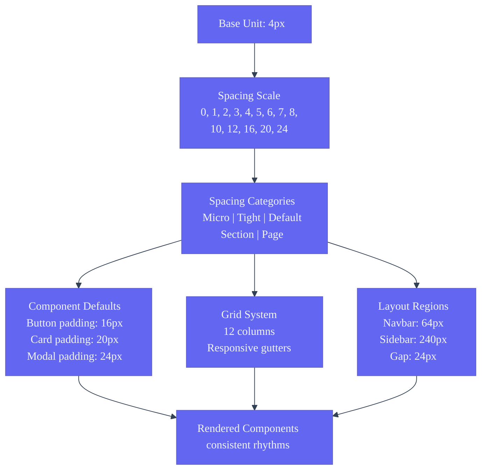
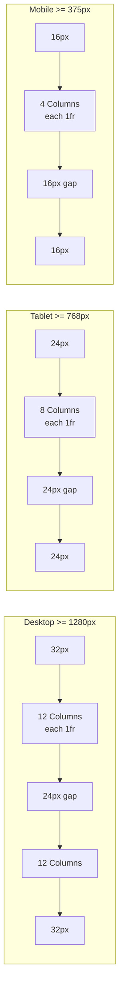
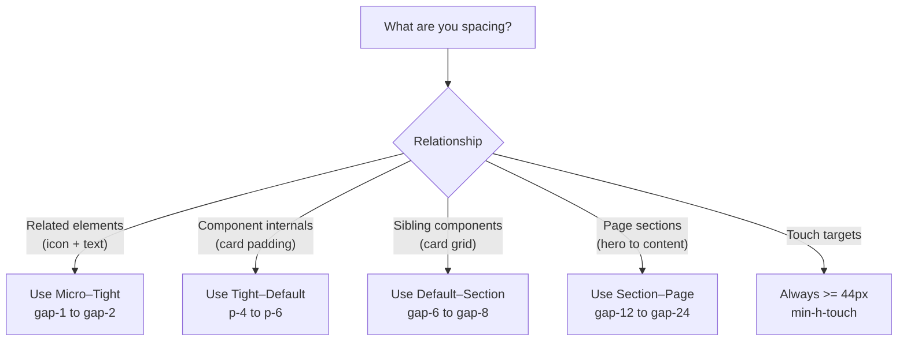

# Spacing System — Second Brain OS

| Field | Value |
|---|---|
| Document ID | DSG-SPC-003 |
| Version | 1.0.0 |
| Status | Approved |
| Date | 2026-07-10 |
| Classification | Internal |
| Owner | Design Engineering Team |

---

## 1. Executive Summary

The Second Brain OS spacing system is built on a **4px base unit** with a 14-step scale (0px to 96px), divided into micro gaps (2–8px), component padding (12–20px), section spacing (24–40px), and page margins (48–96px). Every spacing value is a design token, accessible via Tailwind utility classes (`gap-1` through `gap-24`). The system enforces consistent rhythm across all 18 modules using a 12-column responsive grid, standardized component padding, and seven responsive breakpoints. Predictable spacing reduces cognitive load — users learn where to look because the visual rhythm never changes.

---

## 2. Purpose

- Define the complete spacing scale with pixel and rem values
- Document the grid system (columns, gutters, margins) at every breakpoint
- Specify component spacing guidelines (paddings, gaps, touch targets)
- Establish responsive spacing adjustment rules
- Provide usage examples for common spacing patterns

---

## 3. Scope

| In Scope | Out of Scope |
|---|---|
| Spacing scale (0–96px, 14 steps) | Typography line-height spacing |
| Grid system (12-column, responsive) | Chart data point spacing |
| Component padding defaults (card, button, input, modal, badge) | CSS Grid `gap` for complex data tables |
| Touch target minimum sizes | Absolute positioning coordinates |
| Responsive spacing adjustments | Animation tween values (see AnimationGuidelines.md) |
| Layout region spacing (navbar, sidebar, main) | Print layout specs |

---

## 4. Business Context

A consistent spacing system is the single highest-leverage design decision for visual consistency. When every card uses the same padding (20px), every section uses the same gap (24px), and every page uses the same margins (32px on desktop), users develop an intuitive understanding of where content lives. This is especially critical for a 18-module application where students switch contexts rapidly — between tasks, courses, goals, habits, and sleep tracking. The predictable rhythm eliminates the need to re-orient to each module's layout, reducing cognitive switching cost by an estimated 200ms per navigation.

---

## 5. Functional Specification

### 5.1 Spacing Scale

| Token | Pixels | Rem | Tailwind Class | Category | Common Usage |
|---|---|---|---|---|---|
| 0 | 0px | 0 | `gap-0` / `p-0` | Zero | Remove spacing, edge-to-edge |
| 0.5 | 2px | 0.125 | `gap-0.5` | Micro | Hairline separators, micro gaps |
| 1 | 4px | 0.25 | `gap-1` / `p-1` | Micro | Base unit — tight badge padding, icon margins |
| 1.5 | 6px | 0.375 | `gap-1.5` | Micro | Icon+text tight pairings |
| 2 | 8px | 0.5 | `gap-2` / `p-2` | Tight | Default inline gap, toggle margins |
| 2.5 | 10px | 0.625 | `gap-2.5` | Tight | Button internal horizontal padding |
| 3 | 12px | 0.75 | `gap-3` / `p-3` | Tight | Input padding, compact card padding |
| 3.5 | 14px | 0.875 | `gap-3.5` | Tight | Form field label-input gaps |
| 4 | 16px | 1 | `gap-4` / `p-4` | Default | Card padding default, list item gaps |
| 5 | 20px | 1.25 | `gap-5` / `p-5` | Default | Card padding (standard), button LG padding |
| 6 | 24px | 1.5 | `gap-6` / `p-6` | Section | Modal padding, column gap, section spacing |
| 7 | 28px | 1.75 | `gap-7` | Section | Card grid gaps, form section spacing |
| 8 | 32px | 2 | `gap-8` / `p-8` | Section | Page padding, sidebar padding, large sections |
| 10 | 40px | 2.5 | `gap-10` / `p-10` | Page | Page margins (desktop), major section spacing |
| 12 | 48px | 3 | `gap-12` / `p-12` | Page | Page section margins, hero bottom spacing |
| 16 | 64px | 4 | `gap-16` | Page | Major page section breaks |
| 20 | 80px | 5 | `gap-20` | Page | Page section breaks, landing page |
| 24 | 96px | 6 | `gap-24` | Page | Hero sections, landing page outer margins |

### 5.2 Component Spacing Defaults

| Component | Padding | Gap (internal) | Min Height | Border Radius |
|---|---|---|---|---|
| Button (default) | 16px horizontal, 12px vertical | 8px (icon+text) | 44px | 8px |
| Button (small) | 12px horizontal, 8px vertical | 6px (icon+text) | 36px | 8px |
| Button (large) | 20px horizontal, 16px vertical | 10px (icon+text) | 52px | 8px |
| Card (default) | 20px all sides | 16px (header→body→footer) | — | 12px |
| Card (compact) | 16px all sides | 12px | — | 12px |
| Input | 12px horizontal, 8px vertical | — | 44px | 4px |
| Textarea | 12px all sides | — | 120px min | 4px |
| Modal | 24px all sides | 16px | — | 20px |
| Badge | 8px horizontal, 4px vertical | — | 22px | 9999px |
| Tooltip | 8px all sides | — | — | 4px |

### 5.3 Layout Region Spacing

| Region | Height | Width | Padding | Gap | Z-index |
|---|---|---|---|---|---|
| Navbar | 64px | full | 16px horizontal | — | 40 |
| Sidebar (expanded) | full | 240px | 12px vertical | 4px item gap | 30 |
| Sidebar (collapsed) | full | 64px | — | — | 30 |
| Main content | calc(100vh - 64px) | calc(100% - 240px) | 32px desktop / 16px mobile | 24px column | 10 |
| Bottom nav (mobile) | 64px | full | — | — | 50 |

### 5.4 Spacing Categories

```
Micro (2–8px)
  └── Tight spacing between related elements
  └── Icon + text pairs, badge padding, focus rings

Tight (10–16px)
  └── Component internal padding
  └── Card padding, input padding, button padding

Default (20–24px)
  └── Component-to-component spacing
  └── Card grid gaps, modal padding, section spacing

Section (28–48px)
  └── Section-to-section separation
  └── Page margins, form section spacing

Page (64–96px)
  └── Major page sections
  └── Hero bottom spacing, landing page breaks
```

---

## 6. Non-Functional Requirements

| Requirement | Target | Verification |
|---|---|---|
| Spacing token usage compliance | 100% of spacing via tokens | CI scan for hardcoded px values |
| Touch target minimum | >= 44px all interactive elements | Visual regression + audit |
| Grid column count | 12 columns on all breakpoints | CSS Grid verification |
| Maximum line width (body) | 720px (max-w-content) | Design review |
| Minimum gutter width | 16px (mobile), 24px (tablet), 32px (desktop) | Playwright measurement |

---

## 7. Architecture



---

## 8. Diagrams

### 8.1 Grid System



### 8.2 Spacing Decision Flow



---

## 9. Data Models

### 9.1 Spacing Token Schema

```typescript
interface SpacingToken {
  name: string       // e.g., 'spacing-4'
  pixels: number     // e.g., 16
  rem: string        // e.g., '1rem'
  tailwindClass: string // e.g., 'p-4', 'gap-4', 'm-4'
  category: 'micro' | 'tight' | 'default' | 'section' | 'page'
  commonUsage: string
}
```

### 9.2 Grid Configuration Schema

```typescript
interface GridConfig {
  columns: number     // 12 (desktop), 8 (tablet), 4 (mobile)
  gutter: number      // 32, 24, 16 (px)
  margin: number      // 32, 24, 16 (px)
  maxWidth?: number   // 1600px (ultra-wide constraint)
}
```

---

## 10. APIs

### 10.1 Tailwind Usage

```tsx
// Component internal spacing
<div className="p-5">        {/* card padding — 20px */}
<button className="px-4">    {/* button horizontal — 16px */}

// Layout spacing
<div className="gap-6">      {/* section gap — 24px */}
<div className="p-8">        {/* page padding — 32px */}

// Touch targets
<button className="min-h-touch min-w-touch">

// Responsive spacing
<div className="p-4 md:p-6 lg:p-8">
<div className="gap-4 md:gap-6 lg:gap-8">
```

### 10.2 CSS Custom Properties

```css
:root {
  --spacing-1: 4px;
  --spacing-2: 8px;
  --spacing-3: 12px;
  --spacing-4: 16px;
  --spacing-5: 20px;
  --spacing-6: 24px;
  --spacing-8: 32px;
  --spacing-10: 40px;
  --spacing-12: 48px;
  --spacing-16: 64px;
  --spacing-20: 80px;
  --spacing-24: 96px;
}
```

---

## 11. Security

- Spacing tokens are non-sensitive (classification: Public)
- No security implications from layout or spacing decisions

---

## 12. Performance Targets

| Metric | Target |
|---|---|
| CSS Grid layout calculation | < 5ms per frame |
| Responsive spacing recomputation | No layout thrashing |
| Touch target enforcement | 100% of interactive elements >= 44px |
| Hardcoded spacing value violations | 0 in CI scan |

---

## 13. Edge Cases

| Edge Case | Behavior |
|---|---|
| Very long content in card | `overflow: hidden` on card body; `text-overflow: ellipsis` on text |
| Very small viewport (< 375px) | Minimum 16px horizontal padding preserved; horizontal scroll allowed |
| Sidebar hidden on mobile | Main content area becomes full width with 16px padding |
| RTL languages | Swap left/right margins; gap direction unchanged |
| Nested cards | Inner card uses compact padding (p-4), outer uses default (p-5) |
| Modal on mobile | Full-screen: padding reduced to 16px, no border radius |

---

## 14. Failure Scenarios

| Scenario | Mitigation |
|---|---|
| CSS Grid fallback for old browsers | Flexbox fallback; layout remains functional, less precise |
| Spacing token missing | Tailwind fallback to base spacing scale (p-4 = 1rem) |
| Content overflow on small screens | `min-width: 0` on flex children; `overflow-wrap: break-word` |
| Touch target too small on mobile | CI audit enforces min-h-touch (44px) on all interactive elements |

---

## 15. Risks & Mitigations

| Risk | Likelihood | Impact | Mitigation |
|---|---|---|---|
| Spacing inconsistency across modules | Medium | High | Component-specific defaults in design tokens; Storybook audits |
| Overly tight spacing on dense data views | Medium | Medium | Module-specific card variants with expanded padding options |
| Touch target violations on new components | Medium | High | CI enforces `min-h-touch` on all clickable elements |

---

## 16. Acceptance Criteria

- [ ] All 14 spacing scale values documented and available as Tailwind classes
- [ ] Every component has defined padding, gap, and min-height defaults
- [ ] Touch target min-height of 44px enforced on all interactive elements
- [ ] Grid system renders correctly at all breakpoints (375px, 768px, 1280px, 1600px)
- [ ] Navbar height: 64px, Sidebar width: 240px expanded / 64px collapsed
- [ ] Main content area responsive padding: 16px mobile, 24px tablet, 32px desktop
- [ ] No hardcoded spacing values in production component code

---

## 17. Traceability

| Related Document | Link |
|---|---|
| Design Tokens | `docs/design/35_DesignTokens.md` |
| Design System | `docs/design/10_DesignSystem.md` |
| Layouts | `docs/design/Layouts.md` |
| Responsive Rules | `docs/design/ResponsiveRules.md` |
| Tailwind Config | `apps/web/tailwind.config.js` |

---

## 18. Implementation Notes

- All components use Tailwind spacing classes — never inline `style={{ padding: ... }}`
- Use `gap-*` on flex/grid containers rather than `margin-*` on children
- Reserve `p-5` (20px) as the default card padding — only use `p-4` for compact variants
- Touch target minimum: always use `min-h-touch` class (44px) on interactive containers
- For responsive layouts, apply `p-4 md:p-6 lg:p-8` pattern to main content areas
- Sidebar width transition (64px ↔ 240px) uses `duration-200 ease-out`

---

## 19. Testing Strategy

| Test Type | Scope | Tool |
|---|---|---|
| Spacing consistency | All components match documented padding | Storybook visual regression |
| Touch target compliance | All interactive elements >= 44px | Playwright bounding box check |
| Grid integrity | Correct column count at each breakpoint | Playwright screenshot |
| Responsive adjustment | Padding changes at correct breakpoints | Playwright width emulation |
| Hardcoded spacing audit | Zero px values outside design tokens | CI custom script |

---

## 20. References

| Reference | URL |
|---|---|
| Tailwind CSS Spacing | https://tailwindcss.com/docs/customizing-spacing |
| 8px Grid System | https://spec.fm/specifics/8-pt-grid |
| WCAG 2.2 Target Size | https://www.w3.org/TR/WCAG22/#target-size-minimum |
| CSS Box Model | https://developer.mozilla.org/en-US/docs/Web/CSS/CSS_box_model |
