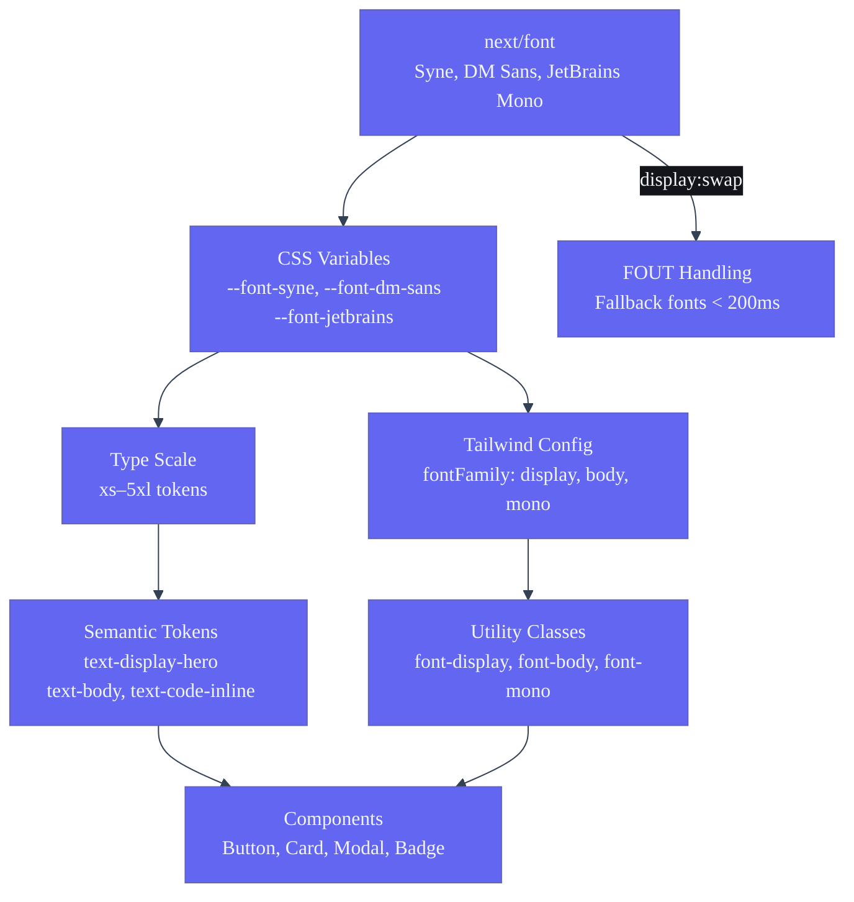
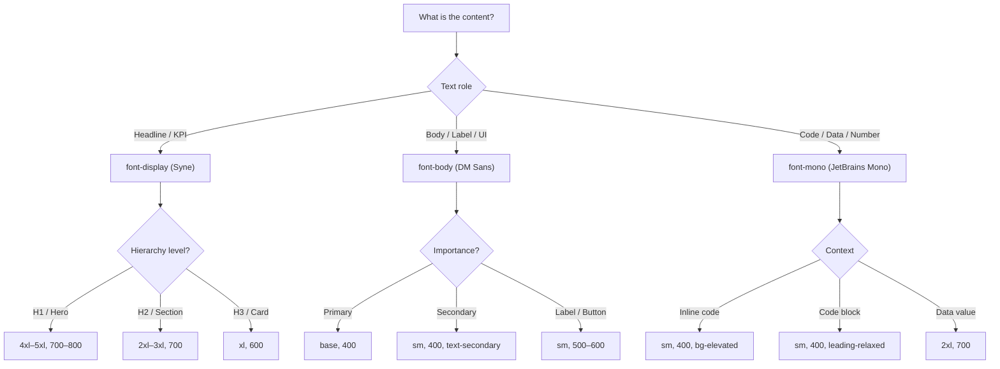

# Typography System — Second Brain OS

| Field | Value |
|---|---|
| Document ID | DSG-TYP-002 |
| Version | 1.0.0 |
| Status | Approved |
| Date | 2026-07-10 |
| Classification | Internal |
| Owner | Design Engineering Team |

---

## 1. Executive Summary

The Second Brain OS typography system uses a three-font stack: **Syne** for display and headings (geometric, distinctive, cyberpunk), **DM Sans** for body text (humanist, readable, versatile), and **JetBrains Mono** for code and data (programmer-friendly ligatures, zero distinction). The type scale spans 9 sizes from 11px to 56px, with 5 weight levels (400–800). Every size, weight, line height, and letter-spacing value is defined as a design token and exposed through Tailwind utility classes. The system targets WCAG AA readability with minimum 11px for captions and 15px for body text.

---

## 2. Purpose

- Define the complete type scale with exact sizing, line heights, and letter spacing
- Document font family selection rationale and loading strategy
- Specify semantic typography tokens for every text role (heading, body, label, code, data)
- Establish responsive type adjustments across breakpoints
- Provide usage examples for every typographic style

---

## 3. Scope

| In Scope | Out of Scope |
|---|---|
| Font family definitions (Syne, DM Sans, JetBrains Mono) | Icon font specifications (see Icons.md) |
| Type scale (9 sizes: xs through 5xl) | Third-party font licensing negotiation |
| Font weight scale (400, 500, 600, 700, 800) | Print typography specifications |
| Line height and letter spacing tokens | Email template typography |
| Semantic typography tokens (23 defined roles) | User-configurable font settings |
| Responsive type scale adjustments | RTL language typography |

---

## 4. Business Context

Typography is the primary vehicle for information hierarchy in Second Brain OS. Students scan dashboards for KPI values in Syne bold, read course descriptions in DM Sans, and examine code snippets in JetBrains Mono. The font choice directly impacts reading speed, comprehension, and perceived aesthetic quality. Syne was chosen for its geometric distinction — it signals "cyberpunk tool, not generic productivity app." DM Sans provides superior readability at small sizes for dense data displays. JetBrains Mono includes coding ligatures and clear zero/O distinction essential for data visualization labels.

---

## 5. Functional Specification

### 5.1 Font Family Specifications

| Token | Font | CSS Variable | Weight Available | Characteristics | Usage |
|---|---|---|---|---|---|
| `font-display` | Syne | `--font-syne` | 400, 500, 600, 700, 800 | Geometric sans, wide apertures, distinctive 'S' glyph | Headings, display text, KPIs, hero titles |
| `font-body` | DM Sans | `--font-dm-sans` | 400, 500, 600, 700 | Humanist sans, excellent readability, compact metrics | Body text, labels, buttons, navigation |
| `font-mono` | JetBrains Mono | `--font-jetbrains` | 400, 500, 700 | Coding ligatures, zero slash, clear I/l/1 distinction | Code, numbers, data grids, timestamps |

### 5.2 Type Scale

| Token | Size | Line Height | Letter Spacing | Tailwind Class | Font Family | Weight | Usage |
|---|---|---|---|---|---|---|---|
| xs | 11px | 16px (1.45) | 0.02em | `text-xs` | DM Sans | 400–600 | Captions, timestamps, badges, overline labels |
| sm | 13px | 18px (1.38) | 0.01em | `text-sm` | DM Sans | 400–600 | Metadata, secondary text, labels, table cells |
| base | 15px | 24px (1.6) | 0em | `text-base` | DM Sans | 400–600 | Body text, input values, paragraphs |
| lg | 17px | 26px (1.53) | 0em | `text-lg` | DM Sans | 400–700 | Card titles, form labels, large body |
| xl | 19px | 28px (1.47) | -0.01em | `text-xl` | Syne | 600–800 | Section headings, modal titles, KPI values |
| 2xl | 24px | 32px (1.33) | -0.02em | `text-2xl` | Syne | 600–800 | Page headings (H2), dashboard section titles |
| 3xl | 32px | 38px (1.19) | -0.02em | `text-3xl` | Syne | 700–800 | Page titles (H1), hero headings |
| 4xl | 42px | 48px (1.14) | -0.03em | `text-4xl` | Syne | 700–800 | Hero titles, landing page headers |
| 5xl | 56px | 62px (1.1) | -0.03em | `text-5xl` | Syne | 800 | Display hero, landing page, branding |

### 5.3 Font Weight Scale

| Token | Value | Tailwind Class | Usage |
|---|---|---|---|
| normal | 400 | `font-normal` | Body text, paragraphs, descriptions |
| medium | 500 | `font-medium` | Labels, navigation items, emphasized body |
| semibold | 600 | `font-semibold` | Button labels, card titles, table headers |
| bold | 700 | `font-bold` | Headings (H2), KPI values, strong emphasis |
| extrabold | 800 | `font-extrabold` | Page titles (H1), hero display text |

### 5.4 Semantic Typography Tokens

| Token | Size | Weight | Family | Line Height | Tailwind | Usage |
|---|---|---|---|---|---|---|
| `text-display-hero` | 5xl | 800 | display | 1.1 | `text-5xl font-extrabold font-display` | Landing page hero |
| `text-display-page-title` | 4xl | 700 | display | 1.14 | `text-4xl font-bold font-display` | Page title (H1) |
| `text-heading-section` | 2xl | 700 | display | 1.33 | `text-2xl font-bold font-display` | Section heading (H2) |
| `text-heading-card` | xl | 600 | display | 1.47 | `text-xl font-semibold font-display` | Card title (H3) |
| `text-heading-modal` | xl | 600 | display | 1.47 | `text-xl font-semibold font-display` | Modal title |
| `text-body` | base | 400 | body | 1.6 | `text-base font-normal font-body` | Paragraph body |
| `text-body-large` | lg | 400 | body | 1.53 | `text-lg font-normal font-body` | Large body / feature description |
| `text-body-small` | sm | 400 | body | 1.38 | `text-sm font-normal font-body` | Secondary body, helper text |
| `text-label` | sm | 500 | body | 1.38 | `text-sm font-medium font-body` | Form labels |
| `text-caption` | xs | 400 | body | 1.45 | `text-xs font-normal font-body` | Captions, timestamps |
| `text-overline` | xs | 600 | body | 1.45 | `text-xs font-semibold font-body uppercase tracking-wider` | Overline labels |
| `text-button` | sm | 600 | body | 1.38 | `text-sm font-semibold font-body` | Button labels |
| `text-button-large` | base | 600 | body | 1.6 | `text-base font-semibold font-body` | Large button labels |
| `text-link` | base | 500 | body | 1.6 | `text-base font-medium font-body text-accent-primary` | Inline links |
| `text-input` | base | 400 | body | 1.6 | `text-base font-normal font-body` | Input field values |
| `text-placeholder` | base | 400 | body | 1.6 | `text-base font-normal font-body text-text-tertiary` | Placeholder text |
| `text-data-value` | 2xl | 700 | mono | 1.33 | `text-2xl font-bold font-mono` | KPI metric values |
| `text-data-label` | sm | 500 | body | 1.38 | `text-sm font-medium font-body text-text-secondary` | KPI metric labels |
| `text-code-inline` | sm | 400 | mono | 1.38 | `text-sm font-normal font-mono bg-background-elevated px-1 rounded` | Inline code snippets |
| `text-code-block` | sm | 400 | mono | 1.7 | `text-sm font-normal font-mono leading-relaxed` | Code block content |
| `text-table-header` | sm | 600 | body | 1.38 | `text-sm font-semibold font-body text-text-secondary` | Table column headers |
| `text-table-cell` | sm | 400 | body | 1.38 | `text-sm font-normal font-body` | Table cell content |
| `text-badge` | xs | 600 | body | 1.45 | `text-xs font-semibold font-body` | Badge labels |
| `text-tooltip` | xs | 400 | body | 1.45 | `text-xs font-normal font-body` | Tooltip content |

### 5.5 Line Height Tokens

| Token | Value | Tailwind Class | Usage |
|---|---|---|---|
| tight | 1.2 | `leading-tight` | Display text, headings, hero titles |
| snug | 1.35 | `leading-snug` | Card titles, section headings |
| normal | 1.5 | `leading-normal` | Body text, paragraphs |
| relaxed | 1.7 | `leading-relaxed` | Long-form reading, code blocks |

### 5.6 Responsive Type Scale

| Token | Mobile (< 768px) | Tablet (768–1024px) | Desktop (> 1024px) |
|---|---|---|---|
| xs | 11px | 11px | 11px |
| sm | 13px | 13px | 13px |
| base | 15px | 15px | 15px |
| lg | 16px | 17px | 17px |
| xl | 18px | 19px | 19px |
| 2xl | 22px | 24px | 24px |
| 3xl | 28px | 32px | 32px |
| 4xl | 32px | 38px | 42px |
| 5xl | 40px | 48px | 56px |

---

## 6. Non-Functional Requirements

| Requirement | Target | Verification |
|---|---|---|
| Body text readability at 15px on dark background | 4.5:1 minimum contrast | Contrast scan |
| Font loading impact on FCP | < 100ms additional | Lighthouse audit |
| Font file total size | < 120KB (all 3 families, woff2) | Bundle analyzer |
| Fallback font flash (FOUT) duration | < 200ms | Performance measurement |
| Line length for readable body text | 60–75 characters per line | Visual inspection |
| Minimum text size for accessibility | 11px (xs token) | Design review |

---

## 7. Architecture



---

## 8. Diagrams

### 8.1 Typography Decision Flow



### 8.2 Type Scale Visual Reference

```
5xl ─── 56px ─── Syne 800 ─── Hero Display
4xl ─── 42px ─── Syne 700 ─── Page Title
3xl ─── 32px ─── Syne 700 ─── Section Title
2xl ─── 24px ─── Syne 600 ─── Card Title
 xl ─── 19px ─── Syne 600 ─── Subheading
 lg ─── 17px ─── DM Sans 500 ── Large Body
base ─── 15px ─── DM Sans 400 ── Body Text
 sm ─── 13px ─── DM Sans 400 ── Secondary
 xs ─── 11px ─── DM Sans 400 ── Caption
```

---

## 9. Data Models

### 9.1 Typography Token Schema

```typescript
interface TypographyToken {
  name: string
  size: number        // px
  lineHeight: number  // unitless or px
  letterSpacing: string // em
  fontFamily: 'display' | 'body' | 'mono'
  fontWeight: 400 | 500 | 600 | 700 | 800
  tailwindClass: string
  semanticRole?: string
  usage: string
}
```

### 9.2 Font Loading Configuration

```typescript
// app/layout.tsx
import { Syne, DM_Sans, JetBrains_Mono } from 'next/font/google'

const syne = Syne({
  subsets: ['latin'],
  weight: ['400', '500', '600', '700', '800'],
  variable: '--font-syne',
  display: 'swap',
})

const dmSans = DM_Sans({
  subsets: ['latin'],
  weight: ['400', '500', '600', '700'],
  variable: '--font-dm-sans',
  display: 'swap',
})

const jetbrainsMono = JetBrains_Mono({
  subsets: ['latin'],
  weight: ['400', '500', '700'],
  variable: '--font-jetbrains',
  display: 'swap',
})
```

---

## 10. APIs

### 10.1 CSS Variable Usage

```css
.heading-card {
  font-family: var(--font-syne), 'Syne', system-ui, sans-serif;
  font-size: 19px;
  font-weight: 600;
  line-height: 1.47;
}
```

### 10.2 Tailwind Usage

```tsx
<h1 className="text-4xl font-bold font-display">Page Title</h1>
<p className="text-base font-normal font-body text-text-secondary">Body text</p>
<code className="text-sm font-mono">const x = 42</code>
<span className="text-data-value">1,247</span> {/* KPI value */}
```

---

## 11. Security

- Google Fonts are loaded with `display:swap` and `subsets:['latin']` only
- No font files are self-hosted with embedded secrets
- Font loading is non-blocking and does not affect security posture

---

## 12. Performance Targets

| Metric | Target |
|---|---|
| Font file total (3 families, woff2) | < 120KB |
| FOUT duration | < 200ms |
| Cumulative Layout Shift from font swap | 0 (zero) |
| Font loading impact on LCP | < 50ms |
| CSS custom property count | < 30 typography tokens |

---

## 13. Edge Cases

| Edge Case | Behavior |
|---|---|
| Font fails to load | Fallback to system-ui, sans-serif, monospace |
| User has system font scaling at 150% | All sizes scale proportionally; min 11px enforced |
| CJK characters in Syne (no CJK support) | Fallback to system sans-serif for unsupported glyphs |
| Very long heading text | `text-balance` with word-break; max-width 60ch on body |
| Screen reader output | All text content is semantic HTML, not images of text |
| Hyphenation in long-form content | `overflow-wrap: break-word` as default |

---

## 14. Failure Scenarios

| Scenario | Mitigation |
|---|---|
| Google Fonts CDN unavailable | System fonts serve as immediate fallback; FOUT only |
| Font file corrupted | `display:swap` ensures text is always visible |
| Variable font axes not supported | Static font weights served for backward compatibility |
| Preload conflicts with other resources | Font preload in `<head>` with `crossorigin` attribute |

---

## 15. Risks & Mitigations

| Risk | Likelihood | Impact | Mitigation |
|---|---|---|---|
| Syne font not available on CDN | Low | Medium | Next.js self-hosts via `next/font` |
| Font switching causes layout shift | Low | High | `size-adjust` in `@font-face` fallback; `font-display: swap` |
| Text overflow in data displays | Medium | Medium | `overflow: hidden text-overflow: ellipsis` on data-value |

---

## 16. Acceptance Criteria

- [ ] All 9 type scale sizes render correctly in browser
- [ ] Syne applied to all headings (H1–H3), KPI values, and display text
- [ ] DM Sans applied to all body text, labels, buttons, and navigation
- [ ] JetBrains Mono applied to all code, data grid values, and timestamps
- [ ] Font loading with `display: swap` shows text within 200ms
- [ ] No cumulative layout shift from font swap
- [ ] All 23 semantic typography tokens have corresponding Tailwind classes
- [ ] Responsive type scale adjusts at 768px and 1024px breakpoints

---

## 17. Traceability

| Related Document | Link |
|---|---|
| Design Tokens | `docs/design/35_DesignTokens.md` |
| Design System | `docs/design/10_DesignSystem.md` |
| Colors | `docs/design/Colors.md` |
| Tailwind Config | `apps/web/tailwind.config.js` |
| Layout File | `apps/web/app/layout.tsx` |

---

## 18. Implementation Notes

- Fonts loaded via `next/font/google` with `variable` font-face strategy
- `display: swap` ensures text remains visible during font load
- Add new font weights to both `next/font` config and `tailwind.config.js` fontWeight
- Never apply `font-display` to body text — reserve Syne for display roles only
- Use `text-balance` on headings to prevent orphaned words
- For code blocks, wrap in `<pre>` tag with `leading-relaxed` and horizontal scroll

---

## 19. Testing Strategy

| Test Type | Scope | Tool |
|---|---|---|
| Font loading | FOUT duration < 200ms | WebPageTest filmstrip |
| Typography rendering | All 23 semantic tokens render correctly | Storybook visual regression |
| Accessibility | Minimum 11px text, 4.5:1 contrast | axe-core |
| Responsive type scale | Correct at mobile, tablet, desktop | Playwright screenshot |
| Font fallback | Text visible without CDN | DevTools network throttling |

---

## 20. References

| Reference | URL |
|---|---|
| Syne on Google Fonts | https://fonts.google.com/specimen/Syne |
| DM Sans on Google Fonts | https://fonts.google.com/specimen/DM+Sans |
| JetBrains Mono on Google Fonts | https://fonts.google.com/specimen/JetBrains+Mono |
| next/font Documentation | https://nextjs.org/docs/app/api-reference/components/font |
| WCAG 2.2 Text Spacing | https://www.w3.org/TR/WCAG22/#text-spacing |
