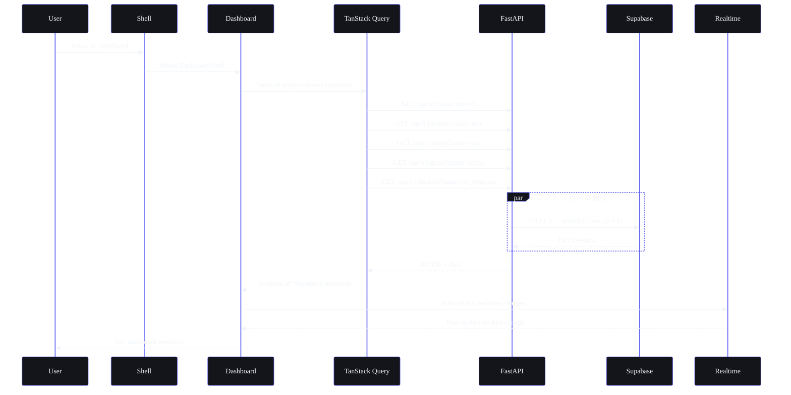
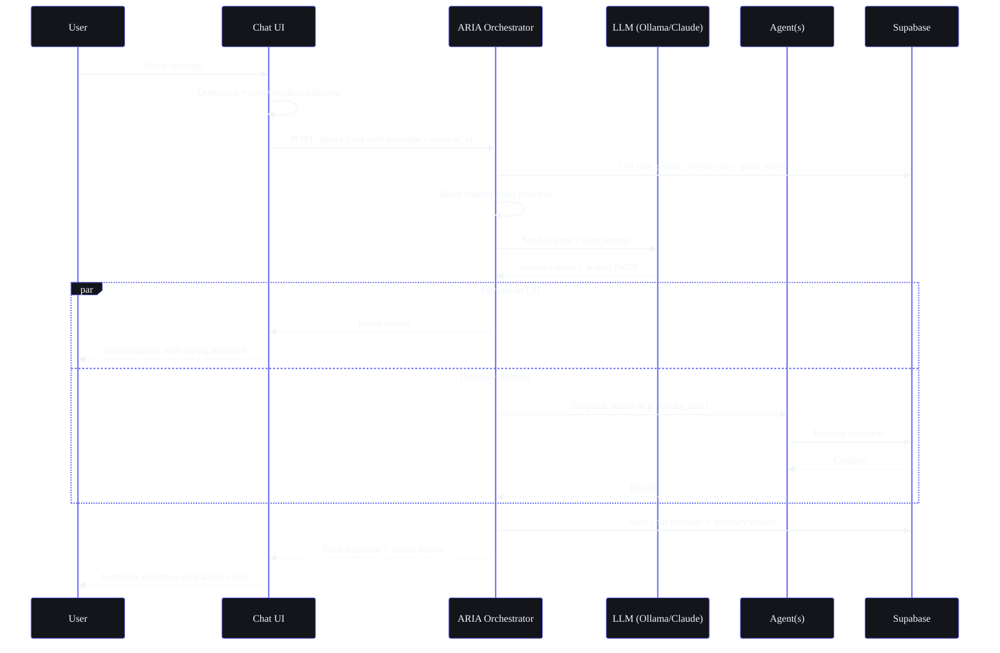

## Document Control

| Field | Value |
|---|---|
| Document ID | DSG-WF01-001 |
| Version | 1.0.0 |
| Status | Active |
| Last Updated | 2026-07-11 |

# Part I — User Flows (17 Modules)

> **Part of the Workflow Architecture (SB-WFARCH-001). See `README.md` for document control and notation key.**
> Related: `UserFlows.md` (product-level user flows), `02-FeatureFlows.md` (feature-level end-to-end flows).

---

## Table of Contents

1.1 [Dashboard](#11-dashboard)
1.2 [Tasks](#12-tasks)
1.3 [Courses](#13-courses)
1.4 [Goals](#14-goals)
1.5 [Habits](#15-habits)
1.6 [Sleep](#16-sleep)
1.7 [Income](#17-income)
1.8 [Projects](#18-projects)
1.9 [Ideas](#19-ideas)
1.10 [Resources](#110-resources)
1.11 [Opportunities](#111-opportunities)
1.12 [Time Tracking](#112-time-tracking)
1.13 [Chat / ARIA](#113-chat--aria)
1.14 [Automation](#114-automation)
1.15 [Academics](#115-academics)
1.16 [YouTube Vault](#116-youtube-vault)
1.17 [Memory](#117-memory)

---

## Module User Flow Template

Every module in this section follows this structure:

```
┌──────────────────────────────────────────────┐
│              MODULE USER FLOW                │
├──────────────────────────────────────────────┤
│ Entry Points                                 │
│   • Navigation (sidebar nav item)            │
│   • Dashboard widget click                   │
│   • Quick Capture (Cmd+K shortcut)           │
│   • Notification tap                         │
│   • Deep link (external/email)               │
│   • AI suggestion acceptance                 │
│   • Command palette command                  │
│                                              │
│ Primary Actions                              │
│   • Create / Edit / Delete / Complete        │
│   • Each with success + failure paths        │
│                                              │
│ Secondary Actions                            │
│   • Sort / Filter / Search / Export          │
│   • Bulk operations                          │
│   • Share / Archive / Restore                │
│                                              │
│ AI-Assisted Actions                          │
│   • "Ask ARIA to..." per module context      │
│   • Auto-suggest on create                   │
│   • Pattern detection triggers               │
│                                              │
│ Exit Points                                  │
│   • Navigation away                          │
│   • Modal close / Esc                        │
│   • Action completed → toast → auto-return   │
│   • Session timeout                          │
│                                              │
│ Success Paths (Mermaid sequence diagram)     │
│   • Happy path with optimistic update        │
│   • Realtime sync confirmation               │
│   • State transitions                        │
│                                              │
│ Failure Paths (Mermaid decision tree)        │
│   • Network error → retry with backoff       │
│   • Validation error → inline field error    │
│   • Auth error → re-auth flow                │
│   • Rate limit → cooldown indicator          │
│   • Circuit breaker → degraded mode          │
└──────────────────────────────────────────────┘
```

---

## 1.1 Dashboard

**Route:** `/dashboard`
**Type:** Landing page after auth
**Purpose:** At-a-glance status across all modules
**Target Load Time:** < 1.5s initial paint, < 3s fully interactive
**Refetch Interval:** On focus + every 60s + realtime subscriptions

### Entry Points

| Entry | Trigger | Behavior |
|---|---|---|
| Login / Sign-up | OAuth success | Full page load → {Loading} → {Populated} |
| App Shell nav | Sidebar logo click | Instant (CSR) from any route |
| Browser | Direct URL / bookmark | Full page load → {Loading} → {Populated} |
| Notification tap | Click notification bell | Deep link → scroll to widget |
| Quick Capture dismiss | Escape / Submit | Return to {Populated} state |

### Primary Actions

| Action | Trigger | Flow |
|---|---|---|
| View Briefing | Morning widget | Expand briefing card → stream full text |
| Navigate to module | Click widget | Route transition to target module |
| Quick Capture | Cmd+K / + button | Open command palette from any state |
| Complete task | Checkbox on widget | Optimistic update → API call → streak check |
| View AI insight | Insight card click | Expand insight → show detail → action buttons |

### Secondary Actions

| Action | Trigger | Behavior |
|---|---|---|
| Reorder widgets | Drag handle | Local state → persist to preferences |
| Customize dashboard | Gear icon | Open customization modal → save layout |
| Refresh data | Pull-to-refresh / R | All widgets refetch in parallel |
| Export dashboard | Export button | PDF snapshot of current view |
| Collapse widget | Chevron toggle | Local state only |

### AI-Assisted Actions

| Action | Agent | Behavior |
|---|---|---|
| "What should I focus on?" | @briefing_agent | Streams priority suggestions into focus widget |
| "Summarize yesterday" | @memory_agent | Generates yesterday's activity summary card |
| "Am I on track?" | @learning_agent | Analyzes goal progress → color-coded status |
| "Any opportunities?" | @opportunity_agent | Recent matches widget refreshes |

### Exit Points

| Exit | Trigger | Behavior |
|---|---|---|
| Navigate to module | Click sidebar icon | CSR route transition |
| Session timeout | 30 min inactivity | Redirect to login with save-state toast |
| Logout | Profile menu → Logout | Clear client cache → redirect to /login |
| Close tab | Browser close | State persisted in localStorage |

### Success Paths



### Failure Paths

```mermaid
%%{init: {'theme': 'base', 'themeVariables': {'background': '#0A0B0F', 'primaryColor': '#13151A', 'primaryBorderColor': '#6366F1', 'primaryTextColor': '#F1F5F9', 'lineColor': '#818CF8', 'secondaryColor': '#1A1D24', 'tertiaryColor': '#EF4444', 'fontFamily': 'DM Sans'}}}%%
flowchart TD
    A[Dashboard mounts] --> B{Network available?}
    B -->|No| C[Show cached data + offline banner]
    C --> D{Stale cache?}
    D -->|> 5 min| E[Show skeleton + "Waiting for connection"]
    D -->|< 5 min| F[Show cached dashboard]
    B -->|Yes| G[Fetch all widget queries]
    G --> H{Any query fails?}
    H -->|No| I[Render full dashboard]
    H -->|Yes| J{Retry 3x?}
    J -->|Succeeds| I
    J -->|Fails| K[Show per-widget error card]
    K --> L[Error card: retry button + last known value]
    L --> M[User clicks retry]
    M --> G

    style K fill:#13151A,stroke:#EF4444,color:#F1F5F9
    style C fill:#13151A,stroke:#F59E0B,color:#F1F5F9
```

---

## 1.2 Tasks

**Route:** `/tasks`

### Entry Points
- **Primary:** Sidebar nav "Tasks" → `/tasks`
- **Dashboard widget:** Click task count → `/tasks` with filter
- **Quick Capture:** Cmd+K → "Add task" → modal → `/tasks` after save
- **Notification:** Task reminder tap → `/tasks/{id}`
- **AI suggestion:** "Add this task" → accept → modal → `/tasks`
- **Deep link:** `/tasks/{id}` from email/external

### Primary Actions
- **Create task:** Button → modal → fill → save → optimistic add to list
- **Complete task:** Checkbox → strike-through → confetti (streak) → next suggestion
- **Edit task:** Click → inline edit / side panel → save
- **Delete task:** Swipe / right-click → confirm dialog → remove
- **View task:** Click → detail panel (slide-over) → full info

### Secondary Actions
- **Sort:** Due date / priority / status / created date
- **Filter:** Status / priority / category / date range
- **Search:** Full-text search with fuzzy matching
- **Bulk actions:** Select multiple → complete / delete / reschedule / assign category
- **Export:** CSV / JSON of filtered list
- **Share:** Generate share link (future)

### AI-Assisted Actions

| Action | Agent | Behavior |
|---|---|---|
| "Break this down" | @task_agent | Creates 3-5 sub-tasks with estimated times |
| "What's urgent?" | @task_agent | Re-prioritizes based on deadlines + dependencies |
| "Suggest next task" | @task_agent | Context-aware recommendation based on time/energy |
| "Reschedule overdue" | @task_agent | Auto-suggest new dates based on calendar gaps |

### Exit Points
- **Nav away:** Sidebar click → auto-save any dirty form
- **Close detail panel:** Escape / click outside → return to list
- **Toast auto-dismiss:** After create/complete → 3s → fade
- **Session timeout:** Save in-progress edits to localStorage

### Success Paths

```mermaid
%%{init: {'theme': 'base', 'themeVariables': {'background': '#0A0B0F', 'primaryColor': '#13151A', 'primaryBorderColor': '#6366F1', 'primaryTextColor': '#F1F5F9', 'lineColor': '#818CF8', 'secondaryColor': '#1A1D24', 'tertiaryColor': '#00FFA3', 'fontFamily': 'DM Sans'}}}%%
flowchart TD
    A[User lands on /tasks] --> B{Has cached tasks?}
    B -->|Yes| C[Show cached list immediately]
    B -->|No| D[Show skeleton list]
    C --> E[Refetch in background]
    D --> E
    E --> F{Fetch succeeds?}
    F -->|Yes| G[Render populated list]
    F -->|No| H[Show error state with retry]
    H --> I[User clicks retry] --> E
    G --> J[User clicks +Add Task]
    J --> K[Create modal slides up]
    K --> L[User fills title, priority, due date]
    L --> M{AI auto-categorize?}
    M -->|Confidence > 80%| N[Show suggested category with badge]
    M -->|Confidence < 80%| O[Let user pick]
    N --> P[User submits]
    O --> P
    P --> Q[Optimistic add to list + spinner]
    Q --> R[POST /api/v1/tasks]
    R --> S{Success?}
    S -->|Yes| T[Replace spinner with checkmark]
    T --> U[Toast: "Task created"]
    U --> V[Realtime sync to other devices]
    S -->|No| W[Revert optimistic add]
    W --> X[Show error: "Could not save. Retry?"]
    X --> Y[User retries] --> R
```

---

## 1.3 Courses

**Route:** `/courses`

### Entry Points
- **Sidebar nav** "Courses" → `/courses`
- **Dashboard widget:** "3 courses in progress" → `/courses`
- **Notification:** Deadline reminder → `/courses/{id}`
- **Quick Capture:** Cmd+K → "Log course progress"
- **AI suggestion:** "You should review NPTEL ML" → `/courses/{id}`

### Primary Actions
- **Add course:** Button → modal → name, platform, deadline, hours/week
- **Log progress:** Click course → slider/input → update completion %
- **View course detail:** Click card → split view (info + progress + tasks)
- **Complete course:** Mark complete → skill update trigger → goal progress

### Secondary Actions
- **Filter:** Status (active/completed/dropped/planning)
- **Sort:** Deadline / progress / platform / name
- **Search:** Title, platform, instructor
- **Export:** Course transcript / progress report

### AI-Assisted Actions

| Action | Agent | Behavior |
|---|---|---|
| "Adjust daily target" | @nudge_agent | Recalculates based on deadline vs progress |
| "Suggest next course" | @roadmap_agent | Based on completed courses + career goals |
| "Detect struggle" | @learning_agent | Low progress + missed study tasks → intervention |

---

## 1.4 Goals

**Route:** `/goals`

### Entry Points
- **Sidebar nav** → `/goals`
- **Dashboard widget:** Goal progress rings → `/goals`
- **ARIA:** "Let's set a goal" → onboarding → goal wizard

### Primary Actions
- **Create goal:** Wizard → name, category, deadline, key results, milestones
- **Update progress:** Manual % update or auto from linked tasks
- **View goal detail:** Expand card → KRs → linked tasks → milestones → notes
- **Complete goal:** Mark complete → celebration animation → skill update

### Secondary Actions
- **Filter:** Status / category / timeline
- **Link tasks:** From goal detail → "Link existing task"
- **Share:** Goal progress snapshot (future)

### AI-Assisted Actions

| Action | Agent | Behavior |
|---|---|---|
| "Break into milestones" | @roadmap_agent | Suggests quarterly milestones with checkpoints |
| "Find related courses" | @learning_agent | Matches goal category to course catalog |
| "Predict completion" | @learning_agent | Based on pace vs deadline → alert if behind |

---

## 1.5 Habits

**Route:** `/habits`

### Entry Points
- **Sidebar nav** → `/habits`
- **Dashboard widget:** Streak card → `/habits`
- **Notification:** "Time for your habit" → log modal
- **ARIA:** "You missed a habit" → nudge notification

### Primary Actions
- **Create habit:** Name, frequency (daily/weekly), time of day, reminder toggle
- **Log habit:** Checkmark for today → streak update → motivational message
- **View history:** Calendar heatmap → per-habit streak view
- **Edit habit:** Frequency, time, reminders

### Secondary Actions
- **Pause habit:** Temporary freeze (vacation mode)
- **Archive habit:** Remove from active without deleting history
- **View streaks:** Current streak, longest streak, history

### AI-Assisted Actions

| Action | Agent | Behavior |
|---|---|---|
| "Suggest habit time" | @nudge_agent | Based on historical completion patterns |
| "Adjust frequency" | @learning_agent | Notices 80%+ completion → suggest increase |
| "Motivational nudge" | @nudge_agent | "You've done X for Y days straight!" |

---

## 1.6 Sleep

**Route:** `/sleep`

### Entry Points
- **Sidebar nav** → `/sleep`
- **Dashboard widget:** Last night's score → `/sleep`
- **ARIA:** Bedtime nudge at 9:30 PM → log modal
- **Morning briefing:** Sleep insight → `/sleep` detail

### Primary Actions
- **Log sleep:** Time to bed, time awake, quality rating (1-5)
- **View score:** Algorithmic score (0-100) based on duration + consistency + quality
- **View trends:** 7-day / 30-day charts
- **Set bedtime:** Target bedtime → reminder schedule

### Secondary Actions
- **Add notes:** Free text (what affected sleep)
- **Export:** Sleep report for health tracking
- **View debt:** Cumulative sleep debt calculation

### AI-Assisted Actions

| Action | Agent | Behavior |
|---|---|---|
| "Wind-down message" | @sleep_agent | Personalized bedtime story / reflection |
| "Analyze patterns" | @learning_agent | Correlates sleep with productivity scores |
| "Adjust briefing" | @briefing_agent | Low sleep → lighter task suggestions |

---

## 1.7 Income

**Route:** `/income`

### Entry Points
- **Sidebar nav** → `/income`
- **Dashboard widget:** Monthly income snapshot → `/income`

### Primary Actions
- **Log income:** Amount, source, date, type (freelance/internship/gig)
- **View analytics:** Monthly trends, hourly rate, source breakdown
- **Set target:** Monthly income goal → progress indicator

### Secondary Actions
- **Filter:** Date range / source / type
- **Export:** Income report for tax/financial tracking
- **Categorize:** Tag income sources

### AI-Assisted Actions

| Action | Agent | Behavior |
|---|---|---|
| "Predict next month" | @analytics_agent | Based on trends + seasonal patterns |
| "Find rate opportunities" | @opportunity_agent | Matches skills to paid opportunities |
| "Tax estimate" | @analytics_agent | Estimated tax liability based on income |

---

## 1.8 Projects

**Route:** `/projects`

### Entry Points
- **Sidebar nav** → `/projects`
- **Dashboard widget:** Active projects → `/projects`
- **ARIA:** "New project from idea" → import flow

### Primary Actions
- **Create project:** Name, description, repo link (optional), start date
- **Add phase:** Phase name, tasks, deadline
- **Log blockers:** What's blocking → AI suggests solutions
- **Mark milestone:** Checkpoint reached → celebration
- **Complete project:** Archive with summary

### Secondary Actions
- **Filter:** Status / phase / date
- **Link to goal:** Connect project to a goal
- **View timeline:** Gantt-style phase view
- **Export:** Project summary document

### AI-Assisted Actions

| Action | Agent | Behavior |
|---|---|---|
| "Generate README" | @task_agent | From project description → markdown file |
| "Break into phases" | @roadmap_agent | Timeline estimation based on scope |
| "Suggest resources" | @resource_agent | Relevant tutorials, docs, tools |

---

## 1.9 Ideas

**Route:** `/ideas`

### Entry Points
- **Sidebar nav** → `/ideas`
- **Quick Capture:** Cmd+K → "Save idea" → auto-routes to Ideas
- **Dashboard widget:** Idea count → `/ideas`
- **ARIA:** "I have an idea" → capture modal

### Primary Actions
- **Capture idea:** Quick modal → title + description (optional AI expand)
- **View pipeline:** Kanban: Raw → Validating → Building → Shipped → Archived
- **Promote idea:** Drag to next stage
- **Expand idea:** AI-generated outline, market analysis, next steps

### Secondary Actions
- **Filter:** Stage / tags / date
- **Search:** Title and description
- **Archive:** Move to archived (keep data, remove from active)

### AI-Assisted Actions

| Action | Agent | Behavior |
|---|---|---|
| "Expand this idea" | @task_agent | Generates 5-10 bullet expansion |
| "Validate demand" | @opportunity_agent | Searches for similar products/market signals |
| "Find collaborators" | @opportunity_agent | Matches idea to known skills/people |
| "Next action" | @task_agent | Suggests first actionable step |

---

## 1.10 Resources

**Route:** `/resources`

### Entry Points
- **Sidebar nav** → `/resources`
- **Quick Capture:** Cmd+K → "Save link" → auto-routes to Resources
- **Browser extension:** (future) Save from any page

### Primary Actions
- **Add resource:** URL / file → auto-fetch title + description + favicon
- **Tag:** Add tags for organization
- **View:** Open in new tab / inline preview
- **Categorize:** Sort into collections

### Secondary Actions
- **Search:** Full-text search + tag filter
- **Filter:** Collection / tags / date added
- **Mark as read:** Read/unread toggle
- **Archive:** Remove from active

### AI-Assisted Actions

| Action | Agent | Behavior |
|---|---|---|
| "Summarize this" | @memory_agent | Generates 3-bullet summary of linked content |
| "Suggest resources" | @learning_agent | Based on current courses / projects |
| "Auto-tag" | @memory_agent | AI-generated tags from content analysis |

---

## 1.11 Opportunities

**Route:** `/opportunities`

### Entry Points
- **Sidebar nav** → `/opportunities`
- **Dashboard widget:** "2 new matches" → `/opportunities`
- **Notification:** Opportunity alert → `/opportunities/{id}`
- **ARIA:** "Found a match" → `/opportunities`

### Primary Actions
- **View matches:** Card list sorted by match score (0-100%)
- **View detail:** Role, company, deadline, skills matched, how to apply
- **Apply:** Track application status (Applied → Interviewing → Offer → Rejected)
- **Save:** Bookmark for later

### Secondary Actions
- **Filter:** Match score / type / deadline / status
- **Sort:** Score / deadline / date posted
- **Search:** Title, company, keywords
- **Export:** Applications tracker

### AI-Assisted Actions

| Action | Agent | Behavior |
|---|---|---|
| "Why this match?" | @opportunity_matching_agent | Explains score breakdown by skill |
| "Generate cover letter" | @task_agent | Draft from resume + opportunity details |
| "Find prep resources" | @learning_agent | Relevant courses for interview prep |

---

## 1.12 Time Tracking

**Route:** `/time`

### Entry Points
- **Sidebar nav** → `/time`
- **Dashboard widget:** Today's focus hours → `/time`
- **Quick Capture:** Cmd+K → "Start timer"
- **Notification:** "Your Pomodoro is done"

### Primary Actions
- **Start timer:** Select task → Start → count-up
- **Stop timer:** Stop → log duration → categorize (deep work / shallow / break)
- **View logs:** Daily / weekly / monthly time breakdown
- **Pomodoro:** 25-min focus timer → 5-min break → cycle

### Secondary Actions
- **Filter:** Date range / category / task
- **Export:** Time report CSV
- **Edit log:** Correct duration or category

### AI-Assisted Actions

| Action | Agent | Behavior |
|---|---|---|
| "How was my focus?" | @learning_agent | Deep work hours vs total → trend chart |
| "Suggest focus blocks" | @briefing_agent | Based on calendar + energy patterns |
| "Detect burnout risk" | @learning_agent | > 8h deep work for 5+ days → warn |

---

## 1.13 Chat / ARIA

**Route:** `/chat`

### Entry Points
- **Sidebar nav** → `/chat`
- **Any screen:** Cmd+K → "Ask ARIA"
- **Dashboard:** Chat widget → quick question
- **Floating button:** Bottom-right corner → opens chat panel

### Primary Actions
- **Send message:** Type → Enter → stream response
- **Voice input:** (future) Microphone → speech-to-text → send
- **View conversation:** Scrollable history grouped by session
- **Clear session:** New chat → archive old context

### Secondary Actions
- **Suggested prompts:** Chips below input based on context
- **Copy response:** Button on each AI message
- **Feedback:** Thumbs up/down per response
- **Export chat:** PDF / text of conversation

### AI-Assisted Actions

| Action | Agent | Behavior |
|---|---|---|
| All messages routed | @ARIA orchestrator | Intent classify → dispatch → synthesize |
| Context assembly | All agents | Profile + recent + memory + relevant data |
| Action execution | @task_agent / @memory_agent | "Create a task" → automatic execution |

### Agent Flow



---

## 1.14 Automation

**Route:** `/automation`

### Entry Points
- **Sidebar nav** → `/automation`
- **Dashboard widget:** "Scheduled jobs" status → `/automation`

### Primary Actions
- **View jobs:** List of all 15 cron jobs with status
- **Trigger manually:** Run any job on demand
- **View history:** Last run time, duration, success/failure
- **Configure:** Job schedule (time, frequency)

### Secondary Actions
- **Filter:** Status (running/success/failed/disabled)
- **Search:** Job name
- **Export:** Run history report

### AI-Assisted Actions

| Action | Agent | Behavior |
|---|---|---|
| "Optimize schedule" | @analytics_agent | Suggests best times based on historical runs |
| "Detect failures" | @analytics_agent | Repeated failure → alert + suggestion |

---

## 1.15 Academics

**Route:** `/academics`

### Entry Points
- **Sidebar nav** → `/academics`
- **Dashboard widget:** Semester progress → `/academics`

### Primary Actions
- **Set semester:** Name, start/end date, target CGPA
- **Add subject:** Name, credits, current marks
- **Calculate CGPA:** Auto from subject marks + credits
- **View progress:** Per-subject vs target

### Secondary Actions
- **Filter:** Semester / subject
- **Export:** Grade report
- **Import:** Marks from spreadsheet (future)

### AI-Assisted Actions

| Action | Agent | Behavior |
|---|---|---|
| "Predict final CGPA" | @analytics_agent | Based on current marks + remaining exams |
| "What-if analysis" | @analytics_agent | "If I get X in this exam, my CGPA will be Y" |
| "Study plan" | @roadmap_agent | Allocate study hours per subject by deadline |

---

## 1.16 YouTube Vault

**Route:** `/youtube`

### Entry Points
- **Sidebar nav** → `/youtube`
- **Quick Capture:** Cmd+K → "Save YouTube URL"
- **Browser extension:** (future) Save button on YouTube

### Primary Actions
- **Save video:** URL → auto-fetch title, channel, duration, thumbnail
- **Watch later:** Add to queue → resurface with expiry (60 days)
- **Mark watched:** Move to watched → auto-notes
- **Categorize:** Playlist / tags

### Secondary Actions
- **Search:** Title, channel, tags
- **Filter:** Watched/unwatched / playlist / date saved
- **View notes:** Auto-generated summary + user notes

### AI-Assisted Actions

| Action | Agent | Behavior |
|---|---|---|
| "Summarize video" | @memory_agent | Generates transcript summary + key takeaways |
| "Resurface before expiry" | @memory_agent | "You saved this 55 days ago" → notification |
| "Suggest related" | @learning_agent | Based on current courses / projects |

---

## 1.17 Memory

**Route:** `/memory`

### Entry Points
- **Sidebar nav** → `/memory`
- **ARIA:** "I remember..." → `/memory` detail
- **Dashboard widget:** "New memories" count → `/memory`

### Primary Actions
- **View memories:** Timeline of AI-consolidated facts
- **Edit memory:** Correct or update stored fact
- **Delete memory:** Remove incorrect/irrelevant fact
- **Search memory:** Full-text + semantic search

### Secondary Actions
- **Filter:** Category (preference / fact / pattern / habit)
- **Sort:** Recency / confidence / relevance
- **View source:** Which conversation created this memory
- **Export:** Memory dump (JSON)

### AI-Assisted Actions

| Action | Agent | Behavior |
|---|---|---|
| All memory writes | @memory_agent | Background: extract facts → store with confidence |
| "What do you know about me?" | @memory_agent | Summarize all memories of the user |
