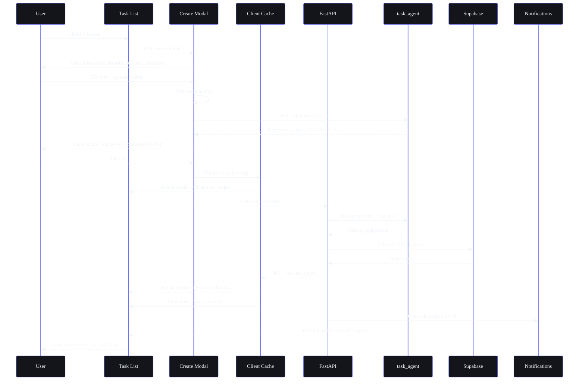
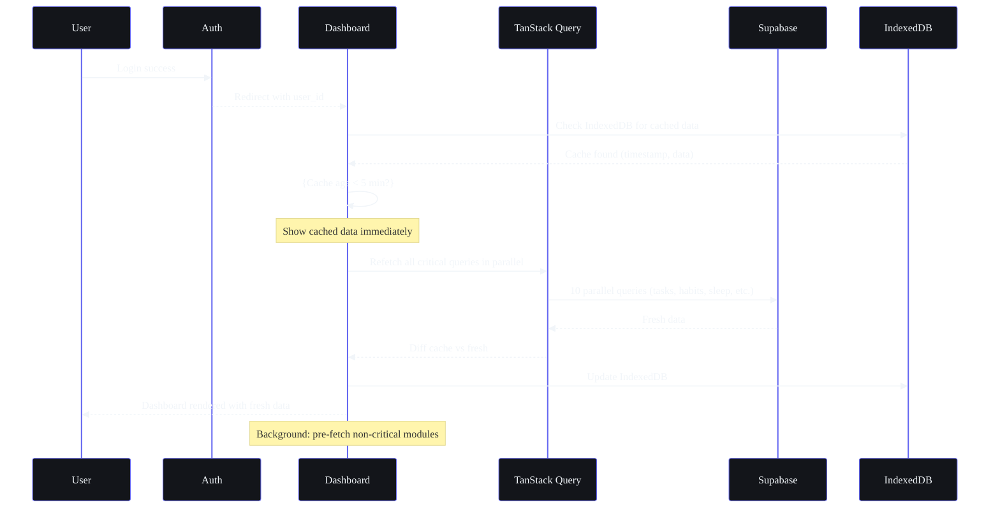

## Document Control

| Field | Value |
|---|---|
| Document ID | DSG-WF02-001 |
| Version | 1.0.0 |
| Status | Active |
| Last Updated | 2026-07-11 |

# Part II — Feature Flows (19 Flows × 10 States)

> **Part of the Workflow Architecture (SB-WFARCH-001). See `README.md` for document control and notation key.**
> For per-module user flows, see `01-UserFlows.md`. For screen hierarchy, see `03-SupportingScreens.md`.

---

## Unified State Matrix — Definition

Every feature flow defines a **Unified State Matrix** with these 10 states:

| State | Definition | UI Treatment General | Recovery |
|---|---|---|---|
| **Empty** | No data exists for this feature | Illustration + primary CTA | N/A |
| **Loading** | Initial data fetch in progress | Skeleton shimmer (3-5 items) | Auto-resolves |
| **Skeleton** | Partial cached data + refresh in progress | Mix of cached items + skeleton placeholders | → Loading → Populated |
| **Error** | API / network failure | Red banner with message + retry button | Click Retry → Loading |
| **Success** | Action completed successfully | Green toast (3s auto-dismiss) + undo option (30s) | N/A |
| **First-Time** | User has never done this before | Welcome card / mini-tutorial / highlight | Dismiss → Populated |
| **Returning** | User has history with this feature | Restore last state + recent items at top | N/A |
| **Power User** | High-frequency user (> 50 actions) | Compact UI, keyboard hints, hide tooltips | N/A |
| **Offline** | No network connection | Amber banner + cached data + "Will sync" indicator | Auto-sync on reconnect |
| **Realtime** | Another device / agent modifies data | Badge: "N new [items]" + button to scroll | Click to view |

---

## 2.1 Task Creation

**Trigger:** User clicks +Add Task or Cmd+K → "Add task"
**Duration Target:** < 3 seconds from click to list update
**Modules Involved:** Tasks, AI (task_agent)



### Unified State Matrix — Task Creation

| State | Trigger | UI Treatment | Recovery |
|---|---|---|---|
| **Empty** | First visit, no tasks | Illustration (empty desk) + "Create your first task" CTA | N/A |
| **Loading** | Initial page load | 5 skeleton cards (shimmer animation) | Auto-resolves |
| **Skeleton** | Partial data (cached) | 3 skeleton cards + 2 real cards | → Loading → Populated |
| **Error** | API 500 / network failure | Red banner: "Couldn't load tasks" + Retry button | Click Retry → Loading |
| **Success** | Task created | Green toast: "Task created" + 3s → fade | N/A |
| **First-Time** | New user, no tasks yet | Welcome card: "Welcome! Try creating a task" | After first create → Populated |
| **Returning** | Has history | Show last-viewed filter + recent tasks at top | N/A |
| **Power User** | > 50 tasks created | Show keyboard shortcut hints, hide tooltips | N/A |
| **Offline** | No connection | Banner: "Offline — changes will sync" + cached list | Auto-sync on reconnect |
| **Realtime** | Another device creates | Badge: "1 new task" + button to scroll | Click to view |

---

## 2.2 Task Completion

**Trigger:** User clicks checkbox on task
**Duration Target:** < 1 second for optimistic update
**Modules Involved:** Tasks, Habits (streak), Goals (progress), Analytics

```mermaid
%%{init: {'theme': 'base', 'themeVariables': {'background': '#0A0B0F', 'primaryColor': '#13151A', 'primaryBorderColor': '#6366F1', 'primaryTextColor': '#F1F5F9', 'lineColor': '#818CF8', 'secondaryColor': '#1A1D24', 'tertiaryColor': '#00FFA3', 'fontFamily': 'DM Sans'}}}%%
flowchart TD
    A[User clicks checkbox] --> B[Optimistic: strike-through + animate]
    B --> C[POST /api/v1/tasks/{id}/complete]
    C --> D{Success?}
    D -->|Yes| E[Permanent checkmark + confetti]
    E --> F[Streak check: daily task count]
    F --> G{Goal linked?}
    G -->|Yes| H[Update goal progress %]
    G -->|No| I[Return to list]
    H --> J{Goal complete?}
    J -->|Yes| K[Goal celebration animation]
    J -->|No| I
    D -->|No| L[Revert checkbox]
    L --> M[Show error toast: "Could not complete"]
    M --> N[Retry button in toast]
    N --> B

    style B fill:#13151A,stroke:#6366F1,color:#F1F5F9
    style E fill:#13151A,stroke:#00FFA3,color:#F1F5F9
    style L fill:#13151A,stroke:#EF4444,color:#F1F5F9
```

### Unified State Matrix — Task Completion

| State | Trigger | UI Treatment | Recovery |
|---|---|---|---|
| **Empty** | No tasks to complete | N/A (no checkbox visible) | N/A |
| **Loading** | — | — | — |
| **Skeleton** | — | — | — |
| **Error** | API fails | Revert checkbox + red toast: "Couldn't save" | Tap retry in toast |
| **Success** | API confirms | Confetti burst + green checkmark | N/A |
| **First-Time** | First task completed | Celebration modal: "You did it!" + streak intro | Dismiss → continue |
| **Returning** | Normal completion | Subtle checkmark animation | N/A |
| **Power User** | Batch complete (select all) | Group progress bar update | N/A |
| **Offline** | No connection | Checkmark + "Will sync" badge | Auto-sync on reconnect |
| **Realtime** | Another device completes | Task grays out + "Completed on another device" | N/A |

---

## 2.3 Knowledge Capture

**Trigger:** User saves content (idea, link, note, video)
**Duration Target:** < 2 seconds from trigger to confirmation
**Modules Involved:** Resources, Ideas, YouTube Vault, AI (memory_agent, task_agent)

```mermaid
%%{init: {'theme': 'base', 'themeVariables': {'background': '#0A0B0F', 'primaryColor': '#13151A', 'primaryBorderColor': '#6366F1', 'primaryTextColor': '#F1F5F9', 'lineColor': '#818CF8', 'secondaryColor': '#1A1D24', 'tertiaryColor': '#00FFA3', 'fontFamily': 'DM Sans'}}}%%
flowchart TD
    A[Trigger: Cmd+K / + button / browser extension] --> B[Quick capture modal]
    B --> C{Input type?}
    C -->|URL| D[Fetch page metadata]
    C -->|Text| E[Raw text input]
    C -->|File| F[Upload dialog]
    D --> G[Show preview: title, description, thumbnail]
    E --> G
    F --> G
    G --> H[User confirms]
    H --> I[Optimistic save → list update]
    I --> J[POST to appropriate endpoint]
    J --> K{Type detected}
    K -->|Idea| L[Save to Ideas pipeline]
    K -->|Resource| M[Save to Resources with auto-tags]
    K -->|Video| N[Save to YouTube Vault]
    L --> O[Background: AI summary generation]
    M --> O
    N --> O
    O --> P[Toast: "Saved!"]
    P --> Q[Memory agent: extract + store facts]
```

### Unified State Matrix — Knowledge Capture

| State | Trigger | UI Treatment | Recovery |
|---|---|---|---|
| **Empty** | No saved items | "Your knowledge vault is empty" + save CTA | N/A |
| **Loading** | Saving | Spinner on save button + ghost card in list | N/A |
| **Skeleton** | — | — | — |
| **Error** | Save fails | Toast: "Couldn't save. Retry?" | Tap retry |
| **Success** | Save confirms | Green toast: "Saved to [module]" | N/A |
| **First-Time** | First save | "Great! Content appears here" tutorial tip | Dismiss |
| **Returning** | Normal save | Brief toast, no fanfare | N/A |
| **Power User** | Batch save 5+ items | Progress bar: "Saving 3/5..." | Individual retry per fail |
| **Offline** | No connection | "Saved offline — will sync" | Auto-sync |
| **Realtime** | — | — | — |

---

## 2.4 Knowledge Retrieval

**Trigger:** User searches or browses saved content
**Duration Target:** < 500ms for cached, < 2s for fresh
**Modules Involved:** Resources, Ideas, YouTube Vault, Search, AI (memory_agent)

### Unified State Matrix — Knowledge Retrieval

| State | Trigger | UI Treatment | Recovery |
|---|---|---|---|
| **Empty** | Module has no items | Vault illustration + "Save your first item" | N/A |
| **Loading** | Initial load | 6 skeleton cards (3 rows × 2) | Auto-resolves |
| **Skeleton** | Cache hit + refresh | 2 cached cards + 4 skeleton | → Loading → Populated |
| **Error** | API fails | "Couldn't load library" + retry + cached fallback | Retry or show cache |
| **Success** | Items loaded | Grid/list of cards with metadata | N/A |
| **First-Time** | New user | "Welcome to your vault! Try saving a link." | N/A |
| **Returning** | Has history | Restore last scroll position + filter state | N/A |
| **Power User** | 200+ items | Virtualized list + compact view | N/A |
| **Offline** | No connection | Cached items only + "Offline" indicator | Auto-refresh on reconnect |
| **Realtime** | New item added elsewhere | "1 new item" badge | Click to scroll |

---

## 2.5 Roadmap Creation

**Trigger:** User starts skill development planning
**Duration Target:** < 3 minutes for full wizard
**Modules Involved:** Goals, Courses, Skills, AI (roadmap_agent, learning_agent)

### Unified State Matrix — Roadmap Creation

| State | Trigger | UI Treatment | Recovery |
|---|---|---|---|
| **Empty** | No roadmaps | "Plan your learning journey" + template CTA | N/A |
| **Loading** | AI is analyzing | Step progress bar + "ARIA is analyzing your skills..." | N/A |
| **Skeleton** | — | — | — |
| **Error** | AI fails | "Couldn't generate roadmap" + algorithmic fallback | Retry or use defaults |
| **Success** | Roadmap generated | Timeline view with milestones | N/A |
| **First-Time** | First roadmap | Welcome wizard with explanation | N/A |
| **Returning** | Has existing roadmap | Option to update vs create new | N/A |
| **Power User** | 5+ roadmaps | Dashboard of all roadmaps with progress | N/A |
| **Offline** | No connection | "Roadmap creation needs internet" + saved preferences | Queue for online |
| **Realtime** | — | — | — |

---

## 2.6 Goal Planning

**Trigger:** User creates or updates a goal
**Duration Target:** < 2 minutes for wizard
**Modules Involved:** Goals, Tasks, Courses, AI (roadmap_agent, learning_agent)

### Unified State Matrix — Goal Planning

| State | Trigger | UI Treatment | Recovery |
|---|---|---|---|
| **Empty** | No goals | "Set your first goal" illustration + templates | N/A |
| **Loading** | Saving | Progress spinner on save button | N/A |
| **Skeleton** | — | — | — |
| **Error** | Save fails | "Couldn't save goal" + retry | Retry |
| **Success** | Goal created | Celebration + "Check your dashboard" | N/A |
| **First-Time** | First goal | Mini-tutorial on KRs + milestones | Dismiss |
| **Returning** | Has goals | Pre-fill from previous patterns | N/A |
| **Power User** | 10+ goals | Compact goal cards, batch operations | N/A |
| **Offline** | No connection | "Will sync when online" + local save | Auto-sync |
| **Realtime** | — | — | — |

---

## 2.7 Project Creation

**Trigger:** User starts new project
**Duration Target:** < 2 minutes
**Modules Involved:** Projects, Tasks (phases), AI (task_agent, roadmap_agent)

### Unified State Matrix — Project Creation

| State | Trigger | UI Treatment | Recovery |
|---|---|---|---|
| **Empty** | No projects | "Start building" + template CTA | N/A |
| **Loading** | AI generating phases | Progress bar: "ARIA is planning your project..." | N/A |
| **Skeleton** | — | — | — |
| **Error** | AI fails | Algorithmic phase breakdown (default template) | Retry AI later |
| **Success** | Project created | Project board with phases visible | N/A |
| **First-Time** | First project | "You've started a project!" + tips | Dismiss |
| **Returning** | Has projects | Recent projects shown first | N/A |
| **Power User** | 10+ projects | Kanban board view, archived projects | N/A |
| **Offline** | No connection | "Will sync when online" | Auto-sync |
| **Realtime** | — | — | — |

---

## 2.8 Opportunity Discovery

**Trigger:** Radar scan completes OR user visits Opportunities
**Duration Target:** < 3s for display, background scan is async
**Modules Involved:** Opportunities, AI (opportunity_agent, opportunity_matching_agent)

### Unified State Matrix — Opportunity Discovery

| State | Trigger | UI Treatment | Recovery |
|---|---|---|---|
| **Empty** | No opportunities found | "We'll notify you when we find matches" + skill prompt | N/A |
| **Loading** | Radar scanning | Spinner: "Scanning for opportunities..." | Auto-resolves |
| **Skeleton** | Partial results | Show 2-3 known matches + skeleton for new | → Loading → Populated |
| **Error** | Scan fails | "Scan failed. Will retry." + last results | Auto-retry |
| **Success** | New matches found | Cards with score badges + match explanation | N/A |
| **First-Time** | First match ever | "We found your first match!" highlight card | N/A |
| **Returning** | Has history | "New" badge on fresh matches | N/A |
| **Power User** | 50+ matches tracked | Filter: applied/saved/dismissed | N/A |
| **Offline** | No connection | Cached matches + "Scan when online" | Auto-scan on reconnect |
| **Realtime** | New match arrives | Slide-in notification: "New match found!" | Tap to view |

---

## 2.9 Opportunity Application

**Trigger:** User decides to apply
**Duration Target:** < 5 minutes for full flow
**Modules Involved:** Opportunities, Tasks, AI (task_agent, opportunity_matching_agent)

### Unified State Matrix — Opportunity Application

| State | Trigger | UI Treatment | Recovery |
|---|---|---|---|
| **Empty** | No applications yet | "Track your applications here" | N/A |
| **Loading** | AI generating materials | "ARIA is drafting your cover letter..." | N/A |
| **Skeleton** | — | — | — |
| **Error** | AI fails | Manual entry mode + "AI unavailable" badge | Retry later |
| **Success** | Application tracked | Timeline card with status | N/A |
| **First-Time** | First application | "You're on your way!" celebration | N/A |
| **Returning** | Has applications | Pipeline view: Applied → Interviewing → Offer → Rejected | N/A |
| **Power User** | 20+ applications | Kanban board + stats dashboard | N/A |
| **Offline** | No connection | "Save offline, submit when online" | Auto-sync |
| **Realtime** | Status changed by scanner | Notification: "Status updated → [stage]" | Tap to view |

---

## 2.10 Analytics Exploration

**Trigger:** User visits Analytics dashboard
**Duration Target:** < 2s for overview, < 5s for drill-down
**Modules Involved:** All modules, AI (analytics_agent, learning_agent)

### Unified State Matrix — Analytics Exploration

| State | Trigger | UI Treatment | Recovery |
|---|---|---|---|
| **Empty** | No data yet | "Start using modules to see analytics" + quick links | N/A |
| **Loading** | Initial load | 6 skeleton chart cards | Auto-resolves |
| **Skeleton** | Cache hit | 2 cached charts + 4 skeleton | → Loading → Populated |
| **Error** | Data fetch fails | "Couldn't load analytics" + retry + cached fallback | Retry or show cache |
| **Success** | Data loaded | Charts with hover tooltips, trend lines | N/A |
| **First-Time** | First visit | "Welcome to Analytics!" tour overlay | Dismiss |
| **Returning** | Has history | Restore last time range + scroll position | N/A |
| **Power User** | Wants deep analysis | Custom date ranges, comparison mode, export | N/A |
| **Offline** | No connection | Cached analytics + "Last synced: [time]" | Auto-refresh on reconnect |
| **Realtime** | Live data update | Chart animates to new value | N/A |

---

## 2.11 AI Conversation

**Trigger:** User sends message to ARIA
**Duration Target:** First token < 500ms, full response < 10s
**Modules Involved:** Chat, All agents, LLM (Ollama/Claude), Memory

### Unified State Matrix — AI Conversation

| State | Trigger | UI Treatment | Recovery |
|---|---|---|---|
| **Empty** | New chat | Suggested prompts + "Ask me anything" | N/A |
| **Loading** | Message sent | User message bubble + typing indicator | N/A |
| **Skeleton** | — | — | — |
| **Error** | LLM fails | "I couldn't process that. Try again?" + fallback response | Retry or rephrase |
| **Success** | Response received | Full response with action cards, sources | N/A |
| **First-Time** | First chat ever | "Hi! I'm ARIA. Let me show you around..." | N/A |
| **Returning** | Has history | Context-aware greeting + continue last topic | N/A |
| **Power User** | Frequent chatter | Show memory count + "I remember [fact]" | N/A |
| **Offline** | No connection | "I need internet to respond" + fallback FAQ | Retry on reconnect |
| **Realtime** | — | — | — |

---

## 2.12 AI Recommendation Acceptance

**Trigger:** User accepts an AI suggestion
**Duration Target:** < 1s for acceptance, < 3s for execution
**Modules Involved:** AI (various agents), Target module

### Unified State Matrix — AI Recommendation Acceptance

| State | Trigger | UI Treatment | Recovery |
|---|---|---|---|
| **Empty** | No recommendations | Wait for AI to generate suggestions | N/A |
| **Loading** | AI generating | Skeleton suggestion chip | Auto-resolves |
| **Skeleton** | — | — | — |
| **Error** | Execution fails | "Couldn't apply" + revert state | Retry or manual mode |
| **Success** | Applied | Green toast + undo button (30s) | Undo within window |
| **First-Time** | First acceptance | "Try undoing to see how it works" tip | Dismiss |
| **Returning** | Has history | Show "Previously accepted" in suggestion | N/A |
| **Power User** | Frequent accepter | Auto-accept for confidence > 95% (configurable) | Audit log to review |
| **Offline** | No connection | "I'll apply when you're online" | Queue + execute on sync |
| **Realtime** | — | — | — |

---

## 2.13 AI Recommendation Rejection

**Trigger:** User dismisses AI suggestion
**Duration Target:** < 500ms
**Modules Involved:** AI (memory_agent)

### Unified State Matrix — AI Recommendation Rejection

| State | Trigger | UI Treatment | Recovery |
|---|---|---|---|
| **Empty** | — | — | — |
| **Loading** | — | — | — |
| **Skeleton** | — | — | — |
| **Error** | Feedback save fails | In-memory adjustment, no toast needed | Silent retry |
| **Success** | Dismissed | Chip slides right + fades | Undo option for 5s |
| **First-Time** | First rejection | "Thanks for the feedback!" toast | N/A |
| **Returning** | Has rejection history | Suggestion type suppressed for N days | N/A |
| **Power User** | Frequent rejector | "Turn off this suggestion type?" prompt | Settings link |
| **Offline** | No connection | Local dismiss, sync feedback later | Sync on reconnect |
| **Realtime** | — | — | — |

---

## 2.14 Search Flow

**Trigger:** User initiates search
**Duration Target:** First suggestion < 100ms, full results < 500ms
**Modules Involved:** All modules, Search, AI (memory_agent)

### Unified State Matrix — Search Flow

| State | Trigger | UI Treatment | Recovery |
|---|---|---|---|
| **Empty** | Search bar idle | Placeholder + recent searches + trending | N/A |
| **Loading** | Query submitted | Skeleton result cards (3 per module) | Auto-resolves |
| **Skeleton** | — | — | — |
| **Error** | API fails | "Search unavailable" + cached results | Retry button |
| **Success** | Results returned | Grouped cards with module badges | N/A |
| **First-Time** | First search ever | "Try searching for 'task' or 'course'" hint | Dismiss |
| **Returning** | Has history | Recent searches at top + highlighted | N/A |
| **Power User** | Searches 10+/day | Keyboard-driven (no mouse), advanced operators | N/A |
| **Offline** | No connection | Local search only (IndexedDB) | Full search on reconnect |
| **Realtime** | — | — | — |

---

## 2.15 Quick Capture Flow

**Trigger:** Cmd+K / + button / gesture from any screen
**Duration Target:** < 10s from trigger to save
**Modules Involved:** All modules (auto-routes based on content)

### Unified State Matrix — Quick Capture

| State | Trigger | UI Treatment | Recovery |
|---|---|---|---|
| **Empty** | Modal opened | Empty input + type hints | N/A |
| **Loading** | AI analyzing | Pulsing badge: "Detecting type..." | Auto-resolves |
| **Skeleton** | — | — | — |
| **Error** | Save fails | "Couldn't save. Retry?" + keep modal open | Retry or close |
| **Success** | Item saved | Green toast + 5s undo + auto-close | Undo within window |
| **First-Time** | First capture | "Quick! That's how you capture anything" tip | Dismiss |
| **Returning** | Regular use | Pre-fill from clipboard (URL detection) | N/A |
| **Power User** | Captures 20+/day | Multi-line input, plain text mode, shortcuts | N/A |
| **Offline** | No connection | "Saved offline" + local queue | Auto-sync on reconnect |
| **Realtime** | — | — | — |

---

## 2.16 Command Center Flow

**Trigger:** Cmd+K (when not in Quick Capture mode)
**Duration Target:** First suggestion < 50ms
**Modules Involved:** All modules (navigation + actions)

### Unified State Matrix — Command Center

| State | Trigger | UI Treatment | Recovery |
|---|---|---|---|
| **Empty** | Opened (no input) | Command categories + recent commands | N/A |
| **Loading** | — | — | — |
| **Skeleton** | — | — | — |
| **Error** | Command fails | Toast: "Couldn't execute" + return to overlay | Retry |
| **Success** | Command executed | Smooth transition / action | N/A |
| **First-Time** | First open | "Try typing 'go to tasks'" hint | Dismiss |
| **Returning** | Has history | Recently used commands shown first | N/A |
| **Power User** | Uses 50+ shortcuts | Compact mode, no descriptions | N/A |
| **Offline** | Offline commands only | Grayed-out network-required commands | N/A |
| **Realtime** | — | — | — |

---

## 2.17 Notification Flow

**Trigger:** System / AI / Opportunity generates notification
**Duration Target:** < 500ms from trigger to UI
**Modules Involved:** Notification System, All modules

### Unified State Matrix — Notification Flow

| State | Trigger | UI Treatment | Recovery |
|---|---|---|---|
| **Empty** | No notifications | "No new notifications" + history link | N/A |
| **Loading** | Fetching list | Skeleton notification items | Auto-resolves |
| **Skeleton** | — | — | — |
| **Error** | Fetch fails | "Couldn't load notifications" + retry | Retry |
| **Success** | Notification received | Bell badge + toast + dropdown | N/A |
| **First-Time** | First notification | "You got your first notification!" highlight | Dismiss |
| **Returning** | Has history | Unread count badge, grouped by type | N/A |
| **Power User** | 50+/day | Notification digest mode, priority filters | N/A |
| **Offline** | No connection | Queue notifications locally | Deliver on reconnect |
| **Realtime** | Live push | Slide-in toast from top | Tap to act / swipe to dismiss |

---

## 2.18 Settings Flow

**Trigger:** User navigates to Settings
**Duration Target:** < 500ms for section load, < 200ms per save
**Modules Involved:** Settings (all 8 sections)

### Unified State Matrix — Settings Flow

| State | Trigger | UI Treatment | Recovery |
|---|---|---|---|
| **Empty** | — | — | — |
| **Loading** | Section loading | Skeleton form fields | Auto-resolves |
| **Skeleton** | — | — | — |
| **Error** | Save fails | Red border on field + error message | Retry or revert |
| **Success** | Save completes | Green checkmark + toast (2s) | N/A |
| **First-Time** | First visit | "Customize your experience" overview | Dismiss |
| **Returning** | Has saved settings | Current values pre-filled | N/A |
| **Power User** | Wants advanced | Show all settings expanded, no wizard | N/A |
| **Offline** | No connection | "Changes will sync" indicator | Sync on reconnect |
| **Realtime** | Settings sync conflict | "Updated on another device" dialog | Keep theirs / keep mine |

---

## 2.19 Initial Sync Flow

**Trigger:** User logs in (especially first time or after long absence)
**Duration Target:** < 5s for critical data, full sync async
**Modules Involved:** All modules, TanStack Query, IndexedDB



### Unified State Matrix — Initial Sync

| State | Trigger | UI Treatment | Recovery |
|---|---|---|---|
| **Empty** | First login ever | Full loading → onboarding redirect | N/A |
| **Loading** | Auth in progress | Global loading spinner (auth screen) | Auto-resolves |
| **Skeleton** | Cache found | Skeleton for non-critical + cached critical | → Loading → Populated |
| **Error** | Database unreachable | Cached data + "Limited offline mode" banner | Retry with backoff |
| **Success** | Data synced | Full dashboard with all widgets | N/A |
| **First-Time** | Brand new user | Redirect to onboarding wizard | N/A |
| **Returning** | Has history | Cached data + background refresh | N/A |
| **Power User** | 1000+ items | Progress bar: "Syncing your data..." | N/A |
| **Offline** | No connection | Cached data only + persistent offline banner | Auto-sync on reconnect |
| **Realtime** | Concurrent login | Detect + show "Logged in elsewhere" | Keep session / invalidate |
