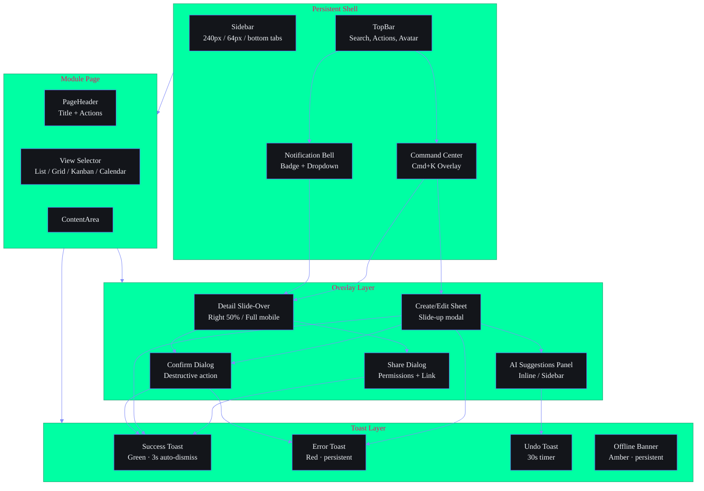
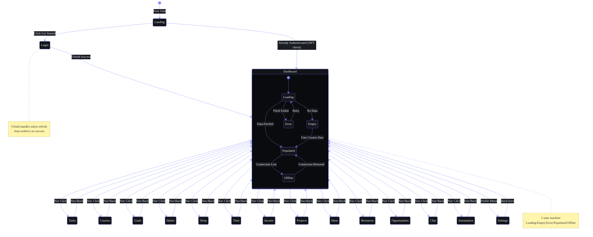

# Part III — Supporting Screens

> **Part of the Workflow Architecture (SB-WFARCH-001). See `README.md` for document control.**
> Related: `01-UserFlows.md` (module flows), `02-FeatureFlows.md` (feature flows), `FrontendScreenFlows.md` (screen-to-screen transitions).

---

## 3.1 Screen Hierarchy Notation

Every workflow in this architecture maps to a screen hierarchy. The hierarchy defines every screen, sub-view, overlay, modal, toast, and banner required to complete the workflow.



### Standard Screen Hierarchy

```
ROUTE: /module
├── Shell (persistent)
│   ├── Sidebar (240px desktop / 64px tablet / bottom tab mobile)
│   ├── TopBar (64px)
│   │   ├── Search bar (expandable)
│   │   ├── Quick actions
│   │   └── Notification bell
│   ├── Command Center (Cmd+K overlay)
│   └── Toast container (fixed position)
├── PageHeader
│   ├── Module title
│   ├── Action buttons (primary + secondary)
│   └── View toggle (list/grid/kanban/calendar)
├── ContentArea
│   ├── FilterBar (chips, search, sort)
│   ├── ListView (default)
│   │   ├── LoadingSkeleton (3-5 shimmer items)
│   │   ├── EmptyState (illustration + CTA)
│   │   ├── ErrorState (banner + retry)
│   │   └── Item (icon, title, metadata, actions)
│   ├── GridView (alternative)
│   ├── KanbanView (pipeline modules)
│   └── CalendarView (time-based modules)
├── SlideOverPanel (detail)
│   ├── Header (title, status, menu)
│   ├── Content (full item detail)
│   ├── ActivityFeed (chronological events)
│   └── RelatedItems (cross-module links)
├── CreateModal / EditSheet
│   ├── Form (fields, selects, date pickers)
│   ├── AISuggestions (auto-fill chips)
│   └── Actions (submit, cancel)
├── ConfirmDialog
│   ├── Warning icon
│   ├── Description + details
│   └── Confirm / Cancel buttons
├── ShareDialog
│   ├── Permission selector (view/comment/edit)
│   ├── Share channel (link/email/app)
│   └── Expiry settings
└── Toast (transient, auto-dismiss)
    ├── Success (green, 3s)
    ├── Error (red, persistent)
    ├── Undo (green, 30s timer)
    └── Offline (amber, persistent)
```

---

## 3.2 Overlay & Modal Dependency Map

### Overlay Stacking Rules

| Rule | Description |
|---|---|
| **Max 2 overlays** | Maximum two overlays visible at a time (e.g., Create Modal + AI Suggestions) |
| **Toast always on top** | Toast layer is non-blocking, always highest z-index |
| **Command Center clears all** | Cmd+K closes all other overlays when opened |
| **Modal preserves state** | Modals retain their state if a toast or notification appears |
| **Mobile = full-screen** | All modals become full-screen sheets on mobile |
| **Escape = close topmost** | Escape key closes the topmost overlay only |

### Overlay State Matrix

| Overlay | Open Trigger | Close Trigger | Data Persistence |
|---|---|---|---|
| Command Center | Cmd+K from any screen | Escape, click outside, action executed | None (transient) |
| Quick Capture | Cmd+K (when not in command mode) | Escape, submit, click outside | Auto-save draft to localStorage |
| Create/Edit Modal | Add/Edit button | Escape, save, click outside | Auto-save draft to localStorage |
| Detail Slide-Over | Item click | Escape, click outside, nav away | None (read-only) |
| Confirm Dialog | Destructive action | Confirm, cancel, escape | None |
| Share Dialog | Share button | Close, generate link, escape | None |
| AI Suggestions | AI generates recommendation | Accept, dismiss, timeout | Preference stored in memory |
| Notification Dropdown | Bell click | Click notification, click outside | Mark read on action |

---

## 3.3 Deep Link Resolution

Notifications and external links must resolve to the correct screen:

| Notification Type | Deep Link | Screen | Scroll To |
|---|---|---|---|
| Task reminder | `/tasks/{id}` | Tasks | Detail slide-over |
| Course deadline | `/courses/{id}` | Courses | Detail view |
| Goal milestone | `/goals/{id}` | Goals | Detail with KRs |
| Opportunity match | `/opportunities/{id}` | Opportunities | Detail card |
| Habit nudge | `/habits` | Habits | Today's log section |
| Sleep reminder | `/sleep` | Sleep | Log modal |
| Briefing ready | `/dashboard#briefing` | Dashboard | Briefing widget (scroll) |
| AI insight | `/chat?insight={id}` | Chat | Specific message |

---

## 3.4 Auth-Guarded Transitions


