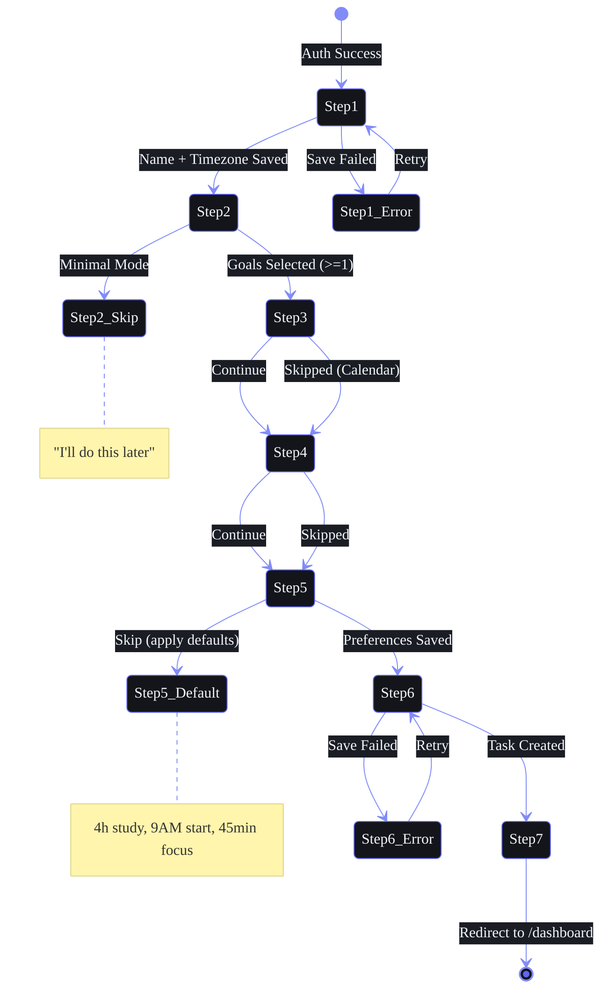

## Document Control

| Field | Value |
|---|---|
| Document ID | DSG-WF04-001 |
| Version | 1.0.0 |
| Status | Active |
| Last Updated | 2026-07-11 |

# Part IV — Multi-Step Experiences

> **Part of the Workflow Architecture (SB-WFARCH-001). See `README.md` for document control.**
> Related: `UserJourneyArchitecture.md` (time-based journeys), `02-FeatureFlows.md` (feature flows), `09-Settings.md` (settings screens).

---

## 4.1 Onboarding Wizard

**Trigger:** New user completes sign-up
**Route:** `/onboarding`
**Target Duration:** < 120 seconds

### Step Map

| Step | Screen | Fields | Validation | Skip Allowed? | Background Action |
|---|---|---|---|---|---|
| 1 | Welcome + Auth | Google OAuth button | Auth success | No | Create user row in Supabase |
| 2 | Profile | Name, Timezone, Semester | Name: 2-50 chars | No | Set default preferences |
| 3 | Goal Selection | 5 templates (pick 3-5) | Min 1 selected | No | Create goal rows |
| 4 | Calendar Connect | Google Calendar toggle | None | Yes | Sync calendar events |
| 5 | Study Preferences | Hours/day, focus time, duration | Hours: 1-12 | Yes | Create schedule tasks |
| 6 | First Capture | Quick task demo input | Min 1 char | No | Generate onboarding briefing |
| 7 | Dashboard | ARIA welcome message | — | — | Redirect to /dashboard |

### State Machine



### Progress Indicator

| Platform | Design |
|---|---|
| **Desktop** | Horizontal stepper with numbered circles + labels below |
| **Tablet** | Horizontal stepper, labels hidden on < 768px |
| **Mobile** | Progress bar at top with "Step X of 7" text |

### Resumption Logic

```
On login → Check user_preferences.onboarding_completed
  → false → Check user_preferences.last_completed_step
    → null → Start at Step 1
    → 2 → Resume at Step 3 (profile done, goals next)
    → 5 → Resume at Step 6 (prefs done, capture next)
    → 6 → Resume at Step 7 (capture done, dashboard)
    → 7 → Mark onboarding_completed = true
```

### Edge Cases

| Case | Behavior |
|---|---|
| Browser close mid-flow | Save `last_completed_step` to localStorage + Supabase draft. On next login → Resume at step. |
| Network failure during save | Queue step completion locally. Show "Saving..." non-blocking indicator. |
| Duplicate account | Google OAuth → existing user → check `onboarding_completed` → skip to dashboard |
| Timezone mismatch | Detect via browser Intl API → pre-fill → allow override. Fallback: UTC. |
| Invalid semester value | Silently default to 1 → allow change in Profile settings. |

### Error Recovery

| Error | Detection | User Message | Recovery |
|---|---|---|---|
| OAuth failure | Supabase returns auth_error | "Unable to sign in with Google. Please try again." | Retry button + email login fallback (future) |
| Profile save fails | API returns 500 | "We couldn't save your profile. We'll retry automatically." | Auto-retry 3x with exponential backoff |
| Calendar sync fails | Google API timeout | "Calendar sync failed. You can connect it later from Settings." | Skip + enable in Settings later |
| Invalid timezone | Select picks UTC | "Using UTC. You can change this in Settings." | Silently fix + log warning |

### Success Metrics

| Metric | Target |
|---|---|
| Onboarding completion rate | > 85% |
| Time to complete onboarding | < 120 seconds |
| Step drop-off rate (per step) | < 5% |

---

## 4.2 Initial Setup

**Trigger:** After onboarding, before first dashboard access
**Route:** `/setup`
**Target Duration:** < 60 seconds

| Step | Screen | Fields | Validation | Skip |
|---|---|---|---|---|
| 1 | Import Data | CSV/JSON upload or manual entry | File format (.csv, .json) | Yes |
| 2 | Connect Services | GitHub, Calendar, Email OAuth | OAuth per service | Yes |
| 3 | Notification Prefs | Push, Email, Quiet hours toggles | Valid time range | Yes |
| 4 | Theme Selection | Dark/Light/Cyberpunk preview cards | N/A | Yes (default: Dark) |

---

## 4.3 AI Personalization

**Trigger:** During onboarding or from Settings
**Route:** `/settings/ai` or `/setup/ai`
**Target Duration:** < 90 seconds

| Step | Screen | Controls | AI Behavior Impact |
|---|---|---|---|
| 1 | ARIA Personality | Slider: Formal ↔ Casual | Adjusts response tone, greeting style |
| 2 | Proactivity Level | Select: Low / Medium / High | How often ARIA suggests actions unprompted |
| 3 | Nudge Preferences | Toggles: Course, Habit, Sleep, Opportunity | Enable/disable per-nudge type |
| 4 | Model Selection | Select: Ollama (local) / Claude (cloud) / Auto | Sets primary AI provider |
| 5 | Cost Awareness | Slider: Monthly token budget | Alert % slider, usage meter |

---

## 4.4 Knowledge Import

**Trigger:** First visit to Resources / Ideas / YouTube vault
**Route:** `/knowledge/import`
**Target Duration:** < 3 minutes

| Step | Screen | Method | Background |
|---|---|---|---|
| 1 | Browser Bookmarks | Upload HTML bookmarks file | Parse → categorize → save as Resources |
| 2 | YouTube Watch Later | OAuth → fetch watch later list | Save each video to YouTube Vault |
| 3 | GitHub Stars | OAuth → fetch starred repos | Save each repo as Resource with auto-summary |

---

## 4.5 Goal Setup

**Trigger:** First goal creation
**Route:** `/goals/setup`
**Target Duration:** < 2 minutes

| Step | Screen | Fields | AI |
|---|---|---|---|
| 1 | Goal Template | Pick from Academic / Career / Skill / Health / Finance | Suggests template based on profile |
| 2 | Customize | Name, deadline, category | Pre-fills from template, offers adjustments |
| 3 | Key Results | 2-5 measurable outcomes (text inputs) | Suggests 3 KRs from template |
| 4 | Milestones | Quarterly breakpoints with % targets | Generates 4 milestones with AI estimates |

---

## 4.6 Roadmap Setup

**Trigger:** First roadmap creation
**Route:** `/roadmap/setup`
**Target Duration:** < 3 minutes

| Step | Screen | Fields | AI |
|---|---|---|---|
| 1 | Target Skill | Search/select skill or role autocomplete | Suggests top in-demand skills in user's field |
| 2 | Current Level | Radio: Beginner / Intermediate / Advanced | Asks 3 diagnostic multi-choice questions |
| 3 | Skill Gap | Auto-generated gap analysis table | Compares current level → target level |
| 4 | Course Recommendations | List of recommended courses with match % | Matches skill gaps to available courses |
| 5 | Timeline | Duration (months) + weekly hours + milestones | Generates study schedule with reminders |

---

## 4.7 Profile Setup

**Trigger:** First login or Settings change
**Route:** `/settings/profile`

| Field | Type | Validation | Default |
|---|---|---|---|
| Display Name | Text input | 2-50 characters | Google profile name |
| Email | Read-only display | Valid email | Google account email |
| College | Text input | 2-100 characters | — |
| Semester | Select (1-8) | Integer 1-8 | — |
| Timezone | Select (IANA list) | Valid IANA timezone | Browser Intl detection |
| Bio | Textarea | 0-500 characters | — |
| Avatar | Image upload | Max 2MB, PNG/JPEG | Initials fallback |

---

## 4.8 Preference Setup

**Trigger:** First login or Settings change
**Route:** `/settings/preferences`

| Field | Type | Options | Default |
|---|---|---|---|
| Study Hours/Day | Slider | 1-12 | 4 |
| Deep Work Start | Time picker | 00:00-23:30 (30min intervals) | 09:00 |
| Focus Duration | Select | 25 / 30 / 45 / 60 min | 45 |
| Break Duration | Select | 5 / 10 / 15 min | 5 |
| Default Task View | Select | List / Board / Calendar | List |
| Week Start Day | Select | Monday / Sunday | Monday |
| Language | Select | English / Hindi (future) | English |
| Compact Mode | Toggle | On/Off | Off |
| Reduced Motion | Toggle | On/Off | Off |
