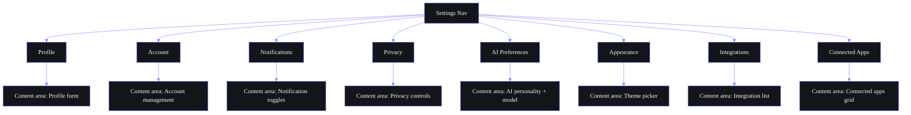

## Document Control

| Field | Value |
|---|---|
| Document ID | DSG-WF09-001 |
| Version | 1.0.0 |
| Status | Active |
| Last Updated | 2026-07-11 |

# Part IX — Settings

> **Part of the Workflow Architecture (SB-WFARCH-001). See `README.md` for document control.**
> Related: `04-MultiStepExperiences.md` (setup wizards), `02-FeatureFlows.md` §2.18 (settings flow), wireframes `06_ANALYTICS_AI_SETTINGS_STATES_WIREFRAMES.md`.

---

## Settings Shell

**Route:** `/settings`
**Layout:** Sidebar + content (desktop), tabs (tablet), accordion (mobile)

### Per-Setting State Matrix

| State | Trigger | UI Treatment | Recovery |
|---|---|---|---|
| **Default** | Page load | Current saved value displayed | N/A |
| **Modified** | User changes value | Orange indicator dot on field | N/A |
| **Saving** | Save triggered | Mini spinner on field / button | N/A |
| **Saved** | API confirms | Green check animation + "Saved" toast (2s) | N/A |
| **Error** | Save fails | Red border + inline error message | Retry or revert |
| **Conflict** | Sync conflict detected | "Updated on another device" dialog | Keep theirs / Keep mine |
| **Disabled** | Dependencies not met | Grayed out + tooltip explanation | Resolve dependency |
| **Offline** | No connection | Amber "Will sync when online" | Auto-sync on reconnect |

---

## 9.1 Profile Settings

**Route:** `/settings/profile`

| Field | Type | Validation | Default |
|---|---|---|---|
| Avatar | Image upload (PNG/JPEG, max 2MB) | Dimension > 100px | Initials fallback |
| Display Name | Text input | 2-50 characters | Google profile name |
| Email | Read-only display | Valid email format | Google account email |
| College | Text input | 2-100 characters | — |
| Semester | Select dropdown | 1-8 | — |
| Timezone | Searchable select (IANA list) | Valid IANA timezone | Browser Intl API |
| Bio | Textarea | 0-500 characters | — |

---

## 9.2 Account Settings

**Route:** `/settings/account`

| Section | Control | Description |
|---|---|---|
| Email | Display (read-only) | Connected Google account email |
| Password | "Change Password" link | → Email reset link (OAuth-based) |
| Connected Accounts | List with status tags | Google (primary), GitHub, (future: Outlook, Notion) |
| Active Sessions | List with device info + revoke button | Current session highlighted |
| Delete Account | Danger button (red) | → Type "DELETE" to confirm → 30-day grace period |

---

## 9.3 Notification Settings

**Route:** `/settings/notifications`

| Category | In-App | Push | Email | Default |
|---|---|---|---|---|
| Task Reminders | ✅ Toggle | ✅ Toggle | ❌ | All On |
| Course Nudges | ✅ Toggle | ✅ Toggle | ❌ | All On |
| Opportunity Alerts | ✅ Toggle | ✅ Toggle | ✅ (weekly) | All On |
| Goal Milestones | ✅ Toggle | ❌ | ❌ | On |
| Habit Reminders | ✅ Toggle | ✅ Toggle | ❌ | All On |
| AI Digests | ✅ Toggle | ❌ | ✅ | On |
| System Alerts | ✅ Toggle (forced) | ✅ Toggle (forced) | ✅ (P0 only) | All On |
| Social (collab) | ✅ Toggle | ✅ Toggle | ❌ | All On |

**Quiet Hours:**

| Setting | Type | Default |
|---|---|---|
| Quiet Hours Start | Time picker (30min intervals) | 22:00 |
| Quiet Hours End | Time picker (30min intervals) | 08:00 |
| Allow Critical (P0) | Toggle | On (bypasses quiet hours) |

---

## 9.4 Privacy Settings

**Route:** `/settings/privacy`

| Setting | Type | Options / Control | Default |
|---|---|---|---|
| Data Storage | Select | Local (Ollama only) / Cloud (Ollama + Claude) | Local |
| Anonymize Data | Toggle | Strip personal info from AI training data | On |
| Export All Data | Button | → Generates JSON download of all user data | — |
| Delete All Data | Danger button | → Confirm → Type "DELETE" → 30-day grace | — |
| Memory Retention | Select | 30 days / 90 days / 1 year / Forever | 90 days |
| Session Learning | Toggle | Allow ARIA to learn from usage patterns | On |

---

## 9.5 AI Preferences

**Route:** `/settings/ai`

### Personality Sliders

| Trait | Left Label | Right Label | Default |
|---|---|---|---|
| Tone | Formal | Casual | 60% Casual |
| Style | Professional | Friendly | 50% |
| Detail | Brief | Detailed | 70% Detailed |

### Proactivity

| Level | Description |
|---|---|
| Low | Only respond when asked directly |
| Medium | Suggest occasionally (≤ 2/day per agent) |
| High | Proactive suggestions, briefings, nudges (default) |

### AI Features Toggles

All 8 AI features are individually togglable:
- Daily Briefing, Weekly Review, Opportunity Scanning, Memory & Learning
- Sleep Analysis, Course Nudges, Task Suggestions, Skill Roadmap

### Model Configuration

| Setting | Type | Default |
|---|---|---|
| Primary Model | Select | Ollama (Mistral 7B) |
| Fallback Model | Select | Claude Sonnet 4 |
| Auto-fallback | Toggle | On |
| Monthly Token Budget | Slider (10K - 500K) | 100K |
| Budget Alert % | Slider (50% - 95%) | 80% |
| Usage Meter | Display | "42,500 / 100,000 tokens used this month" |

---

## 9.6 Appearance Settings

**Route:** `/settings/appearance`

| Setting | Type | Options | Default |
|---|---|---|---|
| Theme | Visual card picker | Dark, Light, Cyberpunk, High Contrast | Dark |
| Accent Color | Color swatch picker | Indigo, Neon Green, Amber, Rose, Cyan, Custom | Indigo (#6366F1) |
| Sidebar Mode | Select | Icon + Label (full) / Icons Only (collapsed) | Icon + Label |
| Font Size | Slider | Small / Medium / Large | Medium |
| Compact Mode | Toggle | On/Off | Off |
| Reduced Motion | Toggle | Disables all animations | Off |
| Glass Morphism | Toggle | Backdrop blur on cards/modals | On |

---

## 9.7 Integration Settings

**Route:** `/settings/integrations`

| Integration | Status | Actions |
|---|---|---|
| Google Calendar | ✅ Connected | Sync events, view schedule, auto-create tasks |
| GitHub | 🔗 Connect | Fetch repos, stars, activity feed |
| YouTube | ✅ Connected | Fetch watch later, subscriptions |
| Resend (Email) | ✅ Connected | Send briefing, weekly review, alerts |
| Notion | 🔜 Coming soon | — |
| Obsidian | 🔜 Coming soon | — |
| Todoist | 🔜 Coming soon | — |
| Browser Extension | 📋 Setup guide | Install link + pairing code |

---

## 9.8 Connected Apps

**Route:** `/settings/connected-apps`

| App | Status | Permissions | Last Sync | Actions |
|---|---|---|---|---|
| Google | ✅ Connected | Profile, Calendar (read) | 2m ago | Disconnect |
| GitHub | ✅ Connected | Repos (read) | 1h ago | Disconnect |
| YouTube | ⚠️ Token expiring | Watch Later (read) | — | Reconnect |
| Resend | ✅ Connected | Email (send only) | Active | Disconnect |
