# Second Brain OS — Complete Enterprise Wireframe System

| Field | Value |
|---|---|
| Document ID | DSG-WIX-001 |
| Version | 2.0.0 |
| Status | Complete |
| Date | 2026-06-11 |
| Classification | Enterprise UX — Structural Wireframes |
| Scope | 20 Modules, 3 Breakpoints, All States, 7 Wireframe Parts |

---

## Document Map

This wireframe system is organized into 8 documents (this index + 7 parts):

| # | Document | Scope | Modules Covered |
|---|----------|-------|-----------------|
| 00 | **This Index** | System architecture, hierarchies, flows | All |
| 01 | [Application Shell & Navigation](file:///C:/Users/Dell/.gemini/antigravity/brain/564651ed-4a73-4095-9cdc-2acf8e3251be/01_APPLICATION_SHELL_AND_NAVIGATION.md) | App shell (Desktop/Tablet/Mobile), Sidebar, Top Nav, Mobile Nav, Command Center, Search, Notifications | Shell |
| 02 | [Dashboard Wireframes](file:///C:/Users/Dell/.gemini/antigravity/brain/564651ed-4a73-4095-9cdc-2acf8e3251be/02_DASHBOARD_WIREFRAMES.md) | Morning Briefing, Productivity, AI Insights, Learning, Opportunities, Projects, Analytics widgets | Dashboard |
| 03 | [Tasks & Courses](file:///C:/Users/Dell/.gemini/antigravity/brain/564651ed-4a73-4095-9cdc-2acf8e3251be/03_TASKS_AND_COURSES_WIREFRAMES.md) | Task List/Board/Calendar/Detail views, Course Library/Detail/Progress | Tasks, Courses |
| 04 | [Knowledge, Ideas & Roadmap](file:///C:/Users/Dell/.gemini/antigravity/brain/564651ed-4a73-4095-9cdc-2acf8e3251be/04_KNOWLEDGE_IDEAS_ROADMAP_WIREFRAMES.md) | Knowledge Vault, Search, Graph, Idea Capture/Analysis/Validation, Roadmap Canvas/Timeline/Dependencies | Resources, Ideas, Goals |
| 05 | [Opportunities, Projects & Income](file:///C:/Users/Dell/.gemini/antigravity/brain/564651ed-4a73-4095-9cdc-2acf8e3251be/05_OPPORTUNITY_PROJECTS_INCOME_WIREFRAMES.md) | Opportunity Discovery/Matching/Filtering, Project Board/Timeline/Detail, Income Overview/Sources/Analytics | Opportunities, Projects, Income |
| 06 | [Analytics, AI, Settings & States](file:///C:/Users/Dell/.gemini/antigravity/brain/564651ed-4a73-4095-9cdc-2acf8e3251be/06_ANALYTICS_AI_SETTINGS_STATES_WIREFRAMES.md) | Analytics Overview/Reports/Insights, AI Chat/Context/Recommendations, Settings, Empty/Loading/Error States | Analytics, Chat, Settings |
| 07 | **`07_SUPPLEMENT_AI_MODULES_STATES.md`** | Time Tracking (Pomodoro/Log/Stats), Academics (Semester/Subject), YouTube (Library/Detail), Automation (Rules/Detail/Log), Learning (Dashboard/Skills/Paths), Memory (Viewer/Knowledge), AI Components (6 patterns), States Expansion (Empty/Offline) | Time, Academics, YouTube, Automation, Learning, Memory, AI Components |

---

## System Architecture Overview

```
┌─────────────────────────────────────────────────────────────────┐
│                    SECOND BRAIN OS (ARIA OS)                     │
│                  Enterprise Wireframe System                     │
├─────────────────────────────────────────────────────────────────┤
│                                                                  │
│  ┌──────────────┐  ┌──────────────┐  ┌──────────────┐          │
│  │   DESKTOP    │  │   TABLET     │  │   MOBILE     │          │
│  │  1024px+     │  │  768-1023px  │  │  320-767px   │          │
│  │              │  │              │  │              │          │
│  │ ┌──┬───────┐ │  │ ┌─┬────────┐│  │ ┌──────────┐│          │
│  │ │  │       │ │  │ │ │        ││  │ │  TopBar   ││          │
│  │ │S │Content│ │  │ │I│Content ││  │ ├──────────┤│          │
│  │ │i │ Area  │ │  │ │c│  Area  ││  │ │          ││          │
│  │ │d │       │ │  │ │o│        ││  │ │ Content  ││          │
│  │ │e │       │ │  │ │n│        ││  │ │          ││          │
│  │ │b │       │ │  │ │ │        ││  │ │          ││          │
│  │ │a │       │ │  │ │ │        ││  │ ├──────────┤│          │
│  │ │r │       │ │  │ └─┴────────┘│  │ │ BottomNav││          │
│  │ └──┴───────┘ │  └──────────────┘  │ └──────────┘│          │
│  └──────────────┘                     └──────────────┘          │
│                                                                  │
│  15 Modules × 3 Breakpoints × Multiple Views = 120+ Wireframes  │
│                                                                  │
└─────────────────────────────────────────────────────────────────┘
```

---

## Wireframe Document System — Module Coverage Map

```mermaid
%%{init: {'theme':'base','themeVariables':{'primaryColor':'#6366F1','primaryTextColor':'#F1F5F9','lineColor':'#00FFA3','secondaryColor':'#13151A','tertiaryColor':'#0A0B0F','fontFamily':'DM Sans'}}}%%
graph TD
    Index["00 — SYSTEM INDEX<br/>Doc Map + Hierarchy + Flows"]:::index

    Index --> Shell["01 — App Shell & Nav<br/>7 Components, 3 Breakpoints"]:::doc
    Index --> Dash["02 — Dashboard<br/>Bento Grid, 7 Widget Sections"]:::doc
    Index --> Tasks["03 — Tasks & Courses<br/>List / Board / Calendar / Detail"]:::doc
    Index --> Knowledge["04 — Knowledge & Ideas<br/>Vault / Pipeline / Canvas"]:::doc
    Index --> Opps["05 — Opportunities<br/>Discovery / Board / Income"]:::doc
    Index --> Analytics["06 — Analytics & AI<br/>Reports / Chat / Settings / Sleep / Habits"]:::doc
    Index --> Supp["07 — Supplement<br/>Time / Academics / YT / Auto / Learn / Mem / AI"]:::doc

    Shell --> Desktop["Desktop 1440px+"]:::bp
    Shell --> Tablet["Tablet 768-1023px"]:::bp
    Shell --> Mobile["Mobile 320-767px"]:::bp

    Tasks --> List["List View"]:::view
    Tasks --> Board["Board Kanban"]:::view
    Tasks --> Calendar["Calendar View"]:::view
    Tasks --> Detail["Detail View"]:::view

    Knowledge --> Resources["Resources Vault"]:::view
    Knowledge --> Ideas["Ideas Pipeline"]:::view
    Knowledge --> Roadmap["Roadmap Canvas"]:::view

    Analytics --> AOverview["Analytics Overview"]:::view
    Analytics --> Chat["ARIA Chat"]:::view
    Analytics --> Settings["Settings"]:::view

    classDef index fill:#6366F1,stroke:#818CF8,color:#F1F5F9,font-weight:700
    classDef doc fill:#13151A,stroke:#6366F1,color:#F1F5F9
    classDef bp fill:#0A0B0F,stroke:#00FFA3,color:#00FFA3
    classDef view fill:#13151A,stroke:#334155,color:#94A3B8
```



---

## Complete Page Hierarchy

```
L0 — Application Shell
│
├── L1 — Authentication
│   ├── Login Page
│   └── OAuth Callback
│
├── L1 — Dashboard (Home)
│   ├── L2 — Morning Briefing (expanded)
│   ├── L2 — Widget Configuration
│   └── L2 — Layout Presets
│
├── L1 — Tasks
│   ├── L2 — List View
│   │   └── L3 — Task Detail (split/full)
│   │       └── L4 — Edit Modal
│   ├── L2 — Board View (Kanban)
│   │   └── L3 — Task Detail
│   ├── L2 — Calendar View
│   │   ├── L3 — Month View
│   │   ├── L3 — Week View
│   │   └── L3 — Day View
│   └── L4 — Create Task Modal
│
├── L1 — Courses
│   ├── L2 — Library View (Grid/List)
│   ├── L2 — Course Detail
│   │   ├── L3 — Overview Tab
│   │   ├── L3 — Lessons Tab
│   │   ├── L3 — Notes Tab
│   │   └── L3 — Analytics Tab
│   ├── L2 — Progress Tracking
│   └── L4 — Add Course Modal
│
├── L1 — Knowledge Vault (Resources)
│   ├── L2 — Resource Grid/List
│   ├── L2 — Search Results
│   ├── L2 — Knowledge Graph
│   ├── L3 — Resource Detail
│   └── L4 — Add Resource Modal
│
├── L1 — Idea Vault (Ideas)
│   ├── L2 — Capture View
│   ├── L2 — Pipeline Board
│   ├── L2 — Analysis View
│   ├── L3 — Idea Detail
│   │   ├── L3 — AI Analysis Panel
│   │   └── L3 — Validation Checklist
│   └── L4 — Quick Capture Modal
│
├── L1 — Roadmap Engine (Goals)
│   ├── L2 — Canvas View
│   ├── L2 — Timeline View (Gantt)
│   ├── L2 — Milestones View
│   ├── L2 — Dependencies View
│   ├── L3 — Goal Detail
│   │   ├── L3 — Overview Tab
│   │   ├── L3 — Tasks Tab
│   │   ├── L3 — Milestones Tab
│   │   └── L3 — Dependencies Tab
│   └── L4 — Create Goal Modal
│
├── L1 — Opportunity Radar
│   ├── L2 — Discovery View (Grid/List)
│   ├── L2 — Recommendations
│   ├── L2 — Filter Panel
│   ├── L3 — Opportunity Detail
│   │   ├── L3 — Match Breakdown
│   │   ├── L3 — Application Tracking
│   │   └── L3 — AI Insights
│   └── L4 — Add Opportunity Modal
│
├── L1 — Projects
│   ├── L2 — Board View (Kanban)
│   ├── L2 — Timeline View (Gantt)
│   ├── L2 — Grid View
│   ├── L3 — Project Detail
│   │   ├── L3 — Overview Tab
│   │   ├── L3 — Tasks Tab
│   │   ├── L3 — Milestones Tab
│   │   ├── L3 — Files Tab
│   │   └── L3 — Analytics Tab
│   └── L4 — Create Project Modal
│
├── L1 — Income Dashboard
│   ├── L2 — Overview
│   ├── L2 — Sources
│   ├── L2 — Analytics
│   ├── L3 — Source Detail
│   └── L4 — Log Income Modal
│
├── L1 — Habits
│   ├── L2 — Tracker View (Calendar/Grid)
│   ├── L3 — Habit Detail
│   └── L4 — Add Habit Modal
│
├── L1 — Sleep
│   ├── L2 — Log View
│   ├── L2 — Analytics
│   └── L4 — Log Sleep Modal
│
├── L1 — Time Tracking
│   ├── L2 — Timer View (Pomodoro)
│   ├── L2 — Entries Log
│   ├── L2 — Statistics
│   └── L4 — Manual Entry Modal
│
├── L1 — Academics
│   ├── L2 — Semester View
│   ├── L2 — Subject Detail
│   └── L4 — Add Subject Modal
│
├── L1 — YouTube
│   ├── L2 — Library View
│   ├── L3 — Video Detail
│   └── L4 — Add Video Modal
│
├── L1 — Analytics
│   ├── L2 — Overview
│   ├── L2 — Reports
│   │   ├── L3 — Report Generator
│   │   └── L3 — Generated Report
│   └── L2 — AI Insights
│
├── L1 — AI Assistant (ARIA Chat)
│   ├── L2 — Chat View
│   │   ├── L3 — Chat Thread
│   │   └── L3 — Context Panel
│   └── L2 — Chat History
│
├── L1 — Automation
│   ├── L2 — Rules List
│   ├── L3 — Rule Detail
│   └── L4 — Create Rule Modal
│
├── L1 — Settings
│   ├── L2 — Profile
│   ├── L2 — Appearance
│   ├── L2 — Notifications
│   ├── L2 — AI & Intelligence
│   ├── L2 — Integrations
│   ├── L2 — Data & Privacy
│   ├── L2 — Keyboard Shortcuts
│   └── L2 — About
│
└── System Overlays (L4)
    ├── Command Center (Cmd+K)
    ├── Global Search
    ├── Notification Panel
    ├── Quick Create (⊕)
    └── AI Quick Ask
```

**Total Routes:** 25+ top-level, 60+ sub-views, 15+ modals

---

## Complete Component Hierarchy

### Layout Components

| Component | Description | Used In |
|-----------|-------------|---------|
| `AppShell` | Root layout container | Every page |
| `Sidebar` | Left navigation (240px/64px/hidden) | Desktop, Tablet |
| `TopBar` | Top navigation bar (64px/48px) | All breakpoints |
| `BottomTabBar` | Mobile bottom navigation (5 items) | Mobile only |
| `ContentArea` | Main scrollable content zone | Every page |
| `ContextPanel` | Right sidebar (320px, slide-over) | Desktop, Tablet |
| `PageHeader` | Page title + actions + breadcrumb | Every module |
| `SplitView` | List + Detail side by side | Tasks, Resources |
| `FullScreenCanvas` | Full-viewport interactive area | Roadmap, Knowledge Graph |

### Navigation Components

| Component | Description | Variants |
|-----------|-------------|----------|
| `NavGroup` | Sidebar navigation group with label | Expanded, Collapsed |
| `NavItem` | Single navigation link with icon + badge | Active, Hover, Collapsed (icon-only) |
| `Breadcrumb` | Path breadcrumb trail | Standard, Truncated (mobile) |
| `TabBar` | Horizontal tab switcher | Underline, Pill, Scrollable |
| `ViewSwitcher` | Toggle between views (List/Board/Calendar) | Icon buttons, Segmented |
| `BackButton` | Navigation back arrow | Standard, With label |
| `BottomTab` | Single bottom tab item | Active, Inactive, Badge |
| `DrawerMenu` | Full-screen slide-out menu | Left slide, Right slide |

### Data Display Components

| Component | Description | Variants |
|-----------|-------------|----------|
| `MetricCard` | Single KPI with label + value + trend | Small, Medium, Large |
| `DataCard` | Content card with header + body | Interactive, Static, Compact |
| `DataTable` | Sortable, filterable table | Standard, Compact, Expandable row |
| `KanbanBoard` | Column-based drag-and-drop board | Standard, Swimlanes |
| `KanbanCard` | Single item card in board | Minimal, Detailed |
| `Timeline` | Gantt-style horizontal timeline | Standard, Compact |
| `Calendar` | Calendar grid (Month/Week/Day) | Month, Week, Day, Agenda |
| `Chart` | Data visualization container | Line, Bar, Donut, Heatmap, Radar |
| `ProgressBar` | Linear progress indicator | Standard, Labeled, Stacked |
| `ProgressRing` | Circular progress indicator | Small, Large, With label |
| `Badge` | Status/category indicator | Status, Priority, Count, Tag |
| `Avatar` | User or entity avatar | Image, Initials, AI bot |
| `List` | Vertical item list | Standard, Compact, Grouped |
| `Grid` | Card grid layout | 2-col, 3-col, 4-col, Auto-fill |
| `Heatmap` | Calendar heatmap (habit/activity) | Weekly, Monthly |
| `EmptyState` | No-content placeholder | Module-specific (10 variants) |
| `Skeleton` | Loading placeholder | Card, Row, Chart, Text |

### Input Components

| Component | Description | Variants |
|-----------|-------------|----------|
| `SearchBar` | Text search with icon | Inline, Expanded, Global |
| `FilterBar` | Active filter chips with add/remove | Horizontal, Collapsible |
| `FilterChip` | Single removable filter | Active, Inactive, With count |
| `TextInput` | Text input field | Standard, With icon, With error |
| `TextArea` | Multi-line text input | Standard, Auto-grow, Rich text |
| `Select` | Dropdown selector | Standard, Multi-select, Searchable |
| `DatePicker` | Date/time selector | Date, Date range, Time |
| `PrioritySelector` | Priority level picker | 4-level (Low-Urgent), Visual |
| `TagInput` | Multi-tag input with autocomplete | Standard, With suggestions |
| `Toggle` | On/off switch | Standard, With label |
| `Checkbox` | Checkable item | Standard, Indeterminate |
| `RadioGroup` | Single-select radio buttons | Vertical, Horizontal |
| `RangeSlider` | Value range selector | Single, Dual handle |
| `StarRating` | 1-5 star rating input | Interactive, Read-only |
| `QuickCapture` | Fast inline input bar | Task, Idea, Resource |

### Feedback Components

| Component | Description | Variants |
|-----------|-------------|----------|
| `Modal` | Centered overlay dialog | Standard, Full-screen, Side-sheet |
| `Dialog` | Confirmation dialog | Alert, Confirm, Destructive |
| `Toast` | Transient notification | Success, Error, Warning, Info |
| `Tooltip` | Hover info popup | Standard, Rich, Interactive |
| `Popover` | Click-triggered popup | Menu, Form, Info |
| `LoadingSpinner` | Circular loading indicator | Inline, Full-page, Button |
| `ProgressToast` | Long-operation progress | Determinate, Indeterminate |
| `ErrorState` | Error display with recovery | Network, Server, NotFound, Auth |
| `OfflineBanner` | Connectivity status | Offline, Reconnecting, Syncing |

### AI Components

| Component | Description | Variants |
|-----------|-------------|----------|
| `ChatBubble` | Chat message bubble | User, ARIA, System |
| `TypingIndicator` | ARIA is thinking dots | Standard |
| `SuggestionCard` | AI recommendation | Task, Resource, Schedule, Insight |
| `InsightCard` | AI-detected pattern/trend | Pattern, Risk, Achievement |
| `AIBanner` | Proactive AI notification | Suggestion, Alert, Nudge |
| `MatchScore` | Opportunity match indicator | Percentage, Breakdown |
| `ConfidenceBadge` | AI confidence level | High, Medium, Low |
| `QuickCommand` | Command chip in chat input | Standard, With description |
| `ContextChip` | Current AI context indicator | Page, Selection, Conversation |
| `GhostHint` | AI-suggested placeholder text | Input hint, Action hint |
| `StreamingText` | Typewriter-effect AI response | Standard, Code |

**Total Components: 70+ unique components**

---

## Layout Hierarchy

### Layout Pattern Catalog

```
1. SINGLE COLUMN (Mobile default)
┌──────────────────────────┐
│        Top Bar           │
├──────────────────────────┤
│                          │
│      Content Area        │
│     (full width)         │
│                          │
│                          │
├──────────────────────────┤
│      Bottom Nav          │
└──────────────────────────┘

2. TWO COLUMN — Sidebar + Content (Desktop default)
┌────┬─────────────────────┐
│    │      Top Bar        │
│    ├─────────────────────┤
│ S  │                     │
│ i  │   Content Area      │
│ d  │                     │
│ e  │                     │
│ b  │                     │
│ a  │                     │
│ r  │                     │
└────┴─────────────────────┘

3. THREE COLUMN — Sidebar + Content + Context Panel
┌────┬───────────────┬─────┐
│    │   Top Bar     │     │
│    ├───────────────┤     │
│ S  │               │ C   │
│ i  │  Content      │ o   │
│ d  │               │ n   │
│ e  │               │ t   │
│ b  │               │ e   │
│ a  │               │ x   │
│ r  │               │ t   │
└────┴───────────────┴─────┘

4. SPLIT VIEW — List + Detail (Tasks, Resources)
┌────┬────────┬────────────┐
│    │  Top   │  Bar       │
│    ├────────┼────────────┤
│ S  │ List   │  Detail    │
│ i  │ Panel  │  Panel     │
│ d  │ (40%)  │  (60%)     │
│ e  │        │            │
│ b  │ Items  │  Selected  │
│ a  │  ...   │  Item      │
│ r  │  ...   │  Content   │
└────┴────────┴────────────┘

5. BENTO GRID — Dashboard Cards
┌────┬──────────────────────────┐
│    │        Top Bar           │
│    ├──────────────────────────┤
│ S  │ ┌──────────────────────┐ │
│ i  │ │   Hero / Briefing    │ │
│ d  │ ├─────┬─────┬────┬────┤ │
│ e  │ │  M  │  M  │ M  │ M  │ │
│ b  │ ├─────┴─────┼────┴────┤ │
│ a  │ │  Wide     │  Wide   │ │
│ r  │ ├─────┬─────┼────┬────┤ │
│    │ │  S  │  S  │ S  │ S  │ │
│    │ └─────┴─────┴────┴────┘ │
└────┴──────────────────────────┘

6. FULL CANVAS — Focus/Roadmap/Graph
┌────┬──────────────────────────┐
│    │        Top Bar           │
│    ├──────────────────────────┤
│ S  │ ┌────────────────────┐   │
│ i  │ │                    │   │
│ d  │ │   Canvas Area      │   │
│ e  │ │   (interactive)    │   │
│ b  │ │                    │   │
│ a  │ │        [Controls]  │   │
│ r  │ │   [Minimap]        │   │
│    │ └────────────────────┘   │
└────┴──────────────────────────┘

7. GANTT / TIMELINE — Goals, Projects
┌────┬─────────────────────────────┐
│    │         Top Bar             │
│    ├──────┬──────────────────────┤
│ S  │ Name │   Time Axis →→→     │
│ i  ├──────┼──────────────────────┤
│ d  │ G1   │ ████████            │
│ e  │ G2   │     ██████████      │
│ b  │ G3   │          ████      │
│ a  │ M1   │ ◆                   │
│ r  │ M2   │         ◆          │
└────┴──────┴──────────────────────┘
```

### Responsive Breakpoint Behavior

| Breakpoint | Width | Sidebar | Top Bar | Bottom Nav | Layout | Grid Cols |
|------------|-------|---------|---------|------------|--------|-----------|
| Mobile S | 320-374px | Hidden (drawer) | 48px slim | 5 tabs | 1-col | 1 |
| Mobile L | 375-767px | Hidden (drawer) | 48px slim | 5 tabs | 1-col | 1-2 |
| Tablet | 768-1023px | 64px icons | 64px full | Hidden | 2-col | 2-3 |
| Desktop | 1024-1439px | 240px expanded | 64px full | Hidden | 2-col+ | 3-4 |
| Wide | 1440px+ | 240px expanded | 64px full | Hidden | 3-col+ | 4 |

---

## Content Hierarchy

### Information Priority Model

```
P0 — CRITICAL (Always visible, above fold)
├── Today's date / greeting
├── Top 3 priority tasks
├── Overdue items count
├── Active timer / focus state
└── Urgent notifications

P1 — PRIMARY (Visible without scrolling on desktop)
├── Task summary (due today, completed)
├── Habit checklist (today's habits)
├── Quick action buttons
├── AI top recommendation
└── Sleep score / streak

P2 — SECONDARY (Below fold, one scroll)
├── Course progress
├── Goal progress
├── Weekly trend charts
├── Opportunity alerts
└── Income summary

P3 — TERTIARY (Requires navigation or expansion)
├── Full analytics
├── Historical data
├── Settings
├── Archived items
└── Knowledge graph
```

### Content Density Zones

| Zone | Density | Items/Screen | Example |
|------|---------|-------------|---------|
| Dashboard Hero | High | 15-20 data points | Morning briefing |
| Dashboard Cards | High | 4-6 metrics per card | Productivity overview |
| List Views | High | 15-20 rows visible | Task list |
| Board Views | Medium | 5 columns × 3-5 cards | Kanban boards |
| Detail Views | Low | 1 item, full context | Task detail |
| Canvas Views | Variable | User-controlled zoom | Roadmap canvas |
| Creation Forms | Low | 5-8 fields visible | Create task modal |
| Settings | Low | 3-5 settings per section | Profile settings |

---

## Interaction Hierarchy

### Interaction Priority Levels

```
TIER 1 — Primary Actions (Most prominent, always accessible)
┌─────────────────────────────────────────────────┐
│ • Complete task (checkbox)                       │
│ • Start focus timer                              │
│ • Log habit (one-tap)                            │
│ • Quick create (⊕ button / FAB)                 │
│ • Navigate between modules (sidebar/tabs)        │
│ • Global search (Cmd+K)                          │
│ • Send chat message                              │
└─────────────────────────────────────────────────┘

TIER 2 — Secondary Actions (Accessible, not competing with Tier 1)
┌─────────────────────────────────────────────────┐
│ • View detail (click item)                       │
│ • Switch view (List/Board/Calendar)              │
│ • Apply filter                                   │
│ • Sort list                                      │
│ • Accept AI suggestion                           │
│ • Mark lesson complete                           │
│ • Drag card on board                             │
│ • Expand/collapse section                        │
└─────────────────────────────────────────────────┘

TIER 3 — Tertiary Actions (Available on demand)
┌─────────────────────────────────────────────────┐
│ • Edit item details                              │
│ • Bulk select & operate                          │
│ • Customize dashboard layout                     │
│ • Change settings                                │
│ • Export data                                    │
│ • Delete item (requires confirmation)            │
│ • Link items cross-module                        │
│ • View analytics detail                          │
└─────────────────────────────────────────────────┘

TIER 4 — Administrative Actions (Intentionally hard to discover)
┌─────────────────────────────────────────────────┐
│ • Delete account                                 │
│ • Clear AI memory                                │
│ • Reset preferences                              │
│ • Manage integrations                            │
│ • Export all data                                 │
└─────────────────────────────────────────────────┘
```

### Interaction Patterns by Input Method

| Pattern | Desktop | Tablet | Mobile |
|---------|---------|--------|--------|
| Navigate | Sidebar click, Cmd+K | Icon tap, Tab tap | Bottom tab, Drawer |
| Create | ⊕ button, Cmd+K > /new | ⊕ button | FAB (floating) |
| Complete | Checkbox click | Checkbox tap | Swipe right |
| Delete | â‹® menu > Delete | â‹® menu > Delete | Swipe left |
| Search | Cmd+K, Search bar click | Search bar tap | Search icon tap |
| Filter | Click filter chips | Tap filter chips | Bottom sheet |
| Sort | Click column header | Tap sort dropdown | Bottom sheet |
| Reorder | Drag & drop | Long press + drag | Long press + drag |
| View detail | Click row / card | Tap card | Tap card |
| Back | Breadcrumb click | Back arrow | Back arrow / swipe |
| Quick action | Keyboard shortcut | Tap action button | Tap action button |
| Context menu | Right click / â‹® | Long press | Long press |

---

## User Flow Diagrams

### 1. Daily Workflow Flow

```
┌──────────┐    ┌──────────────┐    ┌──────────────┐
│  Wake Up  │───→│ Open ARIA OS │───→│  Dashboard   │
└──────────┘    └──────────────┘    │  (Morning    │
                                     │   Briefing)  │
                                     └──────┬───────┘
                                            │
                              ┌─────────────┼─────────────┐
                              â–¼             â–¼             â–¼
                     ┌──────────────┐ ┌──────────┐ ┌──────────┐
                     │ Review Tasks │ │ Check    │ │ View AI  │
                     │ for Today    │ │ Habits   │ │ Insights │
                     └──────┬───────┘ └────┬─────┘ └────┬─────┘
                            │              │             │
                            â–¼              â–¼             â–¼
                     ┌──────────────┐ ┌──────────┐ ┌──────────┐
                     │ Start Focus  │ │ Log      │ │ Act on   │
                     │ Timer        │ │ Habits   │ │ Suggest. │
                     └──────┬───────┘ └──────────┘ └──────────┘
                            │
                            â–¼
                     ┌──────────────┐
                     │ Deep Work    │
                     │ Session      │
                     │ (Pomodoro)   │
                     └──────┬───────┘
                            │
                            â–¼
                     ┌──────────────┐    ┌──────────────┐
                     │ Complete     │───→│ AI Suggests  │
                     │ Tasks        │    │ Next Task    │
                     └──────────────┘    └──────────────┘
```

### 2. Cross-Module Navigation Flow

```
┌────────────┐     ┌────────────┐     ┌────────────┐
│  Task      │────→│ Linked     │────→│ Goal       │
│  Detail    │     │ Goal       │     │  Detail    │
└────────────┘     └────────────┘     └─────┬──────┘
                                            │
                                            â–¼
┌────────────┐     ┌────────────┐     ┌────────────┐
│  Resource  │←────│ Related    │←────│ Project    │
│  Detail    │     │ Resources  │     │  Detail    │
└────────────┘     └────────────┘     └────────────┘
       │
       â–¼
┌────────────┐     ┌────────────┐
│ Knowledge  │────→│ Connected  │
│   Graph    │     │  Ideas     │
└────────────┘     └────────────┘
```

### 3. AI Interaction Flow

```
┌──────────────────────────────────────────────────┐
│                 AI ENTRY POINTS                    │
├──────────┬──────────┬──────────┬─────────────────┤
│ Chat     │ Command  │ Inline   │ Proactive       │
│ Page     │ Palette  │ AI Btn   │ Notification    │
└────┬─────┴────┬─────┴────┬─────┴────┬────────────┘
     │          │          │          │
     â–¼          â–¼          â–¼          â–¼
┌──────────────────────────────────────────────────┐
│          ARIA INTENT CLASSIFICATION               │
├──────────┬──────────┬──────────┬─────────────────┤
│ Planning │ Info     │ Action   │ Reflection      │
│ Request  │ Request  │ Request  │ Request         │
└────┬─────┴────┬─────┴────┬─────┴────┬────────────┘
     │          │          │          │
     â–¼          â–¼          â–¼          â–¼
┌──────────────────────────────────────────────────┐
│           CONTEXT LOADING                         │
│  User data + Current page + Conversation history  │
└──────────────────┬───────────────────────────────┘
                   │
                   â–¼
┌──────────────────────────────────────────────────┐
│           AI RESPONSE GENERATION                  │
├──────────┬──────────┬──────────┬─────────────────┤
│ Text     │ Task     │ Resource │ Schedule        │
│ Response │ Suggest. │ Suggest. │ Suggest.        │
└────┬─────┴────┬─────┴────┬─────┴────┬────────────┘
     │          │          │          │
     â–¼          â–¼          â–¼          â–¼
┌──────────────────────────────────────────────────┐
│        USER ACTION ON RECOMMENDATION              │
├──────────┬──────────┬──────────┬─────────────────┤
│ Accept   │ Modify   │ Dismiss  │ Discuss         │
│ (create) │ (edit)   │ (skip)   │ (follow-up)     │
└──────────┴──────────┴──────────┴─────────────────┘
```

### 4. Task Lifecycle Flow

```
┌─────────┐   ┌─────────┐   ┌─────────┐   ┌─────────┐   ┌─────────┐
│ BACKLOG │──→│ TO DO   │──→│ IN PROG │──→│ REVIEW  │──→│  DONE   │
└─────────┘   └─────────┘   └─────────┘   └─────────┘   └─────────┘
     ↑              │              │              │              │
     │              ▼              ▼              ▼              ▼
     │        ┌──────────┐  ┌──────────┐  ┌──────────┐  ┌──────────┐
     │        │ AI breaks│  │ Timer    │  │ AI check │  │ Celebrate│
     │        │ into sub │  │ tracking │  │ quality  │  │ + suggest│
     │        │ tasks    │  │ active   │  │          │  │ next     │
     └────────┤          │  │          │  │          │  │          │
   (re-open)  └──────────┘  └──────────┘  └──────────┘  └──────────┘
```

### 5. Idea-to-Project Pipeline Flow

```
┌──────────┐   ┌──────────┐   ┌──────────┐   ┌──────────┐
│ CAPTURE  │──→│ AI       │──→│ VALIDATE │──→│ BUILD    │
│          │   │ ANALYSIS │   │          │   │          │
│ Quick    │   │ Feasib.  │   │ Checklist│   │ → Create │
│ capture  │   │ Market   │   │ Research │   │   Project│
│ form     │   │ Skills   │   │ MVP Scope│   │ → Create │
│          │   │ SWOT     │   │ Timeline │   │   Goal   │
└──────────┘   └──────────┘   └──────────┘   └──────────┘
                                                   │
                                                   â–¼
                                              ┌──────────┐
                                              │ LAUNCHED │
                                              │          │
                                              │ Ship +   │
                                              │ Archive  │
                                              └──────────┘
```

### 6. Opportunity Discovery Flow

```
┌──────────────┐
│ AI Daily     │
│ Scan         │
└──────┬───────┘
       │
       â–¼
┌──────────────┐    ┌──────────────┐    ┌──────────────┐
│ New Matches  │───→│ User Reviews │───→│ Save / Apply │
│ Found (3)    │    │ in Radar     │    │ / Dismiss    │
└──────────────┘    └──────┬───────┘    └──────┬───────┘
                           │                    │
                           â–¼                    â–¼
                    ┌──────────────┐    ┌──────────────┐
                    │ View Detail  │    │ Track App.   │
                    │ + Match %    │    │ Status       │
                    └──────────────┘    └──────────────┘
                                              │
                              ┌───────────────┼──────────────┐
                              â–¼               â–¼              â–¼
                       ┌──────────┐    ┌──────────┐   ┌──────────┐
                       │ Applied  │───→│Interview │──→│ Offered  │
                       └──────────┘    └──────────┘   └──────────┘
```

---

## Navigation Flow Diagrams

### Primary Navigation (Desktop)

```
┌─────────────────────────────────────────────────────────┐
│ Sidebar (always visible)                                 │
│                                                          │
│  Click NavItem ──→ Route change ──→ Page component loads │
│                    URL updates      Content renders       │
│                    Active state     Breadcrumb updates    │
│                    updates                                │
│                                                          │
│  Keyboard: R then D = Dashboard, R then T = Tasks, etc. │
└─────────────────────────────────────────────────────────┘
```

### Command Palette Navigation

```
┌─────────┐    ┌──────────────┐    ┌────────────────┐
│ Cmd + K │───→│ Palette open │───→│ Type query     │
└─────────┘    └──────────────┘    └───────┬────────┘
                                           │
                         ┌─────────────────┼─────────────────┐
                         â–¼                 â–¼                 â–¼
                  ┌────────────┐   ┌────────────┐   ┌────────────┐
                  │ Navigation │   │ Action     │   │ AI Command │
                  │ Result     │   │ Result     │   │ Result     │
                  └─────┬──────┘   └─────┬──────┘   └─────┬──────┘
                        │                │                 │
                        â–¼                â–¼                 â–¼
                  ┌────────────┐   ┌────────────┐   ┌────────────┐
                  │ Navigate   │   │ Execute    │   │ AI Process │
                  │ to page    │   │ action     │   │ + respond  │
                  └────────────┘   └────────────┘   └────────────┘
```

### Mobile Navigation

```
┌─────────────────────────────────────────────┐
│                                              │
│  Bottom Tab tap ──→ Module page loads        │
│                     Tab indicator moves       │
│                                              │
│  Drawer open ──→ Full nav tree visible       │
│                  Tap item → navigate + close  │
│                                              │
│  Back gesture ──→ Previous page              │
│                   Or: scroll to top           │
│                                              │
│  FAB tap ──→ Quick create (context-aware)    │
│              On Tasks page → New task         │
│              On Ideas page → New idea         │
│              On Dashboard → Choose type       │
│                                              │
└─────────────────────────────────────────────┘
```

### Deep Linking

```
URL Pattern:
  /[module]                    → Module list/default view
  /[module]?view=[view]        → Specific view (list, board, calendar)
  /[module]/[id]               → Item detail
  /[module]/[id]?tab=[tab]     → Item detail with specific tab
  /[module]?filter=[filters]   → Pre-filtered view
  /settings/[section]          → Specific settings section

Examples:
  /tasks                       → Task list (default view)
  /tasks?view=board            → Task kanban board
  /tasks/abc-123               → Task detail
  /tasks/abc-123?tab=subtasks  → Task detail, subtasks tab
  /goals?view=timeline         → Goals Gantt view
  /chat                        → ARIA chat (new conversation)
  /settings/appearance         → Appearance settings
```

---

## Accessibility Architecture

### ARIA Landmarks

```html
<body>
  <header role="banner">           <!-- TopBar -->
  <nav role="navigation">          <!-- Sidebar -->
  <main role="main">               <!-- ContentArea -->
    <nav role="navigation">        <!-- In-page tabs -->
    <section aria-label="...">     <!-- Content sections -->
  </main>
  <aside role="complementary">     <!-- ContextPanel -->
  <footer role="contentinfo">      <!-- BottomTabBar (mobile) -->
  <div role="search">              <!-- Global Search -->
</body>
```

### Focus Management Rules

| Scenario | Focus Behavior |
|----------|---------------|
| Page load | Focus on `<main>` heading (h1) |
| Modal open | Focus on modal title or first input |
| Modal close | Return focus to trigger element |
| Drawer open | Focus on first nav item |
| Drawer close | Return focus to trigger |
| Toast appear | Announce via aria-live, don't move focus |
| Error | Focus on first error field |
| Delete confirm | Focus on cancel button (safe default) |

### Keyboard Shortcuts

| Shortcut | Action | Scope |
|----------|--------|-------|
| `Cmd/Ctrl + K` | Open command palette | Global |
| `Cmd/Ctrl + /` | Open keyboard shortcut reference | Global |
| `Cmd/Ctrl + N` | Quick create | Global |
| `Escape` | Close modal/palette/panel | Global |
| `R then D` | Navigate to Dashboard | Global |
| `R then T` | Navigate to Tasks | Global |
| `R then C` | Navigate to Courses | Global |
| `R then G` | Navigate to Goals | Global |
| `R then P` | Navigate to Projects | Global |
| `Tab` | Next focusable element | Global |
| `Shift + Tab` | Previous focusable element | Global |
| `Space/Enter` | Activate focused element | Global |
| `↑ / ↓` | Navigate list items | Lists |
| `← / →` | Navigate tabs / board columns | Tabs/Board |
| `J / K` | Next/previous item (vim-style) | Lists |
| `X` | Toggle select current item | Lists |
| `E` | Edit focused item | Detail views |
| `D` | Mark as done | Task views |

---

## Design Principles Applied

| Principle | How It's Expressed in Wireframes |
|-----------|----------------------------------|
| **Mobile First** | Every wireframe starts with mobile, then adapts up |
| **AI First** | AI components in every module (suggestions, analysis, insights) |
| **Accessibility First** | ARIA landmarks, keyboard nav, focus management documented |
| **High Info Density** | Dashboard cards pack 15-20 data points above fold |
| **Fast Scannability** | Z-pattern reading, priority-based content ordering |
| **Progressive Disclosure** | L0→L4 hierarchy, expand for detail, collapse for overview |
| **Graceful Degradation** | Error states, offline mode, AI unavailable fallback |
| **Cross-Module Intelligence** | Deep linking, related items, AI connections between modules |

---

> [!NOTE]
> This wireframe system is purely structural. It defines content placement, component hierarchy, interaction patterns, and user flows. Visual styling (colors, fonts, shadows, animations) is documented separately in Design.md and DesignSystem.md.

---

*Generated 2026-06-11 • ARIA OS Wireframe System v2.0.0 — All 20 modules covered across 7 wireframe documents*
