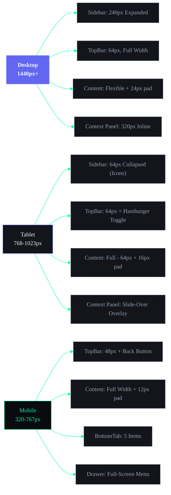

## Document Control

| Field | Value |
|---|---|
| Document ID | DSG-W01-001 |
| Version | 1.0.0 |
| Status | Active |
| Last Updated | 2026-07-11 |

# 01 — Application Shell & Navigation Wireframes

| Field | Value |
|---|---|
| Document | Part 1 of 6 |
| Scope | App Shell, Navigation, Command Center, Search, Notifications |
| Breakpoints | Desktop (1440px+), Tablet (768-1023px), Mobile (320-767px) |

---

## Responsive Shell Breakpoint Architecture



---

## 1. APPLICATION SHELL

### 1.1 Desktop Shell (1440px+)

```
┌──────────────────────────────────────────────────────────────────────────────────────┐
│ APP SHELL — DESKTOP (1440px+)                                                        │
├────────┬─────────────────────────────────────────────────────────────────────────────┤
│        │  ┌─────────────────────────────────────────────────────────────────────────┐│
│        │  │ TOP BAR (64px)                                                          ││
│        │  │                                                                         ││
│        │  │ Dashboard > Tasks > Detail    [🔍 Search...  ⌘K]     ⊕  🔔3  👤 RK  ││
│        │  │ ← Breadcrumbs                 ← Global Search        Quick  Notif User ││
│        │  └─────────────────────────────────────────────────────────────────────────┘│
│        │                                                                             │
│ S      │  ┌───────────────────────────────────────────────────┐  ┌─────────────────┐│
│ I      │  │                                                   │  │ CONTEXT PANEL   ││
│ D      │  │                                                   │  │ (320px)         ││
│ E      │  │                                                   │  │                 ││
│ B      │  │              MAIN CONTENT AREA                    │  │ AI Suggestions  ││
│ A      │  │              (flexible width)                     │  │                 ││
│ R      │  │                                                   │  │ Related Items   ││
│        │  │              Padding: 24px                        │  │                 ││
│ 240px  │  │                                                   │  │ Quick Actions   ││
│        │  │              Scrollable ↕                         │  │                 ││
│        │  │                                                   │  │ Properties      ││
│        │  │                                                   │  │                 ││
│        │  │                                                   │  │                 ││
│        │  └───────────────────────────────────────────────────┘  └─────────────────┘│
└────────┴─────────────────────────────────────────────────────────────────────────────┘
```

**Desktop Shell Specifications:**
- Sidebar: Fixed left, 240px wide, full viewport height
- Top Bar: Fixed top, 64px height, spans full width minus sidebar
- Content Area: Scrollable, fills remaining space, 24px padding all sides
- Context Panel: Optional right panel, 320px, visible on detail views
- Min content width: 600px (before context panel collapses)

---

### 1.2 Tablet Shell (768-1023px)

```
┌────┬────────────────────────────────────────────────────────────┐
│    │  ┌────────────────────────────────────────────────────────┐│
│    │  │ TOP BAR (64px)                                         ││
│ I  │  │                                                        ││
│ C  │  │ ≡  Dashboard > Tasks      [🔍 Search ⌘K]    ⊕  🔔  👤││
│ O  │  │ ↑                                                      ││
│ N  │  │ Toggle                                                 ││
│    │  └────────────────────────────────────────────────────────┘│
│ S  │                                                            │
│ I  │  ┌────────────────────────────────────────────────────────┐│
│ D  │  │                                                        ││
│ E  │  │              MAIN CONTENT AREA                         ││
│ B  │  │              (full width minus sidebar)                ││
│ A  │  │                                                        ││
│ R  │  │              Padding: 16px                             ││
│    │  │                                                        ││
│ 64 │  │              Scrollable ↕                              ││
│ px │  │                                                        ││
│    │  │                                                        ││
│    │  └────────────────────────────────────────────────────────┘│
└────┴────────────────────────────────────────────────────────────┘

Context Panel → Slide-over from right (overlays content)
┌────┬───────────────────────────────────┬───────────────────────┐
│    │           Content (dimmed)        │  CONTEXT PANEL        │
│ 64 │                                   │  320px slide-over     │
│ px │                                   │  [X Close]            │
│    │                                   │                       │
└────┴───────────────────────────────────┴───────────────────────┘
```

**Tablet Shell Specifications:**
- Sidebar: Collapsed to 64px (icons only), expandable overlay on tap
- Top Bar: 64px, includes hamburger toggle for sidebar
- Content: Full width minus 64px sidebar, 16px padding
- Context Panel: Slide-over overlay, not inline

---

### 1.3 Mobile Shell (320-767px)

```
┌──────────────────────────────────────┐
│ TOP BAR (48px)                       │
│                                      │
│ ←  Tasks                    🔍  ⋮   │
│ Back  Page Title            Search   │
├──────────────────────────────────────┤
│                                      │
│                                      │
│         MAIN CONTENT AREA            │
│         (full width)                 │
│                                      │
│         Padding: 12px                │
│                                      │
│         Scrollable ↕                 │
│                                      │
│                                      │
│                                      │
│                              ┌─────┐ │
│                              │ ⊕   │ │
│                              │ FAB │ │
│                              └─────┘ │
├──────────────────────────────────────┤
│ BOTTOM TAB BAR (56px)                │
│                                      │
│  🏠      ☑️      📚     📁     ✨   │
│ Home   Tasks   Learn  Projects  AI   │
│  •                                   │
│ (active)                             │
└──────────────────────────────────────┘
```

**Mobile Shell Specifications:**
- No sidebar (full navigation via drawer or bottom tabs)
- Top Bar: 48px, back arrow + page title + action icons
- Content: Full width, 12px padding, scrollable
- FAB: Floating action button, bottom-right, 56px, context-aware create action
- Bottom Tab Bar: 56px, 5 items, always visible (except in full-screen views)

---

### 1.4 Mobile Drawer (Navigation Overlay)

```
┌──────────────────────────────────────┐
│ DRAWER OVERLAY                       │
├──────────────────┬───────────────────┤
│ DRAWER (280px)   │                   │
│                  │   Dimmed           │
│ ┌──────────────┐ │   Background      │
│ │ 👤 Rohit K.  │ │   (tap to close)  │
│ │ BTech CSE    │ │                   │
│ ├──────────────┤ │                   │
│ │              │ │                   │
│ │ CORE         │ │                   │
│ │ • Dashboard  │ │                   │
│ │              │ │                   │
│ │ PRODUCTIVITY │ │                   │
│ │   Tasks      │ │                   │
│ │   Time       │ │                   │
│ │   Habits     │ │                   │
│ │   Automation │ │                   │
│ │              │ │                   │
│ │ LEARNING     │ │                   │
│ │   Courses    │ │                   │
│ │   Resources  │ │                   │
│ │   Academics  │ │                   │
│ │   YouTube    │ │                   │
│ │              │ │                   │
│ │ GROWTH       │ │                   │
│ │   Goals      │ │                   │
│ │   Projects   │ │                   │
│ │   Ideas      │ │                   │
│ │              │ │                   │
│ │ FINANCIAL    │ │                   │
│ │   Income     │ │                   │
│ │   Opportun.  │ │                   │
│ │              │ │                   │
│ │ AI           │ │                   │
│ │   Chat ARIA  │ │                   │
│ │              │ │                   │
│ ├──────────────┤ │                   │
│ │ ⚙ Settings   │ │                   │
│ │ ? Help       │ │                   │
│ └──────────────┘ │                   │
└──────────────────┴───────────────────┘
```

---

## 2. NAVIGATION WIREFRAMES

### 2.1 Sidebar Navigation — Desktop (Expanded, 240px)

```
┌────────────────────────────────────┐
│                                    │
│  ◆ ARIA OS                  v2.0  │
│                                    │
├────────────────────────────────────┤
│  ┌──┐                             │
│  │👤│  Rohit Kumar                 │
│  └──┘  Online • BTech CSE         │
├────────────────────────────────────┤
│                                    │
│  CORE                              │
│  ▌ ▣ Dashboard              —     │ ← Active (accent left border)
│                                    │
│  PRODUCTIVITY                      │
│    ☑ Tasks                  12     │ ← Badge: 12 pending
│    ⏱ Time Tracking          —     │
│    🔄 Habits                 5     │ ← Badge: 5 due today
│    ⚡ Automation             —     │
│                                    │
│  LEARNING                          │
│    📚 Courses                3     │ ← Badge: 3 active
│    📦 Resources              —     │
│    🎓 Academics              —     │
│    ▶ YouTube                —     │
│                                    │
│  GROWTH                            │
│    🎯 Goals                  —     │
│    📁 Projects               2     │ ← Badge: 2 active
│    💡 Ideas                  —     │
│                                    │
│  FINANCIAL                         │
│    💰 Income                 —     │
│    🔭 Opportunities          3     │ ← Badge: 3 new matches
│                                    │
│  AI                                │
│    ✨ Chat with ARIA         —     │
│                                    │
├────────────────────────────────────┤
│                                    │
│  ⚙ Settings                       │
│  ? Help & Feedback                 │
│                                    │
│                     [« Collapse]   │
└────────────────────────────────────┘
```

**Sidebar Specifications:**
- Width: 240px expanded
- Navigation groups: 6 groups separated by labels
- Active item: Left accent border (4px), background highlight
- Hover: Background color shift
- Badge: Right-aligned count for items needing attention
- Collapse toggle: Bottom-right, collapses to 64px icon view
- Fixed position: Does not scroll with content
- Scroll: Internal scroll if nav items exceed viewport

---

### 2.2 Sidebar Navigation — Collapsed (64px)

```
┌──────┐
│      │
│  ◆   │  ← Logo mark only
│      │
├──────┤
│ ┌──┐ │
│ │👤│ │  ← Avatar only
│ └──┘ │
├──────┤
│      │
│  ▣   │  Dashboard        ← Tooltip on hover
│  ☑   │  Tasks         12
│  ⏱   │  Time Tracking
│  🔄  │  Habits         5
│  ⚡  │  Automation
│  📚  │  Courses        3
│  📦  │  Resources
│  🎓  │  Academics
│  ▶   │  YouTube
│  🎯  │  Goals
│  📁  │  Projects       2
│  💡  │  Ideas
│  💰  │  Income
│  🔭  │  Opportunities  3
│  ✨  │  Chat ARIA
│      │
├──────┤
│  ⚙   │  Settings
│  ?   │  Help
│  »   │  Expand
└──────┘
```

**Collapsed Specifications:**
- Width: 64px
- Icons centered, 24px size
- Tooltip on hover showing label + badge
- Badge shown as small dot on icon corner
- Expand toggle at bottom

---

### 2.3 Top Navigation Bar

```
┌────────────────────────────────────────────────────────────────────────────────┐
│ TOP BAR (64px height)                                                          │
│                                                                                │
│  ≡   Dashboard > Tasks > Task Detail      [🔍 Search or command...  ⌘K]       │
│  ↑   ← Breadcrumbs (clickable)            ← Search bar (expandable)           │
│  Sidebar                                                                       │
│  toggle                                                                        │
│  (tablet                        ┌──────┐  ┌──────┐  ┌──────┐  ┌──────────┐   │
│   only)                         │  ⊕   │  │ 🔔   │  │  ⌘   │  │ 👤 RK ▾ │   │
│                                 │Quick │  │  3   │  │Cmd   │  │ User    │   │
│                                 │Create│  │Notif │  │Palette│  │ Menu    │   │
│                                 └──────┘  └──────┘  └──────┘  └──────────┘   │
└────────────────────────────────────────────────────────────────────────────────┘
```

**Top Bar — Quick Create (⊕) Dropdown:**

```
┌─────────────────────────────┐
│ Quick Create                │
├─────────────────────────────┤
│  ☑  New Task           ⌘N  │
│  💡 New Idea            —   │
│  📁 New Project         —   │
│  📚 Add Course          —   │
│  📦 Add Resource        —   │
│  💰 Log Income          —   │
│  🎯 New Goal            —   │
├─────────────────────────────┤
│  ⏱  Start Timer        ⌘T  │
│  📝 Quick Note          —   │
└─────────────────────────────┘
```

**Top Bar — User Menu Dropdown:**

```
                         ┌─────────────────────────┐
                         │ 👤 Rohit Kumar           │
                         │    rohit@email.com       │
                         ├─────────────────────────┤
                         │  👤 Profile              │
                         │  ⚙  Settings             │
                         │  🎨 Appearance            │
                         │  ⌨  Keyboard Shortcuts   │
                         ├─────────────────────────┤
                         │  📤 Export Data           │
                         │  ? Help & Support        │
                         ├─────────────────────────┤
                         │  🚪 Sign Out              │
                         └─────────────────────────┘
```

---

### 2.4 Mobile Navigation

**Bottom Tab Bar (56px):**

```
┌──────────────────────────────────────┐
│                                      │
│  🏠        ☑️       📚      📁     ✨ │
│  Home     Tasks    Learn  Projects AI│
│   ●                                  │
│ (active dot indicator)               │
│                                      │
└──────────────────────────────────────┘
```

**Mobile Top Bar Variations:**

```
Module list page:
┌──────────────────────────────────────┐
│ ≡   Tasks                    🔍  ⊕  │
│ Menu  Title                Search Add│
└──────────────────────────────────────┘

Detail page:
┌──────────────────────────────────────┐
│ ←   Task Detail             ✏️  ⋮  │
│ Back  Title                Edit More │
└──────────────────────────────────────┘

Search active:
┌──────────────────────────────────────┐
│ ←  [Search tasks...            ✕]   │
│ Back  Search input           Clear  │
└──────────────────────────────────────┘
```

---

### 2.5 Command Center / Command Palette (⌘K)

```
┌─────────────────────────────────────────────────────────────────┐
│                                                                  │
│  ┌───────────────────────────────────────────────────────────┐  │
│  │                                                           │  │
│  │  COMMAND CENTER                                           │  │
│  │                                                           │  │
│  │  ┌───────────────────────────────────────────────────┐    │  │
│  │  │ 🔍 Type a command or search...                    │    │  │
│  │  └───────────────────────────────────────────────────┘    │  │
│  │                                                           │  │
│  │  RECENT                                                   │  │
│  │  ┌───────────────────────────────────────────────────┐    │  │
│  │  │  ⏱  Start Focus Timer                     ⌘T     │    │  │
│  │  │  ☑  Create New Task                        ⌘N     │    │  │
│  │  │  📚 Go to Courses                          R C    │    │  │
│  │  └───────────────────────────────────────────────────┘    │  │
│  │                                                           │  │
│  │  NAVIGATION                                               │  │
│  │  ┌───────────────────────────────────────────────────┐    │  │
│  │  │  ▣  Go to Dashboard                        R D    │    │  │
│  │  │  ☑  Go to Tasks                            R T    │    │  │
│  │  │  📚 Go to Courses                          R C    │    │  │
│  │  │  🎯 Go to Goals                            R G    │    │  │
│  │  │  📁 Go to Projects                         R P    │    │  │
│  │  └───────────────────────────────────────────────────┘    │  │
│  │                                                           │  │
│  │  ACTIONS                                                  │  │
│  │  ┌───────────────────────────────────────────────────┐    │  │
│  │  │  ☑  Create Task                            ⌘N     │    │  │
│  │  │  ⏱  Start Timer                            ⌘T     │    │  │
│  │  │  💡 Capture Idea                            —      │    │  │
│  │  │  📦 Add Resource                            —      │    │  │
│  │  │  🔄 Log Habit                               —      │    │  │
│  │  └───────────────────────────────────────────────────┘    │  │
│  │                                                           │  │
│  │  AI COMMANDS                                              │  │
│  │  ┌───────────────────────────────────────────────────┐    │  │
│  │  │  ✨ Ask ARIA...                             /ai    │    │  │
│  │  │  📊 Generate Daily Briefing                /brief  │    │  │
│  │  │  📋 Weekly Review                         /review  │    │  │
│  │  │  🔭 Run Opportunity Radar                 /radar   │    │  │
│  │  └───────────────────────────────────────────────────┘    │  │
│  │                                                           │  │
│  │  ───────────────────────────────────────────────────      │  │
│  │  ↑↓ Navigate    ↵ Select    Esc Close    Tab Category    │  │
│  │                                                           │  │
│  └───────────────────────────────────────────────────────────┘  │
│                                                                  │
│                      (dimmed backdrop)                            │
└─────────────────────────────────────────────────────────────────┘
```

**Command Palette Specifications:**
- Triggered by: ⌘K (Mac), Ctrl+K (Windows), or click command trigger in top bar
- Width: 640px centered, max-height: 480px
- Backdrop: Dimmed overlay, click outside to close
- Sections: Recent (3), Navigation (5+), Actions (5+), AI Commands (4+)
- Each item: Icon + Label + Keyboard shortcut
- Keyboard: ↑↓ arrow navigation, Enter to select, Esc to close
- Search: Fuzzy matching, filters results as user types
- Mobile: Full-screen bottom sheet instead of centered modal

---

### 2.6 Global Search

```
┌─────────────────────────────────────────────────────────────────┐
│ GLOBAL SEARCH OVERLAY                                            │
│                                                                  │
│  ┌───────────────────────────────────────────────────────────┐  │
│  │ 🔍 Search everything...                              ✕   │  │
│  └───────────────────────────────────────────────────────────┘  │
│                                                                  │
│  Filter: [All] [Tasks] [Courses] [Projects] [Ideas] [Resources] │
│           ↑ active chip highlighted                              │
│                                                                  │
│  ─────────────────────────────────────────────────────────────── │
│                                                                  │
│  RECENT SEARCHES                                                 │
│  ┌───────────────────────────────────────────────────────────┐  │
│  │  🕐 react server components                              │  │
│  │  🕐 DSA assignment                                        │  │
│  │  🕐 portfolio website project                             │  │
│  └───────────────────────────────────────────────────────────┘  │
│                                                                  │
│  AI SUGGESTED                                                    │
│  ┌───────────────────────────────────────────────────────────┐  │
│  │  ✨ "overdue tasks"     — 3 tasks are overdue             │  │
│  │  ✨ "ML coursework"     — Course deadline in 2 days       │  │
│  │  ✨ "GSoC application"  — Deadline approaching            │  │
│  └───────────────────────────────────────────────────────────┘  │
│                                                                  │
└─────────────────────────────────────────────────────────────────┘

After typing "react":
┌─────────────────────────────────────────────────────────────────┐
│  🔍 react                                                  ✕   │
├─────────────────────────────────────────────────────────────────┤
│  Filter: [All] [Tasks] [Courses] [Projects] [Ideas] [Resources] │
│                                                                  │
│  ── TASKS (3 results) ────────────────────────────────────────── │
│                                                                  │
│  ☑ Build React Portfolio Component                               │
│    Due: Jun 15 • Priority: High • Status: In Progress            │
│                                                                  │
│  ☑ Review React 18 Concurrent Features                           │
│    Due: Jun 12 • Priority: Medium • Status: Pending              │
│                                                                  │
│  ☑ Fix React Router Bug in Dashboard                             │
│    Due: Jun 10 • Priority: Urgent • Status: Overdue              │
│                                                                  │
│  ── COURSES (2 results) ──────────────────────────────────────── │
│                                                                  │
│  📚 Full Stack React Development                                 │
│    Udemy • Progress: 68% • 12/18 lessons                         │
│                                                                  │
│  📚 React Native Mobile Development                              │
│    YouTube • Progress: 23% • 5/22 lessons                        │
│                                                                  │
│  ── RESOURCES (1 result) ─────────────────────────────────────── │
│                                                                  │
│  📦 React 18 Server Components Guide                             │
│    Article • Added: Jun 8 • Tags: react, ssr                     │
│                                                                  │
│  ─────────────────────────────────────────────────────────────── │
│  Showing 6 results • [View all results →]                        │
└─────────────────────────────────────────────────────────────────┘
```

---

### 2.7 Notification Panel

```
                                    ┌──────────────────────────────────────┐
                                    │ NOTIFICATIONS                    ⚙  │
                                    │                    [Mark all read]   │
                                    ├──────────────────────────────────────┤
                                    │ [All] [Unread 5] [Mentions] [AI]    │
                                    ├──────────────────────────────────────┤
                                    │                                      │
                                    │ TODAY                                │
                                    │ ┌──────────────────────────────────┐ │
                                    │ │ 🔴 URGENT                        │ │
                                    │ │ DSA Assignment Overdue           │ │
                                    │ │ Due 2 hours ago • Tasks          │ │
                                    │ │ [View Task]  [Snooze 1hr]       │ │
                                    │ ├──────────────────────────────────┤ │
                                    │ │ ✨ AI INSIGHT                     │ │
                                    │ │ Morning Briefing Ready           │ │
                                    │ │ 3 priorities for today           │ │
                                    │ │ 8:00 AM                          │ │
                                    │ │ [View Briefing]                  │ │
                                    │ ├──────────────────────────────────┤ │
                                    │ │ 🔭 NEW MATCH                     │ │
                                    │ │ Google STEP Internship — 92%     │ │
                                    │ │ Deadline: Jun 20 (9 days)        │ │
                                    │ │ [View] [Save] [Dismiss]         │ │
                                    │ ├──────────────────────────────────┤ │
                                    │ │ 🔄 HABIT REMINDER                │ │
                                    │ │ 3 habits remaining today         │ │
                                    │ │ Morning coding, Reading, Gym     │ │
                                    │ │ 6:30 PM                          │ │
                                    │ │ [Log Now]                        │ │
                                    │ └──────────────────────────────────┘ │
                                    │                                      │
                                    │ YESTERDAY                            │
                                    │ ┌──────────────────────────────────┐ │
                                    │ │ 📚 COURSE UPDATE                  │ │
                                    │ │ ML Specialization: Lesson 13     │ │
                                    │ │ unlocked                         │ │
                                    │ │ Yesterday, 9:15 PM               │ │
                                    │ ├──────────────────────────────────┤ │
                                    │ │ ✨ WEEKLY REVIEW                  │ │
                                    │ │ Your weekly review is ready      │ │
                                    │ │ Productivity: 78/100             │ │
                                    │ │ Yesterday, 8:00 PM               │ │
                                    │ └──────────────────────────────────┘ │
                                    │                                      │
                                    │ [Load more...]                       │
                                    └──────────────────────────────────────┘
```

**Notification Panel — Empty State:**

```
                                    ┌──────────────────────────────────────┐
                                    │ NOTIFICATIONS                    ⚙  │
                                    ├──────────────────────────────────────┤
                                    │ [All] [Unread 0] [Mentions] [AI]    │
                                    ├──────────────────────────────────────┤
                                    │                                      │
                                    │                                      │
                                    │           🔔                         │
                                    │                                      │
                                    │     All caught up!                   │
                                    │                                      │
                                    │   No new notifications.              │
                                    │   Check back later or adjust         │
                                    │   your notification settings.        │
                                    │                                      │
                                    │     [⚙ Notification Settings]        │
                                    │                                      │
                                    │                                      │
                                    └──────────────────────────────────────┘
```

---

## 3. PAGE HIERARCHY

```
L0 — Application Shell
│
├── L1 — Dashboard (Home)
│   ├── L2 — Morning Briefing (expanded hero)
│   ├── L2 — Widget Configuration Modal (L4)
│   └── L2 — Layout Presets Selector (L4)
│
├── L1 — Tasks
│   ├── L2 — List View (default)
│   │   └── L3 — Task Detail (split pane or full page)
│   │       └── L4 — Edit Task Modal
│   ├── L2 — Board View (Kanban)
│   │   └── L3 — Task Detail
│   ├── L2 — Calendar View
│   │   ├── L3 — Month View
│   │   ├── L3 — Week View
│   │   └── L3 — Day View
│   └── L4 — Create Task Modal
│
├── L1 — Time Tracking
│   ├── L2 — Timer View (Pomodoro)
│   ├── L2 — Entries Log
│   ├── L2 — Daily Statistics
│   └── L4 — Manual Entry Modal
│
├── L1 — Habits
│   ├── L2 — Calendar Tracker View
│   ├── L2 — Grid View
│   ├── L3 — Habit Detail
│   └── L4 — Add Habit Modal
│
├── L1 — Automation
│   ├── L2 — Rules List
│   ├── L3 — Rule Detail / Editor
│   └── L4 — Create Rule Modal
│
├── L1 — Courses
│   ├── L2 — Library View (Grid / List toggle)
│   ├── L2 — Course Detail
│   │   ├── L3 — Overview Tab
│   │   ├── L3 — Lessons Tab
│   │   ├── L3 — Notes Tab
│   │   └── L3 — Analytics Tab
│   ├── L2 — Progress Dashboard
│   └── L4 — Add Course Modal
│
├── L1 — Resources (Knowledge Vault)
│   ├── L2 — Grid / List View
│   ├── L2 — Search Results
│   ├── L2 — Knowledge Graph View
│   ├── L3 — Resource Detail
│   └── L4 — Add Resource Modal
│
├── L1 — Academics
│   ├── L2 — Semester Overview
│   ├── L3 — Subject Detail
│   └── L4 — Add Subject Modal
│
├── L1 — YouTube
│   ├── L2 — Video Library
│   ├── L3 — Video Detail
│   └── L4 — Add Video Modal
│
├── L1 — Goals (Roadmap Engine)
│   ├── L2 — Canvas View
│   ├── L2 — Timeline View (Gantt)
│   ├── L2 — Milestones View
│   ├── L2 — Dependencies View
│   ├── L3 — Goal Detail
│   │   ├── L3 — Overview Tab
│   │   ├── L3 — Tasks Tab
│   │   ├── L3 — Milestones Tab
│   │   └── L3 — Dependencies Tab
│   └── L4 — Create Goal Modal
│
├── L1 — Projects
│   ├── L2 — Board View (Kanban)
│   ├── L2 — Timeline View
│   ├── L2 — Grid View
│   ├── L3 — Project Detail (5 tabs)
│   └── L4 — Create Project Modal
│
├── L1 — Ideas (Idea Vault)
│   ├── L2 — Capture View
│   ├── L2 — Pipeline Board
│   ├── L3 — Idea Detail + AI Analysis
│   └── L4 — Quick Capture Modal
│
├── L1 — Income
│   ├── L2 — Overview Dashboard
│   ├── L2 — Sources List
│   ├── L2 — Analytics
│   ├── L3 — Source Detail
│   └── L4 — Log Income Modal
│
├── L1 — Opportunities (Radar)
│   ├── L2 — Discovery View (Grid / List)
│   ├── L2 — AI Recommendations
│   ├── L2 — Filter Panel
│   ├── L3 — Opportunity Detail
│   └── L4 — Add Opportunity Modal
│
├── L1 — Analytics
│   ├── L2 — Overview Dashboard
│   ├── L2 — Reports
│   │   ├── L3 — Report Generator
│   │   └── L3 — Generated Report View
│   └── L2 — AI Insights Feed
│
├── L1 — Chat (ARIA AI)
│   ├── L2 — Chat Thread
│   ├── L2 — Chat History List
│   └── L3 — Context Panel
│
├── L1 — Sleep
│   ├── L2 — Log View
│   ├── L2 — Analytics
│   └── L4 — Log Sleep Modal
│
├── L1 — Settings
│   ├── L2 — Profile
│   ├── L2 — Appearance
│   ├── L2 — Notifications
│   ├── L2 — AI & Intelligence
│   ├── L2 — Integrations
│   ├── L2 — Data & Privacy
│   ├── L2 — Keyboard Shortcuts
│   └── L2 — About
│
└── System Overlays (L4 — accessible from anywhere)
    ├── Command Center (⌘K)
    ├── Global Search
    ├── Notification Panel
    ├── Quick Create Menu (⊕)
    └── AI Quick Ask
```

---

## 4. COMPONENT HIERARCHY

### Layout Components
```
AppShell
├── Sidebar
│   ├── SidebarHeader (logo + user)
│   ├── NavGroup (label + items)
│   │   └── NavItem (icon + label + badge)
│   └── SidebarFooter (settings + collapse)
├── TopBar
│   ├── Breadcrumb
│   ├── SearchBar
│   ├── QuickCreateButton
│   ├── NotificationBell
│   ├── CommandPaletteTrigger
│   └── UserMenu
├── ContentArea
│   └── PageHeader (title + actions + view switcher)
├── ContextPanel
└── BottomTabBar (mobile)
    └── BottomTab (icon + label + indicator)
```

### Navigation Components
```
NavItem          → Icon + Label + Badge + Active state
Breadcrumb       → Path segments, clickable, truncated on mobile
TabBar           → Horizontal tabs (underline / pill variants)
ViewSwitcher     → Icon toggle buttons (List | Board | Calendar)
BackButton       → ← arrow + optional label
BottomTab        → Icon + Label + Active dot
DrawerMenu       → Full-screen slide overlay
```

### Data Display Components
```
MetricCard       → Value + Label + Trend arrow + Sparkline
DataCard         → Header + Body + Footer + Actions
DataTable        → Header row + Data rows + Sort + Pagination
KanbanBoard      → Columns + Draggable cards
KanbanCard       → Priority + Title + Meta + Tags
Calendar         → Month / Week / Day grid + Events
Timeline         → Gantt bars + Milestones + Dependencies
Chart            → Line / Bar / Donut / Heatmap / Radar
ProgressBar      → Filled track + Label + Percentage
ProgressRing     → Circular progress + Center label
Badge            → Status / Priority / Count / Tag
Avatar           → Image / Initials / Bot icon
List             → Items with optional grouping
Grid             → Auto-fill card grid (2/3/4 col)
Heatmap          → Calendar grid with intensity colors
EmptyState       → Icon + Title + Description + CTA
Skeleton         → Shimmer placeholders
```

### Input Components
```
SearchBar        → Icon + Input + Clear + Shortcut hint
FilterBar        → Chip list + Add filter
FilterChip       → Label + Remove (×)
TextInput        → Label + Input + Error + Helper
TextArea         → Multi-line + Auto-grow
Select           → Dropdown + Search + Multi-select
DatePicker       → Calendar popup + Range mode
PrioritySelector → 4-level visual picker
TagInput         → Multi-tag + Autocomplete
Toggle           → On/Off switch
Checkbox         → Check + Label
RadioGroup       → Options + Selection
RangeSlider      → Track + Handle(s) + Labels
StarRating       → 1-5 stars interactive
QuickCapture     → Inline input + Submit
```

### Feedback Components
```
Modal            → Backdrop + Content + Close
Dialog           → Confirm / Alert / Destructive
Toast            → Success / Error / Warning / Info
Tooltip          → Hover info popup
Popover          → Click-triggered popup
LoadingSpinner   → Circular animation
ErrorState       → Icon + Title + Description + Retry
OfflineBanner    → Status bar + Message
```

### AI Components
```
ChatBubble       → User / ARIA / System variants
TypingIndicator  → Three dots animation
SuggestionCard   → Recommendation + Accept / Modify / Dismiss
InsightCard      → Pattern / Risk / Achievement type
AIBanner         → Proactive notification bar
MatchScore       → Percentage + Breakdown bars
ConfidenceBadge  → High / Medium / Low
GhostHint        → Placeholder suggestion text
StreamingText    → Typewriter response effect
```

---

## 5. LAYOUT HIERARCHY

### Pattern 1 — Single Column (Mobile)
```
┌──────────────────────────┐
│        Top Bar           │
├──────────────────────────┤
│   Page Header            │
│   ─────────────────────  │
│   Content Block 1        │
│   ─────────────────────  │
│   Content Block 2        │
│   ─────────────────────  │
│   Content Block 3        │
│   (scrollable)           │
├──────────────────────────┤
│      Bottom Nav          │
└──────────────────────────┘
Use: All mobile pages
```

### Pattern 2 — Two Column: Sidebar + Content
```
┌────────┬────────────────────────────┐
│        │      Top Bar               │
│        ├────────────────────────────┤
│ Sidebar│   Page Header              │
│ 240px  │   ──────────────────────── │
│        │   Content                  │
│        │   (scrollable)             │
│        │                            │
└────────┴────────────────────────────┘
Use: All desktop module list pages
```

### Pattern 3 — Three Column: Sidebar + Content + Context
```
┌────────┬──────────────────┬─────────┐
│        │    Top Bar       │         │
│        ├──────────────────┤ Context │
│ Sidebar│  Content         │ Panel   │
│ 240px  │  (scrollable)    │ 320px   │
│        │                  │         │
└────────┴──────────────────┴─────────┘
Use: Detail views with AI suggestions
```

### Pattern 4 — Split View: List + Detail
```
┌────────┬──────────┬─────────────────┐
│        │  Top Bar │                 │
│        ├──────────┼─────────────────┤
│ Sidebar│ List     │ Detail View     │
│ 240px  │ Panel    │ (selected item) │
│        │ 360px    │ (flexible)      │
│        │ scroll ↕ │ scroll ↕        │
└────────┴──────────┴─────────────────┘
Use: Tasks, Resources (desktop)
```

### Pattern 5 — Bento Grid: Dashboard
```
┌────────┬──────────────────────────────────┐
│        │      Top Bar                     │
│        ├──────────────────────────────────┤
│ Sidebar│ ┌──────────────────────────────┐ │
│ 240px  │ │     Hero Card (full width)   │ │
│        │ ├───────┬───────┬──────┬───────┤ │
│        │ │ Card  │ Card  │ Card │ Card  │ │
│        │ ├───────┴───────┼──────┴───────┤ │
│        │ │ Wide Card     │ Wide Card    │ │
│        │ ├───────┬───────┼──────┬───────┤ │
│        │ │ Card  │ Card  │ Card │ Card  │ │
│        │ └───────┴───────┴──────┴───────┘ │
└────────┴──────────────────────────────────┘
Use: Dashboard
```

### Pattern 6 — Full Canvas
```
┌────────┬──────────────────────────────────┐
│        │      Toolbar                     │
│        ├──────────────────────────────────┤
│ Sidebar│                                  │
│ 240px  │    Interactive Canvas            │
│        │    (pan, zoom, drag)             │
│        │                                  │
│        │              ┌────────┐          │
│        │              │Minimap │          │
│        │              └────────┘          │
└────────┴──────────────────────────────────┘
Use: Roadmap Canvas, Knowledge Graph
```

---

## 6. NAVIGATION FLOW DIAGRAMS

### 6.1 Primary Navigation Flow (Sidebar)
```
User clicks NavItem in Sidebar
         │
         â–¼
URL updates (/tasks, /courses, etc.)
         │
         â–¼
Active NavItem state updates (accent border)
         │
         â–¼
Breadcrumb updates (Dashboard > [Module])
         │
         â–¼
Page component mounts
         │
         â–¼
Data fetches (loading skeleton shown)
         │
         â–¼
Content renders (skeleton replaced)
         │
         â–¼
Focus moves to page <h1>
```

### 6.2 Deep Linking Flow
```
User enters URL: /tasks?view=board&filter=priority:high
         │
         â–¼
Router parses: module=tasks, view=board, filters={priority:high}
         │
         â–¼
App Shell renders (Sidebar + TopBar)
         │
         â–¼
Tasks module loads with Board view active
         │
         â–¼
Filter chips reflect priority:high
         │
         â–¼
Board shows only high-priority tasks
```

### 6.3 Cross-Module Navigation Flow
```
Task Detail → Click linked Goal
         │
         â–¼
Navigate to /goals/[goal-id]
         │
         â–¼
Goal Detail → Click linked Project
         │
         â–¼
Navigate to /projects/[project-id]
         │
         â–¼
Project Detail → Click Related Resource
         │
         â–¼
Navigate to /resources/[resource-id]
         │
         â–¼
Breadcrumb shows full path
Back button returns to previous context
```

### 6.4 Mobile Navigation Flow
```
Bottom Tab Tap (e.g., "Learn")
         │
         â–¼
Navigate to /courses (default module for Learn tab)
         │
         ├── Course card tap → /courses/[id] (detail)
         │         │
         │         └── Back ← → returns to list
         │
         ├── ≡ Drawer open → Full navigation tree
         │         │
         │         └── Tap "Resources" → /resources (navigate + close drawer)
         │
         └── FAB tap → Create new course modal
```

### 6.5 Command Palette Flow
```
⌘K pressed
         │
         â–¼
Command Palette modal opens
         │
         ├── Type "tasks" → Navigation results shown
         │         │
         │         └── Enter → Navigate to /tasks, palette closes
         │
         ├── Type "create task" → Action result shown
         │         │
         │         └── Enter → Create Task modal opens
         │
         ├── Type "/brief" → AI command shown
         │         │
         │         └── Enter → AI generates briefing, toast confirms
         │
         └── Esc → Palette closes, focus returns to previous element
```

### 6.6 Notification → Action Flow
```
🔔 Bell clicked → Notification Panel slides open
         │
         â–¼
User sees grouped notifications
         │
         ├── Click notification body → Navigate to related item
         │         │
         │         └── Panel auto-closes on navigation
         │
         ├── Click action button (e.g., "View Task")
         │         │
         │         └── Navigate directly to task detail
         │
         ├── Click "Mark all read" → All notifications marked read
         │
         └── Click outside / ✕ → Panel closes
```

---

*End of Part 1 — Application Shell & Navigation Wireframes*
