## Document Control

| Field | Value |
|---|---|
| Document ID | DSG-W02-001 |
| Version | 1.0.0 |
| Status | Active |
| Last Updated | 2026-07-11 |

# 02 — Dashboard Wireframes

| Field | Value |
|---|---|
| Document | Part 2 of 6 |
| Scope | Morning Briefing, Productivity, AI Insights, Learning, Opportunities, Projects, Analytics |
| Breakpoints | Desktop (1440px+), Tablet (768-1023px), Mobile (320-767px) |

---

## Dashboard Widget Grid Layout

```mermaid
%%{init: {'theme':'base','themeVariables':{'primaryColor':'#6366F1','primaryTextColor':'#F1F5F9','lineColor':'#00FFA3','secondaryColor':'#13151A','tertiaryColor':'#0A0B0F','fontFamily':'DM Sans'}}}%%
graph TD
    subgraph Dashboard["Dashboard — Bento Grid (7 Sections)"]
        style Dashboard fill:#13151A,stroke:#334155,color:#F1F5F9
    end

    Hero["MORNING BRIEFING<br/>Hero Card — Full Width Row"]:::hero

    Hero --> Prod["PRODUCTIVITY<br/>2x2 Grid: Summary + Time + Habits + Actions"]:::section

    Prod --> TSum["Task Summary<br/>Due / Overdue / Completed Today"]:::widget
    Prod --> TTime["Time Tracking<br/>Today's Focus Hours"]:::widget
    Prod --> Habit["Habit Tracker<br/>Streak + Today's Progress"]:::widget
    Prod --> Action["Quick Actions<br/>New Task / Log Time / Capture Idea"]:::widget

    Hero --> AI["AI INSIGHTS<br/>2-Column Row"]:::section
    AI --> AI1["Primary Insight<br/>ARIA Suggestion Card"]:::widget
    AI --> AI2["Pattern Detection<br/>Behavior Trend Alerts"]:::widget
    AI --> AI3["Risk Alert<br/>Deadline Warnings"]:::widget
    AI --> AI4["Learning Suggestion<br/>Course Recommendations"]:::widget

    Hero --> Learn["LEARNING<br/>Progress + Study Time"]:::section
    Learn --> Course["Course Progress<br/>Per-Course Completion Bars"]:::widget
    Learn --> Study["Study Time<br/>Weekly Distribution"]:::widget

    Hero --> Opps["OPPORTUNITIES<br/>Top 3 Matches Preview"]:::section
    Hero --> Proj["PROJECTS<br/>Active + Milestone Timeline"]:::section
    Hero --> An["ANALYTICS<br/>Trend Sparklines"]:::section

    classDef hero fill:#6366F1,stroke:#818CF8,color:#F1F5F9,font-weight:700
    classDef section fill:#13151A,stroke:#6366F1,color:#F1F5F9
    classDef widget fill:#0A0B0F,stroke:#334155,color:#94A3B8
```



---

## 1. MORNING BRIEFING WIDGET (Hero Card)

### Desktop (1440px)

```
┌────────────────────────────────────────────────────────────────────────────────────────┐
│ MORNING BRIEFING                                                          Jun 11, 2026│
│                                                                                        │
│  ┌──────────────────────┐  ┌──────────────────────────────┐  ┌──────────────────────┐ │
│  │                      │  │                              │  │                      │ │
│  │  ☀ Good Morning,     │  │  TODAY'S PRIORITIES           │  │  QUICK STATS         │ │
│  │  Rohit!              │  │                              │  │                      │ │
│  │                      │  │  1. ☑ Complete DSA Ch.5      │  │  📋 Tasks Due    7   │ │
│  │  Wednesday           │  │     Due: 11:59 PM • Urgent   │  │  ⚠ Overdue      2   │ │
│  │  June 11, 2026       │  │                              │  │  ✅ Done Today  3   │ │
│  │                      │  │  2. 📚 ML Lecture 13         │  │                      │ │
│  │  🌤 28°C Hyderabad   │  │     Course • 45 min est.     │  │  🔥 Streak     12d  │ │
│  │                      │  │                              │  │  😴 Sleep      7.2h  │ │
│  │  Focus Time: 4.5h    │  │  3. 📁 Portfolio PR Review   │  │  💰 Income    ₹12K  │ │
│  │  remaining today     │  │     Project • In Review      │  │                      │ │
│  │                      │  │                              │  │                      │ │
│  └──────────────────────┘  │  ✨ ARIA says: "Your ML      │  └──────────────────────┘ │
│                             │  deadline is in 3 days.      │                           │
│                             │  Prioritize Lecture 13."     │                           │
│                             └──────────────────────────────┘                           │
│                                                                                        │
│  ┌─────────────────────────────────────────────────────────────────────────────────┐   │
│  │ 💬 "You completed 85% of yesterday's tasks. Keep the momentum going!"          │   │
│  │                                            [▶ Start Focus]  [📋 Review Plan]    │   │
│  └─────────────────────────────────────────────────────────────────────────────────┘   │
└────────────────────────────────────────────────────────────────────────────────────────┘
```

### Tablet (768px)

```
┌────────────────────────────────────────────────────────────────┐
│ MORNING BRIEFING                                    Jun 11     │
│                                                                │
│  ┌──────────────────────┐  ┌────────────────────────────────┐ │
│  │ ☀ Good Morning,      │  │ QUICK STATS                    │ │
│  │ Rohit!               │  │ 📋 7 due  ⚠ 2 overdue  ✅ 3  │ │
│  │ Wed, Jun 11 • 28°C   │  │ 🔥 12d streak  😴 7.2h sleep  │ │
│  └──────────────────────┘  └────────────────────────────────┘ │
│                                                                │
│  TODAY'S PRIORITIES                                            │
│  1. ☑ Complete DSA Ch.5 — Due 11:59 PM • Urgent               │
│  2. 📚 ML Lecture 13 — Course • 45 min                         │
│  3. 📁 Portfolio PR Review — Project • In Review               │
│                                                                │
│  ✨ "Prioritize ML deadline — 3 days remaining."               │
│                                   [▶ Start Focus] [📋 Review] │
└────────────────────────────────────────────────────────────────┘
```

### Mobile (375px)

```
┌──────────────────────────────────────┐
│ ☀ Good Morning, Rohit!               │
│ Wed, Jun 11 • 28°C                   │
├──────────────────────────────────────┤
│                                      │
│ ← [📋 7 due] [⚠ 2] [✅ 3] [🔥 12d] →│
│   (horizontal scroll chips)          │
│                                      │
├──────────────────────────────────────┤
│ TODAY'S PRIORITIES                    │
│                                      │
│ ┌──────────────────────────────────┐ │
│ │ 1. Complete DSA Ch.5             │ │
│ │    Due 11:59 PM • Urgent  🔴     │ │
│ └──────────────────────────────────┘ │
│ ┌──────────────────────────────────┐ │
│ │ 2. ML Lecture 13                 │ │
│ │    Course • 45 min         📚    │ │
│ └──────────────────────────────────┘ │
│ ┌──────────────────────────────────┐ │
│ │ 3. Portfolio PR Review           │ │
│ │    Project • In Review     📁    │ │
│ └──────────────────────────────────┘ │
│                                      │
│ ✨ "Prioritize ML deadline."         │
│                                      │
│ [▶ Start Focus Session]             │
└──────────────────────────────────────┘
```

---

## 2. PRODUCTIVITY OVERVIEW SECTION

### Task Summary Card

```
┌────────────────────────────────────┐
│ TASKS                    [View →]  │
├────────────────────────────────────┤
│                                    │
│  Due Today        7      ████████  │
│  Overdue          2      ███       │
│  Completed        3      █████     │
│  Completion      68%               │
│                                    │
│  WEEKLY COMPLETION                 │
│  Mon Tue Wed Thu Fri Sat Sun       │
│  ██  ██  ▓▓                        │
│  5/6 4/5 3/7                       │
│  85% 80% 43%  —   —   —   —       │
│                                    │
└────────────────────────────────────┘
```

### Time Tracking Card

```
┌────────────────────────────────────┐
│ TIME TRACKING            [View →]  │
├────────────────────────────────────┤
│                                    │
│  Focus Today     3h 45m    ⏱      │
│  Deep Work       8h 20m    📊     │
│  (this week)                       │
│  Pomodoros        6/8      🍅     │
│                                    │
│  TIME DISTRIBUTION                 │
│      ┌───────────────┐             │
│      │   ████ 45%    │  Deep Work  │
│      │   ▓▓▓  25%    │  Learning  │
│      │   ░░░  20%    │  Tasks     │
│      │   ···  10%    │  Other     │
│      └───────────────┘             │
│                                    │
└────────────────────────────────────┘
```

### Habit Tracker Card

```
┌────────────────────────────────────┐
│ TODAY'S HABITS   🔥 12 day streak  │
├────────────────────────────────────┤
│                                    │
│  [x] Morning Coding    ✓ 7:30 AM  │
│  [x] Read 30 min       ✓ 8:00 AM  │
│  [x] Gym / Exercise    ✓ 6:00 PM  │
│  [ ] Evening Review    ○ Pending   │
│  [ ] Meditate 10min    ○ Pending   │
│  [ ] Journal Entry     ○ Pending   │
│  [ ] DSA Problem       ○ Pending   │
│                                    │
│  3/7 completed                     │
│  ████████░░░░░░░░░░░  43%         │
│                                    │
│  WEEKLY HEAT MAP                   │
│  M  T  W  T  F  S  S              │
│  🟢 🟢 🟡 ·  ·  ·  ·              │
│                                    │
└────────────────────────────────────┘
```

### Quick Actions Card

```
┌────────────────────────────────────┐
│ QUICK ACTIONS                      │
├────────────────────────────────────┤
│                                    │
│  ┌──────────┐  ┌──────────┐       │
│  │          │  │          │       │
│  │  ☑ New   │  │  ⏱ Start │       │
│  │  Task    │  │  Timer   │       │
│  │          │  │          │       │
│  └──────────┘  └──────────┘       │
│                                    │
│  ┌──────────┐  ┌──────────┐       │
│  │          │  │          │       │
│  │  🔄 Log  │  │  💡 Quick│       │
│  │  Habit   │  │  Note    │       │
│  │          │  │          │       │
│  └──────────┘  └──────────┘       │
│                                    │
└────────────────────────────────────┘
```

---

## 3. AI INSIGHTS SECTION

### AI Insight Card (Primary)

```
┌────────────────────────────────────────────────────────────────────┐
│ ✨ ARIA'S TOP RECOMMENDATION                                      │
├────────────────────────────────────────────────────────────────────┤
│                                                                    │
│  "Schedule your ML study session between 9-11 AM today."          │
│                                                                    │
│  WHY: Your productivity data shows 2.3x higher focus during       │
│  morning hours. ML deadline is in 3 days with 2 lectures          │
│  remaining. Starting now gives you buffer for revision.            │
│                                                                    │
│  ┌────────────────────────────┐  ┌──────────────────────┐         │
│  │ ▶ Schedule Focus Block     │  │ ✕ Dismiss            │         │
│  └────────────────────────────┘  └──────────────────────┘         │
│                                                                    │
└────────────────────────────────────────────────────────────────────┘
```

### Pattern Detection Card

```
┌────────────────────────────────────┐
│ 📊 PATTERN DETECTED               │
├────────────────────────────────────┤
│                                    │
│  "You're most productive          │
│   between 9-11 AM"                │
│                                    │
│  📈 Trend: ↑ 15% this week       │
│                                    │
│  💡 Suggestion: Block this        │
│  time for deep work tasks.        │
│                                    │
│  [Apply to Schedule]              │
│                                    │
└────────────────────────────────────┘
```

### Risk Alert Card

```
┌────────────────────────────────────┐
│ ⚠ RISK ALERTS                  3  │
├────────────────────────────────────┤
│                                    │
│  🔴 DSA Assignment               │
│     Overdue by 2 hours            │
│     [Complete Now]                │
│                                    │
│  🟡 ML Specialization             │
│     Deadline: Jun 14 (3 days)     │
│     2 lectures remaining          │
│     [View Course]                 │
│                                    │
│  🟡 Habit Streak at Risk          │
│     Missed "Evening Review"       │
│     2 days this week              │
│     [Log Now]                     │
│                                    │
└────────────────────────────────────┘
```

### Learning Suggestions Card

```
┌────────────────────────────────────┐
│ ✨ LEARNING SUGGESTION             │
├────────────────────────────────────┤
│                                    │
│  Based on your Goal: "Full Stack  │
│  Developer" and current courses:   │
│                                    │
│  📚 Next: Lesson 13 — Neural      │
│  Networks Basics                   │
│  ML Specialization • 45 min       │
│                                    │
│  [▶ Start Lesson]  [⏭ Skip]       │
│                                    │
└────────────────────────────────────┘
```

---

## 4. LEARNING INSIGHTS SECTION

### Course Progress Card

```
┌────────────────────────────────────┐
│ ACTIVE COURSES           [View →]  │
├────────────────────────────────────┤
│                                    │
│  📚 ML Specialization              │
│  Coursera • Lesson 12/18           │
│  ████████████░░░░░░  67%          │
│  Next: Neural Networks Basics      │
│  Est. completion: Jun 22           │
│                                    │
│  📚 Full Stack React               │
│  Udemy • Lesson 15/22             │
│  ██████████░░░░░░░░  68%          │
│  Next: Authentication Module       │
│  Est. completion: Jun 28           │
│                                    │
│  📚 DSA Interview Prep             │
│  YouTube • Video 8/30              │
│  █████░░░░░░░░░░░░░  27%          │
│  Next: Binary Trees                │
│  Est. completion: Jul 15           │
│                                    │
└────────────────────────────────────┘
```

### Study Time Card

```
┌────────────────────────────────────┐
│ STUDY TIME              🔥 5 days  │
├────────────────────────────────────┤
│                                    │
│  This Week:  8h 30m               │
│  Today:      1h 15m               │
│                                    │
│  DAILY STUDY (hours)               │
│  3│                                │
│  2│  ██  ██                        │
│  1│  ██  ██  ▓▓                    │
│  0├──────────────────              │
│    M   T   W   T   F              │
│                                    │
└────────────────────────────────────┘
```

---

## 5. OPPORTUNITY INSIGHTS SECTION

```
┌────────────────────────────────────┐  ┌────────────────────────────────┐
│ OPPORTUNITY RADAR        [View →]  │  │ APPLICATION PIPELINE           │
├────────────────────────────────────┤  ├────────────────────────────────┤
│                                    │  │                                │
│  🆕 3 new matches this week       │  │  Discovered    ████████  12    │
│                                    │  │  Applied       ██████     5    │
│  TOP MATCH:                        │  │  Interview     ███        2    │
│  Google STEP Internship — 92%     │  │  Offered       █          1    │
│  SWE • Remote • Deadline: Jun 20  │  │                                │
│  [View Details]                    │  │  Conversion: 42%              │
│                                    │  │                                │
│  BY CATEGORY:                      │  ├────────────────────────────────┤
│  Internship  5  │ Hackathon  3    │  │ ⏰ UPCOMING DEADLINES          │
│  Open Source 2  │ Fellowship 2    │  │                                │
│                                    │  │  Google STEP — 9 days          │
│                                    │  │  GSoC 2026   — 14 days         │
│                                    │  │  MLH Hack    — 21 days         │
└────────────────────────────────────┘  └────────────────────────────────┘
```

---

## 6. PROJECT INSIGHTS SECTION

```
┌────────────────────────────────────┐  ┌────────────────────────────────┐
│ ACTIVE PROJECTS          [View →]  │  │ BLOCKERS                    2  │
├────────────────────────────────────┤  ├────────────────────────────────┤
│                                    │  │                                │
│  📁 Portfolio Website              │  │  🔴 Portfolio Website          │
│  In Progress • Development        │  │     API endpoint not           │
│  ██████████████░░░  75%           │  │     responding (P1)            │
│                                    │  │     [View Issue]              │
│  📁 ML Image Classifier           │  │                                │
│  In Progress • Training           │  │  🟡 ML Classifier              │
│  █████████░░░░░░░░  45%           │  │     Need GPU access for       │
│                                    │  │     training (P2)             │
│  📁 Budget Tracker App            │  │     [View Issue]              │
│  Planning • Design Phase          │  │                                │
│  ███░░░░░░░░░░░░░░  15%           │  └────────────────────────────────┘
│                                    │
└────────────────────────────────────┘
```

### Milestone Timeline (Mini)

```
┌────────────────────────────────────────────────────────────────────┐
│ UPCOMING MILESTONES                                                │
├────────────────────────────────────────────────────────────────────┤
│                                                                    │
│  Jun 11          Jun 15          Jun 20          Jun 30            │
│  ───●──────────────◆──────────────◆──────────────◆────────→       │
│     │              │              │              │                  │
│     Today          Portfolio      ML Model       Budget App        │
│                    MVP Deploy     v1.0           Design Sign-off   │
│                                                                    │
└────────────────────────────────────────────────────────────────────┘
```

---

## 7. ANALYTICS INSIGHTS SECTION

```
┌─────────────────┐ ┌─────────────────┐ ┌─────────────────┐ ┌─────────────────┐
│ PRODUCTIVITY     │ │ CATEGORY        │ │ GOAL PROGRESS    │ │ INCOME           │
│ SCORE            │ │ BREAKDOWN       │ │                  │ │                  │
├─────────────────┤ ├─────────────────┤ ├─────────────────┤ ├─────────────────┤
│                  │ │                  │ │                  │ │                  │
│     78/100       │ │    ┌────┐       │ │ 🎯 Full Stack    │ │  ₹18,500        │
│      ↑ 5%        │ │   /  45%\      │ │ ████████░░  78%  │ │  this month     │
│   vs last week   │ │  | Deep  |     │ │ ETA: Jul 15      │ │                  │
│                  │ │  | Work  |     │ │                  │ │  3 sources       │
│  ┌────────────┐  │ │   \ 25% /      │ │ 🎯 ML Expert     │ │  ↑ 12% vs       │
│  │ ████████▓▓ │  │ │    \──/        │ │ █████░░░░░  45%  │ │  last month     │
│  │ last 7 days│  │ │  Learn  Other  │ │ ETA: Aug 30      │ │                  │
│  └────────────┘  │ │  20%    10%    │ │                  │ │  [View →]        │
│                  │ │                  │ │ 🎯 Get Intern   │ │                  │
│  [View Report]   │ │                  │ │ ███░░░░░░░  30%  │ │                  │
│                  │ │                  │ │ ETA: Sep 15      │ │                  │
└─────────────────┘ └─────────────────┘ └─────────────────┘ └─────────────────┘
```

---

## 8. RESPONSIVE DASHBOARD LAYOUTS

### Desktop — 4-Column Bento Grid (1440px)

```
┌────────────────────────────────────────────────────────────────────────────┐
│                                                                            │
│  ┌────────────────────────────────────────────────────────────────────┐   │
│  │              MORNING BRIEFING (full width hero)                    │   │
│  └────────────────────────────────────────────────────────────────────┘   │
│                                                                            │
│  ┌─────────────────┐ ┌─────────────────┐ ┌─────────────────┐ ┌─────────┐ │
│  │ Task Summary     │ │ Time Tracking   │ │ Habit Tracker   │ │ Quick   │ │
│  │                  │ │                  │ │                  │ │ Actions │ │
│  └─────────────────┘ └─────────────────┘ └─────────────────┘ └─────────┘ │
│                                                                            │
│  ┌──────────────────────────────────────┐ ┌────────────────────────────┐  │
│  │ AI Insight (Primary — 2 col wide)    │ │ Risk Alerts                │  │
│  └──────────────────────────────────────┘ └────────────────────────────┘  │
│                                                                            │
│  ┌─────────────────┐ ┌─────────────────┐ ┌─────────────────┐ ┌─────────┐ │
│  │ Course Progress  │ │ Study Time      │ │ Pattern Detect  │ │ Learn   │ │
│  │                  │ │                  │ │                  │ │ Suggest │ │
│  └─────────────────┘ └─────────────────┘ └─────────────────┘ └─────────┘ │
│                                                                            │
│  ┌─────────────────┐ ┌─────────────────┐ ┌──────────────────────────────┐ │
│  │ Active Projects  │ │ Blockers       │ │ Milestone Timeline (2 col)   │ │
│  └─────────────────┘ └─────────────────┘ └──────────────────────────────┘ │
│                                                                            │
│  ┌─────────────────┐ ┌─────────────────┐ ┌─────────────────┐ ┌─────────┐ │
│  │ Opportunity      │ │ App Pipeline   │ │ Goal Progress   │ │ Income  │ │
│  │ Radar            │ │                  │ │                  │ │         │ │
│  └─────────────────┘ └─────────────────┘ └─────────────────┘ └─────────┘ │
│                                                                            │
│  ┌──────────────────────────────────────────────────────────────────────┐ │
│  │ Productivity Score (full width)                    [View Full Report]│ │
│  └──────────────────────────────────────────────────────────────────────┘ │
│                                                                            │
└────────────────────────────────────────────────────────────────────────────┘
```

### Tablet — 2-Column Grid (768px)

```
┌────────────────────────────────────────────────────────┐
│                                                        │
│  ┌──────────────────────────────────────────────────┐ │
│  │         MORNING BRIEFING (full width)             │ │
│  └──────────────────────────────────────────────────┘ │
│                                                        │
│  ┌────────────────────┐  ┌────────────────────────┐  │
│  │ Task Summary        │  │ Habit Tracker          │  │
│  └────────────────────┘  └────────────────────────┘  │
│                                                        │
│  ┌────────────────────┐  ┌────────────────────────┐  │
│  │ Time Tracking       │  │ Quick Actions          │  │
│  └────────────────────┘  └────────────────────────┘  │
│                                                        │
│  ┌──────────────────────────────────────────────────┐ │
│  │ AI Insight (full width)                           │ │
│  └──────────────────────────────────────────────────┘ │
│                                                        │
│  ┌────────────────────┐  ┌────────────────────────┐  │
│  │ Course Progress     │  │ Risk Alerts            │  │
│  └────────────────────┘  └────────────────────────┘  │
│                                                        │
│  ┌────────────────────┐  ┌────────────────────────┐  │
│  │ Active Projects     │  │ Opportunity Radar      │  │
│  └────────────────────┘  └────────────────────────┘  │
│                                                        │
│  ┌────────────────────┐  ┌────────────────────────┐  │
│  │ Goal Progress       │  │ Income Summary         │  │
│  └────────────────────┘  └────────────────────────┘  │
│                                                        │
└────────────────────────────────────────────────────────┘
```

### Mobile — Single Column Stack (375px)

```
┌──────────────────────────────────────┐
│ MORNING BRIEFING (compact)           │
│ ─────────────────────────────────── │
│ QUICK ACTIONS (sticky row)           │
│ [☑ Task] [⏱ Timer] [🔄 Habit] [💡] │
│ ─────────────────────────────────── │
│ HABITS — Today (3/7)                 │
│ ─────────────────────────────────── │
│ TASK SUMMARY                         │
│ ─────────────────────────────────── │
│ AI INSIGHT                           │
│ ─────────────────────────────────── │
│ RISK ALERTS                          │
│ ─────────────────────────────────── │
│ COURSE PROGRESS                      │
│ ─────────────────────────────────── │
│ ACTIVE PROJECTS                      │
│ ─────────────────────────────────── │
│ OPPORTUNITIES                        │
│ ─────────────────────────────────── │
│ GOALS                                │
│ ─────────────────────────────────── │
│ INCOME                               │
│ ─────────────────────────────────── │
│ PRODUCTIVITY SCORE                   │
└──────────────────────────────────────┘
Priority: Actionable items first (habits,
tasks, alerts), then insights, then tracking
```

---

## 9. DASHBOARD CUSTOMIZATION

```
┌──────────────────────────────────────────────────────────────────┐
│ CUSTOMIZE DASHBOARD                                         ✕   │
├──────────────────────────────────────────────────────────────────┤
│                                                                  │
│  LAYOUT PRESETS                                                  │
│  ┌──────────┐ ┌──────────┐ ┌──────────┐ ┌──────────┐           │
│  │ Default  │ │ Focus    │ │ Learning │ │ Overview │           │
│  │ (active) │ │ Tasks +  │ │ Courses +│ │ All      │           │
│  │          │ │ Timer    │ │ Progress │ │ Modules  │           │
│  └──────────┘ └──────────┘ └──────────┘ └──────────┘           │
│                                                                  │
│  WIDGETS                                     Visible  Position  │
│  ─────────────────────────────────────────────────────────────── │
│  ≡  Morning Briefing                          [✓]      1       │
│  ≡  Task Summary                              [✓]      2       │
│  ≡  Habit Tracker                             [✓]      3       │
│  ≡  Time Tracking                             [✓]      4       │
│  ≡  Quick Actions                             [✓]      5       │
│  ≡  AI Insights                               [✓]      6       │
│  ≡  Risk Alerts                               [✓]      7       │
│  ≡  Course Progress                           [✓]      8       │
│  ≡  Active Projects                           [✓]      9       │
│  ≡  Opportunity Radar                         [✓]     10       │
│  ≡  Goal Progress                             [ ]     —        │
│  ≡  Income Summary                            [ ]     —        │
│  ≡  Sleep Score                               [ ]     —        │
│  ≡  Productivity Score                        [ ]     —        │
│                                                                  │
│  ≡ = drag handle to reorder                                     │
│                                                                  │
│         [Reset to Default]              [Save Layout]            │
│                                                                  │
└──────────────────────────────────────────────────────────────────┘
```

---

## 10. CONTENT HIERARCHY

| Zone | Priority | Content | Above Fold? |
|------|----------|---------|-------------|
| Zone 1 (Hero) | P0 — Critical | Morning Briefing: Greeting, priorities, stats | ✅ Always |
| Zone 2 (Primary) | P0 — Critical | Task summary, Habits today, Quick Actions | ✅ Desktop |
| Zone 3 (AI) | P1 — Primary | ARIA recommendation, Risk alerts, Patterns | ✅ Desktop, scroll Tablet |
| Zone 4 (Learning) | P1 — Primary | Course progress, Study time, Suggestions | Scroll on all |
| Zone 5 (Growth) | P2 — Secondary | Active projects, Blockers, Milestones | Scroll on all |
| Zone 6 (Financial) | P2 — Secondary | Opportunity radar, Income summary | Scroll on all |
| Zone 7 (Analytics) | P3 — Tertiary | Productivity score, Goal progress, Trends | Scroll on all |

---

## 11. INTERACTION HIERARCHY

| Tier | Interaction | Element | Trigger |
|------|-------------|---------|---------|
| T1 — Primary | Complete habit | Checkbox in Habit card | Single tap/click |
| T1 — Primary | Start focus session | "Start Focus" button in Briefing | Single tap/click |
| T1 — Primary | Quick create | Action buttons in Quick Actions | Single tap/click |
| T1 — Primary | Act on AI suggestion | "Schedule Focus Block" in AI card | Single tap/click |
| T2 — Secondary | View task detail | Click task in Task Summary | Single tap/click |
| T2 — Secondary | View course detail | Click course in Course Progress | Single tap/click |
| T2 — Secondary | View opportunity | Click opportunity in Radar | Single tap/click |
| T2 — Secondary | Expand card | "View →" link on cards | Single tap/click |
| T2 — Secondary | Dismiss AI insight | "Dismiss" button on insight card | Single tap/click |
| T3 — Tertiary | Customize layout | Open customization modal | Button in header |
| T3 — Tertiary | Reorder widgets | Drag handles in customization | Drag & drop |
| T3 — Tertiary | Change layout preset | Preset buttons in customization | Single tap/click |
| T3 — Tertiary | Toggle widget visibility | Checkbox in customization | Single tap/click |

---

*End of Part 2 — Dashboard Wireframes*
