## Document Control

| Field | Value |
|---|---|
| Document ID | DSG-W03-001 |
| Version | 1.0.0 |
| Status | Active |
| Last Updated | 2026-07-11 |

# 03 — Tasks & Courses Wireframes

| Field | Value |
|---|---|
| Document | Part 3 of 6 |
| Scope | Tasks (List/Board/Calendar/Detail), Courses (Library/Detail/Progress) |
| Breakpoints | Desktop (1440px+), Tablet (768-1023px), Mobile (320-767px) |

---

## Task View Screen State Transitions

```mermaid
%%{init: {'theme':'base','themeVariables':{'primaryColor':'#6366F1','primaryTextColor':'#F1F5F9','lineColor':'#00FFA3','secondaryColor':'#13151A','tertiaryColor':'#0A0B0F','fontFamily':'DM Sans'}}}%%
stateDiagram-v2
    direction LR

    state "LIST VIEW" as LV {
        [*] --> GroupedList: Load Tasks
        GroupedList --> FilteredView: Apply Filter
        FilteredView --> GroupedList: Clear Filter
        GroupedList --> BulkAction: Select Items
        BulkAction --> GroupedList: Complete / Delete
    }

    state "BOARD VIEW" as BV {
        [*] --> KanbanColumns: Load Board
        KanbanColumns --> ExpandedCard: Click Card
        ExpandedCard --> KanbanColumns: Close Detail
        KanbanColumns --> DragMove: Drag Card
        DragMove --> KanbanColumns: Drop in Column
    }

    state "CALENDAR VIEW" as CV {
        [*] --> MonthGrid: Load Calendar
        MonthGrid --> WeekRow: Toggle Week View
        WeekRow --> DayDetail: Click Day Cell
        DayDetail --> WeekRow: Close Day
        MonthGrid --> DayDetail: Click Task Dot
    }

    state "DETAIL VIEW" as DV {
        [*] --> TaskOverview: Open Task
        TaskOverview --> EditMode: Click Edit
        EditMode --> TaskOverview: Save / Cancel
        TaskOverview --> SubtaskToggle: Expand Subtasks
        SubtaskToggle --> TaskOverview: Collapse
        TaskOverview --> DeleteConfirm: Delete
        DeleteConfirm --> [*]: Confirm / Cancel
    }

    LV --> BV: Switch Tab (⌘2)
    BV --> CV: Switch Tab (⌘3)
    CV --> LV: Switch Tab (⌘1)
    LV --> DV: Click Row
    BV --> DV: Click Card
    CV --> DV: Click Task
    DV --> LV: Back to List
    DV --> BV: Back to Board
    DV --> CV: Back to Calendar
```



---

## SECTION A: TASKS MODULE

### 1. TASKS — LIST VIEW

#### Desktop (1440px)

```
┌────────────────────────────────────────────────────────────────────────────────────────┐
│ PAGE HEADER                                                                            │
│                                                                                        │
│  Tasks                    [List | Board | Calendar]       [↕ Sort ▾]  [+ New Task]     │
│  47 tasks                  ↑ View Switcher                                             │
│                                                                                        │
│  Filters: [All Status ▾] [All Priority ▾] [Due Date ▾] [Goal ▾] [+ Add Filter]       │
│                                                                                        │
├────────────────────────────────────────────────────────────────────────────────────────┤
│ TASK LIST                                                                              │
│                                                                                        │
│  ┌─ GROUP: OVERDUE (2) ───────────────────────────────────────────────────────────┐    │
│  │                                                                                │    │
│  │  □ 🔴 Complete DSA Assignment - Ch.5 Arrays       Jun 10  ⚠ Overdue  Goals→   │    │
│  │       Solve problems 15-20, submit on portal       -1 day  badge     CS Fund   │    │
│  │       Tags: [dsa] [assignment]                                          ⋮      │    │
│  │                                                                                │    │
│  │  □ 🔴 Submit OS Lab Report                         Jun 9   ⚠ Overdue           │    │
│  │       Format report, add diagrams                   -2 days badge        ⋮      │    │
│  │       Tags: [os] [lab]                                                         │    │
│  │                                                                                │    │
│  └────────────────────────────────────────────────────────────────────────────────┘    │
│                                                                                        │
│  ┌─ GROUP: TODAY (5) ─────────────────────────────────────────────────────────────┐    │
│  │                                                                                │    │
│  │  □ 🟡 Review ML Project Proposal                  Jun 11  🔵 Pending  ML Goal │    │
│  │       Read teammate's draft, add feedback           Today                 ⋮    │    │
│  │       Tags: [ml] [team]                                                        │    │
│  │                                                                                │    │
│  │  ■ 🟠 Build React Portfolio — Hero Section         Jun 11  🟢 In Prog  Portf. │    │
│  │       Implement hero with animations                Today                 ⋮    │    │
│  │       Tags: [react] [portfolio] [frontend]                                     │    │
│  │                                                                                │    │
│  │  □ 🟡 Read Chapter 8 — System Design               Jun 11  🔵 Pending          │    │
│  │       Pages 180-220, take notes                     Today                 ⋮    │    │
│  │       Tags: [reading] [system-design]                                          │    │
│  │                                                                                │    │
│  │  □ 🟢 Push Updated Resume to GitHub                Jun 11  🔵 Pending  Career │    │
│  │       Add new projects, update skills               Today                 ⋮    │    │
│  │                                                                                │    │
│  │  □ 🟢 Write Blog Post — React Hooks Guide          Jun 11  🔵 Pending          │    │
│  │       Draft 1000-word guide                         Today                 ⋮    │    │
│  │                                                                                │    │
│  └────────────────────────────────────────────────────────────────────────────────┘    │
│                                                                                        │
│  ┌─ GROUP: THIS WEEK (5) ─────────────────────────────────────────────────────────┐   │
│  │                                                                                │   │
│  │  □ 🟡 Prepare for ML Viva                          Jun 13  🔵 Pending  ML     │   │
│  │  □ 🟡 Finish Budget Tracker Wireframes             Jun 14  🔵 Pending  Budget │   │
│  │  □ 🟢 Review PR — Auth Module                      Jun 15  🔵 Pending  Portf. │   │
│  │  □ 🟢 Update LinkedIn Profile                      Jun 15  🔵 Pending  Career │   │
│  │  □ 🟢 Organize Resource Bookmarks                  Jun 15  🔵 Pending          │   │
│  │                                                                                │   │
│  └────────────────────────────────────────────────────────────────────────────────┘   │
│                                                                                        │
│  ── Showing 1-12 of 47 ──────────────── [10 ▾] per page ──── [← 1 2 3 4 5 →] ──── │
│                                                                                        │
└────────────────────────────────────────────────────────────────────────────────────────┘

Bulk Actions Bar (appears when items selected):
┌────────────────────────────────────────────────────────────────────────────────────────┐
│  ■ 3 selected    [☑ Select All]  [✅ Complete]  [🏷 Priority ▾]  [🗑 Delete]  [✕]    │
└────────────────────────────────────────────────────────────────────────────────────────┘
```

#### Tablet (768px)

```
┌────────────────────────────────────────────────────────────────┐
│ Tasks                   [List|Board|Cal]  [Filter▾] [+ New]   │
├────────────────────────────────────────────────────────────────┤
│                                                                │
│  OVERDUE (2)                                                   │
│  □ 🔴 Complete DSA Assignment     Jun 10  ⚠ Overdue      ⋮   │
│  □ 🔴 Submit OS Lab Report        Jun 9   ⚠ Overdue      ⋮   │
│                                                                │
│  TODAY (5)                                                     │
│  □ 🟡 Review ML Project Proposal  Jun 11  🔵 Pending     ⋮   │
│  ■ 🟠 Build React Hero Section    Jun 11  🟢 In Prog     ⋮   │
│  □ 🟡 Read Ch.8 System Design     Jun 11  🔵 Pending     ⋮   │
│  □ 🟢 Push Updated Resume         Jun 11  🔵 Pending     ⋮   │
│  □ 🟢 Write Blog Post             Jun 11  🔵 Pending     ⋮   │
│                                                                │
│  THIS WEEK (5)                                                 │
│  □ 🟡 Prepare for ML Viva         Jun 13  🔵 Pending     ⋮   │
│  ...                                                           │
│                                                                │
│  ── 1-12 of 47 ────────────── [← 1 2 3 4 5 →] ─────────── │
└────────────────────────────────────────────────────────────────┘
```

#### Mobile (375px)

```
┌──────────────────────────────────────┐
│ ≡  Tasks                   🔍  ⊕    │
├──────────────────────────────────────┤
│ [List|Board|Cal]    [Filter ▾]       │
├──────────────────────────────────────┤
│                                      │
│ OVERDUE (2)                          │
│ ┌──────────────────────────────────┐ │
│ │ 🔴 Complete DSA Assignment       │ │
│ │    Ch.5 Arrays                   │ │
│ │    Jun 10 • Overdue    ⚠        │ │
│ │    → swipe R: complete           │ │
│ │    ← swipe L: delete             │ │
│ └──────────────────────────────────┘ │
│ ┌──────────────────────────────────┐ │
│ │ 🔴 Submit OS Lab Report          │ │
│ │    Jun 9 • Overdue       ⚠      │ │
│ └──────────────────────────────────┘ │
│                                      │
│ TODAY (5)                            │
│ ┌──────────────────────────────────┐ │
│ │ 🟡 Review ML Project Proposal    │ │
│ │    Jun 11 • Pending              │ │
│ └──────────────────────────────────┘ │
│ ┌──────────────────────────────────┐ │
│ │ 🟠 Build React Hero Section      │ │
│ │    Jun 11 • In Progress     🟢  │ │
│ └──────────────────────────────────┘ │
│  ...more cards...                    │
│                                      │
│  (pull down to refresh ↻)            │
│                                      │
├──────────────────────────────────────┤
│ 🏠    ☑️     📚    📁    ✨         │
│       (•)                            │
└──────────────────────────────────────┘
```

---

### 2. TASKS — BOARD VIEW (Kanban)

#### Desktop (1440px)

```
┌────────────────────────────────────────────────────────────────────────────────────────┐
│ Tasks                    [List | Board | Calendar]              [Filter▾]  [+ New]     │
├────────────────────────────────────────────────────────────────────────────────────────┤
│                                                                                        │
│  BACKLOG (8)      TO DO (5)       IN PROGRESS (3)  REVIEW (2)     DONE (12)           │
│  ┌────────────┐  ┌────────────┐  ┌────────────┐  ┌────────────┐  ┌────────────┐      │
│  │            │  │            │  │            │  │            │  │            │      │
│  │ 🟢 Update  │  │ 🟡 Review  │  │ 🟠 Build   │  │ 🟡 PR Rev. │  │ ✅ Setup   │      │
│  │ LinkedIn   │  │ ML Prop.   │  │ React Hero │  │ Auth Module│  │ Dev Env    │      │
│  │            │  │            │  │            │  │            │  │            │      │
│  │ Jun 15     │  │ Jun 11     │  │ Jun 11     │  │ Jun 15     │  │ Jun 8      │      │
│  │ [career]   │  │ [ml]       │  │ [react]    │  │ [react]    │  │ [devops]   │      │
│  ├────────────┤  ├────────────┤  ├────────────┤  ├────────────┤  ├────────────┤      │
│  │            │  │            │  │            │  │            │  │            │      │
│  │ 🟢 Organize│  │ 🔴 DSA     │  │ 🟡 Budget  │  │ 🟢 Blog    │  │ ✅ Auth    │      │
│  │ Bookmarks  │  │ Assignment │  │ Tracker UI │  │ Post Draft │  │ Login Page │      │
│  │            │  │            │  │            │  │            │  │            │      │
│  │ Jun 15     │  │ Jun 10 ⚠  │  │ Jun 14     │  │            │  │ Jun 7      │      │
│  │            │  │ [dsa]      │  │ [flutter]  │  │ [content]  │  │ [react]    │      │
│  ├────────────┤  ├────────────┤  ├────────────┤  └────────────┘  ├────────────┤      │
│  │            │  │            │  │            │                   │            │      │
│  │ 🟢 Read    │  │ 🟡 Prepare │  │ 🟡 ML      │                   │ ✅ DB     │      │
│  │ Ch.8 Sys   │  │ ML Viva    │  │ Training   │                   │ Schema    │      │
│  │ Design     │  │            │  │ Pipeline   │                   │ Setup     │      │
│  │ Jun 11     │  │ Jun 13     │  │ Jun 16     │                   │ Jun 5     │      │
│  ├────────────┤  ├────────────┤  └────────────┘                   ├────────────┤      │
│  │ ...more    │  │ ...more    │                                    │ ...more    │      │
│  │            │  │            │                                    │            │      │
│  │ [+ Add]    │  │ [+ Add]    │  [+ Add]         [+ Add]          │            │      │
│  └────────────┘  └────────────┘                                    └────────────┘      │
│                                                                                        │
│  ← Drag cards between columns to update status →                                      │
│                                                                                        │
└────────────────────────────────────────────────────────────────────────────────────────┘
```

#### Mobile (375px)

```
┌──────────────────────────────────────┐
│ ≡  Tasks (Board)            🔍  ⊕   │
├──────────────────────────────────────┤
│ [Backlog] [To Do] [In Prog] [Done]  │
│                     (•)              │
│  ← swipe between columns →          │
├──────────────────────────────────────┤
│                                      │
│  IN PROGRESS (3)                     │
│                                      │
│  ┌──────────────────────────────────┐│
│  │ 🟠 Build React Hero Section      ││
│  │    Jun 11 • [react] [portfolio]  ││
│  └──────────────────────────────────┘│
│  ┌──────────────────────────────────┐│
│  │ 🟡 Budget Tracker UI             ││
│  │    Jun 14 • [flutter]            ││
│  └──────────────────────────────────┘│
│  ┌──────────────────────────────────┐│
│  │ 🟡 ML Training Pipeline          ││
│  │    Jun 16 • [ml] [python]        ││
│  └──────────────────────────────────┘│
│                                      │
├──────────────────────────────────────┤
│ 🏠    ☑️     📚    📁    ✨         │
└──────────────────────────────────────┘
```

---

### 3. TASKS — CALENDAR VIEW

#### Desktop (1440px)

```
┌────────────────────────────────────────────────────────────────────────────────────────┐
│ Tasks                    [List | Board | Calendar]     [Month|Week|Day]  [< Jun 2026 >]│
├────────────────────────────────────────────────────────────────────────────────────────┤
│                                                                                        │
│  ┌──────────────────────────────────────────────────────────────┐  ┌────────────────┐ │
│  │ JUNE 2026                                     [Today]       │  │ UNSCHEDULED    │ │
│  │                                                              │  │                │ │
│  │  Mon    Tue    Wed    Thu    Fri    Sat    Sun               │  │ □ Organize     │ │
│  │ ┌──────┬──────┬──────┬──────┬──────┬──────┬──────┐          │  │   Bookmarks    │ │
│  │ │  1   │  2   │  3   │  4   │  5   │  6   │  7   │          │  │                │ │
│  │ │      │      │      │      │ ✅2  │      │      │          │  │ □ Update       │ │
│  │ ├──────┼──────┼──────┼──────┼──────┼──────┼──────┤          │  │   LinkedIn     │ │
│  │ │  8   │  9   │ 10   │ 11   │ 12   │ 13   │ 14   │          │  │                │ │
│  │ │      │ 🔴1  │ 🔴1  │ 🟡3  │      │ 🟡1  │ 🟡1  │          │  │ □ Write Blog   │ │
│  │ │      │      │      │ 🟠1  │      │      │      │          │  │   Post         │ │
│  │ │      │      │      │TODAY │      │      │      │          │  │                │ │
│  │ ├──────┼──────┼──────┼──────┼──────┼──────┼──────┤          │  │ (drag to       │ │
│  │ │ 15   │ 16   │ 17   │ 18   │ 19   │ 20   │ 21   │          │  │  calendar to   │ │
│  │ │ 🟢3  │ 🟡1  │      │      │      │      │      │          │  │  schedule)     │ │
│  │ ├──────┼──────┼──────┼──────┼──────┼──────┼──────┤          │  │                │ │
│  │ │ 22   │ 23   │ 24   │ 25   │ 26   │ 27   │ 28   │          │  └────────────────┘ │
│  │ │      │      │      │      │      │      │      │          │                      │
│  │ ├──────┼──────┼──────┼──────┼──────┼──────┼──────┤          │                      │
│  │ │ 29   │ 30   │      │      │      │      │      │          │                      │
│  │ │      │      │      │      │      │      │      │          │                      │
│  │ └──────┴──────┴──────┴──────┴──────┴──────┴──────┘          │                      │
│  │                                                              │                      │
│  │  🔴 Urgent/Overdue  🟠 High  🟡 Medium  🟢 Low  ✅ Done    │                      │
│  └──────────────────────────────────────────────────────────────┘                      │
│                                                                                        │
│  Click day cell → Expand to show task list for that day                                │
│                                                                                        │
└────────────────────────────────────────────────────────────────────────────────────────┘
```

#### Mobile (375px) — Agenda View

```
┌──────────────────────────────────────┐
│ ≡  Tasks (Calendar)          🔍     │
├──────────────────────────────────────┤
│     Jun 2026      [< >]  [Today]    │
│  M  T  W  T  F  S  S               │
│  8  9 10 [11] 12 13 14              │
│              ↑ selected              │
├──────────────────────────────────────┤
│                                      │
│ WED, JUNE 11                         │
│ ┌──────────────────────────────────┐ │
│ │ 🟡 Review ML Project Proposal    │ │
│ │    Pending • Medium              │ │
│ └──────────────────────────────────┘ │
│ ┌──────────────────────────────────┐ │
│ │ 🟠 Build React Hero Section      │ │
│ │    In Progress • High            │ │
│ └──────────────────────────────────┘ │
│ ┌──────────────────────────────────┐ │
│ │ 🟡 Read Ch.8 System Design       │ │
│ │    Pending • Medium              │ │
│ └──────────────────────────────────┘ │
│ ┌──────────────────────────────────┐ │
│ │ 🟢 Push Updated Resume           │ │
│ │    Pending • Low                 │ │
│ └──────────────────────────────────┘ │
│                                      │
│ THU, JUNE 12                         │
│  (no tasks)                          │
│                                      │
│ FRI, JUNE 13                         │
│ ┌──────────────────────────────────┐ │
│ │ 🟡 Prepare for ML Viva           │ │
│ │    Pending • Medium              │ │
│ └──────────────────────────────────┘ │
│                                      │
├──────────────────────────────────────┤
│ 🏠    ☑️     📚    📁    ✨         │
└──────────────────────────────────────┘
```

---

### 4. TASKS — DETAIL VIEW

#### Desktop (Split View)

```
┌────────────────────────────────────────────────────────────────────────────────────────┐
│ ← Tasks > Task Detail                                                                  │
├────────────────────────────────────────────────────────────────────────────────────────┤
│                                                                                        │
│  ┌───────────────────────────────────────────────┐ ┌────────────────────────────────┐ │
│  │                                               │ │ PROPERTIES                     │ │
│  │  Build React Portfolio — Hero Section         │ │                                │ │
│  │  ════════════════════════════════════          │ │ Status     [🟢 In Progress ▾] │ │
│  │                                               │ │ Priority   [🟠 High ▾]        │ │
│  │  DESCRIPTION                                  │ │ Due Date   [Jun 11, 2026]     │ │
│  │  ─────────────────────────────────────        │ │ Goal       [Portfolio ▾]      │ │
│  │  Implement the hero section for the           │ │ Tags       [react] [frontend] │ │
│  │  portfolio website including:                  │ │            [+ add tag]        │ │
│  │  - Animated heading with typewriter effect    │ │                                │ │
│  │  - Background particle animation             │ │ Time       2h 15m tracked     │ │
│  │  - CTA buttons with hover effects            │ │ Created    Jun 8, 2026        │ │
│  │  - Responsive design (mobile-first)           │ │ Updated    Jun 11, 2026       │ │
│  │                                               │ │                                │ │
│  │  SUBTASKS (2/4)                               │ ├────────────────────────────────┤ │
│  │  ─────────────────────────────────────        │ │ RELATED TASKS                  │ │
│  │  [x] Create component structure       ✓      │ │                                │ │
│  │  [x] Implement responsive layout      ✓      │ │ • Setup React project     ✅  │ │
│  │  [ ] Add animations & transitions            │ │ • Auth module             🟢  │ │
│  │  [ ] Write unit tests                         │ │ • About page              🔵  │ │
│  │  [+ Add subtask]                              │ │                                │ │
│  │                                               │ ├────────────────────────────────┤ │
│  │  AI ANALYSIS                                  │ │ ✨ AI SUGGESTIONS              │ │
│  │  ─────────────────────────────────────        │ │                                │ │
│  │  ✨ Complexity: Medium (3/5)                   │ │ "Consider using Framer         │ │
│  │  ⏱  Est. Time: 3-4 hours                     │ │ Motion for the animations.     │ │
│  │  📋 Breakdown suggestion:                     │ │ It integrates well with        │ │
│  │     1. HTML structure (30 min)                │ │ Next.js and supports           │ │
│  │     2. CSS/Tailwind styling (45 min)          │ │ server components."            │ │
│  │     3. JS animations (60 min)                 │ │                                │ │
│  │     4. Testing (30 min)                       │ │ [Apply Suggestion]             │ │
│  │                                               │ │                                │ │
│  │  ACTIVITY                                     │ │                                │ │
│  │  ─────────────────────────────────────        │ │                                │ │
│  │  Jun 11, 10:30 AM — Status → In Progress     │ │                                │ │
│  │  Jun 10, 3:15 PM — Subtask 2 completed       │ │                                │ │
│  │  Jun 8, 9:00 AM — Task created                │ │                                │ │
│  │                                               │ │                                │ │
│  └───────────────────────────────────────────────┘ └────────────────────────────────┘ │
│                                                                                        │
│  [✅ Mark Complete]  [⏱ Start Timer]  [✏️ Edit]  [🗑 Delete]                          │
│                                                                                        │
└────────────────────────────────────────────────────────────────────────────────────────┘
```

#### Mobile (375px)

```
┌──────────────────────────────────────┐
│ ← Task Detail               ✏️  ⋮  │
├──────────────────────────────────────┤
│                                      │
│ Build React Portfolio —              │
│ Hero Section                         │
│                                      │
│ 🟢 In Progress  🟠 High  Jun 11     │
│ Portfolio Goal • [react] [frontend]  │
│                                      │
├──────────────────────────────────────┤
│ DESCRIPTION                          │
│ Implement the hero section for the   │
│ portfolio website including...       │
│ [Read more]                          │
│                                      │
├──────────────────────────────────────┤
│ SUBTASKS (2/4)                       │
│ [x] Create component structure    ✓  │
│ [x] Implement responsive layout   ✓  │
│ [ ] Add animations & transitions     │
│ [ ] Write unit tests                 │
│ [+ Add subtask]                      │
│                                      │
├──────────────────────────────────────┤
│ ✨ AI ANALYSIS                       │
│ Complexity: Medium • Est: 3-4h       │
│ [View Full Analysis]                 │
│                                      │
├──────────────────────────────────────┤
│ ACTIVITY                             │
│ Jun 11 — Status → In Progress        │
│ Jun 10 — Subtask 2 completed         │
│                                      │
├──────────────────────────────────────┤
│ [✅ Complete] [⏱ Timer]  [✏️]  [🗑] │
├──────────────────────────────────────┤
│ 🏠    ☑️     📚    📁    ✨         │
└──────────────────────────────────────┘
```

---

### 5. TASK CREATION FLOW

#### Quick Create (Inline)

```
┌────────────────────────────────────────────────────────────────────┐
│  [+ New Task]  →  transforms to:                                  │
│                                                                    │
│  ┌────────────────────────────────────────────────────────────┐   │
│  │ ✏️ Enter task title...                    [🔴🟠🟡🟢] ↵   │   │
│  └────────────────────────────────────────────────────────────┘   │
│  Press Enter to create, Esc to cancel, Tab for full form          │
└────────────────────────────────────────────────────────────────────┘
```

#### Full Create Modal

```
┌──────────────────────────────────────────────────────────────────┐
│ CREATE NEW TASK                                             ✕   │
├──────────────────────────────────────────────────────────────────┤
│                                                                  │
│  Title *                                                         │
│  ┌──────────────────────────────────────────────────────────┐   │
│  │ Enter task title...                                      │   │
│  └──────────────────────────────────────────────────────────┘   │
│                                                                  │
│  Description                                                     │
│  ┌──────────────────────────────────────────────────────────┐   │
│  │ Add description (supports markdown)...                   │   │
│  │                                                          │   │
│  │                                                          │   │
│  └──────────────────────────────────────────────────────────┘   │
│                                                                  │
│  ┌──────────────────────┐  ┌──────────────────────────────┐     │
│  │ Priority             │  │ Due Date                     │     │
│  │ [🟡 Medium        ▾] │  │ [📅 Select date...        ]  │     │
│  └──────────────────────┘  └──────────────────────────────┘     │
│                                                                  │
│  ┌──────────────────────┐  ┌──────────────────────────────┐     │
│  │ Goal                 │  │ Tags                         │     │
│  │ [Link to goal...   ▾]│  │ [Add tags...              ]  │     │
│  └──────────────────────┘  └──────────────────────────────┘     │
│                                                                  │
│  ┌──────────────────────────────────────────────────────────┐   │
│  │ ✨ AI Suggest — Auto-fill from title                     │   │
│  └──────────────────────────────────────────────────────────┘   │
│                                                                  │
│         [Cancel]                    [Create] [Create + Another]  │
│                                                                  │
└──────────────────────────────────────────────────────────────────┘
```

---

## SECTION B: COURSES MODULE

### 6. COURSES — LIBRARY VIEW

#### Desktop — Grid View (1440px)

```
┌────────────────────────────────────────────────────────────────────────────────────────┐
│ My Courses                            [Grid | List]    [Filter▾] [Sort▾] [+ Add Course]│
│ 6 courses                                                                              │
│ Filters: [All Status ▾] [All Categories ▾] [Platform ▾]                                │
├────────────────────────────────────────────────────────────────────────────────────────┤
│                                                                                        │
│  ┌──────────────────────┐  ┌──────────────────────┐  ┌──────────────────────┐         │
│  │ ┌──────────────────┐ │  │ ┌──────────────────┐ │  │ ┌──────────────────┐ │         │
│  │ │    Thumbnail      │ │  │ │    Thumbnail      │ │  │ │    Thumbnail      │ │         │
│  │ │    Placeholder    │ │  │ │    Placeholder    │ │  │ │    Placeholder    │ │         │
│  │ └──────────────────┘ │  │ └──────────────────┘ │  │ └──────────────────┘ │         │
│  │                      │  │                      │  │                      │         │
│  │ ML Specialization    │  │ Full Stack React     │  │ DSA Interview Prep   │         │
│  │ Coursera             │  │ Udemy                │  │ YouTube              │         │
│  │                      │  │                      │  │                      │         │
│  │ ██████████░░░  67%   │  │ ██████████░░░  68%   │  │ ████░░░░░░░░  27%   │         │
│  │ 12/18 lessons        │  │ 15/22 lessons        │  │ 8/30 videos          │         │
│  │                      │  │                      │  │                      │         │
│  │ Last: Jun 10         │  │ Last: Jun 9          │  │ Last: Jun 7          │         │
│  │ 🟢 Active            │  │ 🟢 Active            │  │ 🟢 Active            │         │
│  │                      │  │                      │  │                      │         │
│  │ [▶ Continue]         │  │ [▶ Continue]         │  │ [▶ Continue]         │         │
│  └──────────────────────┘  └──────────────────────┘  └──────────────────────┘         │
│                                                                                        │
│  ┌──────────────────────┐  ┌──────────────────────┐  ┌──────────────────────┐         │
│  │ React Native Dev     │  │ Cloud Computing      │  │ Discrete Math        │         │
│  │ YouTube • 23%        │  │ Coursera • Paused    │  │ NPTEL • Completed    │         │
│  │ 🟢 Active            │  │ ⏸ Paused             │  │ ✅ Completed          │         │
│  │ [▶ Continue]         │  │ [▶ Resume]           │  │ [📊 Review]          │         │
│  └──────────────────────┘  └──────────────────────┘  └──────────────────────┘         │
│                                                                                        │
└────────────────────────────────────────────────────────────────────────────────────────┘
```

#### Mobile (375px)

```
┌──────────────────────────────────────┐
│ ≡  My Courses                🔍  ⊕  │
├──────────────────────────────────────┤
│ ← [All] [Active] [Paused] [Done] →  │
│     (•)    horizontal scroll chips   │
├──────────────────────────────────────┤
│                                      │
│ ┌──────────────────────────────────┐ │
│ │ ┌────┐ ML Specialization        │ │
│ │ │ 📚 │ Coursera • 12/18 lessons │ │
│ │ └────┘ ██████████░░░  67%       │ │
│ │        [▶ Continue]              │ │
│ └──────────────────────────────────┘ │
│ ┌──────────────────────────────────┐ │
│ │ ┌────┐ Full Stack React          │ │
│ │ │ 📚 │ Udemy • 15/22 lessons     │ │
│ │ └────┘ ██████████░░░  68%       │ │
│ │        [▶ Continue]              │ │
│ └──────────────────────────────────┘ │
│ ┌──────────────────────────────────┐ │
│ │ ┌────┐ DSA Interview Prep        │ │
│ │ │ 📚 │ YouTube • 8/30 videos     │ │
│ │ └────┘ ████░░░░░░░░  27%        │ │
│ │        [▶ Continue]              │ │
│ └──────────────────────────────────┘ │
│                                      │
├──────────────────────────────────────┤
│ 🏠    ☑️     📚    📁    ✨         │
│              (•)                     │
└──────────────────────────────────────┘
```

---

### 7. COURSES — COURSE DETAIL

#### Desktop (1440px)

```
┌────────────────────────────────────────────────────────────────────────────────────────┐
│ ← Courses > ML Specialization                               🟢 Active  [⋮ Actions]   │
│    Coursera • Andrew Ng                                                                │
├────────────────────────────────────────────────────────────────────────────────────────┤
│                                                                                        │
│  [Overview]  [Lessons]  [Notes]  [Analytics]                                           │
│   (active)                                                                             │
│                                                                                        │
│  ┌──────────────────────────────────────────────┐  ┌────────────────────────────────┐ │
│  │                                              │  │ STATS                          │ │
│  │         ┌──────────┐                          │  │                                │ │
│  │         │          │                          │  │  Lessons:    12 / 18           │ │
│  │         │   67%    │    Progress              │  │  Hours:      18h 30m           │ │
│  │         │          │                          │  │  Streak:     5 days            │ │
│  │         └──────────┘                          │  │  Avg Score:  85%               │ │
│  │         12/18 Lessons                         │  │  Est Done:   Jun 22            │ │
│  │                                              │  │                                │ │
│  ├──────────────────────────────────────────────┤  ├────────────────────────────────┤ │
│  │                                              │  │ ✨ AI LEARNING PATH            │ │
│  │  DESCRIPTION                                 │  │                                │ │
│  │  Master machine learning fundamentals        │  │ "Focus on Lesson 13 first.     │ │
│  │  through hands-on projects. Covers           │  │ Neural Networks builds on       │ │
│  │  supervised/unsupervised learning, neural     │  │ concepts from L10-12.           │ │
│  │  networks, and practical applications.        │  │ Complete by Jun 14 to          │ │
│  │                                              │  │ stay on track."                │ │
│  │  RELATED RESOURCES                           │  │                                │ │
│  │  📦 CLRS Ch.26 — Network Flow               │  │ [▶ Start Next Lesson]          │ │
│  │  📦 3Blue1Brown — Neural Networks            │  │                                │ │
│  │  📦 Stanford CS229 Notes                     │  │                                │ │
│  │                                              │  │                                │ │
│  └──────────────────────────────────────────────┘  └────────────────────────────────┘ │
│                                                                                        │
└────────────────────────────────────────────────────────────────────────────────────────┘

Lessons Tab:
┌────────────────────────────────────────────────────────────────────────────────────────┐
│  [Overview]  [Lessons]  [Notes]  [Analytics]                                           │
│               (active)                                                                 │
│                                                                                        │
│  MODULE 1: Introduction to ML (3 lessons)                              ✅ Complete     │
│  ─────────────────────────────────────────────────────────────                         │
│  ✅ 1.  What is Machine Learning?                           15 min     Completed       │
│  ✅ 2.  Types of ML — Supervised, Unsupervised              22 min     Completed       │
│  ✅ 3.  Setting Up Python Environment                       30 min     Completed       │
│                                                                                        │
│  MODULE 2: Linear Regression (3 lessons)                               ✅ Complete     │
│  ─────────────────────────────────────────────────────────────                         │
│  ✅ 4.  Simple Linear Regression                            25 min     Completed       │
│  ✅ 5.  Multiple Linear Regression                          30 min     Completed       │
│  ✅ 6.  Gradient Descent                                    35 min     Completed       │
│                                                                                        │
│  MODULE 3: Classification (3 lessons)                                  ✅ Complete     │
│  ─────────────────────────────────────────────────────────────                         │
│  ✅ 7.  Logistic Regression                                 28 min     Completed       │
│  ✅ 8.  Decision Trees                                      32 min     Completed       │
│  ✅ 9.  Random Forests & Ensembles                          40 min     Completed       │
│                                                                                        │
│  MODULE 4: Neural Networks (3 lessons)                                 🟡 In Progress │
│  ─────────────────────────────────────────────────────────────                         │
│  ✅ 10. Perceptrons & Activation Functions                  30 min     Completed       │
│  ✅ 11. Backpropagation                                     35 min     Completed       │
│  ✅ 12. Building a Neural Network from Scratch              45 min     Completed       │
│  ▶  13. Neural Networks Basics (Next)                       45 min     ← CURRENT       │
│  ○  14. Convolutional Neural Networks                       50 min     Not started     │
│  ○  15. Recurrent Neural Networks                           45 min     Not started     │
│                                                                                        │
│  MODULE 5: Advanced Topics (3 lessons)                                 ○ Not Started  │
│  ─────────────────────────────────────────────────────────────                         │
│  ○  16. Transfer Learning                                   35 min     Not started     │
│  ○  17. GANs                                                40 min     Not started     │
│  ○  18. ML in Production                                    50 min     Not started     │
│                                                                                        │
└────────────────────────────────────────────────────────────────────────────────────────┘
```

---

### 8. COURSES — PROGRESS TRACKING

```
┌────────────────────────────────────────────────────────────────────────────────────────┐
│ LEARNING PROGRESS                                              [Date Range: 30 days ▾] │
├────────────────────────────────────────────────────────────────────────────────────────┤
│                                                                                        │
│  ┌─────────────┐ ┌─────────────┐ ┌─────────────┐ ┌──────────────────┐                │
│  │ Total Hours  │ │ Courses     │ │ Lessons     │ │ Avg Daily Study  │                │
│  │   42h 15m    │ │ 3 active    │ │ 35 done     │ │   1h 24m         │                │
│  │   ↑ 12%      │ │ 1 paused    │ │ ↑ 8 vs last │ │   ↑ 15 min       │                │
│  └─────────────┘ └─────────────┘ └─────────────┘ └──────────────────┘                │
│                                                                                        │
│  PLANNED vs ACTUAL PROGRESS                                                            │
│  ┌──────────────────────────────────────────────────────────────────┐                  │
│  │  100%│                                              ╱ Planned   │                  │
│  │   80%│                                    ╱───────╱             │                  │
│  │   60%│                        ╱───────╱    ···· Actual         │                  │
│  │   40%│            ╱───────╱    ····                             │                  │
│  │   20%│  ╱───────╱    ····                                      │                  │
│  │    0%├──────────────────────────────────────────────            │                  │
│  │      Week1  Week2  Week3  Week4  Week5  Week6                  │                  │
│  └──────────────────────────────────────────────────────────────────┘                  │
│                                                                                        │
│  STUDY CALENDAR                                                                        │
│  ┌──────────────────────────────────────────────────────────────────┐                  │
│  │  Jun 2026                                                       │                  │
│  │  Mon Tue Wed Thu Fri Sat Sun                                    │                  │
│  │   🟢  🟢  🟢  🟡  🟢  ⚪  ⚪                                     │                  │
│  │   🟢  🟢  🟡  🟢  🟢  🟡  ⚪                                     │                  │
│  │   🟡  ·   ·   ·   ·   ·   ·                                    │                  │
│  │                                                                 │                  │
│  │  🟢 >1h  🟡 <1h  ⚪ No study  · Future                         │                  │
│  └──────────────────────────────────────────────────────────────────┘                  │
│                                                                                        │
│  COMPLETION PREDICTIONS (AI)                                                           │
│  ML Specialization — Est. Jun 22 (on track ✅)                                        │
│  Full Stack React  — Est. Jun 28 (on track ✅)                                        │
│  DSA Interview     — Est. Jul 15 (behind ⚠ — increase pace by 20%)                   │
│                                                                                        │
└────────────────────────────────────────────────────────────────────────────────────────┘
```

---

## USER FLOW DIAGRAMS

### Task Creation Flow
```
[+ New Task] or ⌘N
       │
       ├── Quick Create (inline)
       │      │
       │      └── Type title → Enter → Task created (pending, medium priority)
       │
       └── Full Create (Tab from quick, or ⊕ button)
              │
              ├── Fill title (required)
              ├── Add description (optional)
              ├── Set priority (default: Medium)
              ├── Set due date (optional)
              ├── Link to goal (optional)
              ├── Add tags (optional)
              ├── ✨ AI Suggest (auto-fills from title)
              │
              └── [Create] → Task appears in list → Toast: "Task created"
                  [Create + Another] → Form resets, stays open
```

### Task Completion Flow
```
Click checkbox on task (any view)
       │
       â–¼
Task status → "Done"
       │
       â–¼
Celebration micro-animation (confetti/check)
       │
       â–¼
Stats update (completed count +1)
       │
       â–¼
AI suggests next task: "Great! Consider tackling 'ML Viva Prep' next — deadline in 2 days."
       │
       └── [Start Next] → Navigate to suggested task
           [Dismiss] → Stay on current view
```

### Course Progress Flow
```
Course Library → Tap course card
       │
       â–¼
Course Detail → Overview tab
       │
       ├── [▶ Continue] → Lessons tab, scrolled to current lesson
       │       │
       │       └── Click lesson → External link / embedded player
       │               │
       │               └── Mark complete (checkbox) → Progress updates
       │                       │
       │                       ├── Progress bar animates
       │                       ├── Module completion check
       │                       └── AI: "Next: Lesson 14 — CNNs. Would you like to schedule study time?"
       │
       └── Notes tab → View/add notes per lesson
```

---

*End of Part 3 — Tasks & Courses Wireframes*
