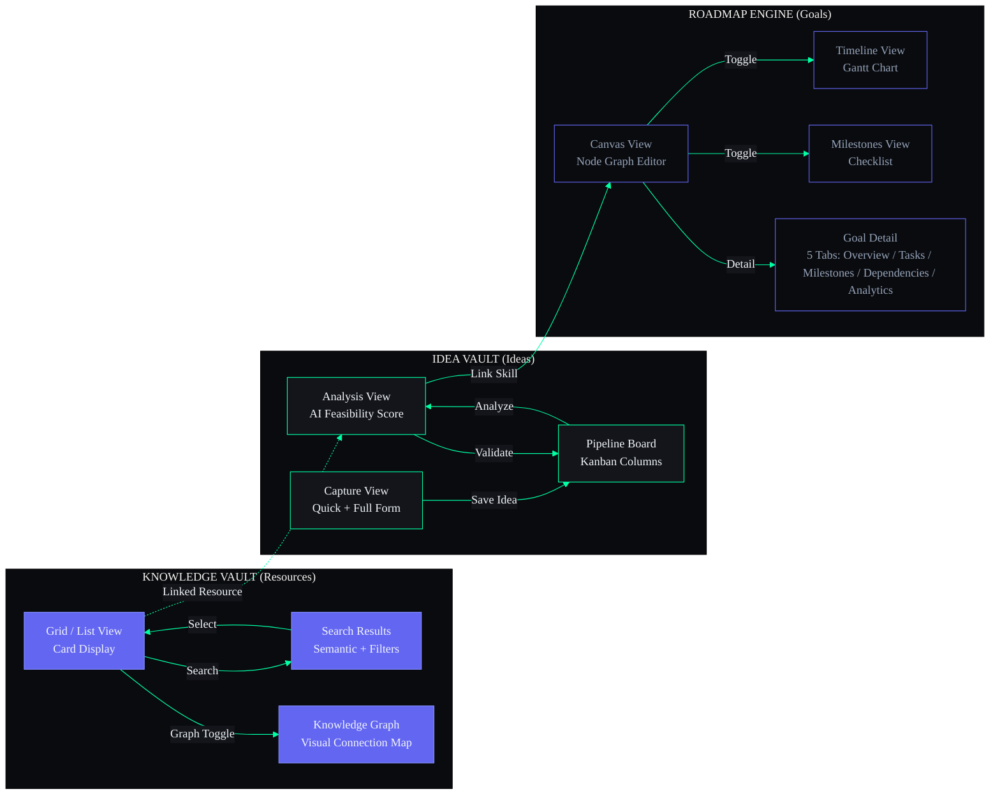

## Document Control

| Field | Value |
|---|---|
| Document ID | DSG-W04-001 |
| Version | 1.0.0 |
| Status | Active |
| Last Updated | 2026-07-11 |

# 04 — Knowledge Vault, Idea Vault & Roadmap Engine Wireframes

| Field | Value |
|---|---|
| Document | Part 4 of 6 |
| Scope | Resources (Knowledge Vault), Ideas (Idea Vault), Goals (Roadmap Engine) |
| Breakpoints | Desktop (1440px+), Tablet (768-1023px), Mobile (320-767px) |

---

## Idea Pipeline — Screen Flow



---

## SECTION A: KNOWLEDGE VAULT (Resources Module)

### 1. RESOURCES — MAIN VIEW

#### Desktop — Grid View (1440px)

```
┌────────────────────────────────────────────────────────────────────────────────────────┐
│ Knowledge Vault                    [Grid | List | Graph]   [Filter▾] [Sort▾] [+ Add]  │
│ 24 resources                                                                           │
│ Filters: [All Types ▾] [All Tags ▾] [Source ▾] [Date ▾]                               │
├────────────────────────────────────────────────────────────────────────────┬────────────┤
│                                                                           │            │
│  ┌──────────────────────┐ ┌──────────────────────┐ ┌──────────────────┐  │ ✨ AI      │
│  │ 📄 Article            │ │ 📹 Video              │ │ 📕 Book          │  │ SIDEBAR    │
│  │                      │ │                      │ │                  │  │            │
│  │ React 18 Server      │ │ 3Blue1Brown —        │ │ CLRS Algorithms  │  │ RELATED    │
│  │ Components Guide     │ │ Neural Networks      │ │ Textbook Notes   │  │ ────────   │
│  │                      │ │                      │ │                  │  │ Based on   │
│  │ Source: blog.react   │ │ Source: YouTube      │ │ Source: Personal │  │ "React 18" │
│  │                      │ │                      │ │                  │  │            │
│  │ [react] [ssr]        │ │ [ml] [neural-nets]   │ │ [dsa] [textbook] │  │ • Next.js  │
│  │ [nextjs]             │ │                      │ │                  │  │   Docs     │
│  │                      │ │                      │ │                  │  │ • Vercel   │
│  │ Added: Jun 8         │ │ Added: Jun 5         │ │ Added: May 28    │  │   Blog     │
│  │ ★★★★☆              │ │ ★★★★★              │ │ ★★★★★          │  │ • RSC      │
│  │                      │ │                      │ │                  │  │   Tutorial │
│  │ [Open] [Edit] [⋮]   │ │ [Open] [Edit] [⋮]   │ │ [Open] [Edit]    │  │            │
│  └──────────────────────┘ └──────────────────────┘ └──────────────────┘  │ AUTO-TAGS  │
│                                                                           │ ────────   │
│  ┌──────────────────────┐ ┌──────────────────────┐ ┌──────────────────┐  │ Suggested: │
│  │ 📄 Paper              │ │ 🔧 Tool              │ │ 📄 Article        │  │ [server]   │
│  │                      │ │                      │ │                  │  │ [rendering]│
│  │ System Design        │ │ Figma Design         │ │ TypeScript 5.0   │  │ [streaming]│
│  │ Interview Prep       │ │ System — Component   │ │ New Features     │  │            │
│  │                      │ │ Library Guide        │ │ Deep Dive        │  │ GAPS       │
│  │ [system-design]      │ │ [design] [figma]     │ │ [typescript]     │  │ ────────   │
│  │ [interview]          │ │ [ui]                 │ │ [javascript]     │  │ You have   │
│  │                      │ │                      │ │                  │  │ no backend │
│  │ Added: Jun 3         │ │ Added: Jun 1         │ │ Added: May 25    │  │ resources. │
│  │ ★★★★☆              │ │ ★★★☆☆              │ │ ★★★★☆          │  │ [Find →]   │
│  └──────────────────────┘ └──────────────────────┘ └──────────────────┘  │            │
│                                                                           │            │
│  ...more resources below...                                               │            │
│                                                                           │            │
└───────────────────────────────────────────────────────────────────────────┴────────────┘
```

#### Mobile (375px)

```
┌──────────────────────────────────────┐
│ ≡  Knowledge Vault           🔍  ⊕  │
├──────────────────────────────────────┤
│ ← [All] [Articles] [Videos] [Books] →│
├──────────────────────────────────────┤
│                                      │
│ ┌──────────────────────────────────┐ │
│ │ 📄  React 18 Server Components   │ │
│ │     blog.react • Jun 8           │ │
│ │     [react] [ssr] ★★★★☆        │ │
│ └──────────────────────────────────┘ │
│ ┌──────────────────────────────────┐ │
│ │ 📹  3Blue1Brown — Neural Nets    │ │
│ │     YouTube • Jun 5              │ │
│ │     [ml] [neural-nets] ★★★★★   │ │
│ └──────────────────────────────────┘ │
│ ┌──────────────────────────────────┐ │
│ │ 📕  CLRS Algorithms Notes        │ │
│ │     Personal • May 28            │ │
│ │     [dsa] [textbook] ★★★★★     │ │
│ └──────────────────────────────────┘ │
│  ...                                 │
├──────────────────────────────────────┤
│ 🏠    ☑️     📚    📁    ✨         │
└──────────────────────────────────────┘
```

---

### 2. RESOURCES — SEARCH

```
┌────────────────────────────────────────────────────────────────────────────────────────┐
│ KNOWLEDGE VAULT SEARCH                                                                 │
│                                                                                        │
│  ┌──────────────────────────────────────────────────────────────────────────────────┐  │
│  │ 🔍 neural networks                                                          ✕  │  │
│  └──────────────────────────────────────────────────────────────────────────────────┘  │
│                                                                                        │
│  [All] [Articles] [Videos] [Books] [Papers] [Tools]     [✨ Semantic Search: ON]      │
│                                                                                        │
│  Advanced: [Date: Any ▾] [Rating: Any ▾] [Tags ▾] [Source ▾]                         │
│                                                                                        │
│  ─────────────────────── 8 results ─────────────────────────────                      │
│                                                                                        │
│  📹 3Blue1Brown — Neural Networks (series)                          ★★★★★  98%      │
│     YouTube • 4 videos • Added Jun 5                                relevance          │
│     "...deep intuition for how **neural networks** learn..."                           │
│     [ml] [neural-nets] [deep-learning]                                                │
│                                                                                        │
│  📄 Understanding Backpropagation                                   ★★★★☆  92%      │
│     Medium article • Added May 20                                   relevance          │
│     "...the math behind **neural network** training..."                                │
│     [ml] [math] [backpropagation]                                                     │
│                                                                                        │
│  📕 Deep Learning Book — Ch.6 Notes                                ★★★★★  88%      │
│     Personal notes • Added May 15                                   relevance          │
│     "...feedforward **neural networks**, also called MLPs..."                          │
│     [deep-learning] [textbook]                                                        │
│                                                                                        │
│  📄 PyTorch Neural Network Tutorial                                 ★★★☆☆  75%      │
│     pytorch.org • Added May 10                                      relevance          │
│     "...building your first **neural network** in PyTorch..."                          │
│     [pytorch] [tutorial]                                                              │
│                                                                                        │
│  ...4 more results...                                                                 │
│                                                                                        │
│  ── SAVED SEARCHES ───────────────────────────────────────────────                     │
│  🔖 "react performance"  •  🔖 "system design patterns"                               │
│                                                                                        │
└────────────────────────────────────────────────────────────────────────────────────────┘
```

---

### 3. RESOURCES — KNOWLEDGE GRAPH

```
┌────────────────────────────────────────────────────────────────────────────────────────┐
│ Knowledge Vault                     [Grid | List | Graph]              [Filter▾]       │
│                                              (active)                                  │
├────────────────────────────────────────────────────────────────────────┬────────────────┤
│                                                                       │                │
│                    KNOWLEDGE GRAPH                                     │ SELECTED NODE  │
│                                                                       │                │
│              ┌──────────┐                                             │ 📹 3Blue1Brown │
│              │ ML Spec. │                                             │ Neural Networks│
│              │ (Course) │                                             │                │
│              └────┬─────┘                                             │ Type: Video    │
│                   │ builds-on                                         │ Rating: ★★★★★ │
│       ┌───────────┼───────────┐                                       │ Tags: ml, nn   │
│       │           │           │                                       │ Added: Jun 5   │
│       ▼           ▼           ▼                                       │                │
│  ┌────────┐ ┌──────────┐ ┌────────┐                                  │ CONNECTIONS    │
│  │ Back-  │ │ 3B1B     │ │ Deep   │                                  │ ────────────── │
│  │ prop   │ │ Neural   │ │ Learn  │                                  │                │
│  │ Article│ │ Nets ●   │ │ Book   │                                  │ → ML Spec.     │
│  └────────┘ │(selected)│ └───┬────┘                                  │   (builds-on)  │
│             └──────────┘     │                                        │ → Backprop     │
│                  │           │ references                             │   (references) │
│                  │           ▼                                         │ → PyTorch Tut. │
│                  │     ┌──────────┐                                   │   (related-to) │
│                  │     │ PyTorch  │                                   │ → Portfolio    │
│                  │     │ Tutorial │                                   │   (used-in)    │
│                  │     └──────────┘                                   │                │
│                  │ used-in                                            │ [Open Resource]│
│                  ▼                                                     │ [Edit]         │
│            ┌──────────┐                                               │ [Remove Link]  │
│            │ ML Image │                                               │                │
│            │ Classifier│                                              │                │
│            │ (Project) │                                              │                │
│            └──────────┘                                               │                │
│                                                                       │                │
│  [🔍 Search graph] [Zoom: + — ] [Filter: ▾ Type] [Layout: Tree ▾]   │                │
│                                                                       │                │
│  Legend: ── references  ─→ builds-on  ··· related  ━━ prerequisite    │                │
│                                                                       │                │
│  ┌─────┐  Minimap                                                     │                │
│  │ ▪   │                                                              │                │
│  └─────┘                                                              │                │
│                                                                       │                │
└───────────────────────────────────────────────────────────────────────┴────────────────┘
```

---

## SECTION B: IDEA VAULT (Ideas Module)

### 4. IDEA VAULT — CAPTURE

#### Desktop (1440px)

```
┌────────────────────────────────────────────────────────────────────────────────────────┐
│ Idea Vault                              [Capture | Pipeline]    [Filter▾] [Sort▾]      │
│                                          (active)                                      │
├────────────────────────────────────────────────────────────────────────────────────────┤
│                                                                                        │
│  QUICK CAPTURE                                                                         │
│  ┌──────────────────────────────────────────────────────────────────────────────────┐  │
│  │ 💡 Capture an idea...                              [Category ▾]  [🎤]  [Save]   │  │
│  └──────────────────────────────────────────────────────────────────────────────────┘  │
│                                                                                        │
│  RECENT IDEAS                                                                          │
│  ┌──────────────────────────────────────────────────────────────────────────────────┐  │
│  │                                                                                  │  │
│  │  💡 AI-Powered Study Planner App                                      Jun 11     │  │
│  │     Category: App  •  Stage: Raw  •  Excitement: ★★★★★                         │  │
│  │     "An app that uses ML to optimize study schedules based on                    │  │
│  │     performance, sleep data, and cognitive load..."                               │  │
│  │     Tags: [ai] [edtech] [mobile-app]                                             │  │
│  │     [Analyze ✨] [Edit] [Archive]                                                │  │
│  │                                                                                  │  │
│  │  💡 Open Source Component Library                                     Jun 9      │  │
│  │     Category: Side Project  •  Stage: Researching  •  ★★★★☆                    │  │
│  │     "A cyberpunk-themed React component library with dark-mode                   │  │
│  │     first design, inspired by ARIA OS design system..."                           │  │
│  │     Tags: [react] [open-source] [design-system]                                  │  │
│  │     [Analyze ✨] [Edit] [Archive]                                                │  │
│  │                                                                                  │  │
│  │  💡 Freelance Platform for College Students                           Jun 7      │  │
│  │     Category: Business  •  Stage: Raw  •  ★★★☆☆                                │  │
│  │     "A platform connecting college students with micro-freelance                 │  │
│  │     opportunities matched by skills and schedule..."                              │  │
│  │     Tags: [startup] [marketplace] [students]                                     │  │
│  │     [Analyze ✨] [Edit] [Archive]                                                │  │
│  │                                                                                  │  │
│  │  💡 YouTube to Notes Converter                                        Jun 5      │  │
│  │     Category: App  •  Stage: Validating  •  ★★★★☆                              │  │
│  │     "Chrome extension that converts YouTube lectures to                          │  │
│  │     structured markdown notes using whisper + GPT..."                             │  │
│  │     Tags: [chrome-ext] [ai] [productivity]                                       │  │
│  │     [Analyze ✨] [Edit] [Archive]                                                │  │
│  │                                                                                  │  │
│  └──────────────────────────────────────────────────────────────────────────────────┘  │
│                                                                                        │
└────────────────────────────────────────────────────────────────────────────────────────┘
```

#### Mobile — Full Capture Form

```
┌──────────────────────────────────────┐
│ ← Capture Idea                      │
├──────────────────────────────────────┤
│                                      │
│ Title *                              │
│ ┌──────────────────────────────────┐ │
│ │ Enter your idea...               │ │
│ └──────────────────────────────────┘ │
│                                      │
│ Description                          │
│ ┌──────────────────────────────────┐ │
│ │                                  │ │
│ │ Describe your idea in detail...  │ │
│ │                                  │ │
│ │                                  │ │
│ └──────────────────────────────────┘ │
│                                      │
│ Category                             │
│ [App ▾]                              │
│                                      │
│ Tags                                 │
│ [Add tags...]                        │
│                                      │
│ Excitement                           │
│ ★ ★ ★ ★ ☆  (4/5)                   │
│                                      │
├──────────────────────────────────────┤
│ [🎤 Voice] [✨ AI Enhance] [Save]   │
├──────────────────────────────────────┤
│ 🏠    ☑️     📚    📁    ✨         │
└──────────────────────────────────────┘
```

---

### 5. IDEA VAULT — ANALYSIS

#### Desktop (1440px)

```
┌────────────────────────────────────────────────────────────────────────────────────────┐
│ ← Ideas > AI-Powered Study Planner App                                                 │
├────────────────────────────────────────────────────────────────────────────────────────┤
│                                                                                        │
│  ┌────────────────────────────────────────────┐  ┌──────────────────────────────────┐ │
│  │ IDEA DETAILS                               │  │ ✨ AI ANALYSIS                   │ │
│  │                                            │  │                                  │ │
│  │ Title: AI-Powered Study Planner App        │  │ FEASIBILITY SCORE                │ │
│  │ Category: App                              │  │ ┌────────────────────────────┐   │ │
│  │ Stage: Raw                                 │  │ │         72 / 100           │   │ │
│  │ Created: Jun 11                            │  │ │   ████████████████░░░░░    │   │ │
│  │ Excitement: ★★★★★                        │  │ └────────────────────────────┘   │ │
│  │                                            │  │                                  │ │
│  │ DESCRIPTION                                │  │ MARKET OPPORTUNITY               │ │
│  │ An app that uses ML to optimize study      │  │ EdTech market growing 16% YoY.   │ │
│  │ schedules based on performance, sleep      │  │ Target: College students (25M+   │ │
│  │ data, and cognitive load. Features:        │  │ in India). Few AI-first study     │ │
│  │ - Personalized schedules                   │  │ planners exist.                   │ │
│  │ - Sleep-aware planning                     │  │ Score: High ████████░░           │ │
│  │ - Spaced repetition integration            │  │                                  │ │
│  │ - Performance tracking                     │  │ REQUIRED SKILLS                   │ │
│  │                                            │  │ ✅ React / React Native          │ │
│  │ Tags: [ai] [edtech] [mobile-app]          │  │ ✅ Python / ML basics            │ │
│  │                                            │  │ ⚠ Backend APIs (learning)       │ │
│  │ LINKED RESOURCES                           │  │ ❌ Mobile deployment (new)       │ │
│  │ 📦 Spaced Repetition Research Paper       │  │ Match: 65% ██████████░░░░░      │ │
│  │ 📦 EdTech Market Report 2026              │  │                                  │ │
│  │                                            │  │ ESTIMATED EFFORT                  │ │
│  │                                            │  │ MVP: 4-6 weeks                   │ │
│  │                                            │  │ Full: 3-4 months                 │ │
│  │                                            │  │                                  │ │
│  │                                            │  │ COMPETITIVE LANDSCAPE             │ │
│  │                                            │  │ • Notion Calendar — Generic      │ │
│  │                                            │  │ • Todoist — No AI scheduling     │ │
│  │                                            │  │ • Shovel — Study specific, US    │ │
│  │                                            │  │ Gap: No India-focused AI planner │ │
│  │                                            │  │                                  │ │
│  │                                            │  │ SWOT SUMMARY                      │ │
│  │                                            │  │ S: ML skills, problem knowledge  │ │
│  │                                            │  │ W: No mobile dev experience      │ │
│  │                                            │  │ O: Growing EdTech market         │ │
│  │                                            │  │ T: Big players entering space    │ │
│  │                                            │  │                                  │ │
│  │                                            │  │ NEXT STEPS                        │ │
│  │                                            │  │ 1. Survey 50 classmates          │ │
│  │                                            │  │ 2. Build paper prototype         │ │
│  │                                            │  │ 3. Learn React Native basics     │ │
│  │                                            │  │                                  │ │
│  │                                            │  │ [Move to Validating]             │ │
│  └────────────────────────────────────────────┘  └──────────────────────────────────┘ │
│                                                                                        │
└────────────────────────────────────────────────────────────────────────────────────────┘
```

---

### 6. IDEA VAULT — VALIDATION PIPELINE

```
┌────────────────────────────────────────────────────────────────────────────────────────┐
│ Idea Vault                          [Capture | Pipeline]             [Filter▾]         │
│                                               (active)                                 │
├────────────────────────────────────────────────────────────────────────────────────────┤
│                                                                                        │
│  RAW (3)        RESEARCHING (1)   VALIDATING (1)  BUILDING (1)   SHIPPED (0)          │
│  ┌────────────┐ ┌────────────┐   ┌────────────┐  ┌────────────┐  ┌────────────┐      │
│  │            │ │            │   │            │  │            │  │            │      │
│  │ 💡 AI Study│ │ 💡 Open Src│   │ 💡 YT to   │  │ 💡 Budget  │  │            │      │
│  │ Planner    │ │ Component  │   │ Notes Conv.│  │ Tracker    │  │ No ideas   │      │
│  │            │ │ Library    │   │            │  │            │  │ shipped    │      │
│  │ App        │ │            │   │ App        │  │ App        │  │ yet!       │      │
│  │ ★★★★★    │ │ Side Proj  │   │ ★★★★☆    │  │ ★★★★☆    │  │            │      │
│  │ 72 feas.  │ │ ★★★★☆    │   │ 68 feas.  │  │ 85 feas.  │  │ 🚀         │      │
│  │ 0 days    │ │ 2 days     │   │ 6 days    │  │ 14 days   │  │            │      │
│  │ [Analyze] │ │ [View]     │   │ [View]    │  │ [View]    │  │            │      │
│  ├────────────┤ └────────────┘   └────────────┘  └────────────┘  └────────────┘      │
│  │            │                                                                        │
│  │ 💡 Freelance│                                                                      │
│  │ Platform   │                                                                        │
│  │            │     VALIDATION CHECKLIST (YT to Notes)                                │
│  │ Business   │     ┌──────────────────────────────────────────┐                      │
│  │ ★★★☆☆    │     │ [x] Problem defined                     │                      │
│  │ — feas.   │     │ [x] Target audience identified          │                      │
│  │ [Analyze] │     │ [x] Solution sketched                   │                      │
│  ├────────────┤     │ [ ] Competitive analysis done           │                      │
│  │            │     │ [ ] MVP scope defined                   │                      │
│  │ 💡 Campus  │     │ [ ] Resources identified                │                      │
│  │ Event App  │     │ [ ] Timeline estimated                  │                      │
│  │            │     │                                          │                      │
│  │ App        │     │ Progress: 3/7 (43%)                     │                      │
│  │ ★★★☆☆    │     │ ████████████░░░░░░░░░░░░░░░░            │                      │
│  │ [Analyze] │     └──────────────────────────────────────────┘                      │
│  └────────────┘                                                                        │
│                                                                                        │
│  ← Drag cards between columns to advance through pipeline →                           │
│                                                                                        │
└────────────────────────────────────────────────────────────────────────────────────────┘
```

---

## SECTION C: ROADMAP ENGINE (Goals Module)

### 7. ROADMAP — CANVAS VIEW

#### Desktop (Full Screen)

```
┌────────────────────────────────────────────────────────────────────────────────────────┐
│ Roadmap Engine            [Canvas | Timeline | Milestones | Dependencies]   [+ New Goal]│
│                            (active)                                                    │
├────────────────────────────────────────────────────────────────────────────┬────────────┤
│ TOOLBAR: [+ Node] [+ Connection] [Layout: Tree ▾] [Zoom: + — ] [Export]  │            │
├───────────────────────────────────────────────────────────────────────────┤            │
│                                                                           │ PROPERTIES │
│                    ┌──────────────────┐                                    │            │
│                    │ 🎯 Become Full   │                                    │ Selected:  │
│                    │ Stack Developer  │                                    │ Full Stack │
│                    │ ██████████░ 78%  │                                    │ Developer  │
│                    │ 🟢 On Track      │                                    │            │
│                    └────────┬─────────┘                                    │ Progress:  │
│                             │                                              │ 78%        │
│               ┌─────────────┼──────────────┐                              │            │
│               │             │              │                              │ Status:    │
│               ▼             ▼              ▼                              │ On Track   │
│  ┌──────────────────┐ ┌──────────┐ ┌──────────────┐                      │            │
│  │ 🎯 Master React  │ │ 🎯 Learn │ │ 🎯 Build     │                      │ Target:    │
│  │                  │ │ Backend  │ │ Portfolio    │                      │ Sep 2026   │
│  │ ████████░░ 85%   │ │ APIs     │ │ Projects     │                      │            │
│  │ 🟢 On Track      │ │          │ │              │                      │ Tasks: 12  │
│  └──────────────────┘ │ ██░░░░ 30%│ │ ██████░ 60%  │                      │ Milestones:│
│          │            │ 🟡 Behind │ │ 🟢 On Track  │                      │ 5          │
│          ▼            └──────────┘ └──────┬───────┘                      │            │
│  ┌──────────────────┐       │             │                              │ Linked:    │
│  │ ◆ Deploy First   │       ▼             ▼                              │ • ML Spec. │
│  │   React App      │ ┌──────────┐ ┌──────────────┐                      │ • React    │
│  │   (milestone)    │ │ ◆ First  │ │ ◆ Portfolio   │                      │   Course   │
│  │   ✅ Complete     │ │ API Live │ │ v1.0 Live    │                      │            │
│  └──────────────────┘ │ ○ Pending│ │ ○ Pending     │                      │ [Edit Goal]│
│                        └──────────┘ └──────────────┘                      │ [Add Task] │
│                                                                           │ [Delete]   │
│  ┌─────┐                                                                  │            │
│  │ Map │  ← Minimap                                                       │            │
│  └─────┘                                                                  │            │
│                                                                           │            │
└───────────────────────────────────────────────────────────────────────────┴────────────┘
```

#### Mobile — List View (375px)

```
┌──────────────────────────────────────┐
│ ≡  Roadmap                   🔍  ⊕  │
├──────────────────────────────────────┤
│ [Canvas] [Timeline] [Milestones]     │
├──────────────────────────────────────┤
│                                      │
│ 🎯 Become Full Stack Developer       │
│    ██████████████████░░  78%        │
│    🟢 On Track • Target: Sep 2026   │
│                                      │
│   ├── 🎯 Master React (85%)         │
│   │    🟢 On Track                   │
│   │    ├── ◆ Deploy First App ✅     │
│   │                                  │
│   ├── 🎯 Learn Backend APIs (30%)   │
│   │    🟡 Behind Schedule            │
│   │    ├── ◆ First API Live ○        │
│   │                                  │
│   └── 🎯 Build Portfolio (60%)      │
│        🟢 On Track                   │
│        ├── ◆ Portfolio v1.0 ○        │
│                                      │
│ 🎯 Get ML Internship                │
│    ██████░░░░░░░░░░░░░░  30%        │
│    🟡 At Risk • Target: Aug 2026    │
│                                      │
│   ├── 🎯 Complete ML Course (67%)   │
│   └── 🎯 Build ML Projects (15%)   │
│                                      │
├──────────────────────────────────────┤
│ 🏠    ☑️     📚    📁    ✨         │
└──────────────────────────────────────┘
```

---

### 8. ROADMAP — GOAL DETAIL

```
┌────────────────────────────────────────────────────────────────────────────────────────┐
│ ← Roadmap > Become Full Stack Developer                     🟢 On Track   [⋮ Actions] │
├────────────────────────────────────────────────────────────────────────────────────────┤
│                                                                                        │
│  [Overview] [Tasks] [Milestones] [Dependencies] [Analytics]                            │
│   (active)                                                                             │
│                                                                                        │
│  ┌────────────────────────────────────────────────┐  ┌──────────────────────────────┐ │
│  │                                                │  │  ┌──────────┐                │ │
│  │  DESCRIPTION                                   │  │  │          │  78%           │ │
│  │  Become a full-stack developer capable of      │  │  │   78%    │  Progress      │ │
│  │  building and deploying production apps.        │  │  │          │                │ │
│  │  Includes frontend (React), backend (Node),    │  │  └──────────┘                │ │
│  │  databases, deployment, and DevOps.             │  │                              │ │
│  │                                                │  │  Start: Jan 2026             │ │
│  │  KEY RESULTS (OKRs)                            │  │  Target: Sep 2026            │ │
│  │  ───────────────────────────                   │  │  Projected: Aug 2026 ✅      │ │
│  │  KR1: Complete 3 courses         2/3  ██████░ │  │                              │ │
│  │  KR2: Build 5 portfolio projects 3/5  ██████░ │  │  ✨ AI ASSESSMENT            │ │
│  │  KR3: Deploy 2 apps to prod     1/2  █████░░ │  │  "On track. Focus on         │ │
│  │  KR4: Contribute to 1 OSS       0/1  ░░░░░░░ │  │  backend APIs — it's 50%     │ │
│  │                                                │  │  behind schedule. Consider   │ │
│  │  TIMELINE                                      │  │  pausing ML course to        │ │
│  │  Jan 2026 ──────────●────── Sep 2026          │  │  catch up."                   │ │
│  │                     ↑ Today (78%)              │  │                              │ │
│  │                                                │  │  [Apply Suggestion]          │ │
│  └────────────────────────────────────────────────┘  └──────────────────────────────┘ │
│                                                                                        │
└────────────────────────────────────────────────────────────────────────────────────────┘
```

---

### 9. ROADMAP — TIMELINE VIEW (Gantt)

```
┌────────────────────────────────────────────────────────────────────────────────────────┐
│ Roadmap Engine            [Canvas | Timeline | Milestones | Dependencies]               │
│                                     (active)                                           │
│                                              [Week | Month | Quarter]  [< Jun 2026 >]  │
├─────────────────────┬──────────────────────────────────────────────────────────────────┤
│ GOAL / MILESTONE     │  Jan    Feb    Mar    Apr    May    Jun    Jul    Aug    Sep     │
├─────────────────────┼──────────────────────────────────────────────────────────────────┤
│                      │                                       │                          │
│ 🎯 Full Stack Dev.   │  ████████████████████████████████████████████████████████████   │
│                      │                                       │ ← Today                  │
│  ├ 🎯 Master React   │  ███████████████████████████████████████░░░░                    │
│  │  ├ ◆ Deploy App   │              ◆ (done)                 │                          │
│  │                   │                                       │                          │
│  ├ 🎯 Learn Backend  │                    ██████████████████████████████░░░░░░         │
│  │  ├ ◆ First API    │                                       │      ◇ (pending)        │
│  │                   │                                       │                          │
│  └ 🎯 Build Portfolio│            ████████████████████████████████████░░░░             │
│     ├ ◆ v1.0 Live    │                                       │          ◇ (pending)    │
│                      │                                       │                          │
│ 🎯 ML Internship     │                         ██████████████████████████████          │
│  ├ 🎯 ML Course      │                         ████████████████░░░░░░░                │
│  └ 🎯 ML Projects    │                                  ████████████████████           │
│                      │                                       │                          │
├─────────────────────┴──────────────────────────────────────────────────────────────────┤
│ ◆ = Complete milestone  ◇ = Pending milestone  ████ = Progress  ░░░░ = Remaining       │
│ ─── = Dependency arrow                                                                 │
└────────────────────────────────────────────────────────────────────────────────────────┘
```

---

### 10. ROADMAP — MILESTONES

```
┌────────────────────────────────────────────────────────────────────────────────────────┐
│ Milestones                                                          [All Goals ▾]      │
├────────────────────────────────────────────────────────────────────────────────────────┤
│                                                                                        │
│  THIS WEEK                                                                             │
│  ┌──────────────────────────────────────────────────────────────────────────────────┐  │
│  │  ◇  Portfolio MVP Deploy            Full Stack Dev → Build Portfolio    Jun 15   │  │
│  │     4 days remaining                ██████████████████░░  88%          [View]   │  │
│  └──────────────────────────────────────────────────────────────────────────────────┘  │
│                                                                                        │
│  THIS MONTH                                                                            │
│  ┌──────────────────────────────────────────────────────────────────────────────────┐  │
│  │  ◇  ML Course Completion           ML Internship → ML Course           Jun 22   │  │
│  │     11 days remaining              ████████████████░░░░░░  67%         [View]   │  │
│  │                                                                                  │  │
│  │  ◇  First REST API Live           Full Stack Dev → Backend APIs        Jun 28   │  │
│  │     17 days remaining              ██████░░░░░░░░░░░░░░  30%          [View]   │  │
│  └──────────────────────────────────────────────────────────────────────────────────┘  │
│                                                                                        │
│  THIS QUARTER                                                                          │
│  ┌──────────────────────────────────────────────────────────────────────────────────┐  │
│  │  ◇  Portfolio v1.0 Live           Full Stack Dev → Portfolio            Jul 15   │  │
│  │  ◇  ML Model v1.0               ML Internship → ML Projects           Jul 30   │  │
│  │  ◇  OSS Contribution            Full Stack Dev                         Aug 15   │  │
│  └──────────────────────────────────────────────────────────────────────────────────┘  │
│                                                                                        │
│  COMPLETED                                                                             │
│  ┌──────────────────────────────────────────────────────────────────────────────────┐  │
│  │  ◆  Deploy First React App       Full Stack Dev → Master React         Mar 15   │  │
│  │  ◆  Complete React Course        Full Stack Dev → Master React         Apr 10   │  │
│  │  ◆  Setup Dev Environment        Full Stack Dev                        Jan 20   │  │
│  └──────────────────────────────────────────────────────────────────────────────────┘  │
│                                                                                        │
└────────────────────────────────────────────────────────────────────────────────────────┘
```

---

### 11. ROADMAP — DEPENDENCIES

```
┌────────────────────────────────────────────────────────────────────────────────────────┐
│ Dependencies                                                          [Graph | Matrix] │
├────────────────────────────────────────────────────────────────────────────────────────┤
│                                                                                        │
│  DEPENDENCY GRAPH (DAG)                                                                │
│                                                                                        │
│  ┌──────────────┐      ┌──────────────┐      ┌──────────────┐                         │
│  │ Master React │─────→│ Build        │─────→│ Portfolio    │                         │
│  │ (85%) 🟢     │      │ Portfolio    │      │ v1.0 Live   │                         │
│  └──────────────┘      │ (60%) 🟢     │      │ (milestone) │                         │
│                         └──────────────┘      └──────────────┘                         │
│         │                                                                              │
│         │  ┌──────────────┐      ┌──────────────┐                                     │
│         └─→│ Learn Backend│─────→│ First API    │                                     │
│            │ (30%) 🟡     │      │ Live         │                                     │
│            └──────────────┘      │ (milestone)  │                                     │
│                                   └──────────────┘                                     │
│                                                                                        │
│  ━━━━ = Critical Path (Master React → Backend → Portfolio v1.0)                       │
│  ⚠ Backend APIs is 50% behind — blocking Portfolio v1.0                               │
│                                                                                        │
├────────────────────────────────────────────────────────────────────────────────────────┤
│                                                                                        │
│  DEPENDENCY MATRIX                                                                     │
│  ┌──────────────┬───────┬─────────┬──────────┬───────┬──────┐                         │
│  │              │ React │ Backend │ Portfolio│ ML    │ ML   │                         │
│  │              │       │ APIs    │ Projects │ Course│ Proj │                         │
│  ├──────────────┼───────┼─────────┼──────────┼───────┼──────┤                         │
│  │ React        │   —   │    →    │    →     │       │      │                         │
│  │ Backend APIs │   ←   │    —    │    →     │       │      │                         │
│  │ Portfolio    │   ←   │    ←    │    —     │       │      │                         │
│  │ ML Course    │       │         │          │   —   │  →   │                         │
│  │ ML Projects  │       │         │          │   ←   │  —   │                         │
│  └──────────────┴───────┴─────────┴──────────┴───────┴──────┘                         │
│                                                                                        │
│  → = blocks  ← = blocked-by  (blank) = independent                                   │
│                                                                                        │
└────────────────────────────────────────────────────────────────────────────────────────┘
```

---

## USER FLOW DIAGRAMS

### Resource Capture Flow
```
Discover Resource (browser, lecture, book)
       │
       ├── Quick Add: [+ Add] → Title + URL → AI auto-tags → Save
       │
       └── Full Add: Title, URL, Type, Description, Tags, Rating
                │
                └── Save → Appears in Vault → AI finds connections → Graph updates
```

### Idea-to-Project Pipeline Flow
```
Capture Idea (quick bar or full form)
       │
       â–¼
AI Auto-Analyze (feasibility, market, skills)
       │
       â–¼
RAW stage → User reviews analysis
       │
       ├── Move to RESEARCHING → Complete research tasks
       │         │
       │         └── Move to VALIDATING → Complete validation checklist
       │                   │
       │                   └── Pass validation (5/7+ items)
       │                           │
       │                           ▼
       │                   Move to BUILDING
       │                           │
       │                           ├── [Create Project] → Links to Projects module
       │                           ├── [Create Goal] → Links to Roadmap Engine
       │                           │
       │                           └── Ship → SHIPPED → 🎉 Celebration
       │
       └── Archive (not pursuing) → ARCHIVED
```

### Goal Creation Flow
```
[+ New Goal] → Goal creation form
       │
       ├── Title (required)
       ├── Description
       ├── Category
       ├── Target date
       ├── Key Results (OKR-style)
       │
       └── Save → AI suggests:
               │
               ├── Milestones (auto-generated)
               ├── Sub-goals (breakdown)
               ├── Related courses/resources
               ├── Task suggestions
               │
               └── User accepts/modifies → Goal appears on Canvas
```

---

*End of Part 4 — Knowledge Vault, Idea Vault & Roadmap Engine Wireframes*
