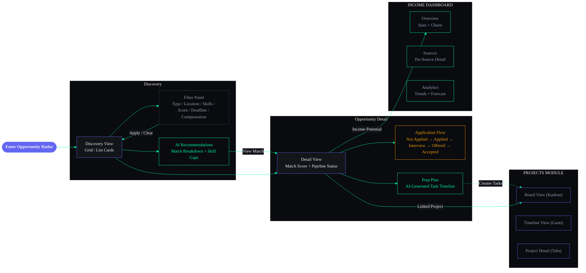

# 05 — Opportunity Radar, Projects & Income Dashboard Wireframes

| Field | Value |
|---|---|
| Document | Part 5 of 6 |
| Scope | Opportunities (Discovery/Matching/Filtering), Projects (Board/Timeline/Detail), Income (Overview/Sources/Analytics) |
| Breakpoints | Desktop (1440px+), Tablet (768-1023px), Mobile (320-767px) |

---

## Opportunity Discovery — Screen Flow



---

## SECTION A: OPPORTUNITY RADAR

### 1. OPPORTUNITY — DISCOVERY VIEW

#### Desktop (1440px)

```
┌────────────────────────────────────────────────────────────────────────────────────────┐
│ Opportunity Radar                  [Grid | List]     [Filter▾] [Sort▾] [+ Add]        │
│ 12 opportunities                                                                       │
├────────────────────────────────────────────────────────────────────────────────────────┤
│                                                                                        │
│  ┌──────────────────────────────────────────────────────────────────────────────────┐  │
│  │ ✨ ARIA found 3 new opportunities matching your profile this week    [View All →]│  │
│  └──────────────────────────────────────────────────────────────────────────────────┘  │
│                                                                                        │
│  ┌──────────────────────────┐ ┌──────────────────────────┐ ┌──────────────────────┐   │
│  │ 🏢 Google                │ │ 🌐 GSoC 2026             │ │ 🏆 MLH Hackathon     │   │
│  │                          │ │                          │ │                      │   │
│  │ STEP Internship — SWE    │ │ React Native —           │ │ AI Track —           │   │
│  │                          │ │ Core Contributor         │ │ Sustainable AI       │   │
│  │ Match: ████████░░ 92%   │ │ Match: ███████░░░ 85%    │ │ Match: ██████░░░ 78% │   │
│  │                          │ │                          │ │                      │   │
│  │ 🏷 Internship            │ │ 🏷 Open Source            │ │ 🏷 Hackathon          │   │
│  │ 📍 Bangalore / Remote    │ │ 📍 Remote                │ │ 📍 Online             │   │
│  │ ⏰ Jun 20 (9 days)      │ │ ⏰ Jul 1 (20 days)       │ │ ⏰ Jul 5 (24 days)   │   │
│  │                          │ │                          │ │                      │   │
│  │ Skills matched:          │ │ Skills matched:          │ │ Skills matched:      │   │
│  │ [Python] [ML] [DSA]     │ │ [React] [JS] [Git]      │ │ [Python] [ML] [AI]   │   │
│  │                          │ │                          │ │                      │   │
│  │ 💰 ₹80K/month           │ │ 💰 $1,500 stipend        │ │ 💰 $10K prize pool   │   │
│  │                          │ │                          │ │                      │   │
│  │ [💾 Save] [📝 Apply] [✕]│ │ [💾 Save] [📝 Apply] [✕]│ │ [💾 Save] [📝 Apply] │   │
│  └──────────────────────────┘ └──────────────────────────┘ └──────────────────────┘   │
│                                                                                        │
│  ┌──────────────────────────┐ ┌──────────────────────────┐ ┌──────────────────────┐   │
│  │ 🏢 Microsoft             │ │ 🎓 MLF Fellowship        │ │ 🏢 Amazon             │   │
│  │ Engage Mentorship        │ │ AI Research Intern       │ │ SDE Intern 2026      │   │
│  │ Match: ██████░░░░ 72%   │ │ Match: █████░░░░░ 65%    │ │ Match: ████░░░░░ 58% │   │
│  │ 🏷 Mentorship            │ │ 🏷 Fellowship             │ │ 🏷 Internship          │   │
│  │ ⏰ Jul 15 (34 days)     │ │ ⏰ Jul 30 (49 days)      │ │ ⏰ Aug 1 (51 days)   │   │
│  │ [💾 Save] [📝 Apply]    │ │ [💾 Save] [📝 Apply]     │ │ [💾 Save] [📝 Apply] │   │
│  └──────────────────────────┘ └──────────────────────────┘ └──────────────────────┘   │
│                                                                                        │
└────────────────────────────────────────────────────────────────────────────────────────┘
```

#### Mobile (375px)

```
┌──────────────────────────────────────┐
│ ≡  Opportunity Radar         🔍  ⊕  │
├──────────────────────────────────────┤
│ ✨ 3 new matches this week  [View→] │
├──────────────────────────────────────┤
│                                      │
│ ┌──────────────────────────────────┐ │
│ │ 🏢 Google                        │ │
│ │ STEP Internship — SWE            │ │
│ │ Match: ████████░░  92%          │ │
│ │ 🏷 Internship  📍 Bangalore     │ │
│ │ ⏰ 9 days  💰 ₹80K/mo           │ │
│ │ [Python] [ML] [DSA]             │ │
│ │              [💾 Save] [📝 Apply]│ │
│ └──────────────────────────────────┘ │
│ ┌──────────────────────────────────┐ │
│ │ 🌐 GSoC 2026                     │ │
│ │ React Native — Core Contributor  │ │
│ │ Match: ███████░░░  85%          │ │
│ │ 🏷 Open Source  📍 Remote        │ │
│ │ ⏰ 20 days  💰 $1,500            │ │
│ │              [💾 Save] [📝 Apply]│ │
│ └──────────────────────────────────┘ │
│  ...more cards...                    │
├──────────────────────────────────────┤
│ 🏠    ☑️     📚    📁    ✨         │
└──────────────────────────────────────┘
```

---

### 2. OPPORTUNITY — RECOMMENDATIONS

```
┌────────────────────────────────────────────────────────────────────────────────────────┐
│ ✨ AI RECOMMENDATIONS                                         [Refresh] [Settings]     │
├────────────────────────────────────────────────────────────────────────────────────────┤
│                                                                                        │
│  YOUR SKILL MATCH PROFILE                                                              │
│  ┌──────────────────────────────────────────────┐                                     │
│  │           Python ████████████ 90%            │                                     │
│  │           React  ██████████░ 80%             │                                     │
│  │           DSA    █████████░░ 75%             │                                     │
│  │           ML     ███████░░░░ 65%             │                                     │
│  │           Backend████░░░░░░░ 35%             │                                     │
│  │           DevOps ██░░░░░░░░░ 20%             │                                     │
│  └──────────────────────────────────────────────┘                                     │
│                                                                                        │
│  TOP MATCH                                                                             │
│  ┌──────────────────────────────────────────────────────────────────────────────────┐  │
│  │ 🏢 Google STEP Internship — SWE                                     92% Match   │  │
│  │                                                                                  │  │
│  │ WHY THIS MATCHES:                                                                │  │
│  │ ✅ Python skills (90% match) — Required: Python, You: Advanced                   │  │
│  │ ✅ ML knowledge (65% match) — Required: ML basics, You: Intermediate             │  │
│  │ ✅ DSA proficiency (75% match) — Required: Strong DSA, You: Good                 │  │
│  │ ✅ Academic standing — Required: GPA > 7.0, You: 8.2                             │  │
│  │ ⚠  System Design (gap) — Required: Basic, You: Learning                         │  │
│  │                                                                                  │  │
│  │ PREPARATION NEEDED:                                                               │  │
│  │ 📚 Complete "System Design Interview Prep" course (2 weeks est.)                 │  │
│  │ ☑  Solve 30 more LeetCode problems (Medium/Hard)                                 │  │
│  │ 📁 Polish portfolio project (add ML project)                                     │  │
│  │                                                                                  │  │
│  │ [📝 Start Application]  [📋 Create Prep Plan]  [⏭ Skip]                          │  │
│  └──────────────────────────────────────────────────────────────────────────────────┘  │
│                                                                                        │
│  MORE RECOMMENDATIONS                                                                  │
│  ┌─────────────────────────────────┐  ┌────────────────────────────────────┐          │
│  │ GSoC 2026 — 85%                 │  │ MLH Hackathon — 78%                │          │
│  │ "Strong React skills match..."  │  │ "ML + Python skills match..."      │          │
│  │ [View Details]                  │  │ [View Details]                     │          │
│  └─────────────────────────────────┘  └────────────────────────────────────┘          │
│                                                                                        │
└────────────────────────────────────────────────────────────────────────────────────────┘
```

---

### 3. OPPORTUNITY — FILTERING

```
┌────────────────────────────────────────────────────────────────────────────────────────┐
│ FILTER OPPORTUNITIES                                                             ✕    │
├────────────────────────────────────────────────────────────────────────────────────────┤
│                                                                                        │
│  TYPE                                                                                  │
│  [x] Internship    [x] Hackathon     [ ] Full-time                                    │
│  [x] Open Source   [x] Fellowship    [ ] Part-time                                    │
│  [ ] Research      [ ] Mentorship                                                     │
│                                                                                        │
│  LOCATION                                                                              │
│  ┌──────────────────────────────────────────────────────┐                              │
│  │ Search locations...                                  │                              │
│  └──────────────────────────────────────────────────────┘                              │
│  [x] Remote  [ ] Hybrid  [ ] On-site                                                  │
│  Active: [Bangalore ✕] [Remote ✕]                                                     │
│                                                                                        │
│  SKILLS                                                                                │
│  ┌──────────────────────────────────────────────────────┐                              │
│  │ [Python ✕] [React ✕] [ML ✕]   + Add skill...       │                              │
│  └──────────────────────────────────────────────────────┘                              │
│                                                                                        │
│  MATCH SCORE                                                                           │
│  ├────────────●════════════════════●────────────┤                                     │
│  50%                                          100%                                     │
│  Selected: 50% — 100%                                                                 │
│                                                                                        │
│  DEADLINE                                                                              │
│  ( ) Any time  (•) Next 30 days  ( ) Next 60 days  ( ) Custom range                  │
│                                                                                        │
│  COMPENSATION                                                                          │
│  ├────────────●════════════●────────────────────┤                                     │
│  ₹0                      ₹1L+                                                        │
│                                                                                        │
│  SAVED FILTERS                                                                         │
│  [🔖 "Top Internships"] [🔖 "Hackathons This Month"]  [+ Save Current]               │
│                                                                                        │
│  ─────────────────────────────────────────────────────                                 │
│  Active: 4 filters applied — 8 results                                                │
│                                                                                        │
│           [Clear All]                             [Apply Filters]                       │
│                                                                                        │
└────────────────────────────────────────────────────────────────────────────────────────┘
```

---

### 4. OPPORTUNITY — MATCHING DETAIL

```
┌────────────────────────────────────────────────────────────────────────────────────────┐
│ ← Opportunities > Google STEP Internship                              [💾] [📝 Apply] │
├────────────────────────────────────────────────────────────────────────────────────────┤
│                                                                                        │
│  ┌────────────────────────────────────────────────┐  ┌──────────────────────────────┐ │
│  │ 🏢 Google                                      │  │ MATCH SCORE                  │ │
│  │ STEP Internship — Software Engineering         │  │                              │ │
│  │                                                │  │      ┌──────────┐            │ │
│  │ 📍 Bangalore, India / Remote Option            │  │      │   92%    │            │ │
│  │ 🏷 Internship  💰 ₹80,000/month               │  │      └──────────┘            │ │
│  │ ⏰ Deadline: Jun 20, 2026 (9 days)            │  │                              │ │
│  │                                                │  │ BREAKDOWN                    │ │
│  │ APPLICATION STATUS                              │  │ Skills     ████████░ 88%    │ │
│  │ ┌──────────────────────────────────────────┐   │  │ Experience ██████░░░ 72%    │ │
│  │ │ ○ Not Applied → Applied → Interview →   │   │  │ Education  █████████ 95%    │ │
│  │ │   Offered → Accepted                     │   │  │ Interests  █████████ 98%    │ │
│  │ │   ● (current: Not Applied)              │   │  │                              │ │
│  │ └──────────────────────────────────────────┘   │  │ ✨ AI TIPS                   │ │
│  │                                                │  │ "Highlight your ML Image     │ │
│  │ DESCRIPTION                                     │  │ Classifier project — it      │ │
│  │ Google's STEP (Student Training in Engineering │  │ demonstrates Python + ML     │ │
│  │ Program) is designed for first and second year  │  │ skills they require."        │ │
│  │ undergraduate students passionate about CS...   │  │                              │ │
│  │                                                │  │ "Mention your hackathon      │ │
│  │ REQUIREMENTS                                    │  │ experience — it shows        │ │
│  │ ✅ Currently pursuing B.Tech in CS              │  │ ability to build under       │ │
│  │ ✅ Strong fundamentals in DSA                   │  │ pressure."                   │ │
│  │ ✅ Proficiency in Python or Java                │  │                              │ │
│  │ ✅ Basic understanding of ML                    │  │ PREPARATION                  │ │
│  │ ⚠  Experience with system design (partial)    │  │ 📚 System Design course      │ │
│  │ ❌ Competitive programming rating (missing)    │  │ ☑ 20 LeetCode problems      │ │
│  │                                                │  │ 📁 Polish ML project         │ │
│  │ RELATED OPPORTUNITIES                           │  │                              │ │
│  │ • Microsoft Engage (72% match)                 │  │ [Create Prep Plan ✨]        │ │
│  │ • Amazon SDE Intern (58% match)                │  │                              │ │
│  │                                                │  │                              │ │
│  └────────────────────────────────────────────────┘  └──────────────────────────────┘ │
│                                                                                        │
└────────────────────────────────────────────────────────────────────────────────────────┘
```

---

## SECTION B: PROJECTS MODULE

### 5. PROJECTS — BOARD VIEW

```
┌────────────────────────────────────────────────────────────────────────────────────────┐
│ Projects                  [Board | Timeline | Grid]              [Filter▾] [+ New]     │
│ 5 projects                 (active)                                                    │
├────────────────────────────────────────────────────────────────────────────────────────┤
│                                                                                        │
│  PLANNING (1)     IN PROGRESS (2)    REVIEW (1)     COMPLETED (1)   ON HOLD (0)       │
│  ┌────────────┐  ┌────────────┐    ┌────────────┐  ┌────────────┐  ┌────────────┐    │
│  │            │  │            │    │            │  │            │  │            │    │
│  │ 📁 Budget  │  │ 📁 Portfolio│    │ 📁 ML Image│  │ 📁 Blog    │  │            │    │
│  │ Tracker    │  │ Website    │    │ Classifier │  │ Platform   │  │ No projects│    │
│  │ App        │  │            │    │            │  │            │  │ on hold    │    │
│  │            │  │ Development│    │ Testing    │  │ ✅ Done     │  │            │    │
│  │ Design     │  │ ████░ 75%  │    │ ████░ 85%  │  │ ████ 100%  │  │            │    │
│  │ ██░░ 15%   │  │            │    │            │  │            │  │            │    │
│  │            │  │ [react]    │    │ [python]   │  │ [next.js]  │  │            │    │
│  │ [flutter]  │  │ [next.js]  │    │ [ml]       │  │ [mdx]      │  │            │    │
│  │            │  │ [tailwind] │    │ [pytorch]  │  │            │  │            │    │
│  │ Updated:   │  │            │    │            │  │            │  │            │    │
│  │ Jun 10     │  │ ⚠ 1 blocker│    │ Updated:   │  │ Jun 1      │  │            │    │
│  │            │  │ Jun 11     │    │ Jun 11     │  │            │  │            │    │
│  └────────────┘  ├────────────┤    └────────────┘  └────────────┘  └────────────┘    │
│                  │            │                                                        │
│                  │ 📁 OS Lab  │                                                        │
│                  │ Assignments│                                                        │
│                  │            │                                                        │
│                  │ Development│                                                        │
│                  │ ███░ 60%   │                                                        │
│                  │ [c] [linux]│                                                        │
│                  │ Jun 9      │                                                        │
│                  └────────────┘                                                        │
│                                                                                        │
└────────────────────────────────────────────────────────────────────────────────────────┘
```

---

### 6. PROJECTS — TIMELINE VIEW

```
┌────────────────────────────────────────────────────────────────────────────────────────┐
│ Projects                  [Board | Timeline | Grid]                  [Month | Quarter] │
│                                     (active)                     [< Jun 2026 >]        │
├──────────────────┬─────────────────────────────────────────────────────────────────────┤
│ PROJECT           │  May          Jun          Jul          Aug                         │
├──────────────────┼─────────────────────────────────────────────────────────────────────┤
│                   │                      │                                              │
│ 📁 Portfolio      │  ▓▓▓▓▓▓▓▓▓▓▓████████████░░░░░░                                   │
│    Website        │  Planning  │Development│  Deploy                                   │
│                   │            │           │    ◇ MVP                                   │
│                   │                      │                                              │
│ 📁 ML Image      │       ▓▓▓▓▓▓▓▓▓██████████████░░                                   │
│    Classifier     │       Train│  Test    │ Deploy                                     │
│                   │            │          │  ◇ v1.0                                    │
│                   │                      │                                              │
│ 📁 OS Lab        │              ████████████░░                                         │
│    Assignments    │              Development │                                          │
│                   │                      │                                              │
│ 📁 Budget        │                   ░░░░░░░░░░░░░░░░░░░░░░░░                         │
│    Tracker        │                   Design │ Development │ Test                       │
│                   │                      │                                              │
│ 📁 Blog          │  ██████████████████   │                                              │
│    Platform       │  ✅ Complete         │                                              │
│                   │                      │                                              │
├──────────────────┴─────────────────────────────────────────────────────────────────────┤
│  ████ = Complete   ░░░░ = Remaining   ◇ = Milestone   │ = Today                       │
└────────────────────────────────────────────────────────────────────────────────────────┘
```

---

### 7. PROJECTS — DETAIL VIEW

```
┌────────────────────────────────────────────────────────────────────────────────────────┐
│ ← Projects > Portfolio Website                       Development  ████░ 75%  [⋮]      │
├────────────────────────────────────────────────────────────────────────────────────────┤
│                                                                                        │
│  [Overview] [Tasks] [Milestones] [Files] [Analytics]                                   │
│   (active)                                                                             │
│                                                                                        │
│  ┌────────────────────────────────────────────────────────────────────────────────┐    │
│  │ DESCRIPTION                                                                    │    │
│  │ Personal portfolio website built with Next.js 14, Tailwind CSS, and Framer     │    │
│  │ Motion. Features: Responsive design, dark mode, blog with MDX, project         │    │
│  │ showcase, contact form, and animations.                                         │    │
│  │                                                                                │    │
│  │ TECH STACK                                                                      │    │
│  │ [React] [Next.js] [Tailwind] [Framer Motion] [MDX] [Vercel]                   │    │
│  │                                                                                │    │
│  │ URLS                                                                            │    │
│  │ 🔗 GitHub: github.com/rohit/portfolio                                          │    │
│  │ 🌐 Live: rohitkumar.dev (staging)                                              │    │
│  │ 📄 Docs: notion.so/portfolio-spec                                               │    │
│  │                                                                                │    │
│  │ LINKED GOAL                                                                     │    │
│  │ 🎯 Become Full Stack Developer → Build Portfolio Projects                       │    │
│  │                                                                                │    │
│  │ CURRENT BLOCKERS (1)                                                            │    │
│  │ ┌────────────────────────────────────────────────────────────────────────┐      │    │
│  │ │ ⚠ API endpoint for contact form not responding — P1                   │      │    │
│  │ │   Assigned: Self • Since: Jun 9 • [Resolve] [Escalate]               │      │    │
│  │ └────────────────────────────────────────────────────────────────────────┘      │    │
│  │                                                                                │    │
│  │ ✨ AI SUGGESTIONS                                                               │    │
│  │ "Consider using Resend for email — simpler than setting up your own API."      │    │
│  │ "Add lighthouse CI to your GitHub Actions for performance monitoring."          │    │
│  │ [Apply] [Dismiss]                                                               │    │
│  │                                                                                │    │
│  └────────────────────────────────────────────────────────────────────────────────┘    │
│                                                                                        │
└────────────────────────────────────────────────────────────────────────────────────────┘
```

---

### 8. PROJECTS — ANALYTICS

```
┌────────────────────────────────────────────────────────────────────────────────────────┐
│ PROJECT ANALYTICS                                                   [Date: 30 days ▾] │
├────────────────────────────────────────────────────────────────────────────────────────┤
│                                                                                        │
│  ┌─────────────┐  ┌─────────────┐  ┌─────────────┐  ┌─────────────────┐              │
│  │ Active       │  │ Completion  │  │ Avg Duration│  │ Blockers        │              │
│  │    4         │  │ Rate: 75%   │  │   6 weeks   │  │    2 active     │              │
│  │              │  │  ↑ 10%      │  │             │  │    ↓ 1 vs last  │              │
│  └─────────────┘  └─────────────┘  └─────────────┘  └─────────────────┘              │
│                                                                                        │
│  TIME DISTRIBUTION                                PROJECT HEALTH                       │
│  ┌──────────────────────────────┐  ┌──────────────────────────────────────┐            │
│  │                              │  │                                      │            │
│  │  Portfolio    ████████ 35%   │  │  Portfolio      🟢 On track (75%)   │            │
│  │  ML Classify  ██████  25%   │  │  ML Classifier  🟡 At risk  (85%)   │            │
│  │  OS Lab       █████   20%   │  │  OS Lab         🟢 On track (60%)   │            │
│  │  Budget App   ███     12%   │  │  Budget App     🔵 Planning  (15%)   │            │
│  │  Other        ██      8%    │  │                                      │            │
│  │                              │  │                                      │            │
│  └──────────────────────────────┘  └──────────────────────────────────────┘            │
│                                                                                        │
│  TECH STACK USAGE                                                                      │
│  React ████████████ 4 projects  │  Python ██████ 2 projects                           │
│  Next.js ████████ 3 projects    │  Flutter ██ 1 project                               │
│                                                                                        │
└────────────────────────────────────────────────────────────────────────────────────────┘
```

---

## SECTION C: INCOME DASHBOARD

### 9. INCOME — OVERVIEW

#### Desktop (1440px)

```
┌────────────────────────────────────────────────────────────────────────────────────────┐
│ Income Dashboard                           [Date: Jun 2026 ▾]         [+ Log Income]  │
├────────────────────────────────────────────────────────────────────────────────────────┤
│                                                                                        │
│  ┌─────────────────┐  ┌─────────────────┐  ┌─────────────────┐  ┌─────────────────┐  │
│  │ TOTAL INCOME     │  │ HOURLY RATE     │  │ HOURS WORKED    │  │ TREND           │  │
│  │                  │  │                  │  │                  │  │                  │  │
│  │   ₹18,500       │  │   ₹462/hr       │  │   40 hours      │  │   ↑ 12%         │  │
│  │   this month    │  │   average       │  │   this month    │  │   vs last month  │  │
│  └─────────────────┘  └─────────────────┘  └─────────────────┘  └─────────────────┘  │
│                                                                                        │
│  MONTHLY INCOME CHART                                                                  │
│  ┌──────────────────────────────────────────────────────────────────────────────────┐  │
│  │  ₹25K│                                                                          │  │
│  │  ₹20K│                                                          ┌──┐            │  │
│  │  ₹15K│                                              ┌──┐       │  │            │  │
│  │  ₹10K│                              ┌──┐   ┌──┐    │  │       │  │            │  │
│  │   ₹5K│  ┌──┐   ┌──┐    ┌──┐        │  │   │  │    │  │       │  │            │  │
│  │    ₹0├──┴──┴───┴──┴────┴──┴────────┴──┴───┴──┴────┴──┴───────┴──┴────        │  │
│  │       Jan   Feb   Mar   Apr   May   Jun                                       │  │
│  └──────────────────────────────────────────────────────────────────────────────────┘  │
│                                                                                        │
│  RECENT ENTRIES                                                                        │
│  ┌──────────────────────────────────────────────────────────────────────────────────┐  │
│  │ Date       │ Source                   │ Amount  │ Hours │ Rate    │ Cat.   │ ⋮  │  │
│  ├────────────┼──────────────────────────┼─────────┼───────┼─────────┼────────┼────┤  │
│  │ Jun 10     │ Freelance Web Dev — E-   │ ₹8,000  │ 12h   │ ₹667/hr │ Freelance│  │  │
│  │            │ commerce site for client │         │       │         │        │    │  │
│  │ Jun 8      │ Tutoring — DSA Prep      │ ₹3,000  │ 6h    │ ₹500/hr │ Tutoring │  │  │
│  │ Jun 5      │ Content Writing — React  │ ₹2,000  │ 4h    │ ₹500/hr │ Writing│    │  │
│  │            │ tutorial for blog        │         │       │         │        │    │  │
│  │ Jun 3      │ Freelance — Logo Design  │ ₹1,500  │ 3h    │ ₹500/hr │ Freelance│  │  │
│  │ Jun 1      │ Tutoring — Python Basics │ ₹2,000  │ 4h    │ ₹500/hr │ Tutoring │  │  │
│  │ Jun 1      │ Freelance — Landing Page │ ₹2,000  │ 5h    │ ₹400/hr │ Freelance│  │  │
│  └────────────┴──────────────────────────┴─────────┴───────┴─────────┴────────┴────┘  │
│                                                                                        │
│  DISTRIBUTION               │  INCOME SOURCES                                          │
│  ┌─────────────────────┐    │  ┌────────────────────────────────────────┐              │
│  │     ┌────┐           │    │  │ Freelance Dev  ████████████  ₹11,500  │              │
│  │    / 62% \          │    │  │ Tutoring       ██████       ₹5,000   │              │
│  │   | Free- |         │    │  │ Content        ████         ₹2,000   │              │
│  │   | lance  |         │    │  │                                      │              │
│  │    \ 27% /  Tutoring │    │  │ 3 active sources                     │              │
│  │     └────┘  11% Write│    │  └────────────────────────────────────────┘              │
│  └─────────────────────┘    │                                                          │
│                              │                                                          │
└────────────────────────────────────────────────────────────────────────────────────────┘
```

#### Mobile (375px)

```
┌──────────────────────────────────────┐
│ ≡  Income Dashboard          🔍  ⊕  │
├──────────────────────────────────────┤
│ ← [₹18.5K Total] [₹462/hr] [40h] → │
│   (horizontal scroll metric cards)   │
├──────────────────────────────────────┤
│ MONTHLY TREND                        │
│ ┌──────────────────────────────────┐ │
│ │ ₹20K│          ┌──┐   ┌──┐      │ │
│ │ ₹10K│ ┌──┐ ┌──┐│  │   │  │     │ │
│ │   ₹0├─┴──┴─┴──┴┴──┴───┴──┴──   │ │
│ │     Jan Feb Mar Apr May Jun     │ │
│ └──────────────────────────────────┘ │
├──────────────────────────────────────┤
│ RECENT ENTRIES                       │
│ ┌──────────────────────────────────┐ │
│ │ Jun 10 • Freelance Web Dev      │ │
│ │ ₹8,000 • 12h • ₹667/hr         │ │
│ └──────────────────────────────────┘ │
│ ┌──────────────────────────────────┐ │
│ │ Jun 8 • Tutoring DSA            │ │
│ │ ₹3,000 • 6h • ₹500/hr          │ │
│ └──────────────────────────────────┘ │
│  ...more entries...                  │
├──────────────────────────────────────┤
│ 🏠    ☑️     📚    📁    ✨         │
└──────────────────────────────────────┘
```

---

### 10. INCOME — SOURCES

```
┌────────────────────────────────────────────────────────────────────────────────────────┐
│ Income Sources                                                       [+ Add Source]    │
├────────────────────────────────────────────────────────────────────────────────────────┤
│                                                                                        │
│  ┌──────────────────────────────┐  ┌──────────────────────────────┐                   │
│  │ 💻 Freelance Development     │  │ 📚 Tutoring                   │                   │
│  │                              │  │                              │                   │
│  │ Category: Freelance          │  │ Category: Teaching           │                   │
│  │ Total Earned: ₹48,500       │  │ Total Earned: ₹22,000       │                   │
│  │ Entries: 12                  │  │ Entries: 8                   │                   │
│  │ Avg Rate: ₹550/hr           │  │ Avg Rate: ₹500/hr           │                   │
│  │ Last Entry: Jun 10           │  │ Last Entry: Jun 8            │                   │
│  │                              │  │                              │                   │
│  │ [View Details] [Edit]        │  │ [View Details] [Edit]        │                   │
│  └──────────────────────────────┘  └──────────────────────────────┘                   │
│                                                                                        │
│  ┌──────────────────────────────┐                                                     │
│  │ ✍ Content Writing            │                                                     │
│  │                              │                                                     │
│  │ Category: Writing            │                                                     │
│  │ Total Earned: ₹8,000        │                                                     │
│  │ Entries: 4                   │                                                     │
│  │ Avg Rate: ₹400/hr           │                                                     │
│  │ Last Entry: Jun 5            │                                                     │
│  │                              │                                                     │
│  │ [View Details] [Edit]        │                                                     │
│  └──────────────────────────────┘                                                     │
│                                                                                        │
└────────────────────────────────────────────────────────────────────────────────────────┘
```

---

### 11. INCOME — ANALYTICS

```
┌────────────────────────────────────────────────────────────────────────────────────────┐
│ Income Analytics                                                    [Date: 2026 ▾]     │
├────────────────────────────────────────────────────────────────────────────────────────┤
│                                                                                        │
│  MONTHLY TREND                          SOURCE COMPARISON                              │
│  ┌────────────────────────────────┐    ┌────────────────────────────────────┐          │
│  │ ₹20K│          ╱───╲           │    │ Freelance  ████████████████  ₹48.5K│          │
│  │ ₹15K│     ╱───╱     ╲──       │    │ Tutoring   ██████████       ₹22.0K│          │
│  │ ₹10K│ ╱──╱                    │    │ Writing    ████              ₹8.0K │          │
│  │  ₹5K│╱                        │    │                                    │          │
│  │   ₹0├──────────────────────── │    │ Total YTD: ₹78,500                │          │
│  │     Jan Feb Mar Apr May Jun   │    └────────────────────────────────────┘          │
│  └────────────────────────────────┘                                                    │
│                                                                                        │
│  HOURLY RATE TREND                     YTD SUMMARY                                    │
│  ┌────────────────────────────────┐    ┌────────────────────────────────────┐          │
│  │ ₹600│         ╱────────────── │    │ Total YTD:      ₹78,500            │          │
│  │ ₹500│    ╱───╱                │    │ Avg Monthly:    ₹13,083            │          │
│  │ ₹400│ ──╱                     │    │ Best Month:     ₹18,500 (Jun)     │          │
│  │ ₹300│                         │    │ Total Hours:    186h               │          │
│  │   ₹0├─────────────────────── │    │ Avg Rate:       ₹422/hr            │          │
│  │     Jan Feb Mar Apr May Jun   │    │                                    │          │
│  └────────────────────────────────┘    │ GOAL TRACKING                      │          │
│                                        │ Target: ₹50,000/month             │          │
│  ✨ AI INSIGHTS                        │ Current: ₹18,500 (37%)            │          │
│  ┌──────────────────────────────────┐  │ ██████████████░░░░░░░░░░░░░░░░░   │          │
│  │ "Your best earning days are     │  │ Gap: ₹31,500 — Need to add 2-3   │          │
│  │ Saturdays — consider scheduling │  │ more freelance clients.            │          │
│  │ more client work on weekends."  │  │                                    │          │
│  │                                  │  │ [Adjust Goal] [View Plan]          │          │
│  │ "Tutoring rate can increase to  │  └────────────────────────────────────┘          │
│  │ ₹600/hr based on demand — you   │                                                  │
│  │ have 100% student satisfaction." │                                                  │
│  │                                  │                                                  │
│  │ [Apply Rate Increase]            │                                                  │
│  └──────────────────────────────────┘                                                  │
│                                                                                        │
└────────────────────────────────────────────────────────────────────────────────────────┘
```

---

## USER FLOW DIAGRAMS

### Opportunity Discovery Flow
```
AI daily scan (scheduled)
       │
       ▼
New matches found (3)
       │
       ▼
Notification: "ARIA found 3 new opportunities"
       │
       ▼
User opens Opportunity Radar
       │
       ├── Review cards → Filter by preferences
       │       │
       │       ├── [Save] → Added to saved list
       │       ├── [Apply] → External link opens → Track as "Applied"
       │       └── [Dismiss] → Hidden from feed
       │
       └── View AI Recommendations → See detailed match reasoning
               │
               └── [Create Prep Plan] → Tasks created for preparation
```

### Project Lifecycle Flow
```
[+ New Project] → Define: Title, Description, Tech Stack, URLs
       │
       ▼
AI suggests: Phases, Milestones, Timeline
       │
       ▼
PLANNING phase → User defines scope → Adds milestones
       │
       ▼
IN PROGRESS → Work on tasks → Timer tracking → Update progress
       │
       ├── Blocker detected → Alert shown → [Resolve] or [Escalate]
       │
       ▼
REVIEW → Test & QA → Deploy to staging
       │
       ▼
COMPLETED → 🎉 Celebration → Archive → Add to Portfolio
```

### Income Logging Flow
```
Complete work → [+ Log Income]
       │
       ▼
Fill: Source, Amount, Hours, Category
       │
       ▼
Save → Auto-calculate hourly rate
       │
       ▼
Charts update → Monthly trend refreshes
       │
       ▼
AI insight: "Your rate for this source increased 15%! Great job."
```

---

*End of Part 5 — Opportunity Radar, Projects & Income Dashboard Wireframes*
