## Document Control

| Field | Value |
|---|---|
| Document ID | DSG-W06-001 |
| Version | 1.0.0 |
| Status | Active |
| Last Updated | 2026-07-11 |

# 06 — Analytics, AI Chat, Sleep, Habits, Settings & System States Wireframes

| Field | Value |
|---|---|
| Document | Part 6 of 6 |
| Scope | Analytics Dashboard, ARIA Chat, Sleep Tracker, Habit Builder, Settings, Empty/Loading/Error States |
| Breakpoints | Desktop (1440px+), Tablet (768-1023px), Mobile (320-767px) |

---

## Analytics Dashboard — Screen Architecture

```mermaid
%%{init: {'theme':'base','themeVariables':{'primaryColor':'#6366F1','primaryTextColor':'#F1F5F9','lineColor':'#00FFA3','secondaryColor':'#13151A','tertiaryColor':'#0A0B0F','fontFamily':'DM Sans'}}}%%
graph TD
    subgraph AnalyticsArch["Analytics Dashboard — 5 Screen Groups"]
        style AnalyticsArch fill:#13151A,stroke:#334155,color:#F1F5F9
    end

    A["ANALYTICS OVERVIEW"]:::aMain
    B["ARIA AI CHAT<br/>Messaging Interface"]:::aChat
    C["SLEEP TRACKER<br/>Patterns + Factors + Logs"]:::aSleep
    D["HABIT BUILDER<br/>Heatmap + Streaks + Analytics"]:::aHabit
    E["SETTINGS<br/>7 Sections: Profile to About"]:::aSet

    A --> A1["Time Period Switcher<br/>Day / Week / Month / Quarter / Year"]:::ctrl
    A --> A2["KPI Row<br/>Productivity / Completion / Focus / Streak / Sleep"]:::metric
    A --> A3["Productivity Trend<br/>30-Day Sparkline"]:::chart
    A --> A4["Time Distribution<br/>Donut: Deep Work / Learning / Tasks / Admin"]:::chart
    A --> A5["Category Performance<br/>Bars + Grades"]:::chart
    A --> A6["Goal Progress<br/>Per-Goal % + Status"]:::metric
    A --> A7["Weekly Comparison<br/>WoW Delta Table"]:::metric
    A --> A_W["Weekly Review<br/>AI Summary + Daily Metrics"]:::review

    B --> B1["Chat Thread<br/>Messages + Streaming"]:::chat_c
    B --> B2["Context Panel<br/>Module Status Summary"]:::chat_c
    B --> B3["Suggested Prompts<br/>Quick Action Buttons"]:::chat_c

    C --> C1["Sleep KPI Row<br/>Avg / Score / Debt / Bedtime"]:::metric
    C --> C2["Sleep Pattern<br/>7-Day Timeline"]:::chart
    C --> C3["Sleep Factors<br/>Caffeine / Screen / Exercise"]:::metric
    C --> C4["AI Insights<br/>Correlation + Wind-Down"]:::ai_c

    D --> D1["Today's Checklist<br/>Toggle + Progress"]:::metric
    D --> D2["Monthly Heatmap<br/>Color Grid"]:::chart
    D --> D3["Habit Analytics<br/>30-Day Adherence + Streaks"]:::chart

    E --> E1["Profile / Appearance / Notifications<br/>AI / Integrations / Data / About"]:::set_c

    classDef aMain fill:#6366F1,stroke:#818CF8,color:#F1F5F9,font-weight:700
    classDef aChat fill:#0A0B0F,stroke:#00FFA3,color:#F1F5F9
    classDef aSleep fill:#13151A,stroke:#818CF8,color:#F1F5F9
    classDef aHabit fill:#13151A,stroke:#F59E0B,color:#F1F5F9
    classDef aSet fill:#13151A,stroke:#6366F1,color:#F1F5F9
    classDef metric fill:#13151A,stroke:#334155,color:#94A3B8
    classDef chart fill:#13151A,stroke:#334155,color:#94A3B8
    classDef ctrl fill:#0A0B0F,stroke:#6366F1,color:#6366F1
    classDef chat_c fill:#0A0B0F,stroke:#334155,color:#94A3B8
    classDef ai_c fill:#0A0B0F,stroke:#00FFA3,color:#00FFA3
    classDef review fill:#0A0B0F,stroke:#00FFA3,color:#00FFA3
    classDef set_c fill:#0A0B0F,stroke:#334155,color:#94A3B8
```



---

## SECTION A: ANALYTICS DASHBOARD

### 1. ANALYTICS — OVERVIEW

#### Desktop (1440px)

```
┌────────────────────────────────────────────────────────────────────────────────────────┐
│ Analytics                      [Day | Week | Month | Quarter | Year]  [Export CSV ↓]   │
│                                       (Month)                                          │
├────────────────────────────────────────────────────────────────────────────────────────┤
│                                                                                        │
│  ┌─────────────┐  ┌─────────────┐  ┌─────────────┐  ┌─────────────┐  ┌─────────────┐│
│  │ PRODUCTIVITY │  │ COMPLETION  │  │ FOCUS TIME  │  │ STREAK      │  │ SLEEP SCORE ││
│  │   78/100     │  │  68%        │  │  42h 15m    │  │  12 days    │  │  7.2/10     ││
│  │   ↑ 5%       │  │  ↑ 3%       │  │  ↑ 8h       │  │  ↑ 4 days   │  │  ↑ 0.5      ││
│  └─────────────┘  └─────────────┘  └─────────────┘  └─────────────┘  └─────────────┘│
│                                                                                        │
│  PRODUCTIVITY TREND (30 days)                                                          │
│  ┌──────────────────────────────────────────────────────────────────────────────────┐  │
│  │  100│                                                                            │  │
│  │   80│    ╱╲    ╱╲     ╱╲         ╱────────╲                                     │  │
│  │   60│╲╱╱    ╲╱    ╲──╱    ╲────╱            ╲──╱╲──╱╲                           │  │
│  │   40│                                                  ╲                         │  │
│  │   20│                                                                            │  │
│  │    0├──────────────────────────────────────────────────────────                  │  │
│  │      Week 1       Week 2       Week 3       Week 4                              │  │
│  │                                                                                  │  │
│  │  ── Productivity  ···· Average  ─ · ─ Target (75)                               │  │
│  └──────────────────────────────────────────────────────────────────────────────────┘  │
│                                                                                        │
│  ┌──────────────────────────────────────┐  ┌────────────────────────────────────────┐ │
│  │ TIME DISTRIBUTION                     │  │ CATEGORY PERFORMANCE                   │ │
│  │                                      │  │                                        │ │
│  │      ┌───────────────────┐           │  │ Deep Work    ████████████ 45%  A+     │ │
│  │     /      45%            \          │  │ Learning     ████████     25%  A      │ │
│  │    |    Deep Work          |         │  │ Tasks        ██████       20%  B+     │ │
│  │    |                       |         │  │ Admin        ███          10%  C      │ │
│  │     \    25% Learning     /          │  │                                        │ │
│  │      \  20% Tasks  10%  /            │  │ Trend: Deep Work ↑ 5%, Admin ↓ 3%    │ │
│  │       \  Other         /             │  │ ✨ "Great! Admin time is decreasing." │ │
│  │        └──────────────┘              │  │                                        │ │
│  └──────────────────────────────────────┘  └────────────────────────────────────────┘ │
│                                                                                        │
│  ┌──────────────────────────────────────┐  ┌────────────────────────────────────────┐ │
│  │ GOAL PROGRESS                         │  │ WEEKLY COMPARISON                      │ │
│  │                                      │  │                                        │ │
│  │ 🎯 Full Stack Dev  ████████░░  78%   │  │        This    Last    Change          │ │
│  │    Status: On Track  🟢               │  │ Tasks: 18      15      +3  ↑          │ │
│  │                                      │  │ Focus: 42h     34h     +8h ↑          │ │
│  │ 🎯 ML Internship   ███░░░░░░  30%   │  │ Habits: 85%    78%     +7% ↑          │ │
│  │    Status: At Risk   🟡               │  │ Sleep: 7.2     6.8     +0.4 ↑         │ │
│  │                                      │  │ Income: ₹18.5K ₹16.5K +₹2K ↑         │ │
│  │ 🎯 Income ₹50K/mo  ██░░░░░░░  37%   │  │                                        │ │
│  │    Status: Behind    🟡               │  │ Overall: ↑ 5% improvement              │ │
│  └──────────────────────────────────────┘  └────────────────────────────────────────┘ │
│                                                                                        │
└────────────────────────────────────────────────────────────────────────────────────────┘
```

#### Mobile (375px)

```
┌──────────────────────────────────────┐
│ ≡  Analytics                 📊  ⋮  │
├──────────────────────────────────────┤
│ [Day] [Week] [Month] [Quarter]       │
│                (•)                    │
├──────────────────────────────────────┤
│                                      │
│ ← [78 Prod.] [68% Done] [42h] [12d]→│
│   (horizontal scroll metric cards)   │
│                                      │
├──────────────────────────────────────┤
│ PRODUCTIVITY TREND                   │
│ ┌──────────────────────────────────┐ │
│ │ 100│                              │ │
│ │  80│   ╱╲  ╱╲   ╱────╲           │ │
│ │  60│╲╱╱  ╲╱  ╲╱╱      ╲──       │ │
│ │  40│                              │ │
│ │   0├──────────────────────        │ │
│ │    W1    W2    W3    W4           │ │
│ └──────────────────────────────────┘ │
├──────────────────────────────────────┤
│ CATEGORY PERFORMANCE                 │
│ Deep Work  ████████████ 45%  A+     │
│ Learning   ████████     25%  A      │
│ Tasks      ██████       20%  B+     │
│ Admin      ███          10%  C      │
├──────────────────────────────────────┤
│ GOAL PROGRESS                        │
│ 🎯 Full Stack Dev  ████████░░ 78%   │
│ 🎯 ML Internship  ███░░░░░░  30%   │
│ 🎯 Income Target  ██░░░░░░░  37%   │
├──────────────────────────────────────┤
│ 🏠    ☑️     📚    📁    ✨         │
└──────────────────────────────────────┘
```

---

### 2. ANALYTICS — WEEKLY REVIEW

```
┌────────────────────────────────────────────────────────────────────────────────────────┐
│ Weekly Review — Jun 5-11, 2026                          [← Prev] [This Week] [Next →] │
├────────────────────────────────────────────────────────────────────────────────────────┤
│                                                                                        │
│  ✨ AI-GENERATED REVIEW SUMMARY                                                       │
│  ┌──────────────────────────────────────────────────────────────────────────────────┐  │
│  │ 📊 WEEK IN REVIEW                                                                │  │
│  │                                                                                  │  │
│  │ "Strong week overall — productivity up 5%. Your morning focus sessions are       │  │
│  │ paying off with 23% more deep work time. ML course is falling behind schedule —  │  │
│  │ consider scheduling 2 extra study sessions next week."                            │  │
│  │                                                                                  │  │
│  │ HIGHLIGHTS                           AREAS TO IMPROVE                             │  │
│  │ 🏆 Completed 18 tasks (best week!)   ⚠ ML course behind by 1 lesson             │  │
│  │ 🏆 12-day habit streak               ⚠ Sleep debt: -3.5 hours                   │  │
│  │ 🏆 ₹18.5K income — new record       ⚠ Evening review habit missed 2x           │  │
│  │ 🏆 Portfolio 75% complete             ⚠ No exercise on Mon/Fri                   │  │
│  │                                                                                  │  │
│  │ NEXT WEEK FOCUS AREAS                                                             │  │
│  │ 1. Complete ML Lessons 13-14 (catch up to schedule)                              │  │
│  │ 2. Resolve portfolio API blocker                                                  │  │
│  │ 3. Apply to Google STEP (deadline Jun 20)                                        │  │
│  │ 4. Increase sleep to 7.5h average                                                │  │
│  │                                                                                  │  │
│  │ [📋 Create Next Week Plan]  [📤 Export Review]  [📧 Email to Self]               │  │
│  └──────────────────────────────────────────────────────────────────────────────────┘  │
│                                                                                        │
│  DETAILED METRICS                                                                      │
│  ┌─────────────────────┐  ┌───────────────────────┐  ┌──────────────────────┐         │
│  │ TASK COMPLETION      │  │ HABIT ADHERENCE        │  │ SLEEP QUALITY        │         │
│  │                      │  │                        │  │                      │         │
│  │ Mon: ████ 5/6  83%  │  │ Mon: ████ 6/7   86%   │  │ Mon: 6.5h  😴       │         │
│  │ Tue: ████ 4/5  80%  │  │ Tue: ████ 5/7   71%   │  │ Tue: 7.0h  😊       │         │
│  │ Wed: ███░ 3/7  43%  │  │ Wed: ███░ 5/7   71%   │  │ Wed: 7.5h  😊       │         │
│  │ Thu: ████ 2/3  67%  │  │ Thu: ████ 6/7   86%   │  │ Thu: 6.0h  😴       │         │
│  │ Fri: ████ 3/4  75%  │  │ Fri: ████ 7/7  100%   │  │ Fri: 7.0h  😊       │         │
│  │ Sat: █░░░ 1/3  33%  │  │ Sat: ███░ 4/7   57%   │  │ Sat: 8.5h  😃       │         │
│  │ Sun: —————————  —   │  │ Sun: ██░░ 3/7   43%   │  │ Sun: 8.0h  😃       │         │
│  │                      │  │                        │  │                      │         │
│  │ Avg: 68%             │  │ Avg: 73%               │  │ Avg: 7.2h            │         │
│  └─────────────────────┘  └───────────────────────┘  └──────────────────────┘         │
│                                                                                        │
└────────────────────────────────────────────────────────────────────────────────────────┘
```

---

## SECTION B: ARIA AI CHAT

### 3. ARIA CHAT — MAIN INTERFACE

#### Desktop (1440px)

```
┌────────────────────────────────────────────────────────────────────────────────────────┐
│ ✨ ARIA — AI Assistant                            [Clear Chat] [Export] [Settings]     │
├────────────────────────────────────────────────────────────────────────────┬────────────┤
│                                                                           │            │
│  ┌──────────────────────────────────────────────────────────────────────┐ │ CONTEXT    │
│  │                                                                      │ │            │
│  │  ┌──── ARIA ────────────────────────────────────────────────────┐    │ │ 📋 Tasks   │
│  │  │ Good morning, Rohit! 🌤 Here's your situation:               │    │ │ 7 due today│
│  │  │                                                              │    │ │            │
│  │  │ You have **7 tasks due today**, 2 are overdue. Your ML      │    │ │ 📚 Courses │
│  │  │ deadline is in **3 days** with 2 lectures remaining.         │    │ │ ML: L13    │
│  │  │                                                              │    │ │            │
│  │  │ I recommend starting with ML Lecture 13 during your peak     │    │ │ 📁 Projects│
│  │  │ focus hours (9-11 AM).                                       │    │ │ 1 blocker  │
│  │  │                                                              │    │ │            │
│  │  │ Would you like me to:                                        │    │ │ 🎯 Goals   │
│  │  │ • [Schedule a focus session]                                 │    │ │ 3 active   │
│  │  │ • [Create a study plan for ML]                               │    │ │            │
│  │  │ • [Show today's priority list]                               │    │ │ 😴 Sleep   │
│  │  └──────────────────────────────────────────────────────────────┘    │ │ 7.2h avg   │
│  │                                                                      │ │            │
│  │  ┌──── USER ────────────────────────────────────────────────────┐    │ │ 💰 Income  │
│  │  │ Create a study plan for my ML course. I need to finish       │    │ │ ₹18.5K     │
│  │  │ by June 14.                                                  │    │ │            │
│  │  └──────────────────────────────────────────────────────────────┘    │ │ ────────── │
│  │                                                                      │ │            │
│  │  ┌──── ARIA ────────────────────────────────────────────────────┐    │ │ QUICK      │
│  │  │ Here's your ML study plan to finish by June 14:              │    │ │ ACTIONS    │
│  │  │                                                              │    │ │            │
│  │  │ 📅 **Day 1 (Today, Jun 11)**                                │    │ │ [+ Task]   │
│  │  │ • Lesson 13: Neural Networks Basics (45 min)                 │    │ │ [⏱ Timer]  │
│  │  │ • Review notes from L10-12 (15 min)                          │    │ │ [🔄 Habit] │
│  │  │ • Time: 9:00 - 10:00 AM                                     │    │ │ [💡 Idea]  │
│  │  │                                                              │    │ │            │
│  │  │ 📅 **Day 2 (Jun 12)**                                       │    │ │            │
│  │  │ • Lesson 14: CNNs (50 min)                                   │    │ │ SUGGESTED  │
│  │  │ • Practice exercises (30 min)                                │    │ │ PROMPTS    │
│  │  │ • Time: 9:00 - 10:20 AM                                     │    │ │            │
│  │  │                                                              │    │ │ "What      │
│  │  │ 📅 **Day 3 (Jun 13)**                                       │    │ │ should I   │
│  │  │ • Lessons 15-16: RNNs + Transfer Learning (80 min)           │    │ │ focus on?" │
│  │  │ • Time: 9:00 - 10:30 AM                                     │    │ │            │
│  │  │                                                              │    │ │ "Analyze   │
│  │  │ 📅 **Day 4 (Jun 14) — Buffer**                              │    │ │ my week"   │
│  │  │ • Lessons 17-18: GANs + ML in Prod (90 min)                  │    │ │            │
│  │  │ • Final review (30 min)                                      │    │ │ "Help me   │
│  │  │                                                              │    │ │ plan       │
│  │  │ **Total: ~4.5 hours** across 4 days                          │    │ │ tomorrow"  │
│  │  │                                                              │    │ │            │
│  │  │ [📋 Create Tasks] [📅 Add to Calendar] [⏱ Start Now]        │    │ │            │
│  │  └──────────────────────────────────────────────────────────────┘    │ │            │
│  │                                                                      │ │            │
│  └──────────────────────────────────────────────────────────────────────┘ │            │
│                                                                           │            │
│  ┌──────────────────────────────────────────────────────────────────────┐ │            │
│  │ 💬 Ask ARIA anything...                              [🎤] [📎] [↵] │ │            │
│  └──────────────────────────────────────────────────────────────────────┘ │            │
│                                                                           │            │
└───────────────────────────────────────────────────────────────────────────┴────────────┘
```

#### Mobile (375px)

```
┌──────────────────────────────────────┐
│ ← ✨ ARIA                    ⋮  📋  │
├──────────────────────────────────────┤
│                                      │
│ ┌ ARIA ────────────────────────────┐ │
│ │ Good morning, Rohit! 🌤          │ │
│ │ You have 7 tasks due today, 2    │ │
│ │ overdue. ML deadline in 3 days.  │ │
│ │                                  │ │
│ │ • [Schedule focus session]       │ │
│ │ • [Create ML study plan]        │ │
│ │ • [Show priorities]              │ │
│ └──────────────────────────────────┘ │
│                                      │
│ ┌ USER ────────────────────────────┐ │
│ │ Create a study plan for my ML    │ │
│ │ course. I need to finish by      │ │
│ │ June 14.                         │ │
│ └──────────────────────────────────┘ │
│                                      │
│ ┌ ARIA ────────────────────────────┐ │
│ │ Here's your ML study plan:       │ │
│ │                                  │ │
│ │ 📅 Day 1 (Today)                │ │
│ │ • L13: Neural Networks (45m)    │ │
│ │ • Review L10-12 (15m)           │ │
│ │                                  │ │
│ │ 📅 Day 2 (Jun 12)              │ │
│ │ • L14: CNNs (50m)               │ │
│ │ • Practice (30m)                │ │
│ │                                  │ │
│ │ ...Day 3 & 4...                  │ │
│ │                                  │ │
│ │ [📋 Tasks] [📅 Cal] [⏱ Start]  │ │
│ └──────────────────────────────────┘ │
│                                      │
├──────────────────────────────────────┤
│ ┌──────────────────────────────────┐ │
│ │ Ask ARIA...            [🎤] [↵] │ │
│ └──────────────────────────────────┘ │
├──────────────────────────────────────┤
│ 🏠    ☑️     📚    📁    ✨         │
│                            (•)       │
└──────────────────────────────────────┘
```

---

### 4. ARIA CHAT — CAPABILITIES

```
┌────────────────────────────────────────────────────────────────────────────────────────┐
│ ARIA CAN HELP WITH                                                                     │
├────────────────────────────────────────────────────────────────────────────────────────┤
│                                                                                        │
│  ┌──────────────────────┐  ┌──────────────────────┐  ┌──────────────────────┐         │
│  │ 📋 TASK MANAGEMENT   │  │ 📚 LEARNING           │  │ 📊 ANALYSIS          │         │
│  │                      │  │                      │  │                      │         │
│  │ "Break down this     │  │ "Create a study      │  │ "How was my week?"   │         │
│  │ task for me"         │  │ plan for..."          │  │                      │         │
│  │                      │  │                      │  │ "Show productivity   │         │
│  │ "What should I       │  │ "What should I       │  │ trends"              │         │
│  │ work on next?"       │  │ learn next?"          │  │                      │         │
│  │                      │  │                      │  │ "Compare this week   │         │
│  │ "Prioritize my       │  │ "Quiz me on          │  │ vs last week"        │         │
│  │ tasks for today"     │  │ Chapter 5"            │  │                      │         │
│  └──────────────────────┘  └──────────────────────┘  └──────────────────────┘         │
│                                                                                        │
│  ┌──────────────────────┐  ┌──────────────────────┐  ┌──────────────────────┐         │
│  │ 🎯 GOALS             │  │ 😴 WELL-BEING         │  │ 💡 IDEATION          │         │
│  │                      │  │                      │  │                      │         │
│  │ "Am I on track for   │  │ "Analyze my sleep    │  │ "Evaluate my idea    │         │
│  │ my goals?"           │  │ this week"            │  │ for an app"          │         │
│  │                      │  │                      │  │                      │         │
│  │ "Create a roadmap    │  │ "Suggest a wind-     │  │ "How feasible is     │         │
│  │ for becoming..."     │  │ down routine"         │  │ this project?"       │         │
│  │                      │  │                      │  │                      │         │
│  │ "What's blocking     │  │ "How do my habits    │  │ "What skills do I    │         │
│  │ my progress?"        │  │ affect productivity?" │  │ need to build this?" │         │
│  └──────────────────────┘  └──────────────────────┘  └──────────────────────┘         │
│                                                                                        │
└────────────────────────────────────────────────────────────────────────────────────────┘
```

---

## SECTION C: SLEEP TRACKER

### 5. SLEEP — DASHBOARD

```
┌────────────────────────────────────────────────────────────────────────────────────────┐
│ Sleep Tracker                                         [Date: This Week ▾] [+ Log]     │
├────────────────────────────────────────────────────────────────────────────────────────┤
│                                                                                        │
│  ┌─────────────┐  ┌─────────────┐  ┌─────────────┐  ┌─────────────┐  ┌─────────────┐│
│  │ AVG SLEEP    │  │ SLEEP SCORE │  │ DEBT         │  │ BEDTIME     │  │ CONSISTENCY ││
│  │  7.2 hours   │  │  72/100     │  │  -3.5h       │  │  11:30 PM   │  │  78%        ││
│  │  ↑ 0.3h      │  │  ↑ 5        │  │  ↑ 1h paid   │  │  avg        │  │  ↑ 3%       ││
│  └─────────────┘  └─────────────┘  └─────────────┘  └─────────────┘  └─────────────┘│
│                                                                                        │
│  SLEEP PATTERN (7 days)                                                                │
│  ┌──────────────────────────────────────────────────────────────────────────────────┐  │
│  │       10PM  11PM  12AM   1AM   2AM   3AM   4AM   5AM   6AM   7AM   8AM         │  │
│  │ Mon   ─────═══════════════════════════════════════════════───── 6.5h 😴          │  │
│  │ Tue   ──────════════════════════════════════════════════════──── 7.0h 😊          │  │
│  │ Wed   ──────════════════════════════════════════════════════════ 7.5h 😊          │  │
│  │ Thu   ────════════════════════════════════════════════──────── 6.0h 😴            │  │
│  │ Fri   ──────════════════════════════════════════════════════──── 7.0h 😊          │  │
│  │ Sat   ────────══════════════════════════════════════════════════════ 8.5h 😃      │  │
│  │ Sun   ───────═══════════════════════════════════════════════════════ 8.0h 😃      │  │
│  │                                                                                  │  │
│  │  ═ = asleep    ─ = awake    Ideal zone: 10:30PM - 6:30AM                        │  │
│  └──────────────────────────────────────────────────────────────────────────────────┘  │
│                                                                                        │
│  ┌──────────────────────────────────────┐  ┌────────────────────────────────────────┐ │
│  │ SLEEP FACTORS                         │  │ ✨ AI INSIGHTS                         │ │
│  │                                      │  │                                        │ │
│  │ Caffeine after 4PM     ▌▌▌▌▌░ 3/7   │  │ "Your best sleep nights correlate      │ │
│  │ Screen time >10PM      ▌▌▌▌▌▌ 5/7   │  │ with no caffeine after 4 PM and        │ │
│  │ Exercise                ▌▌▌░░░ 3/7   │  │ screen-off by 10:30 PM."               │ │
│  │ Late meals (>9PM)      ▌▌░░░░ 2/7   │  │                                        │ │
│  │                                      │  │ "Thursday's 6h sleep hurt Friday's     │ │
│  │ CORRELATION                           │  │ productivity by ~20%. Try to           │ │
│  │ Best nights: No caffeine + exercise  │  │ maintain consistent 7h+ sleep."        │ │
│  │ Worst nights: Late screen + caffeine │  │                                        │ │
│  │                                      │  │ 🌙 WIND-DOWN SUGGESTION                │ │
│  │                                      │  │ "It's 10:15 PM — time to start         │ │
│  │                                      │  │ winding down for optimal 7.5h sleep."  │ │
│  │                                      │  │ [Start Wind-Down Routine]              │ │
│  └──────────────────────────────────────┘  └────────────────────────────────────────┘ │
│                                                                                        │
│  RECENT LOGS                                                                           │
│  ┌──────────────────────────────────────────────────────────────────────────────────┐  │
│  │ Date     │ Bedtime    │ Wake Up   │ Duration │ Quality │ Score │ Notes          │  │
│  ├──────────┼────────────┼───────────┼──────────┼─────────┼───────┼────────────────┤  │
│  │ Jun 10   │ 11:30 PM   │ 7:00 AM   │ 7h 30m   │ Good    │ 78    │ No caffeine    │  │
│  │ Jun 9    │ 12:00 AM   │ 7:00 AM   │ 7h 00m   │ Fair    │ 68    │ Late screen    │  │
│  │ Jun 8    │ 11:00 PM   │ 5:00 AM   │ 6h 00m   │ Poor    │ 45    │ Deadline stress│  │
│  └──────────┴────────────┴───────────┴──────────┴─────────┴───────┴────────────────┘  │
│                                                                                        │
└────────────────────────────────────────────────────────────────────────────────────────┘
```

---

## SECTION D: HABIT BUILDER

### 6. HABITS — MANAGEMENT VIEW

```
┌────────────────────────────────────────────────────────────────────────────────────────┐
│ Habit Builder                                  🔥 12 day streak     [+ New Habit]      │
│ 7 active habits                                                                        │
├────────────────────────────────────────────────────────────────────────────────────────┤
│                                                                                        │
│  TODAY — Jun 11, 2026                                                                  │
│  ┌──────────────────────────────────────────────────────────────────────────────────┐  │
│  │ [x] 🟢 Morning Coding (30 min)          ✓ 7:30 AM       🔥 12 day streak       │  │
│  │ [x] 🟢 Read 30 min                      ✓ 8:00 AM       🔥 8 day streak        │  │
│  │ [x] 🟢 Gym / Exercise                   ✓ 6:00 PM       🔥 5 day streak        │  │
│  │ [ ] 🔵 Evening Review                   ○ Pending        🔥 2 day streak        │  │
│  │ [ ] 🔵 Meditate 10 min                  ○ Pending        🔥 3 day streak        │  │
│  │ [ ] 🔵 Journal Entry                    ○ Pending        🔥 1 day streak        │  │
│  │ [ ] 🔵 DSA Problem                      ○ Pending        🔥 7 day streak        │  │
│  │                                                                                  │  │
│  │ Progress: 3/7 (43%)     ████████████░░░░░░░░░░░░░░░░░░                           │  │
│  └──────────────────────────────────────────────────────────────────────────────────┘  │
│                                                                                        │
│  MONTHLY HEAT MAP                                                                      │
│  ┌──────────────────────────────────────────────────────────────────────────────────┐  │
│  │ JUNE 2026                                                                        │  │
│  │                                                                                  │  │
│  │     Mon   Tue   Wed   Thu   Fri   Sat   Sun                                      │  │
│  │ W1  🟩    🟩    🟩    🟨    🟩    🟨    ⬜                                        │  │
│  │ W2  🟩    🟩    🟨    ·     ·     ·     ·                                        │  │
│  │ W3  ·     ·     ·     ·     ·     ·     ·                                        │  │
│  │ W4  ·     ·     ·     ·     ·     ·     ·                                        │  │
│  │                                                                                  │  │
│  │ 🟩 = 80%+ habits  🟨 = 50-79%  🟧 = 25-49%  🟥 = <25%  ⬜ = 0%  · = future    │  │
│  └──────────────────────────────────────────────────────────────────────────────────┘  │
│                                                                                        │
│  HABIT ANALYTICS (30 days)                                                             │
│  ┌──────────────────────────────────────┐  ┌────────────────────────────────────────┐ │
│  │                                      │  │ INDIVIDUAL STREAKS                     │ │
│  │  Morning Coding  ██████████████  95% │  │                                        │ │
│  │  Read 30 min     ████████████   85%  │  │ 🥇 Morning Coding    12 days          │ │
│  │  Gym             ██████████     72%  │  │ 🥈 Read 30 min        8 days          │ │
│  │  DSA Problem     ████████       65%  │  │ 🥉 DSA Problem        7 days          │ │
│  │  Meditate        ██████         52%  │  │ 4. Gym / Exercise     5 days          │ │
│  │  Evening Review  █████          48%  │  │ 5. Meditate           3 days          │ │
│  │  Journal         ████           38%  │  │ 6. Evening Review     2 days          │ │
│  │                                      │  │ 7. Journal            1 day           │ │
│  │  ✨ "Morning habits have highest     │  │                                        │ │
│  │  adherence. Evening habits need      │  │ Best: Morning Coding — 95%            │ │
│  │  improvement. Try linking evening    │  │ Needs work: Journal — 38%             │ │
│  │  review to dinner."                  │  │                                        │ │
│  └──────────────────────────────────────┘  └────────────────────────────────────────┘ │
│                                                                                        │
└────────────────────────────────────────────────────────────────────────────────────────┘
```

---

## SECTION E: SETTINGS

### 7. SETTINGS — MAIN VIEW

```
┌────────────────────────────────────────────────────────────────────────────────────────┐
│ Settings                                                                               │
├────────────────────┬───────────────────────────────────────────────────────────────────┤
│                    │                                                                   │
│  SETTINGS NAV      │  PROFILE                                                         │
│                    │                                                                   │
│  ┌──────────────┐  │  ┌──────────────────────────────────────────────────────────────┐│
│  │ 👤 Profile   │  │  │                                                              ││
│  │   (active)   │  │  │  ┌────┐                                                      ││
│  │              │  │  │  │ RK │  Rohit Kumar                                         ││
│  │ 🎨 Appearance│  │  │  └────┘  rohit@email.com                                     ││
│  │              │  │  │         BTech CSE — 3rd Year                                  ││
│  │ 🔔 Notifs    │  │  │                                                              ││
│  │              │  │  │  Name       ┌──────────────────────────────┐                  ││
│  │ ✨ AI Prefs  │  │  │             │ Rohit Kumar                  │                  ││
│  │              │  │  │             └──────────────────────────────┘                  ││
│  │ 📊 Data      │  │  │                                                              ││
│  │              │  │  │  Email      ┌──────────────────────────────┐                  ││
│  │ 🔒 Privacy   │  │  │             │ rohit@email.com              │                  ││
│  │              │  │  │             └──────────────────────────────┘                  ││
│  │ 🔗 Integrat. │  │  │                                                              ││
│  │              │  │  │  College    ┌──────────────────────────────┐                  ││
│  │ ⌨ Shortcuts │  │  │             │ VIT Vellore                   │                  ││
│  │              │  │  │             └──────────────────────────────┘                  ││
│  │ ℹ About     │  │  │                                                              ││
│  │              │  │  │  Year       ┌──────────────────────────────┐                  ││
│  └──────────────┘  │  │             │ 3rd Year (2024-2028)         │                  ││
│                    │  │             └──────────────────────────────┘                  ││
│                    │  │                                                              ││
│                    │  │  Timezone   ┌──────────────────────────────┐                  ││
│                    │  │             │ Asia/Kolkata (IST, UTC+5:30) │                  ││
│                    │  │             └──────────────────────────────┘                  ││
│                    │  │                                                              ││
│                    │  │                                      [Save Changes]           ││
│                    │  └──────────────────────────────────────────────────────────────┘│
│                    │                                                                   │
└────────────────────┴───────────────────────────────────────────────────────────────────┘
```

### 8. SETTINGS — AI PREFERENCES

```
┌────────────────────────────────────────────────────────────────────────────────────────┐
│ Settings > AI Preferences                                                              │
├────────────────────────────────────────────────────────────────────────────────────────┤
│                                                                                        │
│  ARIA PERSONALITY                                                                      │
│  ┌──────────────────────────────────────────────────────────────────────────────────┐  │
│  │ Communication Style                                                              │  │
│  │ [◉ Direct & Concise] [○ Friendly & Detailed] [○ Minimal]                       │  │
│  │                                                                                  │  │
│  │ Proactivity Level                                                                │  │
│  │ Low ├──────────────────●══════════════════════════┤ High                         │  │
│  │      Less suggestions          More suggestions (75%)                            │  │
│  │                                                                                  │  │
│  │ Encouragement Style                                                              │  │
│  │ [◉ Balanced] [○ Motivational] [○ Analytical]                                   │  │
│  └──────────────────────────────────────────────────────────────────────────────────┘  │
│                                                                                        │
│  AI FEATURES                                                                           │
│  ┌──────────────────────────────────────────────────────────────────────────────────┐  │
│  │                                                                 Enabled          │  │
│  │ ✨ Auto-prioritize tasks                                       [● ON ]          │  │
│  │    AI automatically suggests task priorities                                     │  │
│  │                                                                                  │  │
│  │ 📊 Pattern detection                                           [● ON ]          │  │
│  │    Detect productivity patterns and suggest improvements                         │  │
│  │                                                                                  │  │
│  │ 🌙 Wind-down reminders                                        [● ON ]          │  │
│  │    Send bedtime reminders based on schedule                                      │  │
│  │                                                                                  │  │
│  │ 💡 Idea analysis                                               [● ON ]          │  │
│  │    Auto-analyze new ideas for feasibility                                        │  │
│  │                                                                                  │  │
│  │ 🎯 Opportunity matching                                       [● ON ]          │  │
│  │    Scan and match opportunities to your profile                                  │  │
│  │                                                                                  │  │
│  │ 📋 Morning briefings                                          [● ON ]          │  │
│  │    Generate daily morning briefings                                              │  │
│  │                                                                                  │  │
│  │ 📊 Weekly reviews                                             [  OFF●]          │  │
│  │    Generate weekly review summaries                                              │  │
│  │                                                                                  │  │
│  │ 🤖 Auto-task breakdown                                       [  OFF●]          │  │
│  │    Automatically break down new tasks into subtasks                              │  │
│  └──────────────────────────────────────────────────────────────────────────────────┘  │
│                                                                                        │
│  AI MODEL                                                                              │
│  ┌──────────────────────────────────────────────────────────────────────────────────┐  │
│  │ Local Model:   Ollama — Mistral 7B   [Change ▾]   Status: 🟢 Connected         │  │
│  │ Cloud Model:   Claude API            [Configure]  Status: 🟢 Active             │  │
│  │ Fallback:      Cloud ← when local unavailable                                   │  │
│  │                                                                                  │  │
│  │ Cost This Month: $2.45 / $10.00 budget                                          │  │
│  │ ████████░░░░░░░░░░░░  24.5%                                                     │  │
│  └──────────────────────────────────────────────────────────────────────────────────┘  │
│                                                                                        │
│                                                         [Reset to Defaults] [Save]     │
│                                                                                        │
└────────────────────────────────────────────────────────────────────────────────────────┘
```

---

## SECTION F: SYSTEM STATES

### 9. EMPTY STATES

```
EMPTY STATE — No Tasks
┌────────────────────────────────────┐
│                                    │
│           ┌──────────┐             │
│           │  📋      │             │
│           │  (empty) │             │
│           └──────────┘             │
│                                    │
│     No tasks yet                   │
│                                    │
│     Create your first task         │
│     to get started.                │
│                                    │
│     [+ Create Task]               │
│                                    │
│     💡 Tip: Press Ctrl+N          │
│     for quick task creation.       │
│                                    │
└────────────────────────────────────┘

EMPTY STATE — No Courses
┌────────────────────────────────────┐
│                                    │
│           ┌──────────┐             │
│           │  📚      │             │
│           │  (empty) │             │
│           └──────────┘             │
│                                    │
│     No courses added               │
│                                    │
│     Add a course to track          │
│     your learning progress.        │
│                                    │
│     [+ Add Course]                 │
│                                    │
│     ✨ ARIA suggests:              │
│     "Based on your goals, try      │
│     starting with an ML course."   │
│     [View Suggestions]             │
│                                    │
└────────────────────────────────────┘

EMPTY STATE — First Time User (Onboarding)
┌────────────────────────────────────┐
│                                    │
│     ✨ Welcome to ARIA OS          │
│     ══════════════════             │
│                                    │
│     Your AI-powered Second         │
│     Brain is ready.                │
│                                    │
│     Let's set up your system:      │
│                                    │
│     [x] 1. Create profile    ✓     │
│     [ ] 2. Add first goal          │
│     [ ] 3. Add first task          │
│     [ ] 4. Set up habits           │
│     [ ] 5. Add a course            │
│                                    │
│     ████████░░░░░░░░  20%         │
│     1/5 steps complete             │
│                                    │
│     [Continue Setup →]             │
│     [Skip for now]                 │
│                                    │
└────────────────────────────────────┘
```

---

### 10. LOADING STATES

```
LOADING — Skeleton (List View)
┌────────────────────────────────────┐
│                                    │
│  ┌──────────────────────────────┐  │
│  │ ░░░░░░░░░░░░░░░░           │  │
│  │ ░░░░░░░░░░░░░░░░░░░░░░░░  │  │
│  │ ░░░░░░░   ░░░░░░░         │  │
│  └──────────────────────────────┘  │
│  ┌──────────────────────────────┐  │
│  │ ░░░░░░░░░░░░░░░░           │  │
│  │ ░░░░░░░░░░░░░░░░░░░░░░░░  │  │
│  │ ░░░░░░░   ░░░░░░░         │  │
│  └──────────────────────────────┘  │
│  ┌──────────────────────────────┐  │
│  │ ░░░░░░░░░░░░░░░░           │  │
│  │ ░░░░░░░░░░░░░░░░░░░░░░░░  │  │
│  │ ░░░░░░░   ░░░░░░░         │  │
│  └──────────────────────────────┘  │
│                                    │
│  ░ = shimmer animation (L→R)      │
│                                    │
└────────────────────────────────────┘

LOADING — AI Processing
┌────────────────────────────────────┐
│                                    │
│  ┌ ARIA ─────────────────────────┐ │
│  │                               │ │
│  │  ✨ Analyzing your data...    │ │
│  │                               │ │
│  │  ┌─────────────────────────┐  │ │
│  │  │ ● ● ● (typing dots)    │  │ │
│  │  └─────────────────────────┘  │ │
│  │                               │ │
│  │  Processing: Tasks, Courses,  │ │
│  │  Sleep data, Habits...        │ │
│  │                               │ │
│  └───────────────────────────────┘ │
│                                    │
└────────────────────────────────────┘

LOADING — Full Page
┌────────────────────────────────────┐
│                                    │
│                                    │
│                                    │
│        ┌──────────────┐            │
│        │  ✨ ARIA OS   │            │
│        │              │            │
│        │   ████████   │            │
│        │   Loading... │            │
│        └──────────────┘            │
│                                    │
│        Preparing your dashboard    │
│                                    │
│                                    │
│                                    │
└────────────────────────────────────┘
```

---

### 11. ERROR STATES

```
ERROR — Network Error
┌────────────────────────────────────┐
│                                    │
│           ┌──────────┐             │
│           │  ⚠️      │             │
│           │  Offline │             │
│           └──────────┘             │
│                                    │
│     Can't reach the server.        │
│                                    │
│     Check your internet            │
│     connection and try again.      │
│                                    │
│     [🔄 Retry]   [Work Offline]   │
│                                    │
│     Last synced: 5 min ago         │
│                                    │
└────────────────────────────────────┘

ERROR — 404 Not Found
┌────────────────────────────────────┐
│                                    │
│           ┌──────────┐             │
│           │  🔍      │             │
│           │  404     │             │
│           └──────────┘             │
│                                    │
│     Page not found                 │
│                                    │
│     The page you're looking        │
│     for doesn't exist or has       │
│     been moved.                    │
│                                    │
│     [🏠 Go Home]                   │
│     [← Go Back]                   │
│                                    │
└────────────────────────────────────┘

ERROR — Inline Error (Toast Notification)
┌────────────────────────────────────────────────┐
│  ❌ Failed to save task. Please try again.     │
│                              [Retry]  [✕]     │
└────────────────────────────────────────────────┘

ERROR — AI Unavailable
┌────────────────────────────────────┐
│                                    │
│  ✨ ARIA is temporarily            │
│  unavailable.                      │
│                                    │
│  ○ Ollama: Disconnected            │
│  ○ Claude API: Rate limited        │
│                                    │
│  Using fallback mode:              │
│  ✅ All features work without AI   │
│  ⚠  AI insights unavailable       │
│  ⚠  Smart suggestions disabled    │
│                                    │
│  [🔄 Reconnect]  [Settings ⚙️]    │
│                                    │
└────────────────────────────────────┘
```

---

### 12. NOTIFICATION STATES

```
TOAST — Success
┌────────────────────────────────────────────────┐
│  ✅ Task "Build React Hero" completed!  [✕]   │
│     +5 XP  •  Streak: 12 days                 │
└────────────────────────────────────────────────┘

TOAST — Warning
┌────────────────────────────────────────────────┐
│  ⚠ DSA Assignment is overdue by 2 hours! [✕]  │
│     [Complete Now]                             │
└────────────────────────────────────────────────┘

TOAST — Info (AI)
┌────────────────────────────────────────────────┐
│  ✨ ARIA: "It's 10:15 PM — time to wind  [✕]  │
│     down for optimal sleep."                   │
│     [Start Routine]  [Dismiss]                 │
└────────────────────────────────────────────────┘

NOTIFICATION CENTER (Panel)
┌──────────────────────────────────────┐
│ Notifications               [Clear] │
│                                      │
│ TODAY                                │
│ ┌──────────────────────────────────┐ │
│ │ ✨ 3 new opportunity matches     │ │
│ │    2 minutes ago                 │ │
│ └──────────────────────────────────┘ │
│ ┌──────────────────────────────────┐ │
│ │ ⚠ ML Course deadline in 3 days  │ │
│ │    30 minutes ago                │ │
│ └──────────────────────────────────┘ │
│ ┌──────────────────────────────────┐ │
│ │ ✅ Habit streak: 12 days! 🎉     │ │
│ │    1 hour ago                    │ │
│ └──────────────────────────────────┘ │
│                                      │
│ YESTERDAY                            │
│ ┌──────────────────────────────────┐ │
│ │ 📊 Weekly review generated       │ │
│ │    Yesterday at 9:00 PM         │ │
│ └──────────────────────────────────┘ │
│                                      │
└──────────────────────────────────────┘
```

---

### 13. CONFIRMATION DIALOGS

```
DIALOG — Delete Confirmation
┌──────────────────────────────────────────────┐
│ Delete Task?                            ✕   │
├──────────────────────────────────────────────┤
│                                              │
│  Are you sure you want to delete             │
│  "Complete DSA Assignment"?                  │
│                                              │
│  This action cannot be undone.               │
│  All subtasks and activity history           │
│  will be permanently deleted.                │
│                                              │
│      [Cancel]              [🗑 Delete]       │
│                                              │
└──────────────────────────────────────────────┘

DIALOG — Unsaved Changes
┌──────────────────────────────────────────────┐
│ Unsaved Changes                         ✕   │
├──────────────────────────────────────────────┤
│                                              │
│  You have unsaved changes. Do you want       │
│  to save before leaving?                     │
│                                              │
│  [Don't Save]    [Cancel]    [Save]          │
│                                              │
└──────────────────────────────────────────────┘

DIALOG — Bulk Action
┌──────────────────────────────────────────────┐
│ Complete 5 tasks?                       ✕   │
├──────────────────────────────────────────────┤
│                                              │
│  Mark 5 selected tasks as completed?         │
│                                              │
│  • Complete DSA Assignment                   │
│  • Review ML Proposal                        │
│  • Read Ch.8 System Design                   │
│  • Push Updated Resume                       │
│  • Write Blog Post                           │
│                                              │
│      [Cancel]         [✅ Complete All]       │
│                                              │
└──────────────────────────────────────────────┘
```

---

### 14. KEYBOARD SHORTCUT REFERENCE

```
┌────────────────────────────────────────────────────────────────────────────────────────┐
│ KEYBOARD SHORTCUTS                                                               ✕    │
├────────────────────────────────────────────────────────────────────────────────────────┤
│                                                                                        │
│  GLOBAL                              TASKS                                             │
│  ──────                              ─────                                             │
│  Ctrl/⌘ + K    Command Center        Ctrl/⌘ + N    New task                           │
│  Ctrl/⌘ + /    Toggle shortcuts      Ctrl/⌘ + ↵    Complete selected                  │
│  Ctrl/⌘ + B    Toggle sidebar        Ctrl/⌘ + D    Delete selected                    │
│  Esc            Close modal/panel     1-4            Set priority                       │
│                                       Tab            Expand to full form               │
│  NAVIGATION                                                                            │
│  ──────────                          TIMER                                             │
│  G then D      Go to Dashboard       Ctrl/⌘ + T    Start/stop timer                   │
│  G then T      Go to Tasks           Ctrl/⌘ + P    Start pomodoro                     │
│  G then C      Go to Courses                                                           │
│  G then P      Go to Projects       ARIA                                               │
│  G then A      Go to Analytics       Ctrl/⌘ + J    Open ARIA chat                     │
│  G then I      Go to Ideas           Ctrl/⌘ + .    Quick ask ARIA                     │
│  G then O      Go to Opportunities                                                     │
│  G then S      Go to Settings        HABITS                                            │
│  G then H      Go to Habits          Ctrl/⌘ + H    Quick log habit                    │
│                                                                                        │
│  SEARCH                                                                                │
│  ──────                                                                                │
│  /              Focus search bar                                                       │
│  Ctrl/⌘ + F    Search current view                                                    │
│                                                                                        │
│  Press ? anywhere to see this panel                                                    │
│                                                                                        │
└────────────────────────────────────────────────────────────────────────────────────────┘
```

---

## SECTION G: RESPONSIVE BEHAVIOR SUMMARY

### Breakpoint Matrix

| Component | Desktop (1440px) | Tablet (768px) | Mobile (375px) |
|-----------|-----------------|----------------|----------------|
| Navigation | Sidebar (expanded) | Sidebar (collapsed, icons) | Bottom tab bar |
| Dashboard | 4-column bento grid | 2-column grid | Single column stack |
| Task List | Full table with columns | Simplified table | Card stack |
| Task Board | All columns visible | Scroll horizontal | Swipe between columns |
| Calendar | Full month grid + sidebar | Compact month | Week strip + agenda |
| Course Grid | 3 columns | 2 columns | Single column cards |
| Knowledge Graph | Full interactive graph | Simplified graph | List fallback |
| AI Chat | Chat + context sidebar | Full-width chat | Full-width chat |
| Settings | Sidebar + content | Sidebar + content | Tabs (stack) |
| Analytics | Multi-panel dashboard | 2-column grid | Single column |
| Modals | Centered overlay (600px) | Centered overlay (90%) | Full-screen sheet |
| Filters | Inline bar | Collapsible panel | Bottom sheet |
| Notifications | Slide-in panel (right) | Slide-in panel | Full-screen overlay |

### Touch Targets

| Element | Min Size | Spacing |
|---------|----------|---------|
| Buttons | 44×44px | 8px between |
| Checkboxes | 44×44px | 12px from text |
| List items | Full width × 48px min | — |
| Tab items | 44×44px | 4px between |
| Swipe zones | Full card width | — |
| Drag handles | 44×44px | — |

### Accessibility

| Requirement | Implementation |
|-------------|----------------|
| Color contrast | Minimum 4.5:1 for text, 3:1 for large text |
| Focus indicators | 2px outline + 2px offset, accent color |
| Screen reader | All interactive elements have aria-labels |
| Keyboard nav | Full keyboard navigation with visible focus |
| Reduced motion | Respect `prefers-reduced-motion` — disable animations |
| Font scaling | Support up to 200% browser zoom without horizontal scroll |
| Touch targets | Minimum 44×44px per WCAG 2.2 |

---

*End of Part 6 — Analytics, AI Chat, Sleep, Habits, Settings & System States Wireframes*

---

## WIREFRAME SYSTEM COMPLETE ✅

All 6 parts covering the entire Second Brain OS application:

| Part | File | Status |
|------|------|--------|
| 01 | `01_APPLICATION_SHELL_AND_NAVIGATION.md` | ✅ Complete |
| 02 | `02_DASHBOARD_WIREFRAMES.md` | ✅ Complete |
| 03 | `03_TASKS_AND_COURSES_WIREFRAMES.md` | ✅ Complete |
| 04 | `04_KNOWLEDGE_IDEAS_ROADMAP_WIREFRAMES.md` | ✅ Complete |
| 05 | `05_OPPORTUNITY_PROJECTS_INCOME_WIREFRAMES.md` | ✅ Complete |
| 06 | `06_ANALYTICS_AI_SETTINGS_STATES_WIREFRAMES.md` | ✅ Complete |
