# 07 — Supplement: Time Tracking, Academics, YouTube, Automation, Learning, Memory, AI Components & States Wireframes

| Field | Value |
|---|---|
| Document | Part 7 of 7 |
| Scope | Time Tracking (Pomodoro, Log, Stats), Academics (Semester, Subject), YouTube (Library, Video, Playlists), Automation (Rules, Detail, Log), Learning (Dashboard, Skill Map, Paths), Memory (Viewer, Knowledge), AI Components (6 patterns), States Expansion (Empty, Offline) |
| Breakpoints | Desktop (1440px+), Tablet (768-1023px), Mobile (320-767px) |

---

## App-Level UI States — State Machine

```mermaid
%%{init: {'theme':'base','themeVariables':{'primaryColor':'#6366F1','primaryTextColor':'#F1F5F9','lineColor':'#00FFA3','secondaryColor':'#13151A','tertiaryColor':'#0A0B0F','fontFamily':'DM Sans'}}}%%
stateDiagram-v2
    direction TB

    state Loading {
        [*] --> SkeletonLoad: Enter Module
        SkeletonLoad --> SpinnerLoad: >2s Delay
        SpinnerLoad --> SkeletonLoad: Retry
        SkeletonLoad --> Populated: Data Loaded
        SkeletonLoad --> Empty: No Data
        SkeletonLoad --> Error: Load Failed
        SpinnerLoad --> Error: Timeout
    }

    state Empty {
        [*] --> FirstTimeUI: New User
        [*] --> NoData: User Has Data But Module Empty
        FirstTimeUI --> OnboardingGuide: Show Walkthrough
        NoData --> CreateCTA: Show Action Button
        CreateCTA --> Populated: User Creates Item
        OnboardingGuide --> Populated: User Takes Action
    }

    state Error {
        state Offline {
            [*] --> RetryAuto: Auto Retry (3x)
            RetryAuto --> Populated: Success
            RetryAuto --> OfflineFallback: Still Failing
        }
        ErrorGeneric --> RetryManual: Show Retry Button
        RetryManual --> Populated: Success
        RetryManual --> ErrorGeneric: Still Failing
        OfflineFallback --> FallbackUI: Show Cached Data
        ErrorGeneric --> Offline: Network Lost
        Offline --> Populated: Back Online
    }

    state Populated {
        [*] --> NormalRender: All Data Available
        NormalRender --> Loading: Refresh / Paginate
        NormalRender --> Empty: All Items Deleted
        NormalRender --> Error: Live Update Fails
        NormalRender --> SkeletonLoad: Background Refresh
    }

    note right of Loading
        13 module-specific empty states
        6 offline variants defined
        Every module handles all 4 categories
    end note
```

## Supplement Module — Screen Flow Map

```mermaid
%%{init: {'theme':'base','themeVariables':{'primaryColor':'#6366F1','primaryTextColor':'#F1F5F9','lineColor':'#00FFA3','secondaryColor':'#13151A','tertiaryColor':'#0A0B0F','fontFamily':'DM Sans'}}}%%
graph LR
    subgraph Supp["6 Supplement Modules + AI Components"]
        style Supp fill:#13151A,stroke:#334155,color:#F1F5F9
    end

    Time["TIME TRACKING"]:::tMod
    Aca["ACADEMICS"]:::aMod
    YT["YOUTUBE VAULT"]:::yMod
    Auto["AUTOMATION"]:::uMod
    Learn["LEARNING"]:::lMod
    Mem["MEMORY"]:::mMod
    AI["AI COMPONENT PATTERNS<br/>6 Patterns"]:::aiMod

    Time --> Timer["Pomodoro Timer<br/>25min Focus Cycle"]:::tView
    Time --> Entries["Entries Log<br/>Filterable Table"]:::tView
    Time --> Stats["Statistics<br/>Focus Score + Trend"]:::tView

    Aca --> Sem["Semester View<br/>GPA + Subject Cards"]:::aView
    Aca --> Subj["Subject Detail<br/>Topics + Progress"]:::aView

    YT --> Lib["Video Library<br/>Grid + Categories"]:::yView
    YT --> VDet["Video Detail<br/>Notes + AI Summary"]:::yView
    YT --> Playlists["Playlists<br/>Curated Collections"]:::yView

    Auto --> Rules["Rules Dashboard<br/>Active Rules + Log"]:::uView
    Auto --> RDet["Rule Detail<br/>Conditions + Actions"]:::uView
    Auto --> ALog["Automation Log<br/>Execution History"]:::uView

    Learn --> LDash["Learning Dashboard<br/>Hours + Skills"]:::lView
    Learn --> Skill["Skill Map / Radar<br/>6-Dimension Chart"]:::lView
    Learn --> Paths["Learning Paths<br/>Sequenced Modules"]:::lView

    Mem --> Viewer["Memory Viewer<br/>Full List + Search"]:::mView
    Mem --> Grouped["What ARIA Knows<br/>Grouped by Domain"]:::mView
    Mem --> MSettings["Memory Settings<br/>Privacy + Auto-Learn"]:::mView

    AI --> Ghost["Ghost Hint<br/>4 States: Hidden → Visible → Filled → Dismissed"]:::aiView
    AI --> Stream["Streaming Text<br/>3 States: Generating → Complete → Error"]:::aiView
    AI --> Think["Thinking Indicator<br/>4 States: Idle → Thinking → Complete → Cancelled"]:::aiView
    AI --> Badge["Confidence Badge<br/>4 Levels: High / Med / Low / Unknown"]:::aiView
    AI --> Chip["Suggestion Chip<br/>3 States: Default → Hover → Selected"]:::aiView
    AI --> Undo["AI Action Undo<br/>4 States: Action → Toast → Undo → Confirmed"]:::aiView

    classDef tMod fill:#6366F1,stroke:#818CF8,color:#F1F5F9
    classDef aMod fill:#13151A,stroke:#F59E0B,color:#F1F5F9
    classDef yMod fill:#13151A,stroke:#EF4444,color:#F1F5F9
    classDef uMod fill:#0A0B0F,stroke:#00FFA3,color:#F1F5F9
    classDef lMod fill:#13151A,stroke:#6366F1,color:#F1F5F9
    classDef mMod fill:#0A0B0F,stroke:#818CF8,color:#F1F5F9
    classDef aiMod fill:#13151A,stroke:#00FFA3,color:#00FFA3
    classDef tView fill:#0A0B0F,stroke:#334155,color:#94A3B8
    classDef aView fill:#0A0B0F,stroke:#334155,color:#94A3B8
    classDef yView fill:#0A0B0F,stroke:#334155,color:#94A3B8
    classDef uView fill:#0A0B0F,stroke:#334155,color:#94A3B8
    classDef lView fill:#0A0B0F,stroke:#334155,color:#94A3B8
    classDef mView fill:#0A0B0F,stroke:#334155,color:#94A3B8
    classDef aiView fill:#0A0B0F,stroke:#334155,color:#94A3B8
```



---

## SECTION A: TIME TRACKING MODULE

### 1. POMODORO TIMER

#### Desktop (1440px)


```
+------------------------------------------------------------------------------------------------------------------------------------------------------+
| TIME TRACKING                          [Timer | Entries | Statistics]                                                                                 |
+------------------------------------------------------------------------------------------------------------------------------------------------------+
|                                                                                                                                                      |
|  +----------------------------------------+  +------------------------------------------+                                                             |
|  |  POMODORO TIMER                         |  |  TASK SELECTOR                           |                                                             |
|  |                                        |  |                                          |                                                             |
|  |            +--------------------+      |  |  Select task for this session:            |                                                             |
|  |            |                    |      |  |                                          |                                                             |
|  |            |     25:00          |      |  |  +--------------------------------------+ |                                                             |
|  |            |                    |      |  |  | Search task...                       | |                                                             |
|  |            |   Session 3/8      |      |  |  +--------------------------------------+ |                                                             |
|  |            |                    |      |  |                                          |                                                             |
|  |            |  +-Focus-+        |      |  |  O Build React Hero Section              |                                                             |
|  |            +--------------------+      |  |  O Complete DSA Assignment               |                                                             |
|  |                                        |  |  @ Review ML Project Proposal     [v]   |                                                             |
|  |     [> Start]  [|| Pause]  [Stop]      |  |  O Read Ch.8 System Design               |                                                             |
|  |                                        |  |  O Write Blog Post                       |                                                             |
|  |  +--------------------------------+    |  |                                          |                                                             |
|  |  | Session 3  |  18:42            |    |  |  [+ New Task]                            |                                                             |
|  |  | "Building hero carousel"       |    |  |                                          |                                                             |
|  |  +--------------------------------+    |  +------------------------------------------+                                                             |
|  |                                        |                                                                                                           |
|  |  Focus Score: 92%                      |                                                                                                           |
|  |  Distractions: 2                       |                                                                                                           |
|  |                                        |                                                                                                           |
|  +----------------------------------------+                                                                                                           |
|                                                                                                                                                      |
|  SESSION HISTORY (Today)                                                                                                                             |
|  +-------+-------------+--------+--------+----------+-----------+---------------------+                                                               |
|  | Time  | Task        | Type   | Dur.   | Focus    | Distract. | Notes               |                                                               |
|  +-------+-------------+--------+--------+----------+-----------+---------------------+                                                               |
|  | 9:00  | DSA Assign  | Pom.   | 25:00  | 95%      | 1         | Solved arrays      |                                                               |
|  | 9:30  | Break       | Short  | 5:00   | --       | --        | Stretch break       |                                                               |
|  | 9:35  | DSA Assign  | Pom.   | 25:00  | 88%      | 2         | Phone notification  |                                                               |
|  | 10:00 | Break       | Long   | 15:00  | --       | --        | Coffee + walk       |                                                               |
|  | 10:15 | ML Propos.  | Deep   | 45:00  | 96%      | 0         | Flow state!         |                                                               |
|  +-------+-------------+--------+--------+----------+-----------+---------------------+                                                               |
|                                                                                                                                                      |
+------------------------------------------------------------------------------------------------------------------------------------------------------+
```


#### Tablet (768px)

```
+--------------------------------------------------------------------------------------------------------------------+
| TIME TRACKING                 [Timer] [Entries] [Stats]                                                             |
+--------------------------------------------------------------------------------------------------------------------+
|                                                                                                                    |
|  +----------------------------------------------------------------------------------------------------------+     |
|  |  POMODORO TIMER                                                                                           |     |
|  |          +------------------------------+                                                                 |     |
|  |          |                              |                                                                 |     |
|  |          |       25:00                  |                                                                 |     |
|  |          |                              |                                                                 |     |
|  |          |    Session 3/8               |                                                                 |     |
|  |          |                              |                                                                 |     |
|  |          |    +-Focus--+                |                                                                 |     |
|  |          +------------------------------+                                                                 |     |
|  |                                                                                                            |     |
|  |     [> Start]  [|| Pause]  [Stop]                                                                          |     |
|  |     Review ML Project Proposal  [v]                                                                         |     |
|  |     Focus Score: 92%  .  Distractions: 2                                                                    |     |
|  +----------------------------------------------------------------------------------------------------------+     |
|                                                                                                                    |
|  TODAY'S PROGRESS                                                                                                  |
|  Pomodoros: ########### 3/8  |  Focus: 1h 15m / 4h                                                               |
|  Deep Work: 45m / 2h         |  Breaks: 2/4                                                                       |
|                                                                                                                    |
|  SESSION HISTORY                                                                                                  |
|  +-------+-------------+-------+--------+--------+------------------+                                            |
|  | Time  | Task        | Type  | Dur.   | Focus  | Notes            |                                            |
|  +-------+-------------+-------+--------+--------+------------------+                                            |
|  | 9:00  | DSA Assign  | Pom   | 25:00  | 95%    | Arrays           |                                            |
|  | 9:30  | Break       | Short | 5:00   | --     | Stretch          |                                            |
|  | 9:35  | DSA Assign  | Pom   | 25:00  | 88%    | Phones           |                                            |
|  | 10:00 | Break       | Long  | 15:00  | --     | Coffee           |                                            |
|  | 10:15 | ML Propos.  | Deep  | 45:00  | 96%    | Flow state       |                                            |
|  +-------+-------------+-------+--------+--------+------------------+                                            |
+--------------------------------------------------------------------------------------------------------------------+
```

#### Mobile (375px)

```
+------------------------------------------+
| <-  Timer                         @  ...  |
+------------------------------------------+
|     +----------------------------+       |
|     |                            |       |
|     |       25:00                 |       |
|     |                            |       |
|     |   Session 3/8              |       |
|     |                            |       |
|     |   +----Focus-----+        |       |
|     +----------------------------+       |
|                                          |
|  [> Start]  [|| Pause]  [Stop]           |
|                                          |
|  Review ML Project Proposal      [v]     |
|                                          |
|  Focus: 92%  .  Dstr: 2                  |
+------------------------------------------+
| PROGRESS                                  |
| Pomodoros: 3/8                            |
| Focus: 1h 15m / 4h                        |
| Deep work: 45m / 2h                       |
+------------------------------------------+
| TODAY                                     |
| 9:00  DSA      25:00  95%                |
| 9:30  Break    5:00   --                  |
| 9:35  DSA      25:00  88%                |
| 10:15 ML Prop  45:00  96%                |
+------------------------------------------+
'''


---

### 2. TIME ENTRIES LOG

#### Desktop (1440px)

```
+------------------------------------------------------------------------------------------------------------------------------------------------------+
| TIME ENTRIES              [Timer | Entries | Statistics]    [+ New Entry]  [Export CSV]                                                               |
+------------------------------------------------------------------------------------------------------------------------------------------------------+
|                                                                                                                                                      |
|  Date Range: [Today v]  [All Types v]  [All Projects v]  [All Tags v]                                                                               |
|                                                                                                                                                      |
|  Total: 6h 42m tracked today  |  42h 15m this week  |  Average: 5.8h/day                                                                            |
|                                                                                                                                                      |
|  +-------+--------------+-----------+----------+---------+----------+------------------+                                                             |
|  | Time  | Description  | Type      | Duration | Project | Tags     | Actions          |                                                             |
|  +-------+--------------+-----------+----------+---------+----------+------------------+                                                             |
|  | 9:00  | DSA Arrays   | Pomodoro  | 25:00    | --      | dsa      | ...              |                                                             |
|  | 9:30  | Break        | Short Br. | 5:00     | --      | --       | ...              |                                                             |
|  | 9:35  | DSA Arrays   | Pomodoro  | 25:00    | --      | dsa      | ...              |                                                             |
|  | 10:00 | Break        | Long Br.  | 15:00    | --      | --       | ...              |                                                             |
|  | 10:15 | ML Proposal  | Deep Work | 45:00    | ML Proj | ml,write | ...              |                                                             |
|  | 11:00 | Meeting      | Meeting   | 60:00    | Intern  | team     | ...              |                                                             |
|  | 12:00 | Lunch        | Break     | 30:00    | --      | personal | ...              |                                                             |
|  | 12:30 | React Hero   | Deep Work | 90:00    | Portfol | react    | ...              |                                                             |
|  | 14:00 | Study Group  | Study     | 60:00    | Course  | dbms     | ...              |                                                             |
|  | 15:00 | Email/Clean  | Admin     | 15:00    | --      | admin    | ...              |                                                             |
|  +-------+--------------+-----------+----------+---------+----------+------------------+                                                             |
|                                                                                                                                                      |
|  -- Showing 10 of 28 entries --------- [10 v] per page ---- [<- 1 2 3 ->] --                                                                         |
|                                                                                                                                                      |
+------------------------------------------------------------------------------------------------------------------------------------------------------+
```

#### Tablet (768px)

```
+--------------------------------------------------------------------------------------------------------------------+
| TIME ENTRIES              [Timer|Entry|Stats]  [+ New] [Export]                                                     |
+--------------------------------------------------------------------------------------------------------------------+
| [Today v] [All Types v] [All Projects v]                                                                            |
| Total: 6h 42m today  |  42h this week  |  5.8h/day avg                                                             |
+--------------------------------------------------------------------------------------------------------------------+
| +-------+--------------+---------+----------+--------+--------+                                                    |
| | Time  | Description  | Type    | Duration | Project| ...    |                                                    |
| +-------+--------------+---------+----------+--------+--------+                                                    |
| | 9:00  | DSA Arrays   | Pomodoro| 25:00    | --     | ...    |                                                    |
| | 9:30  | Break        | Short   | 5:00     | --     | ...    |                                                    |
| | 9:35  | DSA Arrays   | Pomodoro| 25:00    | --     | ...    |                                                    |
| | 10:00 | Break        | Long    | 15:00    | --     | ...    |                                                    |
| | 10:15 | ML Proposal  | Deep    | 45:00    | ML Proj| ...    |                                                    |
| | 11:00 | Meeting      | Meeting | 60:00    | Intern | ...    |                                                    |
| | 12:00 | Lunch        | Break   | 30:00    | --     | ...    |                                                    |
| | 12:30 | React Hero   | Deep    | 90:00    | Portfl | ...    |                                                    |
| | 14:00 | Study Group  | Study   | 60:00    | Course | ...    |                                                    |
| | 15:00 | Email/Clean  | Admin   | 15:00    | --     | ...    |                                                    |
| +-------+--------------+---------+----------+--------+--------+                                                    |
| -- 1-10 of 28 -------- [<- 1 2 3 ->]                                                                                |
+--------------------------------------------------------------------------------------------------------------------+
```

#### Mobile (375px)

```
+------------------------------------------+
| <-  Entries                     +  ...   |
+------------------------------------------+
| [Today v]  [All v]  [All v]              |
|                                          |
| Total: 6h 42m  .  5.8h/day avg           |
+------------------------------------------+
|                                          |
| +--------------------------------------+ |
| | 9:00  DSA Arrays                     | |
| | Pomodoro  25:00    dsa          ...  | |
| +--------------------------------------+ |
| | 9:30  Break                          | |
| | Short Br.  5:00    --            ...  | |
| +--------------------------------------+ |
| | 9:35  DSA Arrays                     | |
| | Pomodoro  25:00    dsa          ...  | |
| +--------------------------------------+ |
| | 10:15 ML Proposal                    | |
| | Deep Work 45:00   ml,write     ...  | |
| +--------------------------------------+ |
| | 12:30 React Hero                     | |
| | Deep Work 90:00  react         ...  | |
| +--------------------------------------+ |
|                                          |
| -- 1-10 of 28 ---- [<- 1 2 3 ->] ----  |
+------------------------------------------+
```

---

### 3. TIME STATISTICS

#### Desktop (1440px)

```
+------------------------------------------------------------------------------------------------------------------------------------------------------+
| TIME STATISTICS            [Timer | Entries | Statistics]        [Day | Week | Month]                                                                 |
|                                                                       (This Week)                                                                     |
+------------------------------------------------------------------------------------------------------------------------------------------------------+
|                                                                                                                                                      |
|  +----------+  +----------+  +----------+  +----------+  +----------+                                                                                 |
|  | TOTAL    |  | DEEP     |  | SESSIONS |  | FOCUS    |  | BEST DAY |                                                                                 |
|  | 42h 15m  |  | 18h 30m  |  | 32       |  | 86%      |  | Tuesday  |                                                                                 |
|  | this wk  |  | +12%     |  | +8       |  | +3%      |  | 8h 45m   |                                                                                 |
|  +----------+  +----------+  +----------+  +----------+  +----------+                                                                                 |
|                                                                                                                                                      |
|  TIME DISTRIBUTION                          WEEKLY TREND                                                                                             |
|  +----------------------------------------+ +----------------------------------------+                                                               |
|  |                                        | |                                        |                                                               |
|  |      +--------------------+              |  10h|     ##                           |                                                               |
|  |     /     Deep Work       \             |    8|  ## ## ##                        |                                                               |
|  |    |      44%              |            |    6|  ## ## ## ##                     |                                                               |
|  |    |                        |            |    4|  ## ## ## ## ##                  |                                                               |
|  |     \                      /             |    2|  ## ## ## ## ## ##               |                                                               |
|  |      \-----+--+--+--+----/              |    0+--------------------              |                                                               |
|  |         |P |M |S |Br                      |  M  T  W  T  F  S  S                  |                                                               |
|  |         |o |e |t |ea                      |                                        |                                                               |
|  |         |m |e |u |k                       |  -- Deep Work  ... Pomodoro             |                                                               |
|  |         20% 15% 13% 8%                    +----------------------------------------+                                                               |
|  +----------------------------------------+                                                                                                        |
|                                                                                                                                                      |
|  PRODUCTIVITY PATTERN                        AI INSIGHTS                                                                                             |
|  +----------------------------------------+ +----------------------------------------+                                                               |
|  |                                        | |                                        |                                                               |
|  |  Most productive time:  9-11 AM         | |  "Your deep work time increased       |                                                               |
|  |  Peak focus day:        Tuesday         | |   by 12% this week. You're most       |                                                               |
|  |  Most common task:      DSA Study       | |   productive 9-11 AM. Try blocking    |                                                               |
|  |  Meeting overhead:      5h/week         | |   that time for focused work."        |                                                               |
|  |  Avg session length:    42 min          | |                                        |                                                               |
|  |  Break discipline:      88%             | |  [@ Schedule deep work block]          |                                                               |
|  |                                        | |                                        |                                                               |
|  |  [Compare: Last Week v]                | +----------------------------------------+                                                               |
|  +----------------------------------------+                                                                                                        |
|                                                                                                                                                      |
+------------------------------------------------------------------------------------------------------------------------------------------------------+
```

#### Mobile (375px)

```
+------------------------------------------+
| <-  Statistics                    @  ...  |
+------------------------------------------+
| [Day] [Week] [Month]                      |
|              (.)                           |
+------------------------------------------+
| <- [42h] [18h D] [32 ses] [86% F] ->     |
|   (horizontal scroll)                     |
+------------------------------------------+
| TIME DISTRIBUTION                          |
| +--------------------------------------+ |
| |   +------------------+               | |
| |  /  Deep 44%          \              | |
| | |                      |             | |
| |  \  Pom 20%           /              | |
| |   +------------------+               | |
| +--------------------------------------+ |
+------------------------------------------+
| WEEKLY TREND                              |
| +--------------------------------------+ |
| | 10|     ##                           | |
| |  8|  ## ## ##                        | |
| |  6|  ## ## ## ##  ##                 | |
| |  4|  ## ## ## ##  ## ##              | |
| |  2|  ## ## ## ##  ## ## ##           | |
| |    +---------------------            | |
| |    M  T  W  T  F  S  S              | |
| +--------------------------------------+ |
+------------------------------------------+
| "Deep work up 12%! Peak time            |
|  is 9-11 AM. Block it tomorrow."        |
|  [@ Schedule deep work]                |
+------------------------------------------+
'''


---

### 4. QUICK LOG ENTRY

```
MODAL -- Quick Log (Desktop/Tab: 500px centered, Mobile: full-screen)

+----------------------------------------------------------------------------------------+
| Log Time Entry                                                                     X   |
+----------------------------------------------------------------------------------------+
|                                                                                        |
|  Description:                                                                          |
|  +----------------------------------------------------------------------------------+  |
|  | Worked on ML project proposal                                                    |  |
|  +----------------------------------------------------------------------------------+  |
|                                                                                        |
|  Duration:           Type:                                                             |
|  +----------------+  +---------------------------+                                     |
|  | [1h] [30m] >   |  | [Deep Work v]             |                                     |
|  +----------------+  +---------------------------+                                     |
|                                                                                        |
|  Project:           Tags:                                                              |
|  +---------------------------+  +--------------------+                                  |
|  | [ML Project v]            |  | ml, proposal       |                                  |
|  +---------------------------+  +--------------------+                                  |
|                                                                                        |
|  Start Time:    End Time:                                                              |
|  +----------+   +----------+                                                          |
|  | 10:15 AM |   | 11:00 AM |                                                          |
|  +----------+   +----------+                                                          |
|                                                                                        |
|  Notes:                                                                                |
|  +----------------------------------------------------------------------------------+  |
|  | Reviewed literature, drafted methodology section                                 |  |
|  +----------------------------------------------------------------------------------+  |
|                                                                                        |
|  "You logged 45m of deep work. Tag as 'ml'?"                                          |
|                                                                                        |
|             [Cancel]                  [v Log Entry]                                    |
|                                                                                        |
+----------------------------------------------------------------------------------------+
```

---

## SECTION B: ACADEMICS MODULE

### 1. SEMESTER OVERVIEW

#### Desktop (1440px)

```
+------------------------------------------------------------------------------------------------------------------------------------------------------+
| ACADEMICS               [Semester | Subjects | Calendar]  [+ Add Subject]  [Import]                                                                    |
+------------------------------------------------------------------------------------------------------------------------------------------------------+
|                                                                                                                                                      |
|  +----------------------------------------------------------------------------------------------------------------------------------------+         |
|  | SEMESTER 4 -- Jan-Jun 2026                CGPA: 8.2/10    Target: 8.5                                                                   |         |
|  |                                          Rank: 12/120    Days left: 45                                                                  |         |
|  +----------------------------------------------------------------------------------------------------------------------------------------+         |
|                                                                                                                                                      |
|  +---------------------------+  +---------------------------+  +----------------------------+                                                         |
|  |  CSE301 -- DBMS            |  |  CSE302 -- OS             |  |  CSE303 -- Computer Net.   |                                                         |
|  |  +---------------------+   |  |  +---------------------+  |  |  +----------------------+  |                                                         |
|  |  | ####################..|76%|  | | ########..............|42%|  | | ##################|85% |                                                         |
|  |  +---------------------+   |  |  +---------------------+  |  |  +----------------------+  |                                                         |
|  |  Grade: A                 |  |  Grade: C+               |  |  Grade: A+                 |                                                         |
|  |  Attendance: 85%          |  |  Attendance: 62% WARNING  |  |  Attendance: 91% OK       |                                                         |
|  |  Next: Final proj         |  |  Next: Midterm 2         |  |  Next: Assignment 3        |                                                         |
|  |  Due: Jun 20              |  |  Due: Jun 15             |  |  Due: Jun 18               |                                                         |
|  |  [Details]  [...]        |  |  [Details]  [...]        |  |  [Details]  [...]          |                                                         |
|  +---------------------------+  +---------------------------+  +----------------------------+                                                         |
|                                                                                                                                                      |
|  +---------------------------+  +---------------------------+  +----------------------------+                                                         |
|  |  CSE304 -- ML              |  |  CSE305 -- Software Eng. |  |  HSS201 -- Economics        |                                                         |
|  |  +---------------------+   |  |  +---------------------+  |  |  +----------------------+  |                                                         |
|  |  | ########..............|38%|  | | ################..|60% | |  | ######..................|32%|                                                 |                                                         |
|  |  +---------------------+   |  |  +---------------------+  |  |  +----------------------+  |                                                         |
|  |  Grade: B                 |  |  Grade: B+               |  |  Grade: B                  |                                                         |
|  |  Attendance: 73%          |  |  Attendance: 88%         |  |  Attendance: 55% WARNING   |                                                         |
|  |  Next: Assignment 4       |  |  Next: Project review    |  |  Next: Final exam          |                                                         |
|  |  Due: Jun 14              |  |  Due: Jun 22             |  |  Due: Jun 28               |                                                         |
|  |  [Details]  [...]        |  |  [Details]  [...]        |  |  [Details]  [...]          |                                                         |
|  +---------------------------+  +---------------------------+  +----------------------------+                                                         |
|                                                                                                                                                      |
|  EXAM COUNTDOWN                              GRADE DISTRIBUTION                                                                                     |
|  +----------------------------------------+ +----------------------------------------+                                                               |
|  |                                        | |                                        |                                                               |
|  |  RED OS Midterm 2        Jun 15  -4d   | |  A+  ################....  85%  CN      |                                                               |
|  |  YELL ML Assignment 4     Jun 14  -3d   | |  A   ################....  76%  DBMS    |                                                               |
|  |  GREEN DBMS Final Proj     Jun 20  +2d   | |  B+  ################....  60%  SE      |                                                               |
|  |  GREEN CN Assignment 3     Jun 18  +1d   | |  B   ##########........  38%  ML       |                                                               |
|  |  GREEN SE Project Review   Jun 22  +5d   | |  C+  ########...........  42%  OS       |                                                               |
|  |  GREEN Economics Final     Jun 28  +11d  | |  B   ######.............  32%  Eco      |                                                               |
|  |                                        | |                                        |                                                               |
|  |  "OS attendance is low --              | |  CGPA: 8.2  |  Need 8.5 for target    |                                                               |
|  |     25% of your grade is attendance."   | |  +0.3 from last semester              |                                                               |
|  |     [@ Add to calendar]                | +----------------------------------------+                                                               |
|  +----------------------------------------+                                                                                                        |
|                                                                                                                                                      |
+------------------------------------------------------------------------------------------------------------------------------------------------------+
```

#### Tablet (768px)

```
+--------------------------------------------------------------------------------------------------------------------+
| ACADEMICS           [Semester|Subjects|Calendar] [+ Add]                                                            |
+--------------------------------------------------------------------------------------------------------------------+
| Semester 4 -- CGPA: 8.2/10  .  Target: 8.5  .  45 days left                                                        |
+--------------------------------------------------------------------------------------------------------------------+
| +------------------+ +------------------+ +------------------+                                                     |
| | CSE301 -- DBMS   | | CSE302 -- OS     | | CSE303 -- CN     |                                                     |
| | ############ 76% | | ######.... 42%   | | ############ 85% |                                                     |
| | Grade: A         | | Grade: C+ WARN   | | Grade: A+  OK   |                                                     |
| | Att: 85%         | | Att: 62% WARN    | | Att: 91%        |                                                     |
| | Due: Jun 20   ..| | Due: Jun 15   ..| | Due: Jun 18   ..|                                                     |
| +------------------+ +------------------+ +------------------+                                                     |
| +------------------+ +------------------+ +------------------+                                                     |
| | CSE304 -- ML     | | CSE305 -- SE     | | HSS201 -- Eco    |                                                     |
| | ######....  38%  | | ########.. 60%   | | ######....  32%  |                                                     |
| | Grade: B         | | Grade: B+        | | Grade: B         |                                                     |
| | Att: 73%         | | Att: 88%         | | Att: 55% WARN    |                                                     |
| | Due: Jun 14  ..  | | Due: Jun 22  ..  | | Due: Jun 28  ..  |                                                     |
| +------------------+ +------------------+ +------------------+                                                     |
+--------------------------------------------------------------------------------------------------------------------+
| EXAM COUNTDOWN                                                                                                      |
| RED OS Midterm 2  Jun 15  .  YELL ML Asgn 4  Jun 14                                                                  |
| GREEN CN Asgn 3     Jun 18  .  GREEN SE Review  Jun 22                                                              |
+--------------------------------------------------------------------------------------------------------------------+
| "OS attendance low -- 25% of grade."  [@ Add to calendar]                                                            |
+--------------------------------------------------------------------------------------------------------------------+
```

#### Mobile (375px)

```
+------------------------------------------+
| <-  Academics                     +  ...  |
+------------------------------------------+
| Semester 4  .  CGPA: 8.2/10              |
| Target: 8.5  .  45 days left             |
+------------------------------------------+
|                                          |
| +--------------------------------------+ |
| | CSE301 -- DBMS                  ..  | |
| | ####################....  76% A     | |
| | Due: Jun 20  .  Att: 85%          | |
| +--------------------------------------+ |
| +--------------------------------------+ |
| | CSE302 -- OS                     ..  | |
| | ########............  42% C+       | |
| | WARNING Attendance: 62%              | |
| | Due: Jun 15  .  Att: 62%          | |
| +--------------------------------------+ |
| +--------------------------------------+ |
| | CSE303 -- Computer Networks   ..  | |
| | ######################...  85% A+  | |
| | Due: Jun 18  .  Att: 91%          | |
| +--------------------------------------+ |
| +--------------------------------------+ |
| | CSE304 -- ML                     ..  | |
| | ########............  38% B         | |
| | Due: Jun 14  .  Att: 73%          | |
| +--------------------------------------+ |
|                                          |
| "OS attendance is low!"                  |
+------------------------------------------+

---

## SECTION C: YOUTUBE VAULT MODULE

### 1. VIDEO LIBRARY

#### Desktop (1440px)

```
+------------------------------------------------------------------------------------------------------------------------------------------------------+
| YOUTUBE VAULT                    [Grid | List]     [Search]  [+ Add Video]                                                                            |
+------------------------------------------------------------------------------------------------------------------------------------------------------+
|                                                                                                                                                      |
|  Filters: [All Playlists v]  [All Status v]  [All Tags v]  [Duration v]                                                                              |
|                                                                                                                                                      |
|  +----------------------------+  +----------------------------+  +--------------------------+                                                           |
|  |                            |  |                            |  |                          |                                                           |
|  | +------------------------+|  | +------------------------+|  | +------------------------+|                                                           |
|  | |  Thumbnail              ||  | |  Thumbnail              ||  | |  Thumbnail              ||                                                           |
|  | |                         ||  | |                         ||  | |                         ||                                                           |
|  | |        15:32           ||  | |        22:10           ||  | |        45:00           ||                                                           |
|  | +------------------------+|  | +------------------------+|  | +------------------------+|                                                           |
|  |                          |  |                          |  |                          |                                                           |
|  | React Hooks Deep Dive    |  | Docker Compose Guide     |  | System Design:           |                                                           |
|  | Fireship.io              |  | TechWorld with Nana      |  | YouTube Architecture      |                                                           |
|  |                          |  |                          |  | Gaurav Sen               |                                                           |
|  | #################### 98% |  | ############.... 55%     |  | ##................ 8%     |                                                           |
|  | OK Watched . Star Saved  |  | In Progress . 3 notes   |  | Watch Later              |                                                           |
|  | Tags: [react][hooks]     |  | Tags: [docker][devops]  |  | Tags: [system-design]    |                                                           |
|  | Added: Jun 5    ...      |  | Added: Jun 3    ...      |  | Added: Jun 1    ...      |                                                           |
|  +----------------------------+  +----------------------------+  +--------------------------+                                                           |
|                                                                                                                                                      |
|  +----------------------------+  +----------------------------+  +--------------------------+                                                           |
|  | Python Generators          |  | ML Roadmap 2026            |  | Git Bisect Tutorial      |                                                           |
|  | Corey Schafer              |  | TechLead                   |  | ThePrimeTime             |                                                           |
|  | #################### 100% |  | ########........ 30%      |  | ##................ 0%     |                                                           |
|  | OK Watched . 5 notes      |  | Watch Later               |  | Watch Later              |                                                           |
|  | Tags: [python]     ...    |  | Tags: [ml][career]  ...   |  | Tags: [git]       ...    |                                                           |
|  +----------------------------+  +----------------------------+  +--------------------------+                                                           |
|                                                                                                                                                      |
|  -- Showing 1-6 of 24 videos ----------------- [<- 1 2 3 4 ->] ----------------- 24 videos                                                           |
|                                                                                                                                                      |
+------------------------------------------------------------------------------------------------------------------------------------------------------+
```

#### Tablet (768px)

```
+--------------------------------------------------------------------------------------------------------------------+
| YOUTUBE VAULT              [Grid|List]   [Search]  [+ Add]                                                          |
+--------------------------------------------------------------------------------------------------------------------+
| [All Playlists v]  [All Status v]                                                                                  |
+--------------------------------------------------------------------------------------------------------------------+
| +--------------------+ +--------------------+ +--------------------+                                               |
| | Thumbnail  15:32   | | Thumbnail  22:10   | | Thumbnail  45:00   |                                               |
| | React Hooks Dive   | | Docker Guide       | | System Design      |                                               |
| | ############ 98%   | | ######## 55%       | | ##........ 8%      |                                               |
| | OK Watched  ...   | | In Prog  ...       | | Later  ...         |                                               |
| +--------------------+ +--------------------+ +--------------------+                                               |
| +--------------------+ +--------------------+ +--------------------+                                               |
| | Python Generators  | | ML Roadmap 2026    | | Git Bisect         |                                               |
| | ############ 100%  | | ######.... 30%    | | ##........ 0%      |                                               |
| | OK Watched  ...   | | Later  ...         | | Later  ...         |                                               |
| +--------------------+ +--------------------+ +--------------------+                                               |
+--------------------------------------------------------------------------------------------------------------------+
| -- 1-6 of 24 ---------- [<- 1 2 3 4 ->] --------------------------------------------------------------------------|
+--------------------------------------------------------------------------------------------------------------------+
```

#### Mobile (375px)

```
+------------------------------------------+
| <-  YouTube Vault                Search + |
+------------------------------------------+
| [All v]  [All v]  [+ Filter v]          |
+------------------------------------------+
|                                          |
| +--------------------------------------+ |
| | Thumbnail            15:32           | |
| | React Hooks Deep Dive                | |
| | Fireship.io                          | |
| | ####################..  98%          | |
| | OK Watched  Star Saved  ...         | |
| +--------------------------------------+ |
| +--------------------------------------+ |
| | Thumbnail            22:10           | |
| | Docker Compose Guide                 | |
| | TechWorld with Nana                  | |
| | ############........  55%           | |
| | In Progress  3 notes  ...           | |
| +--------------------------------------+ |
| +--------------------------------------+ |
| | Thumbnail            45:00           | |
| | System Design: YouTube Arch          | |
| | Gaurav Sen                           | |
| | ##................   8%              | |
| | Watch Later                    ...  | |
| +--------------------------------------+ |
|                                          |
| -- 1-3 of 24 ------ [->] --------      |
+------------------------------------------+
```

---

### 2. VIDEO DETAIL

#### Desktop (1440px)

```
+------------------------------------------------------------------------------------------------------------------------------------------------------+
| <- YouTube Vault  /  React Hooks Deep Dive                              [Edit]  [...]                                                               |
+------------------------------------------------------------------------------------------------------------------------------------------------------+
|                                                                                                                                                      |
| +----------------------------------------------------------+  +-----------------------------------------------+                                   |
| |                                                          |  |  VIDEO INFO                                   |                                   |
| | +------------------------------------------------------+ |  |                                                |                                   |
| | |                                                      | |  |  React Hooks Deep Dive                        |                                   |
| | |           VIDEO PLAYER                               | |  |  Fireship.io  .  YouTube                     |                                   |
| | |           (embedded / thumbnail)                     | |  |  15:32  .  120K views                        |                                   |
| | |                                                      | |  |  Added: Jun 5, 2026                          |                                   |
| | |                         >                             | |  |                                                |                                   |
| | |                15:32 / 15:32                         | |  |  Playlist: React Masterclass                   |                                   |
| | |  ########################################           | |  |  Status: OK Watched                            |                                   |
| | +------------------------------------------------------+ |  |  Tags: [react] [hooks] [ts]                  |                                   |
| |                                                          |  |  Progress: ############ 98%                     |                                   |
| |                                                          |  |                                                |                                   |
| |                                                          |  |  Star Saved to library                        |                                   |
| +----------------------------------------------------------+  +-----------------------------------------------+                                   |
|                                                                                                                                                      |
|  AI TRANSCRIPT SUMMARY                      CHAPTERS                                                                                               |
|  +----------------------------------------+ +----------------------------------------+                                                               |
|  |                                        | |                                        |                                                               |
|  |  AI Summary (auto-generated)           | |  0:00 -- Introduction                   |                                                               |
|  |                                        | |  1:30 -- useState deep dive             |                                                               |
|  |  This video covers the top 5 React     | |  4:15 -- useEffect & side effects       |                                                               |
|  |  Hooks every developer needs:          | |  7:00 -- useContext for state mgmt       |                                                               |
|  |                                        | |  9:30 -- useReducer complex state        |                                                               |
|  |  1. useState  |  2. useEffect          | |  11:45 -- useMemo/useCallback perf       |                                                               |
|  |  3. useContext |  4. useReducer        | |  13:30 -- Custom hooks pattern           |                                                               |
|  |  5. useMemo/useCallback                | |  14:45 -- Outro & resources               |                                                               |
|  |                                        | |                                        |                                                               |
|  |  Key takeaway: Custom hooks are the    | |  [> Play from here v]                   |                                                               |
|  |  most powerful pattern for reusability.| |  [Add note at timestamp]                |                                                               |
|  |                                        | +----------------------------------------+                                                               |
|  |  [Copy summary]  [Share]              |  KEY MOMENTS                                                                                             |
|  +----------------------------------------+  +----------------------------------------+                                                               |
|                                               | useState tips  -- skip to 2:30          |                                                               |
|                                               | Custom Hook example  -- 14:00          |                                                               |
|                                               | Good for portfolio project             |                                                               |
|                                               | Compare with Redux                     |                                                               |
|                                               +----------------------------------------+                                                               |
|                                                                                                                                                      |
|  NOTES & HIGHLIGHTS                        RELATED VIDEOS                                                                                           |
|  +----------------------------------------+ +----------------------------------------+                                                               |
|  |                                        | |                                        |                                                               |
|  |  Your Notes (3)                        | |  React Custom Hooks Guide              |                                                               |
|  |  +----------------------------------+  | |     Fireship.io    12:30  #### 40%     |                                                               |
|  |  | "useReducer like Redux - built-in"|  | |                                        |                                                               |
|  |  |  7:30  -- Jun 6                  |  | |  useReducer vs Redux                   |                                                               |
|  |  +----------------------------------+  | |     WebDevSimplified 18:45  ## 15%     |                                                               |
|  |  +----------------------------------+  | |                                        |                                                               |
|  |  | "useLocalStorage custom hook"    |  | |  Full React Course 2026                |                                                               |
|  |  |  14:00  -- Jun 5                  |  | |     Academind    8:22:00  ## 5%       |                                                               |
|  |  +----------------------------------+  | +----------------------------------------+                                                               |
|  |                                        |                                                                                                        |
|  |  [+ Add note]                         |                                                                                                        |
|  +----------------------------------------+                                                                                                        |
|                                                                                                                                                      |
+------------------------------------------------------------------------------------------------------------------------------------------------------+
```

#### Mobile (375px)

```
+------------------------------------------+
| <-  React Hooks Deep Dive          ...   |
+------------------------------------------+
| Player (thumbnail)               >       |
| 15:32  ###########################       |
+------------------------------------------+
| React Hooks Deep Dive . 120K views      |
| Fireship.io . OK Watched . Star Saved   |
| [react] [hooks] [ts]                    |
+------------------------------------------+
| "Covers 5 essential hooks.              |
|  Custom hooks = most reusable."          |
|  [Copy summary]                         |
+------------------------------------------+
| CHAPTERS                                 |
| 0:00  Introduction                       |
| 1:30  useState deep dive            >  |
| 4:15  useEffect                     >  |
| 7:00  useContext                     >  |
| 9:30  useReducer                    >  |
| 11:45 useMemo/useCallback           >  |
| 13:30 Custom hooks                  >  |
+------------------------------------------+
| YOUR NOTES                               |
| "useReducer like Redux" - 7:30          |
| "useLocalStorage hook" - 14:00          |
+------------------------------------------+
| RELATED                                  |
| React Custom Hooks Guide  12:30 40%     |
| useReducer vs Redux       18:45 15%     |
+------------------------------------------+
```

---

### 3. ADD VIDEO / PLAYLIST MODAL

```
+----------------------------------------------------------------------------------------+
| Add to YouTube Vault                                                              X   |
+----------------------------------------------------------------------------------------+
|                                                                                        |
|  URL:                                                                                  |
|  +----------------------------------------------------------------------------------+  |
|  | https://youtube.com/watch?v=abc123                                               |  |
|  +----------------------------------------------------------------------------------+  |
|                                                                                        |
|  -- OR --                                                                              |
|                                                                                        |
|  Search YouTube:                                                                       |
|  +----------------------------------------------------------------------------------+  |
|  | Search React custom hooks tutorial                                               |  |
|  +----------------------------------------------------------------------------------+  |
|                                                                                        |
|  Results (auto-fetched):                                                               |
|  +----------------------------------------------------------------------------------+  |
|  | O React Hooks Deep Dive -- Fireship.io  15:32                                     |  |
|  | @ React Custom Hooks Guide -- Fireship  12:30                                     |  |
|  | O Learn useReducer -- WebDevSimplif.  18:45                                        |  |
|  +----------------------------------------------------------------------------------+  |
|                                                                                        |
|  Playlist:                    Tags:                                                    |
|  +----------------------+    +--------------------+                                    |
|  | [React Masterclass v]    | react, hooks, ts   |                                    |
|  +----------------------+    +--------------------+                                    |
|                                                                                        |
|  "Based on your courses, you're learning React.                                       |
|   Added to 'React Masterclass' playlist?"                                              |
|                                                                                        |
|            [Cancel]              [+ Add Video]                                         |
|                                                                                        |
+----------------------------------------------------------------------------------------+
```

---


## SECTION D: AUTOMATION MODULE

### 1. AUTOMATION DASHBOARD

```
+------------------------------------------------------------------------------------------------------------------------------------------------------+
| AUTOMATION                    [Rules | Log | Settings]      [+ New Rule]  [Config]                                                                     |
+------------------------------------------------------------------------------------------------------------------------------------------------------+
|                                                                                                                                                      |
|  +----------+  +----------+  +----------+  +----------+  +----------+                                                                                 |
|  | TOTAL    |  | ACTIVE   |  | FAILED   |  | RUNS     |  | UPTIME   |                                                                                 |
|  | 8 Rules  |  | 6        |  | 0        |  | 847      |  | 99.8%    |                                                                                 |
|  |          |  | OK All ok|  | OK Clean |  | this wk  |  | last 30d |                                                                                 |
|  +----------+  +----------+  +----------+  +----------+  +----------+                                                                                 |
|                                                                                                                                                      |
|  +-- AUTOMATION RULES -----------------------------------------------------------------------------------------------------------------------------+ |
|  |                                                                                                                                                   | |
|  |  +---+------------------+----------+----------+--------+-----------+----------+                                                                 | |
|  |  | On| Trigger          | Action   | Schedule | Status | Last Run  | Health   |                                                                 | |
|  |  +---+------------------+----------+----------+--------+-----------+----------+                                                                 | |
|  |  |   | Daily Briefing   | Generate | 7:00 AM  | ON  | Today 7AM | OK 100%  |                                                                 | |
|  |  |   | Opportunity Scan | Run      | 6:00 AM  | ON  | Today 6AM | OK 100%  |                                                                 | |
|  |  |   | Weekly Review    | Generate | Sun 8PM  | ON  | Last Sun  | OK 100%  |                                                                 | |
|  |  |   | Habit Reminder   | Send     | 6:00 PM  | ON  | Yesterday | OK 100%  |                                                                 | |
|  |  |   | Sleep Wind-down  | Send     | 9:30 PM  | ON  | Last ngt  | OK 100%  |                                                                 | |
|  |  |   | Task Reminder    | Notify   | 15 min   | ON  | 2 min ago | OK 100%  |                                                                 | |
|  |  |   | Course Nudge     | Send     | 6:00 PM  | OFF | --        | --       |                                                                 | |
|  |  |   | Data Export      | Backup   | Daily 2AM| OFF | --        | --       |                                                                 | |
|  |  +---+------------------+----------+----------+--------+-----------+----------+                                                                 | |
|  |                                                                                                                                                   | |
|  |  Toggle All: [Enable All]  [Disable All]  [Run Selected]  [Export Config]                                                                        | |
|  +---------------------------------------------------------------------------------------------------------------------------------------------------+ |
|                                                                                                                                                      |
|  QUICK ACTIONS                                                                                                                                       |
|  +-------------------------------------------------------------------------------------------------------------------------------------------------+ |
|  |                                                                                                                                                   | |
|  |  [> Run Briefing Now]  [> Run Radar Scan]  [> Generate Review]  [> Test Rule]                                                                    | |
|  |                                                                                                                                                   | |
|  |  "All critical automations running smoothly. Consider enabling Course                                                                            | |
|  |     Nudge to improve study consistency."                          [Dismiss]                                                                      | |
|  +-------------------------------------------------------------------------------------------------------------------------------------------------+ |
|                                                                                                                                                      |
+------------------------------------------------------------------------------------------------------------------------------------------------------+
```

#### Tablet (768px)

```
+--------------------------------------------------------------------------------------------------------------------+
| AUTOMATION              [Rules|Log|Config]  [+ New]  [Config]                                                       |
+--------------------------------------------------------------------------------------------------------------------+
| 8 Rules  .  6 Active  .  0 Failed  .  847 runs this week                                                             |
+--------------------------------------------------------------------------------------------------------------------+
| +---+--------------+--------+--------+--------+------------+                                                         |
| | On| Trigger      | Action | Sched  | Status | Health     |                                                         |
| +---+--------------+--------+--------+--------+------------+                                                         |
| |   | Briefing     | Gen    | 7:00AM | ON  | OK 100%   |                                                         |
| |   | Radar        | Run    | 6:00AM | ON  | OK 100%   |                                                         |
| |   | Weekly Rev.  | Gen    | Sun8PM | ON  | OK 100%   |                                                         |
| |   | Habit Remndr | Send   | 6:00PM | ON  | OK 100%   |                                                         |
| |   | Wind-down    | Send   | 9:30PM | ON  | OK 100%   |                                                         |
| |   | Task Remind  | Notify | 15 min | ON  | OK 100%   |                                                         |
| |   | Course Nudge | Send   | 6:00PM | OFF | --        |                                                         |
| |   | Data Export  | Backup | 2:00AM | OFF | --        |                                                         |
| +---+--------------+--------+--------+--------+------------+                                                         |
+--------------------------------------------------------------------------------------------------------------------+
| QUICK: [> Briefing] [> Radar] [> Review] [Test]                                                                     |
| "All critical automations running smoothly."                                                                         |
+--------------------------------------------------------------------------------------------------------------------+
```

#### Mobile (375px)

```
+------------------------------------------+
| <-  Automation                    +  ...  |
+------------------------------------------+
| 8 Rules  .  6 Active  .  0 Failed       |
+------------------------------------------+
|                                          |
| +--------------------------------------+ |
| | Daily Briefing                   ON  | |
| | Generate . 7:00 AM . OK 100%        | |
| | Last: Today 7AM                ...  | |
| +--------------------------------------+ |
| +--------------------------------------+ |
| | Opportunity Scan                 ON  | |
| | Run . 6:00 AM . OK 100%             | |
| | Last: Today 6AM                ...  | |
| +--------------------------------------+ |
| +--------------------------------------+ |
| | Weekly Review                    ON  | |
| | Generate . Sun 8PM . OK 100%       | |
| | Last: Last Sunday              ...  | |
| +--------------------------------------+ |
| +--------------------------------------+ |
| | Habit Reminder                   ON  | |
| | Send . 6:00 PM . OK 100%           | |
| | Last: Yesterday                ...  | |
| +--------------------------------------+ |
| +--------------------------------------+ |
| | Sleep Wind-down                  ON  | |
| | Send . 9:30 PM . OK 100%           | |
| | Last: Last night               ...  | |
| +--------------------------------------+ |
| +--------------------------------------+ |
| | Task Reminder                    ON  | |
| | Notify . Every 15min . OK 100%      | |
| | Last: 2 min ago                ...  | |
| +--------------------------------------+ |
+------------------------------------------+
| [> Run Briefing]  [> Run Radar]          |
| "All critical automations good."        |
+------------------------------------------+
```

---

### 2. RULE DETAIL / EDIT

#### Desktop (1440px)

```
+------------------------------------------------------------------------------------------------------------------------------------------------------+
| <- Automation  /  Daily Briefing Rule                              [Edit]  [...]                                                                    |
+------------------------------------------------------------------------------------------------------------------------------------------------------+
|                                                                                                                                                      |
|  +-----------------------------------------------------------------------------------------------------------------------------------------------+   |
|  | RULE CONFIGURATION                                                                                                                           |   |
|  |                                                                                                                                               |   |
|  |  Name:                    Status:                                                                                                              |   |
|  |  +-------------------+   +-----------------+  [Enable]  [Disable]                                                                             |   |
|  |  | Daily Briefing    |   | ON Active       |                                                                                                   |   |
|  |  +-------------------+   +-----------------+                                                                                                   |   |
|  |                                                                                                                                               |   |
|  |  +- TRIGGER -----------------------------------------------------------------------------------------------------------------------------+   |   |
|  |  |                                                                                                                                        |   |   |
|  |  |  Type:                     Schedule:                                                                                                   |   |   |
|  |  |  +----------------------+  +-------------------------------------------------------------------------------------------------------+   |   |   |
|  |  |  | Cron Schedule   |  |  | Every day at 7:00 AM                                                                                   |   |   |   |
|  |  |  +----------------------+  +-------------------------------------------------------------------------------------------------------+   |   |   |
|  |  |                                                                                                                                        |   |   |
|  |  |  Cron Expression:  0 7 * * *       [Preview schedule]                                                                                 |   |   |
|  |  |                                                                                                                                        |   |   |
|  |  |  Next 5 runs:                                                                                                                         |   |   |
|  |  |  . Today 7:00 AM completed                                                                                                           |   |   |
|  |  |  . Tomorrow 7:00 AM                                                                                                                   |   |   |
|  |  |  . Jun 12 7:00 AM                                                                                                                     |   |   |
|  |  |  . Jun 13 7:00 AM                                                                                                                     |   |   |
|  |  |  . Jun 14 7:00 AM                                                                                                                     |   |   |
|  |  +----------------------------------------------------------------------------------------------------------------------------------------+   |   |
|  |                                                                                                                                               |   |
|  |  +- ACTION -------------------------------------------------------------------------------------------------------------------------------+   |   |
|  |  |                                                                                                                                        |   |   |
|  |  |  Agent:                                      Mode:                                                                                     |   |   |
|  |  |  +----------------------+                     +-----------------------+                                                                |   |   |
|  |  |  | A09 -- Briefing     |                     | Generate + Notify      |                                                                |   |   |
|  |  |  +----------------------+                     +-----------------------+                                                                |   |   |
|  |  |                                                                                                                                        |   |   |
|  |  |  Context Sources:                                                                                                                      |   |   |
|  |  |  X Tasks (due today, overdue)                                                                                                         |   |   |
|  |  |  X Courses (deadlines, progress)                                                                                                      |   |   |
|  |  |  X Goals (milestones, progress)                                                                                                       |   |   |
|  |  |  X Habits (yesterday completion)                                                                                                       |   |   |
|  |  |  X Sleep (last night score)                                                                                                           |   |   |
|  |  |  X Opportunities (new matches)                                                                                                        |   |   |
|  |  |  . Income (yesterday earnings)                                                                                                        |   |   |
|  |  |  . Learning (streak, gaps)                                                                                                            |   |   |
|  |  |                                                                                                                                        |   |   |
|  |  |  Notification:  [Push notification]  [In-app]  [Email]                                                                                 |   |   |
|  |  +----------------------------------------------------------------------------------------------------------------------------------------+   |   |
|  |                                                                                                                                               |   |
|  |  +- ERROR HANDLING -----------------------------------------------------------------------------------------------------------------------+   |   |
|  |  |                                                                                                                                        |   |   |
|  |  |  On failure:  [Retry 3 times v]  [Pause rule]  [Notify admin]                                                                          |   |   |
|  |  |                                                                                                                                        |   |   |
|  |  |  Fallback:    [Algorithmic fallback]  [Log error only]                                                                                 |   |   |
|  |  +----------------------------------------------------------------------------------------------------------------------------------------+   |   |
|  |                                                                                                                                               |   |
|  |  [Save Changes]  [> Test Run Now]  [Reset to Defaults]                                                                                     |   |
|  +-----------------------------------------------------------------------------------------------------------------------------------------------+   |
|                                                                                                                                                      |
+------------------------------------------------------------------------------------------------------------------------------------------------------+
```

#### Mobile (375px)

```
+------------------------------------------+
| <-  Daily Briefing Rule            ...   |
+------------------------------------------+
| Name: Daily Briefing                      |
| Status: ON Active                         |
| [Enable] [Disable]                        |
+------------------------------------------+
| TRIGGER                                   |
| Type: Cron Schedule                       |
| Schedule: Every day at 7:00 AM           |
| Cron: 0 7 * * *                          |
| Next: Tomorrow 7:00 AM                   |
+------------------------------------------+
| ACTION                                    |
| Agent: A09 -- Briefing                    |
| Mode: Generate + Notify                   |
| Sources: Tasks, Courses, Goals,          |
|          Habits, Sleep, Opportunties      |
+------------------------------------------+
| ERROR HANDLING                            |
| Retry 3 times . Pause on fail            |
| Fallback: Algorithmic                    |
+------------------------------------------+
| [Save]  [> Test Run]                     |
+------------------------------------------+
```

---

### 3. AUTOMATION LOG

```
+------------------------------------------------------------------------------------------------------------------------------------------------------+
| AUTOMATION LOG                [Rules | Log | Settings]  [All Rules v]  [All Status v]                                                                |
+------------------------------------------------------------------------------------------------------------------------------------------------------+
|                                                                                                                                                      |
|  +------------------+------------+----------+----------+----------+--------------------+                                                               |
|  | Timestamp        | Rule       | Status   | Duration | Triggers | Output             |                                                               |
|  +------------------+------------+----------+----------+----------+--------------------+                                                               |
|  | Jun 11, 7:00 AM  | Briefing   | OK Done  | 8.2s     | Tasks:18 | Briefing #847      |                                                               |
|  | Jun 11, 6:00 AM  | Radar      | OK Done  | 12.5s    | Match:3 | 3 new matches      |                                                               |
|  | Jun 11, 12:00 AM | Habit Rem  | OK Done  | 1.2s     | Hbits:5  | Notification sent  |                                                               |
|  | Jun 10, 9:30 PM  | Wind-down  | OK Done  | 2.1s     | Score:7.2| "Time to wind down"|                                                               |
|  | Jun 10, 7:00 AM  | Briefing   | OK Done  | 7.8s     | Tasks:15 | Briefing #846      |                                                               |
|  | Jun 10, 6:00 AM  | Radar      | WARN     | 30.2s    | Timeout  | Fallback used      |                                                               |
|  | Jun  9, 8:00 PM  | Weekly Rev | OK Done  | 15.4s    | Review #5| Weekly review gen  |                                                               |
|  | Jun  9, 7:00 PM  | Course Nud | SKIPPED  | --       | --       | Disabled           |                                                               |
|  +------------------+------------+----------+----------+----------+--------------------+                                                               |
|                                                                                                                                                      |
|  -- Showing last 50 entries ------------ [50 v] per page ---- [<- 1 2 3 ... 17 ->] --                                                                |
|                                                                                                                                                      |
|  [Export Log]  [Clear Log]                                                                                                                         |
|                                                                                                                                                      |
+------------------------------------------------------------------------------------------------------------------------------------------------------+
```

---

## SECTION E: LEARNING MODULE

### 1. LEARNING DASHBOARD

#### Desktop (1440px)

```
+------------------------------------------------------------------------------------------------------------------------------------------------------+
| LEARNING                        [Dashboard | Skills | Paths]   [Search]  [Config]                                                                     |
+------------------------------------------------------------------------------------------------------------------------------------------------------+
|                                                                                                                                                      |
|  +----------+  +----------+  +----------+  +----------+  +----------+                                                                                 |
|  | LEARNING |  | STUDY    |  | SKILLS   |  | TOPICS   |  | COURSES  |                                                                                 |
|  | STREAK   |  | HOURS    |  | MASTERED |  | IN PROG  |  | ACTIVE   |                                                                                 |
|  | 12 days  |  | 18h 30m  |  | 8        |  | 4        |  | 5        |                                                                                 |
|  | Fire On f|  | this wk  |  | +2 this |  | 50% avg  |  | 60% comp|                                                                                 |
|  +----------+  +----------+  +----------+  +----------+  +----------+                                                                                 |
|                                                                                                                                                      |
|  +------------------------------------------------------------------------------------------------------------------------------------------------+  |
|  | SKILL RADAR -- STRENGTHS & GAPS                                                                                                                 |  |
|  |                                                                                                                                                  |  |
|  |            +---- Python (72) ----+                                                                                                               |  |
|  |            |     ########         |                                                                                                               |  |
|  |  React(88) ######################  ## Docker(65)                                                                                                  |  |
|  |            |     ######           |                                                                                                               |  |
|  |            |   SQL (55) ----      |                                                                                                               |  |
|  |            |     ####             |                                                                                                               |  |
|  |            +----- AWS (30) ------+                                                                                                               |  |
|  |                                                                                                                                                  |  |
|  |  Strongest: React (88)  .  Weakest: AWS (30)  .  Trending: Python +8 this week                                                                    |  |
|  |                                                                                                                                                  |  |
|  |  [@ View full skill tree]  [? AI learning plan]  [Discover courses]                                                                              |  |
|  +------------------------------------------------------------------------------------------------------------------------------------------------+  |
|                                                                                                                                                      |
|  +------------------------------------------+  +----------------------------------------+                                                             |
|  | RECENT ACTIVITY                           |  | ACTIVE LEARNING PATHS                   |                                                             |
|  |                                          |  |                                        |                                                             |
|  | Today                                    |  | Full-Stack Developer                   |                                                             |
|  | +--------------------------------------+ |  | ############........  45% -> On track  |                                                             |
|  | | DBMS -- Ch.6 Normalization          | |  |    Next: JavaScript Deep Dive (60%)    |                                                             |
|  | |    45m study session                | |  |    Due: Aug 2026                       |                                                             |
|  | +--------------------------------------+ |  |                                        |                                                             |
|  | +--------------------------------------+ |  | AWS Certified Developer                |                                                             |
|  | | React -- Custom Hooks               | |  | ##................  12% -> Behind       |                                                             |
|  | |    Watched video                    | |  |    Next: AWS Fundamentals (0%)         |                                                             |
|  | +--------------------------------------+ |  |    Due: Dec 2026                       |                                                             |
|  |                                          |  |                                        |                                                             |
|  | Yesterday                                 |  | [@ View all paths]                      |                                                             |
|  | +--------------------------------------+ |  +----------------------------------------+                                                             |
|  | | Python -- Generators                | |  |                                        |                                                             |
|  | |    30m practice                     | |  | AI INSIGHTS                             |                                                             |
|  | +--------------------------------------+ |  +----------------------------------------+                                                             |
|  |                                          |  |                                        |                                                             |
|  | [@ View all activity]                  |  |  "You're strongest in React but         |                                                             |
|  +------------------------------------------+  |     weak in AWS. Since your goal      |                                                             |
|                                                 |     is Full-Stack, consider starting   |                                                             |
|                                                 |     an AWS course next week."          |                                                             |
|                                                 |                                        |                                                             |
|  [@ Schedule study block]                       |                                        |                                                             |
|                                                 +----------------------------------------+                                                             |
+------------------------------------------+                                                                                                        |
|                                                                                                                                                      |
+------------------------------------------------------------------------------------------------------------------------------------------------------+

#### Tablet (768px)

`
+--------------------------------------------------------------------------------------------------------------------+
| LEARNING               [Dash|Skills|Paths]  [Search]  [Config]                                                     |
+--------------------------------------------------------------------------------------------------------------------+
| Streak: 12d Fire  .  18.5h wk  .  8 skills  .  5 courses                                                            |
+--------------------------------------------------------------------------------------------------------------------+
| SKILL RADAR                                                                                                         |
| +----------------------------------------------------------------------------------------------------------------+ |
| |       +--- Python(72) ---+                                                                                     | |
| |React #################### ## Docker(65)                                                                         | |
| | (88) +--- SQL(55) ------+                                                                                     | |
| |                AWS(30)                                                                                          | |
| | Strongest: React . Weakest: AWS . Trending: Python                                                              | |
| +----------------------------------------------------------------------------------------------------------------+ |
+--------------------------------------------------------------------------------------------------------------------+
| RECENT ACTIVITY                | PATHS & INSIGHTS                                                                   |
| +----------------------------+ | +----------------------------+                                                    |
| | Today                     | | | Full-Stack Dev 45% ####   |                                                    |
| | DBMS Normalization 45m    | | | AWS Cert 12% ##           |                                                    |
| | React Hooks video        | | |                             |                                                    |
| | Yesterday                 | | "Strongest in React,      |                                                    |
| | Python Generators 30m    | |  weakest in AWS. Start    |                                                    |
| +----------------------------+ | |  an AWS course."          |                                                    |
|                               | | "12-day streak! Fire"     |                                                    |
|                               | +----------------------------+                                                    |
+--------------------------------------------------------------------------------------------------------------------+


#### Mobile (375px)

```
+------------------------------------------+
| <-  Learning                      ...    |
+------------------------------------------+
| Fire 12-day streak  .  18.5h this wk    |
| 8 skills mastered  .  5 active          |
+------------------------------------------+
| SKILL RADAR                               |
| +--------------------------------------+ |
| |   +---- Python(72) ----+            | |
| |   |    ########         |            | |
| |   | SQL(55) ####       |            | |
| |   +-- AWS(30) ###     +            | |
| | React(88) ########################  | |
| | Docker(65) ##################       | |
| +--------------------------------------+ |
| Strongest: React 88  Weakest: AWS 30    |
+------------------------------------------+
| TODAY                                     |
| DBMS Normalization    45m                |
| React Custom Hooks    video              |
+------------------------------------------+
| Full-Stack Dev  ######..  45%            |
| AWS Cert        ##........  12%           |
+------------------------------------------+
| "12-day streak! AWS needs focus."        |
+------------------------------------------+
```

-----

### 2. SKILL MAP / RADAR


#### Desktop (1440px)

```
+------------------------------------------------------------------------------------------------------------------------------------------------------+
| SKILL MAP                    [Dashboard | Skills | Paths]  [Radar | Tree]                                                                              |
+------------------------------------------------------------------------------------------------------------------------------------------------------+
|                                                                                                                                                      |
|  +------------------------------------------------------------------------------------------------------------------------------------------------+  |
|  | SKILL RADAR CHART -- 6 Dimensions                                                                                                               |  |
|  |                                                                                                                                                  |  |
|  |                        +------ Frontend ------+                                                                                                 |  |
|  |                        |    ################   |                                                                                                 |  |
|  |                        |    (React 88)        |                                                                                                 |  |
|  |             +----------+                       +----------+                                                                                      |  |
|  |             | DevOps   |                       | Backend  |                                                                                      |  |
|  |    AWS 30 ##|######    |                       |  ##      |Node 45                                                                               |  |
|  |             |Docker 65 |                       |  ########|Python 72                                                                              |  |
|  |             +----------+                       +----------+                                                                                      |  |
|  |                        |     ##########       |                                                                                                 |  |
|  |                        |     (SQL 55)         |                                                                                                 |  |
|  |             +----------+     Databases         +----------+                                                                                      |  |
|  |             |  Mobile  |                       |   Data   |                                                                                      |  |
|  |             |  ##      |                       |   ##     |ML 25                                                                                  |  |
|  |             |Flutter 20|                       |   ####   |DS 40                                                                                  |  |
|  |             +----------+-----------------------+----------+                                                                                      |  |
|  |                                                                                                                                                  |  |
|  |  Coverage: 6/10 skill areas  .  Overall: 48%  .  Gap: Mobile + Data                                                                             |  |
|  |                                                                                                                                                  |  |
|  |  Quick Actions: [? Suggest learning path]  [Courses to fill gaps]                                                                                |  |
|  +------------------------------------------------------------------------------------------------------------------------------------------------+  |
|                                                                                                                                                      |
|  +------------------------------------------------------------------------------------------------------------------------------------------------+  |
|  | SKILL TREE MAP -- BREADTH VIEW                                                                                                                   |  |
|  |                                                                                                                                                   |  |
|  |  +--------------------+  +--------------------+  +--------------------+                                                                          |  |
|  |  |  FRONTEND          |  |  BACKEND           |  |  DATABASES         |                                                                          |  |
|  |  |                    |  |                    |  |                    |                                                                          |  |
|  |  | React     ######## |  | Python    ######## |  | SQL       ######  |                                                                          |  |
|  |  | TypeScript ######  |  | Node.js   #####    |  | MongoDB   ####    |                                                                          |  |
|  |  | Next.js   ######   |  | Express   ####     |  | Redis     ##      |                                                                          |  |
|  |  | Tailwind  #####    |  | FastAPI   ###      |  |           ...    |                                                                          |  |
|  |  +--------------------+  +--------------------+  +--------------------+                                                                          |  |
|  |                                                                                                                                                   |  |
|  |  +--------------------+  +--------------------+  +--------------------+                                                                          |  |
|  |  |  DEVOPS            |  |  MOBILE            |  |  DATA/AI           |                                                                          |  |
|  |  |                    |  |                    |  |                    |                                                                          |  |
|  |  | Docker    ######## |  | Flutter   ##       |  | Data Sci  ####    |                                                                          |  |
|  |  | AWS       ####     |  | React N.  ###      |  | ML        ##      |                                                                          |  |
|  |  | CI/CD     ####     |  |           ...     |  |           ...    |                                                                          |  |
|  |  |           ....     |  |           ...     |  |           ...    |                                                                          |  |
|  |  +--------------------+  +--------------------+  +--------------------+                                                                          |  |
|  |                                                                                                                                                   |  |
|  |  Legend: ## Mastered  .. Learning  XX Not started                                                                                                 |  |
|  |  Total Skills: 18 tracked  .  8 mastered  .  6 in progress  .  4 not started                                                                      |  |
|  |                                                                                                                                                   |  |
|  +------------------------------------------------------------------------------------------------------------------------------------------------+  |
|                                                                                                                                                      |
|  AI SKILL GAP ANALYSIS                                                                                                                               |
|  +------------------------------------------------------------------------------------------------------------------------------------------------+  |
|  |                                                                                                                                                   |  |
|  |  "Your full-stack goal requires strong frontend (React 88) + backend                                                                             |  |
|  |     (Python 72, Node 45) + databases (SQL 55) + DevOps (AWS 30).                                                                                 |  |
|  |     Biggest gap: AWS/DevOps at 30. Consider starting 'AWS Cloud Practitioner                                                                     |  |
|  |     Essentials' to close this gap in 2-3 weeks."                                                                                                  |  |
|  |                                                                                                                                                   |  |
|  |  [Recommended: AWS Cloud Practitioner Essentials]  [Find more courses]                                                                             |  |
|  +------------------------------------------------------------------------------------------------------------------------------------------------+  |
|                                                                                                                                                      |
+------------------------------------------------------------------------------------------------------------------------------------------------------+
```


#### Mobile (375px)

```
+------------------------------------------+
| <-  Skill Map                     ...    |
+------------------------------------------+
| [Radar] [Tree]                            |
+------------------------------------------+
| SKILL RADAR                              |
| +--------------------------------------+ |
| |    +---Frontend(88)---+             | |
| |    |   ############     |             | |
| |    +--Backend(72)----+             | |
| |    |   ########         |             | |
| |    +--Databases(55)--+             | |
| |    |   ######           |             | |
| |    +--DevOps(30)-----+             | |
| |    |   ####             |             | |
| |    +--Mobile(20)-----+             | |
| |    |   ##               |             | |
| |    +--Data/AI(25)----+             | |
| +--------------------------------------+ |
| Coverage: 48% . Gap: DevOps+Mobile    |
+------------------------------------------+
| TOP SKILLS                               |
| React 88 #############################  |
| Python 72 ##########################    |
| Docker 65 ########################      |
| SQL 55   #####################          |
| Node 45  ##################             |
+------------------------------------------+
| "AWS gap identified. Start AWS         |
|  Cloud Practitioner Essentials."        |
|  [Recommended course]                   |
+------------------------------------------+
```

---

### 3. LEARNING PATHS

#### Desktop (1440px)

```
+------------------------------------------------------------------------------------------------------------------------------------------------------+
| LEARNING PATHS               [Dashboard | Skills | Paths]  [+ New Path]  [AI Suggest]                                                                |
+------------------------------------------------------------------------------------------------------------------------------------------------------+
|                                                                                                                                                      |
|  +-----------------------------------------------------------------------------------------------------------------------------------------------+   |
|  | Full-Stack Developer                    Progress: 45%  .  On Track                                                                             |   |
|  |  Target: Aug 2026  .  4 phases  .  8 courses  .  4 projects                                                                                   |   |
|  |                                                                                                                                                 |   |
|  |  Phase 1: Foundations (100% OK)    ####################............................                                                              |   |
|  |  Phase 2: Frontend (65% YELLOW)      ##############################................                                                              |   |
|  |  Phase 3: Backend (30% RED)         ############..................................                                                              |   |
|  |  Phase 4: Full Stack (0% OFF)       ..............................................                                                              |   |
|  |                                                                                                                                                 |   |
|  |  +- PHASE 2: FRONTEND -----------------------------------------------------------------------------------------------------------------------+  |   |
|  |  |  JavaScript Deep Dive      #################...  80% -> Completed                                                                          |  |   |
|  |  |  React Masterclass         ###################   95% -> Due: Jun 20                                                                        |  |   |
|  |  |  Build Dashboard UI        ############.........  55% -> In Progress                                                                       |  |   |
|  |  |  TypeScript Fundamentals   ....................   0% -> Up Next                                                                           |  |   |
|  |  +--------------------------------------------------------------------------------------------------------------------------------------------+  |   |
|  |                                                                                                                                                 |   |
|  |  [@ View all phases]  [? AI adjust timeline]  [+ Add course]                                                                                   |   |
|  +-----------------------------------------------------------------------------------------------------------------------------------------------+   |
|                                                                                                                                                      |
|  +-----------------------------------------------------------------------------------------------------------------------------------------------+   |
|  | AWS Certified Developer                   Progress: 12%  .  Behind                                                                             |   |
|  |  Target: Dec 2026  .  3 phases  .  5 courses  .  1 project                                                                                     |   |
|  |                                                                                                                                                 |   |
|  |  Phase 1: Cloud Fundamentals (15% RED)   ######................................                                                              |   |
|  |  Phase 2: Developer (0% OFF)             ........................................                                                              |   |
|  |  Phase 3: Advanced (0% OFF)             ........................................                                                              |   |
|  |                                                                                                                                                 |   |
|  |  "This path needs attention. You're behind schedule.                                                                                           |   |
|  |     Consider dedicating 2h/week to AWS to stay on track for                                                                                    |   |
|  |     your Dec 2026 target."                                                                                                                      |   |
|  |                                                                                                                                                 |   |
|  |  [@ Schedule AWS time]  [? AI adjust timeline]                                                                                                 |   |
|  +-----------------------------------------------------------------------------------------------------------------------------------------------+   |
|                                                                                                                                                      |
|  [+ Create new learning path]                                                                                                                        |
|                                                                                                                                                      |
+------------------------------------------------------------------------------------------------------------------------------------------------------+
```

#### Mobile (375px)

```
+------------------------------------------+
| <-  Learning Paths               +  ...  |
+------------------------------------------+
| Full-Stack Developer  45%  GREEN        |
| Target: Aug 2026                         |
| Foundations   100% ########              |
| Frontend       65% ##########..          |
| Backend        30% ######....            |
| Full Stack      0% ........              |
|                                         |
| React Masterclass  95% Due Jun 20       |
| Build Dashboard    55% In Progress      |
| TypeScript Fund.    0% Up Next          |
+------------------------------------------+
| AWS Certified Developer  12% YELLOW     |
| Target: Dec 2026                         |
| Cloud Fund.        15% ##....           |
| Developer           0% ......           |
| Advanced            0% ......           |
+------------------------------------------+
| "AWS needs attention. Schedule          |
|  2h/week to stay on track."             |
|  [@ Schedule AWS time]                 |
+------------------------------------------+
```

---

## SECTION F: MEMORY MODULE

### 1. MEMORY VIEWER

#### Desktop (1440px)

```
+------------------------------------------------------------------------------------------------------------------------------------------------------+
| AI MEMORY                      [What ARIA Knows | Memory Settings]   [Search]                                                                        |
+------------------------------------------------------------------------------------------------------------------------------------------------------+
|                                                                                                                                                      |
|  Filters: [All Types v]  [All Confidence v]  [Date Range v]  [All Modules v]                                                                        |
|                                                                                                                                                      |
|  +----------+  +----------+  +----------+  +----------+                                                                                                |
|  | TOTAL    |  | PREF.    |  | PATTERNS |  | FACTS    |                                                                                                |
|  | 247 mems |  | 48       |  | 32       |  | 167      |                                                                                                |
|  | this mo  |  | updated  |  | detected |  | stored   |                                                                                                |
|  +----------+  +----------+  +----------+  +----------+                                                                                                |
|                                                                                                                                                      |
|  +---+--------------------------------+--------+--------+----------+------------------+                                                               |
|  |   | Memory                         | Type   | Conf.  | Source   | Date             |                                                               |
|  +---+--------------------------------+--------+--------+----------+------------------+                                                               |
|  |   | Prefers deep work in morning   | Pref.  | 92%    | Behavior | Jun 11, 2026    |                                                               |
|  |   | React skill level: 88/100      | Fact   | 95%    | Learning | Jun 10, 2026    |                                                               |
|  |   | Studies best with lo-fi music  | Pref.  | 78%    | Manual   | Jun 10, 2026    |                                                               |
|  |   | DSA is currently weakest area  | Fact   | 90%    | Analytics| Jun 9, 2026     |                                                               |
|  |   | Procrastinates on OS assignmnts| Patter | 72%    | AI Detect| Jun 8, 2026     |                                                               |
|  |   | Targets dream company: Google  | Fact   | 65%    | Manual   | Jun 5, 2026     |                                                               |
|  |   | Most productive Tue/Thu        | Patter | 88%    | AI Detect| Jun 3, 2026     |                                                               |
|  |   | Prefers project-based learning | Pref.  | 76%    | Self Rpt | May 28, 2026    |                                                               |
|  |   | Sleeps better with wind-down   | Patter | 85%    | AI Detect| May 25, 2026    |                                                               |
|  |   | Income goal: 50K/month         | Fact   | 91%    | Goal     | May 20, 2026    |                                                               |
|  +---+--------------------------------+--------+--------+----------+------------------+                                                               |
|                                                                                                                                                      |
|  -- Showing 1-10 of 247 memories ------- [10 v] per page ---- [<- 1 2 3 ... 25 ->]                                                                 |
|                                                                                                                                                      |
|  Selected Memory Detail (click row to expand):                                                                                                       |
|  +------------------------------------------------------------------------------------------------------------------------------------------------+  |
|  | Prefers deep work in morning                                                                                                                    |  |
|  |                                                                                                                                                  |  |
|  |  Type: Preference          Confidence: 92% (High)                                                                                               |  |
|  |  Source: Behavioral pattern (detected over 30 days)                                                                                             |  |
|  |  Evidence: 22/25 deep work sessions started before 11 AM                                                                                        |  |
|  |  Related: Most productive Tue/Thu pattern, Focus score 86%                                                                                      |  |
|  |                                                                                                                                                  |  |
|  |  [Edit]  [Delete]  [Show related]  [Add note]  [Disagree]                                                                                        |  |
|  |                                                                                                                                                  |  |
|  |  Based on activity from: Time Tracking, Tasks, Analytics                                                                                        |  |
|  +------------------------------------------------------------------------------------------------------------------------------------------------+  |
|                                                                                                                                                      |
+------------------------------------------------------------------------------------------------------------------------------------------------------+
```

#### Tablet (768px)

```
+--------------------------------------------------------------------------------------------------------------------+
| AI MEMORY                [What ARIA Knows | Settings] [Search]                                                       |
+--------------------------------------------------------------------------------------------------------------------+
| 247 memories  .  48 preferences  .  32 patterns  .  167 facts                                                       |
+--------------------------------------------------------------------------------------------------------------------+
| [All Types v]  [All Confidence v]  [All Modules v]                                                                  |
+--------------------------------------------------------------------------------------------------------------------+
| +---+--------------------------+--------+------+-----------+                                                         |
| |   | Memory                   | Type   | Conf | Source     |                                                         |
| +---+--------------------------+--------+------+-----------+                                                         |
| |   | Prefers deep work AM     | Pref   | 92%  | Behavior   |                                                         |
| |   | React skill: 88/100      | Fact   | 95%  | Learning   |                                                         |
| |   | Studies with lo-fi music | Pref   | 78%  | Manual     |                                                         |
| |   | DSA is weakest area      | Fact   | 90%  | Analytics  |                                                         |
| |   | Procrastinates on OS     | Patter | 72%  | AI Detect  |                                                         |
| |   | Target: Google           | Fact   | 65%  | Manual     |                                                         |
| |   | Productive Tue/Thu       | Patter | 88%  | AI Detect  |                                                         |
| |   | Prefers project-based    | Pref   | 76%  | Self Rpt   |                                                         |
| +---+--------------------------+--------+------+-----------+                                                         |
+--------------------------------------------------------------------------------------------------------------------+
| Selected: "Prefers deep work in morning"                                                                             |
| Confidence: 92%  .  Source: Behavior (30 days)                                                                      |
| Evidence: 22/25 sessions before 11 AM                                                                                |
| [Edit]  [Delete]  [Related]                                                                                          |
+--------------------------------------------------------------------------------------------------------------------+
```

#### Mobile (375px)

```
+------------------------------------------+
| <-  AI Memory                     Search  |
+------------------------------------------+
| 247 memories  .  48 prefs  .  32 pats   |
+------------------------------------------+
| [All v]  [All v]  [All v]               |
+------------------------------------------+
|                                          |
| Prefers deep work morning                |
|    Pref  . 92%  .  Behavior              |
|                                          |
| React skill: 88/100                      |
|    Fact  . 95%  .  Learning              |
|                                          |
| Studies with lo-fi music                 |
|    Pref  . 78%  .  Manual                |
|                                          |
| DSA is weakest area                       |
|    Fact  . 90%  .  Analytics             |
|                                          |
| Procrastinates on OS                     |
|    Pattern 72%  .  AI Detect             |
|                                          |
| Targets: Google                           |
|    Fact  . 65%  .  Manual                |
|                                          |
| -- 1-6 of 247 -- [<- ->] --            |
+------------------------------------------+
```


### 2. "WHAT ARIA KNOWS" -- GROUPED VIEW

#### Desktop (1440px)

```
+------------------------------------------------------------------------------------------------------------------------------------------------------+
| WHAT ARIA KNOWS               [Memory | What ARIA Knows | Settings]   [Search]                                                                       |
+------------------------------------------------------------------------------------------------------------------------------------------------------+
|                                                                                                                                                      |
|  Memories are grouped by category. High-confidence items are used automatically.                                                                      |
|                                                                                                                                                      |
|  +- PREFERENCES -----------------------------------------------------------------------------------------------------------------------------------+ |
|  |                                                                                                                                                   | |
|  |  X 92% Prefers deep work in morning    |  "Morning person for focused work"                                                                     | |
|  |  X 78% Studies better with lo-fi music  |  Background music preference                                                                          | |
|  |  X 76% Prefers project-based learning   |  "Learn by building"                                                                                   | |
|  |  X 92% Notifications before 8 AM off    |  Do not disturb mornings                                                                              | |
|  |  X 92% Uses dark mode everywhere        |  Theme preference                                                                                      | |
|  |                                                                                                                                                   | |
|  |  [Edit]  [+ Add preference]                                                                                                                       | |
|  +---------------------------------------------------------------------------------------------------------------------------------------------------+ |
|                                                                                                                                                      |
|  +- SKILLS & KNOWLEDGE ----------------------------------------------------------------------------------------------------------------------------+ |
|  |                                                                                                                                                   | |
|  |  92% React (88)     92% Python (72)     92% Docker (65)                                                                                         | |
|  |  78% SQL (55)       78% Node.js (45)    78% TypeScript (42)                                                                                     | |
|  |  65% AWS (30)       65% Data Sci (40)   65% Flutter (20)                                                                                        | |
|  |                                                                                                                                                   | |
|  |  Skills from: Courses (DBMS, ML, OS) + Projects + Video watching                                                                                 | |
|  |                                                                                                                                                   | |
|  |  [@ View full skill map]  [Disagree with skill level]                                                                                             | |
|  +---------------------------------------------------------------------------------------------------------------------------------------------------+ |
|                                                                                                                                                      |
|  +- PATTERNS & BEHAVIORS --------------------------------------------------------------------------------------------------------------------------+ |
|  |                                                                                                                                                   | |
|  |  X 88% Most productive on Tue/Thu                                                                                                                | |
|  |  X 72% Tends to procrastinate on OS assignments                                                                                                  | |
|  |  X 85% Sleeps better after wind-down routine                                                                                                     | |
|  |  X 76% Study sessions average 45 min before break                                                                                                | |
|  |  X 93% Consistently logs habits (>90% days)                                                                                                      | |
|  |                                                                                                                                                   | |
|  |  [Incorrect pattern? Mark as not-helpful]                                                                                                         | |
|  +---------------------------------------------------------------------------------------------------------------------------------------------------+ |
|                                                                                                                                                      |
|  +- GOALS & ASPIRATIONS ---------------------------------------------------------------------------------------------------------------------------+ |
|  |                                                                                                                                                   | |
|  |  X 65% Target dream company: Google (from manual entry)                                                                                          | |
|  |  X 85% Career goal: Full-Stack Developer (from goal module)                                                                                      | |
|  |  X 91% Income goal: 50K/month by Dec 2026 (from goal module)                                                                                     | |
|  |  X 88% Academic target: CGPA 8.5+ this semester (from academics)                                                                                 | |
|  |                                                                                                                                                   | |
|  |  [Edit]  [@ View related goals]                                                                                                                  | |
|  +---------------------------------------------------------------------------------------------------------------------------------------------------+ |
|                                                                                                                                                      |
+------------------------------------------------------------------------------------------------------------------------------------------------------+
```

#### Mobile (375px)

```
+------------------------------------------+
| <-  What ARIA Knows               Search  |
+------------------------------------------+
| Grouped by category. High conf auto.     |
+------------------------------------------+
| PREFERENCES                              |
| 92% Deep work in morning                |
| 78% Lo-fi music during study            |
| 76% Prefers project-based learning      |
| 92% No notifications before 8 AM        |
| 92% Dark mode everywhere                |
+------------------------------------------+
| SKILLS                                   |
| 92% React 88   92% Python 72            |
| 92% Docker 65  78% SQL 55              |
| 78% Node 45   65% AWS 30               |
+------------------------------------------+
| PATTERNS                                 |
| 88% Productive Tue/Thu                   |
| 72% Procrastinates on OS                |
| 85% Better sleep with wind-down         |
+------------------------------------------+
| GOALS                                    |
| 65% Target: Google                       |
| 85% Goal: Full-Stack Dev                 |
| 91% Income: 50K/mo                      |
+------------------------------------------+
```

---

### 3. MEMORY SETTINGS

```
+----------------------------------------------------------------------------------------+
| Memory Settings                                                                   X   |
+----------------------------------------------------------------------------------------+
|                                                                                        |
|  AUTOMATIC MEMORY                                                                      |
|                                                                                        |
|  X Enable automatic memory collection                                                 |
|  X Learn from task completion patterns                                                 |
|  X Learn from study time / schedule                                                    |
|  X Learn from course performance                                                       |
|  . Learn from communication style (chat)                                               |
|                                                                                        |
|  MEMORY USAGE                                                                          |
|                                                                                        |
|  Current memory count: 247 items                                                       |
|  Estimated storage: 2.4 KB (text only)                                                |
|  Oldest memory: Jan 15, 2026                                                           |
|                                                                                        |
|  [Clear all memories]  [Export memories]                                               |
|                                                                                        |
|  PRIVACY                                                                               |
|                                                                                        |
|  X Memories are private (stored locally)                                               |
|  . Allow AI to share patterns across modules                                           |
|  X Require high confidence (>75%) for auto-actions                                     |
|                                                                                        |
|  "ARIA uses memories to personalize suggestions.                                       |
|     You can view, edit, or delete any memory."                                         |
|                                                                                        |
|             [Cancel]              [Save Settings]                                       |
|                                                                                        |
+----------------------------------------------------------------------------------------+
```

---

## SECTION G: AI COMPONENT PATTERNS

### 1. GHOST HINT

```
GHOST HINT -- 4 States

+------------------------------------------------------------------------------------------------------------------------------------------------------+
|                                                                                                                                                      |
| STATE 1: Hidden (default)                                                                                                                            |
| +--------------------------------------------------------------------------------------------------------------------------------------------------+ |
| | [Empty input -- no hint visible]                                                                                                                  | |
| +--------------------------------------------------------------------------------------------------------------------------------------------------+ |
|                                                                                                                                                      |
| STATE 2: Visible (on hover/focus)                                                                                                                    |
| +--------------------------------------------------------------------------------------------------------------------------------------------------+ |
| | "Try: 'Finish DBMS assignment'" -- ARIA                                                                                                          | |
| +--------------------------------------------------------------------------------------------------------------------------------------------------+ |
|                           ^^^ Ghost text (opacity: 0.4, italic)                                                                                      |
|                                                                                                                                                      |
| STATE 3: Filled (on click/tab)                                                                                                                       |
| +--------------------------------------------------------------------------------------------------------------------------------------------------+ |
| | Finish DBMS assignment                                                                                                                           | |
| +--------------------------------------------------------------------------------------------------------------------------------------------------+ |
|                           ^^^ Ghost text replaced with solid text, cursor at end                                                                     |
|                                                                                                                                                      |
| STATE 4: Dismissed (on Esc)                                                                                                                          |
| +--------------------------------------------------------------------------------------------------------------------------------------------------+ |
| | [Empty input -- hint dismissed for this session]                                                                                                  | |
| +--------------------------------------------------------------------------------------------------------------------------------------------------+ |
|                                                                                                                                                      |
| Mobile variant: Same behavior, hint appears below input with fade-in animation                                                                       |
|                                                                                                                                                      |
+------------------------------------------------------------------------------------------------------------------------------------------------------+
```

### 2. STREAMING TEXT

```
STREAMING TEXT -- 3 States

+------------------------------------------------------------------------------------------------------------------------------------------------------+
|                                                                                                                                                      |
| STATE 1: Generating                                                                                                                                  |
| +--------------------------------------------------------------------------------------------------------------------------------------------------+ |
| |                                                                                                                                                   | |
| |  Good morning! Here's your briefing for June 11:                                                                                                  | |
| |                                                                                                                                                   | |
| |  . You have 5 tasks due today, with 1 overdue.                                                                                                   | |
| |  . Your React cours##                                                                                                                             | |
| |                                                                                                                                                   | |
| |  ## <- blinking cursor                                                                                                                             | |
| |                                                                                                                                                   | |
| |  Token-by-token reveal . Smooth character animation . ~50ms per token                                                                             | |
| +--------------------------------------------------------------------------------------------------------------------------------------------------+ |
|                                                                                                                                                      |
| STATE 2: Complete                                                                                                                                     |
| +--------------------------------------------------------------------------------------------------------------------------------------------------+ |
| |                                                                                                                                                   | |
| |  Good morning! Here's your briefing for June 11:                                                                                                  | |
| |                                                                                                                                                   | |
| |  . You have 5 tasks due today, with 1 overdue (DSA Assignment).                                                                                  | |
| |  . Your React course is 95% complete -- great progress!                                                                                           | |
| |  . Sleep score: 7.2/10 -- consider wind-down routine tonight.                                                                                     | |
| |  . 2 new opportunity matches found (Google internship, Hackathon).                                                                                | |
| |                                                                                                                                                   | |
| |  ## <- cursor stops blinking, static for 2s then fades                                                                                            | |
| +--------------------------------------------------------------------------------------------------------------------------------------------------+ |
|                                                                                                                                                      |
| STATE 3: Error                                                                                                                                       |
| +--------------------------------------------------------------------------------------------------------------------------------------------------+ |
| |                                                                                                                                                   | |
| |  Good morning! Here's y                                                           | |
| |                                                                                                                                                   | |
| |  +--------------------------------------------------------------------------------------------------------------------------------------------+  | |
| |  | WARNING: ARIA generation interrupted. Showing fallback briefing.                                                                            |  | |
| |  | [@ View fallback]  [Retry]  [Ask ARIA]                                                                                                       |  | |
| |  +--------------------------------------------------------------------------------------------------------------------------------------------+  | |
| +--------------------------------------------------------------------------------------------------------------------------------------------------+ |
|                                                                                                                                                      |
+------------------------------------------------------------------------------------------------------------------------------------------------------+
```


### 3. THINKING INDICATOR

```
THINKING INDICATOR -- 4 States

+------------------------------------------------------------------------------------------------------------------------------------------------------+
|                                                                                                                                                      |
| STATE 1: Idle (no processing)                                                                                                                        |
| +---------------------------------------------------------------------------------------------------------------------------+                       |
| | ARIA            <- Static avatar, subtle glow                                                                              |                       |
| +---------------------------------------------------------------------------------------------------------------------------+                       |
|                                                                                                                                                      |
| STATE 2: Thinking (processing)                                                                                                                       |
| +---------------------------------------------------------------------------------------------------------------------------+                       |
| | ARIA is thinking...  ~3-5s  [X Cancel]                                                                                      |                       |
| |    +----------------------------------------------------------------------------------------------------------------------+ |                       |
| |    |  ~~~~~~~~  ~~  ~~~~~~~                                                                                              | |                       |
| |    |  Brain-wave pulse animation (loop)                                                                                   | |                       |
| |    +----------------------------------------------------------------------------------------------------------------------+ |                       |
| |    "Analyzing your task list and course progress..."                                                                         |                       |
| +---------------------------------------------------------------------------------------------------------------------------+                       |
|                                                                                                                                                      |
| STATE 3: Complete (response ready)                                                                                                                   |
| +---------------------------------------------------------------------------------------------------------------------------+                       |
| | ARIA ready    <- Steady glow, green indicator                                                                                |                       |
| +---------------------------------------------------------------------------------------------------------------------------+                       |
|                                                                                                                                                      |
| STATE 4: Cancelled (user stopped)                                                                                                                    |
| +---------------------------------------------------------------------------------------------------------------------------+                       |
| | Cancelled    <- Animation stops, returns to idle                                                                             |                       |
| |     "Generation cancelled. What would you like to do?"                                                                      |                       |
| +---------------------------------------------------------------------------------------------------------------------------+                       |
|                                                                                                                                                      |
| Mobile variant: Same states, smaller footprint (avatar 32px vs 48px desktop)                                                                         |
|                                                                                                                                                      |
+------------------------------------------------------------------------------------------------------------------------------------------------------+
```

### 4. CONFIDENCE BADGE

```
CONFIDENCE BADGE -- 4 Levels

+------------------------------------------------------------------------------------------------------------------------------------------------------+
|                                                                                                                                                      |
| +---+--------------------------+--------------+--------------------------------------------------------------------------------------------------+  |
| |   | Level                    | Badge        | User Guidance                                                                                      |  |
| +---+--------------------------+--------------+--------------------------------------------------------------------------------------------------+  |
| |   | 92% High (85-100%)      | [92% High]  | Take action without verification                                                                     |  |
| |   | 78% Medium (60-84%)     | [78% Med]   | Review before action                                                                                 |  |
| |   | 55% Low (< 60%)         | [55% Low]   | Verify before acting; suggestion only                                                                |  |
| |   | Unknown                 | [Unknown]   | Insufficient data for confidence                                                                      |  |
| +---+--------------------------+--------------+--------------------------------------------------------------------------------------------------+  |
|                                                                                                                                                      |
| Examples in context:                                                                                                                                  |
|                                                                                                                                                      |
| High:  "Your React skill is estimated at 88/100  [92% High]"                                                                                        |
| Medium:"Opportunity match: Google STEP Internship  [78% Match]"                                                                                      |
| Low:   "Suggested priority: Urgent  [55% Low Confidence]"                                                                                           |
| Unknown:"Task category: Academic  [Unknown -- insufficient data]"                                                                                    |
|                                                                                                                                                      |
+------------------------------------------------------------------------------------------------------------------------------------------------------+
```

### 5. SUGGESTION CHIP

```
SUGGESTION CHIP -- 3 States

+------------------------------------------------------------------------------------------------------------------------------------------------------+
|                                                                                                                                                      |
| STATE 1: Visible (new)                                                                                                                               |
| +--------------------------------------------------------------------------------------------------------------------------------------------------+ |
| |                                                                                                                                                   | |
| |  [Add "Review ML Project Proposal" to today's tasks]    [+ Add]  [X]                                                                              | |
| |              ^^^ Chip: icon + suggestion text                Accept    Dismiss                                                                    | |
| |                                                                                                                                                   | |
| +--------------------------------------------------------------------------------------------------------------------------------------------------+ |
|                                                                                                                                                      |
| STATE 2: Accepted                                                                                                                                    |
| +--------------------------------------------------------------------------------------------------------------------------------------------------+ |
| |                                                                                                                                                   | |
| |  OK ["Review ML Project Proposal" added to tasks]                            V                                                                   | |
| |                   ^^^ Chip turns success green, fades in 5s                                                                                        | |
| |                                                                                                                                                   | |
| +--------------------------------------------------------------------------------------------------------------------------------------------------+ |
|                                                                                                                                                      |
| STATE 3: Dismissed                                                                                                                                   |
| (Chip slides right with fade animation -- removed from DOM after 300ms)                                                                              |
|                                                                                                                                                      |
| Stacked variant (multiple suggestions):                                                                                                               |
| +--------------------------------------------------------------------------------------------------------------------------------------------------+ |
| |                                                                                                                                                   | |
| |  Suggestions from ARIA (2)                                                                                                                        | |
| |                                                                                                                                                   | |
| |  [Add "Review ML Project Proposal"]                              [+ Add]  [X]                                                                     | |
| |  [Review "System Design" chapter]                                 [+ Add]  [X]                                                                     | |
| |                                                                                                                                                   | |
| +--------------------------------------------------------------------------------------------------------------------------------------------------+ |
|                                                                                                                                                      |
+------------------------------------------------------------------------------------------------------------------------------------------------------+
```

### 6. AI ACTION UNDO

```
AI ACTION UNDO -- 3 States

+------------------------------------------------------------------------------------------------------------------------------------------------------+
|                                                                                                                                                      |
| STATE 1: Visible (10s countdown)                                                                                                                      |
| +--------------------------------------------------------------------------------------------------------------------------------------------------+ |
| |                                                                                                                                                   | |
| |  ARIA generated your daily briefing.    [Undo]       8s remaining                                                                                | |
| |                                                                                                                                                   | |
| |  Toast notification, bottom-right (desktop) or bottom-center (mobile)                                                                              | |
| |  Progress ring around undo countdown, 10 -> 0 in real-time                                                                                        | |
| |                                                                                                                                                   | |
| +--------------------------------------------------------------------------------------------------------------------------------------------------+ |
|                                                                                                                                                      |
| STATE 2: Undone (user clicked undo)                                                                                                                   |
| +--------------------------------------------------------------------------------------------------------------------------------------------------+ |
| |                                                                                                                                                   | |
| |  Briefing undone. Previous state restored.                              [X]                                                                       | |
| |                                                                                                                                                   | |
| |  Toast turns amber/neutral, "Undone" label, no countdown                                                                                          | |
| |  Stays for 5s then auto-dismiss                                                                                                                    | |
| |                                                                                                                                                   | |
| +--------------------------------------------------------------------------------------------------------------------------------------------------+ |
|                                                                                                                                                      |
| STATE 3: Expired (countdown reached 0)                                                                                                                |
| (Toast fades out silently -- action is permanent, no further undo possible)                                                                          |
|                                                                                                                                                      |
| Variants:                                                                                                                                            |
| +--------------------------------------------------------------------------------------------------------------------------------------------------+ |
| | AI Task Auto-Classified                                                                                                                           | |
| | ARIA classified "Review ML Proposal" as "Academic"    [Undo]       6s                                                                             | |
| +--------------------------------------------------------------------------------------------------------------------------------------------------+ |
|                                                                                                                                                      |
| +--------------------------------------------------------------------------------------------------------------------------------------------------+ |
| | AI Schedule Suggestion                                                                                                                             | |
| | ARIA scheduled "DSA Study" for tomorrow 9 AM         [Undo]       7s                                                                             | |
| +--------------------------------------------------------------------------------------------------------------------------------------------------+ |
|                                                                                                                                                      |
+------------------------------------------------------------------------------------------------------------------------------------------------------+
```


---

## SECTION H: STATES EXPANSION

### 1. EMPTY STATES (13 Modules)

```
EMPTY STATE PATTERN (applies to all modules)
+----------------------------------------------------------------------------------------+
|                                                                                        |
|         +------------------------------------------+                                   |
|         |  Module-specific                          |                                   |
|         |  Illustration (cyberpunk)                |                                   |
|         |  160x160px, dark bg, neon accents        |                                   |
|         +------------------------------------------+                                   |
|                                                                                        |
|    Helpful Heading                                                                     |
|    Example action text                                                                 |
|                                                                                        |
|    [Primary CTA]    Secondary CTA (link)                                               |
|                                                                                        |
|    "AI suggestion specific to this module"                                             |
|                                                                                        |
+----------------------------------------------------------------------------------------+
```

Module-Specific Empty States:

```
GOALS:
+----------------------------------------------------------------------------------------+
|                                (target icon)                                           |
|    Ready for your first goal?                                                          |
|    Try: "Build a Full-Stack Developer portfolio"                                       |
|    [Create your first goal]    Learn about goals ->                                    |
|    "Set a goal and ARIA will help you track it."                                       |
+----------------------------------------------------------------------------------------+

PROJECTS:
+----------------------------------------------------------------------------------------+
|                                (code icon)                                             |
|    No projects yet -- start building                                                   |
|    Try: "Build a personal portfolio website"                                            |
|    [Start a project]    Learn about projects ->                                        |
|    "Convert your best idea into a project."                                             |
+----------------------------------------------------------------------------------------+

IDEAS:
+----------------------------------------------------------------------------------------+
|                                (bulb icon)                                              |
|    Ideas welcome here                                                                  |
|    Try: "A study tool that uses spaced repetition"                                     |
|    [Capture an idea]    Learn about ideas ->                                           |
|    "Ideas are the seeds of great projects."                                             |
+----------------------------------------------------------------------------------------+

RESOURCES:
+----------------------------------------------------------------------------------------+
|                                (book icon)                                              |
|    Start building your resource library                                                |
|    Try: "Save 'React Documentation' as a resource"                                      |
|    [Add a resource]    Learn about resources ->                                        |
|    "Bookmark articles, docs, and tools you love."                                       |
+----------------------------------------------------------------------------------------+

OPPORTUNITIES:
+----------------------------------------------------------------------------------------+
|                                (search icon)                                            |
|    No opportunities matched yet                                                        |
|    Complete your profile to get personalized matches                                   |
|    [Complete profile]    Learn about opportunities ->                                  |
|    "Add skills and goals to unlock AI matching."                                        |
+----------------------------------------------------------------------------------------+

INCOME:
+----------------------------------------------------------------------------------------+
|                                (money icon)                                             |
|    Start tracking your income                                                          |
|    Try: "Log 5,000 from freelance project"                                             |
|    [Log first income]    Learn about income ->                                         |
|    "Know your earnings, know your growth."                                              |
+----------------------------------------------------------------------------------------+

SLEEP:
+----------------------------------------------------------------------------------------+
|                                (moon icon)                                              |
|    Start tracking your sleep tonight                                                   |
|    Tap "Log sleep" before bed to track hours and quality                               |
|    [Log tonight's sleep]    Learn about sleep ->                                       |
|    "Better sleep tracking = better AI insights."                                        |
+----------------------------------------------------------------------------------------+

HABITS:
+----------------------------------------------------------------------------------------+
|                                (check icon)                                             |
|    Build your first habit                                                              |
|    Try: "Read for 30 minutes daily"                                                     |
|    [Create a habit]    Learn about habits ->                                           |
|    "Small habits, big changes. Start with one."                                         |
+----------------------------------------------------------------------------------------+

TIME TRACKING:
+----------------------------------------------------------------------------------------+
|                                (clock icon)                                             |
|    Start tracking where your time goes                                                 |
|    Start a Pomodoro session or log your first entry                                    |
|    [Start Pomodoro]    [Log time manually]                                             |
|    "See where your time goes to master it."                                             |
+----------------------------------------------------------------------------------------+

ANALYTICS:
+----------------------------------------------------------------------------------------+
|                                (chart icon)                                             |
|    Analytics will appear once you have data                                             |
|    Use tasks, habits, sleep & time tracking to generate                                |
|    [Get started with tracking]    About analytics ->                                   |
|    "Your insights grow with your data."                                                 |
+----------------------------------------------------------------------------------------+

LEARNING:
+----------------------------------------------------------------------------------------+
|                                (brain icon)                                             |
|    Start your learning journey                                                         |
|    Enroll in a course or add skills to track progress                                  |
|    [Browse courses]    [+ Add skills]                                                  |
|    "Every master was once a beginner."                                                  |
+----------------------------------------------------------------------------------------+

MEMORY:
+----------------------------------------------------------------------------------------+
|                                (memory icon)                                            |
|    ARIA is learning about you...                                                       |
|    Start using modules and ARIA will build memories                                    |
|    [Go to Dashboard]    About AI memory ->                                             |
|    "The more you use ARIA OS, the smarter ARIA gets."                                  |
+----------------------------------------------------------------------------------------+

AUTOMATION:
+----------------------------------------------------------------------------------------+
|                                (lightning icon)                                         |
|    Automation rules will appear here                                                   |
|    Default rules (Briefing, Radar) activate automatically                              |
|    [View default automations]    Learn about automation ->                             |
|    "Let ARIA handle the routine, you focus on growth."                                  |
+----------------------------------------------------------------------------------------+
```

### 2. OFFLINE MODE

```
OFFLINE MODE -- Full Flow

+------------------------------------------------------------------------------------------------------------------------------------------------------+
|                                                                                                                                                      |
| PHASE 1: Network Lost                                                                                                                                 |
| +--------------------------------------------------------------------------------------------------------------------------------------------------+ |
| |                                                                                                                                                   | |
| |  WARNING: Lost connection -- You're offline. Your data is safe.                                                                                  | |
| |     Cached data shown below . Actions queued for sync . Last synced: 2 min ago                                                                   | |
| |     [Retry]  [Go offline]  [X Dismiss]                                                                                                           | |
| |                                                                                                                                                   | |
| +--------------------------------------------------------------------------------------------------------------------------------------------------+ |
|                                                                                                                                                      |
| PHASE 2: Offline Dashboard (Desktop)                                                                                                                 |
| +------------------------------------------------------------------------------------------------------------------------------------------------------+
| WARNING OFFLINE                   RED Connected: No           Last sync: 2 min ago                                                                  |
+------------------------------------------------------------------------------------------------------------------------------------------------------+
|                                                                                                                                                      |
| +--------------+ +--------------+ +--------------+ +--------------+                                                                                  |
| | TASKS(cached)| | HABITS(off)  | | TIMER(off)   | | NOTES(off)   |                                                                                  |
| | 47 tasks     | | 5 habits     | | Pomodoro ok  | | Cached local |                                                                                  |
| | Read-only    | | OK Can log  | | OK Full fun | | Read-only    |                                                                                  |
| +--------------+ +--------------+ +--------------+ +--------------+                                                                                  |
|                                                                                                                                                      |
| +-------------------------------------------------------------------------------------------------------------------------------------------------+ |
| |                                                                                                                                                   | |
| |  Pending Sync Queue (3 items)                                                                                                                    | |
| |  O Task completed: "Review ML Proposal"                                                                                                          | |
| |  O Habit logged: Read 30min                                                                                                                      | |
| |  O Pomodoro session: 25min -- DSA                                                                                                               | |
| |                                                                                                                                                   | |
| |  [Sync when online]                                                                                                                              | |
| +-------------------------------------------------------------------------------------------------------------------------------------------------+ |
|                                                                                                                                                      |
| AI Offline: ARIA is unavailable until reconnection. All features work without AI.                                                                   |
|                                                                                                                                                      |
+------------------------------------------------------------------------------------------------------------------------------------------------------+
|                                                                                                                                                      |
| PHASE 3: Reconnection                                                                                                                                 |
| +--------------------------------------------------------------------------------------------------------------------------------------------------+ |
| |                                                                                                                                                   | |
| |  CONNECTION RESTORED - Syncing your data...                                                                                                      | |
| |  Syncing 3 pending items...                                                                                                                      | |
| |                                                                                                                                                   | |
| |  [Task completed: "Review ML Proposal"] --> Synced V                                                                                             | |
| |  [Habit logged: Read 30min] --> Synced V                                                                                                         | |
| |  [Pomodoro session: 25min -- DSA] --> Synced V                                                                                                  | |
| |                                                                                                                                                   | |
| |  All synced! Connected as REAL IP                                                                                                               | |
| |                                                                                                                                                   | |
| |  [Dismiss]                                                                                                                                        | |
| |                                                                                                                                                   | |
| +--------------------------------------------------------------------------------------------------------------------------------------------------+ |
|                                                                                                                                                      |
+------------------------------------------------------------------------------------------------------------------------------------------------------+
```

---

## WIREFRAME SYSTEM COMPLETE

All 7 parts covering the entire Second Brain OS application:

| Part | File | Status |
|------|------|--------|
| 01 | `01_APPLICATION_SHELL_AND_NAVIGATION.md` | Complete |
| 02 | `02_DASHBOARD_WIREFRAMES.md` | Complete |
| 03 | `03_TASKS_AND_COURSES_WIREFRAMES.md` | Complete |
| 04 | `04_KNOWLEDGE_IDEAS_ROADMAP_WIREFRAMES.md` | Complete |
| 05 | `05_OPPORTUNITY_PROJECTS_INCOME_WIREFRAMES.md` | Complete |
| 06 | `06_ANALYTICS_AI_SETTINGS_STATES_WIREFRAMES.md` | Complete |
| 07 | **`07_SUPPLEMENT_AI_MODULES_STATES.md`** | **Complete** |
