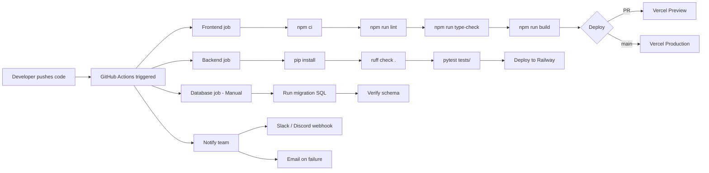
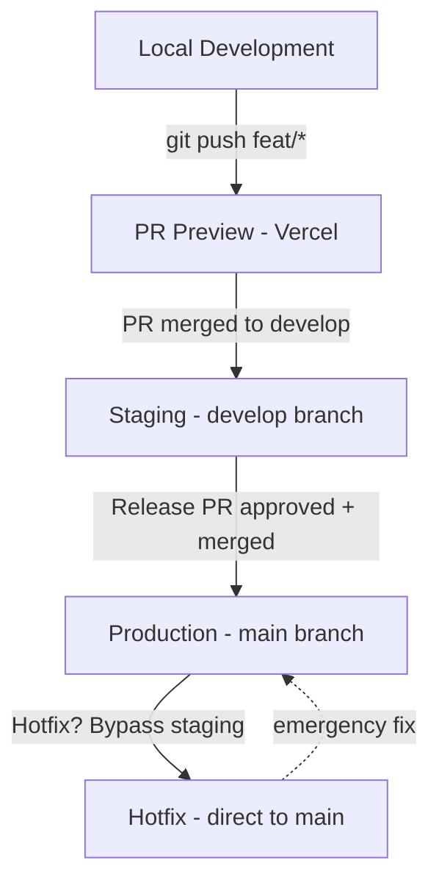
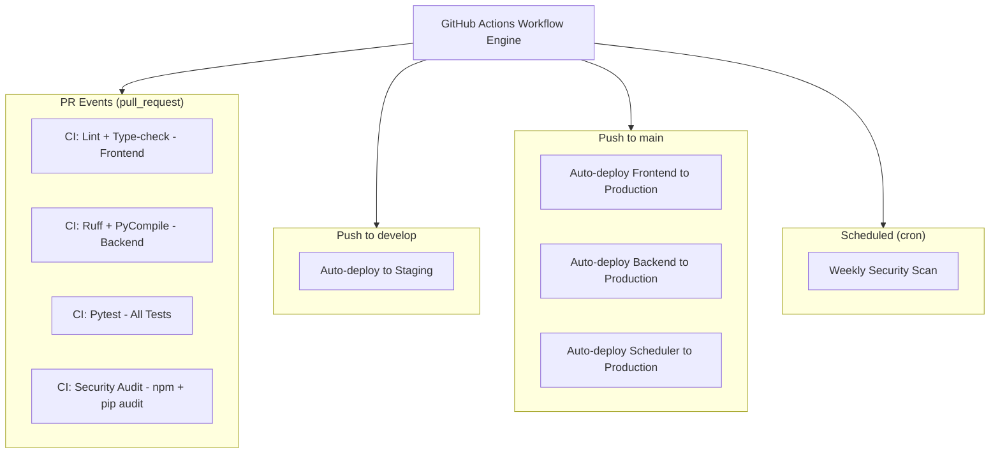

# Deployment Strategy

## Document Control

| Field | Value |
|---|---|
| **Document ID** | DVO-DEP-001 |
| **Version** | 2.0.0 |
| **Status** | Active |
| **Classification** | Internal — Engineering |
| **Author** | DevOps Team |
| **Last Updated** | 2026-06-11 |
| **Review Cycle** | Monthly |
| **Approved By** | Engineering Lead |

---

## Table of Contents

1. [Executive Summary](#1-executive-summary)
2. [Deployment Architecture Overview](#2-deployment-architecture-overview)
3. [Environment Matrix](#3-environment-matrix)
4. [Deployment Pipeline (CI/CD)](#4-deployment-pipeline-cicd)
5. [Frontend Deployment — Vercel](#5-frontend-deployment--vercel)
6. [Backend Deployment — Railway](#6-backend-deployment--railway)
7. [Database Deployments — Supabase](#7-database-deployments--supabase)
8. [AI Service Deployment — Ollama & Claude](#8-ai-service-deployment--ollama--claude)
9. [Scheduler Deployment — APScheduler](#9-scheduler-deployment--apscheduler)
10. [Infrastructure as Code (IaC) — Terraform](#10-infrastructure-as-code-iac--terraform)
11. [Containerization Strategy — Docker](#11-containerization-strategy--docker)
12. [Kubernetes Orchestration (Future)](#12-kubernetes-orchestration-future)
13. [Deployment Automation & Scripting](#13-deployment-automation--scripting)
14. [Rollback Procedures](#14-rollback-procedures)
15. [Blue-Green & Canary Deployment Strategy](#15-blue-green--canary-deployment-strategy)
16. [Deployment Monitoring & Observability](#16-deployment-monitoring--observability)
17. [Security Considerations](#17-security-considerations)
18. [Disaster Recovery & Business Continuity](#18-disaster-recovery--business-continuity)
19. [Deployment Runbooks](#19-deployment-runbooks)
20. [Compliance & Auditing](#20-compliance--auditing)
21. [References](#21-references)

---

## 1. Executive Summary

**Purpose:** This document defines the comprehensive deployment strategy for Second Brain OS (ARIA OS) across all environments — local development, staging, and production. It covers the CI/CD pipeline, infrastructure provisioning, containerization, rollback procedures, monitoring integration, and disaster recovery.

**Scope:** All deployable components of the Second Brain OS monorepo:
- **Frontend:** Next.js 14 application (Vercel)
- **Backend:** FastAPI application (Railway)
- **Database:** Supabase PostgreSQL (managed)
- **AI Services:** Ollama (local) + Claude API (cloud fallback)
- **Scheduler:** APScheduler cron jobs (Railway)

**Guiding Principles:**
- **Zero-downtime deployments** for production frontend and backend
- **Infrastructure as Code** for all cloud resources
- **Immutable deployments** — no post-deployment configuration changes
- **Automated rollback** with RTO < 5 minutes for frontend, < 10 minutes for backend
- **Security-first** — secrets never in code, all traffic encrypted, all deployments audited

**Current Maturity:** The deployment pipeline is partially automated with manual steps for database migrations and environment variable management. The roadmap targets full IaC automation by Q4 2026.

---

## 2. Deployment Architecture Overview

### 2.1 High-Level Architecture

```mermaid
graph TD
    GH[GitHub Repository<br/>monorepo: apps/web, apps/api, services/*]
    CI[GitHub Actions CI/CD<br/>Lint | Test | Security]

    GH -->|Push / PR| CI

    subgraph Deploy["Deploy Targets"]
        VF[Vercel<br/>Frontend - Next.js]
        RB[Railway<br/>Backend - FastAPI]
        RS[Railway<br/>Scheduler - APScheduler]
        SB[Supabase<br/>Database - PostgreSQL]
        AI_S[Ollama / Claude<br/>AI Services]
    end

    CI --> VF
    CI --> RB
    CI --> RS
    CI --> SB
    VF --> AI_S
    RB --> AI_S

    style GH fill:#13151A,stroke:#6366F1,color:#F1F5F9
    style CI fill:#13151A,stroke:#00FFA3,color:#F1F5F9
    style Deploy fill:#0A0B0F,stroke:#334155,color:#F1F5F9
    style VF fill:#13151A,stroke:#818CF8,color:#F1F5F9
    style RB fill:#13151A,stroke:#F59E0B,color:#F1F5F9
    style RS fill:#13151A,stroke:#EF4444,color:#F1F5F9
    style SB fill:#13151A,stroke:#94A3B8,color:#F1F5F9
    style AI_S fill:#13151A,stroke:#6366F1,color:#F1F5F9
```

### 2.2 Component Responsibility Matrix

| Component | Platform | Deployment Trigger | Build Time | Deploy Time | SLA |
|---|---|---|---|---|---|
| Frontend (Next.js 14) | Vercel | Push to `main` | ~2 min | ~1 min | 99.9% |
| Backend (FastAPI) | Railway | Push to `main` | ~1 min | ~2 min | 99.9% |
| Database (Supabase) | Supabase Cloud | Manual migration | N/A | ~30s | 99.95% |
| Scheduler (APScheduler) | Railway | Push to `main` | ~30s | ~1 min | 99.5% |
| AI (Ollama) | Local dev machine | Manual restart | N/A | ~10s | N/A (dev only) |
| AI fallback (Claude) | Anthropic API | N/A (SaaS) | N/A | N/A | 99.9% |

### 2.3 Deployment Flow Diagram



---

## 3. Environment Matrix

### 3.1 Environment Configuration

| Attribute | Local Development | Staging | Production |
|---|---|---|---|
| **Purpose** | Active development | Integration testing | End-user serving |
| **Branch** | Feature/fix branches | `develop` | `main` |
| **Deploy Trigger** | Manual (`npm run dev`) | PR merge to develop | PR merge to main |
| **Frontend URL** | `http://localhost:3000` | `https://staging.secondbrainos.com` | `https://app.secondbrainos.com` |
| **Backend URL** | `http://localhost:8000` | `https://staging-api.secondbrainos.com` | `https://api.secondbrainos.com` |
| **Database** | Supabase free tier (dev project) | Supabase free tier (staging project) | Supabase Pro tier |
| **AI Provider** | Ollama (local, Mistral 7B) | Claude API (Sonnet) | Claude API (Sonnet) + Ollama fallback |
| **Analytics** | Disabled | Vercel Analytics (free) | Vercel Analytics (pro) |
| **Email Service** | Disabled (log only) | Resend (test mode) | Resend (production) |
| **CDN** | None | Vercel Edge Network | Vercel Edge Network |
| **TLS/SSL** | HTTP (self-signed for testing) | HTTPS (auto, Let's Encrypt) | HTTPS (auto, Let's Encrypt) |
| **Secrets** | `.env.local` (gitignored) | GitHub Actions secrets | GitHub Actions secrets + Railway env vars |
| **Logging Level** | DEBUG | INFO | WARN |
| **Rate Limiting** | Disabled | Enabled (50 req/min) | Enabled (100 req/min) |
| **Auth Provider** | Supabase local | Supabase (staging project) | Supabase (production project) |
| **Backups** | None | Daily automated | Point-in-Time Recovery (7-day) |

### 3.2 Environment Configuration Matrix — Detailed

```yaml
environments:
  local:
    description: "Local development environment"
    host: localhost
    ports:
      frontend: 3000
      backend: 8000
      ollama: 11434
    supabase:
      tier: free
      project: secondbrain-dev
    features:
      debug_mode: true
      mock_ai: true
      auto_migrate: true

  staging:
    description: "Integration testing and QA"
    domains:
      frontend: staging.secondbrainos.com
      backend: staging-api.secondbrainos.com
    supabase:
      tier: free
      project: secondbrain-staging
    features:
      debug_mode: true
      mock_ai: false
      auto_migrate: true
    monitoring:
      alerts: true
      alerts_channel: email

  production:
    description: "Production — live user traffic"
    domains:
      frontend: app.secondbrainos.com
      backend: api.secondbrainos.com
    supabase:
      tier: pro
      project: secondbrain-prod
      pitr_retention_days: 7
    features:
      debug_mode: false
      mock_ai: false
      auto_migrate: false
    monitoring:
      alerts: true
      alerts_channel: email+pagerduty
    scaling:
      min_instances: 1
      max_instances: 3
      auto_scale: true
```

### 3.3 Environment Promotion Path



---

## 4. Deployment Pipeline (CI/CD)

### 4.1 Pipeline Architecture



### 4.2 Workflow Configuration — `ci.yml`

```yaml
name: CI
on:
  pull_request:
    branches: [main, develop]
  push:
    branches: [develop, main]

concurrency:
  group: ${{ github.workflow }}-${{ github.ref }}
  cancel-in-progress: true

env:
  NODE_VERSION: 18
  PYTHON_VERSION: "3.10"

jobs:
  frontend-checks:
    name: Frontend — Lint & Type-Check
    runs-on: ubuntu-latest
    timeout-minutes: 10
    steps:
      - uses: actions/checkout@v4
      - uses: actions/setup-node@v4
        with:
          node-version: ${{ env.NODE_VERSION }}
          cache: "npm"
          cache-dependency-path: apps/web/package-lock.json
      - run: cd apps/web && npm ci
      - run: cd apps/web && npm run lint
      - run: cd apps/web && npm run type-check
      - run: cd apps/web && npm run build

  backend-checks:
    name: Backend — Ruff & Compile
    runs-on: ubuntu-latest
    timeout-minutes: 10
    steps:
      - uses: actions/checkout@v4
      - uses: actions/setup-python@v5
        with:
          python-version: ${{ env.PYTHON_VERSION }}
          cache: "pip"
      - run: pip install -r apps/api/requirements.txt
      - run: ruff check apps/api/ packages/ai/ services/scheduler/
      - run: |
          python -m py_compile apps/api/main.py
          python -m py_compile services/scheduler/main.py

  test-suite:
    name: Tests — Pytest Suite
    needs: [frontend-checks, backend-checks]
    runs-on: ubuntu-latest
    timeout-minutes: 15
    steps:
      - uses: actions/checkout@v4
      - uses: actions/setup-python@v5
        with:
          python-version: ${{ env.PYTHON_VERSION }}
          cache: "pip"
      - run: pip install -r requirements.txt
      - run: pytest tests/ -v --cov=packages --cov=services --cov-report=term --cov-report=xml
      - uses: codecov/codecov-action@v3
        with:
          file: ./coverage.xml

  security-audit:
    name: Security — Dependency Audit
    runs-on: ubuntu-latest
    timeout-minutes: 5
    steps:
      - uses: actions/checkout@v4
      - uses: actions/setup-node@v4
        with:
          node-version: ${{ env.NODE_VERSION }}
      - run: cd apps/web && npm audit --audit-level=high
      - uses: actions/setup-python@v5
        with:
          python-version: ${{ env.PYTHON_VERSION }}
      - run: pip install safety && safety check -r apps/api/requirements.txt
```

### 4.3 Workflow Configuration — `deploy-frontend.yml`

```yaml
name: Deploy Frontend
on:
  push:
    branches: [main]
    paths:
      - "apps/web/**"
      - ".github/workflows/deploy-frontend.yml"

jobs:
  deploy:
    runs-on: ubuntu-latest
    timeout-minutes: 15
    steps:
      - uses: actions/checkout@v4
      - uses: amondnet/vercel-action@v25
        with:
          vercel-token: ${{ secrets.VERCEL_TOKEN }}
          vercel-org-id: ${{ secrets.VERCEL_ORG_ID }}
          vercel-project-id: ${{ secrets.VERCEL_PROJECT_ID }}
          vercel-args: "--prod"
```

### 4.4 Workflow Configuration — `deploy-backend.yml`

```yaml
name: Deploy Backend
on:
  push:
    branches: [main]
    paths:
      - "apps/api/**"
      - "packages/**"
      - ".github/workflows/deploy-backend.yml"

jobs:
  deploy:
    runs-on: ubuntu-latest
    timeout-minutes: 15
    steps:
      - uses: actions/checkout@v4
      - name: Deploy to Railway
        uses: bervProject/railway-deploy@v1
        with:
          railway-token: ${{ secrets.RAILWAY_TOKEN }}
          service: backend
```

### 4.5 Workflow Configuration — `deploy-scheduler.yml`

```yaml
name: Deploy Scheduler
on:
  push:
    branches: [main]
    paths:
      - "services/scheduler/**"
      - ".github/workflows/deploy-scheduler.yml"

jobs:
  deploy:
    runs-on: ubuntu-latest
    timeout-minutes: 10
    steps:
      - uses: actions/checkout@v4
      - name: Deploy Scheduler to Railway
        uses: bervProject/railway-deploy@v1
        with:
          railway-token: ${{ secrets.RAILWAY_TOKEN }}
          service: scheduler
```

### 4.6 Pipeline Metrics & SLAs

| Metric | Target | Measurement Method |
|---|---|---|
| Build time (frontend) | < 3 min | GitHub Actions duration |
| Build time (backend) | < 2 min | GitHub Actions duration |
| Deploy time (frontend) | < 2 min | Vercel deployment log |
| Deploy time (backend) | < 3 min | Railway deployment log |
| CI pass rate | > 98% | GitHub Actions insights |
| Time to detect failure | < 5 min | Monitoring alerts |
| Time to rollback | < 5 min | Manual procedure timer |
| Deploy frequency | Multiple times daily | GitHub deployments count |

---

## 5. Frontend Deployment — Vercel

### 5.1 Vercel Project Configuration

| Setting | Value |
|---|---|
| Framework Preset | Next.js 14 |
| Build Command | `npm run build` |
| Output Directory | `.next` |
| Install Command | `npm ci` |
| Node.js Version | 18.x |
| Root Directory | `apps/web` |
| Build and Development Settings | Use default Vercel preset for Next.js |
| Automatic Exposes System | Enabled (for preview deployments) |

### 5.2 Environment Variables (Vercel)

```bash
# Production (encrypted in Vercel Dashboard)
NEXT_PUBLIC_SUPABASE_URL=@supabase_prod_url
NEXT_PUBLIC_SUPABASE_ANON_KEY=@supabase_prod_anon_key
NEXT_PUBLIC_API_URL=https://api.secondbrainos.com
NEXT_PUBLIC_APP_URL=https://app.secondbrainos.com

# Preview/Staging (separate values)
NEXT_PUBLIC_SUPABASE_URL=@supabase_staging_url
NEXT_PUBLIC_SUPABASE_ANON_KEY=@supabase_staging_anon_key
NEXT_PUBLIC_API_URL=https://staging-api.secondbrainos.com
NEXT_PUBLIC_APP_URL=https://staging.secondbrainos.com
```

### 5.3 Vercel Deployment Flow

```
1. Git push to main triggers GitHub Action
2. Vercel receives deployment webhook
3. Vercel clones repository
4. npm ci (clean install, uses lockfile)
5. npm run build (Next.js production build)
6. Output placed in .next/ directory
7. Vercel uploads to Edge Network
8. Traffic gradually shifted to new deployment
9. Old deployment retained for instant rollback (last 10)

Deployment status: BUILDING → READY → (ERROR if failed)
```

### 5.4 Preview Deployments

Every PR to `main` or `develop` automatically generates a Vercel preview deployment:

```bash
# Preview URL format:
https://{branch-name}-{random-hash}.vercel.app

# Example:
https://feat-opportunity-radar-abc123.vercel.app
```

Preview deployments provide:
- Isolated environment for testing
- Automatic HTTPS
- Serverless function execution
- Environment variables from Vercel project (preview scope)

### 5.5 Vercel Configuration — `vercel.json`

```json
{
  "buildCommand": "npm run build",
  "outputDirectory": ".next",
  "framework": "nextjs",
  "regions": ["iad1"],
  "headers": [
    {
      "source": "/(.*)",
      "headers": [
        { "key": "X-Frame-Options", "value": "DENY" },
        { "key": "X-Content-Type-Options", "value": "nosniff" },
        { "key": "Referrer-Policy", "value": "strict-origin-when-cross-origin" },
        { "key": "X-XSS-Protection", "value": "1; mode=block" }
      ]
    },
    {
      "source": "/api/(.*)",
      "headers": [
        { "key": "Access-Control-Allow-Origin", "value": "https://app.secondbrainos.com" },
        { "key": "Access-Control-Allow-Methods", "value": "GET, POST, PUT, DELETE, OPTIONS" },
        { "key": "Access-Control-Allow-Headers", "value": "Content-Type, Authorization" }
      ]
    }
  ],
  "rewrites": [
    { "source": "/api/(.*)", "destination": "https://api.secondbrainos.com/api/$1" }
  ]
}
```

---

## 6. Backend Deployment — Railway

### 6.1 Railway Project Configuration

| Setting | Value |
|---|---|
| Runtime | Python 3.10 |
| Build Command | `pip install -r requirements.txt` |
| Start Command | `uvicorn main:app --host 0.0.0.0 --port $PORT` |
| Health Check Path | `/api/health` |
| Root Directory | `apps/api` |
| Instance Type | Starter (512 MB RAM, 1 vCPU) |
| Autoscaling | Disabled (manual scale up/down) |

### 6.2 Environment Variables (Railway)

```bash
# Production
SUPABASE_URL=@supabase_prod_url
SUPABASE_KEY=@supabase_prod_key
SUPABASE_SERVICE_KEY=@supabase_prod_service_key
JWT_SECRET=@jwt_secret
JWT_ALGORITHM=HS256
CLAUDE_API_KEY=@claude_api_key
OLLAMA_BASE_URL=http://localhost:11434
USE_LOCAL_AI=False
RESEND_API_KEY=@resend_api_key
APP_NAME="Second Brain OS"
DEBUG=False
CORS_ORIGINS=https://app.secondbrainos.com
LOG_LEVEL=WARN
```

### 6.3 Railway Deployment Flow

```
1. Git push to main triggers GitHub Action
2. Railway receives webhook from GitHub
3. Railway clones repository
4. pip install -r apps/api/requirements.txt
5. Health check: GET /api/health
6. If health check passes, traffic routed to new deployment
7. Old deployment retained (last 5 deploys)

Deployment status: BUILDING → DEPLOYING → CRASHED/HEALTHY
```

### 6.4 Backend Health Check Endpoint

```python
# apps/api/app/api/health.py
from fastapi import APIRouter
from datetime import datetime, timezone

router = APIRouter(tags=["health"])

@router.get("/api/health")
async def health_check():
    return {
        "status": "healthy",
        "timestamp": datetime.now(timezone.utc).isoformat(),
        "version": "2.0.0",
        "uptime_seconds": get_uptime(),
        "database": await check_db_connection(),
        "ai_service": await check_ai_connection(),
        "memory_usage_mb": get_memory_usage(),
    }
```

---

## 7. Database Deployments — Supabase

### 7.1 Migration Strategy

Database changes follow a strict migration-based approach:

```
┌─────────────────────────────────────────────────────┐
│                  Migration Workflow                  │
├─────────────────────────────────────────────────────┤
│ 1. Developer creates migration SQL in migrations/    │
│ 2. Migration tested on local Supabase instance       │
│ 3. PR includes migration file + revert script        │
│ 4. Staging migration applied automatically on deploy │
│ 5. Production migration applied manually by DevOps   │
│ 6. Migration verified with schema comparison tool    │
└─────────────────────────────────────────────────────┘
```

### 7.2 Migration File Structure

```
migrations/
├── 001_initial_schema.sql
├── 002_add_habit_logs.sql
├── 003_add_income_entries.sql
├── 004_add_sleep_tracking.sql
├── 005_add_feature_flags.sql
└── revert/
    ├── 001_revert_initial_schema.sql
    ├── 002_revert_habit_logs.sql
    ├── 003_revert_income_entries.sql
    ├── 004_revert_sleep_tracking.sql
    └── 005_revert_feature_flags.sql
```

### 7.3 Migration Naming Convention

```
{NNN}_{description}_{action}.sql
  ↑        ↑            ↑
  │        │            └── create / alter / add / modify / drop
  │        └── Snake_case description of change
  └── Sequential number (001, 002, ...)
```

### 7.4 Migration Template

```sql
-- Migration: 005_add_feature_flags
-- Description: Add feature_flags table for flag-based rollout
-- Author: DevOps Team
-- Date: 2026-06-11
-- Revert: migrations/revert/005_revert_feature_flags.sql

BEGIN;

CREATE TABLE IF NOT EXISTS feature_flags (
    id UUID PRIMARY KEY DEFAULT gen_random_uuid(),
    flag_name TEXT NOT NULL UNIQUE,
    enabled BOOLEAN NOT NULL DEFAULT false,
    description TEXT,
    owner TEXT,
    created_at TIMESTAMPTZ NOT NULL DEFAULT NOW(),
    updated_at TIMESTAMPTZ NOT NULL DEFAULT NOW(),
    user_id UUID REFERENCES users(id) ON DELETE CASCADE
);

ALTER TABLE feature_flags ENABLE ROW LEVEL SECURITY;

CREATE POLICY user_feature_flags ON feature_flags
    FOR ALL USING (user_id = auth.uid());

CREATE INDEX idx_feature_flags_user ON feature_flags(user_id);
CREATE INDEX idx_feature_flags_name ON feature_flags(flag_name);

COMMIT;
```

### 7.5 Revert Script Template

```sql
-- Revert: 005_revert_feature_flags.sql
-- Description: Revert migration 005 — remove feature_flags table

BEGIN;

DROP INDEX IF EXISTS idx_feature_flags_name;
DROP INDEX IF EXISTS idx_feature_flags_user;
DROP POLICY IF EXISTS user_feature_flags ON feature_flags;
DROP TABLE IF EXISTS feature_flags;

COMMIT;
```

### 7.6 Migration Automation Script

```python
# scripts/run_migrations.py
"""
Migration runner for Supabase.

Usage:
    python scripts/run_migrations.py apply 005    # Apply migration 005
    python scripts/run_migrations.py revert 005   # Revert migration 005
    python scripts/run_migrations.py status       # Show migration status
    python scripts/run_migrations.py list         # List all migrations
"""

import os
import sys
import glob
import re
from supabase import create_client
from typing import Optional

MIGRATIONS_DIR = "migrations"
REVERTS_DIR = "migrations/revert"
SUPABASE_URL = os.environ["SUPABASE_URL"]
SUPABASE_SERVICE_KEY = os.environ["SUPABASE_SERVICE_KEY"]

# Migration tracking table
TRACKING_TABLE_SQL = """
CREATE TABLE IF NOT EXISTS _migrations (
    id SERIAL PRIMARY KEY,
    version TEXT NOT NULL UNIQUE,
    filename TEXT NOT NULL,
    checksum TEXT NOT NULL,
    applied_at TIMESTAMPTZ NOT NULL DEFAULT NOW(),
    applied_by TEXT NOT NULL DEFAULT CURRENT_USER,
    duration_ms INTEGER,
    status TEXT NOT NULL DEFAULT 'success'
);
"""


def get_supabase():
    return create_client(SUPABASE_URL, SUPABASE_SERVICE_KEY)


def get_migration_files():
    """Get all migration files sorted by version number."""
    files = glob.glob(f"{MIGRATIONS_DIR}/*.sql")
    return sorted(files)


def get_applied_migrations(supabase):
    """Get list of already-applied migrations."""
    result = supabase.table("_migrations").select("version").execute()
    return {row["version"] for row in result.data}


def calculate_checksum(filepath: str) -> str:
    """Calculate SHA-256 checksum of migration file."""
    import hashlib
    with open(filepath, "rb") as f:
        return hashlib.sha256(f.read()).hexdigest()


def apply_migration(supabase, filepath: str, version: str):
    """Apply a single migration."""
    filename = os.path.basename(filepath)
    checksum = calculate_checksum(filepath)

    with open(filepath, "r") as f:
        sql = f.read()

    import time
    start = time.time()

    try:
        result = supabase.rpc("exec_sql", {"sql": sql}).execute()
        duration = int((time.time() - start) * 1000)

        supabase.table("_migrations").insert({
            "version": version,
            "filename": filename,
            "checksum": checksum,
            "duration_ms": duration,
            "status": "success",
        }).execute()

        print(f"  ✓ Applied {filename} ({duration}ms)")
        return True
    except Exception as e:
        duration = int((time.time() - start) * 1000)
        supabase.table("_migrations").insert({
            "version": version,
            "filename": filename,
            "checksum": checksum,
            "duration_ms": duration,
            "status": "failed",
            "error": str(e),
        }).execute()

        print(f"  ✗ Failed {filename}: {e}")
        return False


def apply_pending(supabase):
    """Apply all pending migrations."""
    applied = get_applied_migrations(supabase)
    files = get_migration_files()

    for filepath in files:
        match = re.match(r"(\d+)", os.path.basename(filepath))
        if match:
            version = match.group(1)
            if version not in applied:
                apply_migration(supabase, filepath, version)


def revert_migration(supabase, version: str):
    """Revert a specific migration."""
    revert_file = f"{REVERTS_DIR}/{version}_revert.sql"
    if not os.path.exists(revert_file):
        print(f"  ✗ Revert file not found: {revert_file}")
        return False

    with open(revert_file, "r") as f:
        sql = f.read()

    try:
        supabase.rpc("exec_sql", {"sql": sql}).execute()
        supabase.table("_migrations").delete().eq("version", version).execute()
        print(f"  ✓ Reverted migration {version}")
        return True
    except Exception as e:
        print(f"  ✗ Revert failed: {e}")
        return False


if __name__ == "__main__":
    command = sys.argv[1] if len(sys.argv) > 1 else "status"
    supabase = get_supabase()

    if command == "apply":
        version = sys.argv[2] if len(sys.argv) > 2 else None
        if version:
            files = get_migration_files()
            for f in files:
                match = re.match(r"(\d+)", os.path.basename(f))
                if match and match.group(1) == version:
                    apply_migration(supabase, f, version)
                    break
        else:
            apply_pending(supabase)
    elif command == "revert":
        version = sys.argv[2]
        revert_migration(supabase, version)
    elif command == "status":
        applied = get_applied_migrations(supabase)
        files = get_migration_files()
        for f in files:
            match = re.match(r"(\d+)", os.path.basename(f))
            if match:
                v = match.group(1)
                status = "✓ Applied" if v in applied else "○ Pending"
                print(f"  [{status}] {os.path.basename(f)}")
```

### 7.7 Database Backup & Restore

| Task | Command | Frequency | Retention |
|---|---|---|---|
| Full backup (Supabase Pro) | Automatic (Supabase) | Daily | 7 days |
| Manual export | `pg_dump` via Supabase CLI | On-demand | Variable |
| Point-in-Time Recovery | Supabase Dashboard | Pro tier feature | Up to 7 days |
| Schema-only export | `pg_dump --schema-only` | Per migration | Permanent |

---

## 8. AI Service Deployment — Ollama & Claude

### 8.1 Local AI (Ollama) Deployment

```bash
# Installation
curl -fsSL https://ollama.com/install.sh | sh

# Start service
ollama serve

# Pull models
ollama pull mistral:7b
ollama pull nomic-embed-text

# Verify
curl http://localhost:11434/api/tags

# Production considerations:
# - No auto-scaling; single instance
# - GPU recommended for faster inference
# - 8 GB RAM minimum (16 GB recommended)
# - Storage: ~4 GB per model
```

### 8.2 Cloud AI (Claude API) Configuration

| Setting | Value |
|---|---|
| Provider | Anthropic |
| Model | Claude Sonnet 4 (claude-sonnet-4-20250514) |
| API Endpoint | `https://api.anthropic.com/v1/messages` |
| Max Tokens | 4096 (per agent call) |
| Rate Limit | 50 requests per minute (API tier dependent) |
| Cost | ~$0.015 per typical request |
| Fallback | Ollama (local) when API unavailable |

### 8.3 AI Client Configuration

```python
# packages/ai/client.py
"""
AI client with automatic fallback between Ollama and Claude.

Usage:
    from ai.client import llm
    response = await llm.generate("Your prompt")
    json_response = await llm.generate_json("Return JSON", system="You are...")
"""

import os
import httpx
import json
from typing import Optional, Any
from shared.utils.logger import logger
from shared.utils.retry import retry_with_backoff

USE_LOCAL_AI = os.getenv("USE_LOCAL_AI", "True").lower() == "true"
OLLAMA_BASE_URL = os.getenv("OLLAMA_BASE_URL", "http://localhost:11434")
CLAUDE_API_KEY = os.getenv("CLAUDE_API_KEY", "")
CLAUDE_MODEL = "claude-sonnet-4-20250514"
OLLAMA_MODEL = "mistral:7b"


class AIClient:
    """Unified AI client with fallback chain: Ollama → Claude → Exception."""

    def __init__(self):
        self.ollama_base = OLLAMA_BASE_URL
        self.claude_key = CLAUDE_API_KEY
        self.use_local = USE_LOCAL_AI

    @retry_with_backoff(max_retries=2, base_delay=1.0)
    async def _call_ollama(self, prompt: str, system: Optional[str] = None,
                           temperature: float = 0.5, max_tokens: int = 4096) -> dict:
        payload = {
            "model": OLLAMA_MODEL,
            "prompt": prompt,
            "system": system or "",
            "stream": False,
            "options": {
                "temperature": temperature,
                "num_predict": max_tokens,
            },
        }
        async with httpx.AsyncClient(timeout=60.0) as client:
            resp = await client.post(f"{self.ollama_base}/api/generate", json=payload)
            resp.raise_for_status()
            return resp.json()

    @retry_with_backoff(max_retries=2, base_delay=1.0)
    async def _call_claude(self, prompt: str, system: Optional[str] = None,
                           temperature: float = 0.5, max_tokens: int = 4096) -> dict:
        headers = {
            "x-api-key": self.claude_key,
            "anthropic-version": "2023-06-01",
            "content-type": "application/json",
        }
        messages = [{"role": "user", "content": prompt}]
        payload = {
            "model": CLAUDE_MODEL,
            "max_tokens": max_tokens,
            "messages": messages,
            "temperature": temperature,
        }
        if system:
            payload["system"] = system

        async with httpx.AsyncClient(timeout=120.0) as client:
            resp = await client.post(
                "https://api.anthropic.com/v1/messages",
                headers=headers,
                json=payload,
            )
            resp.raise_for_status()
            return resp.json()

    async def generate(self, prompt: str, system: Optional[str] = None,
                       temperature: float = 0.5, max_tokens: int = 4096) -> str:
        if self.use_local:
            try:
                result = await self._call_ollama(prompt, system, temperature, max_tokens)
                return result.get("response", "")
            except Exception as e:
                logger.warning(f"Ollama failed, falling back to Claude: {e}")
                self.use_local = False

        result = await self._call_claude(prompt, system, temperature, max_tokens)
        return result.get("content", [{}])[0].get("text", "")

    async def generate_json(self, prompt: str, system: Optional[str] = None,
                            temperature: float = 0.3, max_tokens: int = 4096) -> dict:
        text = await self.generate(prompt, system, temperature, max_tokens)
        # Extract JSON from response
        json_match = text.strip()
        if json_match.startswith("```json"):
            json_match = json_match.split("```json")[1].split("```")[0].strip()
        elif json_match.startswith("```"):
            json_match = json_match.split("```")[1].split("```")[0].strip()
        return json.loads(json_match)


llm = AIClient()
```

---

## 9. Scheduler Deployment — APScheduler

### 9.1 Scheduler Configuration

```python
# services/scheduler/main.py
"""
APScheduler-based cron job runner.

Jobs:
- A09 Daily Briefing: 7:00 AM every day
- A06 Opportunity Radar: 6:00 AM every day
- A10 Weekly Review: Sunday 8:00 PM
- A11 Missed Task Checker: Every 15 minutes
- A12 Habit Miss Checker: Midnight daily
- A13 Sleep Wind-down: 9:30 PM daily
- A14 Course Nudge: 6:00 PM daily
"""

from apscheduler.schedulers.asyncio import AsyncIOScheduler
from apscheduler.triggers.cron import CronTrigger
import asyncio


def create_scheduler() -> AsyncIOScheduler:
    scheduler = AsyncIOScheduler()

    # Daily Briefing — 7:00 AM
    scheduler.add_job(
        trigger_daily_briefing,
        CronTrigger(hour=7, minute=0, timezone="Asia/Kolkata"),
        id="daily_briefing",
        name="A09 — Generate Daily Briefing",
        max_instances=1,
        coalesce=True,
    )

    # Opportunity Radar — 6:00 AM
    scheduler.add_job(
        trigger_opportunity_radar,
        CronTrigger(hour=6, minute=0, timezone="Asia/Kolkata"),
        id="opportunity_radar",
        name="A06 — Scan Opportunities",
        max_instances=1,
        coalesce=True,
    )

    # Weekly Review — Sunday 8:00 PM
    scheduler.add_job(
        trigger_weekly_review,
        CronTrigger(day_of_week="sun", hour=20, minute=0, timezone="Asia/Kolkata"),
        id="weekly_review",
        name="A10 — Generate Weekly Review",
        max_instances=1,
        coalesce=True,
    )

    # Missed Task Checker — Every 15 minutes
    scheduler.add_job(
        check_missed_tasks,
        CronTrigger(minute="*/15", timezone="Asia/Kolkata"),
        id="missed_tasks",
        name="A11 — Check Missed Tasks",
        max_instances=1,
        coalesce=True,
    )

    # Habit Miss Checker — Midnight
    scheduler.add_job(
        check_missed_habits,
        CronTrigger(hour=0, minute=5, timezone="Asia/Kolkata"),
        id="missed_habits",
        name="A12 — Check Missed Habits",
        max_instances=1,
        coalesce=True,
    )

    # Sleep Wind-down — 9:30 PM
    scheduler.add_job(
        generate_sleep_winddown,
        CronTrigger(hour=21, minute=30, timezone="Asia/Kolkata"),
        id="sleep_winddown",
        name="A13 — Sleep Wind-down Message",
        max_instances=1,
        coalesce=True,
    )

    # Course Nudge — 6:00 PM
    scheduler.add_job(
        generate_course_nudge,
        CronTrigger(hour=18, minute=0, timezone="Asia/Kolkata"),
        id="course_nudge",
        name="A14 — Course Progress Nudge",
        max_instances=1,
        coalesce=True,
    )

    return scheduler


if __name__ == "__main__":
    scheduler = create_scheduler()
    scheduler.start()
    try:
        asyncio.get_event_loop().run_forever()
    except KeyboardInterrupt:
        scheduler.shutdown()
```

### 9.2 Scheduler Health Monitoring

```python
# services/scheduler/health.py
from datetime import datetime, timezone

JOB_EXECUTION_LOG = {}

def log_job_execution(job_id: str, status: str, duration_ms: int, error: str = None):
    JOB_EXECUTION_LOG[job_id] = {
        "last_run": datetime.now(timezone.utc).isoformat(),
        "status": status,
        "duration_ms": duration_ms,
        "error": error,
    }

def get_job_summary():
    """Returns health summary for all scheduler jobs."""
    from services.scheduler.main import scheduler
    summary = []
    for job in scheduler.get_jobs():
        summary.append({
            "id": job.id,
            "name": job.name,
            "next_run": str(job.next_run_time) if job.next_run_time else "paused",
            "last_run": JOB_EXECUTION_LOG.get(job.id, {}).get("last_run"),
            "last_status": JOB_EXECUTION_LOG.get(job.id, {}).get("status"),
        })
    return summary
```

---

## 10. Infrastructure as Code (IaC) — Terraform

### 10.1 Terraform Provider Configuration

```hcl
# infrastructure/terraform/main.tf

terraform {
  required_version = ">= 1.5.0"
  required_providers {
    vercel = {
      source  = "vercel/vercel"
      version = "~> 0.15"
    }
    supabase = {
      source  = "supabase/supabase"
      version = "~> 0.3"
    }
    random = {
      source  = "hashicorp/random"
      version = "~> 3.5"
    }
  }
  backend "s3" {
    bucket = "secondbrain-terraform-state"
    key    = "devops/terraform.tfstate"
    region = "us-east-1"
  }
}

provider "vercel" {
  api_token = var.vercel_api_token
}

provider "supabase" {
  access_token = var.supabase_access_token
}
```

### 10.2 Variable Definitions

```hcl
# infrastructure/terraform/variables.tf

variable "environment" {
  description = "Deployment environment (staging/production)"
  type        = string
  validation {
    condition     = contains(["staging", "production"], var.environment)
    error_message = "Environment must be 'staging' or 'production'."
  }
}

variable "project_name" {
  description = "Project name for resource naming"
  type        = string
  default     = "secondbrain-os"
}

variable "vercel_api_token" {
  description = "Vercel API token"
  type        = string
  sensitive   = true
}

variable "supabase_access_token" {
  description = "Supabase access token"
  type        = string
  sensitive   = true
}

variable "supabase_db_password" {
  description = "Supabase database password"
  type        = string
  sensitive   = true
}
```

### 10.3 Supabase Resource Definition

```hcl
# infrastructure/terraform/supabase.tf

resource "supabase_project" "main" {
  name           = "${var.project_name}-${var.environment}"
  organization_id = var.supabase_org_id
  database_password = var.supabase_db_password
  region         = "us-east-1"
  plan           = var.environment == "production" ? "pro" : "free"

  lifecycle {
    prevent_destroy = true
  }
}

resource "supabase_project_settings" "main" {
  project_ref = supabase_project.main.id
  pgrst_openapi_server = var.environment == "production" ? "https://api.secondbrainos.com" : "https://staging-api.secondbrainos.com"

  auth_site_url          = var.environment == "production" ? "https://app.secondbrainos.com" : "https://staging.secondbrainos.com"
  auth_additional_redirect_urls = [
    "http://localhost:3000/**",
    "https://app.secondbrainos.com/**",
    "https://staging.secondbrainos.com/**",
  ]
}

resource "supabase_database_backup" "daily" {
  count      = var.environment == "production" ? 1 : 0
  project_ref = supabase_project.main.id
  schedule   = "0 2 * * *"  # Daily at 2 AM
  retention_days = 7
}
```

### 10.4 Vercel Resource Definition

```hcl
# infrastructure/terraform/vercel.tf

resource "vercel_project" "frontend" {
  name      = "${var.project_name}-frontend-${var.environment}"
  framework = "nextjs"
  root_directory = "apps/web"
  build_command    = "npm run build"
  output_directory = ".next"
  install_command  = "npm ci"

  git_repository = {
    type = "github"
    repo = "org/secondbrain-os"
    production_branch = "main"
  }

  environment = [
    {
      key    = "NEXT_PUBLIC_SUPABASE_URL"
      value  = supabase_project.main.public_url
      target = ["production", "preview"]
    },
    {
      key    = "NEXT_PUBLIC_SUPABASE_ANON_KEY"
      value  = supabase_project.main.anon_key
      target = ["production", "preview"]
    },
    {
      key    = "NEXT_PUBLIC_API_URL"
      value  = var.environment == "production" ? "https://api.secondbrainos.com" : "https://staging-api.secondbrainos.com"
      target = ["production", "preview"]
    },
  ]
}

resource "vercel_domain" "frontend" {
  count    = var.environment == "production" ? 1 : 0
  project_id = vercel_project.frontend.id
  domain   = "app.secondbrainos.com"
}
```

### 10.5 Infrastructure Outputs

```hcl
# infrastructure/terraform/outputs.tf

output "frontend_url" {
  description = "Frontend deployment URL"
  value       = var.environment == "production" ? "https://app.secondbrainos.com" : "https://staging.secondbrainos.com"
}

output "backend_url" {
  description = "Backend deployment URL"
  value       = var.environment == "production" ? "https://api.secondbrainos.com" : "https://staging-api.secondbrainos.com"
}

output "supabase_project_ref" {
  description = "Supabase project reference"
  value       = supabase_project.main.id
}

output "supabase_db_url" {
  description = "Supabase database connection string"
  value       = supabase_project.main.database_url
  sensitive   = true
}
```

---

## 11. Containerization Strategy — Docker

### 11.1 Backend Dockerfile

```dockerfile
# apps/api/Dockerfile

# Stage 1: Builder
FROM python:3.10-slim AS builder

WORKDIR /app

RUN apt-get update && apt-get install -y --no-install-recommends \
    gcc \
    && rm -rf /var/lib/apt/lists/*

COPY apps/api/requirements.txt .
RUN pip install --user --no-cache-dirs -r requirements.txt

COPY packages/ packages/
COPY apps/api/ apps/api/

# Stage 2: Runtime
FROM python:3.10-slim AS runtime

WORKDIR /app

RUN groupadd -r appuser && useradd -r -g appuser appuser

COPY --from=builder /root/.local /root/.local
COPY --from=builder /app /app

ENV PATH=/root/.local/bin:$PATH
ENV PYTHONPATH=/app:$PYTHONPATH

EXPOSE 8000

USER appuser

HEALTHCHECK --interval=30s --timeout=5s --start-period=15s --retries=3 \
    CMD python -c "import http.client; conn = http.client.HTTPConnection('localhost:8000'); conn.request('GET', '/api/health'); resp = conn.getresponse(); exit(0) if resp.status == 200 else exit(1)"

CMD ["uvicorn", "apps.api.main:app", "--host", "0.0.0.0", "--port", "8000"]
```

### 11.2 Frontend Dockerfile

```dockerfile
# apps/web/Dockerfile

# Stage 1: Builder
FROM node:18-alpine AS builder

WORKDIR /app

COPY apps/web/package.json apps/web/package-lock.json ./
RUN npm ci

COPY apps/web/ ./
COPY packages/types/ /app/packages/types/

ARG NEXT_PUBLIC_SUPABASE_URL
ARG NEXT_PUBLIC_SUPABASE_ANON_KEY
ARG NEXT_PUBLIC_API_URL

ENV NEXT_PUBLIC_SUPABASE_URL=$NEXT_PUBLIC_SUPABASE_URL
ENV NEXT_PUBLIC_SUPABASE_ANON_KEY=$NEXT_PUBLIC_SUPABASE_ANON_KEY
ENV NEXT_PUBLIC_API_URL=$NEXT_PUBLIC_API_URL

RUN npm run build

# Stage 2: Runner
FROM node:18-alpine AS runner

WORKDIR /app

RUN addgroup -g 1001 -S nodejs && \
    adduser -S nextjs -u 1001

COPY --from=builder /app/.next ./.next
COPY --from=builder /app/public ./public
COPY --from=builder /app/node_modules ./node_modules
COPY --from=builder /app/package.json ./package.json

USER nextjs

EXPOSE 3000

ENV PORT=3000
ENV NODE_ENV=production

CMD ["node_modules/.bin/next", "start"]
```

### 11.3 Scheduler Dockerfile

```dockerfile
# services/scheduler/Dockerfile

FROM python:3.10-slim

WORKDIR /app

RUN apt-get update && apt-get install -y --no-install-recommends \
    gcc \
    && rm -rf /var/lib/apt/lists/*

RUN groupadd -r appuser && useradd -r -g appuser appuser

COPY services/scheduler/requirements.txt .
RUN pip install --no-cache-dirs -r requirements.txt

COPY services/scheduler/ services/scheduler/
COPY packages/ packages/

ENV PYTHONPATH=/app:$PYTHONPATH

USER appuser

CMD ["python", "services/scheduler/main.py"]
```

### 11.4 Docker Compose Configuration

```yaml
# docker-compose.yml

version: "3.9"

services:
  backend:
    build:
      context: .
      dockerfile: apps/api/Dockerfile
    ports:
      - "8000:8000"
    environment:
      SUPABASE_URL: ${SUPABASE_URL}
      SUPABASE_KEY: ${SUPABASE_KEY}
      SUPABASE_SERVICE_KEY: ${SUPABASE_SERVICE_KEY}
      JWT_SECRET: ${JWT_SECRET}
      JWT_ALGORITHM: HS256
      OLLAMA_BASE_URL: http://ollama:11434
      USE_LOCAL_AI: "True"
      LOG_LEVEL: INFO
    depends_on:
      - ollama
    volumes:
      - ./packages:/app/packages

  frontend:
    build:
      context: .
      dockerfile: apps/web/Dockerfile
      args:
        NEXT_PUBLIC_SUPABASE_URL: ${NEXT_PUBLIC_SUPABASE_URL}
        NEXT_PUBLIC_SUPABASE_ANON_KEY: ${NEXT_PUBLIC_SUPABASE_ANON_KEY}
        NEXT_PUBLIC_API_URL: http://localhost:8000
    ports:
      - "3000:3000"
    depends_on:
      - backend

  scheduler:
    build:
      context: .
      dockerfile: services/scheduler/Dockerfile
    environment:
      SUPABASE_URL: ${SUPABASE_URL}
      SUPABASE_KEY: ${SUPABASE_KEY}
      SUPABASE_SERVICE_KEY: ${SUPABASE_SERVICE_KEY}
      JWT_SECRET: ${JWT_SECRET}
      OLLAMA_BASE_URL: http://ollama:11434
      USE_LOCAL_AI: "True"
    depends_on:
      - backend
      - ollama

  ollama:
    image: ollama/ollama:latest
    ports:
      - "11434:11434"
    volumes:
      - ollama_data:/root/.ollama
    environment:
      OLLAMA_HOST: 0.0.0.0

volumes:
  ollama_data:
```

---

## 12. Kubernetes Orchestration (Future)

### 12.1 Target Architecture

```
        ┌─────────────┐
        │  Ingress NGINX│
        │  + Cert-Manager│
        └──────┬──────┘
               │
    ┌──────────┼──────────┐
    │          │          │
    â–¼          â–¼          â–¼
┌──────┐  ┌──────┐  ┌──────┐
│Front │  │Back  │  │Sched │
│Deploy│  │Deploy│  │Deploy│
│HPA   │  │HPA   │  │      │
├──────┤  ├──────┤  ├──────┤
│Svc   │  │Svc   │  │Svc   │
└──────┘  └──────┘  └──────┘
               │
               â–¼
          ┌──────────┐
          │ Supabase  │
          │ (external)│
          └──────────┘
```

### 12.2 Kubernetes Manifests (Future Reference)

```yaml
# infrastructure/kubernetes/namespace.yaml
apiVersion: v1
kind: Namespace
metadata:
  name: secondbrain

---
# infrastructure/kubernetes/backend-deployment.yaml
apiVersion: apps/v1
kind: Deployment
metadata:
  name: backend
  namespace: secondbrain
spec:
  replicas: 2
  selector:
    matchLabels:
      app: backend
  template:
    metadata:
      labels:
        app: backend
    spec:
      containers:
      - name: backend
        image: ghcr.io/secondbrain/backend:latest
        ports:
        - containerPort: 8000
        envFrom:
        - secretRef:
            name: backend-secrets
        resources:
          requests:
            memory: "256Mi"
            cpu: "250m"
          limits:
            memory: "512Mi"
            cpu: "500m"
        livenessProbe:
          httpGet:
            path: /api/health
            port: 8000
          initialDelaySeconds: 15
          periodSeconds: 30
        readinessProbe:
          httpGet:
            path: /api/health
            port: 8000
          initialDelaySeconds: 5
          periodSeconds: 10

---
# infrastructure/kubernetes/hpa.yaml
apiVersion: autoscaling/v2
kind: HorizontalPodAutoscaler
metadata:
  name: backend-hpa
  namespace: secondbrain
spec:
  scaleTargetRef:
    apiVersion: apps/v1
    kind: Deployment
    name: backend
  minReplicas: 2
  maxReplicas: 10
  metrics:
  - type: Resource
    resource:
      name: cpu
      target:
        type: Utilization
        averageUtilization: 70
  - type: Resource
    resource:
      name: memory
      target:
        type: Utilization
        averageUtilization: 80
```

---

## 13. Deployment Automation & Scripting

### 13.1 Deployment Scripts Inventory

| Script | Purpose | Location |
|---|---|---|
| `scripts/run_migrations.py` | Apply/revert database migrations | Repository root |
| `scripts/validate_prompts.py` | Validate prompt YAML frontmatter | Repository root |
| `scripts/deploy-all.sh` | Trigger full-stack deployment | DevOps scripts |
| `scripts/rollback.sh` | Rollback frontend + backend to previous version | DevOps scripts |
| `scripts/health-check.sh` | Verify all services are healthy post-deployment | DevOps scripts |

### 13.2 Full Deployment Script

```bash
#!/bin/bash
# scripts/deploy-all.sh
# Full-stack deployment script — triggers all services
# Usage: ./scripts/deploy-all.sh [staging|production]

set -euo pipefail

ENVIRONMENT="${1:-staging}"
TIMESTAMP=$(date +"%Y-%m-%d %H:%M:%S")

echo "=========================================="
echo "  Second Brain OS — Full Deployment"
echo "  Environment: $ENVIRONMENT"
echo "  Timestamp:   $TIMESTAMP"
echo "=========================================="

# Step 1: Run pre-deployment checks
echo ""
echo "[1/5] Running pre-deployment checks..."
python scripts/validate_prompts.py
if [ $? -ne 0 ]; then
    echo "  FAILED: Prompt validation errors. Aborting."
    exit 1
fi
echo "  ✓ Pre-deployment checks passed."

# Step 2: Run database migrations
echo ""
echo "[2/5] Running database migrations..."
python scripts/run_migrations.py apply
echo "  ✓ Database migrations applied."

# Step 3: Build and push Docker images
echo ""
echo "[3/5] Building and pushing images..."
docker compose -f docker-compose.prod.yml build
docker compose -f docker-compose.prod.yml push
echo "  ✓ Images built and pushed."

# Step 4: Trigger platform deployments
echo ""
echo "[4/5] Triggering platform deployments..."
# Vercel
vercel --prod --token $VERCEL_TOKEN
# Railway
railway up --service backend
railway up --service scheduler
echo "  ✓ Platform deployments triggered."

# Step 5: Post-deployment health check
echo ""
echo "[5/5] Running post-deployment health checks..."
sleep 10
./scripts/health-check.sh $ENVIRONMENT
echo "  ✓ Health checks passed."

echo ""
echo "=========================================="
echo "  Deployment complete."
echo "=========================================="
```

### 13.3 Rollback Script

```bash
#!/bin/bash
# scripts/rollback.sh
# Rollback to previous deployment
# Usage: ./scripts/rollback.sh [frontend|backend|all] [steps_back]
#   steps_back: number of deployments to rollback (default: 1)

set -euo pipefail

TARGET="${1:-all}"
STEPS="${2:-1}"

echo "=========================================="
echo "  Rollback initiated"
echo "  Target: $TARGET"
echo "  Steps back: $STEPS"
echo "=========================================="

rollback_frontend() {
    echo "Rolling back frontend (Vercel)..."
    # Get last N successful deployments
    vercel list --token $VERCEL_TOKEN | grep "READY" | head -$STEPS | tail -1 | \
        awk '{print $2}' | xargs vercel promote --token $VERCEL_TOKEN
    echo "  ✓ Frontend rolled back."
}

rollback_backend() {
    echo "Rolling back backend (Railway)..."
    railway rollback --service backend $STEPS
    echo "  ✓ Backend rolled back."
}

case $TARGET in
    frontend) rollback_frontend ;;
    backend)  rollback_backend ;;
    all)
        rollback_frontend
        rollback_backend
        ;;
esac

echo "=========================================="
echo "  Rollback complete. Verify health:"
echo "  ./scripts/health-check.sh"
echo "=========================================="
```

---

## 14. Rollback Procedures

### 14.1 Rollback Decision Matrix

| Scenario | Frontend Rollback | Backend Rollback | Database Rollback | RTO Target | RPO Target |
|---|---|---|---|---|---|
| Visual/UI bug | ✅ Vercel promote previous | ❌ | ❌ | < 2 min | 0 |
| API error (500) on new path | ❌ | ✅ Railway rollback | ❌ | < 3 min | 0 |
| API error on all routes | ❌ | ✅ Railway rollback | ❌ | < 3 min | 0 |
| Breaking API change | ❌ | ✅ Railway rollback | ❌ | < 3 min | 0 |
| Auth failure | ❌ | ✅ Railway rollback | ❌ | < 3 min | 0 |
| Data corruption | ❌ | ❌ | ✅ PITR + script fix | < 30 min | < 5 min |
| Security vulnerability | ✅ | ✅ | ✅ PITR | < 15 min | < 5 min |
| Dependency vulnerability | ✅ | ✅ | ❌ | < 1 hour | 0 |
| Feature flag misconfiguration | ✅ | ✅ | ❌ | < 5 min | 0 |

### 14.2 Frontend Rollback (Vercel)

```bash
# Method 1: Vercel Dashboard (Instant)
1. Navigate to https://vercel.com/dashboard
2. Select project "secondbrain-frontend"
3. Click "Deployments" tab
4. Find the last known-good deployment (marked "READY")
5. Click "..." (more options) → "Promote to Production"
6. Confirm in dialog
7. Verify: Health check URL returns 200

# Method 2: Vercel CLI
vercel list --token $VERCEL_TOKEN
# Copy the deployment ID (e.g., dpl_abc123)
vercel promote dpl_abc123 --token $VERCEL_TOKEN

# Method 3: Git revert (triggers automatic deploy)
git revert HEAD --no-edit
git push origin main

# Method 4: Automated script
./scripts/rollback.sh frontend 1
```

### 14.3 Backend Rollback (Railway)

```bash
# Method 1: Railway Dashboard
1. Navigate to https://railway.app/dashboard
2. Select project "secondbrain-backend"
3. Click "Deployments" tab
4. Find the last known-good deployment
5. Click "Rollback to this deploy"
6. Wait for health check to pass

# Method 2: Railway CLI
railway login
railway rollback --service backend 1

# Method 3: Automated script
./scripts/rollback.sh backend 1

# Verify rollback
curl https://api.secondbrainos.com/api/health
```

### 14.4 Database Rollback (Supabase)

```sql
-- Scenario 1: Application-level fix (preferred)
-- Identify and fix bad records
SELECT * FROM tasks WHERE created_at > '2026-06-11T10:00:00Z' AND title LIKE '%bad%';
-- Update or delete the bad records
DELETE FROM tasks WHERE id IN ('bad-record-uuid-1', 'bad-record-uuid-2');

-- Scenario 2: Point-in-Time Recovery (PITR) — Supabase Pro tier
-- 1. Go to Supabase Dashboard > Database > Backups
-- 2. Click "Restore" button
-- 3. Select a timestamp BEFORE the incident occurred
-- 4. Enter database password to confirm
-- 5. Wait for restoration to complete (typically 5-15 minutes)
-- 6. Verify data integrity with a read-only query
-- 7. Update application connection string if new project was created

-- Scenario 3: Full restore from backup
-- 1. Download latest backup from Supabase Dashboard
-- 2. Create a new Supabase project
-- 3. Restore using pg_restore:
pg_restore --clean --if-exists --db $DATABASE_URL --no-owner \
    secondbrain_backup_20260610.dump

-- WARNING: Database rollback loses ALL changes after restore point.
-- Always attempt application-level compensation first.
```

### 14.5 Rollback Verification Checklist

```
□ Frontend: Visit https://app.secondbrainos.com — page loads without errors
â–¡ Frontend: Console shows no 4xx/5xx API errors
â–¡ Frontend: Web Vitals within normal range (LCP < 2.5s, CLS < 0.1)
â–¡ Backend: GET /api/health returns {"status": "healthy"}
â–¡ Backend: Test key endpoints return expected data
â–¡ Backend: Error rate < 0.1% (baseline normal)
â–¡ Database: Query execution times at baseline
â–¡ Database: No locked tables or long-running queries
â–¡ Auth: Login flow works end-to-end
â–¡ Scheduler: All cron jobs executing on schedule
â–¡ Monitoring: Alert dashboard shows green
â–¡ Logs: No ERROR level logs from new deployment
```

---

## 15. Blue-Green & Canary Deployment Strategy

### 15.1 Current State

Second Brain OS currently uses **rolling deployments** via Vercel and Railway. Blue-green and canary deployments are planned for future implementation.

### 15.2 Blue-Green Deployment Design (Future)

```
User Traffic
     │
     â–¼
┌─────────────┐     ┌─────────────┐
│   Load      │     │   Load      │
│   Balancer  │────▶│   Balancer  │
│ (Active)    │     │ (Standby)   │
└──────┬──────┘     └──────┬──────┘
       │                   │
       â–¼                   â–¼
┌─────────────┐     ┌─────────────┐
│  Blue Env   │     │  Green Env  │
│ (current)   │     │  (new)      │
│ v2.0.0      │     │  v2.1.0     │
└─────────────┘     └─────────────┘
       │                   │
       └───────────────────┘
              │
              â–¼
        ┌──────────┐
        │ Database │
        │ (shared) │
        └──────────┘
```

**Blue-Green Workflow:**
1. Deploy v2.1.0 to Green environment (inactive)
2. Run full health check suite against Green
3. Switch load balancer from Blue to Green
4. Monitor for 15 minutes (observation period)
5. If issues detected, switch back to Blue (instant)
6. If clean, decommission Blue or keep as rollback target

### 15.3 Canary Deployment Design (Future)

```
Traffic Split
     │
     ├── 90% ──► Stable (v2.0.0)
     │
     └── 10% ──► Canary (v2.1.0)
                 │
                 ├── Monitor: Error rate, latency, crash rate
                 │
                 ├── If clean after 30 min → 50/50 split
                 │
                 ├── If clean after 60 min → 100% to new
                 │
                 └── If errors → instant rollback to 100% stable
```

**Canary Criteria for Promotion:**
- Error rate < 0.5% (baseline + 0.2% tolerance)
- P95 latency within 10% of baseline
- No crash loops or OOM events
- No security alerts
- No authentication failures
- No data integrity violations

---

## 16. Deployment Monitoring & Observability

### 16.1 Deployment Health Metrics

| Metric | Source | Alert Threshold | Severity |
|---|---|---|---|
| Frontend deployment failure | Vercel webhook | Any failure | Critical |
| Backend deployment failure | Railway webhook | Any failure | Critical |
| Deployment duration > 2x baseline | GitHub Actions | > 5 min | Warning |
| P95 API latency increase > 20% | Vercel/Railway | Post-deploy | Warning |
| Error rate > 1% | Vercel Analytics | Post-deploy | Critical |
| 5xx responses > 0.1% | Backend logs | Post-deploy | Critical |
| Database query time > 2s | Supabase | Post-deploy | Warning |
| Auth login failure rate > 5% | Supabase Auth | Post-deploy | Critical |

### 16.2 Deployment Dashboard

```python
# Example: Deployment dashboard configuration
# Displayed on monitoring.secondbrainos.com

DASHBOARD_SECTIONS = {
    "deployment_history": {
        "widgets": [
            {"type": "timeline", "source": "github_actions", "days": 30},
            {"type": "chart", "metric": "deploy_duration", "agg": "avg"},
            {"type": "chart", "metric": "deploy_frequency", "agg": "count"},
        ]
    },
    "current_status": {
        "widgets": [
            {"type": "health", "service": "frontend"},
            {"type": "health", "service": "backend"},
            {"type": "health", "service": "scheduler"},
            {"type": "health", "service": "database"},
            {"type": "version", "service": "all"},
        ]
    },
    "errors": {
        "widgets": [
            {"type": "error_rate", "service": "frontend", "window": "5m"},
            {"type": "error_rate", "service": "backend", "window": "5m"},
            {"type": "top_errors", "service": "backend", "limit": 10},
        ]
    },
}
```

### 16.3 Post-Deployment Validation Script

```bash
#!/bin/bash
# scripts/health-check.sh
# Post-deployment health validation
# Usage: ./scripts/health-check.sh [environment]
# Returns 0 if all checks pass, 1 otherwise

ENVIRONMENT="${1:-production}"
FAILURES=0

echo "=========================================="
echo "  Post-Deployment Health Check"
echo "  Environment: $ENVIRONMENT"
echo "=========================================="

# Set URLs based on environment
if [ "$ENVIRONMENT" = "production" ]; then
    FRONTEND_URL="https://app.secondbrainos.com"
    BACKEND_URL="https://api.secondbrainos.com"
else
    FRONTEND_URL="https://staging.secondbrainos.com"
    BACKEND_URL="https://staging-api.secondbrainos.com"
fi

# Check 1: Frontend loads
echo -n "Check 1/6: Frontend loads... "
HTTP_CODE=$(curl -s -o /dev/null -w "%{http_code}" $FRONTEND_URL)
if [ "$HTTP_CODE" = "200" ]; then
    echo "✓ ($HTTP_CODE)"
else
    echo "✗ ($HTTP_CODE)"
    FAILURES=$((FAILURES + 1))
fi

# Check 2: Backend health
echo -n "Check 2/6: Backend healthy... "
HEALTH=$(curl -s $BACKEND_URL/api/health)
if echo "$HEALTH" | grep -q '"status":"healthy"'; then
    echo "✓"
else
    echo "✗"
    FAILURES=$((FAILURES + 1))
fi

# Check 3: Database connectivity
echo -n "Check 3/6: Database reachable... "
DB_CHECK=$(curl -s $BACKEND_URL/api/health | grep -o '"database":[^,}]*')
if echo "$DB_CHECK" | grep -q "connected"; then
    echo "✓"
else
    echo "✗"
    FAILURES=$((FAILURES + 1))
fi

# Check 4: API response time
echo -n "Check 4/6: API response time... "
RESPONSE_TIME=$(curl -s -o /dev/null -w "%{time_total}" $BACKEND_URL/api/health)
if (( $(echo "$RESPONSE_TIME < 2.0" | bc -l) )); then
    echo "✓ (${RESPONSE_TIME}s)"
else
    echo "✗ (${RESPONSE_TIME}s — too slow)"
    FAILURES=$((FAILURES + 1))
fi

# Check 5: Auth endpoint
echo -n "Check 5/6: Auth endpoint reachable... "
AUTH_CODE=$(curl -s -o /dev/null -w "%{http_code}" $BACKEND_URL/api/auth/login)
if [ "$AUTH_CODE" != "000" ]; then
    echo "✓ ($AUTH_CODE)"
else
    echo "✗ (unreachable)"
    FAILURES=$((FAILURES + 1))
fi

# Check 6: Version matches released tag
echo -n "Check 6/6: Version consistency... "
API_VERSION=$(curl -s $BACKEND_URL/api/health | grep -o '"version":"[^"]*"' | cut -d'"' -f4)
echo "API: $API_VERSION"
# Note: version comparison is advisory, not a hard failure

echo ""
echo "=========================================="
echo "  Results: $FAILURES failures"
echo "=========================================="
exit $FAILURES
```

---

## 17. Security Considerations

### 17.1 Secrets Management

| Secret | Storage Location | Rotation Policy | Access Control |
|---|---|---|---|
| `SUPABASE_SERVICE_KEY` | GitHub Actions secrets | Every 90 days | DevOps only |
| `JWT_SECRET` | Railway env vars | Every 180 days | DevOps only |
| `CLAUDE_API_KEY` | Railway env vars | Every 90 days | DevOps only |
| `RESEND_API_KEY` | Railway env vars | Every 90 days | DevOps only |
| `VERCEL_TOKEN` | GitHub Actions secrets | Every 180 days | DevOps only |
| `RAILWAY_TOKEN` | GitHub Actions secrets | Every 180 days | DevOps only |
| Database password | Supabase Dashboard | Every 90 days | DevOps only |

### 17.2 Security Gates in Pipeline

| Gate | Check | Blocking? |
|---|---|---|
| npm audit | High/critical vulnerabilities | ✅ Yes |
| pip safety check | Known vulnerabilities | ✅ Yes |
| Ruff lint | Security-relevant rules | ✅ Yes |
| ESLint | `no-eval`, `no-implied-eval` | ✅ Yes |
| Secret scanning | Hardcoded secrets in PR | ✅ Yes |
| Docker image scan | Base image vulnerabilities | ⏳ Planned |
| SBOM generation | Software bill of materials | ⏳ Planned |

### 17.3 Deployment Security Checklist

```
â–¡ All secrets injected via environment variables (never in code)
â–¡ .env files in .gitignore
â–¡ No secrets in build logs or artifacts
â–¡ TLS enabled for all frontend and backend endpoints
â–¡ CORS configured with specific origins (no wildcard in production)
â–¡ CSP headers set in frontend
â–¡ Rate limiting enabled on all API endpoints
â–¡ Database connections use encrypted transport
â–¡ RLS policies verified on all Supabase tables
â–¡ Auth tokens expire after 24 hours
â–¡ Deployment logs do not contain sensitive data
â–¡ Health check endpoints do not expose internals
â–¡ Container images scanned for vulnerabilities
â–¡ API keys rotated within policy window
```

### 17.4 Incident Response Integration

The deployment pipeline integrates with the incident response process:

```
1. Deployment fails CI → Automated notification (Slack/Discord)
2. Deployment succeeds but error rate spikes → PagerDuty/Email alert
3. Security vulnerability detected in new dependency → Blocked by CI
4. Database migration error → Immediately halt, alert DevOps
5. Auth failure after deploy → Rollback automatically triggered
```

---

## 18. Disaster Recovery & Business Continuity

### 18.1 Recovery Objectives

| Metric | Target | Measurement |
|---|---|---|
| **RTO (Recovery Time Objective)** | < 30 minutes | Time from incident declaration to service restoration |
| **RPO (Recovery Point Objective)** | < 5 minutes | Maximum data loss in seconds |
| **MTPD (Maximum Tolerable Period of Disruption)** | 2 hours | Total acceptable downtime |
| **SLI (Service Level Indicator)** | 99.9% uptime | Percentage of time service is available |
| **SLO (Service Level Objective)** | 99.5% monthly uptime | Target agreed upon |

### 18.2 Disaster Recovery Scenarios

| Scenario | Recovery Strategy | RTO | RPO |
|---|---|---|---|
| Single instance failure | Auto-restart (Vercel/Railway) | < 1 min | 0 |
| Region outage (Vercel) | Multi-region deployment | < 5 min | 0 |
| Region outage (Railway) | Secondary deployment | < 15 min | 0 |
| Database corruption | PITR or backup restore | < 30 min | < 5 min |
| Database region failure | Supabase read replica promo | < 10 min | < 1 min |
| Compromised credentials | Key rotation + deploy | < 15 min | 0 |
| Full cloud provider outage | Manual DNS switch to backup | < 1 hour | < 5 min |
| Catastrophic data loss | Full backup restore | < 2 hours | < 24 hours |

### 18.3 Disaster Recovery Runbook

```
DR-001: Frontend outage
  1. Verify: Is Vercel status page reporting issues?
  2. If Vercel issue: Wait for resolution (monitor status page)
  3. If code issue: Rollback frontend (Section 14.2)
  4. If DNS issue: Verify Cloudflare/Vercel DNS records
  5. Verify: Health check endpoint returns 200

DR-002: Backend outage
  1. Verify: Is Railway status page reporting issues?
  2. Check: Railway dashboard for deployment errors
  3. Check: Backend logs for crash reason
  4. If code issue: Rollback backend (Section 14.3)
  5. If resource issue: Scale up Railway instance
  6. Verify: /api/health returns healthy

DR-003: Database outage
  1. Verify: Is Supabase status page reporting issues?
  2. Check: Supabase dashboard for alerts
  3. If connection pool exhaustion: Restart connections
  4. If corruption: PITR restore to pre-incident state
  5. If region outage: Promote read replica
  6. Verify: Connection test passes

DR-004: Auth outage
  1. Check: Supabase Auth dashboard
  2. Verify: JWT_SECRET matches Supabase project
  3. Check: OAuth provider status (Google)
  4. If misconfiguration: Correct and redeploy
  5. If provider issue: Switch to email/password fallback
  6. Verify: Login flow works end-to-end
```

---

## 19. Deployment Runbooks

### 19.1 Standard Deployment Runbook

```
RUNBOOK: Standard Production Deployment
PURPOSE: Deploy vX.Y.Z to production
OWNER: DevOps Lead
ESTIMATED TIME: 15 minutes

PREREQUISITES:
  â–¡ All PRs merged to develop
  â–¡ CI passing on develop branch
  â–¡ Staging deployment healthy for >24 hours
  â–¡ Changelog updated
  â–¡ Version strings bumped
  â–¡ Release PR created and approved

STEPS:
  1. [DEVOPS] Verify staging is healthy
     → Visit https://staging.secondbrainos.com
     → Run: ./scripts/health-check.sh staging
     → Expected: All 6 checks pass

  2. [DEVOPS] Create release PR
     → git checkout -b release/vX.Y.Z develop
     → Update version strings
     → Generate changelog
     → git push origin release/vX.Y.Z
     → gh pr create --base main --head release/vX.Y.Z

  3. [REVIEWER] Approve release PR
     → Review code changes (should be only version bumps + changelog)
     → Approve PR

  4. [DEVOPS] Merge release PR
     → gh pr merge release/vX.Y.Z --squash

  5. [AUTOMATED] CI/CD pipeline runs
     → Wait for GitHub Actions to complete
     → Verify frontend deploys to Vercel
     → Verify backend deploys to Railway
     → Verify scheduler deploys to Railway

  6. [DEVOPS] Tag release
     → git checkout main && git pull
     → git tag -a vX.Y.Z -m "Release vX.Y.Z"
     → git push origin vX.Y.Z
     → Create GitHub Release

  7. [DEVOPS] Post-deployment validation
     → Run: ./scripts/health-check.sh production
     → Expected: All 6 checks pass
     → Verify: Monitoring dashboards green
     → Verify: No alert spikes

  8. [DEVOPS] Merge back to develop
     → git checkout develop && git merge main && git push

COMPLETION:
  â–¡ Release announced in team channel
  â–¡ Deployment documented in runbook log
  â–¡ Version updated in docs
```

### 19.2 Emergency Hotfix Runbook

```
RUNBOOK: Emergency Hotfix Deployment
PURPOSE: Fix critical production issue (security, data loss, outage)
OWNER: DevOps Lead
ESTIMATED TIME: 30 minutes
SEVERITY: Critical

TRIGGER CONDITIONS:
  â–¡ SQL injection or auth bypass vulnerability
  â–¡ Data loss occurring
  â–¡ Complete service outage
  â–¡ P0/P1 security incident

STEPS:
  1. [ENGINEER] Triage and isolate
     → Identify affected component(s)
     → Determine if rollback is faster than fix
     → If faster: Execute rollback immediately (Section 14)

  2. [ENGINEER] Create hotfix branch
     → git checkout main && git pull
     → git checkout -b hotfix/vCURRENT.PATCH+1

  3. [ENGINEER] Apply fix
     → Implement minimal fix (no refactoring)
     → Add regression test
     → Bump PATCH version

  4. [ENGINEER] Create hotfix PR
     → git push origin hotfix/vCURRENT.PATCH+1
     → gh pr create --base main \
         --label hotfix --label security

  5. [REVIEWER] Expedited review
     → Timebox: 15 minutes maximum
     → Focus: Does fix resolve the issue?
     → Skip: Style, performance, documentation review

  6. [DEVOPS] Merge and deploy
     → gh pr merge hotfix/vCURRENT.PATCH+1
     → Wait for CI/CD pipeline
     → Verify deployment health

  7. [DEVOPS] Post-incident
     → Tag release: git tag vCURRENT.PATCH+1
     → Merge to develop
     → File incident report
     → Schedule root cause analysis
```

---

## 20. Compliance & Auditing

### 20.1 Deployment Audit Trail

Every deployment produces an audit record with:

| Field | Description | Example |
|---|---|---|
| `timestamp` | When deployment occurred | `2026-06-11T14:30:00Z` |
| `actor` | Who triggered the deployment | `github-actions-bot` |
| `component` | What was deployed | `frontend` |
| `version` | Version deployed | `v2.1.0` |
| `commit_sha` | Git commit hash | `a1b2c3d4e5f6...` |
| `build_id` | CI build identifier | `1234567890` |
| `status` | Deployment result | `success` / `failure` / `rolled_back` |
| `duration_ms` | Deployment duration | `45000` |
| `health_check` | Post-deploy health result | `passed` / `failed` |

### 20.2 Audit Logging Implementation

```python
# shared/utils/audit.py
"""Deployment audit logging utility."""

from datetime import datetime, timezone
from typing import Optional
import json
import os

AUDIT_LOG_FILE = os.getenv("AUDIT_LOG_FILE", "deployment_audit.log")


def log_deployment(
    component: str,
    version: str,
    commit_sha: str,
    build_id: str,
    status: str,
    actor: str = "github-actions",
    duration_ms: Optional[int] = None,
    health_check: Optional[str] = None,
    error: Optional[str] = None,
):
    """Write a deployment audit record."""
    record = {
        "timestamp": datetime.now(timezone.utc).isoformat(),
        "actor": actor,
        "component": component,
        "version": version,
        "commit_sha": commit_sha,
        "build_id": build_id,
        "status": status,
        "duration_ms": duration_ms,
        "health_check": health_check,
        "error": error,
    }
    with open(AUDIT_LOG_FILE, "a") as f:
        f.write(json.dumps(record) + "\n")


def get_deployment_history(limit: int = 50) -> list[dict]:
    """Read recent deployment audit records."""
    if not os.path.exists(AUDIT_LOG_FILE):
        return []
    records = []
    with open(AUDIT_LOG_FILE, "r") as f:
        for line in f:
            line = line.strip()
            if line:
                records.append(json.loads(line))
    return records[-limit:]
```

### 20.3 Compliance Requirements

| Requirement | Implementation | Verified By |
|---|---|---|
| All deployments logged | Audit trail (file-based) | Monthly audit review |
| Deployment approval required | PR approval gate | GitHub branch protection |
| Secrets never in code | Environment variables + CI secrets | CI secret scanning |
| Immutable deployments | No post-deploy config changes | Infrastructure review |
| Change documentation | Changelog updated per release | Release checklist |
| Rollback capability | Documented procedures + scripts | Quarterly DR drill |
| Access control | GitHub branch protection + RBAC | Quarterly access review |
| Dependency tracking | npm audit + pip safety | CI pipeline |

---

## 21. Production Runbook

### 21.1 Environment Variables Reference

| Variable | Purpose | Required | Source |
|---|---|---|---|
| `SUPABASE_URL` | Supabase project URL for DB + Auth | ✅ Yes | Supabase Dashboard → Settings → API |
| `SUPABASE_KEY` | Supabase anon/public key (frontend) | ✅ Yes | Supabase Dashboard → Settings → API |
| `SUPABASE_SERVICE_KEY` | Supabase service_role key (backend only) | ✅ Yes | Supabase Dashboard → Settings → API |
| `JWT_SECRET` | JWT signing secret for token validation | ✅ Yes | Supabase Dashboard → Settings → API |
| `JWT_ALGORITHM` | JWT algorithm (default: HS256) | ✅ Yes | Hardcoded default |
| `CLAUDE_API_KEY` | Anthropic Claude API key for AI fallback | ✅ If `USE_LOCAL_AI=False` | Anthropic Console |
| `OLLAMA_BASE_URL` | Ollama API endpoint URL | ✅ If `USE_LOCAL_AI=True` | `http://localhost:11434` |
| `USE_LOCAL_AI` | Toggle between Ollama and Claude | ✅ Yes | `True` or `False` |
| `RESEND_API_KEY` | Resend service for transactional emails | ❌ Email features | Resend Dashboard |
| `CORS_ORIGINS` | Allowed CORS origins (comma-separated) | ✅ Yes | Deploy URL |
| `LOG_LEVEL` | Logging verbosity (DEBUG, INFO, WARN, ERROR) | ❌ Default: INFO | — |
| `RATE_LIMIT_MAX` | Max requests per window per IP | ❌ Default: 100 | — |
| `RATE_LIMIT_WINDOW` | Rate limit window in seconds | ❌ Default: 60 | — |
| `AUDIT_LOG_ENABLED` | Enable audit logging middleware | ❌ Default: True | — |
| `CSRF_ENABLED` | Enable CSRF protection | ❌ Default: True | — |
| `DATA_RETENTION_DAYS` | Days to retain logs/analytics before cleanup | ❌ Default: 90 | — |
| `API_KEY_SALT` | Salt for API key hashing (SHA-256) | ✅ If API keys used | Generate with `openssl rand -hex 16` |
| `SENTRY_DSN` | Sentry error tracking DSN | ❌ | Sentry Dashboard |
| `APP_NAME` | Application display name | ❌ | — |
| `ENVIRONMENT` | Deployment environment name | ❌ Default: production | — |

### 21.2 Health Check Endpoints

| Endpoint | Purpose | Expected Response | Frequency |
|---|---|---|---|
| `GET /health` | Simple liveness check | `{"status":"healthy","timestamp":"..."}` | Every 30s (load balancer) |
| `GET /health/live` | Kubernetes liveness probe | `{"status":"alive"}` | Every 10s (K8s) |
| `GET /health/ready` | Readiness — checks all dependencies | `{"status":"healthy","dependencies":{"supabase":"ok","ollama":"ok","claude_api":"configured"}}` | Every 15s (K8s) |

**Expected readiness response:**
```json
{
  "status": "healthy",
  "version": "1.0.0",
  "dependencies": {
    "supabase": {"status": "ok", "latency_ms": 12},
    "ollama": {"status": "ok", "latency_ms": 5},
    "claude_api": {"status": "configured"}
  },
  "uptime_seconds": 3600,
  "memory_usage_mb": 128
}
```

### 21.3 Scaling Considerations

| Component | Scale Strategy | Limits | Cost Implication |
|---|---|---|---|
| Frontend (Vercel) | Automatic — Vercel Edge Network scales globally | 100 GB bandwidth (free tier) | Free → Pro ($20/mo) |
| Backend (Railway) | Manual — increase instances or RAM | Starter: 512 MB RAM, 1 vCPU | Starter ($5/mo) → Scale ($20+/mo) |
| Database (Supabase) | Upgrade tier for more connections, storage, PITR | Free: 500 MB, 2 connections | Free → Pro ($25/mo) → Team ($599/mo) |
| AI (Ollama) | Single instance, no auto-scaling | RAM: 8 GB min, 16 GB recommended | Free (local hardware) |
| AI (Claude API) | N/A — managed by Anthropic | 50 req/min (API tier dependent) | Pay-as-you-go (~$0.015/req) |

**Scaling Triggers:**
- CPU > 80% for 5 minutes → Increase Railway instance resources
- Memory > 80% for 5 minutes → Add another instance or upgrade tier
- DB connections > 80% of pool → Upgrade Supabase tier or optimize pool size
- P95 latency > 1s → Investigate + cache + optimize queries before scaling

### 21.4 Disaster Recovery Procedure

| Scenario | Action | RTO | RPO |
|---|---|---|---|
| **Frontend outage** | Rollback Vercel deployment (RB-013) | < 2 min | 0 |
| **Backend outage** | Restart or rollback Railway service (RB-001 / RB-013) | < 5 min | 0 |
| **Database corruption** | Point-in-Time Recovery via Supabase | < 30 min | < 5 min |
| **Full cloud outage** | DNS switch to backup deployment | < 1 hour | < 5 min |
| **Security breach** | Rotate all secrets + rollback deployments | < 15 min | 0 |
| **Data loss** | Restore from latest backup | < 2 hours | < 24 hours |

**DR Quick Steps:**
1. **Identify scope**: Is it frontend, backend, database, or AI?
2. **Contain**: Rollback the affected component immediately
3. **Restore**: Use PITR for database (Supabase Dashboard → Database → Backups → Restore)
4. **Verify**: Run `./scripts/health-check.sh production` — all 6 checks must pass
5. **Document**: Log the incident in `logs/incidents.log` with timestamp, root cause, resolution

---

## 22. References

### 21.1 Related Documents

| Document | Location | Description |
|---|---|---|
| DevOps Practices | `docs/devops/27_DevOps.md` | CI/CD, code quality, testing, monitoring |
| Release Management | `docs/devops/38_ReleaseManagement.md` | Versioning, releases, feature flags |
| Docker Strategy | `docs/devops/Docker.md` | Containerization details, multi-stage builds |
| Infrastructure | `docs/devops/Infrastructure.md` | Cloud resources, networking, scaling |
| Environments | `docs/devops/Environments.md` | Environment configuration per tier |
| Kubernetes | `docs/devops/Kubernetes.md` | K8s manifests, Helm charts |
| CDN Strategy | `docs/devops/CDNStrategy.md` | CDN configuration, caching rules |
| Security | `docs/security/24_Security.md` | Security policies, threat model |
| Monitoring | `docs/operations/32_Monitoring.md` | Observability stack, dashboards |
| Incident Response | `docs/operations/40_IncidentResponse.md` | Incident classification, response playbooks |
| Disaster Recovery | `docs/operations/41_DisasterRecovery.md` | DR plans, backup strategies |
| Architecture | `docs/engineering/12_Architecture.md` | System architecture, component interaction |

### 21.2 External References

| Resource | URL | Purpose |
|---|---|---|
| Vercel Documentation | https://vercel.com/docs | Frontend deployment reference |
| Railway Documentation | https://docs.railway.app | Backend deployment reference |
| Supabase Documentation | https://supabase.com/docs | Database management reference |
| Terraform Documentation | https://developer.hashicorp.com/terraform | IaC provisioning reference |
| Docker Documentation | https://docs.docker.com | Containerization reference |
| GitHub Actions Docs | https://docs.github.com/en/actions | CI/CD pipeline reference |
| SemVer Specification | https://semver.org | Versioning standard |
| Keep a Changelog | https://keepachangelog.com | Changelog format standard |
| 12-Factor App | https://12factor.net | Cloud-native app principles |
| CNCF Best Practices | https://cncf.io | Cloud-native deployment patterns |

### 21.3 Revision History

| Version | Date | Author | Changes |
|---|---|---|---|
| 1.0.0 | 2026-05-01 | DevOps Team | Initial deployment strategy |
| 1.1.0 | 2026-05-15 | DevOps Team | Added Docker Compose, staging environment |
| 2.0.0 | 2026-06-11 | DevOps Team | Enterprise upgrade: full IaC architecture, blue-green/canary design, DR runbooks, Kubernetes manifests, migration automation, audit logging, deployment dashboard, comprehensive rollback procedures, security gates, compliance matrix, 21 sections |
