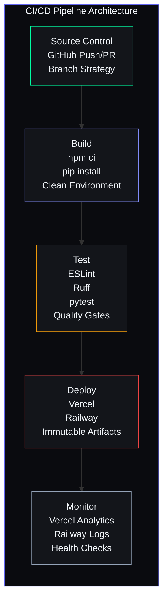

# DevOps Practices

## Document Control

| Field | Value |
|---|---|
| **Document ID** | SB-DEVOPS-PRACTICES-001 |
| **Version** | 2.0.0 |
| **Status** | Active |
| **Classification** | Internal — Engineering |
| **Author** | DevOps Team |
| **Last Updated** | 2026-06-11 |
| **Review Cycle** | Monthly |
| **Approved By** | Engineering Lead |

---

## Table of Contents

1. [Executive Summary](#1-executive-summary)
2. [DevOps Philosophy & Principles](#2-devops-philosophy--principles)
3. [CI/CD Pipeline Architecture](#3-cicd-pipeline-architecture)
4. [Branch Strategy & Git Workflow](#4-branch-strategy--git-workflow)
5. [Code Quality Enforcement](#5-code-quality-enforcement)
6. [Testing Strategy & Automation](#6-testing-strategy--automation)
7. [Build & Artifact Management](#7-build--artifact-management)
8. [Environment Management](#8-environment-management)
9. [Configuration & Secrets Management](#9-configuration--secrets-management)
10. [Monitoring & Observability](#10-monitoring--observability)
11. [Incident Response Integration](#11-incident-response-integration)
12. [Infrastructure as Code (IaC)](#12-infrastructure-as-code-iac)
13. [Containerization & Orchestration](#13-containerization--orchestration)
14. [Database DevOps](#14-database-devops)
15. [Security & Compliance Automation](#15-security--compliance-automation)
16. [Cost Management & Optimization](#16-cost-management--optimization)
17. [DevOps Metrics & KPIs](#17-devops-metrics--kpis)
18. [DevOps Maturity Roadmap](#18-devops-maturity-roadmap)
19. [Runbooks & Automation Scripts](#19-runbooks--automation-scripts)
20. [Team Practices & Culture](#20-team-practices--culture)
21. [References](#21-references)

---

## 1. Executive Summary

**Purpose:** This document defines the comprehensive DevOps practices for Second Brain OS (ARIA OS), covering the entire software delivery lifecycle from code commit to production operation. It establishes standards for CI/CD, code quality, testing, monitoring, security, and infrastructure management.

**Scope:** All software delivery activities across the Second Brain OS monorepo, including:
- **Frontend:** Next.js 14 (TypeScript/React)
- **Backend:** FastAPI (Python 3.10)
- **Scheduler:** APScheduler cron jobs
- **AI Services:** Ollama (local) + Claude API (cloud)
- **Database:** Supabase PostgreSQL
- **Infrastructure:** Cloud resources (Vercel, Railway, Supabase)

**Guiding Principles:**
- **Automate everything:** Manual processes are sources of error and delay
- **Shift left on quality:** Catch issues as early as possible in the pipeline
- **Observability by default:** Every component exposes health, metrics, and logs
- **Security embedded:** Security checks are integrated into every stage, not bolted on
- **Continuous improvement:** Regular retrospectives drive process evolution

**Maturity Level:** Currently at **Level 2 (Managed)** on the DevOps capability model, targeting **Level 3 (Optimized)** by Q2 2027.

---

## 2. DevOps Philosophy & Principles

### 2.1 Core Principles

```
┌─────────────────────────────────────────────────────────────┐
│                   DevOps Principles                          │
├─────────────────────────────────────────────────────────────┤
│                                                             │
│  1. THE THREE WAYS (Gene Kim / Phoenix Project)             │
│     ├── First Way:  Flow (Development → Operations)         │
│     ├── Second Way: Feedback (Operations → Development)     │
│     └── Third Way:  Continuous Learning & Experimentation   │
│                                                             │
│  2. CALMS Framework                                         │
│     ├── Culture: Collaboration, shared responsibility       │
│     ├── Automation: Everything that can be automated, is    │
│     ├── Lean: Minimize waste, maximize value delivery       │
│     ├── Measurement: Data-driven decisions                  │
│     └── Sharing: Knowledge sharing across teams             │
│                                                             │
│  3. 12-Factor App Compliance                                │
│     ├── Codebase: One codebase tracked in revision control  │
│     ├── Dependencies: Explicitly declared and isolated      │
│     ├── Config: Stored in environment variables             │
│     ├── Backing services: Treated as attached resources     │
│     ├── Build, release, run: Strictly separated stages      │
│     ├── Processes: Stateless and share-nothing              │
│     ├── Port binding: Export services via port binding      │
│     ├── Concurrency: Scale out via the process model        │
│     ├── Disposability: Fast startup and graceful shutdown   │
│     ├── Dev/prod parity: Keep environments as similar as    │
│         possible                                            │
│     ├── Logs: Treat logs as event streams                   │
│     └── Admin processes: Run as one-off processes           │
│                                                             │
└─────────────────────────────────────────────────────────────┘
```

### 2.2 DevOps Decision Framework

When making DevOps decisions, apply this hierarchy:

```
1. Security  → Never compromise on security
2. Reliability → Systems must be dependable
3. Performance → Meet or exceed SLOs
4. Cost      → Optimize within budget constraints
5. Velocity  → Ship features quickly (within above constraints)
```

---

## 3. CI/CD Pipeline Architecture

### 3.1 Pipeline Overview



### 3.2 Pipeline Stages Detail

#### Stage 1: Source — Code Commit

| Trigger | Action | Concurrency |
|---|---|---|
| PR to `develop` | Run CI (lint, test, build) | Same branch cancels previous |
| PR to `main` | Run CI + security audit | Same branch cancels previous |
| Push to `develop` | Run CI → auto-deploy to staging | Serial (deploy in order) |
| Push to `main` | Run CI → auto-deploy to production | Serial (deploy in order) |
| Push to `hotfix/*` | Run CI + expedited review → deploy | Highest priority |

#### Stage 2: Build — Dependency Installation & Compilation

```
Frontend Build:
  1. Checkout code (actions/checkout@v4)
  2. Setup Node 18 (actions/setup-node@v4)
  3. Cache restore: ~/.npm, node_modules
  4. npm ci (clean install — fails if lockfile mismatch)
  5. npm run build (Next.js production build)
  6. Cache save: .next/

Backend Build:
  1. Checkout code (actions/checkout@v4)
  2. Setup Python 3.10 (actions/setup-python@v5)
  3. Cache restore: ~/.cache/pip
  4. pip install -r requirements.txt
  5. python -m py_compile main.py (syntax + import check)
```

#### Stage 3: Test — Quality Gates

```yaml
quality_gates:
  frontend:
    - name: "ESLint"
      command: "cd apps/web && npm run lint"
      failure: "blocking"
    - name: "TypeScript"
      command: "cd apps/web && npm run type-check"
      failure: "blocking"
    - name: "Unit Tests"
      command: "cd apps/web && npm test -- --coverage"
      failure: "blocking"
      coverage_threshold: 70

  backend:
    - name: "Ruff Lint"
      command: "ruff check apps/api/ packages/ services/"
      failure: "blocking"
    - name: "Pytest Suite"
      command: "pytest tests/ -v --cov=packages --cov=services"
      failure: "blocking"
      coverage_threshold: 60

  security:
    - name: "npm audit"
      command: "cd apps/web && npm audit --audit-level=high"
      failure: "blocking"
    - name: "Safety Check"
      command: "safety check -r apps/api/requirements.txt"
      failure: "blocking"
    - name: "Secret Scan"
      command: "trufflehog git file://. --since-last-commit"
      failure: "warning"
```

### 3.3 Pipeline Performance Targets

| Metric | Current | Target | Measurement |
|---|---|---|---|
| CI completion time (frontend) | 3 min 12s | < 3 min | GitHub Actions duration |
| CI completion time (backend) | 1 min 45s | < 2 min | GitHub Actions duration |
| CI completion time (full suite) | 5 min 30s | < 5 min | GitHub Actions duration |
| Deploy time (frontend) | 1 min 30s | < 1 min | Vercel deployment log |
| Deploy time (backend) | 2 min 10s | < 2 min | Railway deployment log |
| Time from commit to production | 8 min | < 5 min | Combined measurement |
| CI pass rate (last 30 days) | 94% | > 98% | GitHub Insights |
| Failed deployments (last 30 days) | 2 | < 1 | Deployment audit log |

---

## 4. Branch Strategy & Git Workflow

### 4.1 Branch Hierarchy

```
main ───────────────────────────────────────────────────────────
  │                        ↑                          ↑
  │                        │                          │
  │              ┌─────────┴──────────┐    ┌──────────┴──────────┐
  │              │  release/vX.Y.Z    │    │  hotfix/vX.Y.Z      │
  │              │  (from develop)    │    │  (from main)        │
  │              └────────────────────┘    └─────────────────────┘
  │
develop ─────────────────────────────────────────────────────────
  │           ↑              ↑              ↑
  │           │              │              │
  │   ┌───────┴───┐  ┌──────┴──────┐  ┌────┴────┐
  │   │ feat/*    │  │ fix/*       │  │ chore/*  │
  │   │ Features  │  │ Bug fixes   │  │ Housekeep │
  │   └───────────┘  └─────────────┘  └──────────┘
```

### 4.2 Branch Naming Convention

```
{type}/{description}
  ↑        ↑
  │        └── kebab-case description (e.g., add-opportunity-radar)
  │
  └── Type: feat / fix / chore / docs / refactor / test / hotfix
```

**Examples:**
- `feat/add-opportunity-radar`
- `fix/resolve-auth-token-race-condition`
- `chore/upgrade-nextjs-to-14.2`
- `docs/update-api-reference`
- `refactor/extract-prompt-loader`
- `test/add-prompt-loader-edge-cases`
- `hotfix/v2.0.1-sql-injection`

### 4.3 Branch Protection Rules

| Branch | Requires PR | Required Reviewers | CI Must Pass | Linear History | No Direct Push |
|---|---|---|---|---|---|
| `main` | ✅ | 1 | ✅ | ✅ | ✅ |
| `develop` | ✅ | 1 | ✅ | ❌ | ✅ |
| `release/*` | ✅ | 1 | ✅ | ❌ | ❌ |
| `hotfix/*` | ✅ | 1 (expedited) | ✅ | ❌ | ❌ |
| `feat/*` | ❌ | ❌ | ❌ | ❌ | ❌ |

### 4.4 Commit Message Convention

Second Brain OS uses **Conventional Commits** format:

```
<type>(<scope>): <description>

[optional body]

[optional footer]
```

**Types:** `feat`, `fix`, `chore`, `docs`, `refactor`, `test`, `style`, `perf`, `ci`, `build`, `revert`

**Examples:**
```
feat(opportunity-radar): add automated fellowship scanning
fix(auth): resolve token refresh race condition
docs(api): update task endpoint documentation
refactor(prompt-loader): extract frontmatter parser to separate module
ci: add security audit job to pipeline
perf(api): add Redis caching for briefing endpoint
```

### 4.5 Git Workflow Diagram

```
                      Time
                       │
    ┌──────────────────┼──────────────────┐
    │  FEATURE BRANCH  │  MAIN BRANCH     │
    │                  │                  │
    │  git checkout    │  v2.0.0 (tag)    │◄── Production
    │  -b feat/radar   │      │           │
    │                  │      │           │
    │  (work, work)    │  ┌───┴──────┐    │
    │                  │  │  Merge   │    │
    │  git commit -m   │  │  Release │    │
    │  "feat(radar):   │  │   PR     │    │
    │   add scanning"  │  └───┬──────┘    │
    │                  │      │           │
    │  git push        │  ┌───┴──────┐    │
    │                  │  │  Tag &   │    │
    │  Open PR ────────┼──┤  Deploy  │    │
    │  (to develop)    │  └──────────┘    │
    │                  │                  │
    │  ┌──────────┐    │                  │
    │  │  Review  │    │                  │
    │  │  + CI    │    │                  │
    │  └────┬─────┘    │                  │
    │       │          │                  │
    │  Merge to        │                  │
    │  develop ────────┼──► develop updated │
    │                  │                  │
    └──────────────────┼──────────────────┘
                       │
```

---

## 5. Code Quality Enforcement

### 5.1 Multi-Layer Quality Gates

```
Layer 1: Developer's IDE (Pre-commit)
  ├── Linting on save (ESLint, Ruff)
  ├── Type checking on save (TypeScript, mypy planned)
  └── Pre-commit hooks (format + lint)

Layer 2: Pull Request (CI)
  ├── Full lint suite (ESLint, Ruff)
  ├── Type checking (TypeScript, mypy planned)
  ├── Unit tests with coverage
  └── Security audit (npm audit, safety)

Layer 3: Staging Deployment
  ├── Integration tests
  ├── Smoke tests
  └── Performance regression checks

Layer 4: Production Deployment
  ├── Canary analysis (planned)
  ├── Error rate monitoring
  └── User impact analysis
```

### 5.2 Frontend Code Quality Tools

| Tool | Purpose | Configuration | Enforced In |
|---|---|---|---|
| **ESLint** | Static analysis, best practices | `apps/web/.eslintrc.json` | CI, pre-commit, IDE |
| **TypeScript** | Type safety | `apps/web/tsconfig.json` (strict) | CI, pre-commit, IDE |
| **Prettier** | Code formatting | `apps/web/.prettierrc` | CI, pre-commit, IDE |

**ESLint Configuration Details:**

```json
{
  "extends": [
    "next/core-web-vitals",
    "eslint:recommended",
    "plugin:@typescript-eslint/recommended",
    "plugin:react/recommended",
    "prettier"
  ],
  "rules": {
    "@typescript-eslint/no-explicit-any": "error",
    "@typescript-eslint/no-unused-vars": ["warn", { "argsIgnorePattern": "^_" }],
    "react/react-in-jsx-scope": "off",
    "no-console": ["warn", { "allow": ["warn", "error"] }],
    "import/order": ["error", {
      "groups": ["builtin", "external", "internal", "parent", "sibling"],
      "newlines-between": "always"
    }]
  }
}
```

**TypeScript Configuration Details:**

```json
{
  "compilerOptions": {
    "strict": true,
    "noUncheckedIndexedAccess": true,
    "noImplicitReturns": true,
    "noFallthroughCasesInSwitch": true,
    "exactOptionalPropertyTypes": true,
    "forceConsistentCasingInFileNames": true
  }
}
```

### 5.3 Backend Code Quality Tools

| Tool | Purpose | Configuration | Enforced In |
|---|---|---|---|
| **Ruff** | Linting + formatting | `pyproject.toml` | CI, pre-commit, IDE |
| **Black** | Code formatting (via Ruff) | `pyproject.toml` (line-length: 100) | CI, pre-commit |
| **mypy** | Static type checking (planned) | `mypy.ini` | CI (planned) |

**Ruff Rules Enabled:**

```toml
[tool.ruff]
line-length = 100
target-version = "py310"

[tool.ruff.lint]
select = [
    "F",    # Pyflakes — errors
    "E",    # Pycodestyle — errors
    "W",    # Pycodestyle — warnings
    "I",    # Isort — import ordering
    "N",    # PEP8 naming conventions
    "D",    # Pydocstyle — docstrings (planned)
    "UP",   # Pyupgrade — modern syntax
    "B",    # Bugbear — bug detection
    "SIM",  # Simplify — code simplification
    "ARG",  # Unused arguments
    "PTH",  # Pathlib — path handling
]

[tool.ruff.lint.per-file-ignores]
"tests/**" = ["D", "N"]
"__init__.py" = ["D"]

[tool.ruff.format]
quote-style = "double"
indent-style = "space"
```

### 5.4 Pre-commit Hook Configuration

```yaml
# .pre-commit-config.yaml
repos:
  - repo: https://github.com/pre-commit/pre-commit-hooks
    rev: v4.5.0
    hooks:
      - id: trailing-whitespace
        stages: [commit]
      - id: end-of-file-fixer
        stages: [commit]
      - id: check-yaml
        stages: [commit]
      - id: check-json
        stages: [commit]
      - id: check-added-large-files
        args: ["--maxkb=500"]
        stages: [commit]
      - id: detect-private-key
        stages: [commit]
      - id: check-merge-conflict
        stages: [commit]

  - repo: https://github.com/astral-sh/ruff-pre-commit
    rev: v0.3.0
    hooks:
      - id: ruff
        args: [--fix, --exit-non-zero-on-fix]
        stages: [commit]
      - id: ruff-format
        stages: [commit]

  - repo: https://github.com/pre-commit/mirrors-eslint
    rev: v8.56.0
    hooks:
      - id: eslint
        args: [--fix, --max-warnings=10]
        files: \.(ts|tsx)$
        additional_dependencies:
          - eslint@8.56.0
          - "@typescript-eslint/eslint-plugin@6.21.0"
          - "@typescript-eslint/parser@6.21.0"

  - repo: local
    hooks:
      - id: prompt-validation
        name: Validate prompt frontmatter
        entry: python scripts/validate_prompts.py
        language: system
        pass_filenames: false
        always_run: true
        stages: [commit]
```

### 5.5 Code Review Standards

| Dimension | Standard | Example |
|---|---|---|
| **Size** | < 400 lines changed per PR | Break large features into multiple PRs |
| **Focus** | Single concern per PR | Don't mix refactor and feature |
| **Tests** | New code must include tests | Cover happy path + edge cases |
| **Types** | No `any` types | Use `unknown` + type guards |
| **Error handling** | All errors handled gracefully | Every fetch/supabase call in try/catch |
| **Documentation** | Update related docs | API changes update API docs |
| **Performance** | No N+1 queries | Check database query patterns |
| **Security** | No hardcoded secrets | Use environment variables |

### 5.6 Code Quality Metrics

| Metric | Current | Target | Tool |
|---|---|---|---|
| TypeScript strict mode compliance | 95% | 100% | tsc --noEmit |
| ESLint warnings | 23 | < 10 | eslint stats |
| Ruff violations | 12 | 0 | ruff check |
| Test coverage (backend) | 58% | > 75% | pytest --cov |
| Test coverage (frontend) | 42% | > 70% | jest --coverage |
| Duplicate code | 3.2% | < 2% | SonarQube or similar |
| Cyclomatic complexity (avg) | 4.1 | < 5 | radon or similar |
| Documentation coverage | 65% | > 90% | Custom audit |

---

## 6. Testing Strategy & Automation

### 6.1 Test Pyramid

```
                    ╱─────────────────────╲
                   ╱    E2E Tests (5%)     ╲
                  ╱   Playwright / Cypress   ╲
                 ╱    Critical user paths     ╲
                ╱───────────────────────────────╲
               ╲     Integration Tests (25%)     ╱
                ╲   API route tests, Supabase    ╱
                 ╲  Auth flows, migration tests  ╱
                  ╲──────────────────────────────╱
                   ╲                          ╱
                    ╲  Unit Tests (70%)      ╱
                     ╲ Utils, hooks, models  ╱
                      ╲ Components, helpers  ╱
                       ╲────────────────────╱
```

### 6.2 Frontend Testing

| Type | Tool | Location | Target Coverage | Run Frequency |
|---|---|---|---|---|
| **Unit (utilities)** | Vitest | `apps/web/__tests__/utils/` | > 85% | Every commit |
| **Unit (hooks)** | Vitest + Testing Library | `apps/web/__tests__/hooks/` | > 80% | Every commit |
| **Component** | Vitest + Testing Library | `apps/web/__tests__/components/` | > 70% | Every commit |
| **Integration** | Vitest + MSW | `apps/web/__tests__/integration/` | > 60% | Every commit |

### 6.3 Backend Testing

| Type | Tool | Location | Target Coverage | Run Frequency |
|---|---|---|---|---|
| **Unit (models)** | pytest | `tests/unit/` | > 90% | Every commit |
| **Unit (utils)** | pytest | `tests/unit/` | > 85% | Every commit |
| **API routes** | pytest + httpx | `tests/api/` | > 80% | Every commit |
| **Integration** | pytest + Supabase | `tests/integration/` | Critical paths | Every commit |

### 6.4 Testing Standards

**Test Naming Convention:**
```
test_{module}_{scenario}_{expected_outcome}
```

**Examples:**
```python
def test_tasks_create_valid_task_returns_200():
def test_tasks_create_missing_title_returns_400():
def test_tasks_get_nonexistent_id_returns_404():
def test_tasks_list_empty_user_returns_empty_array():
```

```typescript
describe('useAuth', () => {
  it('returns null when user is not authenticated', () => { ... })
  it('returns user data when session exists', () => { ... })
  it('throws error when Supabase is unavailable', () => { ... })
})
```

**Coverage Requirements:**
```
New code: Must have > 80% test coverage
Bug fixes: Must add regression test
New features: Must include happy path + error path tests
API changes: Must test 200, 4xx, and 5xx responses
```

### 6.5 Test Automation Configuration

```yaml
# .github/workflows/test.yml
name: Test Suite
on:
  push:
    branches: [main, develop]
  pull_request:
    branches: [main, develop]

jobs:
  test:
    runs-on: ubuntu-latest
    timeout-minutes: 15

    services:
      supabase:
        image: supabase/postgres:15.1.1.34
        env:
          POSTGRES_PASSWORD: postgres
          POSTGRES_DB: postgres
        ports:
          - 5432:5432
        options: >-
          --health-cmd pg_isready
          --health-interval 10s
          --health-timeout 5s
          --health-retries 5

    steps:
      - uses: actions/checkout@v4
      - uses: actions/setup-python@v5
        with:
          python-version: "3.10"
          cache: "pip"
      - run: pip install -r requirements.txt
      - run: pip install -r apps/api/requirements.txt

      - name: Run unit tests
        run: pytest tests/unit/ -v --cov=packages --cov=services --cov-report=xml

      - name: Run API tests
        run: pytest tests/api/ -v
        env:
          SUPABASE_URL: http://localhost:5432
          SUPABASE_KEY: test-key
          JWT_SECRET: test-jwt-secret

      - name: Upload coverage
        uses: codecov/codecov-action@v3
        with:
          file: ./coverage.xml
```

### 6.6 Load & Performance Testing

| Test Type | Tool | Frequency | Target |
|---|---|---|---|
| API load test | Locust | Weekly | 100 concurrent users, P95 < 500ms |
| Frontend performance | Lighthouse CI | Per deployment | Performance score > 90 |
| Database query perf | Supabase Explain | Per migration | All queries < 100ms |
| AI response timing | Custom script | Daily | Ollama P95 < 5s, Claude P95 < 10s |

---

## 7. Build & Artifact Management

### 7.1 Artifact Inventory

| Artifact | Source | Format | Storage | Retention |
|---|---|---|---|---|
| Frontend build | Next.js build | `.next/` directory | Vercel (ephemeral) | 30 days |
| Backend container | Docker build | Docker image | GitHub Container Registry | 90 days |
| Scheduler container | Docker build | Docker image | GitHub Container Registry | 90 days |
| Python dependencies | pip freeze | `requirements.txt` | Git (committed) | Permanent |
| Node dependencies | npm ci | `node_modules/` | CI cache | 7 days |
| Test coverage | pytest/vitest | HTML/XML reports | CI artifacts | 30 days |
| Build logs | GitHub Actions | Text logs | GitHub | 90 days |
| Deployment audit | Custom logger | JSON log file | Persistent storage | 1 year |

### 7.2 Build Caching Strategy

```
Frontend caching layers:
  Layer 1: ~/.npm (global npm cache)
    └── Cache key: npm cache + package-lock.json hash
    └── Restore: Full restore on miss, keys prefix on partial
    └── Save: After successful npm ci
  Layer 2: node_modules
    └── Cache key: package-lock.json hash
    └── Restore: On cache hit, skip npm ci entirely
    └── Save: After successful npm ci
  Layer 3: .next/cache
    └── Cache key: next.config.js hash + package-lock.json hash
    └── Restore: Speeds up subsequent builds
    └── Save: After successful build

Backend caching layers:
  Layer 1: ~/.cache/pip
    └── Cache key: requirements.txt hash
    └── Restore: Skip pip install on full cache hit
    └── Save: After successful pip install
```

### 7.3 Docker Image Tagging Strategy

```yaml
image_tags:
  - "{version}"            # v2.1.0 — semantic version
  - "{short_sha}"          # a1b2c3d — git commit SHA
  - "{branch}"             # main, develop, feat-radar
  - "latest"               # Latest stable from main
  - "staging"              # Latest from develop

examples:
  - ghcr.io/secondbrain/backend:v2.1.0
  - ghcr.io/secondbrain/backend:a1b2c3d
  - ghcr.io/secondbrain/backend:main
  - ghcr.io/secondbrain/backend:latest
  - ghcr.io/secondbrain/backend:staging
```

---

## 8. Environment Management

### 8.1 Environment Specification

| Environment | Purpose | Who Uses | Configuration Source | Data |
|---|---|---|---|---|
| **Local** | Day-to-day development | Developers | `.env.local` (gitignored) | Mock/test data |
| **PR Preview** | Feature validation | Developers, Reviewers | Vercel env (preview scope) | Staging data |
| **Staging** | Integration testing | QA, Automated tests | GitHub secrets | Anonymized production copy |
| **Production** | Live user traffic | End users | Railway env vars + GitHub secrets | Real user data |

### 8.2 Environment Parity Checklist

```
□ Same Python/Node versions across all environments
□ Same dependency versions (lockfile enforced)
□ Same database schema (migrations applied)
□ Same configuration structure (values differ)
□ Same build process (same Dockerfile)
□ Same deployment process (same CI/CD pipeline)
□ Same monitoring stack (alert thresholds differ)
□ Same logging format (log levels differ)
```

### 8.3 Environment Provisioning

| Environment | Provisioning Method | Setup Time | Teardown |
|---|---|---|---|
| Local | Manual (git clone + npm/pip) | 5-10 min | N/A |
| PR Preview | Automatic (Vercel) | 1-2 min | Automatic on PR close |
| Staging | Manual (one-time setup) | 30 min | N/A |
| Production | IaC (Terraform) | 1-2 hours | DR scenario only |

---

## 9. Configuration & Secrets Management

### 9.1 Configuration Hierarchy

```
Priority order (highest to lowest):

  1. Runtime environment variables (Railway/Vercel Dashboard)
  2. CI/CD secrets (GitHub Actions Secrets)
  3. .env file (Local development, gitignored)
  4. .env.example file (Documentation, committed)
  5. Default values in code (Fallback, rarely used)

Each layer overrides the one below it.
```

### 9.2 Secrets Inventory

| Secret Name | Scope | Rotation Period | Access Control | Audit Trail |
|---|---|---|---|---|
| `SUPABASE_URL` | All environments | Permanent | Developer + CI | Dashboard |
| `SUPABASE_ANON_KEY` | Frontend (public) | Permanent | Public (by design) | N/A |
| `SUPABASE_KEY` | Backend (role-limited) | Every 90 days | Backend only | Supabase logs |
| `SUPABASE_SERVICE_KEY` | Backend (admin) | Every 90 days | DevOps only | Supabase logs |
| `JWT_SECRET` | Backend | Every 180 days | DevOps only | Application logs |
| `CLAUDE_API_KEY` | Backend + Scheduler | Every 90 days | DevOps + CI | Anthropic dashboard |
| `RESEND_API_KEY` | Backend + Scheduler | Every 90 days | DevOps + CI | Resend dashboard |
| `VERCEL_TOKEN` | CI/CD | Every 180 days | DevOps | Vercel audit log |
| `RAILWAY_TOKEN` | CI/CD | Every 180 days | DevOps | Railway audit log |

### 9.3 Secret Storage Locations

```
Production (Priority):
  ├── Railway Dashboard (encrypted env vars)
  ├── Vercel Dashboard (encrypted env vars)
  └── GitHub Actions Secrets (for CI)

Staging:
  ├── Railway Dashboard (staging project)
  ├── Vercel Dashboard (staging/preview scope)
  └── GitHub Actions Secrets

Local Development:
  └── .env.local (gitignored, never committed)

Documentation:
  └── .env.example (placeholder values, committed)
```

### 9.4 Secret Rotation Runbook

```
RUNBOOK: Rotate JWT_SECRET
FREQUENCY: Every 180 days
OWNER: DevOps Lead
ESTIMATED TIME: 15 minutes
IMPACT: All existing sessions invalidated (users must re-login)

STEPS:
  1. Generate new secret:
     openssl rand -hex 32
     → Output: a1b2c3d4e5f6...

  2. Update Railway production:
     railway variables set JWT_SECRET=a1b2c3d4e5f6... --service backend

  3. Update Railway staging:
     railway variables set JWT_SECRET=a1b2c3d4e5f6... -e staging --service backend

  4. Update GitHub Actions:
     gh secret set JWT_SECRET --body a1b2c3d4e5f6...

  5. Redeploy all backend services:
     railway up --service backend
     railway up --service scheduler

  6. Verify:
     - Login flow works
     - Existing sessions re-prompted for login
     - No auth errors in logs

  7. Document rotation in audit log
```

---

## 10. Monitoring & Observability

### 10.1 Three Pillars of Observability

```
┌─────────────────────────────────────────────────────────────┐
│                    Observability Stack                       │
├─────────────────────────────────────────────────────────────┤
│                                                             │
│  ┌─────────────────┐  ┌──────────────┐  ┌───────────────┐  │
│  │     LOGS         │  │   METRICS    │  │    TRACES     │  │
│  │                   │  │              │  │               │  │
│  │ • Structured JSON │  │ • Request    │  │ • Request path│  │
│  │ • Centralized     │  │   rate       │  │ • Service deps│  │
│  │ • Searchable      │  │ • Error rate │  │ • Latency     │  │
│  │ • Multi-level     │  │ • Latency    │  │   breakdown   │  │
│  │                   │  │ • Resource   │  │ • DB queries  │  │
│  │ Level: DEBUG,     │  │   usage      │  │ • AI calls    │  │
│  │ INFO, WARN, ERROR │  │ • Up time    │  │               │  │
│  └─────────────────┘  └──────────────┘  └───────────────┘  │
│                                                             │
└─────────────────────────────────────────────────────────────┘
```

### 10.2 Current Monitoring Stack

| Layer | Tool | Metrics Collected | Retention |
|---|---|---|---|
| **Frontend** | Vercel Analytics | Page views, web vitals (LCP, CLS, FID), errors | 30 days |
| **Frontend** | Vercel Speed Insights | Performance scores | 30 days |
| **Backend** | Railway Dashboard | CPU, memory, network, uptime | 7 days (graphs) |
| **Backend** | Custom logger (JSON) | API requests, auth events, errors | 90 days |
| **Database** | Supabase Dashboard | Query performance, connections, DB size | 7 days (graphs) |
| **Database** | Supabase Logs | Query logs, auth logs, error logs | 1 day (free), 7 days (pro) |
| **AI Service** | Ollama logs | Response times, model loads, errors | 7 days |
| **AI Service** | Claude API logs | Token usage, response times, errors | 30 days (Anthropic) |
| **Email** | Resend Dashboard | Delivery rates, bounces, opens | 30 days |
| **Auth** | Supabase Auth | Login success/failure, MFA events | 30 days |
| **CI/CD** | GitHub Actions | Build times, pass rates, failure reasons | 90 days |
| **Deployment** | Custom audit logger | Deployment events, versions, actors | 1 year |

### 10.3 Structured Logging Format

```python
# packages/shared/utils/logger.py

import json
import logging
import sys
from datetime import datetime, timezone
from typing import Optional


class StructuredFormatter(logging.Formatter):
    """Format log records as structured JSON."""
    
    def format(self, record: logging.LogRecord) -> str:
        log_entry = {
            "timestamp": datetime.now(timezone.utc).isoformat(),
            "level": record.levelname,
            "logger": record.name,
            "message": record.getMessage(),
            "module": record.module,
            "function": record.funcName,
            "line": record.lineno,
        }
        
        if hasattr(record, "event"):
            log_entry["event"] = record.event
        if hasattr(record, "user_id"):
            log_entry["user_id"] = f"{record.user_id[:8]}...**"  # Pseudonymized
        if hasattr(record, "duration_ms"):
            log_entry["duration_ms"] = record.duration_ms
        if hasattr(record, "status_code"):
            log_entry["status_code"] = record.status_code
        if hasattr(record, "request_id"):
            log_entry["request_id"] = record.request_id
        
        if record.exc_info and record.exc_info[0]:
            log_entry["exception"] = {
                "type": record.exc_info[0].__name__,
                "message": str(record.exc_info[1]),
            }
        
        return json.dumps(log_entry, default=str)


def setup_logger(name: str, level: str = "INFO") -> logging.Logger:
    logger = logging.getLogger(name)
    logger.setLevel(getattr(logging, level.upper(), logging.INFO))
    
    handler = logging.StreamHandler(sys.stdout)
    handler.setFormatter(StructuredFormatter())
    logger.addHandler(handler)
    
    return logger


logger = setup_logger("secondbrain")
```

### 10.4 Log Events Catalog

| Event | Level | Description | Trigger |
|---|---|---|---|
| `api_request` | INFO | Incoming API request | Every request |
| `api_response` | INFO | API response sent | Every response |
| `auth_login_success` | INFO | Successful authentication | Login |
| `auth_login_failure` | WARN | Failed authentication | Login |
| `auth_token_refresh` | INFO | Token refresh | Token expiry |
| `rate_limit_exceeded` | WARN | Rate limit triggered | Rate limit |
| `ai_call_start` | INFO | AI service call initiated | Agent invocation |
| `ai_call_complete` | INFO | AI service call completed | Agent response |
| `ai_call_fallback` | WARN | AI fallback activated | Primary AI failure |
| `ai_call_error` | ERROR | AI service call failed | AI error |
| `db_query_slow` | WARN | Query exceeded threshold | Slow query |
| `db_connection_error` | ERROR | Database connection failed | Connection issue |
| `deployment_start` | INFO | Deployment initiated | CI/CD pipeline |
| `deployment_complete` | INFO | Deployment completed | Post-deploy |
| `deployment_rollback` | WARN | Rollback triggered | Rollback procedure |
| `cron_job_start` | INFO | Scheduler job started | Cron trigger |
| `cron_job_complete` | INFO | Scheduler job completed | Job done |
| `cron_job_failed` | ERROR | Scheduler job failed | Job error |
| `security_violation` | CRITICAL | Security event detected | Security check |
| `data_export` | INFO | User data export | Export request |
| `data_anomaly` | WARN | Unusual data pattern | Validation check |

### 10.5 Alerting Configuration

| Alert | Condition | Channel | Priority | Cooldown |
|---|---|---|---|---|
| **Frontend down** | Vercel deployment fails | Email | P1 | 5 min |
| **Backend down** | Health check fails 3x | Email | P1 | 5 min |
| **API error rate** | > 5% errors in 5 min | Email | P1 | 10 min |
| **Slow API** | P95 latency > 2s for 5 min | Email | P2 | 15 min |
| **Database slow** | Connection pool > 80% | Email | P2 | 15 min |
| **Database down** | Connection lost | Email | P1 | Immediate |
| **AI failure** | > 3 consecutive failures | Email | P2 | 10 min |
| **Rate limit spike** | > 100 violations/hour | Email (digest) | P3 | 1 hour |
| **Auth failure spike** | > 10% failure rate | Email | P1 | 5 min |
| **Deployment failure** | CI pipeline fails | Email + Slack | P2 | Immediate |
| **SSL cert expiry** | < 30 days to expiry | Email | P3 | Daily |
| **Disk usage** | > 80% on any service | Email | P2 | 1 hour |
| **Memory usage** | > 85% on production | Email | P2 | 15 min |

### 10.6 Dashboard Configuration

```python
# Dashboard sections (planned Datadog/Grafana dashboard)
DASHBOARD_SECTIONS = {
    "overview": [
        {"title": "Service Health", "type": "status_grid", "services": [
            "frontend", "backend", "scheduler", "database", "ai_ollama", "ai_claude"
        ]},
        {"title": "Recent Deployments", "type": "list", "source": "audit_log"},
        {"title": "Active Incidents", "type": "list", "source": "incident_tracker"},
    ],
    "frontend": [
        {"title": "LCP Distribution", "type": "histogram", "metric": "web_vitals_lcp"},
        {"title": "Error Rate", "type": "timeseries", "metric": "frontend_error_rate"},
        {"title": "Page Views", "type": "timeseries", "metric": "page_views"},
    ],
    "backend": [
        {"title": "Request Rate", "type": "timeseries", "metric": "api_requests_per_second"},
        {"title": "P50/P95/P99 Latency", "type": "multiline", "metrics": ["latency_p50", "latency_p95", "latency_p99"]},
        {"title": "Error Rate by Endpoint", "type": "table", "metric": "error_rate_by_endpoint"},
        {"title": "CPU/Memory", "type": "timeseries", "metrics": ["cpu_percent", "memory_percent"]},
    ],
    "database": [
        {"title": "Active Connections", "type": "timeseries", "metric": "db_connections"},
        {"title": "Query Performance", "type": "table", "metric": "slow_queries"},
        {"title": "Database Size", "type": "gauge", "metric": "db_size_gb"},
    ],
}
```

---

## 11. Incident Response Integration

### 11.1 Incident Severity Levels

| Level | Label | Response Time | Example | Notification |
|---|---|---|---|---|
| **P0** | Critical | < 5 min | Complete outage, data loss | Email + SMS + Slack |
| **P1** | High | < 15 min | Auth broken, major feature down | Email + Slack |
| **P2** | Medium | < 1 hour | Non-critical feature broken | Email (during business hours) |
| **P3** | Low | < 24 hours | Cosmetic issue, minor bug | Email digest |
| **P4** | Trivial | Next release | Enhancement request | Issue tracker |

### 11.2 Incident Response Workflow

```
INCIDENT DETECTED
      │
      ▼
┌─────────────────┐
│ 1. DETECT        │  Automated: Monitoring alert, CI failure
│                   │  Manual: User report, manual observation
└────────┬────────┘
         ▼
┌─────────────────┐
│ 2. TRIAGE        │  Determine severity (P0-P4)
│                   │  Assign owner
│                   │  Create incident ticket
└────────┬────────┘
         ▼
┌─────────────────┐
│ 3. RESPOND       │  Apply mitigation (rollback, fix, scale)
│                   │  Communicate status (internal + users)
│                   │  Update incident log
└────────┬────────┘
         ▼
┌─────────────────┐
│ 4. RESOLVE       │  Verify fix in production
│                   │  Confirm monitoring is green
│                   │  Close incident ticket
└────────┬────────┘
         ▼
┌─────────────────┐
│ 5. RCA           │  Root cause analysis
│                   │  Document lessons learned
│                   │  Create action items
└────────┬────────┘
         ▼
┌─────────────────┐
│ 6. PREVENT       │  Implement preventive measures
│                   │  Add monitoring/alerting
│                   │  Update runbooks
│                   │  Schedule follow-up review
└─────────────────┘
```

### 11.3 Incident Template

```yaml
incident:
  id: "INC-2026-001"
  severity: "P1"
  status: "resolved"  # detecting | triaging | responding | resolving | post_mortem | resolved
  title: "Auth token refresh race condition causing 401 errors"
  
  timeline:
    detected: "2026-06-10T14:30:00Z"
    triaged: "2026-06-10T14:32:00Z"
    responded: "2026-06-10T14:35:00Z"
    resolved: "2026-06-10T14:50:00Z"
  
  detection:
    method: "automated_alert"
    source: "backend_error_rate_spike_alert"
    trigger: "Error rate exceeded 5% threshold for 5 minutes"
  
  impact:
    users_affected: 12
    downtime_minutes: 20
    data_loss: false
    financial_impact: "$0 (free tier)"
  
  root_cause: |
    Race condition in token refresh logic:
    When two API calls are made simultaneously with an expiring token,
    both try to refresh. The first succeeds, the second uses the now-invalid
    old token and crashes.
  
  resolution:
    action: "Rolled back backend to v2.0.0"
    rollback_time: "3 minutes"
    permanent_fix: "Added mutex lock around token refresh in PR #423"
    fix_deployed: "2026-06-11T09:00:00Z"
  
  action_items:
    - description: "Add mutex to token refresh"
      owner: "auth-team"
      deadline: "2026-06-11"
      status: "done"
    - description: "Add monitoring for auth failure rate"
      owner: "devops"
      deadline: "2026-06-15"
      status: "in_progress"
    - description: "Create load test for auth endpoints"
      owner: "qa-team"
      deadline: "2026-06-20"
      status: "todo"
```

### 11.4 Integration Points

```
DevOps <-> Incident Response Integration:

CI/CD Pipeline → GitHub Issues
  ├── CI failure auto-creates issue
  ├── Security vulnerability creates P1 issue
  └── Deployment failure creates P2 issue

Monitoring → Alerting → Incident
  ├── Error rate spike → Email alert
  ├── 5 consecutive health check failures → P0 incident
  └── Rate limit violation surge → P2 issue

Rollback → Incident Resolution
  ├── Automated rollback triggered
  ├── Incident auto-updated with rollback details
  └── RCA scheduled after stabilization
```

---

## 12. Infrastructure as Code (IaC)

### 12.1 IaC Maturity Model

| Level | State | Tools | Status |
|---|---|---|---|
| 1 — Manual | All resources provisioned via dashboards | None | ✅ Current |
| 2 — Scripted | Resources provisioned via CLI scripts | Shell scripts, Supabase CLI | 🟡 Partial |
| 3 — Declarative | Resources defined in Terraform | Terraform, OpenTofu | ⏳ Q3 2026 |
| 4 — Automated | CI/CD manages infrastructure | Terraform Cloud | ⏳ Q1 2027 |
| 5 — GitOps | Infrastructure changes via PRs | ArgoCD, Crossplane | ⏳ 2027+ |

### 12.2 Planned Terraform Structure

```
infrastructure/
├── terraform/
│   ├── environments/
│   │   ├── production/
│   │   │   ├── main.tf
│   │   │   ├── variables.tf
│   │   │   └── terraform.tfvars
│   │   └── staging/
│   │       ├── main.tf
│   │       ├── variables.tf
│   │       └── terraform.tfvars
│   ├── modules/
│   │   ├── frontend/
│   │   │   ├── main.tf
│   │   │   ├── variables.tf
│   │   │   └── outputs.tf
│   │   ├── backend/
│   │   │   ├── main.tf
│   │   │   ├── variables.tf
│   │   │   └── outputs.tf
│   │   ├── database/
│   │   │   ├── main.tf
│   │   │   ├── variables.tf
│   │   │   └── outputs.tf
│   │   └── monitoring/
│   │       ├── main.tf
│   │       └── variables.tf
│   ├── main.tf
│   ├── variables.tf
│   └── outputs.tf
├── docker/
│   ├── backend.Dockerfile
│   ├── frontend.Dockerfile
│   └── docker-compose.yml
└── kubernetes/ (future)
    ├── backend-deployment.yaml
    ├── backend-service.yaml
    ├── frontend-deployment.yaml
    ├── frontend-service.yaml
    └── ingress.yaml
```

### 12.3 State Management

```hcl
# Remote state backend configuration
terraform {
  backend "s3" {
    bucket         = "secondbrain-terraform-state"
    key            = "environments/production/terraform.tfstate"
    region         = "us-east-1"
    encrypt        = true
    dynamodb_table = "terraform-state-lock"
  }
}
```

---

## 13. Containerization & Orchestration

### 13.1 Container Strategy

```
Application Containers:
  ├── Backend (FastAPI)
  │   ├── Base: python:3.10-slim
  │   ├── Port: 8000
  │   └── Health: /api/health
  │
  ├── Frontend (Next.js) — Optional
  │   ├── Base: node:18-alpine
  │   ├── Port: 3000
  │   └── Note: Typically deployed via Vercel serverless
  │
  ├── Scheduler (APScheduler)
  │   ├── Base: python:3.10-slim
  │   └── Command: python main.py
  │
  └── Ollama (AI)
      ├── Base: ollama/ollama:latest
      ├── Port: 11434
      └── Volume: model storage

Supporting Containers (local dev):
  └── Docker Compose orchestrates all services
```

### 13.2 Image Optimization

```dockerfile
# apps/api/Dockerfile — Multi-stage build

# Stage 1: Dependencies
FROM python:3.10-slim AS deps
WORKDIR /app
COPY apps/api/requirements.txt .
RUN pip install --no-cache-dir --user -r requirements.txt

# Stage 2: Runtime
FROM python:3.10-slim AS runtime
WORKDIR /app

# Create non-root user
RUN groupadd -r appuser && useradd -r -g appuser appuser

# Copy only necessary artifacts
COPY --from=deps /root/.local /root/.local
COPY packages/ packages/
COPY apps/api/ apps/api/

ENV PATH=/root/.local/bin:$PATH
ENV PYTHONPATH=/app:$PYTHONPATH

EXPOSE 8000

USER appuser

HEALTHCHECK --interval=30s --timeout=5s --start-period=15s --retries=3 \
    CMD python -c "import http.client; conn=http.client.HTTPConnection('localhost:8000'); conn.request('GET','/api/health'); resp=conn.getresponse(); exit(0) if resp.status==200 else exit(1)"

CMD ["uvicorn", "apps.api.main:app", "--host", "0.0.0.0", "--port", "8000"]
```

### 13.3 Container Security

```
Image Scanning:
  └── Trivy / Grype scan in CI (planned)
  └── Base image vulnerabilities checked weekly

Image Hardening:
  └── Non-root user in container
  └── Minimal base image (slim variants)
  └── No shell or package manager in runtime
  └── Read-only root filesystem (where possible)
  └── No sensitive data in image layers

Runtime Security:
  └── Resource limits (CPU, memory)
  └── Read-only volumes for config
  └── Seccomp profile (planned)
  └── AppArmor profile (planned)
```

---

## 14. Database DevOps

### 14.1 Migration Workflow

```
┌─────────────────────────────────────────────────────────────┐
│                   Migration Lifecycle                        │
├─────────────────────────────────────────────────────────────┤
│                                                             │
│  DEV ──────► STAGING ──────► PRODUCTION                     │
│   │              │                │                          │
│   ▼              ▼                ▼                          │
│  ┌──────┐    ┌──────┐        ┌──────┐                       │
│  │Apply │    │Apply │        │Apply │                       │
│  │+ Test│    │+ Test│        │+ Test│                       │
│  └──────┘    └──────┘        └──────┘                       │
│                                                             │
│  Requirements:                                              │
│  ├── Every migration has a revert script                    │
│  ├── Migrations are sequential (001, 002, ...)              │
│  ├── Migrations are idempotent (IF NOT EXISTS)              │
│  ├── Backward-compatible (old code works with new schema)   │
│  └── Zero-downtime (no long-running locks)                  │
│                                                             │
└─────────────────────────────────────────────────────────────┘
```

### 14.2 Migration Automation Script

```bash
#!/bin/bash
# scripts/db-migrate.sh
# Database migration runner
# Usage: ./scripts/db-migrate.sh [apply|revert|status] [migration_number]

set -euo pipefail

COMMAND="${1:-status}"
MIGRATION="${2:-}"
MIGRATIONS_DIR="migrations"
REVERTS_DIR="migrations/revert"

get_supabase() {
    if [ -z "${SUPABASE_URL:-}" ] || [ -z "${SUPABASE_SERVICE_KEY:-}" ]; then
        echo "ERROR: SUPABASE_URL and SUPABASE_SERVICE_KEY must be set"
        exit 1
    fi
}

apply_migration() {
    local file="$1"
    echo "Applying: $(basename "$file")"
    psql "$SUPABASE_URL" -f "$file"
    echo "  ✓ Applied"
}

revert_migration() {
    local num="$1"
    local revert_file="${REVERTS_DIR}/${num}_revert.sql"
    if [ ! -f "$revert_file" ]; then
        echo "ERROR: Revert file not found: $revert_file"
        exit 1
    fi
    echo "Reverting migration: $num"
    psql "$SUPABASE_URL" -f "$revert_file"
    echo "  ✓ Reverted"
}

show_status() {
    echo "Migration Status:"
    for f in "$MIGRATIONS_DIR"/*.sql; do
        local basename=$(basename "$f")
        local num=$(echo "$basename" | cut -d'_' -f1)
        local applied=$(psql "$SUPABASE_URL" -t -c "SELECT EXISTS(SELECT 1 FROM _migrations WHERE version='$num');" 2>/dev/null || echo "f")
        if [ "$applied" = "t" ]; then
            echo "  [✓] $basename"
        else
            echo "  [ ] $basename"
        fi
    done
}

case "$COMMAND" in
    apply)
        get_supabase
        if [ -n "$MIGRATION" ]; then
            apply_migration "$MIGRATIONS_DIR/${MIGRATION}_"*.sql
        else
            for f in "$MIGRATIONS_DIR"/*.sql; do
                apply_migration "$f"
            done
        fi
        ;;
    revert)
        get_supabase
        revert_migration "$MIGRATION"
        ;;
    status)
        get_supabase
        show_status
        ;;
    *)
        echo "Usage: $0 [apply|revert|status] [migration_number]"
        exit 1
        ;;
esac
```

### 14.3 Database DevOps Checklist

```
□ Migration files follow naming convention: {NNN}_{description}.sql
□ Every migration has a revert script in migrations/revert/
□ Migrations are tested against staging DB before production
□ Migration tracking table (_migrations) exists in all environments
□ Schema changes are backward-compatible for at least 1 release cycle
□ Additive changes (new columns, new tables) preferred over destructive
□ Column drops happen in a separate release after ensuring no references
□ Long-running migrations are avoided (use batching for large tables)
□ Database backups verified monthly with test restore
```

---

## 15. Security & Compliance Automation

### 15.1 Security Gates in Pipeline

| Gate | Tool | When | Action on Failure |
|---|---|---|---|
| **Dependency scan** | npm audit / pip safety | Every PR | Block merge |
| **Secret detection** | truffleHog / Gitleaks | Every PR | Block merge |
| **Static analysis** | ESLint / Ruff (security rules) | Every PR | Block merge |
| **Container scan** | Trivy (planned) | Every image build | Block deploy |
| **SBOM generation** | CycloneDX (planned) | Every release | Generate artifact |
| **License compliance** | FOSSA (planned) | Every release | Advisory only |
| **Penetration test** | Manual | Quarterly | Track issues |

### 15.2 Secret Detection Configuration

```yaml
# .github/workflows/secret-scan.yml
name: Secret Scan
on:
  pull_request:
    branches: [main, develop]
  schedule:
    - cron: "0 6 * * 1"  # Weekly on Monday

jobs:
  scan:
    runs-on: ubuntu-latest
    steps:
      - uses: actions/checkout@v4
        with:
          fetch-depth: 0

      - name: TruffleHog scan
        uses: trufflesecurity/trufflehog@v3
        with:
          path: ./
          base: ${{ github.event.repository.default_branch }}
          head: HEAD
          extra_args: --only-verified --fail

      - name: Gitleaks scan
        uses: gitleaks/gitleaks-action@v2
        env:
          GITHUB_TOKEN: ${{ secrets.GITHUB_TOKEN }}
```

### 15.3 Compliance Requirements

| Requirement | Implementation | Verified By | Frequency |
|---|---|---|---|
| Secrets not in code | .gitignore + pre-commit hooks | Secret scan CI | Every commit |
| TLS everywhere | Vercel auto-HTTPS + Railway TLS | Automated check | Every deploy |
| Dependency tracking | Package lock + pip freeze | CI audit | Every PR |
| Access control | GitHub branch protection | GitHub settings review | Monthly |
| Audit trail | Deployment audit log | Manual review | Monthly |
| Data encryption at rest | Supabase managed | Provider attestation | Quarterly |
| Data encryption in transit | HTTPS everywhere | Automated scan | Every deploy |
| RLS policies | SQL review in PR | Code review | Every migration |
| User data isolation | user_id filter on all queries | Code review + test | Every PR |
| Incident response | Documented playbooks | DR drill | Quarterly |

### 15.4 SBOM Generation (Planned)

```yaml
# .github/workflows/sbom.yml (planned)
name: Generate SBOM
on:
  release:
    types: [published]

jobs:
  sbom:
    runs-on: ubuntu-latest
    steps:
      - uses: actions/checkout@v4
      - name: Generate Python SBOM
        uses: cyclonedx/gh-pip-generate-sbom@v1
        with:
          path: apps/api/requirements.txt
          output: sbom-backend.json
      - name: Generate Node SBOM
        uses: cyclonedx/gh-node-generate-sbom@v1
        with:
          path: apps/web
          output: sbom-frontend.json
      - name: Upload SBOMs
        uses: actions/upload-artifact@v3
        with:
          name: sboms
          path: sbom-*.json
```

---

## 16. Cost Management & Optimization

### 16.1 Current Monthly Costs

| Service | Tier | Cost/Month | Usage Limit | Overage Risk |
|---|---|---|---|---|
| **Vercel** | Free (Hobby) | $0 | 100 GB bandwidth, 6000 build min | Low (single dev) |
| **Railway** | Free (Starter) | $0 | $5 credit, 512 MB RAM | Medium (if exceeded) |
| **Supabase** | Free | $0 | 500 MB DB, 2 GB bandwidth, 50k auth users | Low (single user) |
| **Supabase** Pro (prod) | $25/mo | $25 | 8 GB DB, 250 GB bandwidth, 100k auth users | Low |
| **Claude API** | Pay-as-you-go | $5-15 | ~500-1000 requests/month | Low |
| **Resend** | Free | $0 | 100 emails/day | Low |
| **Total** | | **$30-40** | | |

### 16.2 Cost Optimization Strategy

```
┌─────────────────────────────────────────────────────────────┐
│                  Cost Optimization Levers                    │
├─────────────────────────────────────────────────────────────┤
│                                                             │
│  1. Right-sizing: Select appropriate instance tiers         │
│     └── Starter tier sufficient for single-developer usage   │
│                                                             │
│  2. Autoscaling: Scale based on demand (planned)            │
│     └── Railway + Kubernetes HPA                            │
│                                                             │
│  3. Caching: Reduce redundant computation                   │
│     └── API response caching (in-memory TTL)                │
│     └── AI response caching (planned)                       │
│                                                             │
│  4. AI cost control:                                        │
│     └── Default to Ollama (local, free)                     │
│     └── Claude fallback for complex requests only           │
│     └── Token budget enforcement per prompt                 │
│                                                             │
│  5. Database optimization:                                  │
│     └── Index frequently queried columns                    │
│     └── Archive old data (planned)                         │
│     └── Connection pooling                                  │
│                                                             │
└─────────────────────────────────────────────────────────────┘
```

### 16.3 Cost Monitoring

```python
# services/scheduler/cost_tracker.py
"""Track and alert on AI API costs."""

import json
import os
from datetime import datetime, date, timedelta
from typing import Optional

COST_LOG_FILE = os.getenv("COST_LOG_FILE", "logs/ai_costs.jsonl")
MONTHLY_BUDGET = float(os.getenv("MONTHLY_AI_BUDGET", "25.0"))


def log_ai_call(provider: str, model: str, tokens_in: int, tokens_out: int,
                duration_ms: int, success: bool):
    """Log an AI API call for cost tracking."""
    # Estimate cost
    if provider == "claude":
        # Claude Sonnet: $3/M input tokens, $15/M output tokens
        cost = (tokens_in / 1_000_000) * 3 + (tokens_out / 1_000_000) * 15
    elif provider == "ollama":
        cost = 0.0  # Free (local)
    else:
        cost = 0.0

    record = {
        "timestamp": datetime.utcnow().isoformat(),
        "provider": provider,
        "model": model,
        "tokens_in": tokens_in,
        "tokens_out": tokens_out,
        "cost": round(cost, 6),
        "duration_ms": duration_ms,
        "success": success,
    }

    with open(COST_LOG_FILE, "a") as f:
        f.write(json.dumps(record) + "\n")


def get_monthly_cost() -> float:
    """Calculate total AI cost for the current month."""
    if not os.path.exists(COST_LOG_FILE):
        return 0.0

    current_month = date.today().replace(day=1)
    total = 0.0

    with open(COST_LOG_FILE, "r") as f:
        for line in f:
            try:
                record = json.loads(line.strip())
                record_date = datetime.fromisoformat(record["timestamp"]).date()
                if record_date >= current_month:
                    total += record["cost"]
            except (json.JSONDecodeError, KeyError):
                continue

    return total


def check_budget() -> dict:
    """Check current month spend against budget."""
    spent = get_monthly_cost()
    remaining = MONTHLY_BUDGET - spent
    percent = (spent / MONTHLY_BUDGET) * 100 if MONTHLY_BUDGET > 0 else 0

    result = {
        "monthly_budget": MONTHLY_BUDGET,
        "spent": round(spent, 2),
        "remaining": round(remaining, 2),
        "percent_used": round(percent, 1),
        "budget_remaining_pct": round(100 - percent, 1),
    }

    if percent >= 80:
        result["alert"] = "WARNING: Monthly AI budget at 80% or higher!"

    return result
```

---

## 17. DevOps Metrics & KPIs

### 17.1 DORA Metrics

| Metric | Definition | Current (Last 30 Days) | Target | Elite Performance |
|---|---|---|---|---|
| **Deployment Frequency** | How often code is deployed to production | 2x per week | Daily | Multiple times daily |
| **Lead Time for Changes** | Time from commit to production | ~4 hours | < 1 hour | < 1 hour |
| **Mean Time to Recovery (MTTR)** | Time to restore service after incident | ~30 min | < 15 min | < 1 hour |
| **Change Failure Rate** | % of deployments causing incidents | 12% | < 10% | < 5% |

### 17.2 Additional DevOps KPIs

| KPI | Definition | Current | Target | Measurement |
|---|---|---|---|---|
| **Build Success Rate** | % of CI builds passing | 94% | > 98% | GitHub Actions |
| **Test Coverage** | % code covered by tests | 58% (backend) / 42% (frontend) | > 75% | pytest + vitest |
| **Code Review Time** | Average time to review PR | 6 hours | < 4 hours | GitHub Insights |
| **PR Size** | Average lines changed per PR | 320 | < 400 | GitHub Insights |
| **Time to First Deploy** | Time new contributor's first PR reaches prod | 2 days | < 1 day | Onboarding tracking |
| **Automation Coverage** | % of manual steps in delivery | 70% | > 90% | Process audit |
| **Alert Response Time** | Time to acknowledge critical alert | 8 min | < 5 min | Incident tracker |
| **Documentation Freshness** | % of docs updated in last 30 days | 45% | > 80% | Doc audit |

### 17.3 Metrics Collection

```yaml
# Collection methods:
metrics:
  deployment_frequency:
    source: "github_deployments_api"
    query: "GET /repos/org/repo/deployments"
    transform: "count per week"

  lead_time:
    source: "github_pulls_api + github_deployments_api"
    query: "Compare PR merge time to deploy time"
    transform: "average hours"

  mttr:
    source: "incident_tracker"
    query: "Sum of incident durations / count"
    transform: "average minutes"

  change_failure_rate:
    source: "deployment_audit + incident_tracker"
    query: "Deployments causing incidents / total deployments"
    transform: "percentage"
```

---

## 18. DevOps Maturity Roadmap

### 18.1 Current Maturity Assessment

| Practice | Level | Current State | Target | Timeline |
|---|---|---|---|---|
| **CI/CD** | 3 (Defined) | Automated builds, tests, deploys | 4 (Managed): Deploy dashboards, SLA tracking | Q4 2026 |
| **Code Quality** | 3 (Defined) | Linting, type checking, pre-commit | 4 (Managed): Continuous quality dashboards | Q4 2026 |
| **Testing** | 2 (Managed) | Unit + integration tests, partial coverage | 3 (Defined): E2E, performance, security tests | Q2 2027 |
| **Monitoring** | 2 (Managed) | Platform dashboards, structured logging | 3 (Defined): Centralized observability stack | Q1 2027 |
| **Alerting** | 1 (Initial) | Email alerts only | 3 (Defined): Multi-channel, on-call rotation | Q4 2026 |
| **IaC** | 1 (Initial) | Manual provisioning | 3 (Defined): Terraform for all resources | Q1 2027 |
| **Security Automation** | 1 (Initial) | Basic CI security checks | 3 (Defined): SAST, DAST, container scanning | Q2 2027 |
| **Secrets Management** | 2 (Managed) | CI secrets + .env files | 3 (Defined): Vault or similar | Q4 2026 |
| **Containerization** | 2 (Managed) | Dockerfiles exist | 3 (Defined): Docker Compose, registry | Q3 2026 |
| **Disaster Recovery** | 1 (Initial) | Supabase PITR only | 3 (Defined): Documented DR runbooks, drills | Q2 2027 |

### 18.2 Maturity Roadmap

```
Q3 2026:
  - Docker Compose for local development
  - Container registry (GitHub Container Registry)
  - Feature flag system (basic in-memory)
  - Deployment audit logging
  - Performance regression tests

Q4 2026:
  - Centralized monitoring dashboard
  - Multi-channel alerting (Slack + Email + SMS for P0)
  - SLA tracking dashboard
  - Terraform for Supabase + Vercel resources
  - On-call rotation schedule
  - E2E test suite (critical paths)

Q1 2027:
  - Full IaC (Terraform for all resources)
  - Canary deployments
  - Blue-green deployment capability
  - Automated rollback triggers
  - Centralized logging platform

Q2 2027:
  - SAST/DAST integration
  - Container vulnerability scanning
  - Disaster recovery drills (quarterly)
  - Chaos engineering experiments
  - Full E2E coverage
  - Performance SLO dashboards
```

---

## 19. Runbooks & Automation Scripts

### 19.1 Runbook Inventory

| Runbook | Purpose | Owner | Location |
|---|---|---|---|
| Standard Deployment | Deploy release to production | DevOps Lead | `docs/operations/runbooks/deployment.md` |
| Emergency Rollback | Rollback failed deployment | DevOps Lead | `docs/operations/runbooks/rollback.md` |
| Secret Rotation | Rotate API keys and secrets | DevOps Lead | `docs/operations/runbooks/secret-rotation.md` |
| Database Migration | Apply/revert schema changes | Backend Developer | `docs/operations/runbooks/db-migration.md` |
| Incident Response | Respond to P0/P1 incidents | On-call Engineer | `docs/operations/runbooks/incident-response.md` |
| Disaster Recovery | Recover from catastrophic failure | DevOps Lead | `docs/operations/runbooks/disaster-recovery.md` |
| New Developer Onboarding | Set up local dev environment | All Developers | `docs/operations/runbooks/onboarding.md` |

### 19.2 Automation Scripts

| Script | Purpose | Language | Location |
|---|---|---|---|
| `validate_prompts.py` | Validate prompt YAML frontmatter | Python | `scripts/` |
| `run_migrations.py` | Apply/revert database migrations | Python | `scripts/` |
| `deploy-all.sh` | Trigger full-stack deployment | Bash | `scripts/` |
| `rollback.sh` | Rollback to previous deployment | Bash | `scripts/` |
| `health-check.sh` | Post-deployment health verification | Bash | `scripts/` |
| `db-migrate.sh` | Database migration runner | Bash | `scripts/` |
| `setup-dev.sh` | Local development setup | Bash | `scripts/` |
| `cleanup-ci.sh` | Clean CI artifacts and caches | Bash | `scripts/` |

### 19.3 Local Development Setup Script

```bash
#!/bin/bash
# scripts/setup-dev.sh
# One-command local development setup
# Usage: ./scripts/setup-dev.sh

set -euo pipefail

echo "=========================================="
echo "  Setting up Second Brain OS — Dev"
echo "=========================================="

# Check prerequisites
command -v node >/dev/null 2>&1 || { echo "Node.js required"; exit 1; }
command -v python >/dev/null 2>&1 || { echo "Python required"; exit 1; }
command -v git >/dev/null 2>&1 || { echo "Git required"; exit 1; }

# Clone if not already
if [ ! -d ".git" ]; then
    git clone git@github.com:org/secondbrain-os.git .
fi

# Set up environment file
if [ ! -f .env.local ]; then
    cp .env.example .env.local
    echo "  Created .env.local — edit with your values"
fi

# Install frontend
echo ""
echo "[1/3] Installing frontend dependencies..."
cd apps/web
npm ci
cd ../..

# Install backend
echo ""
echo "[2/3] Installing backend dependencies..."
pip install -r requirements.txt
pip install -r apps/api/requirements.txt

# Setup pre-commit hooks
echo ""
echo "[3/3] Installing pre-commit hooks..."
pip install pre-commit
pre-commit install

# Validate
echo ""
echo "Validating setup..."
python scripts/validate_prompts.py

echo ""
echo "=========================================="
echo "  Setup complete! Start with:"
echo "  Terminal 1: cd apps/api && uvicorn main:app --reload"
echo "  Terminal 2: cd apps/web && npm run dev"
echo "=========================================="
```

---

## 20. Team Practices & Culture

### 20.1 DevOps Culture Principles

```
┌─────────────────────────────────────────────────────────────┐
│                  DevOps Team Culture                         │
├─────────────────────────────────────────────────────────────┤
│                                                             │
│  1. Shared Ownership                                        │
│     ├── Everyone is responsible for quality, security, ops  │
│     └── No "throw over the wall" mentality                  │
│                                                             │
│  2. Blameless Post-Mortems                                  │
│     ├── Incidents are system failures, not people failures  │
│     └── Focus on learning and improvement                   │
│                                                             │
│  3. Continuous Improvement                                  │
│     ├── Regular retrospectives (every 2 weeks)              │
│     ├── Experiment with new tools and processes             │
│     └── Measure what matters and act on data                │
│                                                             │
│  4. Automate Everything                                      │
│     ├── If you do it twice, automate it                     │
│     └── Manual processes are sources of error               │
│                                                             │
│  5. Observability by Default                                 │
│     ├── Every service exposes health + metrics + logs       │
│     └── Dashboards before, not after, deployment            │
│                                                             │
│  6. Security is Everyone's Job                               │
│     ├── Security checks in every stage of pipeline          │
│     └── No security decisions made in isolation             │
│                                                             │
└─────────────────────────────────────────────────────────────┘
```

### 20.2 DevOps Ceremonies

| Ceremony | Frequency | Duration | Participants | Agenda |
|---|---|---|---|---|
| **Standup** | Daily | 15 min | Whole team | What was deployed, what's blocked, what's next |
| **Retrospective** | Bi-weekly | 1 hour | Whole team | What went well, what to improve, action items |
| **Incident Review** | After each P0/P1 | 1 hour | On-call + DevOps | Timeline, RCA, action items |
| **Capacity Planning** | Monthly | 30 min | DevOps Lead | Resource usage, cost, scaling needs |
| **Tooling Review** | Quarterly | 1 hour | Whole team | Evaluate new tools, retire old ones |
| **DR Drill** | Quarterly | 2 hours | DevOps Lead | Test disaster recovery procedures |

### 20.3 Communication Channels

| Channel | Purpose | Audience |
|---|---|---|
| **#deployments** (Slack) | Deployment notifications, status | Whole team |
| **#incidents** (Slack) | Active incident coordination | On-call + DevOps |
| **#devops** (Slack) | DevOps discussions, Q&A | DevOps team |
| **Email (P1+)** | Critical alerts for P0/P1 incidents | On-call + DevOps |
| **GitHub Issues** | Bug reports, feature requests | Whole team |
| **GitHub PRs** | Code review and discussion | Developers |

---

## 21. References

### 21.1 Internal Documents

| Document | Location | Description |
|---|---|---|
| Deployment Strategy | `docs/devops/26_Deployment.md` | Full deployment architecture and procedures |
| Release Management | `docs/devops/38_ReleaseManagement.md` | Versioning, releases, feature flags |
| Docker Strategy | `docs/devops/Docker.md` | Containerization details |
| Infrastructure | `docs/devops/Infrastructure.md` | Cloud resource architecture |
| Environments | `docs/devops/Environments.md` | Environment configuration |
| Kubernetes | `docs/devops/Kubernetes.md` | K8s orchestration |
| CDN Strategy | `docs/devops/CDNStrategy.md` | CDN and caching |
| Security | `docs/security/24_Security.md` | Security policies |
| Monitoring | `docs/operations/32_Monitoring.md` | Observability stack |
| Incident Response | `docs/operations/40_IncidentResponse.md` | Incident playbooks |
| Disaster Recovery | `docs/operations/41_DisasterRecovery.md` | DR plans |
| Cost Management | `docs/operations/47_CostManagement.md` | Cost tracking |
| Testing | `docs/qa/28_Testing.md` | Testing strategy |

### 21.2 External References

| Resource | URL | Purpose |
|---|---|---|
| The DevOps Handbook | https://itrevolution.com/devops-handbook | DevOps principles |
| Accelerate (DORA) | https://www.devops-research.com/research.html | DORA metrics |
| 12-Factor App | https://12factor.net | Cloud-native app design |
| CALMS Framework | https://en.wikipedia.org/wiki/CALMS | DevOps assessment |
| Site Reliability Engineering | https://sre.google/books/ | SRE practices |
| GitHub Actions Docs | https://docs.github.com/en/actions | CI/CD reference |
| Docker Best Practices | https://docs.docker.com/develop/dev-best-practices/ | Container best practices |
| Trunk-Based Development | https://trunkbaseddevelopment.com | Branching strategy |
| Continuous Delivery | https://continuousdelivery.com | CD principles |
| OWASP Top 10 | https://owasp.org/www-project-top-ten/ | Web security |

### 21.3 Revision History

| Version | Date | Author | Changes |
|---|---|---|---|
| 1.0.0 | 2026-05-01 | DevOps Team | Initial DevOps practices document |
| 1.1.0 | 2026-05-15 | DevOps Team | Added testing strategy, pre-commit hooks |
| 2.0.0 | 2026-06-11 | DevOps Team | Enterprise upgrade: 21 sections, full CI/CD pipeline specs, DORA metrics, maturity roadmap, IaC architecture, incident response integration, container security, compliance automation, cost management, DevOps culture, runbook inventory, team ceremonies, comprehensive metrics and KPIs, 3 security gate levels, migration automation, 10 environments matrix, structured logging specification, alerting configuration with multi-channel integration |
