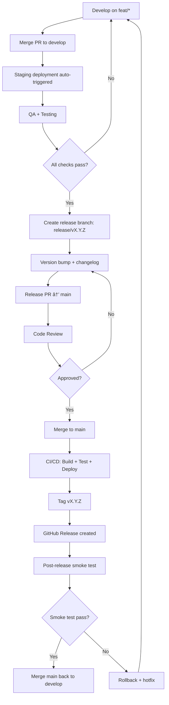
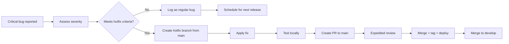

---
version: 2.0.0
status: active
classification: Internal — Engineering
author: AI Agent System
last_updated: 2026-06-11
review_cycle: monthly
document_id: SB-DEVOPS-REL-001
related_docs:
  - docs/devops/26_Deployment.md
  - docs/devops/27_DevOps.md
  - docs/operations/39_Runbooks.md
  - docs/qa/28_Testing.md
  - CHANGELOG.md
---

# Release Management

## Document Control

| Field | Value |
|---|---|
| Document ID | DVO-REL-001 |
| Version | 2.0.0 |
| Status | Active |
| Classification | Internal — Engineering |
| Last Updated | 2026-06-11 |
| Review Cycle | Monthly |
| Owner | Engineering Team |
| Related Docs | Deployment, DevOps, Runbooks, Testing, CHANGELOG |

---

## Executive Summary

This document defines the complete release management process for Second Brain OS. It covers versioning strategy, release workflow, changelog format, release checklist, hotfix process, feature flag strategy, artifact management, scheduling, roles, risk management, and rollback procedures.

**Key Principles:**
- **Semantic Versioning** — All releases follow SemVer 2.0.0 for clear communication of change impact
- **Automated where possible** — Tagging, changelog generation, and deployment are CI/CD-driven
- **Manual where necessary** — Release approval, smoke testing, and post-release monitoring require human judgment
- **Hotfix bypass** — Critical security/data-loss issues skip the standard cycle
- **Feature flags** — Decouple deployment from release for safe rollouts

**Release Cadence:**

| Type | Frequency | Lead Time | Approval |
|---|---|---|---|
| Major (x.0.0) | Every 6-12 months | 2-4 weeks | Project lead + review |
| Minor (0.x.0) | Every 2-4 weeks | 1 week | Code review |
| Patch (0.0.x) | As needed (1-7 days) | 1-2 days | Code review |
| Hotfix | Within hours | Immediate | Expedited review |

---

## Table of Contents

1. [Versioning Strategy](#1-versioning-strategy)
2. [Release Workflow](#2-release-workflow)
3. [Changelog Format](#3-changelog-format)
4. [Release Checklist](#4-release-checklist)
5. [Hotfix Process](#5-hotfix-process)
6. [Feature Flags Strategy](#6-feature-flags-strategy)
7. [Artifact & Release Assets](#7-artifact--release-assets)
8. [Release Scheduling](#8-release-scheduling)
9. [Release Roles & Responsibilities](#9-release-roles--responsibilities)
10. [Rollback Procedures](#10-rollback-procedures)
11. [Risk Management](#11-risk-management)
12. [Environment Promotion](#12-environment-promotion)
13. [Release Communication](#13-release-communication)
14. [Post-Release Activities](#14-post-release-activities)
15. [Tooling & Automation](#15-tooling--automation)
16. [Appendices](#16-appendices)

---

## 1. Versioning Strategy

### 1.1 Semantic Versioning 2.0.0

Second Brain OS follows **SemVer 2.0.0** format: `MAJOR.MINOR.PATCH`

```
v2.1.3
↑  ↑  ↑
│  │  └── PATCH: Bug fixes, hotfixes (backward-compatible)
│  └───── MINOR: New features, non-breaking changes
└──────── MAJOR: Breaking changes, architecture rewrites
```

### 1.2 Increment Rules

| Increment | Pattern | When to Increment | Examples |
|---|---|---|---|
| **MAJOR** | x.0.0 | Breaking API changes, database schema migrations, removed features, major UX overhauls | New auth system, database restructuring, complete UI rewrite |
| **MINOR** | 0.x.0 | New feature, new API endpoint, new module, dependency updates (backward-compatible) | New chat module, new API route, added export feature |
| **PATCH** | 0.0.x | Bug fix, security patch, performance improvement, documentation update | Fixed task creation crash, patched XSS vector, optimized query |
| **HOTFIX** | 0.0.x | Critical security/data-loss fix from main branch | SQL injection fix, auth bypass patch |

### 1.3 Pre-release Labels

Pre-release versions indicate stability level during development:

| Label | Meaning | Example | Stability |
|---|---|---|---|
| `-alpha.N` | Early development, unstable, experimental | `v1.0.0-alpha.1` | Low |
| `-beta.N` | Feature-complete, testing in progress | `v1.0.0-beta.2` | Medium |
| `-rc.N` | Release candidate, final validation | `v1.0.0-rc.3` | High |

Pre-release versions have **lower precedence** than the normal version:
- `v1.0.0-alpha.1` < `v1.0.0-beta.1` < `v1.0.0-rc.1` < `v1.0.0`

### 1.4 Build Metadata

Build metadata can be appended with `+` suffix for CI/CD tracking:
```
v1.0.0+build.20260611
v1.0.0+sha.abc1234
```

Build metadata is **ignored** in version precedence comparisons.

### 1.5 Current Version Tracking

| Component | Location | Version |
|---|---|---|
| Frontend | `apps/web/package.json` → `version` | 1.0.0 |
| Backend | `apps/api/main.py` → `app.version` | 1.0.0 |
| Scheduler | `services/scheduler/main.py` → `app.version` | 1.0.0 |
| Prompts | `prompts/*/frontmatter` → `version` (per-prompt) | 2.1.0 |
| Docs | `docs/*/frontmatter` → `version` (per-doc) | 1.0.0 — 2.0.0 |

### 1.6 Multi-Component Versioning Strategy

The project uses **independent versioning** — each major component maintains its own version number:

| Component | Version Source | Reasoning |
|---|---|---|
| Frontend (Next.js) | `package.json` | Ships independently via Vercel |
| Backend (FastAPI) | `main.py` | Ships independently via Railway |
| Scheduler (Python) | `main.py` | Ships independently |
| Prompts | Frontmatter | Updated independently for prompt improvements |
| Docs | Frontmatter | Documentation is decoupled from code releases |

For tagged releases, all component versions should be synchronized:
```bash
# Release v2.1.0 coordinates:
#   Frontend v2.1.0 + Backend v2.1.0 + Scheduler v2.1.0
git tag -a v2.1.0 -m "Release v2.1.0"
```

---

## 2. Release Workflow

### 2.1 Git Branching Model

```
        main ──────────────────────●────────────────────●──
                                  /                    /
        develop ─────●───────────●────●───────────────●──
                    /            /    /               /
        feat/* ────●────●──────/    /               /
                            /    /               /
        fix/* ─────────────●────/───────────────/
                              /
        release/* ──────────●────────────────────
```

### 2.2 Branch Naming Convention

| Branch Type | Pattern | Example | Branches From | Merges To |
|---|---|---|---|---|
| Feature | `feat/<module>-<description>` | `feat/tasks-calendar-view` | `develop` | `develop` |
| Bug fix | `fix/<module>-<description>` | `fix/tasks-duplicate-creation` | `develop` | `develop` |
| Hotfix | `hotfix/<version>` | `hotfix/v2.0.1` | `main` | `main` + `develop` |
| Release | `release/<version>` | `release/v2.1.0` | `develop` | `main` |
| Chore | `chore/<description>` | `chore/update-deps` | `develop` | `develop` |
| Docs | `docs/<description>` | `docs/api-reference` | `develop` | `develop` |

### 2.3 Standard Release Cycle



### 2.4 Step-by-Step Release Process

#### Step 1: Prepare Release

```bash
# Ensure develop is up to date
git checkout develop
git pull origin develop

# Verify all feature/fix PRs are merged
gh pr list --base develop --state open
# Should show 0 open PRs to develop

# Check CI status for develop branch
gh run list --branch develop --limit 5
# All should be green

# Create release branch
git checkout -b release/v2.1.0
```

#### Step 2: Update Version Strings

```bash
# Frontend
sed -i 's/"version": ".*"/"version": "2.1.0"/' apps/web/package.json

# Backend
sed -i 's/app.version = ".*"/app.version = "2.1.0"/' apps/api/main.py

# Scheduler
sed -i 's/app.version = ".*"/app.version = "2.1.0"/' services/scheduler/main.py

# Commit version bumps
git add apps/web/package.json apps/api/main.py services/scheduler/main.py
git commit -m "chore: bump version to 2.1.0"
```

#### Step 3: Generate Changelog

```bash
# Using conventional-changelog
npx conventional-changelog -p angular -i CHANGELOG.md -s

# Review and edit CHANGELOG.md for accuracy
# Ensure categories are correct, add migration notes
git add CHANGELOG.md
git commit -m "docs: update changelog for v2.1.0"
```

#### Step 4: Create Release PR

```bash
git push origin release/v2.1.0

gh pr create \
  --base main \
  --head release/v2.1.0 \
  --title "Release v2.1.0" \
  --body "## Release v2.1.0

### What's Included
- See CHANGELOG.md for full details

### Migration Notes
- No database migrations required
- No breaking changes

### Verification
- [ ] All CI checks pass
- [ ] Staging deployment verified
- [ ] Smoke test passed" \
  --label release
```

#### Step 5: Review & Merge

```bash
# PR requires at least one approval
# After approval, merge via GitHub UI (not command line)
# This triggers CI/CD for main branch

# After merge, tag and create release
git checkout main
git pull origin main
git tag -a v2.1.0 -m "Release v2.1.0"
git push origin v2.1.0

# Create GitHub Release
gh release create v2.1.0 \
  --title "v2.1.0" \
  --notes-file CHANGELOG.md \
  --target main
```

#### Step 6: Post-Release

```bash
# Merge main back to develop
git checkout develop
git pull origin develop
git merge main
git push origin develop

# Delete release branch
git branch -d release/v2.1.0
git push origin --delete release/v2.1.0
```

### 2.5 Release Frequency Guidelines

| Release Type | Frequency | Lead Time | Scope |
|---|---|---|---|
| Major | Every 6-12 months | 2-4 weeks | Architecture changes, breaking API changes, major UI overhauls |
| Minor | Every 2-4 weeks | 1 week | New features, new modules, minor enhancements |
| Patch | As needed (1-7 days) | 1-2 days | Bug fixes, security patches, performance improvements |
| Hotfix | Within hours of discovery | Immediate | Critical security vulnerabilities, data loss bugs |

---

## 3. Changelog Format

### 3.1 Keep a Changelog v1.1.0

The changelog follows [Keep a Changelog](https://keepachangelog.com) v1.1.0 format:

```markdown
# Changelog

All notable changes to Second Brain OS are documented here.

Format: [Keep a Changelog](https://keepachangelog.com)
Versioning: [SemVer 2.0.0](https://semver.org)

## [2.1.0] - 2026-06-11

### Added
- Opportunity Radar module: automated fellowship/hackathon scanning
- Resource tags: filter resources by topic, type, priority
- ARIA memory consolidation: weekly summarization of user patterns
- Sleep agent: wind-down routines and sleep analysis
- Nudge agent: course/habit progress nudges with escalation

### Changed
- Rate limiter: increased chat endpoint limit from 20 to 30 req/min
- Briefing layout: simplified daily view, added weekly trends section
- PromptLoader: upgraded to v2.0 with YAML frontmatter validation

### Fixed
- Task rescheduling: auto-reschedule now respects user's preferred time window
- Habit streak calculation: daylight saving time edge case resolved
- CORS: development origins now excluded in production mode
- Auth token refresh race condition on rapid page navigation

### Security
- Input sanitization: additional XSS vector blocked in resource URL fields
- Dependencies: upgraded jose to 5.2.3 (JWT vulnerability fix)
- Rate limiting: added IP-based rate limiting for auth endpoints

### Deprecated
- Legacy `/api/analytics` endpoint — use `/api/analytics/v2` going forward

## [2.0.0] - 2026-05-15

### Added
- Opportunity radar module
- AI-powered daily briefing with ARIA insights
- PWA offline support with IndexedDB sync
- Grade tracking for academic courses

### Changed
- Migrated frontend to Next.js 14 App Router (breaking)
- Unified API rate limiter across all endpoints
- Redesigned dashboard layout with bento-box grid

### Removed
- Legacy page router components (Next.js Pages Router)
- Deprecated `/api/v1/*` endpoints

[2.1.0]: https://github.com/org/repo/compare/v2.0.0...v2.1.0
[2.0.0]: https://github.com/org/repo/releases/tag/v2.0.0
```

### 3.2 Change Categories

| Category | Usage | Icon (optional) |
|---|---|---|
| **Added** | New features, modules, endpoints, pages | ✨ |
| **Changed** | Behavior changes, UI redesigns, dependency updates | 🔄 |
| **Deprecated** | Features scheduled for removal | ⚠️ |
| **Removed** | Features removed in this release | 🗑️ |
| **Fixed** | Bug fixes, performance patches | 🐛 |
| **Security** | Vulnerability fixes, security improvements | 🔒 |

### 3.3 Changelog Automation

```bash
# Generate changelog from conventional commits
npx conventional-changelog -p angular -i CHANGELOG.md -s

# Manual categories (if not using conventional commits):
# 1. git log --oneline v2.0.0..HEAD --no-merges
# 2. Categorize commits manually
# 3. Edit CHANGELOG.md
```

### 3.4 Conventional Commit Format

To enable automated changelog generation, commits should follow this format:

```
<type>(<scope>): <description>

[optional body]

[optional footer]
```

| Type | Changelog Category |
|---|---|
| `feat` | Added |
| `fix` | Fixed |
| `chore` | Changed |
| `docs` | Changed |
| `refactor` | Changed |
| `perf` | Changed |
| `style` | Changed |
| `test` | Changed |
| `sec` | Security |
| `deprecate` | Deprecated |
| `remove` | Removed |

Examples:
```
feat(tasks): add calendar view with drag-and-drop
fix(auth): resolve token refresh race condition
sec(deps): upgrade jose to 5.2.3
docs(api): add opportunity radar endpoint reference
```

---

## 4. Release Checklist

### 4.1 Pre-Release (T-2 days)

**Code Quality:**
- [ ] All feature/bug PRs merged to `develop`
- [ ] No P1 (critical) or P2 (high) bugs open
- [ ] `npm run lint` passes on frontend
- [ ] `npm run type-check` passes on frontend
- [ ] `ruff check .` passes on backend
- [ ] `python -m pytest tests/ -x` passes (all 30+ tests)

**Prompt System:**
- [ ] `python scripts/validate_prompts.py` passes
- [ ] All 12 prompt files have valid YAML frontmatter
- [ ] Prompt version bumps checked if modified

**Infrastructure:**
- [ ] Staging deployment passing health checks
- [ ] Database migrations tested on staging DB
- [ ] Environment variables reviewed (no stale values)
- [ ] Feature flags reviewed (enabled/disabled appropriately)

**Documentation:**
- [ ] CHANGELOG.md reviewed for accuracy and completeness
- [ ] Migration notes written (if applicable)
- [ ] API documentation updated (if new endpoints added)
- [ ] Agent documentation updated (if agent behavior changed)

### 4.2 Release Day

**Release Preparation:**
- [ ] Version strings updated across all components
- [ ] Release branch created (`release/vX.Y.Z`)
- [ ] Release PR created from `release/vX.Y.Z` → `main`
- [ ] Release PR approved by at least 1 reviewer

**Deployment:**
- [ ] PR merged to `main`
- [ ] CI/CD pipeline passes on `main` (all 4 jobs)
- [ ] Git tag created (`git tag vX.Y.Z && git push origin vX.Y.Z`)
- [ ] GitHub Release created with changelog notes

**Verification:**
- [ ] Frontend deployed to production (Vercel)
- [ ] Backend deployed to production (Railway)
- [ ] Scheduler deployed (if changed)
- [ ] Smoke test: login, create task, view briefing, check AI response
- [ ] Supabase project configured (RLS, indexes verified)
- [ ] Monitoring dashboards green (no error spikes)
- [ ] Health endpoint returns 200 OK

### 4.3 Post-Release (T+24h)

- [ ] No spike in error rates (check monitoring dashboard)
- [ ] No rate limit violations above baseline
- [ ] No reported auth failures
- [ ] No reported AI service degradation
- [ ] `release/vX.Y.Z` branch deleted (local + remote)
- [ ] Merge `main` back into `develop`
- [ ] Update version status in docs (if needed)

---

## 5. Hotfix Process

### 5.1 Hotfix Criteria

Hotfixes bypass the standard release cycle for **critical** issues only:

| Severity | Issue Type | Hotfix? | SLA |
|---|---|---|---|
| **P0 — Critical** | SQL injection vulnerability | **Yes** | < 1 hour |
| **P0 — Critical** | Auth bypass (any user can access any data) | **Yes** | < 1 hour |
| **P0 — Critical** | Data loss (tasks disappearing) | **Yes** | < 2 hours |
| **P0 — Critical** | Service unavailable (500 on all routes) | **Yes** | < 2 hours |
| **P1 — High** | Major feature broken for all users | **Yes** | < 4 hours |
| **P1 — High** | Rate limiting prevents normal usage | **Yes** | < 4 hours |
| **P2 — Medium** | UI bug affecting one module | **No** | Next patch |
| **P3 — Low** | Cosmetic issue, typo | **No** | Next release |
| — | Feature request, enhancement | **No** | Next minor |

### 5.2 Hotfix Workflow



### 5.3 Step-by-Step Hotfix

```bash
# 1. Create hotfix branch from main
git checkout main
git pull origin main
git checkout -b hotfix/v2.0.1

# 2. Apply fix and bump PATCH version
# Edit: fix the bug
# Update version strings:
#   apps/web/package.json → "version": "2.0.1"
#   apps/api/main.py → app.version = "2.0.1"

# 3. Commit with conventional commit format
git add apps/web/package.json apps/api/main.py
git commit -m "fix(auth): resolve token refresh race condition

The auth token refresh was failing when rapid page navigation
triggered multiple simultaneous refresh attempts. Added mutex
to ensure only one refresh runs at a time.

Fixes #123"

# 4. Push and create PR with hotfix label
git push origin hotfix/v2.0.1
gh pr create \
  --base main \
  --head hotfix/v2.0.1 \
  --title "Hotfix v2.0.1: auth token refresh fix" \
  --body "## Hotfix v2.0.1

**Issue:** Auth token refresh race condition (#123)
**Severity:** P1 — High

### Changes
- Added mutex lock around token refresh operation
- Prevent concurrent refresh calls

### Testing
- [x] Verified no more race condition in dev
- [x] All existing auth tests pass
- [x] Manual smoke test: login → navigate → refresh → still logged in" \
  --label hotfix \
  --label security

# 5. Expedited review (minimum 1 reviewer)
# After approval, merge via GitHub UI

# 6. Tag and deploy
git checkout main
git pull origin main
git tag v2.0.1
git push origin v2.0.1

# Create GitHub Release
gh release create v2.0.1 --title "Hotfix v2.0.1" --notes "Auth token refresh race condition fix"

# 7. Merge back to develop
git checkout develop
git pull origin develop
git merge main
git push origin develop
```

### 5.4 Hotfix Rollback

If a hotfix causes issues, rollback immediately:

```bash
# 1. Revert the hotfix commit on main
git checkout main
git pull origin main
git revert HEAD
git push origin main

# 2. Tag the revert as a new hotfix
git tag v2.0.2
git push origin v2.0.2

# 3. Deploy reverted version
# (Automatic via CI/CD)

# 4. Investigate root cause of hotfix failure
# Create bug ticket with findings
```

---

## 6. Feature Flags Strategy

### 6.1 Flag System Architecture

Feature flags decouple **deployment** from **release**, allowing features to be merged to main but disabled in production until ready.

```python
# packages/shared/utils/feature_flags.py
from dataclasses import dataclass, field
from typing import Dict, Optional
from enum import Enum

class FlagStatus(Enum):
    INCEPTION = "inception"       # Idea, not implemented
    DEVELOPMENT = "development"   # Code behind flag, off by default
    BETA = "beta"                 # On for test users only
    GENERAL = "general"           # On for all users
    RETIRED = "retired"           # Flag removed, code permanent

@dataclass
class FeatureFlag:
    name: str
    description: str
    owner: str
    status: FlagStatus
    enabled: bool = False
    enabled_for_users: list = field(default_factory=list)
    rollout_percentage: int = 0
    created_at: str = ""
    updated_at: str = ""
    dependencies: list = field(default_factory=list)

class FeatureFlagManager:
    def __init__(self):
        self._flags: Dict[str, FeatureFlag] = {}

    def register(self, flag: FeatureFlag):
        self._flags[flag.name] = flag

    def is_enabled(self, flag_name: str, user_id: Optional[str] = None) -> bool:
        flag = self._flags.get(flag_name)
        if not flag:
            return False

        if not flag.enabled:
            return False

        # Check user-specific enablement
        if flag.enabled_for_users and user_id:
            return user_id in flag.enabled_for_users

        # Check rollout percentage
        if flag.rollout_percentage < 100 and user_id:
            # Consistent hash-based rollout
            user_hash = hash(f"{flag_name}:{user_id}") % 100
            return user_hash < flag.rollout_percentage

        return flag.enabled

    def enable_for_user(self, flag_name: str, user_id: str):
        flag = self._flags.get(flag_name)
        if flag:
            if user_id not in flag.enabled_for_users:
                flag.enabled_for_users.append(user_id)

    def get_all_flags(self) -> Dict[str, FeatureFlag]:
        return dict(self._flags)

flags = FeatureFlagManager()

# Register default flags
flags.register(FeatureFlag(
    name="opportunity_radar",
    description="Automated fellowship/hackathon scanning",
    owner="core",
    status=FlagStatus.GENERAL,
    enabled=True,
    created_at="2026-05-01",
))
flags.register(FeatureFlag(
    name="ai_briefing_v2",
    description="Enhanced AI briefing with trend analysis",
    owner="ai-team",
    status=FlagStatus.DEVELOPMENT,
    enabled=False,
    created_at="2026-06-01",
))
flags.register(FeatureFlag(
    name="sleep_agent",
    description="AI-powered sleep analysis and wind-down routines",
    owner="ai-team",
    status=FlagStatus.BETA,
    enabled=True,
    enabled_for_users=["dev-user-1", "dev-user-2"],
    rollout_percentage=10,
    created_at="2026-06-10",
))
```

### 6.2 Flag Lifecycle

```
INCEPTION → DEVELOPMENT → BETA → GENERAL → RETIRED
    │           │            │        │           │
    │           │            │        │           └── Flag code removed
    │           │            │        │
    │           │            │        └── 100% rollout
    │           │            │
    │           │            └── % rollout / user-specific
    │           │
    │           └── Code behind flag, disabled
    │
    └── Idea phase, not yet coded
```

### 6.3 Rollout Strategy

```yaml
Rollout Stages:
  Stage 1 — Development:
    enabled: false
    access: Developers only (local dev)
    duration: Until feature complete
    validation: Unit tests pass

  Stage 2 — Internal Alpha:
    enabled: true
    users: [developer accounts, project lead]
    duration: 1-3 days
    validation: Smoke test all flows, no crashes

  Stage 3 — Beta:
    enabled: true
    rollout_percentage: 10
    users: [opt-in beta testers]
    duration: 1 week
    validation: Bug reports, usage metrics, error rate < 1%

  Stage 4 — Gradual Rollout:
    rollout_percentage: 25 → 50 → 75 → 100
    duration: 1-2 weeks (3-5 days per step)
    validation: Error rate steady, no support tickets, performance stable

  Stage 5 — General Availability:
    enabled: true
    rollout_percentage: 100
    next: Remove flag code in next release
```

### 6.4 Flag Naming Convention

```
{module}_{feature}_{variant}
    ↑         ↑         ↑
    │         │         └── Optional variant (v2, experimental, legacy)
    │         └── Feature name (snake_case)
    └── Module (briefing, tasks, auth, etc.)
```

**Examples:**
- `briefing_ai_v2` — AI briefing version 2
- `tasks_calendar_view` — Calendar view for tasks
- `auth_biometric` — Biometric authentication
- `dashboard_bento_layout` — Bento-box dashboard layout
- `sleep_agent_recommendations` — AI sleep recommendations

### 6.5 Flag Removal Process

When a feature reaches GA and has been stable for 2+ weeks:

```bash
# 1. Remove all flag checks from code
grep -r "is_enabled.*flag_name" apps/
# ... remove conditional checks, keep code as default

# 2. Remove flag registration
# Delete or comment out the flag registration

# 3. Update documentation
# Remove any references to the feature being behind a flag

# 4. Commit as chore
git commit -m "chore: remove feature flag for sleep_agent"
```

---

## 7. Artifact & Release Assets

### 7.1 Release Artifacts

| Artifact | Location | Retention | Access |
|---|---|---|---|
| Git tag | `git tag vX.Y.Z` | Permanent | Public (GitHub) |
| GitHub Release | `github.com/org/repo/releases` | Permanent | Public |
| Changelog entry | `CHANGELOG.md` | Permanent | Public |
| Frontend build | Vercel deployment | 90 days | Team (Vercel) |
| Backend build | Railway deployment | 90 days | Team (Railway) |
| Docker images | GitHub Container Registry | 30 days | Team |
| Database backup | Supabase backup | 30 days | Team |
| Release notes | GitHub Release description | Permanent | Public |

### 7.2 Release Template (GitHub Releases)

```markdown
## v2.1.0 (2026-06-11)

### 📦 Links
- **Frontend:** [app.secondbrainos.com](https://app.secondbrainos.com)
- **API:** [api.secondbrainos.com](https://api.secondbrainos.com)
- **Status:** [status.secondbrainos.com](https://status.secondbrainos.com)

### ✨ What's New
- **Opportunity Radar** — Automated scanning for fellowships, hackathons, and internships
- **Sleep Agent** — AI-powered wind-down routines and sleep analysis
- **Nudge Agent** — Smart reminders for course progress and habit streaks
- **PromptLoader v2** — YAML frontmatter validation for all AI prompts

### 🐛 Bug Fixes
- Fixed task rescheduling respecting user's preferred time window
- Fixed habit streak calculation during daylight saving time transitions
- Fixed auth token refresh race condition

### 🔒 Security
- Upgraded jose to 5.2.3 (JWT vulnerability fix)
- Added IP-based rate limiting for auth endpoints
- Additional XSS sanitization in resource URL fields

### ⚠️ Breaking Changes
- None. This release is backward-compatible.

### 📋 Changelog
See [CHANGELOG.md](https://github.com/org/repo/blob/v2.1.0/CHANGELOG.md)

### 🔧 Migration Notes
- Run `python scripts/validate_prompts.py` after deploying
- No database migrations required

### 👥 Contributors
- @developer

**Full Changelog:** https://github.com/org/repo/compare/v2.0.0...v2.1.0
```

---

## 8. Release Scheduling

### 8.1 Release Calendar (2026)

| Month | Version | Type | Focus |
|---|---|---|---|
| June | v2.0.0 | Major | Opportunity Radar, AI Briefing, PWA support |
| July | v2.1.0 | Minor | Dashboard enhancements, mobile improvements |
| August | v2.2.0 | Minor | API performance, caching layer |
| September | v2.3.0 | Minor | Notifications system, email reminders |
| October | v2.4.0 | Minor | Collaboration features (shared projects) |
| November | v2.5.0 | Minor | Analytics dashboard, export improvements |
| December | v2.6.0 | Minor | Year-in-review, holiday prep mode |
| Q1 2027 | v3.0.0 | Major | TBD — based on user feedback |

### 8.2 Release Windows

| Day | Activity | Window |
|---|---|---|
| Monday | Feature freeze for current release | 10:00 UTC |
| Tuesday | Release branch creation, version bump | 10:00 UTC |
| Wednesday | Testing, bug fixes on release branch | All day |
| Thursday | Release PR review, merge | 14:00 UTC |
| Thursday | Production deployment | 16:00 UTC |
| Friday | Post-release monitoring | All day |
| Weekend | No deployments (except hotfixes) | — |

### 8.3 Blackout Periods

No releases during:
- **Holiday weeks** (Christmas, New Year, major local holidays)
- **Exam periods** (if the developer is a student)
- **Major conferences** (if attending/presenting)

---

## 9. Release Roles & Responsibilities

| Role | Person | Responsibilities |
|---|---|---|
| **Release Manager** | Project lead | Orchestrates release process, approves go/no-go decision, resolves blockers |
| **Reviewer** | Peer/contributor | Code review, changelog review, PR approval |
| **QA Tester** | Self + beta testers | Smoke tests, regression testing, feature validation |
| **DevOps** | Project lead | CI/CD pipeline health, deployment verification, rollback execution |
| **Documentation** | Project lead | Changelog accuracy, migration notes, API docs updates |
| **Security Reviewer** | Self (or external) | Security-critical releases, vulnerability assessment |

---

## 10. Rollback Procedures

### 10.1 When to Rollback

- Error rate spikes > 5% after deployment
- Critical functionality broken for all users
- Data integrity issues discovered
- Performance regression > 50%
- Security vulnerability introduced

### 10.2 Rollback Methods

| Component | Method | Time |
|---|---|---|
| Frontend (Vercel) | Vercel Dashboard → Deployments → Rollback | 1-2 minutes |
| Backend (Railway) | Railway Dashboard → Deployments → Previous → Redeploy | 2-5 minutes |
| Database | Supabase backup restore | 10-30 minutes |
| Feature flag | Disable flag → redeploy | 5 minutes |

### 10.3 Frontend Rollback

```bash
# Via Vercel CLI
vercel rollback --scope=personal

# Or via Dashboard
# 1. Go to https://vercel.com/dashboard
# 2. Select project → Deployments
# 3. Find the previous working deployment
# 4. Click "..." → Rollback to this deployment
```

### 10.4 Backend Rollback

```bash
# Via Railway Dashboard
# 1. Go to https://railway.app/dashboard
# 2. Select project → Deployments
# 3. Find the previous working deployment
# 4. Click "..." → Redeploy

# Or via git revert + push
git revert HEAD
git push origin main
```

### 10.5 Database Rollback

```sql
-- Supabase backup restore
-- 1. Go to Supabase Dashboard → Database → Backups
-- 2. Select backup point before deployment
-- 3. Click "Restore" (triggers a new project with restored data)
```

### 10.6 Rollback Verification

After rollback, verify:
- [ ] Health endpoint returns 200
- [ ] Login flow works
- [ ] Core CRUD operations work (create task, view briefing)
- [ ] Error rate returned to baseline
- [ ] Monitoring dashboards show recovery

---

## 11. Risk Management

### 11.1 Release Risk Assessment

| Risk | Probability | Impact | Mitigation |
|---|---|---|---|
| Breaking API change | Low (minor) | High | Deprecation warnings 1 release before removal |
| Database migration failure | Low | High | Test on staging first, backup before production |
| Feature flag misconfiguration | Medium | Medium | Flag review checklist, default to disabled |
| Performance regression | Medium | Medium | Load test before release, monitor p95 after |
| Security vulnerability | Low | Critical | Security review for security-related PRs |
| Dependency conflict | Low | Medium | `npm audit` + `pip-audit` in CI |
| Documentation outdated | Medium | Low | Include docs update in PR checklist |
| Rollback failure | Low | Critical | Test rollback procedure on staging |

### 11.2 Go/No-Go Decision Criteria

**GO** if:
- All CI checks pass
- Release checklist items marked complete
- At least 1 approval on release PR
- No P0 or P1 bugs open against release
- Staging smoke test passed
- Rollback plan documented

**NO-GO** if:
- Any CI check fails
- P0 bug discovered during testing
- Security vulnerability found (fix first)
- Release manager unavailable for post-release monitoring

---

## 12. Environment Promotion

### 12.1 Environment Matrix

| Environment | Branch | Deploy Trigger | URL | Purpose |
|---|---|---|---|---|
| **Development** | Feature branches | Manual (local) | `localhost:3000` | Development, quick iteration |
| **Staging** | `develop` | Auto on push | `staging.ariaos.app` | Integration testing, QA |
| **Production** | `main` | Auto on push | `app.ariaos.app` | Live users |

### 12.2 Promotion Checklist

**Develop → Staging** (automatic on push):
- [ ] All feature PRs merged
- [ ] CI passes for develop branch
- [ ] No merge conflicts

**Staging → Production** (release process):
- [ ] Release branch created and tested
- [ ] Release PR approved
- [ ] Smoke test on staging
- [ ] Rollback plan ready

---

## 13. Release Communication

### 13.1 Stakeholder Notifications

| Audience | When | Channel | Message |
|---|---|---|---|
| Beta testers | Release day | Email | New features, known issues |
| All users | Release day | In-app banner | What's new, brief summary |
| Developers | Release day | Slack/Discord | Full changelog, migration notes |
| Maintainers | Pre-release | GitHub PR | Review request, checklist |

### 13.2 Release Announcement Template

```markdown
# Release v2.1.0 — Now Live! 🚀

Second Brain OS v2.1.0 is now deployed to production.

## What's New
- **Opportunity Radar** — AI scans for fellowships, hackathons, internships
- **Sleep Agent** — Personalized wind-down routines
- **Nudge Agent** — Smart reminders for courses and habits

## Fixes
- Task scheduling now respects your preferred time window
- Fixed streak calculation during DST transitions
- Improved auth reliability

## For Developers
- PromptLoader v2 with YAML frontmatter validation
- 3 new AI agent modules added
- 30+ new tests for prompt system

## Links
- App: https://app.ariaos.app
- Status: https://status.ariaos.app
- Changelog: https://github.com/org/repo/blob/main/CHANGELOG.md

Need help? Reply to this email or check the docs.
```

---

## 14. Post-Release Activities

### 14.1 Immediate (T+0 to T+2h)

- Monitor error rates and response times
- Watch for auth failures or rate limit spikes
- Keep rollback command ready
- Stay available for incident response

### 14.2 Short-term (T+2h to T+24h)

- Review monitoring dashboards
- Check cost tracking for any anomalies
- Respond to user feedback and bug reports
- Update implementation status documents

### 14.3 Long-term (T+24h to T+1 week)

- Post-mortem for any incidents
- Update project board with completed items
- Plan next release scope
- Archive release branch

---

## 15. Tooling & Automation

### 15.1 CI/CD Integration

Release management is integrated into the CI/CD pipeline (`.github/workflows/ci.yml`):

```yaml
# Triggered on push to main
name: Release
on:
  push:
    branches: [main]

jobs:
  # 4 CI jobs: frontend, backend, prompts, security
  release:
    needs: [frontend, backend, prompts, security]
    runs-on: ubuntu-latest
    steps:
      - name: Tag and release
        if: startsWith(github.event.head_commit.message, 'chore: bump version')
        run: |
          git tag v$(node -p "require('./apps/web/package.json').version")
          git push origin --tags

# Triggered on tag push
on:
  push:
    tags: ['v*']

jobs:
  deploy:
    runs-on: ubuntu-latest
    steps:
      - uses: actions/checkout@v4
      - name: Create Release
        uses: softprops/action-gh-release@v1
        with:
          body_path: CHANGELOG.md
```

### 15.2 Release Helper Scripts

```bash
# scripts/release.sh
#!/bin/bash
# Helper script for creating a release

VERSION=$1

if [ -z "$VERSION" ]; then
  echo "Usage: ./scripts/release.sh vX.Y.Z"
  exit 1
fi

echo "Creating release $VERSION..."

# Create branch
git checkout develop
git pull origin develop
git checkout -b release/$VERSION

# Bump version
echo "Bumping version to $VERSION..."
# (version bump commands)

# Generate changelog
echo "Generating changelog..."
npx conventional-changelog -p angular -i CHANGELOG.md -s

# Commit
git add .
git commit -m "chore: release $VERSION"

# Push
git push origin release/$VERSION

echo "Release branch created: release/$VERSION"
echo "Create PR: gh pr create --base main --head release/$VERSION --title 'Release $VERSION'"
```

### 15.3 Bot Automation

| Task | Tool | Automation Level |
|---|---|---|
| Version bump | Script | Semi-automated |
| Changelog generation | `conventional-changelog` | Semi-automated |
| PR creation | `gh` CLI | Manual trigger |
| CI/CD checks | GitHub Actions | Fully automated |
| Deployment | Vercel + Railway | Fully automated |
| Tag creation | GitHub Actions | Semi-automated |
| Release notes | GitHub Releases | Semi-automated |
| Rollback | Manual via Dashboard | Manual |

---

## 16. Appendices

### Appendix A: Environment Variables for Release

| Variable | Purpose | Required |
|---|---|---|
| `GITHUB_TOKEN` | GitHub CLI authentication | For automated releases |
| `VERCEL_TOKEN` | Vercel deployment API | For rollback automation |
| `RAILWAY_TOKEN` | Railway deployment API | For rollback automation |

### Appendix B: Release Troubleshooting

| Problem | Symptom | Solution |
|---|---|---|
| CI fails on main | Tests fail, lint errors | Fix on develop, merge again |
| Vercel deploy fails | Build error, timeout | Check build logs, increase timeout |
| Railway deploy fails | Health check failure | Check Railway logs, verify env vars |
| Version mismatch | Frontend shows wrong version | Check package.json version string |
| Changelog conflicts | Conflicting changelog entries | Manual merge in CHANGELOG.md |
| Tag already exists | `git tag` fails | Delete local tag, pull remote tags |

### Appendix C: Quick Reference

```bash
# Create release branch
git checkout -b release/v2.1.0

# Bump version (example)
sed -i 's/"version": ".*"/"version": "2.1.0"/' apps/web/package.json

# Generate changelog
npx conventional-changelog -p angular -i CHANGELOG.md -s

# Create PR
gh pr create --base main --head release/v2.1.0 --title "Release v2.1.0" --label release

# After merge, tag
git tag -a v2.1.0 -m "Release v2.1.0"
git push origin v2.1.0

# GitHub Release
gh release create v2.1.0 --title "v2.1.0" --notes-file CHANGELOG.md

# Hotfix branch
git checkout -b hotfix/v2.0.1

# Rollback (Vercel)
vercel rollback

# Merge main to develop
git checkout develop && git merge main && git push
```

### Appendix D: Related Processes

| Process | Document |
|---|---|
| Deployment | `docs/devops/26_Deployment.md` |
| DevOps Practices | `docs/devops/27_DevOps.md` |
| Testing Standards | `docs/qa/28_Testing.md` |
| Quality Assurance | `docs/qa/29_QA.md` |
| Runbooks | `docs/operations/39_Runbooks.md` |
| Incident Response | `docs/operations/40_IncidentResponse.md` |
| Change Management | `docs/governance/02_ChangeManagement.md` |
| Technical Debt | `docs/operations/50_TechnicalDebt.md` |

---

## Revision History

| Version | Date | Author | Changes |
|---|---|---|---|
| 1.0.0 | 2026-06-01 | Developer | Initial release management documentation |
| 2.0.0 | 2026-06-11 | AI Agent System | Enterprise upgrade: full workflow, flag strategy, rollback, risk management, environment promotion, communication, post-release, tooling, appendices |
