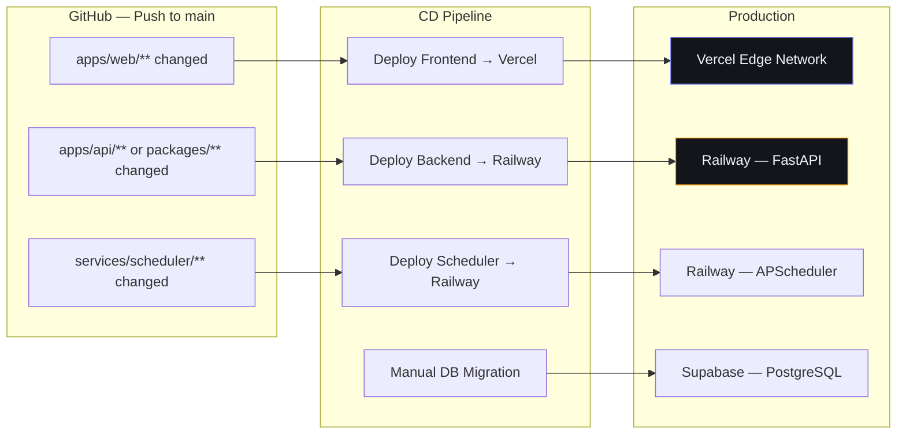
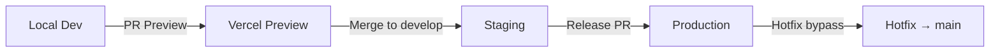

# Continuous Deployment

## Document Control

| Field | Value |
|---|---|
| Document ID | DVO-CD-012 |
| Version | 1.0.0 |
| Status | Active |
| Date | 2026-07-10 |
| Classification | Internal |
| Owner | Developer |

---

## Table of Contents

1. [Executive Summary](#1-executive-summary)
2. [CD Philosophy](#2-cd-philosophy)
3. [Deployment Architecture](#3-deployment-architecture)
4. [Frontend Deployment (Vercel)](#4-frontend-deployment-vercel)
5. [Backend Deployment (Railway)](#5-backend-deployment-railway)
6. [Scheduler Deployment (Railway)](#6-scheduler-deployment-railway)
7. [Database Deployment (Supabase)](#7-database-deployment-supabase)
8. [Environment Promotion](#8-environment-promotion)
9. [Deployment Workflows](#9-deployment-workflows)
10. [Rollback Strategy](#10-rollback-strategy)
11. [Performance Targets](#11-performance-targets)
12. [Failure Handling](#12-failure-handling)
13. [Testing Strategy](#13-testing-strategy)
14. [Edge Cases](#14-edge-cases)
15. [References](#15-references)

---

## 1. Executive Summary

The CD pipeline automatically deploys all components to their respective platforms on every push to `main`. Each component deploys independently — a frontend-only change doesn't redeploy the backend. Preview deployments are auto-generated for every PR.

---

## 2. CD Philosophy

- **Immutable deployments**: No post-deployment configuration changes
- **Isolated deploys**: Each component deploys independently
- **Preview-first**: Every PR gets an isolated preview environment
- **Automated rollback**: Rollback via platform dashboard or CLI in < 5 min
- **Health-gated**: New deployment only serves traffic after health check passes

---

## 3. Deployment Architecture



---

## 4. Frontend Deployment (Vercel)

| Property | Value |
|---|---|
| Platform | Vercel (Hobby tier) |
| Framework | Next.js 14 |
| Build Command | `npm run build` |
| Output Dir | `.next` |
| Install | `npm ci` |
| Root Dir | `apps/web` |
| Regions | `iad1` (US East) |

**Flow:**
```
Push to main → Vercel webhook → git clone → npm ci → npm run build → 
Upload to Edge Network → Health check → Traffic shifted → Old deployment retained (last 10)
```

---

## 5. Backend Deployment (Railway)

| Property | Value |
|---|---|
| Platform | Railway (Starter) |
| Runtime | Python 3.10 |
| Build | `pip install -r apps/api/requirements.txt` |
| Start | `uvicorn main:app --host 0.0.0.0 --port $PORT` |
| Health Check | `GET /api/health` |
| Root Dir | `apps/api` |

---

## 6. Scheduler Deployment (Railway)

| Property | Value |
|---|---|
| Platform | Railway (same project, separate service) |
| Runtime | Python 3.10 |
| Start | `python main.py` |
| Triggers | 15 cron jobs via APScheduler |

---

## 7. Database Deployment (Supabase)

Database changes are applied manually via migration scripts:

```bash
# Apply pending migrations
python scripts/run_migrations.py apply

# Revert a migration
python scripts/run_migrations.py revert 005

# Check status
python scripts/run_migrations.py status
```

---

## 8. Environment Promotion



| Stage | URL Frontend | URL Backend | Data |
|---|---|---|---|
| Preview | `{branch}-{hash}.vercel.app` | — | Staging |
| Staging | `staging.secondbrainos.com` | `staging-api.secondbrainos.com` | Anonymized |
| Production | `app.secondbrainos.com` | `api.secondbrainos.com` | Real |

---

## 9. Deployment Workflows

| Workflow | File | Trigger | Jobs |
|---|---|---|---|
| Deploy Frontend | `deploy-frontend.yml` | Push to `main` (apps/web/**) | Vercel deploy |
| Deploy Backend | `deploy-backend.yml` | Push to `main` (apps/api/**, packages/**) | Railway deploy |
| Deploy Scheduler | `deploy-scheduler.yml` | Push to `main` (services/scheduler/**) | Railway deploy |
| Deploy All | Manual trigger | Release PR merge | All three |

---

## 10. Rollback Strategy

| Component | Method | RTO | Steps |
|---|---|---|---|
| Frontend (Vercel) | Promote previous deploy | < 2 min | Dashboard → Deployments → Promote |
| Backend (Railway) | Rollback via CLI | < 3 min | `railway rollback --service backend 1` |
| Database (Supabase) | PITR or revert migration | < 30 min | Dashboard → Backups → Restore |

---

## 11. Performance Targets

| Metric | Target | Measurement |
|---|---|---|
| Deploy time (frontend) | < 2 min | Vercel deployment log |
| Deploy time (backend) | < 3 min | Railway deployment log |
| Deploy time (scheduler) | < 2 min | Railway deployment log |
| Time from commit to production | < 8 min | Combined CI + CD |
| Rollback time (frontend) | < 2 min | Manual procedure |
| Rollback time (backend) | < 3 min | Railway rollback |

---

## 12. Failure Handling

| Failure | Action |
|---|---|
| CI fails before deploy | Never deploy — block merge |
| Build fails on platform | Notify developer, fix and retry |
| Health check fails post-deploy | Auto-rollback (future), manual rollback (current) |
| Migration fails | Halt deploy, revert migration, alert DevOps |
| Platform outage | Wait for platform recovery, monitor status page |

---

## 13. Testing Strategy

| Gate | When | What |
|---|---|---|
| CI pass | Pre-deploy | All lint, type-check, test, security checks pass |
| Build success | Deploy | Component builds without errors |
| Health check | Post-deploy | `/api/health` returns 200 |
| Smoke test | Post-deploy | Key endpoints respond correctly |
| Monitoring | 15 min post-deploy | Error rate < 0.1%, latency normal |

---

## 14. Edge Cases

- Paths-not-triggered: A `docs/**` change doesn't trigger any deploy
- Concurrent deploys: Serialized per component (frontend deploys independently of backend)
- Failed health check: Deployment shows as CRASHED in Railway, previous version still serves traffic
- Migration backwards compatibility: New code must work with old schema for at least 1 release

---

## 15. References

| Resource | Location |
|---|---|
| Full Deployment Docs | `docs/devops/26_Deployment.md` |
| DevOps Practices | `docs/devops/27_DevOps.md` |
| CI Pipeline | `docs/devops/CI.md` |
| Rollback Procedures | `docs/devops/Rollback.md` |
| Terraform IaC | `docs/devops/Terraform.md` |
| GitHub Actions | `docs/devops/GitHubActions.md` |
