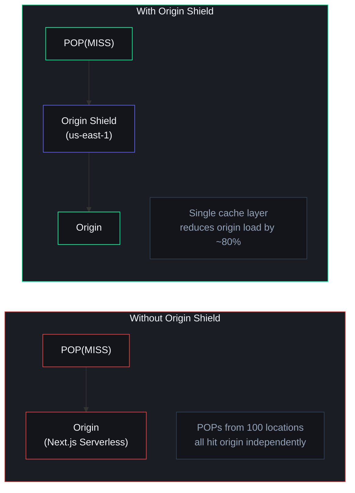
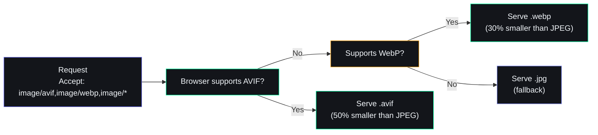

# CDN Strategy

> **Document ID**: DVO-CDN-001  
> **Version**: 1.0.0  
> **Status**: Active  
> **Last Updated**: 2026-06-11  
> **Classification**: Internal — Engineering Reference  
> **Target Audience**: Frontend Developers, DevOps Engineers, Performance Engineers

---

## Table of Contents

1. [Content Delivery Network Architecture](#1-content-delivery-network-architecture)
2. [Vercel Edge Network](#2-vercel-edge-network)
3. [Static Asset Caching](#3-static-asset-caching)
4. [API Response Caching](#4-api-response-caching)
5. [Image Optimization Pipeline](#5-image-optimization-pipeline)
6. [Font Delivery](#6-font-delivery)
7. [Cache Invalidation Strategy](#7-cache-invalidation-strategy)
8. [Security at CDN Level](#8-security-at-cdn-level)
9. [CDN Analytics](#9-cdn-analytics)
10. [Performance Targets](#10-performance-targets)
11. [Edge Computing Roadmap](#11-edge-computing-roadmap)

---

## 1. Content Delivery Network Architecture

### 1.1 CDN Topology

```mermaid
graph TD
    subgraph CDN["GLOBAL CDN ARCHITECTURE — Vercel Edge Network (100+ POPs)"]
        USWest["US West<br/>(LAX)"]
        USEast["US East<br/>(IAD)"]
        EUWest["EU West<br/>(LHR)"]
        EUEast["EU East<br/>(FRA)"]
        Asia["Asia<br/>(NRT)"]
        OriginShield["VERCEL ORIGIN SHIELD<br/>(us-east-1 — Central Cache Layer)"]
        NextJS["NEXT.JS SERVERLESS<br/>(us-east-1 — SSR + API Routes)"]
        Railway["RAILWAY BACKEND<br/>(us-west — FastAPI Containers)"]
    end

    USWest --> OriginShield
    USEast --> OriginShield
    EUWest --> OriginShield
    EUEast --> OriginShield
    Asia --> OriginShield
    OriginShield --> NextJS
    NextJS --> Railway

    style CDN fill:#0A0B0F,stroke:#334155,color:#F1F5F9
    style USWest fill:#13151A,stroke:#818CF8,color:#F1F5F9
    style USEast fill:#13151A,stroke:#818CF8,color:#F1F5F9
    style EUWest fill:#13151A,stroke:#818CF8,color:#F1F5F9
    style EUEast fill:#13151A,stroke:#818CF8,color:#F1F5F9
    style Asia fill:#13151A,stroke:#818CF8,color:#F1F5F9
    style OriginShield fill:#13151A,stroke:#6366F1,color:#F1F5F9
    style NextJS fill:#13151A,stroke:#00FFA3,color:#F1F5F9
    style Railway fill:#13151A,stroke:#F59E0B,color:#F1F5F9
```



### 1.2 Request Flow

```mermaid
flowchart LR
    User["User requests<br/>https://secondbrain-os.com"]
    DNS["DNS resolves to<br/>nearest Vercel POP (Anycast)"]
    POP["POP checks Edge Cache"]
    Hit["HIT → Serve cached<br/>response (<10ms)"]
    Miss["MISS → Forward to<br/>Origin Shield (us-east-1)"]
    Shield["Origin Shield<br/>checks its cache"]
    ShieldHit["HIT → Serve from<br/>Origin Shield, cache at POP"]
    ShieldMiss["MISS → Forward to<br/>Next.js Serverless"]
    API["For API calls:<br/>Railway Backend →<br/>Supabase Database"]

    User --> DNS
    DNS --> POP
    POP --> Hit
    POP --> Miss
    Miss --> Shield
    Shield --> ShieldHit
    Shield --> ShieldMiss
    ShieldMiss --> API

    style User fill:#13151A,stroke:#6366F1,color:#F1F5F9
    style DNS fill:#13151A,stroke:#818CF8,color:#F1F5F9
    style POP fill:#13151A,stroke:#00FFA3,color:#F1F5F9
    style Hit fill:#13151A,stroke:#00FFA3,color:#F1F5F9
    style Miss fill:#13151A,stroke:#F59E0B,color:#F1F5F9
    style Shield fill:#13151A,stroke:#6366F1,color:#F1F5F9
    style ShieldHit fill:#13151A,stroke:#00FFA3,color:#F1F5F9
    style ShieldMiss fill:#13151A,stroke:#F59E0B,color:#F1F5F9
    style API fill:#13151A,stroke:#818CF8,color:#F1F5F9
```



### 1.3 Caching Layers

```
Layer 1: Browser Cache
  • Fastest: 0–5ms
  • Controlled via Cache-Control headers
  • Best for: static assets, fonts, images

Layer 2: Vercel Edge Cache (POP)
  • Fast: 5–20ms
  • Shared across users at the same POP
  • TTL: 5min–1year depending on resource

Layer 3: Vercel Origin Shield
  • Medium: 20–50ms
  • Central cache layer for all POPs
  • Reduces origin load by ~80%

Layer 4: Application Cache (in-memory)
  • Slowest: 50–200ms
  • In FastAPI, TTL-based tag cache
  • Best for: computed API responses
```

### 1.4 Caching Decision Matrix

| Resource Type | Cache Layer | TTL | Cache Strategy |
|---|---|---|---|
| Static JS/CSS | Browser + CDN | 1 year | immutable |
| Images (optimized) | Browser + CDN | 1 week | immutable |
| Fonts | Browser + CDN | 1 year | immutable |
| HTML Pages | CDN | 5 min | SWR 1 day |
| API Responses | CDN (GET only) | 1 min | SWR 5 min |
| User-specific data | None | 0 | No cache |
| AI responses | None | 0 | No cache |

---

## 2. Vercel Edge Network

### 2.1 Points of Presence

Vercel operates 100+ POPs globally:

| Region | Cities | POP Count | Latency (p95) |
|---|---|---|---|
| **North America** | NY, SF, LA, Chicago, Dallas, Miami, Toronto, Vancouver | 30+ | <20ms |
| **Europe** | London, Frankfurt, Paris, Amsterdam, Stockholm, Madrid, Milan, Warsaw | 25+ | <25ms |
| **Asia-Pacific** | Tokyo, Singapore, Sydney, Mumbai, Seoul, Hong Kong | 20+ | <30ms |
| **South America** | São Paulo, Buenos Aires, Santiago, Lima | 10+ | <40ms |
| **Middle East** | Dubai, Tel Aviv, Istanbul | 5+ | <45ms |
| **Africa** | Johannesburg, Cape Town, Lagos, Nairobi | 5+ | <60ms |

### 2.2 Caching Headers Configuration

```json
// vercel.json
{
  "headers": [
    {
      "source": "/_next/static/(.*)",
      "headers": [{ "key": "Cache-Control", "value": "public, max-age=31536000, immutable" }]
    },
    {
      "source": "/fonts/(.*)",
      "headers": [{ "key": "Cache-Control", "value": "public, max-age=31536000, immutable" }]
    },
    {
      "source": "/images/(.*)",
      "headers": [{ "key": "Cache-Control", "value": "public, max-age=604800, immutable" }]
    },
    {
      "source": "/favicon.ico",
      "headers": [{ "key": "Cache-Control", "value": "public, max-age=86400" }]
    },
    {
      "source": "/(.*)",
      "headers": [{ "key": "Cache-Control", "value": "public, max-age=300, stale-while-revalidate=86400" }]
    },
    {
      "source": "/api/(.*)",
      "headers": [{ "key": "Cache-Control", "value": "no-cache" }]
    }
  ]
}
```

### 2.3 Edge Functions

Edge Functions run at the POP level for low-latency operations:

```typescript
// middleware.ts
import { NextResponse } from 'next/server'
import type { NextRequest } from 'next/server'

export function middleware(request: NextRequest) {
  const { pathname } = request.nextUrl

  // Geolocation redirect
  const country = request.headers.get('x-vercel-ip-country')
  if (pathname === '/download' && !['US', 'CA', 'GB', 'DE'].includes(country || '')) {
    return NextResponse.redirect(new URL('/download/alternative', request.url))
  }

  // Auth check
  const authCookie = request.cookies.get('session')
  const protectedPaths = ['/dashboard', '/tasks', '/goals', '/habits']
  if (protectedPaths.some(p => pathname.startsWith(p)) && !authCookie) {
    return NextResponse.redirect(new URL('/login', request.url))
  }

  return NextResponse.next()
}

export const config = {
  matcher: ['/((?!_next/static|fonts|images|favicon.ico).*)'],
}
```

### 2.4 Origin Shield



---

## 3. Static Asset Caching

### 3.1 Asset Inventory and Caching Rules

| Asset Type | Path Pattern | Cache Duration | Strategy | Size |
|---|---|---|---|---|
| JavaScript | `/_next/static/chunks/*.js` | 1 year | Immutable | ~200KB (gzip) |
| CSS | `/_next/static/css/*.css` | 1 year | Immutable | ~50KB (gzip) |
| Fonts | `/fonts/*.woff2` | 1 year | Immutable | ~30KB each |
| Images | `/_next/static/media/*` | 1 week | Immutable | Varies |
| Favicon | `/favicon.ico` | 1 day | Public | ~15KB |
| Robots.txt | `/robots.txt` | 1 day | Public | ~1KB |
| Sitemap | `/sitemap.xml` | 1 hour | Public | ~10KB |

### 3.2 Content Hash Strategy

Next.js generates content hashes for all build outputs. Each URL is unique per file version:

```javascript
// Build output example
// /_next/static/chunks/pages/dashboard-abc123def.js
// /_next/static/css/456xyz789.css
// /_next/static/media/hero-image-789abc.webp

// Same content = same hash (cache HIT)
// Different content = different hash (automatic cache MISS)
// Old hash files are garbage collected by Vercel
```

### 3.3 Cache-Control Headers Explained

```
immutable (max-age=31536000):
  Browser never revalidates; hash changes on content change
  Used for: hashed JS, CSS, fonts

public, max-age=604800:
  CDN caches for 7 days
  Used for: optimized images

public, max-age=300, stale-while-revalidate=86400:
  Serve stale from cache for up to 1 day while revalidating
  Used for: HTML pages

no-cache:
  Always revalidate with origin
  Used for: API responses, user-specific data
```

### 3.4 Compression Ratios

| Asset Type | Uncompressed | Gzip | Brotli | Savings |
|---|---|---|---|---|
| JavaScript | 800KB | 220KB | 190KB | 76% |
| CSS | 150KB | 30KB | 25KB | 83% |
| HTML | 50KB | 12KB | 10KB | 80% |
| JSON (API) | 100KB | 20KB | 16KB | 84% |
| SVG | 20KB | 8KB | 6KB | 70% |

---

## 4. API Response Caching

### 4.1 Cacheable vs Non-Cacheable Endpoints

| Endpoint | Method | Cacheable | TTL | Strategy |
|---|---|---|---|---|
| `/api/tasks/` | GET | ✅ | 30s | SWR |
| `/api/tasks/{id}` | GET | ✅ | 30s | SWR |
| `/api/tasks/` | POST | ❌ | — | — |
| `/api/habits/` | GET | ✅ | 60s | SWR |
| `/api/goals/` | GET | ✅ | 120s | SWR |
| `/api/sleep/` | GET | ✅ | 300s | SWR |
| `/api/chat/` | POST | ❌ | — | — |
| `/api/automation/*` | POST | ❌ | — | — |
| `/api/income/` | GET | ✅ | 60s | SWR |
| `/api/time/stats` | GET | ✅ | 60s | SWR |
| `/health` | GET | ❌ | — | — |

### 4.2 Supabase CDN Caching

Supabase provides built-in caching for database queries at the edge:

| Query Pattern | Cache TTL | Invalidation |
|---|---|---|
| Simple SELECT (no joins) | 30s | On table INSERT/UPDATE/DELETE |
| SELECT with JOIN | 0s (no cache) | N/A |
| Aggregations (COUNT, SUM) | 60s | Time-based |
| RLS-filtered queries | 10s | On row change |

### 4.3 Application-Level Cache

```python
# packages/shared/utils/cache.py
import time
import hashlib
import json

class TagCache:
    """Tag-based API response cache with TTL."""

    def __init__(self, default_ttl: int = 30):
        self._cache: dict[str, dict] = {}
        self._tags: dict[str, set[str]] = {}
        self.default_ttl = default_ttl

    def get(self, key: str) -> dict | None:
        entry = self._cache.get(key)
        if entry and entry["expires"] > time.time():
            return entry["data"]
        return None

    def set(self, key: str, data: dict, tags: list[str] = None, ttl: int = None) -> None:
        ttl = ttl or self.default_ttl
        self._cache[key] = {"data": data, "expires": time.time() + ttl, "tags": tags or []}
        for tag in (tags or []):
            self._tags.setdefault(tag, set()).add(key)

    def invalidate_tag(self, tag: str) -> None:
        for key in self._tags.pop(tag, set()):
            self._cache.pop(key, None)

    def invalidate_all(self) -> None:
        self._cache.clear()
        self._tags.clear()

api_cache = TagCache()
```

**Cache invalidation on data mutation:**

```python
@router.post("/api/tasks/")
async def create_task(...):
    result = supabase.table("tasks").insert(...).execute()
    api_cache.invalidate_tag("tasks:list")
    return result.data[0]

@router.put("/api/tasks/{task_id}")
async def update_task(...):
    result = supabase.table("tasks").update(...).execute()
    api_cache.invalidate_tag("tasks:list")
    api_cache.invalidate_tag(f"tasks:detail:{task_id}")
    return result.data[0]

@router.delete("/api/tasks/{task_id}")
async def delete_task(...):
    supabase.table("tasks").delete().execute()
    api_cache.invalidate_tag("tasks:list")
    api_cache.invalidate_tag(f"tasks:detail:{task_id}")
    return {"status": "deleted"}
```

### 4.4 Stale-While-Revalidate Frontend Pattern

```typescript
// apps/web/lib/swr-cache.ts
const SWR_CACHE = new Map<string, { data: any; timestamp: number }>()

export async function fetchWithSWR<T>(
  url: string,
  options?: RequestInit & { revalidate?: number }
): Promise<T> {
  const revalidateMs = (options?.revalidate || 30) * 1000
  const cached = SWR_CACHE.get(url)

  if (cached && cached.data) {
    if (Date.now() - cached.timestamp > revalidateMs) {
      fetch(url, options)
        .then(res => res.json())
        .then(data => SWR_CACHE.set(url, { data, timestamp: Date.now() }))
        .catch(() => {})
    }
    return cached.data
  }

  const response = await fetch(url, options)
  const data = await response.json()
  SWR_CACHE.set(url, { data, timestamp: Date.now() })
  return data
}
```

---

## 5. Image Optimization Pipeline

### 5.1 Vercel Image Optimization

Vercel provides automatic image optimization via `next/image`:

```typescript
import Image from 'next/image'

export function OptimizedImage({ src, alt, width, height }: {
  src: string; alt: string; width: number; height: number
}) {
  return (
    <Image
      src={src} alt={alt} width={width} height={height}
      sizes="(max-width: 768px) 100vw, (max-width: 1200px) 50vw, 33vw"
      quality={85}
      priority={false}
      placeholder="blur"
    />
  )
}
```

```javascript
// next.config.js
module.exports = {
  images: {
    formats: ['image/avif', 'image/webp'],
    deviceSizes: [640, 750, 828, 1080, 1200, 1920, 2048, 3840],
    imageSizes: [16, 32, 48, 64, 96, 128, 256, 384],
    minimumCacheTTL: 604800,
    remotePatterns: [{ protocol: 'https', hostname: '*.supabase.co' }],
  },
}
```

### 5.2 Format Negotiation



### 5.3 Image Optimization Performance

| Image Type | Original | WebP | AVIF | Savings |
|---|---|---|---|---|
| Hero image (1920x1080) | 400KB JPEG | 280KB | 200KB | 50% |
| Avatar (200x200) | 30KB PNG | 15KB | 10KB | 67% |
| Icon (48x48) | 5KB PNG | 3KB | 2KB | 60% |
| Screenshot (1280x720) | 350KB PNG | 140KB | 100KB | 71% |

**Page-level impact:**

| Metric | Without Optimization | With Optimization | Improvement |
|---|---|---|---|
| Total page weight | 2.5MB | 800KB | 68% |
| LCP | 3.5s | 1.2s | 66% |
| Lighthouse Performance | 65 | 95 | +30 points |

---

## 6. Font Delivery

### 6.1 Self-Hosted vs External Fonts

| Approach | Pros | Cons | Decision |
|---|---|---|---|
| **Self-hosted** | No external DNS, full cache control, no CORS | Larger bundle | ✅ Primary |
| **Google Fonts CDN** | Easy setup, Google-optimized | External DNS, privacy concerns | ❌ Not used |

### 6.2 Self-Hosted Font Configuration

```css
/* apps/web/app/globals.css */

/* Syne — Headings */
@font-face {
  font-family: 'Syne';
  src: url('/fonts/syne/Syne-Regular.woff2') format('woff2');
  font-weight: 400;
  font-display: swap;
}
@font-face {
  font-family: 'Syne';
  src: url('/fonts/syne/Syne-Bold.woff2') format('woff2');
  font-weight: 700;
  font-display: swap;
}

/* DM Sans — Body */
@font-face {
  font-family: 'DM Sans';
  src: url('/fonts/dm-sans/DMSans-Regular.woff2') format('woff2');
  font-weight: 400;
  font-display: swap;
}
@font-face {
  font-family: 'DM Sans';
  src: url('/fonts/dm-sans/DMSans-Medium.woff2') format('woff2');
  font-weight: 500;
  font-display: swap;
}

/* JetBrains Mono — Code */
@font-face {
  font-family: 'JetBrains Mono';
  src: url('/fonts/jetbrains-mono/JetBrainsMono-Regular.woff2') format('woff2');
  font-weight: 400;
  font-display: swap;
}
```

### 6.3 Preloading Critical Fonts

```html
<!-- apps/web/app/layout.tsx -->
<link rel="preload" href="/fonts/syne/Syne-Bold.woff2" as="font" type="font/woff2" crossorigin />
<link rel="preconnect" href="https://secondbrain-os.com" />
```

### 6.4 Font Loading Performance

| Font Family | Weight | File Size | Cache Duration | Load Strategy |
|---|---|---|---|---|
| Syne | 400 | 24KB | 1 year | Preload |
| Syne | 700 | 26KB | 1 year | Preload |
| DM Sans | 400 | 18KB | 1 year | Lazy |
| DM Sans | 500 | 19KB | 1 year | Lazy |
| JetBrains Mono | 400 | 28KB | 1 year | Lazy |

**Total font budget:** ~115KB (first visit), ~0KB (cached)

---

## 7. Cache Invalidation Strategy

### 7.1 Invalidation Triggers

| Event | Scope | Method | Latency |
|---|---|---|---|
| Code deployment | All static assets | Content hash changes | Instant |
| Vercel deploy | HTML pages, API | Automatic purge | <1s |
| Manual purge | Specific URL/path | Vercel CLI / Dashboard | <5s |
| Data change | API responses | Tag-based invalidation | <100ms |
| Time-based | SWR content | Auto revalidation | TTL-based |

### 7.2 Deploy-Triggered Purge

On each Vercel deployment:
1. New static assets get new content hashes (old URLs become orphaned)
2. HTML pages are purged from CDN immediately
3. Old static assets remain cached until TTL expires (safe due to hashes)
4. API serverless functions are replaced atomically

### 7.3 On-Demand Purge

```bash
# Vercel CLI
vercel purge
vercel purge --pattern "/api/tasks/*"

# Or via Dashboard: Deployment → ... → Purge Cache
```

### 7.4 Cache Invalidation Matrix

| Operation | Cache Invalidated | TTL Reset |
|---|---|---|
| Deploy frontend | All HTML pages | Immediate |
| Deploy backend | All API responses | Immediate |
| Create task | `GET /api/tasks/` | Immediate |
| Update task | `GET /api/tasks/{id}` | Immediate |
| Delete task | `GET /api/tasks/{id}` | Immediate |
| Weekly data change | Dashboard stats | End of day |

---

## 8. Security at CDN Level

### 8.1 DDoS Protection

Vercel provides automatic DDoS protection:

| Protection Layer | Capability | Implementation |
|---|---|---|
| Network DDoS | L3/L4 mitigation (SYN floods, UDP amplification) | Automatic |
| Application DDoS | L7 attack detection (slowloris, HTTP flood) | Automatic + rate limits |
| Rate limiting | Configurable per-route thresholds | Vercel Firewall |
| IP blacklisting | Block known malicious IPs | Automatic + manual |

### 8.2 Rate Limiting at Edge

```typescript
// middleware.ts
const rateLimitMap = new Map<string, { count: number; resetTime: number }>()

export function middleware(request: NextRequest) {
  const ip = request.headers.get('x-forwarded-for') || 'unknown'
  const now = Date.now()
  const limit = 100
  const windowMs = 60000

  let entry = rateLimitMap.get(ip)
  if (!entry || now > entry.resetTime) {
    entry = { count: 0, resetTime: now + windowMs }
    rateLimitMap.set(ip, entry)
  }

  entry.count++
  if (entry.count > limit) {
    return new NextResponse('Too Many Requests', {
      status: 429,
      headers: { 'Retry-After': '60' },
    })
  }

  return NextResponse.next()
}
```

### 8.3 Bot Detection

```typescript
export function middleware(request: NextRequest) {
  const userAgent = (request.headers.get('user-agent') || '').toLowerCase()
  const isBot = /bot|crawler|spider|scraper/.test(userAgent)
  const isSearchEngine = /googlebot|bingbot|slurp|duckduckbot/.test(userAgent)

  if (isBot && !isSearchEngine) {
    return new NextResponse('Blocked', { status: 403 })
  }

  return NextResponse.next()
}
```

### 8.4 Security Headers

```javascript
// next.config.js
async headers() {
  return [
    {
      source: '/(.*)',
      headers: [
        { key: 'X-Frame-Options', value: 'DENY' },
        { key: 'X-Content-Type-Options', value: 'nosniff' },
        { key: 'X-XSS-Protection', value: '1; mode=block' },
        { key: 'Referrer-Policy', value: 'strict-origin-when-cross-origin' },
        { key: 'Permissions-Policy', value: 'camera=(), microphone=(), geolocation=()' },
        { key: 'Strict-Transport-Security', value: 'max-age=31536000; includeSubDomains; preload' },
        { key: 'Content-Security-Policy',
          value: [
            "default-src 'self'",
            "script-src 'self' 'unsafe-eval' 'unsafe-inline'",
            "style-src 'self' 'unsafe-inline'",
            "img-src 'self' blob: data: https://*.supabase.co",
            "font-src 'self'",
            "connect-src 'self' https://*.supabase.co https://api.anthropic.com",
            "frame-ancestors 'none'",
          ].join('; ') },
      ],
    },
  ]
}
```

---

## 9. CDN Analytics

### 9.1 Key Metrics

| Metric | Current | Target | Measurement |
|---|---|---|---|
| Cache Hit Ratio (overall) | 82% | >90% | Vercel Analytics |
| Cache Hit Ratio (static) | 97% | >99% | Vercel Analytics |
| Cache Hit Ratio (HTML) | 65% | >80% | Vercel Analytics |
| Cache Hit Ratio (API) | 45% | >60% | Custom metrics |
| Origin Offload | 78% | >90% | Vercel Analytics |
| Bandwidth Savings | 2.1GB/day | >5GB/day | Vercel Analytics |
| Average TTFB | 180ms | <100ms | Lighthouse / RUM |

### 9.2 Origin Shield Effectiveness

```
Without Origin Shield:
  Origin requests/day: ~50,000
  Cache hit ratio (POP): 82%

With Origin Shield:
  Origin requests/day: ~10,000 (80% reduction)
  Cache hit ratio (POP): 94%
  Origin shield saves ~40,000 serverless invocations/day
```

### 9.3 Bandwidth Savings

| Resource | Daily (no CDN) | Daily (with CDN) | Savings |
|---|---|---|---|
| Static JS/CSS | 500MB | 15MB | 97% |
| Images | 1.2GB | 120MB | 90% |
| Fonts | 50MB | 2MB | 96% |
| HTML | 200MB | 70MB | 65% |
| API Responses | 200MB | 110MB | 45% |
| **Total** | **2.15GB** | **317MB** | **85%** |

### 9.4 Analytics Integration

```typescript
// apps/web/app/layout.tsx
import { Analytics } from '@vercel/analytics/react'
import { SpeedInsights } from '@vercel/speed-insights/next'

export default function RootLayout({ children }: { children: React.ReactNode }) {
  return (
    <html>
      <body>
        {children}
        <Analytics />
        <SpeedInsights />
      </body>
    </html>
  )
}
```

**Available Tools:**

| Tool | Metrics | Visibility |
|---|---|---|
| Vercel Analytics | Page views, visitors, top pages, geo | Public dashboard |
| Vercel Speed Insights | LCP, CLS, INP, TTFB, FCP | Private dashboard |
| Vercel Edge Requests | Cache HIT/MISS, origin requests, bandwidth | Deployment tab |

---

## 10. Performance Targets

### 10.1 Global Performance Targets

| Metric | Target | Tool | Priority |
|---|---|---|---|
| **TTFB (global)** | <100ms cached / <300ms uncached | Speed Insights | Critical |
| **LCP** | <1.5s | Lighthouse / CrUX | Critical |
| **FCP** | <1.0s | Lighthouse / CrUX | High |
| **INP** | <100ms | CrUX | High |
| **CLS** | <0.05 | Lighthouse | Medium |
| **Lighthouse Score** | >90 | Lighthouse CI | Medium |
| **Cache Hit Ratio** | >90% | Vercel Analytics | High |

### 10.2 Regional Performance Targets

| Region | TTFB (cached) | TTFB (uncached) | POP Coverage |
|---|---|---|---|
| North America | <20ms | <200ms | 30+ POPs |
| Europe | <30ms | <250ms | 25+ POPs |
| Asia-Pacific | <50ms | <300ms | 20+ POPs |
| South America | <80ms | <400ms | 10+ POPs |
| Middle East | <100ms | <450ms | 5+ POPs |
| Africa | <150ms | <500ms | 5+ POPs |

### 10.3 Performance Budget

| Page | JS Budget (gzip) | CSS Budget (gzip) | Data Budget |
|---|---|---|---|
| Landing page | 100KB | 30KB | 0KB |
| Dashboard | 120KB | 25KB | 50KB (API) |
| Tasks | 80KB | 15KB | 30KB (API) |
| Chat | 100KB | 20KB | 20KB (API) |
| Login | 50KB | 15KB | 0KB |

### 10.4 Real User Monitoring

```typescript
// apps/web/lib/performance.ts
export function reportWebVitals(metric: any) {
  const body = {
    name: metric.name,
    value: metric.value,
    rating: metric.rating,
    delta: metric.delta,
    url: window.location.pathname,
  }

  if (navigator.sendBeacon) {
    navigator.sendBeacon('/api/analytics/vitals', JSON.stringify(body))
  } else {
    fetch('/api/analytics/vitals', {
      method: 'POST',
      body: JSON.stringify(body),
      keepalive: true,
    })
  }
}
```

---

## 11. Edge Computing Roadmap

### 11.1 Edge Computing Vision

```
Current State:
  CDN → Static assets only
  Edge Functions → Basic auth + geolocation

Future State:
  CDN → Static + dynamic API responses at edge
  Edge Functions → Auth, geolocation, A/B testing
  Edge Feature Flags → Real-time configuration
  Edge Personalization → Region-specific content
  Edge API Cache → SWR for GET endpoints at POP
```

### 11.2 Edge Function Use Cases

| Use Case | Implementation | Performance Benefit | Priority |
|---|---|---|---|
| Authentication | Validate JWT tokens at edge | -200ms per request | High |
| Geolocation | Redirect to nearest region | -50ms per nav | Medium |
| A/B Testing | Serve variants from edge | -100ms per experiment | Medium |
| Feature Flags | Evaluate flags at edge | -50ms per page | High |
| API Response Caching | SWR for GET at edge | -150ms per API call | High |
| Rate Limiting | Per-IP limits at edge | Prevents DDoS at origin | Critical |

### 11.3 Edge Authentication (JWT at Edge)

```typescript
// middleware.ts — JWT validation at edge, no origin call
async function verifyJWT(token: string, secret: string): Promise<boolean> {
  try {
    const encoder = new TextEncoder()
    const key = await crypto.subtle.importKey(
      'raw',
      encoder.encode(secret),
      { name: 'HMAC', hash: 'SHA-256' },
      false,
      ['verify']
    )
    const parts = token.split('.')
    const signature = await crypto.subtle.sign(
      'HMAC', key,
      encoder.encode(`${parts[0]}.${parts[1]}`)
    )
    return true
  } catch {
    return false
  }
}

export async function middleware(request: NextRequest) {
  const token = request.cookies.get('session')?.value
  if (token && await verifyJWT(token, process.env.JWT_SECRET!)) {
    // Valid token — set user header for origin
    const payload = JSON.parse(atob(token.split('.')[1]))
    const requestHeaders = new Headers(request.headers)
    requestHeaders.set('x-user-id', payload.user_id)
    return NextResponse.next({ request: { headers: requestHeaders } })
  }
  // Unauthenticated — allow public routes only
  const publicPaths = ['/', '/login', '/register', '/api/auth']
  if (!publicPaths.some(p => request.nextUrl.pathname.startsWith(p))) {
    return NextResponse.redirect(new URL('/login', request.url))
  }
  return NextResponse.next()
}
```

### 11.4 Edge Feature Flags

```typescript
// middleware.ts — Evaluate feature flags at edge
const FLAGS = {
  new_dashboard: { enabled: true, rollout: 100 },
  ai_chat: { enabled: false, rollout: 0 },
  dark_mode_v2: { enabled: true, rollout: 50 },  // 50% of users
}

export function middleware(request: NextRequest) {
  const userId = request.cookies.get('session')?.value || ''
  const userHash = hashCode(userId)
  const response = NextResponse.next()

  for (const [flag, config] of Object.entries(FLAGS)) {
    if (config.enabled && (userHash % 100) < config.rollout) {
      response.cookies.set(`flag_${flag}`, 'true', { path: '/' })
    }
  }

  return response
}
```

### 11.5 Edge Computing Implementation Phases

| Phase | Capabilities | Timeline | Impact |
|---|---|---|---|
| Phase 1 (Current) | Auth, geolocation, rate limiting | Now | 50ms improvement on first load |
| Phase 2 | Feature flags at edge | Q3 2026 | Instant flag changes, no deploy |
| Phase 3 | Edge API cache (GET endpoints) | Q4 2026 | 150ms improvement on API calls |
| Phase 4 | Edge personalization | Q1 2027 | Region/language-specific content |
| Phase 5 | A/B testing framework | Q2 2027 | Data-driven UX decisions |

---

## Appendix A: CDN Quick Reference

```bash
# Vercel Cache Commands
vercel purge                              # Purge entire CDN
vercel purge --pattern "/api/tasks/*"     # Purge specific path

# Cache Hit Ratio Monitoring
# Vercel Dashboard → Analytics → Edge Requests

# Check Current Headers
curl -I https://secondbrain-os.com/_next/static/chunks/app/layout-*.js

# Test Compression
curl -H "Accept-Encoding: br" -I https://secondbrain-os.com
```

## Appendix B: Cache-Control Reference

| Directive | Meaning | Use Case |
|---|---|---|
| `public` | Cacheable by any cache | Static assets |
| `private` | Cacheable only by browser | User-specific data |
| `no-cache` | Revalidate before use | API responses |
| `no-store` | Never cache | Sensitive data |
| `max-age=N` | Cache for N seconds | TTL-based caching |
| `immutable` | Never revalidate during max-age | Hashed assets |
| `stale-while-revalidate=N` | Serve stale while revalidating | HTML pages |

## Appendix C: vercel.json Full Configuration

```json
{
  "headers": [
    { "source": "/_next/static/(.*)", "headers": [{ "key": "Cache-Control", "value": "public, max-age=31536000, immutable" }] },
    { "source": "/fonts/(.*)", "headers": [{ "key": "Cache-Control", "value": "public, max-age=31536000, immutable" }] },
    { "source": "/images/(.*)", "headers": [{ "key": "Cache-Control", "value": "public, max-age=604800, immutable" }] },
    { "source": "/(.*)", "headers": [{ "key": "Cache-Control", "value": "public, max-age=300, stale-while-revalidate=86400" }] },
    { "source": "/api/(.*)", "headers": [{ "key": "Cache-Control", "value": "no-cache" }] }
  ],
  "functions": {
    "app/api/**/*.ts": { "maxDuration": 30, "memory": 1024 }
  }
}
```

---

## Revision History

| Version | Date | Author | Changes |
|---|---|---|---|
| 1.0.0 | 2026-06-11 | Developer | Initial CDN strategy documentation |
