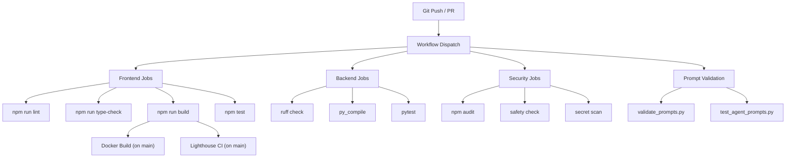

# Continuous Integration

## Document Control

| Field | Value |
|---|---|
| Document ID | DVO-CI-011 |
| Version | 1.0.0 |
| Status | Active |
| Date | 2026-07-10 |
| Classification | Internal |
| Owner | Developer |

---

## Table of Contents

1. [Executive Summary](#1-executive-summary)
2. [CI Philosophy](#2-ci-philosophy)
3. [Pipeline Architecture](#3-pipeline-architecture)
4. [Frontend CI Jobs](#4-frontend-ci-jobs)
5. [Backend CI Jobs](#5-backend-ci-jobs)
6. [Security CI Jobs](#6-security-ci-jobs)
7. [Prompt Validation CI](#7-prompt-validation-ci)
8. [Docker CI Jobs](#8-docker-ci-jobs)
9. [Lighthouse CI](#9-lighthouse-ci)
10. [Trigger Matrix](#10-trigger-matrix)
11. [Caching Strategy](#11-caching-strategy)
12. [Performance Targets](#12-performance-targets)
13. [Failure Handling](#13-failure-handling)
14. [Local CI Simulation](#14-local-ci-simulation)
15. [Testing Strategy](#15-testing-strategy)
16. [Edge Cases](#16-edge-cases)
17. [References](#17-references)

---

## 1. Executive Summary

The CI pipeline automates code quality verification for every push and pull request. It runs linting, type checking, security audits, prompt validation, and test suites across all components. The pipeline cancels in-progress runs for the same branch and gates all merges to `main` and `develop`.

---

## 2. CI Philosophy

- **Fail fast**: Quick checks (lint, type-check) run before slow ones (tests, build)
- **Shift left**: Catch issues as early as possible
- **Deterministic**: Same code always produces same CI result
- **Cache-aware**: Dependencies cached to minimize build time
- **Concurrent**: Independent jobs run in parallel

---

## 3. Pipeline Architecture



---

## 4. Frontend CI Jobs

| Job | Command | Failure | Cache | Timeout |
|---|---|---|---|---|
| Lint | `cd apps/web && npm run lint` | Blocking | node_modules | 5 min |
| Type-check | `cd apps/web && npm run type-check` | Blocking | node_modules | 5 min |
| Build | `cd apps/web && npm run build` | Blocking | .next/cache | 10 min |
| Test | `cd apps/web && npm test -- --coverage` | Blocking | node_modules | 10 min |

---

## 5. Backend CI Jobs

| Job | Command | Failure | Cache | Timeout |
|---|---|---|---|---|
| Ruff Lint | `ruff check apps/ packages/ services/ scripts/` | Blocking | pip | 3 min |
| Black Check | `black --check apps/ packages/ services/ tests/ scripts/` | Non-blocking | pip | 2 min |
| Compile | `python -m py_compile apps/api/main.py` | Blocking | pip | 1 min |
| Pytest | `pytest tests/ -v --cov=packages --cov=apps/api --cov-fail-under=85` | Blocking | pip | 15 min |

---

## 6. Security CI Jobs

| Job | Tool | Command | Blocking |
|---|---|---|---|
| npm audit | npm | `cd apps/web && npm audit --audit-level=high` | Yes |
| Safety check | safety | `safety check -r apps/api/requirements.txt` | Yes |
| Secret scan | truffleHog | `trufflehog git file://. --since-last-commit` | Warning |
| Trivy scan | Trivy | `trivy fs . --severity HIGH,CRITICAL` | Advisory |

---

## 7. Prompt Validation CI

```bash
# Validate YAML frontmatter on all prompt files
python scripts/validate_prompts.py

# Run prompt-specific tests
pytest tests/test_prompt_loader.py tests/test_agent_prompts.py -v
```

---

## 8. Docker CI Jobs

On push to `main`, Docker images are built and pushed to GitHub Container Registry:

```yaml
docker-build:
  runs-on: ubuntu-latest
  steps:
    - uses: actions/checkout@v4
    - uses: docker/setup-buildx-action@v3
    - uses: docker/login-action@v3
      with:
        registry: ghcr.io
        username: ${{ github.actor }}
        password: ${{ secrets.GITHUB_TOKEN }}
    - run: docker compose -f docker-compose.prod.yml build
    - run: docker compose -f docker-compose.prod.yml push
```

---

## 9. Lighthouse CI

Runs on every push to `main`:

| Metric | Target |
|---|---|
| Performance | ≥ 90 |
| Accessibility | ≥ 90 |
| Best Practices | ≥ 90 |
| SEO | ≥ 90 |

---

## 10. Trigger Matrix

| Event | Branches | Jobs | Concurrency |
|---|---|---|---|
| `pull_request` | `main`, `develop` | FE lint+type-check+test, BE lint+test, security, prompts | Cancel in-progress |
| `push` | `develop` | All CI + auto-deploy staging | Serial |
| `push` | `main` | All CI + auto-deploy production + Docker + Lighthouse | Serial |
| `push` | `hotfix/*` | All CI (highest priority) | Cancel in-progress |
| `schedule` (weekly) | `main` | Full security scan | — |

---

## 11. Caching Strategy

```yaml
- name: Cache npm
  uses: actions/cache@v4
  with:
    path: apps/web/node_modules
    key: npm-${{ hashFiles('apps/web/package-lock.json') }}
    restore-keys: npm-

- name: Cache pip
  uses: actions/cache@v4
  with:
    path: ~/.cache/pip
    key: pip-${{ hashFiles('apps/api/requirements.txt') }}
    restore-keys: pip-
```

---

## 12. Performance Targets

| Metric | Target | Current |
|---|---|---|
| FE CI duration | < 3 min | ~3 min 12s |
| BE CI duration | < 2 min | ~1 min 45s |
| Full CI suite | < 5 min | ~5 min 30s |
| CI pass rate | > 98% | 94% |
| Cache hit rate | > 80% | ~70% |

---

## 13. Failure Handling

| Scenario | Action |
|---|---|
| Lint error | Block PR merge, comment on PR |
| Test failure | Block PR merge, upload failure report |
| Security vuln (high+) | Block PR merge, notify developer |
| Secret detected | Block PR merge, alert security |
| Cache miss | Rebuild dependencies (slower but functional) |
| Runner timeout | Restart job automatically |

---

## 14. Local CI Simulation

```bash
# Simulate the full CI pipeline locally
make pre-commit

# Or manually:
ruff check apps/ packages/ services/ scripts/
black --check apps/ packages/ services/ tests/ scripts/
python scripts/validate_prompts.py
pytest tests/ --cov=packages --cov=apps/api --cov-fail-under=85
```

---

## 15. Testing Strategy

| Layer | Run In CI | Coverage Target |
|---|---|---|
| Unit tests | Every push | > 85% |
| API tests | Every push | > 80% |
| Prompt tests | Every push | 100% of prompts |
| Integration | Staging deploy | Critical paths |
| E2E (Playwright) | Main push | 21 spec files |

---

## 16. Edge Cases

- Empty commit (docs only) → Skip CI via `[skip ci]` in commit message
- Race condition on cache restore → Fall back to clean install
- Network timeout on dependency install → Retry with `--prefer-offline`
- Concurrent PRs → Each runs independently, cancel-in-progress per branch
- Large test matrix → Split into parallel jobs by test category

---

## 17. References

| Resource | Location |
|---|---|
| CI Workflow | `.github/workflows/ci.yml` |
| Deployment Docs | `docs/devops/26_Deployment.md` |
| DevOps Practices | `docs/devops/27_DevOps.md` |
| CD Pipeline | `docs/devops/CD.md` |
| GitHub Actions | `docs/devops/GitHubActions.md` |
