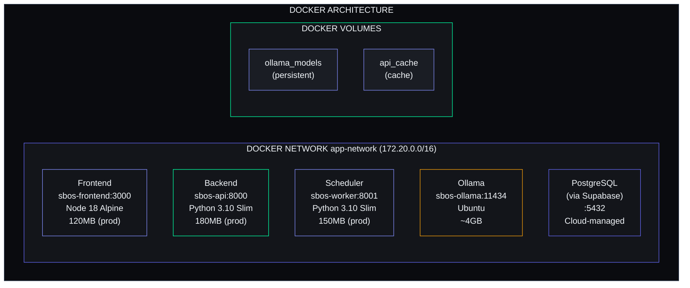
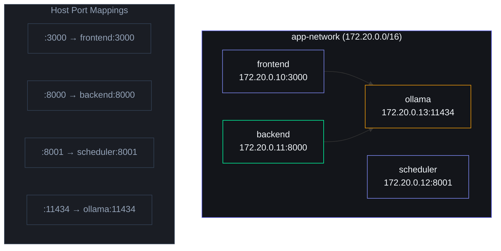

# Docker Configuration

> **Document ID**: SB-DOCKER-001  
> **Version**: 1.0.0  
> **Status**: Active  
> **Last Updated**: 2026-06-11  
> **Classification**: Internal — Engineering Reference  
> **Target Audience**: DevOps Engineers, Backend Developers, Infrastructure Team

---

## Table of Contents

1. [Docker Architecture Overview](#1-docker-architecture-overview)
2. [Dockerfile Analysis](#2-dockerfile-analysis)
3. [Docker Compose Setup](#3-docker-compose-setup)
4. [Image Optimization](#4-image-optimization)
5. [Docker Networking](#5-docker-networking)
6. [Volume Mounts](#6-volume-mounts)
7. [Docker Compose Profiles](#7-docker-compose-profiles)
8. [Container Health Checks](#8-container-health-checks)
9. [Resource Limits](#9-resource-limits)
10. [Docker Registry](#10-docker-registry)
11. [CI Integration](#11-ci-integration)
12. [Local Development vs Production Differences](#12-local-development-vs-production-differences)
13. [Docker Security](#13-docker-security)

---

## 1. Docker Architecture Overview

### 1.1 Container Topology



### 1.2 Container Design Principles

| Principle | Rationale | Implementation |
|---|---|---|
| Immutable images | No runtime patching | Multi-stage builds, pinned bases |
| Single responsibility | One process per container | Separate images per service |
| Smallest possible image | Reduce attack surface, faster deploys | Alpine/Slim bases, multi-stage |
| Stateless containers | Easy scaling, replacement | State in Supabase, volumes for Ollama |
| Health-checked | Automatic recovery | Healthcheck directives everywhere |
| Least privilege | Security best practice | Non-root user, dropped capabilities |

---

## 2. Dockerfile Analysis

### 2.1 Frontend Dockerfile (Next.js)

```dockerfile
# apps/web/Dockerfile — Multi-stage build for Next.js

# Stage 1: Dependencies
FROM node:18-alpine AS deps
RUN apk add --no-cache libc6-compat
WORKDIR /app
COPY package.json package-lock.json ./
RUN npm ci --only=production

# Stage 2: Builder
FROM node:18-alpine AS builder
WORKDIR /app
COPY --from=deps /app/node_modules ./node_modules
COPY . .
ENV NEXT_TELEMETRY_DISABLED 1
ENV NODE_ENV production
RUN npm run build

# Stage 3: Production Runner
FROM node:18-alpine AS runner
RUN addgroup --system --gid 1001 nodejs && adduser --system --uid 1001 nextjs
WORKDIR /app
COPY --from=builder /app/public ./public
COPY --from=builder /app/.next/standalone ./
COPY --from=builder /app/.next/static ./.next/static
RUN chown -R nextjs:nodejs .next
USER nextjs
EXPOSE 3000
ENV PORT 3000
ENV HOSTNAME "0.0.0.0"
HEALTHCHECK --interval=30s --timeout=5s --start-period=10s --retries=3 \
  CMD wget --no-verbose --tries=1 --spider http://localhost:3000 || exit 1
CMD ["node", "server.js"]
```

**Build Stage Analysis:**

| Stage | Base Image | Size | Contents |
|---|---|---|---|
| `deps` | `node:18-alpine` | ~180MB | `node_modules` (production only) |
| `builder` | `node:18-alpine` | ~350MB | Full context + build artifacts |
| `runner` | `node:18-alpine` | **~120MB** | Standalone Next.js + static assets |

### 2.2 Backend Dockerfile (FastAPI)

```dockerfile
# apps/api/Dockerfile — Multi-stage build for FastAPI

# Stage 1: Builder
FROM python:3.10-slim AS builder
WORKDIR /app
RUN apt-get update && apt-get install -y --no-install-recommends gcc build-essential \
    && rm -rf /var/lib/apt/lists/*
COPY requirements.txt .
RUN pip install --user --no-cache-dir -r requirements.txt

# Stage 2: Production Runner
FROM python:3.10-slim AS runner
RUN addgroup --system --gid 1001 appgroup && adduser --system --uid 1001 appuser
WORKDIR /app
COPY --from=builder /root/.local /root/.local
COPY main.py app/ config/ database/ shared/ ./
ENV PATH=/root/.local/bin:$PATH
ENV PYTHONPATH=/app
USER appuser
EXPOSE 8000
HEALTHCHECK --interval=30s --timeout=10s --start-period=15s --retries=3 \
  CMD python -c "import urllib.request; urllib.request.urlopen('http://localhost:8000/health')" || exit 1
CMD ["gunicorn", "main:app", "--worker-class", "uvicorn.workers.UvicornWorker", \
     "--workers", "4", "--bind", "0.0.0.0:8000", "--timeout", "120", \
     "--keep-alive", "5", "--max-requests", "1000", "--max-requests-jitter", "50"]
```

| Stage | Base Image | Size | Contents |
|---|---|---|---|
| `builder` | `python:3.10-slim` | ~350MB | Build deps + Python packages |
| `runner` | `python:3.10-slim` | **~180MB** | Runtime + app code only |

### 2.3 Scheduler Dockerfile (APScheduler)

```dockerfile
# services/scheduler/Dockerfile — Single-stage build

FROM python:3.10-slim
RUN addgroup --system --gid 1001 appgroup && adduser --system --uid 1001 appuser
WORKDIR /app
COPY services/scheduler/requirements.txt .
RUN pip install --no-cache-dir -r requirements.txt
COPY services/scheduler/main.py .
USER appuser
EXPOSE 8001
HEALTHCHECK --interval=60s --timeout=10s --start-period=30s --retries=3 \
  CMD python -c "import urllib.request; urllib.request.urlopen('http://localhost:8001/health')" || exit 1
CMD ["python", "main.py"]
```

**Size:** ~150MB

### 2.4 Dockerfile Best Practices Applied

| Practice | Implementation |
|---|---|
| Multi-stage builds | Frontend: 3 stages; Backend: 2 stages |
| Minimal base images | Alpine (frontend), Slim (backend) — 5x smaller than full images |
| Non-root user | All containers run as non-root (uid 1001) |
| Layer caching | Dependencies copied before code for cache optimization |
| Health checks | Every container has interval-based health probes |
| `.dockerignore` | Excludes node_modules, .git, __pycache__, .env |
| Explicit EXPOSE | Only required ports exposed |
| Production-only deps | `npm ci --only=production` for frontend |

---

## 3. Docker Compose Setup

### 3.1 Complete docker-compose.yml

```yaml
version: "3.9"

services:
  frontend:
    build:
      context: ./apps/web
      dockerfile: Dockerfile
      target: runner
      args:
        - NEXT_TELEMETRY_DISABLED=1
    container_name: sbos-frontend
    restart: unless-stopped
    ports:
      - "3000:3000"
    environment:
      - NODE_ENV=production
      - NEXT_TELEMETRY_DISABLED=1
      - NEXT_PUBLIC_SUPABASE_URL=${NEXT_PUBLIC_SUPABASE_URL}
      - NEXT_PUBLIC_SUPABASE_ANON_KEY=${NEXT_PUBLIC_SUPABASE_ANON_KEY}
      - NEXT_PUBLIC_API_URL=${NEXT_PUBLIC_API_URL:-http://backend:8000}
    depends_on:
      backend:
        condition: service_healthy
    networks:
      - app-network
    healthcheck:
      test: ["CMD", "wget", "--no-verbose", "--tries=1", "--spider", "http://localhost:3000"]
      interval: 30s
      timeout: 5s
      retries: 3
      start_period: 10s
    deploy:
      resources:
        limits:
          cpus: "1.0"
          memory: "512M"
        reservations:
          cpus: "0.25"
          memory: "128M"

  backend:
    build:
      context: ./apps/api
      dockerfile: Dockerfile
      target: runner
    container_name: sbos-api
    restart: unless-stopped
    ports:
      - "8000:8000"
    environment:
      - SUPABASE_URL=${SUPABASE_URL}
      - SUPABASE_KEY=${SUPABASE_KEY}
      - SUPABASE_SERVICE_KEY=${SUPABASE_SERVICE_KEY}
      - JWT_SECRET=${JWT_SECRET}
      - JWT_ALGORITHM=${JWT_ALGORITHM:-HS256}
      - CLAUDE_API_KEY=${CLAUDE_API_KEY}
      - OLLAMA_BASE_URL=${OLLAMA_BASE_URL:-http://ollama:11434}
      - USE_LOCAL_AI=${USE_LOCAL_AI:-True}
      - RESEND_API_KEY=${RESEND_API_KEY}
      - APP_NAME=${APP_NAME:-"Second Brain OS"}
      - DEBUG=${DEBUG:-False}
      - CORS_ORIGINS=${CORS_ORIGINS:-http://localhost:3000}
      - PYTHONPATH=/app
      - TZ=UTC
    volumes:
      - api_cache:/app/cache
    depends_on:
      ollama:
        condition: service_started
    networks:
      - app-network
    healthcheck:
      test: ["CMD", "python", "-c", "import urllib.request; urllib.request.urlopen('http://localhost:8000/health')"]
      interval: 30s
      timeout: 10s
      retries: 3
      start_period: 15s
    deploy:
      resources:
        limits:
          cpus: "1.0"
          memory: "512M"
        reservations:
          cpus: "0.25"
          memory: "256M"

  scheduler:
    build:
      context: .
      dockerfile: services/scheduler/Dockerfile
    container_name: sbos-worker
    restart: unless-stopped
    ports:
      - "8001:8001"
    environment:
      - SUPABASE_URL=${SUPABASE_URL}
      - SUPABASE_KEY=${SUPABASE_KEY}
      - SUPABASE_SERVICE_KEY=${SUPABASE_SERVICE_KEY}
      - JWT_SECRET=${JWT_SECRET}
      - JWT_ALGORITHM=${JWT_ALGORITHM:-HS256}
      - CLAUDE_API_KEY=${CLAUDE_API_KEY}
      - OLLAMA_BASE_URL=${OLLAMA_BASE_URL:-http://ollama:11434}
      - USE_LOCAL_AI=${USE_LOCAL_AI:-True}
      - APP_NAME=${APP_NAME:-"Second Brain OS (Scheduler)"}
      - DEBUG=${DEBUG:-False}
      - PYTHONPATH=/app
      - TZ=UTC
    depends_on:
      backend:
        condition: service_healthy
    networks:
      - app-network
    healthcheck:
      test: ["CMD", "python", "-c", "import urllib.request; urllib.request.urlopen('http://localhost:8001/health')"]
      interval: 60s
      timeout: 10s
      retries: 3
      start_period: 30s
    deploy:
      resources:
        limits:
          cpus: "0.5"
          memory: "256M"
        reservations:
          cpus: "0.1"
          memory: "128M"

  ollama:
    image: ollama/ollama:latest
    container_name: sbos-ollama
    restart: unless-stopped
    ports:
      - "11434:11434"
    volumes:
      - ollama_models:/root/.ollama
    environment:
      - OLLAMA_HOST=0.0.0.0
      - OLLAMA_KEEP_ALIVE=24h
      - OLLAMA_NUM_PARALLEL=1
      - OLLAMA_MAX_LOADED_MODELS=1
    networks:
      - app-network
    healthcheck:
      test: ["CMD", "ollama", "list"]
      interval: 60s
      timeout: 10s
      retries: 3
      start_period: 120s
    deploy:
      resources:
        reservations:
          cpus: "2.0"
          memory: "4G"
        limits:
          cpus: "4.0"
          memory: "8G"

volumes:
  ollama_models:
    name: sbos_ollama_models
    driver: local
  api_cache:
    name: sbos_api_cache
    driver: local

networks:
  app-network:
    name: sbos_app_network
    driver: bridge
    ipam:
      config:
        - subnet: 172.20.0.0/16
          gateway: 172.20.0.1
```

### 3.2 Service Dependency Graph

```mermaid
flowchart LR
    Frontend["Frontend"] -->|depends_on (healthy)| Backend["Backend"]
    Backend -->|depends_on| Ollama["Ollama (started)"]
    Backend -->|depends_on| Scheduler["Scheduler (healthy)"]

    style Frontend fill:#13151A,stroke:#818CF8,color:#F1F5F9
    style Backend fill:#13151A,stroke:#00FFA3,color:#F1F5F9
    style Ollama fill:#13151A,stroke:#F59E0B,color:#F1F5F9
    style Scheduler fill:#13151A,stroke:#818CF8,color:#F1F5F9
```

---

## 4. Image Optimization

### 4.1 Image Size Budgets

| Service | Current Size | Budget | Status | Techniques |
|---|---|---|---|---|
| Frontend (runner) | ~120MB | <150MB | ✅ | Alpine, standalone output, multi-stage |
| Backend (runner) | ~180MB | <200MB | ✅ | Slim base, user install, dep pruning |
| Scheduler | ~150MB | <200MB | ✅ | Slim base, minimal deps |
| Ollama | ~4GB | <5GB | ⚠️ | Quantized model |

**Total stack (excluding Ollama):** ~450MB

### 4.2 Layer Caching Strategy

```dockerfile
# Optimal layer ordering for BuildKit caching:
# 1. Infrequently changing files (cached long-term)
COPY package.json package-lock.json ./

# 2. Install deps (cached if lock files unchanged)
RUN npm ci --only=production

# 3. Source code (changes most frequently)
COPY . .

# 4. Build (invalidated only when source changes)
RUN npm run build
```

### 4.3 .dockerignore Files

**Frontend `.dockerignore`:**
```
node_modules
.next
.git
.gitignore
*.md
.env
.env.local
.env.*.local
Dockerfile
.dockerignore
coverage
__pycache__
*.pyc
.next/cache
```

**Backend `.dockerignore`:**
```
__pycache__
*.pyc
*.pyo
.git
.gitignore
*.md
.env
.env.*
venv
.venv
*.egg-info
dist
build
.coverage
htmlcov
.pytest_cache
.mypy_cache
.ruff_cache
```

### 4.4 Optimization Savings

| Technique | Layer Savings | Total Savings | Effort |
|---|---|---|---|
| Alpine base (vs Debian) | — | ~800MB | Low |
| Multi-stage builds | ~200MB | ~200MB | Medium |
| `npm ci --only=production` | ~50MB | ~50MB | Low |
| `pip install --user` | ~30MB | ~30MB | Low |
| `.dockerignore` | ~100MB+ | ~100MB+ | Low |
| `--no-cache-dir` for pip | ~50MB | ~50MB | Low |

**Total savings vs naive Dockerfile:** ~1.2GB per deployment

---

## 5. Docker Networking

### 5.1 Network Topology



### 5.2 Internal DNS Resolution

Containers resolve each other by service name within the network:

```
frontend  → http://backend:8000     (API calls)
scheduler → http://backend:8000     (health check, job results)
backend   → http://ollama:11434     (AI inference)
```

### 5.3 Port Exposure Summary

| Service | Internal | External | Protocol | Purpose |
|---|---|---|---|---|
| Frontend | 3000 | 3000 | HTTP | Dev access / Railway proxy |
| Backend | 8000 | 8000 | HTTP | API / Railway proxy |
| Scheduler | 8001 | 8001 | HTTP | Health metrics |
| Ollama | 11434 | 11434 | HTTP | AI API |

**Production:** No ports exposed directly (Vercel/Railway handle ingress)

### 5.4 Network Security

```yaml
networks:
  app-network:
    driver: bridge
    internal: false  # Allow outbound to Supabase/Anthropic

services:
  ollama:
    ports:
      - "127.0.0.1:11434:11434"  # Localhost-only in dev
```

---

## 6. Volume Mounts

### 6.1 Volume Definitions

| Volume Name | Service | Mount Path | Type | Size | Persistence |
|---|---|---|---|---|---|
| `ollama_models` | ollama | `/root/.ollama` | Named | ~4GB | Persistent |
| `api_cache` | backend | `/app/cache` | Named | ~50MB | Semi-persistent |
| `./apps/api` | backend | `/app` | Bind | Project | Dev only |

### 6.2 Named Volume Config

```yaml
volumes:
  ollama_models:
    name: sbos_ollama_models
    driver: local
    driver_opts:
      type: none
      device: ${OLLAMA_DATA_DIR:-./data/ollama}
      o: bind
  api_cache:
    name: sbos_api_cache
    driver: local
```

### 6.3 Hot-Reload Configuration

```yaml
# docker-compose.override.yml
services:
  backend:
    volumes:
      - ./apps/api:/app  # Bind mount for hot-reload
    command: uvicorn main:app --reload --host 0.0.0.0 --port 8000

  frontend:
    volumes:
      - ./apps/web:/app
      - /app/node_modules  # Prevent host node_modules override
      - /app/.next
    command: npm run dev
```

### 6.4 Volume Cleanup

```bash
# Remove all volumes
docker compose down -v

# Remove specific volume
docker volume rm sbos_ollama_models

# Prune unused volumes
docker volume prune -f

# Check volume sizes
docker system df -v | grep sbos
```

---

## 7. Docker Compose Profiles

### 7.1 Profile Definitions

| Profile | Services | Use Case | Command |
|---|---|---|---|
| `dev` | frontend + backend + scheduler + ollama | Full local development | `docker compose --profile dev up` |
| `prod` | frontend + backend + scheduler | Production-like (no Ollama) | `docker compose --profile prod up` |
| `ai` | frontend + backend + scheduler + ollama | Development with AI | `docker compose --profile ai up` |
| `minimal` | backend only | Backend-only development | `docker compose --profile minimal up` |

### 7.2 Profile Implementation

```yaml
services:
  frontend:
    profiles: ["dev", "prod", "ai"]
  backend:
    profiles: ["dev", "prod", "ai", "minimal"]
  scheduler:
    profiles: ["dev", "prod", "ai"]
  ollama:
    profiles: ["dev", "ai"]  # Only when AI is needed
```

### 7.3 Profile Overrides

```yaml
# docker-compose.override.yml
services:
  backend:
    profiles: ["dev", "ai"]
    environment:
      - DEBUG=True
      - USE_LOCAL_AI=True
    volumes:
      - ./apps/api:/app

  frontend:
    profiles: ["dev", "ai"]
    environment:
      - NODE_ENV=development
    volumes:
      - ./apps/web:/app
      - /app/node_modules
      - /app/.next
    command: npm run dev
```

### 7.4 Usage Examples

```bash
# Full development stack
docker compose --profile dev up -d

# Production stack (no local AI)
docker compose --profile prod up -d

# Backend only (API development)
docker compose --profile minimal up -d

# AI testing
docker compose --profile ai up -d --scale backend=2
```

---

## 8. Container Health Checks

### 8.1 Health Check Configuration

| Service | Test Command | Interval | Timeout | Retries | Start Period |
|---|---|---|---|---|---|
| Frontend | `wget --spider :3000` | 30s | 5s | 3 | 10s |
| Backend | `python HTTP :8000/health` | 30s | 10s | 3 | 15s |
| Scheduler | `python HTTP :8001/health` | 60s | 10s | 3 | 30s |
| Ollama | `ollama list` | 60s | 10s | 3 | 120s |

### 8.2 Health Check Response

```json
// GET /health → Backend
{
  "status": "healthy",
  "version": "2.1.0",
  "uptime": 3600.5,
  "database": { "connected": true, "latency_ms": 12 },
  "ai_available": { "ollama": true, "claude": true },
  "memory_usage": { "rss_mb": 245, "percent": 48 }
}

// GET /health → Scheduler
{
  "status": "healthy",
  "jobs_running": 6,
  "last_execution": {
    "job": "daily_briefing",
    "time": "2026-06-11T07:00:00Z",
    "duration_ms": 28500,
    "success": true
  }
}
```

### 8.3 Troubleshooting

```bash
# Check health status
docker compose ps
docker inspect --format='{{json .State.Health}}' sbos-api

# View health check logs
docker logs sbos-api

# Common failures:
# - start_period too short → increase
# - timeout too short for slow ops → increase
# - network dependency not ready → add depends_on condition
```

---

## 9. Resource Limits

### 9.1 Resource Allocation

| Service | CPU Limit | CPU Reservation | Memory Limit | Memory Reservation | OOM Score |
|---|---|---|---|---|---|
| Frontend | 1.0 vCPU | 0.25 vCPU | 512MB | 128MB | -100 (low) |
| Backend | 1.0 vCPU | 0.25 vCPU | 512MB | 256MB | -500 (low) |
| Scheduler | 0.5 vCPU | 0.1 vCPU | 256MB | 128MB | 0 (default) |
| Ollama | 4.0 vCPU | 2.0 vCPU | 8GB | 4GB | 500 (high) |

### 9.2 Limit Justification

| Service | Rationale |
|---|---|
| Backend 512MB | Python + FastAPI uses 150–300MB. 512MB allows for AI request spikes |
| Frontend 512MB | Next.js SSR with 4 concurrent requests |
| Scheduler 256MB | Minimal process, short-lived jobs |
| Ollama 8GB | Mistral 7B needs ~4GB base; 8GB for context processing |

### 9.3 Monitoring

```bash
# Live resource usage
docker stats

# Container resource config
docker inspect sbos-api | jq '.[0].HostConfig.Memory'

# Alert thresholds:
# - Memory > 80% for 5min → Review allocation
# - CPU > 90% for 5min → Scale up
# - OOM kills → Increase memory immediately
```

---

## 10. Docker Registry

### 10.1 Registry Comparison

| Registry | Private Repos | Pull Limit | CI Integration | Cost |
|---|---|---|---|---|
| **Docker Hub** | 1 (free) | 100 pulls/6h | Native | $0 |
| **GitHub Container (ghcr.io)** | Unlimited | 5,000 pulls/24h | Native | $0 |
| **Amazon ECR** | Unlimited | None | Via AWS CLI | Storage only |
| **Railway Registry** | 1 per project | None | Native | Included |

**Decision:** Docker Hub for public, ghcr.io for private CI images.

### 10.2 CI Build & Push

```yaml
# Docker CI job snippet
- name: Build and push Backend
  uses: docker/build-push-action@v5
  with:
    context: ./apps/api
    file: ./apps/api/Dockerfile
    target: runner
    push: true
    tags: |
      ghcr.io/${{ github.repository }}/backend:latest
      ghcr.io/${{ github.repository }}/backend:${{ github.sha }}
    cache-from: type=gha
    cache-to: type=gha,mode=max
```

### 10.3 Image Tagging Convention

| Tag | Semantics | Example |
|---|---|---|
| `latest` | Latest stable from main | `frontend:latest` |
| `{sha}` | Specific commit | `backend:a1b2c3d4` |
| `v{major}.{minor}.{patch}` | Release | `backend:v2.1.0` |
| `pr-{number}` | PR build | `frontend:pr-42` |
| `{branch-name}` | Branch build | `backend:feat-new-api` |

### 10.4 Cleanup Policy

| Policy | Retention | Method |
|---|---|---|
| Untagged images | Delete after 7 days | GHCR auto-cleanup |
| PR images | Delete after merge | CI cleanup job |
| Old tags (>30d) | Keep last 10 | Scheduled workflow |
| `latest` tag | Keep last 5 | Manual review |

---

## 11. CI Integration

### 11.1 GitHub Actions Pipeline

```yaml
jobs:
  docker:
    runs-on: ubuntu-latest
    steps:
      - uses: actions/checkout@v4

      - name: Build images
        run: docker compose build --parallel

      - name: Start services
        run: |
          docker compose up -d
          sleep 15
          curl -f http://localhost:8000/health
          curl -f http://localhost:8001/health

      - name: Integration tests
        run: docker compose exec backend pytest tests/ -x

      - name: Vulnerability scan
        uses: aquasecurity/trivy-action@master
        with:
          image-ref: 'ghcr.io/${{ github.repository }}/backend:latest'
          severity: 'HIGH,CRITICAL'
          exit-code: '1'
```

### 11.2 Railway Deployment

Railway auto-detects Dockerfiles and deploys directly:

```bash
# Railway reads Dockerfile from service root,
# builds via Docker Buildpacks, and deploys.

# Local test of Railway deploy:
docker build -t sbos-api -f apps/api/Dockerfile apps/api/
docker run -p 8000:8000 --env-file .env.production sbos-api
```

### 11.3 Vercel Note

Vercel does NOT use Docker for frontend. Next.js is built with `next build` and deployed as serverless functions / static files. Dockerfile in `apps/web/` is used for containerized testing only.

---

## 12. Local Development vs Production Differences

### 12.1 Configuration Comparison

| Aspect | Local Development | Production |
|---|---|---|
| Frontend Command | `npm run dev` (hot-reload) | `node server.js` (standalone) |
| Backend Command | `uvicorn --reload` | `gunicorn` (4 workers) |
| Code Mount | Bind mount (hot-reload) | Static in image |
| Environment | `.env` file | Railway env vars |
| Debug | `DEBUG=True` | `DEBUG=False` |
| Ollama | In Compose | Cloud or dev machine |
| Ports | Host-mapped | No direct exposure |
| Logging | Verbose, stdout | Structured JSON |
| SSL | None (HTTP) | Via Railway (HTTPS) |

### 12.2 Compose Override Structure

```yaml
# docker-compose.override.yml (dev, auto-applied)
services:
  frontend:
    build:
      target: deps  # Faster rebuilds
    environment:
      - NODE_ENV=development
    volumes:
      - ./apps/web:/app
      - /app/node_modules
      - /app/.next
    command: npm run dev

  backend:
    environment:
      - DEBUG=True
      - USE_LOCAL_AI=True
    volumes:
      - ./apps/api:/app
    command: uvicorn main:app --reload --host 0.0.0.0 --port 8000
```

```yaml
# docker-compose.prod.yml (production-like)
services:
  frontend:
    build:
      target: runner
    environment:
      - NODE_ENV=production
    command: node server.js

  backend:
    build:
      target: runner
    environment:
      - DEBUG=False
      - USE_LOCAL_AI=False
```

### 12.3 Startup Times

| Service | Dev Cold | Dev Warm | Prod Cold | Prod Warm |
|---|---|---|---|---|
| Frontend | ~45s (build) | ~3s | ~20s (build) | ~1s |
| Backend | ~5s | ~1s | ~8s | ~2s |
| Scheduler | ~3s | ~1s | ~5s | ~2s |
| Ollama | ~60s (model load) | ~5s | ~60s | ~5s |

---

## 13. Docker Security

### 13.1 Security Posture

| Practice | Implementation | Status |
|---|---|---|
| Non-root user | `USER nextjs` / `USER appuser` | ✅ |
| Minimal base images | Alpine (frontend), Slim (backend) | ✅ |
| Drop capabilities | `cap_drop: ALL` | ✅ |
| No privilege escalation | `no-new-privileges:true` | ✅ |
| Read-only root FS | `read_only: true` | ✅ |
| Secret management | Runtime env vars, not baked in | ✅ |
| Vulnerability scanning | Trivy in CI | ✅ |
| Package pinning | Lock files with specific versions | ✅ |

### 13.2 Security-Hardened Compose

```yaml
services:
  backend:
    security_opt:
      - no-new-privileges:true
    cap_drop:
      - ALL
    cap_add: []
    read_only: true
    tmpfs:
      - /tmp:size=64M
      - /app/cache:size=50M

  frontend:
    security_opt:
      - no-new-privileges:true
    cap_drop:
      - ALL
    cap_add:
      - NET_BIND_SERVICE
    read_only: true
    tmpfs:
      - /tmp:size=32M
```

### 13.3 Vulnerability Scanning

```bash
# Install Trivy
winget install aquasecurity.Trivy  # Windows
brew install trivy                   # macOS

# Scan image
trivy image sbos-api:latest
trivy image --severity HIGH,CRITICAL sbos-api:latest
trivy config ./apps/api/Dockerfile

# CI: fail on CRITICAL
trivy image --exit-code 1 --severity CRITICAL sbos-api:latest
```

### 13.4 Secrets Management Rules

```
❌ NEVER bake secrets into images:
   ENV SUPABASE_KEY=hardcoded-value  # WRONG!

✅ Always use runtime environment variables:
   environment:
     - SUPABASE_KEY=${SUPABASE_KEY}
```

### 13.5 Docker Bench Security

```bash
# Run security assessment
docker run --rm --net host --pid host \
  -v /var/run/docker.sock:/var/run/docker.sock \
  docker/docker-bench-security

# Targets: Host 85%+, Daemon 90%+, Images 95%+, Runtime 90%+
```

---

## Appendix A: Quick Reference

```bash
# Build all images
docker compose build --parallel

# Start services
docker compose --profile dev up -d

# View logs
docker compose logs -f backend

# Execute command in container
docker compose exec backend pytest tests/ -x

# Check health
docker compose ps

# Clean everything
docker compose down -v
docker system prune -a
```

## Appendix B: Dockerfile Comparison

| Directive | Frontend | Backend | Scheduler |
|---|---|---|---|
| Base Image | `node:18-alpine` | `python:3.10-slim` | `python:3.10-slim` |
| Stages | 3 | 2 | 1 |
| User | `nextjs` (uid 1001) | `appuser` (uid 1001) | `appuser` (uid 1001) |
| Port | 3000 | 8000 | 8001 |
| Entrypoint | `node server.js` | `gunicorn` | `python main.py` |

## Appendix C: Environment Variables

```env
# .env for docker-compose
SUPABASE_URL=https://your-project.supabase.co
SUPABASE_KEY=fake-jwt-token-string-for-testingInR5cCI6IkpXVCJ9...
SUPABASE_SERVICE_KEY=fake-jwt-token-string-for-testingInR5cCI6IkpXVCJ9...
JWT_SECRET=your-jwt-secret-here
JWT_ALGORITHM=HS256
CLAUDE_API_KEY=sk-ant-...
OLLAMA_BASE_URL=http://ollama:11434
USE_LOCAL_AI=True
CORS_ORIGINS=http://localhost:3000
RESEND_API_KEY=re_...
```

---

## Revision History

| Version | Date | Author | Changes |
|---|---|---|---|
| 1.0.0 | 2026-06-11 | Developer | Initial Docker documentation |
