# Infrastructure Architecture

> **Document ID**: DVO-INF-001  
> **Version**: 1.0.0  
> **Status**: Active  
> **Last Updated**: 2026-06-11  
> **Classification**: Internal — Engineering Reference  
> **Target Audience**: DevOps Engineers, Backend Developers, SRE Team

---

## Table of Contents

1. [Infrastructure Overview](#1-infrastructure-overview)
2. [Cloud Providers](#2-cloud-providers)
3. [Compute Architecture](#3-compute-architecture)
4. [Network Architecture](#4-network-architecture)
5. [Database Layer](#5-database-layer)
6. [AI Infrastructure](#6-ai-infrastructure)
7. [Storage Architecture](#7-storage-architecture)
8. [Caching Layer](#8-caching-layer)
9. [Monitoring Infrastructure](#9-monitoring-infrastructure)
10. [Disaster Recovery Infrastructure](#10-disaster-recovery-infrastructure)
11. [Cost Breakdown Per Component](#11-cost-breakdown-per-component)
12. [Scaling Triggers and Thresholds](#12-scaling-triggers-and-thresholds)
13. [Infrastructure as Code Roadmap](#13-infrastructure-as-code-roadmap)
14. [Diagram Links and References](#14-diagram-links-and-references)

---



```mermaid
%%{init: {'theme':'base','themeVariables':{'primaryColor':'#6366F1','primaryTextColor':'#F1F5F9','primaryBorderColor':'#6366F1','lineColor':'#818CF8','secondaryColor':'#13151A','tertiaryColor':'#0A0B0F','background':'#0A0B0F','mainBkg':'#13151A','nodeBorder':'#334155','clusterBkg':'#0A0B0F','clusterBorder':'#1E293B','titleColor':'#F1F5F9','edgeLabelBackground':'#13151A','nodeTextColor':'#F1F5F9'}}}%%
graph TD
    User["👤 User (Browser)"] --> DNS["🌐 DNS (Vercel)"]
    DNS --> CDN["📡 Global CDN<br/>Vercel Edge — 100 POPs"]
    CDN --> Edge["⚡ Edge Functions<br/>Auth · Geo · A/B Testing"]
    Edge --> Next["📄 Next.js 14 App<br/>(Serverless — Node 18)<br/>Vercel"]
    
    Next --> API["🖥️ FastAPI Backend<br/>(Railway / Uvicorn)"]
    Next --> SupaClient["🗄️ Supabase Client<br/>(Direct SSR Queries)"]

    API --> Auth["🔐 Supabase Auth<br/>(Google OAuth + JWT)"]
    API --> Scheduler["⏰ APScheduler<br/>6 Cron Jobs"]
    API --> AI["🤖 AI Layer"]
    API --> Email["📧 Resend API<br/>(Transactional Emails)"]
    API --> Cache["💨 In-Memory Cache<br/>(TTL: 5 min)"]
    API --> RateLimiter["🚦 Rate Limiter<br/>(100 req/min)"]

    Scheduler --> API
    Scheduler --> AI

    AI --> Ollama["🦙 Ollama (Mistral 7B)<br/>Local · Free · Default"]
    AI --> Claude["🧠 Claude API (Sonnet 4)<br/>Cloud · $0.015/req · Fallback"]
    AI --> Circuit["⚡ Circuit Breaker<br/>(5 failures → 60s cooldown)"]

    subgraph DB_Layer["🗄️ Database Layer"]
        PG["PostgreSQL (Supabase)"]
        RLS["Row-Level Security"]
        Realtime["Realtime Subscriptions"]
    end

    SupaClient --> PG
    API --> PG

    subgraph Storage["💾 Storage"]
        Supabase_Storage["Supabase Storage<br/>File Uploads · Avatars"]
        Cache2["Browser Cache<br/>Service Worker"]
    end

    Next --> Storage
    API --> Supabase_Storage

    subgraph Monitoring["📊 Monitoring"]
        Health["Health Checks<br/>GET /health"]
        Logging["Structured JSON Logging"]
        Tracing["Request ID Tracing"]
    end

    API --> Monitoring
```

## 1. Infrastructure Overview

### 1.1 High-Level Architecture Diagram

```
┌─────────────────────────────────────────────────────────────────────────────┐
│                              INTERNET                                        │
│                          (DNS → CDN)                                         │
└───────────────────────┬─────────────────────────────────────────────────────┘
                        │
                        â–¼
┌───────────────────────────────────────────────────────────────────────────────┐
│                         VERCEL EDGE NETWORK                                   │
│                                                                               │
│  ┌─────────────────────┐  ┌─────────────────────┐  ┌──────────────────────┐  │
│  │  Global CDN (POPs)  │  │  Edge Functions      │  │  Image Optimization │  │
│  │  ~100 locations     │  │  (Auth, Geo, A/B)    │  │  WebP/AVIF pipeline │  │
│  └──────────┬──────────┘  └──────────┬──────────┘  └──────────────────────┘  │
│             │                        │                                       │
│             └──────────┬─────────────┘                                       │
│                        ▼                                                      │
│              ┌──────────────────┐                                             │
│              │  Next.js Server  │                                             │
│              │  (Node 18)       │                                             │
│              │  Serverless      │                                             │
│              │  Functions       │                                             │
│              └──────────────────┘                                             │
└───────────────────────────────────┬───────────────────────────────────────────┘
                                    │
                    ┌───────────────┼───────────────────┐
                    │               │                   │
                    â–¼               â–¼                   â–¼
┌───────────────────────────┐  ┌──────────────┐  ┌────────────────────┐
│    RAILWAY (Backend)      │  │   SUPABASE   │  │   ANTHROPIC API    │
│                           │  │              │  │   (Cloud Fallback) │
│  ┌─────────────────────┐  │  │ ┌──────────┐ │  │                    │
│  │ FastAPI Container   │  │  │ │PostgreSQL│ │  │  Claude Sonnet 4   │
│  │ (Gunicorn + Uvicorn)│──┼──┤ │   15     │ │  │  $0.015/request    │
│  │ 4 workers, 512MB    │  │  │ │ +PGVector│ │  │                    │
│  └─────────────────────┘  │  │ └──────────┘ │  └────────────────────┘
│                           │  │              │
│  ┌─────────────────────┐  │  │ ┌──────────┐ │
│  │ APScheduler         │  │  │ │  GoTrue  │ │
│  │ Container (cron)    │  │  │ │  Auth    │ │
│  │ 256MB, 6 cron jobs  │  │  │ └──────────┘ │
│  └─────────────────────┘  │  │              │
│                           │  │ ┌──────────┐ │
│                           │  │ │ Storage  │ │
│                           │  │ │ (S3-compat)││
│                           │  │ └──────────┘ │
│                           │  └──────────────┘
└───────────────────────────┘
                                    │
                                    â–¼
                    ┌────────────────────────────┐
                    │   LOCAL (Developer Machine) │
                    │                            │
                    │  ┌────────────────────┐     │
                    │  │  Ollama            │     │
                    │  │  Mistral 7B (local)│     │
                    │  │  ~8GB RAM, CPU/GPU │     │
                    │  └────────────────────┘     │
                    └────────────────────────────┘
```

### 1.2 Traffic Flow

```
User → DNS (Vercel) → CDN Edge (static) → Next.js Serverless (SSR/API routes)
                                                          │
                                                  Railway Load Balancer
                                                          │
                                                  FastAPI Container
                                                          │
                                                  Supabase PostgreSQL
```

### 1.3 Architecture Principles

| Principle | Description | Enforced By |
|---|---|---|
| **Stateless compute** | All application containers are stateless; state lives in Supabase | Docker Compose / K8s |
| **Graceful degradation** | Every feature works without AI (algorithmic fallback) | Application code |
| **In-process agents** | AI agents run inside FastAPI, not as microservices | ADR-004 |
| **Least privilege** | Each service has minimum required IAM permissions | RLS, API keys |
| **Immutable infrastructure** | Containers are rebuilt, never patched in-place | CI/CD pipeline |
| **Defense in depth** | Security at network, application, and data layers | WAF, RLS, encryption |

---

## 2. Cloud Providers

### 2.1 Provider Matrix

| Provider | Service | Purpose | Tier | Monthly Cost | SLA |
|---|---|---|---|---|---|
| **Vercel** | Frontend Hosting | Next.js SSR, CDN, Image Optimization, Edge Functions | Pro (Hobby) | $0–$20 | 99.99% |
| **Railway** | Backend Hosting | FastAPI containers, cron jobs | Starter | $0–$5 | 99.95% |
| **Supabase** | Database + Auth + Storage | PostgreSQL 15, GoTrue auth, S3-compat storage | Free | $0 | 99.95% |
| **Anthropic** | AI API | Claude Sonnet 4 (fallback when Ollama unavailable) | Pay-as-you-go | ~$5–$30 | 99.9% |
| **Cloudflare** | DNS (optional) | DNS management, DDoS protection | Free | $0 | 100% DNS |
| **Docker Hub** | Container Registry | Image hosting for CI/CD | Free | $0 (public) | 99.9% |

### 2.2 Provider Justification

| Provider | Why Chosen | Alternatives Considered | Rejection Reason |
|---|---|---|---|
| **Vercel** | Native Next.js support, global CDN, zero-config deploys, preview deployments | Netlify, AWS Amplify | Netlify lacks edge functions parity; Amplify higher complexity |
| **Railway** | Simple Docker deploy, auto-SSL, staging branches, cost-effective | Render, Fly.io, Heroku | Heroku expensive ($7/dyno); Fly.io steep learning curve |
| **Supabase** | PostgreSQL native, built-in auth, real-time subscriptions, generous free tier | Firebase (Firestore), PlanetScale | Firestore is NoSQL, lacks SQL features; PlanetScale no free tier |
| **Anthropic** | Best quality/cost ratio for fallback, 200K context window | OpenAI GPT-4, Cohere | GPT-4 more expensive; Cohere weaker reasoning |

### 2.3 Provider Regions

| Provider | Primary Region | Fallback Region | Rationale |
|---|---|---|---|
| Vercel | Global edge (100+ POPs) | N/A | Automatically serves from nearest POP |
| Railway | us-west (Oregon) | eu-west (Ireland) | Free tier only us-west; closest to developer |
| Supabase | us-east-1 (N. Virginia) | eu-west-2 (London) | Free tier default region |
| Anthropic | us-west (API endpoint) | N/A | Single API endpoint |

---

## 3. Compute Architecture

### 3.1 Compute Resource Matrix

| Component | Platform | Type | vCPU | Memory | Storage | Instances |
|---|---|---|---|---|---|---|
| **Next.js Frontend** | Vercel | Serverless Functions | 0.5–1 vCPU | 512MB–1GB | Ephemeral | Auto-scaled |
| **FastAPI Backend** | Railway | Docker Container | 1 vCPU | 512MB | 256MB (tmp) | 1 (free), 2+ (pro) |
| **APScheduler** | Railway | Docker Container | 0.5 vCPU | 256MB | 128MB (tmp) | 1 |
| **Ollama (Local)** | Dev Machine | Native process | 4+ cores | 8GB+ | ~4GB (models) | 1 |
| **PostgreSQL** | Supabase | Managed | 1 vCPU | 2GB | 500MB (free) | 1 (primary) |

### 3.2 Serverless Functions (Vercel)

Vercel automatically scales serverless functions based on traffic. Configuration in `vercel.json`:

```json
{
  "functions": {
    "app/**/*.ts": {
      "maxDuration": 10,
      "memory": 512
    },
    "app/api/**/*.ts": {
      "maxDuration": 30,
      "memory": 1024
    }
  }
}
```

**Function Categories:**

| Function Type | Route Pattern | Duration Limit | Memory | Concurrency |
|---|---|---|---|---|
| SSR Pages | `app/**/page.tsx` | 10s | 512MB | Unlimited |
| API Routes | `app/api/**/route.ts` | 30s | 1024MB | Unlimited |
| Middleware | `middleware.ts` | 5s | 128MB | Unlimited |
| Edge Functions | `app/**/edge.ts` | 5s | 128MB | Unlimited |

### 3.3 FastAPI Container

The backend runs as a Docker container on Railway with Gunicorn + Uvicorn workers.

**Startup Command:**
```bash
gunicorn main:app \
  --worker-class uvicorn.workers.UvicornWorker \
  --workers 4 \
  --bind 0.0.0.0:8000 \
  --timeout 120 \
  --keep-alive 5 \
  --max-requests 1000 \
  --max-requests-jitter 50
```

**Worker Configuration:**

| Setting | Value | Rationale |
|---|---|---|
| Workers | 4 | 2 × vCPUs + 1; handles ~200 req/s |
| Timeout | 120s | AI requests may take 30–60s |
| Keep-Alive | 5s | Reduces connection overhead |
| Max Requests | 1000 | Prevents memory leaks |
| Max Reqs Jitter | 50 | Stagger worker restarts |

### 3.4 APScheduler Container

Runs cron jobs on a 5-minute loop. Startup configuration:

```bash
gunicorn main:app \
  --worker-class uvicorn.workers.UvicornWorker \
  --workers 1 \
  --bind 0.0.0.0:8001 \
  --timeout 300
```

**Cron Job Inventory:**

| Job | Schedule | Duration | AI Required | Criticality |
|---|---|---|---|---|
| Daily Briefing (A09) | 7:00 AM daily | ~30s | Yes | High |
| Opportunity Radar (A06) | 6:00 AM daily | ~45s | Yes | Medium |
| Weekly Review (A10) | Sunday 8:00 PM | ~60s | Yes | Medium |
| Reminder Checker (A04) | Every 15 min | ~5s | No | High |
| Missed Tasks (A11) | Every 15 min | ~3s | No | Medium |
| Habit Misses (A12) | Midnight daily | ~5s | No | Low |
| Progress Nudge (A14) | 6:00 PM daily | ~20s | Yes | Low |
| Bedtime Message (A13) | 9:30 PM daily | ~15s | Yes | Low |

---

## 4. Network Architecture

### 4.1 DNS Configuration

```
secondbrain-os.com  →  CNAME  →  cname.vercel-dns.com
api.secondbrain-os.com  →  CNAME  →  railway.app
supabase.secondbrain-os.com  →  CNAME  →  supabase.co
```

**DNS Provider Options:**

| Provider | Status | Features | Cost |
|---|---|---|---|
| Vercel DNS | Primary | Managed DNS, automatic, integrated with Vercel | Free |
| Cloudflare | Backup | DDoS protection, WAF, analytics | Free (Basic) |

### 4.2 CDN Architecture

Vercel Edge Network handles all CDN routing:

```
User Request
    │
    â–¼
DNS Resolution (Vercel DNS or Cloudflare)
    │
    â–¼
Nearest POP (100+ locations worldwide)
    │
    ├── Static Assets → Served from Edge Cache (Cache-Control: max-age=31536000, immutable)
    │
    ├── SSR Pages → Next.js Serverless (timeout: 10s)
    │
    ├── API Routes → Next.js Serverless (timeout: 30s)
    │               │
    │               └──→ Railway Backend (backend fetch)
    │
    └── Edge Functions → Executed at POP (timeout: 5s)
```

### 4.3 Load Balancing

| Layer | Load Balancer | Algorithm | Health Check |
|---|---|---|---|
| CDN Edge | Vercel Global LB | Anycast + latency-based | TCP :443 |
| API Gateway | Vercel Smart Routing | Round-robin across regions | HTTP /api/health |
| Backend | Railway LB | Round-robin across instances | HTTP /health |

### 4.4 VPC and Network Isolation

Current architecture (Docker Compose) uses basic network isolation:

```
┌─────────────┐     ┌────────────────┐     ┌────────────────┐
│  Frontend   │────▶│   Backend      │────▶│   Supabase     │
│  :3000      │     │   :8000        │     │   :5432        │
│  (external) │     │   (internal)   │     │   (external)   │
└─────────────┘     └────────────────┘     └────────────────┘
                            │
                            â–¼
                     ┌────────────────┐
                     │  Scheduler     │
                     │  :8001         │
                     │  (internal)    │
                     └────────────────┘
```

**Roadmap for VPC-level isolation:**
1. Deploy Railway containers in private network (planned Q3 2026)
2. Supabase db access restricted to Railway IPs only
3. Vercel → Railway communication over private peering

### 4.5 CORS Configuration

```python
# apps/api/main.py
origins = os.getenv("CORS_ORIGINS", "http://localhost:3000").split(",")

app.add_middleware(
    CORSMiddleware,
    allow_origins=origins,
    allow_credentials=True,
    allow_methods=["*"],
    allow_headers=["*"],
)
```

| Environment | CORS Origins |
|---|---|
| Local Development | `http://localhost:3000` |
| Staging | `https://staging-secondbrain-os.vercel.app` |
| Production | `https://secondbrain-os.com` |

---

## 5. Database Layer

### 5.1 Database Specification

| Attribute | Value |
|---|---|
| Database Engine | PostgreSQL 15.3 |
| Hosting | Supabase Managed |
| Instance Type | Free: 2 vCPU, 2GB RAM, 500MB storage |
| Extensions | pgvector (0.5.1), pgcrypto, pg_stat_statements |
| Connection Limit | 60 (Free), 200 (Pro) |
| SSL Mode | Require (enforced by Supabase) |
| Backups | Daily point-in-time recovery (7-day retention) |
| Region | us-east-1 |

### 5.2 Connection Pooling

Supabase provides PgBouncer connection pooling built-in:

```python
# packages/config/core/supabase.py
from supabase import create_client

supabase_url = os.getenv("SUPABASE_URL")
supabase_key = os.getenv("SUPABASE_SERVICE_KEY")

# Supabase client handles pool internally
supabase = create_client(supabase_url, supabase_key)
```

**Pool Configuration (PgBouncer):**

| Pool Setting | Value | Description |
|---|---|---|
| pool_mode | transaction | Best for web apps |
| default_pool_size | 25 | Max connections in pool |
| max_client_conn | 100 | Max client connections |
| reserve_pool_size | 5 | Emergency reserve connections |
| reserve_pool_timeout | 5s | Timeout before using reserve |

### 5.3 Index Strategy

Every table has the following index pattern:

```sql
-- Primary key (automatic)
CREATE INDEX idx_{table}_user_id ON {table}(user_id);
CREATE INDEX idx_{table}_created_at ON {table}(created_at DESC);
CREATE INDEX idx_{table}_status ON {table}(status) WHERE status = 'active';

-- Query-specific indexes
CREATE INDEX idx_tasks_due_date ON tasks(due_date) WHERE status != 'completed';
CREATE INDEX idx_habit_logs_date ON habit_logs(log_date, habit_id);
CREATE INDEX idx_time_entries_date ON time_entries(entry_date, user_id);
```

### 5.4 Read Replicas Roadmap

| Phase | Timeline | Features | Cost Impact |
|---|---|---|---|
| Phase 1 (Current) | Now | Single writer, PgBouncer pooling | $0 (Free) |
| Phase 2 | Q3 2026 | Supabase Pro (1 read replica, 8GB RAM) | +$25/mo |
| Phase 3 | Q4 2026 | 2 read replicas, connection pooling at scale | +$75/mo |
| Phase 4 | Q1 2027 | Multi-region read replicas, failover automation | +$200/mo |

**Read Replica Query Pattern (Future):**

```python
# Future implementation
import os

class DatabaseRouter:
    def __init__(self):
        self.writer = create_client(os.getenv("SUPABASE_URL"), os.getenv("SUPABASE_SERVICE_KEY"))
        self.readers = [
            create_client(os.getenv("SUPABASE_URL_READ_1"), os.getenv("SUPABASE_SERVICE_KEY")),
            create_client(os.getenv("SUPABASE_URL_READ_2"), os.getenv("SUPABASE_SERVICE_KEY")),
        ]
        self.reader_index = 0

    def read(self, query_func):
        """Round-robin across read replicas."""
        client = self.readers[self.reader_index % len(self.readers)]
        self.reader_index += 1
        return query_func(client)

    def write(self, query_func):
        """Always use the writer."""
        return query_func(self.writer)
```

### 5.5 Data Governance

| Domain | Policy | Implementation |
|---|---|---|
| Data Retention | Delete after 90 days unless user action | Scheduler job (A-MissedTaskChecker) |
| PII Isolation | Encrypted at rest, never logged | RLS policies, field-level encryption |
| Backup | Daily PITR, 7-day retention | Supabase automated |
| Archive | Quarterly exports to cold storage | Manual process (WIP) |

---

## 6. AI Infrastructure

### 6.1 AI Architecture

```
┌───────────────────────────────────────────────┐
│             APPLICATION LAYER                   │
│  FastAPI Container → AI Agent Modules           │
│  (agents: A01–A14, 15 agents total)            │
└─────────────────────┬─────────────────────────┘
                      │
                      â–¼
┌───────────────────────────────────────────────┐
│               AI CLIENT LAYER                  │
│         packages/ai/client.py                  │
│                                                 │
│  ┌─────────────────┐  ┌─────────────────────┐  │
│  │ OllamaClient     │  │ ClaudeClient         │  │
│  │ (primary)        │  │ (fallback)           │  │
│  │ mistral:7b       │  │ claude-sonnet-4      │  │
│  └────────┬─────────┘  └──────────┬──────────┘  │
└───────────┼───────────────────────┼────────────┘
            │                       │
            â–¼                       â–¼
┌─────────────────────┐  ┌──────────────────────┐
│ LOCAL MACHINE       │  │ ANTHROPIC API         │
│ Ollama Server       │  │ api.anthropic.com     │
│ localhost:11434     │  │ api-key: $CLAUDE_KEY  │
│ ~8GB RAM, CPU/GPU   │  │ ~500ms latency        │
│ ~50ms latency       │  │ ~$0.015/req           │
│ ~$0.00/req          │  │ 200K context          │
└─────────────────────┘  └──────────────────────┘
```

### 6.2 Ollama Local Setup

**System Requirements:**

| Component | Minimum | Recommended |
|---|---|---|
| CPU | 4 cores | 8 cores |
| RAM | 8GB | 16GB |
| GPU | Optional (4GB VRAM) | NVIDIA 8GB+ VRAM |
| Storage | 4GB free | 10GB free |
| OS | Windows 10+/macOS/Linux | Linux |

**Model Configuration:**

```bash
# Model used
ollama pull mistral:7b

# Model file (customized for ARIA)
FROM mistral:7b

PARAMETER temperature 0.5
PARAMETER top_p 0.9
PARAMETER top_k 40
PARAMETER num_ctx 8192
PARAMETER num_gpu 1

SYSTEM "You are ARIA, an AI assistant for the Second Brain OS."
```

**Startup:**
```bash
# Windows
ollama serve
# Linux/macOS
ollama serve &
```

### 6.3 AI Client Fallback Chain

```python
# packages/ai/client.py
import aiohttp
import os

class AIClient:
    def __init__(self):
        self.use_local = os.getenv("USE_LOCAL_AI", "True").lower() == "true"
        self.ollama_url = os.getenv("OLLAMA_BASE_URL", "http://localhost:11434")
        self.claude_api_key = os.getenv("CLAUDE_API_KEY", "")

    async def generate(self, prompt: str, system: str = "") -> dict:
        """Generate response with fallback chain."""
        if self.use_local:
            try:
                return await self._ollama_generate(prompt, system)
            except Exception as e:
                logger.warning(f"Ollama failed: {e}. Falling back to Claude.")
                return await self._claude_generate(prompt, system)
        else:
            return await self._claude_generate(prompt, system)

    async def _ollama_generate(self, prompt: str, system: str) -> dict:
        async with aiohttp.ClientSession() as session:
            payload = {
                "model": "mistral:7b",
                "prompt": prompt,
                "system": system,
                "stream": False,
                "options": {
                    "temperature": 0.5,
                    "num_predict": 4096,
                }
            }
            async with session.post(f"{self.ollama_url}/api/generate", json=payload, timeout=60) as resp:
                return await resp.json()

    async def _claude_generate(self, prompt: str, system: str) -> dict:
        async with aiohttp.ClientSession() as session:
            headers = {
                "x-api-key": self.claude_api_key,
                "anthropic-version": "2023-06-01",
                "content-type": "application/json",
            }
            payload = {
                "model": "claude-sonnet-4-20250514",
                "max_tokens": 4096,
                "system": system,
                "messages": [{"role": "user", "content": prompt}],
            }
            async with session.post("https://api.anthropic.com/v1/messages", json=payload, headers=headers, timeout=120) as resp:
                return await resp.json()
```

### 6.4 AI Cost Projections

| Month | Ollama Requests | Claude Requests (Fallback) | Total Cost |
|---|---|---|---|
| Month 1 (dev) | 1,000 | 50 | ~$0.75 |
| Month 3 (beta) | 5,000 | 200 | ~$3.00 |
| Month 6 (launch) | 15,000 | 500 | ~$7.50 |
| Month 12 (scaled) | 50,000 | 2,000 | ~$30.00 |

---

## 7. Storage Architecture

### 7.1 Storage Matrix

| Storage Type | Provider | Purpose | Capacity | Budget |
|---|---|---|---|---|
| **File Storage** | Supabase Storage | User uploads, avatars, attachments | 1GB (Free) | $0 |
| **Database** | Supabase PostgreSQL | Structured data, sessions | 500MB | $0 |
| **Cache** | In-memory dict | API response caching | ~50MB | $0 |
| **Ollama Models** | Local disk | AI model files | ~4GB | $0 |
| **Container Registry** | Docker Hub / ghcr.io | Docker images | 1 private repo | $0 |

### 7.2 Supabase Storage Buckets

| Bucket Name | Public Access | Allowed Types | Max File Size | Purpose |
|---|---|---|---|---|
| `avatars` | Yes (read) | image/* | 2MB | User profile pictures |
| `attachments` | No | * | 10MB | Task/course attachments |
| `exports` | No | application/* | 50MB | Data export archives |
| `briefings` | No | text/markdown | 1MB | Generated daily briefings |

### 7.3 Blob Storage Roadmap

| Phase | Service | Features | Cost | Timeline |
|---|---|---|---|---|
| Phase 1 (Current) | Supabase Storage | Basic file upload, RLS | $0 | Now |
| Phase 2 | Supabase Storage Pro | 100GB, CDN delivery, image transforms | +$10/mo | Q3 2026 |
| Phase 3 | AWS S3 / Cloudflare R2 | Multi-region, lower egress costs | ~$5/mo per TB | Q1 2027 |
| Phase 4 | Cloudflare R2 | Zero egress fees, global distribution | ~$0.015/GB | Q2 2027 |

---

## 8. Caching Layer

### 8.1 Cache Architecture

```
┌────────────────────────────────────────────────────────────────┐
│                        CACHE LAYERS                            │
│                                                                │
│  ┌─────────────────────┐  ┌────────────────────────────────┐  │
│  │  Browser Cache       │  │  CDN Cache (Vercel Edge)      │  │
│  │  max-age=1yr (static)│  │  max-age=1yr (immutable)      │  │
│  │  max-age=5min (pages)│  │  stale-while-revalidate=1d    │  │
│  └─────────────────────┘  └────────────────────────────────┘  │
│                                                                │
│  ┌─────────────────────┐  ┌────────────────────────────────┐  │
│  │  Application Cache   │  │  Database Cache               │  │
│  │  (in-memory TTL)     │  │  (PgBouncer + shared_buffers) │  │
│  │  packages/shared/    │  │  shared_buffers=512MB         │  │
│  │  utils/cache.py      │  │  effective_cache_size=1.5GB   │  │
│  └─────────────────────┘  └────────────────────────────────┘  │
└────────────────────────────────────────────────────────────────┘
```

### 8.2 In-Memory Cache (Application Layer)

```python
# packages/shared/utils/cache.py
import time
import threading
from typing import Any, Optional

class TTLCache:
    """Thread-safe in-memory cache with TTL expiration."""

    def __init__(self, default_ttl: int = 300):
        self._store: dict[str, tuple[Any, float]] = {}
        self._default_ttl = default_ttl
        self._lock = threading.RLock()

    def get(self, key: str) -> Optional[Any]:
        with self._lock:
            if key in self._store:
                value, expiry = self._store[key]
                if time.monotonic() < expiry:
                    return value
                del self._store[key]
        return None

    def set(self, key: str, value: Any, ttl: Optional[int] = None) -> None:
        with self._lock:
            self._store[key] = (value, time.monotonic() + (ttl or self._default_ttl))

    def invalidate(self, key: str) -> None:
        with self._lock:
            self._store.pop(key, None)

    def clear(self) -> None:
        with self._lock:
            self._store.clear()

    @property
    def size(self) -> int:
        return len(self._store)


# Singleton instance
cache = TTLCache(default_ttl=300)
```

**Cache TTL Strategy:**

| Data Type | TTL | Justification |
|---|---|---|
| User preferences | 600s (10 min) | Infrequently changed |
| Dashboard stats | 120s (2 min) | Real-time needs |
| Tasks list | 30s | Frequent updates |
| AI responses | 0s (No cache) | Dynamic per request |
| Static config | 3600s (1 hr) | Rarely changes |

### 8.3 CDN Caching

| Resource | Cache-Control Header | CDN TTL | Vary |
|---|---|---|---|
| `_next/static/*` | `public, max-age=31536000, immutable` | 1 year | — |
| `fonts/*` | `public, max-age=31536000, immutable` | 1 year | — |
| `images/*` | `public, max-age=604800, immutable` | 1 week | `Accept` |
| `favicon.ico` | `public, max-age=86400` | 1 day | — |
| `robots.txt` | `public, max-age=86400` | 1 day | — |
| HTML pages | `public, max-age=300, stale-while-revalidate=86400` | 5 min | — |
| API responses | `no-cache` | 0 | — |

### 8.4 Database Caching

PostgreSQL configuration for optimal caching:

```ini
# PostgreSQL config (managed by Supabase)
shared_buffers = 512MB              # Cache for table data
effective_cache_size = 1.5GB        # OS cache estimation
work_mem = 16MB                     # Per-operation memory
maintenance_work_mem = 128MB        # VACUUM, INDEX operations
random_page_cost = 1.1              # SSD-optimized (default 4.0)
effective_io_concurrency = 200       # SSD concurrent I/O
```

---

## 9. Monitoring Infrastructure

### 9.1 Monitoring Stack

| Component | Tool | Purpose | Status |
|---|---|---|---|
| **Application Metrics** | Prometheus + Grafana | CPU, memory, request latency | WIP |
| **Backend Logs** | Railway Logs + Sentry | Error tracking, structured logs | ✅ Active |
| **Frontend Monitoring** | Vercel Analytics | Page views, Web Vitals, errors | ✅ Active |
| **Database Monitoring** | Supabase Dashboard | Connection count, query perf | ✅ Active |
| **Uptime Monitoring** | Better Uptime (or Upptime) | External health checks | WIP |
| **AI Observability** | Custom | Token usage, latency, fallback rate | WIP |

### 9.2 Health Check Endpoints

```python
# Backend health check
@router.get("/health")
async def health_check():
    return {
        "status": "healthy",
        "version": "2.1.0",
        "uptime": time.monotonic() - START_TIME,
        "database": await check_db_connection(),
        "ai_available": await check_ollama_connection(),
        "memory_usage": get_memory_usage(),
    }

# Scheduler health check
@router.get("/health")
async def scheduler_health():
    return {
        "status": "healthy",
        "jobs_running": scheduler.get_jobs_count(),
        "last_execution": scheduler.get_last_run_time(),
    }
```

### 9.3 Key Metrics and Alerts

| Metric | Warning Threshold | Critical Threshold | Action |
|---|---|---|---|
| API response time (p95) | >2s | >5s | Scale workers, check DB |
| Error rate | >1% | >5% | Rollback last deploy |
| DB connection count | >40 | >55 | Scale pool, check leaks |
| Cache hit ratio | <70% | <50% | Review TTL strategy |
| Disk usage | >70% | >85% | Clean up, archive data |
| AI fallback rate | >10% | >25% | Restart Ollama, check network |

---

## 10. Disaster Recovery Infrastructure

### 10.1 Recovery Objectives

| Metric | Target | Definition |
|---|---|---|
| RTO (Recovery Time Objective) | 4 hours | Time to restore service after disaster |
| RPO (Recovery Point Objective) | 1 hour | Maximum data loss in disaster |

### 10.2 Failure Scenarios

| Scenario | Impact | RTO | Recovery Strategy |
|---|---|---|---|
| Frontend down (Vercel outage) | Users cannot access UI | 30 min | DNS fallback to static site on Cloudflare Pages |
| Backend down (Railway outage) | API unavailable, no AI | 2 hours | Failover to secondary Railway project |
| Database outage (Supabase) | All data operations fail | 4 hours | PITR restore from latest backup |
| Ollama failure (local AI) | AI features fallback to Claude | 0 (auto failover) | Automatic Claude fallback |
| DNS outage | Site unreachable | 15 min | Secondary DNS (Cloudflare) |

### 10.3 Backup Strategy

```bash
# Database backup (automated by Supabase, manual export for safety)
pg_dump \
  --host=aws-0-us-east-1.pooler.supabase.com \
  --port=5432 \
  --username=postgres \
  --dbname=postgres \
  --format=custom \
  --file=backup_$(date +%Y%m%d).dump

# Environment variables backup
cp .env.production .env.production.backup
gpg --symmetric --cipher-algo AES256 .env.production.backup
```

### 10.4 Runbook Summary

```
┌─────────────┬──────────────────────┬─────────────────────────────┐
│  Incident   │  Immediate Action    │  Recovery Procedure         │
├─────────────┼──────────────────────┼─────────────────────────────┤
│ 500 Errors  │ Check Railway logs   │ Rollback last deploy        │
│ DB Down     │ Check Supabase status│ Restore from PITR backup    │
│ Slow API    │ Check DB connections  │ Scale workers, optimize SQL │
│ Auth Issues  │ Check Supabase auth  │ Reset JWT secret, check OAuth│
│ AI Not Resp │ Check ollama ps      │ Restart Ollama, check logs  │
└─────────────┴──────────────────────┴─────────────────────────────┘
```

---

## 11. Cost Breakdown Per Component

### 11.1 Monthly Cost Projection (Production)

| Component | Service | Tier | Monthly Cost | Annual Cost |
|---|---|---|---|---|
| **Frontend** | Vercel | Pro ($20/mo) | $20.00 | $240.00 |
| **Backend** | Railway | Starter ($5/mo) | $5.00 | $60.00 |
| **Database** | Supabase | Free ($0) | $0.00 | $0.00 |
| **AI Default** | Ollama (local) | Free | $0.00 | $0.00 |
| **AI Fallback** | Anthropic API | Pay-as-you-go | $10.00* | $120.00 |
| **Email** | Resend | Free (100/mo) | $0.00 | $0.00 |
| **DNS** | Vercel DNS | Free | $0.00 | $0.00 |
| **Container Registry** | Docker Hub | Free (1 private) | $0.00 | $0.00 |
| **Monitoring** | Sentry | Free | $0.00 | $0.00 |
| **Custom Domain** | Vercel | Included | $0.00 | $0.00 |
| **Total** | | | **$35.00** | **$420.00** |

*Estimated at 500 Claude requests/month, ~$0.015/req with ~1K input + ~500 output tokens.

### 11.2 Cost Breakdown by Service Type

```
Monthly Cost Distribution:
  Frontend (Vercel)     57%  ─███████████████████████████████── $20
  Backend (Railway)     14%  ─████████── $5
  AI Fallback (Claude)  29%  ─████████████████─── $10
  Other                  0%  ── $0
  ─────────────────────────────────────────────────────
  Total               100%                            $35
```

### 11.3 Cost Optimization Strategies

| Strategy | Savings | Implementation Complexity | Timeline |
|---|---|---|---|
| Use Ollama as default AI | $10–30/mo | Low | ✅ Done |
| Cache frequently accessed data | ~$2/mo in API calls | Low | Q3 2026 |
| Compress images on upload | ~$1/mo in bandwidth | Low | Q3 2026 |
| Database query optimization | ~$5/mo in compute | Medium | Ongoing |
| Batch AI requests | ~$3/mo in API calls | Medium | Q4 2026 |
| Supabase Pro (when needed) | +$25/mo (investment) | Low | Q3 2026 |

---

## 12. Scaling Triggers and Thresholds

### 12.1 Scaling Decision Matrix

| Metric | Current | Scale Up Trigger | Scale Down Trigger | Action |
|---|---|---|---|---|
| API Response Time (p95) | <500ms | >2s for 5 min | <200ms for 15 min | Add/remove workers |
| Active Users (concurrent) | <10 | >50 concurrent | <10 for 1 hr | Scale backend instances |
| DB Connections | 5–15 | >40 | <10 for 30 min | Adjust pool size |
| CPU Usage (backend) | 10–30% | >70% for 5 min | <30% for 15 min | Scale workers |
| Memory Usage (backend) | 200–400MB | >450MB | <200MB | Restart worker (rotation) |
| Disk Usage (DB) | 100MB | >400MB | <100MB | Archive old data |
| Ollama Response Time | 50ms | >500ms for 5 min | <100ms for 10 min | Restart Ollama |

### 12.2 Vertical vs. Horizontal Scaling

| Component | Vertical (Scale Up) | Horizontal (Scale Out) | Current Strategy |
|---|---|---|---|
| Frontend | N/A (serverless) | N/A (auto-scaling) | Auto-scaled by Vercel |
| Backend | More CPU/RAM per container | More container instances | Vertical (1 container) |
| Database | Supabase plan upgrade | Read replicas | Vertical (upgrade tier) |
| AI | Better GPU | Multiple Ollama instances | Local optimization |

### 12.3 Auto-Scaling Configuration (Future Kubernetes)

```yaml
apiVersion: autoscaling/v2
kind: HorizontalPodAutoscaler
metadata:
  name: backend-hpa
spec:
  scaleTargetRef:
    apiVersion: apps/v1
    kind: Deployment
    name: backend
  minReplicas: 1
  maxReplicas: 5
  metrics:
  - type: Resource
    resource:
      name: cpu
      target:
        type: Utilization
        averageUtilization: 70
  - type: Resource
    resource:
      name: memory
      target:
        type: Utilization
        averageUtilization: 80
  behavior:
    scaleDown:
      stabilizationWindowSeconds: 300
      policies:
      - type: Percent
        value: 50
        periodSeconds: 60
    scaleUp:
      stabilizationWindowSeconds: 60
      policies:
      - type: Percent
        value: 100
        periodSeconds: 60
```

---

## 13. Infrastructure as Code Roadmap

### 13.1 IaC Tool Comparison

| Tool | Learning Curve | State Mgmt | Multi-Cloud | Cost |
|---|---|---|---|---|
| **Terraform** | Medium | ✅ Remote state | ✅ Yes | Free (OSS) |
| **Pulumi** | Medium-High | ✅ Managed | ✅ Yes | Free (OSS) |
| **AWS CDK** | Medium | ✅ CloudFormation | ❌ AWS only | Free |
| **CloudFormation** | High | ✅ Native | ❌ AWS only | Free |
| **Ansible** | Low | ❌ Agentless | ✅ Yes | Free |

**Decision:** **Terraform** (Pulumi as secondary) due to multi-cloud support, mature ecosystem, and team familiarity.

### 13.2 Terraform Module Structure

```
infrastructure/
├── modules/
│   ├── vercel/
│   │   ├── main.tf           # Vercel project, domains, env vars
│   │   ├── variables.tf
│   │   └── outputs.tf
│   ├── railway/
│   │   ├── main.tf           # Railway project, services, env vars
│   │   ├── variables.tf
│   │   └── outputs.tf
│   ├── supabase/
│   │   ├── main.tf           # Supabase project, DB settings, auth
│   │   ├── variables.tf
│   │   └── outputs.tf
│   └── monitoring/
│       ├── main.tf            # Sentry, Grafana dashboards
│       ├── variables.tf
│       └── outputs.tf
├── environments/
│   ├── dev/
│   │   ├── main.tf
│   │   ├── terraform.tfvars
│   │   └── backend.tf
│   ├── staging/
│   │   ├── main.tf
│   │   ├── terraform.tfvars
│   │   └── backend.tf
│   └── prod/
│       ├── main.tf
│       ├── terraform.tfvars
│       └── backend.tf
└── remote-state/
    ├── main.tf                # S3 + DynamoDB for state locking
    └── backend.tf
```

### 13.3 IaC Implementation Timeline

| Phase | Tasks | Timeline | Status |
|---|---|---|---|
| **Phase 1** | Environment setup, remote state (S3 + DynamoDB) | Q3 2026 | Planned |
| **Phase 2** | Terraform modules for Supabase + Vercel | Q3 2026 | Planned |
| **Phase 3** | Terraform modules for Railway | Q4 2026 | Planned |
| **Phase 4** | CI/CD integration (GitHub Actions with TF) | Q4 2026 | Planned |
| **Phase 5** | Monitoring module (Grafana dashboards) | Q1 2027 | Planned |
| **Phase 6** | Full self-service platform | Q2 2027 | Vision |

---

## 14. Diagram Links and References

### 14.1 Architecture Diagrams

| Diagram | Location | Description |
|---|---|---|
| System Architecture | `docs/engineering/12_Architecture.md` | High-level system overview |
| Network Topology | `docs/devops/27_DevOps.md` | Network layer details |
| Database ERD | `docs/engineering/15_Database.md` | Entity relationships |
| Deployment Pipeline | `docs/devops/26_Deployment.md` | CI/CD flow |
| AI Agent Architecture | `docs/engineering/14_AgentArchitecture.md` | Agent system design |

### 14.2 Related Documents

| Document | File | Relationship |
|---|---|---|
| **Deployment Guide** | `docs/devops/26_Deployment.md` | Environment setup, deployment procedures |
| **DevOps Guide** | `docs/devops/27_DevOps.md` | CI/CD, monitoring, operational practices |
| **Release Management** | `docs/devops/38_ReleaseManagement.md` | Versioning, changelog, promotion |
| **Security** | `docs/security/24_Security.md` | Network security, encryption, IAM |
| **Disaster Recovery** | `docs/operations/41_DisasterRecovery.md` | DR runbooks, backup procedures |
| **Performance & Scalability** | `docs/engineering/45_PerformanceScalability.md` | Performance targets, benchmarking |
| **SLA** | `docs/operations/43_SLA.md` | Service level agreements |

### 14.3 External References

| Resource | URL | Purpose |
|---|---|---|
| Vercel Docs | https://vercel.com/docs | Frontend deployment reference |
| Railway Docs | https://docs.railway.app | Backend deployment reference |
| Supabase Docs | https://supabase.com/docs | Database management reference |
| Ollama Docs | https://ollama.ai/docs | Local AI setup reference |
| Terraform Docs | https://developer.hashicorp.com/terraform | IaC reference |
| PostgreSQL Docs | https://www.postgresql.org/docs/15/ | Database optimization reference |

---

## Revision History

| Version | Date | Author | Changes |
|---|---|---|---|
| 1.0.0 | 2026-06-11 | Developer | Initial infrastructure documentation |
