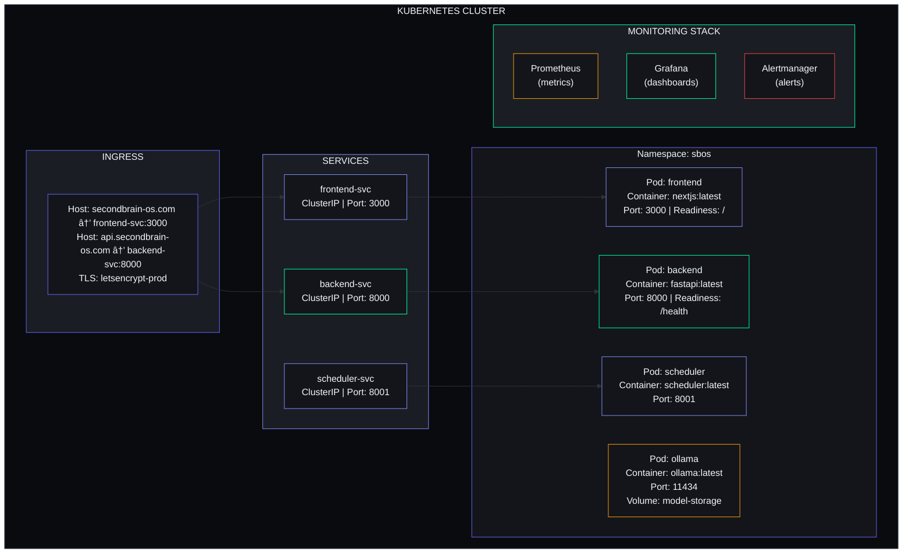
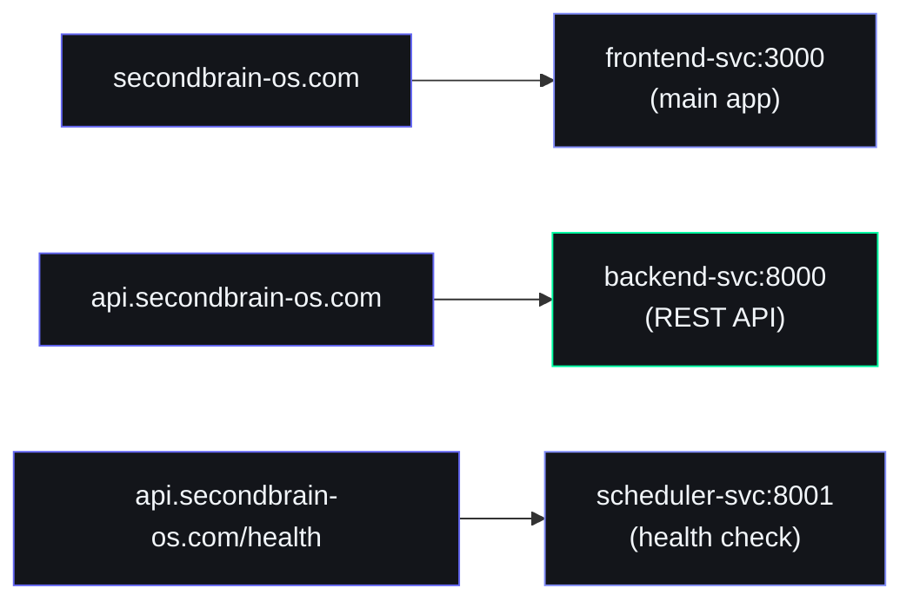
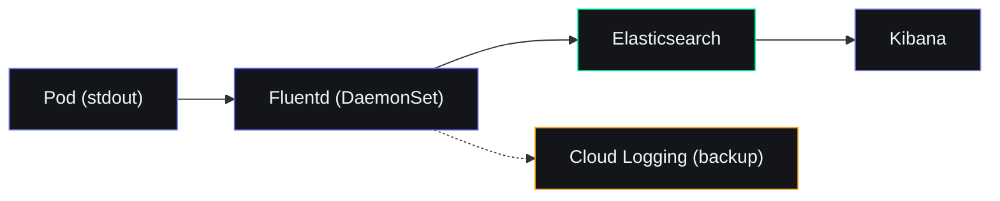
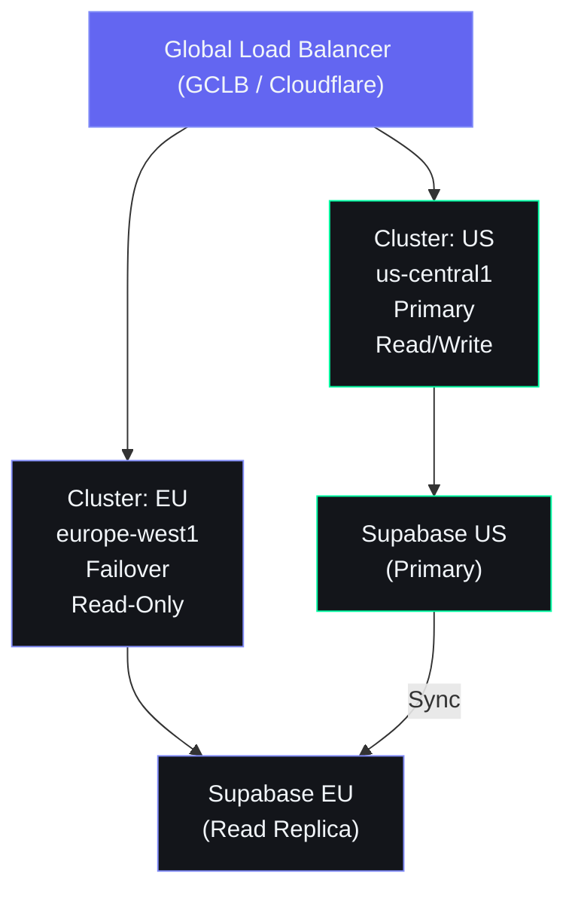

# Kubernetes Architecture

> **Document ID**: DVO-K8S-001  
> **Version**: 1.0.0  
> **Status**: Draft  
> **Last Updated**: 2026-06-11  
> **Classification**: Internal — Engineering Reference (Future State)  
> **Target Audience**: DevOps Engineers, SRE Team, Infrastructure Architects

> **IMPORTANT**: This document describes the **future-state** Kubernetes architecture. The project currently uses **Docker Compose** for local development and **Railway** for production deployment. Kubernetes migration is planned for scaling beyond 1,000 concurrent users.

---

## Table of Contents

1. [Kubernetes Architecture Overview](#1-kubernetes-architecture-overview)
2. [Cluster Topology](#2-cluster-topology)
3. [Pod Definitions Per Service](#3-pod-definitions-per-service)
4. [Service Definitions](#4-service-definitions)
5. [Ingress Configuration](#5-ingress-configuration)
6. [ConfigMaps and Secrets](#6-configmaps-and-secrets)
7. [Persistent Volumes](#7-persistent-volumes)
8. [Horizontal Pod Autoscaling](#8-horizontal-pod-autoscaling)
9. [Resource Requests and Limits](#9-resource-requests-and-limits)
10. [Helm Charts Structure](#10-helm-charts-structure)
11. [Monitoring](#11-monitoring)
12. [Logging](#12-logging)
13. [Service Mesh Considerations](#13-service-mesh-considerations)
14. [Rollout Strategies](#14-rollout-strategies)
15. [K8s Security](#15-k8s-security)
16. [Multi-Cluster Roadmap](#16-multi-cluster-roadmap)

---

## 1. Kubernetes Architecture Overview

### 1.1 Migration Context

```mermaid
graph LR
    subgraph Current["Current State (Docker Compose + Railway)"]
        DevMachine["Developer Machine<br/>Docker CE Compose<br/>4 services"]
        Railway["Railway Cloud<br/>Railway Platform<br/>(managed Docker) 2 containers"]
    end

    subgraph Future["Future State (Kubernetes)"]
        K8sCluster["Kubernetes Cluster (GKE / EKS / kubeadm)"]
        FrontendK8s["Frontend<br/>Deploy + HPA"]
        BackendK8s["Backend<br/>Deploy + HPA"]
        SchedulerK8s["Scheduler<br/>Deploy"]
        OllamaK8s["Ollama<br/>StatefulSet"]
        Ingress["Ingress (NGINX)<br/>TLS → Path-based routing"]
        Monitoring["Prometheus + Grafana"]
        Logging["EFK Stack (Logging)"]

        K8sCluster --- FrontendK8s
        K8sCluster --- BackendK8s
        K8sCluster --- SchedulerK8s
        K8sCluster --- OllamaK8s
        K8sCluster --- Ingress
        K8sCluster --- Monitoring
        K8sCluster --- Logging
    end

    Current --> Future

    style Current fill:#1A1D24,stroke:#EF4444,color:#F1F5F9
    style DevMachine fill:#13151A,stroke:#EF4444,color:#F1F5F9
    style Railway fill:#13151A,stroke:#EF4444,color:#F1F5F9
    style Future fill:#1A1D24,stroke:#00FFA3,color:#F1F5F9
    style K8sCluster fill:#13151A,stroke:#00FFA3,color:#F1F5F9
    style FrontendK8s fill:#13151A,stroke:#818CF8,color:#F1F5F9
    style BackendK8s fill:#13151A,stroke:#818CF8,color:#F1F5F9
    style SchedulerK8s fill:#13151A,stroke:#818CF8,color:#F1F5F9
    style OllamaK8s fill:#13151A,stroke:#F59E0B,color:#F1F5F9
    style Ingress fill:#13151A,stroke:#6366F1,color:#F1F5F9
    style Monitoring fill:#13151A,stroke:#00FFA3,color:#F1F5F9
    style Logging fill:#13151A,stroke:#00FFA3,color:#F1F5F9
```



### 1.2 Migration Triggers

| Trigger | Threshold | Action |
|---|---|---|
| Concurrent users | >1,000 | Migrate from Railway to K8s |
| Backend response time p95 | >3s at peak | Scale horizontally on K8s |
| Monthly cost | >$100 (Railway) | Fixed K8s pricing may be cheaper |
| Multi-region requirement | Any | K8s supports multi-cluster natively |

### 1.3 Architecture Diagram



---

## 2. Cluster Topology

### 2.1 Cluster Specification

| Attribute | Value | Rationale |
|---|---|---|
| **Provider** | GKE (Google Kubernetes Engine) | Best managed K8s, integrated with GCP services |
| **Alternative** | EKS (Amazon) or kubeadm (Self-managed) | Multi-cloud flexibility |
| **K8s Version** | 1.28+ | Recent stable with security patches |
| **Node Pool: General** | 3x e2-standard-2 (2 vCPU, 8GB RAM) | General-purpose workloads |
| **Node Pool: GPU** | 1x g2-standard-4 (4 vCPU, 16GB RAM, L4 GPU) | Ollama AI inference |
| **Node Pool: Spot** | 2x e2-standard-2 (preemptible) | Cost-optimized batch jobs |
| **Cluster Autoscaler** | Enabled (0–10 nodes per pool) | Automatic scaling |
| **Region** | us-central1 | Central US, low latency |
| **Zones** | us-central1-a, us-central1-b, us-central1-c | Multi-AZ for HA |

### 2.2 Node Pool Configuration

```yaml
apiVersion: cloud.google.com/v1
kind: NodePool
metadata:
  name: general-pool
spec:
  initialNodeCount: 3
  autoscaling:
    minNodeCount: 1
    maxNodeCount: 10
  management:
    autoRepair: true
    autoUpgrade: true
  config:
    machineType: e2-standard-2
    diskSizeGb: 50
    diskType: pd-standard
    oauthScopes:
      - https://www.googleapis.com/auth/cloud-platform
    labels:
      pool: general
    taints: []
---
apiVersion: cloud.google.com/v1
kind: NodePool
metadata:
  name: gpu-pool
spec:
  initialNodeCount: 1
  autoscaling:
    minNodeCount: 0
    maxNodeCount: 3
  config:
    machineType: g2-standard-4
    guestAccelerator:
      - type: nvidia-l4
        count: 1
    diskSizeGb: 100
    diskType: pd-ssd
    labels:
      pool: gpu
    taints:
      - key: nvidia.com/gpu
        value: present
        effect: NoSchedule
---
apiVersion: cloud.google.com/v1
kind: NodePool
metadata:
  name: spot-pool
spec:
  initialNodeCount: 0
  autoscaling:
    minNodeCount: 0
    maxNodeCount: 5
  config:
    machineType: e2-standard-2
    spot: true
    labels:
      pool: spot
    taints:
      - key: spot
        value: "true"
        effect: PreferNoSchedule
```

### 2.3 Node Affinity and Taints

| Workload | Node Pool | Tolerations |
|---|---|---|
| Frontend | general | None |
| Backend | general | None |
| Scheduler | spot | `spot: "true" PreferNoSchedule` |
| Ollama | gpu | `nvidia.com/gpu: present NoSchedule` |

---

## 3. Pod Definitions Per Service

### 3.1 Frontend Pod (Next.js)

```yaml
apiVersion: apps/v1
kind: Deployment
metadata:
  name: frontend
  namespace: sbos
  labels:
    app: frontend
    tier: frontend
spec:
  replicas: 2
  strategy:
    type: RollingUpdate
    rollingUpdate:
      maxSurge: 1
      maxUnavailable: 0
  selector:
    matchLabels:
      app: frontend
  template:
    metadata:
      labels:
        app: frontend
        tier: frontend
    spec:
      containers:
        - name: nextjs
          image: ghcr.io/sbos/frontend:latest
          imagePullPolicy: Always
          ports:
            - containerPort: 3000
              protocol: TCP
          envFrom:
            - configMapRef:
                name: frontend-config
            - secretRef:
                name: frontend-secrets
          resources:
            requests:
              cpu: "250m"
              memory: "256Mi"
            limits:
              cpu: "500m"
              memory: "512Mi"
          livenessProbe:
            httpGet:
              path: /
              port: 3000
            initialDelaySeconds: 15
            periodSeconds: 20
            timeoutSeconds: 5
          readinessProbe:
            httpGet:
              path: /
              port: 3000
            initialDelaySeconds: 5
            periodSeconds: 10
            timeoutSeconds: 3
          startupProbe:
            httpGet:
              path: /
              port: 3000
            initialDelaySeconds: 5
            periodSeconds: 5
            failureThreshold: 30
      affinity:
        podAntiAffinity:
          preferredDuringSchedulingIgnoredDuringExecution:
            - weight: 100
              podAffinityTerm:
                labelSelector:
                  matchExpressions:
                    - key: app
                      operator: In
                      values:
                        - frontend
                topologyKey: kubernetes.io/hostname
```

### 3.2 Backend Pod (FastAPI)

```yaml
apiVersion: apps/v1
kind: Deployment
metadata:
  name: backend
  namespace: sbos
  labels:
    app: backend
    tier: backend
spec:
  replicas: 3
  strategy:
    type: RollingUpdate
    rollingUpdate:
      maxSurge: 1
      maxUnavailable: 0
  selector:
    matchLabels:
      app: backend
  template:
    metadata:
      labels:
        app: backend
        tier: backend
      annotations:
        prometheus.io/scrape: "true"
        prometheus.io/port: "8000"
        prometheus.io/path: "/metrics"
    spec:
      containers:
        - name: fastapi
          image: ghcr.io/sbos/backend:latest
          imagePullPolicy: Always
          ports:
            - containerPort: 8000
              protocol: TCP
          envFrom:
            - configMapRef:
                name: backend-config
            - secretRef:
                name: backend-secrets
          resources:
            requests:
              cpu: "250m"
              memory: "256Mi"
            limits:
              cpu: "1"
              memory: "512Mi"
          livenessProbe:
            httpGet:
              path: /health
              port: 8000
            initialDelaySeconds: 20
            periodSeconds: 30
            timeoutSeconds: 10
          readinessProbe:
            httpGet:
              path: /health
              port: 8000
            initialDelaySeconds: 10
            periodSeconds: 15
            timeoutSeconds: 5
          startupProbe:
            httpGet:
              path: /health
              port: 8000
            initialDelaySeconds: 5
            periodSeconds: 5
            failureThreshold: 20
      affinity:
        podAntiAffinity:
          preferredDuringSchedulingIgnoredDuringExecution:
            - weight: 100
              podAffinityTerm:
                labelSelector:
                  matchExpressions:
                    - key: app
                      operator: In
                      values:
                        - backend
                topologyKey: kubernetes.io/hostname
```

### 3.3 Scheduler Pod (APScheduler)

```yaml
apiVersion: apps/v1
kind: Deployment
metadata:
  name: scheduler
  namespace: sbos
  labels:
    app: scheduler
    tier: worker
spec:
  replicas: 1
  strategy:
    type: Recreate
  selector:
    matchLabels:
      app: scheduler
  template:
    metadata:
      labels:
        app: scheduler
        tier: worker
    spec:
      containers:
        - name: apscheduler
          image: ghcr.io/sbos/scheduler:latest
          imagePullPolicy: Always
          ports:
            - containerPort: 8001
              protocol: TCP
          envFrom:
            - configMapRef:
                name: backend-config
            - secretRef:
                name: backend-secrets
          resources:
            requests:
              cpu: "100m"
              memory: "128Mi"
            limits:
              cpu: "250m"
              memory: "256Mi"
          livenessProbe:
            httpGet:
              path: /health
              port: 8001
            initialDelaySeconds: 30
            periodSeconds: 60
            timeoutSeconds: 10
      tolerations:
        - key: spot
          operator: Equal
          value: "true"
          effect: PreferNoSchedule
```

### 3.4 Ollama Pod (AI Inference)

```yaml
apiVersion: apps/v1
kind: StatefulSet
metadata:
  name: ollama
  namespace: sbos
  labels:
    app: ollama
    tier: ai
spec:
  replicas: 1
  serviceName: ollama
  selector:
    matchLabels:
      app: ollama
  template:
    metadata:
      labels:
        app: ollama
        tier: ai
    spec:
      containers:
        - name: ollama
          image: ollama/ollama:latest
          ports:
            - containerPort: 11434
              protocol: TCP
          env:
            - name: OLLAMA_HOST
              value: "0.0.0.0"
            - name: OLLAMA_KEEP_ALIVE
              value: "24h"
          resources:
            requests:
              cpu: "2"
              memory: "4Gi"
              nvidia.com/gpu: "1"
            limits:
              cpu: "4"
              memory: "8Gi"
              nvidia.com/gpu: "1"
          volumeMounts:
            - name: model-storage
              mountPath: /root/.ollama
          livenessProbe:
            exec:
              command:
                - ollama
                - list
            initialDelaySeconds: 120
            periodSeconds: 60
            timeoutSeconds: 10
          startupProbe:
            exec:
              command:
                - ollama
                - list
            initialDelaySeconds: 5
            periodSeconds: 10
            failureThreshold: 60
      tolerations:
        - key: nvidia.com/gpu
          operator: Exists
          effect: NoSchedule
      volumes:
        - name: model-storage
          persistentVolumeClaim:
            claimName: ollama-models-pvc
```

---

## 4. Service Definitions

### 4.1 Frontend Service

```yaml
apiVersion: v1
kind: Service
metadata:
  name: frontend-svc
  namespace: sbos
  labels:
    app: frontend
spec:
  type: ClusterIP
  ports:
    - port: 3000
      targetPort: 3000
      protocol: TCP
      name: http
  selector:
    app: frontend
```

### 4.2 Backend Service

```yaml
apiVersion: v1
kind: Service
metadata:
  name: backend-svc
  namespace: sbos
  labels:
    app: backend
spec:
  type: ClusterIP
  ports:
    - port: 8000
      targetPort: 8000
      protocol: TCP
      name: http
  selector:
    app: backend
```

### 4.3 Scheduler Service

```yaml
apiVersion: v1
kind: Service
metadata:
  name: scheduler-svc
  namespace: sbos
  labels:
    app: scheduler
spec:
  type: ClusterIP
  ports:
    - port: 8001
      targetPort: 8001
      protocol: TCP
      name: http
  selector:
    app: scheduler
```

### 4.4 Ollama Service (Headless)

```yaml
apiVersion: v1
kind: Service
metadata:
  name: ollama-svc
  namespace: sbos
  labels:
    app: ollama
spec:
  type: ClusterIP
  clusterIP: None  # Headless for StatefulSet
  ports:
    - port: 11434
      targetPort: 11434
      protocol: TCP
      name: http
  selector:
    app: ollama
```

### 4.5 Service Summary

| Service | Type | Port | Target | Protocol | Selector |
|---|---|---|---|---|---|
| `frontend-svc` | ClusterIP | 3000 | 3000 | TCP | `app: frontend` |
| `backend-svc` | ClusterIP | 8000 | 8000 | TCP | `app: backend` |
| `scheduler-svc` | ClusterIP | 8001 | 8001 | TCP | `app: scheduler` |
| `ollama-svc` | ClusterIP (Headless) | 11434 | 11434 | TCP | `app: ollama` |

---

## 5. Ingress Configuration

### 5.1 NGINX Ingress Controller

```yaml
apiVersion: networking.k8s.io/v1
kind: Ingress
metadata:
  name: sbos-ingress
  namespace: sbos
  annotations:
    kubernetes.io/ingress.class: nginx
    nginx.ingress.kubernetes.io/ssl-redirect: "true"
    nginx.ingress.kubernetes.io/proxy-body-size: "10m"
    nginx.ingress.kubernetes.io/proxy-read-timeout: "120"
    nginx.ingress.kubernetes.io/proxy-send-timeout: "120"
    nginx.ingress.kubernetes.io/use-regex: "true"
    cert-manager.io/cluster-issuer: letsencrypt-prod
spec:
  tls:
    - hosts:
        - secondbrain-os.com
        - api.secondbrain-os.com
        - ollama.secondbrain-os.com
      secretName: sbos-tls
  rules:
    - host: secondbrain-os.com
      http:
        paths:
          - path: /
            pathType: Prefix
            backend:
              service:
                name: frontend-svc
                port:
                  number: 3000
    - host: api.secondbrain-os.com
      http:
        paths:
          - path: /
            pathType: Prefix
            backend:
              service:
                name: backend-svc
                port:
                  number: 8000
          - path: /health
            pathType: Exact
            backend:
              service:
                name: scheduler-svc
                port:
                  number: 8001
```

### 5.2 TLS Certificate Management

```yaml
apiVersion: cert-manager.io/v1
kind: ClusterIssuer
metadata:
  name: letsencrypt-prod
spec:
  acme:
    server: https://acme-v02.api.letsencrypt.org/directory
    email: devops@secondbrain-os.com
    privateKeySecretRef:
      name: letsencrypt-prod-key
    solvers:
      - http01:
          ingress:
            class: nginx
```

### 5.3 Path-Based Routing Rules



### 5.4 Load Balancer (For Direct Access, Optional)

```yaml
apiVersion: v1
kind: Service
metadata:
  name: backend-lb
  namespace: sbos
spec:
  type: LoadBalancer
  ports:
    - port: 443
      targetPort: 8000
      protocol: TCP
      name: https
  selector:
    app: backend
```

---

## 6. ConfigMaps and Secrets

### 6.1 Frontend ConfigMap

```yaml
apiVersion: v1
kind: ConfigMap
metadata:
  name: frontend-config
  namespace: sbos
data:
  NEXT_PUBLIC_API_URL: "https://api.secondbrain-os.com"
  NEXT_PUBLIC_SUPABASE_URL: "https://project.supabase.co"
  NODE_ENV: "production"
  NEXT_TELEMETRY_DISABLED: "1"
```

### 6.2 Backend ConfigMap

```yaml
apiVersion: v1
kind: ConfigMap
metadata:
  name: backend-config
  namespace: sbos
data:
  APP_NAME: "Second Brain OS"
  DEBUG: "False"
  JWT_ALGORITHM: "HS256"
  OLLAMA_BASE_URL: "http://ollama-svc:11434"
  USE_LOCAL_AI: "True"
  CORS_ORIGINS: "https://secondbrain-os.com"
  PYTHONPATH: "/app"
  TZ: "UTC"
```

### 6.3 Secrets (External)

```yaml
# Managed via SealedSecrets or External Secrets Operator
# NEVER commit raw secrets to Git

apiVersion: bitnami.com/v1alpha1
kind: SealedSecret
metadata:
  name: backend-secrets
  namespace: sbos
spec:
  encryptedData:
    SUPABASE_URL: AgBy3i4...  # encrypted
    SUPABASE_KEY: AgBy3i4...  # encrypted
    SUPABASE_SERVICE_KEY: AgBy3i4...
    JWT_SECRET: AgBy3i4...
    CLAUDE_API_KEY: AgBy3i4...
    RESEND_API_KEY: AgBy3i4...
```

### 6.4 External Secrets Operator Integration

```yaml
apiVersion: external-secrets.io/v1beta1
kind: ExternalSecret
metadata:
  name: backend-secrets
  namespace: sbos
spec:
  refreshInterval: "1h"
  secretStoreRef:
    name: gcp-secret-store
    kind: ClusterSecretStore
  target:
    name: backend-secrets
  data:
    - secretKey: SUPABASE_URL
      remoteRef:
        key: sbos/production/SUPABASE_URL
    - secretKey: JWT_SECRET
      remoteRef:
        key: sbos/production/JWT_SECRET
```

### 6.5 Secret-to-Config Mapping

| ConfigMap / Secret | Frontend | Backend | Scheduler | Ollama |
|---|---|---|---|---|
| `frontend-config` | ✅ | — | — | — |
| `frontend-secrets` | ✅ | — | — | — |
| `backend-config` | — | ✅ | ✅ | — |
| `backend-secrets` | — | ✅ | ✅ | — |

---

## 7. Persistent Volumes

### 7.1 Ollama Model Storage

```yaml
apiVersion: v1
kind: PersistentVolumeClaim
metadata:
  name: ollama-models-pvc
  namespace: sbos
spec:
  accessModes:
    - ReadWriteOnce
  resources:
    requests:
      storage: 20Gi
  storageClassName: pd-ssd
---
apiVersion: v1
kind: PersistentVolume
metadata:
  name: ollama-models-pv
  namespace: sbos
spec:
  capacity:
    storage: 20Gi
  accessModes:
    - ReadWriteOnce
  persistentVolumeReclaimPolicy: Retain
  storageClassName: pd-ssd
  gcePersistentDisk:
    pdName: sbos-ollama-models
    fsType: ext4
```

### 7.2 Cache Volume

```yaml
apiVersion: v1
kind: PersistentVolumeClaim
metadata:
  name: api-cache-pvc
  namespace: sbos
spec:
  accessModes:
    - ReadWriteOnce
  resources:
    requests:
      storage: 5Gi
  storageClassName: pd-standard
```

### 7.3 Volume Summary

| PVC | Size | Access Mode | Storage Class | Workload | Reclaim Policy |
|---|---|---|---|---|---|
| `ollama-models-pvc` | 20Gi | RWO | pd-ssd | Ollama StatefulSet | Retain |
| `api-cache-pvc` | 5Gi | RWO | pd-standard | Backend Deployment | Delete |

---

## 8. Horizontal Pod Autoscaling

### 8.1 Frontend Autoscaling

```yaml
apiVersion: autoscaling/v2
kind: HorizontalPodAutoscaler
metadata:
  name: frontend-hpa
  namespace: sbos
spec:
  scaleTargetRef:
    apiVersion: apps/v1
    kind: Deployment
    name: frontend
  minReplicas: 2
  maxReplicas: 10
  metrics:
    - type: Resource
      resource:
        name: cpu
        target:
          type: Utilization
          averageUtilization: 70
    - type: Resource
      resource:
        name: memory
        target:
          type: Utilization
          averageUtilization: 80
  behavior:
    scaleDown:
      stabilizationWindowSeconds: 300
      policies:
        - type: Percent
          value: 50
          periodSeconds: 60
    scaleUp:
      stabilizationWindowSeconds: 30
      policies:
        - type: Percent
          value: 100
          periodSeconds: 30
        - type: Pods
          value: 2
          periodSeconds: 15
```

### 8.2 Backend Autoscaling

```yaml
apiVersion: autoscaling/v2
kind: HorizontalPodAutoscaler
metadata:
  name: backend-hpa
  namespace: sbos
spec:
  scaleTargetRef:
    apiVersion: apps/v1
    kind: Deployment
    name: backend
  minReplicas: 3
  maxReplicas: 15
  metrics:
    - type: Resource
      resource:
        name: cpu
        target:
          type: Utilization
          averageUtilization: 70
    - type: Resource
      resource:
        name: memory
        target:
          type: Utilization
          averageUtilization: 80
    - type: Pods
      pods:
        metric:
          name: http_requests_per_second
        target:
          type: AverageValue
          averageValue: "100"
  behavior:
    scaleDown:
      stabilizationWindowSeconds: 300
    scaleUp:
      stabilizationWindowSeconds: 30
      policies:
        - type: Percent
          value: 200
          periodSeconds: 30
```

### 8.3 Autoscaling Summary

| Deployment | Min | Max | CPU Target | Memory Target | Custom Metric |
|---|---|---|---|---|---|
| Frontend | 2 | 10 | 70% | 80% | — |
| Backend | 3 | 15 | 70% | 80% | 100 req/s per pod |
| Scheduler | 1 | 1 | — | — | — |
| Ollama | 1 | 1 | — | — | — |

---

## 9. Resource Requests and Limits

### 9.1 Resource Matrix

| Deployment | CPU Request | CPU Limit | Memory Request | Memory Limit | GPU |
|---|---|---|---|---|---|
| Frontend | 250m | 500m | 256Mi | 512Mi | — |
| Backend | 250m | 1000m | 256Mi | 512Mi | — |
| Scheduler | 100m | 250m | 128Mi | 256Mi | — |
| Ollama | 2000m | 4000m | 4Gi | 8Gi | 1x L4 |

### 9.2 Quality of Service Classes

| Deployment | QoS Class | Reason |
|---|---|---|
| Frontend | Burstable | Requests < Limits |
| Backend | Burstable | Requests < Limits |
| Scheduler | Burstable | Requests < Limits |
| Ollama | Burstable | GPU guarantees needed |

### 9.3 LimitRange (Namespace Defaults)

```yaml
apiVersion: v1
kind: LimitRange
metadata:
  name: sbos-limits
  namespace: sbos
spec:
  limits:
    - default:
        cpu: "500m"
        memory: "512Mi"
      defaultRequest:
        cpu: "250m"
        memory: "256Mi"
      type: Container
```

---

## 10. Helm Charts Structure

### 10.1 Chart Layout

```
charts/
├── sbos/
│   ├── Chart.yaml
│   ├── values.yaml
│   ├── values.dev.yaml
│   ├── values.staging.yaml
│   ├── values.prod.yaml
│   ├── templates/
│   │   ├── _helpers.tpl
│   │   ├── frontend-deployment.yaml
│   │   ├── frontend-service.yaml
│   │   ├── frontend-hpa.yaml
│   │   ├── backend-deployment.yaml
│   │   ├── backend-service.yaml
│   │   ├── backend-hpa.yaml
│   │   ├── scheduler-deployment.yaml
│   │   ├── scheduler-service.yaml
│   │   ├── ollama-statefulset.yaml
│   │   ├── ollama-service.yaml
│   │   ├── ollama-pvc.yaml
│   │   ├── ingress.yaml
│   │   ├── configmap.yaml
│   │   ├── sealed-secrets.yaml
│   │   ├── namespace.yaml
│   │   ├── limitrange.yaml
│   │   ├── network-policy.yaml
│   │   ├── pod-disruption-budget.yaml
│   │   └── pdb.yaml
│   └── tests/
│       └── connection.yaml
```

### 10.2 Chart.yaml

```yaml
apiVersion: v2
name: sbos
description: Second Brain OS - Kubernetes Helm Chart
type: application
version: 0.1.0
appVersion: "2.1.0"
keywords:
  - second-brain
  - ai
  - productivity
sources:
  - https://github.com/user/secondbrain-os
maintainers:
  - name: Dev Team
    email: dev@secondbrain-os.com
```

### 10.3 values.prod.yaml

```yaml
# Environment-specific values for production
global:
  environment: production
  domain: secondbrain-os.com
  apiDomain: api.secondbrain-os.com

frontend:
  replicas: 3
  image:
    repository: ghcr.io/sbos/frontend
    tag: latest
    pullPolicy: Always
  resources:
    requests:
      cpu: "250m"
      memory: "256Mi"
    limits:
      cpu: "500m"
      memory: "512Mi"
  autoscaling:
    enabled: true
    minReplicas: 3
    maxReplicas: 10
    targetCPUUtilization: 70
    targetMemoryUtilization: 80

backend:
  replicas: 4
  image:
    repository: ghcr.io/sbos/backend
    tag: latest
    pullPolicy: Always
  resources:
    requests:
      cpu: "250m"
      memory: "256Mi"
    limits:
      cpu: "1"
      memory: "512Mi"
  autoscaling:
    enabled: true
    minReplicas: 4
    maxReplicas: 15
    targetCPUUtilization: 70
    targetMemoryUtilization: 80
  ollama:
    baseUrl: http://ollama-svc:11434
    useLocal: false

scheduler:
  replicas: 1
  image:
    repository: ghcr.io/sbos/scheduler
    tag: latest
    pullPolicy: Always
  resources:
    requests:
      cpu: "100m"
      memory: "128Mi"
    limits:
      cpu: "250m"
      memory: "256Mi"

ollama:
  enabled: true
  resources:
    requests:
      cpu: "2"
      memory: "4Gi"
      gpu: 1
    limits:
      cpu: "4"
      memory: "8Gi"
      gpu: 1
  storage:
    size: 20Gi
    storageClass: pd-ssd

ingress:
  enabled: true
  className: nginx
  annotations:
    cert-manager.io/cluster-issuer: letsencrypt-prod
  tls:
    - secretName: sbos-tls
      hosts:
        - secondbrain-os.com
        - api.secondbrain-os.com
```

### 10.4 Installation Commands

```bash
# Install chart
helm upgrade --install sbos ./charts/sbos \
  --namespace sbos \
  --create-namespace \
  --values ./charts/sbos/values.prod.yaml

# Dry run
helm upgrade --install sbos ./charts/sbos \
  --dry-run --debug \
  --values ./charts/sbos/values.prod.yaml

# Upgrade with new version
helm upgrade sbos ./charts/sbos \
  --set backend.image.tag=v2.1.0

# Rollback
helm rollback sbos 2
```

---

## 11. Monitoring

### 11.1 Monitoring Stack

| Component | Purpose | Installation | Version |
|---|---|---|---|
| **Prometheus** | Metrics collection, alerting | `kube-prometheus-stack` Helm chart | 2.45+ |
| **Grafana** | Dashboards, visualization | Same chart | 10.0+ |
| **Alertmanager** | Alert routing, silencing | Same chart | 0.25+ |
| **kube-state-metrics** | K8s object metrics | Included in stack | 2.9+ |
| **node-exporter** | Node-level metrics | Included in stack | 1.6+ |

### 11.2 Prometheus Config

```yaml
# prometheus-additional-scrape-configs.yaml
- job_name: sbos-backend
  kubernetes_sd_configs:
    - role: pod
      namespaces:
        names:
          - sbos
  relabel_configs:
    - source_labels: [__meta_kubernetes_pod_label_app]
      regex: backend
      action: keep
    - source_labels: [__address__]
      action: replace
      regex: ([^:]+)(?::\d+)?
      replacement: $1:8000
      target_label: __address__
```

### 11.3 Grafana Dashboard Variables

```
Dashboards to create:
  1. SBOS: Application Overview (CPU, memory, request rate, error rate)
  2. SBOS: AI Performance (Ollama latency, token usage, fallback rate)
  3. SBOS: Database (Supabase connections, query latency, cache hit ratio)
  4. SBOS: Kubernetes Cluster (node status, pod health, resource utilization)
```

### 11.4 Alerting Rules

```yaml
# prometheus-alerts.yaml
groups:
  - name: sbos
    rules:
      - alert: HighErrorRate
        expr: rate(http_requests_total{status=~"5.."}[5m]) / rate(http_requests_total[5m]) > 0.05
        for: 5m
        labels:
          severity: critical
        annotations:
          summary: "Error rate > 5% for 5 minutes"

      - alert: HighLatency
        expr: histogram_quantile(0.95, rate(http_request_duration_seconds[5m])) > 2
        for: 5m
        labels:
          severity: warning
        annotations:
          summary: "p95 latency > 2s"

      - alert: PodDown
        expr: kube_pod_status_phase{phase="Running"} < 1
        for: 2m
        labels:
          severity: critical

      - alert: HighMemoryUsage
        expr: container_memory_usage_bytes{container="fastapi"} / container_spec_memory_limit_bytes{container="fastapi"} > 0.85
        for: 5m
        labels:
          severity: warning

      - alert: OllamaDown
        expr: probe_success{job="ollama"} == 0
        for: 1m
        labels:
          severity: critical
```

---

## 12. Logging

### 12.1 EFK Stack Architecture



### 12.2 Fluentd DaemonSet Config

```yaml
apiVersion: apps/v1
kind: DaemonSet
metadata:
  name: fluentd
  namespace: logging
spec:
  selector:
    matchLabels:
      name: fluentd
  template:
    metadata:
      labels:
        name: fluentd
    spec:
      containers:
        - name: fluentd
          image: fluent/fluentd-kubernetes-daemonset:v1.16
          env:
            - name: FLUENT_ELASTICSEARCH_HOST
              value: "elasticsearch.logging.svc"
            - name: FLUENT_ELASTICSEARCH_PORT
              value: "9200"
          resources:
            limits:
              memory: "500Mi"
              cpu: "500m"
          volumeMounts:
            - name: varlog
              mountPath: /var/log
            - name: dockercontainers
              mountPath: /var/lib/docker/containers
              readOnly: true
      volumes:
        - name: varlog
          hostPath:
            path: /var/log
        - name: dockercontainers
          hostPath:
            path: /var/lib/docker/containers
```

### 12.3 Log Retention Policy

| Log Source | Retention | Storage | Index Pattern |
|---|---|---|---|
| Application logs (sbos-*) | 30 days | Elasticsearch hot tier | `sbos-*` |
| Kubernetes audit logs | 90 days | Elasticsearch warm tier | `kube-audit-*` |
| Node/system logs | 7 days | Elasticsearch cold tier | `system-*` |

---

## 13. Service Mesh Considerations

### 13.1 Mesh Comparison

| Feature | Istio | Linkerd | Consul Connect |
|---|---|---|---|
| **mTLS** | ✅ Automatic | ✅ Automatic | ✅ Automatic |
| **Traffic splitting** | ✅ Fine-grained | ✅ Simple | ✅ Via config |
| **Observability** | ✅ Deep (Kiali) | ✅ Good (Grafana) | ✅ Basic |
| **Resource overhead** | ~2GB per node | ~200MB per node | ~500MB per node |
| **Learning curve** | High | Medium | Medium |
| **Community** | Very active | Active | Active |

**Decision:** **Linkerd** for low resource overhead and simpler configuration.

### 13.2 Linkerd Installation

```bash
# Install Linkerd CLI
curl -sL https://run.linkerd.io/install | sh

# Install on cluster
linkerd install | kubectl apply -f -

# Verify
linkerd check

# Annotate namespace for injection
kubectl annotate namespace sbos linkerd.io/inject=enabled

# Restart deployments to inject sidecars
kubectl rollout restart deployment -n sbos
```

### 13.3 mTLS Configuration

```yaml
apiVersion: policy.linkerd.io/v1beta1
kind: ServerAuthorization
metadata:
  namespace: sbos
  name: backend-auth
spec:
  server:
    name: backend-server
  client:
    meshTLS:
      serviceAccounts:
        - name: frontend-svc
        - name: scheduler-svc
```

---

## 14. Rollout Strategies

### 14.1 Deployment Strategy Comparison

| Workload | Strategy | Max Unavailable | Max Surge | Rationale |
|---|---|---|---|---|
| Frontend | RollingUpdate | 0 | 1 | Zero-downtime, 1 additional pod during rollout |
| Backend | RollingUpdate | 0 | 1 | Zero-downtime, must maintain all traffic |
| Scheduler | Recreate | N/A | N/A | Only 1 instance, must stop before start |
| Ollama | Recreate (StatefulSet) | N/A | N/A | Stateful, needs volume mount reconnection |

### 14.2 Blue-Green Deployment (Backend)

```yaml
apiVersion: argoproj.io/v1alpha1
kind: Rollout
metadata:
  name: backend-rollout
  namespace: sbos
spec:
  replicas: 4
  strategy:
    blueGreen:
      activeService: backend-svc
      previewService: backend-preview-svc
      autoPromotionEnabled: false
      scaleDownDelaySeconds: 600
  selector:
    matchLabels:
      app: backend
  template:
    metadata:
      labels:
        app: backend
    spec:
      containers:
        - name: fastapi
          image: ghcr.io/sbos/backend:latest
```

### 14.3 Canary Deployment (Frontend)

```yaml
apiVersion: argoproj.io/v1alpha1
kind: Rollout
metadata:
  name: frontend-rollout
  namespace: sbos
spec:
  replicas: 6
  strategy:
    canary:
      steps:
        - setWeight: 10  # 10% traffic to new version
        - pause:
            duration: 5m
        - setWeight: 30  # 30%
        - pause:
            duration: 5m
        - setWeight: 60  # 60%
        - pause:
            duration: 5m
        - setWeight: 100 # 100% rollout complete
  selector:
    matchLabels:
      app: frontend
  template:
    metadata:
      labels:
        app: frontend
```

### 14.4 PodDisruptionBudget

```yaml
apiVersion: policy/v1
kind: PodDisruptionBudget
metadata:
  name: backend-pdb
  namespace: sbos
spec:
  minAvailable: 2
  selector:
    matchLabels:
      app: backend
---
apiVersion: policy/v1
kind: PodDisruptionBudget
metadata:
  name: frontend-pdb
  namespace: sbos
spec:
  minAvailable: 1
  selector:
    matchLabels:
      app: frontend
```

---

## 15. K8s Security

### 15.1 Security Posture

| Domain | Practice | Implementation |
|---|---|---|
| **Pod Security** | Pod Security Standards (PSS) | `restricted` profile |
| **Network** | Zero-trust networking | Network Policies |
| **RBAC** | Least privilege | ServiceAccount per app |
| **Secrets** | Encryption at rest | KMS + External Secrets |
| **Images** | Vulnerability scanning | Trivy in CI + Admission Controller |
| **Runtime** | Container hardening | readOnlyRootFilesystem, drop capabilties |

### 15.2 Pod Security Standards

```yaml
apiVersion: v1
kind: Namespace
metadata:
  name: sbos
  labels:
    pod-security.kubernetes.io/enforce: restricted
    pod-security.kubernetes.io/audit: restricted
    pod-security.kubernetes.io/warn: baseline
```

### 15.3 Network Policies

```yaml
apiVersion: networking.k8s.io/v1
kind: NetworkPolicy
metadata:
  name: backend-policy
  namespace: sbos
spec:
  podSelector:
    matchLabels:
      app: backend
  policyTypes:
    - Ingress
    - Egress
  ingress:
    - from:
        - podSelector:
            matchLabels:
              app: frontend
        - podSelector:
            matchLabels:
              app: scheduler
      ports:
        - protocol: TCP
          port: 8000
  egress:
    - to:
        - podSelector:
            matchLabels:
              app: ollama
      ports:
        - protocol: TCP
          port: 11434
    - to:
        - namespaceSelector: {}  # DNS
          podSelector:
            matchLabels:
              k8s-app: kube-dns
      ports:
        - protocol: UDP
          port: 53
    - to:  # External (Supabase, Anthropic)
        - ipBlock:
            cidr: 0.0.0.0/0
            except:
              - 10.0.0.0/8
              - 172.16.0.0/12
              - 192.168.0.0/16
```

### 15.4 RBAC Configuration

```yaml
apiVersion: v1
kind: ServiceAccount
metadata:
  name: backend-sa
  namespace: sbos
---
apiVersion: rbac.authorization.k8s.io/v1
kind: Role
metadata:
  name: backend-role
  namespace: sbos
rules:
  - apiGroups: [""]
    resources: ["pods"]
    verbs: ["get", "list", "watch"]
  - apiGroups: [""]
    resources: ["services"]
    verbs: ["get"]
---
apiVersion: rbac.authorization.k8s.io/v1
kind: RoleBinding
metadata:
  name: backend-role-binding
  namespace: sbos
roleRef:
  apiGroup: rbac.authorization.k8s.io
  kind: Role
  name: backend-role
subjects:
  - kind: ServiceAccount
    name: backend-sa
```

### 15.5 Security Context

```yaml
# Applied to all pod specs
securityContext:
  runAsNonRoot: true
  runAsUser: 1001
  runAsGroup: 1001
  fsGroup: 1001
  seccompProfile:
    type: RuntimeDefault
  containers:
    securityContext:
      allowPrivilegeEscalation: false
      capabilities:
        drop:
          - ALL
      readOnlyRootFilesystem: true
      runAsNonRoot: true
      runAsUser: 1001
```

---

## 16. Multi-Cluster Roadmap

### 16.1 Cluster Topology (Future State)



### 16.2 Multi-Cluster Implementation Phases

| Phase | Timeline | Scope | Complexity |
|---|---|---|---|
| **Phase 1** | Q2 2027 | Single cluster (US), Ollama on GPU pool | Low |
| **Phase 2** | Q3 2027 | Add staging cluster, cross-cluster monitoring | Medium |
| **Phase 3** | Q4 2027 | EU failover cluster (read-only), Supabase read replicas | High |
| **Phase 4** | Q1 2028 | Active-active multi-region, global load balancing | Very High |

### 16.3 Cluster Federation (Future)

```yaml
# Karmada / Kubernetes Federation (future state)
apiVersion: federation.k8s.io/v1alpha1
kind: FederatedDeployment
metadata:
  name: backend
  namespace: sbos
spec:
  template:
    spec:
      replicas: 4
      selector:
        matchLabels:
          app: backend
  placement:
    clusters:
      - name: us-central1
      - name: europe-west1
    clusterSelector:
      matchLabels:
        region: primary
  overrides:
    - clusterName: europe-west1
      clusterOverrides:
        - path: /spec/replicas
          value: 2
```

---

## Appendix A: K8s Quick Reference

```bash
# Cluster management
kubectl get nodes
kubectl top nodes
kubectl get pods -n sbos -o wide

# Application management
kubectl get deployments -n sbos
kubectl get services -n sbos
kubectl logs -n sbos -l app=backend --tail=100
kubectl describe pod -n sbos backend-xxx

# Debugging
kubectl exec -n sbos deploy/backend -- python -c "import requests; print(requests.get('http://localhost:8000/health').json())"
kubectl port-forward -n sbos svc/backend-svc 8000:8000
kubectl get events -n sbos --sort-by='.lastTimestamp'

# Scaling
kubectl scale deployment -n sbos backend --replicas=5

# Rollout
kubectl rollout status -n sbos deployment/backend
kubectl rollout undo -n sbos deployment/backend
```

## Appendix B: Cost Estimate (GKE)

| Component | Spec | Nodes | Monthly Cost |
|---|---|---|---|
| General pool | e2-standard-2 (2vCPU, 8GB) | 3 | ~$210 |
| GPU pool | g2-standard-4 (4vCPU, 16GB, L4) | 1 | ~$240 |
| Spot pool | e2-standard-2 (2vCPU, 8GB) | 0–2 | ~$0–$140 |
| GKE cluster fee | — | — | ~$73 |
| **Total** | | | **~$523–$663/mo** |

## Appendix C: Migration Checklist from Railway

```
☐ Provision GKE cluster with node pools
☐ Install NGINX Ingress Controller
☐ Set up cert-manager for TLS
☐ Create namespaces and service accounts
☐ Deploy ConfigMaps and External Secrets
☐ Install Prometheus + Grafana stack
☐ Deploy application Helm chart
☐ Configure Network Policies
☐ Set up PDB and HPA
☐ Point DNS to K8s ingress
☐ Migrate Supabase (no changes needed)
☐ Verify health endpoints
☐ Monitor for 1-hour soak
☐ Decommission Railway project
```

---

## Revision History

| Version | Date | Author | Changes |
|---|---|---|---|
| 1.0.0 | 2026-06-11 | Developer | Initial K8s architecture documentation (future state) |
