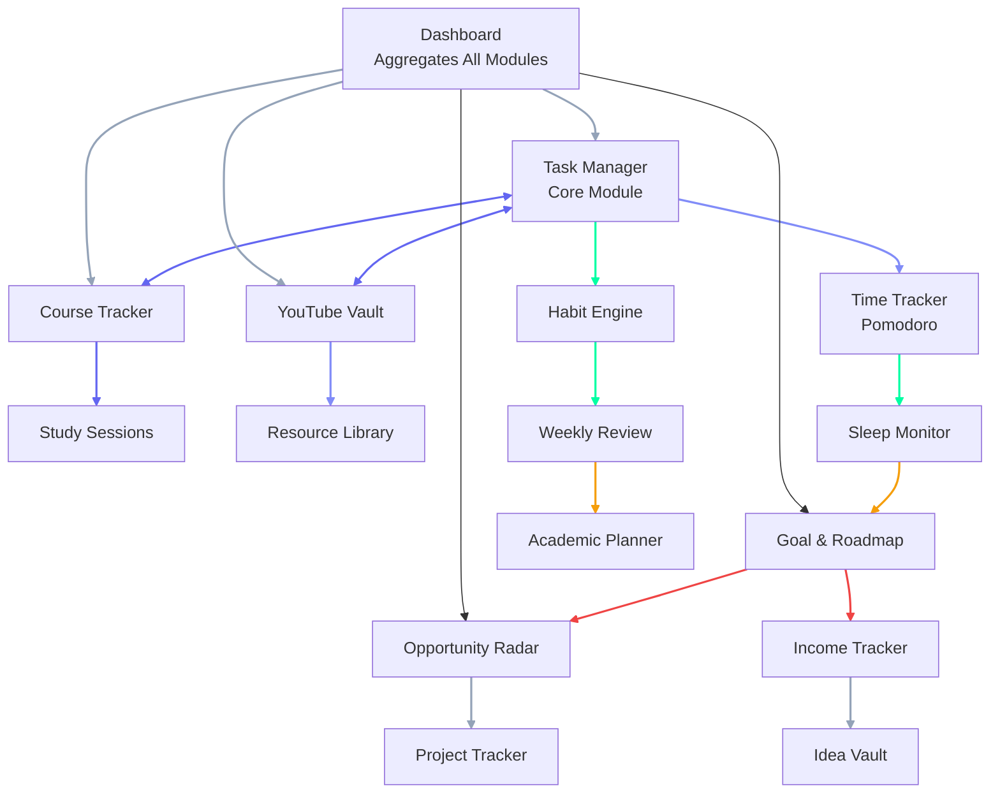
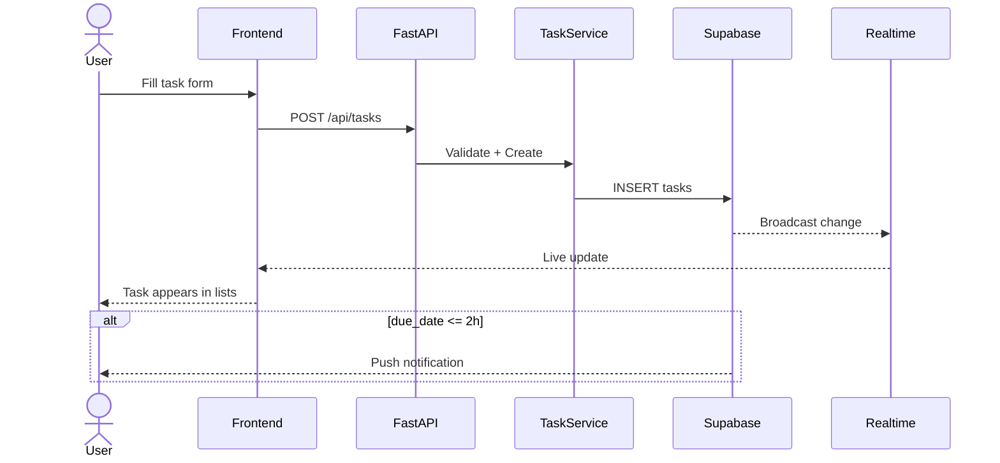
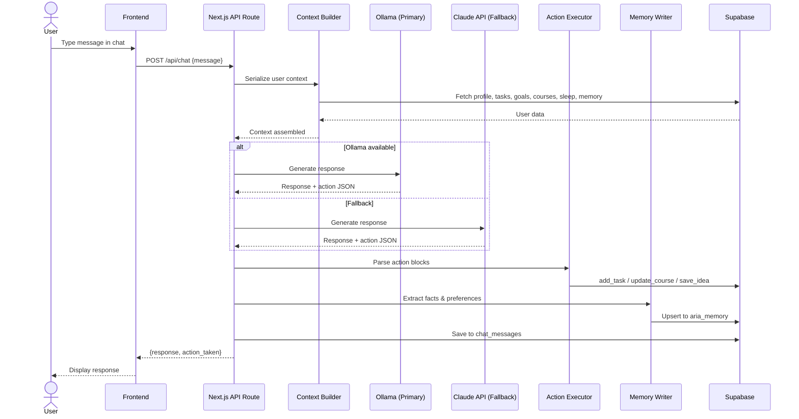
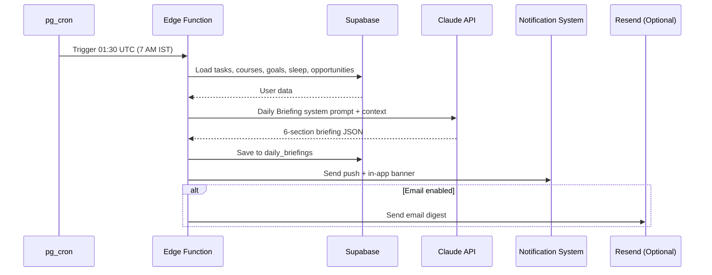
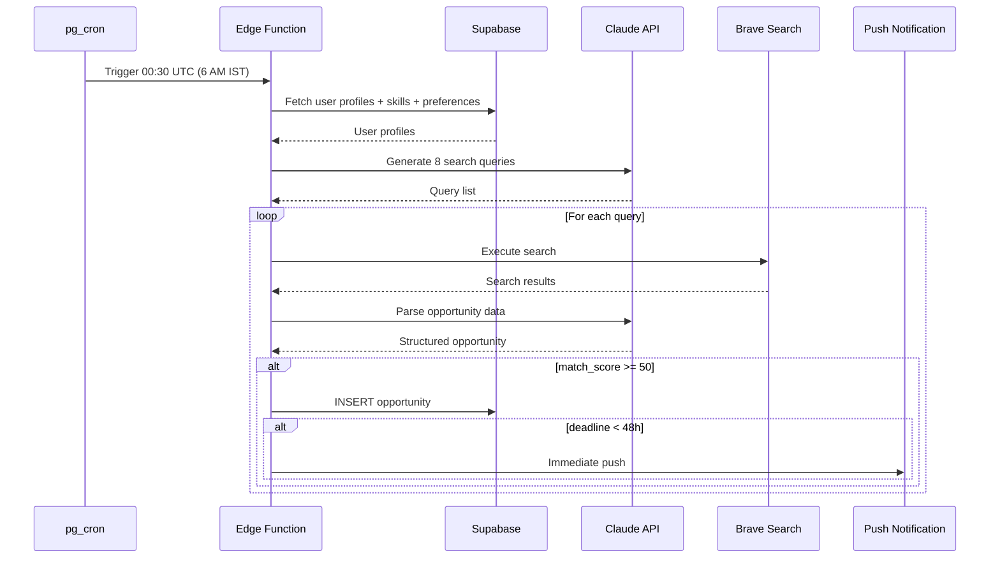
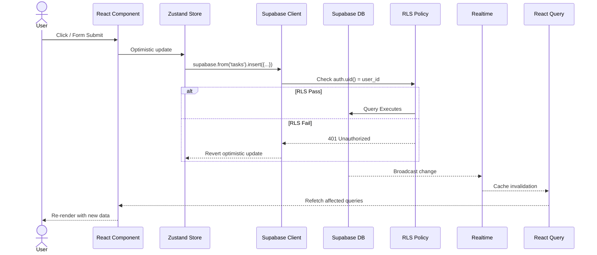
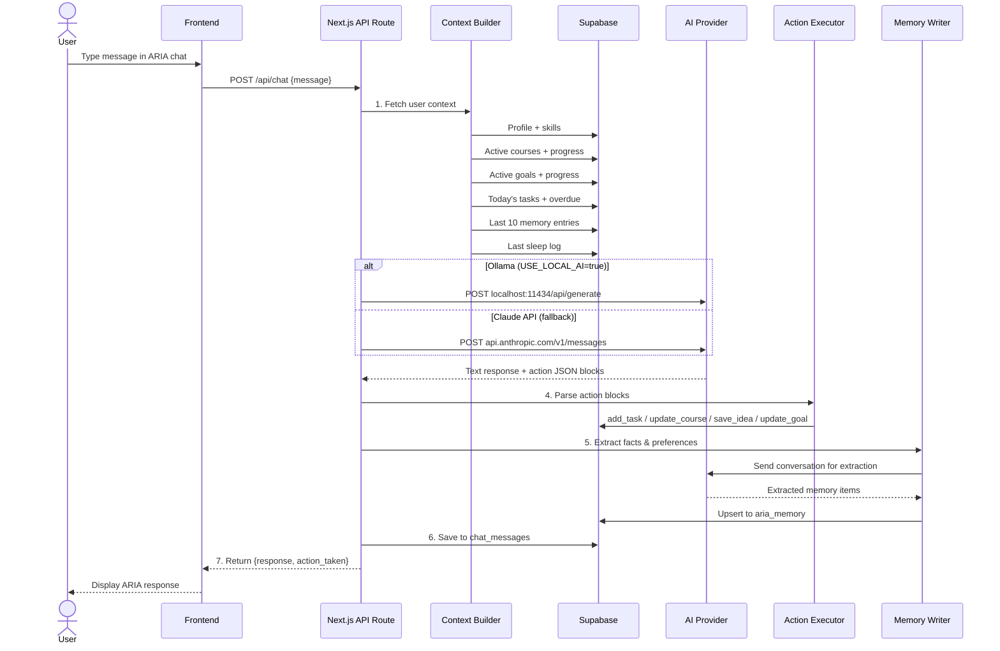
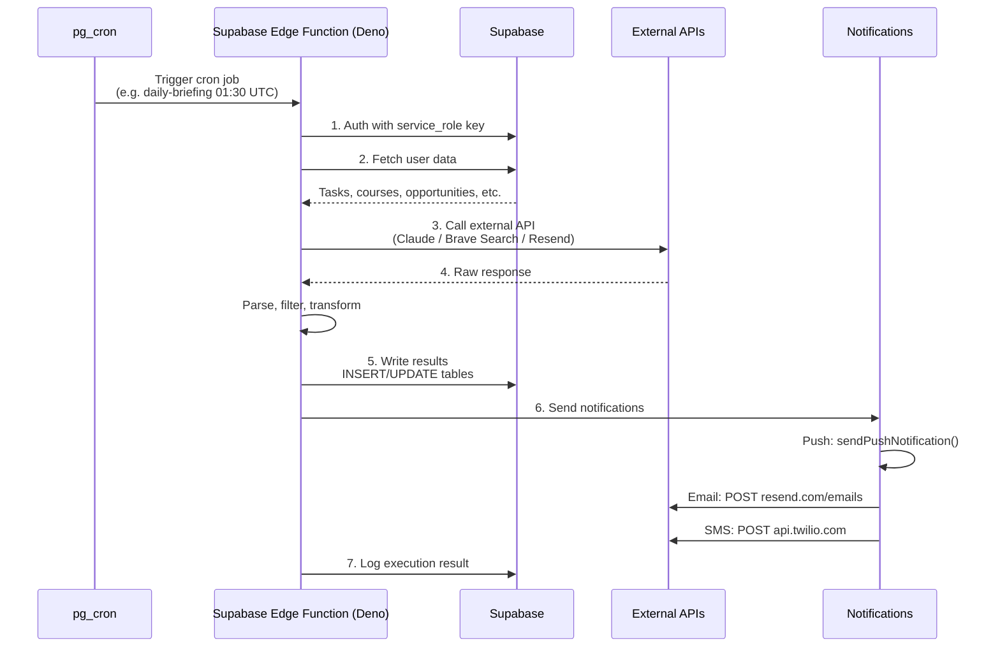
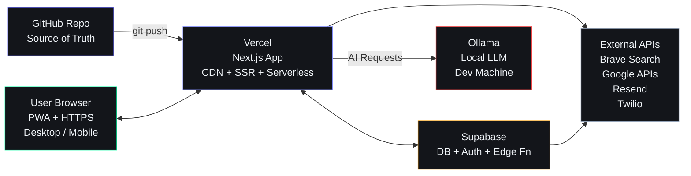

# Architecture

## Document Control

| Field | Value |
|---|---|
| **Document ID** | ENG-ARCH-001 |
| **Version** | 2.0.0 |
| **Status** | Active |
| **Date** | 2026-07-10 |
| **Classification** | Internal |
| **Owner** | Developer |
| **Review Cycle** | Monthly |
| **Related Docs** | [C4 Architecture](/docs/architecture/README.md), [BackendArchitecture](BackendArchitecture.md), [Schema](Schema.md), [ADRs](/docs/engineering/adr/), [AGENTS.md](/AGENTS.md) |

---

## Table of Contents

1. [System Overview](#system-overview)
2. [Architectural Philosophy](#architectural-philosophy)
3. [Component Responsibilities](#component-responsibilities)
4. [Module Dependency Graph](#module-dependency-graph)
5. [Data Flow](#data-flow)
6. [Request Lifecycle](#request-lifecycle)
7. [Integration Points](#integration-points)
8. [Deployment Architecture](#deployment-architecture)
9. [Offline Strategy](#offline-strategy)
10. [Security Architecture](#security-architecture)
11. [Tech Stack Summary](#tech-stack-summary)
12. [Component Diagram](#component-diagram)
13. [Cross-References](#cross-references)

---

## System Overview

```mermaid
graph TD
    subgraph Frontend["Frontend (Next.js)"]
        direction LR
        D1[Dashboard] --> State[Zustand + React Query]
        T1[Tasks] --> State
        C1[Courses] --> State
        CH[Chat] --> State
    end

    State -->|API Calls| API

    subgraph Backend["Backend (FastAPI)"]
        API[API Layer<br/>/tasks, /courses, /goals, /chat]
        API --> SVC[Service Layer<br/>TaskService, CourseService, GoalService]
        SVC --> DB[Database Layer<br/>Supabase: PostgreSQL + RLS + Realtime]
    end

    DB --> AI

    subgraph AI["AI Layer (Dual Mode)"]
        O[Ollama<br/>(Local LLM - Llama 3.1)] -->|Fallback| C[Claude API<br/>(Cloud)]
    end

    AI --> SA

    subgraph SA["Scheduled Agents (Edge Functions)"]
        direction LR
        SB[Daily Briefing<br/>7 AM]
        MT[Missed Task Checker<br/>Every 15 min]
        OR[Opportunity Radar<br/>6 AM]
        RU[Roadmap Update<br/>Sunday 9 AM]
        WR[Weekly Review<br/>Sunday 8 PM]
        SR[Sleep Reminder<br/>9:30 PM]
        HM[Habit Miss Checker<br/>Midnight]
        CN[Course Nudge<br/>6 PM]
    end

    style Frontend fill:#1a1a2e,stroke:#6366F1,color:#F1F5F9
    style Backend fill:#1a1a2e,stroke:#00FFA3,color:#F1F5F9
    style AI fill:#1a1a2e,stroke:#818CF8,color:#F1F5F9
    style SA fill:#1a1a2e,stroke:#F59E0B,color:#F1F5F9
```

---

## Architectural Philosophy

Second Brain OS is built on 7 core principles that drive every architectural decision:

1. **Offline-first** — Works without internet via PWA + IndexedDB + background sync
2. **Mobile-first** — 44px minimum touch targets, bottom nav, swipe gestures
3. **Agent-orchestrated** — 11 AI agents (plus 8 skill sub-agents) run automatically on schedules
4. **Privacy-first** — Data stays in user's Supabase instance, AI runs locally (Ollama)
5. **Modular** — All 15 features independently toggleable
6. **Real-time** — Supabase Realtime pushes live updates; no page refresh needed
7. **Predictive** — System learns patterns and anticipates needs after 3 months

---

## Component Responsibilities

### Frontend (Next.js)

**Pages/Routes:**
- `/` — Dashboard with morning briefing and productivity score
- `/tasks` — Task list, kanban, and time tracker
- `/courses` — Course tracker with progress and deadlines
- `/youtube` — YouTube knowledge vault
- `/resources` — Resource library with search
- `/ideas` — Idea vault with AI market check
- `/goals` — Roadmap builder (React Flow canvas)
- `/opportunities` — Opportunity radar results
- `/income` — Income tracker and hourly rate analysis
- `/projects` — Project tracker with phases
- `/academics` — Academic planner and CGPA calculator
- `/habits` — Habit engine with streaks
- `/sleep` — Sleep monitor with score
- `/time` — Time tracker with deep work detection
- `/chat` — ARIA chat panel

**State Management:**
- Zustand for global UI state (sidebar, modals, theme)
- React Query (TanStack Query) for server state
- localStorage/IndexedDB persistence for offline

**Key Libraries:**
- `framer-motion` — page transitions, staggered reveals
- `reactflow` — roadmap drag-and-drop canvas
- `recharts` — analytics charts and heatmaps
- `@supabase/auth-helpers-nextjs` — auth integration
- `zustand` — lightweight state management

### Backend (FastAPI)

**API Routes:**
- RESTful CRUD endpoints for all 15 modules
- WebSocket endpoint for real-time ARIA chat
- Server-side AI prompt construction

**Services:**
- Business logic per module (TaskService, CourseService, GoalService)
- AI context builder (serializes user profile, tasks, goals, courses)
- Action executor (parses AI response for JSON action blocks)

### Database (Supabase)

**Tables:** 27 tables as documented in Database.md

**Features Used:**
- PostgreSQL for structured storage
- RLS for row-level security on every table
- Realtime subscriptions for live UI updates
- Edge Functions for 15 cron-based agent schedules
- pg_cron for database-level cron scheduling

### AI Layer

**Ollama (Primary — Rs. 0):**
- Runs locally on developer machine
- Used for: ARIA chat responses, video summaries, resource tagging, habit reports
- Model: `llama3.1` (8B parameters)

**Claude API (Fallback — $5 credits):**
- Used for: Daily Briefing, Weekly Review, Opportunity parsing, Roadmap analysis
- Model: `claude-sonnet-4-20250514`
- Called only for complex reasoning tasks that exceed local LLM capability

### Scheduled Agents (8 total)

| Agent | Schedule | Function |
|-------|----------|----------|
| Daily Briefing | 7 AM daily | Generates morning intelligence report |
| Missed Task Checker | Every 15 min | Detects overdue tasks, auto-reschedules, escalates |
| Opportunity Radar | 6 AM daily | Scans 8 opportunity sources via Brave Search |
| Roadmap Update | Sunday 9 AM | Checks roadmap node validity against current data |
| Weekly Review | Sunday 8 PM | Compiles week data, generates narrative review |
| Bedtime Reminder | 9:30 PM daily | Wind-down nudge with tomorrow's first task |
| Habit Miss Checker | Midnight daily | Detects 2+ day habit misses, resets streaks |
| Course Progress Nudge | 6 PM daily | Checks daily study targets, alerts if behind |

---

## Module Dependency Graph



**Data Flow Between Modules:**

| Source | Target | Description |
|--------|--------|-------------|
| Task → Time | Data | Every timer session links to a task |
| Task → Goal | FK | Tasks optionally link to goals for progress tracking |
| Course → Task | Logic | Course generates daily study tasks automatically |
| Course → Goal | FK | Courses link to learning goals |
| Sleep → Task | Logic | Low sleep score → heavy tasks moved to tomorrow |
| Sleep → Habit | Logic | Sleep consistency tracked as a habit |
| Habit → Goal | Data | Habit completion contributes to goal progress |
| Goal → Roadmap | FK | Goals link to roadmap nodes for timeline tracking |
| Project → Task | Logic | Project `next_action` generates tasks |
| Project → Income | FK | Projects link to income sources |
| Idea → Project | Logic | Validated ideas become projects |
| Opportunity → Goal | Logic | Opportunities can trigger new roadmap creation |
| Income → Project | FK | Income sources link to their generating projects |
| Weekly → All | Logic | Weekly review aggregates all modules |

---

## Data Flow

### User Creates Task



### User Chats with ARIA



### Morning Briefing Generation



### Opportunity Radar Scan



### Missed Task Auto-Reschedule

```mermaid
flowchart TD
    PG[pg_cron triggers every 15 min] --> CHECK{Find tasks where<br/>due_date < now()<br/>AND status NOT IN<br/>done, archived}

    CHECK -->|Missed task found| PROC[For each missed task]
    PROC --> INC[Increment missed_count]
    INC --> STATUS[Set status = missed<br/>Set rescheduled_from = original_due_date]
    STATUS --> RESCHED[Set scheduled_start = now + 2h]
    RESCHED --> NOTIFY[Send Push Notification]

    NOTIFY --> LEVEL2{missed_count >= 2?}
    LEVEL2 -->|Yes| EMAIL[Send Email via Resend]
    LEVEL2 -->|No| DONE

    EMAIL --> LEVEL3{missed_count >= 3<br/>AND priority = high?}
    LEVEL3 -->|Yes| SMS[Send SMS via Twilio]
    LEVEL3 -->|No| DONE

    DONE([End])
```

---

## Request Lifecycle

### Typical API Request (Frontend → Supabase)



### AI Chat Request



### Edge Function Execution (Cron Agent)



---

## Integration Points

### Internal Integrations (within the system)

| Integration | Mechanism | Data Flow |
|-------------|-----------|-----------|
| Frontend ↔ Supabase | `@supabase/supabase-js` (Direct from client with RLS) | All CRUD operations |
| Frontend ↔ AI | Next.js API Routes (`/api/chat`) | Chat messages, context |
| Supabase ↔ Frontend | Supabase Realtime (WebSocket) | Live task/chat updates |
| Supabase ↔ External APIs | Edge Functions (Deno) | Cron agents calling Brave, Claude, Resend |
| Supabase ↔ Calendar | Next.js API Routes | OAuth2 + Google Calendar API |

### External Integrations

| Integration | Direction | Protocol | Auth Method |
|-------------|-----------|----------|-------------|
| **Ollama** | Backend → Localhost | HTTP POST `localhost:11434/api/generate` | None (localhost only) |
| **Claude API** | Backend → Cloud | HTTPS REST (`api.anthropic.com`) | API key header |
| **Brave Search** | Edge Fn → Cloud | HTTPS REST (`api.search.brave.com`) | API key header |
| **Google Calendar** | Backend ↔ Cloud | HTTPS REST (`www.googleapis.com/calendar/v3`) | OAuth2 (user token) |
| **Google Fit** | Backend → Cloud | HTTPS REST (`www.googleapis.com/fitness/v1`) | OAuth2 (user token) |
| **GitHub API** | Backend → Cloud | HTTPS REST (`api.github.com`) | OAuth2 (user token) |
| **Resend** | Backend → Cloud | HTTPS REST (`api.resend.com`) | API key header |
| **Twilio** | Backend → Cloud | HTTPS REST (`api.twilio.com`) | Account SID + Auth Token |
| **Web Push** | Backend → Browser | Web Push Protocol (VAPID) | VAPID keys |
| **YouTube oEmbed** | Backend → Cloud | HTTPS GET (`youtube.com/oembed`) | None (public API) |

### Integration Security Rules

1. All external API calls go through server-side routes (Next.js API routes, Edge Functions, or FastAPI)
2. No API keys or secrets ever appear in client-side JavaScript
3. OAuth tokens are stored in Supabase (users_profile table) encrypted at rest
4. Rate limits enforced per integration:
   - Brave Search: 50 queries/day across all users
   - Claude API: 10 requests/minute per user
   - GitHub API: 60 requests/hour (unauthenticated), 5,000/hour (authenticated)
   - Google APIs: per-user OAuth quota

---

## Deployment Architecture



**Hosting Strategy:**
- **Vercel**: Frontend Next.js app (static + serverless functions)
- **Supabase**: Managed PostgreSQL database, authentication, realtime, edge functions
- **Ollama**: Runs locally on developer's machine (no cloud hosting needed)
- **External APIs**: Called from server-side/edge functions only (API keys never in client)

---

## Offline Strategy

Second Brain OS is designed as an offline-first PWA. The system works without internet connectivity and syncs automatically when reconnected.

### Layer 1 — App Shell (Service Worker)

```
Offline → Workbox service worker serves cached app shell
Online  → Network-first strategy for API calls
```

- Workbox `StaleWhileRevalidate` for page routes
- Workbox `NetworkFirst` for `/api/*` requests
- Workbox `CacheFirst` for static assets (`_next/static`)

### Layer 2 — Local Data Store (IndexedDB)

```
Tables cached locally:
- tasks (recent 100 + today's)
- courses (active only)
- goals (active only)
- daily_briefings (current week)
- roadmaps (active only)
- habits (active only)
```

- Uses `idb` library for IndexedDB access
- Stores critical data needed for dashboard + task management
- Syncs on reconnect with background sync API

### Layer 3 — Background Sync

```
Offline action → Queued in IndexedDB → Online → Replay in order
```

- Queues: task creation, completion, course progress updates
- On reconnect: replays queued actions against Supabase
- Conflict resolution: last-write-wins with server timestamp

### Layer 4 — Optimistic Updates

```
UI update → Immediate (no wait for server)
Server response → Confirm or revert
```

- Tasks marked complete appear done immediately
- If server rejects, UI reverts with toast notification
- Used for: task status, habit completion, timer start/stop

---

## Security Architecture

### Authentication

```
Layer 1: Supabase Auth (Google OAuth primary)
Layer 2: Magic link (fallback)
Layer 3: JWT session (auto-refresh, 7-day expiry)
Layer 4: Force logout all devices (Settings page)
```

### Authorization

```
Every database query filtered by: auth.uid() = user_id
Enforced at 3 levels:
  1. RLS on all 27 tables (database level)
  2. API middleware validates JWT (application level)
  3. Service layer re-checks user_id (business logic level)
```

### Data Protection

| Area | Implementation |
|------|---------------|
| Data in transit | TLS 1.3 for all HTTP traffic |
| Data at rest | AES-256 encryption (Supabase managed) |
| API keys | Vercel env variables only, never in client code |
| AI queries | Claude calls go through server routes only |
| Browser extension | Only sends explicitly-saved URLs |
| File uploads | Type/size validation, max 10 MB |
| Rate limiting | AI: 10/min, Auth: 5 attempts then lockout, Uploads: 10/hour |

### Row Level Security

Every table has the standard policy:

```sql
ALTER TABLE table_name ENABLE ROW LEVEL SECURITY;

CREATE POLICY "users_own_data" ON table_name
  FOR ALL
  USING (auth.uid() = user_id)
  WITH CHECK (auth.uid() = user_id);
```

### API Key Safety Rules

1. `SUPABASE_SERVICE_ROLE_KEY` never in client code (server-only routes)
2. `ANTHROPIC_API_KEY` never in client code (Next.js API routes only)
3. `BRAVE_API_KEY` never in client code (Edge Functions only)
4. `.env.local` never committed to GitHub (in `.gitignore` from Day 1)
5. `NEXT_PUBLIC_*` variables are the only ones safe for client side

---

## Tech Stack Summary

| Layer | Technology | Free Tier |
|-------|-----------|-----------|
| Frontend | Next.js 14 + Tailwind CSS + TypeScript | Free |
| State | Zustand + React Query | Free |
| Charts | Recharts | Free |
| Canvas | React Flow | Free (MIT) |
| Backend | FastAPI (Python) + Next.js API Routes | Free |
| Database | Supabase PostgreSQL | 500 MB free |
| Auth | Supabase Auth (Google OAuth) | Free |
| Realtime | Supabase Realtime | Free |
| AI (Primary) | Ollama + Llama 3.1 (local) | Free |
| AI (Fallback) | Claude API (Anthropic) | $5 credits |
| Email | Resend | 3,000/month free |
| SMS | Twilio | $15 credits |
| Push | Web Push + VAPID | Free |
| Voice | Web Speech API | Free |
| Search | Brave Search API | 2,000 queries/month |
| Hosting | Vercel | Free |
| Extension | WXT Framework | Free |
| Monitoring | Sentry | 5,000 errors/month |
| Offline | Workbox + IndexedDB | Free |
| OCR | Tesseract.js | Free |
| PDF | pdf-parse | Free |

---

## Component Diagram

```mermaid
graph TD
    subgraph SBO["Second Brain OS"]
        subgraph PL["Presentation Layer"]
            P[Pages - 15 Modules]
            C[Components - Cards]
            L[Layout - Shell]
            N[NavBar]
            M[Modals]
            PR[Providers - Theme]
        end

        PL --> SL

        subgraph SL["State Layer"]
            Z[Zustand Stores<br/>Global UI State]
            RQ[React Query Cache<br/>Server State]
            IDB[IndexedDB<br/>Offline Persistence]
        end

        SL --> AL

        subgraph AL["API Layer"]
            REST[REST Routes - /api/*]
            WS[WebSocket - /ws/aria]
            AM[Auth Middleware]
            RS[Realtime Subs<br/>supabase-realtime]
        end

        AL --> SVL

        subgraph SVL["Service Layer"]
            TSK[TaskSvc]
            CRS[CourseSvc]
            GLS[GoalSvc]
            MMS[MemorySvc]
            PJS[ProjectSvc]
            IDS[IdeaSvc]
            SPS[SleepSvc]
            CTS[ChatSvc]
        end

        SVL --> AIL

        subgraph AIL["AI Layer"]
            CB[Context Builder]
            OC[Ollama Client<br/>Primary]
            CC[Claude Client<br/>Fallback]
            AE[Action Executor]
            MW[Memory Writer]
            LO[LangChain Orchestrator<br/>8 Agents]
        end

        AIL --> DL

        subgraph DL["Data Layer"]
            SDB[Supabase DB<br/>21 Tables - RLS - PostgreSQL]
            SA[Supabase Auth<br/>Google OAuth - JWT]
            EF[Edge Functions<br/>8 Cron Agents - Deno]
        end
    end

    style SBO fill:#0A0B0F,stroke:#334155,color:#F1F5F9
    style PL fill:#13151A,stroke:#6366F1,color:#F1F5F9
    style SL fill:#13151A,stroke:#818CF8,color:#F1F5F9
    style AL fill:#13151A,stroke:#00FFA3,color:#F1F5F9
    style SVL fill:#13151A,stroke:#F59E0B,color:#F1F5F9
    style AIL fill:#13151A,stroke:#EF4444,color:#F1F5F9
    style DL fill:#13151A,stroke:#94A3B8,color:#F1F5F9
```



---

## Cross-References

| Document | Description |
|---|---|
| [C4 Architecture](/docs/architecture/README.md) | C4 model: system context, containers, components, deployment |
| [BackendArchitecture](BackendArchitecture.md) | Detailed backend: FastAPI DI, middleware, auth, patterns |
| [Schema](Schema.md) | Complete column-level database schema (27 tables) |
| [ERD](ERD.md) | Entity relationship diagram with cardinalities |
| [Decision Log](/docs/architecture/decision-log.md) | All 15 ADRs indexed with cross-references |
| [AGENTS.md §6](/AGENTS.md) | Project structure with file purposes |
| [AGENTS.md §8](/AGENTS.md) | API endpoint reference (31 routers) |
| [AGENTS.md §12](/AGENTS.md) | Common patterns for adding endpoints, agents, pages |
```
