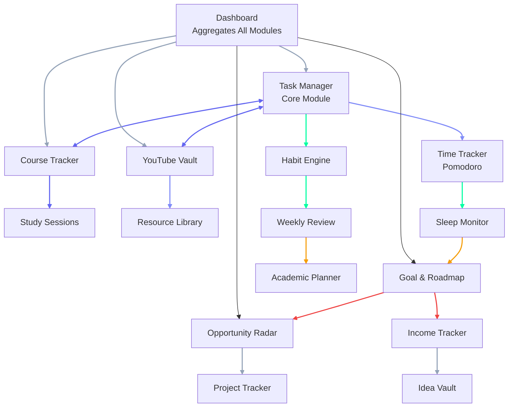
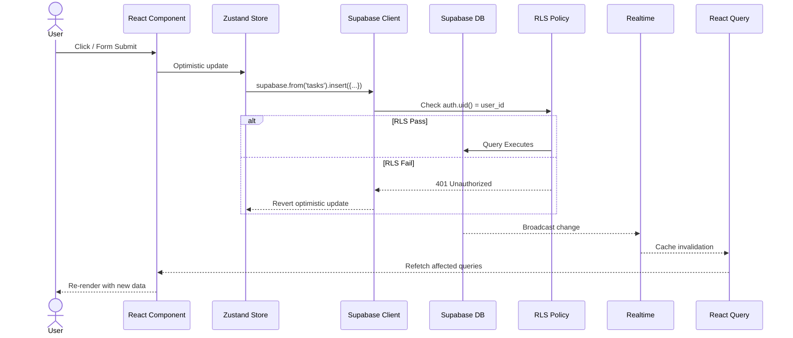
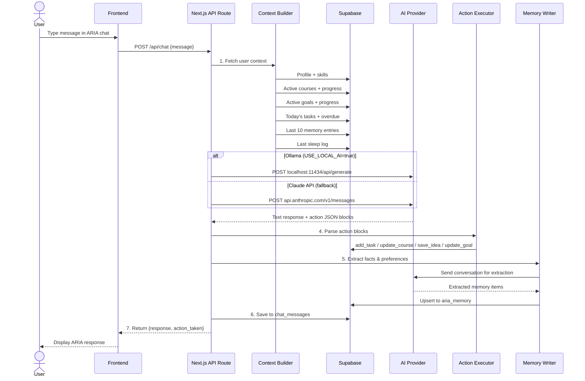
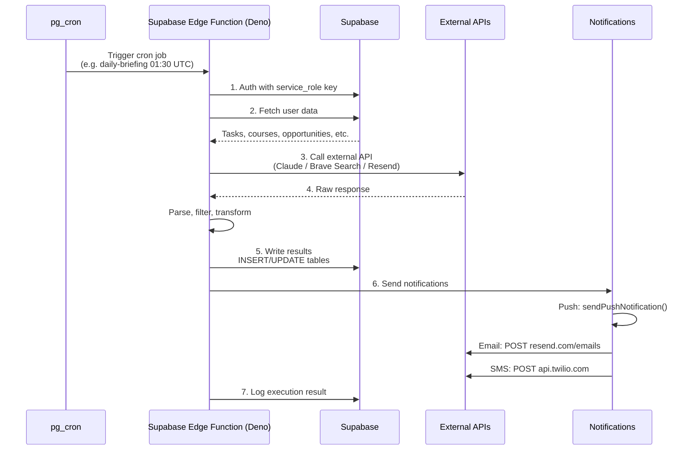

# System Architecture (10,000ft View)

## Architectural Philosophy

Second Brain OS is built on 7 core principles that drive every architectural decision:

1. **Offline-first** — Works without internet via PWA + IndexedDB + background sync
2. **Mobile-first** — 44px minimum touch targets, bottom nav, swipe gestures
3. **Agent-orchestrated** — 8 AI agents run automatically on schedules
4. **Privacy-first** — Data stays in user's Supabase instance, AI runs locally (Ollama)
5. **Modular** — All 15 features independently toggleable
6. **Real-time** — Supabase Realtime pushes live updates; no page refresh needed
7. **Predictive** — System learns patterns and anticipates needs after 3 months

---

## Monorepo Layout

```mermaid
graph TD
    ROOT[ARIA OS - SecondBrain]

    subgraph Apps["apps/ — Deployable Applications"]
        WEB[web/<br/>Next.js 14 Frontend]
        API[api/<br/>FastAPI Backend]
        ADMIN[admin/<br/>Admin Panel<br/>(WIP)]
        MOBILE[mobile/<br/>React Native<br/>(WIP)]

        subgraph WebDetail["web/ details"]
            APP[app/<br/>15 module pages]
            COMP[components/<br/>Shared UI]
            LIB[lib/<br/>Stores + Utils]
            HOOKS[hooks/<br/>Custom Hooks]
            PUBLIC[public/<br/>Assets + Manifest]
        end

        subgraph ApiDetail["api/ details"]
            ROUTES[api/routes<br/>REST per module]
            SVC[services/<br/>Business logic]
            AI_SVC[ai/<br/>Context + Actions]
        end
    end

    subgraph Packages["packages/ — Shared Libraries"]
        AGENTS[ai/agents/<br/>8 AI Agent Modules]
        CONFIG[config/core/<br/>FastAPI + Auth + Supabase]
        SCHEMAS[database/schemas/<br/>Pydantic Models]
        UTILS[shared/utils/<br/>Logging, Cache, Retry]
        TYPES[types/<br/>Shared Type Definitions]
        UI[ui/<br/>Shared React Components]
    end

    subgraph Services["services/ — Background"]
        SCHED[scheduler/<br/>APScheduler]
        CRON[crons/<br/>7 Job Definitions]
    end

    subgraph Infra["infrastructure/ — IaC (WIP)"]
        DOCKER[docker/<br/>Compose]
        TF[terraform/<br/>Cloud Provisioning]
        K8S[k8s/<br/>Kubernetes Manifests]
    end

    subgraph Docs["docs/ — Documentation"]
        DP[product/]
        DD[design/]
        DE[engineering/]
        DA[ai/]
        DS[security/]
        DVD[devops/]
        DO[operations/]
    end

    subgraph Testing["tests/"]
        TU[unit/]
        TI[integration/]
        TE[e2e/<br/>Playwright]
    end

    ROOT --> Apps
    ROOT --> Packages
    ROOT --> Services
    ROOT --> Infra
    ROOT --> Docs
    ROOT --> Testing
    ROOT --> scripts[scripts/<br/>Build + Deploy]
    ROOT --> analytics[analytics/]
    ROOT --> monitoring[monitoring/<br/>Sentry + Uptime]
    ROOT --> CFG[package.json + turbo.json + AGENTS.md + README.md]

    style ROOT fill:#0A0B0F,stroke:#6366F1,color:#F1F5F9,font-weight:bold
    style Apps fill:#13151A,stroke:#00FFA3,color:#F1F5F9
    style Packages fill:#13151A,stroke:#818CF8,color:#F1F5F9
    style Services fill:#13151A,stroke:#F59E0B,color:#F1F5F9
    style Infra fill:#13151A,stroke:#EF4444,color:#F1F5F9
    style Docs fill:#13151A,stroke:#94A3B8,color:#F1F5F9
    style Testing fill:#13151A,stroke:#6366F1,color:#F1F5F9
```

---

## Module Dependency Graph



**Data Flow Between Modules:**

| Source | Target | Description |
|--------|--------|-------------|
| Task → Time | Data | Every timer session links to a task |
| Task → Goal | FK | Tasks optionally link to goals for progress tracking |
| Course → Task | Logic | Course generates daily study tasks automatically |
| Course → Goal | FK | Courses link to learning goals |
| Sleep → Task | Logic | Low sleep score → heavy tasks moved to tomorrow |
| Sleep → Habit | Logic | Sleep consistency tracked as a habit |
| Habit → Goal | Data | Habit completion contributes to goal progress |
| Goal → Roadmap | FK | Goals link to roadmap nodes for timeline tracking |
| Project → Task | Logic | Project `next_action` generates tasks |
| Project → Income | FK | Projects link to income sources |
| Idea → Project | Logic | Validated ideas become projects |
| Opportunity → Goal | Logic | Opportunities can trigger new roadmap creation |
| Income → Project | FK | Income sources link to their generating projects |
| Weekly → All | Logic | Weekly review aggregates all modules |

---

## Request Lifecycle

### Typical API Request (Frontend → Supabase)



### AI Chat Request



### Edge Function Execution (Cron Agent)



---

## Integration Points

### Internal Integrations (within the system)

| Integration | Mechanism | Data Flow |
|-------------|-----------|-----------|
| Frontend ↔ Supabase | `@supabase/supabase-js` (Direct from client with RLS) | All CRUD operations |
| Frontend ↔ AI | Next.js API Routes (`/api/chat`) | Chat messages, context |
| Supabase ↔ Frontend | Supabase Realtime (WebSocket) | Live task/chat updates |
| Supabase ↔ External APIs | Edge Functions (Deno) | Cron agents calling Brave, Claude, Resend |
| Supabase ↔ Calendar | Next.js API Routes | OAuth2 + Google Calendar API |

### External Integrations

| Integration | Direction | Protocol | Auth Method |
|-------------|-----------|----------|-------------|
| **Ollama** | Backend → Localhost | HTTP POST `localhost:11434/api/generate` | None (localhost only) |
| **Claude API** | Backend → Cloud | HTTPS REST (`api.anthropic.com`) | API key header |
| **Brave Search** | Edge Fn → Cloud | HTTPS REST (`api.search.brave.com`) | API key header |
| **Google Calendar** | Backend ↔ Cloud | HTTPS REST (`www.googleapis.com/calendar/v3`) | OAuth2 (user token) |
| **Google Fit** | Backend → Cloud | HTTPS REST (`www.googleapis.com/fitness/v1`) | OAuth2 (user token) |
| **GitHub API** | Backend → Cloud | HTTPS REST (`api.github.com`) | OAuth2 (user token) |
| **Resend** | Backend → Cloud | HTTPS REST (`api.resend.com`) | API key header |
| **Twilio** | Backend → Cloud | HTTPS REST (`api.twilio.com`) | Account SID + Auth Token |
| **Web Push** | Backend → Browser | Web Push Protocol (VAPID) | VAPID keys |
| **YouTube oEmbed** | Backend → Cloud | HTTPS GET (`youtube.com/oembed`) | None (public API) |

### Integration Security Rules

1. All external API calls go through server-side routes (Next.js API routes, Edge Functions, or FastAPI)
2. No API keys or secrets ever appear in client-side JavaScript
3. OAuth tokens are stored in Supabase (users_profile table) encrypted at rest
4. Rate limits enforced per integration:
   - Brave Search: 50 queries/day across all users
   - Claude API: 10 requests/minute per user
   - GitHub API: 60 requests/hour (unauthenticated), 5,000/hour (authenticated)
   - Google APIs: per-user OAuth quota

---

## Tech Stack Summary

| Layer | Technology | Free Tier |
|-------|-----------|-----------|
| Frontend | Next.js 14 + Tailwind CSS + TypeScript | Free |
| State | Zustand + React Query | Free |
| Charts | Recharts | Free |
| Canvas | React Flow | Free (MIT) |
| Backend | FastAPI (Python) + Next.js API Routes | Free |
| Database | Supabase PostgreSQL | 500 MB free |
| Auth | Supabase Auth (Google OAuth) | Free |
| Realtime | Supabase Realtime | Free |
| AI (Primary) | Ollama + Llama 3.1 (local) | Free |
| AI (Fallback) | Claude API (Anthropic) | $5 credits |
| Email | Resend | 3,000/month free |
| SMS | Twilio | $15 credits |
| Push | Web Push + VAPID | Free |
| Voice | Web Speech API | Free |
| Search | Brave Search API | 2,000 queries/month |
| Hosting | Vercel | Free |
| Extension | WXT Framework | Free |
| Monitoring | Sentry | 5,000 errors/month |
| Offline | Workbox + IndexedDB | Free |
| OCR | Tesseract.js | Free |
| PDF | pdf-parse | Free |

---

## Build Phases Overview

| Phase | Weeks | Modules |
|-------|-------|---------|
| 1. Core Foundation | 1-2 | Auth, Tasks, Courses, Dashboard, Profile |
| 2. Save Everything | 3-4 | YouTube Vault, Resources, Ideas, Browser Extension |
| 3. ARIA + Memory | 5-6 | Chat, Memory, Daily Briefing, Weekly Review |
| 4. Opportunity Radar | 7-9 | Brave Search, Opportunity parser, Notifications |
| 5. Roadmap Engine | 10-11 | React Flow, Text/Image/PDF-to-roadmap, AI updates |
| 6. Income + Projects | 12-13 | Income, Projects, Academics, Habits, Sleep |
| 7. Reminders + Time | 14-15 | Push/Email/SMS, Time tracking, Calendar sync |
| 8. PWA + Polish | 16-17 | Offline support, Voice input, Onboarding, Data export |

Total build time: 17 weeks. Each phase is independently useful and deployable.
