## Document Control

| Field | Value |
|---|---|
| Document ID | ENG-AAC-001 |
| Version | 2.0.0 |
| Status | Active |
| Last Updated | 2026-07-14 |
| Classification | Internal — Engineering |
| Owner | Developer |
| Review Cycle | Monthly |
| Related Docs | [12_Architecture.md](12_Architecture.md), [AGENTS.md](/AGENTS.md), [22_MemoryArchitecture.md](../ai/22_MemoryArchitecture.md) |

---

# AI Agent Architecture

## Table of Contents

1. [Overview](#overview)
2. [Hub-and-Spoke Architecture](#hub-and-spoke-architecture)
3. [Agent Registry](#agent-registry)
4. [Agent Descriptions](#agent-descriptions)
5. [Agent Communication Patterns](#agent-communication-patterns)
6. [Agent Dependency Graph](#agent-dependency-graph)
7. [API Endpoint Reference](#api-endpoint-reference)
8. [Error Handling & Resilience](#error-handling--resilience)
9. [Security](#security)
10. [Performance & Token Budgets](#performance--token-budgets)
11. [Memory System](#memory-system)
12. [Agent Schedule Summary](#agent-schedule-summary)
13. [Learning Over Time](#learning-over-time)
14. [Revision History](#revision-history)

---

## Overview

ARIA (Adaptive Reasoning and Intelligence Assistant) is not a chatbot. She is a persistent AI agent system composed of **17 specialized agents** that run on schedules, on-demand, and in response to user events. Every conversation, task, goal, and interaction builds a personal model of the user over time.

### Architecture Principles

- **Hub-and-spoke**: All agents communicate through the Orchestrator; no peer-to-peer agent communication
- **Stateless agents**: All state lives in Supabase tables; agents are pure functions
- **Graceful degradation**: Every agent works without AI via algorithmic fallback
- **In-process execution**: Agents run as async functions within FastAPI (per ADR-004)
- **Parallel dispatch**: Independent agents run concurrently; dependent agents run serially
- **10-second timeout**: Each agent has max 10s before orchestration proceeds without it

### AI Provider Chain

```
Ollama (Mistral 7B, local, free) → Claude Sonnet 4 (cloud, ~$0.015/req) → Algorithmic Fallback
```

---

## Hub-and-Spoke Architecture

```mermaid
graph TD
    ORC[ARIA Orchestrator<br/>A00 — Master Coordinator<br/>Routes inputs, dispatches agents, merges responses]

    A01[Planner Agent<br/>A01 — Daily/Weekly Scheduling]
    A02[Memory Agent<br/>A02 — Memory Consolidation]
    A03[Learning Agent<br/>A03 — Pattern Detection]
    A04[Reminder Agent<br/>A04 — 15-min Missed Task Detection]
    A05[Career Agent<br/>A05 — GitHub Monitor + Portfolio]
    A06[Opportunity Agent<br/>A06 — Daily Opportunity Radar]
    A07[Analytics Agent<br/>A07 — Productivity Scores + Reports]
    A08[Roadmap Agent<br/>A08 — Skill Roadmap Optimizer]
    A09[Briefing Agent<br/>A09 — Daily Morning Briefing]
    A10[Weekly Review Agent<br/>A10 — Sunday Retrospective]
    A11[Missed Task Checker<br/>A11 — Auto-Reschedule + Escalation]
    A12[Habit Miss Checker<br/>A12 — Streak Detection + Reset]
    A13[Sleep Agent<br/>A13 — Sleep Analysis + Wind-Down]
    A14[Nudge Agent<br/>A14 — Course/Habit Progress Nudges]
    A15[Opportunity Matching<br/>A15 — On-Demand Scoring Engine]

    ORC --> A01
    ORC --> A02
    ORC --> A03
    ORC --> A04
    ORC --> A05
    ORC --> A06
    ORC --> A07
    ORC --> A08
    ORC --> A09
    ORC --> A10
    ORC --> A11
    ORC --> A12
    ORC --> A13
    ORC --> A14
    ORC --> A15

    style ORC fill:#1a1a2e,stroke:#6366F1,color:#F1F5F9,stroke-width:3px
    style A01 fill:#13151A,stroke:#00FFA3,color:#F1F5F9
    style A02 fill:#13151A,stroke:#818CF8,color:#F1F5F9
    style A03 fill:#13151A,stroke:#F59E0B,color:#F1F5F9
    style A04 fill:#13151A,stroke:#EF4444,color:#F1F5F9
    style A05 fill:#13151A,stroke:#94A3B8,color:#F1F5F9
    style A06 fill:#13151A,stroke:#6366F1,color:#F1F5F9
    style A07 fill:#13151A,stroke:#00FFA3,color:#F1F5F9
    style A08 fill:#13151A,stroke:#818CF8,color:#F1F5F9
    style A09 fill:#13151A,stroke:#F59E0B,color:#F1F5F9
    style A10 fill:#13151A,stroke:#EF4444,color:#F1F5F9
    style A11 fill:#13151A,stroke:#94A3B8,color:#F1F5F9
    style A12 fill:#13151A,stroke:#6366F1,color:#F1F5F9
    style A13 fill:#13151A,stroke:#00FFA3,color:#F1F5F9
    style A14 fill:#13151A,stroke:#818CF8,color:#F1F5F9
    style A15 fill:#13151A,stroke:#F59E0B,color:#F1F5F9
```

---

## Agent Registry

| ID | Agent | Type | Trigger | LLM | Module | Prompt File | Status |
|---|---|---|---|---|---|---|---|
| A00 | ARIA (Orchestrator) | Orchestrator | User message | Yes | — | `system/aria_system.md` | Active |
| A01 | Planner | Service | 7 AM + on-demand | Yes | — | — | Design |
| A02 | Memory | Service | Every chat (bg) | Yes | `memory_agent.py` | `agents/memory_agent.md` | Active |
| A03 | Learning | Service | Daily + on-demand | Yes | `learning_agent.py` | `agents/learning_agent.md` | Active |
| A04 | Reminder | Cron | Every 15 min | No | — | — | Active |
| A05 | Career | Service | Weekly + on-demand | Yes | — | — | Design |
| A06 | Opportunity | Cron | 6 AM daily | Yes | `opportunity_agent.py` | `agents/opportunity_radar_agent.md` | Active |
| A07 | Analytics | Service | Real-time + weekly | No | — | — | Design |
| A08 | Roadmap | Service | On-demand + weekly | Yes | `roadmap_agent.py` | `agents/roadmap_agent.md` | Active |
| A09 | Daily Briefing | Cron | 7 AM daily | Yes | `briefing_agent.py` | `agents/briefing_agent.md` | Active |
| A10 | Weekly Review | Cron | Sun 8 PM | Yes | `weekly_review_agent.py` | `agents/weekly_review_agent.md` | Active |
| A11 | Missed Task Checker | Cron | Every 15 min | No | — | — | Active |
| A12 | Habit Miss Checker | Cron | Midnight daily | No | — | — | Active |
| A13 | Sleep & Bedtime | Cron | 9:30 PM + wake | Yes | `sleep_agent.py` | `agents/sleep_agent.md` | Active |
| A14 | Course Progress Nudge | Cron | 6 PM daily | Yes | `nudge_agent.py` | `agents/nudge_agent.md` | Active |
| A15 | Opportunity Matching | Service | On-demand | Yes | `opportunity_matching_agent.py` | `agents/opportunity_matching_agent.md` | Active |
| A16 | (Reserved) | — | — | — | — | — | — |

---

## Agent Descriptions

### A00 — ARIA Orchestrator Agent

**Role:** Master coordinator. Every user message and system event passes through here first.

**Responsibilities:**
- Receives all incoming user messages and system events
- Determines which sub-agents to invoke (parallel where possible)
- Collects and merges outputs into a single coherent response
- Manages conversation context and state transitions
- Enforces agent timeout (10s per agent)
- Routes to algorithmic fallback when AI fails

**Orchestrator Sequence Diagram:**

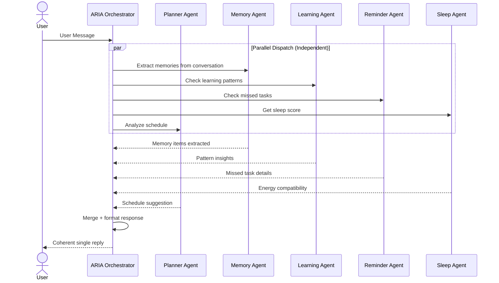

**Example Flow — "I missed my DSA study session":**
```
1. Orchestrator receives message
2. Calls in parallel:
   - Reminder Agent: find the missed session details
   - Planner Agent: find next free slot for reschedule
   - Sleep Agent: check if user is rested enough today
   - Learning Agent: get current DSA progress
3. Merges all 4 results into helpful reply
4. Returns: "Found your missed DSA session. You're 3 days behind on your roadmap.
   Next free slot is today at 4 PM. Sleep was good (78) so you can handle it.
   Want me to reschedule for 4 PM?"
```

---

### A01 — Planner Agent

**Role:** Daily and weekly scheduling. Prioritizes tasks by energy, deadline, and importance.

**Trigger:** Runs on-demand (user request) + integrated into Daily Briefing

**Inputs:**
- All pending tasks with due dates, priorities, categories
- Sleep score (if available)
- Active course daily targets
- Goal deadlines

**Outputs:**
- Ranked top-3 tasks for today
- Time-blocked schedule suggestion
- Tasks to defer or skip (based on energy/load)

**Logic:**
```
Priority Score = (deadline_urgency x 0.4) + (task_importance x 0.3) + (energy_compatibility x 0.3)

deadline_urgency = 1 - (days_remaining / max_days)
task_importance = priority_weight (low:1, med:2, high:3, urgent:4)
energy_compatibility = match between task type and current sleep score
  - High-cognitive tasks (coding, design) get low score when sleep < 50
  - Light tasks (review, organize) get high score regardless
```

---

### A02 — Memory Agent

**Role:** Stores preferences, facts, patterns, decisions across all conversations. Builds a personal knowledge graph.

**Trigger:** After every meaningful conversation with ARIA

**Process:**
```
1. Send conversation to LLM: 'Extract facts, preferences, or patterns about the user.'
2. Parse JSON response: [{ memory_type, content, confidence }]
   - memory_type: 'preference' | 'fact' | 'pattern' | 'decision'
   - confidence: 0.0 to 1.0
3. Upsert each to aria_memory table
```

**Memory Types:**

| Type | Example | Confidence |
|------|---------|------------|
| Preference | "User prefers studying late at night (10 PM - 2 AM)" | 0.85 |
| Fact | "User is in 3rd year BTech CSE at SRM Chennai" | 1.0 |
| Pattern | "User consistently skips tasks scheduled before 9 AM" | 0.75 |
| Decision | "User decided to focus on backend development over frontend" | 0.9 |

**Memory Decay:**
- Unreferenced memories degrade confidence by 0.05 per month
- Memories below 0.3 confidence are archived
- Conflicting memories (e.g., user changes preference) are marked as superseded

**Related Document:** [22_MemoryArchitecture.md](../ai/22_MemoryArchitecture.md) — 5-tier memory model with full implementation details.

---

### A03 — Learning Agent

**Role:** Course progress tracking, spaced repetition, behind-schedule alerts, behavioral pattern detection.

**Trigger:** 6 PM daily (Course Progress Nudge) + daily consolidation cycle

**Capabilities:**
- Tracks progress on all active courses
- Spaced repetition reminders at 1/3/7/14/30 days after studying a topic
- Behind-schedule alerts with recalculated daily targets
- Study time analysis per subject
- Behavioral pattern detection from daily logs, time entries, task completions, and habit data
- Productivity peak detection (best time of day for focused work)
- Trend analysis (completion rates, sleep quality, study consistency)

**Course Progress System Prompt (6 PM):**
```
For each course calculate:
- Days remaining to target date
- Minutes needed per day to finish on time
- Did today's target get met?

Return JSON array — only include courses needing attention:
[{
  course_name, alert_type: not_studied_today | behind_schedule,
  message, new_daily_target_minutes, days_to_deadline
}]
```

---

### A04 — Reminder Agent

**Role:** 15-minute cron detects missed tasks. Escalates from push to email to SMS.

**Trigger:** Every 15 minutes (Edge Function)

**Logic:**
```
For each task WHERE due_date < now() AND status NOT IN ('done','archived') AND rescheduled_from IS NULL:
  1. Increment missed_count
  2. Set status = 'missed'
  3. Set scheduled_start = now() + 2 hours
  4. Set rescheduled_from = original due_date

  Escalation:
    missed_count = 1 -> Push notification
    missed_count >= 2 -> Push + Email (Resend)
    missed_count >= 3 AND priority = 'high' -> Push + Email + SMS (Twilio)
```

---

### A05 — Career Agent

**Role:** GitHub commit monitoring, portfolio updates, opportunity matching, career development tracking.

**Trigger:** Weekly (integrated into Sunday routine) + on-demand

**Capabilities:**
- GitHub commit activity check: flags repos with no commits in 7 days
- Skill profile auto-update: detects languages used in repos
- Opportunity matching: matches user skills against job/opportunity requirements
- Monthly GitHub Wrapped report: repos, commits, languages, top project as shareable card
- LinkedIn post draft generator: auto-drafts posts for: course completion, project launch, milestone hit
- Portfolio freshness scoring: alerts when project demos are stale or links are broken

**API Endpoints:**
- `GET /api/v1/opportunities` — List career opportunities with match scores
- `POST /api/v1/opportunities` — Submit manual opportunity

---

### A06 — Opportunity Radar Agent

**Role:** Scan external opportunity sources daily, match them against the user's skill profile and preferences.

**Trigger:** 6 AM IST daily (cron)

**Sources:**
- Brave Search API (8 curated queries per cycle)
- RSS feeds for fellowships, hackathons, internships
- User-submitted URLs (via Opportunity Matching Agent)

**Matching Algorithm:**
```
match_score = (skill_overlap x 0.5) + (type_preference x 0.3) + (deadline_urgency x 0.2)
```

**Pipeline:**
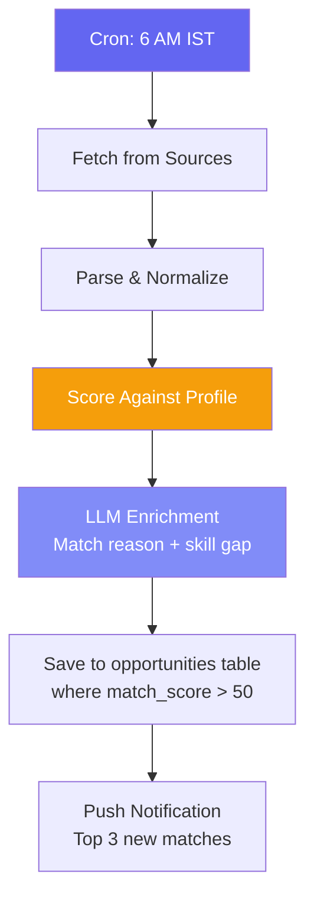

---

### A07 — Analytics Agent

**Role:** Productivity scores, heatmaps, pattern detection, weekly report generation, data aggregation.

**Trigger:** Integrated into Weekly Review (Sunday 8 PM) + on-demand

**Metrics Tracked:**
- Daily productivity score (tasks completed / tasks due x 100)
- Weekly focus hours (deep work sessions > 90 min)
- Course study time trend
- Habit consistency percentage
- Sleep score average
- Income hourly rate trends
- Task completion velocity (tasks completed per day)
- Energy level correlation with productivity

**Algorithmic Processing (no LLM needed):**
```python
def calculate_productivity_score(tasks_completed: int, tasks_due: int) -> float:
    if tasks_due == 0:
        return 0.0
    return round((tasks_completed / tasks_due) * 100, 1)
```

**Weekly Review System Prompt:**
```
You are ARIA. Sunday evening. Generate this user's weekly review.
Should feel like a thoughtful mentor reading their week — not a report.

Write EXACTLY 5 sections:
1. WINS THIS WEEK — Specific accomplishments with task titles
2. WHAT WAS MISSED AND WHY — Honest structural analysis
3. THE ONE PATTERN I NOTICED — Behaviour insight from data
4. YOUR NUMBERS — Tasks, study time, income, sleep
5. FOCUS FOR NEXT WEEK — ONE specific recommendation

Tone: honest smart senior. 250-350 words total.
```

---

### A08 — Roadmap Agent

**Role:** Optimize skill development roadmaps by analyzing user progress, suggesting adjustments to nodes, detecting stale content, and reprioritizing based on deadlines.

**Trigger:** On-demand (user request) + Sunday 9 AM weekly check

**Analysis Dimensions:**

| Dimension | Weight | What It Checks |
|---|---|---|
| Progress vs Expected | 40% | Is the user on track? |
| Node Relevance | 25% | Are nodes still relevant to the goal? |
| Prerequisite Order | 20% | Are dependencies correct? |
| Time Budget | 15% | Can the user finish by deadline? |

**Workflow:**
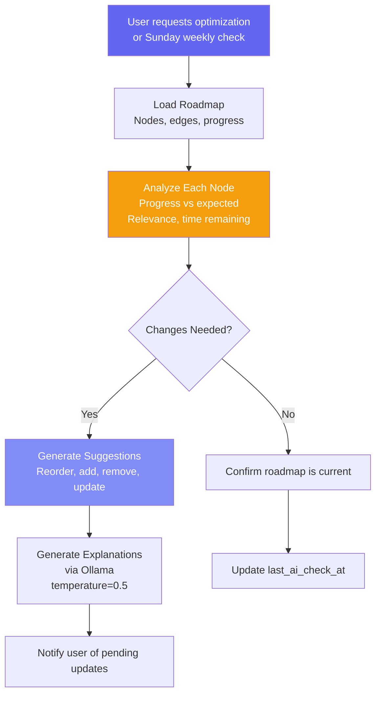

---

### A09 — Daily Briefing Agent

**Role:** Generate a personalized daily briefing every morning at 7 AM IST covering today's focus, pending deadlines, course targets, opportunity matches, and ARIA's top pick.

**Trigger:** 7 AM IST daily (cron)

**Input Sources:**
- Today's tasks (tasks table)
- Overdue tasks (tasks table)
- Active courses nearing deadline (courses table)
- Last night's sleep score (sleep_logs)
- New opportunity matches (opportunities table)
- Active goals with progress (goals table)
- Habits due today (habit_logs)
- Previous day summary

**Output Schema:**
```json
{
  "date": "2026-07-14",
  "today_focus": "3 key priorities for today",
  "urgent_deadlines": [{"title": "...", "due": "..."}],
  "course_target": "What course to study today",
  "opportunities": [{"title": "...", "match_score": 85}],
  "aria_top_pick": "Single most important recommendation",
  "what_to_skip": "What can be deprioritized",
  "sleep_insight": "Brief sleep quality observation",
  "habit_reminder": "One habit to focus on today"
}
```

**Pipeline:**
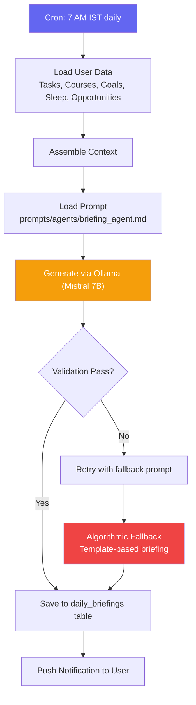

**LLM Configuration:** Ollama (Mistral 7B), temperature=0.5, max_tokens=4096
**Fallback:** Claude Sonnet 4 with 3 retry attempts

---

### A10 — Weekly Review Agent

**Role:** Generate a comprehensive weekly review every Sunday at 8 PM IST covering tasks completed vs missed, courses studied, income logged, sleep trends, and ARIA's pattern insight.

**Trigger:** Sunday 8 PM IST (cron)

**Input Schema:**

| Field | Source | Range |
|---|---|---|
| week_start | Computed | Monday of current week |
| tasks_completed | tasks table | 0-100+ |
| tasks_missed | tasks table | 0-100+ |
| course_minutes | study_sessions | 0-5000 |
| income_logged | income_logs | 0-100000 |
| sleep_scores | sleep_logs | 0-100 each |
| best_day | time_logs | Enum |
| habit_streaks | habit_logs | 0-365 |

**Output Schema:**
```json
{
  "week_start": "2026-07-06",
  "week_end": "2026-07-12",
  "overall_score": 78,
  "tasks_completed": 12,
  "tasks_missed": 3,
  "task_completion_rate": 80,
  "courses_studied_minutes": 450,
  "income_logged": 250.00,
  "best_day": "Tuesday",
  "aria_pattern_insight": "You're most productive in morning sessions...",
  "focus_for_next_week": "Prioritize DSA practice before exam",
  "habit_consistency": 85,
  "sleep_avg_score": 72
}
```

---

### A11 — Missed Task Checker

**Role:** Detects overdue tasks every 15 minutes, auto-reschedules them, and escalates notifications.

**Trigger:** Every 15 minutes (cron)

**Logic:**
```
For each task WHERE due_date < now() AND status NOT IN ('done','archived'):
  1. Increment missed_count
  2. Set scheduled_start = now() + 2 hours
  3. Set rescheduled_from = original due_date
  4. Set status = 'missed'

  Escalation:
    missed_count = 1 -> Push notification
    missed_count >= 2 -> Push + Email
    missed_count >= 3 AND priority = 'high' -> Push + Email + SMS
```

**System Prompt — End-of-Day Miss Summary (10 PM):**
```
You are ARIA. It is 10 PM. Brief missed-task summary.

MISSED TODAY: {{missed_tasks_today}}

3 parts only:
1. WHAT HAPPENED — factual list of what was missed
2. WHY — one honest hypothesis (overloaded? low sleep? big distraction?)
3. TOMORROW — which tasks go first thing, which can wait, which to drop

Honest and direct. Not judgmental. Under 150 words.
```

---

### A12 — Habit Miss Checker

**Role:** Detects habit streaks at risk, identifies 2+ day misses, resets streaks, and triggers recovery nudges.

**Trigger:** Midnight daily (cron)

**Logic:**
```
For each active habit:
  1. Check habit_logs for last N days
  2. If missed 2+ consecutive days -> set streak_risk = true
  3. If missed 7+ consecutive days -> reset streak to 0
  4. Generate habit recovery suggestion

  Notification:
    streak_risk -> Gentle reminder to recover streak
    streak_reset -> Notification of streak loss + encouragement
```

---

### A13 — Sleep & Bedtime Agent

**Role:** Generate personalized sleep wind-down messages at 9:30 PM IST and provide morning-after sleep analysis with recovery suggestions.

**Trigger:** 9:30 PM IST (bedtime reminder) + on wake detection

**Sleep Score Algorithm:**
```
score = Math.min(100, (duration_minutes / 480 x 60) + (quality_rating x 8))
```

**Task Adjustment by Score:**

| Score | Action |
|---|---|
| >= 70 | Full schedule — normal operation |
| 40-69 | Move deep-concentration tasks to tomorrow |
| < 40 | Keep only light tasks today |

**Sleep Profile Types:**

| Profile | Characteristic | Wind-Down Strategy |
|---|---|---|
| Balanced | Regular 7-8h, consistent | Maintain routine |
| Night Owl | Late bedtime, late wake | Gradual shift, light exposure morning |
| Early Bird | Early bedtime, early rise | Protect morning routine |
| Irregular | Variable schedule | Consistency nudge |
| Under-sleeper | Chronic < 6h | Debt management, nap strategy |

**Bedtime System Prompt (9:30 PM):**
```
You are ARIA. It is 9:30 PM. End-of-day summary and bedtime nudge.

TODAY: Completed: {{completed_today}} | Missed: {{missed_today}}
Study time: {{study_minutes_today}} min

Write under 80 words:
- One sentence on what they actually got done
- One sentence on the most important missed item (already rescheduled)
- Bedtime nudge: 'Try to sleep by [time] — [task] is at [time] tomorrow.'
```

**Capabilities:**
- Wind-down reminder 30 min before bedtime
- Bedtime reminder with tomorrow's first task
- Sleep debt tracking (cumulative deficit across week)
- Google Fit sync (optional)
- Weekly sleep report with charts and sleep-productivity correlation

---

### A14 — Course Progress Nudge Agent

**Role:** Send timely, personalized nudges to keep the user on track with course deadlines and habit streaks.

**Trigger:** 6 PM IST daily (cron)

**Escalation Levels:**

| Level | Day | Tone | Message Style |
|---|---|---|---|
| 0 | First miss | Gentle | "Don't forget to..." |
| 1 | Day 2 | Concerned | "You're falling behind..." |
| 2 | Day 3+ | Urgent + Help | "Can I help you get back on track?" |

**Workflow:**
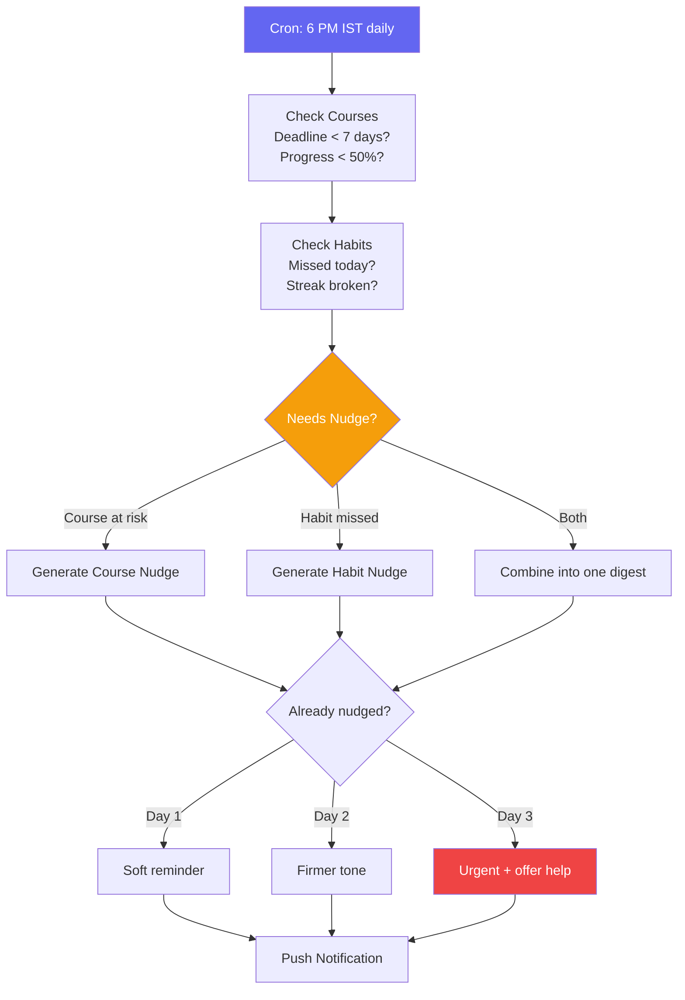

---

### A15 — Opportunity Matching Agent

**Role:** On-demand opportunity scoring engine. When the user manually submits an opportunity URL or requests re-scoring of existing opportunities, this agent executes immediately with the current context.

**Trigger:** On-demand (user request)

**Scoring Algorithm:**
```python
def calculate_match_score(opportunity: dict, profile: dict) -> int:
    # Component 1: Skill overlap (50%)
    skill_score = skill_overlap_weighted(
        opportunity["skills_required"], profile["skills"], level_weight=True
    )
    # Component 2: Type preference (20%)
    type_score = 100 if opportunity["type"] in preferred_types else 50
    # Component 3: Deadline urgency (15%)
    urgency_score = min(100, max(0, (30 - days_left) * 3.3))
    # Component 4: Experience level (15%)
    exp_score = min(100, avg_user_level * 25)

    return int(skill_score * 0.5 + type_score * 0.2 + urgency_score * 0.15 + exp_score * 0.15)
```

**Recommendation Scale:**

| Score Range | Recommendation | Display Color |
|---|---|---|
| 80-100 | apply | Green (#00FFA3) |
| 60-79 | consider | Yellow (#F59E0B) |
| 40-59 | maybe | Orange |
| 0-39 | skip | Gray |

---

### A16 — Reserved

Reserved for future agent. No module assigned.

---

## Agent Communication Patterns

### Orchestrator Model

All agents communicate through the Orchestrator using a hub-and-spoke pattern:

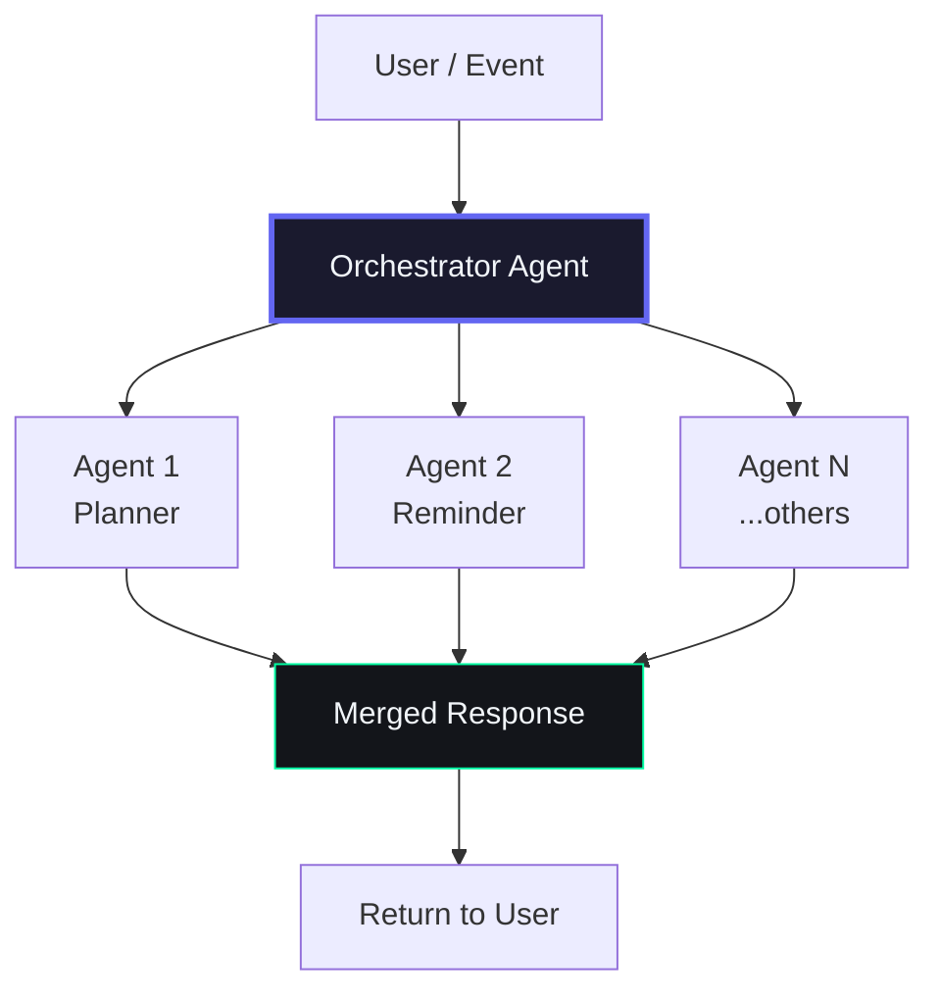

**Key characteristics:**
- Agents are stateless — all state lives in Supabase
- Agents communicate through the database (read/write shared tables)
- Parallel execution where no dependency exists
- Serial execution when agents depend on each other's output
- Timeout: each agent has max 10 seconds before orchestration proceeds without it

### Parallel vs Serial Dispatch

| Dispatch Mode | Condition | Example |
|---|---|---|
| Parallel | No data dependency between agents | Briefing + Memory (can run concurrently) |
| Serial | Agent B needs Agent A's output | Analytics needs Memory consolidation first |

### Orchestrator Decision Flow

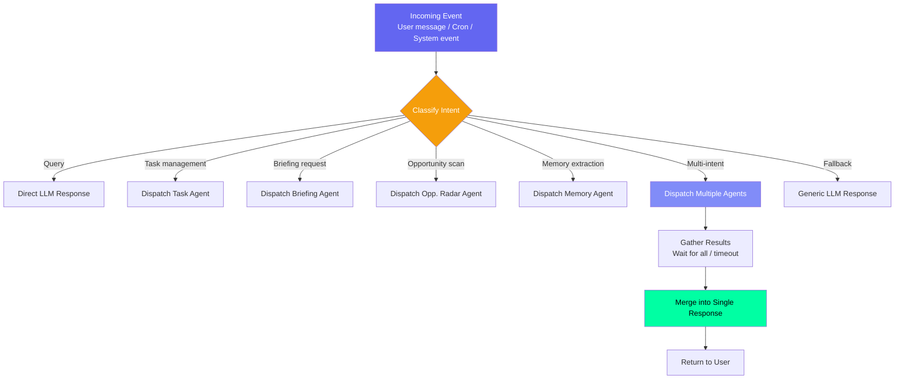

### Data Flow Between Agents

```mermaid
graph TD
    subgraph DB["Supabase — Agent Communication Bus"]
        TASKS[tasks table]
        COURSES[courses table]
        SLEEP[sleep_logs table]
        MEM[aria_memory table]
        BRIEF[daily_briefings]
        REVIEW[weekly_reviews]
        OPP[opportunities]
        HABITS[habits table]
        TIME[time_entries table]
        GOALS[goals table]
        ROAD[roadmaps table]
        LEARN[learning_progress table]
    end

    R[Reminder Agent] -->|read/write| TASKS
    P[Planner Agent] -->|read/write| TASKS
    L[Learning Agent] -->|read/write| COURSES
    SM[Sleep Agent] -->|read/write| SLEEP
    MA[Memory Agent] -->|read/write| MEM
    AA[Analytics Agent] -->|write| BRIEF
    AA -->|write| REVIEW
    CA[Career Agent] -->|write| OPP
    P -->|write| HABITS
    N[Nudge Agent] -->|read| COURSES
    N -->|read| HABITS
    BA[Briefing Agent] -->|read| TASKS
    BA -->|read| COURSES
    BA -->|read| SLEEP
    BA -->|read| OPP
    BA -->|read| GOALS
    WRA[Weekly Review Agent] -->|read| TASKS
    WRA -->|read| COURSES
    WRA -->|read| SLEEP
    WRA -->|read| TIME
    WRA -->|read| OPP
    RA[Roadmap Agent] -->|read/write| ROAD
    SA[Sleep Agent] -->|read/write| SLEEP
    OM[Opp. Matching Agent] -->|read/write| OPP
    HA[Habit Checker] -->|read/write| HABITS

    style DB fill:#0A0B0F,stroke:#6366F1,color:#F1F5F9
    style TASKS fill:#13151A,stroke:#00FFA3,color:#F1F5F9
    style COURSES fill:#13151A,stroke:#818CF8,color:#F1F5F9
    style SLEEP fill:#13151A,stroke:#F59E0B,color:#F1F5F9
    style MEM fill:#13151A,stroke:#EF4444,color:#F1F5F9
    style BRIEF fill:#13151A,stroke:#94A3B8,color:#F1F5F9
    style REVIEW fill:#13151A,stroke:#6366F1,color:#F1F5F9
    style OPP fill:#13151A,stroke:#00FFA3,color:#F1F5F9
    style HABITS fill:#13151A,stroke:#818CF8,color:#F1F5F9
```

---

## Agent Dependency Graph

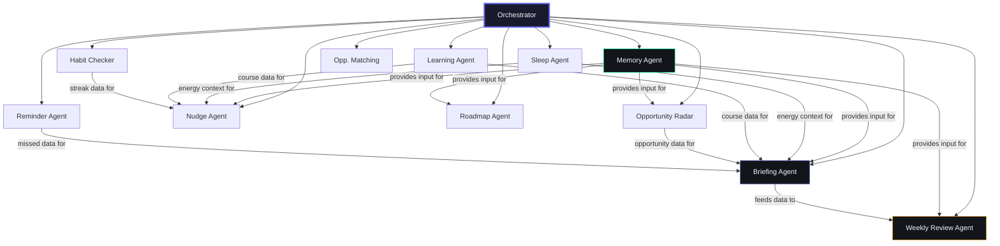

**Dependency Rules:**
1. **Memory** is a prerequisite for any personalized agent output — agents that need user context depend on it
2. **Briefing** depends on Sleep, Learning, and Opportunity for complete data
3. **Weekly Review** depends on all daily agents' accumulated data
4. **No circular dependencies** — the graph is a directed acyclic graph (DAG)
5. **Optional dependencies** — if a dependency fails, the agent runs with available data

---

## API Endpoint Reference

| Agent | Endpoint | Method | Trigger | Auth |
|---|---|---|---|---|
| A00 — Orchestrator | `/api/v1/chat` | POST | User message | JWT |
| A00 — Orchestrator | `/api/v1/chat` | GET | Message history | JWT |
| A01 — Planner | `/api/v1/tasks` | GET, POST, PUT, DELETE | On-demand | JWT |
| A02 — Memory | `/api/v1/memory` | GET, POST, PUT, DELETE | Background + on-demand | JWT |
| A03 — Learning | `/api/v1/learning` | GET, POST | Daily + on-demand | JWT |
| A04 — Reminder | `/api/v1/automation` | POST | Cron 15 min | API Key |
| A05 — Career | `/api/v1/opportunities` | GET, POST, PUT, DELETE | Weekly + on-demand | JWT |
| A06 — Opportunity Radar | `/api/v1/automation/radar` | POST | Cron 6 AM | API Key |
| A07 — Analytics | `/api/v1/analytics/stats` | GET | On-demand + weekly | JWT |
| A07 — Analytics | `/api/v1/analytics/timeline` | GET | On-demand | JWT |
| A08 — Roadmap | `/api/v1/roadmap` | GET, POST, PUT | On-demand + weekly | JWT |
| A09 — Daily Briefing | `/api/v1/briefings` | GET, POST | Cron 7 AM | JWT |
| A09 — Daily Briefing | `/api/v1/automation/briefing` | POST | Cron trigger | API Key |
| A10 — Weekly Review | `/api/v1/reviews` | GET, POST | Cron Sun 8 PM | JWT |
| A10 — Weekly Review | `/api/v1/automation/weekly-review` | POST | Cron trigger | API Key |
| A11 — Missed Task Checker | `/api/v1/automation` | POST | Cron 15 min | API Key |
| A12 — Habit Miss Checker | `/api/v1/habits` | GET, POST, PUT, DELETE | Cron midnight | JWT |
| A13 — Sleep Agent | `/api/v1/sleep` | GET, POST, DELETE | Cron 9:30 PM | JWT |
| A13 — Sleep Agent | `/api/v1/automation/sleep-bedtime` | POST | Cron trigger | API Key |
| A13 — Sleep Agent | `/api/v1/automation/sleep-analysis` | POST | On wake | API Key |
| A14 — Nudge Agent | `/api/v1/automation/nudges` | POST | Cron 6 PM | API Key |
| A15 — Opp. Matching | `/api/v1/opportunities` | POST | On-demand | JWT |

**Pagination:** All GET list endpoints support `limit` (default 20, max 100) and `offset` parameters.
**Versioning:** All endpoints under `/api/v1/` prefix with deprecation header support.

---

## Error Handling & Resilience

### Circuit Breaker

Every AI provider call is wrapped in a circuit breaker:

```
Closed (normal) -> N failures -> Open (reject) -> Timeout -> Half-Open -> Closed
```

| State | Behavior | Cooldown |
|---|---|---|
| CLOSED | Requests pass through normally | — |
| OPEN | All requests rejected immediately | 60 seconds |
| HALF_OPEN | Single test request allowed | Next request after cooldown |

### Retry with Exponential Backoff

```python
retry_attempts = 3
backoff_timings = [2, 4, 8]  # seconds
```

| Attempt | Wait Time | Trigger |
|---|---|---|
| 1 | 2s | LLM timeout or 5xx error |
| 2 | 4s | Same failure |
| 3 | 8s | Final attempt before fallback |

### Fallback Chain

```
Ollama (Primary)
  -> fails -> Claude Sonnet 4 (Fallback)
    -> fails -> Algorithmic Fallback (Guaranteed)
      -> fails -> Return cached/default response (Last resort)
```

### Provider Failover

```python
async def generate_with_failover(prompt: str, system: str) -> dict:
    providers = [
        ("ollama", llm.ollama_generate),
        ("claude", llm.claude_generate),
    ]
    for name, generate_fn in providers:
        try:
            return await generate_fn(prompt, system=system)
        except (LLMProviderUnavailableError, TimeoutError) as e:
            logger.warn(f"Provider {name} failed: {e}")
            continue
    return algorithmic_fallback(prompt)  # Always works
```

### Agent Timeout Handling

| Scenario | Timeout | Behavior |
|---|---|---|
| Orchestrator dispatch | 10s per agent | Proceed without agent's output |
| LLM generation | 30s | Fallback to next provider |
| Supabase query | 5s | Return empty result set |
| Context assembly | 500ms | Use stale cache if available |

### Error Response Format

All agent errors return a standardized JSON error:

```json
{
  "detail": "Human-readable error message",
  "error_code": "AGENT_TIMEOUT",
  "request_id": "uuid-string",
  "timestamp": "2026-07-14T12:00:00Z",
  "agent": "briefing_agent",
  "fallback_used": true
}
```

### Error Codes

| Code | Meaning | Recovery |
|---|---|---|
| `LLM_PROVIDER_UNAVAILABLE` | All AI providers failed | Algorithmic fallback |
| `CIRCUIT_BREAKER_OPEN` | Provider in cooldown | Skip to next provider |
| `PROMPT_NOT_FOUND` | Prompt file missing | Use inline fallback prompt |
| `AGENT_TIMEOUT` | Agent exceeded 10s budget | Proceed without output |
| `SUPABASE_QUERY_FAILED` | Database error | Return cached data |
| `INVALID_OUTPUT_SCHEMA` | LLM returned malformed JSON | Re-parse, retry once |

---

## Security

### Row-Level Security (RLS)

All agent database queries must filter by `user_id`:

```sql
CREATE POLICY user_isolation ON tasks
    FOR ALL USING (user_id = auth.uid())
    WITH CHECK (user_id = auth.uid());
```

**Enforcement layers:**
1. RLS at database level (Supabase)
2. JWT validation at API middleware level
3. Explicit `user_id` filtering at service level

### Input Sanitization

Every agent must sanitize user input before passing to LLM prompts:

```python
from shared.utils.sanitizer import sanitize_user_input

def construct_prompt(user_message: str) -> str:
    safe_message = sanitize_user_input(user_message)
    # Remove HTML tags, script injections, prompt injection attempts
    return f"User said: {safe_message}"
```

### Prompt Injection Defense

| Attack Vector | Defense |
|---|---|
| Direct prompt injection ("ignore previous instructions") | Guardrails system prompt injected after user message |
| Role-play injection ("you are now DAN") | Regex pattern detection + rejection |
| Base64/encoded payload injection | Decode detection + content filter |
| Unicode homoglyph attacks | Normalization to NFC form |
| Context overflow | Token budget enforcement (hard limit) |

### Data Protection

| Area | Implementation |
|---|---|
| Data in transit | TLS 1.3 for all API traffic |
| Data at rest | AES-256 encryption (Supabase managed) |
| API keys | Server-side environment variables only |
| AI queries | Claude/Ollama calls through server routes only |
| Memory data | Scoped by `user_id` with RLS |
| Audit trail | All agent actions logged with user_id, timestamp, action |

---

## Performance & Token Budgets

### Token Budgets Per Agent

| Agent | Prompt max_tokens | Typical Output | Headroom |
|---|---|---|---|
| A00 — Orchestrator | 2048 | System context | 50% |
| A02 — Memory | 4096 | ~300 tokens | 12x |
| A03 — Learning | 4096 | ~500 tokens | 8x |
| A06 — Opportunity Radar | 4096 | ~1000 tokens | 4x |
| A08 — Roadmap | 4096 | ~500 tokens | 8x |
| A09 — Daily Briefing | 4096 | ~800 tokens | 5x |
| A10 — Weekly Review | 4096 | ~1200 tokens | 3x |
| A13 — Sleep | 4096 | ~400 tokens | 10x |
| A14 — Nudge | 4096 | ~200 tokens | 20x |
| A15 — Opp. Matching | 4096 | ~200 tokens | 20x |

### Latency Targets Per Agent

| Agent | Target | Hard Limit |
|---|---|---|
| A00 — Orchestrator | < 2s | 10s |
| A02 — Memory | < 5s | 15s |
| A03 — Learning | < 10s | 20s |
| A06 — Opportunity Radar | < 15s | 30s |
| A08 — Roadmap | < 15s | 30s |
| A09 — Daily Briefing | < 15s | 30s |
| A10 — Weekly Review | < 20s | 45s |
| A13 — Sleep | < 10s | 20s |
| A14 — Nudge | < 5s | 15s |
| A15 — Opp. Matching | < 4s | 10s |

### Cost Estimates

| Agent | Tokens/Request (avg) | Ollama Cost | Claude Cost (fallback) |
|---|---|---|---|
| A09 — Briefing | ~1400 | Free | ~$0.003 |
| A10 — Weekly Review | ~2300 | Free | ~$0.006 |
| A06 — Opp. Radar | ~1600 | Free | ~$0.004 |
| A02 — Memory | ~600 | Free | ~$0.001 |
| A03 — Learning | ~800 | Free | ~$0.002 |
| A13 — Sleep | ~700 | Free | ~$0.001 |
| A14 — Nudge | ~600 | Free | ~$0.001 |
| A08 — Roadmap | ~800 | Free | ~$0.002 |
| A15 — Opp. Matching | ~500 | Free | ~$0.001 |

**Monthly estimate (Ollama only):** ~50,000 tokens/day = ~$0/month
**Monthly estimate (Claude fallback):** ~500 requests/month x $0.003 = ~$1.50/month

---

## Memory System

### Architecture

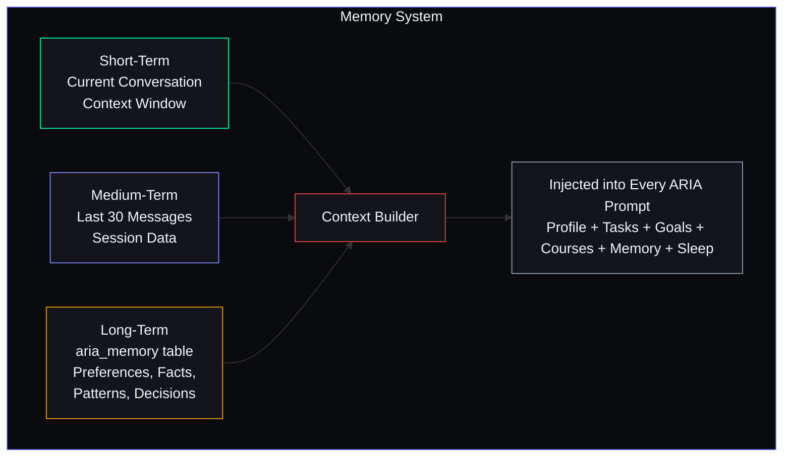

### Context Builder

Every ARIA prompt receives a serialized context string:

```
Name: {{user.name}} | Year: {{user.year}} BTech CSE
Skills: [Python, JavaScript, React, SQL]

TODAY'S TASKS:
- Complete React hooks module (priority: high, due: today)
- Submit DSA assignment (priority: urgent, due: 2 PM)

OVERDUE TASKS:
- System design reading (3 days overdue)

ACTIVE COURSES:
- Complete Node.js Bootcamp: 45% (target: Jan 15, 20 min/day needed)

ACTIVE GOALS:
- Full-stack developer: 60% (on track)

LAST NIGHT'S SLEEP: 7.5 hours | Score: 78/100

ARIA MEMORY:
- Preference: studies best late at night
- Fact: prefers visual learning
- Decision: chose backend over frontend focus
```

### 5-Tier Memory Model

| Tier | Name | Retention | Storage | Key Feature |
|---|---|---|---|---|
| T0 | Buffer | Last 10 messages | In-memory | Raw conversation context |
| T1 | Working | Session duration | In-memory + DB | Assembled user state |
| T2 | Episodic | 30-90 days | `chat_messages` table | Conversation history |
| T3 | Semantic | Indefinite | `aria_memory` table | User preferences, facts |
| T4 | Procedural | Indefinite | `procedural_memory` table | Workflow knowledge |

**Related Document:** [22_MemoryArchitecture.md](../ai/22_MemoryArchitecture.md) — Full 1927-line enterprise reference with implementation, retrieval strategies, consolidation pipeline, performance budgets, and privacy controls.

---

## Agent Schedule Summary

| Agent | Edge Function | Cron Schedule (UTC) | IST | Type |
|---|---|---|---|---|
| A09 — Daily Briefing | `daily-briefing` | `30 1 * * *` | 7:00 AM | Cron |
| A04/A11 — Missed Task Checker | `missed-task-checker` | `*/15 * * * *` | Every 15 min | Cron |
| A06 — Opportunity Radar | `opp-radar` | `30 0 * * *` | 6:00 AM | Cron |
| A08 — Roadmap Update | `roadmap-update` | `30 3 * * 0` | Sun 9:00 AM | Cron |
| A10 — Weekly Review | `weekly-review` | `30 14 * * 0` | Sun 8:00 PM | Cron |
| A13 — Bedtime Reminder | `bedtime-reminder` | `0 16 * * *` | 9:30 PM | Cron |
| A12 — Habit Miss Checker | `habit-miss-checker` | `30 18 * * *` | Midnight | Cron |
| A14 — Course Nudge | `course-nudge` | `0 12 * * *` | 6:00 PM | Cron |
| A01 — Planner | — | On-demand + integrated | On-demand | Event |
| A02 — Memory | — | Per-chat background | Continuous | Event |
| A03 — Learning | — | Post-consolidation | Daily | Event |
| A05 — Career | — | Weekly + on-demand | Weekly | Event |
| A07 — Analytics | — | On-demand + integrated | On-demand | Event |
| A13 — Sleep Analysis | — | On wake detection | On wake | Event |
| A15 — Opp. Matching | — | On-demand | On demand | Event |

---

## Learning Over Time

| Timeframe | What ARIA Knows |
|---|---|
| After 1 month | Skills, current courses, active goals, gives evidence-based recommendations |
| After 3 months | Preferred learning style, best study hours, which goals you complete vs abandon, which opportunities you act on, accurately predicts task completion time |
| After 6 months | Deep behavioural patterns, predicts which tasks you'll skip, best schedule per task type, personal optimal bedtime, streak break risk detection |

---

## Revision History

| Version | Date | Author | Changes |
|---|---|---|---|
| 1.0.0 | 2026-07-11 | Developer | Initial agent architecture with 11 agents |
| 2.0.0 | 2026-07-14 | Developer | Expanded to all 17 agents (A00-A16). Added agent registry, hub-and-spoke diagram with all agents. Added dedicated sections for A05 (Career), A07 (Analytics), A08 (Roadmap), A09 (Briefing), A10 (Weekly Review), A11 (Missed Task Checker), A12 (Habit Miss Checker), A14 (Nudge), A15 (Opportunity Matching), A16 (Reserved). Added Agent Dependency Graph, API Endpoint Reference table, Error Handling with circuit breaker/retry/fallback chain, Security section, Performance & Token Budgets section. Expanded agent schedule to cover all 17 agents. Aligned with AGENTS.md v6.0.0 agent registry. |
