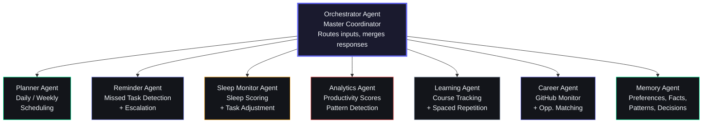
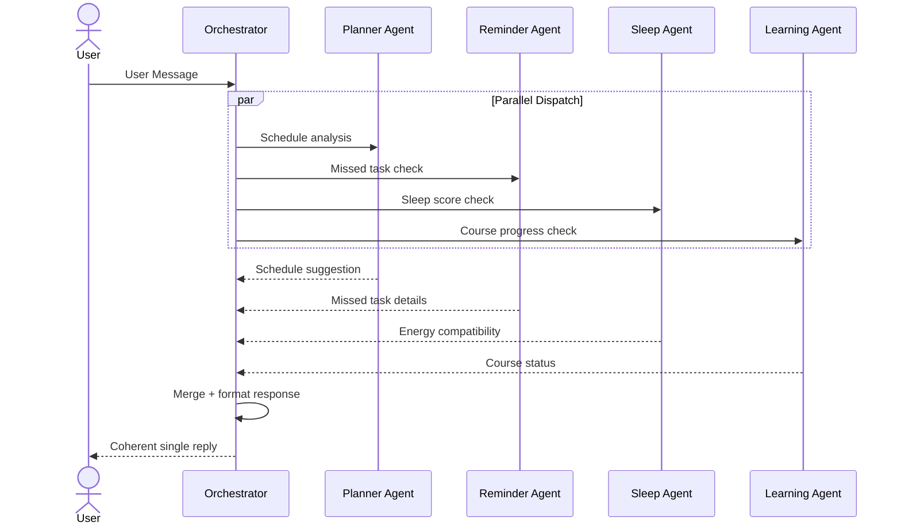
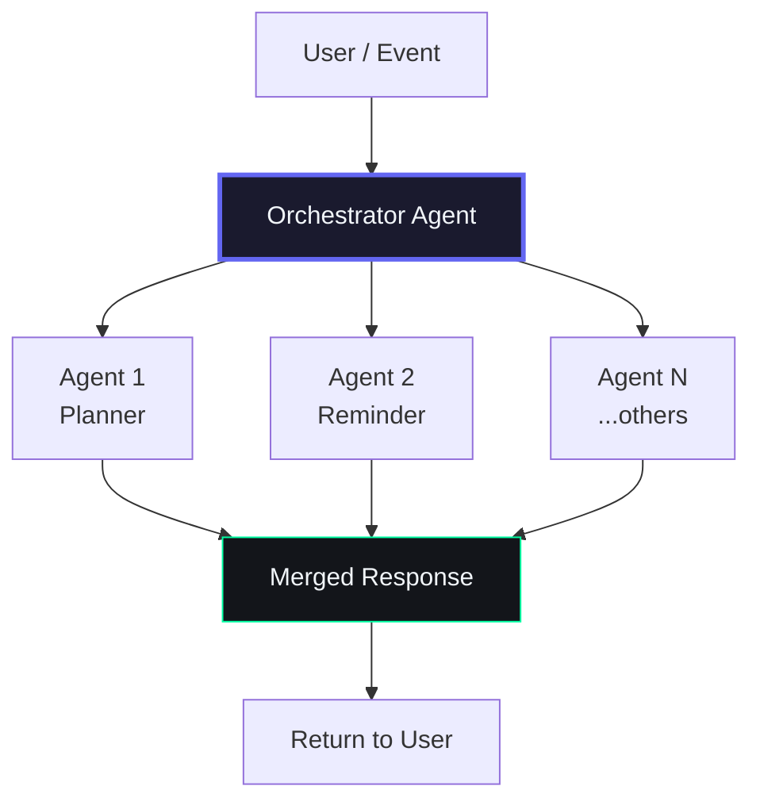
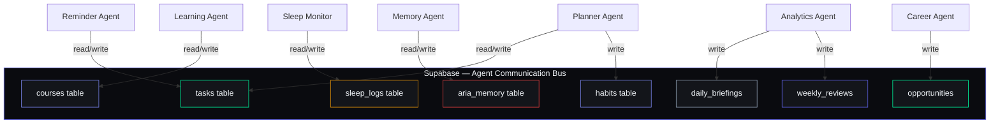
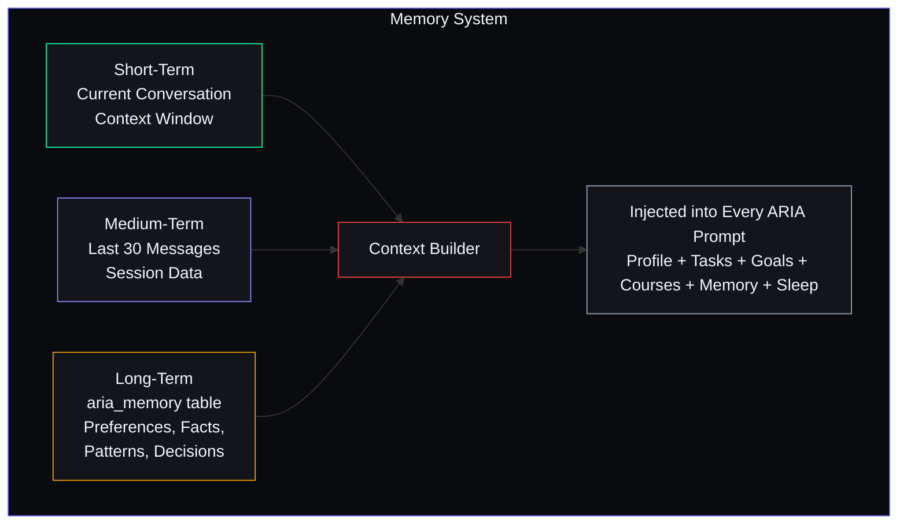

# AI Agent Architecture

## Overview

ARIA (Adaptive Reasoning and Intelligence Assistant) is not a chatbot. She is a persistent AI agent system composed of 8 specialized sub-agents that run on schedules and on-demand. Every conversation, task, goal, and interaction builds a personal model of the user over time.

---

## The 8 Sub-Agents



---

### Agent 1 — Orchestrator Agent

**Role:** Master coordinator. Every user message and system event passes through here first.

**Responsibilities:**
- Receives all incoming user messages and system events
- Determines which sub-agents to invoke (parallel where possible)
- Collects and merges outputs into a single coherent response
- Manages conversation context and state transitions

**Communication Pattern:**


**Example Flow — "I missed my DSA study session"**
```
1. Orchestrator receives message
2. Calls in parallel:
   - Reminder Agent: find the missed session details
   - Planner Agent: find next free slot for reschedule
   - Sleep Monitor Agent: check if user is rested enough today
   - Learning Agent: get current DSA progress
3. Merges all 4 results into helpful reply
4. Returns: "Found your missed DSA session. You're 3 days behind on your roadmap.
   Next free slot is today at 4 PM. Sleep was good (78) so you can handle it.
   Want me to reschedule for 4 PM?"
```

---

### Agent 2 — Planner Agent

**Role:** Daily and weekly scheduling. Prioritizes tasks by energy, deadline, and importance.

**Schedule:** Runs on-demand (user request) + integrated into Daily Briefing

**Inputs:**
- All pending tasks with due dates, priorities, categories
- Sleep score (if available)
- Active course daily targets
- Goal deadlines

**Outputs:**
- Ranked top-3 tasks for today
- Time-blocked schedule suggestion
- Tasks to defer or skip (based on energy/load)

**Logic:**
```
Priority Score = (deadline_urgency × 0.4) + (task_importance × 0.3) + (energy_compatibility × 0.3)

deadline_urgency = 1 - (days_remaining / max_days)
task_importance = priority_weight (low:1, med:2, high:3, urgent:4)
energy_compatibility = match between task type and current sleep score
  - High-cognitive tasks (coding, design) get low score when sleep < 50
  - Light tasks (review, organize) get high score regardless
```

---

### Agent 3 — Reminder Agent

**Role:** 15-minute cron detects missed tasks. Escalates from push to email to SMS.

**Schedule:** Every 15 minutes (Edge Function)

**Logic:**
```
For each task WHERE due_date < now() AND status NOT IN ('done','archived') AND rescheduled_from IS NULL:
  1. Increment missed_count
  2. Set status = 'missed'
  3. Set scheduled_start = now() + 2 hours
  4. Set rescheduled_from = original due_date
  
  Escalation:
    missed_count = 1 → Push notification
    missed_count >= 2 → Push + Email (Resend)
    missed_count >= 3 AND priority = 'high' → Push + Email + SMS (Twilio)
```

**System Prompt — End-of-Day Miss Summary (10 PM):**
```
You are ARIA. It is 10 PM. Brief missed-task summary.

MISSED TODAY: {{missed_tasks_today}}

3 parts only:
1. WHAT HAPPENED — factual list of what was missed
2. WHY — one honest hypothesis (overloaded? low sleep? big distraction?)
3. TOMORROW — which tasks go first thing, which can wait, which to drop

Honest and direct. Not judgmental. Under 150 words.
```

---

### Agent 4 — Sleep Monitor Agent

**Role:** Logs sleep, calculates score (0-100), adjusts task load.

**Schedule:** 9:30 PM bedtime reminder + on-demand after sleep log

**Sleep Score Algorithm:**
```
score = Math.min(100, (duration_minutes / 480 × 60) + (quality_rating × 8))
```

**Task Adjustment by Score:**

| Score | Action |
|-------|--------|
| >= 70 | Full schedule — normal operation |
| 40-69 | Move deep-concentration tasks (system design, competitive coding) to tomorrow |
| < 40 | Keep only light tasks today, all heavy work deferred |

**Bedtime System Prompt (9:30 PM):**
```
You are ARIA. It is 9:30 PM. End-of-day summary and bedtime nudge.

TODAY: Completed: {{completed_today}} | Missed: {{missed_today}}
Study time: {{study_minutes_today}} min

Write under 80 words:
- One sentence on what they actually got done
- One sentence on the most important missed item (already rescheduled)
- Bedtime nudge: 'Try to sleep by [time] — [task] is at [time] tomorrow.'
```

**Capabilities:**
- Wind-down reminder 30 min before bedtime
- Bedtime reminder with tomorrow's first task
- Sleep debt tracking (cumulative deficit across week)
- Google Fit sync (optional)
- Weekly sleep report with charts and sleep-productivity correlation

---

### Agent 5 — Analytics Agent

**Role:** Productivity scores, heatmaps, pattern detection, weekly report generation.

**Schedule:** Integrated into Weekly Review (Sunday 8 PM) + on-demand

**Metrics Tracked:**
- Daily productivity score (tasks completed / tasks due × 100)
- Weekly focus hours (deep work sessions > 90 min)
- Course study time trend
- Habit consistency percentage
- Sleep score average
- Income hourly rate trends

**Weekly Review System Prompt:**
```
You are ARIA. Sunday evening. Generate this user's weekly review.
Should feel like a thoughtful mentor reading their week — not a report.

Write EXACTLY 5 sections:
1. WINS THIS WEEK — Specific accomplishments with task titles
2. WHAT WAS MISSED AND WHY — Honest structural analysis
3. THE ONE PATTERN I NOTICED — Behaviour insight from data
4. YOUR NUMBERS — Tasks, study time, income, sleep
5. FOCUS FOR NEXT WEEK — ONE specific recommendation

Tone: honest smart senior. 250-350 words total.
```

---

### Agent 6 — Learning Agent

**Role:** Course progress tracking, spaced repetition, behind-schedule alerts.

**Schedule:** 6 PM daily (Course Progress Nudge)

**Capabilities:**
- Tracks progress on all active courses
- Spaced repetition reminders at 1/3/7/14/30 days after studying a topic
- Behind-schedule alerts with recalculated daily targets
- Study time analysis per subject

**Course Progress System Prompt (6 PM):**
```
For each course calculate:
- Days remaining to target date
- Minutes needed per day to finish on time
- Did today's target get met?

Return JSON array — only include courses needing attention:
[{
  course_name, alert_type: not_studied_today | behind_schedule,
  message, new_daily_target_minutes, days_to_deadline
}]
```

---

### Agent 7 — Career Agent

**Role:** GitHub commit monitoring, portfolio updates, opportunity matching.

**Schedule:** Weekly (integrated into Sunday routine)

**Capabilities:**
- GitHub commit activity check: flags repos with no commits in 7 days
- Skill profile auto-update: detects languages used in repos
- Opportunity matching: matches user skills against job/opportunity requirements
- Monthly GitHub Wrapped report: repos, commits, languages, top project as shareable card
- LinkedIn post draft generator: auto-drafts posts for: course completion, project launch, milestone hit

---

### Agent 8 — Memory Agent

**Role:** Stores preferences, facts, patterns, decisions across all conversations. Builds a personal knowledge graph.

**Trigger:** After every meaningful conversation with ARIA

**Process:**
```
1. Send conversation to LLM: 'Extract facts, preferences, or patterns about the user.'
2. Parse JSON response: [{ memory_type, content, confidence }]
   - memory_type: 'preference' | 'fact' | 'pattern' | 'decision'
   - confidence: 0.0 to 1.0
3. Upsert each to aria_memory table
```

**Memory Types:**

| Type | Example | Confidence |
|------|---------|------------|
| Preference | "User prefers studying late at night (10 PM - 2 AM)" | 0.85 |
| Fact | "User is in 3rd year BTech CSE at SRM Chennai" | 1.0 |
| Pattern | "User consistently skips tasks scheduled before 9 AM" | 0.75 |
| Decision | "User decided to focus on backend development over frontend" | 0.9 |

**Memory Decay:**
- Unreferenced memories degrade confidence by 0.05 per month
- Memories below 0.3 confidence are archived
- Conflicting memories (e.g., user changes preference) are marked as superseded

---

## Agent Communication Pattern

### Orchestrator Model

All agents communicate through the Orchestrator using a hub-and-spoke pattern:



**Key characteristics:**
- Agents are stateless — all state lives in Supabase
- Agents communicate through the database (read/write shared tables)
- Parallel execution where no dependency exists
- Serial execution when agents depend on each other's output
- Timeout: each agent has max 10 seconds before orchestration proceeds without it

### Data Flow Between Agents



---

## Memory System

### Architecture



### Context Builder

Every ARIA prompt receives a serialized context string:

```
Name: {{user.name}} | Year: {{user.year}} BTech CSE
Skills: [Python, JavaScript, React, SQL]

TODAY'S TASKS:
- Complete React hooks module (priority: high, due: today)
- Submit DSA assignment (priority: urgent, due: 2 PM)

OVERDUE TASKS:
- System design reading (3 days overdue)

ACTIVE COURSES:
- Complete Node.js Bootcamp: 45% (target: Jan 15, 20 min/day needed)
- The Odin Project: 30% (target: Mar 1, 45 min/day needed)

ACTIVE GOALS:
- Full-stack developer: 60% (on track)
- SaaS product launch: 20% (behind 2 weeks)

LAST NIGHT'S SLEEP: 7.5 hours | Score: 78/100

ARIA MEMORY:
- Preference: studies best late at night
- Fact: prefers visual learning
- Decision: chose backend over frontend focus
```

---

## Agent Schedule Summary

| Agent | Edge Function | pg_cron Schedule (UTC) | IST |
|-------|--------------|----------------------|-----|
| Daily Briefing | `daily-briefing` | `30 1 * * *` | 7:00 AM |
| Missed Task Checker | `missed-task-checker` | `*/15 * * * *` | Every 15 min |
| Opportunity Radar | `opp-radar` | `30 0 * * *` | 6:00 AM |
| Roadmap Update | `roadmap-update` | `30 3 * * 0` | Sunday 9:00 AM |
| Weekly Review | `weekly-review` | `30 14 * * 0` | Sunday 8:00 PM |
| Bedtime Reminder | `bedtime-reminder` | `0 16 * * *` | 9:30 PM |
| Habit Miss Checker | `habit-miss-checker` | `30 18 * * *` | Midnight |
| Course Nudge | `course-nudge` | `0 12 * * *` | 6:00 PM |

---

## Learning Over Time

| Timeframe | What ARIA Knows |
|-----------|-----------------|
| After 1 month | Skills, current courses, active goals, gives evidence-based recommendations |
| After 3 months | Preferred learning style, best study hours, which goals you complete vs abandon, which opportunities you act on, accurately predicts task completion time |
| After 6 months | Deep behavioural patterns, predicts which tasks you'll skip, best schedule per task type, personal optimal bedtime, streak break risk detection |
