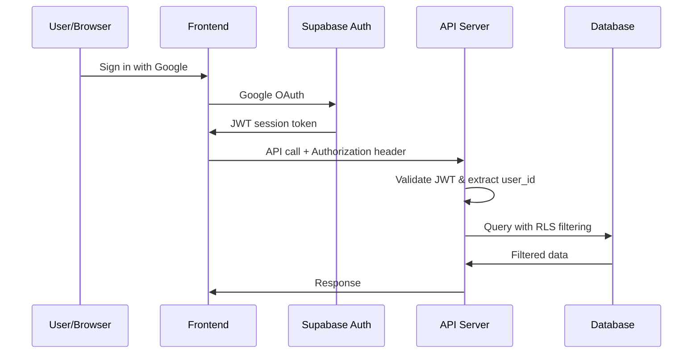
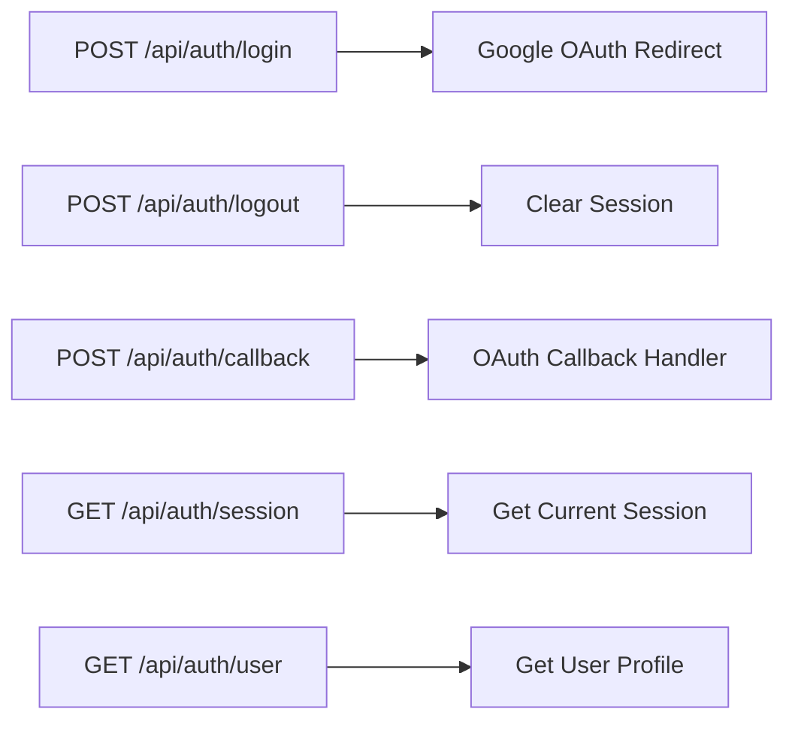

# API Documentation

> **⚠️ DEPRECATED — See OpenAPI Reference**

> This document has been superseded by the human-readable [OpenAPI Reference](api/openapi-reference.md) which documents all 31 routers and ~120 endpoints from source code, and the auto-generated OpenAPI documentation at `/docs` when the server is running.

> **⚠️ DEPRECATION NOTICE:** This document has been superseded by focused API architecture documents. Please refer to the following for specific topics:
> - **Full API Reference**: [api/openapi-reference.md](api/openapi-reference.md) — Complete endpoint catalog for all 31 routers, request/response schemas, auth, pagination, and error formats (NEW)
> - **Rate Limiting**: [api/rate-limiting.md](api/rate-limiting.md) — Sliding window limiter, per-endpoint limits, rate limit headers (NEW)
> - **API Changelog**: [api/changelog.md](api/changelog.md) — Version history, migration guides, sunset policy (NEW)
> - **REST Conventions**: [REST.md](REST.md) — Resource naming, HTTP methods, status codes, pagination, filtering
> - **Error Codes**: [ErrorCodes.md](ErrorCodes.md) — Standardized error code catalog (50+ codes)
> - **API Versioning**: [Versioning.md](Versioning.md) — URL-based versioning, deprecation headers, version lifecycle
> - **Webhooks**: [Webhooks.md](Webhooks.md) — Future webhook system blueprint
> - **Server Actions**: [ServerActions.md](ServerActions.md) — Next.js Server Actions integration pattern
> - **Controllers**: [Controllers.md](Controllers.md) — Route handler pattern, thin controller design
> - **Realtime**: [Realtime.md](Realtime.md) — Supabase Realtime subscriptions, polling fallback
>
> This document retains the endpoint catalog for reference but will not be updated with new endpoints. Future API additions should be documented in the focused docs above.

## Document Control

| Field | Value |
|---|---|
| **Document ID** | ENG-API-017 |
| **Version** | 2.0.0 |
| **Status** | Deprecated (see notice above) |
| **Date** | 2026-07-10 |
| **Classification** | Internal |
| **Owner** | Developer |

---

## 1. Executive Summary

This document catalogs all REST API endpoints available in Second Brain OS, including request/response schemas, authentication requirements, rate limits, and error responses. It covers 31 routers across 16 functional modules and supporting infrastructure.

---

## 2. Purpose

Provide a comprehensive API reference for frontend developers, AI agents, and third-party integrations consuming the Second Brain OS API.

---

## Base URL

```
Production: https://second-brain-os.vercel.app
Development: http://localhost:3000
API Server:   http://localhost:8000
```

## Authentication

All endpoints require Bearer token authentication. Get token from Supabase Auth.

```
Authorization: Bearer <supabase_access_token>
```

**Auth Flow:**



### Auth Endpoints



---

## Rate Limiting

| Resource | Limit | Scope |
|----------|-------|-------|
| AI API calls (Claude) | 10 requests/minute | Per user |
| Authentication attempts | 5 failed → 15 min lockout | Per IP |
| Push notifications | 50/day | Per user |
| Email reminders | 20/day | Per user |
| File uploads | 10/hour, max 10 MB each | Per user |
| Opportunity Radar queries | 50 searches/day | Global |
| General API | 100 requests/minute | Per user |

---

## Error Responses

All endpoints return standardized error format:

```json
{
  "error": "Human-readable error message",
  "code": "ERROR_CODE",
  "details": {}
}
```

### Common Status Codes

| Code | Meaning |
|------|---------|
| 200 | Success |
| 201 | Created |
| 204 | No Content (deletion success) |
| 400 | Bad Request — invalid input, missing required fields |
| 401 | Unauthorized — missing or invalid auth token |
| 403 | Forbidden — valid token but insufficient permissions |
| 404 | Resource not found |
| 409 | Conflict — duplicate resource |
| 422 | Unprocessable Entity — validation failure |
| 429 | Too Many Requests — rate limit exceeded |
| 500 | Internal Server Error |

### Error Codes

| Code | Description |
|------|-------------|
| `AUTH_TOKEN_MISSING` | No authorization header provided |
| `AUTH_TOKEN_EXPIRED` | JWT token has expired; refresh required |
| `AUTH_TOKEN_INVALID` | JWT token is malformed or invalid |
| `RATE_LIMIT_EXCEEDED` | Request dropped due to rate limiting |
| `VALIDATION_ERROR` | Request body failed schema validation |
| `NOT_FOUND` | Requested resource does not exist |
| `RLS_VIOLATION` | Row-level security policy blocked access |
| `FOREIGN_KEY_VIOLATION` | Referenced record does not exist |
| `AI_QUOTA_EXCEEDED` | AI API free tier limit reached |
| `FILE_TOO_LARGE` | Upload exceeds 10 MB limit |
| `INVALID_FILE_TYPE` | Uploaded file type not allowed |

---

## Endpoints

---

## Tasks

### `GET /api/tasks`

Get all tasks for current user.

**Query Parameters:**
| Parameter | Type | Required | Description |
|-----------|------|----------|-------------|
| `status` | string | No | Filter: `pending`, `in_progress`, `completed`, `cancelled`, `missed` |
| `priority` | string | No | Filter: `low`, `medium`, `high`, `urgent` |
| `category` | string | No | Filter: `study`, `project`, `habit`, `personal`, `income`, `career`, `health` |
| `limit` | integer | No | Pagination limit (default: 50, max: 100) |
| `offset` | integer | No | Pagination offset |
| `due_before` | ISO date | No | Tasks due before date |
| `due_after` | ISO date | No | Tasks due after date |

**Response:**
```json
{
  "tasks": [
    {
      "id": "uuid",
      "title": "Complete React hooks module",
      "description": "Finish the useEffect and useCallback sections",
      "priority": "high",
      "category": "study",
      "status": "pending",
      "estimated_minutes": 45,
      "actual_minutes": null,
      "due_date": "2026-06-12T10:00:00Z",
      "scheduled_start": "2026-06-12T14:00:00Z",
      "source": "manual",
      "goal_id": "uuid",
      "project_id": null,
      "completed_at": null,
      "rescheduled_from": null,
      "missed_count": 0,
      "recurrence": null,
      "created_at": "2026-06-10T10:00:00Z",
      "updated_at": "2026-06-10T10:00:00Z"
    }
  ],
  "total": 15,
  "limit": 50,
  "offset": 0
}
```

### `POST /api/tasks`

Create a new task.

**Request Body:**
```json
{
  "title": "Complete React hooks module",
  "description": "Optional description",
  "priority": "medium",
  "category": "study",
  "estimated_minutes": 45,
  "due_date": "2026-06-12T10:00:00Z",
  "scheduled_start": "2026-06-12T14:00:00Z",
  "goal_id": "uuid (optional)",
  "project_id": "uuid (optional)",
  "recurrence": "daily (optional)"
}
```

**Validation Rules:**
- `title`: Required, 1-500 characters
- `priority`: Default `medium`, enum validation
- `category`: Default `personal`, enum validation
- `estimated_minutes`: Optional, must be > 0

### `PUT /api/tasks/{task_id}`

Update a task. Only provided fields are updated.

**Request Body:** (partial update)
```json
{
  "status": "in_progress",
  "priority": "high"
}
```

### `DELETE /api/tasks/{task_id}`

Delete a task. Returns 204 No Content.

### `POST /api/tasks/{task_id}/complete`

Mark task as completed.

**Response:**
```json
{
  "id": "uuid",
  "status": "completed",
  "completed_at": "2026-06-11T14:30:00Z",
  "actual_minutes": 42
}
```

### `POST /api/tasks/{task_id}/reschedule`

Reschedule a task to a new time.

**Request Body:**
```json
{
  "scheduled_start": "2026-06-12T16:00:00Z",
  "reason": "Had a class conflict"
}
```

### `GET /api/tasks/missed`

Get all missed/overdue tasks.

**Response:** Same format as GET /api/tasks but filtered to overdue.

---

## Courses

### `GET /api/courses`

Get all courses.

**Query Parameters:**
| Parameter | Type | Required | Description |
|-----------|------|----------|-------------|
| `status` | string | No | `not_started`, `active`, `paused`, `completed`, `abandoned` |
| `platform` | string | No | `udemy`, `coursera`, `nptel`, `youtube`, `college`, `other` |

### `POST /api/courses`

Add a new course.

**Request Body:**
```json
{
  "name": "Complete React Developer Course",
  "platform": "udemy",
  "url": "https://udemy.com/course/react",
  "total_videos": 150,
  "deadline": "2026-08-15T00:00:00Z",
  "why_enrolled": "Need React for my startup project",
  "daily_minutes_target": 45,
  "related_goal_id": "uuid (optional)"
}
```

**Validation:** `deadline` is required. No course accepted without completion date.

### `PUT /api/courses/{course_id}`

Update course (progress, status, etc.).

**Request Body:**
```json
{
  "progress_percent": 35,
  "status": "active"
}
```

### `DELETE /api/courses/{course_id}`

Delete a course.

### `GET /api/courses/{course_id}/progress`

Get detailed progress analysis for a course.

**Response:**
```json
{
  "progress_percent": 35,
  "days_remaining": 65,
  "minutes_per_day_needed": 52,
  "on_track": false,
  "estimated_completion_date": "2026-09-20",
  "behind_by_days": 14
}
```

---

## YouTube Vault

### `GET /api/youtube`

Get all saved YouTube videos.

**Query Parameters:**
| Parameter | Type | Required | Description |
|-----------|------|----------|-------------|
| `status` | string | No | `unseen`, `scheduled`, `watched`, `archived` |
| `related_goal_id` | uuid | No | Filter by linked goal |

### `POST /api/youtube`

Save a YouTube video.

**Request Body:**
```json
{
  "url": "https://youtube.com/watch?v=abc123",
  "title": "System Design Interview Course",
  "related_goal_id": "uuid (optional)"
}
```

**Auto-processes:**
1. Fetches thumbnail + channel via YouTube oEmbed API
2. Generates 3-sentence AI summary
3. Sets `watch_by_date` = today + 60 days

### `PUT /api/youtube/{video_id}`

Update video status.

### `DELETE /api/youtube/{video_id}`

Delete saved video.

### `POST /api/youtube/{video_id}/summary`

Regenerate AI summary for a video.

---

## Resources

### `GET /api/resources`

Get all saved resources.

**Query Parameters:**
| Parameter | Type | Required | Description |
|-----------|------|----------|-------------|
| `type` | string | No | `article`, `book`, `github`, `tool`, `paper`, `thread`, `other` |
| `tags` | string | No | Comma-separated tag filter |
| `q` | string | No | Natural language search query |
| `archived` | boolean | No | Include archived resources |

### `POST /api/resources`

Save a new resource.

**Request Body:**
```json
{
  "title": "React Performance Optimization Guide",
  "url": "https://example.com/react-perf",
  "resource_type": "article",
  "tags": ["react", "performance", "optimization"],
  "notes": "Key points: memo, useMemo, useCallback patterns"
}
```

### `PUT /api/resources/{resource_id}`

Update resource metadata.

### `DELETE /api/resources/{resource_id}`

Delete resource.

---

## Ideas

### `GET /api/ideas`

Get all ideas.

**Query Parameters:**
| Parameter | Type | Required | Description |
|-----------|------|----------|-------------|
| `status` | string | No | `raw`, `researching`, `validating`, `building`, `archived` |
| `type` | string | No | `startup`, `project`, `content`, `feature`, `other` |

### `POST /api/ideas`

Capture a new idea.

**Request Body:**
```json
{
  "title": "AI-powered study planner for Indian exams",
  "description": "App that creates personalized study plans for JEE/NEET students",
  "idea_type": "startup"
}
```

**Auto-processes:** AI market check — searches for competitors, estimates market size, assesses feasibility. Results stored in `ai_analysis` JSONB field.

### `PUT /api/ideas/{idea_id}`

Update idea status or ai_analysis.

### `DELETE /api/ideas/{idea_id}`

Delete idea.

### `POST /api/ideas/{idea_id}/market-check`

Trigger AI market analysis for an idea.

**Response:**
```json
{
  "competitors": ["Examify", "StudyPal", "PrepAI"],
  "market_size": "large",
  "feasibility": "medium",
  "insight": "Multiple competitors exist but none specifically target Indian exam syllabi with personalization"
}
```

---

## Goals

### `GET /api/goals`

Get all goals with roadmap node data.

### `POST /api/goals`

Create a new goal with optional roadmap.

**Request Body:**
```json
{
  "title": "Become a Full-Stack Developer",
  "roadmap_type": "career_skills",
  "target_date": "2026-12-31",
  "why_it_matters": "To build and ship products independently",
  "hours_per_day": 3,
  "days_per_week": 5,
  "intensity": "high",
  "is_hard_deadline": false
}
```

### `PUT /api/goals/{goal_id}`

Update goal progress, status, or roadmap nodes.

### `DELETE /api/goals/{goal_id}`

Delete a goal.

### `POST /api/goals/{goal_id}/progress`

Update goal progress percentage.

**Request Body:**
```json
{
  "progress_percent": 60
}
```

---

## Roadmaps

### `GET /api/roadmaps`

Get all roadmaps.

### `POST /api/roadmaps`

Create a new roadmap.

**Request Body:**
```json
{
  "title": "Full-Stack Developer Roadmap",
  "roadmap_type": "career_skills",
  "nodes": [
    {"id": "1", "type": "skill", "label": "HTML/CSS", "status": "done", "position": {"x": 0, "y": 0}},
    {"id": "2", "type": "skill", "label": "JavaScript", "status": "in_progress", "position": {"x": 200, "y": 0}}
  ],
  "edges": [
    {"id": "e1-2", "source": "1", "target": "2"}
  ]
}
```

### `PUT /api/roadmaps/{roadmap_id}`

Update roadmap (nodes, edges, timing).

### `DELETE /api/roadmaps/{roadmap_id}`

Delete a roadmap.

### `POST /api/roadmaps/from-text`

Create roadmap from text input.

**Request Body:**
```json
{
  "title": "My Learning Plan",
  "text_input": "Step 1: Learn HTML/CSS (2 weeks)\nStep 2: Learn JavaScript (4 weeks)\nStep 3: Learn React (6 weeks)"
}
```

### `POST /api/roadmaps/from-image`

Create roadmap from image upload (multipart form).

### `POST /api/roadmaps/from-pdf`

Create roadmap from PDF upload (multipart form).

### `GET /api/roadmaps/{roadmap_id}/updates`

Get AI-detected updates for a roadmap.

---

## Opportunities

### `GET /api/opportunities`

Get scanned opportunities.

**Query Parameters:**
| Parameter | Type | Required | Description |
|-----------|------|----------|-------------|
| `type` | string | No | `internship`, `hackathon`, `open_source`, `fellowship`, `freelance`, `competition`, `scholarship`, `course` |
| `status` | string | No | `new`, `saved`, `applied`, `rejected`, `accepted` |
| `min_match` | integer | No | Minimum match score (0-100) |
| `sort` | string | No | `deadline`, `match_score`, `found_at` |

### `POST /api/opportunities`

Manually add an opportunity.

**Request Body:**
```json
{
  "title": "Google Summer of Code 2026",
  "company": "Google",
  "url": "https://summerofcode.withgoogle.com",
  "opportunity_type": "open_source",
  "deadline": "2026-04-02T00:00:00Z",
  "skills_required": ["Python", "TypeScript", "React"],
  "match_score": 85,
  "match_reason": "Strong match with your Python and React skills"
}
```

### `PUT /api/opportunities/{opp_id}`

Update opportunity status.

### `POST /api/opportunities/{opp_id}/apply`

Mark as applied (opens URL in new tab on frontend).

---

## Income

### `GET /api/income`

Get income entries with optional date range.

**Query Parameters:**
| Parameter | Type | Required | Description |
|-----------|------|----------|-------------|
| `start_date` | date | No | Start date filter |
| `end_date` | date | No | End date filter |
| `source_id` | uuid | No | Filter by source |

### `POST /api/income`

Log new income entry.

**Request Body:**
```json
{
  "source_id": "uuid",
  "amount": 2500,
  "date": "2026-06-10",
  "description": "Freelance website project milestone 2",
  "hours_spent": 8
}
```

### `GET /api/income/sources`

Get all income sources with aggregated data.

### `POST /api/income/sources`

Create a new income source.

**Request Body:**
```json
{
  "name": "Freelance Web Development",
  "source_type": "freelance",
  "platform": "Fiverr",
  "monthly_amount": 8000,
  "hours_per_week": 10,
  "started_at": "2026-01-15"
}
```

### `GET /api/income/summary`

Get income summary with effective hourly rates.

**Response:**
```json
{
  "total_this_month": 12500,
  "total_this_year": 65000,
  "sources": [
    {"name": "Freelance", "amount": 8000, "hours": 40, "hourly_rate": 200},
    {"name": "Teaching", "amount": 4500, "hours": 15, "hourly_rate": 300}
  ],
  "best_hourly_rate": {"source": "Teaching", "rate": 300},
  "milestones": {
    "next_milestone": 25000,
    "progress_percent": 52
  }
}
```

---

## Projects

### `GET /api/projects`

Get all projects.

### `POST /api/projects`

Create a new project.

**Request Body:**
```json
{
  "title": "Second Brain OS",
  "description": "Personal AI productivity system",
  "tech_stack": ["Next.js", "Supabase", "Python", "Tailwind"],
  "github_url": "https://github.com/user/second-brain-os",
  "next_action": "Build Phase 3 — ARIA chat panel",
  "phase": "build"
}
```

**Validation:** `next_action` is required for all projects.

### `PUT /api/projects/{project_id}`

Update project phase, next action, blocker.

### `DELETE /api/projects/{project_id}`

Delete a project.

### `GET /api/projects/{project_id}/github`

Get GitHub commit activity for project.

### `POST /api/projects/{project_id}/linkedin-post`

Generate LinkedIn post about project milestone.

**Response:**
```json
{
  "draft": "Excited to share that I just launched Phase 3 of my personal AI system — ARIA now has a memory system that learns my habits over time. Built with Next.js + Supabase + Ollama. 17 weeks from idea to working product"
}
```

---

## Habits

### `GET /api/habits`

Get all habits with streak data.

### `POST /api/habits`

Create a new habit.

**Request Body:**
```json
{
  "title": "Study DSA for 1 hour",
  "frequency": "daily",
  "time_target_minutes": 60,
  "linked_goal_id": "uuid (optional)"
}
```

### `PUT /api/habits/{habit_id}`

Update habit.

### `DELETE /api/habits/{habit_id}`

Delete habit.

### `POST /api/habits/{habit_id}/log`

Log habit completion for today.

**Request Body:**
```json
{
  "completed": true,
  "minutes_spent": 45
}
```

### `GET /api/habits/report`

Get 30-day habit consistency report.

---

## Sleep

### `GET /api/sleep`

Get sleep logs.

**Query Parameters:**
| Parameter | Type | Required | Description |
|-----------|------|----------|-------------|
| `days` | integer | No | Number of days to return (default: 14) |

### `POST /api/sleep`

Log sleep entry.

**Request Body:**
```json
{
  "sleep_start": "2026-06-10T23:30:00Z",
  "sleep_end": "2026-06-11T07:00:00Z",
  "quality_rating": 4
}
```

**Auto-calculates:**
- `duration_minutes`
- `sleep_score` (0-100)
- `sleep_debt` adjustment

### `GET /api/sleep/stats`

Get sleep statistics.

**Response:**
```json
{
  "avg_score_7_days": 72,
  "avg_duration_7_days": 6.8,
  "best_score": 88,
  "worst_score": 45,
  "total_sleep_debt": 4.5,
  "consistency_score": 65,
  "optimal_bedtime": "23:00"
}
```

### `POST /api/sleep/adjust-tasks`

Trigger sleep-based task adjustment (called automatically after sleep log).

---

## Time Tracking

### `GET /api/time`

Get time entries.

**Query Parameters:**
| Parameter | Type | Required | Description |
|-----------|------|----------|-------------|
| `date` | date | No | Specific date |
| `task_id` | uuid | No | Filter by task |
| `days` | integer | No | Number of days back |

### `POST /api/time/start`

Start a timer.

**Request Body:**
```json
{
  "task_id": "uuid (optional)",
  "description": "Working on roadmap canvas",
  "is_pomodoro": false
}
```

### `POST /api/time/stop`

Stop the current timer.

**Response:**
```json
{
  "duration_seconds": 5400,
  "is_deep_work": true,
  "task_id": "uuid"
}
```

### `GET /api/time/active`

Get currently running timer (if any).

### `GET /api/time/stats`

Get time tracking statistics.

**Response:**
```json
{
  "total_focus_hours_today": 3.5,
  "total_focus_hours_week": 18.2,
  "deep_work_sessions_week": 4,
  "best_focus_hour": "10:00 - 11:00",
  "avg_session_duration": 52,
  "estimation_accuracy": 0.78
}
```

---

## Chat (ARIA)

### `POST /api/chat`

Send message to ARIA.

**Request Body:**
```json
{
  "message": "What should I focus on today?"
}
```

**Response:**
```json
{
  "response": "Based on your data: 1) Finish React hooks module (45 min) — due tomorrow. 2) Submit DSA assignment (urgent, due 2 PM). 3) Review system design notes (30 min). Your sleep was good (78) so you can handle all three.",
  "action_taken": null,
  "actions": []
}
```

**If ARIA executes an action:**
```json
{
  "response": "Done — I added that task for you: 'Study Docker basics' scheduled for tomorrow at 10 AM.",
  "action_taken": "Created task: Study Docker basics",
  "actions": [
    {
      "action": "add_task",
      "title": "Study Docker basics",
      "priority": "medium",
      "due_date": "2026-06-12T10:00:00Z"
    }
  ]
}
```

### `GET /api/chat/history`

Get conversation history.

**Query Parameters:**
| Parameter | Type | Required | Description |
|-----------|------|----------|-------------|
| `limit` | integer | No | Number of messages (default: 50) |
| `before` | ISO date | No | Messages before this timestamp |

---

## Briefings

### `GET /api/briefing/today`

Get today's morning briefing.

**Response:**
```json
{
  "id": "uuid",
  "date": "2026-06-11",
  "briefing_content": {
    "today_focus": "1. Finish React hooks module — due tomorrow, 45 min\n2. Submit DSA assignment — urgent, due 2 PM\n3. Review system design — 30 min",
    "opportunities": "Flipkart internship closing in 3 days — 80% skill match",
    "course_target": "Complete Node.js course: 30 min needed, lesson on Express middleware",
    "roadmap_check": "Full-stack dev: on track. DSA: behind 3 days.",
    "aria_top_pick": "Finish React hooks module first — it's the keystone for your current project",
    "what_to_skip": "Move system design reading to tomorrow — not critical today"
  },
  "opportunities_shown": 3,
  "aria_top_pick": "Finish React hooks module first",
  "was_read": false,
  "created_at": "2026-06-11T01:30:00Z"
}
```

### `GET /api/briefing/weekly`

Get the latest weekly review.

### `GET /api/briefing/history`

Get past briefings (last 7 days).

---

## Academics

### `GET /api/academics/subjects`

Get all academic subjects.

### `POST /api/academics/subjects`

Add a subject.

**Request Body:**
```json
{
  "name": "Data Structures and Algorithms",
  "code": "CS201",
  "credits": 4,
  "semester": "4",
  "exam_date": "2026-11-15",
  "max_marks": 100
}
```

### `POST /api/academics/marks`

Log marks for a subject.

**Request Body:**
```json
{
  "subject_id": "uuid",
  "exam_type": "midterm",
  "marks_obtained": 32,
  "max_marks": 40,
  "date": "2026-06-10"
}
```

### `GET /api/academics/cgpa`

Get current and projected CGPA.

**Response:**
```json
{
  "current_cgpa": 8.2,
  "projected_cgpa": 8.5,
  "total_credits": 24,
  "at_risk_subjects": [
    {"name": "Computer Networks", "current_score": 38, "needs_improvement": true}
  ],
  "grade_distribution": {
    "S": 1,
    "A": 3,
    "B": 2,
    "C": 1
  }
}
```

---

## Settings & Export

### `GET /api/settings/profile`

Get user profile.

### `PUT /api/settings/profile`

Update user profile.

### `GET /api/export`

Download all user data as JSON.

### `POST /api/settings/delete-account`

Permanently delete account and all data.

### `POST /api/settings/notification-test`

Test push notification delivery.

---

## WebSocket (ARIA Chat)

### `ws://localhost:3000/ws/chat`

WebSocket endpoint for real-time ARIA chat.

**Message format (client → server):**
```json
{
  "type": "message",
  "content": "What should I focus on today?"
}
```

**Message format (server → client):**
```json
{
  "type": "response",
  "content": "Your top 3 tasks today are...",
  "actions": []
}
```

**Message format (server → client, real-time update):**
```json
{
  "type": "briefing_ready",
  "content": "Your morning briefing is ready"
}
```

---

## Supabase Direct Client Operations

For performance, most read operations go directly from frontend to Supabase using RLS.

### Realtime Subscriptions

```typescript
// Subscribe to task changes
supabase
  .channel('tasks-channel')
  .on('postgres_changes',
    { event: '*', schema: 'public', table: 'tasks', filter: `user_id=eq.${userId}` },
    (payload) => { /* update UI */ }
  )
  .subscribe()
```

**Realtime Tables:** `tasks`, `chat_messages`, `opportunities`, `daily_briefings`, `goals`, `sleep_logs`, `time_logs`, `habits`

---

## Non-Functional Requirements

| Requirement | Target | Measurement |
|---|---|---|
| API response time (p95) | < 500ms | Request ID logging |
| Error response time | < 100ms | Error handler timing |
| Pagination overhead | < 10ms | Range query timing |
| Response size (list, 20 items) | < 50KB | Response body size |
| OpenAPI spec generation | < 1s | FastAPI startup |
| API uptime | > 99.9% | Health check polling |

---

## Performance Targets

| Endpoint Category | p50 | p95 | p99 |
|---|---|---|---|
| Simple CRUD (GET list) | < 100ms | < 300ms | < 1s |
| Single resource (GET by ID) | < 50ms | < 200ms | < 500ms |
| Create/Update (POST/PUT) | < 200ms | < 500ms | < 2s |
| Delete (DELETE) | < 100ms | < 300ms | < 1s |
| AI-powered (chat, briefing) | < 10s | < 30s | < 60s |
| Aggregations (stats, reports) | < 500ms | < 2s | < 5s |
| Health checks | < 50ms | < 100ms | < 200ms |

---

## Edge Cases

| Edge Case | Handling |
|---|---|
| Empty result set | Return `{ "data": [], "total": 0 }` |
| Invalid UUID | 422 from Pydantic path validation |
| Missing auth token | 401 with `WWW-Authenticate` header |
| Expired JWT | 401 with `AUTH_TOKEN_EXPIRED` code |
| Concurrent updates | Last-write-wins (Supabase default) |
| Pagination past end | Empty array, not error |
| Extra fields in request | Pydantic ignores by default |
| Unicode in text fields | Full UTF-8 support |
| Empty request body on POST | 422 from Pydantic |

---

## Failure Scenarios

| Scenario | Impact | Recovery |
|---|---|---|
| Supabase connection timeout | 500 Internal Server Error | Retry with backoff |
| AI provider unavailable | 503 with AI fallback message | Client uses offline mode |
| Rate limit exceeded | 429 with `Retry-After` header | Client waits and retries |
| Database migration in progress | Temporary 503 | Wait for migration to complete |
| JWT secret mismatch | All requests return 401 | Check env var configuration |

---

## Risks & Mitigations

| Risk | Likelihood | Impact | Mitigation |
|---|---|---|---|
| API surface grows too large | Medium | Medium | Modular routers; versioning strategy |
| Inconsistent error format across endpoints | Medium | Medium | Standard HTTPException pattern; error codes |
| Breaking changes in patch releases | Low | High | Strict backward compatibility rules |
| OpenAPI spec drifts from implementation | Low | Medium | Auto-generated from code (FastAPI) |
| Rate limiting too aggressive for legitimate use | Low | Medium | Configurable via env vars |

---

## Related Documents

| Document | Purpose |
|---|---|
| [Error Catalog](api/error-catalog.md) | Standardized error codes (AUTH_*, RESOURCE_*, AI_*, etc.) and recovery strategies |
| [Webhook Guide](api/webhook-guide.md) | Real-time event notifications, payload schema, signature verification |
| [Migration v1 to v2](api/migration-v1-to-v2.md) | Breaking changes, migration steps, rollback plan |
| [OpenAPI Reference](api/openapi-reference.md) | Interactive API specification (auto-generated) |
| [Rate Limiting](api/rate-limiting.md) | Per-endpoint rate limit policies and Retry-After headers |
| [API Changelog](api/changelog.md) | Version history and deprecation notices |
| [Data Flow Diagrams](../architecture/data-flow-diagrams.md) | Request lifecycle, authentication flow, circuit breaker patterns |
| [AGENTS.md](../../AGENTS.md) | Master project reference — Section 8 (API Endpoint Reference), Section 24 (API Versioning) |

---

## Revision History

| Version | Date | Author | Changes |
|---|---|---|---|
| 1.0.0 | 2026-06-11 | Developer | Initial API documentation |
| 2.0.0 | 2026-07-10 | Developer | Added deprecation notice pointing to focused API docs (REST.md, RateLimiting.md, ErrorCodes.md, Versioning.md, Webhooks.md, ServerActions.md). Added enterprise sections: NFRs, Performance Targets, Edge Cases, Failure Scenarios, Risks. Added Document Control. |
| 2.1.0 | 2026-07-12 | Developer | Added Related Documents section cross-referencing error-catalog.md, webhook-guide.md, migration-v1-to-v2.md, data-flow-diagrams.md |
