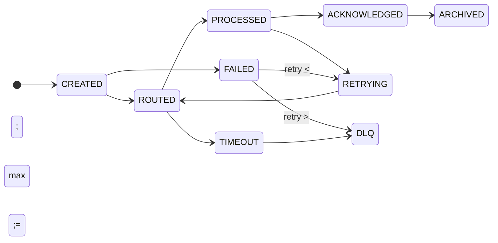
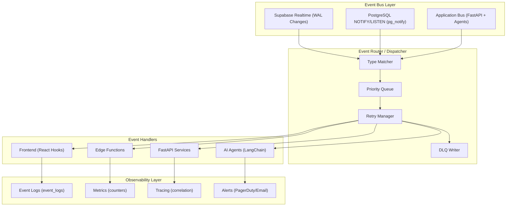
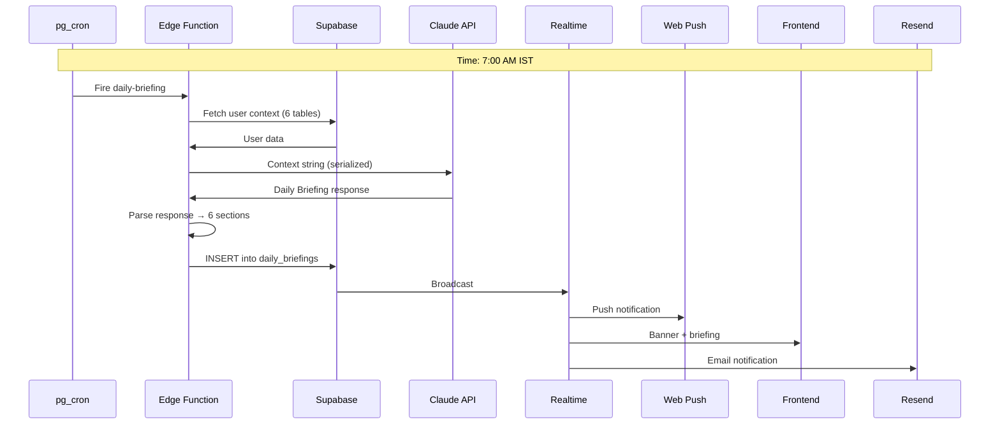
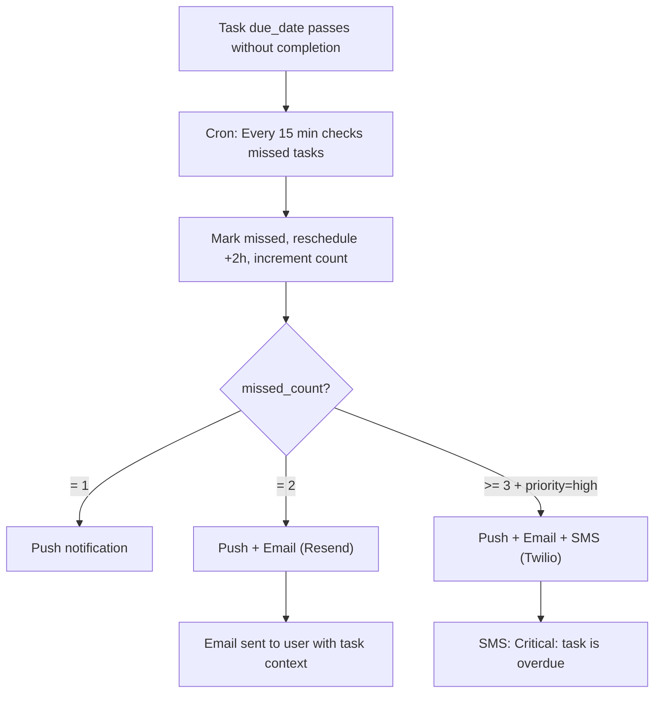

# Events & Event-Driven Architecture

## Document Control

| Metadata | Value |
|----------|-------|
| **Document ID** | ENG-018 |
| **Version** | 2.0 |
| **Status** | Approved |
| **Classification** | Internal — Engineering |
| **Owner** | Platform Engineering Team |
| **Last Updated** | 2026-06-11 |
| **Review Cycle** | Quarterly |
| **Next Review** | 2026-09-11 |
| **Approved By** | CTO / Tech Lead |

---

## Executive Summary

### Purpose
This document defines the enterprise event-driven architecture (EDA) for Second Brain OS. It provides a comprehensive specification for event taxonomy, schema, lifecycle, routing, error handling, monitoring, and governance across all system components.

### Scope
Covers all event types flowing through the system: database change events (Supabase Realtime), scheduled cron events (pg_cron), user-triggered REST events, inter-agent events (LangChain orchestration), notification events (Web Push / Email / SMS), and WebSocket chat events. Excludes infrastructure-level events (Kubernetes, CI/CD pipelines) which are covered in the DevOps runbooks.

### Stakeholders
| Role | Interest |
|------|----------|
| Platform Engineers | Implementation, maintenance, and evolution of event pipelines |
| AI/Agent Engineers | Event-driven agent orchestration and state management |
| Frontend Engineers | Real-time UI updates via event subscriptions |
| SRE / DevOps | Monitoring, alerting, and SLI/SLO compliance for event pipelines |
| Product Management | Feature decisions informed by event-driven capabilities |
| Security | Event audit trail, data integrity, and access control |

### Problem Statement
A personal productivity system with 15+ integrated modules, AI agents, scheduled jobs, and real-time collaboration requires a robust, observable, and predictable event-driven architecture. Without standardization, events become tightly coupled, debugging becomes impossible, and system reliability degrades.

### Solution Overview
Implement a hybrid event bus combining Supabase Realtime (WAL-based), PostgreSQL LISTEN/NOTIFY, and application-level event routing with standardized schemas, versioned payloads, dead-letter queues, and comprehensive observability.

### Key Design Decisions
1. **Supabase Realtime as primary bus** for database change events (leverage existing infrastructure)
2. **pg_cron for scheduled events** (minimal operational overhead, native PostgreSQL)
3. **Application-layer event bus** for inter-agent communication (LangChain orchestration)
4. **Standardized event envelope** across all transport mechanisms
5. **Dead Letter Queue** for failed events with automated retry and escalation

---

## Event Taxonomy

### Event Categories

Every event in the system belongs to exactly one category with a unique 4-character category ID:

| Category | ID | Description | Transport | Priority |
|----------|----|-------------|-----------|----------|
| Database Change | `DBC_` | Row-level INSERT/UPDATE/DELETE via WAL | Supabase Realtime | High |
| Scheduled Cron | `SCR_` | Time-based triggers via pg_cron | Edge Functions | Medium |
| User Action | `UAC_` | REST API calls from frontend/browser | HTTPS | High |
| Agent Message | `AGM_` | Inter-agent orchestration events | LangChain Bus | Medium |
| Notification | `NTF_` | Delivery to user (push/email/SMS) | Web Push / Resend / Twilio | Varies |
| WebSocket | `WSC_` | Bidirectional chat (ARIA) | WebSocket | High |
| System Health | `SHL_` | Heartbeat, health check, lifecycle | Internal transport | Low |
| Audit | `AUD_` | Security-relevant state transitions | Log table | Low |

### Event Type Registry

Each event type has a unique identifier following the convention: `{CategoryID}.{Domain}.{Action}`

| Event ID | Category | Description |
|----------|----------|-------------|
| `DBC_.tasks.create` | Database Change | Task row inserted |
| `DBC_.tasks.update` | Database Change | Task row updated |
| `DBC_.tasks.delete` | Database Change | Task row deleted |
| `DBC_.chat.insert` | Database Change | New chat message |
| `DBC_.goals.update` | Database Change | Goal progress changed |
| `DBC_.briefings.insert` | Database Change | Daily briefing ready |
| `DBC_.opportunities.insert` | Database Change | New opportunity found |
| `DBC_.sleep.insert` | Database Change | Sleep log created |
| `DBC_.habits.update` | Database Change | Habit status changed |
| `DBC_.time_entries.insert` | Database Change | Timer started |
| `DBC_.time_entries.update` | Database Change | Timer stopped |
| `SCR_.briefing.execute` | Scheduled Cron | Daily briefing generation |
| `SCR_.opp_radar.execute` | Scheduled Cron | Opportunity radar scan |
| `SCR_.task_checker.execute` | Scheduled Cron | Missed task detection |
| `SCR_.roadmap.execute` | Scheduled Cron | Roadmap update check |
| `SCR_.weekly_review.execute` | Scheduled Cron | Weekly review generation |
| `SCR_.bedtime.execute` | Scheduled Cron | Bedtime reminder |
| `SCR_.habit_check.execute` | Scheduled Cron | Habit miss detection |
| `SCR_.course_nudge.execute` | Scheduled Cron | Course progress nudge |
| `UAC_.task.create` | User Action | User creates task |
| `UAC_.task.complete` | User Action | User completes task |
| `UAC_.sleep.log` | User Action | User logs sleep |
| `UAC_.chat.send` | User Action | User sends chat message |
| `UAC_.goal.update` | User Action | User updates goal |
| `UAC_.export.data` | User Action | User requests data export |
| `UAC_.account.delete` | User Action | User deletes account |
| `AGM_.orchestrator.dispatch` | Agent Message | Orchestrator dispatches sub-agents |
| `AGM_.planner.complete` | Agent Message | Planner agent returns results |
| `AGM_.reminder.complete` | Agent Message | Reminder agent returns results |
| `AGM_.sleep_monitor.complete` | Agent Message | Sleep monitor returns results |
| `AGM_.learning.complete` | Agent Message | Learning agent returns results |
| `AGM_.analytics.complete` | Agent Message | Analytics agent returns results |
| `AGM_.memory.complete` | Agent Message | Memory agent returns results |
| `AGM_.career.complete` | Agent Message | Career agent returns results |
| `NTF_.push.deliver` | Notification | Web Push notification sent |
| `NTF_.email.deliver` | Notification | Email sent via Resend |
| `NTF_.sms.deliver` | Notification | SMS sent via Twilio |
| `WSC_.chat.message` | WebSocket | Bidirectional chat message |
| `WSC_.chat.typing` | WebSocket | Typing indicator |
| `SHL_.heartbeat` | System Health | Service heartbeat |
| `SHL_.health_check` | System Health | Health check result |
| `SHL_.service.startup` | System Health | Service started |
| `SHL_.service.shutdown` | System Health | Service stopped |
| `AUD_.auth.login` | Audit | User login |
| `AUD_.auth.logout` | Audit | User logout |
| `AUD_.auth.failed` | Audit | Failed authentication |
| `AUD_.data.export` | Audit | Data export request |
| `AUD_.data.delete` | Audit | Account deletion |

---

## Event Schema

### Envelope (Standard Wrapper)

Every event in the system MUST conform to this JSON envelope:

```json
{
  "event_id": "evt_2x4k9m8q7r5v",
  "event_type": "DBC_.tasks.create",
  "event_version": 1,
  "timestamp": "2026-06-11T10:00:00.123Z",
  "source": "supabase-realtime",
  "source_instance": "production-db-01",
  "correlation_id": "corr_a1b2c3d4",
  "causation_id": "evt_9w8x7y6z5u4v",
  "user_id": "usr_abc123",
  "tenant_id": "tenant_default",
  "priority": "high",
  "ttl_seconds": 300,
  "retry_count": 0,
  "max_retries": 3,
  "trace_id": "trace_7f3a1b9c",
  "span_id": "span_2d4e6f8a",
  "payload": {},
  "metadata": {
    "environment": "production",
    "region": "us-east-1",
    "service_version": "2.1.0"
  }
}
```

### Envelope Field Specifications

| Field | Type | Required | Description |
|-------|------|----------|-------------|
| `event_id` | `string` | Yes | Globally unique event identifier (prefix `evt_` + 12 char nanoID) |
| `event_type` | `string` | Yes | Fully qualified event type from the registry |
| `event_version` | `integer` | Yes | Semantic version of the event schema |
| `timestamp` | `string` (ISO 8601) | Yes | When the event was created (UTC, millisecond precision) |
| `source` | `string` | Yes | Originating system component |
| `source_instance` | `string` | No | Specific instance identifier (for multi-instance deployments) |
| `correlation_id` | `string` | Yes | Links all events across a single user operation or workflow |
| `causation_id` | `string` | No | Links to the specific event that caused this event (event sourcing) |
| `user_id` | `string` | Yes | The user associated with this event (`usr_` prefix) |
| `tenant_id` | `string` | Yes | Multi-tenant isolation identifier |
| `priority` | `enum` | Yes | `critical`, `high`, `medium`, `low` |
| `ttl_seconds` | `integer` | Yes | Time-to-live for the event in the queue (seconds) |
| `retry_count` | `integer` | Yes | Current retry attempt number (0 = first attempt) |
| `max_retries` | `integer` | Yes | Maximum retry attempts before DLQ |
| `trace_id` | `string` | Yes | Distributed trace identifier (W3C Trace Context) |
| `span_id` | `string` | Yes | Span identifier within the distributed trace |
| `payload` | `object` | Yes | Event-specific data (type-dependent schema) |
| `metadata` | `object` | No | Environment, deployment, and routing metadata |

### Payload Schemas by Category

#### DBC_ (Database Change Events)

```json
{
  "payload": {
    "table": "tasks",
    "schema": "public",
    "operation": "INSERT",
    "commit_timestamp": "2026-06-11T10:00:00.123Z",
    "new_record": { "id": "uuid", "title": "...", "status": "pending", "user_id": "usr_abc123" },
    "old_record": null
  }
}
```

#### SCR_ (Scheduled Cron Events)

```json
{
  "payload": {
    "cron_job": "daily-briefing",
    "schedule": "30 1 * * *",
    "triggered_at": "2026-06-11T01:30:00.000Z",
    "expected_users": 42,
    "batch_size": 10
  }
}
```

#### UAC_ (User Action Events)

```json
{
  "payload": {
    "action": "complete_task",
    "resource_type": "task",
    "resource_id": "uuid",
    "action_detail": { "completed_at": "2026-06-11T10:00:00Z", "actual_minutes": 45 },
    "client": { "ip": "203.0.113.42", "user_agent": "Mozilla/5.0...", "platform": "web" }
  }
}
```

#### AGM_ (Agent Message Events)

```json
{
  "payload": {
    "agent_type": "planner",
    "orchestration_id": "orch_7f3a1b9c",
    "input_context": { "task_count": 15, "overdue_count": 3 },
    "output_summary": { "keep": 12, "drop": 2, "defer": 1 },
    "duration_ms": 2340,
    "model_used": "claude-3-sonnet-20240229"
  }
}
```

#### NTF_ (Notification Events)

```json
{
  "payload": {
    "channel": "push",
    "provider": "web-push",
    "template_id": "task-reminder",
    "recipient": "usr_abc123",
    "title": "Task Due Soon",
    "body": "DSA Assignment is due in 30 minutes",
    "delivery_status": "sent",
    "delivery_timestamp": "2026-06-11T10:00:00.123Z"
  }
}
```

### Schema Versioning

| Version | Date | Changes |
|---------|------|---------|
| v1 | 2026-01-15 | Initial event envelope specification |
| v2 | 2026-06-11 | Added `trace_id`, `span_id`, `causation_id`, `tenant_id`, `ttl_seconds`; standardized event type IDs |

**Versioning Rules:**
- Event payload schemas are versioned independently from the envelope
- Breaking changes (field removal, type change, required→optional) increment major version
- Additive changes (new optional fields) increment minor version
- Envelope version `1` is always backward compatible
- Consumers MUST check `event_version` before processing

---

## Event Lifecycle

### Lifecycle States



### Phase Descriptions

| Phase | State | Description | Duration Target |
|-------|-------|-------------|-----------------|
| **1. Created** | `CREATED` | Event is produced at the source (DB trigger, API handler, cron job, agent) | < 10ms |
| **2. Routed** | `ROUTED` | Event is placed on the transport bus and matched to subscriber(s) | < 50ms |
| **3. Processed** | `PROCESSING` | Handler(s) are actively working on the event | Varies by type |
| **4. Acknowledged** | `ACKNOWLEDGED` | Handler confirms successful processing | < 100ms after success |
| **5. Archived** | `ARCHIVED` | Event record moved to long-term storage for audit | After TTL expires |

### Error States

| State | Trigger | Action |
|-------|---------|--------|
| `FAILED` | Handler throws exception | Increment retry_count; if < max_retries → transition to RETRYING |
| `RETRYING` | Retry scheduled | Apply exponential backoff (2^n seconds); max 3 retries |
| `TIMEOUT` | Processing exceeds TTL | Log warning; if critical → escalate; else → DLQ |
| `DLQ` | Max retries exhausted | Move to Dead Letter Queue; notify on-call if priority ≥ high |

---

## Dead Letter Queue (DLQ)

### DLQ Table Schema

```sql
CREATE TABLE dead_letter_queue (
  id UUID PRIMARY KEY DEFAULT gen_random_uuid(),
  event_id TEXT NOT NULL,
  event_type TEXT NOT NULL,
  event_payload JSONB NOT NULL,
  failure_reason TEXT NOT NULL,
  failure_count INTEGER NOT NULL DEFAULT 0,
  last_error TEXT,
  last_attempt_at TIMESTAMPTZ,
  created_at TIMESTAMPTZ DEFAULT NOW(),
  dlq_status TEXT DEFAULT 'pending', -- 'pending', 'investigating', 'reprocessed', 'discarded'
  reprocessed_at TIMESTAMPTZ,
  reprocessed_by TEXT,
  notes TEXT
);

CREATE INDEX idx_dlq_status ON dead_letter_queue(dlq_status);
CREATE INDEX idx_dlq_event_type ON dead_letter_queue(event_type);
CREATE INDEX idx_dlq_created ON dead_letter_queue(created_at DESC);
```

### DLQ Rules

| Priority | Max Retries | DLQ Action | Notification |
|----------|-------------|------------|--------------|
| Critical | 5 | Immediate alert + page | SMS + Email + Slack |
| High | 3 | Alert within 15 min | Email + Slack |
| Medium | 3 | Alert within 1 hour | Slack |
| Low | 1 | Log only (daily digest) | None |

### DLQ Reprocessing

```python
# dlq_reprocessor.py — Scheduled cron to attempt reprocessing
async def reprocess_dlq_events():
    pending = await db.query(
        "SELECT * FROM dead_letter_queue WHERE dlq_status = 'pending'"
    )
    for event in pending:
        try:
            await process_event(event.event_payload)
            await db.execute(
                "UPDATE dead_letter_queue SET dlq_status = 'reprocessed', "
                "reprocessed_at = NOW() WHERE id = $1", event.id
            )
        except Exception as e:
            await db.execute(
                "UPDATE dead_letter_queue SET last_error = $1, "
                "last_attempt_at = NOW() WHERE id = $2",
                str(e), event.id
            )
```

---

## Event Flow Architecture



---

## Supabase Realtime Events

### Enabled Tables

```sql
ALTER PUBLICATION supabase_realtime ADD TABLE tasks;
ALTER PUBLICATION supabase_realtime ADD TABLE chat_messages;
ALTER PUBLICATION supabase_realtime ADD TABLE opportunities;
ALTER PUBLICATION supabase_realtime ADD TABLE daily_briefings;
ALTER PUBLICATION supabase_realtime ADD TABLE goals;
ALTER PUBLICATION supabase_realtime ADD TABLE sleep_logs;
ALTER PUBLICATION supabase_realtime ADD TABLE time_logs;
ALTER PUBLICATION supabase_realtime ADD TABLE habits;
```

### Frontend Subscription Pattern

```typescript
// React hook: useRealtimeSubscription
function useRealtimeSubscription<T>(
  table: string,
  userId: string,
  onEvent: (payload: RealtimePostgresChangesPayload<T>) => void
) {
  useEffect(() => {
    const channel = supabase
      .channel(`${table}-channel`)
      .on(
        'postgres_changes',
        {
          event: '*',
          schema: 'public',
          table,
          filter: `user_id=eq.${userId}`
        },
        (payload) => onEvent(payload)
      )
      .subscribe()

    return () => { supabase.removeChannel(channel) }
  }, [table, userId])
}
```

### Event Payload Format

```json
{
  "eventType": "INSERT" | "UPDATE" | "DELETE",
  "schema": "public",
  "table": "tasks",
  "commit_timestamp": "2026-06-11T10:00:00Z",
  "new": { "id": "uuid", "title": "...", "status": "completed" },
  "old": { "id": "uuid", "title": "...", "status": "pending" }
}
```

### Key Realtime Scenarios

| Event | Table | Frontend Action |
|-------|-------|-----------------|
| Task created | tasks | Add task to list, push notification if due soon |
| Task updated | tasks | Update task card instantly, re-sort lists |
| Task deleted | tasks | Remove task card with animation |
| New chat message | chat_messages | Append to chat bubble stream |
| Briefing ready | daily_briefings | Show briefing banner, play notification sound |
| New opportunity | opportunities | Badge count update, highlight new card |
| Goal progress | goals | Animate progress bar |
| Sleep logged | sleep_logs | Update dashboard sleep card, adjust task priorities |
| Timer started | time_logs | Show active timer indicator |
| Timer stopped | time_logs | Update session history, add to deep work count |
| Habit completed | habits | Animate streak counter, update consistency |

---

## pg_cron Scheduled Events

### Cron Schedule Reference

```sql
-- Enable extension
CREATE EXTENSION IF NOT EXISTS pg_cron;

-- All cron jobs
SELECT cron.schedule('daily-briefing',    '30 1 * * *',    $$...$$);  -- 7 AM IST
SELECT cron.schedule('opp-radar',         '30 0 * * *',    $$...$$);  -- 6 AM IST
SELECT cron.schedule('task-checker',      '*/15 * * * *',  $$...$$);  -- Every 15 min
SELECT cron.schedule('roadmap-update',    '30 3 * * 0',    $$...$$);  -- Sunday 9 AM IST
SELECT cron.schedule('weekly-review',     '30 14 * * 0',   $$...$$);  -- Sunday 8 PM IST
SELECT cron.schedule('bedtime-reminder',  '0 16 * * *',    $$...$$);  -- 9:30 PM IST
SELECT cron.schedule('habit-miss-checker','30 18 * * *',   $$...$$);  -- Midnight IST
SELECT cron.schedule('course-nudge',      '30 12 * * *',   $$...$$);  -- 6 PM IST
```

### Event Flow for Each Cron Agent

**Agent 1 — Daily Briefing (7 AM IST)**
```
1. pg_cron triggers daily-briefing Edge Function at 01:30 UTC
2. Edge Function fetches user data:
   - Tasks due today + overdue
   - Active courses with progress
   - Active goals + roadmaps
   - Last night's sleep log
   - New opportunities from last 24h
   - Recent aria_memory entries
3. Builds context string with all data
4. Calls Claude API with Daily Briefing system prompt
5. Parses response into structured JSON (6 sections)
6. INSERT into daily_briefings table
7. Realtime event → frontend shows briefing banner
8. Sends push notification via Web Push
9. (Conditional) Sends email via Resend
```

**Agent 2 — Missed Task Checker (Every 15 min)**
```
1. pg_cron triggers task-checker Edge Function
2. Queries: tasks WHERE due_date < now()
   AND status NOT IN ('done','archived')
   AND rescheduled_from IS NULL
3. For each missed task:
   a. UPDATE: missed_count++, status='missed',
      rescheduled_from=due_date, scheduled_start=now()+2h
   b. Send push notification
   c. IF missed_count >= 2: send email
   d. IF missed_count >= 3 AND priority='high': send SMS
4. Realtime event → frontend updates task cards
```

**Agent 3 — Opportunity Radar (6 AM IST)**
```
1. pg_cron triggers opp-radar Edge Function at 00:30 UTC
2. For each user with active profile:
   a. Fetch skills + preferences from users_profile
   b. Call Claude API to generate 8 search queries
   c. For each query → Brave Search API
   d. For each result → Claude API opportunity parser
   e. Filter: match_score >= 50
   f. INSERT matching opportunities
   g. IF deadline < 48h → immediate push notification
3. Realtime event → frontend shows new opportunity badges
```

**Agent 4 — Roadmap Update (Sunday 9 AM IST)**
```
1. pg_cron triggers roadmap-update Edge Function
2. For each active roadmap:
   a. Brave Search for each node label
   b. Call Claude API with Roadmap Update Checker prompt
   c. Parse changes into 3 tiers: critical/suggested/informational
   d. INSERT into roadmap_updates table
   e. IF critical update → push notification
```

**Agent 5 — Weekly Review (Sunday 8 PM IST)**
```
1. pg_cron triggers weekly-review Edge Function
2. Collect week's data:
   - Tasks completed/missed counts + titles
   - Study minutes per course
   - Income logged
   - Habit completion rates
   - Sleep scores
   - Roadmap progress
3. Call Claude API with Weekly Review prompt
4. INSERT into weekly_reviews table
5. Send email via Resend
6. Push notification: "Your weekly review is ready"
```

**Agent 6 — Bedtime Reminder (9:30 PM IST)**
```
1. pg_cron triggers bedtime-reminder Edge Function
2. Fetch today's completed/missed tasks + study time
3. Call Claude API for brief end-of-day summary
4. Send push notification:
   - Today's achievements
   - Most important missed item
   - Bedtime nudge with tomorrow's first task
```

**Agent 7 — Habit Miss Checker (Midnight IST)**
```
1. pg_cron triggers habit-miss-checker Edge Function
2. For each active habit:
   a. Check if status requires action today (based on frequency)
   b. IF last_completed_at !== today AND last_completed_at !== yesterday
   c. Send nudge push notification
   d. IF current_streak > 0 AND missed:
      UPDATE current_streak = 0
```

**Agent 8 — Course Nudge (6 PM IST)**
```
1. pg_cron triggers course-nudge Edge Function
2. For each active course:
   a. Calculate days remaining, min/day needed
   b. Check if today's target was met
   c. IF behind or not studied today → generate alert
3. Send push notification for courses needing attention
```

---

## User-Triggered Events

### Event: Task Created

```
User fills form → POST /api/tasks
  → Frontend: optimistic insert into Zustand store (immediate UI update)
  → Backend: Supabase INSERT with RLS check
  → Realtime: broadcast INSERT event to all client instances
  → Frontend: confirm/rollback optimistic update
  → If due_date < now() + 2h:
      → Send push notification (task reminder)
  → If linked to goal:
      → Recalculate goal progress
  → If recurring:
      → Generate next instance
```

### Event: Task Completed

```
User clicks complete → POST /api/tasks/{id}/complete
  → Frontend: animate completion (checkmark, strike-through)
  → Backend: UPDATE status='completed', completed_at=NOW(), actual_minutes
  → Realtime: broadcast UPDATE event
  → IF all subtasks completed: mark parent task ready
  → IF task was last in project phase: suggest phase advancement
  → IF linked to goal: update goal progress_percent
  → Update daily productivity score
  → IF streak affected: update habit streak (if applicable)
```

### Event: Sleep Logged

```
User logs sleep → POST /api/sleep
  → Backend: INSERT sleep_log
  → Calculate sleep_score and sleep_debt
  → IF score < 50:
      → UPDATE today's high-priority tasks → medium
      → Send notification: "Low sleep — heavy tasks moved to tomorrow"
  → IF score >= 70:
      → Normal operation
  → Realtime: broadcast INSERT event
  → Dashboard sleep card updates
```

### Event: Opportunity Found (Scored >= 80)

```
Opportunity Radar identifies high-match opportunity
  → INSERT into opportunities
  → IF deadline < 48h:
      → Push notification (immediate)
      → Email notification (if enabled)
  → ELSE:
      → Included in next morning briefing
  → Realtime: badge count increment
  → Update opportunity radar stats
```

### Event: Chat Message (ARIA)

```
User sends message → POST /api/chat
  → Backend: build context (tasks, goals, courses, memory, sleep)
  → Call AI provider (Ollama primary / Claude fallback)
  → Parse response for action JSON blocks
  → Execute actions (task create, course update, etc.)
  → Memory writer: extract facts from conversation
  → Save to chat_messages table
  → Realtime: broadcast new message
  → Frontend: append response to chat bubbles
  → IF action executed: show confirmation card
```

---

## Inter-Agent Event Flow

### Scenario: User is Overwhelmed

```
User: "I'm overwhelmed and falling behind"
  → Orchestrator Agent receives message
  → Dispatch parallel sub-agents:
      │
      ├── Planner Agent:
      │     → Fetch all pending + overdue tasks
      │     → Calculate priority scores
      │     → Identify lowest-value tasks to drop
      │     → Return: {keep: [...], drop: [...], defer: [...]}
      │
      ├── Reminder Agent:
      │     → Fetch missed_count stats
      │     → Check escalation status
      │     → Return: {critical_misses: [...], escalations: [...]}
      │
      ├── Sleep Monitor Agent:
      │     → Fetch last 7 days sleep data
      │     → Calculate sleep debt
      │     → Return: {sleep_debt, avg_score, fatigue_level}
      │
      └── Learning Agent:
            → Fetch course behind-schedule status
            → Return: {courses_at_risk: [...], recommended_pauses: [...]}

  → Orchestrator merges all results
  → Generates unified response:
    "I see 3 urgent tasks, 12 overdue items, and you've had low sleep 4/7 nights.
     Here's what I recommend: drop the 3 lowest-value tasks, pause your React course
     for one week, and focus only on: [1] DSA assignment (due today),
     [2] Submit job application, [3] Sleep 8 hours tonight.
     Everything else is rescheduled to next week."
```

### Scenario: Sunday Evening Review

```
Weekly Review Agent triggered (8 PM IST Sunday)
  → Analytics Agent:
      → Compile weekly stats
      → Detect patterns (missed tasks correlate with low sleep days?)
      → Return: {stats, patterns, insights}

  → Memory Agent:
      → Fetch all memories created this week
      → Check for new patterns
      → Return: {new_patterns, confirmed_patterns}

  → Career Agent:
      → Check GitHub commit activity
      → Check opportunity application status
      → Return: {github_activity, opportunity_updates}

  → Orchestrator merges → Claude API generates narrative review
  → INSERT weekly_review → Email via Resend → Push notification
```

---

## Event Flow Diagrams

### Morning Briefing Event Chain



### Missed Task Escalation



### Opportunity Radar Event Chain

```mermaid
sequenceDiagram
    participant Cron as pg_cron
    participant EF as Edge Function
    participant DB as Supabase
    participant Claude as Claude API
    participant Brave as Brave Search API
    participant Push as Push Notification

    Note over Cron,Push: Time: 6:00 AM IST
    Cron->>EF: Fire opp-radar
    EF->>DB: Fetch user skills + prefs
    DB->>EF: User profile
    EF->>Claude: Generate 8 search queries (one per type)
    Claude->>EF: Search queries

    par Query 1 to N
        EF->>Brave: Search API (query 1)
        Brave->>EF: Results
    and
        EF->>Brave: Search API (query 2)
        Brave->>EF: Results
    and
        EF->>Brave: Search API (query N)
        Brave->>EF: Results
    end

    EF->>Claude: Parse opportunities
    Claude->>EF: Scored opportunities
    EF->>EF: Filter match &gt;= 50
    EF->>DB: INSERT into opportunities
    DB->>EF: Confirm
    alt deadline &lt; 48h
        EF->>Push: Immediate push notification
    else
        EF->>EF: Include in morning briefing
    end
```

---

## Event Queue & Reliability

### Event Delivery Guarantees

| Event Type | Delivery | Ordering | Retry |
|------------|----------|----------|-------|
| Realtime DB events | At-least-once | Per-channel ordered | Auto-retry (3x) |
| Push notifications | Best-effort | Not guaranteed | Exponential backoff (3x) |
| Email (Resend) | At-least-once | Per-email ordered | Retry with 5 min interval |
| SMS (Twilio) | At-least-once | Not guaranteed | Retry with 10 min interval |
| Edge Function triggers | Exactly-once | Per-cron ordered | No retry (next cron handles) |

### Error Handling

```typescript
// Edge Function error handling pattern
async function handleEvent(event: Event) {
  try {
    const result = await processEvent(event);
    await logSuccess(result);
  } catch (error) {
    await logError(error, event);
    // Non-critical: log and continue
    // Critical (e.g., missed task): retry with backoff
    if (isRetryable(error) && event.retryCount < 3) {
      await scheduleRetry(event, 2 ^ event.retryCount * 1000);
    }
  }
}
```

### Retry with Exponential Backoff

```python
# retry_with_backoff.py
import asyncio
import random

async def retry_with_backoff(
    fn, max_retries=3, base_delay=1.0, max_delay=60.0, jitter=True
):
    last_exception = None
    for attempt in range(max_retries + 1):
        try:
            return await fn()
        except Exception as e:
            last_exception = e
            if attempt < max_retries:
                delay = min(base_delay * (2 ** attempt), max_delay)
                if jitter:
                    delay = delay * (0.5 + random.random() * 0.5)
                await asyncio.sleep(delay)
    raise last_exception
```

---

## Event Monitoring & Alerting

### Event Log Table

```sql
CREATE TABLE event_logs (
  id UUID PRIMARY KEY DEFAULT gen_random_uuid(),
  event_id TEXT NOT NULL UNIQUE,
  event_type TEXT NOT NULL,
  event_version INTEGER DEFAULT 1,
  source TEXT NOT NULL,
  status TEXT NOT NULL, -- 'success', 'failed', 'retrying', 'dlq'
  priority TEXT DEFAULT 'medium',
  duration_ms INTEGER,
  payload JSONB,
  error TEXT,
  correlation_id TEXT,
  user_id TEXT,
  retry_count INTEGER DEFAULT 0,
  created_at TIMESTAMPTZ DEFAULT NOW(),
  completed_at TIMESTAMPTZ
);

-- Indexes for monitoring
CREATE INDEX idx_event_logs_type_created ON event_logs(event_type, created_at DESC);
CREATE INDEX idx_event_logs_status ON event_logs(status) WHERE status IN ('failed', 'retrying', 'dlq');
CREATE INDEX idx_event_logs_correlation ON event_logs(correlation_id);
CREATE INDEX idx_event_logs_user ON event_logs(user_id);
CREATE INDEX idx_event_logs_priority ON event_logs(priority) WHERE priority IN ('critical', 'high');
```

### Monitoring Dashboards

#### Dashboard: Event Pipeline Health (Real-time)

```
Panel 1: Event Throughput          — line chart, events/sec by category (1h window)
Panel 2: Event Success Rate        — gauge, % of events processed successfully
Panel 3: Failed Events by Type     — bar chart, top 10 failing event types
Panel 4: DLQ Size                  — gauge, current DLQ count
Panel 5: Event Latency (p50/p95)   — line chart, end-to-end processing time
Panel 6: Active Retries            — gauge, events currently in retry state
Panel 7: Cron Job Status           — status table, last run + duration per cron
Panel 8: Event Volume by Hour      — heatmap, events per hour over 7 days
```

### Alerting Rules

| Metric | Condition | Severity | Notification | Description |
|--------|-----------|----------|--------------|-------------|
| Event failure rate | > 5% in 5 min | **Critical** | SMS + Email | Pipeline degradation |
| DLQ accumulation | > 10 events in DLQ | **Critical** | SMS + Email | Events failing permanently |
| Cron job missed | Any cron not run in > 2x interval | **High** | Email | Scheduler may be down |
| Retry storm | > 50 events retrying simultaneously | **High** | Email | Possible systemic failure |
| Event latency (p99) | > 30s for real-time events | **Warning** | Email | Bus congestion |
| High-priority event failure | Any critical event fails | **Critical** | SMS + Email | Immediate attention |
| No events | 0 events in any category for > 10 min | **Warning** | Email | Possible bus disconnection |

### Key Metrics

| Metric | Alert Threshold | Action |
|--------|----------------|--------|
| Missed task detection latency | > 20 min | Check cron job health |
| Opportunity Radar scan time | > 60 sec | Check Brave Search API |
| Daily Briefing generation | > 30 sec | Check Claude API latency |
| Push notification delivery | > 60 sec delivery | Check VAPID keys |
| Email delivery failure rate | > 5% | Check Resend quota |
| Realtime subscription drops | > 1% of connections | Check Supabase status |
| Edge Function error rate | > 2% | Review error logs |

---

## Event Versioning Strategy

### Schema Evolution Rules

1. **Backward Compatibility**: New versions MUST be backward-compatible with consumers of the previous version for at least one major version cycle
2. **Additive Changes Only**: Optional fields may be added; required fields MUST NOT be removed
3. **Deprecation Window**: Deprecated fields carry a `_deprecated` suffix for one minor version before removal
4. **Version Announcement**: Schema changes are communicated via CHANGELOG at least one sprint before deployment

### Envelope Version History

| Version | Date | Author | Changes |
|---------|------|--------|---------|
| v1.0 | 2026-01-15 | Platform Eng | Initial event envelope specification |
| v1.1 | 2026-03-01 | Platform Eng | Added `metadata.environment` field |
| v2.0 | 2026-06-11 | Platform Eng | Added `trace_id`, `span_id`, `causation_id`, `tenant_id`, `ttl_seconds`; standardized event type IDs to `CAT_.domain.action` format |

---

## Event Summary Table

| Event | Trigger | Handler | Effects |
|-------|---------|---------|---------|
| Task created | User action | Frontend + DB | UI update, goal progress, push notif |
| Task completed | User action | Frontend + DB | UI animation, goal update, streak update |
| Task missed | 15 min cron | Edge Function | Reschedule, push/email/SMS escalation |
| Briefing ready | 7 AM cron | Edge Function | DB insert, push notif, email |
| Opportunity found | 6 AM cron | Edge Function | DB insert, push notif (if urgent) |
| Roadmap update | Sunday 9 AM cron | Edge Function | DB insert, push notif (if critical) |
| Weekly review | Sunday 8 PM cron | Edge Function | DB insert, email, push notif |
| Bedtime reminder | 9:30 PM cron | Edge Function | Push notification |
| Habit miss | Midnight cron | Edge Function | Push notification, streak reset |
| Course nudge | 6 PM cron | Edge Function | Push notification |
| Sleep logged | User action | Backend + DB | Task priority adjustment, dashboard update |
| Chat message | User action | Backend + AI | AI response, action execution, memory write |
| Timer start/stop | User action | Backend + DB | Timer state, deep work detection |
| Goal progress | User action | Backend + DB | Progress bar, roadmap update |
| Data export | User action | Backend | JSON download |
| Account deletion | User action | Backend | Cascade delete all user data |

---

## Appendices

### Appendix A: Complete Event Catalog

| # | Event ID | Version | Category | Priority | Transport | Max Retries | TTL (s) |
|---|----------|---------|----------|----------|-----------|-------------|---------|
| 1 | `DBC_.tasks.create` | 1 | Database Change | High | Realtime | 3 | 300 |
| 2 | `DBC_.tasks.update` | 1 | Database Change | High | Realtime | 3 | 300 |
| 3 | `DBC_.tasks.delete` | 1 | Database Change | High | Realtime | 3 | 300 |
| 4 | `DBC_.chat.insert` | 1 | Database Change | High | Realtime | 3 | 300 |
| 5 | `DBC_.goals.update` | 1 | Database Change | Medium | Realtime | 3 | 300 |
| 6 | `DBC_.briefings.insert` | 1 | Database Change | Medium | Realtime | 3 | 600 |
| 7 | `DBC_.opportunities.insert` | 1 | Database Change | Medium | Realtime | 3 | 600 |
| 8 | `DBC_.sleep.insert` | 1 | Database Change | Low | Realtime | 2 | 300 |
| 9 | `DBC_.habits.update` | 1 | Database Change | Low | Realtime | 2 | 300 |
| 10 | `DBC_.time_entries.insert` | 1 | Database Change | Low | Realtime | 2 | 300 |
| 11 | `DBC_.time_entries.update` | 1 | Database Change | Low | Realtime | 2 | 300 |
| 12 | `SCR_.briefing.execute` | 1 | Scheduled Cron | High | pg_cron | 0 | 900 |
| 13 | `SCR_.opp_radar.execute` | 1 | Scheduled Cron | High | pg_cron | 0 | 900 |
| 14 | `SCR_.task_checker.execute` | 1 | Scheduled Cron | High | pg_cron | 0 | 300 |
| 15 | `SCR_.roadmap.execute` | 1 | Scheduled Cron | Medium | pg_cron | 0 | 900 |
| 16 | `SCR_.weekly_review.execute` | 1 | Scheduled Cron | Medium | pg_cron | 0 | 900 |
| 17 | `SCR_.bedtime.execute` | 1 | Scheduled Cron | Medium | pg_cron | 0 | 300 |
| 18 | `SCR_.habit_check.execute` | 1 | Scheduled Cron | Low | pg_cron | 0 | 300 |
| 19 | `SCR_.course_nudge.execute` | 1 | Scheduled Cron | Low | pg_cron | 0 | 300 |
| 20 | `UAC_.task.create` | 1 | User Action | High | HTTPS | 3 | 120 |
| 21 | `UAC_.task.complete` | 1 | User Action | High | HTTPS | 3 | 120 |
| 22 | `UAC_.sleep.log` | 1 | User Action | Low | HTTPS | 2 | 120 |
| 23 | `UAC_.chat.send` | 1 | User Action | High | HTTPS | 3 | 120 |
| 24 | `UAC_.goal.update` | 1 | User Action | Medium | HTTPS | 2 | 120 |
| 25 | `UAC_.export.data` | 1 | User Action | Low | HTTPS | 1 | 600 |
| 26 | `UAC_.account.delete` | 1 | User Action | Critical | HTTPS | 5 | 3600 |
| 27 | `AGM_.orchestrator.dispatch` | 1 | Agent Message | High | LangChain | 3 | 300 |
| 28 | `AGM_.planner.complete` | 1 | Agent Message | Medium | LangChain | 3 | 300 |
| 29 | `AGM_.reminder.complete` | 1 | Agent Message | Medium | LangChain | 3 | 300 |
| 30 | `AGM_.sleep_monitor.complete` | 1 | Agent Message | Low | LangChain | 2 | 300 |
| 31 | `AGM_.learning.complete` | 1 | Agent Message | Medium | LangChain | 3 | 300 |
| 32 | `AGM_.analytics.complete` | 1 | Agent Message | Low | LangChain | 2 | 300 |
| 33 | `AGM_.memory.complete` | 1 | Agent Message | Low | LangChain | 2 | 300 |
| 34 | `AGM_.career.complete` | 1 | Agent Message | Low | LangChain | 2 | 300 |
| 35 | `NTF_.push.deliver` | 1 | Notification | Varies | Web Push | 3 | 120 |
| 36 | `NTF_.email.deliver` | 1 | Notification | Varies | Resend | 5 | 600 |
| 37 | `NTF_.sms.deliver` | 1 | Notification | Varies | Twilio | 3 | 300 |
| 38 | `WSC_.chat.message` | 1 | WebSocket | High | WebSocket | 0 | 60 |
| 39 | `WSC_.chat.typing` | 1 | WebSocket | Low | WebSocket | 0 | 30 |
| 40 | `SHL_.heartbeat` | 1 | System Health | Low | Internal | 0 | 30 |
| 41 | `SHL_.health_check` | 1 | System Health | Low | Internal | 0 | 30 |
| 42 | `SHL_.service.startup` | 1 | System Health | Medium | Internal | 0 | 60 |
| 43 | `SHL_.service.shutdown` | 1 | System Health | Medium | Internal | 0 | 60 |
| 44 | `AUD_.auth.login` | 1 | Audit | Low | Log Table | 0 | 86400 |
| 45 | `AUD_.auth.logout` | 1 | Audit | Low | Log Table | 0 | 86400 |
| 46 | `AUD_.auth.failed` | 1 | Audit | Medium | Log Table | 0 | 86400 |
| 47 | `AUD_.data.export` | 1 | Audit | Low | Log Table | 0 | 86400 |
| 48 | `AUD_.data.delete` | 1 | Audit | Critical | Log Table | 0 | 86400 |

### Appendix B: Reference Schemas

**B.1 Complete Envelope (JSON Schema)**

```json
{
  "$schema": "http://json-schema.org/draft-07/schema#",
  "$id": "https://ariaos.app/schemas/event-envelope-v2.json",
  "title": "Second Brain OS Event Envelope",
  "type": "object",
  "required": [
    "event_id", "event_type", "event_version", "timestamp",
    "source", "correlation_id", "user_id", "tenant_id",
    "priority", "ttl_seconds", "retry_count", "max_retries",
    "trace_id", "span_id", "payload"
  ],
  "properties": {
    "event_id": { "type": "string", "pattern": "^evt_[a-z0-9]{12}$" },
    "event_type": { "type": "string", "pattern": "^[A-Z]{3,4}_\\.[a-z_]+\\.\\w+$" },
    "event_version": { "type": "integer", "minimum": 1 },
    "timestamp": { "type": "string", "format": "date-time" },
    "source": { "type": "string" },
    "source_instance": { "type": "string" },
    "correlation_id": { "type": "string", "pattern": "^corr_[a-z0-9]{8}$" },
    "causation_id": { "type": "string", "pattern": "^evt_[a-z0-9]{12}$" },
    "user_id": { "type": "string", "pattern": "^usr_[a-z0-9]+$" },
    "tenant_id": { "type": "string" },
    "priority": { "enum": ["critical", "high", "medium", "low"] },
    "ttl_seconds": { "type": "integer", "minimum": 1, "maximum": 86400 },
    "retry_count": { "type": "integer", "minimum": 0 },
    "max_retries": { "type": "integer", "minimum": 0 },
    "trace_id": { "type": "string" },
    "span_id": { "type": "string" },
    "payload": { "type": "object" },
    "metadata": {
      "type": "object",
      "properties": {
        "environment": { "type": "string" },
        "region": { "type": "string" },
        "service_version": { "type": "string" }
      }
    }
  }
}
```

**B.2 Dead Letter Queue Record (JSON Schema)**

```json
{
  "$schema": "http://json-schema.org/draft-07/schema#",
  "title": "Dead Letter Queue Record",
  "type": "object",
  "required": ["event_id", "event_type", "event_payload", "failure_reason", "failure_count"],
  "properties": {
    "event_id": { "type": "string" },
    "event_type": { "type": "string" },
    "event_payload": { "type": "object" },
    "failure_reason": { "type": "string" },
    "failure_count": { "type": "integer" },
    "last_error": { "type": "string" },
    "last_attempt_at": { "type": "string", "format": "date-time" },
    "dlq_status": { "enum": ["pending", "investigating", "reprocessed", "discarded"] }
  }
}
```

### Appendix C: Implementation Checklist

| Component | Status | Priority | Owner |
|-----------|--------|----------|-------|
| Standard event envelope across all transports | Not started | High | Platform Eng |
| Event type registry with IDs | Not started | High | Platform Eng |
| Dead Letter Queue table and reprocessor | Not started | Medium | Platform Eng |
| DLQ alerting rules | Not started | Medium | Platform Eng |
| Event_logs schema update with new fields | Not started | High | Platform Eng |
| Tracing middleware (trace_id, span_id) | Not started | High | Platform Eng |
| Experimental event monitor | Not started | Medium | Platform Eng |
| Event schema JSON Schema validation | Not started | Medium | Platform Eng |
| Retry with exponential backoff helper | Not started | Low | Platform Eng |
| Event versioning migration guide | Not started | Low | Platform Eng |

### Appendix D: Glossary

| Term | Definition |
|------|------------|
| **Causation ID** | Links an event to the specific event that caused it (event sourcing chain) |
| **Correlation ID** | Links all events across a single user operation or workflow |
| **Dead Letter Queue (DLQ)** | Storage for events that have exhausted their retry attempts |
| **Event Bus** | Logical transport layer that delivers events from producers to consumers |
| **Event Envelope** | Standardized wrapper structure applied to every event in the system |
| **WAL** | Write-Ahead Log — PostgreSQL's mechanism for capturing data changes |
| **Event Versioning** | Strategy for evolving event schemas without breaking consumers |
| **TTL** | Time-to-Live — maximum time an event remains valid for processing |
| **Span ID** | Identifies a specific unit of work within a distributed trace |
| **Trace ID** | Identifies an entire distributed transaction across service boundaries |

### Appendix E: Revision History

| Version | Date | Author | Summary of Changes |
|---------|------|--------|-------------------|
| 1.0 | 2026-01-15 | Platform Engineering | Initial document |
| 1.1 | 2026-03-01 | Platform Engineering | Added event monitoring section, expanded cron agent flows |
| 2.0 | 2026-06-11 | Platform Engineering | Full enterprise upgrade: executive summary, event taxonomy with IDs, standardized envelope schema, event lifecycle with states, dead letter queue, event versioning strategy, monitoring dashboards, alerting rules, appendices with event catalog and JSON schemas |
