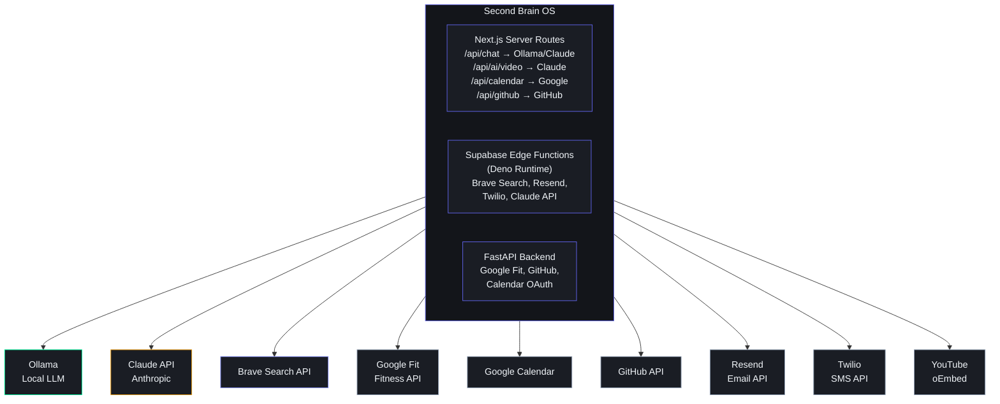
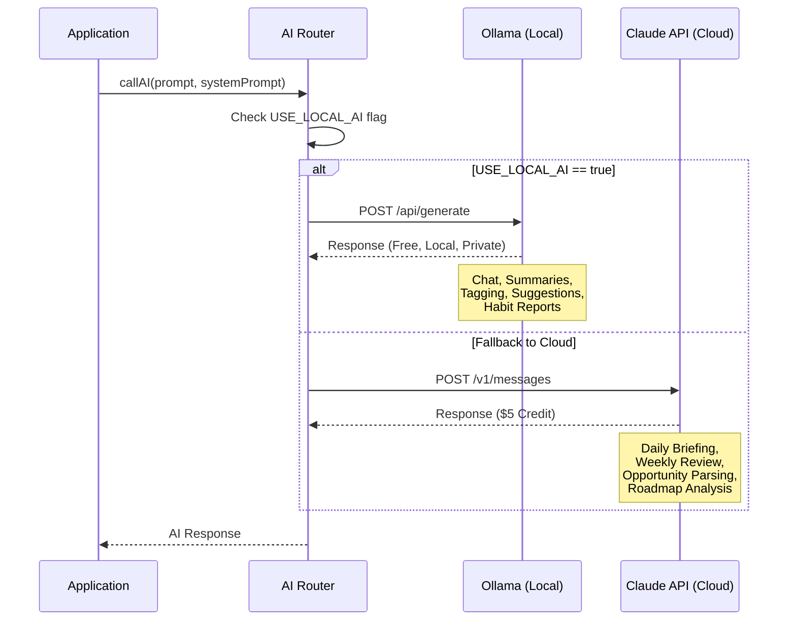

# Integration Architecture — Third-Party Services

## Overview

Second Brain OS integrates with 9 external services to provide AI processing, web search, notifications, calendar sync, health data, and source control. All integrations follow a server-side only pattern — no API keys ever reach the client browser. External calls are made from either Next.js API Routes (server-side), Supabase Edge Functions (Deno), or FastAPI backend.

---

## Integration Map



---

## 1. Supabase (PostgreSQL + Auth + Realtime + Edge Functions)

### Integration Pattern

| Component | Type | SDK | Auth |
|-----------|------|-----|------|
| Database | PostgreSQL client | `@supabase/supabase-js` | RLS with `auth.uid()` |
| Auth | OAuth/SSO provider | `@supabase/auth-helpers-nextjs` | Google OAuth + JWT |
| Realtime | WebSocket subscription | `@supabase/supabase-js` | RLS-scoped |
| Edge Functions | Serverless Deno runtime | `supabase/functions/` | Service role key |

### Free Tier Limits

| Resource | Limit | Monitoring |
|----------|-------|------------|
| Database | 500 MB | `supabase storage` |
| Edge Functions | 500k calls/month | Dashboard > Functions > Logs |
| Realtime | 50 concurrent connections | Dashboard > Database > Realtime |
| Auth | 50k monthly active users | Dashboard > Auth > Users |

### RLS Policy (applied to all tables)

```typescript
// Standard pattern for all database queries
const { data, error } = await supabase
  .from('tasks')
  .select('*')
  .eq('user_id', userId) // RLS handles this automatically when using auth.uid()
```

---

## 2. Ollama (Local LLM — Primary AI)

### Integration Pattern

| Property | Value |
|----------|-------|
| **Endpoint** | `http://localhost:11434/api/generate` |
| **Model** | `llama3.1` (8B parameters) |
| **Protocol** | HTTP POST (JSON) |
| **Auth** | None (localhost only) |
| **Used for** | ARIA chat, video summaries, resource tagging, habit reports |
| **Fallback** | Claude API |

### Request Format

```typescript
// POST http://localhost:11434/api/generate
{
  "model": "llama3.1",
  "prompt": "You are ARIA, the AI core of Second Brain OS...\n\n[USER_CONTEXT]\n...",
  "stream": false,
  "options": {
    "temperature": 0.7,
    "top_p": 0.9,
    "max_tokens": 1000
  }
}
```

### Response Format

```json
{
  "model": "llama3.1",
  "created_at": "2026-06-11T10:00:00Z",
  "response": "Based on your tasks and goals...",
  "done": true,
  "context": [/* token IDs */],
  "total_duration": 2345678900,
  "load_duration": 123456789,
  "prompt_eval_count": 850,
  "eval_count": 320,
  "eval_duration": 2200000000
}
```

### AI Router Logic



---

## 3. Claude API (Anthropic — Fallback AI)

### Integration Pattern

| Property | Value |
|----------|-------|
| **Endpoint** | `https://api.anthropic.com/v1/messages` |
| **Model** | `claude-sonnet-4-20250514` |
| **Protocol** | HTTPS REST |
| **Auth** | `x-api-key` header |
| **Free limit** | $5 credits (~5,000 messages) |
| **Rate limit** | 10 requests/minute per user |

### Request

```typescript
// POST https://api.anthropic.com/v1/messages
const response = await fetch('https://api.anthropic.com/v1/messages', {
  method: 'POST',
  headers: {
    'Content-Type': 'application/json',
    'x-api-key': process.env.ANTHROPIC_API_KEY,
    'anthropic-version': '2023-06-01'
  },
  body: JSON.stringify({
    model: 'claude-sonnet-4-20250514',
    max_tokens: 1000,
    system: 'You are ARIA...',
    messages: [
      { role: 'user', content: prompt }
    ]
  })
})
```

### Response

```json
{
  "id": "msg_123abc",
  "type": "message",
  "role": "assistant",
  "content": [
    {
      "type": "text",
      "text": "Based on your data, here's your daily briefing..."
    }
  ],
  "model": "claude-sonnet-4-20250514",
  "stop_reason": "end_turn",
  "usage": {
    "input_tokens": 850,
    "output_tokens": 320
  }
}
```

### Cost-Saving Strategy

| Task | Provider | Frequency | Max Cost/Month |
|------|----------|-----------|----------------|
| ARIA Chat | Ollama | Unlimited | Rs. 0 |
| Video Summaries | Ollama | ~30/month | Rs. 0 |
| Resource Tagging | Ollama | ~50/month | Rs. 0 |
| Habit Reports | Ollama | ~2/month | Rs. 0 |
| Daily Briefing | Claude | 30/month | ~$0.60 |
| Weekly Review | Claude | 4/month | ~$0.20 |
| Opportunity Parser | Claude | 240/month (8×30) | ~$2.40 |
| Roadmap Analysis | Claude | 4/month | ~$0.20 |
| **Total** | | | **~$3.40/month** |

---

## 4. Brave Search API

### Integration Pattern

| Property | Value |
|----------|-------|
| **Endpoint** | `https://api.search.brave.com/res/v1/web/search` |
| **Protocol** | HTTPS GET |
| **Auth** | `X-Subscription-Token` header |
| **Free limit** | 2,000 queries/month |
| **Used by** | Opportunity Radar, Roadmap Update Checker |

### Request

```typescript
// From Edge Function
const response = await fetch(
  `https://api.search.brave.com/res/v1/web/search?q=${encodeURIComponent(query)}&count=10`,
  {
    headers: {
      'Accept': 'application/json',
      'Accept-Encoding': 'gzip',
      'X-Subscription-Token': Deno.env.get('BRAVE_API_KEY') || ''
    }
  }
)
```

### Response

```json
{
  "web": {
    "results": [
      {
        "title": "Google Summer of Code 2026 - Apply Now",
        "url": "https://summerofcode.withgoogle.com",
        "description": "GSoC 2026 is now accepting applications...",
        "age": "2 days ago"
      }
    ]
  }
}
```

### Query Generation

Queries are generated by Claude API based on user skills and preferences:

```
Category: Internship
Query: "Python OR React internship India 2026 apply now"

Category: Hackathon
Query: "web development hackathon India 2026 registration open"

Category: Open Source
Query: "TypeScript good first issue GitHub 2026"
```

### Rate Limit Management

```typescript
const DAILY_BRAVE_LIMIT = 50;
const usedToday = await getBraveUsageToday();

if (usedToday >= DAILY_BRAVE_LIMIT) {
  return { skipped: true, reason: 'Daily Brave Search quota reached' };
}
```

---

## 5. GitHub API

### Integration Pattern

| Property | Value |
|----------|-------|
| **Endpoint** | `https://api.github.com` |
| **Protocol** | HTTPS REST |
| **Auth** | OAuth2 token (user) or unauthenticated |
| **Rate limit** | 60/hr (unauthenticated), 5,000/hr (authenticated) |
| **Used for** | Commit check, skill auto-update, repo linking |

### Endpoints Used

```typescript
// Get last commit for a repo
GET /repos/{owner}/{repo}/commits?per_page=1

// Get user's repos (for skill auto-update)
GET /users/{username}/repos?per_page=50&sort=pushed

// Get languages used across repos
GET /repos/{owner}/{repo}/languages
```

### Commit Check Logic

```typescript
async function checkGithubActivity(username: string): Promise<GithubStatus> {
  try {
    const res = await fetch(
      `https://api.github.com/users/${username}/events?per_page=1`
    );
    const events = await res.json();
    const lastPush = events.find(e => e.type === 'PushEvent');

    return {
      active: lastPush ? true : false,
      lastCommitDate: lastPush?.created_at || null,
      daysSinceLastCommit: lastPush
        ? daysSince(new Date(lastPush.created_at))
        : 999
    };
  } catch (error) {
    return { active: false, lastCommitDate: null, daysSinceLastCommit: 999 };
  }
}
```

---

## 6. Resend (Email)

### Integration Pattern

| Property | Value |
|----------|-------|
| **Endpoint** | `https://api.resend.com/emails` |
| **Protocol** | HTTPS REST |
| **Auth** | Bearer token in header |
| **Free limit** | 3,000 emails/month |
| **Used for** | Daily briefing, weekly review, missed task escalation |

### Request

```typescript
// POST https://api.resend.com/emails
const response = await fetch('https://api.resend.com/emails', {
  method: 'POST',
  headers: {
    'Authorization': `Bearer ${process.env.RESEND_API_KEY}`,
    'Content-Type': 'application/json'
  },
  body: JSON.stringify({
    from: 'ARIA <aria@secondbrainos.app>',
    to: 'user@example.com',
    subject: 'Your Morning Briefing — June 11, 2026',
    html: '<h1>Good Morning</h1><p>Your top 3 tasks today...</p>'
  })
})
```

### Email Frequency

| Email Type | Frequency | Approximate Monthly Volume |
|------------|-----------|---------------------------|
| Daily Briefing | Daily | 30 |
| Missed Task Alert | As needed | ~5 |
| Weekly Review | Weekly (Sunday) | 4 |
| Critical Opportunity | As needed | ~2 |
| **Total** | | ~41 emails/month |

---

## 7. Twilio (SMS)

### Integration Pattern

| Property | Value |
|----------|-------|
| **Endpoint** | `https://api.twilio.com/2010-04-01/Accounts/{sid}/Messages.json` |
| **Protocol** | HTTPS REST |
| **Auth** | Basic Auth (Account SID + Auth Token) |
| **Free limit** | $15 credits |
| **Used for** | Critical missed task escalation (missed_count >= 3 + priority=high) |

### Request

```typescript
// POST with form-encoded body
const response = await fetch(
  `https://api.twilio.com/2010-04-01/Accounts/${process.env.TWILIO_ACCOUNT_SID}/Messages.json`,
  {
    method: 'POST',
    headers: {
      'Authorization': `Basic ${btoa(`${process.env.TWILIO_ACCOUNT_SID}:${process.env.TWILIO_AUTH_TOKEN}`)}`,
      'Content-Type': 'application/x-www-form-urlencoded'
    },
    body: new URLSearchParams({
      To: '+919XXXXXXXXX',
      From: process.env.TWILIO_PHONE_NUMBER,
      Body: 'CRITICAL: Task "Submit DSA assignment" is overdue by 2 hours.'
    })
  }
)
```

---

## 8. Google Calendar API

### Integration Pattern

| Property | Value |
|----------|-------|
| **Endpoint** | `https://www.googleapis.com/calendar/v3` |
| **Protocol** | HTTPS REST |
| **Auth** | OAuth2 (user consent) |
| **Scope** | `https://www.googleapis.com/auth/calendar` |
| **Rate limit** | 1,000,000 requests/day |
| **Used for** | Two-way sync of tasks, milestones, study blocks |

### OAuth2 Flow

```
1. Frontend: GET /api/calendar/auth
   → Redirect to Google OAuth consent screen
2. User grants permission for calendar scope
3. Google redirects to /api/calendar/callback with auth code
4. Backend exchanges auth code for access_token + refresh_token
5. Tokens stored in users_profile.google_calendar_token
6. Access token used for API calls; auto-refreshed when expired
```

### Sync Logic

```typescript
async function syncTaskToCalendar(task: Task, tokens: OAuthTokens) {
  const event = {
    summary: task.title,
    description: task.description || '',
    start: { dateTime: task.scheduled_start || task.due_date },
    end: { dateTime: addMinutes(task.scheduled_start, task.estimated_minutes || 60) }
  };

  const res = await fetch(
    'https://www.googleapis.com/calendar/v3/calendars/primary/events',
    {
      method: 'POST',
      headers: {
        'Authorization': `Bearer ${tokens.access_token}`,
        'Content-Type': 'application/json'
      },
      body: JSON.stringify(event)
    }
  );
}
```

---

## 9. Google Fit API

### Integration Pattern

| Property | Value |
|----------|-------|
| **Endpoint** | `https://www.googleapis.com/fitness/v1/users/me` |
| **Protocol** | HTTPS REST |
| **Auth** | OAuth2 (user consent) |
| **Scope** | `https://www.googleapis.com/auth/fitness.sleep.read` |
| **Used for** | Auto-import sleep data from Android |

### Data Import

```typescript
async function importSleepData(accessToken: string) {
  const endTime = new Date();
  const startTime = new Date(endTime.getTime() - 24 * 60 * 60 * 1000);

  const res = await fetch(
    `https://www.googleapis.com/fitness/v1/users/me/sessions`,
    {
      headers: { 'Authorization': `Bearer ${accessToken}` }
    }
  );
  const sessions = await res.json();
  // Filter for sleep sessions, map to sleep_logs format
}
```

---

## 10. YouTube oEmbed API

### Integration Pattern

| Property | Value |
|----------|-------|
| **Endpoint** | `https://www.youtube.com/oembed?url={url}&format=json` |
| **Protocol** | HTTPS GET |
| **Auth** | None (public API) |
| **Used for** | Fetch video title, author, thumbnail on save |

### Request

```typescript
const res = await fetch(
  `https://www.youtube.com/oembed?url=${encodeURIComponent(videoUrl)}&format=json`
);
const data = await res.json();
// { title, author_name, author_url, thumbnail_url, html }
```

---

## 11. Web Push + VAPID

### Integration Pattern

| Property | Value |
|----------|-------|
| **Protocol** | Web Push Protocol (RFC 8030) |
| **Auth** | VAPID (Voluntary Application Server Identification) |
| **Keys** | Generated via `npx web-push generate-vapid-keys` |
| **Cost** | Free (browser native) |

### Push Subscription Flow

```
1. Frontend: navigator.serviceWorker.register('sw.js')
2. Frontend: registration.pushManager.subscribe({userVisibleOnly: true,
   applicationServerKey: urlBase64ToUint8Array(VAPID_PUBLIC_KEY)})
3. Frontend: POST /api/push/subscribe with subscription object
4. Backend: Store subscription in users_profile.push_subscription
5. When notification needed:
   Backend: webpush.sendNotification(subscription, JSON.stringify({title, body}))
```

### Server-Side Send

```typescript
import webpush from 'web-push';

webpush.setVapidDetails(
  'mailto:user@example.com',
  process.env.VAPID_PUBLIC_KEY!,
  process.env.VAPID_PRIVATE_KEY!
);

async function sendPushNotification(subscription: PushSubscription, title: string, body: string) {
  try {
    await webpush.sendNotification(subscription, JSON.stringify({ title, body }));
  } catch (error) {
    // Subscription expired or invalid → remove from database
    await supabase.from('users_profile')
      .update({ push_subscription: null })
      .eq('push_subscription->>endpoint', subscription.endpoint);
  }
}
```

---

## Integration Security Rules

### API Key Storage

| Key | Location | Exposed to Client? |
|-----|----------|-------------------|
| `NEXT_PUBLIC_SUPABASE_URL` | Env var | Yes (safe) |
| `NEXT_PUBLIC_SUPABASE_ANON_KEY` | Env var | Yes (RLS-protected) |
| `SUPABASE_SERVICE_ROLE_KEY` | Env var | **Never** |
| `ANTHROPIC_API_KEY` | Env var | **Never** |
| `BRAVE_API_KEY` | Env var | **Never** |
| `RESEND_API_KEY` | Env var | **Never** |
| `TWILIO_ACCOUNT_SID` | Env var | **Never** |
| `GOOGLE_CLIENT_ID` | Env var | Yes (OAuth public) |
| `GOOGLE_CLIENT_SECRET` | Env var | **Never** |
| `VAPID_PUBLIC_KEY` | Env var | Yes (push API) |
| `VAPID_PRIVATE_KEY` | Env var | **Never** |

### Server-Only Enforcement

```typescript
// All external API calls go through one of:
// 1. Next.js API route handler (/app/api/*/route.ts)
// 2. Supabase Edge Function (supabase/functions/*/index.ts)
// 3. FastAPI route handler (apps/api/app/api/*.py)
//
// NEVER in:
// - Client-side useEffect/useQuery
// - Page components
// - Zustand stores
```

### Error Handling Pattern

```typescript
async function callExternalAPI<T>(
  url: string,
  options: RequestInit,
  retries = 3
): Promise<T> {
  for (let i = 0; i < retries; i++) {
    try {
      const response = await fetch(url, options);
      if (response.ok) return await response.json();

      // Handle specific HTTP errors
      if (response.status === 429) {
        // Rate limited — wait and retry
        await sleep(1000 * Math.pow(2, i));
        continue;
      }
      if (response.status === 401) {
        // Auth error — refresh token or alert
        throw new AuthError('API key expired or invalid');
      }
      if (response.status >= 500) {
        // Server error — retry with backoff
        await sleep(1000 * Math.pow(2, i));
        continue;
      }
    } catch (error) {
      if (i === retries - 1) throw error;
      await sleep(1000 * Math.pow(2, i));
    }
  }
  throw new Error(`Failed after ${retries} retries`);
}
```

---

## Integration Contracts Summary

| Service | Method | Auth | Rate Limit | Free Tier | Retry Strategy |
|---------|--------|------|------------|-----------|----------------|
| Supabase | SDK/REST | JWT + RLS | 100 req/min | 500 MB DB | Auto (SDK handles) |
| Ollama | REST (local) | None | None | Unlimited | Linear: 1s, 2s, 4s |
| Claude | REST | API Key | 10 req/min | $5 credits | Exponential: 1s, 2s, 4s |
| Brave Search | REST | API Key | 1 req/sec | 2k queries/mo | Exponential: 2s, 4s, 8s |
| GitHub | REST | OAuth2/None | 60/hr (unauth) | Unlimited | Linear: 2s, 4s, 6s |
| Resend | REST | API Key | 10 req/sec | 3k emails/mo | Exponential: 1s, 2s, 4s |
| Twilio | REST | Basic Auth | 1 req/sec | $15 credits | Exponential: 2s, 4s, 8s |
| Google Calendar | REST | OAuth2 | 1M req/day | Unlimited | Exponential: 2s, 4s, 8s |
| Google Fit | REST | OAuth2 | 10k req/day | Unlimited | Exponential: 2s, 4s, 8s |
| YouTube oEmbed | REST | None | Public limit | Unlimited | Linear: 1s, 2s, 3s |
| Web Push | Web Push | VAPID | Browser limit | Unlimited | Exponential: 1s, 2s, 4s |
