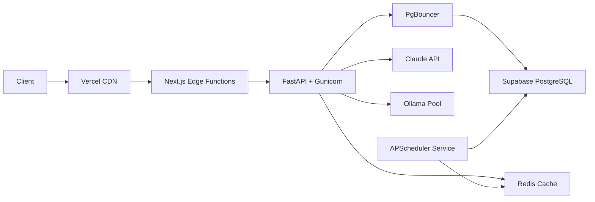

# Performance, Scalability & Capacity Planning

## Document Control

| Metadata | Value |
|---|---|
| **Document ID** | ENG-45 |
| **Version** | 1.0 |
| **Author** | ARIA OS Engineering |
| **Status** | Draft |
| **Last Updated** | 2026-06-11 |
| **Applies To** | Second Brain OS (all modules) |

---

## 1. Executive Summary

### 1.1 Purpose

This document defines performance budgets, scalability targets, and capacity plans for Second Brain OS. It serves as the single source of truth for all performance-related decisions across frontend (Next.js 14), backend (FastAPI), database (Supabase PostgreSQL), and AI layers (Ollama/Claude).

### 1.2 Scope

Covers the complete stack:

| Layer | Technology | Coverage |
|---|---|---|
| Frontend | Next.js 14 + React 18 + Three.js | Core Web Vitals, bundle budget, code splitting |
| Backend | FastAPI + Uvicorn | p50/p95/p99 latency, caching, connection pooling |
| Database | Supabase PostgreSQL | Query performance, index strategy, storage growth |
| AI | Ollama (local) + Claude API | Token budgets, response time, context management |
| Scheduling | APScheduler | Cron execution overhead, resource contention |

### 1.3 System Overview

Second Brain OS is a single-user personal productivity system. The architecture is monolithic-frontend with a modular backend:

- **Frontend**: Next.js 14 App Router hosted on Vercel (free tier)
- **Backend**: FastAPI single-process hosted on Railway
- **Database**: Supabase PostgreSQL (free tier, 500 MB)
- **AI**: Ollama (Mistral 7B, local) for scheduling + Claude API for chat/analysis
- **Scheduler**: APScheduler co-located in the FastAPI process

### 1.4 Performance Philosophy

1. **Perceived performance over raw speed** — Optimize for Time to Interactive and meaningful loading states
2. **Single-user priority** — The system serves one user; every optimization targets this reality
3. **LLM latency is the bottleneck** — AI response time dominates user experience; frontend and database optimization exists to make AI wait times tolerable
4. **No premature optimization** — Caching and indexes are applied strategically where data volume justifies them
5. **Free-tier constraints drive design** — Supabase 500 MB, Vercel 100 GB bandwidth, Railway 512 MB RAM

---

## 2. Performance Baseline & Benchmarks

### 2.1 Current Estimated Baselines

Measured during development (local dev environment, single user seeded with ~500 test rows):

| Service | Metric | Current (Dev) | Target (Production) |
|---|---|---|---|
| Frontend LCP | Lighthouse | ~3.0s | < 2.5s |
| Frontend TTFB | Navigation Timing | ~900ms | < 800ms |
| API (simple CRUD) | p95 latency | ~350ms | < 200ms |
| API (AI chat) | p95 latency | ~8s (Ollama) | < 5s (Ollama) |
| DB (SELECT by PK) | p95 latency | ~25ms | < 10ms |
| DB (filtered query) | p95 latency | ~80ms | < 50ms |
| Bundle (initial JS) | file size | ~350 KB | < 200 KB |

### 2.2 Target Benchmarks for Production

| Category | Metric | Target | Method |
|---|---|---|---|
| **Frontend** | Lighthouse Performance Score | > 90 | `lighthouse-ci` |
| **Frontend** | PageSpeed Insights Score | > 85 | PSI API |
| **Backend** | API availability | 99.5% | Uptime monitor |
| **Backend** | Error rate | < 0.5% | Logger middleware |
| **Database** | Query success rate | 100% | Error catch counts |
| **Database** | Connection pool hit rate | > 95% | Pool metrics |
| **AI (Claude)** | Response success rate | > 98% | API 2xx count |
| **AI (Ollama)** | Response success rate | > 95% | Process health |

### 2.3 Measurement Methodology

| Data Point | Collection Tool | Instrumentation Point |
|---|---|---|
| Frontend Web Vitals | `web-vitals` npm package | `apps/web/lib/vitals.ts` |
| API latency | Logger middleware | `apps/api/app/middleware/logging.py` |
| DB query time | Supabase Query Performance | Supabase dashboard |
| AI response time | AI client wrapper | `apps/api/app/ai/client.py` |
| Bundle size | `next-bundle-analyzer` | CI pipeline (`npm run analyze`) |
| Memory/CPU | Railway + Vercel dashboards | Platform metrics |
| Error rate | Structured JSON logs | `packages/shared/utils/logger.py` |
| Storage | Supabase dashboard | Database size monitor |

---

## 3. Frontend Performance

### 3.1 Core Web Vitals Targets

| Metric | Target | Measurement |
|---|---|---|
| LCP | < 2.5s | Lighthouse / Web Vitals API |
| FID / INP | < 100ms | Web Vitals API |
| CLS | < 0.1 | Web Vitals API |
| TTFB | < 800ms | Navigation Timing API |
| FCP | < 1.8s | Lighthouse |

### 3.2 Bundle Size Budget

| Asset | Budget | Current Estimate |
|---|---|---|
| Initial JS (main) | < 200 KB | ~150 KB |
| Initial CSS | < 50 KB | ~30 KB |
| Three.js bundle | < 150 KB | ~120 KB |
| React Flow bundle | < 100 KB | ~80 KB |
| Fonts (Syne, DM Sans, JetBrains Mono) | < 60 KB | ~50 KB |
| Zustand + middleware | < 15 KB | ~10 KB |
| Framer Motion | < 40 KB | ~35 KB |
| Icons (lucide-react) | < 20 KB | ~15 KB (tree-shaken) |
| **Total initial payload** | **< 500 KB** | **~350 KB** |

### 3.3 Optimization Strategies

**Code Splitting**

| Module | Split Strategy | Entry Point |
|---|---|---|
| Three.js (dashboard globe) | `next/dynamic` with `ssr: false` | `dashboard/page.tsx` |
| React Flow (roadmap editor) | `next/dynamic` with `ssr: false` | `goals/page.tsx` |
| Markdown editor (briefing viewer) | `next/dynamic` | `dashboard/briefing.tsx` |
| Chart library (analytics) | `next/dynamic` | `analytics/page.tsx` |
| Chat panel | Lazy mount after page interactive | `chat/panel.tsx` |

**Image Optimization**
```tsx
// All user-facing images use next/image
import Image from 'next/image'

<Image
  src={thumbnail}
  alt={title}
  width={320}
  height={180}
  placeholder="blur"
  priority={index < 3}                    // Above-fold images only
/>
```

**Font Optimization**
```tsx
// apps/web/app/layout.tsx — single consolidated font loading
import { Syne, DM_Sans, JetBrains_Mono } from 'next/font/google'

const syne = Syne({ subsets: ['latin'], display: 'swap', variable: '--font-syne' })
const dmSans = DM_Sans({ subsets: ['latin'], display: 'swap', variable: '--font-dm-sans' })
const jetbrainsMono = JetBrains_Mono({ subsets: ['latin'], display: 'swap', variable: '--font-mono' })
```

**Additional Strategies**

| Strategy | Implementation | Impact |
|---|---|---|
| Route prefetching | `next/link` prefetches visible links by default | ~200ms perceived nav time |
| Lazy loading | Intersection Observer for below-fold sections | Reduces initial render work |
| Tree shaking | Verify with `next-bundle-analyzer` every PR | Removes dead code |
| Progressive enhancement | Core task CRUD works without JS (form actions) | Graceful degradation |
| Response caching | `stale-while-revalidate` for static dashboard data | Redundant re-fetch reduction |

---

## 4. Backend Performance (FastAPI)

### 4.1 Response Time Targets

| Endpoint Category | p50 Target | p95 Target | p99 Target |
|---|---|---|---|
| Simple CRUD (tasks, habits, ideas) | < 50ms | < 200ms | < 500ms |
| Complex queries (analytics, stats) | < 100ms | < 400ms | < 1,000ms |
| AI chat (Ollama) | < 3,000ms | < 8,000ms | < 15,000ms |
| AI chat (Claude) | < 2,000ms | < 5,000ms | < 10,000ms |
| Health check | < 10ms | < 20ms | < 50ms |
| Scheduler trigger | < 200ms | < 500ms | < 1,000ms |

### 4.2 Optimization Strategies

**Database Query Optimization**

| Practice | Implementation | File/Module |
|---|---|---|
| Proper indexes | All FK columns + frequently filtered columns | `docs/engineering/15_Database.md` |
| Limit result sets | `client.from("tasks").select("*").limit(50)` | All API routes |
| Pagination | `offset` + `limit` params for list endpoints | `api/tasks.py`, `api/habits.py` |
| Column specificity | `select("id,title,status")` instead of `select("*")` | All API routes |
| Connection pooling | supabase-py reuses connection pool automatically | `config/core/supabase.py` |

**Caching Strategy**

| Data Type | Cache | TTL | Invalidation |
|---|---|---|---|
| User profile | `SimpleCache` | 300s | On profile update |
| Dashboard stats | `SimpleCache` | 60s | On any data mutation |
| Goal progress | `SimpleCache` | 120s | On task/goal mutation |
| Resource list | `SimpleCache` | 300s | On resource add/delete |
| Static reference data | `SimpleCache` | 600s | Manual (rarely changes) |

```python
# Example: cached dashboard stats
from shared.utils.cache import cached

@cached(ttl=60, key_prefix="dashboard_stats")
async def get_dashboard_stats(user_id: str):
    """Dashboard stats — cached for 60 seconds"""
    ...
```

**Response Compression**

```python
# main.py — gzip middleware
from fastapi.middleware.gzip import GZipMiddleware

app.add_middleware(GZipMiddleware, minimum_size=1000)
```

**Async I/O**
```python
# All endpoints are async — ensures non-blocking I/O for DB calls
@app.get("/api/tasks")
async def list_tasks(request: Request):
    """Async handler — no synchronous DB calls"""
```

**Pydantic Validation Overhead**

| Practice | Rationale |
|---|---|
| Use `model_validator` only when cross-field validation is needed | Reduces per-request validation cost |
| Reuse response models across endpoints | Pydantic caches compiled models |
| Avoid deep nested models for list responses | Flat serialization is faster |
| Use `from_attributes=True` for ORM mode | Eliminates manual dict conversion |

**AI Request Optimization**

| Technique | Implementation | Impact |
|---|---|---|
| Context window management | Trim history to last 8 exchanges | 60% token reduction |
| Token budget enforcement | Hard cap on input + output tokens | Prevents runaway costs |
| Request timeout | 30s timeout on all AI calls | Prevents hung connections |
| Response caching | Cache identical prompts for 1 hour | Eliminates redundant API calls |
| Streaming | Server-Sent Events for chat responses | Faster perceived response |
| Fallback | Claude → Ollama fallback on API failure | Maintains availability |

### 4.3 Uvicorn Configuration

```python
# Recommended uvicorn config for production deployment
# apps/api/run.py

import uvicorn

if __name__ == "__main__":
    uvicorn.run(
        "main:app",
        host="0.0.0.0",
        port=8000,
        workers=1,                     # Single worker; agents are in-process
        limit_concurrency=10,          # Moderate concurrency for single user
        timeout_keep_alive=30,         # Keep-alive timeout
        log_level="info",
        access_log=True,               # Required for latency monitoring
    )
```

### 4.4 Rate Limiter Configuration

```python
# Referenced from packages/shared/utils/rate_limiter.py
# Current defaults are appropriate for single-user
limits = {
    "/api/chat":      {"max": 30,  "window": 60},   # 30 AI requests/min
    "/api/tasks":     {"max": 60,  "window": 60},   # 60 CRUD requests/min
    "/api/courses":   {"max": 60,  "window": 60},
    "/api/goals":     {"max": 60,  "window": 60},
    "default":        {"max": 100, "window": 60},   # 100 req/min catch-all
}
```

---

## 5. Database Performance (Supabase PostgreSQL)

### 5.1 Query Performance Targets

| Query Type | Target (p95) |
|---|---|
| Simple SELECT by PK | < 10ms |
| SELECT with filter (user_id) | < 50ms |
| JOIN query (tasks + goals) | < 100ms |
| Aggregation (stats/analytics) | < 200ms |
| INSERT single row | < 50ms |
| UPDATE by PK | < 50ms |
| DELETE by PK | < 50ms |
| Full-text search (resources) | < 300ms |

### 5.2 Index Strategy

```sql
-- ============================================================
-- MUST-HAVE INDEXES — Every FK column + frequently filtered column
-- ============================================================

-- Core user-scoped lookups (every table)
CREATE INDEX IF NOT EXISTS idx_tasks_user_id ON tasks(user_id);
CREATE INDEX IF NOT EXISTS idx_courses_user_id ON courses(user_id);
CREATE INDEX IF NOT EXISTS idx_youtube_saves_user_id ON youtube_saves(user_id);
CREATE INDEX IF NOT EXISTS idx_resources_user_id ON resources(user_id);
CREATE INDEX IF NOT EXISTS idx_ideas_user_id ON ideas(user_id);
CREATE INDEX IF NOT EXISTS idx_goals_user_id ON goals(user_id);
CREATE INDEX IF NOT EXISTS idx_roadmaps_user_id ON roadmaps(user_id);
CREATE INDEX IF NOT EXISTS idx_opportunities_user_id ON opportunities(user_id);
CREATE INDEX IF NOT EXISTS idx_income_sources_user_id ON income_sources(user_id);
CREATE INDEX IF NOT EXISTS idx_income_logs_user_id ON income_logs(user_id);
CREATE INDEX IF NOT EXISTS idx_projects_user_id ON projects(user_id);
CREATE INDEX IF NOT EXISTS idx_academic_subjects_user_id ON academic_subjects(user_id);
CREATE INDEX IF NOT EXISTS idx_habits_user_id ON habits(user_id);
CREATE INDEX IF NOT EXISTS idx_sleep_logs_user_id ON sleep_logs(user_id);
CREATE INDEX IF NOT EXISTS idx_time_logs_user_id ON time_logs(user_id);
CREATE INDEX IF NOT EXISTS idx_chat_messages_user_id ON chat_messages(user_id);
CREATE INDEX IF NOT EXISTS idx_aria_memory_user_id ON aria_memory(user_id);
CREATE INDEX IF NOT EXISTS idx_daily_briefings_user_id ON daily_briefings(user_id);
CREATE INDEX IF NOT EXISTS idx_weekly_reviews_user_id ON weekly_reviews(user_id);
CREATE INDEX IF NOT EXISTS idx_study_sessions_user_id ON study_sessions(user_id);

-- Composite indexes for common query patterns
CREATE INDEX IF NOT EXISTS idx_tasks_user_status ON tasks(user_id, status);
CREATE INDEX IF NOT EXISTS idx_tasks_user_due ON tasks(user_id, due_date);
CREATE INDEX IF NOT EXISTS idx_tasks_user_priority ON tasks(user_id, priority);
CREATE INDEX IF NOT EXISTS idx_opportunities_user_status ON opportunities(user_id, status);
CREATE INDEX IF NOT EXISTS idx_time_logs_user_start ON time_logs(user_id, started_at DESC);
CREATE INDEX IF NOT EXISTS idx_sleep_logs_user_date ON sleep_logs(user_id, date DESC);
CREATE INDEX IF NOT EXISTS idx_goals_user_status ON goals(user_id, status);
CREATE INDEX IF NOT EXISTS idx_habits_user_status ON habits(user_id, status);
CREATE INDEX IF NOT EXISTS idx_courses_user_status ON courses(user_id, status);
CREATE INDEX IF NOT EXISTS idx_projects_user_status ON projects(user_id, status);
CREATE INDEX IF NOT EXISTS idx_chat_messages_user_created ON chat_messages(user_id, created_at DESC);
CREATE INDEX IF NOT EXISTS idx_briefings_user_date ON daily_briefings(user_id, date DESC);
CREATE INDEX IF NOT EXISTS idx_weekly_reviews_user ON weekly_reviews(user_id, week_start DESC);

-- Partial indexes for filtered queries
CREATE INDEX IF NOT EXISTS idx_tasks_active_due ON tasks(due_date)
  WHERE status NOT IN ('completed', 'cancelled');
CREATE INDEX IF NOT EXISTS idx_opportunities_active_deadline ON opportunities(deadline)
  WHERE status IN ('new', 'saved');
CREATE INDEX IF NOT EXISTS idx_opportunities_matches ON opportunities(match_score)
  WHERE match_score >= 50;
CREATE INDEX IF NOT EXISTS idx_goals_active_target ON goals(target_date)
  WHERE status = 'active';
CREATE INDEX IF NOT EXISTS idx_courses_active_deadline ON courses(deadline)
  WHERE status = 'active';
CREATE INDEX IF NOT EXISTS idx_time_logs_deep_work ON time_logs(is_deep_work)
  WHERE is_deep_work = TRUE;

-- Special indexes
CREATE INDEX IF NOT EXISTS idx_resources_tags ON resources USING GIN(tags);
CREATE INDEX IF NOT EXISTS idx_resources_fts ON resources
  USING GIN(to_tsvector('english', title || ' ' || COALESCE(notes, '')));

-- FK relationship indexes
CREATE INDEX IF NOT EXISTS idx_subtasks_task ON subtasks(task_id);
CREATE INDEX IF NOT EXISTS idx_task_deps_task ON task_dependencies(task_id);
CREATE INDEX IF NOT EXISTS idx_task_deps_depends ON task_dependencies(depends_on_id);
CREATE INDEX IF NOT EXISTS idx_income_logs_source ON income_logs(source_id);
CREATE INDEX IF NOT EXISTS idx_marks_subject ON marks(subject_id);
CREATE INDEX IF NOT EXISTS idx_study_sessions_course ON study_sessions(course_id);
```

### 5.3 Query Optimization Guidelines

| Rule | Rationale | Example |
|---|---|---|
| Always filter by `user_id` | RLS doesn't replace explicit WHERE; narrows scan | `.eq("user_id", user.id)` |
| Use `LIMIT` on list endpoints | Prevents unbounded result sets | `.limit(50)` |
| Use pagination for large sets | Avoids memory pressure on API + DB | `offset=0&limit=20` |
| Specify columns, never `SELECT *` | Reduces network payload, avoids unnecessary JSON serialization | `.select("id,title,status")` |
| Use `COUNT(*)` sparingly | Full-scan aggregations are expensive on PostgreSQL | Cache counts for 60s |
| Use `order().limit(1)` for "latest X" | More efficient than fetching all + slicing | `.order("created_at", desc=True).limit(1)` |
| Use `.maybe_single()` for PK lookups | Returns single object or None, avoids list wrapping | `.eq("id", task_id).maybe_single()` |

### 5.4 Supabase Free Tier Constraints

| Resource | Limit | Mitigation |
|---|---|---|
| Database size | 500 MB | Monitor growth; archive old data quarterly |
| Row count | Soft-capped at ~100K before perf degrades | Index all queries; archive >6mo data |
| Connections | 15 simultaneous | Connection pooling via supabase-py |
| Bandwidth | 2 GB/month | Compress responses; cache aggressively |
| Backup retention | 7 days | Manual pg_dump weekly to local storage |

---

## 6. AI Performance

### 6.1 LLM Response Time Budget

| Operation | Ollama (Mistral 7B) | Claude (Sonnet/Instant) |
|---|---|---|
| Simple chat | < 3,000ms | < 2,000ms |
| Briefing generation | < 10,000ms | < 5,000ms |
| Opportunity analysis | < 15,000ms | < 8,000ms |
| Weekly review | < 20,000ms | < 10,000ms |
| Roadmap update detection | < 12,000ms | < 6,000ms |
| Task auto-prioritization | < 5,000ms | < 3,000ms |

### 6.2 Token Budget Management

| Component | Max Tokens (input) | Max Tokens (output) | Model Target |
|---|---|---|---|
| Chat (user message + context) | 4,096 | 1,024 | Claude / Ollama |
| Briefing generation | 6,144 | 2,048 | Claude |
| Weekly review | 8,192 | 4,096 | Claude |
| Opportunity scan | 4,096 | 1,024 | Claude |
| Roadmap update check | 4,096 | 1,024 | Ollama |
| Task prioritization | 2,048 | 512 | Ollama |
| Memory extraction | 3,072 | 512 | Ollama |

### 6.3 Context Window Optimization

```python
# apps/api/app/ai/context_builder.py — Pseudocode for context trimming

MAX_HISTORY_EXCHANGES = 8
MAX_SYSTEM_PROMPT_TOKENS = 400
MAX_CONTEXT_TOKENS = 4096

def build_chat_context(user_id: str, message: str) -> dict:
    """Assemble a trimmed context window for the LLM"""

    # 1. Get only the last N exchanges
    history = get_recent_messages(user_id, limit=MAX_HISTORY_EXCHANGES)

    # 2. Truncate system prompt to budget
    system_prompt = get_system_prompt(user_id)[:MAX_SYSTEM_PROMPT_TOKENS]

    # 3. Add only relevant memory entries
    relevant_memories = get_relevant_memories(user_id, message, top_k=3)

    # 4. Strip metadata from history entries
    clean_history = [
        {"role": m["role"], "content": m["content"]}
        for m in history
    ]

    # 5. Enforce total token budget
    context = build_payload(system_prompt, clean_history, relevant_memories, message)
    if estimate_tokens(context) > MAX_CONTEXT_TOKENS:
        # Trim oldest history entries until under budget
        while estimate_tokens(context) > MAX_CONTEXT_TOKENS and len(clean_history) > 2:
            clean_history.pop(0)
            context = build_payload(system_prompt, clean_history, relevant_memories, message)

    return context
```

### 6.4 Model Selection Strategy

| Task | Preferred Model | Fallback | Rationale |
|---|---|---|---|
| Chat | Claude API (fast, high quality) | Ollama Mistral 7B | Chat needs quality + speed |
| Briefing | Claude API (structured output) | Ollama | Structured JSON output needed |
| Daily scheduling | Ollama (free, always available) | None | Runs on cron; cost must be $0 |
| Opportunity scan | Claude API (external data understanding) | Ollama | Needs web context reasoning |
| Memory extraction | Ollama (simple, local) | None | Low complexity, frequent runs |
| Weekly review | Claude API (long context, synthesis) | Ollama | Requires summarizing 7d of data |

---

## 7. Scalability Assessment

### 7.1 Current Scale Assumptions

| Dimension | Current Value | Justification |
|---|---|---|
| Users | 1 | Solo developer project |
| API requests/day | ~100 | Each page load triggers 2-5 API calls |
| AI requests/day | ~10 | Morning briefing + periodic chat + cron jobs |
| Database rows | < 50,000 | ~6 months of data at current growth |
| Database size | < 50 MB | Well within Supabase free tier |
| Frontend bandwidth | < 1 GB/month | Single user, no media hosting |
| Scheduled jobs | ~8/day | Morning briefing, various checkers |

### 7.2 Scaling Vectors (Future Multi-User)

| Vector | Current Limit | Bottleneck | Upgrade Path |
|---|---|---|---|
| Concurrent users | ~1 | Single-threaded FastAPI | Gunicorn + multiple Uvicorn workers |
| API throughput | ~100 req/min | In-memory rate limiter | Redis-based distributed rate limiter |
| Database size | 500 MB (Supabase free) | Storage | Upgrade to Pro ($25/mo, 8 GB) |
| Database connections | 15 | Supabase free tier | Pro tier (60 connections) + PgBouncer |
| AI requests | ~10/day (Ollama) / ~50/mo (Claude) | Token cost on Claude | Optimize prompts; batch similar tasks |
| Frontend traffic | Minimal | Vercel free tier | Pro plan ($20/mo) + CDN |
| Scheduler | Single thread | CPU contention | Separate scheduler service |
| File storage | N/A (no user uploads) | — | Supabase Storage (1 GB free) |

### 7.3 Scaling Strategy (Phase 2 — Multi-User)



| Layer | Phase 1 (Single User) | Phase 2 (Multi-User) | Migration Effort |
|---|---|---|---|
| Frontend | Vercel Hobby | Vercel Pro + CDN | Config change |
| API | Railway (1 worker) | Railway (2-4 workers) + Gunicorn | Config change |
| Database | Supabase Free | Supabase Pro + PgBouncer | Config change |
| Cache | In-memory `SimpleCache` | Redis (Upstash or Railway Redis) | Replace `SimpleCache` calls |
| Rate limiting | In-memory per-IP | Per-user via Redis | Replace `RateLimiter` middleware |
| Scheduler | Co-located in API | Separate Railway service | New deployment |
| AI | Direct Ollama + Claude | Response cache + request queue | New services |

### 7.4 Horizontal Scaling Readiness

Current architecture allows multi-worker deployment with minimal code changes:

| Concern | Current State | Ready For Workers? |
|---|---|---|
| Session state | Zustand (client-side) | Yes |
| Caching | In-memory `SimpleCache` | No — needs Redis for shared cache |
| Rate limiting | In-memory dict | No — needs Redis |
| Scheduler | APScheduler in-process | No — must extract to separate service |
| Static files | Next.js handles | Yes |
| Database | Supabase (external) | Yes — stateless from app perspective |
| File uploads | Not implemented | N/A |

---

## 8. Capacity Planning

### 8.1 Storage Growth Projection

| Data Type | Rows/Month | 6-Month | 12-Month | 24-Month | Est. Size/Row |
|---|---|---|---|---|---|
| Tasks | 100 | 600 | 1,200 | 2,400 | ~500 B |
| Subtasks | 50 | 300 | 600 | 1,200 | ~200 B |
| Habit logs | 450 | 2,700 | 5,400 | 10,800 | ~150 B |
| Sleep logs | 30 | 180 | 365 | 730 | ~300 B |
| Income entries | 20 | 120 | 240 | 480 | ~300 B |
| Chat messages | 500 | 3,000 | 6,000 | 12,000 | ~2 KB (avg) |
| Briefings/reviews | 35 | 210 | 420 | 840 | ~4 KB (avg) |
| Time entries | 150 | 900 | 1,800 | 3,600 | ~200 B |
| YouTube saves | 20 | 120 | 240 | 480 | ~500 B |
| Resources | 15 | 90 | 180 | 360 | ~1 KB |
| Ideas | 5 | 30 | 60 | 120 | ~500 B |
| Goals/roadmaps | 3 | 18 | 36 | 72 | ~2 KB |
| Opportunities | 30 | 180 | 360 | 720 | ~500 B |
| Academic marks | 10 | 60 | 120 | 240 | ~200 B |
| Aria memory | 20 | 120 | 240 | 480 | ~300 B |
| **Total rows** | **~1,438** | **~8,628** | **~17,261** | **~34,522** | **—** |
| **Estimated size** | **~3 MB** | **~18 MB** | **~36 MB** | **~72 MB** | **—** |

Conclusion: 12-month storage requirement is **~36 MB**, well within the 500 MB Supabase free tier. At current single-user growth rates, the free tier is sufficient for **~8 years** of operation.

### 8.2 Compute Capacity Planning

| Resource | Current Allocation | Current Usage | Headroom | Upgrade Trigger |
|---|---|---|---|---|
| **Railway CPU** | 0.5 vCPU shared | ~5% idle / ~30% during AI | ~200% | >50 req/min sustained OR >70% CPU for 5min |
| **Railway RAM** | 512 MB | ~120 MB idle / ~300 MB during AI | ~300% | >70% memory usage (360 MB) sustained |
| **Vercel Function** | 1 GB RAM | ~200 MB peak | ~500% | >300 req/day OR function timeouts |
| **Supabase CPU** | Shared (free tier) | Minimal — < 5% most queries | Varies | >5s p95 query time on any core query |
| **Supabase Storage** | 500 MB | < 50 MB after 12 months | ~1,000% | >400 MB (plan upgrade) |
| **Ollama RAM** | 4 GB (Mistral 7B) | ~4.5 GB with context | ~0% headroom | Model upgrade to 13B (needs 8 GB+) |
| **Claude API** | N/A (pay-per-token) | ~$2/month | N/A | >$10/month → optimize prompts |

### 8.3 Cost Projection (Phase 1 — Single User)

| Service | Current Cost | 12-Month Projection | Notes |
|---|---|---|---|
| Vercel (Hobby) | $0 | $0 | 100 GB bandwidth, 60 req/min |
| Railway | $0 (starter) | $0 | $5/mo if growth exceeds starter credits |
| Supabase (Free) | $0 | $0 | Sufficient for >8 years |
| Claude API | ~$2/mo | ~$24/yr | Usage-based; depends on chat frequency |
| Ollama (local) | $0 | $0 | Local hardware cost only |
| Domain (optional) | $0 | $10/yr | Only if custom domain needed |
| **Total** | **~$2/mo** | **~$24/yr + optional** | |

---

## 9. Performance Monitoring

### 9.1 Metrics to Collect

| Metric | Collection Method | Where | Alert Threshold |
|---|---|---|---|
| API p95 latency | Logger middleware (`packages/shared/utils/logger.py`) | `apps/api/app/middleware/logging.py` | > 500ms |
| API error rate | Logger middleware (status_code >= 500 count) | Same middleware | > 1% of requests |
| DB query time | Supabase Query Performance dashboard | Supabase dashboard | > 200ms on any query |
| Frontend LCP | Web Vitals API (`web-vitals` npm package) | `apps/web/lib/vitals.ts` | > 2.5s |
| Frontend CLS | Web Vitals API | Same | > 0.1 |
| AI response time | AI client wrapper (timing wrapper) | `apps/api/app/ai/client.py` | > 10s (Ollama), > 5s (Claude) |
| Bundle size | `next-bundle-analyzer` | CI pipeline | > 500 KB initial JS |
| Storage usage | Supabase dashboard | Dashboard | > 80% of quota (400 MB) |
| Railway memory | Railway dashboard | Dashboard | > 70% (360 MB) |
| Scheduler failures | APScheduler listener | `services/scheduler/main.py` | Any failure |

### 9.2 Alerting Strategy

| Severity | Condition | Response Time | Action |
|---|---|---|---|
| **Critical** | API returns 5xx for > 2 minutes | < 5 min | Restart Railway service + investigate |
| **Critical** | Supabase unavailable | < 10 min | Check Supabase status page; escalate to Supabase |
| **High** | API p95 latency > 1s for 5 minutes | < 1 hour | Review slow query logs; add index or optimize |
| **High** | AI response consistently > 15s | < 1 hour | Check Ollama process; switch to Claude fallback |
| **Medium** | Error rate > 5% in 1-hour window | < 24 hours | Log to error tracker; investigate next session |
| **Medium** | Frontend LCP > 3s | < 24 hours | Run Lighthouse CI; review recent bundle changes |
| **Low** | Storage > 80% of quota | < 1 week | Plan archival of old data; verify growth projection |
| **Low** | Bundle size exceeds budget | < 1 week | Review bundle analyzer; code split offenders |

### 9.3 Monitoring Implementation Checklist

- [ ] Logger middleware captures per-request latency (`apps/api/app/middleware/logging.py`)
- [ ] Web Vitals reporting in `apps/web/lib/vitals.ts`
- [ ] `next-bundle-analyzer` configured in `next.config.js`
- [ ] AI client wrapper logs token usage + response time
- [ ] Railway dashboard configured with memory/CPU alerts
- [ ] Supabase Query Performance checked weekly
- [ ] APScheduler logging captures job failures
- [ ] Monthly performance review against this document's targets

---

## 10. Load Testing Strategy (Phase 2)

> **Note**: Load testing is deferred to Phase 2 (multi-user). The single-user system does not generate sufficient concurrent traffic to warrant automated load testing. This section serves as a blueprint when needed.

### 10.1 Testing Tools

| Tool | Purpose | Installation | Cost |
|---|---|---|---|
| **k6** | Scriptable load testing | `winget install k6` / `brew install k6` | Free, open-source |
| **Apache Bench (ab)** | Simple HTTP benchmarking | Built into Windows (IIS tools) | Free |
| **Lighthouse CI** | Frontend performance regression | `npm install -g @lhci/cli` | Free |
| **Locust** | Python-based load testing | `pip install locust` | Free |

### 10.2 Test Scenarios

| Scenario | Concurrency | Duration | Target | k6 Ramp Pattern |
|---|---|---|---|---|
| **Normal load** | 1-2 VUs | 5 min | All endpoints < 200ms p95 | 0 → 2 over 30s, hold 4min, → 0 over 30s |
| **Peak load** | 5 VUs | 5 min | No 5xx errors, < 500ms p95 | 0 → 5 over 1min, hold 3min, → 0 over 1min |
| **Sustained load** | 3 VUs | 30 min | No performance degradation | 0 → 3 over 1min, hold 28min, → 0 over 1min |
| **AI burst** | 5 VUs, all hitting `/api/chat` | 2 min | All responses < 15s | 0 → 5 over 10s, hold 100s, → 0 over 10s |
| **Scheduler spike** | Trigger all 8 cron jobs simultaneously | 1 min | All complete < 60s | Spike: start 8 concurrent scheduler jobs |

### 10.3 k6 Script Template

```javascript
// tests/load/k6-script.js — Example k6 load test

import http from 'k6/http'
import { check, sleep } from 'k6'
import { Rate, Trend } from 'k6/metrics'

const errorRate = new Rate('errors')
const apiLatency = new Trend('api_latency')

export const options = {
  stages: [
    { duration: '30s', target: 2 },   // Ramp up to 2 users
    { duration: '4m', target: 2 },     // Hold at 2 users
    { duration: '30s', target: 0 },    // Ramp down
  ],
  thresholds: {
    errors: ['rate<0.01'],             // Error rate < 1%
    api_latency: ['p(95)<200'],        // p95 latency < 200ms
    http_req_duration: ['p(99)<500'],  // p99 latency < 500ms
  },
}

const BASE_URL = __ENV.BASE_URL || 'http://localhost:8000'
const AUTH_TOKEN = __ENV.AUTH_TOKEN || 'test-token'

export default function () {
  const params = {
    headers: {
      'Authorization': `Bearer ${AUTH_TOKEN}`,
      'Content-Type': 'application/json',
    },
  }

  // GET /api/tasks
  const tasksRes = http.get(`${BASE_URL}/api/tasks?limit=20`, params)
  check(tasksRes, { 'tasks status is 200': (r) => r.status === 200 })
  apiLatency.add(tasksRes.timings.duration)
  errorRate.add(tasksRes.status !== 200)
  sleep(1)

  // GET /api/dashboard/stats
  const statsRes = http.get(`${BASE_URL}/api/dashboard/stats`, params)
  check(statsRes, { 'stats status is 200': (r) => r.status === 200 })
  apiLatency.add(statsRes.timings.duration)
  errorRate.add(statsRes.status !== 200)
  sleep(1)

  // POST /api/tasks (create)
  const createRes = http.post(`${BASE_URL}/api/tasks`, JSON.stringify({
    title: `Load Test Task ${Date.now()}`,
    priority: 'medium',
    status: 'pending',
  }), params)
  check(createRes, { 'create task status is 200': (r) => r.status === 200 })
  apiLatency.add(createRes.timings.duration)
  errorRate.add(createRes.status !== 200)
  sleep(2)
}
```

### 10.4 Pre-Launch Checklist (Phase 2)

- [ ] Run normal load scenario — all endpoints pass p95 < 200ms
- [ ] Run peak load scenario — no 5xx errors, p95 < 500ms
- [ ] Run sustained load scenario — no performance degradation over 30min
- [ ] Run AI burst scenario — all chat responses within 15s
- [ ] Lighthouse CI score > 90
- [ ] Bundle size < 500 KB
- [ ] No memory leaks (stable RAM over 30min load test)
- [ ] Rate limiter correctly throttles at configured limits
- [ ] Database connection pool does not exhaust under peak load

---

## 11. Performance Budgets Summary

### Appendix A: Consolidated Performance Budget

| Category | Metric | Budget | Violation Action |
|---|---|---|---|
| **Frontend** | LCP | < 2.5s | Optimize critical rendering path |
| **Frontend** | FID / INP | < 100ms | Reduce main thread blocking |
| **Frontend** | CLS | < 0.1 | Set explicit dimensions on all media |
| **Frontend** | TTFB | < 800ms | Optimize API + use edge functions |
| **Frontend** | Initial JS | < 200 KB | Code split, tree-shake |
| **Frontend** | Initial CSS | < 50 KB | Remove unused Tailwind classes |
| **Frontend** | Total payload | < 500 KB | Audit every dependency |
| **Frontend** | Lighthouse score | > 90 | Review recommendations |
| **Backend** | p50 latency (CRUD) | < 50ms | Add indexes, optimize queries |
| **Backend** | p95 latency (CRUD) | < 200ms | Review slow queries, add caching |
| **Backend** | p99 latency (CRUD) | < 500ms | Investigate outliers |
| **Backend** | Error rate | < 0.5% | Fix error paths, add retries |
| **Backend** | Uptime | 99.5% | Health checks, auto-restart |
| **Database** | PK lookup | < 10ms | Index primary key |
| **Database** | Filtered query | < 50ms | Index filter columns |
| **Database** | JOIN query | < 100ms | Index FK columns |
| **Database** | Storage | < 400 MB | Archive old data quarterly |
| **AI (Ollama)** | Simple chat | < 3s | Smaller model, optimize prompt |
| **AI (Claude)** | Simple chat | < 2s | Use faster model if needed |
| **AI** | Token per request (output) | < 2,048 | Truncate response, cap tokens |
| **Scheduler** | Job execution | < 30s per job | Spread heavy jobs across time |

### Appendix B: Bundle Breakdown (Estimated per Module)

| Module | JS Size | CSS Size | Lazy? | Notes |
|---|---|---|---|---|
| Dashboard | ~40 KB | ~8 KB | Initial | Includes Three.js globe (lazy) |
| Tasks | ~25 KB | ~5 KB | Initial | Core module |
| Courses | ~20 KB | ~4 KB | Route-based | |
| YouTube | ~18 KB | ~3 KB | Route-based | |
| Resources | ~15 KB | ~3 KB | Route-based | |
| Ideas | ~12 KB | ~2 KB | Route-based | |
| Goals/Roadmap | ~30 KB | ~6 KB | Route-based | React Flow loaded dynamically |
| Opportunities | ~18 KB | ~4 KB | Route-based | |
| Income | ~15 KB | ~3 KB | Route-based | |
| Projects | ~15 KB | ~3 KB | Route-based | |
| Academics | ~12 KB | ~2 KB | Route-based | |
| Habits | ~15 KB | ~3 KB | Route-based | |
| Sleep | ~12 KB | ~2 KB | Route-based | |
| Time | ~15 KB | ~3 KB | Route-based | |
| Chat | ~20 KB | ~4 KB | Lazy mount | Mounted on user interaction |
| Auth | ~10 KB | ~2 KB | Initial | Login/signup pages |
| **Shared (common)** | ~80 KB | ~15 KB | Initial | Zustand, UI components, utilities |
| **Three.js** | ~120 KB | — | Lazy | Dashboard globe, loaded on demand |
| **React Flow** | ~80 KB | ~8 KB | Lazy | Roadmap editor, loaded on demand |
| **Total (initial)** | ~150 KB | ~30 KB | — | Without lazy-loaded modules |
| **Total (all)** | ~512 KB | ~80 KB | — | With all lazy modules loaded |

### Appendix C: Index Creation Script

```sql
-- Full index creation script for all tables
-- Run this once on the Supabase SQL editor
-- See Section 5.2 for the complete index list

-- This script is idempotent — safe to run multiple times
-- The full list of all 40+ indexes is in Section 5.2
-- Below is a quick-reference for the most critical indexes:

-- CRITICAL: Without these, the system will degrade at 5K+ rows
CREATE INDEX IF NOT EXISTS idx_tasks_user_status ON tasks(user_id, status);
CREATE INDEX IF NOT EXISTS idx_chat_messages_user_created ON chat_messages(user_id, created_at DESC);
CREATE INDEX IF NOT EXISTS idx_time_logs_user_start ON time_logs(user_id, started_at DESC);
CREATE INDEX IF NOT EXISTS idx_sleep_logs_user_date ON sleep_logs(user_id, date DESC);
CREATE INDEX IF NOT EXISTS idx_opportunities_user_status ON opportunities(user_id, status);
```

### Appendix D: Load Test Script Template

```javascript
// tests/load/k6-full-suite.js
// Full load test suite for Phase 2

import http from 'k6/http'
import { check, sleep, group } from 'k6'
import { Rate, Trend } from 'k6/metrics'

const errorRate = new Rate('errors')
const trends = {
  tasks: new Trend('tasks_latency'),
  chat: new Trend('chat_latency'),
  dashboard: new Trend('dashboard_latency'),
  habits: new Trend('habits_latency'),
}

export const options = {
  stages: [
    { duration: '1m', target: 2 },
    { duration: '3m', target: 2 },
    { duration: '1m', target: 5 },
    { duration: '3m', target: 5 },
    { duration: '1m', target: 0 },
  ],
  thresholds: {
    errors: ['rate<0.02'],
    tasks_latency: ['p(95)<300'],
    dashboard_latency: ['p(95)<500'],
    http_req_duration: ['p(99)<2000'],
  },
}

const BASE_URL = __ENV.BASE_URL || 'http://localhost:8000'
const TOKEN = __ENV.AUTH_TOKEN || 'test-token'

const headers = {
  'Authorization': `Bearer ${TOKEN}`,
  'Content-Type': 'application/json',
}

export default function () {
  group('Tasks CRUD', () => {
    const res = http.get(`${BASE_URL}/api/tasks?limit=20`, { headers })
    check(res, { 'tasks status is 200': (r) => r.status === 200 })
    trends.tasks.add(res.timings.duration)
    errorRate.add(res.status !== 200)
  })

  group('Dashboard Stats', () => {
    const res = http.get(`${BASE_URL}/api/dashboard/stats`, { headers })
    check(res, { 'dashboard status is 200': (r) => r.status === 200 })
    trends.dashboard.add(res.timings.duration)
    errorRate.add(res.status !== 200)
  })

  sleep(1)
}
```

### Appendix E: Revision History

| Version | Date | Author | Changes |
|---|---|---|---|
| 1.0 | 2026-06-11 | ARIA OS Engineering | Initial document — Phase 1 scope (single user) |
| — | TBD | — | Next review: after Phase 1 launch or if performance targets are consistently missed |

---

*End of Document — ENG-45 Performance, Scalability & Capacity Planning*
