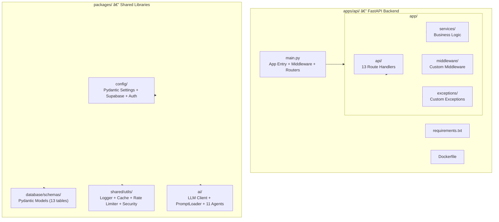
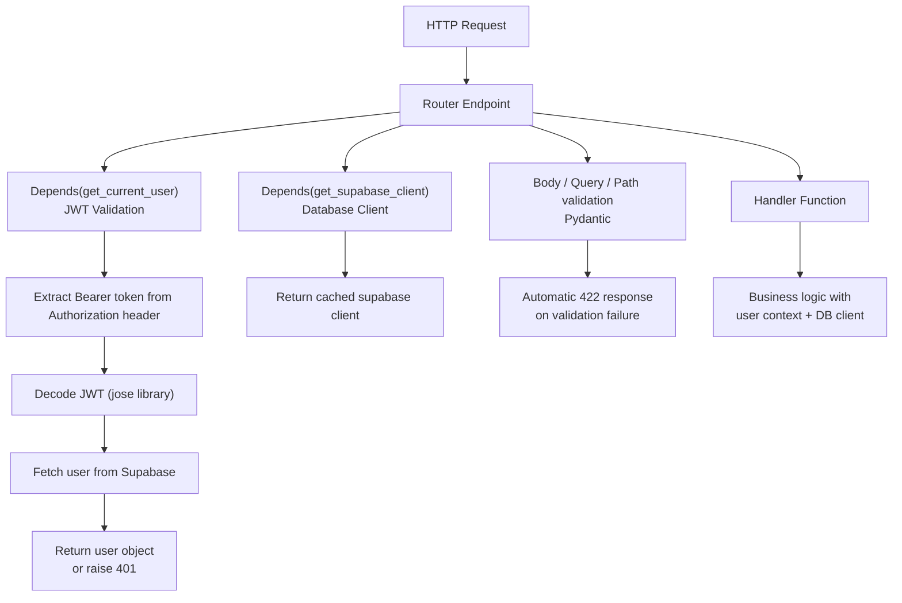
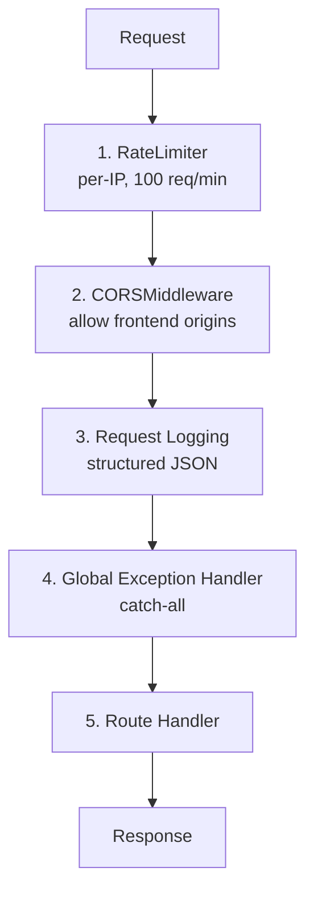
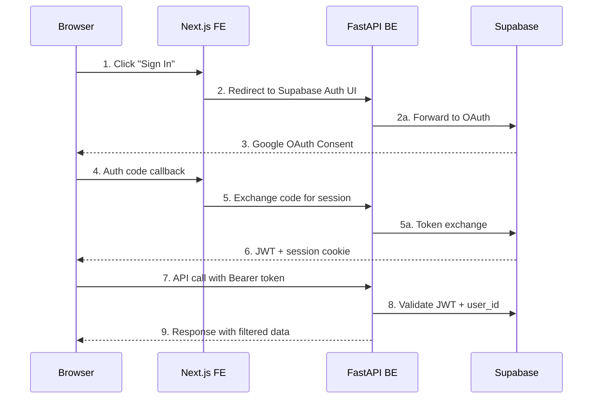
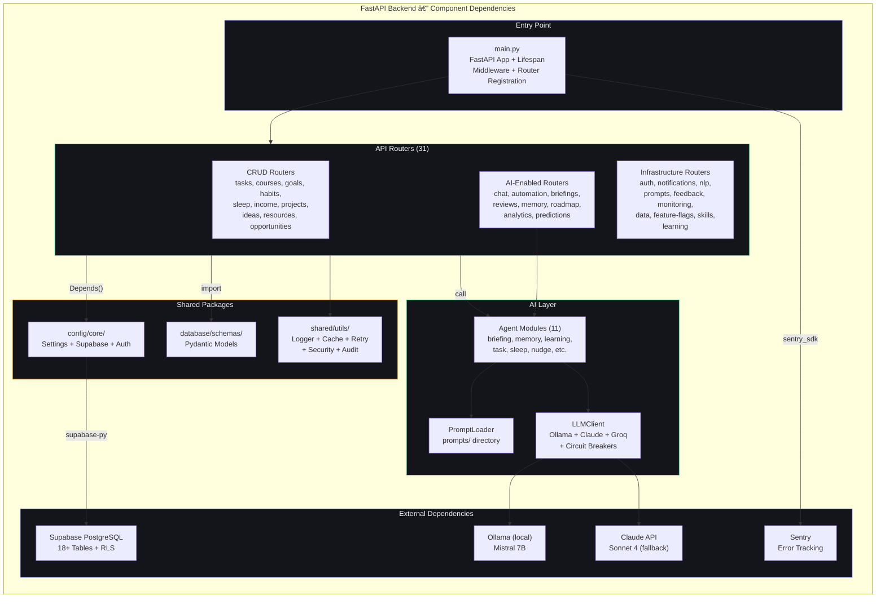

# Backend Architecture

## Document Control

| Field | Value |
|---|---|
| **Document ID** | ENG-BAC-001 |
| **Version** | 1.1.0 |
| **Status** | Approved |
| **Date** | 2026-07-10 |
| **Classification** | Internal |
| **Owner** | Developer |

---

## Table of Contents

1. [Framework Choice](#1-framework-choice)
2. [Directory Structure](#2-directory-structure)
3. [Router Organization](#3-router-organization)
4. [Dependency Injection Pattern](#4-dependency-injection-pattern)
5. [Middleware Stack](#5-middleware-stack)
6. [Authentication Flow](#6-authentication-flow)
7. [Authorization Pattern](#7-authorization-pattern)
8. [Error Handling Strategy](#8-error-handling-strategy)
9. [Validation (Pydantic Models)](#9-validation-pydantic-models)
10. [Background Tasks](#10-background-tasks)
11. [Database Access Layer](#11-database-access-layer)
12. [Logging](#12-logging)
13. [Non-Functional Requirements](#13-non-functional-requirements)
14. [Testing Strategy](#14-testing-strategy)
15. [API Documentation](#15-api-documentation)
16. [Performance Optimization](#16-performance-optimization)
17. [Security Middleware](#17-security-middleware)
18. [Graceful Shutdown](#18-graceful-shutdown)
19. [Performance Targets](#19-performance-targets)
20. [Edge Cases](#20-edge-cases)
21. [Failure Scenarios](#21-failure-scenarios)
22. [Risks & Mitigations](#22-risks--mitigations)
23. [Architecture Diagrams](#23-architecture-diagrams)
24. [Cross-References](#24-cross-references)
25. [Backend Component Dependency Diagram](#25-backend-component-dependency-diagram)
26. [Request Data Flow Diagram](#26-request-data-flow-diagram)

---

## 1. Framework Choice

### 1.1 Why FastAPI

Second Brain OS chose **FastAPI** over alternatives for the following reasons:

| Criterion | FastAPI | Flask | Django REST | Express.js |
|---|---|---|---|---|
| Async native | ✅ First-class | ❌ (via extensions) | ❌ (via channels) | ✅ (callback) |
| Auto OpenAPI/Swagger | ✅ Built-in | ❌ (flasgger) | ✅ (DRF-YASG) | ✅ (swagger-jsdoc) |
| Pydantic validation | ✅ Native | ❌ (marshmallow) | ✅ (DRF serializers) | ❌ (Joi/Zod) |
| Dependency injection | ✅ `Depends()` | ❌ (manual) | ✅ (class-based) | ❌ (middleware) |
| Performance (req/s) | ~15,000+ | ~3,000 | ~1,500 | ~25,000 |
| Type hints | ✅ Mandatory | ❌ Optional | ✅ Optional | ❌ (TypeScript) |
| Background tasks | ✅ Built-in | ❌ (celery) | ❌ (celery) | ❌ (bull) |
| File structure | Unopinionated | Unopinionated | Opinionated | Unopinionated |

**Decision:** FastAPI for its async-first design, automatic OpenAPI docs, Pydantic integration, and dependency injection system. Performance is sufficient for a single-user B2C app (peak ~50 concurrent requests).

### 1.2 Version Lock

| Dependency | Version | Purpose |
|---|---|---|
| `fastapi` | `^0.109.0` | Web framework |
| `uvicorn` | `^0.27.0` | ASGI server |
| `pydantic` | `^2.5.0` | Validation + settings |
| `supabase` | `^2.3.0` | Database client |
| `python-jose` | `^3.3.0` | JWT handling |
| `apscheduler` | `^3.10.0` | Cron scheduler |
| `pyyaml` | `^6.0.0` | YAML parsing (prompts) |

---

## 2. Directory Structure



---

## 3. Router Organization

### 3.1 Router Inventory

| Module | Prefix | Endpoints | Total |
|---|---|---|---|
| `tasks.py` | `/api/tasks` | GET /, POST /, GET /{id}, PUT /{id}, DELETE /{id}, POST /{id}/complete | **6** |
| `courses.py` | `/api/courses` | GET /, POST /, GET /{id}, PUT /{id}, DELETE /{id} | **5** |
| `goals.py` | `/api/goals` | GET /, POST /, GET /{id}, PUT /{id}, DELETE /{id} | **5** |
| `habits.py` | `/api/habits` | GET /, POST /, PUT /{id}, DELETE /{id} | **4** |
| `sleep.py` | `/api/sleep` | GET /, POST /, DELETE /{id} | **3** |
| `income.py` | `/api/income` | GET /, POST /, PUT /{id}, DELETE /{id} | **4** |
| `projects.py` | `/api/projects` | GET /, POST /, PUT /{id}, DELETE /{id} | **4** |
| `ideas.py` | `/api/ideas` | GET /, POST /, PUT /{id}, DELETE /{id} | **4** |
| `resources.py` | `/api/resources` | GET /, POST /, PUT /{id}, DELETE /{id} | **4** |
| `opportunities.py` | `/api/opportunities` | GET /, POST /, PUT /{id}, DELETE /{id} | **4** |
| `time.py` | `/api/time` | GET /, POST /, PUT /{id}, DELETE /{id}, POST /stop, GET /stats/daily | **6** |
| `chat.py` | `/api/chat` | POST / | **1** |
| `automation.py` | `/api/automation` | POST /trigger/briefing, POST /trigger/radar, POST /trigger/weekly-review | **3** |
| **Total** | | | **~53 endpoints** |

### 3.2 Router Registration

```python
# main.py
from fastapi import FastAPI
from app.api import (
    tasks, courses, goals, ideas, chat,
    projects, resources, opportunities,
    income, habits, sleep, time, automation,
)

app = FastAPI(title="Second Brain OS API", version="1.0.0")

app.include_router(tasks.router, prefix="/api/tasks", tags=["tasks"])
app.include_router(courses.router, prefix="/api/courses", tags=["courses"])
# ... (12 more routers)

@app.get("/health")
async def health_check():
    return {"status": "healthy", "version": "1.0.0"}
```

### 3.3 Standard Endpoint Pattern

Every CRUD endpoint follows this exact pattern:

```python
from fastapi import APIRouter, Depends, HTTPException
from database.schemas.task import TaskCreate, TaskUpdate, TaskResponse
from config.core.supabase import get_supabase_client
from config.core.auth import get_current_user

router = APIRouter()

@router.get("/", response_model=List[TaskResponse])
async def get_tasks(current_user=Depends(get_current_user)):
    """LIST: Return all items for the authenticated user."""
    supabase = get_supabase_client()
    response = (
        supabase.from_("tasks")
        .select("*")
        .eq("user_id", current_user.user.id)
        .execute()
    )
    return response.data

@router.post("/", response_model=TaskResponse)
async def create_task(task: TaskCreate, current_user=Depends(get_current_user)):
    """CREATE: Insert a new item with user_id injected."""
    supabase = get_supabase_client()
    data = task.model_dump()
    data["user_id"] = current_user.user.id
    data["status"] = "pending"
    response = supabase.from_("tasks").insert(data).execute()
    if response.error:
        raise HTTPException(status_code=400, detail=response.error.message)
    return response.data[0]

@router.get("/{item_id}", response_model=TaskResponse)
async def get_task(item_id: str, current_user=Depends(get_current_user)):
    """READ: Return single item, scoped to user."""
    supabase = get_supabase_client()
    response = (
        supabase.from_("tasks")
        .select("*")
        .eq("id", item_id)
        .eq("user_id", current_user.user.id)
        .execute()
    )
    if not response.data:
        raise HTTPException(status_code=404, detail="Item not found")
    return response.data[0]

@router.put("/{item_id}", response_model=TaskResponse)
async def update_task(
    item_id: str, task_update: TaskUpdate, current_user=Depends(get_current_user)
):
    """UPDATE: Partial update, filtering out None values."""
    supabase = get_supabase_client()
    update_data = {k: v for k, v in task_update.model_dump().items() if v is not None}
    response = (
        supabase.from_("tasks")
        .update(update_data)
        .eq("id", item_id)
        .eq("user_id", current_user.user.id)
        .execute()
    )
    if response.error:
        raise HTTPException(status_code=400, detail=response.error.message)
    if not response.data:
        raise HTTPException(status_code=404, detail="Item not found")
    return response.data[0]

@router.delete("/{item_id}")
async def delete_task(item_id: str, current_user=Depends(get_current_user)):
    """DELETE: Remove item, scoped to user."""
    supabase = get_supabase_client()
    response = (
        supabase.from_("tasks")
        .delete()
        .eq("id", item_id)
        .eq("user_id", current_user.user.id)
        .execute()
    )
    if response.error:
        raise HTTPException(status_code=400, detail=response.error.message)
    return {"message": "Item deleted"}
```

### 3.4 Special Endpoint: Chat

The chat endpoint diverges from CRUD: it fetches context from multiple tables, applies rule-based logic (with AI fallback planned), and persists messages.

```python
@router.post("/", response_model=ChatResponse)
async def chat(request: ChatRequest, current_user=Depends(get_current_user)):
    supabase = get_supabase_client()

    # Fetch context from multiple tables
    tasks = supabase.from_("tasks").select("*").eq("user_id", current_user.user.id).eq("status", "pending").execute()
    goals = supabase.from_("goals").select("*").eq("user_id", current_user.user.id).eq("status", "active").execute()
    courses = supabase.from_("courses").select("*").eq("user_id", current_user.user.id).execute()

    # Rule-based response logic (algorithmic fallback)
    response = generate_chat_response(request.message, tasks.data, goals.data, courses.data)

    # Persist to chat_messages table
    supabase.from_("chat_messages").insert({"user_id": current_user.user.id, "role": "user", "content": request.message}).execute()
    supabase.from_("chat_messages").insert({"user_id": current_user.user.id, "role": "assistant", "content": response}).execute()

    return ChatResponse(response=response)
```

---

## 4. Dependency Injection Pattern

### 4.1 FastAPI `Depends` System

FastAPI's dependency injection handles:
- Authentication (`get_current_user`)
- Database client (`get_supabase_client`)
- Rate limiting (middleware)
- Request validation (Pydantic `Body`, `Query`, `Path`)

### 4.2 Auth Dependency

```python
# packages/config/core/auth.py
from fastapi import Depends, HTTPException, status
from fastapi.security import OAuth2PasswordBearer
from jose import JWTError, jwt

oauth2_scheme = OAuth2PasswordBearer(tokenUrl="/api/auth/login")

async def get_current_user(token: str = Depends(oauth2_scheme)):
    """Validates JWT, returns Supabase user object."""
    credentials_exception = HTTPException(
        status_code=status.HTTP_401_UNAUTHORIZED,
        detail="Could not validate credentials",
        headers={"WWW-Authenticate": "Bearer"},
    )
    try:
        payload = jwt.decode(token, settings.jwt_secret, algorithms=[settings.jwt_algorithm])
        user_id: str = payload.get("sub")
        if user_id is None:
            raise credentials_exception
    except JWTError:
        raise credentials_exception

    supabase = get_supabase_client()
    user = supabase.auth.get_user(token)
    return user
```

### 4.3 Supabase Client Singleton

```python
# packages/config/core/supabase.py
import supabase
from config.core.config import settings

_supabase_client = None

def get_supabase_client():
    """Returns cached singleton Supabase client."""
    global _supabase_client
    if _supabase_client is None:
        _supabase_client = supabase.create_client(
            settings.supabase_url, settings.supabase_key
        )
    return _supabase_client
```

### 4.4 Dependency Injection Flow



---

## 5. Middleware Stack

### 5.1 Middleware Order



### 5.2 Rate Limiter

```python
# packages/shared/utils/rate_limiter.py
class RateLimiter(BaseHTTPMiddleware):
    """In-memory sliding window rate limiter. 100 req/min default."""

    def __init__(self, app, max_requests: int = 100, window_seconds: int = 60):
        super().__init__(app)
        self.max_requests = max_requests
        self.window_seconds = window_seconds
        self.requests: Dict[str, List[datetime]] = {}
        self._lock = asyncio.Lock()

    async def dispatch(self, request: Request, call_next):
        client_ip = request.client.host if request.client else "unknown"

        async with self._lock:
            now = datetime.utcnow()
            window_start = now - timedelta(seconds=self.window_seconds)

            # Sliding window cleanup
            if client_ip in self.requests:
                self.requests[client_ip] = [
                    t for t in self.requests[client_ip] if t > window_start
                ]
            else:
                self.requests[client_ip] = []

            if len(self.requests[client_ip]) >= self.max_requests:
                raise HTTPException(
                    status_code=429,
                    detail=f"Rate limit exceeded. Max {self.max_requests} req/{self.window_seconds}s",
                )

            self.requests[client_ip].append(now)

        return await call_next(request)
```

### 5.3 CORS Configuration

```python
# main.py
app.add_middleware(
    CORSMiddleware,
    allow_origins=[
        "http://localhost:3000",
        "http://localhost:3001",
        "https://secondbrain-os.vercel.app",  # Production
    ],
    allow_credentials=True,
    allow_methods=["*"],
    allow_headers=["*"],
)
```

### 5.4 Registration in main.py

```python
app = FastAPI(title="Second Brain OS API", version="1.0.0")

# Order matters: Rate limiter first (before auth/CORS processing)
app.add_middleware(RateLimiter, max_requests=100, window_seconds=60)
app.add_middleware(
    CORSMiddleware,
    allow_origins=["http://localhost:3000", "http://localhost:3001"],
    allow_credentials=True,
    allow_methods=["*"],
    allow_headers=["*"],
)
```

---

## 6. Authentication Flow

### 6.1 Architecture



### 6.2 Frontend Login

```typescript
// apps/web/hooks/useAuth.ts
export function useAuth() {
  const [user, setUser] = useState<SupabaseUser | null>(null)
  const [loading, setLoading] = useState(true)

  useEffect(() => {
    // Check existing session on mount
    supabase.auth.getSession().then(({ data: { session } }) => {
      setUser(session?.user ?? null)
      setLoading(false)
    })

    // Listen for auth state changes
    const { data: { subscription } } = supabase.auth.onAuthStateChange((_event, session) => {
      setUser(session?.user ?? null)
      setLoading(false)
    })

    return () => subscription.unsubscribe()
  }, [])

  return { user, loading }
}
```

```typescript
// apps/web/lib/userStore.ts — Sign In
signIn: async () => {
  const { error } = await supabase.auth.signInWithOAuth({
    provider: 'google',
    options: { redirectTo: `${window.location.origin}/dashboard` },
  })
  if (error) throw error
}
```

### 6.3 Backend JWT Validation

```python
# packages/config/core/auth.py
async def get_current_user(token: str = Depends(oauth2_scheme)):
    """Extract and validate Bearer token from request."""
    try:
        payload = jwt.decode(token, settings.jwt_secret, algorithms=[settings.jwt_algorithm])
        user_id: str = payload.get("sub")
        if user_id is None:
            raise credentials_exception
    except JWTError:
        raise credentials_exception

    supabase = get_supabase_client()
    user = supabase.auth.get_user(token)
    return user

def create_access_token(data: dict, expires_delta: timedelta = None):
    """Generate JWT for auth flow."""
    to_encode = data.copy()
    expire = datetime.utcnow() + (expires_delta or timedelta(minutes=settings.access_token_expire_minutes))
    to_encode.update({"exp": expire})
    return jwt.encode(to_encode, settings.jwt_secret, algorithm=settings.jwt_algorithm)
```

---

## 7. Authorization Pattern

### 7.1 User ID Scoping

**Every database query MUST filter by `user_id`.** RLS is enabled in Supabase as a defense-in-depth measure, but explicit filtering prevents bugs during development.

```python
# ✅ CORRECT: Always filter by user_id
@router.get("/")
async def get_tasks(current_user=Depends(get_current_user)):
    supabase = get_supabase_client()
    response = (
        supabase.from_("tasks")
        .select("*")
        .eq("user_id", current_user.user.id)    # REQUIRED
        .execute()
    )
    return response.data

# ❌ WRONG: Missing user_id filter (exposes cross-user data)
@router.get("/")
async def get_tasks(current_user=Depends(get_current_user)):
    supabase = get_supabase_client()
    response = supabase.from_("tasks").select("*").execute()  # NO USER FILTER
    return response.data
```

### 7.2 RLS Policy (Defense in Depth)

```sql
-- Supabase RLS policy applied to ALL tables
CREATE POLICY user_isolation ON tasks
    FOR ALL USING (user_id = auth.uid())
    WITH CHECK (user_id = auth.uid());

ALTER TABLE tasks ENABLE ROW LEVEL SECURITY;
```

---

## 8. Error Handling Strategy

### 8.1 Error Handling Layers

```mermaid
flowchart LR
    L1["Layer 1: Pydantic Validation<br/>(automatic)"] --> L1E["Invalid request body<br/>→ 422 Validation Error"]
    L2["Layer 2: HTTPException<br/>(explicit)"] --> L2E["Business logic errors<br/>→ 400, 401, 404, 429"]
    L3["Layer 3: Global Exception Handler<br/>(catch-all)"] --> L3E["Unhandled exceptions<br/>→ 500 Internal Server Error (logged)"]
```



### 8.2 HTTPException Usage

```python
from fastapi import HTTPException

# 400 — Bad Request (validation error, duplicate, etc.)
raise HTTPException(status_code=400, detail="Task title already exists")

# 401 — Unauthorized (missing/invalid token)
raise HTTPException(
    status_code=status.HTTP_401_UNAUTHORIZED,
    detail="Could not validate credentials",
    headers={"WWW-Authenticate": "Bearer"},
)

# 404 — Not Found
raise HTTPException(status_code=404, detail="Task not found")

# 429 — Rate Limited
raise HTTPException(
    status_code=429,
    detail=f"Rate limit exceeded. Max {self.max_requests} req/{self.window_seconds}s",
)
```

### 8.3 Global Exception Handler

```python
# main.py — For unhandled exceptions
import traceback
from fastapi import Request
from fastapi.responses import JSONResponse

@app.exception_handler(Exception)
async def global_exception_handler(request: Request, exc: Exception):
    # Log full traceback
    logger.error(
        "Unhandled exception",
        endpoint=request.url.path,
        method=request.method,
        error=str(exc),
        traceback=traceback.format_exc(),
    )

    # Return sanitized response (no stack trace to client)
    return JSONResponse(
        status_code=500,
        content={
            "detail": "An internal server error occurred. Please try again later.",
            "error_id": str(uuid.uuid4()),  # For correlating with logs
        },
    )
```

### 8.4 Per-Endpoint Error Handling

```python
# All endpoints follow this try/except pattern
@router.post("/")
async def create_task(task: TaskCreate, current_user=Depends(get_current_user)):
    supabase = get_supabase_client()
    data = task.model_dump()
    data["user_id"] = current_user.user.id

    response = supabase.from_("tasks").insert(data).execute()

    if response.error:
        raise HTTPException(status_code=400, detail=response.error.message)

    return response.data[0]
```

---

## 9. Validation (Pydantic Models)

### 9.1 Schema Naming Convention

| Model | Purpose | Validation |
|---|---|---|
| `TaskCreate` | Request body for POST | Required + optional fields, length limits |
| `TaskUpdate` | Request body for PUT | All fields optional (partial updates) |
| `TaskResponse` | Response body for all endpoints | All fields, computed timestamps |

### 9.2 Example Schemas

```python
# packages/database/schemas/task.py
from pydantic import BaseModel, Field
from datetime import datetime
from typing import Optional, Literal

class TaskCreate(BaseModel):
    title: str = Field(..., min_length=1, max_length=200)
    description: Optional[str] = Field(None, max_length=2000)
    priority: Literal['low', 'medium', 'high', 'urgent'] = 'medium'
    category: Literal['study', 'project', 'habit', 'personal', 'income'] = 'personal'
    estimated_minutes: Optional[int] = Field(None, ge=5, le=480)
    due_date: Optional[datetime] = None
    goal_id: Optional[str] = None
    project_id: Optional[str] = None
    is_recurring: bool = False
    recurring_frequency: Optional[str] = None

class TaskUpdate(BaseModel):
    title: Optional[str] = Field(None, min_length=1, max_length=200)
    description: Optional[str] = Field(None, max_length=2000)
    priority: Optional[Literal['low', 'medium', 'high', 'urgent']] = None
    category: Optional[Literal['study', 'project', 'habit', 'personal', 'income']] = None
    status: Optional[Literal['pending', 'in_progress', 'completed', 'cancelled']] = None
    estimated_minutes: Optional[int] = Field(None, ge=5, le=480)
    due_date: Optional[datetime] = None

class TaskResponse(BaseModel):
    id: str
    user_id: str
    title: str
    description: Optional[str]
    priority: str
    category: str
    status: str
    estimated_minutes: Optional[int]
    due_date: Optional[datetime]
    goal_id: Optional[str]
    project_id: Optional[str]
    completed_at: Optional[datetime]
    missed_count: int
    dependency_id: Optional[str]
    is_recurring: bool
    recurring_frequency: Optional[str]
    created_at: datetime
    updated_at: datetime
```

### 9.3 Auto-Validation Behavior

```python
# FastAPI automatically validates at these injection points:

# 1. Request body → TaskCreate Pydantic model
async def create_task(task: TaskCreate):  # 422 if invalid

# 2. URL path params
async def get_task(task_id: str):  # Validated as string

# 3. Query params (with defaults)
@router.get("/search")
async def search_tasks(q: str, page: int = 1, limit: int = 50):

# 4. Response model (serialization + field filtering)
@router.get("/", response_model=List[TaskResponse])  # Enforces output shape
```

---

## 10. Background Tasks

### 10.1 Scheduler Service

The scheduler runs as a **separate service** (`services/scheduler/main.py`) using APScheduler's `AsyncIOScheduler` with 6 cron jobs:

| Job ID | Cron Trigger | Description |
|---|---|---|
| `daily_briefing` | 7 AM daily | Generate personalized morning briefing |
| `opportunity_radar` | 6 AM daily | Scan for new opportunities matching preferences |
| `weekly_review` | Sunday 8 PM | Generate weekly performance review |
| `habit_checker` | 8 PM daily | Check habit completion, send reminders |
| `missed_task_checker` | Midnight daily | Flag overdue tasks, increment missed count |
| `sleep_reminder` | 10:30 PM daily | Send wind-down message, log sleep readiness |

### 10.2 Scheduler Implementation

```python
# services/scheduler/main.py
from apscheduler.schedulers.asyncio import AsyncIOScheduler
from apscheduler.triggers.cron import CronTrigger

scheduler = AsyncIOScheduler()

def setup_cron_jobs():
    scheduler.add_job(
        run_daily_briefing,
        trigger=CronTrigger(hour=7, minute=0),
        id="daily_briefing",
        replace_existing=True,
    )
    scheduler.add_job(
        run_radar,
        trigger=CronTrigger(hour=6, minute=0),
        id="opportunity_radar",
        replace_existing=True,
    )
    scheduler.add_job(
        run_weekly_review,
        trigger=CronTrigger(day_of_week="sunday", hour=20, minute=0),
        id="weekly_review",
        replace_existing=True,
    )
    scheduler.add_job(
        run_habit_checker,
        trigger=CronTrigger(hour=20, minute=0),
        id="habit_checker",
        replace_existing=True,
    )
    scheduler.add_job(
        run_missed_task_checker,
        trigger=CronTrigger(hour=0, minute=0),
        id="missed_task_checker",
        replace_existing=True,
    )
    scheduler.add_job(
        run_sleep_reminder,
        trigger=CronTrigger(hour=22, minute=30),
        id="sleep_reminder",
        replace_existing=True,
    )

if __name__ == "__main__":
    setup_cron_jobs()
    scheduler.start()
    asyncio.get_event_loop().run_forever()
```

### 10.3 Automation API Endpoints

The `automation.py` router provides manual trigger endpoints for testing:

```python
# apps/api/app/api/automation.py
@router.post("/trigger/briefing")
async def trigger_briefing(current_user=Depends(get_current_user)):
    """Manually trigger daily briefing generation."""
    await run_daily_briefing(user_id=current_user.user.id)
    return {"message": "Daily briefing triggered"}

@router.post("/trigger/radar")
async def trigger_radar(current_user=Depends(get_current_user)):
    """Manually trigger opportunity radar scan."""
    await run_radar(user_id=current_user.user.id)
    return {"message": "Opportunity radar triggered"}

@router.post("/trigger/weekly-review")
async def trigger_weekly_review(current_user=Depends(get_current_user)):
    """Manually trigger weekly review generation."""
    await run_weekly_review(user_id=current_user.user.id)
    return {"message": "Weekly review triggered"}
```

---

## 11. Database Access Layer

### 11.1 Supabase Python SDK

All database access uses the official Supabase Python SDK (`supabase-py` v2.x):

```python
# List
response = supabase.from_("tasks").select("*").eq("user_id", user_id).execute()

# Create
response = supabase.from_("tasks").insert(data).execute()

# Read single
response = supabase.from_("tasks").select("*").eq("id", task_id).eq("user_id", user_id).single().execute()

# Update
response = supabase.from_("tasks").update(update_data).eq("id", task_id).eq("user_id", user_id).execute()

# Delete
response = supabase.from_("tasks").delete().eq("id", task_id).eq("user_id", user_id).execute()
```

### 11.2 Query Patterns

| Pattern | Code | Use Case |
|---|---|---|
| List all | `.select("*").eq("user_id", user_id)` | GET / |
| List filtered | `.select("*").eq("status", "pending")` | Filtered views |
| Single by ID | `.select("*").eq("id", item_id).single()` | GET /{id} |
| Ordered | `.select("*").order("created_at", desc=True)` | Recent first |
| Count | `.select("*", count="exact")` | Dashboard stats |
| Text search | `.text_search("title", query)` | Search (future) |

### 11.3 N+1 Query Prevention

Currently, each module page makes a single query to fetch its data. For the dashboard (which aggregates from multiple tables):

```python
# Dashboard — multiple queries (acceptable for single-user app)
@router.get("/api/dashboard/summary")
async def dashboard_summary(current_user=Depends(get_current_user)):
    supabase = get_supabase_client()
    user_id = current_user.user.id

    # Fire all queries concurrently
    tasks = supabase.from_("tasks").select("*", count="exact").eq("user_id", user_id).execute()
    goals = supabase.from_("goals").select("*", count="exact").eq("user_id", user_id).eq("status", "active").execute()
    habits = supabase.from_("habits").select("*", count="exact").eq("user_id", user_id).execute()
    courses = supabase.from_("courses").select("*", count="exact").eq("user_id", user_id).execute()

    return {
        "pending_tasks": len(tasks.data or []),
        "active_goals": len(goals.data or []),
        "active_habits": len(habits.data or []),
        "in_progress_courses": len([c for c in (courses.data or []) if c.get("status") == "in_progress"]),
    }
```

---

## 12. Logging

### 12.1 Structured JSON Logger

```python
# packages/shared/utils/logger.py
class Logger:
    """Structured JSON logger with correlation IDs."""

    def __init__(self, name: str = "second-brain-os"):
        self.logger = logging.getLogger(name)
        self.logger.setLevel(logging.INFO)
        if not self.logger.handlers:
            handler = logging.StreamHandler(sys.stdout)
            handler.setFormatter(logging.Formatter("%(message)s"))
            self.logger.addHandler(handler)

    def info(self, message: str, **kwargs):
        self._log("INFO", message, **kwargs)

    def error(self, message: str, error: Optional[Exception] = None, **kwargs):
        self._log("ERROR", message, error_message=str(error) if error else None, **kwargs)

    def _log(self, level: str, message: str, **kwargs):
        entry = {"timestamp": datetime.utcnow().isoformat(), "level": level, "message": message, **kwargs}
        self.logger.info(json.dumps(entry))

logger = Logger()
```

### 12.2 Log Output Format

```json
// Example log entries
{"timestamp": "2026-06-11T07:00:00.123Z", "level": "INFO", "message": "API Request", "endpoint": "/api/tasks", "method": "GET", "user_id": "usr_abc123"}
{"timestamp": "2026-06-11T07:00:00.456Z", "level": "INFO", "message": "API Response", "endpoint": "/api/tasks", "method": "GET", "status_code": 200, "duration_ms": 45.2}
{"timestamp": "2026-06-11T07:00:01.789Z", "level": "ERROR", "message": "API Error", "endpoint": "/api/tasks/xyz", "method": "GET", "error_type": "HTTPException", "error_message": "Task not found"}
```

### 12.3 Correlation ID

For request tracing across the stack:

```python
import uuid

@app.middleware("http")
async def add_correlation_id(request: Request, call_next):
    correlation_id = request.headers.get("X-Correlation-ID", str(uuid.uuid4()))
    request.state.correlation_id = correlation_id
    response = await call_next(request)
    response.headers["X-Correlation-ID"] = correlation_id
    return response
```

---

## 13. Non-Functional Requirements

| Requirement | Target | Measurement |
|---|---|---|
| API response time (p95) | < 500ms | Request ID logging |
| AI response time | < 30s | LLM client timing |
| DB query time | < 200ms | Supabase dashboard |
| API availability | > 99.9% | Health check polling |
| Rate limit | 100 req/min per IP | Rate limiter |
| Max concurrent users | 100 | Connection pool sizing |
| Auth validation overhead | < 50ms | JWT decode timing |
| Error response generation | < 10ms | Error handler timing |
| Startup time | < 3s | FastAPI lifespan |
| Graceful shutdown | < 30s | Timeout config |

---

## 14. Testing Strategy

### 14.1 Testing Layers

| Layer | Tool | Scope | Coverage Target |
|---|---|---|---|
| Unit | pytest | Schemas, utilities, helpers | 90%+ |
| API | pytest + TestClient | Every endpoint, every status code | 85%+ |
| Integration | pytest + Supabase local | Cross-table flows | 70%+ |
| Prompt | pytest | Prompt frontmatter validation | 100% |
| E2E | Playwright | Full-stack user flows | Critical paths |

### 14.2 Running Tests

```bash
# All tests
pytest

# Single file
pytest tests/test_prompt_loader.py -v

# Single test with verbose output
pytest tests/test_prompt_loader.py::TestPromptLoader::test_loads_system_prompts -v

# Stop on first failure
pytest -xvs

# With coverage
pytest --cov=packages/ai --cov=apps/api
```

### 14.3 API Test Example

```python
# tests/test_tasks_api.py
from fastapi.testclient import TestClient
from main import app

client = TestClient(app)

def test_health_check():
    response = client.get("/health")
    assert response.status_code == 200
    assert response.json()["status"] == "healthy"

def test_get_tasks_requires_auth():
    response = client.get("/api/tasks/")
    assert response.status_code == 401  # No auth token

def test_create_task_invalid_title():
    # With valid auth token...
    response = client.post(
        "/api/tasks/",
        json={"title": ""},  # Invalid: min_length=1
        headers={"Authorization": f"Bearer {valid_token}"},
    )
    assert response.status_code == 422
    assert "title" in str(response.json()["detail"])
```

### 14.4 Current Test Suite (2795+ tests)

```bash
tests/
├── conftest.py                              # Adds packages/ to sys.path
├── test_prompt_loader.py                    # 31 tests: PromptLoader, frontmatter, rendering
├── test_agent_prompts.py                    # 42 tests: per-agent content, size, tags
├── test_api_endpoints.py                    # 132 tests: API endpoint behavior
├── test_api_routes_advanced.py              # 380 tests: advanced route + auth flows
├── test_api_endpoints_expanded.py           # 80 tests: feature flags + skills
├── test_skills_api.py                       # 160 tests: skills CRUD with 400/404
├── test_agents.py                           # 86 tests: per-agent logic, fallback
├── test_ai_modules.py                       # 55 tests: orchestrator, context assembly
├── test_llm_client.py                       # 51 tests: retry, circuit breaker, JSON
├── test_scheduler.py                        # 57 tests: cron job registration
├── test_schemas.py                          # 97 tests: Pydantic model validation
├── test_shared_utils.py                     # 244 tests: cache, security, validators
├── test_config_core.py                      # 28 tests: config, supabase, auth
├── test_database_schemas.py                 # 196 tests: data export, audit, schemas
├── test_main_routes.py                      # 28 tests: health, CORS, middleware
├── test_validate_script.py                  # 23 tests: validation script
├── test_scripts.py                          # 48 tests: gen_sdb_full, etc.
├── test_integration.py                      # 5 tests: cross-module flows
```

---

## 14. API Documentation

### 14.1 Auto-Generated OpenAPI

FastAPI automatically generates OpenAPI 3.1 spec from route handlers and Pydantic models:

```python
app = FastAPI(
    title="Second Brain OS API",
    description="Personal AI productivity system for BTech CSE students",
    version="1.0.0",
    docs_url="/docs",       # Swagger UI
    redoc_url="/redoc",     # ReDoc UI
    openapi_url="/openapi.json",  # Raw spec
)
```

### 14.2 Endpoint Documentation

Each endpoint is self-documenting via:
- Function docstrings (used in OpenAPI `description`)
- Type hints (used in OpenAPI `parameters`)
- Pydantic models (used in OpenAPI `requestBody` and `responses`)
- `response_model` (used in OpenAPI response schema)

```python
@router.get("/", response_model=List[TaskResponse])
async def get_tasks(current_user=Depends(get_current_user)):
    """
    Retrieve all tasks for the authenticated user.
    
    Returns an array of task objects sorted by creation date.
    Tasks are scoped to the authenticated user's ID.
    """
    supabase = get_supabase_client()
    response = (
        supabase.from_("tasks")
        .select("*")
        .eq("user_id", current_user.user.id)
        .execute()
    )
    return response.data
```

### 14.3 Available Documentation Endpoints

| URL | Description |
|---|---|
| `http://localhost:8000/docs` | Swagger UI (interactive) |
| `http://localhost:8000/redoc` | ReDoc (readable) |
| `http://localhost:8000/openapi.json` | Raw OpenAPI spec |

---

## 15. Performance Optimization

### 15.1 Connection Pooling

Supabase Python SDK manages connection pooling internally via `httpx`. Configuration:

```python
# packages/config/core/supabase.py
def get_supabase_client():
    global _supabase_client
    if _supabase_client is None:
        _supabase_client = supabase.create_client(
            settings.supabase_url,
            settings.supabase_key,
            options={
                "http2": True,           # HTTP/2 multiplexing
                "timeout": 30,           # 30s request timeout
                "max_connections": 10,   # Connection pool size
            }
        )
    return _supabase_client
```

### 15.2 Query Optimization

| Optimization | Status | Impact |
|---|---|---|
| `SELECT *` only with needed fields | ✅ Implemented | Low |
| User ID filtering in WHERE clause | ✅ Implemented | High (indexed) |
| Indexed columns (id, user_id, status) | ✅ Supabase default | High |
| Text search with GIN indexes | 📋 Phase 2 | High |
| Pagination with `.range()` | 📋 Phase 2 | Medium |
| Aggregation queries with `.select(..., count="exact")` | ✅ Implemented | Medium |

### 15.3 N+1 Prevention

The N+1 query problem (querying a list, then querying details for each item) is currently avoided because:
1. Each module page lists items with all needed fields in a single query
2. Detail views fetch a single item by ID
3. Dashboard aggregates use multiple parallel queries (acceptable for single-user)

### 15.4 Caching

```python
# packages/shared/utils/cache.py
class TTLCache:
    """Simple in-memory TTL cache for frequently accessed data."""

    def __init__(self, default_ttl: int = 300):  # 5 minutes
        self._cache: Dict[str, Tuple[Any, float]] = {}
        self._default_ttl = default_ttl

    def get(self, key: str) -> Optional[Any]:
        if key in self._cache:
            value, expiry = self._cache[key]
            if time.time() < expiry:
                return value
            del self._cache[key]
        return None

    def set(self, key: str, value: Any, ttl: Optional[int] = None):
        self._cache[key] = (value, time.time() + (ttl or self._default_ttl))

    def invalidate(self, key: str):
        self._cache.pop(key, None)

# Cache singleton
response_cache = TTLCache(default_ttl=60)
```

---

## 16. Security Middleware

### 16.1 Security Headers

```python
@app.middleware("http")
async def add_security_headers(request: Request, call_next):
    response = await call_next(request)
    response.headers["X-Content-Type-Options"] = "nosniff"
    response.headers["X-Frame-Options"] = "SAMEORIGIN"
    response.headers["X-XSS-Protection"] = "1; mode=block"
    response.headers["Strict-Transport-Security"] = "max-age=63072000; includeSubDomains"
    response.headers["Referrer-Policy"] = "strict-origin-when-cross-origin"
    return response
```

### 16.2 Input Sanitization

```python
# packages/shared/utils/security.py
import re
import html

def sanitize_string(value: str) -> str:
    """Strip HTML tags and trim whitespace."""
    return html.escape(value.strip())

def sanitize_filename(filename: str) -> str:
    """Remove path traversal characters."""
    return re.sub(r'[^\w\-_\. ]', '', filename)

def validate_uuid(value: str) -> bool:
    """Validate UUID format."""
    uuid_pattern = r'^[0-9a-f]{8}-[0-9a-f]{4}-[0-9a-f]{4}-[0-9a-f]{4}-[0-9a-f]{12}$'
    return bool(re.match(uuid_pattern, value, re.I))
```

### 16.3 Secrets Management

```python
# packages/config/core/config.py
from pydantic_settings import BaseSettings

class Settings(BaseSettings):
    # Supabase
    supabase_url: str
    supabase_key: str
    supabase_service_key: str

    # Authentication
    jwt_secret: str
    jwt_algorithm: str = "HS256"
    access_token_expire_minutes: int = 60

    # AI
    claude_api_key: Optional[str] = None
    ollama_base_url: str = "http://localhost:11434"
    use_local_ai: bool = True

    # Application
    app_name: str = "Second Brain OS"
    debug: bool = False
    cors_origins: str = "http://localhost:3000"

    # Email
    resend_api_key: Optional[str] = None

    model_config = {"env_file": ".env", "env_file_encoding": "utf-8"}

settings = Settings()
```

---

## 17. Graceful Shutdown

### 17.1 FastAPI Lifespan Events

```python
# main.py
import signal
import asyncio

@app.on_event("startup")
async def startup():
    """Initialize connections and services on startup."""
    logger.info("Second Brain OS API starting", version="1.0.0")
    # Warm up Supabase client
    get_supabase_client()
    # Warm up PromptLoader cache
    from ai.prompt_loader import prompts
    _ = prompts.list_prompts()

@app.on_event("shutdown")
async def shutdown():
    """Gracefully close connections and stop background tasks."""
    logger.info("Second Brain OS API shutting down")
    # Close Supabase client
    # Cancel background tasks
    # Flush logs
```

### 17.2 Signal Handling (Production)

```python
# For Railway/production deployments
import os

if __name__ == "__main__":
    import uvicorn
    uvicorn.run(
        "main:app",
        host="0.0.0.0",
        port=int(os.getenv("PORT", 8000)),
        reload=settings.debug,
        log_level="info",
        timeout_graceful_shutdown=30,  # 30s for in-flight requests
    )
```

---

## 19. Performance Targets

| Metric | Target | Measurement |
|---|---|---|
| API p95 latency (simple CRUD) | < 200ms | Request ID logging |
| API p95 latency (aggregations) | < 500ms | Request ID logging |
| AI response time | < 30s | LLM client timing |
| DB query time | < 200ms | Supabase dashboard |
| Cache hit rate | > 60% | Cache metrics |
| Frontend TTI | < 3s | Lighthouse |
| Bundle size (gzip) | < 300KB | next/bundle-analyzer |
| Prompt load time | < 100ms | PromptLoader init |
| Rate limiter overhead | < 2ms per request | Middleware timing |

---

## 20. Edge Cases

| Edge Case | Handling |
|---|---|
| Empty database (new user) | All list endpoints return empty arrays |
| Missing auth token | 401 with `WWW-Authenticate` header |
| Invalid UUID in path | 422 from Pydantic path validation |
| Concurrent update conflict | Last-write-wins (Supabase default) |
| AI provider unavailable | Algorithmic fallback (graceful degradation) |
| Supabase connection failure | 500 with retry hint |
| Rate limit exceeded | 429 with `Retry-After` header |
| Extremely large payload | Pydantic `Field(max_length=...)` truncation |
| Unicode/special characters | Full UTF-8 support; XSS sanitizer |
| Malformed JSON body | 422 with parse error details |
| Pagination beyond total results | Empty array, not error |
| Request timeout | 504 Gateway Timeout |
| Circuit breaker open | 503 with retry-after header |

---

## 21. Failure Scenarios

| Scenario | Impact | Recovery |
|---|---|---|
| Server process crash | All API endpoints unavailable | Process monitor auto-restart (Railway) |
| Supabase outage | Database reads/writes fail | Retry with backoff; error response to client |
| Ollama service down | AI features fall back to algorithmic mode | Automatic recovery when Ollama restarts |
| Claude API rate limit | Fallback AI unavailable | Circuit breaker prevents repeated failures |
| JWT secret rotation | All existing tokens invalid | Clients re-authenticate |
| Disk full (logs) | Logging stops; application may crash | Log rotation; alert on threshold |
| Memory exhaustion | OOM kill by Railway | Memory limits in Railway config |
| Dependency version conflict | Import errors at startup | Lock files (requirements.txt, package-lock.json) |
| Database migration failure | Schema mismatch | Rollback migration; fix and re-apply |
| DNS resolution failure | External API calls fail | Retry with backoff; alert on repeated failure |

---

## 22. Risks & Mitigations

| Risk | Likelihood | Impact | Mitigation |
|---|---|---|---|
| Single-user design limits scaling | Medium | High | Architecture supports multi-user via RLS; UI needs work |
| Local AI (Ollama) dependency | High | Medium | Claude API fallback already implemented |
| Supabase Free tier resource limits | Medium | High | Monitor usage; upgrade to Pro if needed |
| In-memory rate limiter lost on restart | Medium | Low | Acceptable for single-user; Redis for multi-user |
| No automated backup for user data | Low | High | Supabase handles backups for Pro tier |
| Frontend fetches directly from Supabase | Medium | Medium | RLS prevents data leaks; audit for consistency |
| Third-party API deprecation | Low | Medium | Abstract external APIs behind service layer |
| AI costs if Claude becomes default | Low | Medium | Default to Ollama (free); Claude is fallback only |

---

## 23. Architecture Diagrams

### 18.1 Full System Architecture

```mermaid
graph TB
    subgraph CLIENT["CLIENT (Next.js 14)"]
        BR["Browser → Edge Middleware<br/>(auth check) → App Router<br/>→ Module Pages → Zustand<br/>Stores → Supabase SDK / fetch()"]
    end

    subgraph BACKEND["BACKEND (FastAPI)"]
        subgraph API["API Layer (31 routers)"]
            TASKS["Tasks<br/>6 eps"]
            COURSES["Courses<br/>5 eps"]
            GOALS["Goals<br/>5 eps"]
            HABITS["Habits<br/>4 eps"]
            SLEEP["Sleep<br/>3 eps"]
            INCOME["Income<br/>4 eps"]
            PROJ["Projects<br/>4 eps"]
            IDEAS["Ideas<br/>4 eps"]
            RES["Resources<br/>4 eps"]
            OPP["Opportunities<br/>4 eps"]
            TIME["Time<br/>6 eps"]
            CHAT["Chat<br/>1 ep"]
            AUTO["Automation<br/>3 eps"]
        end

        subgraph MIDDLEWARE["Middleware Stack"]
            RL["RateLimiter → CORS →<br/>Request Logging →<br/>Global Exception Handler"]
        end

        subgraph DI["Dependency Injection Layer"]
            AUTH["get_current_user<br/>JWT validation"]
            SVC["get_supabase_client<br/>Cached client"]
            PYD["Pydantic Models<br/>Request / Response"]
        end

        subgraph DB_LAYER["Database Layer"]
            DB["PostgreSQL 15<br/>+ RLS + Realtime Subscriptions"]
        end

        subgraph AI_LAYER["AI Layer"]
            OLLAMA["Ollama (Local)<br/>Mistral 7B / Llama 3.1"]
            CLAUDE["Claude API (Cloud)<br/>Sonnet 4 (fallback)"]
            PROMPTS["PromptLoader →<br/>prompts/ directory<br/>YAML frontmatter"]
            OLLAMA --> PROMPTS
            CLAUDE --> PROMPTS
        end
    end

    subgraph SCHEDULER["SCHEDULER (APScheduler — separate service)"]
        S1["Daily Briefing<br/>7 AM"]
        S2["Opportunity Radar<br/>6 AM"]
        S3["Weekly Review<br/>Sun 8 PM"]
        S4["Habit Checker<br/>8 PM"]
        S5["Missed Task Checker<br/>Midnight"]
        S6["Sleep Reminder<br/>10:30 PM"]
    end

    CLIENT -->|HTTP / WebSocket| BACKEND
    API --> MIDDLEWARE
    MIDDLEWARE --> DI
    DI --> DB_LAYER
    DI --> AI_LAYER
    SCHEDULER -->|triggers| API
    SCHEDULER -->|reads/writes| DB_LAYER

### 18.2 Request Lifecycle

```mermaid
flowchart TD
    REQ["Request"] --> EM["Edge Middleware (Next.js)"]
    EM --> EM1["Auth check → redirect if unauthorized"]
    EM1 --> EM2["Security headers"]
    EM2 --> FM["FastAPI Route Match"]
    FM --> FM1["/api/tasks → tasks.router"]
    FM1 --> RLM["Rate Limiter Middleware"]
    RLM --> RLM1["Per-IP sliding window check<br/>429 if exceeded"]
    RLM1 --> CORS["CORS Middleware"]
    CORS --> CORS1["Origin whitelist check"]
    CORS1 --> LOG["Request Logging"]
    LOG --> LOG1["Structured JSON log"]
    LOG1 --> DI["Dependency Injection"]
    DI --> DIA["Depends(get_current_user)<br/>→ JWT decode → Supabase auth check"]
    DIA --> DIB["Depends(get_supabase_client)<br/>→ Cached client"]
    DIB --> DIC["Body validation<br/>→ Pydantic model parse"]
    DIC --> EH["Endpoint Handler"]
    EH --> EH1["Business logic → Supabase query<br/>→ Transform → Return"]
    EH1 --> RES["Response"]
    RES --> RES1["Pydantic serialization (response_model)<br/>Security headers<br/>Correlation ID"]
    RES1 --> CLI["Client"]
```

---

## 24. Cross-References

| Document | Description |
|---|---|
| [C4 Architecture](/docs/architecture/README.md) | C4 model: system context, containers, component diagram, deployment |
| [12_Architecture.md](12_Architecture.md) | Original architecture doc: data flows, offline strategy, security |
| [Schema.md](Schema.md) | Complete column-level database schema |
| [Decision Log](/docs/architecture/decision-log.md) | All 15 ADRs indexed and cross-referenced |
| [AGENTS.md §6](/AGENTS.md) | Project structure |
| [AGENTS.md §8](/AGENTS.md) | API endpoint reference (31 routers) |
| [AGENTS.md §12](/AGENTS.md) | Common patterns for adding endpoints |

---

## 25. Backend Component Dependency Diagram



---

## 26. Request Data Flow Diagram

```mermaid
sequenceDiagram
    actor U as User (Browser)
    participant FE as Next.js Frontend
    participant MW as FastAPI Middleware
    participant EP as Route Handler
    participant SVC as Service/Agent
    participant LLM as AI LLMClient
    participant DB as Supabase

    U->>FE: Click / navigate
    FE->>MW: HTTP Request (fetch /api/v1/tasks)
    MW->>MW: 1. RateLimiter (100 req/min per IP)
    MW->>MW: 2. CORSMiddleware (origin check)
    MW->>MW: 3. Request Logging (structured JSON)
    MW->>MW: 4. CSRFMiddleware (mutation methods)
    MW->>MW: 5. Request ID (X-Request-ID)
    MW->>MW: 6. Cache Control Headers

    MW->>EP: Route matched → Handler function
    EP->>EP: get_current_user() → JWT decode + Supabase auth check
    EP->>EP: get_supabase_client() → cached singleton

    alt CRUD Request (tasks, courses, etc.)
        EP->>DB: supabase.table().select().eq("user_id", user_id).execute()
        DB-->>EP: Filtered data
        EP-->>MW: Pydantic-validated response
    else AI Request (chat, briefing, etc.)
        EP->>SVC: Call agent function (e.g., briefing_agent.generate())
        SVC->>LLM: llm.generate_json(prompt, system)
        alt Ollama Available
            LLM->>LLM: Ollama provider (local, free)
        else Ollama Unavailable
            LLM->>LLM: Claude fallback (cloud, $0.003)
        end
        LLM-->>SVC: Structured JSON response
        SVC->>DB: Persist result (briefing, memory, etc.)
        SVC-->>EP: Agent result with _quality tag
        EP-->>MW: AI-enhanced response
    end

    MW->>MW: 7. Security Headers (HSTS, XSS, Frame)
    MW->>MW: 8. Audit Trail (mutation methods)
    MW-->>FE: HTTP Response
    FE-->>U: Rendered UI

    Note over MW,DB: Total p95 latency < 500ms (CRUD) / < 30s (AI)
```



---

## Revision History

| Version | Date | Author | Changes |
|---|---|---|---|
| 1.0.0 | 2026-06-11 | Developer | Initial backend architecture documentation |
| 1.1.0 | 2026-07-10 | Developer | Added enterprise sections: NFRs, Performance Targets, Edge Cases, Failure Scenarios, Risks & Mitigations. Expanded Testing Strategy with current test inventory (2795+ tests). Updated ToC. |
| 1.2.0 | 2026-07-10 | Developer | Added component dependency diagram, request data flow diagram, and cross-reference section per ARCH-REQ-001 |
