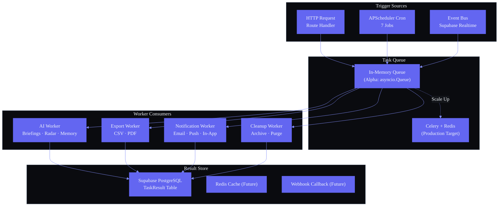

# Background Workers

---

## Document Control

| Field | Detail |
|---|---|
| **Document ID** | ENG-BGW-001 |
| **Version** | 1.0 |
| **Status** | Draft |
| **Author** | AI Agent System |
| **Date** | 2024-01-01 |
| **Last Reviewed** | 2025-12-15 |
| **Review Cycle** | Quarterly |
| **Approved By** | — |

---

### Architecture Diagram — Worker Queue Architecture



---

## 1. Executive Summary

Second Brain OS currently lacks a dedicated background worker infrastructure. All background processing runs either in the FastAPI request-response lifecycle (blocking the client until completion) or inside APScheduler cron job handlers in `services/scheduler/main.py`. As the platform grows — with AI briefing generation, opportunity radar scanning, data exports, and model inference — synchronous processing creates latency bottlenecks and poor user experience.

This document defines the background worker architecture, task types, queue design, concurrency model, and monitoring strategy. It presents an incremental approach: an in-memory queue using `asyncio` for the alpha phase, with a clear migration path to **Celery + Redis** for production-scale distributed processing.

---

## 2. Current State

### 2.1 Processing Model Today

```
HTTP Request ──▶ FastAPI Route ──▶ Synchronous Handler ──▶ Response (after work completes)
                                      │
                                      ├── AI inference (2-10s)
                                      ├── LLM call (5-30s)
                                      ├── DB write
                                      └── Notification send
```

### 2.2 What Runs Synchronously (problematic)

| Operation | Avg Duration | User Experience |
|---|---|---|
| AI briefing generation | ~45s | Route timeout risk |
| Opportunity radar scan | ~120s | Infeasible inline |
| Data export (CSV/PDF) | ~10-60s | User waits |
| Email sending | ~2-5s | Small delay |
| Model inference (summary) | ~5-15s | Noticeable lag |
| Data cleanup / archive | ~30s | Doesn't need user wait |

### 2.3 What Already Runs Outside Request Cycle

| Work | Mechanism | Location |
|---|---|---|
| Morning briefing (7AM) | APScheduler cron | `services/scheduler/handlers/briefing.py` |
| Radar scan (6AM) | APScheduler cron | `services/scheduler/handlers/radar.py` |
| Habits check (8PM) | APScheduler cron | `services/scheduler/handlers/habits.py` |
| Missed tasks (midnight) | APScheduler cron | `services/scheduler/handlers/tasks.py` |
| Sleep prompt (10:30PM) | APScheduler cron | `services/scheduler/handlers/sleep.py` |
| Weekly review (Sun 8PM) | APScheduler cron | `services/scheduler/handlers/weekly.py` |

### 2.4 Gaps

| Gap | Impact |
|---|---|
| No queue — tasks run immediately | Heavy operations block the event loop |
| No task persistence across restarts | In-flight work lost on crash |
| No priority system | All tasks equal — AI generation competes with log writes |
| No task retry with backoff | Failures require manual re-trigger |
| No execution history | Cannot audit task completion or performance |
| No worker health monitoring | Silent failures until user reports issue |

---

## 3. Worker Use Cases

### 3.1 Use Case Inventory

| ID | Use Case | Current Handling | Target Worker Type | Priority |
|---|---|---|---|---|
| UC-01 | AI Briefing Generation | AP Scheduler cron | Scheduled | High |
| UC-02 | Opportunity Radar Scan | AP Scheduler cron | Scheduled | High |
| UC-03 | Weekly Review Generation | AP Scheduler cron | Scheduled | Medium |
| UC-04 | Habits Check Notification | AP Scheduler cron | Scheduled | Medium |
| UC-05 | Sleep Log Prompt | AP Scheduler cron | Scheduled | Low |
| UC-06 | Missed Task Reconciliation | AP Scheduler cron | Scheduled | Medium |
| UC-07 | Data Export (CSV/PDF) | Synchronous HTTP | Event-driven | Medium |
| UC-08 | Email Notification | Synchronous HTTP | Event-driven | Low |
| UC-09 | AI Task Summary | Synchronous HTTP | Event-driven | High |
| UC-10 | Idea Auto-Tagging | Synchronous HTTP | Event-driven | Low |
| UC-11 | Data Cleanup / Archival | None | Scheduled | Low |
| UC-12 | Model Fine-tuning Data Prep | None | Scheduled | Low |

### 3.2 Use Case Detail: UC-07 (Data Export)

```python
# Current synchronous — user waits
@app.post("/api/export/csv")
async def export_csv(project_id: str, current_user: User = Depends(get_current_user)):
    data = await fetch_project_data(project_id)       # 2s
    csv = await convert_to_csv(data)                   # 3s
    url = await upload_to_storage(csv, current_user)   # 5s
    return {"url": url}                                # User blocked ~10s

# Target event-driven
@app.post("/api/export/csv")
async def export_csv(project_id: str, background_tasks: BackgroundTasks):
    task = Task(
        task_id=uuid4(),
        task_type="data_export",
        payload={"project_id": project_id, "format": "csv"},
        status="queued",
    )
    await queue.enqueue(task)
    return {"task_id": task.task_id, "status": "queued"}
    # User gets immediate response, polls for completion
```

---

## 4. Worker Types

### 4.1 Scheduled Workers

Executed on a time-based trigger. Defined in the [Cron Jobs](CronJobs.md) document. These are the primary mechanism for proactive automation.

| Worker | Schedule | Handler |
|---|---|---|
| Briefing Worker | Daily 7:00 AM | `generate_briefing` |
| Radar Worker | Daily 6:00 AM | `scan_opportunity_radar` |
| Habits Worker | Daily 8:00 PM | `check_habits_completion` |
| Missed Tasks Worker | Daily midnight | `review_missed_tasks` |
| Sleep Worker | Daily 10:30 PM | `prompt_sleep_log` |
| Weekly Review Worker | Sunday 8:00 PM | `generate_weekly_review` |

### 4.2 Event-Driven Workers

Triggered by an application event (HTTP request, database change, webhook, or user action).

| Worker | Trigger | Max Latency |
|---|---|---|
| Export Worker | User clicks "Export" | < 500ms to enqueue |
| Email Worker | System sends notification | < 1s to enqueue |
| AI Summary Worker | Task created/updated | < 200ms to enqueue |
| Auto-Tag Worker | Idea submitted | < 200ms to enqueue |

### 4.3 Queue-Based Workers

Events pushed to a queue, processed asynchronously by a pool of workers.

```
┌──────────┐   ┌──────────┐   ┌──────────┐
│  HTTP    │──▶│  Queue   │──▶│ Worker   │──▶  Supabase
│  Request │   │ (Redis)  │   │ Pool     │──▶  AI Client
└──────────┘   └──────────┘   └──────────┘──▶  Email API
```

---

## 5. Queue Architecture

### 5.1 Alpha Phase: In-Memory Queue (asyncio)

```
┌─────────────────────────────────────────────┐
│               FastAPI Process                │
│                                              │
│  ┌─────────┐    ┌──────────────────────┐    │
│  │         │    │  asyncio.Queue        │    │
│  │  Route  │───▶│  (in-memory)         │    │
│  │         │    │                      │    │
│  └─────────┘    │  [task1,task2,...]   │    │
│                 └──────────┬───────────┘    │
│                            │                 │
│                 ┌──────────▼───────────┐    │
│                 │  Worker Coroutine    │    │
│                 │  (asyncio.Task)      │    │
│                 └──────────────────────┘    │
└─────────────────────────────────────────────┘
```

**Queue implementation:**

```python
import asyncio
from dataclasses import dataclass, field
from enum import Enum
from uuid import uuid4
from datetime import datetime

class TaskStatus(Enum):
    QUEUED = "queued"
    RUNNING = "running"
    COMPLETED = "completed"
    FAILED = "failed"

class TaskPriority(Enum):
    HIGH = 1
    MEDIUM = 2
    LOW = 3

@dataclass(order=True)
class Task:
    priority: TaskPriority
    task_id: str = field(default_factory=lambda: str(uuid4()), compare=False)
    task_type: str = field(compare=False)
    payload: dict = field(default_factory=dict, compare=False)
    status: TaskStatus = TaskStatus.QUEUED
    created_at: datetime = field(default_factory=datetime.utcnow, compare=False)
    scheduled_at: datetime | None = None
    max_retries: int = 3
    retry_count: int = 0


class InMemoryQueue:
    def __init__(self):
        self._queue: asyncio.PriorityQueue[Task] = asyncio.PriorityQueue()

    async def enqueue(self, task: Task):
        await self._queue.put(task)

    async def dequeue(self) -> Task:
        return await self._queue.get()

    def qsize(self) -> int:
        return self._queue.qsize()
```

### 5.2 Production Phase: Celery + Redis

```
┌─────────────────┐
│  FastAPI Routes  │
│  (Producer)      │
└────────┬────────┘
         │
         ▼
┌─────────────────┐
│  Redis Broker    │
│  (message queue) │
└────────┬────────┘
         │
    ┌────┴────┬────┬────┐
    ▼         ▼    ▼    ▼
┌──────┐ ┌──────┐ ┌──────┐ ┌──────┐
│ Celery│ │Worker│ │Worker│ │Worker│
│ Beat  │ │  1   │ │  2   │ │  3   │
└──────┘ └──┬───┘ └──┬───┘ └──┬───┘
            │         │        │
            └────┬────┘────────┘
                 ▼
        ┌─────────────────┐
        │  Redis Result    │
        │  Backend         │
        └─────────────────┘
```

### 5.3 Queue Comparison

| Feature | In-Memory Queue (Alpha) | Celery + Redis (Production) |
|---|---|---|
| **Persistence** | None — lost on restart | Redis persistence |
| **Scalability** | Single process | Horizontal — n workers |
| **Priority** | `asyncio.PriorityQueue` | Multiple queues by priority |
| **Retry** | Manual | Built-in with backoff |
| **Result Store** | In-memory dict | Redis / PostgreSQL |
| **Task Routing** | None | Queue-based routing |
| **Monitoring** | Logs only | Flower + Prometheus |
| **Latency** | < 1ms | < 5ms |
| **Setup Complexity** | Zero | Redis required |

---

## 6. Worker Process Model

### 6.1 FastAPI Lifespan → Background Task → Worker Pool

```python
# apps/api/app/lifespan.py

import asyncio
from contextlib import asynccontextmanager
from fastapi import FastAPI
from .worker_pool import WorkerPool

worker_pool: WorkerPool | None = None

@asynccontextmanager
async def lifespan(app: FastAPI):
    # Startup
    global worker_pool
    worker_pool = WorkerPool(max_workers=3)
    asyncio.create_task(worker_pool.run())
    logger.info("Worker pool started with 3 workers")

    yield

    # Shutdown
    logger.info("Shutting down worker pool...")
    await worker_pool.graceful_shutdown(timeout=30)
    logger.info("Worker pool shutdown complete")
```

### 6.2 Worker Pool Implementation

```python
class WorkerPool:
    def __init__(self, max_workers: int = 3):
        self.max_workers = max_workers
        self.queue = InMemoryQueue()
        self._workers: list[asyncio.Task] = []
        self._running = False

    async def run(self):
        self._running = True
        self._workers = [
            asyncio.create_task(self._worker_loop(i))
            for i in range(self.max_workers)
        ]
        await asyncio.gather(*self._workers)

    async def _worker_loop(self, worker_id: int):
        logger.info(f"Worker {worker_id} started")
        while self._running:
            try:
                task = await asyncio.wait_for(
                    self.queue.dequeue(), timeout=1.0
                )
                await self._execute_task(worker_id, task)
            except asyncio.TimeoutError:
                continue
            except Exception as e:
                logger.error(f"Worker {worker_id} crashed: {e}")
                # Worker restarts via next loop iteration

    async def graceful_shutdown(self, timeout: int = 30):
        self._running = False
        # Wait for in-flight tasks to complete
        done, pending = await asyncio.wait(
            self._workers, timeout=timeout
        )
        for task in pending:
            task.cancel()
```

### 6.3 Task Execution Flow

```python
class WorkerPool:
    TASK_HANDLERS: dict[str, Callable] = {
        "data_export": handle_data_export,
        "send_email": handle_send_email,
        "ai_summary": handle_ai_summary,
        "auto_tag": handle_auto_tag,
    }

    async def _execute_task(self, worker_id: int, task: Task):
        task.status = TaskStatus.RUNNING
        logger.info(f"[W{worker_id}] Running {task.task_type} ({task.task_id})")

        start = datetime.utcnow()
        try:
            handler = self.TASK_HANDLERS[task.task_type]
            result = await handler(task.payload)
            task.status = TaskStatus.COMPLETED
            duration = (datetime.utcnow() - start).total_seconds()
            logger.info(f"[W{worker_id}] Completed {task.task_id} in {duration}s")
            await self._store_result(task, result)
        except Exception as e:
            logger.error(f"[W{worker_id}] Failed {task.task_id}: {e}")
            if task.retry_count < task.max_retries:
                task.retry_count += 1
                task.status = TaskStatus.QUEUED
                await self.queue.enqueue(task)
                logger.info(f"[W{worker_id}] Re-queued {task.task_id} (attempt {task.retry_count})")
            else:
                task.status = TaskStatus.FAILED
                await self._store_failure(task, str(e))
```

---

## 7. Task Definition

### 7.1 Task Schema (Python Dataclass)

```python
@dataclass
class BackgroundTask:
    task_id: str                                      # UUID
    task_type: str                                    # "data_export", "send_email", etc.
    payload: dict                                     # Arbitrary JSON-serializable data
    priority: TaskPriority                            # HIGH, MEDIUM, LOW
    status: TaskStatus                                # queued, running, completed, failed
    created_at: datetime                              # Submission time
    scheduled_at: datetime | None                     # Delayed execution
    started_at: datetime | None = None                # Worker pick-up time
    completed_at: datetime | None = None              # Completion/failure time
    max_retries: int = 3                              # Max retry attempts
    retry_count: int = 0                              # Current retry attempt
    result: dict | None = None                        # Success payload
    error: str | None = None                          # Failure reason
    worker_id: str | None = None                      # Executing worker
```

### 7.2 Task Types Enumeration

| `task_type` | Description | Expected Duration | Max Retries | Priority |
|---|---|---|---|---|
| `generate_briefing` | AI daily briefing | ~45s | 2 | HIGH |
| `radar_scan` | Opportunity radar | ~120s | 2 | HIGH |
| `data_export` | CSV/PDF export | ~60s | 3 | MEDIUM |
| `send_email` | Email notification | ~5s | 3 | LOW |
| `ai_summary` | AI task/idea summary | ~10s | 2 | HIGH |
| `auto_tag` | Auto-categorization | ~5s | 1 | LOW |
| `data_cleanup` | Archive old records | ~30s | 2 | LOW |
| `weekly_review` | Weekly AI review | ~180s | 2 | MEDIUM |

### 7.3 Task Schema (Supabase Table — Future)

```sql
CREATE TABLE background_tasks (
    id            UUID PRIMARY KEY DEFAULT gen_random_uuid(),
    task_type     TEXT NOT NULL,
    payload       JSONB NOT NULL DEFAULT '{}',
    priority      INTEGER NOT NULL DEFAULT 2,  -- 1=HIGH, 2=MEDIUM, 3=LOW
    status        TEXT NOT NULL DEFAULT 'queued',
    created_at    TIMESTAMPTZ NOT NULL DEFAULT NOW(),
    scheduled_at  TIMESTAMPTZ,
    started_at    TIMESTAMPTZ,
    completed_at  TIMESTAMPTZ,
    max_retries   INTEGER NOT NULL DEFAULT 3,
    retry_count   INTEGER NOT NULL DEFAULT 0,
    result        JSONB,
    error         TEXT,
    worker_id     TEXT,
    user_id       UUID REFERENCES users(id)
);

CREATE INDEX idx_background_tasks_status ON background_tasks(status);
CREATE INDEX idx_background_tasks_priority ON background_tasks(priority, created_at);
```

---

## 8. Task Orchestration

### 8.1 Full Flow

```
  ┌──────────┐
  │ SUBMIT   │  Route handler creates Task, calls queue.enqueue(task)
  └────┬─────┘
       │
       ▼
  ┌──────────┐
  │ QUEUED   │  Task in priority queue, awaiting worker
  └────┬─────┘
       │ (worker available)
       ▼
  ┌──────────┐
  │ PICK UP  │  Worker dequeues task, sets started_at
  └────┬─────┘
       │
       ▼
  ┌──────────┐     ┌──────────────────────┐
  │ EXECUTE  │────▶│ Handler function     │
  │          │     │ with timeout + retry  │
  └────┬─────┘     └──────────────────────┘
       │
       ├──────────────────┐
       ▼                  ▼
  ┌──────────┐      ┌──────────┐
  │COMPLETED │      │  FAILED  │
  │          │      │          │
  │ - result │      │ - retry? │
  │ - persist│      │ - DLQ    │
  │ - notify │      │ - error  │
  └──────────┘      └──────────┘
       │                  │
       ▼                  ▼
  ┌──────────┐      ┌──────────┐
  │ CALLBACK │      │ ALERT    │
  │ (if any) │      │ (if DLQ) │
  └──────────┘      └──────────┘
```

### 8.2 Result Notification

Tasks that produce a user-facing result (e.g., data export URL) notify the caller via:

1. **Polling** — Client stores `task_id`, polls `GET /api/tasks/{task_id}` until status is `completed` or `failed`
2. **WebSocket** — Future: push notification when task completes
3. **Push Notification** — For long-running tasks, notify via mobile/desktop push

### 8.3 Polling Endpoint

```python
@app.get("/api/tasks/{task_id}")
async def get_task_status(task_id: str):
    task = await task_store.get(task_id)
    if not task:
        raise HTTPException(404, "Task not found")
    return {
        "task_id": task.task_id,
        "task_type": task.task_type,
        "status": task.status.value,
        "progress": task.progress,
        "result": task.result,
        "error": task.error,
        "created_at": task.created_at.isoformat(),
        "completed_at": task.completed_at.isoformat() if task.completed_at else None,
    }
```

---

## 9. Concurrency

### 9.1 Alpha Phase: Single Worker, One Task at a Time

| Property | Value |
|---|---|
| **Worker Count** | 1 (single asyncio task) |
| **Task Concurrency** | 1 (sequential execution) |
| **Task Queue** | `asyncio.Queue` (FIFO) |
| **Blocking** | No — asyncio handles I/O-bound tasks cooperatively |
| **CPU-bound Tasks** | Not supported — would block event loop |

**When to upgrade:** When task queue depth regularly exceeds 5 items or a single long task (radar scan ~120s) delays time-sensitive tasks (email ~5s).

### 9.2 Beta Phase: Pool of Workers

```python
# Worker pool configuration
WORKER_POOL = {
    "worker_count": 3,
    "queue_type": "asyncio.PriorityQueue",
    "concurrency_per_worker": 1,
    "task_timeout_seconds": 300,
}
```

| Property | Value |
|---|---|
| **Worker Count** | 3 |
| **Task Concurrency** | 3 (1 per worker) |
| **Task Queue** | `asyncio.PriorityQueue` |
| **Priority** | HIGH > MEDIUM > LOW |
| **Task Isolation** | Each worker picks next highest priority task |

### 9.3 Production Phase: Celery Workers

```python
# celery_app.py
from celery import Celery

celery_app = Celery(
    "second_brain",
    broker="redis://localhost:6379/0",
    backend="redis://localhost:6379/1",
)

celery_app.conf.update(
    worker_concurrency=4,            # Workers per node
    task_acks_late=True,             # Re-queue on worker crash
    task_reject_on_worker_lost=True, # Don't lose tasks
    task_routes={
        "high_priority": {"queue": "high"},
        "default": {"queue": "default"},
        "low_priority": {"queue": "low"},
    },
    task_default_queue="default",
)
```

| Property | Value |
|---|---|
| **Worker Nodes** | 2 (horizontal scale) |
| **Concurrency Per Node** | 4 |
| **Total Task Concurrency** | 8 |
| **Queues** | `high`, `default`, `low` |
| **Task Prefetch** | 1 (fair distribution) |
| **Result Expiry** | 24 hours |

---

## 10. Monitoring

### 10.1 Metrics

| Metric | Description | Type | Source |
|---|---|---|---|
| `worker_queue_depth` | Number of queued tasks | Gauge | Queue size |
| `worker_queue_depth_by_priority` | Queue depth by priority level | Gauge | Queue per priority |
| `worker_task_duration_seconds` | Task execution duration | Histogram | Start/end timestamps |
| `worker_task_processing_rate` | Tasks completed per minute | Rate | Completion events |
| `worker_task_success_total` | Successful task count | Counter | Task status |
| `worker_task_failure_total` | Failed task count | Counter | Task status |
| `worker_task_failure_rate` | Failure rate (failed / total) | Gauge | Computed |
| `worker_pool_size` | Number of active workers | Gauge | Worker pool |
| `worker_busy_workers` | Workers currently executing | Gauge | Worker pool |
| `worker_retry_total` | Re-queue events | Counter | Retry logic |

### 10.2 Logging

```json
{
  "timestamp": "2024-01-01T07:00:02.000Z",
  "level": "INFO",
  "service": "worker",
  "worker_id": "W1",
  "task_id": "abc-123-def",
  "task_type": "data_export",
  "event": "completed",
  "duration_ms": 12340,
  "queue_depth": 2
}
```

### 10.3 Health Check Endpoint

```python
@app.get("/api/health/workers")
async def worker_health():
    return {
        "status": "healthy" if worker_pool.is_running else "degraded",
        "pool_size": worker_pool.max_workers,
        "busy_workers": worker_pool.busy_count(),
        "queue_depth": worker_pool.queue.qsize(),
        "uptime_seconds": worker_pool.uptime(),
    }
```

### 10.4 Alerting Thresholds

| Condition | Severity | Action |
|---|---|---|
| Queue depth > 50 for > 5 min | WARNING | Scale suggestion alert |
| Queue depth > 200 | CRITICAL | Page on-call |
| Task failure rate > 10% in 5 min | WARNING | Investigate errors |
| Worker pool empty (all workers crashed) | CRITICAL | Auto-restart + page |
| Task stuck in `running` for > 10 min | WARNING | Force-fail + re-queue |
| Retry count > 5 for same task | WARNING | Inspect task payload |

---

## 11. Appendices

### Appendix A: Task Handler Registry

```python
HANDLER_REGISTRY: dict[str, Callable] = {
    "generate_briefing":   "services.scheduler.handlers.briefing.generate_briefing",
    "radar_scan":          "services.scheduler.handlers.radar.scan_opportunity_radar",
    "data_export":         "apps.api.app.workers.export.handle_data_export",
    "send_email":          "apps.api.app.workers.email.handle_send_email",
    "ai_summary":          "apps.api.app.workers.ai.handle_ai_summary",
    "auto_tag":            "apps.api.app.workers.ai.handle_auto_tag",
    "data_cleanup":        "apps.api.app.workers.maintenance.handle_data_cleanup",
    "weekly_review":       "services.scheduler.handlers.weekly.generate_weekly_review",
}
```

### Appendix B: Celery Migration Checklist

| # | Task | Status | Notes |
|---|---|---|---|
| 1 | Provision Redis instance | Pending | Railway Redis add-on |
| 2 | Install Celery + Redis dependencies | Pending | `celery[redis]` |
| 3 | Create `celery_app.py` | Pending | |
| 4 | Define task functions with `@celery_app.task` decorator | Pending | |
| 5 | Replace in-memory queue with Redis broker | Pending | |
| 6 | Configure result backend | Pending | Redis or Supabase |
| 7 | Deploy Celery worker as separate Railway service | Pending | |
| 8 | Implement Flower monitoring | Pending | |
| 9 | Migrate APScheduler jobs to Celery Beat (optional) | Pending | |

### Appendix C: Revision History

| Version | Date | Author | Changes |
|---|---|---|---|
| 1.0 | 2025-12-15 | AI Agent System | Initial draft |
| — | — | — | — |
| — | — | — | — |
