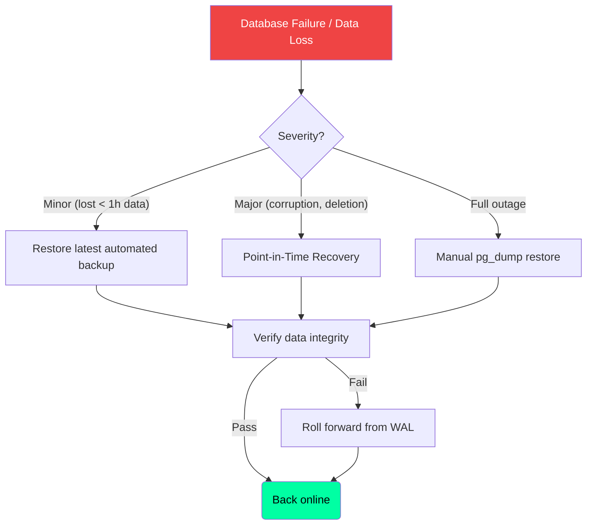

# Backup Strategy — Second Brain OS

## Document Control

| Field | Value |
|---|---|
| **Document ID** | ENG-BAK-010 |
| **Version** | 1.0.0 |
| **Status** | Approved |
| **Date** | 2026-07-10 |
| **Classification** | Internal |
| **Owner** | Developer |
| **Related Docs** | [MigrationStrategy.md](MigrationStrategy.md), [DisasterRecovery.md](../operations/41_DisasterRecovery.md) |

---

## 1. Executive Summary

The Second Brain OS database is hosted on Supabase PostgreSQL 15, which provides daily automated backups with 7-day retention on the Free plan and point-in-time recovery (PITR) on Pro plans. This document defines the backup schedule, manual export procedures, restore testing strategy, and retention policies.

---

## 2. Backup Types

| Type | Method | Frequency | Retention | Coverage |
|---|---|---|---|---|
| **Automated daily** | Supabase managed | Daily | 7 days (Free), 30 days (Pro) | Entire database |
| **Point-in-time** | WAL archiving | Continuous | 7 days (Pro) | Any point in last 7 days |
| **Manual pg_dump** | CLI export | Weekly | 90 days | Entire database |
| **Schema-only** | pg_dump --schema-only | Per migration | Permanent (git) | Schema DDL |

---

## 3. Backup Schedule

```mermaid
gantt
    title Database Backup Schedule
    dateFormat  HH:mm
    axisFormat %H:%M
    
    section Automated
    Daily Full Backup           :a1, 02:00, 30m
    WAL Archiving (PITR)        :a2, 00:00, 24h
    
    section Manual
    Weekly pg_dump Export       :m1, Sun 03:00, 30m
    Schema Snapshot (git)       :m2, after migration, 5m
    
    section Verification
    Restore Test (Monthly)      :v1, 01st 04:00, 60m
    Integrity Check (Weekly)    :v2, Sun 03:30, 15m
```

---

## 4. Backup Procedures

### 4.1 Manual pg_dump Export

```bash
# Full database dump (weekly)
pg_dump \
  --host=$SUPABASE_DB_HOST \
  --port=5432 \
  --username=postgres \
  --dbname=postgres \
  --format=custom \
  --file=backups/secondbrain_$(date +%Y%m%d).dump

# Schema-only dump (per migration)
pg_dump \
  --host=$SUPABASE_DB_HOST \
  --port=5432 \
  --username=postgres \
  --dbname=postgres \
  --schema-only \
  --file=backups/schema_$(date +%Y%m%d).sql
```

### 4.2 Automated Backup (Supabase Dashboard)

Supabase manages automated backups:
1. Navigate to **Database → Backups**
2. View available backups and PITR window
3. Download backup files for offsite storage
4. Configure backup storage in Supabase project settings

---

## 5. Restore Procedures



### 5.1 Restore from Automated Backup

```bash
# Download backup from Supabase dashboard
# Restore to a new database instance
pg_restore \
  --host=$NEW_DB_HOST \
  --port=5432 \
  --username=postgres \
  --dbname=postgres \
  --no-owner \
  --verbose \
  backup_file.dump
```

### 5.2 Point-in-Time Recovery

```bash
# Supabase Pro feature — configure in dashboard
# 1. Select target timestamp
# 2. Supabase creates a new database instance at that point
# 3. Verify data integrity
# 4. Update connection strings to point to restored instance
```

---

## 6. Retention Policy

| Backup Type | Active Retention | Cold Storage | Total |
|---|---|---|---|
| Supabase automated | 7 days | N/A | 7 days |
| Manual pg_dump | 30 days | 90 days (local archive) | 120 days |
| Schema snapshots | Permanent (git) | N/A | Permanent |

---

## 7. Monitoring & Alerts

| Metric | Alert Threshold | Action |
|---|---|---|
| Last successful backup | > 24h ago | Investigate backup failure |
| Backup size | > 500 MB | Monitor growth, optimize storage |
| Restore test | Monthly failure | Investigate corruption |
| WAL archiving lag | > 1h | Check replication status |

---

## 8. Disaster Recovery Testing

```bash
# Monthly restore test
#!/bin/bash
echo "=== Restore Test: $(date) ==="

# 1. Download latest backup
echo "Downloading backup..."
# Manual or via Supabase API

# 2. Create temporary database
echo "Creating test database..."
createdb secondbrain_restore_test

# 3. Restore
echo "Restoring..."
pg_restore -d secondbrain_restore_test backup.dump

# 4. Verify
echo "Verifying..."
psql -d secondbrain_restore_test -c "SELECT COUNT(*) FROM tasks;"
psql -d secondbrain_restore_test -c "SELECT COUNT(*) FROM users_profile;"

# 5. Cleanup
echo "Cleaning up..."
dropdb secondbrain_restore_test

echo "=== Restore Test Complete ==="
```

---

## 9. Related Documents

| Document | Description |
|---|---|
| [MigrationStrategy.md](MigrationStrategy.md) | Schema migration approach |
| [DisasterRecovery.md](../operations/41_DisasterRecovery.md) | Full DR plan |
| [Monitoring.md](../operations/32_Monitoring.md) | Database monitoring |
