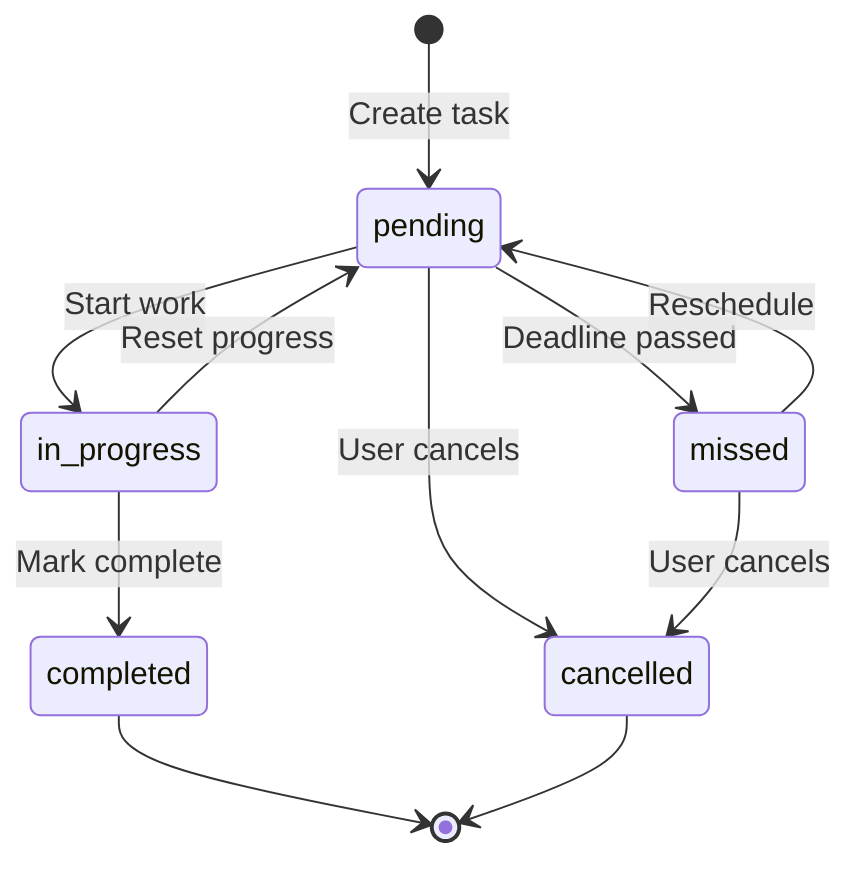
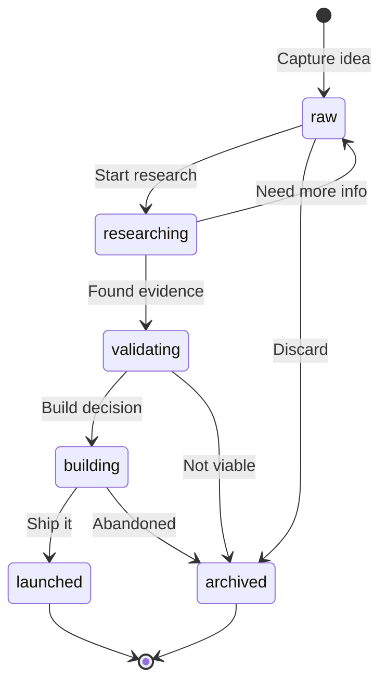
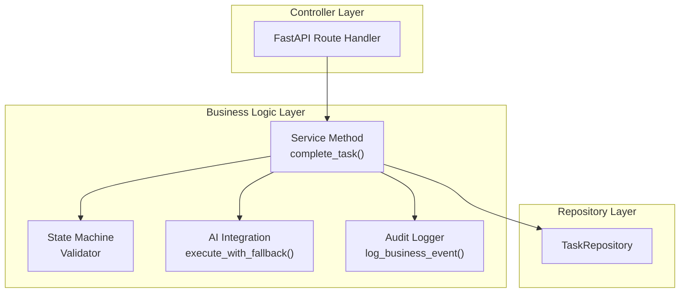
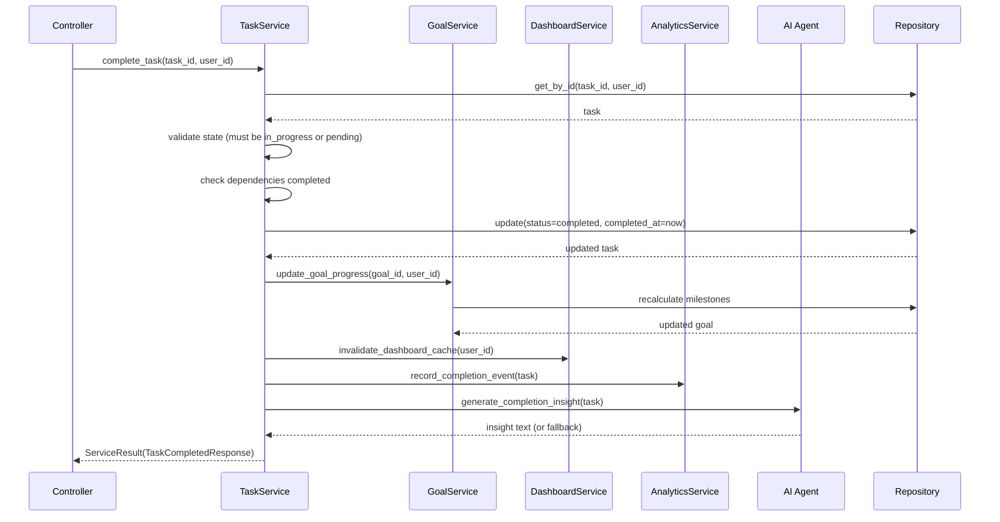

# Business Logic Layer Architecture

## Document Control

| Field | Value |
|---|---|
| **Document ID** | ENG-BIZ-003 |
| **Version** | 1.0.0 |
| **Status** | Approved |
| **Date** | 2026-07-10 |
| **Classification** | Internal |
| **Owner** | Developer |

---

## 1. Executive Summary

The business logic layer sits between controllers and repositories, encapsulating all domain rules, state machines, cross-module orchestration, AI integration points, and algorithmic fallback logic. It ensures that business rules are enforced consistently regardless of the entry point (API, cron job, or manual trigger). This document defines the service layer architecture, state machines for each module, AI fallback patterns, error handling with result types, and business event logging.

---

## 2. Purpose

Define a centralized, testable business logic layer that enforces domain rules, orchestrates multi-step workflows, integrates AI agents with graceful degradation, and provides consistent error handling across all 15+ modules.

---

## 3. Scope

This document covers:
- Service layer design and responsibilities
- State machines for module entities (tasks, ideas, habits, courses, goals)
- AI integration points and fallback patterns
- Error handling with `ServiceResult` type
- Business event logging and audit trails
- Cross-module orchestration patterns

Out of scope: Controller routing (see [Controllers.md](Controllers.md)), data access (see [Repositories.md](Repositories.md)), AI agent architecture (see [AI Architecture](../ai/20_Agent.md)).

---

## 4. Business Context

Second Brain OS manages 15+ entity types, each with domain-specific rules:
- **Tasks**: Dependencies, deadlines, rescheduling, completion cascades to goals
- **Ideas**: Pipeline stages (raw → researching → validating → building → archived)
- **Habits**: Streak tracking, daily completion, consistency scores
- **Courses**: Progress tracking, deadline pacing, daily target calculations
- **Goals**: Milestone tracking, roadmap progression, cross-module aggregation
- **Sleep**: Duration scoring, debt calculation, wind-down scheduling

Each module needs algorithmic fallback (no AI required for core functionality) with AI enhancement optional.

---

## 5. Functional Specification

### 5.1 Service Layer Responsibilities

| Responsibility | Description | Example |
|---|---|---|
| State transitions | Enforce valid state machine transitions | Task: pending → in_progress → completed |
| Validation | Cross-field and business rule validation | Task cannot complete if dependency is open |
| Orchestration | Coordinate across multiple entities | Complete task → update goal progress → update dashboard |
| AI integration | Call LLM, fall back to algorithm | Generate briefing via AI or rule-based template |
| Audit logging | Record all business events | Log task completion with before/after state |

### 5.2 State Machines

#### Task Lifecycle



**Transition rules:**
- `pending → in_progress`: Requires no unmet dependencies
- `pending → missed`: Auto-transition when `due_date < now` and status is pending
- `in_progress → completed`: Sets `completed_at`, cascades to goal progress
- Any → `completed`: Last-write-wins for concurrent updates

#### Idea Pipeline



#### Habit Streak Engine

```python
async def calculate_streak(habit: dict, logs: list[dict]) -> int:
    """Calculate current streak from habit log entries."""
    streak = 0
    today = date.today()
    for day_offset in range(365):
        check_date = today - timedelta(days=day_offset)
        logged = any(
            log["date"] == check_date.isoformat() and log["completed"]
            for log in logs
        )
        if logged:
            streak += 1
        elif day_offset == 0:
            continue  # Today can still be completed
        else:
            break
    return streak
```

---

## 6. Non-Functional Requirements

| Requirement | Target | Measurement |
|---|---|---|
| Service method execution (no AI) | < 100ms p95 | Timing decorator |
| Service method execution (with AI) | < 30s p95 | LLM client timing |
| AI fallback activation | < 50ms | Circuit breaker check |
| State transition validation | < 10ms | Validation decorator |
| Business event logging overhead | < 5ms per event | Logger timing |

---

## 7. Architecture

### 7.1 Service Layer Position



### 7.2 ServiceResult Pattern

```python
from dataclasses import dataclass
from typing import Generic, TypeVar, Optional

T = TypeVar("T")
E = TypeVar("E")

@dataclass
class ServiceResult(Generic[T, E]):
    success: bool
    data: Optional[T] = None
    error: Optional[E] = None
    error_code: Optional[str] = None

    @classmethod
    def ok(cls, data: T) -> "ServiceResult":
        return cls(success=True, data=data)

    @classmethod
    def fail(cls, error: E, code: str = None) -> "ServiceResult":
        return cls(success=False, error=error, error_code=code)

    def unwrap(self) -> T:
        if not self.success:
            raise ServiceError(str(self.error))
        return self.data
```

### 7.3 AI Integration with Fallback

```python
class TaskService(BaseService):
    name = "task_service"

    async def prioritize_tasks(self, user_id: str) -> ServiceResult:
        """AI-powered prioritization with algorithmic fallback."""
        try:
            result = await self.ai_agent.prioritize(user_id)
            return ServiceResult.ok(result)
        except (AIProviderError, CircuitBreakerOpenError):
            logger.warn("[TaskService] AI unavailable, using rule-based fallback")
            fallback = await self._rule_based_prioritize(user_id)
            return ServiceResult.ok(fallback)

    async def _rule_based_prioritize(self, user_id: str) -> list[dict]:
        """Algorithmic fallback: sort by urgency × importance."""
        tasks = await self.repo.list(user_id)
        now = datetime.utcnow()
        for t in tasks:
            urgency = (
                5 if t.get("due_date") and t["due_date"] < now
                else 4 if t.get("priority") == "urgent"
                else 3 if t.get("priority") == "high"
                else 2 if t.get("priority") == "medium"
                else 1
            )
            t["_priority_score"] = urgency
        return sorted(tasks, key=lambda t: t["_priority_score"], reverse=True)
```

---

## 8. Diagrams

### 8.1 Cross-Module Orchestration (Task Complete)



---

## 9. Data Models

| Type | Description |
|---|---|
| `ServiceResult[T, E]` | Generic result wrapper with success/error |
| `StateTransition` | Defines valid from→to→condition mappings |
| `BusinessEvent` | Structured event for audit logging |

---

## 10. APIs

### 10.1 Service Method Inventory

| Service | Method | AI Integration | Fallback |
|---|---|---|---|
| `TaskService` | `prioritize_tasks` | LLM re-ranking | Rule-based (urgency × importance) |
| `TaskService` | `complete_task` | Completion insight | Static template message |
| `CourseService` | `calculate_pacing` | LLM schedule optimization | Simple rate calculation |
| `HabitService` | `generate_suggestions` | LLM pattern detection | Statistical analysis |
| `SleepService` | `analyze_sleep` | LLM recommendations | Rule-based scoring |
| `GoalService` | `update_progress` | None | Deterministic |

---

## 11. Security

| Concern | Implementation |
|---|---|
| State transition enforcement | Validates user owns the entity before transition |
| Result type safety | `ServiceResult` prevents unchecked None returns |
| AI prompt injection | User input sanitized before LLM submission |
| Audit immutability | Business events are append-only |

---

## 12. Performance Targets

| Metric | Target |
|---|---|
| State transition validation | < 10ms |
| Cross-service call overhead | < 5ms |
| AI fallback switch | < 50ms |
| Service method (no AI) | < 100ms p95 |
| Service method (with AI) | < 30s p95 |

---

## 13. Edge Cases

| Edge Case | Handling |
|---|---|
| Circular state transition | State machine validates no self-transitions |
| Concurrent completion | Last-write-wins; idempotent completion |
| AI provider flapping | Circuit breaker prevents rapid fail-over |
| Missing goal for cascade | Graceful: skip goal update if no goal_id |
| Dependency already deleted | Skip dependency check with warning log |

---

## 14. Failure Scenarios

| Scenario | Impact | Recovery |
|---|---|---|
| AI provider down | Falls back to algorithmic mode | Automatic when AI recovers |
| Repository timeout | Service returns `ServiceResult.fail` | Controller returns 504 |
| Invalid state transition | Returns 400 with transition details | Client fixes state |
| Cross-service deadlock | Timeout after 30s | Circuit breaker kills hung calls |

---

## 15. Risks & Mitigations

| Risk | Likelihood | Impact | Mitigation |
|---|---|---|---|
| Business logic leaks into controllers | Medium | High | Code review; CI enforces no db calls in controllers |
| AI fallback produces wrong results | Medium | Medium | Verify fallback in unit tests; log fallback activations |
| State machine inconsistencies | Low | High | Unit test every transition for every entity |
| Cross-service call chains too deep | Low | Medium | Fire-and-forget for non-critical cascade updates |

---

## 16. Acceptance Criteria

- [ ] Every state transition is validated before execution
- [ ] Every service method returns `ServiceResult`
- [ ] Every AI-dependent method has a working algorithmic fallback
- [ ] Every business mutation is logged as a `BusinessEvent`
- [ ] Cross-module cascades are implemented as async fire-and-forget
- [ ] Service methods are unit-testable with mocked repositories

---

## 17. Traceability

| Requirement ID | Source | Implementation |
|---|---|---|
| BIZ-01 | ADR-004 (In-process agents) | AI integration via `execute_with_fallback()` |
| BIZ-02 | SEC-003 (Audit) | `AuditLogger` in all mutation services |
| BIZ-03 | ARCH-001 (Separation) | Service layer isolated from controllers |
| BIZ-04 | AI-002 (Graceful degradation) | Algorithmic fallback for every AI feature |

---

## 18. Implementation Notes

1. Services never import router or controller modules
2. Use `asyncio.create_task()` for fire-and-forget cross-service calls
3. State machines are defined as declarative dicts, not if/else chains
4. AI fallback must be tested in CI (both success and failure paths)
5. BusinessEvent schema: `{event, entity_type, entity_id, user_id, before, after, timestamp}`

---

## 19. Testing Strategy

| Test Type | Coverage | Tools |
|---|---|---|
| State machine tests | Every valid + invalid transition | pytest parametrize |
| Service method tests | Every method, success + error paths | pytest + mocks |
| AI fallback tests | AI success, AI failure, both paths | Mock LLMClient |
| Cross-service cascade tests | Critical paths (task complete → goal) | Integration tests |
| Audit logging tests | Every mutation logs correctly | Assert on mock logger |

---

## 20. References

| Reference | Document |
|---|---|
| Controller Layer | [Controllers.md](Controllers.md) |
| Repository Layer | [Repositories.md](Repositories.md) |
| Validation Architecture | [Validation.md](Validation.md) |
| AI Agent Architecture | [AI Architecture](../ai/20_Agent.md) |
| Error Codes | [ErrorCodes.md](ErrorCodes.md) |

---

## Revision History

| Version | Date | Author | Changes |
|---|---|---|---|
| 1.0.0 | 2026-07-10 | Developer | Initial business logic layer documentation |
