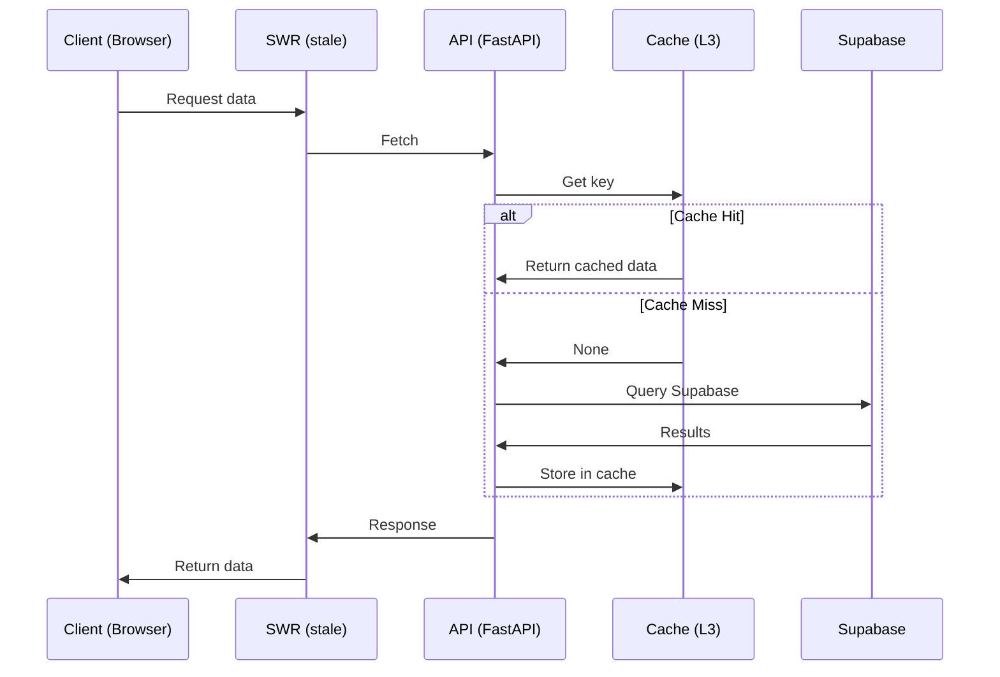
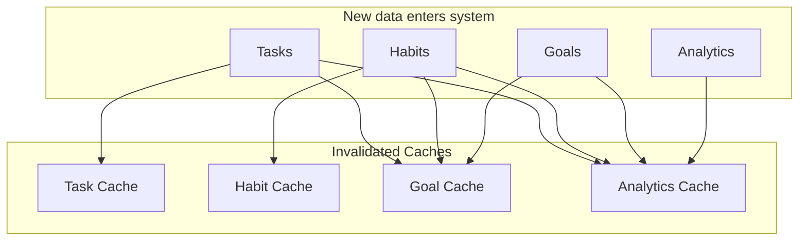

# Caching Strategy — Second Brain OS

## Document Control

| Field | Value |
|---|---|
| **Document ID** | ENG-CACHE-001 |
| **Version** | 1.0.0 |
| **Status** | Active |
| **Last Updated** | 2026-06-11 |
| **Classification** | Internal — Engineering Reference |
| **Owner** | Platform Engineering |

---

## 1. Executive Summary

Second Brain OS serves 15 modules (tasks, courses, goals, ideas, projects, resources, opportunities, income, habits, sleep, time, finance, notes, journal, analytics) over a Next.js 14 + FastAPI + Supabase stack. Without a structured caching strategy, repeated API calls degrade UX latency (300–800 ms p95 on cold reads) and inflate Supabase compute costs. This document defines a **4-tier cache hierarchy**, per-data-type TTL policies, cache-aside read patterns, and a Redis migration path. Target: sub-100 ms p95 reads, 60%+ cache hit rate, zero stale-data bugs.

---

## 2. Cache Hierarchy

| Level | Layer | What It Caches | Storage | Volatility |
|---|---|---|---|---|
| L1 | Browser Cache | Static assets (JS, CSS, images) | HTTP Cache (disk) | Until `max-age` expires |
| L2 | Service Worker | App shell, API responses | Cache Storage API (disk) | Until SW evicts |
| L3 | In-Memory API Cache | Frequent-read DB results | Python `dict` + `cachetools.TTLCache` | Per TTL |
| L4 | Supabase Database | Query results (materialized views) | PostgreSQL + Supabase cache | Per refresh policy |

**Read path:** L1 → L2 → L3 → L4 → Origin. Each miss cascades down.

---

## 3. Current State

- **Frontend:** No caching library. Every page mount calls `fetch()` to `/api/*`.
- **Backend:** `packages/shared/utils/cache.py` — a `SimpleCache` class wrapping `cachetools.TTLCache` with maxsize=256 and default TTL=300s.
- **Database:** No materialized views. No Supabase query caching configured.
- **CDN:** Vercel edge network caches SSR responses for 0 seconds (default).

**Gap:** High cold-start latency; no stale-while-revalidate; repeated identical queries hit Supabase every time.

---

## 4. Frontend Caching

### 4.1 Next.js ISR (Incremental Static Regeneration)

For semi-static pages (dashboard overview, analytics summaries, course catalog):

```typescript
// apps/web/app/dashboard/page.tsx
export const revalidate = 300 // seconds
```

Pages regenerate in background. Stale version served until fresh build completes.

### 4.2 Client-Side SWR / Stale-While-Revalidate

Using `swr` library for all data-fetching hooks:

```typescript
import useSWR from 'swr'
import { supabase } from '@/lib/supabase'

export function useTasks(filters: TaskFilters) {
  return useSWR(['tasks', filters], () => fetchTasks(filters), {
    revalidateOnFocus: true,
    dedupingInterval: 10_000,        // 10s dedup
    errorRetryCount: 3,
    onError: (err) => logError('useTasks', err),
  })
}
```

**Policy by data volatility:**

| Data Type | `dedupingInterval` | `revalidateOnFocus` | `refreshInterval` |
|---|---|---|---|
| Tasks | 10 s | true | 30 s |
| Habits | 30 s | true | 60 s |
| Goals | 60 s | true | 120 s |
| Analytics | 300 s | false | 300 s |
| User Profile | 600 s | true | 0 (manual) |

### 4.3 localStorage for User Preferences

```typescript
// apps/web/lib/storage.ts
const PREFS_KEY = 'sb_os_preferences'

export function savePreferences(prefs: UserPreferences): void {
  localStorage.setItem(PREFS_KEY, JSON.stringify(prefs))
}

export function loadPreferences(): UserPreferences | null {
  const raw = localStorage.getItem(PREFS_KEY)
  return raw ? JSON.parse(raw) : null
}
```

Stores theme, sidebar collapse state, per-page view mode. Never stores auth tokens or sensitive data.

---

## 5. Backend Caching

### 5.1 SimpleCache (L3)

`packages/shared/utils/cache.py` — current implementation extended with typed caches:

```python
from cachetools import TTLCache
from typing import Any, Optional

class SimpleCache:
    def __init__(self, maxsize: int = 512, ttl: int = 300):
        self._cache: TTLCache = TTLCache(maxsize=maxsize, ttl=ttl)
        self._hits: int = 0
        self._misses: int = 0

    def get(self, key: str) -> Optional[Any]:
        val = self._cache.get(key, None)
        if val is not None:
            self._hits += 1
        else:
            self._misses += 1
        return val

    def set(self, key: str, value: Any) -> None:
        self._cache[key] = value

    def invalidate(self, pattern: str) -> None:
        """Invalidate keys matching a prefix pattern."""
        keys_to_remove = [k for k in self._cache if k.startswith(pattern)]
        for k in keys_to_remove:
            del self._cache[k]

    def stats(self) -> dict:
        total = self._hits + self._misses
        return {
            "hits": self._hits,
            "misses": self._misses,
            "hit_rate": round(self._hits / total * 100, 2) if total else 0.0,
            "size": len(self._cache),
            "maxsize": self._cache.maxsize,
        }
```

### 5.2 Cache Key Convention

```
{cache_namespace}:{module}:{user_id}:{params_hash}
```

Examples:

| Key | Description |
|---|---|
| `api:tasks:usr_abc123:status=active_limit=20` | Active tasks for user |
| `api:habits:usr_abc123:date=2026-06-11` | Habits log for date |
| `api:analytics:usr_abc123:range=30d` | 30-day analytics |

### 5.3 TTL Per Data Type

| Data Type | TTL | Rationale |
|---|---|---|
| Tasks | 30 s | Frequent CRUD |
| Habits | 60 s | Daily check-ins |
| Goals | 120 s | Stable |
| Courses | 300 s | Rare changes |
| Analytics | 600 s | Computed, expensive |
| User Profile | 600 s | Very stable |
| Ideas / Resources | 120 s | Moderate churn |
| Income / Finance | 300 s | Daily updates |

### 5.4 Cache Registration

```python
# apps/api/app/core/cache.py
from packages.shared.utils.cache import SimpleCache

task_cache = SimpleCache(maxsize=1024, ttl=30)
habit_cache = SimpleCache(maxsize=512, ttl=60)
analytics_cache = SimpleCache(maxsize=256, ttl=600)
```

Each endpoint's route handler checks cache before querying Supabase (see §7).

---

## 6. Cache Invalidation

### 6.1 Write-Through Invalidation

On any CUD operation, invalidate related cache keys immediately:

```python
# apps/api/app/api/tasks.py
@router.post("/tasks")
async def create_task(task: TaskCreate, user: User = Depends(get_user)):
    result = await supabase.table("tasks").insert(task.dict()).execute()
    task_cache.invalidate(f"api:tasks:{user.id}:")
    return result.data
```

### 6.2 Invalidation Rules

| Operation | Cache Invalidation |
|---|---|
| INSERT task | Invalidate `api:tasks:{user_id}:*` |
| UPDATE task | Invalidate `api:tasks:{user_id}:*` |
| DELETE task | Invalidate `api:tasks:{user_id}:*`, clear analytics |
| Habit check-in | Invalidate `api:habits:{user_id}:*` |
| Goal progress | Invalidate `api:goals:{user_id}:*`, `api:analytics:{user_id}:*` |

### 6.3 Manual Clear Button

Admin panel exposes a cache-clear endpoint:

```python
@router.post("/admin/cache/clear")
async def clear_cache(module: Optional[str] = None, admin: User = Depends(require_admin)):
    if module == "tasks":
        task_cache.clear()
    elif module == "all":
        task_cache.clear()
        habit_cache.clear()
        analytics_cache.clear()
    ...
    return {"status": "ok", "cleared": module or "all"}
```

Frontend admin page at `/admin/cache` with per-module clear buttons.

---

## 7. Cache-Aside Pattern

Detailed flow for every data read:



### Pseudocode

```python
async def get_tasks(user_id: str, params: dict):
    cache_key = build_cache_key("tasks", user_id, params)

    # 1. Check cache
    cached = task_cache.get(cache_key)
    if cached:
        return cached

    # 2. Cache miss — query Supabase
    query = supabase.table("tasks").select("*").eq("user_id", user_id)
    for k, v in params.items():
        query = query.eq(k, v)
    result = await query.execute()

    # 3. Store in cache
    task_cache.set(cache_key, result.data)

    # 4. Return
    return result.data
```

---

## 8. Data Categories & Cache Policy

| Data Type | Module(s) | TTL | Invalidation Trigger | Est. Size/User | Cache Priority |
|---|---|---|---|---|---|
| Task list | Tasks | 30 s | CUD on tasks | ~50 KB | High |
| Habit log | Habits | 60 s | Check-in | ~10 KB | High |
| Goal tree | Goals | 120 s | Progress update | ~20 KB | Medium |
| Course list | Courses | 300 s | Enrollment change | ~30 KB | Low |
| Analytics | Analytics | 600 s | Daily cron | ~100 KB | Medium |
| Idea board | Ideas | 120 s | INSERT/UPDATE | ~15 KB | Medium |
| Resource links | Resources | 120 s | INSERT/DELETE | ~10 KB | Low |
| Income records | Income | 300 s | INSERT/UPDATE | ~15 KB | Low |
| Sleep logs | Sleep | 60 s | Daily log | ~5 KB | Medium |
| Time entries | Time | 30 s | Timer stop/start | ~8 KB | High |
| User prefs | Settings | 600 s | Manual save | ~3 KB | Medium |
| Finance overview | Finance | 300 s | Transaction entry | ~40 KB | Low |

---

## 9. Redis Migration Path

### 9.1 When to Introduce Redis

Trigger conditions (any two met):

- In-memory cache eviction rate > 5% (keys dropped before TTL due to maxsize)
- Number of unique cache keys exceeds 10,000
- Two or more API pods running (load-balanced)
- Supabase query costs exceed $50/month

### 9.2 Integration Strategy

```python
# packages/shared/utils/redis_cache.py
import redis.asyncio as redis
from typing import Optional, Any
import json

class RedisCache:
    def __init__(self, redis_url: str = "redis://localhost:6379/0"):
        self._client = redis.from_url(redis_url, decode_responses=True)

    async def get(self, key: str) -> Optional[Any]:
        val = await self._client.get(key)
        return json.loads(val) if val else None

    async def set(self, key: str, value: Any, ttl: int = 300) -> None:
        await self._client.setex(key, ttl, json.dumps(value))

    async def invalidate(self, pattern: str) -> None:
        cursor, keys = await self._client.scan(match=f"{pattern}*")
        if keys:
            await self._client.delete(*keys)
```

Swap `SimpleCache` for `RedisCache` via dependency injection in `apps/api/app/core/cache.py`. The interface (`.get()`, `.set()`, `.invalidate()`) is identical.

### 9.3 Cost Impact

| Resource | Monthly Cost (est.) |
|---|---|
| Redis Cloud (250 MB, 1 GB RAM) | $15–30 |
| Upstash Redis (256 MB, 10k cmds/day) | Free tier |
| Self-hosted on same VPS | $0 (existing infra) |

Redis should be deployed as **Upstash** (serverless, no ops) or **Redis Cloud Free** (30 MB) for initial migration, then scaled.

---

## 10. Cache Monitoring

### 10.1 Metrics Collected (per cache instance)

| Metric | Source | Collection |
|---|---|---|
| Hit count | `SimpleCache._hits` | On every `.get()` |
| Miss count | `SimpleCache._misses` | On every `.get()` |
| Current size | `len(cache._cache)` | On mutation |
| Max size | `cache._cache.maxsize` | Config |
| Eviction count | `cachetools` callback | On eviction |
| Invalidation count | `cache.invalidate()` | On invalidation |

### 10.2 Health Endpoint

```python
@router.get("/admin/cache/stats")
async def cache_stats(admin: User = Depends(require_admin)):
    return {
        "task_cache": task_cache.stats(),
        "habit_cache": habit_cache.stats(),
        "analytics_cache": analytics_cache.stats(),
    }
```

### 10.3 Targets

| Metric | Target |
|---|---|
| Cache hit rate | > 60% |
| p95 read latency (cached) | < 50 ms |
| p95 read latency (uncached) | < 400 ms |
| In-memory eviction rate | < 1% |
| Stale data incidents | 0 / week |

---

## 11. Edge Caching

### 11.1 Vercel CDN

Leverage Vercel's edge network for static and SSR responses:

```typescript
// next.config.js
module.exports = {
  async headers() {
    return [
      {
        source: '/static/:path*',
        headers: [
          { key: 'Cache-Control', value: 'public, max-age=31536000, immutable' },
        ],
      },
      {
        source: '/api/:path*',
        headers: [
          { key: 'Cache-Control', value: 'public, s-maxage=10, stale-while-revalidate=60' },
        ],
      },
      {
        source: '/_next/image/:path*',
        headers: [
          { key: 'Cache-Control', value: 'public, max-age=86400, immutable' },
        ],
      },
    ]
  },
}
```

### 11.2 API Cache Headers

```python
@router.get("/tasks")
async def get_tasks(...):
    response = JSONResponse(content=data)
    response.headers["Cache-Control"] = "private, max-age=30, stale-while-revalidate=120"
    return response
```

- `private` — never cache on shared proxies (user-specific data)
- `max-age=30` — browser caches for 30 s
- `stale-while-revalidate=120` — serve stale up to 120 s while revalidating in background

---

## 12. Appendices

### 12.1 TTL Reference Table

| TTL | Use Case | Example |
|---|---|---|
| 10 s | Real-time (timer, active task) | Time entries |
| 30 s | High-churn CRUD | Tasks, habits |
| 60 s | Moderate churn | Sleep log |
| 120 s | Low churn | Goals, ideas |
| 300 s | Semi-static | Courses, income |
| 600 s | Stable / computed | Analytics, user profile |
| 86400 s (24 h) | Truly static | Reference data (tags, categories) |

### 12.2 Invalidation Matrix



### 12.3 Revision History

| Version | Date | Author | Changes |
|---|---|---|---|
| 0.1 | 2026-06-11 | Architecture Team | Initial draft |
| 1.0.0 | 2026-07-10 | Platform Engineering | Production release |

---

### 12.4 Cross-References

| Document | Location |
|---|---|
| Architecture Overview | [12_Architecture.md](12_Architecture.md) |
| Backend Architecture | [BackendArchitecture.md](BackendArchitecture.md) |
| Database Schema | [15_Database.md](15_Database.md) |
| Performance Benchmarks | [AGENTS.md section 26](../../AGENTS.md#26-performance-benchmarks) |
| Rate Limiting | [RateLimiting.md](RateLimiting.md) |

---

*End of Document — ENG-CACHE-001*
