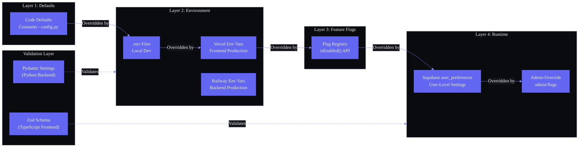

# Configuration Management

---

## Document Control

| Field | Detail |
|---|---|
| **Document ID** | ENG-CFG-001 |
| **Version** | 1.0 |
| **Status** | Draft |
| **Author** | AI Agent System |
| **Date** | 2024-01-01 |
| **Last Reviewed** | 2025-12-15 |
| **Review Cycle** | Quarterly |
| **Approved By** | — |

---

### Architecture Diagram — Configuration Hierarchy

## 1. Executive Summary

Second Brain OS relies on configuration across multiple layers: **environment variables** on Vercel and Railway, **.env files** for local development, **Supabase database** for user preferences, and **feature flags** for gradual rollouts. Currently, configuration is managed ad-hoc — there is no centralized validation at startup, no schema enforcement for environment variables, and no audit trail for configuration changes.

This document establishes a formal configuration management framework covering the hierarchy of configuration sources, environment type definitions, storage backends, validation with **Pydantic Settings** (backend) and **zod** (frontend), secret management practices, audit procedures, and a full configuration catalog.

---

## 2. Current State

### 2.1 Configuration Sources

| Source | Used For | Format | Location |
|---|---|---|---|
| .env.local | Local frontend dev | Key-value file | pps/web/.env.local |
| .env | Local backend dev | Key-value file | pps/api/.env |
| **Vercel Environment Variables** | Production frontend | Vercel dashboard | Vercel project settings |
| **Railway Environment Variables** | Production backend | Railway dashboard | Railway service settings |
| **Supabase Database** | User preferences | user_preferences table | Supabase project |

### 2.2 Current Configuration Inventory

`
# apps/web/.env.local (example)
NEXT_PUBLIC_SUPABASE_URL=https://xxxxx.supabase.co
NEXT_PUBLIC_SUPABASE_ANON_KEY=xxxxx
NEXT_PUBLIC_APP_URL=http://localhost:3000

# apps/api/.env (example)
SUPABASE_URL=https://xxxxx.supabase.co
SUPABASE_SERVICE_KEY=xxxxx
SUPABASE_JWT_SECRET=xxxxx
OPENAI_API_KEY=xxxxx
ANTHROPIC_API_KEY=xxxxx
REDIS_URL=redis://localhost:6379
LOG_LEVEL=DEBUG
ENVIRONMENT=development
`

### 2.3 Problems

| Problem | Impact | Severity |
|---|---|---|
| No startup validation | App may start with missing or invalid config -> runtime crash | High |
| No schema definition | Unclear what config exists, what type, what default | High |
| Secrets committed to git | .env files may accidentally be tracked | Critical |
| No config change audit | Cannot trace who changed what or when | Medium |
| Mixed environments | Local Ollama URL same var as cloud Claude URL -> confusion | Medium |
| No feature flags | Deploy risky features to all users at once | High |
| No config documentation | New developers must reverse-engineer config | Medium |

---

## 3. Configuration Hierarchy

### 3.1 Precedence (Lowest -> Highest Priority)

`
  +------------------------------+
  |  1. Default Values            |  Hardcoded in Pydantic/zod schemas
  +------------------------------+
  |  2. .env / .env.local file    |  Local development overrides
  +------------------------------+
  |  3. Environment Variables     |  Vercel, Railway, OS env
  +------------------------------+
  |  4. Database (user_prefs)     |  Per-user settings in Supabase
  +------------------------------+
  |  5. Feature Flags (DB table)  |  Per-user or global toggles
  +------------------------------+
  |  6. Runtime Override          |  Admin API endpoint (ephemeral)
  +------------------------------+
`

### 3.2 Override Rules

| Source | Scope | Persistence | Example |
|---|---|---|---|
| Default value | Global | Static code | LOG_LEVEL: str = "INFO" |
| Env file | Local | File | LOG_LEVEL=DEBUG in .env |
| Environment variable | Environment | Platform | Railway env vars |
| Database preference | Per-user | Supabase | 	heme: "dark" |
| Feature flag | Per-user/global | Supabase | i_briefing_enabled: true |
| Runtime override | Admin session | Ephemeral | POST /api/admin/config |

### 3.3 Pydantic Settings: Resolution Order

`python
# apps/api/app/config/settings.py
from pydantic_settings import BaseSettings, SettingsConfigDict
from pydantic import Field
from typing import Optional

class Settings(BaseSettings):
    model_config = SettingsConfigDict(
        env_file=".env",
        env_file_encoding="utf-8",
        case_sensitive=False,
        extra="ignore",
    )

    # --- Application ---
    APP_NAME: str = "Second Brain OS"
    ENVIRONMENT: str = "development"  # development | production
    LOG_LEVEL: str = "INFO"
    DEBUG: bool = False

    # --- Supabase ---
    SUPABASE_URL: str
    SUPABASE_SERVICE_KEY: str
    SUPABASE_JWT_SECRET: str

    # --- AI Providers ---
    OPENAI_API_KEY: Optional[str] = None
    ANTHROPIC_API_KEY: Optional[str] = None
    OLLAMA_BASE_URL: Optional[str] = None  # http://localhost:11434
    AI_PROVIDER: str = "ollama"  # ollama | openai | anthropic
    AI_MODEL: str = "llama3.2"

    # --- Redis / Queue ---
    REDIS_URL: Optional[str] = None

    # --- Scheduler ---
    SCHEDULER_TIMEZONE: str = "Asia/Kolkata"
    SCHEDULER_JOBSTORE: str = "memory"  # memory | redis

    # --- Rate Limiting ---
    RATE_LIMIT_ENABLED: bool = True
    RATE_LIMIT_DEFAULT: int = 100
    RATE_LIMIT_WINDOW: int = 60

    # --- Sentry / Monitoring ---
    SENTRY_DSN: Optional[str] = None

    # --- Email ---
    SMTP_HOST: Optional[str] = None
    SMTP_PORT: int = 587
    SMTP_USER: Optional[str] = None
    SMTP_PASS: Optional[str] = None
    EMAIL_FROM: str = "noreply@secondbrain.app"

settings = Settings()  # Validated on import -- fails fast if required vars missing
`

---

## 4. Environment Types

### 4.1 Environment Matrix

| Environment | Purpose | Host | AI Provider | Database | Config Source |
|---|---|---|---|---|---|
| **development** | Local dev | localhost | Ollama (local) | Local Supabase / production Supabase dev branch | .env file |
| **staging** | Pre-production testing | Railway staging | OpenAI (cheap model) | Supabase staging branch | Railway env vars |
| **production** | Live users | Railway + Vercel | Claude / GPT-4 | Supabase production | Platform env vars |

### 4.2 Environment-Specific Configuration

| Config Key | Development | Staging | Production |
|---|---|---|---|
| AI_PROVIDER | ollama | openai | nthropic |
| AI_MODEL | llama3.2 | gpt-4o-mini | claude-sonnet-4-20250514 |
| LOG_LEVEL | DEBUG | INFO | WARNING |
| RATE_LIMIT_DEFAULT | 9999 (unlimited) | 100 | 100 |
| SENTRY_DSN | None | Set | Set |
| REDIS_URL | None | Railway Redis | Railway Redis |

### 4.3 Managing Local AI Provider vs Cloud AI

`python
# apps/api/app/services/ai.py
from apps.api.app.config.settings import settings

def get_ai_client():
    if settings.ENVIRONMENT == "development" and settings.AI_PROVIDER == "ollama":
        return OllamaClient(base_url=settings.OLLAMA_BASE_URL or "http://localhost:11434")
    elif settings.AI_PROVIDER == "openai":
        return OpenAIClient(api_key=settings.OPENAI_API_KEY)
    elif settings.AI_PROVIDER == "anthropic":
        return AnthropicClient(api_key=settings.ANTHROPIC_API_KEY)
    else:
        raise ConfigError(f"Unknown AI provider: {settings.AI_PROVIDER}")
`

---

## 5. Config Storage

### 5.1 Config Storage Matrix

| Config Type | Storage Backend | Encryption | Access Pattern | Example |
|---|---|---|---|---|
| **Secrets** (API keys, DB passwords) | Environment variables | At rest (platform) | Loaded at startup | OPENAI_API_KEY |
| **Non-sensitive env vars** | Environment variables | None | Loaded at startup | LOG_LEVEL |
| **User preferences** | Supabase user_preferences | None (app-level) | Read on user session | 	heme, 	imezone |
| **Feature flags** | Supabase eature_flags | None | Read per request | i_briefing_enabled |
| **Runtime config** | Admin API -> Redis/Memory | None | Ephemeral | Rate limit override |

### 5.2 User Preferences Table

`sql
-- Supabase: user_preferences
CREATE TABLE user_preferences (
    id            UUID PRIMARY KEY DEFAULT gen_random_uuid(),
    user_id       UUID REFERENCES users(id) UNIQUE NOT NULL,
    preferences   JSONB NOT NULL DEFAULT '{}',
    created_at    TIMESTAMPTZ DEFAULT NOW(),
    updated_at    TIMESTAMPTZ DEFAULT NOW()
);

-- Example preferences JSONB payload
-- {
--   "theme": "dark",
--   "timezone": "Asia/Kolkata",
--   "locale": "hi",
--   "notifications_enabled": true,
--   "briefing_time": "07:00",
--   "radar_time": "06:00",
--   "ai_provider": "ollama",
--   "ai_model": "llama3.2",
--   "dashboard_widgets": ["tasks", "habits", "radar", "briefing"]
-- }
`

### 5.3 Feature Flags Table

`sql
-- Supabase: feature_flags
CREATE TABLE feature_flags (
    id            UUID PRIMARY KEY DEFAULT gen_random_uuid(),
    flag_key      TEXT NOT NULL UNIQUE,
    description   TEXT,
    enabled       BOOLEAN NOT NULL DEFAULT false,
    user_ids      UUID[] DEFAULT '{}',        -- specific users (empty = all)
    rollout_percent INTEGER DEFAULT 100,       -- 0-100 gradual rollout
    created_at    TIMESTAMPTZ DEFAULT NOW(),
    updated_at    TIMESTAMPTZ DEFAULT NOW()
);

-- Example feature flags
-- INSERT INTO feature_flags (flag_key, description, enabled) VALUES
--   ('ai_briefing_v2', 'New AI briefing format with weather', false),
--   ('radar_scan_advanced', 'Enhanced opportunity radar with LinkedIn', true),
--   ('dark_mode_only', 'Force dark mode for all users', false),
--   ('export_pdf', 'Enable PDF export feature', true);
`

### 5.4 Feature Flag Check (Backend)

`python
# apps/api/app/services/feature_flags.py
from supabase import create_client

class FeatureFlagService:
    def __init__(self):
        self._cache: dict[str, dict] = {}

    async def is_enabled(self, flag_key: str, user_id: str | None = None) -> bool:
        # 1. Check cache first
        if flag_key in self._cache:
            flag = self._cache[flag_key]
            return self._evaluate(flag, user_id)

        # 2. Fetch from Supabase
        result = await supabase.from_("feature_flags")\
            .select("*").eq("flag_key", flag_key).single().execute()

        if not result.data:
            return False  # Unknown flag = disabled

        flag = result.data
        self._cache[flag_key] = flag
        return self._evaluate(flag, user_id)

    def _evaluate(self, flag: dict, user_id: str | None) -> bool:
        if not flag["enabled"]:
            return False
        if len(flag.get("user_ids", [])) > 0:
            return user_id in flag["user_ids"]
        # Gradual rollout based on user_id hash
        if flag["rollout_percent"] < 100 and user_id:
            import hashlib
            hash_val = int(hashlib.md5(user_id.encode()).hexdigest(), 16) % 100
            return hash_val < flag["rollout_percent"]
        return True
`

---

## 6. Config Validation

### 6.1 Backend: Pydantic Settings (Fail Fast)

`python
# apps/api/app/config/settings.py -- validation logic

from pydantic import model_validator
from typing import Optional

class Settings(BaseSettings):
    # ... fields ...

    @model_validator(mode="after")
    def validate_ai_config(self):
        if self.ENVIRONMENT == "production":
            if not self.OPENAI_API_KEY and not self.ANTHROPIC_API_KEY:
                raise ValueError(
                    "Production requires at least one AI provider key "
                    "(OPENAI_API_KEY or ANTHROPIC_API_KEY)"
                )
            if self.AI_PROVIDER not in ("openai", "anthropic"):
                raise ValueError(
                    f"Production AI_PROVIDER must be 'openai' or 'anthropic', got '{self.AI_PROVIDER}'"
                )
        else:
            if self.AI_PROVIDER == "ollama" and not self.OLLAMA_BASE_URL:
                raise ValueError(
                    "Development with Ollama requires OLLAMA_BASE_URL"
                )
        return self

    @model_validator(mode="after")
    def validate_supabase_config(self):
        if not self.SUPABASE_URL.startswith("https://"):
            raise ValueError("SUPABASE_URL must start with https://")
        if len(self.SUPABASE_SERVICE_KEY) < 20:
            raise ValueError("SUPABASE_SERVICE_KEY appears invalid (too short)")
        return self

# apps/api/main.py -- startup validation check
from apps.api.app.config.settings import settings

@app.on_event("startup")
async def validate_config():
    if settings.ENVIRONMENT not in ("development", "staging", "production"):
        raise RuntimeError(f"Invalid ENVIRONMENT: {settings.ENVIRONMENT}")
    logger.info(f"Configuration validated. Environment: {settings.ENVIRONMENT}")
`

### 6.2 Frontend: Zod Schema (Fail Fast on Build)

`	ypescript
// apps/web/lib/config/env.ts
import { z } from "zod"

const envSchema = z.object({
  NEXT_PUBLIC_SUPABASE_URL: z.string().url(),
  NEXT_PUBLIC_SUPABASE_ANON_KEY: z.string().min(20),
  NEXT_PUBLIC_APP_URL: z.string().url().default("http://localhost:3000"),
  NEXT_PUBLIC_SENTRY_DSN: z.string().url().optional(),
  NEXT_PUBLIC_POSTHOG_KEY: z.string().optional(),
  NEXT_PUBLIC_ENVIRONMENT: z.enum(["development", "staging", "production"]).default("development"),
  NEXT_PUBLIC_AI_PROVIDER: z.enum(["ollama", "openai", "anthropic"]).default("ollama"),
  NEXT_PUBLIC_OLLAMA_URL: z.string().url().default("http://localhost:11434"),
})

type EnvConfig = z.infer<typeof envSchema>

function loadEnvConfig(): EnvConfig {
  const result = envSchema.safeParse({
    NEXT_PUBLIC_SUPABASE_URL: process.env.NEXT_PUBLIC_SUPABASE_URL,
    NEXT_PUBLIC_SUPABASE_ANON_KEY: process.env.NEXT_PUBLIC_SUPABASE_ANON_KEY,
    NEXT_PUBLIC_APP_URL: process.env.NEXT_PUBLIC_APP_URL,
    NEXT_PUBLIC_SENTRY_DSN: process.env.NEXT_PUBLIC_SENTRY_DSN,
    NEXT_PUBLIC_POSTHOG_KEY: process.env.NEXT_PUBLIC_POSTHOG_KEY,
    NEXT_PUBLIC_ENVIRONMENT: process.env.NEXT_PUBLIC_ENVIRONMENT,
    NEXT_PUBLIC_AI_PROVIDER: process.env.NEXT_PUBLIC_AI_PROVIDER,
    NEXT_PUBLIC_OLLAMA_URL: process.env.NEXT_PUBLIC_OLLAMA_URL,
  })

  if (!result.success) {
    console.error("Invalid environment configuration:")
    for (const issue of result.error.issues) {
      console.error(  - : )
    }
    if (process.env.NEXT_PUBLIC_ENVIRONMENT === "production") {
      throw new Error("Invalid environment configuration -- see errors above")
    }
    return envSchema.parse({
      NEXT_PUBLIC_SUPABASE_URL: process.env.NEXT_PUBLIC_SUPABASE_URL!,
      NEXT_PUBLIC_SUPABASE_ANON_KEY: process.env.NEXT_PUBLIC_SUPABASE_ANON_KEY!,
      NEXT_PUBLIC_APP_URL: process.env.NEXT_PUBLIC_APP_URL || "http://localhost:3000",
      NEXT_PUBLIC_ENVIRONMENT: "development",
    })
  }

  return result.data
}

export const envConfig = loadEnvConfig()
`

---

## 7. Secret Management

### 7.1 Secret Inventory

| Secret | Location | Rotation Period | Access |
|---|---|---|---|
| SUPABASE_URL | Railway env / Vercel env | Never (static) | Backend only |
| SUPABASE_SERVICE_KEY | Railway env | Quarterly | Backend only |
| SUPABASE_JWT_SECRET | Railway env | Quarterly | Backend only |
| OPENAI_API_KEY | Railway env | Quarterly (or on leak) | Backend AI service |
| ANTHROPIC_API_KEY | Railway env | Quarterly (or on leak) | Backend AI service |
| SENTRY_DSN | Railway env + Vercel env | Annually | Backend + frontend |
| SMTP_USER / SMTP_PASS | Railway env | Quarterly | Backend email service |
| NEXT_PUBLIC_SUPABASE_ANON_KEY | Vercel env | Annually | Frontend only (public) |

### 7.2 .env File Safety

`ash
# .gitignore -- ensure .env files never committed
.env
.env.local
.env.development.local
.env.test.local
.env.production.local
`

### 7.3 Pre-commit Hook: git-secrets

`ash
#!/bin/bash
# .husky/pre-commit

# Prevent secrets from being committed
# Install: brew install git-secrets

git secrets --scan
if [ True -ne 0 ]; then
  echo "Commit blocked: potential secrets detected."
  exit 1
fi

# Check for .env files
if git diff --cached --name-only | grep -q '\.env$'; then
  echo "Warning: .env file in commit. Double-check before force push."
fi
`

### 7.4 Encrypted .env Backup

`ash
# scripts/encrypt-env.sh
# Backs up production .env with GPG encryption

BACKUP_DIR="infrastructure/secrets"
FILENAME=".env.production..gpg"

gpg --symmetric --cipher-algo AES256 \
  --output "/" \
  --passphrase-file /dev/stdin .env.production

echo "Backed up to /"
`

### 7.5 Secret Rotation Process

| Step | Action | Responsible |
|---|---|---|
| 1 | Generate new secret | Security lead |
| 2 | Update Railway env var | DevOps |
| 3 | Update Vercel env var (if frontend) | DevOps |
| 4 | Update encrypted .env backup | DevOps |
| 5 | Verify backend health | QA |
| 6 | Revoke old secret | Security lead |
| 7 | Document in secret rotation log | Security lead |

---

## 8. Config Change Process

### 8.1 Change Workflow

`
  +----------+   +----------+   +----------+   +----------+   +----------+
  | Request  |-->|  Review  |-->|  Test    |-->|  Deploy  |-->| Monitor  |
  | (ticket) |   | (PR)     |   | (staging)|   | (prod)   |   | (24h)    |
  +----------+   +----------+   +----------+   +----------+   +----------+
`

### 8.2 Change Types

| Change Type | Example | Process | Approval |
|---|---|---|---|
| **Development config** | Local .env change | Direct edit | None needed |
| **Non-sensitive env var** | LOG_LEVEL change | PR -> deploy | Self-review |
| **Sensitive env var** | API key rotation | Issue -> PR -> deploy | Lead review |
| **User preference default** | Default theme change | PR -> deploy | Self-review |
| **Feature flag toggle** | Enable i_briefing_v2 | PR or direct DB | Lead approval for prod |
| **Schema change** | New config field in Pydantic | PR -> test -> deploy | Lead review |

### 8.3 Change Documentation

Every config change must include:
1. **Ticket/Issue reference** (e.g., PROJ-123)
2. **Config key changed** (e.g., AI_MODEL)
3. **Old value and new value** (redacted for secrets)
4. **Reason for change**
5. **Date and author**
6. **Rollback plan**

---

## 9. Configuration Audit

### 9.1 Audit Log (Supabase Table)

`sql
CREATE TABLE config_audit_log (
    id            UUID PRIMARY KEY DEFAULT gen_random_uuid(),
    action        TEXT NOT NULL,        -- 'created', 'updated', 'deleted', 'rotated'
    config_key    TEXT NOT NULL,
    old_value     TEXT,                 -- redacted for secrets
    new_value     TEXT,                 -- redacted for secrets
    changed_by    UUID REFERENCES users(id),
    environment   TEXT NOT NULL,        -- 'development', 'staging', 'production'
    source        TEXT NOT NULL,        -- 'env_var', 'supabase', 'feature_flag', 'pydantic'
    reason        TEXT,
    created_at    TIMESTAMPTZ DEFAULT NOW()
);

CREATE INDEX idx_config_audit_key ON config_audit_log(config_key);
CREATE INDEX idx_config_audit_date ON config_audit_log(created_at);
`

### 9.2 Config Drift Detection

`python
# scripts/detect-config-drift.py
# Compares expected vs actual config values across environments

EXPECTED_CONFIG = {
    "production": {
        "AI_PROVIDER": "anthropic",
        "LOG_LEVEL": "WARNING",
        "RATE_LIMIT_DEFAULT": "100",
    },
    "staging": {
        "AI_PROVIDER": "openai",
        "LOG_LEVEL": "INFO",
    },
}

def check_drift(environment: str, actual: dict):
    expected = EXPECTED_CONFIG.get(environment, {})
    drifts = []
    for key, expected_val in expected.items():
        actual_val = actual.get(key)
        if actual_val != expected_val:
            drifts.append({
                "key": key,
                "expected": expected_val,
                "actual": actual_val,
                "environment": environment,
            })
    return drifts
`

### 9.3 Audit Schedule

| Audit Type | Frequency | Scope | Performer |
|---|---|---|---|
| Secret rotation | Quarterly | All API keys, JWT secrets | Security lead |
| Config drift check | Weekly | Env vars vs expected values | Automated (CI) |
| User preference audit | Monthly | Anomalous user config | Automated (script) |
| Feature flag cleanup | Monthly | Remove stale flags | Product owner |
| Full config review | Quarterly | All config sources | Lead engineer |

---

## 10. Appendices

### Appendix A: Full Configuration Catalog

#### Backend (apps/api/)

| Key | Type | Required | Default | Description | Environment |
|---|---|---|---|---|---|
| APP_NAME | str | No | "Second Brain OS" | Application name | All |
| ENVIRONMENT | str | Yes | "development" | Runtime environment | All |
| LOG_LEVEL | str | No | "INFO" | Logging level | All |
| DEBUG | ool | No | False | Debug mode | Dev only |
| SUPABASE_URL | str | Yes | — | Supabase project URL | All |
| SUPABASE_SERVICE_KEY | str | Yes | — | Supabase service role key | All |
| SUPABASE_JWT_SECRET | str | Yes | — | JWT signing secret | All |
| OPENAI_API_KEY | str | No | — | OpenAI API key | Staging/prod |
| ANTHROPIC_API_KEY | str | No | — | Anthropic API key | Production |
| OLLAMA_BASE_URL | str | No | — | Local Ollama URL | Dev only |
| AI_PROVIDER | str | No | "ollama" | Active AI provider | All |
| AI_MODEL | str | No | "llama3.2" | AI model name | All |
| REDIS_URL | str | No | — | Redis connection URL | Staging/prod |
| SCHEDULER_TIMEZONE | str | No | "Asia/Kolkata" | Scheduler timezone | All |
| SCHEDULER_JOBSTORE | str | No | "memory" | Job store backend | All |
| RATE_LIMIT_ENABLED | ool | No | True | Enable rate limiting | All |
| RATE_LIMIT_DEFAULT | int | No | 100 | Default rate limit | All |
| RATE_LIMIT_WINDOW | int | No | 60 | Rate limit window (s) | All |
| SENTRY_DSN | str | No | — | Sentry DSN | Staging/prod |
| SMTP_HOST | str | No | — | SMTP server host | All |
| SMTP_PORT | int | No | 587 | SMTP server port | All |
| SMTP_USER | str | No | — | SMTP username | All |
| SMTP_PASS | str | No | — | SMTP password | All |
| EMAIL_FROM | str | No | "noreply@secondbrain.app" | Sender email | All |

#### Frontend (apps/web/)

| Key | Type | Required | Default | Description |
|---|---|---|---|---|
| NEXT_PUBLIC_SUPABASE_URL | string | Yes | — | Supabase project URL (public) |
| NEXT_PUBLIC_SUPABASE_ANON_KEY | string | Yes | — | Supabase anon key (public) |
| NEXT_PUBLIC_APP_URL | string | No | "http://localhost:3000" | Public app URL |
| NEXT_PUBLIC_SENTRY_DSN | string | No | — | Sentry DSN (public) |
| NEXT_PUBLIC_POSTHOG_KEY | string | No | — | PostHog analytics key |
| NEXT_PUBLIC_ENVIRONMENT | enum | No | "development" | Runtime environment |
| NEXT_PUBLIC_AI_PROVIDER | enum | No | "ollama" | AI provider for UI |
| NEXT_PUBLIC_OLLAMA_URL | string | No | "http://localhost:11434" | Ollama URL for UI |

### Appendix B: Validation Schemas

#### Pydantic Settings (Backend)

`python
# apps/api/app/config/__init__.py
from .settings import settings

__all__ = ["settings"]
`

#### Zod Schema (Frontend)

`	ypescript
// apps/web/lib/config/index.ts
export { envConfig } from "./env"
export type { EnvConfig } from "./env"
`

### Appendix C: Revision History

| Version | Date | Author | Changes |
|---|---|---|---|
| 1.0 | 2025-12-15 | AI Agent System | Initial draft |
| --- | --- | --- | --- |
| --- | --- | --- | --- |
