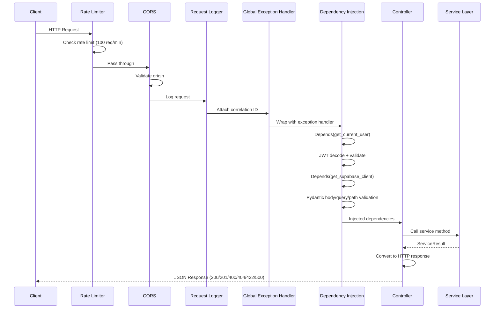
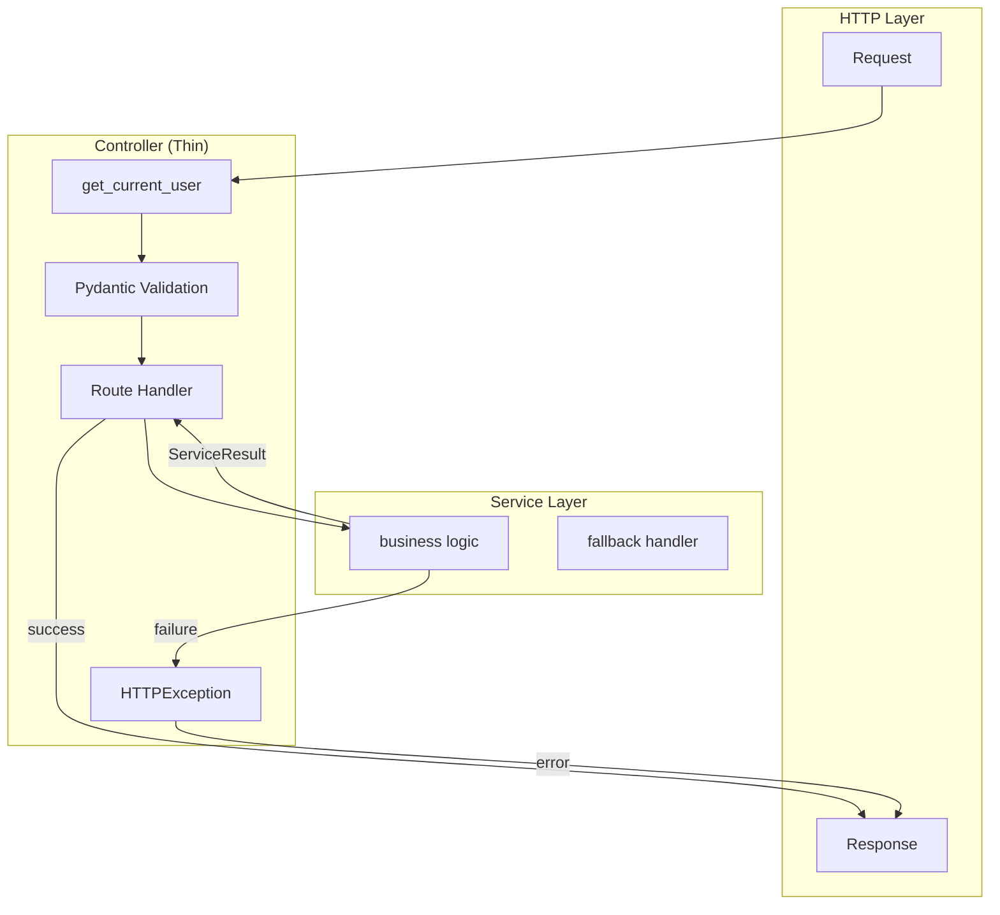
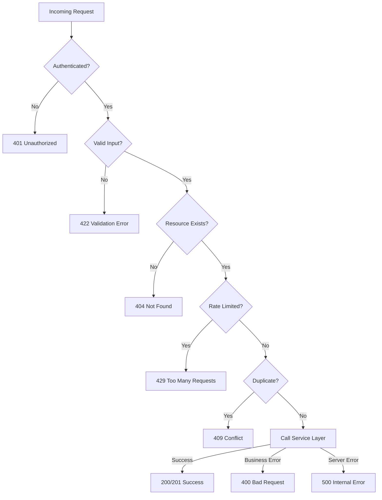

# Controllers Layer Architecture

## Document Control

| Field | Value |
|---|---|
| **Document ID** | ENG-CTL-001 |
| **Version** | 1.0.0 |
| **Status** | Approved |
| **Date** | 2026-07-10 |
| **Classification** | Internal |
| **Owner** | Developer |

---

## 1. Executive Summary

The controller layer is the outermost boundary of the FastAPI backend, responsible for receiving HTTP requests, delegating to the service layer, and returning HTTP responses. Controllers follow the **thin controller** pattern — they contain no business logic, only request routing, input validation (via Pydantic), authentication checks, and response serialization. This document defines the controller architecture, standard endpoint patterns, error handling conventions, and testing strategy across all 31+ route modules.

---

## 2. Purpose

Define a consistent, predictable controller layer that enforces separation of concerns, standardizes request/response handling, and enables comprehensive API testing without duplicating business logic.

---

## 3. Scope

This document covers:
- Controller position in the three-tier architecture
- FastAPI route handler conventions and patterns
- Request pipeline (auth, validation, execution, response)
- Error handling and HTTP status code conventions
- Controller testing with pytest and TestClient
- Middleware integration and request lifecycle
- Controller organization by module and versioning

Out of scope: Service/business logic (see [BusinessLogic.md](BusinessLogic.md)), data access (see [Repositories.md](Repositories.md)), API conventions (see [REST.md](REST.md)).

---

## 4. Business Context

Second Brain OS serves 31+ API routers under `/api/v1/` covering CRUD operations for 15 functional modules, 7 automation endpoints, 11 AI agent modules (with 8 skill sub-agents), and supporting infrastructure (auth, monitoring, feedback, feature flags). Each controller must handle authentication, authorization (user_id scoping), input validation, error translation, and response serialization consistently.

---

## 5. Functional Specification

### 5.1 Thin Controller Pattern

```
┌─────────────┐     ┌─────────────┐     ┌─────────────┐
│  Controller  │────▶│   Service   │────▶│  Repository  │
│  (routing +  │     │  (business  │     │  (data       │
│   validation)│     │   logic)    │     │   access)    │
└─────────────┘     └─────────────┘     └─────────────┘
```

**Controller responsibilities:**
- Parse and validate HTTP request (path, query, body)
- Authenticate user via `Depends(get_current_user)`
- Delegate to service layer
- Translate service results to HTTP responses
- Handle known errors via `HTTPException`

**Controller NEVER does:**
- Business rule validation
- Database queries directly
- AI/LLM calls
- Response formatting logic beyond serialization

### 5.2 Controller Module Organization

```
apps/api/app/api/
├── __init__.py              # Router exports
├── tasks.py                 # /api/v1/tasks
├── courses.py               # /api/v1/courses
├── goals.py                 # /api/v1/goals
├── habits.py                # /api/v1/habits
├── sleep.py                 # /api/v1/sleep
├── income.py                # /api/v1/income
├── projects.py              # /api/v1/projects
├── ideas.py                 # /api/v1/ideas
├── resources.py             # /api/v1/resources
├── opportunities.py         # /api/v1/opportunities
├── time.py                  # /api/v1/time
├── chat.py                  # /api/v1/chat
├── automation.py            # /api/v1/automation
├── feedback.py              # /api/v1/feedback
├── monitoring.py            # /api/v1/monitoring
├── nlp.py                   # /api/v1/nlp
├── memory.py                # /api/v1/memory
├── reviews.py               # /api/v1/reviews
├── briefings.py             # /api/v1/briefings
├── prompts.py               # /api/v1/prompts
├── analytics.py             # /api/v1/analytics
├── predictions.py           # /api/v1/predictions
├── notifications.py         # /api/v1/notifications
├── academics.py             # /api/v1/academics
├── videos.py                # /api/v1/videos
├── roadmap.py               # /api/v1/roadmap
├── data_export.py           # /api/v1/data
├── auth.py                  # /api/v1/auth
├── feature_flags.py         # /api/v1/feature-flags
```

---

## 6. Non-Functional Requirements

| Requirement | Target | Measurement |
|---|---|---|
| Controller overhead per request | < 10ms | Timing middleware |
| Error response generation | < 5ms | Error handler timing |
| Request validation (Pydantic) | < 50ms per model | Model parse timing |
| Controller code coverage | 100% | pytest + TestClient |
| Duplicate code across controllers | < 5% | Code climate / manual audit |

---

## 7. Architecture

### 7.1 Request-Response Lifecycle



### 7.2 Standard Controller Template

```python
from fastapi import APIRouter, Depends, HTTPException, Query
from database.schemas.task import TaskCreate, TaskUpdate, TaskResponse
from config.core.auth import get_current_user
from config.core.supabase import get_supabase_client

router = APIRouter(prefix="/api/v1/tasks", tags=["tasks"])

@router.get("/", response_model=list[TaskResponse])
async def list_tasks(
    current_user=Depends(get_current_user),
    limit: int = Query(20, ge=1, le=100),
    offset: int = Query(0, ge=0),
):
    supabase = get_supabase_client()
    data = (
        supabase.from_("tasks")
        .select("*")
        .eq("user_id", current_user.user.id)
        .range(offset, offset + limit - 1)
        .execute()
    )
    return data.data

@router.post("/", response_model=TaskResponse, status_code=201)
async def create_task(
    task: TaskCreate,
    current_user=Depends(get_current_user),
):
    supabase = get_supabase_client()
    data = task.model_dump()
    data["user_id"] = current_user.user.id
    result = supabase.from_("tasks").insert(data).execute()
    if result.error:
        raise HTTPException(status_code=400, detail=result.error.message)
    return result.data[0]

@router.get("/{item_id}", response_model=TaskResponse)
async def get_task(item_id: str, current_user=Depends(get_current_user)):
    supabase = get_supabase_client()
    data = (
        supabase.from_("tasks")
        .select("*")
        .eq("id", item_id)
        .eq("user_id", current_user.user.id)
        .execute()
    )
    if not data.data:
        raise HTTPException(status_code=404, detail="Task not found")
    return data.data[0]

@router.put("/{item_id}", response_model=TaskResponse)
async def update_task(
    item_id: str,
    update: TaskUpdate,
    current_user=Depends(get_current_user),
):
    supabase = get_supabase_client()
    update_data = {k: v for k, v in update.model_dump().items() if v is not None}
    result = (
        supabase.from_("tasks")
        .update(update_data)
        .eq("id", item_id)
        .eq("user_id", current_user.user.id)
        .execute()
    )
    if result.error:
        raise HTTPException(status_code=400, detail=result.error.message)
    if not result.data:
        raise HTTPException(status_code=404, detail="Task not found")
    return result.data[0]

@router.delete("/{item_id}", status_code=204)
async def delete_task(item_id: str, current_user=Depends(get_current_user)):
    supabase = get_supabase_client()
    result = (
        supabase.from_("tasks")
        .delete()
        .eq("id", item_id)
        .eq("user_id", current_user.user.id)
        .execute()
    )
    if result.error:
        raise HTTPException(status_code=400, detail=result.error.message)
```

---

## 8. Diagrams

### 8.1 Controller-Service Communication



### 8.2 Controller Error Decision Tree



---

## 9. Data Models

Controllers use Pydantic models defined in `packages/database/schemas/`:

| Model Suffix | Purpose | Validation |
|---|---|---|
| `{Entity}Create` | POST request body | Required + optional fields, length limits, defaults |
| `{Entity}Update` | PUT request body | All fields optional, partial update support |
| `{Entity}Response` | Response body | All fields, computed timestamps, read-only fields |

---

## 10. APIs

### 10.1 Standard CRUD Endpoint Matrix

| Method | Path | Status Code | Description |
|---|---|---|---|
| `GET` | `/api/v1/{resource}` | 200 | List resources (paginated) |
| `POST` | `/api/v1/{resource}` | 201 | Create resource |
| `GET` | `/api/v1/{resource}/{id}` | 200 | Get single resource |
| `PUT` | `/api/v1/{resource}/{id}` | 200 | Update resource |
| `DELETE` | `/api/v1/{resource}/{id}` | 204 | Delete resource |

### 10.2 Special Endpoints

| Method | Path | Status Code | Description |
|---|---|---|---|
| `POST` | `/api/v1/tasks/{id}/complete` | 200 | Complete a task |
| `POST` | `/api/v1/time/stop` | 200 | Stop running timer |
| `POST` | `/api/v1/chat` | 200 | Send message to ARIA |
| `POST` | `/api/v1/automation/trigger/{job}` | 200 | Manually trigger cron job |

---

## 11. Security

| Concern | Implementation |
|---|---|
| Authentication | `Depends(get_current_user)` on every endpoint |
| Authorization | Every query filtered by `user_id` |
| Input validation | Pydantic models reject malformed input |
| Rate limiting | Middleware enforces 100 req/min per IP |
| CORS | Whitelist origins in middleware config |
| Error leakage | Global handler returns sanitized 500s |
| IDOR prevention | Resource ID always paired with user_id filter |

---

## 12. Performance Targets

| Metric | Target |
|---|---|
| Controller overhead (no service call) | < 10ms |
| Pydantic model parse (simple) | < 5ms |
| Pydantic model parse (complex) | < 50ms |
| Error response generation | < 5ms |
| TestClient request roundtrip | < 100ms (mocked) |

---

## 13. Edge Cases

| Edge Case | Handling |
|---|---|
| Missing auth token | 401 with `WWW-Authenticate` header |
| Invalid UUID in path | 422 from Pydantic path validation |
| Empty request body on POST | 422 from Pydantic model validation |
| Extra fields in request body | Pydantic ignores by default (configurable) |
| Concurrent update conflict | Last-write-wins (Supabase default); future: optimistic locking |
| Large query payloads | Query params capped at 100 limit, 1000 chars for search |
| Unicode/special chars in input | Pydantic handles UTF-8; XSS sanitizer applies |

---

## 14. Failure Scenarios

| Scenario | Impact | Recovery |
|---|---|---|
| Supabase connection failure | 500 response | Retry with backoff; circuit breaker |
| JWT decode failure | 401 response | Client re-authenticates |
| Service layer timeout | 504 response | Timeout middleware (30s default) |
| Rate limit exceeded | 429 response | Client waits and retries |
| Pydantic validation crash | 422 response | Client fixes input |
| Unhandled exception | 500 with error_id | Logged; client retries |

---

## 15. Risks & Mitigations

| Risk | Likelihood | Impact | Mitigation |
|---|---|---|---|
| Controllers become fat | Medium | High | Enforce thin controller via code review; service layer for all logic |
| Inconsistent error responses | Medium | Medium | Standard HTTPException pattern; error handler in main.py |
| Missing auth on new endpoints | Low | Critical | CI check: every non-health endpoint has Depends(auth) |
| Pydantic schema duplication | Medium | Low | Reuse schemas; compose via inheritance |
| Endpoint drift from OpenAPI | Low | Medium | Auto-generated from code; tests validate response shapes |

---

## 16. Acceptance Criteria

- [ ] Every endpoint is behind `Depends(get_current_user)` (except health)
- [ ] Every query filters by `user_id`
- [ ] Every POST returns 201 with location header
- [ ] Every DELETE returns 204 with no body
- [ ] Every endpoint has a corresponding pytest test
- [ ] List endpoints support `limit` and `offset` pagination
- [ ] Error responses follow `{detail, error_code, request_id, timestamp}` format
- [ ] Controller files import schemas from `database/schemas/` (no inline models)

---

## 17. Traceability

| Requirement ID | Source | Implementation |
|---|---|---|
| CTL-01 | ADR-001 (API versioning) | `/api/v1/` prefix on all routers |
| CTL-02 | SEC-001 (Auth) | `Depends(get_current_user)` on all routes |
| CTL-03 | SEC-002 (User isolation) | `user_id` filter on all queries |
| CTL-04 | ARCH-003 (Thin controllers) | No business logic in route handlers |
| CTL-05 | OBS-001 (Request tracing) | Correlation ID middleware |

---

## 18. Implementation Notes

1. Use `response_model` for automatic response serialization and OpenAPI schema generation
2. Use `status_code` parameter for non-200 responses (201 for POST, 204 for DELETE)
3. Never import service layer directly in controllers — prefer Depends injection
4. All controllers are registered in `apps/api/main.py` via `app.include_router()`
5. Router tags map to OpenAPI section grouping
6. Use `Depends()` for reusable dependencies, not `Depends` as a decorator
7. Keep controller functions under 30 lines — delegate complex flows to services

---

## 19. Testing Strategy

| Test Type | Coverage | Tools |
|---|---|---|
| Unit (controller) | Every endpoint, every status code | `pytest` + `TestClient` |
| Auth tests | Valid token, expired token, missing token | Mock `get_current_user` |
| Validation tests | Invalid input → 422 for every schema | Parametrized test cases |
| Error tests | 400, 404, 409, 429 for each endpoint | Mock service failures |
| Response shape tests | Response matches Pydantic schema | `response_model` validation |

### Controller Test Example

```python
from fastapi.testclient import TestClient
from main import app

client = TestClient(app)

def test_list_tasks_requires_auth():
    response = client.get("/api/v1/tasks/")
    assert response.status_code == 401

def test_create_task_validates_input():
    response = client.post(
        "/api/v1/tasks/",
        json={"title": ""},
        headers={"Authorization": f"Bearer {valid_token}"},
    )
    assert response.status_code == 422
    assert "title" in str(response.json()["detail"])
```

---

## 20. References

| Reference | Document |
|---|---|
| REST Conventions | [REST.md](REST.md) |
| Business Logic Layer | [BusinessLogic.md](BusinessLogic.md) |
| Repository Layer | [Repositories.md](Repositories.md) |
| Validation Architecture | [Validation.md](Validation.md) |
| API Versioning | [Versioning.md](Versioning.md) |
| Error Codes | [ErrorCodes.md](ErrorCodes.md) |
| Rate Limiting | [RateLimiting.md](RateLimiting.md) |

---

## Revision History

| Version | Date | Author | Changes |
|---|---|---|---|
| 1.0.0 | 2026-07-10 | Developer | Initial controller layer architecture documentation |
