# Cron Jobs & Scheduling

---

## Document Control

| Field | Detail |
|---|---|
| **Document ID** | ENG-CRON-001 |
| **Version** | 1.0 |
| **Status** | Draft |
| **Author** | AI Agent System |
| **Date** | 2024-01-01 |
| **Last Reviewed** | 2025-12-15 |
| **Review Cycle** | Quarterly |
| **Approved By** | — |

---

## 1. Executive Summary

Second Brain OS relies on scheduled background jobs to deliver a proactive, automated user experience. The scheduling system runs 15 cron jobs including daily briefings, opportunity radar scans, habit tracking, sleep reminders, course nudges, missed task reconciliation, weekly reviews, skill intelligence refresh, memory consolidation, deadline alerts, health checks, and more — all executing reliably without user intervention.

Currently, all cron jobs run via **APScheduler's `AsyncIOScheduler`** inside the `services/scheduler/main.py` service. Jobs are defined in-process with Python `asyncio` coroutines. The scheduler connects to **Supabase** for job state persistence and publishes results back via direct API calls to the FastAPI backend or Supabase database writes.

This document catalogs all scheduled jobs, describes the scheduler architecture, defines job lifecycle and error handling policies, covers monitoring, and outlines the migration path to distributed scheduling.

---

## 2. Current State

### 2.1 Scheduler Runtime

| Property | Value |
|---|---|
| **Library** | APScheduler 3.10+ |
| **Scheduler Type** | `AsyncIOScheduler` |
| **Host** | Railway worker process (`services/scheduler/main.py`) |
| **Concurrency** | Single process, single thread, asyncio event loop |
| **Job Store** | In-memory (default) — no persistence across restarts |
| **Executor** | `AsyncIOExecutor` — all jobs run as coroutines |
| **Trigger Store** | Cron-style expressions via `CronTrigger` |

### 2.2 Scheduler Process (services/scheduler/main.py)

```python
# psuedocode — actual implementation
from apscheduler.schedulers.asyncio import AsyncIOScheduler
from apscheduler.triggers.cron import CronTrigger

scheduler = AsyncIOScheduler()

scheduler.add_job(
    generate_briefing,
    CronTrigger(hour=7, minute=0, timezone="Asia/Kolkata"),
    id="morning_briefing",
    max_instances=1,
    coalesce=True,
)
```

The scheduler starts in the FastAPI `lifespan` context:

```python
@asynccontextmanager
async def lifespan(app: FastAPI):
    scheduler.start()
    yield
    scheduler.shutdown(wait=True)
```

### 2.3 Limitations

| Limitation | Impact |
|---|---|
| In-memory job store | Jobs lost on process restart; no failover |
| Single-process | No horizontal scaling; process crash = all jobs down |
| No distributed locking | Duplicate execution risk if multiple replicas run |
| No persistent job audit | Execution history only in application logs |
| No priority queue | All jobs equal — no way to preempt low-priority work |

---

## 3. Cron Job Schedule — 24-Hour Timeline

```mermaid
%%{
  init: {
    'theme': 'base',
    'themeVariables': {
      'background': '#0A0B0F',
      'primaryColor': '#6366F1',
      'secondaryColor': '#818CF8',
      'tertiaryColor': '#13151A',
      'primaryTextColor': '#F1F5F9',
      'lineColor': '#6366F1',
      'primaryBorderColor': '#6366F1',
      'secondaryBorderColor': '#818CF8',
      'tertiaryBorderColor': '#00FFA3',
      'cScale0': '#6366F1',
      'cScale1': '#818CF8',
      'cScale2': '#00FFA3',
      'cScale3': '#6366F1',
      'cScale4': '#818CF8',
      'cScale5': '#00FFA3'
    }
  }
}%%
gantt
    title Cron Job Schedule — 24-Hour Timeline (IST)
    dateFormat HH:mm
    axisFormat %H:%M

    section High Priority
    Opportunity Radar       :crit, radar_scan, 06:00, 2m
    Daily Briefing          :crit, morning_briefing, 07:00, 1m
    Skill Intel Refresh     :crit, skill_intel, 05:00, 2m
    Deadline Alert (hourly) :crit, deadline_alert, 01:00, 1m

    section Medium Priority
    Missed Tasks Review     :missed_tasks_review, 00:00, 1m
    Habits Reminder         :habits_check, 20:00, 1m
    Weekly Review (Sun)     :weekly_review, 20:00, 3m
    Course Nudge            :course_nudge, 18:00, 1m
    Skill Analytics Snapshot :skill_analytics, 23:30, 1m

    section Low Priority
    Sleep Log Check         :sleep_analysis, 22:30, 1m
    Skill Evidence Expiry   :skill_evidence, 03:00, 1m
    Skill MV Refresh        :skill_mv, 04:00, 1m
    Skill Retention Cleanup :skill_retention, 02:30, 1m
    Memory Consolidation    :memory_consolidation, 02:00, 1m

    section Continuous
    Health Check            :health_check, 00:00, 1m
```



## 3. Cron Job Catalog

| Job ID | Name | Schedule (IST) | Cron Expression | Handler | Avg Duration | Priority |
|---|---|---|---|---|---|---|---|
| `morning_briefing` | Daily Briefing | 7:00 AM daily | `0 7 * * *` | `generate_briefing` | ~45s | High |
| `radar_scan` | Opportunity Radar | 6:00 AM daily | `0 6 * * *` | `scan_opportunity_radar` | ~120s | High |
| `skill_intelligence_refresh` | Skill Intelligence Refresh | 5:00 AM daily | `0 5 * * *` | `refresh_skill_intelligence` | ~90s | High |
| `deadline_alert` | Deadline Alert | Every hour | `0 * * * *` | `check_deadline_alerts` | ~20s | High |
| `habits_check` | Habits Reminder | 8:00 PM daily | `0 20 * * *` | `check_habits_completion` | ~15s | Medium |
| `missed_tasks_review` | Missed Tasks | 12:00 AM daily | `0 0 * * *` | `review_missed_tasks` | ~30s | Medium |
| `course_nudge` | Course Progress Nudge | 6:00 PM daily | `0 18 * * *` | `send_course_nudge` | ~20s | Medium |
| `skill_analytics_snapshot` | Skill Analytics Snapshot | 11:30 PM daily | `30 23 * * *` | `snapshot_skill_analytics` | ~45s | Medium |
| `weekly_review` | Weekly Review | Sunday 8:00 PM | `0 20 * * 0` | `generate_weekly_review` | ~180s | Medium |
| `sleep_analysis` | Sleep Log Check | 10:30 PM daily | `30 22 * * *` | `prompt_sleep_log` | ~10s | Low |
| `skill_evidence_expiry` | Skill Evidence Expiry | 3:00 AM daily | `0 3 * * *` | `expire_skill_evidence` | ~30s | Low |
| `skill_mv_refresh` | Skill MV Refresh | 4:00 AM daily | `0 4 * * *` | `refresh_skill_mv` | ~60s | Low |
| `skill_retention_cleanup` | Skill Retention Cleanup | 2:30 AM daily | `30 2 * * *` | `cleanup_skill_retention` | ~20s | Low |
| `memory_consolidation` | Memory Consolidation | Sunday 2:00 AM | `0 2 * * 0` | `consolidate_memory` | ~120s | Low |
| `health_check` | Health Check | Every 5 minutes | `*/5 * * * *` | `run_health_check` | ~5s | Low |

### 3.1 Job Dependency Graph

```
                 ┌────────────────┐
                 │  radar_scan    │ (6:00 AM)
                 │  (opportunity  │
                 │   radar)       │
                 └───────┬────────┘
                         │ feeds into
                         ▼
┌────────────────┐──────────────────────┐
│ morning_briefing│─── results included │
│ (7:00 AM)      │ in briefing         │
└────────┬───────┘                      │
         │ includes                     │
         │ task summary                 │
         ▼                              │
┌────────────────┐                      │
│ missed_tasks   │ (midnight, previous) │
│ _review        │──────────────────────┘
└────────────────┘
┌────────────────┐     ┌─────────────────┐
│ habits_check   │────▶│ weekly_review   │
│ (8:00 PM)      │     │ (Sun 8:00 PM)   │
└────────────────┘     └─────────────────┘
┌────────────────┐
│ sleep_analysis │ (10:30 PM)
│               │
└────────────────┘
```

---

## 4. Scheduler Architecture

```
┌─────────────────────────────────────────────────────────────┐
│                    AsyncIOScheduler                          │
│                                                              │
│  ┌──────────┐   ┌──────────┐   ┌──────────┐   ┌──────────┐ │
│  │  Job     │──▶│ Trigger  │──▶│Executor  │──▶│  Job     │ │
│  │  Store   │   │  Store   │   │(asyncio) │   │ Instance │ │
│  └──────────┘   └──────────┘   └──────────┘   └──────────┘ │
│       │                                                      │
│       ▼                                                      │
│  ┌──────────┐                                                │
│  │  Event   │                                                │
│  │  Bus     │                                                │
│  └──────────┘                                                │
└─────────────────────────────────────────────────────────────┘
          │
          ▼
┌─────────────────────────────────────────────────────────────┐
│                    Infrastructure Layer                       │
│                                                              │
│  ┌──────────┐   ┌──────────┐   ┌──────────┐                 │
│  │Supabase  │   │ FastAPI  │   │  Logger  │                 │
│  │(state)   │   │ (results)│   │(output)  │                 │
│  └──────────┘   └──────────┘   └──────────┘                 │
└─────────────────────────────────────────────────────────────┘
```

### 4.1 Component Descriptions

| Component | Role | Current Implementation |
|---|---|---|
| **Job Store** | Persists job definitions and state | In-memory (alpha); Redis planned |
| **Trigger Store** | Evaluates trigger expressions and fires events | `CronTrigger` for all jobs |
| **Executor** | Runs job callable in configured execution context | `AsyncIOExecutor` — coroutine-based |
| **Job Instance** | Runtime representation of a single job execution | APScheduler `Job` object |
| **Event Bus** | Emits lifecycle events (submitted, running, completed, error) | APScheduler built-in events |

### 4.2 Trigger Types

| Trigger | Used For | Format |
|---|---|---|
| `CronTrigger` | Scheduled jobs | `CronTrigger(hour=7, minute=0, timezone="Asia/Kolkata")` |
| `IntervalTrigger` | Future heartbeat / health checks | `IntervalTrigger(minutes=5)` |
| `DateTrigger` | One-off future tasks | `DateTrigger(run_date=datetime(...))` |

---

## 5. Job Definitions

### 5.1 Morning Briefing (`morning_briefing`)

| Property | Value |
|---|---|
| **Handler** | `services/scheduler/handlers/briefing.py::generate_briefing` |
| **Trigger** | `0 7 * * *` (daily 7:00 AM IST) |
| **Timeout** | 120 seconds |
| **Max Instances** | 1 |
| **Coalesce** | True (missed runs skipped, only latest executed) |
| **Retry Policy** | 2 retries, 30s backoff, dead letter after 3 failures |
| **Misfire Grace Time** | 300 seconds |
| **Input** | None (pulls from DB) |
| **Output** | Inserts row into `briefings` table, sends push notification |

**Handler pseudocode:**

```python
async def generate_briefing():
    user = await supabase.from_("users").select("*").single().execute()
    tasks = await supabase.from_("tasks").select("*")\
        .eq("user_id", user.id).eq("status", "pending").execute()
    events = await get_calendar_events(user.id)
    radar = await get_latest_radar_results(user.id)
    weather = await fetch_weather(user.preferences.location)

    prompt = build_briefing_prompt(user, tasks, events, radar, weather)
    briefing = await ai_client.generate(prompt)

    await supabase.from_("briefings").insert({
        "user_id": user.id, "content": briefing,
        "date": date.today().isoformat()
    }).execute()
    await send_push(user.id, "briefing_ready", {"title": "Your briefing is ready"})
```

### 5.2 Opportunity Radar Scan (`radar_scan`)

| Property | Value |
|---|---|
| **Handler** | `services/scheduler/handlers/radar.py::scan_opportunity_radar` |
| **Trigger** | `0 6 * * *` (daily 6:00 AM IST) |
| **Timeout** | 300 seconds |
| **Max Instances** | 1 |
| **Coalesce** | True |
| **Retry Policy** | 2 retries, 60s backoff |
| **Misfire Grace Time** | 600 seconds |
| **Input** | None |
| **Output** | Inserts rows into `opportunities` table |

### 5.3 Habits Check (`habits_check`)

| Property | Value |
|---|---|
| **Handler** | `services/scheduler/handlers/habits.py::check_habits_completion` |
| **Trigger** | `0 20 * * *` (daily 8:00 PM IST) |
| **Timeout** | 30 seconds |
| **Max Instances** | 1 |
| **Coalesce** | True |
| **Retry Policy** | 1 retry, 15s backoff |
| **Misfire Grace Time** | 300 seconds |
| **Input** | None |
| **Output** | Push notification for incomplete habits |

### 5.4 Missed Tasks Review (`missed_tasks_review`)

| Property | Value |
|---|---|
| **Handler** | `services/scheduler/handlers/tasks.py::review_missed_tasks` |
| **Trigger** | `0 0 * * *` (daily midnight IST) |
| **Timeout** | 60 seconds |
| **Max Instances** | 1 |
| **Coalesce** | True |
| **Retry Policy** | 2 retries, 30s backoff |
| **Misfire Grace Time** | 600 seconds |
| **Input** | None |
| **Output** | Updates task statuses, generates reschedule suggestions |

### 5.5 Sleep Log Prompt (`sleep_analysis`)

| Property | Value |
|---|---|
| **Handler** | `services/scheduler/handlers/sleep.py::prompt_sleep_log` |
| **Trigger** | `30 22 * * *` (daily 10:30 PM IST) |
| **Timeout** | 15 seconds |
| **Max Instances** | 1 |
| **Coalesce** | True |
| **Retry Policy** | 1 retry, 10s backoff |
| **Misfire Grace Time** | 300 seconds |
| **Input** | None |
| **Output** | Push notification prompting sleep log entry |

### 5.6 Weekly Review (`weekly_review`)

| Property | Value |
|---|---|
| **Handler** | `services/scheduler/handlers/weekly.py::generate_weekly_review` |
| **Trigger** | `0 20 * * 0` (Sunday 8:00 PM IST) |
| **Timeout** | 300 seconds |
| **Max Instances** | 1 |
| **Coalesce** | True |
| **Retry Policy** | 2 retries, 60s backoff |
| **Misfire Grace Time** | 3600 seconds |
| **Input** | None |
| **Output** | Inserts row into `weekly_reviews` table, sends push notification |

---

## 6. Job Lifecycle

```
  ┌──────────┐
  │ SCHEDULE │  Job registered with APScheduler
  └────┬─────┘
       │
       ▼
  ┌──────────┐
  │  WAITING │  Trigger not yet fired
  └────┬─────┘
       │ (CronTrigger evaluates → time matches)
       ▼
  ┌──────────┐
  │ TRIGGER  │  Event emitted: job is due to run
  └────┬─────┘
       │
       ▼
  ┌──────────┐     ┌──────────────────┐
  │ RUNNING  │────▶│ Executor picks   │
  │          │     │ up → calls       │
  │          │     │ handler function │
  └────┬─────┘     └──────────────────┘
       │
       ├──────────────────────┐
       ▼                      ▼
  ┌──────────┐          ┌──────────┐
  │COMPLETED │          │  FAILED  │
  │          │          │          │
  │ - Log    │          │ - Log    │
  │ - Persist│          │ - Retry? │
  │ - Notify │          │ - DLQ    │
  └──────────┘          └──────────┘
       │                      │
       └──────────────────────┘
              │
              ▼
        ┌──────────┐
        │ WAITING  │  Rescheduled for next trigger time
        └──────────┘
```

### 6.1 Lifecycle Event Logging

| Event | Log Level | Payload |
|---|---|---|
| Job submitted | `INFO` | `{job_id, scheduled_time, trigger_expr}` |
| Job started | `INFO` | `{job_id, start_time}` |
| Job completed | `INFO` | `{job_id, duration_ms, result_metadata}` |
| Job failed | `ERROR` | `{job_id, error_message, attempt_number}` |
| Job retried | `WARN` | `{job_id, retry_number, next_retry_at}` |
| Job misfired | `WARN` | `{job_id, scheduled_time, current_time, grace_seconds}` |
| Job sent to DLQ | `CRITICAL` | `{job_id, attempts, last_error}` |

---

## 7. Error Handling

### 7.1 Retry Policy Configuration

```python
RETRY_POLICY = {
    "morning_briefing":        {"max_retries": 2, "backoff_seconds": 30, "dead_letter": True},
    "radar_scan":              {"max_retries": 2, "backoff_seconds": 60, "dead_letter": True},
    "habits_check":            {"max_retries": 1, "backoff_seconds": 15, "dead_letter": False},
    "missed_tasks_review":     {"max_retries": 2, "backoff_seconds": 30, "dead_letter": True},
    "sleep_analysis":          {"max_retries": 1, "backoff_seconds": 10, "dead_letter": False},
    "weekly_review":           {"max_retries": 2, "backoff_seconds": 60, "dead_letter": True},
    "course_nudge":            {"max_retries": 2, "backoff_seconds": 30, "dead_letter": False},
    "skill_intelligence_refresh":{"max_retries": 2, "backoff_seconds": 60, "dead_letter": True},
    "skill_evidence_expiry":   {"max_retries": 1, "backoff_seconds": 30, "dead_letter": False},
    "skill_analytics_snapshot":{"max_retries": 1, "backoff_seconds": 30, "dead_letter": False},
    "skill_mv_refresh":        {"max_retries": 2, "backoff_seconds": 60, "dead_letter": True},
    "skill_retention_cleanup": {"max_retries": 1, "backoff_seconds": 30, "dead_letter": False},
    "deadline_alert":          {"max_retries": 1, "backoff_seconds": 15, "dead_letter": False},
    "health_check":            {"max_retries": 1, "backoff_seconds": 10, "dead_letter": False},
    "memory_consolidation":    {"max_retries": 2, "backoff_seconds": 60, "dead_letter": True},
}
```

### 7.2 Retry Flow

1. Job execution raises exception
2. Check `attempt_number < max_retries`
3. Sleep `backoff_seconds`
4. Re-invoke handler with same payload
5. If all retries exhausted → push to **Dead Letter Queue** (database table `job_dead_letter`)
6. If DLQ enabled: send `CRITICAL` alert to admin notification channel

### 7.3 Dead Letter Queue Schema

```sql
CREATE TABLE job_dead_letter (
    id            UUID PRIMARY KEY DEFAULT gen_random_uuid(),
    job_id        TEXT NOT NULL,
    handler       TEXT NOT NULL,
    payload       JSONB,
    error         TEXT NOT NULL,
    attempts      INTEGER NOT NULL,
    last_attempt  TIMESTAMPTZ NOT NULL,
    created_at    TIMESTAMPTZ DEFAULT NOW()
);
```

### 7.4 Alerting Thresholds

| Condition | Action |
|---|---|
| Single job failure | Log + retry |
| Job exhausted retries | Dead letter + push alert |
| 3+ failures in 1 hour for same job | Slack/email alert |
| 10+ failures across all jobs in 1 hour | Page on-call |
| Scheduler process crash | Supervisor/PM2 auto-restart |

---

## 8. Monitoring

### 8.1 Metrics Collected

| Metric | Source | Type | Retention |
|---|---|---|---|
| `cron_job_duration_seconds` | Handler wrapper | Histogram | 30 days |
| `cron_job_success_total` | Completion event | Counter | Indefinite |
| `cron_job_failure_total` | Failure event | Counter | Indefinite |
| `cron_job_misfire_total` | Missed window | Counter | Indefinite |
| `cron_job_next_run_time` | APScheduler | Gauge | Current state |
| `cron_job_queue_depth` | APScheduler | Gauge | Current state |

### 8.2 Monitoring Dashboard (planned)

```
┌─────────────────────────────────────────────────┐
│ Cron Jobs Dashboard                             │
├──────────────────────┬──────────────────────────┤
│  Job Health          │  Execution Duration       │
│  ┌────┬────┬────┐   │  ┌────────────────────┐   │
│  │ ✅ │ ❌ │ ⏳ │   │  │    ████░░░░░░      │   │
│  │ 4  │ 0  │ 2  │   │  │  0  30  60  90 120 │   │
│  └────┴────┴────┘   │  └────────────────────┘   │
│                      │                           │
│  Next Runs            │  Failure Rate             │
│  ┌────────────────┐   │  ┌────────────────────┐   │
│  │ Briefing  6:55 │   │  │  ░░░░░░░░░░░░ 0%  │   │
│  │ Radar     5:55 │   │  └────────────────────┘   │
│  │ Habits   19:55 │   │                           │
│  └────────────────┘   │                           │
└──────────────────────┴──────────────────────────┘
```

### 8.3 Log Format

All cron job logs follow a structured JSON schema:

```json
{
  "timestamp": "2024-01-01T07:00:01.000Z",
  "level": "INFO",
  "service": "scheduler",
  "job_id": "morning_briefing",
  "event": "completed",
  "duration_ms": 45200,
  "result": {"briefing_id": "abc123", "tasks_count": 5},
  "error": null
}
```

---

## 9. Manual Triggers

Jobs can be triggered on-demand via HTTP API endpoints when a user requests immediate execution (e.g., "generate my briefing now").

### 9.1 API Endpoints

| Method | Endpoint | Job | Auth |
|---|---|---|---|
| `POST` | `/api/automation/trigger/briefing` | `morning_briefing` | Required |
| `POST` | `/api/automation/trigger/radar` | `radar_scan` | Required |
| `POST` | `/api/automation/trigger/habits` | `habits_check` | Required |
| `POST` | `/api/automation/trigger/missed-tasks` | `missed_tasks_review` | Required |
| `POST` | `/api/automation/trigger/sleep-prompt` | `sleep_analysis` | Required |
| `POST` | `/api/automation/trigger/weekly-review` | `weekly_review` | Required |

### 9.2 Endpoint Implementation

```python
@app.post("/api/automation/trigger/{job_name}")
async def trigger_job(
    job_name: str,
    background_tasks: BackgroundTasks,
    current_user: User = Depends(get_current_user),
):
    handler = JOB_REGISTRY.get(job_name)
    if not handler:
        raise HTTPException(404, f"Job '{job_name}' not found")

    background_tasks.add_task(handler, manual_trigger=True, user_id=current_user.id)
    return {"status": "triggered", "job": job_name}
```

### 9.3 Behavior Differences

| Aspect | Scheduled Execution | Manual Trigger |
|---|---|---|
| Context | Runs for all users | Runs for single user |
| Logging | Standard | Includes `manual_trigger: true` |
| Rate Limit | N/A | Max 1 trigger per 5 minutes per endpoint |
| Output | Database insert + push | Direct HTTP response |

---

## 10. Distributed Scheduling

### 10.1 Migration Motivations

| Motivation | Detail |
|---|---|
| **High Availability** | Eliminate single point of failure |
| **Horizontal Scaling** | Multiple scheduler workers |
| **Persistence** | Survive restarts without losing jobs |
| **Centralized Audit** | All execution history in one store |
| **Priority Queuing** | High-priority jobs never starved |

### 10.2 Target Architecture: APScheduler + Redis

```
┌─────────────┐  ┌─────────────┐  ┌─────────────┐
│ Scheduler   │  │ Scheduler   │  │ Scheduler   │
│ Worker 1    │  │ Worker 2    │  │ Worker 3    │
└──────┬──────┘  └──────┬──────┘  └──────┬──────┘
       │                │                │
       └────────────────┼────────────────┘
                        │
               ┌────────▼────────┐
               │     Redis       │
               │  Job Store      │
               │  + Locking      │
               └─────────────────┘
                        │
               ┌────────▼────────┐
               │   Supabase      │
               │  (Results)      │
               └─────────────────┘
```

### 10.3 Configuration Change

```python
# Current (in-memory)
scheduler = AsyncIOScheduler()

# Distributed (Redis)
from apscheduler.jobstores.redis import RedisJobStore

jobstore = RedisJobStore(
    host="localhost",
    port=6379,
    db=0,
    jobs_key="scheduler.jobs",
    run_times_key="scheduler.run_times",
)

scheduler = AsyncIOScheduler(jobstores={"default": jobstore})
```

### 10.4 Celery Beat Alternative

For a full production system, **Celery Beat** (scheduler) + **Celery Workers** (executors) provides:

| Feature | APScheduler | Celery Beat + Celery |
|---|---|---|
| Distributed execution | With Redis job store | Native |
| Task result backend | Manual | Redis/RabbitMQ + result store |
| Rate limiting | Manual | Native |
| Task routing | Manual | Native (queues) |
| Monitoring | Custom | Flower, Prometheus |
| Complexity | Low | Medium |

### 10.5 Migration Plan

| Phase | Timeline | Scope |
|---|---|---|
| Phase 1 | Current | Single-process APScheduler with in-memory store |
| Phase 2 | Next sprint | Redis job store for persistence, still single process |
| Phase 3 | Next quarter | Multiple scheduler workers with Redis locking |
| Phase 4 | Future | Evaluate Celery Beat for full distributed scheduling |

---

## 11. Appendices

### Appendix A: Cron Expression Reference

```
┌───────── minute (0 - 59)
│ ┌───────── hour (0 - 23)
│ │ ┌───────── day of month (1 - 31)
│ │ │ ┌───────── month (1 - 12)
│ │ │ │ ┌───────── day of week (0 - 6) (Sunday=0)
│ │ │ │ │
* * * * * command
```

| Expression | Meaning |
|---|---|---|
| `0 7 * * *` | Every day at 7:00 AM |
| `0 6 * * *` | Every day at 6:00 AM |
| `0 5 * * *` | Every day at 5:00 AM |
| `0 20 * * *` | Every day at 8:00 PM |
| `0 18 * * *` | Every day at 6:00 PM |
| `0 0 * * *` | Every day at midnight |
| `30 22 * * *` | Every day at 10:30 PM |
| `30 23 * * *` | Every day at 11:30 PM |
| `0 3 * * *` | Every day at 3:00 AM |
| `0 4 * * *` | Every day at 4:00 AM |
| `30 2 * * *` | Every day at 2:30 AM |
| `0 2 * * 0` | Every Sunday at 2:00 AM |
| `0 20 * * 0` | Every Sunday at 8:00 PM |
| `0 * * * *` | Every hour |
| `*/5 * * * *` | Every 5 minutes |

### Appendix B: Full Job Configuration (Python)

```python
JOB_REGISTRY: dict[str, dict] = {
    "morning_briefing": {
        "handler": "services.scheduler.handlers.briefing.generate_briefing",
        "trigger": CronTrigger(hour=7, minute=0, timezone="Asia/Kolkata"),
        "timeout": 120,
        "max_instances": 1,
        "coalesce": True,
        "misfire_grace_time": 300,
        "retry_policy": {"max_retries": 2, "backoff_seconds": 30, "dead_letter": True},
    },
    "radar_scan": {
        "handler": "services.scheduler.handlers.radar.scan_opportunity_radar",
        "trigger": CronTrigger(hour=6, minute=0, timezone="Asia/Kolkata"),
        "timeout": 300,
        "max_instances": 1,
        "coalesce": True,
        "misfire_grace_time": 600,
        "retry_policy": {"max_retries": 2, "backoff_seconds": 60, "dead_letter": True},
    },
    "habits_check": {
        "handler": "services.scheduler.handlers.habits.check_habits_completion",
        "trigger": CronTrigger(hour=20, minute=0, timezone="Asia/Kolkata"),
        "timeout": 30,
        "max_instances": 1,
        "coalesce": True,
        "misfire_grace_time": 300,
        "retry_policy": {"max_retries": 1, "backoff_seconds": 15, "dead_letter": False},
    },
    "missed_tasks_review": {
        "handler": "services.scheduler.handlers.tasks.review_missed_tasks",
        "trigger": CronTrigger(hour=0, minute=0, timezone="Asia/Kolkata"),
        "timeout": 60,
        "max_instances": 1,
        "coalesce": True,
        "misfire_grace_time": 600,
        "retry_policy": {"max_retries": 2, "backoff_seconds": 30, "dead_letter": True},
    },
    "sleep_analysis": {
        "handler": "services.scheduler.handlers.sleep.prompt_sleep_log",
        "trigger": CronTrigger(hour=22, minute=30, timezone="Asia/Kolkata"),
        "timeout": 15,
        "max_instances": 1,
        "coalesce": True,
        "misfire_grace_time": 300,
        "retry_policy": {"max_retries": 1, "backoff_seconds": 10, "dead_letter": False},
    },
    "weekly_review": {
        "handler": "services.scheduler.handlers.weekly.generate_weekly_review",
        "trigger": CronTrigger(hour=20, minute=0, day_of_week="sun", timezone="Asia/Kolkata"),
        "timeout": 300,
        "max_instances": 1,
        "coalesce": True,
        "misfire_grace_time": 3600,
        "retry_policy": {"max_retries": 2, "backoff_seconds": 60, "dead_letter": True},
    },
    "course_nudge": {
        "handler": "services.scheduler.handlers.nudge.send_course_nudge",
        "trigger": CronTrigger(hour=18, minute=0, timezone="Asia/Kolkata"),
        "timeout": 60,
        "max_instances": 1,
        "coalesce": True,
        "misfire_grace_time": 300,
        "retry_policy": {"max_retries": 2, "backoff_seconds": 30, "dead_letter": False},
    },
    "skill_intelligence_refresh": {
        "handler": "services.scheduler.handlers.skills.refresh_skill_intelligence",
        "trigger": CronTrigger(hour=5, minute=0, timezone="Asia/Kolkata"),
        "timeout": 180,
        "max_instances": 1,
        "coalesce": True,
        "misfire_grace_time": 600,
        "retry_policy": {"max_retries": 2, "backoff_seconds": 60, "dead_letter": True},
    },
    "skill_evidence_expiry": {
        "handler": "services.scheduler.handlers.skills.expire_skill_evidence",
        "trigger": CronTrigger(hour=3, minute=0, timezone="Asia/Kolkata"),
        "timeout": 60,
        "max_instances": 1,
        "coalesce": True,
        "misfire_grace_time": 300,
        "retry_policy": {"max_retries": 1, "backoff_seconds": 30, "dead_letter": False},
    },
    "skill_analytics_snapshot": {
        "handler": "services.scheduler.handlers.skills.snapshot_skill_analytics",
        "trigger": CronTrigger(hour=23, minute=30, timezone="Asia/Kolkata"),
        "timeout": 90,
        "max_instances": 1,
        "coalesce": True,
        "misfire_grace_time": 300,
        "retry_policy": {"max_retries": 1, "backoff_seconds": 30, "dead_letter": False},
    },
    "skill_mv_refresh": {
        "handler": "services.scheduler.handlers.skills.refresh_skill_mv",
        "trigger": CronTrigger(hour=4, minute=0, timezone="Asia/Kolkata"),
        "timeout": 120,
        "max_instances": 1,
        "coalesce": True,
        "misfire_grace_time": 600,
        "retry_policy": {"max_retries": 2, "backoff_seconds": 60, "dead_letter": True},
    },
    "skill_retention_cleanup": {
        "handler": "services.scheduler.handlers.skills.cleanup_skill_retention",
        "trigger": CronTrigger(hour=2, minute=30, timezone="Asia/Kolkata"),
        "timeout": 60,
        "max_instances": 1,
        "coalesce": True,
        "misfire_grace_time": 300,
        "retry_policy": {"max_retries": 1, "backoff_seconds": 30, "dead_letter": False},
    },
    "deadline_alert": {
        "handler": "services.scheduler.handlers.tasks.check_deadline_alerts",
        "trigger": CronTrigger(hour="*", minute=0, timezone="Asia/Kolkata"),
        "timeout": 60,
        "max_instances": 1,
        "coalesce": True,
        "misfire_grace_time": 120,
        "retry_policy": {"max_retries": 1, "backoff_seconds": 15, "dead_letter": False},
    },
    "health_check": {
        "handler": "services.scheduler.handlers.health.run_health_check",
        "trigger": CronTrigger(minute="*/5", timezone="Asia/Kolkata"),
        "timeout": 15,
        "max_instances": 1,
        "coalesce": True,
        "misfire_grace_time": 30,
        "retry_policy": {"max_retries": 1, "backoff_seconds": 10, "dead_letter": False},
    },
    "memory_consolidation": {
        "handler": "services.scheduler.handlers.memory.consolidate_memory",
        "trigger": CronTrigger(hour=2, minute=0, day_of_week="sun", timezone="Asia/Kolkata"),
        "timeout": 300,
        "max_instances": 1,
        "coalesce": True,
        "misfire_grace_time": 1800,
        "retry_policy": {"max_retries": 2, "backoff_seconds": 60, "dead_letter": True},
    },
}
```

### Appendix C: Revision History

| Version | Date | Author | Changes |
|---|---|---|---|
| 1.0 | 2025-12-15 | AI Agent System | Initial draft |
| — | — | — | — |
| — | — | — | — |
